# CLAMP-ViT 모듈 통합 가이드 (S-PyTorch)

> 1차 요약: [`../CLAMP-ViT.md`](../CLAMP-ViT.md) — 본 문서는 그 요약을 모듈 단위로 심화한 통합 가이드다.
> 분석 대상: `\\wsl.localhost\ubuntu-24.04\home\user\project\PRJXR-HBTXR\REF\ViT-Quantization\CLAMP-ViT`
> 작성 원칙: 실제 소스 Read 후 `파일:라인` 근거 표기. 라인 근거 없는 추론은 "추정", 코드로 확인 불가는 "확인 불가"로 명시.
> 형제 가이드(`REF/Analysis/ViT-Quantization/I-ViT/MODULE_GUIDE.md`)의 6요소 구조를 따르되, HW 지표는 **S-PyTorch 수치 규약**(params/FLOPs·MACs/activation memory/비트폭/observer)으로 표기한다.
> 본 repo 경로(모두 `models/ptq/` 하위 외 `models/`)에서 라인 인용은 파일명만 표기(예: `layers.py:158`은 `models/ptq/layers.py`, `vit_quant.py:106`은 `models/vit_quant.py`).

---

## 0. 문서 머리말

### 0.1 가장 중요한 발견 (먼저)

**이 공개 저장소는 "평가(evaluation) 전용"이며, 논문 제목이 내세운 두 핵심 기여 — ① contrastive data-free 합성샘플 생성, ② evolutionary mixed-precision search — 의 구현 코드는 저장소에 단 한 줄도 없다(미공개).**

- 전수 Grep(`contrastive|InfoNCE|nce_loss|evol|mutation|crossover|population|generate_data|synthe|optimize|search|fitness|mixed.?precision`, 대소문자 무시) 결과, 알고리즘 구현 매치는 **0건**. 매치된 곳은 전부 ① README 논문 제목/출처(`README.md:4,56`), ② argparse 선택지 문자열(`test_clamp_vit.py:27`), ③ LICENSE 정형문(`LICENSE:17` "FITNESS"), ④ FQ-ViT 파생 헤더 주석 + `torch.hub.HASH_REGEX.search`(`utils.py:50`)뿐이다.
- 평가 진입점 `test_clamp_vit.py`는 모델 골격을 만든 뒤 곧바로 폐기하고(`:196`→`:225`), 사전 양자화·MPQ 완료된 체크포인트를 `torch.load`로 통째 덮어쓴다(`test_clamp_vit.py:225`). 즉 비트배분(W4.9/A6.2 등)과 contrastive로 캘리브레이션된 scale은 모두 `quantized/*.pth`에 "구워져(baked-in)" 있다.
- `models/` 전 파일 헤더에 `# Adapted from MEGVII Inc. https://github.com/megvii-research/FQ-ViT/tree/main`가 명시(예: `layers.py:1-2`, `observer/base.py:1-2`, `quantizer/base.py:1-2`, `vit_quant.py:1-2`). → **본 문서가 분석하는 "양자화 엔진"은 FQ-ViT 기반 PTQ 인프라**이고, contrastive/evol 알고리즘은 **코드 부재 → 논문 기준(추정)**으로만 서술한다.

### 0.2 대표 케이스 선정
- **대표 모델: `deit_small_patch16_224` (DeiT-S)** — `embed_dim=384, depth=12, num_heads=6, mlp_ratio=4, patch16, img224`(`vit_quant.py:452-463`). 근거:
  1. `quantized/`에 실제 존재하는 체크포인트는 `deit_tiny.pth, deit_small.pth` 2개뿐(1차 요약 §5 Glob 확인)이고, DeiT-S(W4.7/A5.9)는 README 결과표에서 79.43으로 보고(`README.md:51`).
  2. 토큰 N=197(=14×14+cls), C=384에서 정수 LayerNorm·정수 Softmax 근사 코드가 비자명한 크기로 동작하여 HW 분석 가치가 큼(`num_patches=(224/16)²=196`, `layers_quant.py:194-196`).
- **대표 분석 단위: VisionTransformer 1개 Block** = `QLayerNorm(norm1) → QAct → Attention(QLinear×2 + 2 matmul + QSoftmax) → [residual] → QLayerNorm(norm2) → Mlp(QLinear×2 + GELU) → [residual]`(`vit_quant.py:180-190`). DeiT-S는 12개 적층(`vit_quant.py:280-293`).
- **대표 양자화 연산 3종**: `UniformQuantizer`(`quantizer/uniform.py:9-42`), `Log2Quantizer`(`quantizer/log2.py:8-27`), `PtfObserver`(채널별 2^k, `observer/ptf.py:9-67`) — FPGA 시프트 친화 양자화의 직접 청사진.
- **대표 정수 비선형 2종(코드 존재·실행 경로 비활성)**: `QLayerNorm(mode='int')`(`layers.py:172-202`), `QSoftmax.int_softmax`(`layers.py:234-266`) — 둘 다 코드는 있으나 기본 실행 경로에서 비활성(0.3절·해당 모듈 참조).

### 0.3 S-PyTorch 수치 규약 (HW의 MAC lanes/scalar MACs 대체)
- **params**: 모듈 차원에서 분석적 계산. Linear `in·out (+out bias)`, LayerNorm `2·C`, Conv `Cout·Cin·Kh·Kw (+Cout)`. CLAMP-ViT의 양자화 모듈(`QLinear`/`QConv2d`)은 `nn.Linear`/`nn.Conv2d`를 상속(`layers.py:72,10`)하고 forward마다 weight를 fake-quant하므로(`layers.py:108,67`) **params 개수는 FP 원본과 동일**(추가 학습 파라미터 없음, observer/quantizer는 scale/zero_point 버퍼만 보유).
- **FLOPs/MACs**: 표준식×config. Linear MAC = `B·N·in·out`. Attention QKᵀ = `B·H·N²·dh`, AV = `B·H·N²·dh`(H=heads, dh=head_dim, `vit_quant.py:41,99-110`). 대표 레이어 1개를 DeiT-S(B=1,N=197,C=384,H=6,dh=64)로 산출 후 12 block 환원.
- **activation memory**: 텐서 shape × 비트폭. CLAMP-ViT는 **fake quantization**(quant→dequant로 FP 텐서 복원, `quantizer/base.py:43-46`)이라 실메모리는 FP32지만, **정수 도메인 비트폭**을 "HW 환산 activation bit"로 표기 — `shape × A_bit`.
- **비트폭/observer**: 코드 직접. 기본 **W=int8(대칭), A=uint8(비대칭)**(`config.py:9-10`, `bit_type.py:42-43`). observer 기본 W=minmax / A=`quant_method` 인자(기본 minmax)(`config.py:12-13`). 캘리브레이션 모드 W=channel_wise / A=layer_wise(`config.py:18-19`). 비트 후보군 uint2~uint8 + int8(`bit_type.py:41-49`).
- **정확도/속도**: README 인용. 본 세션 미실행 → 측정 불가 항목은 "확인 불가".

### 0.4 운영 경로 (평가 전용 — 학습/탐색 코드 부재)
```
[Config 생성] Config(quant_method)  (test_clamp_vit.py:195, config.py:4-19)
   │  W=int8/minmax/channel_wise, A=uint8/quant_method/layer_wise
   ▼
[모델 골격 생성] str2model(model)(pretrained=True, cfg)  (test_clamp_vit.py:196)
   │  DeiT: torch.hub deit_*_patch16_224.pth (vit_quant.py:436-443)
   │  ViT : load_weights_from_npz (augreg npz)  (vit_quant.py:518-522)
   │  ※ 이 모델은 곧 폐기됨
   ▼
[ImageNet val 로드] ImageFolder(valdir) — val만, train 불필요(data-free 결과 평가)  (test_clamp_vit.py:214-223)
   ▼
[MPQ 모델 통째 로드] model = torch.load(weight_path)   ★핵심  (test_clamp_vit.py:225)
   │  quantized/{deit_tiny,deit_small}.pth (사전 양자화+비트배분 baked-in)
   ▼
[ImageNet 평가] validate(): top-1/top-5  (test_clamp_vit.py:45-90, 233)

[부재] calibration 토글(model_open_calibrate 등)은 정의돼 있으나(vit_quant.py:367-380) test 경로에서 미호출.
[부재] contrastive 합성샘플 생성 루프 / evolutionary 비트탐색 — 코드 없음(0.1절).
```
- 타깃 디바이스: `--device` 기본 `cuda`(`test_clamp_vit.py:37`). CUDA 하드코딩은 없으나 결정론 설정에 `CUBLAS_WORKSPACE_CONFIG`/`torch.cuda.manual_seed_all`(`test_clamp_vit.py:181-183`).

### 0.5 모델 / 데이터셋 / 정확도 (README 인용)
| Model | 비트(평균) | Top-1 | 코드 재현 가능성 | 근거 |
|---|---|---|---|---|
| **DeiT-T(대표 후보)** | W4.9/A6.2 | 71.69 | 가능(체크포인트 존재) | `README.md:50`, `vit_quant.py:417-444` |
| **DeiT-S(대표)** | W4.7/A5.9 | 79.43 | 가능(체크포인트 존재) | `README.md:51`, `vit_quant.py:447-471` |
| Swin-T | W5.5/A6.9 | 81.78 | **불가**(모델 코드·체크포인트 부재) | `README.md:52` |
| Swin-S | W5.1/A6.3 | 82.86 | **불가**(모델 코드·체크포인트 부재) | `README.md:53` |
- 데이터셋: **ImageNet (ILSVRC 2012) val**, 224×224, 1000 클래스, ImageFolder(`test_clamp_vit.py:214-223`). 전처리: DeiT mean/std=ImageNet·crop_pct 0.875, ViT mean/std=0.5·crop_pct 0.9(`test_clamp_vit.py:200-212`).
- **Swin 확인 불가**: `--model` choices에는 swin_tiny/small/base가 있으나(`test_clamp_vit.py:23`), `str2model`은 deit/vit 5종만 매핑(`test_clamp_vit.py:160-167`)하고 `vit_quant.py.__all__`에도 swin 없음(`:21-24`) → Swin은 **모델 정의 자체가 부재**(확인 불가).
- 속도(latency): 본 repo에 측정 코드 없음 → **확인 불가**.

---

## 1. Repo / Layer 개요

CLAMP-ViT 공개 repo = **FQ-ViT 기반 PTQ 추론 엔진 + 평가 스크립트**(`README.md:56`). ViT/DeiT를 fake-quant로 추론하며, 양자화기(uniform/log2)·관찰자(minmax/ema/omse/percentile/ptf)·정수 LayerNorm/Softmax 인프라를 갖췄다. 논문의 contrastive·evol은 미공개(0.1절).

### 1.1 자체(파생) 소스 vs 외부 vs 제외

| 구분 | 파일 | 역할 |
|---|---|---|
| **평가 엔트리** | `test_clamp_vit.py` | argparse, validate 루프, str2model, MPQ 체크포인트 `torch.load` |
| **전역 설정** | `config.py` | Config: 비트타입/관찰자/양자화기/캘리브레이션 모드 |
| **비트 정의** | `models/ptq/bit_type.py` | BitType(bits/signed) + uint2~uint8/int8 등록 |
| **양자화 레이어** | `models/ptq/layers.py` ★핵심 | QConv2d/QLinear/QAct/QLayerNorm/QSoftmax |
| **양자화기** | `models/ptq/quantizer/{uniform,log2,base,build}.py` | 값→정수 매핑(quant/dequant) |
| **관찰자** | `models/ptq/observer/{minmax,ema,percentile,omse,ptf,base,utils,build}.py` | 캘리브레이션(min/max·scale·zero_point) |
| **모델 정의** | `models/vit_quant.py` | Attention/Block/VisionTransformer + deit_*/vit_* 팩토리 |
| | `models/layers_quant.py` | Mlp, PatchEmbed, HybridEmbed, DropPath, trunc_normal_ |
| **가중치 로더** | `models/utils.py` | load_weights_from_npz(ViT augreg .npz) |

### 1.2 forward 진입점
`VisionTransformer.forward`(`vit_quant.py:410-414`) → `forward_features`(`:382-408`):
`qact_input`(입력 양자화, DeiT만 input_quant=True) → `patch_embed`(QConv2d) → `cls_token` cat → `qact_embed` → `+qact_pos(pos_embed)` → `qact1` → `blocks`(12×Block) → `norm`(QLayerNorm) → cls 추출`[:,0]` → `qact2` → `head`(QLinear) → `act_out`. **Block마다 직전 모듈의 quantizer를 LayerNorm에 체이닝**(`last_quantizer`, `vit_quant.py:400-405`).

### 1.3 제외 (지시에 따라 이름만 표기, 미분석)
- **외부 프레임워크(가중치만 로드)**: DeiT 원본 사전학습 `.pth`(facebookresearch deit, torch.hub `vit_quant.py:437-442,465-470`), ViT augreg `.npz`(Google Brain, `vit_quant.py:519-522`). 코드는 본 repo 정의 사용.
- **제외(이름만)**: `.git/`, 모든 `__pycache__/`, `LICENSE`, `quantized/*.pth`(사전 양자화 체크포인트 — 통째 로드되는 nn.Module).
- **외부 출처(코드 미포함)**: Evol-Q(enyac-group) — evolutionary 탐색의 개념적 원천, README에만 언급(`README.md:56`).

### 1.4 대표 모델 레이어 구성 (DeiT-S)
`forward_features`(`vit_quant.py:382-408`): qact_input(A·uint8) → PatchEmbed(QConv2d 16×16 s16) → +cls/pos(부동소수 합, 정수 정렬 없음) → Block×12 → QLayerNorm(float ln) → head(QLinear). 1 Block(`:180-190`)당 QLinear 4개(qkv, proj, fc1, fc2), QSoftmax 1, QAct 다수(qact1~qact4 + attn 내부 qact1/2/3/attn1), QLayerNorm 2.

---

## 2. 모듈: 비트 정의 — `bit_type.py` (BitType)

### 2.1 역할 + 상위/하위
- **역할**: 정수 양자화의 표현 범위(상·하한, range)를 비트수·부호로 정의. mixed-precision 비트 후보군의 자료구조 기반.
- **상위**: `Config`(`config.py:9-10`), 모든 Q모듈의 `bit_type` 인자(`layers.py:24,81,118`). **하위**: 없음(순수 정수 산술).

### 2.2 데이터플로우
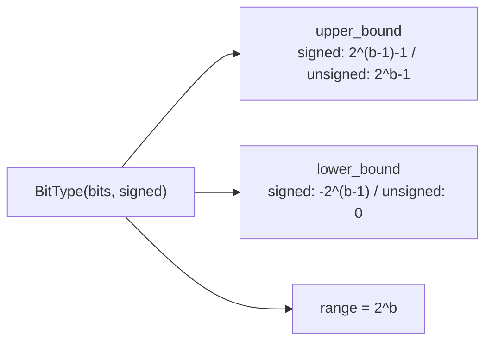

### 2.3 forward call stack
정적 속성. Observer의 `get_quantization_params`가 `qmax=bit_type.upper_bound, qmin=bit_type.lower_bound` 참조(`observer/minmax.py:36-37`), Quantizer의 `quant`가 clamp 경계로 사용(`quantizer/uniform.py:29-30`).

### 2.4 대표 코드 위치
`bit_type.py`: `upper_bound` `:16-21`, `lower_bound` `:22-26`, `range` `:28-30`, `BIT_TYPE_LIST` `:41-49`, `BIT_TYPE_DICT` `:50`.

### 2.5 대표 코드 블록
```python
# bit_type.py:16-26  부호 유무로 정수 표현 범위 결정
@property
def upper_bound(self):
    if not self.signed:  return 2**self.bits - 1        # unsigned: [0, 2^b-1]
    return 2**(self.bits - 1) - 1                        # signed:  [-2^(b-1), 2^(b-1)-1]
@property
def lower_bound(self):
    if not self.signed:  return 0
    return -(2**(self.bits - 1))
```
```python
# bit_type.py:41-49  등록 비트타입 — int8(W) + uint2~uint8(A/저비트 후보)
BIT_TYPE_LIST = [BitType(8,True,'int8'), BitType(8,False,'uint8'),
                 BitType(7,False,'uint7'), ... , BitType(2,False,'uint2')]
```
→ **uint2~uint8**까지 표현 가능 → mixed-precision 비트 후보군의 기반 자료구조. 단, 어떤 레이어에 어떤 비트를 할당하는 **탐색 로직 자체는 부재**(0.1절).

### 2.6 연산·수치표현 분해 + 정량
- **양자화 방식**: 비트 정의만 제공(대칭=signed, 비대칭=unsigned 분기의 근거).
- **비트폭**: W=int8 대칭 `[-128,127]`, A=uint8 비대칭 `[0,255]`(`config.py:9-10`).
- **params/FLOPs**: 0(정적 속성).
- **시사**: signed→대칭(zero_point=0), unsigned→비대칭(zero_point≠0)의 HW 함의가 여기서 갈림(3·5장).

---

## 3. 모듈: 균일 양자화 — `quantizer/uniform.py` (UniformQuantizer) ★핵심

### 3.1 역할 + 상위/하위
- **역할**: 표준 affine 균일 양자화. `q=round(x/s+z)` clamp → `x̂=(q-z)·s`. scale/zero_point를 모듈 타입별 reshape로 broadcast(W 채널별, A 레이어별).
- **상위**: `BaseQuantizer.forward`(quant→dequant, `quantizer/base.py:43-46`), `QLinear/QConv2d/QAct`가 `self.quantizer(weight)` 또는 `self.quantizer(x)` 호출(`layers.py:108,67,146`). **하위**: observer의 `get_quantization_params`(scale/zp 공급), `get_reshape_range`.

### 3.2 데이터플로우 (텐서 shape 흐름)
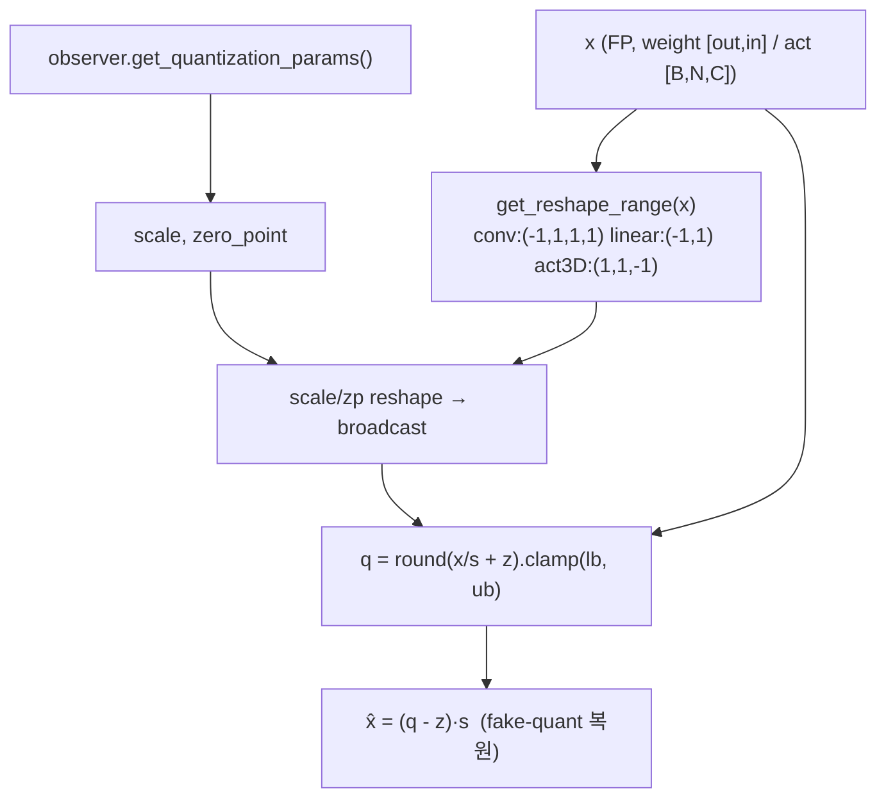

### 3.3 forward call stack
`QLinear.forward`(`layers.py:108`) → `self.quantizer(self.weight)` → `BaseQuantizer.forward`(`quantizer/base.py:43`) → `UniformQuantizer.quant`(`quantizer/uniform.py:20`) → `dequantize`(`:33`). scale/zp는 calibration 단계 `update_quantization_params`(`uniform.py:16-18`)에서 미리 채워짐.

### 3.4 대표 코드 위치
`quantizer/uniform.py`: `update_quantization_params` `:16-18`, `quant` `:20-31`, `dequantize` `:33-42`. `quantizer/base.py`: `get_reshape_range` `:15-32`, `forward`(quant→dequant) `:43-46`.

### 3.5 대표 코드 블록
```python
# quantizer/uniform.py:25-31  양자화 (affine, clamp는 bit_type 경계)
range_shape = self.get_reshape_range(inputs)      # W채널별 / A레이어별 broadcast
scale = scale.reshape(range_shape); zero_point = zero_point.reshape(range_shape)
outputs = inputs / scale + zero_point
outputs = outputs.round().clamp(self.bit_type.lower_bound, self.bit_type.upper_bound)
```
```python
# quantizer/uniform.py:41  역양자화 (fake-quant 복원)
outputs = (inputs - zero_point) * scale
```
```python
# quantizer/base.py:43-46  forward = quant → dequant (실제 정수 텐서를 만들지 않고 FP로 복원)
def forward(self, inputs):
    outputs = self.quant(inputs)
    outputs = self.dequantize(outputs)
    return outputs
```
→ **fake quantization**: 정수 텐서를 그대로 연산에 쓰지 않고 즉시 dequant. 따라서 conv/linear는 FP `F.conv2d/F.linear`로 수행(`layers.py:68,109`)되며 정수 도메인 MAC은 아님(I-ViT의 integer-only와 대비되는 결정적 차이).

### 3.6 연산·수치표현 분해 + 정량
- **양자화 방식**: affine 균일. W=대칭(zp=0), A=비대칭(zp≠0). reshape로 W per-channel(`linear_weight→(-1,1)`, `conv_weight→(-1,1,1,1)`), A per-tensor(`activation 3D→(1,1,-1)`)(`quantizer/base.py:17-29`).
- **scale/zp**: observer 산출(4·5장). `dequantize`는 `(q-z)·s`.
- **비트폭**: bit_type 인자(W int8 / A uint8 기본).
- **params**: 0(scale/zp는 quantizer 속성, 학습 X).
- **FLOPs**: 원소수 N에 div+round+clamp(quant) + sub+mul(dequant) ≈ 5·N op. DeiT-S qkv weight(384×1152=442K) 양자화 = 442K div+round (fake-quant라 forward마다 재계산).
- **시사**: clamp 경계가 bit_type에서 직접 와 mixed-precision 시 레이어별 비트만 바꾸면 동일 코드로 동작(탐색기만 있으면). **dequant `(q-z)·s`가 FPGA에서는 zero_point 가산 + scale 곱 → 비대칭 A는 zp 보정 로직 필요**(대칭 W는 불필요).

---

## 4. 모듈: 로그2 양자화 — `quantizer/log2.py` (Log2Quantizer) ★FPGA 시프트 친화

### 4.1 역할 + 상위/하위
- **역할**: `q=round(-log2(x))` → `x̂=2^(-q)`. 곱셈을 비트 시프트로 환원. softmax 출력처럼 [0,1] long-tail 분포용. 범위 밖 값은 `softmax_mask`로 0 처리.
- **상위**: `str2quantizer['log2']`(`quantizer/build.py:6`)로 빌드 가능. **단 `config.py`는 W/A 모두 uniform 기본**(`config.py:15-16`)이라 log2는 옵션으로만 존재. **하위**: 없음.

### 4.2 데이터플로우
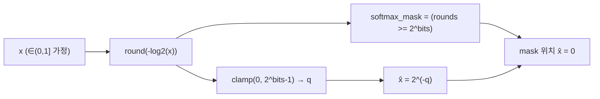

### 4.3 forward call stack
`BaseQuantizer.forward`(`quantizer/base.py:43`) → `Log2Quantizer.quant`(`quantizer/log2.py:18`) → `dequantize`(`:24`). (uniform과 달리 scale/zero_point 미사용 — 순수 로그 표현.)

### 4.4 대표 코드 위치
`quantizer/log2.py`: `quant` `:18-22`, `dequantize` `:24-27`, `softmax_mask` `:20,26`.

### 4.5 대표 코드 블록
```python
# quantizer/log2.py:18-27  로그2 양자화 — 곱셈→시프트
def quant(self, inputs):
    rounds = torch.round(-1 * inputs.log2())              # q = round(-log2(x))
    self.softmax_mask = rounds >= 2**self.bit_type.bits   # 범위초과 마킹
    return torch.clamp(rounds, 0, 2**self.bit_type.bits - 1)
def dequantize(self, inputs):
    outputs = 2**(-1 * inputs)                            # x̂ = 2^(-q)  → 시프트
    outputs[self.softmax_mask] = 0
    return outputs
```
→ `2^(-q)`는 HW에서 **우측 산술시프트 q칸**으로 환원. 어텐션맵 dequant를 곱셈기 없이 구현.

### 4.6 연산·수치표현 분해 + 정량
- **양자화 방식**: 비선형(로그) 양자화. zero_point/scale 없음, 양수 입력 가정.
- **비트폭**: `2^bits` 레벨(`:20-21`). softmax용이면 작은 비트(uint4 등)가 후보(코드상 bit_type 인자 의존).
- **params**: 0.
- **FLOPs**: 원소당 log2+round+clamp(quant), pow(dequant). HW 환산은 dequant가 **시프트 1회**.
- **시사**: **곱셈기-free 비선형 양자화의 직접 후보**. softmax 확률처럼 [0,1] 분포에 적합. 단 본 repo 기본 미사용(uniform)이므로 우리 가속기에 도입하려면 명시 설정 필요.

---

## 5. 모듈: minmax/ema/percentile 관찰자 — `observer/{minmax,ema,percentile}.py`

### 5.1 역할 + 상위/하위
- **역할**: calibration 데이터의 min/max를 누적(`update`)하고, 대칭/비대칭 분기로 scale·zero_point를 산출(`get_quantization_params`). 세 관찰자는 **scale 산출 공식이 동일**, min/max 누적 정책만 다름(minmax=전역 max/min, ema=지수이동평균 σ=0.01, percentile=분위수 클리핑 α=0.99999).
- **상위**: `build_observer`(`observer/build.py:19-21`) → Quantizer가 보유, `update_quantization_params`에서 호출. **하위**: `BaseObserver.reshape_tensor`(`observer/base.py:17-30`), `bit_type` 경계.

### 5.2 데이터플로우 (대칭/비대칭 분기)
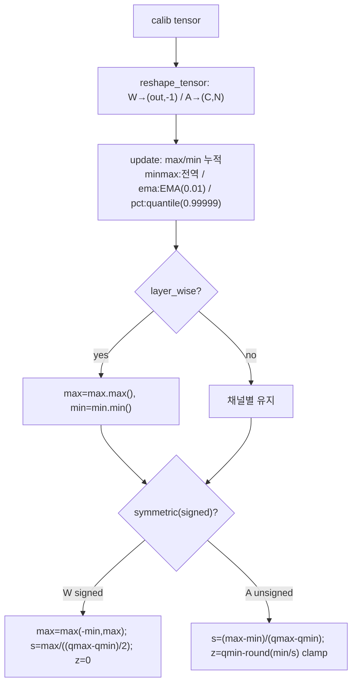

### 5.3 forward call stack
`QAct.forward`(calibrate)(`layers.py:140-143`) → `quantizer.observer.update(x)` → `update_quantization_params(x)`(`uniform.py:16`) → `MinmaxObserver.get_quantization_params`(`observer/minmax.py:32`).

### 5.4 대표 코드 위치
`observer/minmax.py`: `update` `:15-30`, `get_quantization_params` `:32-52`(대칭 `:42-46`, 비대칭 `:47-51`). `observer/ema.py`: EMA 갱신 `:26-33`, scale `:39-59`. `observer/percentile.py`: layer_wise 강제 `:26`, quantile `:29-31`. `observer/base.py`: `reshape_tensor` `:17-30`, `eps` `:15`.

### 5.5 대표 코드 블록
```python
# observer/minmax.py:42-51  대칭(W)/비대칭(A) scale·zero_point
if self.symmetric:                                   # signed weight
    max_val = torch.max(-min_val, max_val)
    scale = max_val / (float(qmax - qmin) / 2)       # zero_point = 0
else:                                                # unsigned activation
    scale = (max_val - min_val) / float(qmax - qmin)
    zero_point = qmin - torch.round(min_val / scale)
    zero_point.clamp_(qmin, qmax)
```
```python
# observer/ema.py:26-27  지수이동평균 갱신 (σ=0.01)
self.max_val = self.max_val + self.ema_sigma * (cur_max - self.max_val)
```
```python
# observer/percentile.py:29-31  분위수 클리핑(outlier 완화), layer_wise 전용(:26 assert)
cur_max = torch.quantile(v.reshape(-1), self.percentile_alpha)        # 0.99999
cur_min = torch.quantile(v.reshape(-1), 1.0 - self.percentile_alpha)
```

### 5.6 연산·수치표현 분해 + 정량
- **양자화 방식**: W per-channel(`reshape_tensor`가 `(out,-1)`, `observer/base.py:21-22`) 대칭, A per-tensor(layer_wise 축약 `minmax.py:28-30`) 비대칭.
- **scale/zp**: 대칭 `s=max(|min|,max)/((qmax-qmin)/2)`, zp=0; 비대칭 `s=(max-min)/(qmax-qmin)`, `zp=qmin-round(min/s)`.
- **비트폭**: bit_type 경계(qmax/qmin)에 직접 의존.
- **params**: 0(max_val/min_val 버퍼).
- **FLOPs**: update reduce O(N); ema는 추가 mul·sub; percentile은 quantile 정렬 비용(`torch.quantile` 또는 np 폴백 `:32-40`).
- **시사**: 세 관찰자가 같은 scale 공식 → HW에서 캘리브레이션 통계 수집기만 교체 가능. **본 repo 기본은 minmax**(`config.py:12`).

---

## 6. 모듈: OMSE 관찰자 — `observer/omse.py` (OmseObserver) ★Lp-norm 최소화

### 6.1 역할 + 상위/하위
- **역할**: min/max를 0~89% 범위로 0.01씩 줄여가며 각 후보 clipping range로 양자화→복원, **Lp(p=2) 손실이 최소인 range를 탐색**(LAPQ arXiv:1911.07190 방식). outlier가 scale을 키우는 문제 완화.
- **상위**: `str2observer['omse']`(`observer/build.py:13`). **하위**: `lp_loss`(`observer/utils.py:3-10`).

### 6.2 데이터플로우
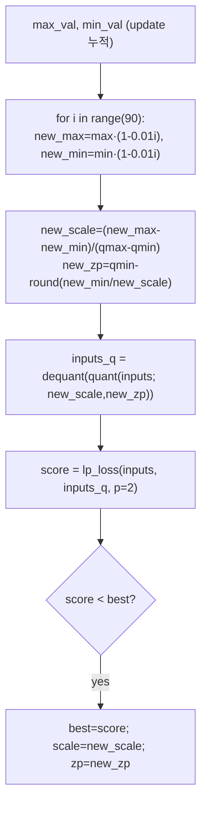

### 6.3 forward call stack
`update_quantization_params(x)`(`uniform.py:16`) → `OmseObserver.get_quantization_params(inputs)`(`observer/omse.py:32`) → 90회 후보 loop(`:39-56`) → `lp_loss`(`observer/utils.py:3`).

### 6.4 대표 코드 위치
`observer/omse.py`: 후보 loop `:39-56`, lp 손실 비교 `:50-56`. `observer/utils.py`: `lp_loss` `:3-10`.

### 6.5 대표 코드 블록
```python
# observer/omse.py:39-51  clipping range 90후보 → Lp(p=2) 최소 탐색 (LAPQ)
for i in range(90):
    new_max = max_val * (1.0 - (i * 0.01)); new_min = min_val * (1.0 - (i * 0.01))
    new_scale = (new_max - new_min) / float(qmax - qmin)
    new_zero_point = (qmin - torch.round(new_min / new_scale)).clamp_(qmin, qmax)
    inputs_q = ((inputs / new_scale + new_zero_point).round().clamp(qmin, qmax)
                - new_zero_point) * new_scale
    score = lp_loss(inputs, inputs_q, p=2.0, reduction='all')   # ||x - x̂||₂
    if score < best_score: best_score = score; scale = new_scale; zero_point = new_zero_point
```

### 6.6 연산·수치표현 분해 + 정량
- **양자화 방식**: 균일 양자화 + clipping range 그리드 탐색(90스텝).
- **비트폭**: bit_type 의존.
- **params**: 0.
- **FLOPs**: 90 × (양자화+복원+Lp) — 캘리브레이션 1회성 비용(추론엔 영향 없음).
- **시사**: outlier 흡수로 정확도↑. HW 무관(오프라인 캘리브레이션). 본 repo 기본 미사용.

---

## 7. 모듈: PTF 관찰자 — `observer/ptf.py` (PtfObserver) ★채널별 2^k, FPGA 1순위

### 7.1 역할 + 상위/하위
- **역할**: FQ-ViT 핵심. LayerNorm 입력처럼 채널 간 분포 분산이 큰 경우, **채널마다 2의 거듭제곱(power-of-two) 배율**을 곱해 채널별 동적범위 차이를 흡수. 공통 베이스 scale1에 채널별 2^k만 곱하므로 정수연산 후 **비트 시프트만으로 채널 재정규화** 가능.
- **상위**: `str2observer['ptf']`(`observer/build.py:15`). **하위**: `lp_loss`(`observer/utils.py:3`).

### 7.2 데이터플로우
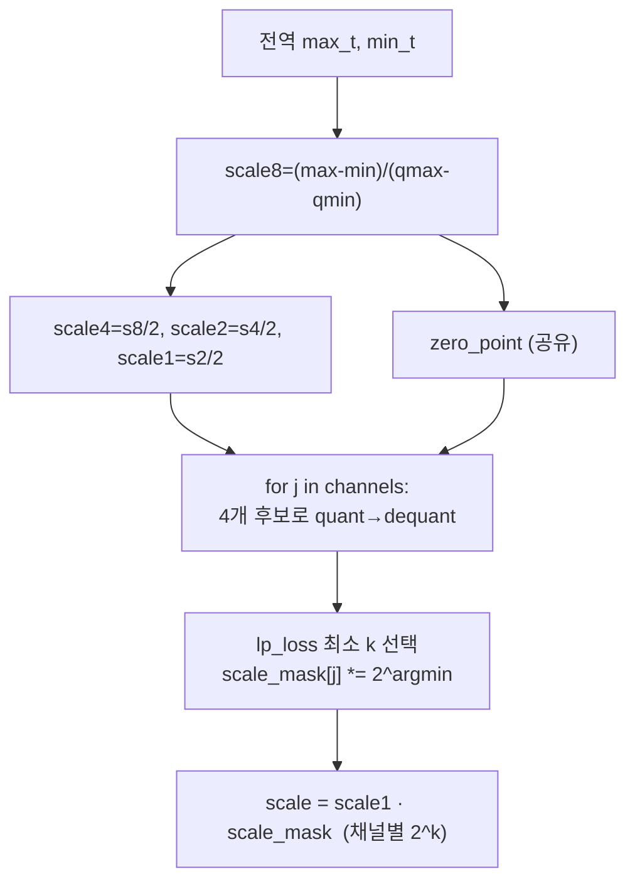

### 7.3 forward call stack
`update_quantization_params(x)`(`uniform.py:16`) → `PtfObserver.get_quantization_params(inputs)`(`observer/ptf.py:32`) → 채널 loop(`:50-65`) → `lp_loss`(`observer/utils.py:3`).

### 7.4 대표 코드 위치
`observer/ptf.py`: scale 후보 `:42-46`, zero_point 공유 `:47-48`, 채널 loop `:50-65`, 최종 scale `:66`.

### 7.5 대표 코드 블록
```python
# observer/ptf.py:42-48  2의 거듭제곱 후보 + 공유 zero_point
scale8 = (max_val_t - min_val_t) / float(qmax - qmin)
scale4 = scale8 / 2; scale2 = scale4 / 2; scale1 = scale2 / 2
zero_point = (qmin - torch.round(min_val_t / scale8)).clamp_(qmin, qmax)
```
```python
# observer/ptf.py:50-66  채널별 최적 2^k 선택 (Lp 최소) → scale = s1·2^k
for j in range(inputs.shape[2]):
    data = inputs[..., j].unsqueeze(-1)
    # data_q1/q2/q4/q8 = dequant(quant(data; s1/s2/s4/s8))
    score = [score1, score2, score4, score8]
    scale_mask[j] *= 2**score.index(min(score))      # 채널 j의 거듭제곱 지수
scale = scale1 * scale_mask                          # 채널별 2^k 배율
```
→ 채널별 배율이 모두 **2의 거듭제곱** → 정수 연산 후 **시프트만으로 채널 재정규화**. (단 `config.py` 기본 관찰자는 minmax — ptf는 명시 설정 시 사용.)

### 7.6 연산·수치표현 분해 + 정량
- **양자화 방식**: 채널별 power-of-two factor 균일 양자화. zero_point 채널 공유.
- **비트폭**: 4단계 후보(s1~s8 = 2^0~2^3 배율 차이).
- **params**: 0.
- **FLOPs**: 채널수 C × 4후보 × (quant+dequant+Lp) — 캘리브레이션 1회성.
- **시사**: **DSP-free 채널 재정규화의 직접 청사진**. LayerNorm 전후 채널 스케일링을 곱셈기 없이 시프트로 구현. 본 프로젝트 양자화 연산자 후보 1순위.

---

## 8. 모듈: 정수 LayerNorm — `layers.py` (QLayerNorm) ★정수 비선형(코드 존재·기본 비활성)

### 8.1 역할 + 상위/하위
- **역할**: LayerNorm을 정수로. `mode='ln'`이면 부동소수 `F.layer_norm`, `mode='int'`이면 정수 평균/표준편차 + affine 계수 A를 `A_sign·M·2^(-N)` 고정소수점으로 분해. **단 `mode`는 기본 'ln'**(`layers.py:156`)이고 `int`로 전환하려면 `model_quant`에서 `cfg.INT_NORM` True여야 하나(`vit_quant.py:358-360`) **Config에 `INT_NORM` 속성이 없음**(`config.py` 전체) → 기본 경로에서 정수 LayerNorm은 **비활성**.
- **상위**: `Block.norm1/norm2`(`vit_quant.py:135,158`), `VisionTransformer.norm`(`:294`), `PatchEmbed.norm`(옵션, `layers_quant.py:216`). **하위**: `get_MN`(`layers.py:158-162`).

### 8.2 데이터플로우 (mode='int')
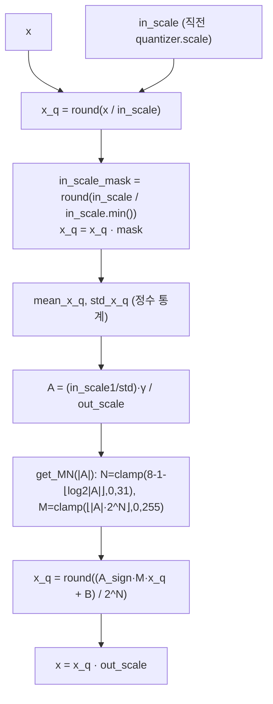

### 8.3 forward call stack
`Block.forward`(`vit_quant.py:183`) → `QLayerNorm.forward(x, in_quantizer, out_quantizer)`(`layers.py:164`) → (`mode=='ln'`이면 `F.layer_norm` `:170`; `mode=='int'`이면 정수 경로 `:172-202` → `get_MN` `:195`).

### 8.4 대표 코드 위치
`layers.py`: `get_MN` `:158-162`, `mode=='ln'` `:169-171`, 정수 평균/표준편차 `:182-190`, affine 분해 `:192-201`, 출력 `:202`.

### 8.5 대표 코드 블록
```python
# layers.py:158-162  affine 계수 A를 8비트 가수 M + 시프트량 N으로 (고정소수점)
def get_MN(self, x):
    bit = 8
    N = torch.clamp(bit - 1 - torch.floor(torch.log2(x)), 0, 31)
    M = torch.clamp(torch.floor(x * torch.pow(2, N)), 0, 2 ** bit - 1)
    return M, N         # A ≈ sign(A)·M·2^(-N)
```
```python
# layers.py:188-190  정수 평균/표준편차 (in_scale1 기준)
mean_x_q = x_q.mean(dim=-1) * in_scale1
std_x_q = (in_scale1 / channel_nums) * torch.sqrt(
    channel_nums * (x_q**2).sum(dim=-1) - x_q.sum(dim=-1)**2)
```
```python
# layers.py:201-202  정규화 = 정수 곱 + 시프트(2^N) + 출력 스케일
x_q = ((A_sign * M * x_q + B) / torch.pow(2, N)).round()
x = x_q * out_scale
```
→ LayerNorm을 부동소수 없이 **정수 곱(M) + 우측 시프트(2^N)**로 근사. FPGA 고정소수점 LayerNorm 데이터패스의 직접 청사진.

### 8.6 연산·수치표현 분해 + 정량 (DeiT-S, C=384, N=197)
- **양자화 방식**: (int 모드) 정수 mean/var → affine `M·2^(-N)` 분해(M 8비트, N≤31). 단 기본 비활성(`config.py`에 INT_NORM 없음).
- **비트폭**: M 8bit, N 시프트량(`get_MN`).
- **params**: weight γ + bias β = 2×384 = **768**/LN. block당 2개=1536, ×12 + 최종 norm = ~**18.8K**(LN 전체).
- **FLOPs/block** (1 LN, [1,197,384]): mean+var reduce ≈ 2·N·C = 2×197×384 ≈ 151K; affine O(N·C)=75.6K. block당 LN 2개 + 최종 1개.
- **시사**: I-ViT의 뉴턴 sqrt(10회 반복)와 달리 여기는 `torch.sqrt` 직접 사용(`layers.py:190`) → **int 모드라도 sqrt는 부동소수**(완전 integer-only 아님). FPGA화 시 sqrt는 별도 LUT/CORDIC 필요. **그러나 기본 경로는 float LayerNorm**이므로 실측 정확도(README)는 정수 LayerNorm 효과를 반영하지 않음(확인: INT_NORM 미설정).

---

## 9. 모듈: 정수 Softmax 근사 — `layers.py` (QSoftmax) ★정수 비선형(코드 존재·forward 미사용)

### 9.1 역할 + 상위/하위
- **역할**: `int_softmax`/`int_exp`/`int_polynomial` 정적 메서드로 정수 지수함수 근사(2차 다항식 + `-ln2` range reduction, I-BERT/FQ-ViT 계열). **단 실제 `forward`는 `x.softmax(dim=-1)`로 부동소수 softmax를 그대로 사용**하고 `int_softmax`를 호출하지 않음(`layers.py:268-270`). 즉 정수 softmax 코드는 존재하나 **평가 경로에서 미사용(비활성)**.
- **상위**: `Attention.softmax`(`vit_quant.py:87,108`). **하위**: (int_softmax 사용 시) `int_exp`→`int_polynomial`.

### 9.2 데이터플로우 (int_softmax — 비활성 경로)
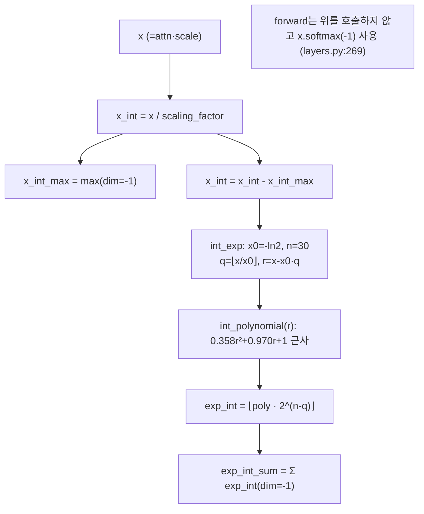

### 9.3 forward call stack
**실제 경로**: `Attention.forward`(`vit_quant.py:108`) → `QSoftmax.forward(x, scale)`(`layers.py:268`) → `x.softmax(dim=-1)`(`:269`). **비활성 경로**: `int_softmax`(`:234`) → `int_exp`(`:249`) → `int_polynomial`(`:237`) — 코드 내 어디서도 호출되지 않음.

### 9.4 대표 코드 위치
`layers.py`: `int_polynomial` `:237-247`, `int_exp` `:249-259`, `int_softmax` `:261-266`, 실제 `forward`(float 폴백) `:268-270`.

### 9.5 대표 코드 블록
```python
# layers.py:237-247  정수 다항식 exp 근사 (ax²+bx+c, a=0.358)
def int_polynomial(x_int, scaling_factor):
    coef = [0.35815147, 0.96963238, 1.]
    b_int = torch.floor(coef[1]/coef[0] / scaling_factor)
    c_int = torch.floor(coef[2]/coef[0] / scaling_factor**2)
    z = x_int * (x_int + b_int) + c_int
    return z, coef[0] * scaling_factor**2
```
```python
# layers.py:249-259  range reduction(-ln2) + 2^(n-q) 시프트로 정수 exp
x0 = -0.6931  # -ln2;  n = 30
x0_int = torch.floor(x0 / scaling_factor)
q = torch.floor(x_int / x0_int); r = x_int - x0_int * q
exp_int, sf = int_polynomial(r, scaling_factor)
exp_int = torch.clamp(torch.floor(exp_int * 2**(n - q)), min=0)   # <<(n-q)
```
```python
# layers.py:268-270  ★실제 forward — 정수 softmax 미사용, float 폴백
def forward(self, x, scale):
    x = x.softmax(dim=-1)
    return x
```

### 9.6 연산·수치표현 분해 + 정량 (DeiT-S, attn [1,6,197,197])
- **양자화 방식**: (비활성) 정수 exp = 2차 다항식 + `-ln2` reduction + `2^(n-q)` 시프트. **실제는 float softmax**.
- **비트폭**: int_exp n=30, 다항식 계수 부동소수. 실제 forward는 float.
- **params**: 0.
- **FLOPs**: (활성 시) int_exp ≈ 다항식 2 mul + 시프트/원소. 실제 float softmax는 exp+sum+div/원소.
- **activation memory**: attn 확률 [1,6,197,197] = 6×197²×(A_bit). uint8이면 **233 KB**, 단 forward는 FP softmax 출력(FP32 932KB).
- **시사**: 정수 softmax 코드는 RTL화 시 곱셈·LUT 최소화에 유용한 참조이나, **본 repo 결과(README)는 float softmax로 측정** → 정수 softmax 효과 미반영(확인). FPGA 이식 시 `int_softmax`를 활성화해 재검증 필요.

---

## 10. 모듈: 양자화 Conv/Linear/Act — `layers.py` (QConv2d/QLinear/QAct)

### 10.1 역할 + 상위/하위
- **역할**: `nn.Conv2d`/`nn.Linear` 상속 + observer·quantizer 내장. `calibrate` 시 weight/입력으로 observer 갱신, `quant` 시 weight(또는 act)를 fake-quant 후 **부동소수 F.conv2d/F.linear** 수행. QAct는 활성화 전용(입력 fake-quant만).
- **상위**: `Attention.qkv/proj`(`vit_quant.py:44,65`), `Mlp.fc1/fc2`(`layers_quant.py:133,149`), `PatchEmbed.proj`(`layers_quant.py:198`), `VisionTransformer.head`(`vit_quant.py:314`), 모든 QAct 삽입점. **하위**: `build_observer`/`build_quantizer`.

### 10.2 데이터플로우 (QLinear)
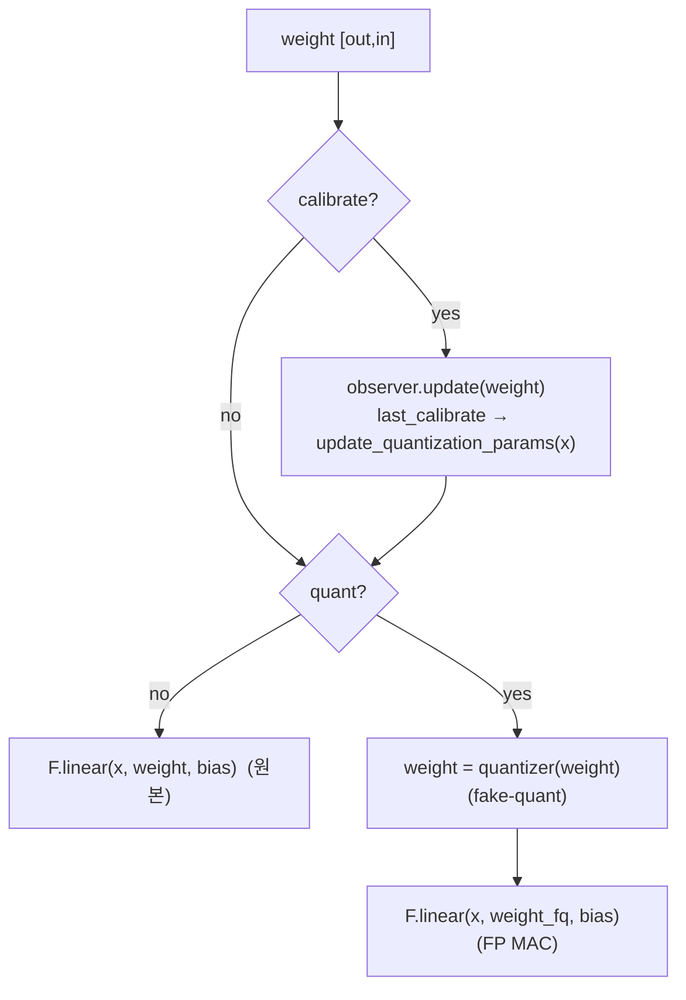

### 10.3 forward call stack
`QLinear.forward`(`layers.py:101`) → (calibrate 시) `observer.update`(`:103`) + `update_quantization_params`(`:105`) → (quant 시) `quantizer(self.weight)`(`:108`) → `F.linear`(`:109`). QConv2d 동형(`layers.py:52-69`), QAct(`layers.py:138-147`).

### 10.4 대표 코드 위치
`layers.py`: `QConv2d` `:10-69`(forward `:52`), `QLinear` `:72-109`(forward `:101`), `QAct` `:112-147`(forward `:138`). observer/quantizer 빌드 `:47-50,96-99,133-136`.

### 10.5 대표 코드 블록
```python
# layers.py:101-109  QLinear: 캘리브 시 observer 갱신, quant 시 weight fake-quant 후 FP MAC
def forward(self, x):
    if self.calibrate:
        self.quantizer.observer.update(self.weight)
        if self.last_calibrate:
            self.quantizer.update_quantization_params(x)
    if not self.quant:
        return F.linear(x, self.weight, self.bias)
    weight = self.quantizer(self.weight)             # fake-quant (quant→dequant)
    return F.linear(x, weight, self.bias)            # 여전히 부동소수 MAC
```
```python
# layers.py:138-147  QAct: 활성화만 fake-quant (입력 x → quantizer)
def forward(self, x):
    if self.calibrate:
        self.quantizer.observer.update(x)
        if self.last_calibrate:
            self.quantizer.update_quantization_params(x)
    if not self.quant: return x
    return self.quantizer(x)
```
→ **결정적 차이(I-ViT 대비)**: weight를 fake-quant한 뒤 `F.linear`로 **부동소수 MAC**을 수행(정수 도메인 누산 아님). bias는 양자화하지 않고 FP 그대로(`layers.py:109`). 즉 이 repo는 정확도 시뮬레이션용 fake-quant이며 integer-only 추론 엔진이 아님.

### 10.6 연산·수치표현 분해 + 정량 (DeiT-S, B=1, N=197, C=384)
- **양자화 방식**: weight per-channel(channel_wise) 대칭 int8(`config.py:9,18`), activation per-tensor(layer_wise) 비대칭 uint8. bias 미양자화.
- **params** (DeiT-S 1 block):
  - qkv: 384×1152 + 1152 = **443,520**
  - proj: 384×384 + 384 = **147,840**
  - fc1: 384×1536 + 1536 = **591,360**
  - fc2: 1536×384 + 384 = **590,208**
  - Linear/block ≈ **1.773M**, ×12 ≈ **21.27M**.
- **MACs/block** (B=1, N=197): qkv 87.1M + proj 29.0M + fc1 116.2M + fc2 116.2M ≈ **348.5M**, ×12 ≈ **4.18G**(Attention matmul 제외).
- **activation bit**: 입력 uint8(fake-quant) → FP MAC → 다음 QAct에서 재양자화.
- **시사**: 비트배분(MPQ)은 `bit_type` 인자만 바꾸면 레이어별 차등 가능(탐색기 부재). bias 미양자화는 HW에서 bias를 FP/고정밀로 유지하는 설계 단서.

---

## 11. 모듈: Attention / Block / VisionTransformer 조립 — `vit_quant.py`

### 11.1 역할 + 상위/하위
- **역할**: 양자화 모듈을 ViT 토폴로지로 조립. **인접 quantizer를 LayerNorm에 체이닝**(in/out scale 연결, int 모드 대비). QKV·어텐션맵·proj 전부 양자화 경로에 포함.
- **상위**: `test_clamp_vit.py`의 `str2model → forward`(`:196,233`). **하위**: §3~10 모듈 + `Mlp`/`PatchEmbed`(`layers_quant.py`).

### 11.2 데이터플로우 (1 Block)
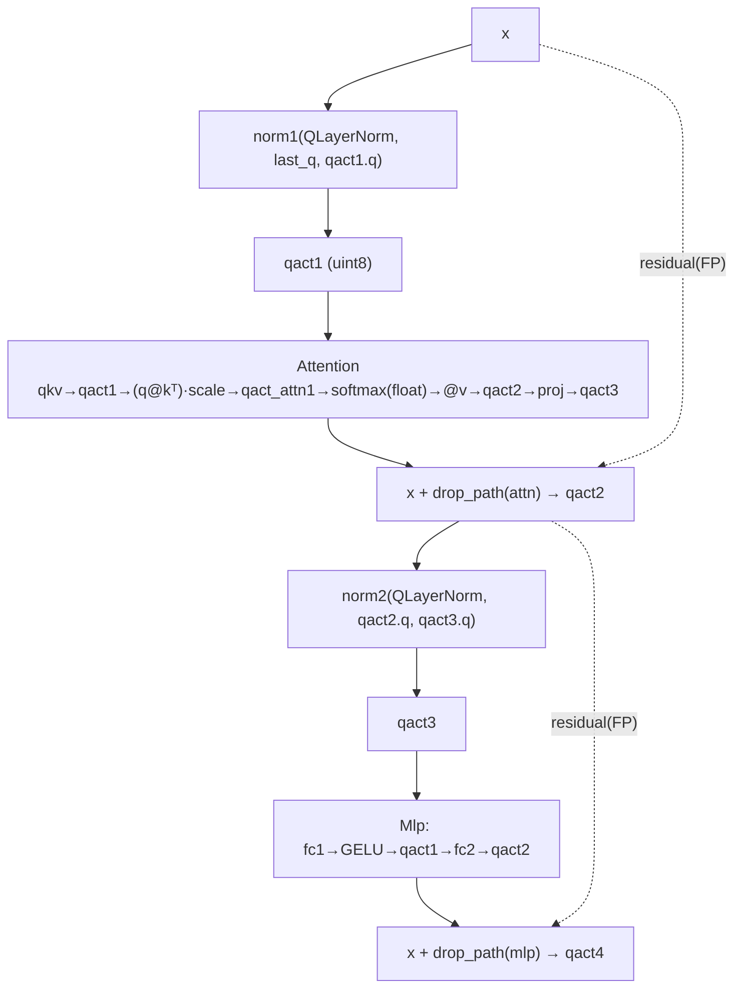

### 11.3 forward call stack
`VisionTransformer.forward_features`(`vit_quant.py:382`) → `blk(x, last_quantizer)` ×12(`:399-402`) → `Block.forward`(`:180`) → `norm1`(`:183`)→`qact1`→`Attention.forward`(`:182`)→`qact2`(residual, `:181`)→`norm2`(`:188`)→`qact3`→`Mlp.forward`(`:186`)→`qact4`(residual, `:185`).

### 11.4 대표 코드 위치
`vit_quant.py`: `Attention` `:27-115`(forward `:95`), `Block` `:118-190`(forward `:180`), `VisionTransformer` `:193-414`, quantizer 체이닝 `:400-405`, 팩토리 `:417-548`.

### 11.5 대표 코드 블록
```python
# vit_quant.py:106-110  어텐션: 스코어→qact→softmax(float)→@v→qact
attn = (q @ k.transpose(-2, -1)) * self.scale     # 1/√dh
attn = self.qact_attn1(attn)                       # 어텐션맵 양자화
attn = self.softmax(attn, self.qact_attn1.quantizer.scale)   # ★ QSoftmax.forward = float softmax
attn = self.attn_drop(attn)
x = (attn @ v).transpose(1, 2).reshape(B, N, C)
```
```python
# vit_quant.py:180-189  Block: residual은 FP 덧셈, LayerNorm에 인접 quantizer 체이닝
x = self.qact2(x + self.drop_path(self.attn(
        self.qact1(self.norm1(x, last_quantizer, self.qact1.quantizer)))))
x = self.qact4(x + self.drop_path(self.mlp(
        self.qact3(self.norm2(x, self.qact2.quantizer, self.qact3.quantizer)))))
```
```python
# vit_quant.py:354-360  model_quant — INT_NORM 참조(Config에 없음 → int LayerNorm 실질 비활성)
def model_quant(self):
    for m in self.modules():
        if type(m) in [QConv2d, QLinear, QAct, QSoftmax]: m.quant = True
        if self.cfg.INT_NORM:                      # ← Config.__init__에 INT_NORM 미정의
            if type(m) in [QLayerNorm]: m.mode = 'int'
```
→ residual 합은 정수 정렬 없이 **부동소수 덧셈**(`:181,185`). I-ViT의 dyadic residual 정렬과 대비. `model_quant`의 `INT_NORM` 참조는 Config에 속성이 없어 호출 시 `AttributeError`(이 경로가 test에서 미사용임을 방증, 0.4절).

### 11.6 연산·수치표현 분해 + 정량 (DeiT-S, B=1, N=197)
- **양자화 방식**: weight per-channel int8, activation per-tensor uint8. residual FP, softmax FP. (MPQ 비트배분은 체크포인트 baked-in.)
- **params (DeiT-S 전체, 분석적)**: PatchEmbed 295,296 + cls 384 + pos 197×384=75,648 + Block×12(Linear 21.27M + LN ~18.4K) + 최종 norm 768 + head 384×1000+1000=385,000 ≈ **22.0M**(DeiT-S 공칭 ~22M 일치, 양자화로 개수 불변).
- **MACs/이미지 (B=1, N=197)**: PatchEmbed 57.8M(1회) + Block×12[(Linear 348.5M + Attn matmul 29.8M)] ≈ **4.54G** + head 0.384M ≈ **4.6 GMAC/이미지**(정수 비선형 원소연산 제외).
- **activation memory (block 피크)**: 어텐션맵 [1,6,197,197]가 최대. uint8 233KB / FP softmax 출력 932KB.
- **시사**: 양자화 삽입 위치(QKV/attn-score/proj/softmax 입력 모두 양자화)는 우리 가속기 양자화 지점 설계 체크리스트로 활용. residual/softmax가 FP인 점은 HW화 시 추가 정수화(I-ViT 기법 이식) 필요 지점.

---

## 12. 모듈: 평가 파이프라인 — `test_clamp_vit.py` + `config.py`

### 12.1 역할 + 상위/하위
- **역할**: Config 생성 → 모델 골격 생성(즉시 폐기) → ImageNet val 로드 → **MPQ 체크포인트 `torch.load`** → validate(top1/5). **양자화/캘리브레이션/탐색은 수행 안 함**(결과 검증 전용).
- **상위**: CLI(`README.md:44`). **하위**: `str2model`, `validate`, `accuracy`, `Config`.

### 12.2 데이터플로우
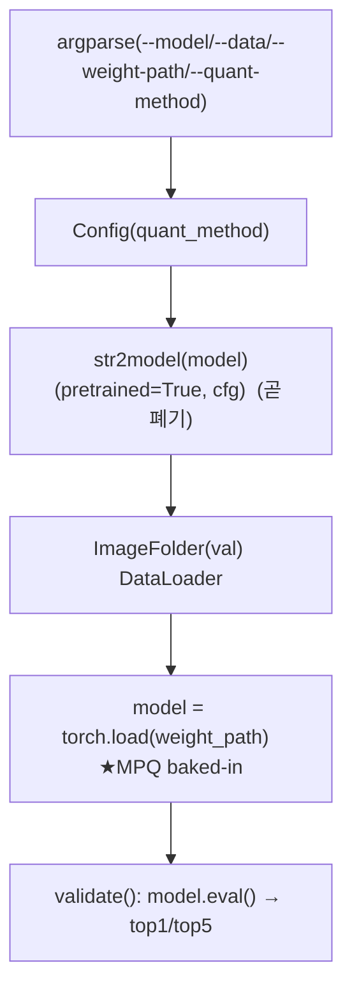

### 12.3 forward call stack
`main`(`test_clamp_vit.py:190`) → `seed`(`:192`) → `Config`(`:195`) → `str2model(...)`(`:196`) → `torch.load`(`:225`) → `validate`(`:233`) → `accuracy`(`:64,112`).

### 12.4 대표 코드 위치
`test_clamp_vit.py`: argparse `:18-42`, `validate` `:45-90`, `accuracy` `:112-125`, `str2model` `:160-169`, `seed` `:172-187`, `main` `:190-235`(`torch.load` `:225`). `config.py`: 전체 `:4-19`.

### 12.5 대표 코드 블록
```python
# test_clamp_vit.py:195-197  Config + 모델 골격 (이 모델은 곧 폐기)
cfg = Config(args.quant_method)
model = str2model(args.model)(pretrained=True, cfg=cfg)
model = model.to(device)
```
```python
# test_clamp_vit.py:225-226  ★MPQ 모델 통째 로드 (사전 양자화+비트배분 baked-in)
model = torch.load(args.weight_path)               # quantized/{deit_tiny,deit_small}.pth
model.eval()
```
```python
# config.py:9-19  전역 양자화 정책 (단 INT_NORM 미정의 — model_quant 호출 시 에러)
self.BIT_TYPE_W = BIT_TYPE_DICT['int8']; self.BIT_TYPE_A = BIT_TYPE_DICT['uint8']
self.OBSERVER_W = 'minmax'; self.OBSERVER_A = quant_method      # 기본 minmax
self.QUANTIZER_W = 'uniform'; self.QUANTIZER_A = 'uniform'
self.CALIBRATION_MODE_W = 'channel_wise'; self.CALIBRATION_MODE_A = 'layer_wise'
```

### 12.6 연산·수치표현 분해 + 정량 / 재현 명령
- **양자화 방식**: 없음(평가 전용). 양자화는 `*.pth`에 내장.
- **하이퍼파라미터**: val_batchsize 100(`:30`), num_workers 16(`:33`), seed 0(`:42`), 결정론 cudnn.deterministic(`:185`).
- **재현 명령**(`README.md:44`):
  ```bash
  python test_clamp_vit.py --model deit_small --weight-path ./quantized/deit_small.pth --data PATH-TO-IMAGENET_2012
  ```
- **정확도**(README): DeiT-T 71.69, DeiT-S 79.43(`README.md:50-51`). **속도/실측은 본 세션 미실행 → 확인 불가.**
- **주의**: `--quant-method contrastive`는 observer에 'contrastive' 키가 없어(`observer/build.py:10-16`) 실제 캘리브레이션 경로 진입 시 `KeyError`. 단 test 경로는 calibration 미호출이라 평가 자체는 진행됨(추정).

---

## N+1. 모듈 한눈 요약 표

| 모듈 | 파일:라인 | 역할 | 양자화 방식 | 대표 정량(DeiT-S) |
|---|---|---|---|---|
| BitType | bit_type.py:6-50 | 비트 범위 정의 + uint2~8 등록 | signed=대칭/unsigned=비대칭 | params 0, W int8/A uint8 |
| UniformQuantizer | quantizer/uniform.py:9-42 | affine 균일 q=round(x/s+z) | W per-ch / A per-tensor, fake-quant | params 0, ~5N op/텐서 |
| Log2Quantizer | quantizer/log2.py:8-27 | q=round(-log2 x), x̂=2^(-q) | 로그(시프트), softmax용 | params 0, dequant=시프트 1회 |
| minmax/ema/percentile Obs | observer/{minmax,ema,percentile}.py | min/max→scale/zp | 대칭/비대칭 동일 공식 | params 0, observer 기본 minmax |
| OmseObserver | observer/omse.py:9-57 | Lp(p=2) 90후보 clipping 탐색 | LAPQ, 캘리브 1회성 | params 0, 90×양자화 |
| PtfObserver | observer/ptf.py:9-67 | 채널별 2^k 배율 | power-of-two, 시프트 재정규화 | params 0, C×4후보 |
| QLayerNorm | layers.py:150-205 | LN(float) / int(M·2^-N) | int 모드 **기본 비활성**(INT_NORM 없음) | LN 768 params, sqrt는 float |
| QSoftmax | layers.py:208-271 | int_softmax 코드有 / forward=float | float 폴백(int 미사용) | attn맵 uint8 233KB |
| QConv2d/QLinear/QAct | layers.py:10-147 | fake-quant 후 **FP MAC** | W per-ch int8/A per-tensor uint8 | block Linear 1.77M params, 348.5M MAC |
| Attention/Block/VT | vit_quant.py:27-414 | 정수 ViT 조립, residual FP | softmax/residual FP | 총 22M params, 4.6 GMAC/img |
| 평가 pipeline | test_clamp_vit.py:45-235 | torch.load(MPQ) → validate | 양자화 X(baked-in) | DeiT-S 79.43%, val만 |
| **contrastive 합성샘플** | **부재** | 데이터-free 캘리브 샘플 생성 | **코드 0건(논문기준)** | **확인 불가** |
| **evolutionary MPQ search** | **부재** | 레이어별 비트 진화 탐색 | **코드 0건(논문기준)** | **확인 불가** |

---

## N+2. 평가·재현 파이프라인 + 검증/확인불가 요약

- **데이터셋**: ImageNet 2012 val, 224×224, 1000 클래스, ImageFolder(`test_clamp_vit.py:214-223`).
- **사전학습 가중치**(골격용, 곧 폐기): DeiT torch.hub `.pth`(`vit_quant.py:437-442`), ViT augreg `.npz`(`:519-522`).
- **평가**:
  ```bash
  python test_clamp_vit.py --model deit_small --weight-path ./quantized/deit_small.pth --data <IMAGENET>
  ```
  옵션: `--model {deit_tiny,deit_small,deit_base,vit_base,vit_large,(swin_* — 코드부재)}`(`:21-24`), `--quant-method {minmax,contrastive}`(`:27`), `--val-batchsize 100`(`:30`).
- **MPQ 체크포인트**: `quantized/{deit_tiny,deit_small}.pth`만 존재(1차 요약 §5). 비트배분(W4.7/A5.9 등)·scale은 baked-in.

| 항목 | 상태 | 근거 |
|---|---|---|
| Uniform/Log2 양자화 수식 | **코드 확인** | `quantizer/uniform.py:25-42`, `quantizer/log2.py:18-27` |
| minmax/ema/percentile/omse/ptf 관찰자 | **코드 확인** | `observer/*.py` |
| PTF 채널별 2^k | **코드 확인** | `observer/ptf.py:42-66` |
| 정수 LayerNorm(M·2^-N) | **코드 확인, 기본 비활성** | `layers.py:158-202`, `config.py`에 INT_NORM 부재 |
| 정수 Softmax 근사 | **코드 존재, forward 미사용** | `layers.py:234-266` vs `:268-270` |
| QConv/QLinear/QAct(fake-quant, FP MAC) | **코드 확인** | `layers.py:52-147` |
| 비트 후보 uint2~uint8 | **코드 확인** | `bit_type.py:41-49` |
| **Contrastive 합성샘플 생성** | **코드 부재(미공개)** | 전수 Grep 0건; `README.md:4`·`test_clamp_vit.py:27` 문자열만 |
| **Evolutionary MPQ 탐색** | **코드 부재(미공개)** | 전수 Grep 0건; `README.md:56` 출처만 |
| `--quant-method contrastive` 캘리브 | **동작 불가** | observer 미등록 `observer/build.py:10-16` |
| MPQ 비트배분(W4.7/A5.9 등) | **체크포인트 내장만** | `quantized/*.pth`, `README.md:48-53` |
| Swin-T/S 코드 | **부재(확인 불가)** | `str2model` deit/vit만(`test_clamp_vit.py:160-167`), `__all__`에 swin 없음 |
| 본 repo 성격 | **평가(eval) 전용** | `test_clamp_vit.py:225` torch.load, calibration 미호출 |
| 정확도(README) | **인용(미실행)** | `README.md:50-53` |
| 속도/latency | **확인 불가** | 측정 코드 없음 |

---

## N+3. 우리 프로젝트(FPGA ViT 가속 + XR 시선추적) 시사점 + FPGA 친화도

### N+3.1 시프트 친화 양자화 연산자 = DSP-free 하드웨어 (최우선)
- **PTF(`observer/ptf.py:42-66`)**: 채널별 재정규화를 `s1·2^k` 시프트로 → LayerNorm 전후 채널 스케일링을 곱셈기 없이 구현. 우리 가속기 양자화 연산자 1순위.
- **Log2 양자화(`quantizer/log2.py:18-27`)**: 어텐션맵 dequant `2^(-q)`를 우측 시프트로. softmax [0,1] long-tail에 적합.
- **정수 LayerNorm M·2^(-N)(`layers.py:158-202`)**: affine을 8비트 가수 + 시프트로 분해 → 고정소수점 LN 데이터패스 청사진. 단 sqrt는 float(`:190`)라 FPGA화 시 sqrt LUT/CORDIC 보강 필요.
- **정수 Softmax 근사(`layers.py:234-266`)**: 2차 다항식 + `-ln2` reduction + `2^(n-q)` 시프트. RTL화 시 곱셈·LUT 최소화 참조(현재 비활성이라 활성화·재검증 전제).

### N+3.2 Mixed-precision 비트 후보군 = 레이어별 비트할당 설계틀
- `bit_type.py`의 uint2~uint8(`:41-49`)과 W4.7/A5.9 같은 평균비트 결과는 HG-PIPE식 레이어별/스테이지별 PE 비트폭 차등 설계에 매핑되는 사고틀. 단 **탐색 알고리즘은 미공개**(Evol-Q 또는 자체 탐색기로 대체 필요).

### N+3.3 Data-free PTQ = XR 프라이버시·배포 이점 (개념, 코드 부재)
- XR 시선/안구 영상은 민감 정보 → data-free 캘리브(논문 컨셉)는 사용자 데이터 없이 양자화 가능해 온디바이스 배포·프라이버시에 직접 이점. **단 본 repo엔 생성기 코드가 없어** FQ-ViT/Evol-Q 원본 또는 논문 재현 필요.

### N+3.4 FPGA 친화도 평가
| 항목 | 평가 | 근거 |
|---|---|---|
| 정수전용(integer-only) | △ **fake-quant + FP MAC** (integer-only 아님) | `layers.py:109,68` F.linear/F.conv2d FP |
| 시프트 친화 양자화 연산자 | ★★★ PTF/Log2/LN(M·2^-N) | `observer/ptf.py`, `quantizer/log2.py`, `layers.py:158` |
| 곱셈기-free 비선형 | ★★ 코드有, **softmax는 float·LN sqrt float** | `layers.py:190,269` |
| Mixed-precision 인프라 | ★★ 비트 자료구조有, **탐색기 부재** | `bit_type.py:41-49` / Grep 0건 |
| 재현성 | ★ DeiT-T/S만(체크포인트 2개), Swin·탐색 불가 | `quantized/`, `str2model` |
| 핵심 알고리즘 가용성 | ✗ contrastive·evol **미공개** | 0.1절 |

### N+3.5 활용 전략 (요약)
본 repo는 **"FQ-ViT 기반 양자화 추론 엔진 + 결과 검증 평가 코드"**로 한정. 직접 참고 가치는 **PTF/Log2/정수 LayerNorm·Softmax 등 시프트 친화 양자화 연산자**와 **양자화 ViT 구조(양자화 삽입 위치)**. integer-only 추론·residual/softmax 정수화는 I-ViT 기법으로 보강하고, contrastive·evol은 논문 재현 또는 FQ-ViT/Evol-Q 원본 결합으로 메워야 한다.

---

## 부록. 근거 / 확인 불가

- **직접 코드 확인(전 라인 인용)**: `test_clamp_vit.py`, `config.py`, `models/ptq/bit_type.py`, `models/ptq/layers.py`, `models/ptq/quantizer/{uniform,log2,base,build}.py`, `models/ptq/observer/{minmax,ema,percentile,omse,ptf,base,utils,build}.py`, `models/vit_quant.py`, `models/layers_quant.py`. README(평가 명령/결과/출처).
- **분석적 산출(검증 가능)**: params/MACs/activation memory는 DeiT-S config(`vit_quant.py:452-463`)와 표준식으로 계산. 양자화 연산 FLOPs는 원소연산 추정치("추정" 표기).
- **추정**: HW 환산 비트폭, `--quant-method contrastive` test 경로 진행 가능 여부, 프로젝트 성격(FPGA+XR).
- **확인 불가**: contrastive 합성샘플 생성·evolutionary MPQ 탐색 구현(미공개), Swin 모델 정의(부재), latency 실측(코드 없음 + 미실행), MPQ 비트배분 산출 과정(체크포인트 baked-in), `models/utils.py` npz 로더 세부(가중치 변환만, 양자화 무관).
