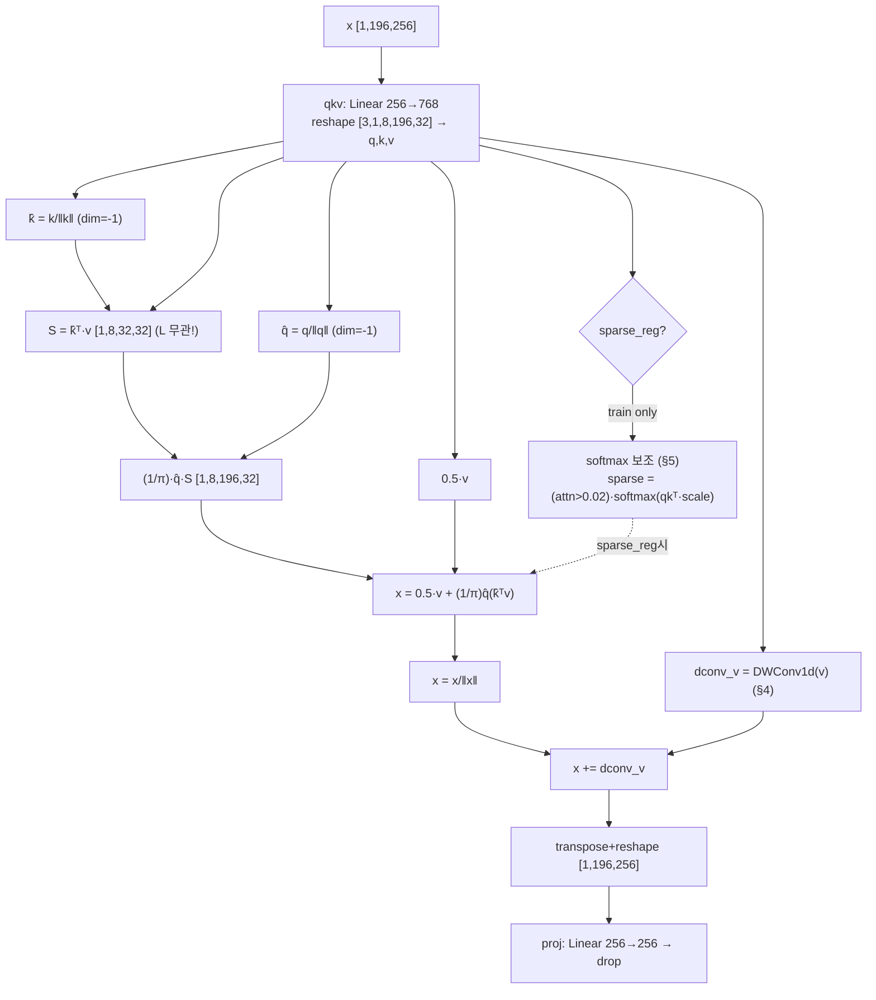
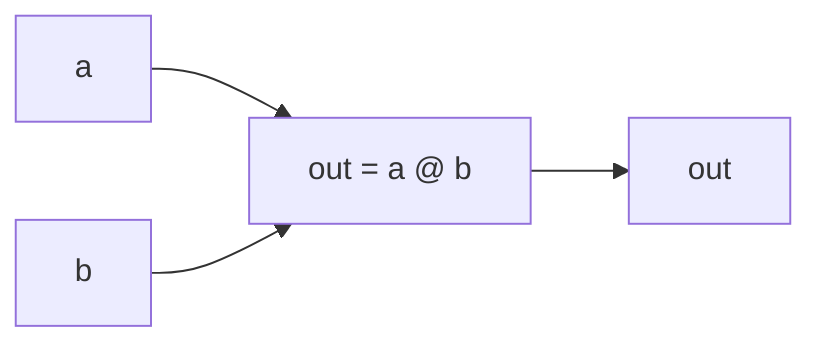
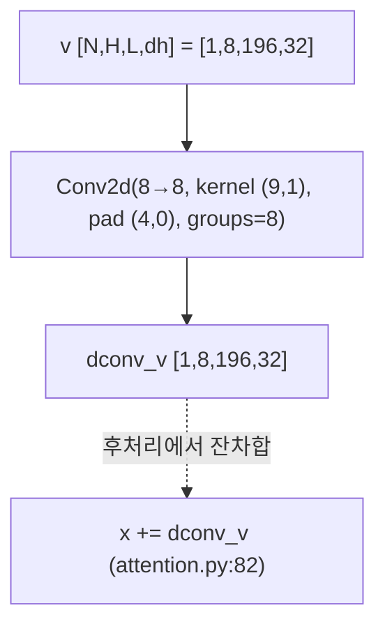
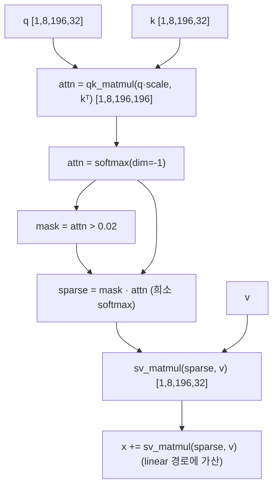

# Castling-ViT 모듈 통합 가이드 (S-PyTorch)

> 1차 요약: [`../Castling-ViT.md`](../Castling-ViT.md) — 본 문서는 그 요약을 모듈 단위로 심화한 통합 가이드다.
> 분석 대상: `\\wsl.localhost\ubuntu-24.04\home\user\project\PRJXR-HBTXR\REF\ViT-Quantization\Castling-ViT`
> 작성 원칙: 실제 소스 Read 후 `파일:라인` 근거 표기. 라인 근거 없는 추론은 "추정", 코드로 확인 불가는 "확인 불가"로 명시.
> 형제 가이드(`REF/Analysis/ViT-Quantization/I-ViT/MODULE_GUIDE.md`)의 6요소 구조를 동형(同型)으로 따르되, HW 지표는 **S-PyTorch 수치 규약**(params/FLOPs·MACs/activation memory/angular kernel/sparse softmax 보강)으로 치환한다. I-ViT가 "정수 양자화"가 주제였다면 본 repo는 **attention 연산 복잡도 자체의 선형화(linear vs softmax)**가 주제다.

---

## 0. 문서 머리말

### 0.1 대표 케이스 선정
- **대표 모듈: `LinAngularAttention`** (`attention.py:14-86`) — 본 repo의 유일한 핵심 클래스이자 논문(Castling-ViT, CVPR'23)의 attention 블록 미니어처 구현. 근거:
  1. 저자가 README에서 "비공식 미니어처 릴리스 — attention 블록 핵심만 노출"이라 명시(`README.md:12`), 실행 진입점도 `python attention.py`(`README.md:14-16`).
  2. repo 내 커스텀 `.py`는 `attention.py` **단 1개**(Glob `*.py` 결과 = `attention.py` 단일). 분류/세그/검출 전체 코드베이스는 MobileVision/Mask2Former/PicoDet 위에 별도 존재(미포함, `README.md:24-31`).
- **대표 분석 단위: `LinAngularAttention.forward` 1회** = `qkv 투영 → [sparse_reg 시 softmax 보조] → Q/K L2정규화 → DWConv(v) → K^T·V 선계산 → 0.5·V + (1/π)·Q(K^T V) → x 정규화 → +DWConv → proj` (`attention.py:52-86`). 표준 ViT는 이 블록을 depth만큼 적층하나, **본 repo에는 블록 적층·모델 정의가 없음**(외부 코드베이스 의존, 확인 불가).
- **대표 실행 config**: `__main__` 스모크 테스트 = `in_channels=256, num_heads=8, head_dim=32, 입력 [N=1, L=196, C=256]` (`attention.py:90-99`). L=196 = 14×14 패치(주석 `Castling-ViT.md:77`). 본 가이드의 정량은 이 config로 산출 후 일반식으로 환원.

### 0.2 S-PyTorch 수치 규약 (I-ViT의 비트폭/dyadic 대체 → 본 repo는 복잡도/커널)
- **params**: 모듈 차원에서 분석적 계산. Linear `in·out (+out bias)`, depthwise Conv1d `Cout·(Cin/groups)·K (+Cout)`. 본 repo는 **양자화 없음**(observer/scale/zero-point 부재 — `attention.py` 전수 확인) → params는 FP32 원본 그대로, 비트폭 분석 항목은 "확인 불가(양자화 코드 부재)".
- **FLOPs/MACs (핵심 — linear vs softmax 복잡도 대비)**: 표준 softmax attention `O(L²·d)` vs linear-angular `O(L·d²)`의 직접 대조가 본 repo의 정량 핵심. softmax 경로 QKᵀ = `B·H·L²·dh`, linear 경로 KᵀV = `B·H·dh²·L` + Q(KᵀV) = `B·H·L·dh²`. 대표 config(B=1, H=8, L=196, dh=32)로 양 경로를 산출해 절감률 제시.
- **activation memory**: 텐서 shape × dtype(FP32=4B). softmax 경로의 attn 행렬 `[B,H,L,L]`(L² 의존) vs linear 경로의 중간 `S=KᵀV [B,H,dh,dh]`(L 무관, 토큰수 독립 버퍼)의 대조가 본 repo의 HW 시사 핵심.
- **angular kernel**: Q/K를 head 차원으로 L2 정규화해 내적을 코사인 유사도(=각도)로 만든 뒤(`attention.py:67-68`), softmax 지수커널을 `0.5 + (1/π)·cosθ`류 1차 근사로 치환(상수 `0.5`, `1/π`가 그 흔적, `attention.py:80`). 비트폭 대신 **angular kernel 근사항·정규화 비선형(L2 norm)**을 정량 대상으로 둔다.
- **sparse softmax 보강**: 학습 시에만 활성(`sparse_reg=True`)되는 softmax 잔차 항 — `attn>0.02` 마스크로 희소화한 softmax attention을 linear 경로에 가산(`attention.py:61-65,73-78`). 추론 시 제거(switch off)되어 순수 선형만 남김 = "Castling"의 핵심(단 switching 스케줄 자체는 미포함, 0.4절).
- **정확도/속도**: 본 repo는 미니어처(가중치·학습 루프 부재) → 정확도 수치 **확인 불가**(README에 결과표 없음, `README.md` 전수 확인). 논문(arXiv:2211.10526) 수치는 본 repo 코드로 재현 불가.

### 0.3 운영 경로 (스모크 테스트 ↔ 외부 코드베이스)
```
[본 repo로 가능한 것]
python attention.py                                  (README.md:14-16)
   │  device = cuda if available else cpu             (attention.py:89)
   │  input = torch.randn(1,196,256)                  (attention.py:90)
   ▼
LinAngularAttention(sparse_reg=False).forward         (attention.py:93-95)  → shape 검증
LinAngularAttention(sparse_reg=True).forward          (attention.py:98-99)  → shape 검증
   ▼
print(output.shape)   # [1,196,256] 동일 in/out shape

[본 repo에 없는 것 — 외부 코드베이스 의존 (확인 불가)]
   분류 : MobileVision@Meta                            (README.md:24)
   세그 : Mask2Former (+ MAE 사전학습)                  (README.md:26)
   검출 : PicoDet/Picodet_Pytorch (+ LeViT 사전학습)    (README.md:28)
   → 데이터셋·학습루프·switching 스케줄·사전학습 가중치 모두 미포함
```
- 타깃 디바이스: **CUDA 선택적** — `__main__`은 `cuda if torch.cuda.is_available() else cpu`(`attention.py:89`)로 **CPU 폴백 가능**(I-ViT의 cuda 하드코딩과 대조 — Castling은 device-agnostic). 모듈 자체(`LinAngularAttention`)는 device 하드코딩 없음(전수 확인).

### 0.4 모델 / 데이터셋 / 정확도 (README 인용)
| 항목 | 본 repo 내용 | 근거 |
|---|---|---|
| 모델 정의(백본) | **없음** (attention 블록만) | `README.md:12`, Glob `*.py`=1 |
| 데이터셋 | 없음 (스모크 입력 `randn(1,196,256)`만) | `attention.py:90` |
| 정확도 수치 | **README에 결과표 없음 → 확인 불가** | `README.md` 전수 |
| 사전학습 가중치 | 없음 (외부 MAE/LeViT) | `README.md:26,28` |
| switching 스케줄 | **코드에 없음** (`sparse_reg` 플래그로 두 경로만 노출) | `attention.py:61,73` |
- 최종 채택 블록은 MViT의 `MultiScaleAttention` 형식이라 명시(`README.md:12`) — 본 미니어처와 다름(확인 불가, 외부 링크).
- 속도(latency): 본 repo로 측정 코드 없음 → **확인 불가**. 단 복잡도 분석은 분석적으로 산출 가능(§2 정량).

---

## 1. Repo / Layer 개요

Castling-ViT = ViT self-attention을 **학습 시 softmax 표현력 유지 + 추론 시 선형-각도(linear-angular) attention으로 전환**해 attention 복잡도를 `O(L²d)`→`O(Ld²)`로 낮추는 효율화 기법(CVPR'23, `README.md:1-8`). 본 repo는 그 핵심 attention 블록만 담은 **저자 명시 "비공식 미니어처 릴리스"**(`README.md:12`)로, 양자화·모델정의·학습루프는 포함하지 않는다.

### 1.1 자체 소스 vs 외부 프레임워크 vs 제외

| 구분 | 파일(자체 소스) | 역할 |
|---|---|---|
| **attention 블록** ★핵심 | `attention.py` (전부) | `LinAngularAttention`(선형-각도 attention + DWConv 잔차 + sparse softmax 보조), `MatMul`(FLOPs 후킹용 matmul 래퍼) |
| **스모크 테스트** | `attention.py:88-99` | `__main__` shape 검증 2케이스(sparse off/on) |
| **메타/문서** | `README.md` | 논문 메타, 사용법, 외부 코드베이스 안내 |
| **개념도** | `castling-vit.png` | attention 구조 다이어그램(이미지, 비분석) |

### 1.2 forward 진입점
`LinAngularAttention.forward(x)`(`attention.py:52-86`), 입력 `x:[N,L,C]`:
`qkv 투영 → reshape/permute → q,k,v unbind`(`:53-59`) → **[sparse_reg 시] softmax 보조 경로**(`:61-65`) → `q,k L2정규화`(`:67-68`) → `dconv_v = dconv(v)`(`:69`) → **`attn = K^T·V` 선계산**(`:71`) → `x = 0.5·v + (1/π)·Q(K^T V) [+ sparse·V]`(`:73-80`) → `x 정규화 → +dconv_v → reshape → proj → drop`(`:81-85`). 입출력 shape 동일 `[N,L,C]`.

### 1.3 제외 (지시에 따라 이름만 표기, 미분석)
- **외부 코드베이스(커스텀 아님)**: `MobileVision@Meta`(분류), `Mask2Former`(세그), `MAE`(세그 사전학습), `PicoDet`/`Picodet_Pytorch`(검출), `LeViT`(검출 사전학습), `MViT MultiScaleAttention`(최종 채택 형식) (`README.md:12,24-31`). 모두 본 repo 미포함 → 코드 분석 불가.
- **양자화(부재 → 분석 대상 아님)**: I-ViT와 달리 PTQ/QAT·observer·scale·zero-point **전부 없음**(`attention.py` 전수 확인). "ViT-Quantization" 폴더 소속이나 본 repo의 가치는 양자화가 아닌 **연산 복잡도 선형화**.
- **확인 불가(미포함)**: switching 스케줄(학습→추론 전환 로직), 학습 하이퍼파라미터, 정확도 수치, 사전학습 가중치, 모델(백본) 토폴로지.

### 1.4 대표 모듈 내부 구성 (LinAngularAttention, in_channels=256, num_heads=8)
`__init__`(`attention.py:14-50`): Linear 2개(`qkv` 256→768, `proj` 256→256), MatMul 인스턴스 2개(`kq_matmul`, `kqv_matmul`) + `sparse_reg` 시 2개 더(`qk_matmul`, `sv_matmul`), depthwise Conv1d `dconv`(8→8, kernel 9×1, groups=8). Dropout 2개(`attn_drop`, `proj_drop`).

---

## 2. 모듈: Linear-Angular Attention 본체 — `attention.py` (LinAngularAttention.forward) ★핵심

### 2.1 역할 + 상위/하위
- **역할**: softmax attention `O(L²d)`를 **결합법칙(associativity) 재배치 + L2정규화(angular) 커널 근사**로 선형 `O(Ld²)`화. `K^T V`를 먼저 계산해 토큰수 L에 선형인 고정크기 `d×d` 중간 텐서로 환원.
- **상위**: (본 repo) `__main__` 스모크(`attention.py:93-99`). (실제) 외부 백본의 attention 슬롯에 삽입(확인 불가). **하위**: `MatMul`(§3, `:71,77`), `nn.Linear`(qkv/proj), `nn.Conv2d`(dconv, §4), `torch.norm`(L2 정규화).

### 2.2 데이터플로우 (텐서 shape 흐름, in=256/H=8/L=196 예)


### 2.3 forward call stack
`__main__`(`attention.py:94/99`) → `LinAngularAttention.forward(x)`(`:52`) → `self.qkv(x)`(`:55`) → [`self.qk_matmul`+`softmax` `:62-63`] → `q.norm/k.norm`(`:67-68`) → `self.dconv(v)`(`:69`) → `self.kq_matmul(k.transpose, v)`(`:71`) → `self.kqv_matmul(q, attn)`(`:77/80`) → `x.norm`(`:81`) → `self.proj(x)`(`:84`).

### 2.4 대표 코드 위치
`attention.py`: qkv 투영/분해 `:54-59`, L2정규화 `:67-68`, KᵀV 선계산 `:71`, 출력 조합 `:73-80`, 후처리(정규화+dconv+proj) `:81-85`.

### 2.5 대표 코드 블록

```python
# attention.py:54-59  qkv 동시 투영 후 (3, N, heads, L, head_dim)로 분해
qkv = (
    self.qkv(x)
    .reshape(N, L, 3, self.num_heads, C // self.num_heads)
    .permute(2, 0, 3, 1, 4)
)
q, k, v = qkv.unbind(0)   # 각 [N, heads, L, head_dim]
```
→ Q/K/V를 한 번의 Linear(256→768)로 산출 후 head 분할. dh = C/H = 32.

```python
# attention.py:67-71  angular(L2정규화) + 결합법칙 핵심: K^T V 선계산
q = q / q.norm(dim=-1, keepdim=True)   # q̂: head 차원 단위정규화 → 코사인 유사도
k = k / k.norm(dim=-1, keepdim=True)   # k̂
dconv_v = self.dconv(v)                # 지역정보 보강(§4)
attn = self.kq_matmul(k.transpose(-2, -1), v)   # S = k̂ᵀ·v ∈ [N,H,dh,dh] (L에 무관!)
```
→ `k.transpose(-2,-1)`로 `[dh, L]`를 만들고 `v[L, dh]`와 곱해 `[dh, dh]` 산출. **이것이 L²→L 선형화의 출발점** — 중간 텐서가 토큰수 L과 무관한 고정크기.

```python
# attention.py:79-85  선형 출력 조합 + 후처리
x = 0.5 * v + 1.0 / math.pi * self.kqv_matmul(q, attn)   # 0.5·V + (1/π)·Q̂(K̂ᵀV)
x = x / x.norm(dim=-1, keepdim=True)   # 출력 정규화(비선형)
x += dconv_v                            # DWConv 잔차 합산
x = x.transpose(1, 2).reshape(N, L, C)
x = self.proj(x)
x = self.proj_drop(x)
```
→ `0.5·V`는 angular kernel `0.5 + (1/π)cosθ` 근사의 항등항, `(1/π)` 계수는 각도커널 1차근사 상수. 곱셈-누산(MAC)만으로 표현 → softmax 지수 비선형 부재.

### 2.6 연산·수치표현 분해 + 정량 (in=256, H=8, L=196, dh=32, N=1)
- **커널/연산**: angular(L2정규화 코사인) + 결합법칙 재배치. softmax 지수 부재(추론 경로). L2 norm 3회(q,k,x)가 잔존 비선형.
- **params** (양자화 없음, FP32):
  - qkv: 256×768 = **196,608** (bias=False가 기본, `attention.py:32` `qkv_bias` 기본 False → bias 0)
  - proj: 256×256 + 256 = **65,792** (bias 기본 포함, `nn.Linear` 디폴트)
  - dconv: 8×1×9 = **72** (groups=8, bias=False, §4)
  - **LinAngularAttention params ≈ 262,472** (sparse_reg 무관 — MatMul/Dropout은 0 params)
- **MACs/forward (linear 경로, B=1)**:
  - qkv: L·C·3C = 196×256×768 ≈ **38.5M**
  - KᵀV(kq_matmul): H·dh²·L = 8×32²×196 ≈ **1.61M**
  - Q(KᵀV)(kqv_matmul): H·L·dh² = 8×196×32² ≈ **1.61M**
  - proj: L·C·C = 196×256×256 ≈ **12.85M**
  - dconv: H·L·K = 8×196×9 ≈ **14K**
  - **linear attention 코어(matmul 2개) MAC ≈ 3.22M**, 전체(qkv+proj 포함) ≈ **54.6M**
- **대조 — softmax 경로였다면(추론에 안 씀, 비교용)**: QKᵀ = H·L²·dh = 8×196²×32 ≈ **9.83M**, attn·V 동일 ≈ **9.83M** → softmax 코어 ≈ **19.66M**. **선형화로 attention 코어 19.66M→3.22M ≈ 6.1× 절감**(L=196 기준; L 클수록 절감폭 ↑, 절감률 ≈ L/dh = 196/32 ≈ 6.1×).
- **activation memory**:
  - linear 중간 S=KᵀV `[1,8,32,32]` FP32 = **32KB** (L 무관, 토큰수 독립 버퍼)
  - softmax였다면 attn `[1,8,196,196]` FP32 = **1.20MB** (L² 의존) → **약 37× 메모리 절감**(추정 — softmax 경로 미실행, 분석적 대조)
- **시사**: 중간 텐서가 L 무관 `d×d` 고정크기 → FPGA 버퍼 사이징 단순화의 직접 근거(§N+3).

---

## 3. 모듈: MatMul 래퍼 — `attention.py` (MatMul)

### 3.1 역할 + 상위/하위
- **역할**: `a @ b`를 감싼 최소 `nn.Module`. 주석(`attention.py:6`)이 명시하듯 **FLOPs 프로파일러가 matmul을 모듈 단위로 후킹/계측**하기 위한 래퍼. 각 행렬곱을 독립 연산 노드로 분리해 계측·치환 용이.
- **상위**: `LinAngularAttention.__init__`이 4개 인스턴스화(`kq_matmul`, `kqv_matmul`, +sparse 시 `qk_matmul`, `sv_matmul`, `attention.py:37-41`). **하위**: torch `@`.

### 3.2 데이터플로우


### 3.3 forward call stack
`LinAngularAttention.forward`(`attention.py:62/71/77/80`) → `MatMul.forward(a, b)`(`:10`) → `a @ b`(`:11`).

### 3.4 대표 코드 위치
`attention.py`: 클래스 `:7-12`, forward `:10-12`, 인스턴스화 `:37-41`.

### 3.5 대표 코드 블록
```python
# attention.py:6-12  FLOPs 후킹용 matmul 래퍼
# if use Q @ K, FLOPs caclulation could be wrong
class MatMul(nn.Module):
    def __init__(self):
        super().__init__()
    def forward(self, a, b):
        out = a @ b
        return out
```
→ 주석 "Q @ K를 직접 쓰면 FLOPs 계산이 틀릴 수 있다"는, 프로파일러가 `nn.Module` 단위로만 연산을 집계하기 때문(추정). 4개 matmul을 각각 별도 모듈로 둬 **연산 노드별 계측·HW 매핑 분리** 가능.

### 3.6 연산·수치표현 분해 + 정량
- **커널/연산**: 순수 행렬곱 패스스루. zero/scale/양자화 없음.
- **params**: 0 (학습 파라미터 없음).
- **MACs**: 호출처 텐서 shape에 종속(§2.6에서 산출 — kq/kqv 각 ≈1.61M, sparse 시 qk/sv 추가).
- **HW 시사**: matmul을 4개 독립 노드로 분리 → 가속기에서 각 행렬곱을 별도 PE/스케줄로 매핑·치환하기 용이(시스톨릭 어레이 인스턴스 분할 근거).

---

## 4. 모듈: DWConv 잔차 (지역정보 보강) — `attention.py` (self.dconv)

### 4.1 역할 + 상위/하위
- **역할**: linear-angular attention이 놓치는 **지역(local) 토큰 간 상호작용**을 1D depthwise conv로 보강. head를 채널로 보고 토큰축(길이 L)에 9×1 depthwise conv 적용.
- **상위**: `LinAngularAttention.forward`가 `v`에 적용 후 출력에 잔차 가산(`attention.py:69,82`). **하위**: `nn.Conv2d`(groups=num_heads).

### 4.2 데이터플로우 (텐서 shape 흐름)


### 4.3 forward call stack
`LinAngularAttention.forward`(`attention.py:69`) → `self.dconv(v)`(`:69`) → (Conv2d) → 후처리 잔차합(`:82`).

### 4.4 대표 코드 위치
`attention.py`: 생성자 `:43-50`, 적용 `:69`, 잔차합 `:82`.

### 4.5 대표 코드 블록
```python
# attention.py:43-50  head를 채널로 본 1D depthwise conv
self.dconv = nn.Conv2d(
    in_channels=self.num_heads,           # 8
    out_channels=self.num_heads,          # 8
    kernel_size=(res_kernel_size, 1),     # (9, 1) — 토큰축만 컨볼브
    padding=(res_kernel_size // 2, 0),    # (4, 0) — 길이 보존
    bias=False,
    groups=self.num_heads,                # depthwise (채널별 독립)
)
```
→ `groups=num_heads`로 head별 독립 conv(곱셈량 최소). kernel `(9,1)`이라 head_dim 축은 건드리지 않고 **토큰 길이 축으로만 9-탭** → 인접 토큰 지역정보 혼합.

### 4.6 연산·수치표현 분해 + 정량 (H=8, L=196, dh=32, K=9)
- **커널/연산**: depthwise Conv1d(토큰축). 비선형 없음(순수 MAC).
- **params**: groups=8, in/out=8, kernel 9×1, bias=False → 8×(8/8)×9×1 = **72** (`attention.py:43-50`).
- **MACs**: out 위치 H·L·dh × 탭 K = 8×196×32×9 ≈ **451K** (depthwise라 채널방향 누산 없음 → 매우 저렴)
- **activation memory**: `dconv_v [1,8,196,32]` FP32 = **196KB** (=v와 동일 shape).
- **시사**: depthwise·9탭이라 가속기에서 **소형 1D line-buffer conv 엔진**으로 저비용 구현. 지역정보를 attention 본선과 분리된 경량 경로로 획득(§N+3).

---

## 5. 모듈: Sparse Softmax 보강 (학습 전용) — `attention.py` (sparse_reg 경로) ★switching 핵심

### 5.1 역할 + 상위/하위
- **역할**: 학습 시 **softmax attention의 희소 잔차**를 linear 경로에 가산해 표현력 보강. `attn>0.02` 마스크로 작은 확률을 0으로 만든 sparse softmax만 유지. 추론 시 `sparse_reg=False`로 **전체 경로 제거(switch off)** = "Castling"(성 바꾸기) 메타포의 핵심.
- **상위**: `LinAngularAttention.forward`(`attention.py:61-65,73-78`), 플래그 `self.sparse_reg`(`:30,39`). **하위**: `qk_matmul`/`sv_matmul`(§3), `tensor.softmax`.

### 5.2 데이터플로우 (텐서 shape 흐름, sparse_reg=True)


### 5.3 forward call stack
`LinAngularAttention.forward`(`attention.py:61`) → `self.qk_matmul(q*scale, k.transpose)`(`:62`) → `.softmax(dim=-1)`(`:63`) → 마스크/희소화(`:64-65`) → (출력 조합 시) `self.sv_matmul(sparse, v)`(`:75`).

### 5.4 대표 코드 위치
`attention.py`: 플래그 `:30`, MatMul 조건부 생성 `:39-41`, softmax 보조 산출 `:61-65`, 출력 가산 `:73-78`.

### 5.5 대표 코드 블록
```python
# attention.py:61-65  학습 전용 sparse softmax 보조 항
if self.sparse_reg:
    attn = self.qk_matmul(q * self.scale, k.transpose(-2, -1))   # 표준 QKᵀ/√dh
    attn = attn.softmax(dim=-1)
    mask = attn > 0.02   # note that the threshold could be different; adapt to your codebases.
    sparse = mask * attn  # 임계값 미만 확률을 0으로 → 희소 softmax
```
→ `q*self.scale`로 `1/√dh` 적용 후 표준 softmax. **임계값 0.02는 코드베이스별 조정 대상**이라 주석 명시(`:64`).

```python
# attention.py:73-80  sparse_reg 분기: linear + (희소 softmax) 결합
if self.sparse_reg:
    x = (
        self.sv_matmul(sparse, v)               # softmax 보조 경로
        + 0.5 * v
        + 1.0 / math.pi * self.kqv_matmul(q, attn)   # linear-angular 본선
    )
else:
    x = 0.5 * v + 1.0 / math.pi * self.kqv_matmul(q, attn)   # 순수 선형 (추론)
```
→ 두 분기의 차이는 **`sv_matmul(sparse,v)` 항의 유무**. 추론(`else`)은 softmax 항이 완전히 사라져 `O(L²)` 연산이 제거됨. 단 `attn` 변수가 두 경로에서 의미가 다름에 주의(sparse 경로의 `attn`=softmax맵 `:62`, linear의 `attn`=KᵀV `:71`로 재대입됨).

### 5.6 연산·수치표현 분해 + 정량 (sparse_reg=True, H=8, L=196, dh=32)
- **커널/연산**: 표준 softmax(지수+정규화 비선형) + 임계 마스킹. 학습에만 존재.
- **params**: 0 (qk_matmul/sv_matmul = MatMul, params 없음; 임계값 0.02는 상수).
- **MACs (sparse 경로 추가분)**: QKᵀ = H·L²·dh = 8×196²×32 ≈ **9.83M**, sv_matmul(sparse·V) = H·L²·dh ≈ **9.83M** → **+19.66M** (linear 코어 3.22M의 약 6배). 추론 시 이 전부가 제거됨.
- **activation memory (추가분)**: attn 행렬 `[1,8,196,196]` FP32 = **1.20MB** + sparse 동일 = **2.4MB** (학습 시에만, L² 의존). 추론 0.
- **switching의 핵심 정량**: 학습→추론 전환으로 **MAC ≈19.66M↓, activation ≈2.4MB↓** 제거 → 추론은 §2.6의 선형 비용만 남음. 단 **switching 스케줄(언제·어떻게 sparse 가중치를 0으로 보내는지)은 본 repo에 없음**(`sparse_reg` 불리언 두 경로만, 0.4절) → 확인 불가.
- **시사**: softmax는 학습용 표현력, 추론은 선형. FPGA는 **추론 경로(sparse off)만 합성**하면 되므로 softmax/지수 LUT 불필요(§N+3).

---

## N+1. 모듈 한눈 요약 표

| 모듈 | 파일:라인 | 역할 | 커널/방식 | 대표 정량(in=256,H=8,L=196,dh=32) |
|---|---|---|---|---|
| LinAngularAttention | attention.py:14-86 | 선형-각도 attention 본체 | angular(L2 cos) + 결합법칙 KᵀV 선계산 | params ≈262K, linear코어 MAC 3.22M, 중간 S 32KB |
| MatMul | attention.py:7-12 | FLOPs 후킹용 matmul 래퍼 | 순수 `a@b` | params 0, shape 종속 |
| DWConv 잔차(dconv) | attention.py:43-50,69,82 | 지역정보 보강 1D depthwise conv | Conv2d(9×1, groups=H) | params 72, MAC ≈451K, 196KB |
| sparse softmax 보강 | attention.py:61-65,73-78 | 학습 전용 softmax 잔차(switching) | softmax + (attn>0.02) 마스크 | +MAC 19.66M, +act 2.4MB (추론 시 제거) |
| (대조) softmax 경로 | — (미실행, 분석적) | 표준 QKᵀ attention | O(L²d) | attn 1.20MB / 코어 19.66M MAC |

**핵심 대조 (linear vs softmax, L=196):**
| 지표 | linear-angular(추론) | softmax(참고) | 절감 |
|---|---|---|---|
| attention 코어 MAC | 3.22M | 19.66M | ≈6.1× |
| 중간 활성 메모리 | 32KB (d×d, L무관) | 1.20MB (L×L) | ≈37× |
| 복잡도 | O(L·d²) | O(L²·d) | L/dh 배 |

---

## N+2. 학습·평가 파이프라인 + 재현 명령

- **본 repo로 가능**: shape 스모크 테스트만.
  ```bash
  python attention.py            # README.md:14-16
  # 출력: [1,196,256] 2회 (sparse_reg off/on) — attention.py:88-99
  ```
- **데이터셋**: 없음. 입력은 `torch.randn(1,196,256)`(`attention.py:90`)뿐.
- **사전학습/학습루프**: 본 repo 미포함 → 외부 코드베이스 의존(분류 MobileVision, 세그 Mask2Former+MAE, 검출 PicoDet+LeViT, `README.md:24-31`). **데이터셋·명령·하이퍼파라미터·정확도 모두 확인 불가**.
- **switching 스케줄**: 학습 중 sparse 항을 점진 제거하는 로직은 **코드에 없음**(`sparse_reg` 불리언 두 경로만, `attention.py:61,73`). 논문의 switching 전략은 본 repo로 재현 불가(확인 불가).
- **정확도**: README에 결과표 없음 → **확인 불가**(논문 arXiv:2211.10526은 외부, `README.md:8`).
- **의존성**: `torch`, `torch.nn`, `torch.nn.functional`, `math`(`attention.py:1-4`). 그 외 없음. CUDA 선택적(`attention.py:89` CPU 폴백).

---

## N+3. 우리 프로젝트(FPGA ViT 가속) 시사점 + FPGA 친화도

> 전제: 본 연구는 HG-PIPE 계열 ViT FPGA 가속기 + XR 시선추적으로 **추정**.

### N+3.1 Linear attention의 HW 매핑 = 토큰수-독립 고정버퍼 (최우선)
- **KᵀV 선계산**(`attention.py:71`)으로 중간 텐서가 `[H,dh,dh]` 고정크기(L 무관, §2.6 32KB) → **시스톨릭 어레이/누산기에 이상적 매핑**. HG-PIPE식 파이프라인에서 **attention 버퍼를 토큰 길이와 독립적으로 고정 사이징** 가능. 입력 해상도/토큰수 증가에도 on-chip 버퍼 불변 → 고해상도·고프레임레이트(XR 시선추적 저지연)에 직접 부합.
- **복잡도 O(L²d)→O(Ld²)**: L=196에서 attention 코어 MAC ≈6.1× 절감, 중간 활성 ≈37× 절감(§N+1). L이 클수록(고해상도 패치) 절감폭 선형 증가(절감률 ≈ L/dh).

### N+3.2 Softmax 제거 = 가속기 단순화 (추론 경로만 합성)
- 추론은 `sparse_reg=False` 경로(`attention.py:79-80`)만 사용 → **softmax 지수 LUT·행단위 max/sum·정규화 데이터패스 전부 불필요**. I-ViT의 IntSoftmax(Shiftmax) 같은 정수 지수 블록조차 추론 경로에 없음. FPGA는 추론 토폴로지만 합성하면 됨.
- 단 **L2 정규화(`x.norm`) 비선형은 잔존**(`attention.py:67,68,81`, 총 3회) → 가속기에서 **rsqrt LUT 또는 고정점 근사**로 치환 필요(우리 RTL/HLS 단계 과제, 추정). softmax보단 훨씬 가벼움(원소별 reduce+rsqrt 1회 vs 지수+정규화).

### N+3.3 곱셈-누산만의 데이터패스 = 양자화 결합 친화
- 출력 조합 `0.5·v + (1/π)·q̂(k̂ᵀv)`(`attention.py:79-80`)는 **상수곱(0.5, 1/π) + MAC**만 → 비선형 부재로 양자화(INT8/INT4) 정밀도 손실 경로 단순. 본 repo는 양자화 코드가 없으나(§1.3), **PTQ4ViT/FQ-ViT/I-ViT의 정수화 기법을 Castling 선형 attention 위에 얹는 조합**이 가장 매력적(연산량 선형 + 비트폭 저감 동시) — 본 세트 내 repo 간 교차 활용 포인트(추정).

### N+3.4 DWConv 잔차 = 저비용 지역정보 엔진
- depthwise 9×1 conv(`attention.py:43-50`)는 params 72·MAC ≈451K로 극저비용(§4.6) → **소형 1D line-buffer conv 엔진**으로 attention 본선과 병렬 합성. 지역정보 보강을 거의 공짜로 획득.

### N+3.5 FPGA 친화도 평가 (효율화/연산치환 관점)
| 항목 | 평가 | 근거 |
|---|---|---|
| attention 복잡도 | ★★★ O(Ld²), 토큰수 선형 | KᵀV 선계산 `attention.py:71` |
| 중간버퍼 사이징 | ★★★ L무관 d×d 고정 | S=[H,dh,dh] 32KB(§2.6) |
| softmax-free(추론) | ★★★ 지수/정규화 LUT 불필요 | else 경로 `:79-80` |
| 곱셈-누산 데이터패스 | ★★★ 비선형 부재(상수곱+MAC) | `:80` |
| 잔존 비선형 | ★★ L2 norm 3회(rsqrt 필요) | `:67,68,81` |
| 양자화 결합 | ★★ 구조는 친화, 단 본 repo에 양자화 없음 | `attention.py` 전수(부재) |
| 재현성/완결성 | △ 미니어처(모델·학습·switching·정확도 부재) | `README.md:12`, `:24-31` |

### N+3.6 XR 시선추적 적용 (프로젝트 성격은 추정)
- 시선추적은 패치(토큰) 수가 많고 저지연이 생명 → **L-선형 attention이 본질적으로 적합**. KᵀV 고정버퍼로 프레임레이트 향상에 직접 기여. 단 정확도-효율 trade-off(switching 스케줄)·학습 파이프라인은 외부 코드 필요 → 우리가 재구성해야 함(추정). L2 norm rsqrt 고정점화·angular 상수(0.5, 1/π) 검증이 RTL 단계 과제.

---

## 부록. 근거 / 확인 불가

- **직접 코드 확인**: §2~§5 전 라인 인용 — `attention.py` 전체(MatMul `:7-12`, LinAngularAttention `:14-86`, `__main__` `:88-99`), `README.md`(메타·사용법·외부 코드베이스 `:1-31`). 양자화 코드 부재·device 하드코딩 부재는 파일 전수 확인.
- **분석적 산출(검증 가능)**: params/MACs/activation memory는 `__main__` config(in=256,H=8,L=196,dh=32, `attention.py:90,93`)와 표준식으로 계산. linear vs softmax 절감률(6.1×/37×)은 동일 config 양 경로의 분석적 대조(softmax 경로는 추론에 미실행, "참고/대조" 표기).
- **추정**: 프로젝트 성격(HG-PIPE/XR 시선추적), MatMul 래퍼의 프로파일러 후킹 목적, L2 norm rsqrt 치환 권장, 양자화 결합(PTQ4ViT/I-ViT) 제안, FLOPs 프로파일러 모듈 단위 집계.
- **확인 불가(미포함/미실행)**: 모델(백본) 토폴로지, 학습 루프·하이퍼파라미터, **switching 스케줄**(sparse 점진 제거 로직 — `sparse_reg` 불리언 두 경로만 노출), 정확도 수치(README 결과표 없음), 사전학습 가중치(외부 MAE/LeViT), 외부 코드베이스(MobileVision/Mask2Former/PicoDet) 세부, 최종 채택 MViT MultiScaleAttention 형식. 양자화(PTQ/QAT)는 본 repo에 **부재**(I-ViT와 본질적 차이 — Castling은 양자화가 아닌 연산 복잡도 선형화 기법).
