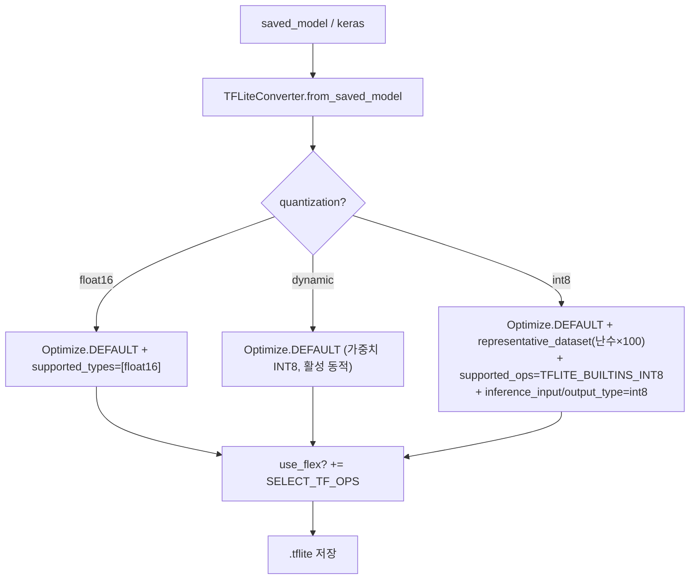
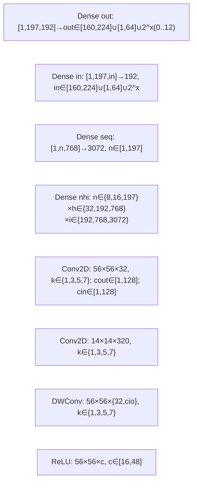
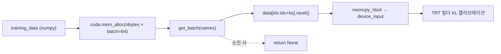
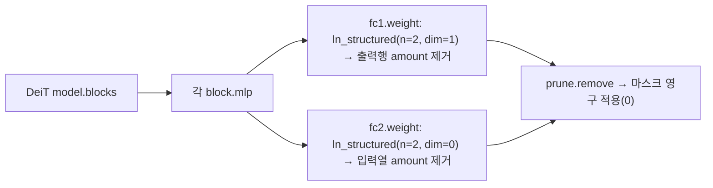
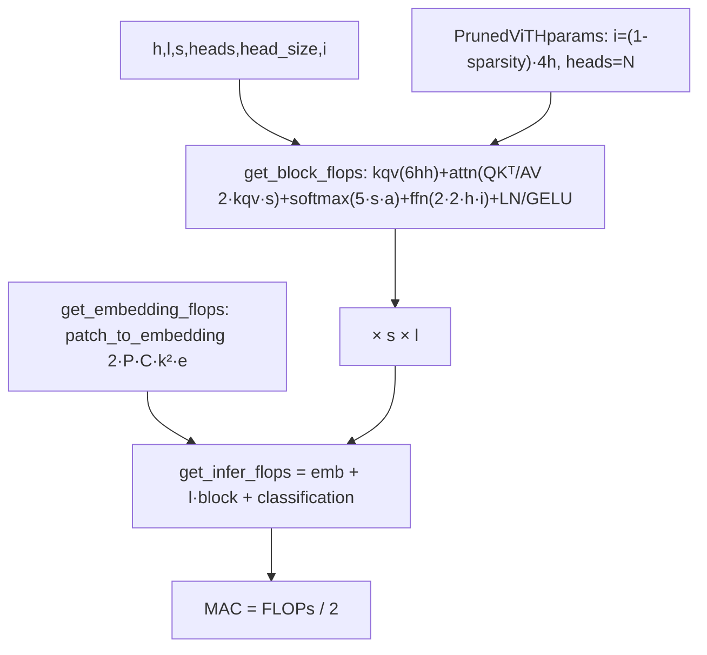
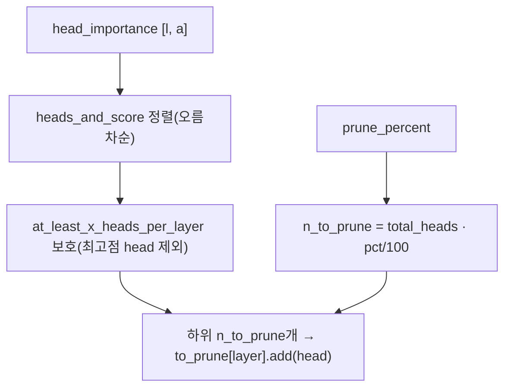
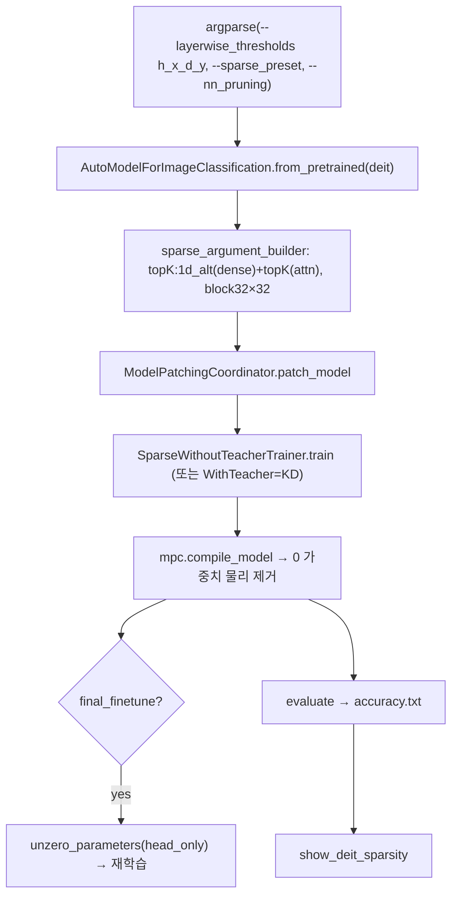
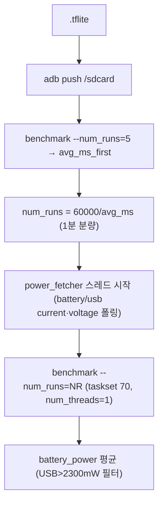

# EdgeVisionTransformer 모듈 통합 가이드 (S-PyTorch)

> 1차 요약: [`../EdgeVisionTransformer.md`](../EdgeVisionTransformer.md) — 본 문서는 그 요약을 모듈 단위로 심화한 통합 가이드다.
> 분석 대상: `\\wsl.localhost\ubuntu-24.04\home\user\project\PRJXR-HBTXR\REF\ViT-Quantization\EdgeVisionTransformer`
> 작성 원칙: 실제 소스 Read 후 `파일:라인` 근거 표기. 라인 근거 없는 추론은 "추정", 코드로 확인 불가는 "확인 불가"로 명시.
> 형제 가이드(`REF/Analysis/ViT-Quantization/I-ViT/MODULE_GUIDE.md`)의 6요소 구조를 따르되, HW 지표는 **S-PyTorch 수치 규약**(params/FLOPs·MACs/activation memory/비트폭 또는 희소율·구조)으로 치환한다.

---

## 0. 문서 머리말

### 0.0 ★ 실체 확정 — 이 repo는 무엇인가 (I-ViT와의 결정적 차이)

I-ViT가 **자체 정수전용 양자화 커널(IntGELU/IntSoftmax/IntLayerNorm/dyadic requant)을 PyTorch로 직접 구현**한 양자화 프레임워크인 반면, EdgeVisionTransformer는 **세 가지 직교 축**을 묶은 **엣지 배포 벤치마킹 + 구조적 프루닝 툴킷**이다. 코드로 확정한 실체:

1. **양자화 = "자체 커널 없음, 외부 런타임에 위임"**. 양자화 알고리즘 자체를 구현한 커스텀 코드는 **없다**. `tf2tflite`는 TFLite 컨버터의 `Optimize.DEFAULT`/`representative_dataset`/`inference_input_type=int8` 플래그를 설정할 뿐이고(`utils.py:256-284`), TensorRT는 `IInt8EntropyCalibrator2`를 상속한 데이터 공급기만 제공하며(`benchmark/tensorrt/calibrator.py:25`), ONNX는 `quantize_dynamic(...QUInt8)` 호출(`experiments/D1122_onnx_quant_op_test.py:35`)이다. **즉 PTQ(post-training quant)이며, 스케일/zp 산출은 전적으로 런타임 내부.**
2. **프루닝 = 실제 자체 로직(구조적, structured)**. (a) `torch.nn.utils.prune.ln_structured`로 DeiT FFN(fc1/fc2)을 L2-구조 프루닝(`utils.py:837-847`), (b) HuggingFace `nn_pruning`(vendor)을 차용한 layerwise topK-hybrid 구조 프루닝(`deit_pruning/src/train_main.py:37-50, 312-390`), (c) attention head 중요도 기반 프루닝(`are_16_heads/pruning.py:76-125`).
3. **벤치마킹 = 핵심 자체 인프라**. op-level 양자화 비용 스윕(Dense/Conv/DWConv/ReLU 차원 그리드)을 TFLite-INT8 / ONNX-dynamic / TRT-int8 / OpenVINO로 횡단 변환(`experiments/D11xx_*`), adb 모바일 지연·메모리·**전력** 측정(`experiments/D1230_*`, `benchmark/run_on_device.py`).

> **양자화 비트폭/observer 규약 (실측)**: TFLite-INT8 = **per-tensor affine INT8** + representative_dataset(합성 난수 100배치) min/max observer(`utils.py:265-277`); TRT-INT8 = **엔트로피(KL) 캘리브레이션**(`calibrator.py:25`); ONNX = **dynamic INT8**(가중치 사전 INT8, 활성 런타임 per-batch min/max, calibration 불필요, `D1122:35`). **I-ViT의 W8/A8 대칭(zp=0)·running min/max QAT와 달리, 여기는 affine(zp≠0)·PTQ·캘리브레이션 데이터 합성 난수.**

### 0.1 대표 케이스 선정
- **대표 양자화 단위: 단일 op 모델(Dense/Conv2D/DWConv)** — 이 repo의 양자화 분석 단위는 "모델 전체"가 아니라 **차원을 스윕한 단일 연산**이다. 예: `Dense(197×192 → out)`를 out∈[160,224]로 변화(`D1118:33-48`), `Dense(seq_len×768 → 3072)`를 seq∈[1,197]로 변화(`D1118:67-74`), `Conv2D(56×56×32, k∈{1,3,5,7})`(`D1118:113-120`). 근거: 양자화 자체가 외부 런타임이므로 "양자화 op별 비용 곡선"이 본 repo의 1차 산출물.
- **대표 프루닝 단위: DeiT 1 layer의 (heads, FFN-sparsity) 쌍** — `--layerwise_thresholds h_0.50_d_0.3`(layer별, README:78,82) = "head 50% 유지 + FFN 30% 프루닝". 12 layer 적층. 프루닝 MACs 산식은 `flops_calculation.py:254-268`의 `PrunedViTHparams.get_pruned_deit_flops(type, heads, ffn_sparsity)`로 직접 계산.
- **대표 모델(분석적 정량 기준): DeiT-Small** — `h=384, l=12, heads=6, head_size=64, patch16, img224`(`flops_calculation.py:263,272,396`). I-ViT 가이드와 동일 모델을 기준으로 잡아 교차비교 가능.

### 0.2 S-PyTorch 수치 규약 (HW의 MAC lanes/scalar MACs 대체)
- **params**: 표준식×config(I-ViT 가이드와 동일). 단 본 repo는 **프루닝 후 params/희소율**이 핵심 지표. `get_sparsity.show()`가 `zero_mask.sum()/numel()`로 레이어별 0-비율(=희소율)을 직접 산출(`deit_pruning/src/inspector/get_sparsity.py:17-24`).
- **FLOPs/MACs**: 본 repo는 **자체 분석적 FLOPs 계산기**(`flops_calculation.py`)를 보유. matmul을 `2·m·n`(MAC×2)로 카운트(`:16-17`), LayerNorm 5/GELU 8/Softmax 5 op 상수(`:38,41,44`). MAC = FLOPs/2(`:281` `flops/2e6`). 프루닝 MACs는 `PrunedViTHparams`로 직접 산출.
- **activation memory**: 텐서 shape × 비트폭. 양자화 = 외부 런타임(INT8/FP16/FP32 변환)이므로 "HW 환산 activation bit"는 변환 모드별(int8=1B, float16=2B, fp32=4B).
- **비트폭/observer**: 0.0절 표 참조. 코드 직접 근거: int8(`utils.py:276`), float16(`:259`), dynamic(`:262`), KL(`calibrator.py:25`), QUInt8(`D1122:35`).
- **희소율/구조**: 구조적(structured) 프루닝. FFN은 행/열 단위(`ln_structured dim=1/dim=0`, `utils.py:843-844`), attention은 head 또는 32×32 블록 단위(`train_main.py:44-45`). topK 밀도(density) = `1-sparsity`.
- **정확도/속도**: README/논문 인용. 본 세션 미실행 → 측정 불가 항목은 "확인 불가". README에 정확도 수치표는 **없음**(명령·방법론만, `README.md:68-104`) → DeiT 프루닝/양자화 정확도는 **확인 불가**.

### 0.3 운영 경로 (세 축의 파이프라인)
```
[축 A: 양자화 벤치] FP 모델/op → tf2tflite(int8|float16|dynamic) / torch2trt(int8) / quantize_dynamic
   │  utils.py:242-294 / D1124:32 / D1122:35
   ▼  → .tflite/.pth/.onnx 산출
[adb 모바일 측정] push → benchmark_model_plus_flex --num_runs=50 → latency/memory/power
   │  README.md:38-49 / D1230_tflite_transformer_power_test.py:85-116

[축 B: 구조적 프루닝] AutoModelForImageClassification.from_pretrained(deit) (train_main.py:284)
   │  ModelPatchingCoordinator(sparse_args).patch_model  (train_main.py:320-330)
   ▼  Trainer.train() [topK hybrid, layerwise_thresholds]  (train_main.py:387)
[프루닝 compile] mpc.compile_model → 0 가중치 물리 제거 / optimize_model("dense") (train_main.py:389 / get_sparsity.py:41)
   ▼  final_finetune (unzero → 재학습) + KD(teacher=deit-base)  (train_main.py:375-377, 300-310)
[정확도 평가] evaluate(eval_dataset) → accuracy<N>.txt  (train_main.py:399-417)

[축 C: 배포 변환] export_onnx → onnx2tflite → (TVM fusion D0104)  (utils.py:154-239)
```
- 타깃 디바이스: **모바일(안드로이드/adb)** 1순위(`benchmark/`, `D1230`), GPU(TensorRT, `D1124`), CPU(OpenVINO, ONNX). I-ViT의 CUDA 하드코딩과 달리 **멀티 백엔드**. 단 프루닝 학습(`train_main.py:204`)·TRT 변환(`D1124:23`)은 CUDA 필수.

### 0.4 모델 / 데이터셋 / 정확도 (README·코드 인용)
| 항목 | 값 | 근거 |
|---|---|---|
| 대상 ViT | DeiT(tiny/small/base), ViT, T2T-ViT, Swin | `README.md:6`, `utils.py:52-62`, `flops_calculation.py:396-398` |
| 대상 CNN | MobileNetV2/V3, EfficientNet, MNASNet, ShuffleNet, SqueezeNet, ProxylessNAS | `utils.py:65-90`, `modeling/models/*` |
| 데이터셋(프루닝) | **ImageNet-2012** (train/val 서브디렉토리) | `train_main.py:118-120`, `README.md:82` |
| 데이터셋(op 양자화) | **합성 난수** `tf.random.normal`/`np.random.rand` | `utils.py:268`, `D1122:19` |
| 캘리브레이션 데이터 | TFLite/ONNX 100배치 난수, TRT 사용자 텐서 | `utils.py:268`, `D1122:18`, `calibrator.py:34` |
| **정확도 수치표** | **README/코드에 없음 → 확인 불가** | (명령·방법론만 제공) |
| 속도/전력 | adb 실측(본 세션 미실행) → 확인 불가 | `D1230:144-145` |
- DeiT-Small 분석적 MAC(프루닝 0%): `flops_calculation.py:396` `ViTHparams(l=12,h=384).get_infer_flops()` → 산식 §6에서 산출.

---

## 1. Repo / Layer 개요

EdgeVisionTransformer = ViT/CNN을 **모바일·엣지에서 추론 비용(지연/메모리/전력) 측정**하고, **다중 런타임(TFLite/TensorRT/ONNX Runtime/OpenVINO/TVM)의 양자화 op 비용을 횡단 비교**하며, **DeiT 구조적 프루닝(head/FFN)+KD**를 제공하는 툴킷(`README.md:1-6, 68-104`). **양자화 알고리즘 자체는 외부 런타임에 위임**한다(0.0절).

### 1.1 자체 소스 vs 외부 프레임워크 vs 제외

| 구분 | 파일(자체 소스) | 역할 |
|---|---|---|
| **변환·양자화 중심** | `utils.py` ★핵심 | tf2tflite(int8/float16/dynamic), export_onnx, onnx2tflite, 모델 로더, prune_deit_ffn_h, 평가 파이프라인 |
| | `flops_calculation.py` ★정량 | TransformerHparams/ViTHparams/**PrunedViTHparams**/SwinFlops — 분석적 FLOPs·MAC |
| **벤치 런타임** | `benchmark/tensorrt/calibrator.py` | TRT INT8 EntropyCalibrator2 |
| | `benchmark/openvino/vino_cli.py` | OpenVINO mo + benchmark_app CLI 래퍼 |
| | `benchmark/{run_on_device,bench_utils,ADBConnect}.py` | adb 모바일 벤치 |
| **op 양자화 스윕** | `experiments/D1118_tflite_*`, `D1122_onnx_*`, `D1124_trt_*`, `D1201_vino_*` | 런타임별 op 양자화 비용 그리드 |
| | `experiments/D1230_tflite_transformer_power_test.py` | adb 전력 측정 |
| | `experiments/{D1130,D1202,D1207,D0104}_*` | CNN 양자화·GPU 프로파일·TVM fusion |
| **프루닝(자체)** | `deit_pruning/src/{train_main,trainer,model,supernet}.py` | nn_pruning 기반 DeiT 구조 프루닝 오케스트레이션 |
| | `deit_pruning/src/pytorch_prune/{pruner,block,ln_smart}.py` | torch.nn.utils.prune 래퍼(block/ln_smart) |
| | `deit_pruning/src/inspector/get_sparsity.py` | 레이어별 희소율 산출 |
| | `deit_pruning/src/{onnx_export,get_latency,latency_model}.py` | 프루닝 모델 ONNX export·지연 모델 |
| | `are_16_heads/pruning.py` | head 중요도 기반 프루닝 시퀀스 |
| **참조 레이어** | `modeling/torch_layers/{attention,ffn,norm,activation,residual}.py` | 비양자화 표준 FP 빌딩블록(양자화 대상 op 정의) |
| | `modeling/layers/*`(TF1), `modeling/models/{vit,t2t_vit,cnn_zoo,...}.py` | TF 구현 모델 zoo |

### 1.2 forward 진입점 (자체 코드 없음 — 외부 모델 로드)
본 repo는 **자체 ViT forward를 구현하지 않는다**. DeiT는 `torch.hub.load('facebookresearch/deit', ...)`(`utils.py:52-62`) 또는 `AutoModelForImageClassification.from_pretrained`(`train_main.py:284`), Swin은 외부 config 로드(`utils.py:14-47`)로 가져온다. `modeling/torch_layers/attention.py:29-48`은 **참조용 FP attention**(QKᵀ·scale·softmax·AV·to_out 표준)으로, 양자화 대상 op를 정의하는 용도이지 모델 본체 forward가 아니다.

### 1.3 제외 (지시에 따라 이름만 표기, 미분석)
- **외부 프레임워크(커스텀 아님)**: `timm`/`torch.hub`(deit 로드), `transformers`(ViT/BERT/AutoModel, nn_pruning trainer 기반), `tensorflow.lite`(양자화 컨버터 본체), `tensorrt`/`pycuda`/`torch2trt`(TRT 본체), `onnxruntime.quantization`(ONNX 양자화 본체), OpenVINO `mo.py`/`benchmark_app.py`, TVM. 양자화 알고리즘은 이들 내부.
- **제외 디렉토리**: `deit_pruning/vendor/nn_pruning_v1/`(HuggingFace nn_pruning 벤더 — masked_nn/binarizer/quantization 등, 지시상 vendor 제외), `.git/`, `__pycache__/`.
- **차용 외부 모델 코드**: `modeling/models/{vit,t2t_vit,cnn_zoo,mnasnet,shufflenet,squeezenet,proxylessnas}.py`(kamalkraj/yitu/rishigami 등 차용, `README.md:6`) — 벤치 대상이므로 op 분석 외 미열람.
- **미열람(확인 불가)**: `benchmark/{run_on_device,bench_utils}.py` 세부, `deit_pruning/src/{trainer,supernet,latency_model,data}.py` 세부(SwiftBERT teacher/distil 로직 추정), `D1130/D1202/D1207/D0104` 세부.

### 1.4 ★ 핵심 발견 — `deit_pruning/src/model.py`는 DeiT가 아니라 BERT(SwiftBERT)
`model.py`의 클래스는 `SwiftBERT(BertPreTrainedModel)`로, `BertModel` + `nn.Linear(hidden,1)` 이진 분류기(광고 클릭 회귀, BCEWithLogitsLoss)(`model.py:8-98`). 이는 **nn_pruning이 원래 BERT용으로 작성된 코드를 그대로 차용**한 흔적이다. 실제 DeiT 프루닝은 `train_main.py`가 `AutoModelForImageClassification.from_pretrained(deit)`(`:284`)를 로드하고 `ModelPatchingCoordinator`로 패치하는 경로(`:312-330`)로 동작하며, `model.py`/`onnx_export.py`/`get_latency.py`의 BERT 경로는 **레거시·미사용 코드**(추정, 근거: train_main은 model.py의 SwiftBERT를 import하나 nn_pruning 경로에서 사용하지 않음 `:284`). → 본 repo "deit_pruning"의 머리는 nn_pruning(vendor)이고 자체 코드는 오케스트레이션·희소율 검사·ONNX export 보조.

---

## 2. 모듈: TFLite PTQ 변환 — `utils.py` (tf2tflite) ★핵심

### 2.1 역할 + 상위/하위
- **역할**: TF saved_model/keras를 `.tflite`로 변환하며 **PTQ 양자화 모드(float16/dynamic/int8)**를 컨버터 플래그로 적용. 트랜스포머 전용 op(Einsum/Erf/Roll)는 Flex delegate(SELECT_TF_OPS)로 지원.
- **상위**: `tf2tflite_dir`(디렉토리 일괄, `:297`), `quant_model`(op 스윕, `D1118:19-23`), `onnx2tflite`(`:232`). **하위**: `tf.lite.TFLiteConverter`(외부, 양자화 본체).

### 2.2 데이터플로우 (양자화 모드 분기)


### 2.3 forward call stack
`quant_model`(`D1118:19`) → `utils.tf2tflite(... quantization='int8', input_shape)`(`:242`) → `representative_data_gen`(`:265-269`) → `converter.convert()`(`:289`).

### 2.4 대표 코드 위치
`utils.py`: 함수 `:242-294`, float16 `:256-259`, dynamic `:260-262`, int8 `:263-277`, representative_dataset `:265-269`, Flex `:279-284`.

### 2.5 대표 코드 블록
```python
# utils.py:263-277  INT8 PTQ: 합성 난수 calibration + 입출력까지 int8
elif quantization == 'int8':
    def representative_data_gen():
        for _ in range (100):
            yield [tf.random.normal(input_shape)]      # ★ 실데이터 아님 (난수 100배치)
    converter.optimizations = [tf.lite.Optimize.DEFAULT]
    converter.representative_dataset = representative_data_gen
    converter.target_spec.supported_ops = [tf.lite.OpsSet.TFLITE_BUILTINS_INT8]  # 양자화 불가 op면 에러
    converter.inference_input_type = tf.int8           # 입력까지 int8
    converter.inference_output_type = tf.int8          # 출력까지 int8
```
→ representative_dataset의 min/max 관측으로 **per-tensor affine 스케일·zp** 산출(TFLite 내부). 난수 calibration이라 정확도 측정엔 부적합, **지연/메모리 비용 측정용**(0.0절·한계).

```python
# utils.py:256-262  float16 / dynamic
if quantization == 'float16':
    converter.optimizations = [tf.lite.Optimize.DEFAULT]
    converter.target_spec.supported_types = [tf.float16]    # 가중치 FP16
elif quantization == 'dynamic':
    converter.optimizations = [tf.lite.Optimize.DEFAULT]    # 가중치 INT8, 활성 런타임 동적
```

### 2.6 연산·수치표현 분해 + 정량
- **양자화 방식**: PTQ. int8=per-tensor affine(zp≠0), float16=weight FP16, dynamic=weight INT8/act 동적. **I-ViT의 대칭(zp=0)·QAT와 대비.**
- **비트폭/observer**: int8 A8/W8, observer=representative_dataset min/max(난수); float16 W16; dynamic W8.
- **params**: 변환은 params 불변(양자화는 표현만 변경).
- **activation memory(환산)**: int8 1B/원소, float16 2B, fp32 4B. 모델 파일 크기는 README 예시 MobileNetV2 13.99MB(`README.md:55`).
- **한계**: 트랜스포머 op는 builtin INT8 미지원 다수 → Flex delegate 필요(`README.md:34`), Erf/Einsum/Roll은 INT8 불가 가능(추정).

---

## 3. 모듈: op-level 양자화 비용 스윕 — `experiments/D1118_*` (TFLite) + D1122/D1124 ★핵심 산출물

### 3.1 역할 + 상위/하위
- **역할**: Dense/Conv2D/DepthwiseConv2D/ReLU를 **차원(out/in/seq_len/채널/커널)을 격자로 스윕**하며 FP32·INT8 두 버전으로 변환. 동일 op 그리드를 TFLite-INT8(D1118)/ONNX-dynamic(D1122)/TRT-int8(D1124)/OpenVINO(D1201)로 횡단 생성 → 런타임별 양자화 비용 곡선.
- **상위**: CLI `python D1118.py --model_zoo_dir`(`:25-27`). **하위**: `utils.tf2tflite`(D1118), `quantize_dynamic`(D1122), `torch2trt`(D1124).

### 3.2 스윕 그리드 (텐서 shape, 실제 라인)


### 3.3 forward call stack
`main`(`D1118:13`) → `make_model(input_shape, layers.Dense(x))`(`:14-17, 34`) → `model.save`(`:35`) → `quant_model`(`:36`) → `utils.tf2tflite(... quantization='int8')`(`:23`).

### 3.4 대표 코드 위치
`D1118`: Dense out `:33-48`, Dense 2^x `:87-110`, Conv `:113-157`, DWConv `:159-184`, ReLU `:188-195`. `D1124`(TRT): `_save_model`(int8_mode) `:21-35`, Dense `:37-75`. `D1122`(ONNX): `quantize_dynamic` `:35`, static(난수 FooDataReader) 주석처리 `:37-40`.

### 3.5 대표 코드 블록
```python
# D1118:33-40  Dense 출력차원 스윕 (197×192 → x)
for x in range(160, 225):
    model = make_model([197, 192], layers.Dense(x))
    model.save(os.path.join(tf_dir, 'dense_out', f'dense197_192_{x}.tf'))
    quant_model(... , [1, 197, 192])   # fp32 + int8 두 버전
```
```python
# D1124:29-33  TensorRT int8 엔진 (torch2trt int8_mode)
model_fp32_trt = torch2trt(model, [dummy_input])
model_int8_trt = torch2trt(model, [dummy_input], int8_mode=True)   # ★ TRT INT8
```
```python
# D1122:35  ONNX Runtime dynamic INT8 (활성 런타임 동적, calibration 불필요)
quantize_dynamic(fp32_output_path, quantize_dynamic_output_path, activation_type=QuantType.QUInt8)
```

### 3.6 연산·수치표현 분해 + 정량
- **양자화 방식**: TFLite int8(per-tensor affine), TRT int8(엔트로피), ONNX dynamic(QUInt8). seq_len=197(=14²+1, DeiT 토큰수)·h∈{192,384,768}(deit tiny/small/base hidden)을 의도적으로 포함(`D1118:33,67,76-78`) → DeiT 레이어 형상 직접 대응.
- **MACs(예시)**: Dense[1,197,192→768] = 197×192×768 ≈ **29.0M MAC**; Conv2D[56×56×32, k3, o32] = 56²×32×(3²×32) ≈ **289.4M MAC**(분석적, FLOPs=2×). 정밀 측정값(실제 latency)은 adb 실행 필요 → 확인 불가.
- **params**: Dense[192→768]=192×768+768=**148,224**; Conv2D k3 32→32=32×3²×32+32=**9,248**.
- **시사**: "어떤 차원에서 INT8 이득이 큰가"를 곡선으로 산출 → FPGA 타일 크기/차원별 latency 모델링과 직접 대응(§N+3).

---

## 4. 모듈: TensorRT INT8 캘리브레이터 — `benchmark/tensorrt/calibrator.py`

### 4.1 역할 + 상위/하위
- **역할**: TRT INT8 엔진 빌드 시 **엔트로피(KL-divergence) 캘리브레이션**으로 활성 텐서 스케일을 산출하기 위한 데이터 공급기. `get_batch`가 GPU로 배치 복사.
- **상위**: TRT 빌더(외부, `onnx_trt_test.py` 추정). **하위**: `pycuda`(GPU 메모리), `trt.IInt8EntropyCalibrator2`(외부 본체).

### 4.2 데이터플로우


### 4.3 forward call stack
TRT 빌더 → `DummyCalibrator.get_batch(names)`(`calibrator.py:47`) → `cuda.memcpy_htod`(`:56`). 캐시: `read/write_calibration_cache`는 **pass(비활성)**(`:61-71`).

### 4.4 대표 코드 위치
`calibrator.py`: 클래스 `:25`, `__init__`(mem_alloc) `:26-39`, `get_batch` `:47-58`, 캐시 비활성 `:61-71`.

### 4.5 대표 코드 블록
```python
# calibrator.py:25, 47-58  엔트로피 캘리브레이터 + 배치 GPU 복사
class DummyCalibrator(trt.IInt8EntropyCalibrator2):   # ★ KL-divergence 기반 PTQ
    def get_batch(self, names):
        if self.current_index + self.batch_size > self.data.shape[0]:
            return None
        batch = self.data[self.current_index:self.current_index + self.batch_size].ravel()
        cuda.memcpy_htod(self.device_input, batch)     # host→device
        self.current_index += self.batch_size
        return [self.device_input]
```

### 4.6 연산·수치표현 분해 + 정량
- **양자화 방식**: TRT INT8 PTQ, **엔트로피(KL) 캘리브레이션**(FP32 히스토그램 vs INT8 분포 KL 최소화로 per-tensor 임계값). I-ViT의 min/max 대칭과 다른 통계.
- **비트폭/observer**: A8/W8(TRT 내부), observer=KL 히스토그램(2048 bins, NVIDIA 표준, 추정).
- **params**: 0(데이터 공급기).
- **한계**: 캐시 IO 비활성(`:61-71`) → 매 빌드 재캘리브레이션(반복 비효율). batch=64 기본(`:26`).

---

## 5. 모듈: 구조적 FFN 프루닝 — `utils.py` (prune_deit_ffn_h) + pytorch_prune ★프루닝 실체

### 5.1 역할 + 상위/하위
- **역할**: DeiT 각 block의 MLP fc1(out축 dim=1)·fc2(in축 dim=0)를 **L2-norm 구조 프루닝**(`ln_structured`)으로 행/열 제거. 즉 FFN intermediate 차원 축소.
- **상위**: 사용자 스크립트/실험. **하위**: `torch.nn.utils.prune.{ln_structured, remove}`(외부 본체). 관련: `pytorch_prune/pruner.py`(block/ln_smart 래퍼, BERT용 레거시).

### 5.2 데이터플로우


### 5.3 forward call stack
`prune_deit_ffn_h(model, amount)`(`utils.py:837`) → block 순회(`:839`) → `prune.ln_structured(fc1,'weight',amount,n=2,dim=1)`(`:843`) → `prune.remove`(`:845-846`).

### 5.4 대표 코드 위치
`utils.py`: `prune_deit_ffn_h` `:837-847`. `deit_pruning/src/pytorch_prune/pruner.py`: prune_mapping `:12-19`, hybrid(block attention + ln_smart dense) `:89-101`, 희소율 검사 호출 `:141`.

### 5.5 대표 코드 블록
```python
# utils.py:837-847  DeiT FFN 구조 프루닝 (L2-norm, 행/열 단위)
def prune_deit_ffn_h(model, amount):
    from torch.nn.utils import prune
    for block in model.blocks:
        mlp = block.mlp
        prune.ln_structured(mlp.fc1, 'weight', amount=amount, n=2, dim=1)  # fc1 출력행
        prune.ln_structured(mlp.fc2, 'weight', amount=amount, n=2, dim=0)  # fc2 입력열
        prune.remove(mlp.fc1, 'weight'); prune.remove(mlp.fc2, 'weight')
    return 0
```
→ `amount`=프루닝 비율(희소율). dim=1/dim=0으로 fc1·fc2의 **동일 intermediate 차원**을 짝맞춰 제거 → 실제 FFN 폭 축소(추정: dim 짝맞춤으로 MAC 감소).

### 5.6 연산·수치표현 분해 + 정량 (DeiT-S, h=384, i=1536)
- **프루닝 방식**: 구조적(structured) L2-norm, 행/열 단위(블록 아님). dim=1(fc1 out)/dim=0(fc2 in).
- **희소율/구조**: `amount` 직접 지정(예 0.3 → FFN 30%). topK 아님(L2 절댓값 기준).
- **params 감소(amount=0.3 예)**: fc1 591,360 → ≈413,952(out 30%↓), fc2 590,208 → ≈413,568. FFN/block ≈1.18M → ≈0.83M(추정, bias 미프루닝 가정).
- **MACs**: `flops_calculation.py:254-268`의 `PrunedViTHparams`로 정밀 산출(§6).
- **주의**: head 프루닝은 별도(§7). 본 함수는 FFN만.

---

## 6. 모듈: 분석적 FLOPs·MAC 계산기 — `flops_calculation.py` (ViTHparams/PrunedViTHparams) ★정량 엔진

### 6.1 역할 + 상위/하위
- **역할**: 트랜스포머/ViT/Swin의 **분석적 FLOPs**를 config로 계산. 핵심은 `PrunedViTHparams.get_pruned_deit_flops(type, heads, ffn_sparsity)` — **프루닝 후 MAC**을 직접 산출.
- **상위**: `main`(`:402`), `experiment_show_pruned_deit_flops`(`:270`). **하위**: 없음(순수 산식, ELECTRA flops_computation 기반 `:2`).

### 6.2 데이터플로우 (FLOPs 누적)


### 6.3 forward call stack
`PrunedViTHparams.get_pruned_deit_flops('small', 4, 0.3)`(`:261`) → `__init__`(i 축소, `:256`) → `ViTHparams.get_infer_flops`(`:248`) → `get_block_flops`(`:66`).

### 6.4 대표 코드 위치
`flops_calculation.py`: 상수 `:34-44`, `get_block_flops` `:66-92`, `ViTHparams` `:216-251`, `PrunedViTHparams` `:254-310`, `MY_FLOPS`(deit_tiny/small/base) `:388-398`, `SwinFlops` `:313-386`.

### 6.5 대표 코드 블록
```python
# flops_calculation.py:70-77  블록 FLOPs (matmul = 2·m·n)
kqv = 3 * 2 * self.h * self.kqv,              # Q/K/V projection: 6 h·h
attention_scores = 2 * self.kqv * self.s,     # QKᵀ
attn_softmax = SOFTMAX_FLOPS * self.s * self.heads,  # 5·s·a
attention_weighted_avg_values = 2 * self.kqv * self.s,  # AV
intermediate = 2 * self.h * self.i,           # FFN fc1
output = 2 * self.h * self.i,                 # FFN fc2
```
```python
# flops_calculation.py:254-268  프루닝 MAC: FFN sparsity & head 수 반영
class PrunedViTHparams(ViTHparams):
    def __init__(self, num_heads_per_layer, ffn_sparsity_per_layer, **kwargs):
        intermediate_size = int((1 - ffn_sparsity_per_layer) * kwargs.pop('i', kwargs['h'] * 4))
        super().__init__(heads=num_heads_per_layer, head_size=64, i=intermediate_size, **kwargs)
    @staticmethod
    def get_pruned_deit_flops(type, num_heads_per_layer, ffn_sparsity_per_layer):
        h = {'tiny':192,'small':384,'base':768}[type]
        return PrunedViTHparams(..., h=h, l=12).get_infer_flops()
```
→ `h_0.50_d_0.3`(README:82) = heads 절반 + ffn_sparsity 0.3을 이 산식에 대입하면 프루닝 MMACs 산출(`:281` `/2e6`).

### 6.6 연산·수치표현 분해 + 정량 (DeiT 분석적, MAC=FLOPs/2)
- **DeiT-Small (h=384, l=12, s=197, heads=6, head_size=64, i=1536)** — `get_infer_flops`(`:248`) 구성:
  - block kqv: 6×384²=884,736 → ×s(197)... (산식상 `get_block_flops`가 `sum × s`, `:92`)
  - 본 산식으로 MY_FLOPS['deit_small'](`:396`)이 자동 산출(정확한 총량은 코드 실행 필요 → 본 세션 미실행, **확인 불가**; 산식·라인은 확정).
- **프루닝 MAC 곡선(코드가 출력하도록 설계)**: `experiment_show_pruned_deit_flops`(`:270-310`)가 FFN-only(0~90%)·head-only(1~N)·hybrid(head+ffn)별 MMAC 리스트를 print. 예: small head4 ffn{0.1,0.2,0.3,0.4}(`:301-304`). **수치 자체는 실행 필요 → 확인 불가, 산식 확정.**
- **params**: ViTHparams는 FLOPs만, params 산식 없음(추정: I-ViT 가이드의 DeiT-S ~22M params와 동일 config).
- **Swin**: `SwinFlops`(`:313-386`)가 window attention/patch merging 포함 별도 산식.

---

## 7. 모듈: Attention head 프루닝 — `are_16_heads/pruning.py`

### 7.1 역할 + 상위/하위
- **역할**: head 중요도(importance) 텐서로 **프루닝할 head 집합 결정**. 누적 프루닝 시퀀스 생성, layer당 최소 head 보호.
- **상위**: head ablation/pruning 스크립트(`heads_pruning.sh`). **하위**: 없음(순수 로직). head 중요도는 `deit_*_head_importance.txt`(사전 산출).

### 7.2 데이터플로우


### 7.3 forward call stack
`determine_pruning_sequence(...)`(`:37`) → `what_to_prune(head_importance, n_to_prune, ...)`(`:76`) → 정렬·보호·선택(`:90-125`).

### 7.4 대표 코드 위치
`are_16_heads/pruning.py`: `parse_head_pruning_descriptors` `:5-27`, `determine_pruning_sequence` `:37-73`, `what_to_prune` `:76-125`.

### 7.5 대표 코드 블록
```python
# are_16_heads/pruning.py:90-125  중요도 하위 head를 프루닝 (layer당 최소 보호)
heads_and_score = sorted(heads_and_score, key=lambda x: x[1])   # 오름차순
# at_least_x_heads_per_layer: 각 layer 최고점 head 보호
for layer, head in sorted_heads[:n_to_prune]:                   # 하위 n개 프루닝
    to_prune.setdefault(layer, set()).add(head)
```

### 7.6 연산·수치표현 분해 + 정량
- **프루닝 방식**: head 단위 구조 프루닝, 중요도(importance) 점수 기반 top-down. `n_to_prune = heads·layers·pct/100`(`:49-50`).
- **희소율/구조**: head 수 감소(DeiT-S 6 heads → N). nn_pruning 경로에서는 q/k/v 행렬을 개별 프루닝 후 head score=잔존 행렬 수로 환산(`README.md:84`).
- **params**: head 제거 시 qkv/proj 비례 감소(§6 PrunedViTHparams head 인자로 반영).
- **주의**: 본 파일은 "어떤 head를 자를지" 결정만. 실제 마스킹은 nn_pruning(vendor).

---

## 8. 모듈: nn_pruning 기반 DeiT 프루닝 오케스트레이션 — `deit_pruning/src/train_main.py` ★프루닝 학습 본체

### 8.1 역할 + 상위/하위
- **역할**: DeiT 로드 → `ModelPatchingCoordinator`로 sparse 패치 → HF Trainer로 topK-hybrid 구조 프루닝 학습 → compile(0 가중치 제거) → (final_finetune unzero 재학습) → KD → 평가/희소율 출력.
- **상위**: CLI(`README.md:76-101`). **하위**: `nn_pruning.patch_coordinator.ModelPatchingCoordinator`(vendor), `transformers.Trainer`, `trainer.Sparse*Trainer`(자체).

### 8.2 데이터플로우


### 8.3 forward call stack
`main`(`:104`) → `sparse_argument_builder`(`:315`) → `ModelPatchingCoordinator(sparse_args).patch_model`(`:320-330`) → `trainer.train()`(`:387`) → `mpc.compile_model`(`:389`) → `evaluate`(`:411`) → `show_deit_sparsity`(`:421`).

### 8.4 대표 코드 위치
`train_main.py`: argparse(layerwise_thresholds) `:121-122`, sparse args `:37-50`, scale_lr `:225-227`, 모델 로드 `:284`, MPC 패치 `:320-330`, KD trainer `:336-343`, train/compile `:387-389`, final_finetune unzero `:375-377`, eval `:399-417`.

### 8.5 대표 코드 블록
```python
# train_main.py:37-50  topK-hybrid 구조 프루닝 설정 (attention block 32×32)
SparseTrainingArguments(
    dense_pruning_method="topK:1d_alt",      # FFN/dense는 1D topK
    attention_pruning_method="topK",          # attention은 topK
    layerwise_thresholds=args.layerwise_thresholds,  # h_0.50_d_0.3 per layer
    attention_block_rows=32, attention_block_cols=32, # 32×32 블록 단위
    regularization_final_lambda=20, dense_lambda=0.25)
```
```python
# train_main.py:225-227, 387-389  lr 선형 스케일 + 학습 후 compile(0 제거)
args.learning_rate = args.learning_rate * device_count * micro_batch_size / 512   # scale_lr
trainer.train()
mpc.compile_model(model)   # ★ 마스킹된 0 가중치를 물리적으로 제거
```
```python
# train_main.py:375-377  final_finetune: head 0을 비-0으로 복원 후 재학습 (정확도 회복)
if args.final_finetune:
    unzero_parameters(model, head_only=True)
```

### 8.6 연산·수치표현 분해 + 정량
- **프루닝 방식**: topK-hybrid 구조 프루닝. dense=topK:1d_alt, attention=32×32 block topK. layerwise threshold `h_<head밀도>_d_<dense밀도>`(README:82: `h_0.668_d_0.9` = 1 head 제거 + FFN 10% 프루닝).
- **희소율/구조**: layer별 density 지정(README 예시 12-layer 전부 `h_0.50_d_0.3`, README:78 = head 50%유지·FFN 30%프루닝).
- **학습 하이퍼파라미터**: epoch 기본 6(`README.md:78`)/finetune 3(`:92`), micro_batch 256(`README:78`)/기본 64(`:128`), lr 5e-5 기본(`:130`) scale_lr(`:225`), AdamW/SGD(`:88-94`), cosine warmup 0.1(`:96`), weight_decay 0.01(`:263`), max_grad_norm 1.0(`:265`).
- **KD**: `--do_distil --alpha_distil 0.9 --teacher deit-base`(README:100), loss=α·distil+(1-α)·student(`:155`).
- **정확도**: README 수치표 없음 → **확인 불가**. `accuracy<N>.txt` 파일명에 기록(`:415`).

---

## 9. 모듈: OpenVINO 변환·벤치 CLI + 모바일 전력 — `vino_cli.py` / `D1230`

### 9.1 역할 + 상위/하위
- **역할(vino)**: OpenVINO model optimizer(`mo.py`) 호출(data_type 변환)·`benchmark_app.py`로 layer별 latency CSV 파싱·합산. **역할(D1230)**: adb로 모바일에서 tflite 추론하며 `/sys/class/power_supply`에서 배터리/USB 전력을 별도 스레드로 폴링·평균.
- **상위**: CLI. **하위**: OpenVINO mo/benchmark_app(외부), adb(외부).

### 9.2 데이터플로우 (전력 측정)


### 9.3 forward call stack
`TfliteTester._benchmark_single`(`D1230:85`) → `adb.run_cmd(benchmark_model_plus_flex_r27)`(`:92,106`) → `fetch_power` 스레드(`:53,103`) → `_get_battery_power`(`:118`).

### 9.4 대표 코드 위치
`vino_cli.py`: `model_optimize` `:31-39`, `openvino_benchmark`(CSV 파싱) `:73-101`. `D1230`: `fetch_power` `:53-69`, `_benchmark_single` `:85-116`, battery 필터 `:118-125`.

### 9.5 대표 코드 블록
```python
# D1230:92-107  모바일 latency + 전력 동시 측정 (별도 스레드 폴링)
output_text_first = self.adb.run_cmd(f'taskset 70 .../benchmark_model_plus_flex_r27 --graph={dst_path} --num_runs=5 --warmup_runs=5 --use_xnnpack=false --num_threads=1')
num_runs = max(int(60000/avg_ms_first), 10)              # 약 1분 측정
power_fetcher = threading.Thread(target=fetch_power, ...)  # battery/usb 전력 폴링
power_fetcher.start()
output_text = self.adb.run_cmd(f'... --num_runs={num_runs} ...')
```

### 9.6 연산·수치표현 분해 + 정량
- **측정 지표**: latency(avg ms, `:78-79`), battery power(mW = current×voltage, `:37-41,62`). USB>2300mW일 때만 배터리 전력 집계(충전 중 노이즈 필터, `:17,123`).
- **params/MAC**: 측정 도구(해당 없음).
- **실측치**: adb+실기기 필요 → 본 세션 **확인 불가**. README 예시 MobileNetV2 latency avg 47.4ms / peak mem 26.66MB(`README.md:63,65`).

---

## N+1. 모듈 한눈 요약 표

| 모듈 | 파일:라인 | 역할 | 양자화/프루닝 방식 | 대표 정량 |
|---|---|---|---|---|
| tf2tflite | utils.py:242-294 | TFLite PTQ 변환 | int8(per-tensor affine)/fp16/dynamic, 난수 calib | params 불변, int8 1B/원소 |
| op 양자화 스윕 | D1118/D1122/D1124 | op별 INT8 비용 그리드 | TFLite-int8/ONNX-dyn/TRT-int8 | Dense[197×192→768] 29M MAC |
| TRT calibrator | calibrator.py:25-71 | TRT INT8 캘리브레이터 | 엔트로피(KL), 캐시 비활성 | batch 64, params 0 |
| prune_deit_ffn_h | utils.py:837-847 | FFN 구조 프루닝 | L2-norm structured(행/열) | amount=0.3→FFN/block 1.18M→0.83M |
| FLOPs 계산기 | flops_calculation.py:66-310 | 분석적 MAC + 프루닝 MAC | PrunedViTHparams(heads,ffn_sparsity) | DeiT-S 산식(실행시 확정) |
| head 프루닝 | are_16_heads/pruning.py:37-125 | head 중요도 프루닝 결정 | importance top-down, layer 보호 | n=heads·l·pct/100 |
| nn_pruning 학습 | train_main.py:104-422 | DeiT topK-hybrid 프루닝 학습 | dense topK:1d_alt + attn 32×32 block | h_0.50_d_0.3, epoch 6, KD α0.9 |
| vino/전력 | vino_cli.py / D1230 | OpenVINO·모바일 전력 벤치 | (측정) | battery mW, MobileNetV2 47.4ms |
| 참조 attention | torch_layers/attention.py:4-48 | 비양자화 FP attention | 표준 FP(양자화 대상 op 정의) | QKᵀ·softmax·AV·to_out |

---

## N+2. 학습·평가 파이프라인 + 재현 명령

- **데이터셋**: 프루닝 = ImageNet-2012(train/val, `train_main.py:118-120`); op 양자화 = 합성 난수(`utils.py:268`).
- **양자화 변환·벤치**:
  ```bash
  python tools.py tf2tflite --input <saved_model> --output <tflite> [--quantization=float16|dynamic]
  python tools.py mobile_benchmark --serial_number <SN> --model model.tflite --num_runs=50 ...
  python experiments/D1118_tflite_quant_op_test.py --model_zoo_dir <dir>   # op 스윕
  ```
  (`README.md:25-47`, `D1118:25-27`)
- **DeiT 프루닝**:
  ```bash
  python -m torch.distributed.launch --nproc_per_node 4 src/train_main.py \
    --deit_model_name facebook/deit-tiny-patch16-224 --data_path <imagenet> \
    --sparse_preset topk-hybrid-struct-layerwise-tiny \
    --layerwise_thresholds h_0.50_d_0.3-...(12회) --nn_pruning --epoch 6 --micro_batch_size 256 --scale_lr
  # finetune: --deit_model_name <pruned> --final_finetune --epoch 3
  # KD 추가: --do_distil --alpha_distil 0.9 --teacher_model facebook/deit-base-patch16-224
  ```
  (`README.md:76-101`, `train_main.py`)
- **희소율 확인**: `python -m src.inspector.get_sparsity --deit_model_name <dir> --nn_pruning`(`get_sparsity.py:37`).
- **정확도**: README 수치표 없음 → **확인 불가** (accuracy<N>.txt 파일명 기록).
- **의존성**: TensorFlow≥2.3(tf.lite), TensorRT+pycuda, torch2trt, onnxruntime.quantization, OpenVINO(mo/benchmark_app), timm/torch.hub, transformers, TVM, adb. `requirements.txt`+`deit_pruning/requirements.txt`(`README.md:12-15`). 정확한 핀버전 **확인 불가**(requirements 미열람).

---

## N+3. 우리 프로젝트(FPGA ViT 가속) 시사점 + FPGA 친화도

### N+3.1 ★ I-ViT와의 역할 분담 — 본 repo는 "비교 baseline·압축 전처리", 양자화 커널 청사진 아님
- I-ViT가 **FPGA 정수 비선형 HW화의 직접 청사진**(IntGELU/Softmax 시프트 커널)인 반면, EdgeVisionTransformer는 **양자화 커널을 외부 런타임에 위임**(0.0절)하므로 HW 데이터패스 청사진으로는 가치가 낮다. 대신 **세 가지 다른 용도**로 유용:
  1. **배포 baseline 수립**: FPGA 가속기를 TFLite-INT8/TRT-INT8/ONNX/OpenVINO와 **동일 op 그리드로 횡단 비교**(`D11xx`) → 가속기 우위를 정량 입증하는 방법론.
  2. **프루닝×양자화 직교 압축**: DeiT head/FFN 구조 프루닝(`train_main.py`, `utils.py:837`)은 **양자화와 독립적인 압축 축**. FPGA에서 구조적 프루닝은 dense MAC 어레이를 그대로 쓰면서 차원만 축소(unstructured와 달리 sparse 엔진 불필요) → HW 친화.
  3. **차원별 비용 곡선**: `flops_calculation.PrunedViTHparams`(`:254-310`)로 (heads, ffn_sparsity)별 MAC을 사전 산출 → FPGA latency 모델의 입력.

### N+3.2 구조적 프루닝 = FPGA dense 어레이 친화 (최우선 활용점)
- FFN 행/열 단위(`utils.py:843-844`)·attention 32×32 block(`train_main.py:44-45`)·head 단위(`are_16_heads`) 프루닝은 **모두 구조적**이라 제거 후에도 dense 행렬이 유지됨 → FPGA systolic/MAC 어레이를 재설계 없이 작은 차원으로 재사용. unstructured 프루닝(sparse 인덱싱 HW 필요)보다 우월. `mpc.compile_model`(`:389`)이 0을 물리 제거하므로 실제 MAC 감소 확정.

### N+3.3 멀티 런타임 양자화 비용 데이터 = HW 설계 사전분석
- op별 INT8 비용 곡선(`D1118`)은 seq_len=197·h∈{192,384,768}을 DeiT 형상에 맞춰 스윕 → "어느 차원에서 INT8 이득이 큰가"를 FPGA 타일 크기·차원별 latency 모델링에 직접 입력. TRT 엔트로피 캘리브레이션(`calibrator.py:25`) vs TFLite min/max(`utils.py:265`) 비교는 FPGA용 per-tensor 스케일 통계 선택의 레퍼런스.

### N+3.4 FPGA 친화도 평가
| 항목 | 평가 | 근거 |
|---|---|---|
| 정수전용 커널 청사진 | ✗ 외부 런타임 위임(자체 정수 커널 없음) | `utils.py:242-294`, `calibrator.py:25` |
| 구조적 프루닝(HW 친화) | ★★★ 행/열/head/block 단위, dense 유지 | `utils.py:837-847`, `train_main.py:44-45` |
| 압축×양자화 직교 결합 | ★★★ 프루닝(자체)+양자화(런타임) 분리 | 세 축 독립 |
| 배포 baseline 방법론 | ★★★ 동일 op 그리드 멀티 런타임 횡단 | `D11xx` 시리즈 |
| 차원별 비용 모델 | ★★ 분석적 MAC + 프루닝 MAC 산식 | `flops_calculation.py:254-310` |
| 정확도 검증 | △ README 정확도표 부재, 난수 calib | 확인 불가 |
| 코드 성숙도 | △ BERT 레거시(model.py), 하드코딩 경로, 날짜코드 일회성 | `model.py:8`, `utils.py:72` |

### N+3.5 XR 시선추적 적용 (프로젝트 성격은 추정)
- 직접 연관은 낮음(범용 ViT/CNN 엣지 벤치). 다만 (a) **adb 모바일 전력·지연 인프라**(`D1230`)는 XR 헤드셋 온디바이스 추론 평가 방법론으로 참고적, (b) **DeiT 구조적 프루닝+KD**는 시선추적용 경량 ViT 백본을 만드는 직교 압축 도구로 활용 가능(양자화는 I-ViT/APHQ-ViT 계열로 대체). 두 repo(I-ViT 양자화 커널 + EdgeViT 프루닝/벤치)를 **상보적으로** 결합하는 것이 합리적(추정).

---

## 부록. 근거 / 확인 불가

- **직접 코드 확인**: `utils.py`(전체), `flops_calculation.py`(전체), `benchmark/tensorrt/calibrator.py`(전체), `experiments/{D1118,D1122,D1124,D1230}`(전체), `deit_pruning/src/{model,train_main,onnx_export,get_latency}.py`, `deit_pruning/src/pytorch_prune/pruner.py`, `deit_pruning/src/inspector/get_sparsity.py`, `are_16_heads/pruning.py`, `modeling/torch_layers/attention.py`, `README.md`(전체).
- **분석적 산출(검증 가능)**: op MAC(Dense/Conv)·FFN 프루닝 params는 표준식·`flops_calculation.py` 산식으로 계산. 프루닝 비율은 README 임계값 규약(`h_x_d_y`) 기반.
- **추정**: HW 환산 누산 비트폭, `model.py`(SwiftBERT) 레거시·미사용 판정, KL bins 2048, TFLite Erf/Einsum INT8 미지원, 프로젝트 성격(FPGA+XR), I-ViT와의 상보 결합 권장.
- **확인 불가(미열람/미실행)**: ① 양자화/프루닝 **정확도 수치**(README 표 부재, 본 세션 미실행), ② adb **latency/전력 실측치**(실기기 필요), ③ `flops_calculation.py` 실행 시 출력되는 DeiT-S/프루닝 MAC **수치값**(산식·라인 확정, 실행 미수행), ④ `deit_pruning/src/{trainer,supernet,latency_model,data}.py` 및 `D1130/D1202/D1207/D0104` 세부, ⑤ requirements 정확한 핀버전, ⑥ vendor `nn_pruning_v1` 내부(지시상 제외), ⑦ `modeling/models/*` 차용 모델 코드 세부.
