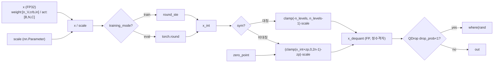
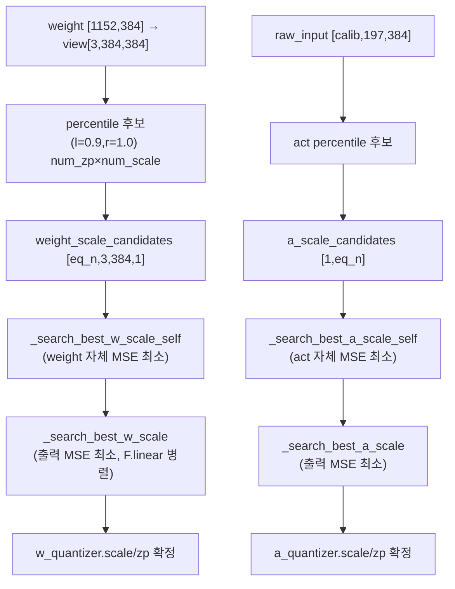
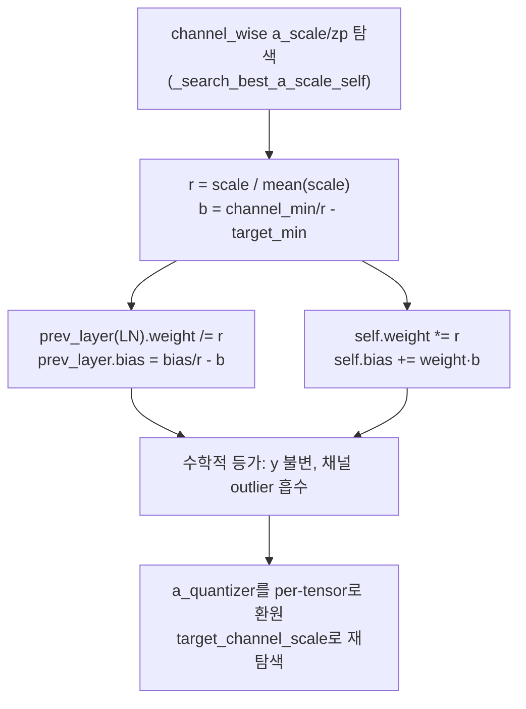
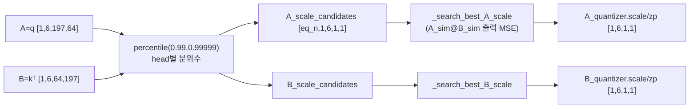
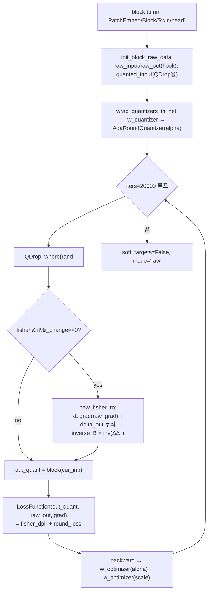
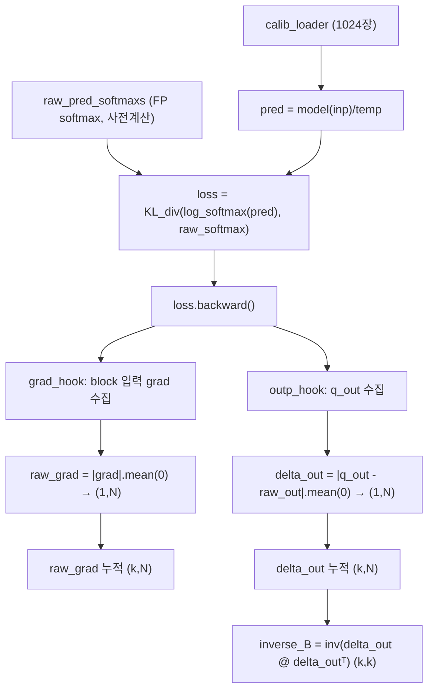
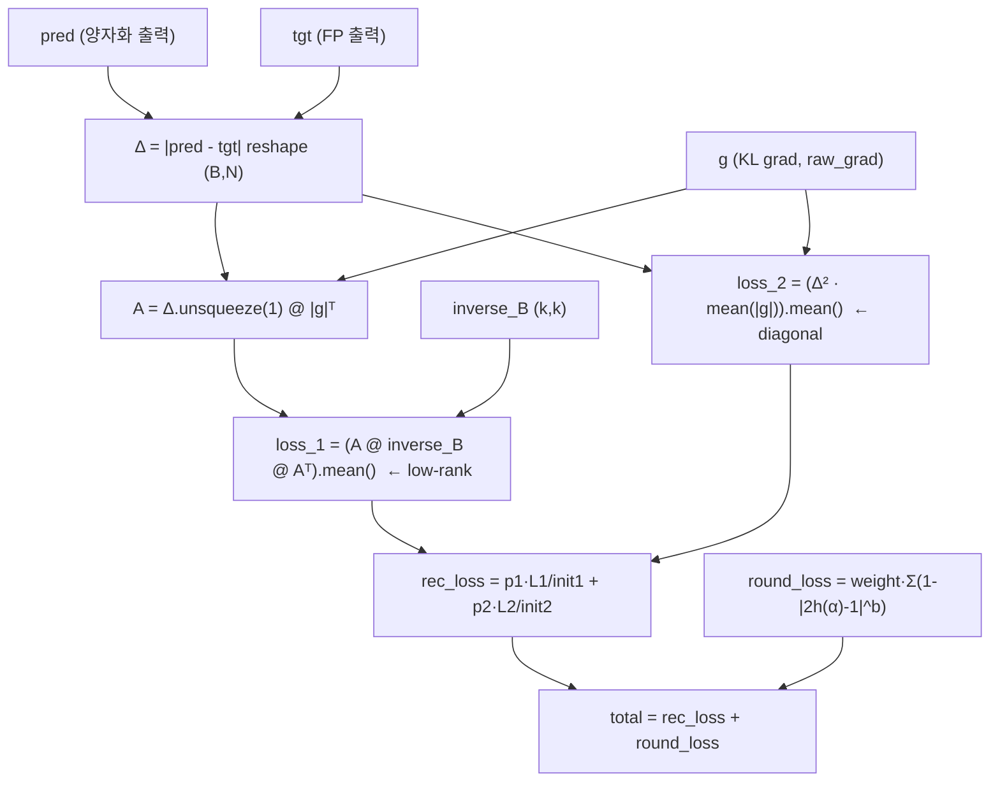
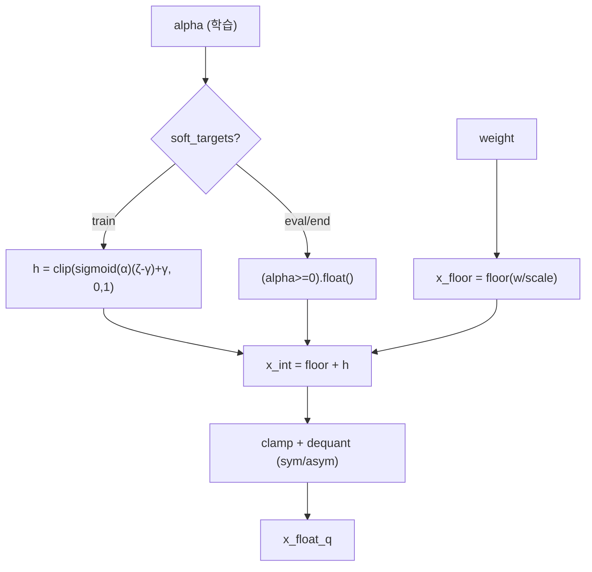
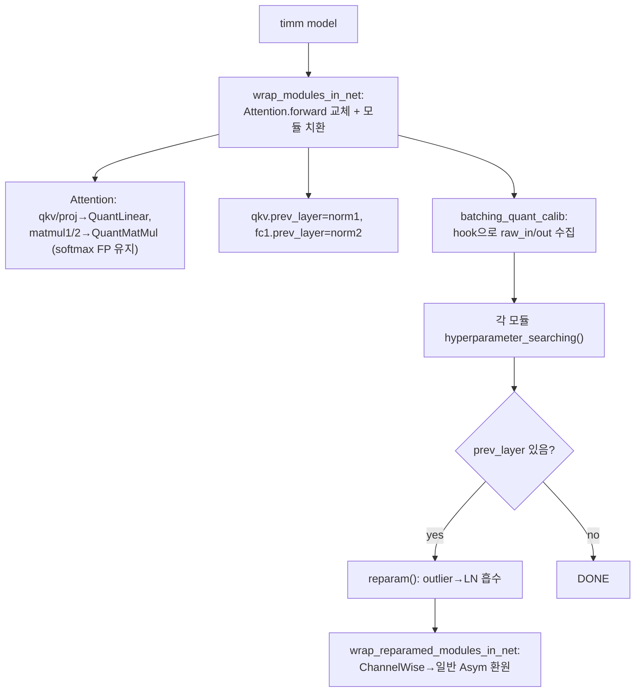

# FIMA-Q 모듈 통합 가이드 (S-PyTorch)

> 1차 요약: [`../FIMA-Q.md`](../FIMA-Q.md) — 본 문서는 그 요약을 모듈 단위로 심화한 통합 가이드다.
> 분석 대상: `\\wsl.localhost\ubuntu-24.04\home\user\project\PRJXR-HBTXR\REF\ViT-Quantization\FIMA-Q`
> 작성 원칙: 실제 소스 Read 후 `파일:라인` 근거 표기. 라인 근거 없는 추론은 "추정", 코드로 확인 불가는 "확인 불가"로 명시.
> 형제 가이드(`REF/Analysis/ViT-Quantization/I-ViT/MODULE_GUIDE.md`)의 6요소 구조를 따르되, HW 지표(MAC lanes/scalar MACs)는 **S-PyTorch 수치 규약**(params/FLOPs/activation memory/비트폭/observer/FIM 근사/reconstruction)으로 치환한다.

---

## 0. 문서 머리말

### 0.1 대표 케이스 선정
- **대표 모델: `deit_small_patch16_224` (DeiT-S)** — `--model deit_small`이 기본값(`test_quant.py:47`), model_zoo 매핑 `deit_small → deit_small_patch16_224`(`test_quant.py:195`). DeiT-S는 `embed_dim=384, depth=12, num_heads=6, head_dim=64, mlp_ratio=4, patch16, img224`(timm 표준; 본 repo는 timm 모델을 그대로 받아 양자화 모듈로 치환, `test_quant.py:208-224`). 근거:
  1. README 결과표에서 DeiT-S가 FP32 79.85 → **W4/A4 76.87 / W3/A3 69.13**으로 전 모델 중 정확도 손실/회복의 대표 케이스(`README.md:76`).
  2. README 예시 명령이 `vit_small`(=DeiT-S와 동일 구조 384/12/6)을 직접 사용(`README.md:52,58`). I-ViT 형제 가이드와 동일 모델군이라 교차 비교 용이.
- **I-ViT(QAT/정수전용)와의 본질적 차이**: I-ViT는 **fake-quant + QAT 재학습 + 정수/dyadic 추론 datapath**인 반면, FIMA-Q는 **PTQ(재학습 없음) + calibration scale 탐색 + 블록 reconstruction(AdaRound)** 이며 forward는 전부 **fake-quant(`x_dequant = round(x/scale)·scale`)** 로만 동작(`quantizers/uniform.py:30-40`). 즉 FIMA-Q에는 I-ViT의 `IntGELU/IntSoftmax/IntLayerNorm/fixedpoint_mul` 같은 **정수 비선형/dyadic 모듈이 없다**(비선형은 timm 원본 FP 그대로, `wrap_net.py:19-52`에서 softmax/scale은 FP로 둠). 본 가이드의 정량 중심축은 따라서 **(a) FIM 근사 메트릭, (b) PTQSL/percentile scale 탐색, (c) AdaRound block reconstruction** 세 가지다.
- **대표 분석 단위: timm ViT Block 1개** = `LN1 → Attention(qkv Linear, matmul1 QK, softmax(FP), matmul2 AV, proj Linear) → residual → LN2 → Mlp(fc1 Linear, GELU(FP), fc2 Linear) → residual`(`wrap_net.py:19-32`의 `vit_attn_forward` + timm Block). 양자화 대상은 **Linear 4개(qkv/proj/fc1/fc2) + MatMul 2개(QK/AV)** = 블록당 6개 양자화 모듈(`wrap_net.py:55-150`).
- **대표 FIM 근사 4종**: `fisher_dplr`(Diagonal+Low-Rank, configs default, `block_recon.py:457-465`), `fisher_diag`(대각, `:451-456`), `fisher_lr`(저랭크, `:445-450`), `fisher_brecq`(BRECQ식 diag Hessian, `:466-471`) — 논문 핵심 기여인 FIM 분해의 직접 청사진.

### 0.2 S-PyTorch 수치 규약 (HW의 MAC lanes/scalar MACs 대체)
- **params**: 모듈 차원에서 분석적 계산. Linear `in·out (+out bias)`. FIMA-Q 양자화 레이어는 `nn.Linear`/`nn.Conv2d`를 상속(`linear.py:8`, `conv.py:11`)하므로 **weight/bias params는 FP 원본과 동일**. 단 양자화 파라미터(`scale`, `zero_point`)가 **nn.Parameter로 추가**되고(`linear.py:91-92,277-280`), AdaRound 단계에서 weight당 `alpha`(weight와 동일 shape) 텐서가 한시적으로 추가된다(`adaround.py:36,67`).
- **FLOPs/MACs**: 표준식×config. Linear MAC = `B·N·in·out`. Attention QKᵀ = `B·H·N²·dh`, AV = `B·H·N²·dh`. 대표 레이어 1개를 DeiT-S(B=1,N=197,C=384,H=6,dh=64)로 산출 후 12 block 환원. **추가**: FIMA-Q는 calibration·reconstruction에서 `eq_n`개 scale 후보를 병렬 양자화하므로 **탐색 FLOPs**가 별도로 크다(아래 §3,§5에서 정량).
- **activation memory**: 텐서 shape × 비트폭. FIMA-Q는 fake-quant라 실제 메모리는 FP32지만, **정수 도메인 비트폭**(W/A bits)을 "HW 환산 activation bit"로 표기 — `shape × A_bit`. 비트폭은 config로 지정(W4/A4, W3/A3, W6/A6).
- **비트폭/observer**: 코드 직접. 기본 W4/A4(`configs/4bit/best.py:8-9`), Conv 입력은 A8(`qconv_a_bit=8`, `:10`), head 입력은 a_bit과 동일(`qhead_a_bit`, `:11`). weight는 **per-channel 비대칭**(`linear.py:275`), activation은 **per-tensor 또는 token/channel-wise 비대칭**(`linear.py:276`, token_channel_wise `:516-520`). observer = **percentile 후보 격자 탐색**(running min/max 아님; `linear.py:449-501`, `matmul.py:202-224`).
- **FIM 근사 메트릭**: KL-div task gradient `g`로 출력 오차 `Δ=|y_q-y_fp|`를 가중. diag = `E[g²]`, low-rank = `(Δᵀ G B⁻¹ Gᵀ Δ)`, DPLR = 둘의 가중합(`block_recon.py:445-471`).
- **reconstruction**: AdaRound(학습형 반올림) + QDrop + cosine temp. iters 기본 20000/블록, lr=4e-5(`block_recon.py:278-279`).
- **정확도/속도**: README/논문 인용(아래 0.4). 본 세션 미실행 → 측정 불가 항목은 "확인 불가".

### 0.3 운영 경로 (PTQ 2단계: Calibration → Optimization → 평가)
```
[timm FP 사전학습 로드] timm.create_model(model_zoo[args.model], pretrained/checkpoint)  (test_quant.py:208-210)
   │  pretrained timm 또는 AdaLog .bin 체크포인트 (README.md:23-29)
   ▼
[양자화 모듈 치환] wrap_modules_in_net(model, cfg, reparam): Attention.forward 교체 +
   │  Conv→AsymQuantConv, MatMul→AsymQuantMatMul, Linear→Asym(/ChannelWise)QuantLinear  (wrap_net.py:55-151)
   ▼
[1. Calibration] QuantCalibrator.batching_quant_calib():
   │  forward hook으로 각 모듈 raw_input/raw_out 수집 → hyperparameter_searching()
   │  percentile 후보 격자 → eq_n개 병렬 양자화 → 출력 MSE 최소 scale/zp 선택  (calibrator.py:37-85)
   │  ChannelWise Linear는 reparam()로 채널 outlier를 prev_layer(LN)에 흡수  (calibrator.py:77-79)
   ▼  wrap_reparamed_modules_in_net (ChannelWise→일반 Asym으로 환원)  (test_quant.py:239)
[calibrate 체크포인트 저장]  save_model(mode='calibrate')  (test_quant.py:242)
   ▼
[2. Optimization(선택, --optimize)] BlockReconstructor.reconstruct_model():
   │  블록 순차: raw_in/out 수집 → AdaRound wrap → Fisher 손실 + QDrop로 iters회 최적화  (block_recon.py:366-386)
   │  fisher_dplr면 new_fisher_ro로 KL grad + delta_out 누적, inverse_B 갱신  (block_recon.py:245-275)
   ▼
[optimize 체크포인트 저장]  save_model(mode='optimize')  (test_quant.py:253)
   ▼
[ImageNet 평가] validate(val_loader, model) → Top-1/5  (test_quant.py:258-262)
```
- 타깃 디바이스: **CUDA GPU 강제** — `_initialize_calib_parameters`가 CUDA 없으면 `EnvironmentError` raise(`linear.py:131-135`, `matmul.py:97-101`, `conv.py:157-161`). 후보 텐서·percentile·inverse_B 모두 `.cuda()` 하드코딩(`linear.py:237,461,475`; `block_recon.py:272`; `matmul.py:220`). → CPU 단독 실행 불가(코드 근거 확인, 실행 실패는 미검증).

### 0.4 모델 / 데이터셋 / 정확도 (README 인용)
| Model | embed/depth/heads | FP32 | W4/A4 | W3/A3 | 근거 |
|---|---|---|---|---|---|
| ViT-S | 384/12/6 | 81.39 | 76.68 | 64.09 | `README.md:73` |
| ViT-B | 768/12/12 | 84.54 | 83.04 | 77.63 | `README.md:74` |
| DeiT-T | 192/12/3 | 72.21 | 66.84 | 55.55 | `README.md:75` |
| **DeiT-S(대표)** | **384/12/6** | **79.85** | **76.87** | **69.13** | `README.md:76` |
| DeiT-B | 768/12/12 | 81.80 | 80.33 | 76.54 | `README.md:77` |
| Swin-S | (swin_small) | 83.23 | 81.82 | 77.26 | `README.md:78` |
| Swin-B | (swin_base) | 85.27 | 83.60 | 78.82 | `README.md:79` |
- 데이터셋: **ImageNet (ILSVRC/CLS-LOC)** `--dataset`, 224×224, 1000 클래스(`test_quant.py:54,214-218`, `README.md:43,52`). calibration 128장(`calib_size=128`), reconstruction 1024장(`optim_size=1024`)(`configs/4bit/best.py:4-5`).
- 모델 후보: vit/deit tiny~large, swin tiny~base_384(`test_quant.py:47-51`). pretrained는 timm 또는 AdaLog 릴리스 `.bin`(`README.md:26`).
- 속도(latency): **확인 불가**(본 repo는 fake-quant 정확도 측정만, 실측 latency 코드·실행 없음).
- 주의: README "Results" 헤더가 *"our proposed APHQ-ViT"* 로 오기되어 있으나(`README.md:69`), 표 값은 FIMA-Q 결과로 사용(선행작 APHQ-ViT 골격 공유 흔적, 추정).

---

## 1. Repo / Layer 개요

FIMA-Q = ViT/DeiT/Swin을 **소량 calibration만으로 저비트(W4/A4, W3/A3) PTQ**하는 프레임워크(`README.md:1-3`). 핵심 기여는 블록 reconstruction의 손실을 단순 MSE가 아니라 **Fisher Information Matrix를 Diagonal+Low-Rank(DPLR)로 근사**해 KL task-gradient로 가중하는 것(`block_recon.py:457-465`). 본 repo는 **timm 위에 얹은 커스텀 양자화 모듈**이 자체 소스이고, 모델 정의·DataLoader·softmax/GELU/LayerNorm 비선형은 timm을 그대로 사용한다(`wrap_net.py:7-9`, `test_quant.py:9`).

### 1.1 자체 소스 vs 외부 프레임워크 vs 제외

| 구분 | 파일(자체 소스) | 역할 |
|---|---|---|
| **블록 reconstruction** | `utils/block_recon.py` ★★핵심 | BlockReconstructor(FIM 수집 `new_fisher_ro`, AdaRound 최적화) + LossFunction(fisher_dplr/diag/lr/brecq) |
| **양자화 레이어** | `quant_layers/linear.py` ★핵심 | MinMax→PTQSL→Asym(Batching/ChannelWise) QuantLinear, percentile/reparam |
| | `quant_layers/matmul.py` ★ | QuantMatMul(QK/AV), head_channel_wise, percentile |
| | `quant_layers/conv.py` | QuantConv2d(PatchEmbed), per-channel weight |
| **양자화기** | `quantizers/uniform.py` ★ | UniformQuantizer(대칭/비대칭, fake-quant, QDrop) |
| | `quantizers/adaround.py` ★ | AdaRoundQuantizer(학습형 반올림, rectified sigmoid) |
| | `quantizers/logarithm.py` | Log2Quantizer(로그 양자화; 본 파이프라인 미연결, §12) |
| | `quantizers/_ste.py` | round_ste/floor_ste/ceil_ste |
| **calibration/조립** | `utils/calibrator.py` ★ | QuantCalibrator(hook 입출력 수집, batching_quant_calib) |
| | `utils/wrap_net.py` ★ | timm 모듈→양자화 모듈 치환, Attention.forward 교체, prev_layer 연결 |
| **엔트리/설정** | `test_quant.py` | argparse, calibrate/optimize/test 파이프라인 |
| | `configs/{3,4,6}bit/best.py`, `3bit/brecq.py` | Config(비트폭/Fisher/QDrop 하이퍼파라미터) |
| **보조(미정독)** | `utils/datasets.py`, `utils/test_utils.py` | ImageNet 로더, validate (세부 확인 불가) |

### 1.2 forward 진입점 (양자화 후 추론)
`validate`(`test_quant.py:233,244,260-262`) → `model(inp)` → timm forward + 교체된 `vit_attn_forward`(`wrap_net.py:19-32`). Attention 내부: `qkv(QuantLinear)` → reshape → `matmul1(QuantMatMul)(q, kᵀ)·scale` → `softmax(FP)` → `matmul2(QuantMatMul)(attn,v)` → `proj(QuantLinear)`. 각 양자화 모듈은 `mode`('raw'/'quant_forward'/'debug_*')에 따라 fake-quant 분기(`linear.py:26-37`).

### 1.3 제외 (지시에 따라 이름만 표기, 미분석)
- **외부 프레임워크(커스텀 아님)**: `timm.create_model`, `timm.models.vision_transformer.{Attention,Block}`, `timm.models.swin_transformer.*`, `timm.layers.patch_embed.PatchEmbed`(`wrap_net.py:7-9`, `block_recon.py:6-7,94-97`). timm/AdaLog **원본 사전학습 체크포인트**(`.bin`) — 가중치만 로드.
- **제외 디렉토리/파일**: `.git/`, `__pycache__`, `assets/main_fig.png`, `checkpoint(s)/`(대용량, 이름만), `LICENSE`.
- **미열람(확인 불가)**: `utils/datasets.py`(ImageNet 로더 세부), `utils/test_utils.py`(validate 세부), `utils/datasets.py`의 calib/val loader 구현. `quantizers/logarithm.py`는 정독했으나 **파이프라인에 미연결**(§12).

### 1.4 대표 모델 레이어 구성 (DeiT-S, 양자화 대상)
| 위치 | 양자화 모듈 | 비트폭(4bit config) | n_V/channel |
|---|---|---|---|
| PatchEmbed.proj(Conv 16×16 s16) | AsymQuantConv2d | W4 / A8(qconv) | per-ch weight |
| Block.attn.qkv (Linear 384→1152) | AsymChannelWise/AsymQuantLinear | W4/A4 | n_V=3 |
| Block.attn.matmul1 (QKᵀ) | AsymQuantMatMul | A4/A4 | head_channel_wise(6 heads) |
| Block.attn.matmul2 (AV) | AsymQuantMatMul | A4/A4 | head_channel_wise |
| Block.attn.proj (Linear 384→384) | AsymQuantLinear | W4/A4 | n_V=1 |
| Block.mlp.fc1 (Linear 384→1536) | AsymChannelWise/AsymQuantLinear | W4/A4 | n_V=1 |
| Block.mlp.fc2 (Linear 1536→384) | AsymQuantLinear | W4/A4 | n_V=1 |
| head (Linear 384→1000) | AsymQuantLinear | W4/A4(qhead) | n_V=1 |
근거: `wrap_net.py:78-150`, `configs/4bit/best.py:8-14`. n_V=3은 qkv 전용(`wrap_net.py:124`), prev_layer 연결은 reparam 대상(qkv→norm1, fc1→norm2, reduction→norm; `wrap_net.py:137-142`).

---

## 2. 모듈: 균일 양자화기 — `quantizers/uniform.py` (UniformQuantizer) ★

### 2.1 역할 + 상위/하위
- **역할**: FP 텐서를 **균일(uniform) fake-quant**(`round(x/scale)·scale`)하는 양자화기. 대칭/비대칭, per-tensor/channel-wise 지원. QDrop(양자화입력·FP입력 확률 혼합)과 STE(`round_ste`) 학습 모드 내장.
- **상위**: 모든 양자화 레이어가 `w_quantizer/a_quantizer/A_quantizer/B_quantizer`로 보유(`linear.py:18-19`, `matmul.py:17-18`, `conv.py:30-31`). **하위**: `round_ste`(`_ste.py:5-6`).

### 2.2 데이터플로우 (텐서 shape 흐름)


### 2.3 forward call stack
`MinMaxQuantLinear.quant_forward`(`linear.py:46`) → `self.a_quantizer(x)`/`self.w_quantizer(weight)` → `UniformQuantizer.forward`(`uniform.py:24`) → `round_ste` 또는 `torch.round`(`:30`) → clamp/dequant(`:31-36`).

### 2.4 대표 코드 위치
`uniform.py`: 클래스 `:7-43`, `n_levels=2^(n_bits-1)` `:12`, forward `:24-40`, 대칭/비대칭 분기 `:31-36`, QDrop `:28-29,37-39`. `_ste.py`: round_ste `:5-6`.

### 2.5 대표 코드 블록

```python
# uniform.py:30-36  fake-quant 핵심: round(x/scale) 후 clamp, 다시 ×scale로 dequant
x_int = round_ste(x / self.scale) if self.training_mode else torch.round(x / self.scale)
if self.sym:
    x_quant = x_int.clamp(-self.n_levels, self.n_levels - 1)        # 대칭: [-2^(b-1), 2^(b-1)-1]
    x_dequant = x_quant * self.scale
else:
    x_quant = (x_int + round_ste(self.zero_point)).clamp(0, 2 * self.n_levels - 1)  # 비대칭: [0, 2^b-1]
    x_dequant = (x_quant - round_ste(self.zero_point)) * self.scale
```
→ **출력이 FP(`x_dequant`)** 라는 점이 I-ViT(정수+scale 페어 전파)와 결정적 차이. zero_point도 `round_ste`로 정수화하나 dequant 후 FP로 환원 → **HW 직접 매핑은 별도 변환 필요**.

```python
# uniform.py:37-39  QDrop: 학습 시 양자화 출력과 원본을 확률 혼합 (reconstruction 정규화)
if self.training_mode and self.drop_prob < 1.0:
    x_prob = torch.where(torch.rand_like(x) < self.drop_prob, x_dequant, x_orig)
    return x_prob
```

```python
# _ste.py:5-6  STE: round의 미분불가를 우회 (forward는 round, backward는 identity)
def round_ste(x): return (x.round() - x).detach() + x
```

### 2.6 연산·수치표현 분해 + 정량
- **양자화 방식**: 균일 fake-quant. 대칭(`n_levels=2^(b-1)`, 범위 `[-2^(b-1),2^(b-1)-1]`) 또는 비대칭(`[0,2^b-1]`, zero_point 가산). per-tensor/channel-wise는 scale shape로 결정.
- **scale/zp**: nn.Parameter(레이어별 초기화). `n_bits==32`면 양자화 우회(FP 통과, `:25-26`).
- **비트폭**: config 지정(W4/A4/W3/A3/W6/A6, Conv A8). `n_bits<2^(b-1)` 등 모든 값이 b로 파생.
- **params**: 양자화기 자체는 scale/zero_point만(아래 레이어에서 정의). round/clamp는 학습 파라미터 0.
- **FLOPs**: 원소당 div+round+clamp(+가감) = O(N). 대표 qkv weight(384×1152=442K) fake-quant = 442K div+round (forward마다 재계산하지 않고 calibration 후 고정; reconstruction 중에는 매 step 재계산).
- **시사**: **fake-quant 출력이 FP** → FPGA 배포 전 dyadic/정수 datapath 변환 필요(I-ViT식 `(z·m)>>e`로). FIMA-Q는 "정확도 좋은 scale/round"를 찾는 역할, 정수 실행은 별도 작업(추정).

---

## 3. 모듈: PTQSL 스케일 탐색 Linear — `quant_layers/linear.py` (MinMax→PTQSL→AsymBatching) ★

### 3.1 역할 + 상위/하위
- **역할**: `nn.Linear` 가중치를 그룹화(`n_V × crb_rows`)해 채널별 scale로 양자화, activation은 per-tensor. **PTQSL(Parallel Quantization Scale Learning)**: `eq_n`개 scale 후보를 병렬 양자화해 **출력 유사도(-MSE) 최대** 후보를 argmax 선택. Asym 단계는 percentile 후보로 outlier robust.
- **상위**: `wrap_net.py:144`가 일반 Linear를 `AsymmetricallyBatchingQuantLinear`로 치환. **하위**: `UniformQuantizer`, `torch.quantile`(percentile), `F.linear`.

### 3.2 데이터플로우 (텐서 shape 흐름, DeiT-S qkv 예: in=384, out=1152, n_V=3)


### 3.3 forward call stack
`calibrator.batching_quant_calib`(`calibrator.py:76`) → `module.hyperparameter_searching`(`linear.py:503`) → `_initialize_calib_parameters`(`:504`, parallel_eq_n 결정) → percentile 후보(`:506-507`) → `_search_best_w_scale_self/a_scale_self`(`:508-509`) → search_round 반복 `_search_best_w_scale/_a_scale`(`:510-514`).

### 3.4 대표 코드 위치
`linear.py`: `MinMaxQuantLinear` `:8-61`, `PTQSLQuantLinear`(n_V 그룹화) `:64-105`, `PTQSLBatchingQuantLinear`(병렬 탐색) `:108-253`, `AsymmetricallyBatchingQuantLinear`(비대칭+percentile) `:256-524`, percentile 후보 `:449-501`, 병렬 탐색 본체 `:372-447`.

### 3.5 대표 코드 블록

```python
# linear.py:88-92  PTQSL 그룹화: out_features를 n_V×crb_rows로 나눠 채널 scale
self.crb_rows = out_features // n_V                       # qkv: 1152/3 = 384
self.w_quantizer.scale = nn.Parameter(torch.zeros((n_V, self.crb_rows, 1)))   # [3,384,1]
self.a_quantizer.scale = nn.Parameter(torch.zeros((1)))  # activation per-tensor
```

```python
# linear.py:167-190  eq_n개 weight scale 후보를 병렬 양자화 → 출력 유사도 argmax
for p_st in range(0, self.eq_n, self.parallel_eq_n):
    cur_w_scale = weight_scale_candidates[p_st:p_ed]
    w_sim = (w_sim / cur_w_scale).round_().clamp_(-n_levels, n_levels-1).mul_(cur_w_scale)
    out_sim = F.linear(x_sim, w_sim, bias_sim)            # 병렬 후보별 출력
    similarity = self._get_similarity(raw_out_expanded, out_sim, self.metric)  # -MSE/-MAE
best_index = batch_similarities.argmax(dim=0)             # 출력 오차 최소 scale 선택
```
→ **출력 기준 scale 선택**(weight 자체 오차가 아니라 레이어 출력 오차) = PTQSL의 핵심. `parallel_eq_n`은 GPU 메모리로 자동 결정(`:138`)해 후보를 배치 병렬 처리.

```python
# linear.py:449-468  percentile 기반 weight scale·zp 후보 격자 (outlier robust)
num_zp = min(16, self.w_quantizer.n_levels * 2)          # zero_point 후보 수
num_scale = int(self.eq_n / num_zp)
w_uppers = torch.quantile(weight_view, pct, dim=-1)      # l=0.9, r=1.0 분위수
splits = linspace(0,1,num_scale) * (delta_max - delta_min)
weight_scale_candidates = (delta_min + splits).repeat(num_zp) / (2*n_levels - 1)
zp_candidates = range(n_levels - num_zp/2, n_levels + num_zp/2)   # zp 격자
```
→ percentile(0.9~1.0)로 outlier를 잘라낸 동적범위에서 scale 후보 생성 → 큰 outlier에 scale이 끌려가는 것 방지.

### 3.6 연산·수치표현 분해 + 정량 (DeiT-S, B/calib별)
- **양자화 방식**: weight per-channel(n_V×crb_rows) 비대칭(`AsymmetricallyBatchingQuantLinear`, `:275`), activation per-tensor 비대칭(`:276`). MinMax/PTQSL 기본 클래스는 대칭이나 wrap_net이 Asym으로 치환(`wrap_net.py:144`).
- **scale/zp**: weight scale `[n_V,crb_rows,1]`+zp 동형, act scale `[1]`+zp `[1]`(`:277-280`). token_channel_wise면 act scale을 `[1,N,1]`로 확장(`:516-520`).
- **비트폭**: W4/A4(4bit config). head Linear는 A=qhead_a_bit(`wrap_net.py:112`).
- **params** (DeiT-S 1 block, weight/bias는 FP 원본 동일):
  - qkv: 384×1152 + 1152 = **443,520** (+ scale/zp: 2×3×384 = 2,304)
  - proj: 384×384 + 384 = **147,840** (+ scale/zp 2×384)
  - fc1: 384×1536 + 1536 = **591,360** (+ scale/zp 2×1536)
  - fc2: 1536×384 + 384 = **590,208** (+ scale/zp 2×384)
  - Linear params/block ≈ **1.773M** (FP 동일), 양자화 추가 params ≈ 수천(scale/zp).
- **추론 MACs/block** (B=1, N=197, fake-quant라 실제는 FP MAC):
  - qkv 87.1M / proj 29.0M / fc1 116.2M / fc2 116.2M → **348.5M/block**, ×12 ≈ **4.18G**.
- **calibration 탐색 비용** (대표 qkv): `eq_n=128`개 scale 후보 × calib 128장 × search_round=3 → `F.linear`를 후보 병렬로 ~128×3회 추가 평가. 출력 텐서 `[128,197,128후보,3,384]` 규모 → **calibration이 추론보다 메모리·연산 집약**(parallel_eq_n으로 분할, `:138`).
- **activation bit**: A4 → [1,197,384]×0.5byte = **37.8 KB**(HW 환산).

---

## 4. 모듈: 채널별 Linear + Reparam(등가변환) — `quant_layers/linear.py` (AsymmetricallyChannelWiseBatchingQuantLinear) ★

### 4.1 역할 + 상위/하위
- **역할**: activation을 **채널별(channel_wise)** 비대칭 양자화하되, calibration 후 **`reparam`으로 채널 outlier를 이전 레이어(LayerNorm)의 weight/bias에 등가 흡수**해 per-tensor로 환원. SmoothQuant/cross-layer equalization 계열. → 채널 scale 분산이 큰 ViT activation을 HW 친화적 per-tensor로 줄임.
- **상위**: `wrap_net.py:128-142`가 `qkv/fc1/reduction`(a_bit==w_bit & reparam 시)을 이 클래스로 치환하고 `prev_layer`를 LN으로 연결. `calibrator.py:77-79`가 `reparam()` 호출. **하위**: `AsymmetricallyBatchingQuantLinear.hyperparameter_searching`(reparam 후 재탐색).

### 4.2 데이터플로우 (등가변환)


### 4.3 forward call stack
`calibrator.batching_quant_calib`(`calibrator.py:76`) → `hyperparameter_searching`(`linear.py:564`, channel_wise act self-search) → (`calibrator.py:79`) `module.reparam()`(`linear.py:589`) → `reparam_step1`(`:571`) → `AsymmetricallyBatchingQuantLinear.hyperparameter_searching`(`:596`, per-tensor 재탐색).

### 4.4 대표 코드 위치
`linear.py`: 클래스 `:527-597`, prev_layer property `:550-562`, `reparam_step1`(등가변환) `:571-587`, `reparam` `:589-596`. 연결: `wrap_net.py:128-142`(prev_layer 지정), `wrap_reparamed_modules_in_net`(`:154-191`, ChannelWise→일반 Asym 환원).

### 4.5 대표 코드 블록

```python
# linear.py:571-587  reparam_step1: 채널 scale을 평균으로 정규화하며 LN에 역스케일 흡수
target_channel_scale = torch.mean(self.a_quantizer.scale).view(1)    # per-tensor 목표 scale
r = (self.a_quantizer.scale / target_channel_scale)                  # 채널별 역스케일 인자
b = channel_min / r - target_channel_min                             # bias 보정항
self.prev_layer.weight.data = self.prev_layer.weight.data / r        # LN weight에 1/r 흡수
self.prev_layer.bias.data   = self.prev_layer.bias.data / r.view(-1) - b
self.weight.data = self.weight.data * r.view(1, -1)                  # 현재 weight에 r 곱
self.bias.data   = self.bias.data + torch.mm(self.weight.data, b.reshape(-1,1)).reshape(-1)
```
→ `(x/r - b)` 입력에 `(W·r)` weight를 적용하면 출력 불변(수학적 등가). 채널별로 다르던 동적범위가 균일화되어 per-tensor 양자화 손실↓. **FPGA에서 per-channel scale 회로를 제거하고 per-tensor datapath로 단순화**하는 직접 근거.

```python
# linear.py:589-596  reparam: raw_input도 등가변환 후 per-tensor로 재탐색
self.raw_input = (self.raw_input.cuda() / r - b).cpu()
self.a_quantizer.channel_wise = False
self.a_quantizer.scale = nn.Parameter(target_channel_scale)
AsymmetricallyBatchingQuantLinear.hyperparameter_searching(self)    # per-tensor 재탐색
```

### 4.6 연산·수치표현 분해 + 정량
- **양자화 방식**: (calibration 시) act per-channel 비대칭 → (reparam 후) per-tensor 비대칭. weight per-channel 비대칭 유지.
- **적용 대상**: `qkv`(prev=norm1), `fc1`(prev=norm2), `reduction`(prev=norm, swin)(`wrap_net.py:137-142`). 조건: `cur_a_bit == cfg.w_bit and reparam`(`wrap_net.py:128`).
- **params**: 등가변환은 LN/현재 weight를 **in-place 수정**(추가 params 없음). act scale은 채널별 `[in_features]`(`:546`) → reparam 후 `[1]`로 축소.
- **FLOPs**: reparam은 weight·bias 일회성 변환(O(weight)). 추론 비용은 일반 Linear와 동일.
- **시사**: LN가 양자화 대상이 아님(timm FP LN 그대로)에도 LN weight/bias에 outlier를 흡수 → **양자화-비양자화 경계를 활용한 등가변환**. HG-PIPE류 per-tensor datapath에 ViT를 올릴 때 채널 outlier 흡수 레퍼런스. 단 LN weight가 수정되므로 정수 LN(I-ViT식)과 결합 시 LN 재계산 필요(추정).

---

## 5. 모듈: Attention 행렬곱 양자화 — `quant_layers/matmul.py` (AsymmetricallyBatchingQuantMatMul) ★

### 5.1 역할 + 상위/하위
- **역할**: Attention의 QKᵀ(matmul1), attn·V(matmul2)를 양자화. 두 입력 A/B 각각 quantizer. **head_channel_wise**(head 차원 dim-1별 scale)로 head별 분포 차이 대응. percentile(l=0.99, r=0.99999) 후보로 A/B scale·zp 교대 탐색.
- **상위**: `wrap_net.py:58-59`가 Attention에 `matmul1/matmul2`(MatMul 더미) 주입 → `wrap_net.py:96-110`이 `AsymmetricallyBatchingQuantMatMul`로 치환. **하위**: `UniformQuantizer`, `torch.quantile`, `@`.

### 5.2 데이터플로우 (텐서 shape 흐름, DeiT-S matmul1)


### 5.3 forward call stack
calib: `hyperparameter_searching`(`matmul.py:226`) → percentile 후보(`:228-233`) → `_search_best_A_scale`(`:241`)/`_search_best_B_scale`(`:242`) → search_round 교대 탐색(`:243-267`). 추론: `MinMaxQuantMatMul.quant_forward`(`:40-42`) → `quant_input_A(A) @ quant_input_B(B)`.

### 5.4 대표 코드 위치
`matmul.py`: `MinMaxQuantMatMul` `:12-43`, `PTQSLQuantMatMul`(head_channel_wise scale shape `[1,heads,1,1]`) `:45-83`, `AsymmetricallyBatchingQuantMatMul` `:109-282`, percentile `:202-224`, A/B 교대 탐색 `:243-267`, token_channel_wise 확장 `:269-277`.

### 5.5 대표 코드 블록

```python
# matmul.py:67-74  head_channel_wise: head 차원(dim-1)별 scale
target_shape = [1, self.num_heads, 1, 1]                  # DeiT-S: [1,6,1,1]
self.A_quantizer.scale = nn.Parameter(torch.zeros(*target_shape))
self.B_quantizer.scale = nn.Parameter(torch.zeros(*target_shape))
```

```python
# matmul.py:144-148  A scale 후보 병렬 양자화 → A@B 출력 유사도
A_quant = ((A_sim / cur_A_scale).round_() + cur_A_zero_point).clamp(0, 2*n_levels-1)
A_sim = (A_quant - cur_A_zero_point).mul_(cur_A_scale)    # 비대칭 dequant
out_sim = A_sim @ B_sim                                   # [parallel_eq_n,b,*,dim1,dim3]
similarity = self._get_similarity(raw_out, out_sim, self.metric)   # 출력 -MSE
```

```python
# matmul.py:202-224  percentile(0.99~0.99999) 후보: attention의 극단 outlier 처리
def calculate_percentile_candidates(self, x, l=0.99, r=0.99999):
    uppers_candidates = torch.quantile(x_, pct, dim=-1).mean(dim=-1)   # head별 상위 분위
    u_splits = linspace(0,1,eq_n+1) * (uppers[1] - uppers[0])
    upper_candidates = uppers[0] + u_splits                            # eq_n개 upper 격자
```
→ Linear(0.9~1.0)보다 **더 공격적인 percentile(0.99~0.99999)** — attention score/value의 극단 outlier 분포 반영. token_channel_wise면 scale을 토큰별 `[1,H,N,1]`/`[1,H,1,M]`로 확장(`:269-277`).

### 5.6 연산·수치표현 분해 + 정량 (DeiT-S, B=1, H=6, N=197, dh=64)
- **양자화 방식**: A/B 모두 per-head 비대칭(head_channel_wise=True, `configs/4bit/best.py:13`). zp 포함.
- **비트폭**: A4/A4(matmul A_bit=B_bit=a_bit, `wrap_net.py:99-100`).
- **params**: weight 없음(행렬곱). scale/zp만: A/B 각 `[1,6,1,1]`=6 → 24개(+token_channel_wise면 N배).
- **추론 MACs/block**:
  - QKᵀ(matmul1): H·N²·dh = 6×197²×64 ≈ **14.9M**
  - attn·V(matmul2): 6×197²×64 ≈ **14.9M**
  - Attention matmul MAC/block ≈ **29.8M**, ×12 ≈ **358M**.
- **activation memory**: attn score `[1,6,197,197]` A4 = 6×197²×0.5 ≈ **116 KB** (블록 내 최대 단일 활성). softmax는 FP(timm) — 양자화 안 됨.
- **calibration 비용**: A/B 각 eq_n=128 후보 × search_round=3 × 2(A/B 교대) → `@`를 후보 병렬로 다수 평가. N²(=38809) 텐서가 후보배수로 확장 → **GPU 메모리 압박 최대 지점**(parallel_eq_n 분할, `:105`).
- **시사**: N² 텐서가 가장 큰 중간 활성 → FPGA에서 attn 행렬 타일링·on-chip 재사용 핵심. head별 scale은 HW에서 head 병렬 PE별 scale 레지스터로 매핑 가능(추정).

---

## 6. 모듈: PatchEmbed Conv 양자화 — `quant_layers/conv.py` (AsymmetricallyBatchingQuantConv2d)

### 6.1 역할 + 상위/하위
- **역할**: 입력 이미지 패치 투영(16×16 stride16 conv) 양자화. per-channel(out) 비대칭 weight, 입력은 A8(qconv). percentile 후보로 weight scale 탐색(activation은 a_bit≥8이면 양자화 우회).
- **상위**: `wrap_net.py:78-95`가 `nn.Conv2d`를 치환. **하위**: `UniformQuantizer`, `torch.quantile`, `F.conv2d`.

### 6.2 forward call stack
calib: `hyperparameter_searching`(`conv.py:283`) → `_initialize_activation_scale`(`:285`) → percentile weight 후보(`:291-293`) → `_search_best_w_scale`(`:294`) → search_round(`:297-311`). 추론: `quant_forward`(`:60-65`), `quant_input`은 a_bit≥8이면 x 그대로 반환(`:55-58`).

### 6.3 대표 코드 위치
`conv.py`: `MinMaxQuantConv2d` `:11-75`, `quant_input` A8 우회 `:55-58`, `PTQSLBatchingQuantConv2d` `:131-209`, `AsymmetricallyBatchingQuantConv2d` `:211-314`, percentile weight `:273-281`, weight 탐색 `:236-271`.

### 6.4 대표 코드 블록
```python
# conv.py:55-58  conv 입력은 a_bit>=8이면 양자화 생략 (qconv_a_bit=8 → 입력 FP 유지)
def quant_input(self, x):
    if self.a_quantizer.n_bits >= 8:
        return x
    return self.a_quantizer(x)
```
→ PatchEmbed 입력(이미지)은 A8로 충분 → 사실상 weight만 W4 양자화. 첫 레이어 정확도 보호(저비트 입력 양자화 회피).

```python
# conv.py:273-281  weight percentile 후보 (비선형 분위 간격, k=0.5)
pct = torch.tensor([l + (r-l)*(i/(eq_n-1))**k for i in range(eq_n)] + [1.0])  # l=0.99,r=0.9999
w_uppers_candidates = torch.quantile(self.weight.view(out_channels, -1), pct, dim=-1)
```

### 6.5 연산·수치표현 분해 + 정량 (DeiT-S PatchEmbed)
- **양자화 방식**: weight per-channel(out=384) 비대칭 W4, 입력 A8(우회 → FP). scale/zp `[384,1]`(`:233-234`).
- **params**: 384×3×16×16 + 384 = **295,296**(FP 동일) + scale/zp 2×384.
- **MACs**: out 14×14=196 위치 × 384 × (3×16×16=768) ≈ **57.8M**(전 모델 1회).
- **activation memory**: 출력 [1,384,14,14]→[1,196,384]. 입력 A8 우회로 첫단 정밀도 보존.

---

## 7. 모듈: 블록 reconstruction 본체 — `utils/block_recon.py` (BlockReconstructor) ★★

### 7.1 역할 + 상위/하위
- **역할**: calibration 후 **블록 단위로 AdaRound + Fisher 손실 + QDrop reconstruction**. 블록의 raw_input/raw_out을 수집, weight quantizer를 AdaRoundQuantizer로 교체(alpha 학습), Fisher 정보(KL grad + delta_out)를 주기적으로 갱신해 출력 오차를 task-aware로 가중 최소화.
- **상위**: `test_quant.py:250-251`(`--optimize`). **하위**: `QuantCalibrator`(상속, hook), `AdaRoundQuantizer`, `LossFunction`, timm 블록 타입.

### 7.2 데이터플로우 (블록 1개 reconstruction)


### 7.3 forward call stack
`reconstruct_model`(`block_recon.py:366`) → 블록별 `init_block_raw_data`(`:374`) → `reconstruct_single_block`(`:376`): `wrap_quantizers_in_net`(`:281`) → 루프(`:312`): `new_fisher_ro`(`:328`) → `block(cur_inp)`(`:342`) → `loss_func`(`:344`) → `backward/step`(`:347-351`).

### 7.4 대표 코드 위치
`block_recon.py`: 블록 타입 등록 `:93-102`, forward MethodType 교체(perturb) `:17-77,112-119`, `init_block_brecq_hessian`(BRECQ FIM) `:225-243`, `new_fisher_ro`(저랭크 FIM) `:245-275`, `reconstruct_single_block` `:277-363`, QDrop `:286-287,314-317`, Fisher 스케줄 `:324-334`, hard rounding 고정 `:353-360`, `reconstruct_model` `:366-386`.

### 7.5 대표 코드 블록

```python
# block_recon.py:281-307  weight를 AdaRound, activation scale을 학습 대상으로
self.wrap_quantizers_in_net(block, name)                 # w_quantizer → AdaRoundQuantizer
w_params += [module.w_quantizer.alpha]                    # weight: AdaRound alpha
if quant_act:
    module.a_quantizer.scale.requires_grad = True
    a_params += [module.a_quantizer.scale]                # activation: scale 학습
w_optimizer = torch.optim.Adam(w_params)                 # alpha용 (default lr)
a_optimizer = torch.optim.Adam(a_params, lr=lr)          # scale용 lr=4e-5
a_scheduler = CosineAnnealingLR(a_optimizer, T_max=iters)
```

```python
# block_recon.py:314-317  QDrop: 양자화입력과 FP입력을 drop_prob로 확률 혼합
cur_quant_inp = block.quanted_input[idx]                 # 이전 블록까지 양자화된 입력
cur_fp_inp = block.raw_input[idx]                        # FP 입력
cur_inp = torch.where(torch.rand_like(cur_quant_inp) < drop_prob, cur_quant_inp, cur_fp_inp)
```
→ drop_prob=0.5(`configs/4bit:28`): 절반은 양자화입력, 절반은 FP입력 → 누적 양자화 오차에 robust한 reconstruction.

```python
# block_recon.py:324-334  Fisher 갱신 스케줄: dis_mode 'q'면 iters/k 간격, 'qf'면 처음 k회
i_change = math.floor(iters / self.k)                    # k=5 → 4000 step마다
if self.dis_mode in ['q'] and it % i_change == 0:
    self.new_fisher_ro(block, device)                    # FIM 갱신 (k개 row 누적)
    loss_func.update_fisher = True
```

### 7.6 연산·수치표현 분해 + 정량 (DeiT-S, k=5, iters=20000)
- **reconstruction 단위**: PatchEmbed 1 + Block 12 + head 1 = **14 블록**(`block_recon.py:93-102`). 블록당 iters=20000(`:278`).
- **FIM 갱신 비용**: `new_fisher_ro`는 calib_loader 전체(optim_size=1024, batch=32 → 32 iter)를 forward+backward(`:250-256`). dis_mode='q'면 블록당 k=5회 갱신 → **블록당 5×1024장 backward**. inverse_B는 `[k,k]=[5,5]` 역행렬(`:272`, 저비용).
- **메모리**: raw_grad/delta_out `[k,N]`(N=블록 출력 flatten). DeiT-S Block 출력 [197,384] flatten → N=75,648. raw_grad `[5,75648]`, inverse_B `[5,5]`.
- **AdaRound params**: weight당 alpha(weight 동형). qkv alpha 384×1152=442K(블록당 일시 추가, reconstruction 후 `del`, `:384`).
- **시간 비용**: 14블록 × 20000 iter × (batch 32 forward+backward) + 14블록 × 5 × 1024 FIM backward → **calibration보다 훨씬 큼**(저비트 정확도의 주 비용). 실측 시간 확인 불가.
- **시사**: FPGA 배포에는 reconstruction 결과(고정 scale + hard-rounded weight)만 필요 → **학습 비용은 오프라인 1회**. 추론 datapath와 무관.

---

## 8. 모듈: Fisher 정보 수집 — `utils/block_recon.py` (new_fisher_ro / init_block_brecq_hessian) ★★

### 8.1 역할 + 상위/하위
- **역할**: 블록 reconstruction의 손실 가중에 쓸 **Fisher 정보**를 수집. KL-div(FP softmax ‖ 양자화 softmax) gradient `g`를 블록 입력에서 backward로 받고(`raw_grad`), 양자화 출력 오차 `delta_out`을 누적. low-rank FIM의 역행렬 항 `inverse_B = inv(ΔΔᵀ)`를 계산.
- **상위**: `reconstruct_single_block`이 Fisher 스케줄에 따라 호출(`:328,332`). **하위**: `F.kl_div`, `register_full_backward_hook`(grad_hook), `torch.linalg.inv`.

### 8.2 데이터플로우 (FIM 근사 수집)


### 8.3 forward call stack
`reconstruct_single_block`(`:328`) → `new_fisher_ro`(`:245`) → forward hook(outp) + backward hook(grad)(`:248-249`) → calib 루프 KL backward(`:250-256`) → raw_grad/delta_out 누적(`:266-271`) → `torch.linalg.inv`(`:272`).

### 8.4 대표 코드 위치
`block_recon.py`: `init_block_brecq_hessian`(BRECQ식 diag FIM, fisher_brecq 전용) `:225-243`, `new_fisher_ro`(DPLR/lr/diag용 저랭크 갱신) `:245-275`, KL loss `:234,254`, inverse_B `:272`.

### 8.5 대표 코드 블록

```python
# block_recon.py:234  Fisher gradient = KL-div(FP softmax ‖ 양자화 softmax)의 grad
loss = F.kl_div(F.log_softmax(pred, dim=-1), self.raw_pred_softmaxs[i], reduction="batchmean")
loss.backward()                                          # block 입력단 grad → raw_grad
```
→ **task loss(분류 KL)를 대리**. FIM ≈ E[gradient gradientᵀ]에서 gradient를 KL grad로 근사 → 양자화가 최종 분류에 주는 영향을 출력 채널별로 정량.

```python
# block_recon.py:257-272  raw_grad/delta_out 누적 후 저랭크 역행렬
raw_grad = raw_grad.reshape(raw_grad.shape[0], -1).abs().mean(dim=0).unsqueeze(0)   # (1,N)
delta_out = (q_out - block.raw_out).abs().mean(dim=0).reshape(1, -1)                # (1,N)
block.raw_grad  = torch.cat([block.raw_grad,  raw_grad],  dim=0)  # (k,N) k회 누적
block.delta_out = torch.cat([block.delta_out, delta_out], dim=0)  # (k,N)
block.inverse_B = torch.linalg.inv(block.delta_out @ block.delta_out.transpose(1,0))  # (k,k)
```
→ `delta_out @ delta_outᵀ`는 `[k,k]` (k=5, 작음) → 역행렬 저비용. 이것이 **low-rank FIM의 B⁻¹** 항으로 DPLR 손실에 쓰임(§9.5).

```python
# block_recon.py:238  fisher_brecq 전용: grad의 절댓값을 그대로 보관 (per-sample)
block.raw_grad = raw_grads.abs().reshape(raw_grads.shape[0], -1)   # (calib, N), diag Hessian용
```

### 8.6 연산·수치표현 분해 + 정량
- **근사 종류**: (a) BRECQ diag(`init_block_brecq_hessian`, per-sample |grad|) — fisher_brecq 전용; (b) 저랭크/DPLR(`new_fisher_ro`, k-row 누적 + inverse_B) — fisher_lr/diag/dplr.
- **k(rank)**: 기본 5(`configs/4bit:22`). raw_grad/delta_out 모두 `[k,N]`, inverse_B `[k,k]`.
- **비용**: 갱신 1회 = calib 1024장 forward+backward(KL). dis_mode='q'면 블록당 k회, 'qf'면 처음 k step만(`block_recon.py:326-333`).
- **수치 안정**: `exp_int_sum.clamp` 없음; inverse_B는 `torch.linalg.inv`(특이행렬 시 실패 가능, 주석에 eye 대체 코드 존재 `:273`, 미사용).
- **시사**: FIM 근사는 **오프라인 calibration 단계 연산** — FPGA 추론 datapath와 무관. 단 "어떤 채널이 task에 민감한가"의 정보는 mixed-precision/채널 가지치기 설계에 재활용 가능(추정).

---

## 9. 모듈: Fisher 손실 함수 — `utils/block_recon.py` (LossFunction) ★★

### 9.1 역할 + 상위/하위
- **역할**: reconstruction 손실 = **rec_loss(Fisher 가중 출력 오차) + round_loss(AdaRound 정규화)**. rec_loss는 metric별 분기: mse/mae/fisher_lr/fisher_diag/**fisher_dplr**/fisher_brecq/kl_div. DPLR이 논문 핵심.
- **상위**: `reconstruct_single_block`이 매 step 호출(`:344,346`). **하위**: `lp_loss`, `LinearTempDecay`(round_loss 온도), AdaRoundQuantizer.get_soft_targets.

### 9.2 데이터플로우 (fisher_dplr)


### 9.3 forward call stack
`reconstruct_single_block`(`:344`) → `LossFunction.__call__`(`:423`) → metric 분기(`:435-475`) → round_loss(`:477-487`) → total(`:489`).

### 9.4 대표 코드 위치
`block_recon.py`: 클래스 `:388-493`, `lp_loss` `:413-421`, fisher_lr `:445-450`, fisher_diag `:451-456`, **fisher_dplr `:457-465`**, fisher_brecq `:466-471`, kl_div `:472-473`, round_loss `:477-487`, `LinearTempDecay` `:496-513`.

### 9.5 대표 코드 블록

```python
# block_recon.py:457-465  fisher_dplr: Diagonal + Low-Rank FIM 근사 (논문 핵심, configs default)
cha = (pred - tgt).abs().reshape(pred.shape[0], -1)       # Δ = |y_q - y_fp|  (B,N)
A = cha.unsqueeze(1) @ grad.abs().transpose(0, 1)         # A = Δ · |g|ᵀ      (B,1,k)
loss_1 = (A @ self.block.inverse_B @ A.transpose(1, 2)).mean()    # low-rank: ΔᵀG B⁻¹ GᵀΔ
loss_2 = (cha.pow(2) * grad.abs().mean(dim=0)).mean()    # diagonal: Σ Δ²·E[|g|]
rec_loss = self.p1 * loss_1 / self.init_loss_1 + self.p2 * loss_2 / self.init_loss_2  # p1=p2=1
```
→ **FIM ≈ Diagonal + Low-Rank(DPLR)**. low-rank 항은 `inverse_B`(§8)로 채널 상관을, diag 항은 채널별 |g|로 중요도를 반영. 각 항을 첫 step 값(`init_loss`)으로 정규화해 스케일 균형.

```python
# block_recon.py:451-456  fisher_diag: 대각 FIM 가중 MSE (DPLR의 diag 성분만)
loss_2 = (cha.pow(2) * grad.abs().mean(dim=0)).mean()    # Δ² · E[|g|]
rec_loss = 2 * loss_2 / self.init_loss_2
```

```python
# block_recon.py:480-485  round_loss: AdaRound 정규화 (h를 0/1로 밀어붙임)
b = self.temp_decay(self.count)                          # cosine 온도 감쇠 (20→2)
for module in block: if w_quantizer:
    round_vals = module.w_quantizer.get_soft_targets()   # rectified sigmoid h(α)
    round_loss += weight * (1 - ((round_vals - .5).abs() * 2).pow(b)).sum()
```
→ `1-|2h-1|^b`는 h가 0.5(애매)일 때 최대, 0/1(확정)일 때 0 → 반올림 결정을 점진적으로 확정. b는 `LinearTempDecay`로 감쇠(`:496-513`).

### 9.6 연산·수치표현 분해 + 정량
- **metric 종류**: mse/mae(기본 Lp), fisher_lr(`(Δ·|g|).mean²`), fisher_diag(`Δ²·E|g|`), **fisher_dplr**(lr+diag), fisher_brecq(`Δ²·g²`), kl_div(head 전용). head 블록은 강제 kl_div(`:309`).
- **하이퍼파라미터**: p1(low-rank 비중)=p2(diag 비중)=1.0(`configs/4bit:23-24`), weight(round_loss)=0.01(`block_recon.py:278`), b_range=(20,2), warmup=0.2(`:279,310`).
- **정규화**: 각 항을 `init_loss`(첫 step 또는 Fisher 갱신 시)로 나눠 스케일 무관화(`:462-464`).
- **연산**: `A @ inverse_B @ Aᵀ`는 `[B,1,k]@[k,k]@[B,k,1]` → 저차원(k=5) 행렬곱, 저비용.
- **시사**: DPLR은 **양자화 손실을 task-aware로 가중** → 단순 MSE/BRECQ 대비 저비트 정확도↑(README W3/A3 동작 근거). FPGA 무관(오프라인). 회귀 task(시선 좌표)엔 KL/softmax 기반 손실 정의 수정 필요(추정).

---

## 10. 모듈: AdaRound 학습형 반올림 — `quantizers/adaround.py` (AdaRoundQuantizer) ★

### 10.1 역할 + 상위/하위
- **역할**: weight 반올림을 **올림/내림 중 학습**으로 결정(`floor + h(α)`). rectified sigmoid `h(α)`로 [0,1] soft target, reconstruction 중 alpha를 최적화하고 종료 시 hard(`alpha≥0`)로 확정.
- **상위**: `wrap_quantizers_in_net`이 MinMax/Conv weight quantizer를 교체(`block_recon.py:142-148`). **하위**: `UniformQuantizer`(scale/zp 상속), `round_ste`.

### 10.2 데이터플로우


### 10.3 forward call stack
reconstruction: `block(cur_inp)`(`block_recon.py:342`) → Linear `quant_weight_bias` → `AdaRoundQuantizer.forward`(`adaround.py:38`) → `get_soft_targets`(`:59`). 종료: `get_hard_value`(`block_recon.py:383`, weight에 hard 값 복사).

### 10.4 대표 코드 위치
`adaround.py`: 클래스 `:7-77`, forward `:38-57`, `get_soft_targets`(rectified sigmoid) `:59-60`, `init_alpha`(nearest로 초기화) `:62-69`, `get_hard_value` `:71-73`, gamma/zeta `:34`.

### 10.5 대표 코드 블록

```python
# adaround.py:43-48  학습형 반올림: floor + soft/hard target
x_floor = torch.floor(x / self.scale)
if self.soft_targets:
    x_int = x_floor + self.get_soft_targets()            # 학습 중: [0,1] 연속
else:
    x_int = x_floor + (self.alpha >= 0).float()          # 종료: 0 또는 1 확정
```

```python
# adaround.py:59-66  rectified sigmoid + nearest로 alpha 초기화
def get_soft_targets(self):
    return torch.clamp(torch.sigmoid(self.alpha)*(self.zeta-self.gamma)+self.gamma, 0, 1)  # ζ=1.1,γ=-0.1
def init_alpha(self, x):
    rest = (x / self.scale) - torch.floor(x / self.scale)               # [0,1) 반올림 잔차
    alpha = -torch.log((self.zeta-self.gamma)/(rest-self.gamma) - 1)    # sigmoid(alpha)=rest
```
→ ζ=1.1, γ=-0.1의 rectified sigmoid는 0/1을 명확히 표현(saturating). 초기 alpha는 `sigmoid(α)=rest`로 설정해 **처음엔 nearest 반올림과 동일** → 안정적 시작.

### 10.6 연산·수치표현 분해 + 정량
- **양자화 방식**: weight 전용 학습형 반올림. scale/zp는 UniformQuantizer에서 복사(`:26-27`), sym/asym 모두 지원(`:51-56`).
- **params**: alpha(weight 동형, 일시적). qkv alpha 384×1152=442K(reconstruction 중만, 종료 시 `del`, `block_recon.py:384`).
- **FLOPs**: forward당 floor+sigmoid+clip+dequant = O(weight). reconstruction 20000 step × 블록 weight 재계산.
- **종료**: `soft_targets=False`(`block_recon.py:356`) → hard, 이후 `get_hard_value`로 weight.data에 영구 복사 + alpha 삭제 + round_mode='nearest'(`:382-385`) → **추론 시 일반 weight**.
- **시사**: AdaRound는 weight를 더 좋은 정수격자로 확정 → FPGA에는 **확정된 정수 weight만 배포**(alpha/sigmoid는 오프라인). 추론 datapath에 추가 비용 없음.

---

## 11. 모듈: calibration 조립 + 모듈 치환 — `utils/calibrator.py` + `utils/wrap_net.py` ★

### 11.1 역할 + 상위/하위
- **역할(calibrator)**: forward hook으로 각 양자화 모듈의 raw_input/raw_out을 수집(CPU 캐시) 후 `hyperparameter_searching`을 순차 호출. ChannelWise Linear는 `reparam` 적용.
- **역할(wrap_net)**: timm Attention.forward를 `matmul1/matmul2` 더미를 쓰는 버전으로 교체하고, Conv/MatMul/Linear를 양자화 모듈로 치환. reparam 대상 Linear에 prev_layer(LN) 연결.
- **상위**: `test_quant.py:224,237-239`. **하위**: 양자화 레이어 전부, timm Attention/WindowAttention.

### 11.2 데이터플로우


### 11.3 forward call stack
`test_quant.py:224` → `wrap_modules_in_net`(`wrap_net.py:55`) → Attention.forward 교체(`:57-64`) + 모듈 치환(`:66-150`). `test_quant.py:238` → `batching_quant_calib`(`calibrator.py:37`) → hook(`:55-59`) → calib forward(`:60-63`) → `hyperparameter_searching`(`:76`) → `reparam`(`:79`).

### 11.4 대표 코드 위치
`calibrator.py`: hook들 `:14-35`, `batching_quant_calib` `:37-85`, reparam 트리거 `:77-79`. `wrap_net.py`: Attention forward 교체 `:19-32,57-64`, 모듈 치환 `:66-150`, prev_layer 연결 `:128-142`, reparamed 환원 `:154-191`.

### 11.5 대표 코드 블록

```python
# wrap_net.py:19-32  Attention.forward 교체: matmul을 양자화 가능 MatMul로, softmax는 FP 유지
def vit_attn_forward(self, x):
    qkv = self.qkv(x).reshape(B,N,3,heads,C//heads).permute(2,0,3,1,4)
    attn = self.matmul1(q, k.transpose(-2,-1)) * self.scale   # QuantMatMul (정수 아님, fake-quant)
    attn = attn.softmax(dim=-1)                               # ★ FP softmax (양자화 안 함)
    x = self.matmul2(attn, v)                                 # QuantMatMul
    x = self.proj(x)                                          # QuantLinear
```
→ **softmax/scale/reshape는 FP** — I-ViT의 IntSoftmax와 정반대. FIMA-Q는 행렬곱 입력만 양자화, 비선형은 FP 유지(정확도 우선, HW 정수화는 별도).

```python
# wrap_net.py:128-142  reparam 대상 Linear에 prev_layer(LN) 연결
if cur_a_bit == cfg.w_bit and reparam and ('qkv' in name or 'fc1' in name or 'reduction' in name):
    new_module = AsymmetricallyChannelWiseBatchingQuantLinear(**linear_kwargs)
    if 'qkv' in name: new_module.prev_layer = grandfather_module.norm1
    if 'fc1' in name: new_module.prev_layer = grandfather_module.norm2
```

```python
# calibrator.py:76-79  순차 calibration 후 reparam
module.hyperparameter_searching()
if hasattr(module, 'prev_layer') and module.prev_layer is not None:
    module.reparam()                                         # 채널 outlier를 LN에 흡수
```

### 11.6 연산·수치표현 분해 + 정량
- **치환 규칙**: Conv→AsymQuantConv2d, MatMul→AsymQuantMatMul, Linear→Asym(ChannelWise if qkv/fc1/reduction & a_bit==w_bit & reparam else Batching)(`wrap_net.py:78-150`). head는 일반 Asym + a_bit=qhead.
- **hook 수집**: raw_input/raw_out을 `.cpu().detach()`로 캐시(`calibrator.py:17,28`) → GPU 메모리 절약, 단 CPU↔GPU 왕복.
- **calibration 순서**: model.named_modules 순서대로(`calibrator.py:50`) → 앞 블록부터. raw_pred_softmax 사전계산(`:39-46`).
- **시사**: Attention.forward 교체(MethodType)는 **timm 구조 강결합** — 커스텀 ViT엔 어댑터 필요. softmax FP 유지 = HW 정수화 갭(I-ViT IntSoftmax 필요, 추정).

---

## 12. 모듈: 로그 양자화 / STE / 설정 — 보조 모듈

### 12.1 Log2Quantizer (`quantizers/logarithm.py`)
- **역할**: `round(-log2(x/scale))`로 로그 도메인 양자화, dequant `2^(-q)·scale`(`logarithm.py:31-36`). post-softmax(양수, long-tail) 분포용으로 설계(추정).
- **상태**: **본 파이프라인에 미연결**(확인). `wrap_net.py`/`linear.py`/`matmul.py`/`block_recon.py` 어디서도 import/사용 안 됨(grep 범위 내). softmax가 FP로 유지되므로(`wrap_net.py:26`) 사용처 없음 → **데드코드 또는 선행작(AdaLog/APHQ) 잔재**(추정).
- **정량**: n_bits로 `n_levels=2^(b-1)`(`:13`), 출력 FP. params 0(scale만).

### 12.2 STE (`quantizers/_ste.py`)
- `round_ste`/`floor_ste`/`ceil_ste`(`:5-14`): forward는 round/floor/ceil, backward는 identity. UniformQuantizer·AdaRound가 학습 모드에서 사용. params 0.

### 12.3 설정 (`configs/{3,4,6}bit/best.py`, `3bit/brecq.py`)
| 항목 | 3bit/best | 4bit/best | 6bit/best | 3bit/brecq |
|---|---|---|---|---|
| w_bit/a_bit | 3/3 | 4/4 | 6/6 | 3/3 |
| qconv_a_bit | 8 | 8 | 8 | 8 |
| qhead_a_bit | 3 | 4 | 6 | 3 |
| calib_metric | mse | mse | mse | mse |
| token_channel_wise | True | True | True | **False** |
| eq_n / search_round | 128/3 | 128/3 | 128/3 | 128/3 |
| optim_metric | fisher_dplr | fisher_dplr | fisher_dplr | **mse** |
| k / p1 / p2 | 5/1.0/1.0 | 5/1.0/1.0 | 5/1.0/1.0 | 5/1.0/1.0 |
| optim_mode | qdrop | qdrop | qdrop | **rinp** |
| drop_prob | 0.5 | 0.5 | 0.5 | 0.5 |
근거: `configs/3bit/best.py:8-28`, `4bit/best.py:8-28`, `6bit/best.py:8-28`, `3bit/brecq.py:8-28`. **brecq = ablation 베이스라인**(mse 손실 + rinp, Fisher/QDrop 비활성화로 비교군). best = fisher_dplr + qdrop(논문 방법).

---

## N+1. 모듈 한눈 요약 표

| 모듈 | 파일:라인 | 역할 | 양자화/근사 방식 | 대표 정량(DeiT-S) |
|---|---|---|---|---|
| UniformQuantizer | uniform.py:7-43 | 균일 fake-quant + QDrop + STE | 대칭/비대칭, round(x/s)·s | params 0, 출력 FP |
| AsymQuantLinear(PTQSL) | linear.py:108-524 | per-ch W + 출력기준 scale 탐색 | percentile(0.9~1.0), eq_n=128 병렬 | block Linear 1.77M, 348.5M MAC |
| ChannelWiseLinear(reparam) | linear.py:527-597 | 채널 outlier를 LN에 등가 흡수 | reparam r/b, per-ch→per-tensor | qkv/fc1/reduction, params 추가 0 |
| AsymQuantMatMul | matmul.py:109-282 | QKᵀ/AV 양자화 | head_channel_wise, percentile(0.99~) | 29.8M MAC, attn A4 116KB |
| AsymQuantConv2d | conv.py:211-314 | PatchEmbed 양자화 | per-ch W4, 입력 A8 우회 | 295K params, 57.8M MAC |
| BlockReconstructor | block_recon.py:80-386 | 블록 AdaRound+Fisher+QDrop | iters=20000, 14블록 | 블록당 5×1024 FIM backward |
| new_fisher_ro | block_recon.py:245-275 | KL grad+delta_out 누적, inv(ΔΔᵀ) | 저랭크 FIM, k=5 | raw_grad[5,75648], inverse_B[5,5] |
| LossFunction(fisher_dplr) | block_recon.py:457-465 | Diagonal+Low-Rank FIM 가중 손실 | p1·LR/init + p2·diag/init | A@inverse_B@Aᵀ (k=5) |
| AdaRoundQuantizer | adaround.py:7-77 | 학습형 반올림(floor+h(α)) | rectified sigmoid ζ1.1/γ-0.1 | alpha 일시 442K(qkv) |
| calibrator/wrap_net | calibrator.py / wrap_net.py | hook 수집 + 모듈 치환 + reparam | Attn.forward 교체(softmax FP) | timm 강결합 |
| Log2Quantizer | logarithm.py:8-43 | 로그 양자화(미연결) | round(-log2(x/s)) | 데드코드(추정) |

---

## N+2. 학습·평가 파이프라인 + 재현 명령

- **데이터셋**: ImageNet (ILSVRC/CLS-LOC), 224×224, 1000 클래스(`test_quant.py:54,214`, `README.md:43`). calib 128장, optim 1024장(`configs/4bit:4-5`).
- **사전학습**: timm pretrained 또는 AdaLog `.bin`(`test_quant.py:208-210`, `README.md:26`).
- **PTQ 2단계** (`README.md:52`):
  ```bash
  python test_quant.py --model vit_small --config ./configs/3bit/best.py \
    --dataset ~/data/ILSVRC/Data/CLS-LOC --val-batch-size 500 \
    --calibrate --optimize --optim-metric fisher_dplr
  ```
  - calibrate만: `--calibrate` (scale/zp 탐색 후 저장 + 평가, `test_quant.py:234-244`).
  - optimize: `--optimize` (블록 reconstruction, `:246-253`).
  - 체크포인트 로드: `--load-calibrate-checkpoint` / `--load-optimize-checkpoint` (`:72,77`).
- **체크포인트 명명**: `{model}_w{w}_a{a}_optimsize_{n}_{metric}_dis_mode_{q}_rank_{k}_{mode}.pth`(`test_quant.py:118-122`).
- **평가**: `validate(val_loader, model)` Top-1/5(`test_quant.py:260-262`). calib set + test set 모두 평가.
- **의존성**: PyTorch 2.2.2 + CUDA 12.1, **timm 0.9.2**(`README.md:19-21`), numpy, tqdm. **CUDA 필수**(0.3절 EnvironmentError 근거).
- **정확도**: DeiT-S W4/A4 76.87%, W3/A3 69.13%(`README.md:76`). **속도/실측은 본 세션 미실행 + fake-quant라 latency 코드 없음 → 확인 불가.**

---

## N+3. 우리 프로젝트(FPGA ViT 가속) 시사점 + FPGA 친화도

### N+3.1 PTQ 정확도 확보 경로 (재학습 불가 환경의 1순위)
- FIMA-Q는 **calibration 128장 + reconstruction 1024장**만으로 W4/A4(DeiT-S 76.87%), W3/A3(69.13%) 달성(`README.md:76`). XR 시선추적처럼 **데이터·재학습 자원이 제한**된 상황에서 저비트 정확도 확보의 직접 후보. I-ViT(QAT, ImageNet 수십 epoch) 대비 학습 비용이 압도적으로 낮음.
- **Fisher-DPLR**(`block_recon.py:457-465`): 양자화 손실을 "최종 task에 영향 큰 출력 채널"에 집중 → 단순 MSE 대비 저비트 정확도↑. 단 본 코드는 **분류(softmax/KL) 기준** — 회귀 task(시선 좌표)엔 손실 정의 수정 필요(추정).

### N+3.2 reparam(채널 등가변환) = per-tensor HW 단순화 근거
- `AsymmetricallyChannelWiseBatchingQuantLinear.reparam`(`linear.py:571-587`)은 채널 outlier를 인접 LN의 weight/bias에 **수학적 등가**로 흡수 → per-channel scale을 **per-tensor로 환원**. HG-PIPE류 per-tensor datapath에 ViT를 올릴 때 채널 outlier 처리의 직접 레퍼런스. SmoothQuant/CLE 계열.
- 주의: LN weight/bias가 수정되므로 정수 LN(I-ViT식)과 결합 시 LN 상수 재계산 필요(추정).

### N+3.3 HW 매핑 갭 (FIMA-Q 단독으로는 정수 datapath 아님)
| 항목 | FIMA-Q 상태 | FPGA 배포 시 필요 작업 |
|---|---|---|
| 양자화 출력 | **fake-quant FP**(`uniform.py:33,36`) | dyadic `(z·m)>>e`로 변환(I-ViT식) |
| softmax/GELU/LayerNorm | **timm FP 그대로**(`wrap_net.py:26`) | 정수 비선형 회로화(I-ViT IntSoftmax/GELU) |
| scale | per-channel/token FP scale | dyadic 상수 + per-tensor 환원(reparam 활용) |
| weight | hard-rounded 정수격자(AdaRound) | 그대로 배포 가능(추론 시 정수 weight) |
- **이상적 조합(추정)**: FIMA-Q로 **정확도 좋은 scale/round를 PTQ로 탐색** → I-ViT식 정수/dyadic datapath로 **정수 실행**. FIMA-Q의 reparam으로 per-tensor화하면 I-ViT의 fixedpoint_mul과 자연 결합.

### N+3.4 FPGA 친화도 평가
| 항목 | 평가 | 근거 |
|---|---|---|
| 저비트 정확도(W4/W3) | ★★★ PTQ만으로 W3/A3 동작 | `README.md:73-79` |
| 재학습 비용 | ★★★ calib 128 + recon 1024장 | `configs/4bit:4-5` |
| 채널 outlier 처리 | ★★★ reparam 등가변환 | `linear.py:571-587` |
| weight 정수화 | ★★ AdaRound hard 값 배포 가능 | `block_recon.py:382-385` |
| 정수 datapath | ✗ fake-quant FP, 비선형 FP | `uniform.py:33`, `wrap_net.py:26` |
| 정수 비선형 | ✗ softmax/GELU/LN 모두 FP | `wrap_net.py:19-32` |
| 이식성(커스텀 ViT) | △ timm 구조 강결합(MethodType) | `wrap_net.py:60`, `block_recon.py:112-119` |
| reconstruction 시간 | △ 14블록×20000 iter + FIM backward | `block_recon.py:278,366-378` |

### N+3.5 XR 시선추적 적용 (프로젝트 성격은 추정)
- 시선추적은 저지연·저전력 관건 + 데이터/재학습 제약 → **FIMA-Q로 저비트 scale/round를 PTQ 탐색 → I-ViT/HG-PIPE로 정수 실행**의 2단계가 자연스러운 조합(추정). FIMA-Q 단독은 정확도 확보용이지 HW 실행 코드가 아님.
- Fisher-DPLR의 KL/softmax 손실은 분류 전제 → **시선 좌표 회귀로 바꾸려면 loss를 회귀 grad 기반 FIM으로 재정의** 필요(`block_recon.py:234,254`의 KL을 회귀 손실로 교체, 추정).

---

## 부록. 근거 / 확인 불가

- **직접 코드 확인**: §2~§12 전 라인 인용 — `quantizers/{uniform,adaround,logarithm,_ste}.py`(전체), `quant_layers/{linear,matmul,conv,__init__}.py`(전체), `utils/{block_recon,calibrator,wrap_net}.py`(전체), `test_quant.py`(전체), `configs/{3,4,6}bit/best.py`+`3bit/brecq.py`(전체), `README.md`(전체).
- **분석적 산출(검증 가능)**: params/MACs/activation memory는 DeiT-S 표준 config(384/12/6, N=197, fc1=1536)와 표준식으로 계산. timm 모델을 그대로 받으므로(`test_quant.py:208`) DeiT-S 차원은 timm `deit_small_patch16_224` 정의 기준(코드 내 명시 차원 라인은 wrap_net의 동적 in/out_features 사용, 차원 상수는 timm 의존 → "추정" 표기 일부 포함).
- **추정**: HW 환산 비트폭, FPGA+XR 적용 방안, reconstruction 실측 시간, Log2Quantizer 데드코드 판정(import 부재는 확인, 의도는 추정), reparam과 정수 LN 결합 시 재계산 필요.
- **확인 불가(미열람/미실행)**: `utils/datasets.py`(ImageNet 로더 세부), `utils/test_utils.py`(validate 세부), latency 실측(fake-quant repo, latency 코드·실행 없음), CPU 실행 가능 여부(CUDA 강제는 코드 확인, 실행 실패 미검증), swin_attn_forward 경로 세부 정확도(ViT와 동일 모듈 재사용 확인, swin 특수 분기 미정량).
