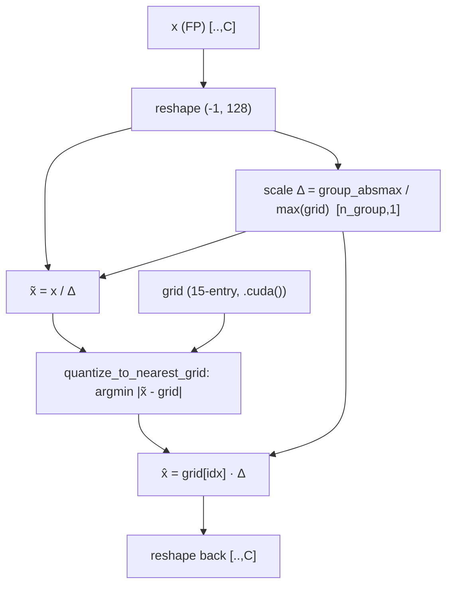
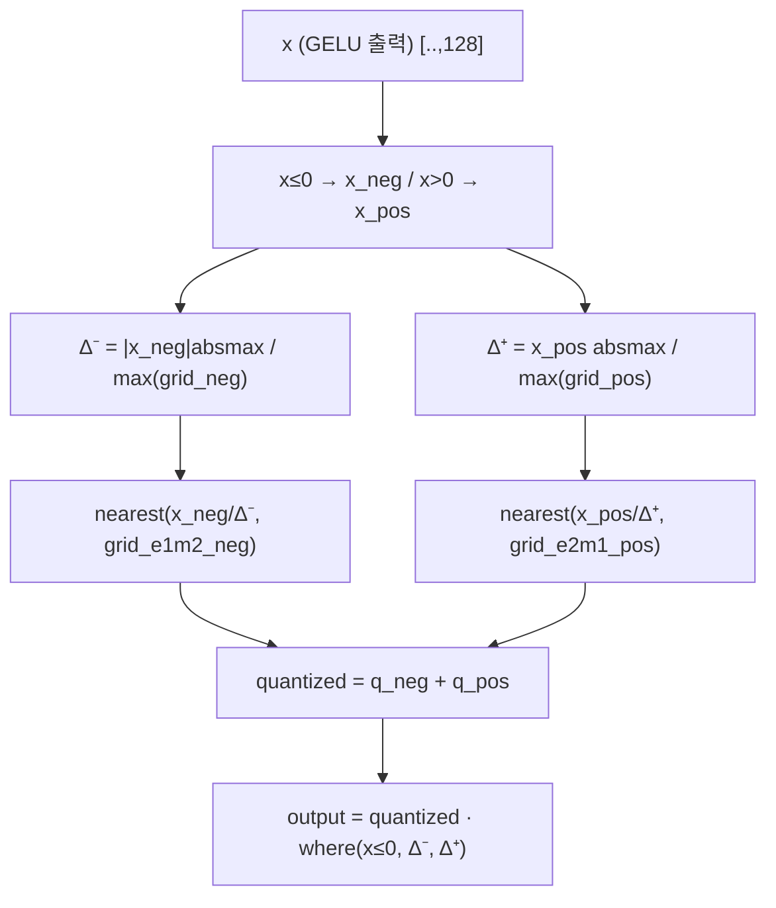
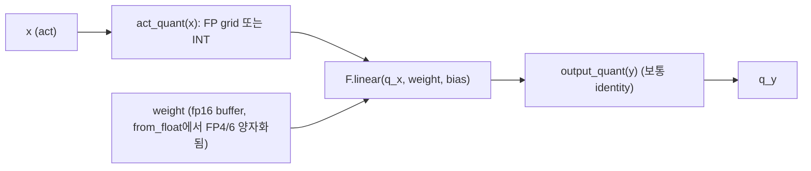
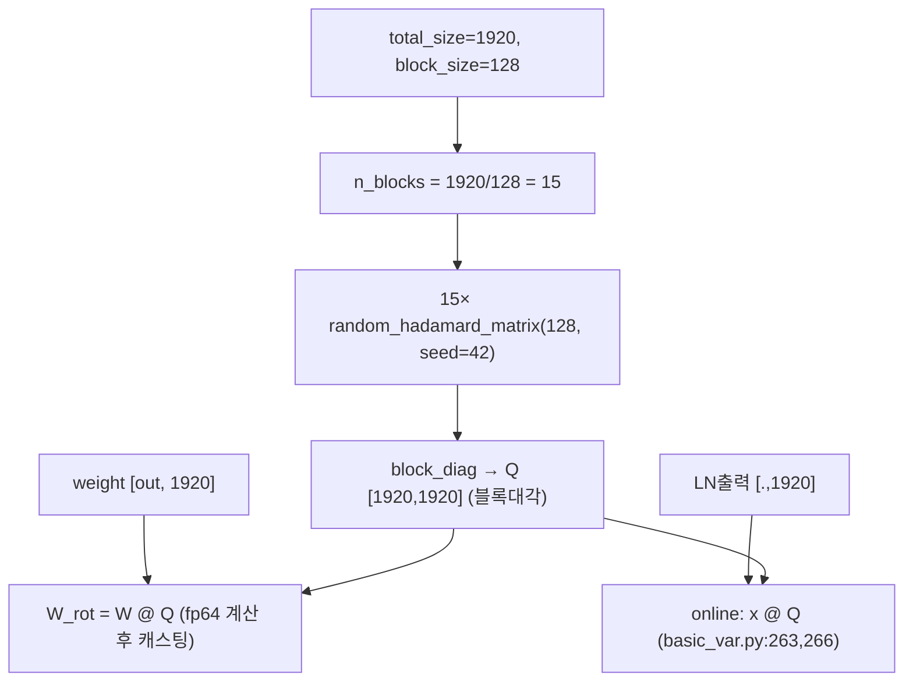
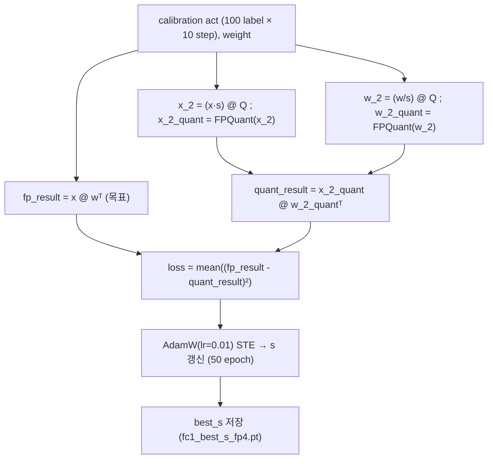
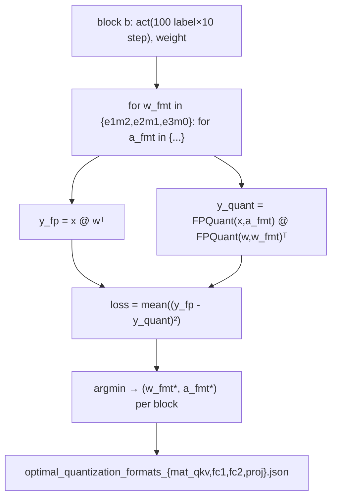

# FPQVAR 모듈 통합 가이드 (S-PyTorch)

> 1차 요약: [`../FPQVAR.md`](../FPQVAR.md) — 본 문서는 그 요약을 모듈 단위로 심화한 통합 가이드다.
> 분석 대상: `\\wsl.localhost\ubuntu-24.04\home\user\project\PRJXR-HBTXR\REF\ViT-Quantization\FPQVAR`
> 작성 원칙: 실제 소스 Read 후 `파일:라인` 근거 표기. 라인 근거 없는 추론은 "추정", 코드로 확인 불가는 "확인 불가"로 명시.
> 형제 가이드(`REF/Analysis/ViT-Quantization/I-ViT/MODULE_GUIDE.md`)의 6요소 구조와 **동형(S-PyTorch 변형)**. HW 지표(MAC lanes/scalar MACs)는 **S-PyTorch 수치 규약**(params/FLOPs/activation memory/비트폭(FP4/FP6 부동소수 포맷)/observer·outlier·scale 처리)로 치환한다.
> I-ViT가 **integer-only(INT8)** 양자화인 데 비해, FPQVAR는 **저비트 floating-point(FP4/FP6) PTQ + Hadamard rotation + 학습형 smoothing(GALT)** 이다 — 동형 구조에서 "정수 비선형 분해" 자리를 "FP grid 양자화 정밀해부 + outlier 변환"이 차지한다.

---

## 0. 문서 머리말

### 0.1 대상·FP 포맷 확정 (코드 근거)

- **대상 모델 = VAR (Visual AutoRegressive model)** — FoundationVision의 next-scale prediction 이미지 생성 트랜스포머. depth=30(VAR-d30, 256×256), depth=36(VAR-d36, 512×512). 256×256 진입점에서 `MODEL_DEPTH = 30`, `assert MODEL_DEPTH in {16,20,24,30}`(`evaluate_fp_quant_transform_rotate.py:54-55`), VQVAE(`vae_ch160v4096z32.pth`) + VAR transformer 빌드(`build_vae_var(V=4096, Cvae=32, ch=160, ..., depth=MODEL_DEPTH)`, `:68-72`).
- **embed_dim C = 1920** — block-diagonal Hadamard·GALT `s`의 길이가 모두 1920(`block_random_hadamard_matrix(total_size=1920, ...)`, `rotation_utils.py:69`; `learnable_s = nn.Parameter(torch.ones(1920))`, `learnable_transformation_fc1_fp4.py:224`). VAR-d30의 채널 폭 = 1920 (확인됨, 코드 상수).
- **multi-scale token map** patch_nums = (1,2,3,4,5,6,8,10,13,16) (`evaluate_fp_quant_transform_rotate.py:63`). 토큰 수 L = Σ pn² = 1+4+9+16+25+36+64+100+169+256 = **680** (한 클래스 한 스텝 누적; KV cache로 점진 생성).
- **FP 포맷 = 비균일(non-uniform) floating-point grid 양자화** (확인됨):
  - **FP4 = 4비트**, sign 1 + (exponent E + mantissa M), E+M=3. 세 변형 `fp4_e1m2 / fp4_e2m1 / fp4_e3m0`을 **15-entry 하드코딩 grid**로 정의(`quant_utils.py:310,262,234`; 정식 grid는 `search_fp4_format.py:479-481`).
  - **FP6 = 6비트**, 두 변형 `fp6_e2m3 / fp6_e3m2`를 **64-entry grid**로 정의(`quant_utils.py:370-398`).
  - **비대칭 FP** `fp_e1m2_neg_e2m1_pos`: 음수부 E1M2 / 양수부 E2M1 별도 grid·scale (`quant_utils.py:335-366`) — GELU 출력(fc2 입력) 전용.
- **PTQ(Post-Training Quantization)** — weight는 `from_float`에서 즉시 1회 양자화(`quant_utils.py:596-685`), activation은 forward마다 동적 양자화(`:588-594`). QAT 학습 없음(GALT의 smoothing `s`만 별도 학습). README상 본 repo는 **"알고리즘 파트 공식 구현"**, FPGA HW(RTL/HLS)는 미포함(`README.md:2`).

### 0.2 S-PyTorch 수치 규약 (HW의 MAC lanes/scalar MACs 대체)

- **params**: 모듈 차원 분석식. Linear `in·out (+out bias)`. FPQVAR는 weight를 FP grid로 fake-quant(`x̂ = nearest_grid(x/Δ)·Δ`)하므로 **params 개수는 FP 원본과 동일**(추가 학습 파라미터는 GALT `s`뿐, 채널당 1개). weight buffer는 `torch.float16`으로 저장(`quant_utils.py:502-510`).
- **FLOPs/MACs**: Linear MAC = `B·L·in·out`. VAR-d30(C=1920, mlp_ratio=4 → hidden 7680, L=680)을 대표 단위로 산출 후 30 block 환원. 양자화 자체의 부가 연산(grid nearest-neighbor argmin, scale absmax)도 별도 정량.
- **activation memory**: 텐서 shape × 비트폭. **HW 환산 activation bit = FP 포맷 비트수**(FP4=4, FP6=6). 단 PyTorch 실제 저장은 fp16(`output.to(torch.float16)`, `quant_utils.py:413,450`).
- **비트폭/observer**:
  - 비트폭 코드 직접: `w_bit/a_bit/kv_bit` argparse(`evaluate_fp_quant_transform_rotate.py:28-30`). FP4 = w4/a4(`README.md:33`), FP6 = w6/a6(`run.sh`).
  - **observer = 별도 클래스 없음. 완전 dynamic** — scale을 양자화 함수 내부에서 그때그때 그룹/토큰 absmax로 계산(`scale = x.abs().max(dim=-1)/grid.abs().max()`, `quant_utils.py:279`). calibration 통계를 들고 있는 static observer 객체 없음.
  - **scale 처리**: `Δ = (그룹/토큰 absmax) / max(grid)`. zero-point 없음(부호대칭 grid). 비대칭은 음/양 분리 2-scale(§4).
  - **outlier 처리**: (1) FP grid의 exponent 비트로 동적범위 확보, (2) Hadamard rotation으로 채널 간 outlier 분산(§7), (3) GALT smoothing `s`로 weight↔act 난이도 재배분(§8).
  - **granularity**: FP4 = **per_group(group_size=128)**, FP6 = **per_channel(weight)/per_token(act)** — 저비트일수록 fine-grained scale(코드: `run.sh` 인자, `quant_utils.py`의 `_per_group` vs `_per_token` 분기).
- **정확도(FID)/속도**: README는 정량 결과를 **이미지(`readme_figs/1.png`, `2.png`)로만** 제시(`README.md:55-56`), 텍스트 수치표 없음 → **본 문서로는 FID 수치 인용 확인 불가**. 평가 toolkit은 OpenAI evaluator(FID/IS, `README.md:43`).

### 0.3 운영 경로 (PTQ 적용 ↔ 이미지 생성 ↔ FID 평가)

```
[FP32 VAR 로드] build_vae_var(...) → load_state_dict(var_d30.pth)   (evaluate_fp_quant_transform_rotate.py:68-80)
   │  VAE: vae_ch160v4096z32.pth / VAR: var_d{30,36}.pth (HuggingFace, repo 미포함)
   ▼
[① GALT transform] --transform: best_s 로드 → transform_model(W ← W/s)   (:87-97, transform_model_utils.py:24-28)
   │  s 미적용 시 s=ones (:99-100)
   ▼
[② Hadamard rotate] --rotate: rotate_model(W ← W@Q)   (:103-106, rotation_utils.py:211-241)
   │  --block_rotate면 block-diagonal(128×128×15) Hadamard
   ▼
[③ FP 양자화] --quant: quantize_VAR(nn.Linear → QuantizedLinear, weight 즉시 FP grid화) → var.half()   (:112-131)
   ▼
[④ 이미지 생성] 1000 class × 50 img: autoregressive_infer_cfg(cfg=1.5, top_k=900, top_p=0.96,
   │             rotation_matrix=Q, mat_qkv_best_s, fc1_best_s, quant_KV, kv_bit)   (:187-199)
   │  online: LN출력 × s @ Q (GALT·rotation 융합, basic_var.py:263,266); KV cache FP 양자화 (:192-209)
   ▼
[⑤ PNG 저장] class{i}_img{j}.png   (:203-207)
   ▼
[⑥ FID 평가] pack_figs.py(→npz) → openai_evaluator.py(ref, gen)   (README.md:36-43)
```
- 타깃 디바이스: **CUDA GPU 전제** — FP grid가 `.cuda()` 하드코딩(`quant_utils.py:234,262,310,338`), CUDA 커널 `quant_cuda.quant`(`:300` 등) 호출. CPU 단독 실행 불가(코드 근거, 실행 미검증).

### 0.4 모델 / 데이터셋 / 정확도

| 항목 | 값 | 근거 |
|---|---|---|
| 모델 | VAR-d30 (256×256), VAR-d36 (512×512) | `evaluate_fp_quant_transform_rotate.py:54`, `..._512x512.py` |
| embed_dim C | 1920 (d30) | `rotation_utils.py:69`, `learnable_transformation_fc1_fp4.py:161,224` |
| mlp hidden | round(C·mlp_ratio)=7680 (mlp_ratio=4) | `basic_var.py:240` (`hidden_features=round(embed_dim*mlp_ratio)`) |
| 평가 데이터 | ImageNet ref npz (256: `VIRTUAL_imagenet256_labeled.npz`, 512: `VIRTUAL_imagenet512.npz`) | `README.md:19-20` |
| 생성 규모 | 1000 class × 50 img = 50,000장 | `evaluate_fp_quant_transform_rotate.py:178,187` |
| 정확도(FID/IS) | README가 이미지로만 제시, 텍스트 수치 없음 | `README.md:55-56` → **확인 불가** |

---

## 1. Repo / Layer 개요

FPQVAR = VAR 생성 트랜스포머를 **저비트 FP(FP4/FP6) PTQ** 로 양자화하되, INT 대비 outlier 손실을 (1) 비균일 FP grid, (2) Hadamard rotation, (3) GALT 학습형 smoothing 으로 보완하는 프레임워크(`README.md:1-4`). 본 repo는 **원본 VAR 모델 코드(models/)를 양자화 단계별로 복제**한 다섯 변형 디렉토리 + rotation/GALT/search 유틸로 구성된다.

### 1.1 자체 소스 vs 외부 프레임워크 vs 제외

| 구분 | 파일(자체 소스) | 역할 |
|---|---|---|
| **FP 양자화 핵심** ★ | `models_fp_quant_rotate/quant_utils.py` (845줄) | FP4/FP6 grid 정의, nearest-grid 매핑, 비대칭 fc2 포맷, `QuantizedLinear`/`_fc2`, `quantize_VAR` |
| **INT baseline** | `models_quant/quant_utils.py` | 정수 PTQ(per-ch/tensor/group/token, sym/asym) — ablation 비교군 |
| **rotation+GALT 삽입** | `models_fp_quant_transform_rotate/basic_var.py` | LN 출력에 GALT×rotation 온라인 융합, KV cache FP 양자화 |
| **rotation 유틸** | `rotate_utils/rotation_utils.py` | Hadamard/QR 행렬, block-diagonal, weight-side rotation, `rotate_model` |
| | `rotate_utils/block_rotation_utils.py` | block-diagonal Hadamard 생성(독립 스크립트) |
| | `rotate_utils/hadamard_utils.py` (421KB) | 하드코딩 Hadamard 행렬 + `random_hadamard_matrix` (시그니처만, 본문 제외) |
| **GALT** | `learnable_transformation/learnable_transformation_*.py` | smoothing `s` MSE 학습(STE) |
| | `learnable_transformation/transform_model_utils.py` | 학습된 `s`를 weight에 `W/s` 흡수 |
| **FP format search** | `search/search_fp4_format.py`, `search_fp6_format.py`, `search_fp_format_ada.py` | 출력-MSE 기반 블록별 최적 FP 포맷 탐색 |
| **평가 엔트리** | `evaluate_fp_quant_transform_rotate.py` (256), `..._512x512.py` (512) | PTQ 적용 → 이미지 생성 |
| | `pack_figs.py`, `openai_evaluator.py` | npz 패킹, FID 평가 |

### 1.2 forward 진입점
`AdaLNSelfAttn.forward`(`basic_var.py:253-269`)가 1 block 단위:
`ada_lin(cond) → (gamma1,gamma2,scale1,scale2,shift1,shift2)` → `x_1 = LN(x)·(scale1+1)+shift1 ··× mat_qkv_best_s @ Q` → `attn(x_1)·gamma1` residual → `x_2 = LN(x)·(scale2+1)+shift2 ·× fc1_best_s @ Q` → `ffn(x_2)·gamma2` residual. 즉 **양자화 입력 직전에 GALT scale(`×s`)과 Hadamard rotation(`@Q`)을 온라인 융합**(`:263,266`).

### 1.3 제외 (지시에 따라 이름만, 미분석)
- **원본 VAR 프레임워크(커스텀 아님)**: `models/var.py`, `models/basic_var.py`, `models/vqvae.py`, `models/basic_vae.py` — FoundationVision/VAR 원본. 양자화 변형은 이를 복제·수정.
- **CUDA 커널(csrc 제외 규칙)**: `quant/quant.cpp`, `quant/quant_kernel.cu` — FP round-to-nearest-grid 가속(`quant_cuda.quant(array, grid)`). `quant/setup.py`로 빌드(`quant_cuda` 모듈, build dir `lib.linux-x86_64-cpython-39` → Python 3.9/Linux).
- **체크포인트(이름만)**: `learnable_transformation/best_lambda_var30/*.pt`, `best_lambda_var36/*.pt` (학습된 `s`), VAE/VAR 가중치(외부 다운로드, repo 미포함).
- **대용량 데이터 행렬**: `hadamard_utils.py` 본문(421KB, 대부분 하드코딩 Hadamard 행렬).
- **search/baseline/*** 의 플롯·실험 스크립트(개념은 §9에서 요약).

### 1.4 다섯 변형 디렉토리 = ablation 단계 (코드 복제)
| 디렉토리 | 양자화 | rotation | GALT | 비고 |
|---|---|---|---|---|
| `models/` | 없음(FP32) | 없음 | 없음 | 원본 VAR baseline |
| `models_quant/` | INT(sym/asym) | 없음 | 없음 | 정수 PTQ 비교군 |
| `models_fp_quant/` | FP4/FP6 | 없음(주석) | 없음 | FP만 |
| `models_fp_quant_rotate/` | FP4/FP6 | 있음 | 없음 | rotation 추가 |
| **`models_fp_quant_transform_rotate/`** | **FP4/FP6** | **있음** | **있음** | **FPQVAR 최종** (`run.sh` 모든 커맨드가 호출) |

> 동일 코드가 5벌 복제됨 → 유지보수 리스크(한 곳 수정 시 동기화 누락 가능, 확인됨).

---

## 2. 모듈: FP4 grid 양자화 — `quant_utils.py` (fp_quant_e{1,2,3}) ★FP 핵심

### 2.1 역할 + 상위/하위
- **역할**: 입력 텐서를 4비트 부동소수 grid(15-entry)로 양자화. exponent/mantissa 비트 배분에 따라 e1m2/e2m1/e3m0 세 grid. **비균일 격자 round-to-nearest**(INT의 균일 격자와 대비).
- **상위**: `QuantizedLinear.act_quant`/`from_float`이 `act_fp_type`/`weight_fp_type`로 선택 호출(`quant_utils.py:524-556`, `:621-666`). **하위**: `quantize_to_nearest_grid`(`:207-228`) 또는 CUDA `quant_cuda.quant`(`:300`).

### 2.2 데이터플로우 (텐서 shape 흐름, per_group)


### 2.3 forward call stack
`QuantizedLinear.forward`(`quant_utils.py:589`) → `self.act_quant(x)` (= `partial(fp_quant_e2_per_group, n_bits=4, group_size=128)`, `:553`) → `:272-284` → `quantize_to_nearest_grid`(`:281`) → `torch.argmin(distances)`(`:225`).

### 2.4 대표 코드 위치
`quant_utils.py`: e1m2 grid `:310,323,338`; e2m1 grid `:262,275,290`; e3m0 grid `:234,247`; `quantize_to_nearest_grid` `:207-228`; CUDA 변형 `fp_quant_e2_per_group_cuda` `:287-304`. 정식 grid 상수 `search_fp4_format.py:479-481`.

### 2.5 대표 코드 블록

```python
# quant_utils.py:275-283  FP4 e2m1 per-group 양자화 (round-to-FP-grid)
quant_grid = torch.tensor([-6.0,-4.0,-3.0,-2.0,-1.5,-1.0,-0.5, 0.0, 0.5,1.0,1.5,2.0,3.0,4.0,6.0]).cuda()
x = x.view(-1, group_size)                                  # group_size=128
scale = x.abs().max(dim=-1, keepdim=True)[0] / quant_grid.abs().max()  # Δ = absmax/6
x.div_(scale)                                               # x̃ = x/Δ
quantized_x = quantize_to_nearest_grid(x, quant_grid)       # nearest FP grid
output = quantized_x * scale                                # dequant
```
→ INT의 `round(x/Δ)`(균일)와 달리 **0 근방 촘촘(±0.5 간격) + 큰 값 성김(4→6)**. 정규분포+outlier 혼합 텐서에 유리.

```python
# quant_utils.py:222-228  nearest-grid 매핑 (순수 PyTorch argmin)
distances = torch.abs(x.unsqueeze(-1) - quant_grid)        # (.., 15)
min_indices = torch.argmin(distances, dim=-1)              # (..)
return quant_grid[min_indices]
```
→ 원소당 15-way 거리계산+argmin. CUDA 버전(`quant_cuda.quant`, `:300`)이 이 루프를 가속.

### 2.6 연산·수치표현 분해 + 정량 (FP4 grid 3종)

| 포맷 | E/M | 양수부 grid 대표값 | 동적범위(±) | 특징 | 라인 |
|---|---|---|---|---|---|
| `fp_e1` (e1m2) | 1/2 | 0.25,0.5,...,1.75 (간격 0.25) | 1.75 | 정밀형(균일에 근접) | `:310` |
| `fp_e2` (e2m1) | 2/1 | 0.5,1,1.5,2,3,4,6 | 6 | 균형형. **FP4 기본 act/weight** | `:262` |
| `fp_e3` (e3m0) | 3/0 | 0.25,0.5,1,2,4,8,16 | 16 | 동적범위↑(outlier 친화), 정밀↓ | `:234` |

- **grid 크기**: 15 = 2⁴−1 (부호대칭 + 단일 0). zero-point 없음.
- **scale/zp**: `Δ = group_absmax/max(grid)`, zp=0(부호대칭).
- **비트폭**: FP4 = 4bit (HW 환산 activation bit). 실제 저장 fp16.
- **params**: 0 (순수 함수).
- **FLOPs**: 원소당 grid 매핑 = 15 sub + 15 abs + argmin(15-way) ≈ **~30 op/원소** (PyTorch argmin) + absmax reduce(그룹당) + div/mul 2. CUDA 커널은 이를 병렬 비교로 환원. 대표 mat_qkv weight(5760×1920 = 11.06M 원소, qkv=3C×C) FP4화 = ~330M op (PTQ 1회).
- **시사**: FP4 PE = **15-entry grid LUT + scale 곱**. exponent 비트가 LUT 값 분포를 결정. FPGA에서 grid를 ROM/LUT로 두고 nearest-comparator tree로 매핑(추정).

### 2.7 e3m0 grid 다중 정의 주의
`models_fp_quant_rotate/quant_utils.py:234`는 `[-16..16]`, 그러나 `search_fp4_format.py:279`엔 `[-64..64]` 변형도 존재. 모델 적용본(`:234`)은 `[-16..16]`이 정식 → **추정**: 16-버전이 VAR 분포에 맞춰 채택.

---

## 3. 모듈: FP6 grid 양자화 — `quant_utils.py` (fp6_quant_e{2m3,3m2})

### 3.1 역할 + 상위/하위
- **역할**: 6비트 부동소수 grid(64-entry) 양자화. e2m3(촘촘)/e3m2(동적범위 큼) 두 변형. FP4보다 정밀하나 비트수↑.
- **상위**: `QuantizedLinear`이 `fp6_e2m3`/`fp6_e3m2`로 선택(`:530-533,557-560`); KV cache 양자화(`basic_var.py:194-195`). **하위**: `quant_cuda.quant`(CUDA 전용, `:410`).

### 3.2 데이터플로우
FP4와 동일 (`scale = absmax/max(grid)` → `/scale` → CUDA nearest-grid → `*scale`), grid만 64-entry, 출력 `.to(torch.float16)`(`:413,450`).

### 3.3 forward call stack
`QuantizedLinear.forward`(`:589`) → `fp6_quant_e2m3_per_token_cuda`(`:400-414`) → `quant_cuda.quant(array, fp6_e2m3_grid)`(`:410`).

### 3.4 대표 코드 위치
`quant_utils.py`: `fp6_e2m3_grid` `:370-379`, `fp6_e3m2_grid` `:381-398`, per_token cuda `:400-431`, per_group cuda `:434-471`.

### 3.5 대표 코드 블록
```python
# quant_utils.py:370-379  FP6 e2m3 grid (64-entry, ±7.5)
fp6_e2m3_grid = torch.tensor([
  -7.5,-7.0,...,-0.125, 0,                # 음수부 32
   0, 0.125,0.25,...,7.0,7.5 ])           # 양수부 32 (간격 0.125 @ 0근방)
# :405-413  per-token cuda 양자화
scale = x.abs().max(dim=-1, keepdim=True)[0] / quant_grid.abs().max()   # per-token absmax
quant_array, _ = quant_cuda.quant(x.view(-1)/scale, quant_grid)
output = (quant_array.view(x_shape) * scale).to(torch.float16)
```

### 3.6 연산·수치표현 분해 + 정량
| 포맷 | E/M | 동적범위(±) | 0근방 간격 | 라인 |
|---|---|---|---|---|
| `fp6_e2m3` | 2/3 | 7.5 | 0.125 | `:370-379` **FP6 기본** |
| `fp6_e3m2` | 3/2 | 28 | 0.0625 | `:381-398` 동적범위↑ |
- **grid 크기**: 64 = 2⁶ (0이 두 번 등장 → 부호대칭 + 양쪽 0, 실효 63 + 중복0). zp 없음.
- **granularity**: FP6 weight = per_channel, act = **per_token**(`run.sh` 인자) — FP4의 per_group(128)보다 coarse. 6비트 정밀도로 보완.
- **비트폭**: 6bit. 저장 fp16.
- **params**: 0.
- **FLOPs**: 원소당 64-way nearest(CUDA) + absmax + div/mul. FP4보다 grid 4배 → 비교 비용↑이나 CUDA 병렬.
- **시사**: FP6 PE = 64-entry LUT. FP4(15) 대비 LUT 4배·comparator tree 깊이 +2단. 정확도-HW 트레이드오프 명시 사례.

---

## 4. 모듈: 비대칭 FP — `quant_utils.py` (fp_e1m2_neg_e2m1_pos) ★FPQVAR 핵심 기여

### 4.1 역할 + 상위/하위
- **역할**: GELU(tanh 근사) 출력처럼 **음/양 비대칭** 분포에 음수부·양수부 다른 FP grid·scale 적용. fc2 입력 전용.
- **상위**: `QuantizedLinear_fc2`가 `act_fp_type == "fp_e1m2_neg_e2m1_pos"`일 때만(`quant_utils.py:778-779`). 일반 `QuantizedLinear`엔 이 분기 없음(`:521-571`). **하위**: `quantize_to_nearest_grid` 2회.

### 4.2 데이터플로우


### 4.3 forward call stack
`QuantizedLinear_fc2.forward`(`:812`) → `fp_quant_e1m2_neg_e2m1_pos_per_group`(`:335-366`) → `torch.where(x<=0,...)`(`:347-348`) → `quantize_to_nearest_grid` ×2(`:359-360`).

### 4.4 대표 코드 위치
`quant_utils.py:335-366` (함수 전체), 음/양 grid `:338-339`, 분리 `:347-348`, 별도 scale `:351-352`, 합성·dequant `:363-364`.

### 4.5 대표 코드 블록
```python
# quant_utils.py:338-364  음/양 분리 비대칭 FP4
quant_grid_e1m2_neg = torch.tensor([-1.75,...,-0.25, 0.0]).cuda()   # 음수부: 정밀(E1M2)
quant_grid_e2m1_pos = torch.tensor([0.0, 0.5,1.0,...,6.0]).cuda()    # 양수부: 넓은범위(E2M1)
x_neg = torch.where(x <= 0, x, 0); x_pos = torch.where(x > 0, x, 0)
scale_neg = x_neg.abs().max(-1) / grid_neg.abs().max()              # 별도 scale Δ⁻
scale_pos = x_pos.abs().max(-1) / grid_pos.abs().max()             # 별도 scale Δ⁺
quantized_x = nearest(x_neg/scale_neg, grid_neg) + nearest(x_pos/scale_pos, grid_pos)
output = quantized_x * torch.where(x <= 0, scale_neg, scale_pos)
```
→ GELU 음수부는 [-0.17,0) 좁고 양수부는 크게 퍼짐 → 음수부에 정밀 E1M2(간격 0.25), 양수부에 넓은 E2M1(최대 6) 배치.

### 4.6 연산·수치표현 분해 + 정량
- **양자화 방식**: 음/양 분리, 각 8-entry grid(`:338-339`), 2-scale. clip = `clipping_strength·absmax`(기본 1.0, `:341`).
- **scale/zp**: Δ⁻, Δ⁺ 별도; zp 없음. 부호로 scale 선택(`where(x≤0, Δ⁻, Δ⁺)`, `:364`).
- **비트폭**: 4bit(음수 3비트 표현 + 양수 3비트 표현, sign 묵시).
- **params**: 0.
- **FLOPs**: 분리 where 2 + nearest 2회(각 8-way) + absmax 2 + 합성. ≈ FP4 단일의 ~1.5배.
- **fc2 적용**: `quantize_VAR`에서 fc2는 `act_quant_sym=False`로 `QuantizedLinear_fc2`에 매핑(`:939-947`), `fc2_fp_type=fp_e1m2_neg_e2m1_pos`(`run.sh:4`).
- **FP6 fc2 미구현 주의**: `run.sh` FP6 커맨드는 `fp6_int_neg_e2m3_pos`를 참조하나 `quant_utils.py`에 동명 함수 없음 → **확인 불가**(실행 에러 또는 별도 브랜치 추정).
- **시사**: GELU 비대칭 양자화는 **모든 ViT FFN 공통 적용 가능**. FPGA에서 부호 비트로 grid LUT·scale 둘 중 선택하는 mux 1단 추가로 구현(추정).

---

## 5. 모듈: 정수 양자화 baseline — `models_quant/quant_utils.py` (비교군)

### 5.1 역할 + 상위/하위
- **역할**: FP 대비 비교군. per-channel/tensor/group/token, sym/asym INT 양자화. `round(x/Δ)` 균일 격자.
- **상위**: INT ablation 경로(`models_quant/`). **하위**: torch round/clamp.

### 5.2~5.5 (요약)
- sym: `Δ = absmax/(2^(b-1)-1)`, `x̂ = clamp(round(x/Δ), q_min, q_max)·Δ` (`models_quant/quant_utils.py:11-16` 류).
- asym: `Δ = (max-min)/(q_max-q_min)`, `zp = round(q_min - min/Δ)`, `x̂ = (clamp(round(x/Δ)+zp)-zp)·Δ` (`:57-70`).
- per_group group_size=128 하드코딩.
> **본 repo의 FP 양자화(`models_fp_quant_rotate/quant_utils.py`)에도 동일 INT 함수가 함께 들어 있음** — `quantize_weight_per_channel_sym`(`:10-17`), `_asymmetric`(`:57-77`) 등. FP가 아닌 경로(`weight_fp_quant=False`)일 때 사용(`:644-645`).

### 5.6 연산·수치표현 분해 + 정량
- **양자화 방식**: 균일 격자. INT4 = 16-level 균일 vs FP4 = 비균일 15-level.
- **비트폭**: w_bit/a_bit 인자.
- **시사**: INT4 균일 격자는 outlier에 scale이 끌려가 0근방 정밀 손실 → FPQVAR가 FP4로 전환한 직접 동기. FPGA INT4 PE(균일)→FP4 PE(grid LUT) 전환 비용 = LUT + 정규화 회로(추정).

---

## 6. 모듈: 양자화 Linear 래퍼 — `quant_utils.py` (QuantizedLinear / _fc2) ★

### 6.1 역할 + 상위/하위
- **역할**: `nn.Linear` 대체. weight는 buffer(fp16)로 저장 후 `from_float`에서 즉시 양자화(PTQ), activation은 forward마다 동적 양자화. `act_quant × activation_fp_quant × act_fp_type` 3중 분기로 양자화 함수 선택.
- **상위**: `quantize_VAR`이 VAR의 fc1/fc2/mat_qkv/proj/ada_lin을 교체(`:927-976`). **하위**: §2~5 양자화 함수들.

### 6.2 데이터플로우


### 6.3 forward call stack
`forward`(`:588-594`): `q_x = self.act_quant(x)` → `F.linear(q_x, self.weight, self.bias)` → `self.output_quant(y)`. weight는 이미 양자화된 buffer(`from_float`, `:619-680`).

### 6.4 대표 코드 위치
`quant_utils.py`: `QuantizedLinear` `:474-693`, act_quant 분기 `:521-571`, forward `:588-594`, `from_float`(weight 양자화) `:596-685`; `QuantizedLinear_fc2`(비대칭 분기 추가) `:695-913`, fc2 비대칭 `:778-779`.

### 6.5 대표 코드 블록
```python
# quant_utils.py:548-562  per_group × FP × act_fp_type 3중 분기 (act_quant 선택)
elif act_quant == "per_group":
    if self.activation_fp_quant:                                   # FP 경로
        if   act_fp_type=="fp_e1": self.act_quant = partial(fp_quant_e1_per_group, ...)
        elif act_fp_type=="fp_e2": self.act_quant = partial(fp_quant_e2_per_group, ...)
        elif act_fp_type=="fp_e3": self.act_quant = partial(fp_quant_e3_per_group, ...)
        elif act_fp_type=="fp6_e2m3": self.act_quant = partial(fp6_quant_e2m3_per_group_cuda, ...)
        ...
    elif self.act_quant_sym: self.act_quant = partial(quantize_activation_per_group_sym, ...)  # INT
# quant_utils.py:589-593  forward: act 동적 양자화 + 정수 GEMM (weight는 사전 양자화)
q_x = self.act_quant(x)
y = F.linear(q_x, self.weight, self.bias)
```
→ weight는 `from_float`에서 1회 양자화(`:644-680`), activation은 매 forward absmax 재계산(완전 dynamic).

### 6.6 연산·수치표현 분해 + 정량 (VAR-d30, C=1920, hidden=7680, L=680)
- **양자화 방식**: weight PTQ(static), act dynamic. zp 없음(FP). fc2만 비대칭.
- **비트폭**: FP4(w4/a4) 또는 FP6(w6/a6). bias는 fp16 그대로(`:683-684`, 양자화 안 함).
- **params** (1 block):
  - mat_qkv: 3C×C = 5760×1920 = **11.06M** (+ bias)
  - proj: C×C = 1920×1920 = **3.69M**
  - fc1: hidden×C = 7680×1920 = **14.75M**
  - fc2: C×hidden = 1920×7680 = **14.75M**
  - ada_lin: 6C×D (cond_dim D, `:247`)
  - Linear params/block ≈ **44.2M** (+ada_lin), ×30 block ≈ **1.33B** (대략, ada_lin 제외).
- **MACs/block** (B=1, L=680):
  - mat_qkv: 680×1920×5760 ≈ **7.52G**
  - proj: 680×1920×1920 ≈ **2.51G**
  - fc1: 680×1920×7680 ≈ **10.03G**
  - fc2: 680×7680×1920 ≈ **10.03G**
  - Linear MAC/block ≈ **30.1G**, ×30 ≈ **903G** (attention 행렬곱·VQVAE 제외, L=680 누적 가정).
- **activation memory**: fc1 출력 [1,680,7680] = 5.22M 원소 × FP4(4bit) = **2.61 MB** (HW 환산) / 실제 fp16 = 10.4 MB.
- **시사**: VAR-d30은 C=1920로 ViT보다 크고 30 block → 메모리·MAC 모두 큼. weight static + act dynamic = HW에서 weight ROM 고정 + act online absmax 회로 필요(§0.2).

---

## 7. 모듈: Hadamard rotation — `rotation_utils.py` ★outlier 변환

### 7.1 역할 + 상위/하위
- **역할**: 직교행렬 Q(Hadamard)로 채널 차원을 회전시켜 특정 채널 집중 outlier를 분산. weight엔 `W@Q` 사전 흡수, activation엔 online `x@Q`. 등가성 `(xQ)(WQ)ᵀ = xWᵀ` (Q 직교) 유지하며 양자화 난이도만 재배분.
- **상위**: `rotate_model`(`:211-241`), `evaluate_*.py:103-106`. activation online은 `basic_var.py:263,266`. **하위**: `random_hadamard_matrix`(hadamard_utils), `block_random_hadamard_matrix`.

### 7.2 데이터플로우 (block-diagonal)


### 7.3 forward call stack
- weight: `rotate_model(model, device, block_rotate=True)`(`:224-240`) → `block_random_hadamard_matrix(1920,128,seed=42)`(`:230`) → `rotate_mat_qkv`/`rotate_fc1`(`:239`) → `W@Q` fp64(`:140-144,153`).
- activation: `AdaLNSelfAttn.forward`(`basic_var.py:263`) → `torch.matmul(LN(x)·(scale1+1)+shift1 ·×mat_qkv_best_s, rotation_matrix)`.

### 7.4 대표 코드 위치
`rotation_utils.py`: `block_random_hadamard_matrix` `:69-104`, `block_diag` `:108-126`, `rotate_mat_qkv` `:129-144`, `rotate_fc1` `:147-154`, `rotate_ada_lin` `:167-207`, `rotate_model` `:211-241`. block 검증 `block_rotation_utils.py:90-107`.

### 7.5 대표 코드 블록
```python
# rotation_utils.py:85-104  block-diagonal Hadamard (1920 = 128×15)
n_blocks = total_size // block_size                          # 15
for i in range(n_blocks):
    block = random_hadamard_matrix(block_size, device, seed) # 128×128 Hadamard
    blocks.append(block.to(device))
return block_diag(blocks)                                    # [1920,1920] 블록대각

# rotation_utils.py:140-144  weight-side rotation (fp64 정밀)
W_q_rot = torch.matmul(W_q.to(torch.float64), Q)
layer.attn.mat_qkv.weight.data = torch.cat([W_q_rot,W_k_rot,W_v_rot], 0).to(dtype)
```
→ full 1920×1920 대신 **128×128 Hadamard 15개 블록대각** → FPGA에서 작은 Hadamard 유닛 1개 재사용(`block_rotation_utils.py:104-107`이 `x.chunk(15)` 블록별 곱으로 등가 검증).

### 7.6 연산·수치표현 분해 + 정량
- **변환 방식**: 직교 Hadamard. block-diagonal(`block_rotate=True`) 또는 full(`get_orthogonal_matrix(C, 'hadamard')`, `:214`).
- **block 구성**: 15 blocks × 128 = 1920. seed=42 고정(재현성).
- **params**: 0 (Q는 결정적 생성, 저장 안 함).
- **FLOPs**:
  - full rotation: `x@Q` = L·C·C = 680×1920×1920 ≈ **2.51G MAC/적용**.
  - **block-diagonal**: 15 × (L·128·128) = 680×15×128×128 ≈ **167M MAC** → **full 대비 15배 절감**(1920/128). HW 비용 상한의 직접 근거.
- **online 횟수**: block당 2회(mat_qkv 앞, fc1 앞, `basic_var.py:263,266`).
- **fc2/ada_lin**: `rotate_model`에서 주석 처리(`:221-222,239`) → mat_qkv/fc1만 rotation. ada_lin rotation 함수(`:167-207`)는 존재하나 미호출.
- **시사**: block-diagonal Hadamard = **128×128 곱 유닛 1개로 15블록 시분할** → outlier 완화를 HW에 통합할 때 비용 상한(15배 절감)을 잡아주는 직접 레퍼런스. group_size(128)와 정합 시 scale 브로드캐스트도 블록 경계 일치(추정).

---

## 8. 모듈: GALT 학습형 smoothing — `learnable_transformation/` ★

### 8.1 역할 + 상위/하위
- **역할**: 채널별 학습 가능한 smoothing factor `s`(논문 λ)를 MSE로 학습. 등가변환 `xWᵀ = (x⊙s)(W⊘s)ᵀ`를 rotation과 결합, 양자화 후 출력 MSE가 최소인 `s`를 AdamW(STE)로 학습. "GHT(Hadamard)-Aware Learnable Transformation".
- **상위**: 학습 결과 `s`를 `transform_model`(`transform_model_utils.py:24-28`)이 `W/s`로 weight에 흡수; activation `×s`는 online(`basic_var.py:263,266`). **하위**: `FPQuant`(STE), `block_random_hadamard_matrix`.

### 8.2 데이터플로우 (학습 루프)


### 8.3 forward call stack
`__main__`(`learnable_transformation_fc1_fp4.py:215-253`): 30 block 루프 → `compute_quant_error_v1(activation[j], weight, learnable_s, Q)`(`:236`) → `:117-133` → `FPQuant.apply`(`:123,127`) → `loss.backward()`(`:238`) → `optimizer.step()`(`:239`).

### 8.4 대표 코드 위치
`learnable_transformation_fc1_fp4.py`: `FPQuant`(STE) `:70-95`, 손실 `compute_quant_error_v1` `:117-133`, Q 생성 `:161-168`, 학습 루프 `:215-253`, 저장 `:255`. 적용 `transform_model_utils.py:8-28`.

### 8.5 대표 코드 블록
```python
# learnable_transformation_fc1_fp4.py:119-131  GALT 등가변환 + 출력 MSE
fp_result = torch.matmul(x, w.T)                       # 목표 (FP32)
x_2 = torch.matmul(x * learnable_s, Q)                 # act: smooth(×s) → rotate(@Q)
x_2_quant = FPQuant.apply(x_2)                         # FP4(e2m1) 양자화
w_2 = torch.matmul(w / learnable_s, Q)                 # weight: 역smooth(/s) → rotate(@Q)
w_2_quant = FPQuant.apply(w_2)
quant_result = torch.matmul(x_2_quant, w_2_quant.T)    # s·Q 상쇄 → 등가, 단 양자화는 회전·smooth 공간에서
quant_error = torch.mean((fp_result - quant_result)**2)

# :84-95  FPQuant: forward는 fp_e2(e2m1) grid 고정, backward는 STE
def forward(ctx, x, n_bits=4, group_size=128):
    quant_grid = torch.tensor([-6.0,...,6.0]); scale = x.abs().max(-1)/grid.abs().max()
    return (nearest(x/scale, grid) * scale)
def backward(ctx, grad_output):
    return grad_output.clone(), None, None, ...        # STE
```
→ `s`·`Q`는 곱셈 시 상쇄(등가)지만 **양자화는 회전·smoothing된 표현**에서 수행 → MSE 최소화 `s`가 양자화 난이도를 weight↔act로 재배분.

### 8.6 연산·수치표현 분해 + 정량
- **학습 대상**: `s = nn.Parameter(ones(1920))` (채널당 1, `:224`). lr=0.01, AdamW, epochs=50(기본, `:139,227`).
- **데이터**: 30 block 각 독립 학습(`:215`), block당 calibration = 100 label × 10 step (`:151,219`).
- **Q**: block-diagonal Hadamard(1920,128,seed=42) fp32 고정(`:163-168`).
- **FPQuant grid**: e2m1(fp_e2) 고정(`:75`), group=128, STE backward(`:86-95`).
- **params(학습)**: s = 1920/block × 30 = **57,600** (smoothing factor 전체). 추론 시엔 `W/s`로 흡수되어 weight에 통합(추가 추론 파라미터 0).
- **HW 함의**: smoothing은 weight에 사전 흡수(`W/s`, `transform_model_utils.py:12,20`), activation `×s`만 online → **HW에 채널별 scale 곱 1단만 추가**(LN 출력 직후, rotation과 같은 자리). 곱셈기 1단 비용(추정).
- **변형**: mat_qkv용/fp6용/512×512용 다수(`learnable_transformation_mat_qkv_fp4.py`, `_fp6.py`, `*_512x512.py`).

---

## 9. 모듈: FP format search — `search/` (출력-MSE grid search)

### 9.1 역할 + 상위/하위
- **역할**: 블록별·레이어별 최적 FP 포맷을 **GEMM 출력 MSE** 기준 완전탐색. FP4=3×3(weight×act), FP6=2×2 조합.
- **상위**: 결과 JSON/pt를 `quantize_VAR_use_different_datatype`(mixed-format, `quant_utils.py:982-1067`)가 코드로 굳힘. **하위**: `fp4_quant`(`search_fp4_format.py:544-553`), `FPQuant`.

### 9.2 데이터플로우


### 9.3~9.4 대표 코드 위치
`search_fp4_format.py`: grid 상수 `:479-481`, `fp4_quant` 디스패치 `:544-553`, search 루프(주석화 본체) `:617-636`, JSON 저장 `:651-654`. FP6: `search_fp6_format.py`. ada: `search_fp_format_ada.py`.

### 9.5 대표 코드 블록
```python
# search_fp4_format.py:626-636  출력-MSE grid search (텐서 MSE 아님)
for weight_format in ['e1m2','e2m1','e3m0']:
    w_quant = FPQuant.apply(w_fp, 4, 128, weight_format)
    for act_format in ['e1m2','e2m1','e3m0']:
        x_quant = FPQuant.apply(x_fp, 4, 128, act_format)
        y_fp = torch.matmul(x_fp, w_fp.T)
        y_quant = torch.matmul(x_quant, w_quant.T)
        loss += compute_quant_error(y_fp, y_quant)        # 출력 MSE
```
→ **텐서 자체가 아니라 GEMM 출력 y의 MSE**를 기준 → weight-activation 결합 양자화 효과 반영.

### 9.6 정량
- **탐색 공간**: FP4 = 3 formats² = 9 조합/block, FP6 = 2² = 4. 30 block × {mat_qkv, fc1, fc2, proj}.
- **결과 적용**: `quantize_VAR_use_different_datatype`(`:982-1067`)가 블록별 다른 포맷 강제. 예: fc1 block 6~20 = `fp_e2`, 그 외 act `fp_e3`/weight `fp_e2`(`:997-1014`); mat_qkv block 24~25 = `fp_e2`, 그 외 `fp_e3`(`:1029-1046`) → **추정**: search 결과를 코드로 굳힌 mixed-precision 경로.
- **하드코딩 경로**: calibration `/home/rjwei/...`(`:605,610`) → 재현 시 수정 필수.

---

## 10. 모듈: 평가 파이프라인 — `evaluate_fp_quant_transform_rotate.py`

### 10.1 역할 + 상위/하위
- **역할**: PTQ 3단(transform→rotate→quant) 적용 → 50,000장 생성 → PNG 저장. FID는 별도(pack_figs → openai_evaluator).
- **상위**: `run.sh` 커맨드. **하위**: `transform_model`, `rotate_model`, `quantize_VAR`, `autoregressive_infer_cfg`.

### 10.2 데이터플로우 (§0.3 운영 경로 참조)

### 10.3 forward call stack
`__main__`(`:26-208`): build/load(`:68-80`) → transform(`:87-97`) → rotate(`:103-106`) → quantize_VAR + half(`:112-131`) → Q 생성(`:142-153`) → 1000 class 루프 `autoregressive_infer_cfg`(`:187-199`) → PNG(`:203-207`).

### 10.4 대표 코드 위치
`evaluate_fp_quant_transform_rotate.py`: argparse `:27-52`, transform `:87-97`, rotate `:103-106`, quantize `:112-131`, Q `:142-153`, 생성 `:187-199`.

### 10.5 대표 코드 블록
```python
# evaluate_fp_quant_transform_rotate.py:112-131  PTQ 적용 순서 (transform → rotate → quant)
if args.quant:
    var = quantize_VAR(var, weight_quant=..., act_quant=..., w_bit=4, a_bit=4,
                       act_quant_sym=args.act_sym, activation_fp_quant=True, weight_fp_quant=True,
                       act_fp_type=args.act_fp_type, weight_fp_type=args.weight_fp_type,
                       fc2_fp_type=args.fc2_fp_type)
    var = var.half()
# :196-199  생성 (cfg=1.5, top_k=900, top_p=0.96, rotation·GALT online 전달)
recon_B3HW = var.autoregressive_infer_cfg(B=B, label_B=label_B, cfg=1.5, top_k=900, top_p=0.96,
                rotation_matrix=Q, quant_KV=args.quant_kv, kv_bit=args.kv_bit,
                mat_qkv_best_s=mat_qkv_best_s, fc1_best_s=fc1_best_s)
```

### 10.6 정량 + KV cache 양자화
- **생성 규모**: 1000 class × 50 img = 50,000장. cfg=1.5, top_k=900, top_p=0.96(`:196`).
- **KV cache 양자화**(`basic_var.py:192-209`): cached k/v를 kv_bit에 따라 FP6(`fp6_quant_e2m3_per_token_cuda`, kv_bit=6) 또는 FP4(`fp_quant_e2_per_group_cuda`, kv_bit=4). FP4 기본 커맨드는 `--kv_bit 6`(`run.sh:4`) → KV는 FP6, weight/act는 FP4(혼합).
- **256 FP4 커맨드**(`README.md:33`): `--w_bit 4 --a_bit 4 --weight_quant per_group --act_quant per_group --act_sym --activation_fp_quant --weight_fp_quant --act_fp_type fp_e2 --weight_fp_type fp_e2 --fc2_fp_type fp_e1m2_neg_e2m1_pos --rotate --block_rotate --transform`.
- **256 FP6 커맨드**(`run.sh`): `--w_bit 6 --a_bit 6 --weight_quant per_channel --act_quant per_token --act_fp_type fp6_e2m3 --weight_fp_type fp6_e2m3 --fc2_fp_type fp6_int_neg_e2m3_pos --rotate --block_rotate`.
- **FID**: openai_evaluator 측정 → **본 문서 미실행, 확인 불가**.

---

## 11. 한눈에 보기 (모듈 요약표)

| # | 모듈 | 파일:라인 | 핵심 메커니즘 | 비트폭/grid | params(학습) | 대표 정량 |
|---|---|---|---|---|---|---|
| 2 | FP4 grid | `quant_utils.py:234-332` | nearest 비균일 grid | FP4, 15-entry | 0 | grid 매핑 ~30op/원소 |
| 3 | FP6 grid | `quant_utils.py:370-471` | nearest 64-entry grid | FP6, 64-entry | 0 | per_token/per_ch |
| 4 | 비대칭 FP | `quant_utils.py:335-366` | 음/양 분리 2-grid·2-scale | FP4(E1M2/E2M1) | 0 | fc2(GELU) 전용 |
| 5 | INT baseline | `models_quant/quant_utils.py` | 균일 round(x/Δ) | INT, sym/asym | 0 | 비교군 |
| 6 | QuantizedLinear | `quant_utils.py:474-913` | act dynamic + weight PTQ | FP4/6 | 0 | block MAC ~30.1G |
| 7 | Hadamard rotate | `rotation_utils.py:69-241` | block-diag 128×128×15 | 직교 | 0 | block 167M vs full 2.51G MAC |
| 8 | GALT smoothing | `learnable_transformation_*.py` | 출력-MSE STE 학습 s | FP4 e2m1 | 57.6K(s) | lr0.01 ep50 |
| 9 | format search | `search/*.py` | GEMM 출력 MSE 완전탐색 | FP4 3², FP6 2² | 0 | 9/4 조합/block |
| 10 | 평가 pipeline | `evaluate_*.py` | transform→rotate→quant→gen | — | — | 50,000장, FID 확인불가 |

**대표 정량 5선** (모두 코드 근거):
1. **embed_dim C = 1920** (`rotation_utils.py:69`), mlp hidden = 7680, 30 blocks.
2. **block-diagonal Hadamard = 15 blocks × 128 → full 대비 MAC 15배 절감** (167M vs 2.51G/적용, `rotation_utils.py:85`, 1920/128).
3. **FP4 grid = 15-entry 비균일** (e2m1: ±{0.5,1,1.5,2,3,4,6}, `quant_utils.py:262`); **FP6 grid = 64-entry** (`:370-398`).
4. **GALT: s=ones(1920)/block, AdamW lr=0.01, ep50, 30 block 독립, STE** (`learnable_transformation_fc1_fp4.py:224-249`).
5. **group_size = 128 하드코딩** (FP4 per_group, `quant_utils.py:272` 등); FP4=per_group / FP6=per_token 분리.

---

## 12. 평가 (강점·한계·리스크)

### 강점
- **비균일 FP grid + 출력-MSE search**: 텐서 분포별 exponent/mantissa 자동 선택 → INT 대비 outlier 강건.
- **GELU 비대칭 포맷(E1M2_neg/E2M1_pos)**: fc2 입력 양자화 손실을 구조적으로 감소(명확한 동기, `quant_utils.py:335-366`).
- **block-diagonal Hadamard + GALT 등가변환**: 정확도 유지(수학적 등가)하며 난이도만 재배분. block 단위라 HW 비용 상한(15배 절감) 명시.
- **CUDA 커널로 nearest-grid 가속**: PyTorch argmin과 커널 병존.

### 한계 / 리스크
- **코드 5벌 복제**: `models*/` 디렉토리 동기화 리스크(확인됨).
- **하드코딩 경로**: `/home/rjwei/...`, `/home/wrj/Q-VAR`(`block_rotation_utils.py:2`, `learnable_transformation_fc1_fp4.py:2`, `search_fp4_format.py:605`) → 재현 시 수정 필수.
- **`requirements.txt` 부재**: README 안내(`:11`)하나 파일 없음 → 의존성 버전 **확인 불가**.
- **`fp6_int_neg_e2m3_pos` 미구현**: `run.sh` FP6 fc2 참조하나 `quant_utils.py`에 동명 함수 없음 → 실행 에러 가능(**확인 불가**).
- **observer 완전 dynamic**: act scale을 forward마다 absmax 계산 → HW에 online absmax 회로 필요(논문 HW co-design이 다룰 것으로 추정, 본 repo엔 RTL 없음).
- **FID 정량 텍스트 부재**: README가 이미지로만 제시 → 본 문서로 수치 인용 **확인 불가**.

### I-ViT 대비 차이 (동형 비교)
| 축 | I-ViT (INT) | FPQVAR (FP) |
|---|---|---|
| 수치표현 | INT8 균일 격자 + dyadic requant | FP4/FP6 비균일 grid + 부동scale |
| 비선형 | IntGELU/IntSoftmax/IntLayerNorm(시프트) | LN/GELU는 FP16 유지, GELU 출력만 비대칭 FP |
| 학습 | QAT(전체 fine-tune) | PTQ + GALT s만 학습 |
| outlier | per-tensor scale | Hadamard rotation + GALT + FP exponent |
| observer | running min/max EMA(0.95) | 없음(완전 dynamic absmax) |
| 태스크 | 분류(Top-1) | 생성(FID) |

---

## 13. FPGA 시사점 (FP 저비트의 HW 함의)

> 전제(추정): 상위 프로젝트는 ViT/Transformer FPGA 가속기(HG-PIPE 계열, `IMPL_REPOS/HGPIPE`) + XR 시선추적. 아래는 그 가정 하의 연관성("추정").

1. **저비트 FP PE 직접 입력**: FP4(e2m1)/FP6(e2m3)의 exponent/mantissa 비트 배분 = **FPGA 저비트 FP PE 설계 명세**. INT4/INT8 PE → FP4 PE 전환 시 outlier 강건성 확보. 비용 = **15-entry grid LUT(ROM) + nearest-comparator tree + scale 곱**(추정). FP6는 LUT 64-entry로 4배.
2. **group-wise scale(128)**: HG-PIPE 타일/채널 분할 단위(128)와 정합 시 scale 브로드캐스트를 타일 경계와 일치(추정). FP4=per_group / FP6=per_token 분리 = 정확도-HW비용 트레이드오프 참고.
3. **block-diagonal Hadamard(128×128×15)**: full 1920² 대신 **128×128 곱 유닛 1개를 15블록 시분할** → outlier 완화 HW 비용 상한(**15배 절감**, `rotation_utils.py:85`). 우리 가속기에 outlier 회로 통합 시 직접 레퍼런스.
4. **GALT 사전 흡수**: smoothing은 `W/s`로 weight에 흡수(`transform_model_utils.py:12,20`), activation `×s`만 online → **HW에 채널별 scale 곱 1단만 추가**(LN 출력 직후, rotation과 같은 자리). LayerNorm 데이터패스에 곱셈기 1단 추가 수준(추정).
5. **online absmax observer**: 완전 dynamic scale → HW에 **online absmax reduce 회로** 필수. weight는 static(ROM), act만 online → I-ViT의 EMA observer와 달리 추론 시 통계 회로 항상 가동.
6. **KV cache FP 양자화**: 생성 트랜스포머 특성상 KV cache가 FP6/FP4로 양자화(`basic_var.py:192-209`) → on-chip KV 저장 비트폭 절감. XR 저지연 시선추적(인식/추적)엔 KV cache 없을 수 있으나, **PTQ+rotation+비대칭FP 레시피는 ViT 백본에 이식 가능**(특히 GELU 비대칭 양자화는 ViT FFN 공통).
7. **평가 메트릭 차이 유의**: FPQVAR는 생성품질(FID) → 시선추적 정확도(각도오차)와 직접 비교 불가. **양자화 기법만 차용, 평가는 우리 태스크 메트릭으로 별도 수행** 필요(확인 사항).

---

## 14. 근거 표기 / 미확인 사항

- **확인됨(코드 직접 근거)**: VAR-d30/C=1920/hidden=7680, FP4(15-entry e1m2/e2m1/e3m0)·FP6(64-entry e2m3/e3m2) grid, 비대칭 fc2(E1M2_neg/E2M1_pos), group_size=128, block-diagonal Hadamard(1920/128/15/seed42 → 15배 절감), GALT(s=ones(1920), AdamW lr0.01 ep50, STE, 30 block 독립), 출력-MSE format search(FP4 3²/FP6 2²), rotation·GALT online 융합(`basic_var.py:263,266`), KV cache FP 양자화(`:192-209`), 평가 3단 pipeline, run.sh 커맨드.
- **추정**:
  - e3m0 grid [-16..16]이 정식([-64..64]도 존재, `:234` vs `search_fp4_format.py:279`).
  - `quantize_VAR_use_different_datatype` 블록별 포맷이 search 결과를 굳힌 mixed-precision 경로.
  - FPGA HW 비용(grid LUT, 15배 절감, scale 곱 1단) — 논문 HW co-design 주장과 부합하나 본 repo에 RTL/HLS 없음.
  - 상위 프로젝트(HG-PIPE/XR) 연관성 전반.
- **확인 불가**:
  - **FID/IS 정량 수치** — README가 이미지(`readme_figs/1.png,2.png`)로만 제시(`:55-56`), 텍스트 수치표 없음.
  - `requirements.txt`(파일 부재) → 의존성 버전.
  - `fp6_int_neg_e2m3_pos`(run.sh 참조) 구현체 → `quant_utils.py`에 동명 함수 없음.
  - VAE/VAR 체크포인트 내용(외부 다운로드, repo 미포함).
  - CUDA 커널 `quant_kernel.cu` 내부(csrc 제외 규칙).
