# FQ-ViT 모듈 통합 가이드 (S-PyTorch)

> 1차 요약: [`../FQ-ViT.md`](../FQ-ViT.md) — 본 문서는 그 요약을 모듈 단위로 심화한 통합 가이드다.
> 분석 대상: `\\wsl.localhost\ubuntu-24.04\home\user\project\PRJXR-HBTXR\REF\ViT-Quantization\FQ-ViT`
> 작성 원칙: 실제 소스 Read 후 `파일:라인` 근거 표기. 라인 근거 없는 추론은 "추정", 코드로 확인 불가는 "확인 불가"로 명시.
> 형제 가이드 [`../I-ViT/MODULE_GUIDE.md`](../I-ViT/MODULE_GUIDE.md)의 6요소 구조(S-PyTorch 수치 규약)를 동형으로 따른다. HW 지표(MAC lanes 등)는 params/FLOPs/activation memory/비트폭으로 치환한다.

---

## 0. 문서 머리말

### 0.1 대표 케이스 선정
- **대표 모델: `deit_small_patch16_224` (DeiT-S)** — `patch16, embed_dim=384, depth=12, num_heads=6, mlp_ratio=4, img224, qkv_bias=True` (`vit_quant.py:447-463`). 근거:
  1. README 공식 실행 예시가 `deit_small`이고(`README.md:90-93`), FQ-ViT(8/8/8) 결과 DeiT-S **FP32 79.85 → Ours 79.17 (-0.68)**, 8/8/**4** 78.40으로 비선형 양자화 효과가 비자명하게 드러남(`README.md:115,122-123`).
  2. 토큰 수 N=197(=14×14 패치 + cls), C=384, head_dim=64로 PTF LayerNorm·Log-Int-Softmax·QLinear·QConv가 모두 비자명 크기로 활성화돼 분석 가치가 큼(`PatchEmbed.num_patches=(224/16)²=196`, `layers_quant.py:193-195`; cls 토큰 +1, `vit_quant.py:392`).
- **대표 분석 단위: VisionTransformer 1개 Block** = `QIntLayerNorm(norm1) → QAct(qact1) → Attention[QLinear(qkv) → QAct → @ → QAct(qact_attn1) → QIntSoftmax → @v → QAct → QLinear(proj) → QAct] → [residual] → QIntLayerNorm(norm2) → QAct(qact3) → Mlp[QLinear(fc1) → GELU → QAct → QLinear(fc2) → QAct] → [residual]` (`vit_quant.py:118-190`). DeiT-S는 이 Block을 12개 적층(`vit_quant.py:280-293`).
- **대표 정수 비선형 2종 (FQ-ViT 핵심 기여)**:
  1. **PTF (Power-of-Two Factor) Integer LayerNorm** — `QIntLayerNorm`(int 모드, `layers.py:151-206`) + `PtfObserver`(`observer/ptf.py:8-66`). 채널별 LayerNorm scale을 임의 실수가 아닌 **2^k 시프트**로 표현.
  2. **LIS (Log-Int-Softmax)** — `QIntSoftmax`(`layers.py:209-298`, i-exp 정수 지수) + `Log2Quantizer`(`quantizer/log2.py:7-26`, log2 도메인 양자화). attention map을 정수 지수 + 로그 양자화로 4-bit화.
- **선택 사항(중요)**: I-ViT가 **integer-only inference(전 경로 FP-free)**인 반면, FQ-ViT는 기본적으로 **fake-quantization PTQ** 프레임워크다(`base.py:42-45` forward = `quant→dequantize`). 단 `--ptf`/`--lis` 플래그 시 LayerNorm/Softmax 두 모듈만 **실제 정수 도메인 연산 경로**(`QIntLayerNorm.mode='int'`, `QIntSoftmax.log_i_softmax=True`)로 전환된다(`vit_quant.py:354-360`, `config.py:26-39`). 즉 "fully quantized"의 핵심은 이 두 비선형의 정수화이며, 나머지 Linear/Conv/Act는 fake-quant로 정확도를 시뮬레이션한다.

### 0.2 S-PyTorch 수치 규약 (HW MAC lanes 대체)
- **params**: 모듈 차원에서 분석적 계산. Linear `in·out (+out bias)`, LayerNorm `2·C`, Conv `Cout·Cin·Kh·Kw (+Cout)`. FQ-ViT는 FP 가중치를 forward마다 fake-quant하므로(`layers.py:68,109`) **params 개수는 FP 원본과 동일**(추가 학습 파라미터 없음, 비트폭만 변경). PTF의 채널별 2^k 지수도 calibration 결과로 scale에 흡수되어 학습 파라미터가 아님(`observer/ptf.py:65`).
- **FLOPs/MACs**: 표준식×config. Linear MAC = `B·N·in·out`. Attention QKᵀ = `B·H·N²·dh`, attn·V = `B·H·N²·dh`(H=heads, dh=head_dim, `vit_quant.py:99-106`). 대표 레이어 1개를 DeiT-S(B=1,N=197,C=384,H=6,dh=64)로 산출 후 12 block 환원.
- **activation memory**: 텐서 shape × 비트폭. FQ-ViT는 fake-quant라 실제 메모리는 FP32지만(quant→dequant 후 float 반환), **정수 도메인 비트폭**(W/A/Attn bits)을 "HW 환산 activation bit"로 표기. 기본 A=uint8(`config.py:13`), attention(LIS)=uint4(`config.py:28`).
- **비트폭/observer**: 코드 직접. 기본 **W int8 / A uint8 / S(softmax) uint4**(`config.py:12-13,28`). weight observer=minmax, weight=**channel_wise**; activation observer=`--quant-method`(minmax/ema/percentile/omse), activation=**layer_wise**; softmax observer=minmax + **log2 quantizer**; LayerNorm-입력 act observer=**ptf** + channel_wise(`config.py:15-43`).
- **정확도/속도**: README 인용. 본 세션 미실행 → 측정 불가 항목은 "확인 불가".

### 0.3 운영 경로 (PTQ 캘리브레이션 ↔ 평가, **재학습 없음**)
```
[FP 사전학습 가중치 로드] str2model(args.model)(pretrained=True, cfg)   (test_quant.py:90)
   │  DeiT: torch.hub deit_*_patch16_224.pth (vit_quant.py:436-443)
   │  ViT : load_weights_from_npz (augreg npz) (vit_quant.py:518-522)
   ▼
[캘리브레이션 세트 수집] train_loader에서 calib_iter(10)개 배치(batch 100) 모음   (test_quant.py:141-147)
   ▼
[Calibrate] model_open_calibrate(): 모든 Q모듈 calibrate=True            (test_quant.py:150)
   │  forward마다 observer.update()로 min/max 통계 누적                   (layers.py:54-55,103-104,140-141)
   │  마지막 배치에서 model_open_last_calibrate(): scale/zp 확정          (test_quant.py:153-156)
   │     update_quantization_params() → observer.get_quantization_params  (layers.py:56-57)
   ▼
[Quant 전환] model_close_calibrate() → model_quant()                     (test_quant.py:158-159)
   │  Q모듈 quant=True; INT_NORM이면 QIntLayerNorm.mode='int';            (vit_quant.py:354-360)
   │  INT_SOFTMAX이면 QIntSoftmax.log_i_softmax=True (LIS 경로 활성)
   ▼
[ImageNet 평가] validate(): model.eval() → Top-1/5                       (test_quant.py:161-211)
```
- 타깃 디바이스: 기본 `--device cuda`(`test_quant.py:43`). I-ViT처럼 강제 `.cuda()` 하드코딩은 없음 → CPU 실행도 코드상 가능(추정, 미검증). **재학습(QAT) 없음 — 순수 PTQ**가 I-ViT와의 결정적 차이.

### 0.4 모델 / 데이터셋 / 정확도 (README 인용)
| Model | embed/depth/heads | FP32 | Ours 8/8/8 | Ours 8/8/4 | 근거 |
|---|---|---|---|---|---|
| DeiT-T | 192/12/3 | 72.21 | 71.61 | 71.07 | `README.md:115,122-123`, `vit_quant.py:417-435` |
| **DeiT-S(대표)** | **384/12/6** | **79.85** | **79.17** | **78.40** | `README.md:115,122-123`, `vit_quant.py:447-463` |
| DeiT-B | 768/12/12 | 81.85 | 81.20 | 80.85 | `README.md:115,122-123`, `vit_quant.py:474-490` |
| ViT-B | 768/12/12 | 84.53 | 83.31 | 82.68 | `README.md:115,122-123`, `vit_quant.py:501-517` |
| ViT-L | 1024/24/16 | 85.81 | 85.03 | 84.89 | `README.md:115,122-123`, `vit_quant.py:526-542` |
| Swin-T/S/B | (swin_quant) | 81.35/83.20/83.60 | 80.51/82.71/82.97 | 80.04/82.47/82.38 | `README.md:115,122-123` |
- **W/A/Attn 비트**: "8/8/8"=W8/A8/Attn8(LIS의 attn=uint8), "8/8/**4**"=Attn을 uint4로(LIS 진가, `config.py:28`). (`README.md:113`)
- **핵심 관찰**: layer-wise 단일 scale(MinMax) baseline은 ViT-B/L에서 **23.64%/3.37%로 붕괴**(`README.md:116`)하나 FQ-ViT는 83.31/85.03 유지 → PTF의 채널 편차 보정이 결정적.
- 데이터셋: **ImageNet** (`--data <DIR>/train, /val`), 224×224, 1000 클래스 (`test_quant.py:114-117`). 전처리는 모델별로 다름(DeiT mean=(.485,.456,.406)/crop 0.875, ViT mean=(.5,.5,.5)/crop 0.9, `test_quant.py:95-106`).
- 속도(latency): 본 PyTorch repo는 정확도 평가만 제공 → latency **확인 불가**.

---

## 1. Repo / Layer 개요

FQ-ViT = ViT/DeiT/Swin을 **LayerNorm·Softmax까지 포함해 완전(fully) 양자화**하는 최초의 PTQ 프레임워크(`README.md:24`). 핵심은 **Observer(통계 수집) ↔ Quantizer(scale/zp 적용) 분리 설계** 위에 PTF observer(LayerNorm)와 Log2 quantizer(Softmax)를 얹은 것. 모델 정의(`vit_quant.py`/`swin_quant.py`/`layers_quant.py`)는 timm DeiT/ViT/Swin 구조를 베껴오되 nn.Linear/Conv/LayerNorm/Softmax 자리를 자체 Q모듈로 치환했다.

### 1.1 자체 소스 vs 외부 프레임워크 vs 제외

| 구분 | 파일(자체 소스) | 역할 |
|---|---|---|
| **양자화 레이어** | `models/ptq/layers.py` ★핵심 | QConv2d/QLinear/QAct + QIntLayerNorm(PTF) + QIntSoftmax(LIS) (299L) |
| **비트 정의** | `models/ptq/bit_type.py` | BitType(uint4/int8/uint8), 상하한 계산 |
| **Quantizer** | `models/ptq/quantizer/{base,uniform,log2}.py` + `build.py` | Uniform(affine) / Log2(LIS) |
| **Observer** | `models/ptq/observer/{base,minmax,ema,percentile,omse,ptf}.py` + `build.py`, `utils.py` | 통계 수집기 5종 + PTF + lp_loss |
| **모델 정의** | `models/vit_quant.py` ★ | Attention/Block/VisionTransformer + deit_*/vit_* 팩토리 |
| | `models/layers_quant.py` | Mlp, PatchEmbed, HybridEmbed, DropPath, trunc_normal_ |
| | `models/swin_quant.py` | 정수 Swin (동일 Q모듈 재사용, §11 참조) |
| | `models/utils.py` | load_weights_from_npz(ViT augreg npz 로딩) |
| **설정** | `config.py` | ptf/lis/quant_method 플래그 → 모든 비트/observer/quantizer 매핑 |
| **평가 엔트리** | `test_quant.py` | calibrate + evaluate 루프, argparse, AverageMeter/accuracy |

### 1.2 forward 진입점
`VisionTransformer.forward`(`vit_quant.py:410-414`) → `forward_features`(`:382-408`):
`qact_input`(입력 양자화, DeiT만 `input_quant=True`) → `patch_embed`(QConv) → `cls_token` cat → `qact_embed` → `x + qact_pos(pos_embed)` → `qact1` → `blocks`(12×Block, 각 Block에 직전 layer의 quantizer를 `last_quantizer`로 전달, `:399-402`) → `norm`(QIntLayerNorm) → cls 추출(`[:,0]`) → `qact2` → `head`(QLinear) → `act_out`. **QIntLayerNorm은 in/out quantizer를 인자로 받아** 입출력 scale을 정수 정규화에 사용(`:404-405`, `layers.py:165-169`).

### 1.3 제외 (지시에 따라 이름만 표기, 미분석)
- **외부 사전학습 체크포인트**: DeiT torch.hub `.pth`(`vit_quant.py:439,467,494`), ViT augreg `.npz`(`vit_quant.py:519-522`) — 가중치만 로드, 모델 코드는 본 repo 정의 사용.
- **외부 의존성**: torch/torchvision/numpy/PIL(`test_quant.py:6-10`). timm 등 별도 백본 패키지 import는 본 repo에 없음(모델 정의가 모두 자체 포함) — I-ViT와 다른 점.
- **비코드**: `figures/`(이미지), `.git/`.
- **부분 분석(재사용 확인)**: `swin_quant.py`는 동일 `QAct/QConv2d/QIntLayerNorm/QIntSoftmax/QLinear`를 동일 `Config`로 재사용(`swin_quant.py:11,143`) → §2~9 모듈 분석이 그대로 적용. Swin 고유의 window/shift 토폴로지 세부는 §11에 요약.

### 1.4 대표 모델 레이어 구성 (DeiT-S)
`forward_features`(`vit_quant.py:382-408`): PatchEmbed(QConv2d 16×16 s16, 3→384) → +cls/pos → Block×12 → QIntLayerNorm → head(QLinear 384→1000). 1 Block(`:118-190`)당 QLinear 4개(qkv/proj/fc1/fc2), QIntLayerNorm 2개, QIntSoftmax 1개, GELU(FP nn.GELU 1개, `layers_quant.py:140`), QAct 다수(qact1~4 + Attention 내 qact1~3/qact_attn1 + Mlp qact1/2).

---

## 2. 모듈: 양자화 추상화 — `quantizer/base.py` (BaseQuantizer) + `bit_type.py`

### 2.1 역할 + 상위/하위
- **역할**: 모든 quantizer의 공통 베이스. module_type별 scale broadcast shape 결정, `forward = quant → dequantize`(fake-quant). `BitType`은 비트폭·부호로 정수 상하한 계산.
- **상위**: `QConv2d/QLinear/QAct`가 `build_quantizer`로 생성·호출(`layers.py:50-51,68,109,147`). **하위**: `UniformQuantizer`/`Log2Quantizer`가 상속, observer로부터 scale/zp 수신(`uniform.py:15-17`).

### 2.2 데이터플로우 (텐서 shape 흐름)
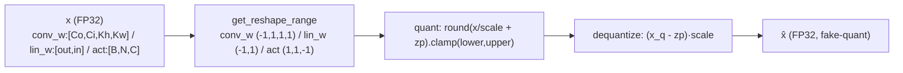

### 2.3 forward call stack
`QLinear.forward`(`layers.py:102`) → `self.quantizer(self.weight)`(`:109`) → `BaseQuantizer.forward`(`base.py:42-45`) → `quant`(`uniform.py:19`) → `dequantize`(`uniform.py:32`).

### 2.4 대표 코드 위치
`quantizer/base.py`: `get_reshape_range` `:14-31`, `forward` `:42-45`. `bit_type.py`: `BitType` `:7-39`, 상하한 `:17-27`, `BIT_TYPE_LIST` `:42-46`.

### 2.5 대표 코드 블록
```python
# quantizer/base.py:14-31  module_type별 scale broadcast shape
if self.module_type == 'conv_weight':   range_shape = (-1, 1, 1, 1)   # per-out-channel
elif self.module_type == 'linear_weight': range_shape = (-1, 1)        # per-out-channel
elif self.module_type == 'activation':
    if len(inputs.shape) == 3: range_shape = (1, 1, -1)               # per-last-dim(채널)
    elif len(inputs.shape) == 4: range_shape = (1, -1, 1, 1)
```
→ weight는 출력 채널축, activation은 마지막 차원축으로 scale을 broadcast. **channel_wise vs layer_wise는 observer가 scale을 스칼라/벡터 중 무엇으로 주느냐로 결정**(reshape는 broadcast만 담당).

```python
# quantizer/base.py:42-45  fake-quantization (quant 후 즉시 dequant)
def forward(self, inputs):
    outputs = self.quant(inputs)
    outputs = self.dequantize(outputs)
    return outputs
```
→ I-ViT의 정수 텐서 전파와 달리 **항상 FP로 복원**. 실제 정수 추론이 아니라 양자화 오차 시뮬레이션. (단 QIntLayerNorm/QIntSoftmax의 int 경로는 예외, §6·§7.)

```python
# bit_type.py:17-27  부호에 따른 정수 상하한
@property
def upper_bound: return 2**bits - 1 if not signed else 2**(bits-1) - 1
@property
def lower_bound: return 0 if not signed else -(2**(bits-1))
```
→ `uint4`=[0,15], `int8`=[-128,127], `uint8`=[0,255] (`:42-46`). weight=int8(대칭 가능), activation=uint8(비대칭), softmax=uint4.

### 2.6 연산·수치표현 분해 + 정량
- **양자화 방식**: 추상 베이스. quant/dequant는 자식(uniform/log2)이 구현. scale broadcast만 담당.
- **scale/zp**: observer가 산출, quantizer가 보관(`uniform.py:12-17`).
- **비트폭**: BitType으로 캡슐화. W int8 / A uint8 / S uint4(`config.py:12-13,28`).
- **params**: 0 (scale/zp는 calibration 산출물, 학습 파라미터 아님).
- **FLOPs**: forward당 quant(div+round+clamp)+dequant(sub+mul) = O(N) 원소연산.

---

## 3. 모듈: Uniform 양자화 — `quantizer/uniform.py` (UniformQuantizer)

### 3.1 역할 + 상위/하위
- **역할**: 균일 **비대칭 affine 양자화**. `round(x/s + zp)` 후 clamp, dequant `(x_q - zp)·s`. weight/activation/일반 act의 기본 quantizer.
- **상위**: `QConv2d/QLinear/QAct`가 `quantizer_str='uniform'`로 생성(`config.py:18-20`). **하위**: observer의 `get_quantization_params`(`:16`).

### 3.2 데이터플로우 (텐서 shape 흐름)
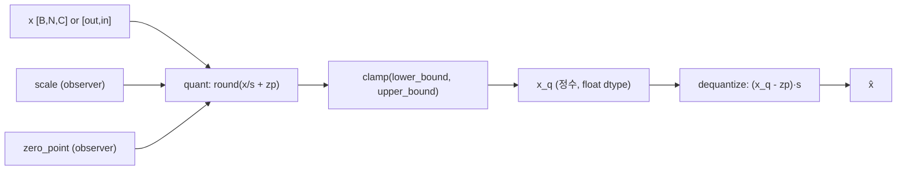

### 3.3 forward call stack
`QAct.forward`(`layers.py:139`) → `self.quantizer(x)`(`:147`) → `BaseQuantizer.forward`(`base.py:42`) → `UniformQuantizer.quant`(`uniform.py:19-30`) → `dequantize`(`:32-41`).

### 3.4 대표 코드 위치
`uniform.py`: `update_quantization_params` `:15-17`, `quant` `:19-30`, `dequantize` `:32-41`.

### 3.5 대표 코드 블록
```python
# uniform.py:27-30  비대칭 affine 양자화
outputs = inputs / scale + zero_point
outputs = outputs.round().clamp(self.bit_type.lower_bound,
                                self.bit_type.upper_bound)
```
```python
# uniform.py:40  복원
outputs = (inputs - zero_point) * scale
```
→ `q = clamp(round(x/s + z))`, `x̂ = (q - z)·s`. **zero_point 사용** → I-ViT(대칭, zp=0)와 달리 활성에 비대칭 양자화 가능(uint8 활성의 동적범위 활용). HW에서는 zp 가감산 회로 추가 비용.

### 3.6 연산·수치표현 분해 + 정량
- **양자화 방식**: 균일 비대칭 affine. per-channel(weight) 또는 per-tensor(activation)는 observer가 scale/zp를 벡터/스칼라로 주느냐로 결정.
- **scale/zp**: weight observer=minmax(signed면 대칭 zp=0, `minmax.py:41-45`), activation observer=`--quant-method`(uint8이라 비대칭 zp≠0, `minmax.py:46-50`).
- **비트폭**: W int8 / A uint8.
- **params**: 0.
- **FLOPs**: 원소당 div+round+clamp(quant) + sub+mul(dequant). DeiT-S qkv weight(384×1152=442K 원소) 양자화 = 442K 원소연산(calibrate시 1회, quant 모드 매 forward).

---

## 4. 모듈: Log2 양자화 — `quantizer/log2.py` (Log2Quantizer) ★LIS의 절반

### 4.1 역할 + 상위/하위
- **역할**: **로그 도메인 양자화**. `q = clamp(round(-log2(x)), 0, 2^bits-1)`, dequant `2^(-q)`. softmax 출력처럼 [0,1]에 밀집 + 소수 outlier 분포에 최적(작은 값에 bin 집중). LIS의 Log2 부분.
- **상위**: `QIntSoftmax`가 `quantizer_str='log2'`로 생성(`config.py:30`). 단 실제 LIS(int_softmax) 경로에서는 `QIntSoftmax.forward`가 자체 log_round를 쓰므로(§7), 이 quantizer는 **lis=False 또는 비-LIS 경로의 softmax 양자화**에 사용(추정 — config상 `QUANTIZER_S='log2'`이나 forward의 log_i_softmax 경로는 quantizer를 우회, `layers.py:280-288`).
- **하위**: 없음(torch log2/clamp).

### 4.2 데이터플로우 (텐서 shape 흐름)
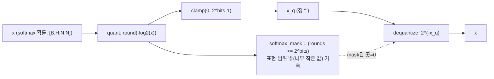

### 4.3 forward call stack
(비-LIS 경로) `QIntSoftmax.forward`(`layers.py:297`) → `self.quantizer(x)` → `BaseQuantizer.forward` → `Log2Quantizer.quant`(`log2.py:17-21`) → `dequantize`(`:23-26`).

### 4.4 대표 코드 위치
`log2.py`: `quant` `:17-21`, `dequantize` `:23-26`, `softmax_mask` `:19,25`.

### 4.5 대표 코드 블록
```python
# log2.py:17-21  로그 도메인 양자화 (값이 작을수록 큰 정수)
rounds = torch.round(-1 * inputs.log2())
self.softmax_mask = rounds >= 2**self.bit_type.bits     # 표현 한계 밖 기록
outputs = torch.clamp(rounds, 0, 2**self.bit_type.bits - 1)
```
```python
# log2.py:23-26  복원 (시프트만으로 dequant)
outputs = 2**(-1 * inputs)
outputs[self.softmax_mask] = 0                          # 너무 작은 값은 0으로
```
→ dequant가 `2^(-q)` = **우측 시프트** → 곱셈기 불필요. 작은 확률에 bin 집중(균일 양자화 대비 동적범위 우수). attention map을 4-bit(uint4)로 줄임. mask 처리로 표현 하한 미만은 0 절단(정확도-비트폭 trade-off).

### 4.6 연산·수치표현 분해 + 정량
- **양자화 방식**: 로그 도메인(non-uniform). zero_point 없음(로그 양자화는 비선형 격자).
- **scale/zp**: 명시적 scale 없음 — `2^(-q)` 격자가 곧 양자화 레벨.
- **비트폭**: uint4 (LIS, `config.py:28`) → attention map 4-bit.
- **params**: 0.
- **activation memory**: attention 확률 [1,6,197,197] uint4 = 6×197²×0.5byte ≈ **116 KB** (uint8 대비 절반).
- **시사**: dequant=시프트, 저장=4-bit → BRAM 절감 + 곱셈 제거. FQ-ViT softmax 데이터패스의 직접 청사진.

---

## 5. 모듈: PTF Observer — `observer/ptf.py` (PtfObserver) ★PTF의 핵심

### 5.1 역할 + 상위/하위
- **역할**: LayerNorm 입력 활성의 **채널별 scale을 단일 base scale × 2^k(Power-of-Two Factor)로 결정**. 채널마다 1/2/4/8 중 L2 오차 최소 scale을 골라 `2^index`로 표현. layer-wise의 단순함 + channel-wise의 정밀함을 시프트로 절충.
- **상위**: `QAct`가 `OBSERVER_A_LN='ptf'`로 생성(LayerNorm 직전 act, `config.py:38`, `vit_quant.py:152-157,173-178` qact2/qact4). **하위**: `lp_loss`(`observer/utils.py:2-9`), `BaseObserver.reshape_tensor`(`base.py:15-28`).

### 5.2 데이터플로우 (텐서 shape 흐름)
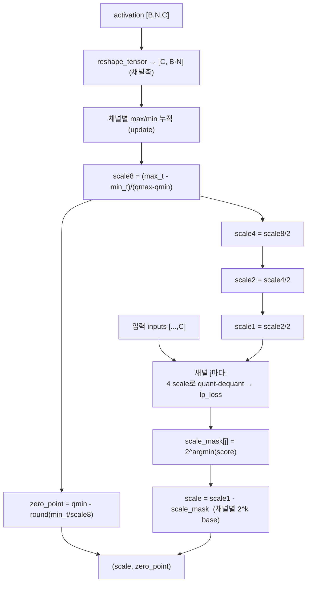

### 5.3 forward call stack
`QAct.forward`(calibrate, `layers.py:140-144`) → `observer.update(x)`(`:141`, `ptf.py:14-29`) → (last_calibrate) `quantizer.update_quantization_params(x)`(`:144`) → `UniformQuantizer.update_quantization_params`(`uniform.py:15`) → `PtfObserver.get_quantization_params`(`ptf.py:31-66`).

### 5.4 대표 코드 위치
`ptf.py`: `update`(채널별 max/min) `:14-29`, `get_quantization_params` `:31-66`, 4단계 scale `:41-45`, 채널별 lp_loss 탐색 `:49-64`, 최종 scale `:65`.

### 5.5 대표 코드 블록
```python
# ptf.py:41-46  base scale을 2의 거듭제곱으로 4단계 분할
scale8 = (max_val_t - min_val_t) / float(qmax - qmin)
scale4 = scale8 / 2
scale2 = scale4 / 2
scale1 = scale2 / 2
zero_point = qmin - torch.round(min_val_t / scale8)   # zp는 layer 공유
```
```python
# ptf.py:49-65  채널 j마다 4 scale로 양자화-복원 후 L2 최소 선택 → 2^k
for j in range(inputs.shape[2]):
    data = inputs[..., j].unsqueeze(-1)
    data_q1 = ((data/scale1 + zp).round().clamp(qmin,qmax) - zp) * scale1
    ... # data_q2, data_q4, data_q8 동일
    score = [lp_loss(data, data_qK, p=2.0, reduction='all') for K in (1,2,4,8)]
    scale_mask[j] *= 2**score.index(min(score))       # 채널별 power-of-two factor
scale = scale1 * scale_mask                            # 채널마다 2^k 배율
```
→ **모든 채널이 동일 base(scale1)를 쓰되 채널별 2^k 배율만 다름** = PTF. HW에서 채널별 임의 scale 곱셈 대신 **배럴 시프트(2^k)**로 dequant 가능. zero_point는 layer 전체 공유(채널 무관). I-ViT의 per-channel 임의 scale 대비 **시프트-only 채널 보정**이 차별점.

### 5.6 연산·수치표현 분해 + 정량
- **양자화 방식**: 채널별 PTF. base scale 1개 + 채널별 2^k(k∈{0,1,2,3}). zero_point는 layer 공유 비대칭.
- **scale/zp**: `scale = scale1 · 2^k_c` (채널 c), `zp = qmin - round(min_t/scale8)`(`ptf.py:46,65`).
- **비트폭**: uint8 활성(`config.py:13`). PTF factor는 2bit(4단계) 정보/채널.
- **params**: 0 (calibration 산출). PTF 메타데이터 = C채널 × 2bit = DeiT-S 384채널 × 2bit = **96 byte/LayerNorm-act**.
- **FLOPs(캘리브레이션)**: 채널 C개 × 4 scale × (quant+dequant+lp_loss) ≈ O(C·N). DeiT-S(C=384, calib batch·N) — last_calibrate 1회만. 추론 비용은 0(scale 상수화).
- **시사**: 채널별 dequant를 DSP 곱셈기 대신 **시프트량 ROM(2bit×C) + 배럴 시프터**로 구현 → DSP/BRAM 동시 절감. FQ-ViT의 최우선 HW 친화 포인트.

---

## 6. 모듈: PTF Integer LayerNorm — `layers.py` (QIntLayerNorm) ★정수 비선형

### 6.1 역할 + 상위/하위
- **역할**: LayerNorm을 정수 도메인에서. 입력을 정수화→PTF 채널 배율 적용→정수 mean/std→affine 파라미터를 고정소수점 `M·2^(-N)`로 분해→정수 곱+시프트로 출력. `mode='ln'`(FP)과 `mode='int'`(정수) 둘 다 보유, model_quant 시 int로 전환.
- **상위**: `Block.norm1/norm2`(`vit_quant.py:135,158`), `VisionTransformer.norm`(`:294`), `PatchEmbed.norm`(옵션). forward 호출 시 in/out quantizer 전달(`vit_quant.py:183-184,188-189,404-405`). **하위**: `get_MN`(`layers.py:159-163`).

### 6.2 데이터플로우 (텐서 shape 흐름, int 모드)
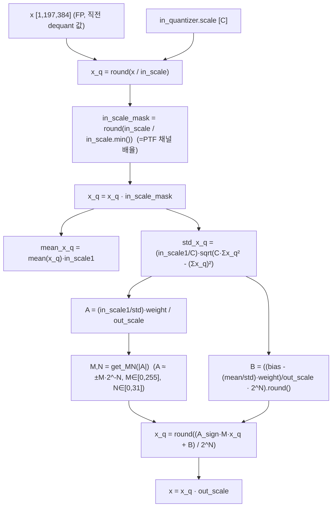

### 6.3 forward call stack
`Block.forward`(`vit_quant.py:181-184`) → `self.norm1(x, last_quantizer, self.qact1.quantizer)`(`:183`) → `QIntLayerNorm.forward`(int 모드, `layers.py:173-203`) → `get_MN`(`:196`) → 정수 affine(`:202`).

### 6.4 대표 코드 위치
`layers.py`: `get_MN` `:159-163`, int 모드 정수화/PTF mask `:174-187`, 정수 mean/std `:189-191`, 고정소수점 affine `:193-202`, 출력 복원 `:203`.

### 6.5 대표 코드 블록
```python
# layers.py:159-163  실수 A를 고정소수점 M·2^(-N)로 분해 (8-bit 정수 곱 + 시프트)
def get_MN(self, x):
    bit = 8
    N = torch.clamp(bit - 1 - torch.floor(torch.log2(x)), 0, 31)
    M = torch.clamp(torch.floor(x * torch.pow(2, N)), 0, 2 ** bit - 1)
    return M, N
```
```python
# layers.py:183-191  입력 정수화 + PTF 채널 배율 + 정수 mean/std
x_q = (x / in_scale).round()
in_scale1 = in_scale.min()
in_scale_mask = (in_scale / in_scale1).round()       # = PTF 채널 배율 (2^k)
x_q = x_q * in_scale_mask                             # 채널 정렬 (시프트 등가)
mean_x_q = x_q.mean(dim=-1) * in_scale1
std_x_q = (in_scale1 / channel_nums) * torch.sqrt(
    channel_nums * (x_q**2).sum(dim=-1) - x_q.sum(dim=-1)**2)
```
```python
# layers.py:196-203  affine을 고정소수점 정수 연산으로
A_sign = A.sign()
M, N = self.get_MN(A.abs())
B = ((self.bias.reshape(1,1,-1) - (mean_x_q/std_x_q).unsqueeze(-1)*self.weight.reshape(1,1,-1))
     / out_scale * torch.pow(2, N)).round()
x_q = ((A_sign * M * x_q + B) / torch.pow(2, N)).round()    # 정수 MAC + 시프트
x = x_q * out_scale
```
→ **PTF mask로 채널 정렬(`in_scale/in_scale1`=2^k) → 정수 mean/std → affine을 M·2^(-N) 고정소수점으로 정수 곱+시프트**. `(A·x + B) >> N` 형태. `std`는 FP sqrt 1회 사용(I-ViT의 정수 뉴턴 반복과 다른 점 — FQ-ViT는 std에 torch.sqrt 호출, `:190`).

### 6.6 연산·수치표현 분해 + 정량 (DeiT-S, C=384, N=197)
- **양자화 방식**: PTF integer LayerNorm. 입력 정수화 → 채널 2^k 정렬 → 정수 mean/var → affine 고정소수점(M 8bit, N≤31).
- **scale/zp**: in_scale=PTF(채널별 2^k·base, §5), out_scale=다음 act quantizer scale. M∈[0,255], N∈[0,31].
- **비트폭**: M=8bit. var 누산 `(x_q²).sum`은 큰 비트 필요(주의: 정수 오버플로 설계 별도, `layers.py:191`). 입출력 uint8.
- **params**: weight γ + bias β = 2×384 = **768**/LN. block당 2개=1536, ×12 + 최종 norm 1개 = **~18.8K**(LN 전체).
- **FLOPs/block** (1 LN, [1,197,384]): mean+var reduce ≈ 2·N·C = 2×197×384 ≈ 151K; sqrt N개; affine O(N·C)=75.6K. LN 1개 ≈ **~230K 원소연산**. block당 2개 + 최종 1개.
- **activation memory**: 출력 [1,197,384] uint8 = **75.6 KB**.
- **시사**: `get_MN`의 M·2^(-N) 분해는 LN affine을 **8-bit 정수 곱 + N비트 시프트**로 RTL화하는 정량 레시피. PTF mask(`in_scale/in_scale1`)는 §5 시프트 dequant와 직결. std의 FP sqrt는 HW에서 정수 sqrt/LUT로 치환 필요(I-ViT 뉴턴 반복 차용 가능).

---

## 7. 모듈: Log-Int-Softmax — `layers.py` (QIntSoftmax) ★정수 비선형, FPGA 1순위

### 7.1 역할 + 상위/하위
- **역할**: Softmax를 **정수 지수(i-exp) + 로그 양자화(Log2)**로. I-BERT식 2차 다항 지수 근사를 정수 계수로, `2^(n-q)` 시프트로 지수 복원, 합산 후 `round(sum/exp)` → log_round → uint4 clamp → `2^(-qlog)` 복원. integer-only, 곱셈기-경량 softmax.
- **상위**: `Attention.log_int_softmax = QIntSoftmax(log_i_softmax=cfg.INT_SOFTMAX, bit_type=uint4)`(`vit_quant.py:86-93`), forward에서 `qact_attn1.quantizer.scale`을 인자로 전달(`:108`). **하위**: `int_softmax`(`:245-277`), `int_exp`/`int_polynomial`(중첩, `:248-270`), `log_round`(`:237-243`).

### 7.2 데이터플로우 (텐서 shape 흐름, LIS 경로)
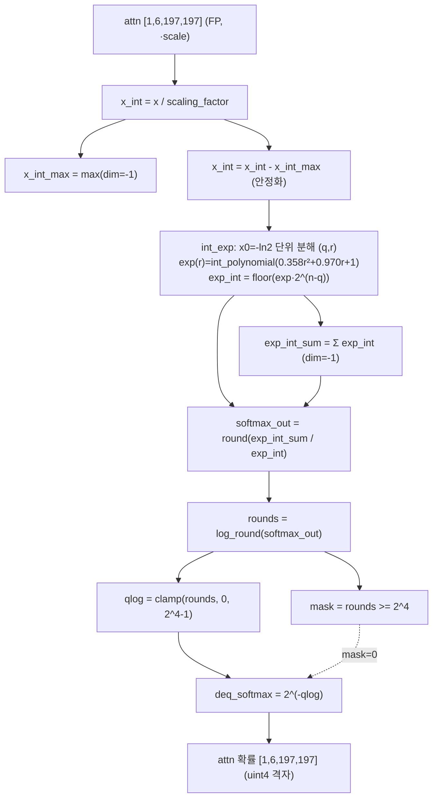

### 7.3 forward call stack
`Attention.forward`(`vit_quant.py:108`) → `QIntSoftmax.forward(attn, scale)`(`layers.py:279`) → `int_softmax`(`:281` → `:245-277`) → `int_exp`(`:275` → `:260-270`) → `int_polynomial`(`:267` → `:248-258`) → `log_round`(`:283` → `:237-243`).

### 7.4 대표 코드 위치
`layers.py`: `log_round` `:237-243`, `int_polynomial` `:248-258`, `int_exp` `:260-270`, `int_softmax` `:272-277`, LIS forward `:279-288`, 비-LIS fallback `:289-298`.

### 7.5 대표 코드 블록
```python
# layers.py:248-258  exp(r)을 2차 다항 정수 근사 (0.358x²+0.970x+1)
def int_polynomial(x_int, scaling_factor):
    coef = [0.35815147, 0.96963238, 1.]      # ax² + bx + c
    coef[1] /= coef[0]; coef[2] /= coef[0]
    b_int = torch.floor(coef[1] / scaling_factor)
    c_int = torch.floor(coef[2] / scaling_factor**2)
    z = x_int + b_int; z = x_int * z; z = z + c_int   # a(x+b/a)x + c/a 형태
    return z, coef[0] * scaling_factor**2
```
```python
# layers.py:260-270  정수 지수: -ln2 단위 분해 + 2^(n-q) 시프트
def int_exp(x_int, scaling_factor):
    x0 = -0.6931  # -ln2
    n = 30
    x0_int = torch.floor(x0 / scaling_factor)
    x_int = torch.max(x_int, n * x0_int)              # 하한 클램프
    q = torch.floor(x_int / x0_int)                   # 몫
    r = x_int - x0_int * q                            # 나머지
    exp_int, exp_sf = int_polynomial(r, scaling_factor)
    exp_int = torch.clamp(torch.floor(exp_int * 2**(n - q)), min=0)   # <<(n-q)
    return exp_int, exp_sf / 2**n
```
```python
# layers.py:280-288  LIS: 정수 exp → log_round → uint4 → 2^(-qlog)
exp_int, exp_int_sum = self.int_softmax(x, scale)
softmax_out = torch.round(exp_int_sum / exp_int)     # = 1/softmax (역수)
rounds = self.log_round(softmax_out)                 # log2 라운딩
mask = rounds >= 2**self.bit_type.bits               # uint4 범위 밖
qlog = torch.clamp(rounds, 0, 2**self.bit_type.bits - 1)
deq_softmax = 2**(-qlog); deq_softmax[mask] = 0      # 시프트 복원
```
→ **지수=정수 다항+`2^(n-q)` 시프트**(LUT/FP exp 불필요), **정규화=`round(sum/exp)`**(나눗셈 1방향), **양자화=log2(시프트)**. attention map 4-bit. `2^(n-q)`·`2^(-qlog)`가 모두 시프트 → barrel shifter 중심 합성 가능.

### 7.6 연산·수치표현 분해 + 정량 (DeiT-S, attn [1,6,197,197])
- **양자화 방식**: i-exp(정수 지수) + log2 양자화. max 차감 안정화. n=30(`layers.py:262`).
- **scale/zp**: 입력 scale=`qact_attn1.quantizer.scale`(uint8), 출력=`2^(-qlog)` 로그 격자(uint4, zp 없음).
- **비트폭**: attention **uint4**(`config.py:28`, BIT_TYPE_S). 다항 중간 누산 큰 비트(추정 INT32). README의 8/8/**4**가 이 경로.
- **params**: 0.
- **FLOPs/block**: int_exp on H·N²=6×197²≈233K 원소 × (다항 mul 2 + 가감 + 몫/나머지 2 + 시프트) ≈ 7 op/원소 + dim축 sum/round/log_round ≈ **~2M 원소연산/block**. ×12.
- **activation memory**: attention 확률 [1,6,197,197] uint4 = **116 KB** (uint8이면 233KB) → LIS로 절반.
- **시사**: 지수가 곱셈/덧셈/시프트만 → DSP 경량. log2 저장 4-bit → BRAM 절감. HG-PIPE류 파이프라인에 non-blocking softmax 유닛으로 이식 가능(시선추적 저지연 부합, 추정). 다항 계수(0.358/0.970/1)·n=30은 정확도-비트 트레이드오프 상수.

---

## 8. 모듈: 정수 Linear — `layers.py` (QLinear)

### 8.1 역할 + 상위/하위
- **역할**: nn.Linear 가중치를 channel_wise 양자화(fake-quant) 후 `F.linear`. calibrate 모드면 weight observer 통계 갱신·scale 확정. quant 모드면 weight를 quantizer로 fake-quant 후 연산.
- **상위**: `Attention.qkv/proj`(`vit_quant.py:43,64`), `Mlp.fc1/fc2`(`layers_quant.py:132,148`), `VisionTransformer.head`(`vit_quant.py:314`). **하위**: `build_observer`/`build_quantizer`(`layers.py:97-100`), `UniformQuantizer`.

### 8.2 데이터플로우 (텐서 shape 흐름, DeiT-S qkv)
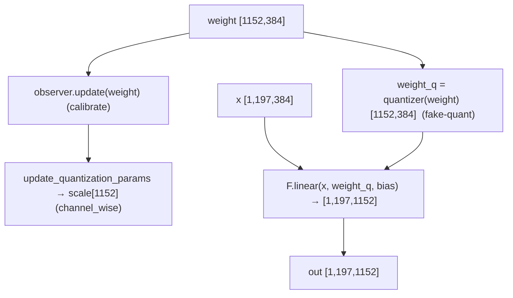

### 8.3 forward call stack
`Attention.forward`(`vit_quant.py:97`) → `QLinear.forward(x)`(`layers.py:102`) → (calibrate) `observer.update(weight)`(`:104`) / `update_quantization_params`(`:106`) → (quant) `weight = self.quantizer(self.weight)`(`:109`) → `F.linear`(`:110`).

### 8.4 대표 코드 위치
`layers.py`: 클래스 `:73-110`, calibrate 분기 `:103-106`, quant 분기 `:107-110`.

### 8.5 대표 코드 블록
```python
# layers.py:102-110  calibrate(통계/스케일) vs quant(fake-quant) 분기
def forward(self, x):
    if self.calibrate:
        self.quantizer.observer.update(self.weight)
        if self.last_calibrate:
            self.quantizer.update_quantization_params(x)
    if not self.quant:
        return F.linear(x, self.weight, self.bias)
    weight = self.quantizer(self.weight)          # fake-quant
    return F.linear(x, weight, self.bias)
```
→ 입력 x는 **이미 직전 QAct에서 fake-quant된 FP**라 여기서 별도 정수화 없이 `F.linear`(FP MAC). I-ViT(`F.linear(x_int, weight_integer)` 정수 MAC)와 달리 **FQ-ViT QLinear는 fake-quant FP MAC** — 정수 GEMM 커널 부재(확인). bias는 양자화하지 않음(FP 그대로).

### 8.6 연산·수치표현 분해 + 정량 (DeiT-S, B=1, N=197)
- **양자화 방식**: weight **channel_wise**(out축) int8(`config.py:12,22`), minmax observer(signed→대칭, `minmax.py:41-45`). 입력은 직전 QAct가 uint8 fake-quant.
- **scale/zp**: W scale `[out]`(per-channel, zp=0 대칭). bias 미양자화.
- **비트폭**: W int8 / 입력 A uint8 / bias FP32.
- **params** (DeiT-S 1 block, C=384):
  - qkv: 384×1152 + 1152 = **443,520**
  - proj: 384×384 + 384 = **147,840**
  - fc1: 384×1536 + 1536 = **591,360**
  - fc2: 1536×384 + 384 = **590,208**
  - Linear params/block ≈ **1.773M**, ×12 ≈ **21.27M**(+ patch_embed/head 별도).
- **MACs/block** (B=1, N=197):
  - qkv: 197×384×1152 ≈ **87.1M**
  - proj: 197×384×384 ≈ **29.0M**
  - fc1: 197×384×1536 ≈ **116.2M**
  - fc2: 197×1536×384 ≈ **116.2M**
  - Linear MAC/block ≈ **348.5M**, ×12 ≈ **4.18G** (Attention matmul 제외).
- **activation bit**: 입력 uint8, weight int8 → HW 환산 정수 MAC INT32 누산(추정). 코드상은 FP MAC.

---

## 9. 모듈: 활성 양자화 — `layers.py` (QAct)

### 9.1 역할 + 상위/하위
- **역할**: activation을 fake-quant. calibrate 모드면 observer가 입력 통계 갱신, last_calibrate면 scale/zp 확정. quant 모드면 quantizer로 fake-quant. PTF observer를 쓰는 LayerNorm 직전 QAct(qact2/qact4)가 PTF의 통계 수집처.
- **상위**: 거의 모든 모듈 사이 — Attention(qact1/2/3/qact_attn1), Block(qact1~4), Mlp(qact1/2), PatchEmbed, VisionTransformer(qact_input/embed/pos/1/2/act_out). **하위**: observer(minmax/ema/percentile/omse/ptf), UniformQuantizer.

### 9.2 데이터플로우 (텐서 shape 흐름)
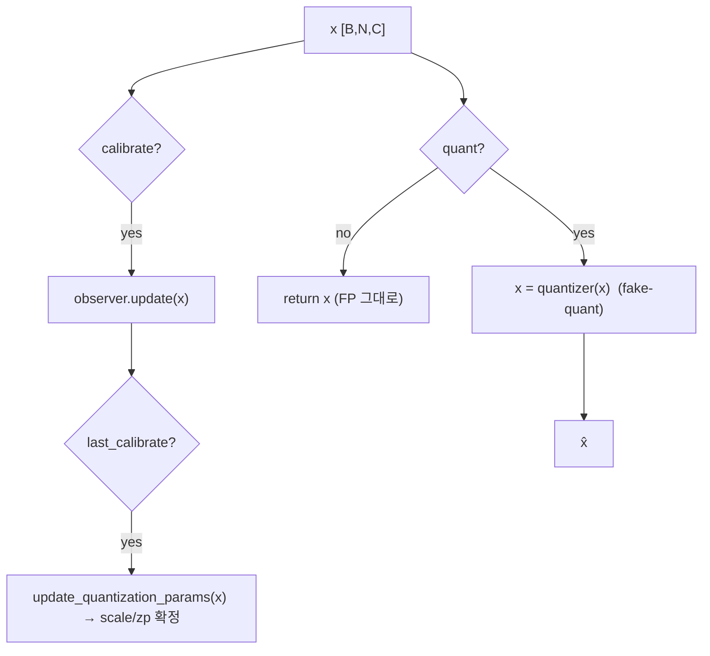

### 9.3 forward call stack
`Block.forward`(`vit_quant.py:181`) → `QAct.forward(x)`(`layers.py:139`) → (calibrate) `observer.update(x)`(`:141`) / `update_quantization_params`(`:144`) → (quant) `self.quantizer(x)`(`:147`).

### 9.4 대표 코드 위치
`layers.py`: 클래스 `:113-148`, calibrate `:140-144`, quant `:145-148`.

### 9.5 대표 코드 블록
```python
# layers.py:139-148  QAct: calibrate(통계) → last_calibrate(scale 확정) → quant(fake-quant)
def forward(self, x):
    if self.calibrate:
        self.quantizer.observer.update(x)
        if self.last_calibrate:
            self.quantizer.update_quantization_params(x)
    if not self.quant:
        return x
    x = self.quantizer(x)
    return x
```
→ activation observer는 layer_wise(`config.py:23`)라 scale/zp가 **스칼라**(per-tensor 비대칭). LayerNorm 직전 qact2/qact4만 PTF(channel_wise, `config.py:38-39`)라 **채널별 2^k scale**. `--quant-method`로 observer 종류 선택(minmax/ema/percentile/omse).

### 9.6 연산·수치표현 분해 + 정량
- **양자화 방식**: 기본 per-tensor 비대칭 uint8(layer_wise). LayerNorm-직전만 PTF channel_wise. observer = `--quant-method`(기본 minmax).
- **scale/zp**: per-tensor 스칼라(기본) 또는 채널 벡터(PTF). uint8이라 zp≠0.
- **비트폭**: uint8(activation). softmax 경로만 uint4(QIntSoftmax 내부).
- **params**: 0(scale/zp buffer만).
- **activation memory** (DeiT-S [1,197,384] uint8 = **75.6 KB**). attention 중간 [1,6,197,197] uint8 = 233KB(softmax 입력 전).
- **시사**: activation은 layer_wise 단일 scale → HW 단순. 단 ViT-B/L에서 layer_wise가 붕괴(README)하므로 LayerNorm 경로의 PTF가 필수 보정. residual 별도 비트폭 분리는 없음(I-ViT의 A16 residual과 다름).

---

## 10. 모듈: 정수 Conv (PatchEmbed) — `layers.py` (QConv2d)

### 10.1 역할 + 상위/하위
- **역할**: 입력 이미지 패치 투영(16×16 stride16 conv). channel_wise weight fake-quant 후 `F.conv2d`. calibrate/quant 분기는 QLinear와 동일.
- **상위**: `PatchEmbed.proj`(`layers_quant.py:197-206`). **하위**: `build_observer`/`build_quantizer`, `UniformQuantizer`.

### 10.2 데이터플로우 (텐서 shape 흐름, DeiT-S)
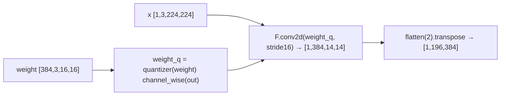

### 10.3 forward call stack
`PatchEmbed.forward`(`layers_quant.py:238`) → `QConv2d.forward(x)`(`layers.py:53`) → (calibrate) `observer.update(weight)`(`:55`) / `update_quantization_params`(`:57`) → (quant) `weight = self.quantizer(weight)`(`:68`) → `F.conv2d`(`:69-70`).

### 10.4 대표 코드 위치
`layers.py`: 클래스 `:11-70`, calibrate `:54-57`, quant 분기 `:58-70`.

### 10.5 대표 코드 블록
```python
# layers.py:53-70  Conv: calibrate(weight 통계) vs quant(fake-quant)
def forward(self, x):
    if self.calibrate:
        self.quantizer.observer.update(self.weight)
        if self.last_calibrate:
            self.quantizer.update_quantization_params(x)
    if not self.quant:
        return F.conv2d(x, self.weight, self.bias, self.stride, self.padding, ...)
    weight = self.quantizer(self.weight)           # fake-quant, module_type='conv_weight'
    return F.conv2d(x, weight, self.bias, self.stride, self.padding, ...)
```
→ `module_type='conv_weight'`라 scale broadcast가 `(-1,1,1,1)`(per-out-channel, `base.py:17`). bias 미양자화. 입력은 qact_input(DeiT) 또는 raw(ViT, input_quant=False)에서 처리.

### 10.6 연산·수치표현 분해 + 정량 (DeiT-S PatchEmbed)
- **양자화 방식**: weight channel_wise(out=384) int8, bias FP. 입력 uint8(DeiT) 또는 FP(ViT).
- **비트폭**: W int8 / 입력 A uint8 / bias FP32.
- **params**: 384×3×16×16 + 384 = **295,296**.
- **MACs**: out 14×14=196 위치 × 384 × (3×16×16=768) = 196×384×768 ≈ **57.8M**(전 모델 1회).
- **activation memory**: 출력 [1,384,14,14]→flatten [1,196,384] uint8 = **75.3 KB**.

---

## 11. 모듈: Attention / Block / VisionTransformer 조립 + Swin — `vit_quant.py` / `swin_quant.py`

### 11.1 역할 + 상위/하위
- **역할**: 정수/fake-quant 모듈을 ViT/Swin 토폴로지로 조립. **QIntLayerNorm에 in/out quantizer를 명시 전달**(scale 연결), Attention 내 QKᵀ·attn·V는 일반 torch `@`(FP, 양쪽이 fake-quant된 값), softmax만 QIntSoftmax(LIS).
- **상위**: `test_quant.py`의 `model(image)`. **하위**: §2~10 전 모듈 + `Mlp`/`PatchEmbed`(`layers_quant.py`).

### 11.2 데이터플로우 (텐서 shape 흐름, 1 Block)
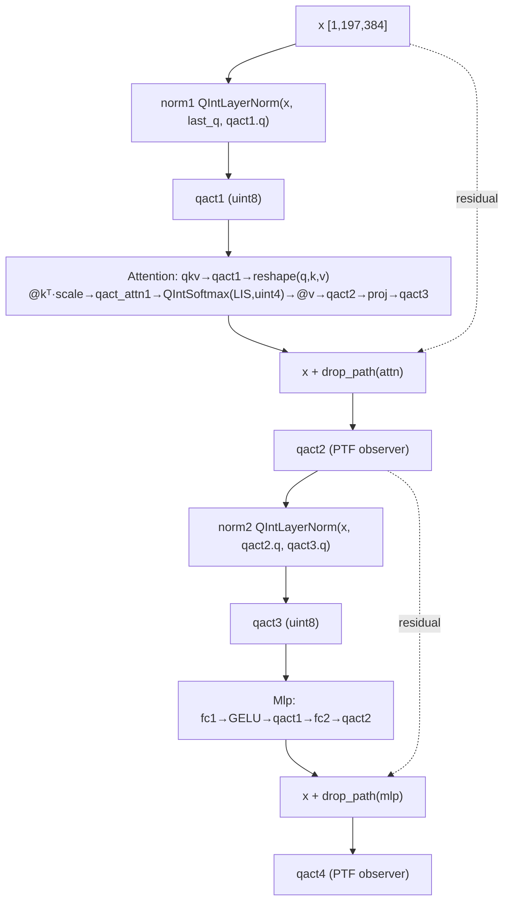

### 11.3 forward call stack
`VisionTransformer.forward_features`(`vit_quant.py:382`) → `blk(x, last_quantizer)` ×12(`:399-402`) → `Block.forward`(`:180`) → `norm1`(`:183`)→`qact1`→`Attention.forward`(`:182`)→`qact2`(residual, `:181`)→`norm2`(`:188`)→`qact3`→`Mlp.forward`(`:186`)→`qact4`(residual, `:185`).

### 11.4 대표 코드 위치
`vit_quant.py`: `Attention` `:25-115`, `Block` `:118-190`, `VisionTransformer` `:193-414`, model_quant `:354-360`, 팩토리 `:417-548`. `swin_quant.py`: WindowAttention `:54-`, SwinTransformerBlock `:224-`, SwinTransformer `:570-`.

### 11.5 대표 코드 블록
```python
# vit_quant.py:106-110  Attention: QKᵀ·scale(FP @) → qact → LIS softmax
attn = (q @ k.transpose(-2, -1)) * self.scale       # FP matmul (양쪽 fake-quant 값)
attn = self.qact_attn1(attn)
attn = self.log_int_softmax(attn, self.qact_attn1.quantizer.scale)   # LIS, scale 전달
attn = self.attn_drop(attn)
x = (attn @ v).transpose(1, 2).reshape(B, N, C)     # FP matmul
```
```python
# vit_quant.py:181-189  Block: residual + QIntLayerNorm에 in/out quantizer 연결
x = self.qact2(x + self.drop_path(self.attn(
        self.qact1(self.norm1(x, last_quantizer, self.qact1.quantizer)))))
x = self.qact4(x + self.drop_path(self.mlp(
        self.qact3(self.norm2(x, self.qact2.quantizer, self.qact3.quantizer)))))
```
```python
# vit_quant.py:354-360  model_quant: LIS/PTF int 경로 활성화
def model_quant(self):
    for m in self.modules():
        if type(m) in [QConv2d, QLinear, QAct, QIntSoftmax]: m.quant = True
        if self.cfg.INT_NORM:
            if type(m) in [QIntLayerNorm]: m.mode = 'int'   # PTF integer LN 켜짐
```
→ Attention 행렬곱(QKᵀ, attn·V)은 **FP @**(I-ViT는 정수 @). FQ-ViT가 정수화하는 비선형은 LayerNorm·Softmax 2개로 한정. `last_quantizer`로 직전 layer scale을 QIntLayerNorm에 전달해 입력 정수화 scale로 사용(`:183,400-401`).

### 11.6 연산·수치표현 분해 + 정량 (DeiT-S, B=1, N=197)
- **양자화 방식**: weight channel_wise int8, activation layer_wise uint8, LayerNorm-입력 PTF channel_wise, softmax uint4 LIS. Attention matmul은 FP(fake-quant 값).
- **params (DeiT-S 전체, 분석적)**:
  - PatchEmbed: 295,296
  - cls_token: 384, pos_embed: 197×384 = 75,648
  - Block×12: Linear 1.773M×12 ≈ 21.27M + LN 2×768×12 ≈ 18.4K
  - 최종 norm: 768, head: 384×1000+1000 = 385,000
  - **총 ≈ 22.0M params** (DeiT-S 공칭 ~22M와 일치, 양자화로 개수 불변).
- **MACs/이미지 (B=1, N=197)**:
  - PatchEmbed: 57.8M (1회)
  - Block×12: (Linear 348.5M + Attn matmul 29.8M)×12 ≈ **4.54G**
    - (Attn matmul: QKᵀ 6×197²×64 + attn·V 6×197²×64 ≈ 29.8M/block)
  - head: cls 1토큰 × 384×1000 = 0.384M
  - **총 ≈ 4.6 GMAC/이미지** (정수 비선형 원소연산 제외).
- **activation memory (block당 피크)**: attention 입력 [1,6,197,197] uint8 = 233KB; LIS 출력 uint4 = **116 KB**.
- **Swin 차이**: window attention(W=7), shifted window, PatchMerging downsampling. 동일 Q모듈/Config 재사용(`swin_quant.py:11,143`). embed_dim=96, depths=(2,2,6,2), heads=(3,6,12,24)(`swin_quant.py:600-602`). 비선형(PTF/LIS) 적용은 ViT와 동일 → §5~7 분석 그대로 적용.

---

## 12. 모듈: PTQ 캘리브레이션·평가 파이프라인 — `test_quant.py` + `config.py`

### 12.1 역할 + 상위/하위
- **역할**: FP 사전학습 로드 → 캘리브레이션 세트(calib_iter개 배치)로 observer 통계 수집 → scale/zp 확정 → quant 전환(LIS/PTF int 경로 켜기) → ImageNet 평가. **재학습 없음(PTQ)**.
- **상위**: CLI(`README.md:90-105`). **하위**: `config.Config`(플래그→비트/observer 매핑), VisionTransformer/SwinTransformer.

### 12.2 데이터플로우
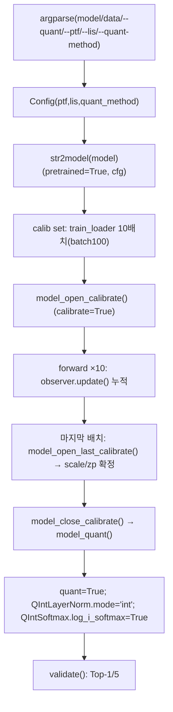

### 12.3 forward call stack
`main`(`test_quant.py:84`) → `Config`(`:89`) → `str2model(...)( pretrained=True)`(`:90`) → calib set 수집(`:142-147`) → `model_open_calibrate`(`:150`) → `model(image)` ×10(`:152-157`) → `model_open_last_calibrate`(`:156`) → `model_close_calibrate`/`model_quant`(`:158-159`) → `validate`(`:162`).

### 12.4 대표 코드 위치
`test_quant.py`: argparse `:15-48`, `str2model` `:51-63`, main `:84-163`, 캘리브레이션 루프 `:149-159`, validate `:166-211`, accuracy `:233-246`, build_transform `:249-279`. `config.py`: Config `:4-43`.

### 12.5 대표 코드 블록
```python
# test_quant.py:149-159  캘리브레이션 → quant 전환
print('Calibrating...')
model.model_open_calibrate()
with torch.no_grad():
    for i, image in enumerate(image_list):
        if i == len(image_list) - 1:
            model.model_open_last_calibrate()   # 마지막 배치에서 scale 확정(OMSE 등)
        output = model(image)
model.model_close_calibrate()
model.model_quant()                             # quant=True + LIS/PTF int 경로 ON
```
```python
# config.py:26-39  lis/ptf 플래그 → 비트/observer/quantizer 매핑
if lis:
    self.INT_SOFTMAX = True
    self.BIT_TYPE_S = BIT_TYPE_DICT['uint4']   # attention 4-bit
    self.QUANTIZER_S = 'log2'
if ptf:
    self.INT_NORM = True
    self.OBSERVER_A_LN = 'ptf'                  # LayerNorm-입력 act에 PTF observer
    self.CALIBRATION_MODE_A_LN = 'channel_wise'
```
→ `--lis`/`--ptf` 둘 다 줘야 fully quantized(LIS+PTF). 안 주면 LayerNorm/Softmax는 FP(`config.py:31-43` else 분기). 기본 비트: W int8/A uint8(`:12-13`).

### 12.6 연산·수치표현 분해 + 정량 / 재현 명령
- **양자화 방식**: PTQ fake-quant + (LIS/PTF) 부분 정수 경로. observer 통계는 calib 10배치(batch100=1000장)로만 수집(`test_quant.py:34,143-144`).
- **하이퍼파라미터**: calib_batchsize=100, calib_iter=10(`:30-34`), val_batchsize=100(`:35-38`), seed=0(`:48`), device=cuda(`:43`).
- **재현 명령** (`README.md:90-105`):
  ```bash
  python test_quant.py deit_small <DATA_DIR> --quant --ptf --lis --quant-method minmax
  # 모델: deit_{tiny,small,base}, vit_{base,large}, swin_{tiny,small,base}
  # --quant-method: minmax / ema / percentile / omse
  ```
- **정확도**: DeiT-S 8/8/8 79.17%, 8/8/4 78.40%, ImageNet Top-1(`README.md:115,122-123`). **속도/실측은 본 세션 미실행 → 확인 불가.**
- **주의**: 재학습 없음 — calibration 1회로 끝(I-ViT의 수십 epoch QAT 대비 압도적 저비용).

---

## N+1. 모듈 한눈 요약 표

| 모듈 | 파일:라인 | 역할 | 양자화 방식 | 대표 정량(DeiT-S) |
|---|---|---|---|---|
| BaseQuantizer/BitType | quantizer/base.py:6-45, bit_type.py:7-46 | scale broadcast + fake-quant 추상 | W int8/A uint8/S uint4 | params 0, O(N) |
| UniformQuantizer | quantizer/uniform.py:8-41 | 균일 비대칭 affine | round(x/s+zp), zp≠0(A) | params 0, qkv W 442K op |
| Log2Quantizer | quantizer/log2.py:7-26 | 로그 도메인 양자화(LIS) | round(-log2 x), 2^(-q) dequant | attn uint4 116KB |
| PtfObserver | observer/ptf.py:8-66 | 채널별 2^k scale(PTF) | base scale·2^k, lp_loss 탐색 | PTF 메타 96B/LN, 추론비용 0 |
| QIntLayerNorm | layers.py:151-206 | PTF integer LayerNorm | 정수 mean/std + M·2^-N affine | LN 768 params, ~230K op |
| QIntSoftmax | layers.py:209-298 | Log-Int-Softmax(LIS) | i-exp(다항+2^(n-q)) + log2 | attn uint4 116KB, ~2M op/blk |
| QLinear | layers.py:73-110 | weight channel_wise fake-quant + F.linear | W int8/A uint8, FP MAC | block Linear 1.77M params, 348.5M MAC |
| QAct | layers.py:113-148 | activation fake-quant + observer | A uint8 layer_wise(LN前 PTF) | A uint8 75.6KB |
| QConv2d | layers.py:11-70 | PatchEmbed 정수 conv(fake-quant) | W int8 channel_wise | 295K params, 57.8M MAC |
| Attention/Block/VT/Swin | vit_quant.py:25-414, swin_quant.py | ViT/Swin 조립 + scale 연결 | 비선형만 정수(LN/Softmax) | 총 22M params, 4.6 GMAC/img |
| PTQ pipeline | test_quant.py:84-211, config.py:4-43 | calibrate→quant→evaluate | PTQ fake-quant, 재학습 없음 | calib 1000장, DeiT-S 79.17% |

---

## N+2. 학습·평가 파이프라인 + 재현 명령

- **데이터셋**: ImageNet, 224×224, 1000 클래스 (`test_quant.py:114-117`). 전처리 모델별 상이(DeiT/ViT/Swin mean·std·crop_pct, `:95-106`).
- **사전학습**: DeiT torch.hub `.pth`(`vit_quant.py:436-443,464-470,491-497`), ViT augreg `.npz`(`:518-522,543-547`). **재학습 없음**.
- **PTQ 평가**:
  ```bash
  python test_quant.py deit_small <DATA_DIR> --quant --ptf --lis --quant-method minmax
  ```
  옵션: `model ∈ {deit_tiny,deit_small,deit_base,vit_base,vit_large,swin_tiny,swin_small,swin_base}`(`test_quant.py:18-21`), `--quant-method ∈ {minmax,ema,omse,percentile}`(`:27-29`).
- **캘리브레이션**: train set에서 calib_iter(10)×batch(100)=1000장으로 observer 통계 수집(`:142-147`), 마지막 배치에서 scale/zp 확정. OMSE는 last_calibrate에서 90스텝 grid search(`omse.py:38-55`), PTF는 채널별 4-scale lp_loss 탐색(`ptf.py:49-64`).
- **observer 5종**: minmax(`minmax.py`), ema(σ=0.01, `ema.py:16`), percentile(α=0.99999, `percentile.py:20`), omse(L2 최소화 90스텝, `omse.py:38`), ptf(`ptf.py`). weight는 항상 minmax(`config.py:15`).
- **의존성**: PyTorch 1.7.1, torchvision, cudatoolkit 10.1, python 3.7(`README.md:66-73`), numpy/PIL. **CUDA 권장**(`--device cuda` 기본)이나 강제 `.cuda()` 하드코딩 없음 → CPU 실행 코드상 가능(추정, 미검증).
- **속도(latency)**: 본 repo 미제공 → **확인 불가**.

---

## N+3. 우리 프로젝트(FPGA ViT 가속) 시사점 + FPGA 친화도

### N+3.1 PTF = 채널별 2^k 시프트 LayerNorm (최우선 HW 친화)
- **PtfObserver + QIntLayerNorm**(`observer/ptf.py:41-65`, `layers.py:183-203`): 채널별 scale을 임의 실수가 아닌 **base scale × 2^k(k∈{0,1,2,3})**로 표현. → 채널별 dequant를 **DSP 곱셈기 대신 배럴 시프터 + 2bit×C ROM**으로 구현(DeiT-S 384채널 × 2bit = 96B). channel-wise 정확도를 시프트-only로 확보. ViT-B/L에서 layer-wise가 붕괴(23%/3%, `README.md:116`)하나 PTF로 83%/85% 유지 → **시선추적 ViT도 채널 단위 보정 필수**(추정).
- **`get_MN` 고정소수점 분해**(`layers.py:159-163`): LN affine을 `±M·2^(-N)`(M 8bit, N≤31)로 → **8-bit 정수 곱 + N비트 시프트** RTL 레시피 그대로 채택 가능.
- **주의**: std에 FP sqrt 1회 사용(`layers.py:190`) → HW에서 정수 sqrt/LUT(I-ViT 뉴턴 반복) 치환 필요. `(x_q²).sum` 누산 비트폭(오버플로) 별도 설계(확인).

### N+3.2 LIS = i-exp + Log2 = 곱셈기-경량 softmax (FPGA 1순위)
- **QIntSoftmax**(`layers.py:248-288`): 지수를 **2차 다항(0.358r²+0.970r+1) + `2^(n-q)` 시프트**로, dequant를 `2^(-qlog)` 시프트로 → LUT/FP exp 불필요, barrel shifter 중심. attention map **uint4**(DeiT-S 116KB, uint8 대비 절반) → BRAM 절감 + score 버퍼 4-bit 운용. HG-PIPE류 파이프라인에 non-blocking softmax 유닛 이식 → 시선추적 저지연 부합(추정).
- **상수 튜닝 대상**: n=30(`layers.py:262`), 다항 계수(`:249`)는 정확도-비트 트레이드오프 → 백본/태스크별 재튜닝.

### N+3.3 Observer/Quantizer 분리 = 양자화 IP 모듈화
- build_observer/build_quantizer 분리(`layers.py:48-51`)로 observer(통계)와 quantizer(scale 적용)를 독립 IP로 합성 가능. PTQ라 **calibration 1회 후 scale 상수화** → 추론 회로는 scale/zp/2^k가 전부 상수 ROM. I-ViT의 running-stat QAT 대비 HW 단순.

### N+3.4 FPGA 친화도 평가
| 항목 | 평가 | 근거 |
|---|---|---|
| LayerNorm 채널 보정 | ★★★ 2^k 시프트(DSP-free) | `ptf.py:65`, `layers.py:185` |
| Softmax 비선형 | ★★★ 다항 지수=시프트, attn 4-bit | `layers.py:268,286` |
| 재양자화 | ★★ affine M·2^-N 고정소수점 | `get_MN` `:159-163` |
| Linear/Conv MAC | ★★ fake-quant FP(정수 GEMM 커널 부재) | `layers.py:110,69` |
| Attention 행렬곱 | ★ FP @(정수화 안 됨, I-ViT와 차이) | `vit_quant.py:106,110` |
| LayerNorm std sqrt | ★ FP sqrt 1회(정수화 필요) | `layers.py:190` |
| QAT 비용 | ★★★ 재학습 없음(순수 PTQ) | `test_quant.py:149-159` |

### N+3.5 I-ViT 대비 차이 (HW 설계 선택 기준)
- **I-ViT**: 전 경로 integer-only(matmul·GELU·LayerNorm·Softmax 모두 정수, QAT 필요). **FQ-ViT**: 비선형 2개(LayerNorm/Softmax)만 정수화, Linear/Conv/Attn은 fake-quant, **PTQ(재학습 없음)**. → FQ-ViT는 **빠른 배포 + 채널 보정(PTF) + attention 4-bit(LIS)** 강점, I-ViT는 **완전 정수 추론 커널** 강점.
- **결합 전략**: FQ-ViT의 PTF(LayerNorm 채널 시프트) + LIS(softmax 4-bit) 비선형 청사진 + I-ViT의 정수 matmul/GELU/dyadic requant를 합치면 우리 가속기의 이상적 조합(추정). 시선추적 경량 ViT에 PTQ로 빠른 적용 후 비선형만 FQ-ViT 방식으로 HW화.

---

## 부록. 근거 / 확인 불가

- **직접 코드 확인(전 라인 인용)**: `models/ptq/layers.py`(299L 전체), `quantizer/{base,uniform,log2,build}.py`, `observer/{base,minmax,ema,percentile,omse,ptf,build,utils}.py`, `bit_type.py`, `models/vit_quant.py`(549L 전체), `models/layers_quant.py`(297L 전체), `config.py`, `test_quant.py`, `models/__init__.py`, `ptq/__init__.py`. README(명령/결과표). `swin_quant.py`는 Grep으로 구조·재사용 확인.
- **분석적 산출(검증 가능)**: params/MACs/activation memory는 DeiT-S config(`vit_quant.py:447-463`)와 표준식으로 계산. 정수 비선형 FLOPs는 원소연산 추정치("추정" 표기).
- **추정**: HW 환산 누산 비트폭(INT32), Log2Quantizer가 LIS 경로에서 우회됨, 프로젝트 성격(FPGA+XR), non-blocking softmax 유닛 권장, CPU 실행 가능 여부.
- **확인 불가(미실행/미상세)**: latency 실측(본 repo 미제공), `swin_quant.py` window/shift 토폴로지 세부 정량(동일 Q모듈 재사용은 확인), `utils.py`의 npz 로딩 내부, OMSE/percentile observer가 ViT-B/L 정확도에 미치는 정량 효과(README 표만).
