# I-ViT 모듈 통합 가이드 (S-PyTorch)

> 1차 요약: [`../I-ViT.md`](../I-ViT.md) — 본 문서는 그 요약을 모듈 단위로 심화한 통합 가이드다.
> 분석 대상: `\\wsl.localhost\ubuntu-24.04\home\user\project\PRJXR-HBTXR\REF\ViT-Quantization\I-ViT`
> 작성 원칙: 실제 소스 Read 후 `파일:라인` 근거 표기. 라인 근거 없는 추론은 "추정", 코드로 확인 불가는 "확인 불가"로 명시.
> 형제 HW 가이드(`REF/Analysis/CNN-Accel/ESDA/MODULE_GUIDE.md`)의 6요소 구조를 따르되, HW 지표(MAC lanes/scalar MACs)는 **S-PyTorch 수치 규약**(params/FLOPs/activation memory/비트폭)으로 치환한다.

---

## 0. 문서 머리말

### 0.1 대표 케이스 선정
- **대표 모델: `deit_small_patch16_224` (DeiT-S)** — `embed_dim=384, depth=12, num_heads=6, mlp_ratio=4, patch16, img224` (`vit_quant.py:306-316`). 근거:
  1. I-ViT 결과표에서 DeiT-S가 **FP32 79.85 → INT8 80.12 (+0.27)** 로 정확도 이득이 가장 크고(`README.md:53`), TVM 벤치 예시 모델명도 `deit_small_patch16_224`(`TVM_benchmark/README.md:27,39`)라 공식 대표 케이스.
  2. 토큰 수 N=197(=14×14 패치 + cls), C=384는 정수 비선형(IntGELU/IntSoftmax/IntLayerNorm)·Attention 정수 행렬곱이 모두 비자명한 크기로 활성화돼 분석 가치가 높음(추정 근거: `PatchEmbed.num_patches = (224/16)²=196`, `layers_quant.py:166-168`).
- **대표 분석 단위: VisionTransformer 1개 Block** = `IntLayerNorm → QuantAct → Attention(QuantLinear×2 + QuantMatMul×2 + IntSoftmax) → [residual fixedpoint_mul] → IntLayerNorm → Mlp(QuantLinear×2 + IntGELU) → [residual fixedpoint_mul]` (`vit_quant.py:91-143`). DeiT-S는 이 Block을 12개 적층(`vit_quant.py:198-214`).
- **대표 정수 비선형 3종**: `IntGELU`(ShiftGELU, `quant_modules.py:389-445`), `IntSoftmax`(Shiftmax, `quant_modules.py:448-497`), `IntLayerNorm`(I-LayerNorm, `quant_modules.py:333-386`) — FPGA 비선형 HW화의 직접 청사진.

### 0.2 S-PyTorch 수치 규약 (HW의 MAC lanes/scalar MACs 대체)
- **params**: 모듈 차원에서 분석적 계산. Linear `in·out (+out bias)`, LayerNorm `2·C`(weight+bias), Conv `Cout·Cin·Kh·Kw (+Cout)`. I-ViT 양자화 모듈은 FP 가중치를 그대로 두고 forward마다 fake-quant하므로(`quant_modules.py:82-83`) **params 개수는 FP 원본과 동일**(추가 학습 파라미터 없음, 비트폭만 달라짐).
- **FLOPs/MACs**: 표준식×config. Linear MAC = `B·N·in·out`. Attention QKᵀ = `B·H·N²·dh`, AV = `B·H·N²·dh`(여기서 H=heads, dh=head_dim, `vit_quant.py:34,63-64`). 대표 레이어 1개를 DeiT-S(B=1,N=197,C=384,H=6,dh=64)로 산출 후 12 block 환원.
- **activation memory**: 텐서 shape × 비트폭. I-ViT는 fake-quant라 실제 메모리는 FP32지만(`quant_modules.py:96-97` 출력이 `int×scale`=float), **정수 도메인 비트폭**(W/A bits)을 "HW 환산 activation bit"로 표기 — `shape × A_bit`.
- **비트폭/observer**: 코드 직접. 기본 W8/A8(`QuantLinear.weight_bit=8`, `quant_modules.py:32`; `QuantAct.activation_bit=8`, `:120`), bias 32bit(`:33`). residual·softmax·patch 경로는 **A16**으로 명시 호출(`QuantAct(16)`, `IntSoftmax(16)`). per-channel 대칭(weight), per-tensor 대칭(activation), observer = **running min/max(momentum 0.95)**.
- **정확도/속도**: README/논문 인용. 본 세션 미실행 → 측정 불가 항목은 "확인 불가".

### 0.3 운영 경로 (QAT 학습 ↔ 체크포인트 ↔ ImageNet 평가)
```
[FP 사전학습 가중치 로드] str2model(args.model)(pretrained=True)   (quant_train.py:187-190)
   │  DeiT: torch.hub deit_*_patch16_224.pth (vit_quant.py:296-302)
   │  ViT : load_weights_from_npz (augreg npz)  (vit_quant.py:357-361)
   ▼
[QAT fine-tune] train(): unfreeze_model(running_stat ON) → AdamW + cosine + AMP(NativeScaler) + EMA
   │  fake-quant forward 전 경로 (quant_train.py:266-311, model_utils.py:24-39)
   │  lr 기본 1e-6, epochs 30/60/90, min_lr=lr/15 (quant_train.py:80,46,202)
   ▼
[best 체크포인트 저장] torch.save(model.state_dict(), checkpoint.pth.tar)  (quant_train.py:261)
   ▼
[ImageNet 평가] validate(): freeze_model(running_stat OFF로 통계 고정) → Top-1/5  (quant_train.py:314-351, model_utils.py:5-22)
   ▼
[(별도/제외) TVM 배포] convert_model.py → params.npy → evaluate_accuracy/latency.py (2080Ti)  (TVM_benchmark/README.md)
```
- 타깃 디바이스: **CUDA GPU 전제** — `IntLayerNorm`의 `dim_sqrt=...cuda()`(`quant_modules.py:356`), `SymmetricQuantFunction`의 `zero_point=...cuda()`(`quant_utils.py:88`), `batch_frexp` 반환 `.cuda()`(`quant_utils.py:174`), scale 텐서 `.cuda()`(`quant_modules.py:440,494`). → CPU 단독 실행 불가(코드 근거 확인, 실행 실패는 미검증).

### 0.4 모델 / 데이터셋 / 정확도 (README 인용)
| Model | embed/depth/heads | FP32 | INT8(I-ViT) | Diff | 근거 |
|---|---|---|---|---|---|
| ViT-S | (확인 불가, 표만) | 81.39 | 81.27 | -0.12 | `README.md:50` |
| ViT-B | 768/12/12 | 84.53 | 84.76 | +0.23 | `README.md:51`, `vit_quant.py:346-356` |
| DeiT-T | 192/12/3 | 72.21 | 72.24 | +0.03 | `README.md:52`, `vit_quant.py:285-295` |
| **DeiT-S(대표)** | **384/12/6** | **79.85** | **80.12** | **+0.27** | `README.md:53`, `vit_quant.py:306-316` |
| DeiT-B | 768/12/12 | 81.85 | 81.74 | -0.11 | `README.md:54`, `vit_quant.py:326-336` |
| Swin-T/S | (swin_quant, 미열람) | 81.35/83.20 | 81.50/83.01 | +0.15/-0.19 | `README.md:55-56` |
- 데이터셋: **ImageNet (ILSVRC, IMNET)** `--data`, 224×224, 1000 클래스 (`quant_train.py:29-34`).
- 속도(latency): TVM_benchmark에서 2080Ti GPU로 측정(제외 대상), 본 PyTorch repo로는 **확인 불가**(`TVM_benchmark/README.md:3,32-42`).

---

## 1. Repo / Layer 개요

I-ViT = ViT/DeiT/Swin 추론을 **부동소수점 없이 정수·비트시프트만으로** 수행하는 integer-only 양자화 + QAT 프레임워크(`README.md:5-12`). 본 repo는 **timm 위에 얹은 커스텀 양자화 모듈**이 자체 소스이고, ImageNet DataLoader·optimizer·scheduler·Mixup·EMA·accuracy는 timm 컴포넌트를 그대로 임포트한다(`quant_train.py:12-17`).

### 1.1 자체 소스 vs 외부 프레임워크 vs 제외

| 구분 | 파일(자체 소스) | 역할 |
|---|---|---|
| **양자화 기반함수** | `models/quantization_utils/quant_utils.py` | SymmetricQuantFunction, linear_quantize, batch_frexp/fixedpoint_mul(dyadic), floor/round_ste |
| **양자화 레이어** | `models/quantization_utils/quant_modules.py` ★핵심 | QuantLinear/QuantAct/QuantMatMul/QuantConv2d + IntLayerNorm/IntGELU/IntSoftmax |
| **모델 정의** | `models/vit_quant.py` | Attention/Block/VisionTransformer + deit_*/vit_* 팩토리 |
| | `models/layers_quant.py` | Mlp, PatchEmbed, DropPath, trunc_normal_ |
| | `models/swin_quant.py` | 정수 Swin (미열람 — 확인 불가) |
| **모델 보조** | `models/model_utils.py` | freeze_model/unfreeze_model(running_stat 토글) |
| | `models/utils.py` | load_weights_from_npz(ViT augreg npz 로딩) |
| **학습 엔트리** | `quant_train.py` | QAT train/validate 루프, argparse |
| **학습 보조** | `utils/train_utils.py` | DistillationLoss, load_checkpoint_for_ema |
| | `utils/data_utils.py`, `utils/samplers.py`, `utils/utils.py` | ImageNet DataLoader, AverageMeter 등(미열람 세부) |

### 1.2 forward 진입점
`VisionTransformer.forward`(`vit_quant.py:278-282`) → `forward_features`(`:254-276`):
`qact_input`(입력 양자화) → `patch_embed` → `cls_token` cat → `qact_pos`로 pos_embed 양자화 후 **정수 residual 합(qact1, 16bit)**(`:264-265`) → `blocks`(12×Block) → `norm`(IntLayerNorm) → cls 추출 → `qact2` → `head`(QuantLinear). 전 구간 `(tensor, act_scaling_factor)` 페어 전파.

### 1.3 제외 (지시에 따라 이름만 표기, 미분석)
- **외부 프레임워크(커스텀 아님)**: `timm.data.Mixup`, `timm.models.create_model`, `timm.loss.*`, `timm.scheduler/optim`, `timm.utils.{NativeScaler,ModelEma,accuracy}` (`quant_train.py:12-17`). DeiT/ViT **원본 사전학습 체크포인트**(torch.hub `.pth`, augreg `.npz`) — 가중치만 로드, 코드는 본 repo 정의 사용.
- **제외 디렉토리**: `TVM_benchmark/`(TVM 배포·지연 커널: `evaluate_latency.py`, `convert_model.py`, `models/quantized_vit.py` 등) — 지시상 제외.
- **미열람(확인 불가)**: `swin_quant.py` 세부(ViT와 동일 quant 모듈 재사용 추정), `utils/data_utils.py`/`samplers.py` 데이터 파이프라인 세부.

### 1.4 대표 모델 레이어 구성 (DeiT-S)
`forward_features`(`vit_quant.py:254-276`): PatchEmbed(QuantConv2d 16×16 s16) → +cls/pos(정수합) → Block×12 → IntLayerNorm → head. 1 Block(`:130-143`)당 Linear 6개(qkv, proj, fc1, fc2 = QuantLinear 4 + QuantMatMul 2), IntLayerNorm 2, IntGELU 1, IntSoftmax 1, QuantAct 다수.

---

## 2. 모듈: 대칭 양자화 기반함수 — `quant_utils.py` (SymmetricQuantFunction)

### 2.1 역할 + 상위/하위
- **역할**: FP 텐서를 **대칭(zero-point=0) 선형 양자화**로 정수화하는 autograd Function. weight/activation 차원에 맞춰 scale broadcast, backward는 STE.
- **상위**: `QuantLinear`/`QuantConv2d`/`QuantAct`가 `weight_function`/`act_function`으로 호출(`quant_modules.py:44,141,299`). **하위**: `linear_quantize`(`quant_utils.py:12-48`), `symmetric_linear_quantization_params`(`:51-69`).

### 2.2 데이터플로우 (텐서 shape 흐름)
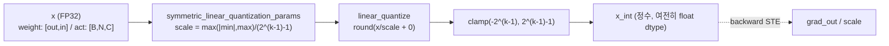

### 2.3 forward call stack
`QuantLinear.forward`(`quant_modules.py:82`) → `SymmetricQuantFunction.apply(weight, weight_bit, fc_scaling_factor, True)` → `forward`(`quant_utils.py:77-96`) → `linear_quantize`(`:91`) → `torch.clamp`(`:92`).

### 2.4 대표 코드 위치
`quant_utils.py`: `symmetric_linear_quantization_params` `:51-69`, `SymmetricQuantFunction.forward` `:77-96`, `backward` `:98-119`, `linear_quantize` `:12-48`.

### 2.5 대표 코드 블록

```python
# quant_utils.py:61-67  대칭 스케일 산출 (zero-point 없음)
n = 2 ** (num_bits - 1) - 1
eps = torch.finfo(torch.float32).eps
max_val = torch.max(-min_val, max_val)   # 부호 대칭: |min|과 max 중 큰 값
scale = max_val / float(n)
scale.clamp_(eps)
```
→ INT8(k=8)이면 `n=127`, 정수 범위 `[-128,127]`. **zero-point=0인 대칭 양자화**라 HW에서 zero-point 가산 불필요(곱셈기-free 친화).

```python
# quant_utils.py:88-92  forward: zero-point 0 고정, 부호있는 클램프
zero_point = torch.tensor(0.).cuda()
n = 2 ** (k - 1) - 1
new_quant_x = linear_quantize(x, scale, zero_point, is_weight=is_weight)
new_quant_x = torch.clamp(new_quant_x, -n-1, n)   # [-2^(k-1), 2^(k-1)-1]
```

```python
# quant_utils.py:119  backward: STE (양자화기 통과 그래디언트)
return grad_output.clone() / scale, None, None, None
```
→ round/clamp의 미분불가를 우회. `/scale`로 정수도메인 그래디언트를 FP 스케일로 환원(QuantLinear가 `x_int*scale`로 dequant하므로 chain rule 일관).

### 2.6 연산·수치표현 분해 + 정량
- **양자화 방식**: per-tensor 또는 per-channel 대칭, zero-point=0. weight는 per-out-channel(`linear_quantize`가 `scale.view(-1,1)`로 행별 broadcast, `quant_utils.py:28-30`).
- **scale/zp**: `scale=max(|min|,max)/(2^(k-1)-1)`, `zp=0`(`:62-66,88`).
- **비트폭**: 호출처 인자(weight 8, bias 32, act 8/16).
- **params**: 0 (순수 함수, 학습 파라미터 없음).
- **FLOPs**: 텐서 원소수 N에 대해 div+round+clamp = O(N) 원소연산. 대표 DeiT-S qkv weight(384×1152=442K 원소) 양자화 = 442K div+round (forward마다 재계산, QAT 비용 요인).
- **activation bit**: 출력은 정수값이지만 float dtype 유지(`quant_modules.py:96-97`에서 `×scale`로 dequant) → 실제 메모리 FP32, HW 환산 비트는 k.

---

## 3. 모듈: Dyadic Requantization — `quant_utils.py` (batch_frexp + fixedpoint_mul) ★핵심

### 3.1 역할 + 상위/하위
- **역할**: 정수 입력을 **새 스케일로 재양자화**하되 FP 나눗셈 없이 `정수곱 m + 우측 산술시프트 2^e`만 사용. dyadic 수 `M = m/2^e`를 `batch_frexp`로 분해. residual(identity) 경로도 동일 dyadic 곱으로 정수 도메인 정렬.
- **상위**: `QuantAct.forward`가 입력 스케일이 있을 때 호출(`quant_modules.py:198-202`). **하위**: `batch_frexp`(`quant_utils.py:150-175`), `np.frexp`.

### 3.2 데이터플로우 (텐서 shape 흐름)
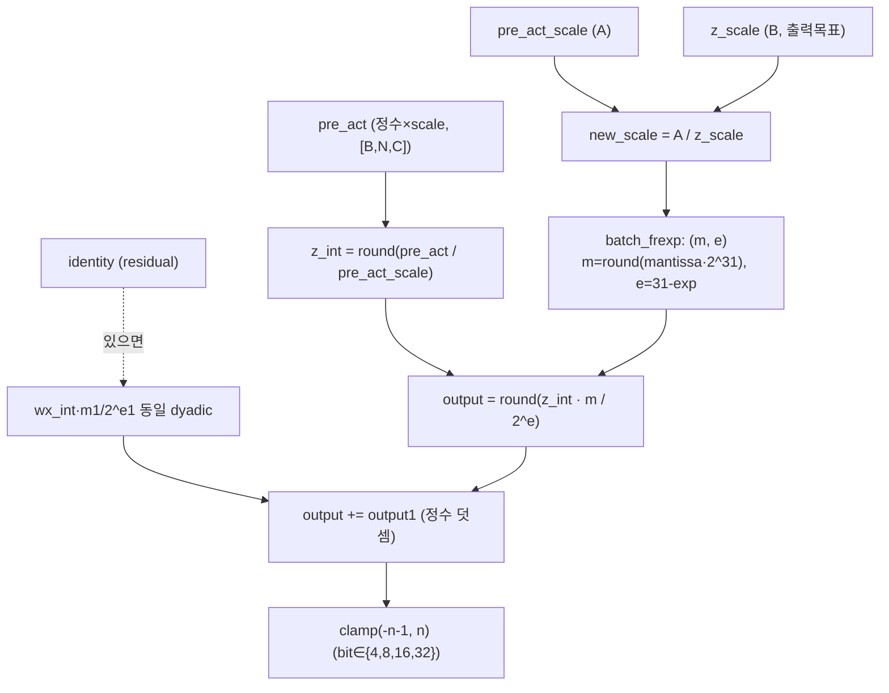

### 3.3 forward call stack
`QuantAct.forward`(`quant_modules.py:198`) → `fixedpoint_mul.apply(x, pre_act_scale, bit, mode, z_scale, identity, identity_scale)` → `forward`(`quant_utils.py:192-253`) → `batch_frexp`(`:228`) → `np.frexp` + Decimal 반올림(`:164-169`).

### 3.4 대표 코드 위치
`quant_utils.py`: `batch_frexp` `:150-175`, `fixedpoint_mul.forward` `:192-253`, identity 경로 `:232-245`, clamp `:247-251`, `backward` `:255-261`.

### 3.5 대표 코드 블록

```python
# quant_utils.py:164-172  batch_frexp: 실수 스케일 → (정수가수 m, 시프트 e)
output_m, output_e = np.frexp(inputs.cpu().numpy())        # m∈[0.5,1), 2^e
for m in output_m:
    int_m_shifted = int(Decimal(m * (2 ** max_bit)).quantize(
        Decimal('1'), rounding=decimal.ROUND_HALF_UP))     # m·2^31 반올림 → 정수가수
    tmp_m.append(int_m_shifted)
output_e = float(max_bit) - output_e                       # e = 31 - frexp_exp
```
→ 임의 실수 스케일 `S ≈ m/2^e` (m 정수, e 정수 시프트량). **dyadic 수 `M = b/2^c`의 직접 구현**. max_bit=31 → 32bit 정수곱 안에서 처리.

```python
# quant_utils.py:220-230  정수곱 + 산술시프트로 스케일 변환 (FP 나눗셈 없음)
z_int = torch.round(pre_act / pre_act_scaling_factor)      # 정수 복원
_A = pre_act_scaling_factor.type(torch.double)
_B = (z_scaling_factor.type(torch.float)).type(torch.double)
new_scale = _A / _B                                        # S_in / S_out
m, e = batch_frexp(new_scale)
output = z_int.type(torch.double) * m.type(torch.double)
output = torch.round(output / (2.0 ** e))                  # = (z_int·m) >> e
```

```python
# quant_utils.py:232-245  residual을 정수 도메인에서 정렬 후 덧셈
if identity is not None:
    wx_int = torch.round(identity / identity_scaling_factor)
    new_scale = identity_scaling_factor.double() / z_scaling_factor.double()
    m1, e1 = batch_frexp(new_scale)
    output1 = torch.round(wx_int.double() * m1.double() / (2.0 ** e1))
    output = output1 + output                              # 두 정수항을 같은 z_scale 격자에서 합산
```
→ residual add를 **공통 출력 스케일 격자로 dyadic 재정렬 후 정수 덧셈**. FPGA에서 누적 오차 없는 residual 정렬의 레퍼런스.

### 3.6 연산·수치표현 분해 + 정량
- **양자화 방식**: dyadic requant. `S_in/S_out = m/2^e`, m≤2^31. symmetric이면 `clamp(-n-1,n)`, asym이면 `clamp(0,n)`(`:247-251`). 단 asymmetric은 상위 모듈에서 NotImplementedError(`quant_modules.py:46,143`) → 실사용은 symmetric.
- **scale/zp**: 입력 z_int는 부호있는 정수, zp=0.
- **비트폭**: m 가수 31bit, 입력/출력 8 또는 16bit(`QuantAct` 호출 bit). 중간 누산 double(`:229`)이나 HW 환산은 INT32 누산.
- **정수 비선형 핵심**: `(z_int·m) >> e`가 FPGA 재양자화 PE의 표준 패턴.
- **params**: 0.
- **FLOPs**: 원소당 mul 1 + shift 1 + (residual 시) mul 1 + add 1. 대표 Block residual qact2(16bit, [1,197,384]=75.6K 원소) = 75.6K mul+shift ×2(main+id).
- **병목/주의**: `batch_frexp`가 `.cpu().numpy()` + Python `for` 루프로 원소별 Decimal 처리(`:162-170`) → **CPU 왕복 + O(N) 파이썬 루프**가 QAT 학습 속도 병목(추정, 라인 근거 확인). 추론(TVM 배포)에서는 e/m이 상수로 precompute됨(추정).

---

## 4. 모듈: 정수 Linear — `quant_modules.py` (QuantLinear)

### 4.1 역할 + 상위/하위
- **역할**: nn.Linear 가중치를 per-channel 대칭 양자화, 입력을 정수 복원 후 `F.linear`로 정수 MAC, 출력에 `bias_scaling_factor` 곱해 dequant. 스케일을 다음 레이어로 전파.
- **상위**: `Attention.qkv/proj`(`vit_quant.py:38,46`), `Mlp.fc1/fc2`(`layers_quant.py:128,135`), `VisionTransformer.head`(`vit_quant.py:234`). **하위**: `SymmetricQuantFunction`, `symmetric_linear_quantization_params`.

### 4.2 데이터플로우 (텐서 shape 흐름, DeiT-S qkv 예)
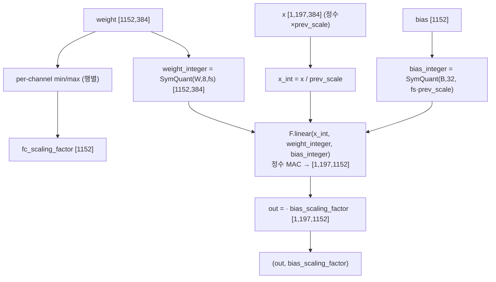

### 4.3 forward call stack
`Attention.forward`(`vit_quant.py:61`) → `QuantLinear.forward(x, prev_act_scaling_factor)`(`quant_modules.py:67`) → weight per-channel min/max(`:70-77`) → `symmetric_linear_quantization_params`(`:79`) → `weight_function`(=SymmetricQuantFunction, `:82`) → bias 양자화(`:88`) → `F.linear`(`:96`).

### 4.4 대표 코드 위치
`quant_modules.py`: 클래스 `:12-97`, per_channel 강제 `:70-77`, weight/bias 양자화 `:79-89`, 정수 MAC `:93-97`.

### 4.5 대표 코드 블록

```python
# quant_modules.py:70-83  per-channel(행별) weight 양자화만 지원
v = w.reshape(w.shape[0], -1)
cur_min = v.min(axis=1).values; cur_max = v.max(axis=1).values   # out_features개 스케일
self.fc_scaling_factor = symmetric_linear_quantization_params(
    self.weight_bit, self.min_val, self.max_val)                  # [out_features]
self.weight_integer = self.weight_function(
    self.weight, self.weight_bit, self.fc_scaling_factor, True)
# :77  per_channel=False면 raise Exception('we only support per_channel')
```

```python
# quant_modules.py:85-97  bias 스케일 = weight_scale × 입력_scale, 정수 MAC
bias_scaling_factor = self.fc_scaling_factor * prev_act_scaling_factor   # [out]
self.bias_integer = self.weight_function(self.bias, self.bias_bit, bias_scaling_factor, True)  # 32bit
x_int = x / prev_act_scaling_factor                                      # 정수 복원
return F.linear(x_int, weight=self.weight_integer, bias=self.bias_integer) \
       * bias_scaling_factor, bias_scaling_factor
```
→ **bias_scale = W_scale·A_scale**는 정수 MAC 결과와 같은 격자라 정수 bias를 그대로 더할 수 있음(HW에서 bias를 누산기에 직접 가산하는 구조와 1:1). 출력 = `정수MAC × (W_scale·A_scale)`로 dequant 후 다음 모듈로 scale 전파.

### 4.6 연산·수치표현 분해 + 정량 (DeiT-S, B=1, N=197)
- **양자화 방식**: weight per-channel(out축) 대칭 W8, bias per-channel 32bit, 입력은 prev act 스케일로 정수 복원.
- **scale/zp**: W_scale `[out]`, zp=0; bias_scale=`W_scale·prev_act_scale`.
- **비트폭**: W8 / bias32 / 입력 A8(또는 A16).
- **params** (DeiT-S 1 block, C=384):
  - qkv: 384×1152 + 1152 = **443,520**
  - proj: 384×384 + 384 = **147,840**
  - fc1: 384×1536 + 1536 = **591,360**
  - fc2: 1536×384 + 384 = **590,208**
  - Linear params/block ≈ **1.773M**, ×12 block ≈ **21.27M** (+ patch_embed/head 별도).
- **MACs/block** (B=1, N=197):
  - qkv: 197×384×1152 ≈ **87.1M**
  - proj: 197×384×384 ≈ **29.0M**
  - fc1: 197×384×1536 ≈ **116.2M**
  - fc2: 197×1536×384 ≈ **116.2M**
  - Linear MAC/block ≈ **348.5M**, ×12 ≈ **4.18G** (Attention matmul 제외).
- **activation bit**: 입력 A8 → 정수 MAC 누산 INT32(추정, HW 환산) → 출력 dequant FP(코드상) / A8·A16(다음 QuantAct에서 재양자화).

---

## 5. 모듈: 활성 양자화 + residual 정렬 — `quant_modules.py` (QuantAct)

### 5.1 역할 + 상위/하위
- **역할**: activation을 per-tensor 대칭 양자화. **running min/max(momentum 0.95) observer**로 범위 추적. 입력 스케일이 있으면 `fixedpoint_mul`로 dyadic 재양자화 + residual(identity) 정수 정렬. `fix()/unfix()`로 평가시 통계 고정.
- **상위**: 거의 모든 모듈 사이(`Attention`, `Block`, `Mlp`, `PatchEmbed`, `VisionTransformer`). **하위**: `SymmetricQuantFunction`(입력단), `fixedpoint_mul`(중간단).

### 5.2 데이터플로우 (텐서 shape 흐름, residual 경로)
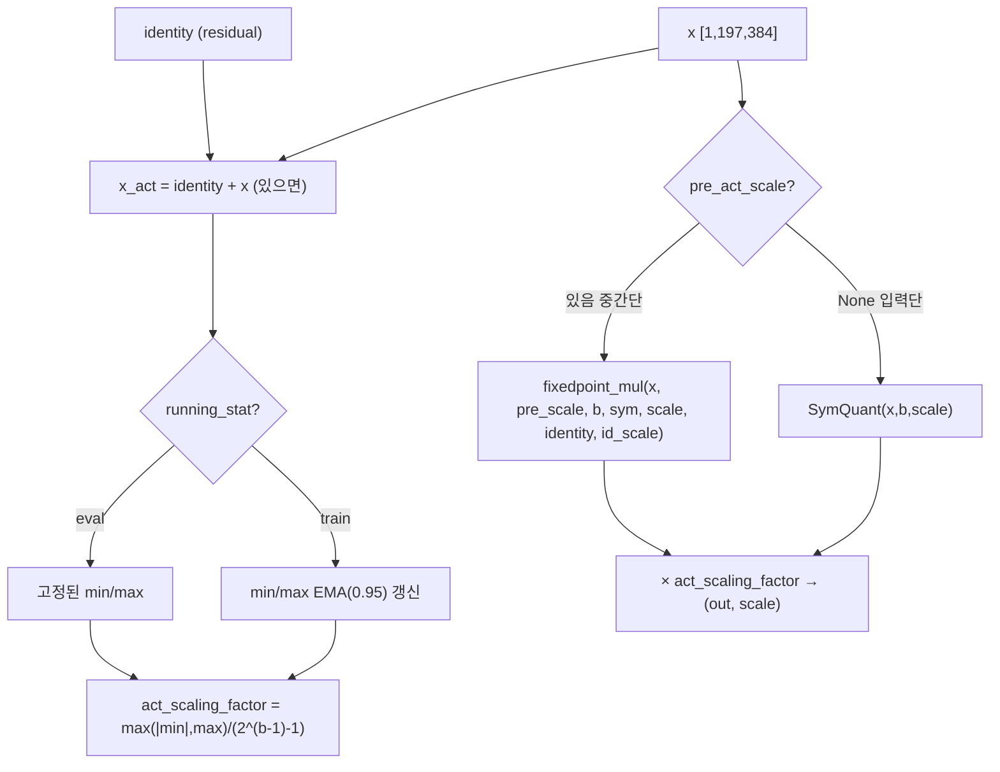

### 5.3 forward call stack
`Block.forward`(`vit_quant.py:135`) → `QuantAct.forward(x, act_scale, x_1, act_scale_1)`(`quant_modules.py:165`) → running stat 갱신(`:172-189`) → `symmetric_linear_quantization_params`(`:191`) → `fixedpoint_mul.apply`(`:198`, residual 동반).

### 5.4 대표 코드 위치
`quant_modules.py`: 클래스 `:100-206`, fix/unfix `:153-163`, running observer `:170-189`, scale 산출 `:191-192`, 입력단 vs 중간단 분기 `:194-202`.

### 5.5 대표 코드 블록

```python
# quant_modules.py:171-189  running min/max observer (momentum 0.95)
x_act = x if identity is None else identity + x            # residual 먼저 합산 후 통계
...
cur_min = v.min(axis=1).values; cur_max = v.max(axis=1).values
if torch.eq(self.min_val, self.max_val).all():            # 첫 배치 초기화
    self.min_val = cur_min; self.max_val = cur_max
else:
    self.min_val = self.min_val*0.95 + cur_min*0.05        # EMA
    self.max_val = self.max_val*0.95 + cur_max*0.05
self.max_val = self.max_val.max(); self.min_val = self.min_val.min()   # per-tensor 축약
```

```python
# quant_modules.py:194-202  입력단(SymQuant) vs 중간단(dyadic) 분기
if pre_act_scaling_factor is None:
    quant_act_int = self.act_function(x, self.activation_bit, self.act_scaling_factor, False)  # 모델 입력
else:
    quant_act_int = fixedpoint_mul.apply(
        x, pre_act_scaling_factor, self.activation_bit, self.quant_mode,
        self.act_scaling_factor, identity, identity_scaling_factor)    # residual·스케일 정수 정렬
```

```python
# quant_modules.py:153-163  평가시 통계 고정 (validate에서 freeze_model이 호출)
def fix(self):   self.running_stat = False
def unfix(self): self.running_stat = True
```
→ QAT 학습 중엔 통계 갱신, 평가 시 `freeze_model`(`model_utils.py:5-22`)이 모든 QuantAct에 `fix()` 호출해 스케일 고정 → 결정적(deterministic) 추론.

### 5.6 연산·수치표현 분해 + 정량
- **양자화 방식**: per-tensor 대칭(min/max를 스칼라로 축약, `:188-189`), zp=0. observer = running min/max EMA(0.95).
- **비트폭**: 기본 A8, residual/softmax/patch 경로는 **A16**(생성자 인자 `QuantAct(16)`: `vit_quant.py:50,118,128,192,193`, `layers_quant.py:139,181`).
- **params**: 0 학습 파라미터(buffer만: `act_scaling_factor` `[1]`, min/max `[1]`).
- **activation memory** (DeiT-S, [1,197,384]):
  - A8: 197×384×1 byte = **75.6 KB**
  - A16: 197×384×2 byte = **151.3 KB** (residual/softmax 출력 경로)
- **FLOPs**: observer min/max reduce O(N), 재양자화 O(N) (3장 fixedpoint_mul 분해 참조).
- **시사**: residual을 합산 후 통계 추적(`:171`)하므로 16bit가 residual 누적 동적범위 확보용. FPGA에서 residual 경로 비트폭 16, 메인 8로 분리 설계의 근거.

---

## 6. 모듈: 정수 행렬곱 — `quant_modules.py` (QuantMatMul)

### 6.1 역할 + 상위/하위
- **역할**: Attention의 QKᵀ, attn·V를 정수 도메인에서 수행. 두 입력을 각자 정수 복원 후 `@`, 출력 스케일 = 두 입력 스케일의 곱.
- **상위**: `Attention.matmul_1`(Q·Kᵀ), `matmul_2`(attn·V)(`vit_quant.py:56-57,70,79`). **하위**: torch `@`.

### 6.2 데이터플로우 (텐서 shape 흐름, DeiT-S matmul_1)
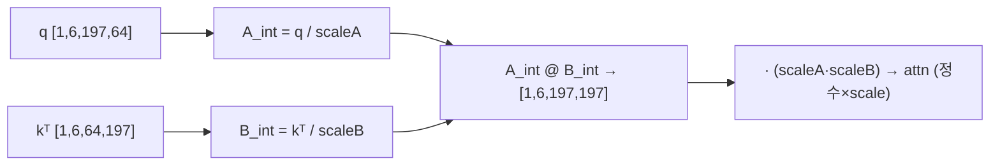

### 6.3 forward call stack
`Attention.forward`(`vit_quant.py:70`) → `QuantMatMul.forward(q, sf1, kᵀ, sf1)`(`quant_modules.py:223`) → `A_int @ B_int`(`:228`).

### 6.4 대표 코드 위치
`quant_modules.py`: 클래스 `:209-228`, forward `:223-228`.

### 6.5 대표 코드 블록
```python
# quant_modules.py:223-228  정수 행렬곱 + 스케일 곱셈
def forward(self, A, pre_act_scaling_factor_A, B, pre_act_scaling_factor_B):
    A_int = A / pre_act_scaling_factor_A
    B_int = B / pre_act_scaling_factor_B
    act_scaling_factor = pre_act_scaling_factor_A * pre_act_scaling_factor_B
    return (A_int @ B_int) * act_scaling_factor, act_scaling_factor
```
→ Q,K가 같은 `act_scaling_factor_1`을 공유(`vit_quant.py:70-71`)하므로 출력 스케일 = `sf1²`. dequant 후 `*self.scale`(1/√dh)와 `qact_attn1` 거쳐 IntSoftmax 입력으로.

### 6.6 연산·수치표현 분해 + 정량 (DeiT-S, B=1, H=6, N=197, dh=64)
- **양자화 방식**: 두 입력 모두 정수 복원 후 정수 `@`, 출력 스케일=`scaleA·scaleB`. zp=0. (dyadic 재양자화 없음 — 정수 누산 후 직접 dequant.)
- **비트폭**: 입력 A8(Q/K/attn/V는 `qact1`=A8 출력), 누산 HW 환산 INT32(추정).
- **params**: 0.
- **MACs/block** (Attention 행렬곱, 12 head 합산은 H로):
  - QKᵀ(matmul_1): H·N²·dh = 6×197²×64 ≈ **14.9M**
  - attn·V(matmul_2): 6×197²×64 ≈ **14.9M**
  - Attention matmul MAC/block ≈ **29.8M**, ×12 ≈ **358M**.
- **activation memory**: attn 행렬 `[1,6,197,197]` A8(softmax 입력 전) = 6×197²×1 ≈ **233 KB**; softmax 출력은 A16(IntSoftmax(16)).
- **시사**: N² 텐서가 가장 큰 중간 활성 → FPGA에서 attn 행렬 타일링·on-chip 재사용이 핵심(HG-PIPE류 파이프라인 메모리 압박 지점).

---

## 7. 모듈: I-LayerNorm — `quant_modules.py` (IntLayerNorm) ★정수 비선형

### 7.1 역할 + 상위/하위
- **역할**: LayerNorm을 정수로. 평균/분산을 정수로 계산, **표준편차를 정수 뉴턴 반복(10회)으로 근사**(FP sqrt 제거), affine은 bias/weight 비를 정수 bias로 변환.
- **상위**: `Block.norm1/norm2`(`vit_quant.py:105,119`), `VisionTransformer.norm`(`:215`), `PatchEmbed.norm`(옵션). **하위**: `round_ste`, `floor_ste`.

### 7.2 데이터플로우 (텐서 shape 흐름)
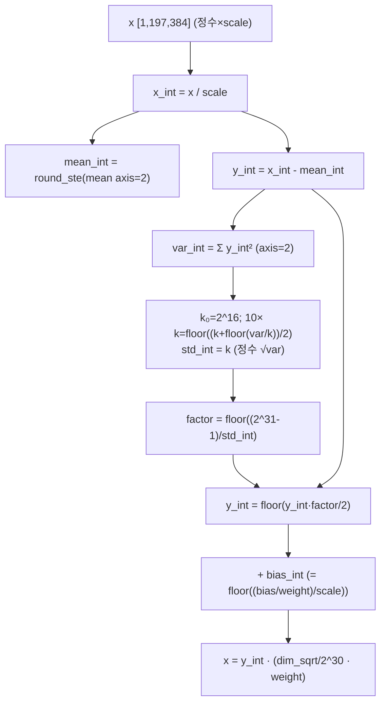

### 7.3 forward call stack
`Block.forward`(`vit_quant.py:131`) → `IntLayerNorm.forward(x_1, act_scaling_factor_1)`(`quant_modules.py:353`) → 정수 평균/분산(`:359-363`) → 뉴턴 반복(`:366-370`) → affine(`:377-383`).

### 7.4 대표 코드 위치
`quant_modules.py`: 클래스 `:333-386`, 평균/분산 `:359-363`, 정수 sqrt 뉴턴 `:366-370`, factor/스케일 `:372-374`, affine `:377-383`.

### 7.5 대표 코드 블록

```python
# quant_modules.py:359-363  정수 평균/분산
x_int = x / scaling_factor
mean_int = round_ste.apply(x_int.mean(axis=2, keepdim=True))
y_int = x_int - mean_int
y_sq_int = y_int ** 2
var_int = torch.sum(y_sq_int, axis=2, keepdim=True)
```

```python
# quant_modules.py:366-370  정수 표준편차 = 뉴턴 반복 (FP sqrt 없음)
k = 2 ** 16
for _ in range(10):
    k_1 = floor_ste.apply((k + floor_ste.apply(var_int/k))/2)   # k ← (k + var/k)/2
    k = k_1
std_int = k                                                     # ≈ √var (정수)
```
→ Newton-Raphson sqrt를 **고정 10회 반복**, 정수 division(`var/k`)도 floor로 정수화. FPGA에서 반복형 sqrt 데이터패스 또는 LUT-sqrt로 직접 대응.

```python
# quant_modules.py:372-383  정규화 + affine (bias/weight 비를 정수 bias로)
factor = floor_ste.apply((2 ** 31-1) / std_int)
y_int = floor_ste.apply(y_int * factor / 2)
scaling_factor = self.dim_sqrt / 2 ** 30                # dim_sqrt = √C (캐시, :354-356)
bias = self.bias.data.detach() / (self.weight.data.detach())
bias_int = floor_ste.apply(bias / scaling_factor)
y_int = y_int + bias_int
scaling_factor = scaling_factor * self.weight          # γ 적용
```
→ `2^31-1`/std_int 역수와 `/2` 시프트로 정규화. affine을 `(x̂ + bias/γ)·γ` 형태로 재배치해 정수 bias 가산 1회로 환원.

### 7.6 연산·수치표현 분해 + 정량 (DeiT-S, C=384, N=197)
- **양자화 방식**: 입력 정수 복원 → 정수 mean/var → 정수 sqrt(뉴턴 10회) → factor reciprocal. 출력 스케일 `√C/2^30·γ`.
- **비트폭**: var 누산·factor 31bit(`2^31-1`), 정수 도메인 INT32(추정). `k₀=2^16`.
- **params**: weight γ + bias β = 2×384 = **768**/LN, block당 LN 2개=1536, ×12 + 최종 norm = ~**18.8K**(LN 전체).
- **FLOPs/block** (1 LN, [1,197,384]): mean+var reduce ≈ 2·N·C = 2×197×384 ≈ 151K; 뉴턴 10회 × N(=197) div = ~2K; factor/affine O(N·C)=75.6K. LN 1개 ≈ **~230K 원소연산**. block당 LN 2개 + 최종 1개.
- **activation memory**: 출력 [1,197,384].
- **시사**: 정수 division/sqrt가 시프트+반복으로 환원 → 비선형 중 **반복 횟수(10)가 latency 결정**. FPGA에서 unroll vs iterative 트레이드오프 분석 대상.

---

## 8. 모듈: ShiftGELU — `quant_modules.py` (IntGELU) ★정수 비선형, FPGA 1순위

### 8.1 역할 + 상위/하위
- **역할**: GELU≈`x·σ(1.702x)`를 정수로. σ의 지수를 **시프트 기반 정수 지수 `int_exp_shift`**로 근사, 분모는 정수 reciprocal 1회. 곱셈기-free 비선형의 핵심.
- **상위**: `Mlp.act`(`layers_quant.py:132,147`, Block이 `act_layer=IntGELU` 주입 `vit_quant.py:209`). **하위**: `floor_ste`.

### 8.2 데이터플로우 (텐서 shape 흐름)
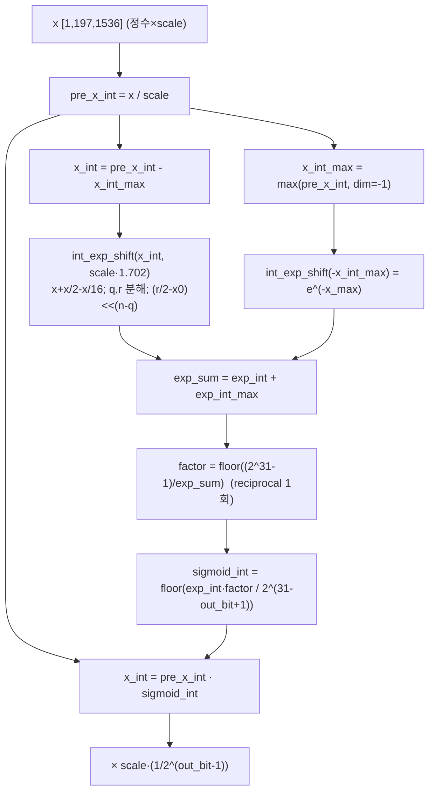

### 8.3 forward call stack
`Mlp.forward`(`layers_quant.py:147`) → `IntGELU.forward(x, scaling_factor)`(`quant_modules.py:425`) → `int_exp_shift`(`:410-423`) ×2 → reciprocal factor(`:438`) → `pre_x_int·sigmoid_int`(`:442`).

### 8.4 대표 코드 위치
`quant_modules.py`: 클래스 `:389-445`, `n=23` `:399`, `int_exp_shift` `:410-423`, forward `:425-445`.

### 8.5 대표 코드 블록

```python
# quant_modules.py:411  지수 입력 변환을 시프트로 (x·log2(e) ≈ x + x/2 - x/16)
x_int = x_int + floor_ste.apply(x_int / 2) - floor_ste.apply(x_int / 2 ** 4)
```
→ `1 + 1/2 - 1/16 = 1.4375 ≈ log2(e)=1.4427`. **곱셈 없이 두 시프트+가감산**으로 밑변환.

```python
# quant_modules.py:414-421  정수 몫/나머지 분해 + 2^(n-q) 시프트로 지수 구성
x0_int = torch.floor(-1.0 / scaling_factor)
x_int = torch.max(x_int, self.n * x0_int)           # 하한 클램프 (n=23)
q = floor_ste.apply(x_int / x0_int)                 # 몫
r = x_int - x0_int * q                               # 나머지
exp_int = r/2 - x0_int
exp_int = torch.clamp(floor_ste.apply(exp_int * 2 ** (self.n - q)), min=0)   # <<(n-q)
scaling_factor = scaling_factor / 2 ** self.n
```
→ `2^(n-q)`가 **좌측 시프트**(정수 거듭제곱). 지수항을 시프트량 q로 표현 → DSP 없이 barrel shifter로 구현 가능.

```python
# quant_modules.py:427-443  GELU = x·σ(1.702x), σ 분모는 reciprocal 1회
scaling_factor_sig = scaling_factor * 1.702
exp_int, _ = self.int_exp_shift(x_int, scaling_factor_sig)        # e^(x-x_max)
exp_int_max, _ = self.int_exp_shift(-x_int_max, scaling_factor_sig)  # e^(-x_max)
exp_int_sum = exp_int + exp_int_max
factor = floor_ste.apply((2 ** 31-1) / exp_int_sum)              # 정수 역수
sigmoid_int = floor_ste.apply(exp_int * factor / 2 ** (31-self.output_bit+1))
x_int = pre_x_int * sigmoid_int                                  # x·σ
```

### 8.6 연산·수치표현 분해 + 정량 (DeiT-S Mlp, [1,197,1536])
- **양자화 방식**: integer-only GELU. 밑변환 시프트 + 몫/나머지 + `<<(n-q)` + reciprocal 1회. 출력 스케일 `scale·(1/2^(out_bit-1))`(out_bit=8 기본, `:395,440,443`).
- **비트폭**: `n=23`(정확도 상수, 모델 의존 주석 `:399-400`), reciprocal 31bit, 출력 A8. 입력은 `qact_gelu`(A8)에서 양자화(`layers_quant.py:146`).
- **params**: 0.
- **FLOPs/block** (GELU on [1,197,1536]=302.6K 원소): int_exp_shift ×2(각 시프트2+가감3+몫/나머지2 ≈ 7 op/원소) + reciprocal(원소당 1 div, 단 sum은 dim축) + 최종 mul. ≈ **~9 op × 302.6K ≈ 2.7M 원소연산/block**. ×12.
- **activation memory**: GELU 입출력 [1,197,1536] A8 = **302.6 KB**.
- **시사**: GELU 전체가 **시프트+정수곱+1회 reciprocal**로 환원 → FPGA에서 소형 LUT(reciprocal) + barrel shifter로 LUT-free에 가깝게 합성. **본 프로젝트 비선형 가속 1순위**. 상수 `n=23` 재튜닝 필요(`:399-400`).

---

## 9. 모듈: Shiftmax — `quant_modules.py` (IntSoftmax) ★정수 비선형

### 9.1 역할 + 상위/하위
- **역할**: Softmax를 정수로. 동일 `int_exp_shift`로 지수, 합산 후 정수 reciprocal로 정규화. Attention에서 A16 출력.
- **상위**: `Attention.int_softmax = IntSoftmax(16)`(`vit_quant.py:54,76`). **하위**: `floor_ste`.

### 9.2 데이터플로우 (텐서 shape 흐름, DeiT-S attn)
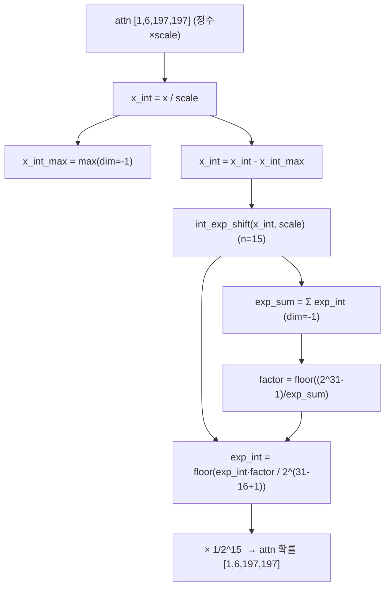

### 9.3 forward call stack
`Attention.forward`(`vit_quant.py:76`) → `IntSoftmax.forward(attn, act_scaling_factor)`(`quant_modules.py:483`) → `int_exp_shift`(`:469-481`) → sum(`:489`) → reciprocal(`:492`).

### 9.4 대표 코드 위치
`quant_modules.py`: 클래스 `:448-497`, `n=15` `:458`, `int_exp_shift` `:469-481`, forward `:483-497`.

### 9.5 대표 코드 블록
```python
# quant_modules.py:485-494  max 차감 안정화 → 정수 지수 → 합 → reciprocal 정규화
x_int_max, _ = x_int.max(dim=-1, keepdim=True)
x_int = x_int - x_int_max
exp_int, _ = self.int_exp_shift(x_int, scaling_factor)   # IntGELU와 동일 구조
exp_int_sum = exp_int.sum(dim=-1, keepdim=True)
exp_int_sum.clamp_max_(2**31-1)
factor = floor_ste.apply((2**31-1) / exp_int_sum)        # 정수 역수
exp_int = floor_ste.apply(exp_int * factor / 2 ** (31-self.output_bit+1))
scaling_factor = torch.Tensor([1 / 2 ** (self.output_bit-1)]).cuda()   # 1/2^15
```
→ Softmax 분모(Σexp)를 reciprocal 1회로 처리. `output_bit=16`이라 출력 격자 `1/2^15`. `int_exp_shift`는 IntGELU와 동일(`:469-481` vs `:410-423`)하나 `n=15`로 다름(`:458` vs `:399`).

### 9.6 연산·수치표현 분해 + 정량 (DeiT-S, attn [1,6,197,197])
- **양자화 방식**: integer-only softmax. max 차감 + 정수 지수 + 합 + reciprocal. 출력 스케일 `1/2^(out_bit-1)`=`1/2^15`.
- **비트폭**: `n=15`(`:458`), reciprocal 31bit, **출력 A16**(`IntSoftmax(16)`, `vit_quant.py:54`).
- **params**: 0.
- **FLOPs/block**: int_exp_shift on N² 원소(H·N²=6×197²=233K) ≈ 7 op/원소 + dim축 sum/reciprocal. ≈ **~2M 원소연산/block**. ×12.
- **activation memory**: attn 확률 [1,6,197,197] A16 = **466 KB** (block 내 최대 단일 활성).
- **시사**: Softmax도 시프트 지수 + 합 + reciprocal 1회로 환원. N² 활성이 메모리 지배 → FPGA에서 행 단위 스트리밍 softmax(running max/sum) 설계 권장(추정).

---

## 10. 모듈: 정수 Conv (PatchEmbed) — `quant_modules.py` (QuantConv2d)

### 10.1 역할 + 상위/하위
- **역할**: 입력 이미지 패치 투영(16×16 stride16 conv). per-channel 대칭 weight, bias 32bit, 정수 conv 후 스케일 곱(dyadic 미사용).
- **상위**: `PatchEmbed.proj`(`layers_quant.py:172`). **하위**: `SymmetricQuantFunction`, `F.conv2d`.

### 10.2 데이터플로우 (텐서 shape 흐름, DeiT-S)
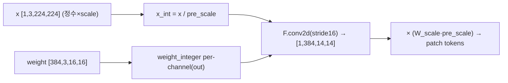

### 10.3 forward call stack
`PatchEmbed.forward`(`layers_quant.py:190`) → `QuantConv2d.forward(x, act_scaling_factor)`(`quant_modules.py:297`) → per-channel weight 양자화(`:307-320`) → `F.conv2d`(`:329`).

### 10.4 대표 코드 위치
`quant_modules.py`: 클래스 `:231-330`, weight/bias 양자화 `:305-323`, 정수 conv `:325-330`.

### 10.5 대표 코드 블록
```python
# quant_modules.py:319-330  per-channel weight + 정수 conv + 스케일 곱
self.weight_integer = self.weight_function(self.weight, self.weight_bit, self.conv_scaling_factor, True)
bias_scaling_factor = self.conv_scaling_factor * pre_act_scaling_factor
self.bias_integer = self.weight_function(self.bias, self.bias_bit, bias_scaling_factor, True)
x_int = x / pre_act_scaling_factor.view(1, -1, 1, 1)
correct_output_scale = bias_scaling_factor.view(1, -1, 1, 1)
return (F.conv2d(x_int, self.weight_integer, self.bias_integer, self.stride, self.padding,
                 self.dilation, self.groups) * correct_output_scale, correct_output_scale)
```
→ QuantLinear와 동일 패턴(W_scale·A_scale로 bias 정렬)을 conv에 적용. dyadic 재양자화 없이 정수 conv 후 직접 dequant.

### 10.6 연산·수치표현 분해 + 정량 (DeiT-S PatchEmbed)
- **양자화 방식**: weight per-channel(out=384) 대칭 W8, bias 32bit, 입력 정수 복원.
- **비트폭**: W8 / bias32 / 입력 A8(qact_input).
- **params**: 384×3×16×16 + 384 = **295,296**.
- **MACs**: out 14×14=196 위치 × 384 × (3×16×16=768) = 196×384×768 ≈ **57.8M**(전 모델 1회, block당 아님).
- **activation memory**: 출력 [1,384,14,14] → flatten [1,196,384] A16(qact, `layers_quant.py:181,195`) = **151 KB**.

---

## 11. 모듈: Attention / Block / VisionTransformer 조립 — `vit_quant.py`

### 11.1 역할 + 상위/하위
- **역할**: 정수 모듈을 ViT 토폴로지로 조립. **스케일 인자를 단계마다 명시 전파**, residual을 16bit QuantAct의 fixedpoint_mul로 정수 정렬.
- **상위**: `quant_train.py`의 `create model → forward`. **하위**: §4~10 모든 모듈 + `Mlp`/`PatchEmbed`(`layers_quant.py`).

### 11.2 데이터플로우 (텐서 shape 흐름, 1 Block)
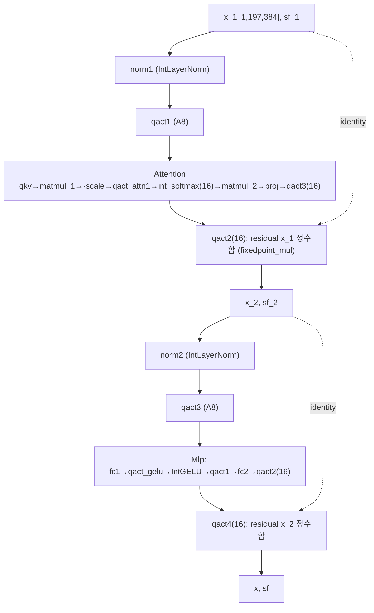

### 11.3 forward call stack
`VisionTransformer.forward_features`(`vit_quant.py:254`) → `blk(x, act_scaling_factor)` ×12(`:268-269`) → `Block.forward`(`:130`) → `norm1`→`qact1`→`Attention.forward`(`:133`)→`qact2`(residual, `:135`)→`norm2`→`qact3`→`Mlp.forward`(`:139`)→`qact4`(residual, `:141`).

### 11.4 대표 코드 위치
`vit_quant.py`: `Attention` `:23-88`, `Block` `:91-143`, `VisionTransformer` `:146-282`, pos_embed 정수합 `:264-265`, 팩토리 `:285-381`.

### 11.5 대표 코드 블록

```python
# vit_quant.py:70-76  Attention: scale 인자를 단계마다 명시 전파
attn, act_scaling_factor = self.matmul_1(q, act_scaling_factor_1,
                                         k.transpose(-2, -1), act_scaling_factor_1)
attn = attn * self.scale                          # 1/√dh
act_scaling_factor = act_scaling_factor * self.scale
attn, act_scaling_factor = self.qact_attn1(attn, act_scaling_factor)
attn, act_scaling_factor = self.int_softmax(attn, act_scaling_factor)   # IntSoftmax(16)
```

```python
# vit_quant.py:135  residual을 16bit QuantAct의 fixedpoint_mul로 정수 정렬
x_2, act_scaling_factor_2 = self.qact2(x, act_scaling_factor, x_1, act_scaling_factor_1)
# (identity=x_1, identity_scaling_factor=sf_1 → 3장 fixedpoint_mul로 정수 도메인 덧셈)
```

```python
# vit_quant.py:264-265  pos_embed도 별도 QuantAct(16) 양자화 후 정수합
x_pos, act_scaling_factor_pos = self.qact_pos(self.pos_embed)
x, act_scaling_factor = self.qact1(x, act_scaling_factor, x_pos, act_scaling_factor_pos)
```
→ 토큰 임베딩 + 위치 임베딩을 **둘 다 양자화 후 정수 도메인에서 합산**(qact1=A16). 전 경로 FP-free 유지.

### 11.6 연산·수치표현 분해 + 정량 (DeiT-S, B=1, N=197)
- **양자화 방식**: 전 구간 `(tensor, scale)` 페어 전파. residual·softmax·pos·patch는 A16, 나머지 A8. weight 전부 per-channel W8.
- **params (DeiT-S 전체, 분석적)**:
  - PatchEmbed: 295,296
  - cls_token: 384, pos_embed: 197×384 = 75,648
  - Block×12: Linear 1.773M×12 ≈ 21.27M + LN 2×768×12 ≈ 18.4K
  - 최종 norm: 768, head: 384×1000+1000 = 385,000
  - **총 ≈ 22.0M params** (DeiT-S 공칭 ~22M와 일치, 양자화로 개수 불변).
- **MACs/이미지 (B=1, N=197)**:
  - PatchEmbed: 57.8M (1회)
  - Block×12: (Linear 348.5M + Attn matmul 29.8M)×12 ≈ **4.54G**
  - head: 197 무관, cls 1토큰 × 384×1000 = 0.384M
  - **총 ≈ 4.6 GMAC/이미지** (정수 비선형 원소연산 제외).
- **activation memory (block당 피크)**: softmax 출력 [1,6,197,197] A16 = **466 KB**가 최대.
- **시사**: 스케일 전파 규약 = HW 스케일 버스/메타데이터와 1:1. residual A16 분리 = 누적오차 관리 설계 근거.

---

## 12. 모듈: QAT 학습·평가 파이프라인 — `quant_train.py` + `model_utils.py`

### 12.1 역할 + 상위/하위
- **역할**: FP 사전학습 가중치 로드 → QAT fine-tune(unfreeze, AdamW+cosine+AMP+EMA) → best 체크포인트 저장 → freeze 후 ImageNet 평가.
- **상위**: CLI(`README.md:28-42`). **하위**: timm(`create_optimizer/scheduler`, Mixup, ModelEma, accuracy), `model_utils.freeze/unfreeze_model`.

### 12.2 데이터플로우
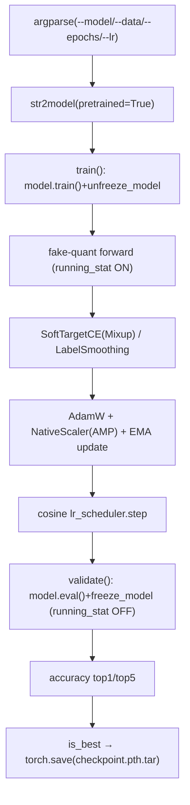

### 12.3 forward call stack
`main`(`quant_train.py:153`) → `train`(`:266`): `unfreeze_model(model)`(`:277`) → `model(data)`(`:290`) → `loss_scaler`(`:299`) → `model_ema.update`(`:304`). `validate`(`:314`): `freeze_model(model)`(`:326`) → `model(data)`(`:334`) → `accuracy`(`:338`).

### 12.4 대표 코드 위치
`quant_train.py`: argparse `:23-138`, `str2model` `:141-150`, 모델 로드 `:187-205`, train `:266-311`, validate `:314-351`. `model_utils.py`: freeze `:5-22`, unfreeze `:24-39`.

### 12.5 대표 코드 블록
```python
# quant_train.py:187-205  FP 사전학습 로드 후 QAT 설정
model = str2model(args.model)(pretrained=True, num_classes=args.nb_classes,
                              drop_rate=args.drop, drop_path_rate=args.drop_path)
args.min_lr = args.lr / 15
optimizer = create_optimizer(args, model); loss_scaler = NativeScaler()
lr_scheduler, _ = create_scheduler(args, optimizer)
```
```python
# quant_train.py:276-277 / 325-326  running_stat 토글로 QAT↔평가 전환
model.train(); unfreeze_model(model)    # train: observer ON
...
model.eval();  freeze_model(model)      # validate: observer OFF (스케일 고정)
```
```python
# model_utils.py:9-10  QuantAct만 fix/unfix 대상 (observer 모듈 식별)
if type(model) in [QuantAct]:
    model.fix()                          # running_stat = False
```

### 12.6 연산·수치표현 분해 + 정량 / 재현 명령
- **양자화 방식**: fake-quant QAT. observer = QuantAct running min/max만 토글(weight는 매 forward 재양자화).
- **하이퍼파라미터**: AdamW(`opt=adamw`, `:65`), lr 기본 1e-6(`:80`), min_lr=lr/15(`:202`), epochs 기본 90(`:46`), cosine(`:78`), weight_decay 1e-4(`:75`), batch 128(`:45`), Mixup 0.8/CutMix 1.0(`:125,127`), label smoothing 0.1(`:110`), drop_path 0.1(`:56`), EMA decay 0.99996(`:61`).
- **재현 명령** (`README.md:28-42`):
  ```bash
  python quant_train.py --model deit_small --data <DATA_DIR> --epochs 30 --lr 5e-7
  # 또는 기본: python quant_train.py --model deit_tiny --data <DIR> --epochs 30 --lr 5e-7
  ```
- **정확도**: DeiT-S 80.12%(INT8), ImageNet Top-1(`README.md:53`). **속도/실측은 본 세션 미실행 → 확인 불가.**
- **주의**: 체크포인트 저장은 best일 때만(`:258-261`), resume 저장 블록은 주석처리(`:241-251`).

---

## N+1. 모듈 한눈 요약 표

| 모듈 | 파일:라인 | 역할 | 양자화 방식 | 대표 정량(DeiT-S) |
|---|---|---|---|---|
| SymmetricQuantFunction | quant_utils.py:72-119 | FP→정수 대칭양자화 + STE | per-ch/per-tensor 대칭, zp=0 | params 0, O(N) div+round |
| batch_frexp/fixedpoint_mul | quant_utils.py:150-261 | dyadic requant `(z·m)>>e` + residual 정렬 | S_in/S_out=m/2^e, m 31bit | params 0, CPU frexp 병목 |
| QuantLinear | quant_modules.py:12-97 | per-ch W8 + 정수 MAC | W8/bias32/A8 | block Linear 1.77M params, 348.5M MAC |
| QuantAct | quant_modules.py:100-206 | 활성 양자화 + residual + observer | per-tensor 대칭, running min/max(0.95) | A8 75.6KB / A16 151KB |
| QuantMatMul | quant_modules.py:209-228 | QKᵀ/AV 정수 행렬곱 | 정수@, scale=sA·sB | block 29.8M MAC, attn A8 233KB |
| IntLayerNorm | quant_modules.py:333-386 | I-LayerNorm, 정수 sqrt 뉴턴×10 | 정수 mean/var, factor 31bit | LN 768 params, ~230K op |
| IntGELU | quant_modules.py:389-445 | ShiftGELU, x·σ(1.702x), reciprocal 1회 | int_exp_shift(n=23), 출력 A8 | GELU 302KB, ~2.7M op/block |
| IntSoftmax | quant_modules.py:448-497 | Shiftmax, 지수+합+reciprocal | int_exp_shift(n=15), 출력 A16 | attn 확률 466KB, ~2M op/block |
| QuantConv2d | quant_modules.py:231-330 | PatchEmbed 정수 conv | per-ch W8/bias32 | 295K params, 57.8M MAC |
| Attention/Block/VT | vit_quant.py:23-282 | 정수 ViT 조립 + scale 전파 | A8 본선/A16 residual·softmax·pos | 총 22M params, 4.6 GMAC/img |
| QAT pipeline | quant_train.py:266-351 | unfreeze train ↔ freeze eval | fake-quant, observer 토글 | AdamW lr1e-6, DeiT-S 80.12% |

---

## N+2. 학습·평가 파이프라인 + 재현 명령

- **데이터셋**: ImageNet (IMNET), 224×224, 1000 클래스 (`quant_train.py:29-34`).
- **사전학습**: DeiT는 torch.hub `.pth`(`vit_quant.py:296-302`), ViT는 augreg `.npz`(`:357-361`).
- **QAT**:
  ```bash
  python quant_train.py --model deit_small --data <DATA_DIR> --epochs 30 --lr 5e-7
  ```
  옵션: `--model {deit_tiny,deit_small,deit_base,swin_tiny,swin_small,swin_base}`(`:25-28`), `--epochs {30,60,90}`(`README.md:34`), `--lr {2e-7,5e-7,1e-6,2e-6}`(`README.md:35`).
- **체크포인트**: best Top-1 갱신 시 `results/checkpoint.pth.tar`(`quant_train.py:39,261`).
- **평가**: `validate`가 매 epoch 후 자동 실행(`:253`), `freeze_model`로 스케일 고정.
- **(제외) TVM 배포**: `convert_model.py`로 `checkpoint.pth.tar → params.npy`, `evaluate_accuracy.py`/`evaluate_latency.py`로 2080Ti 측정(`TVM_benchmark/README.md`). 본 PyTorch repo로는 latency **확인 불가**.
- **의존성**: PyTorch + **timm 0.4.12 권장**(`README.md:15`), numpy, (지연측정) TVM 0.9.dev0(`README.md:14`). **CUDA 필수**(0.3절 cuda 하드코딩 근거).

---

## N+3. 우리 프로젝트(FPGA ViT 가속) 시사점 + FPGA 친화도

### N+3.1 정수전용 비선형 = FPGA LUT/시프트 구현 직접 청사진 (최우선)
- **IntGELU / IntSoftmax `int_exp_shift`**(`quant_modules.py:410-423, 469-481`): 지수항을 **밑변환 시프트(`x+x/2-x/16`) + 몫/나머지 분해 + `<<(n-q)` + reciprocal 1회**로 환원. → DSP-free, barrel shifter + 소형 LUT(reciprocal)로 합성 가능. HG-PIPE류 파이프라인에 GELU/Softmax 블록을 이식하는 설계 기준. **GELU(n=23)/Softmax(n=15) 상수는 모델별 재튜닝 대상**(`:399-400,458-459`).
- **IntLayerNorm 정수 sqrt 뉴턴 10회**(`:366-370`): 반복형 LN sqrt 데이터패스(또는 LUT-sqrt)의 참조. 반복 횟수(10)가 latency 직결 → unroll/iterative 트레이드오프 분석점.

### N+3.2 Dyadic requantization = 표준 재양자화 PE
- `fixedpoint_mul`/`batch_frexp`(`quant_utils.py:150-261`)의 `(z_int·m) >> e` = FPGA "정수 누산 후 가수곱+산술시프트" 재양자화 PE의 레퍼런스. m≤2^31이라 32bit 곱셈기 1개로 처리. residual을 공통 출력 격자로 dyadic 재정렬 후 정수 덧셈(`:232-245`)하는 패턴은 누적오차 없는 residual 정렬 설계.

### N+3.3 스케일 전파 규약 = HW 스케일 버스
- 전 경로 `(tensor, act_scaling_factor)` 페어 전파(`vit_quant.py` 전반) → RTL/HLS 인터페이스의 데이터+스케일 메타데이터 버스와 1:1. residual/softmax/pos/patch는 **A16**, 나머지 **A8**으로 비트폭 분리(`QuantAct(16)` vs 기본) → HW에서 동적범위 큰 경로만 16bit로 폭 확대하는 설계 직접 참조.

### N+3.4 FPGA 친화도 평가 (정수전용/곱셈기-free 관점)
| 항목 | 평가 | 근거 |
|---|---|---|
| 정수전용(integer-only) | ★★★ 전 경로 FP-free | 비선형·requant·residual 모두 정수(`quant_modules.py` 전반) |
| 곱셈기-free 비선형 | ★★★ 지수=시프트, 분모=reciprocal 1회 | `int_exp_shift` `:411,420` |
| 재양자화 PE | ★★★ `(z·m)>>e` 단일 패턴 | `fixedpoint_mul` `:228-230` |
| LayerNorm | ★★ 정수 sqrt지만 10회 반복 latency | `:367-369` |
| 행렬곱 비트폭 | ★★ A8 MAC, attn N² 활성 메모리 압박 | softmax 출력 466KB(DeiT-S) |
| 이식성(저비트) | ★ INT8/16 중심, W4A4 미검증 | README INT8만 보고 |
| QAT 비용 | △ ImageNet 수십 epoch 필요(PTQ 대비 큼) | `quant_train.py:46`, `batch_frexp` CPU 병목 |

### N+3.5 XR 시선추적 적용 (프로젝트 성격은 추정)
- 시선추적은 저지연·저전력이 관건 → I-ViT의 INT8 무손실 + 시프트 비선형은 경량 ViT 백본을 FPGA 실시간 구동하기에 적합. 단 QAT 재학습 비용 존재 → PTQ(APHQ-ViT 등)와의 절충 필요. 비선형 상수(n=23/15)·A16 중간정밀도는 백본/태스크별 재튜닝 대상.

---

## 부록. 근거 / 확인 불가

- **직접 코드 확인**: §2~§12 전 라인 인용 — `quant_utils.py`(전체), `quant_modules.py`(전체), `vit_quant.py`(전체), `layers_quant.py`(전체), `quant_train.py`(전체), `model_utils.py`(freeze/unfreeze), `__init__.py`. README(QAT 명령/결과), TVM_benchmark/README(배포 흐름).
- **분석적 산출(검증 가능)**: params/MACs/activation memory는 DeiT-S config(`vit_quant.py:306-316`)와 표준식으로 계산. 정수 비선형 FLOPs는 원소연산 추정치(라인의 연산 카운트 기반, "추정" 표기).
- **추정**: HW 환산 누산 비트폭(INT32), batch_frexp CPU 병목, 프로젝트 성격(FPGA+XR), 행 스트리밍 softmax 권장.
- **확인 불가(미열람/미실행)**: `swin_quant.py` 세부(ViT와 동일 모듈 재사용 추정), `utils/data_utils.py`/`samplers.py` 데이터 파이프라인, latency 실측(TVM_benchmark 제외 + 미실행), CPU 실행 가능 여부(cuda 하드코딩 근거는 확인, 실행 실패 미검증), W4A4 등 저비트(README INT8만 보고).
