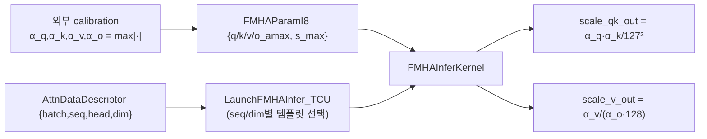
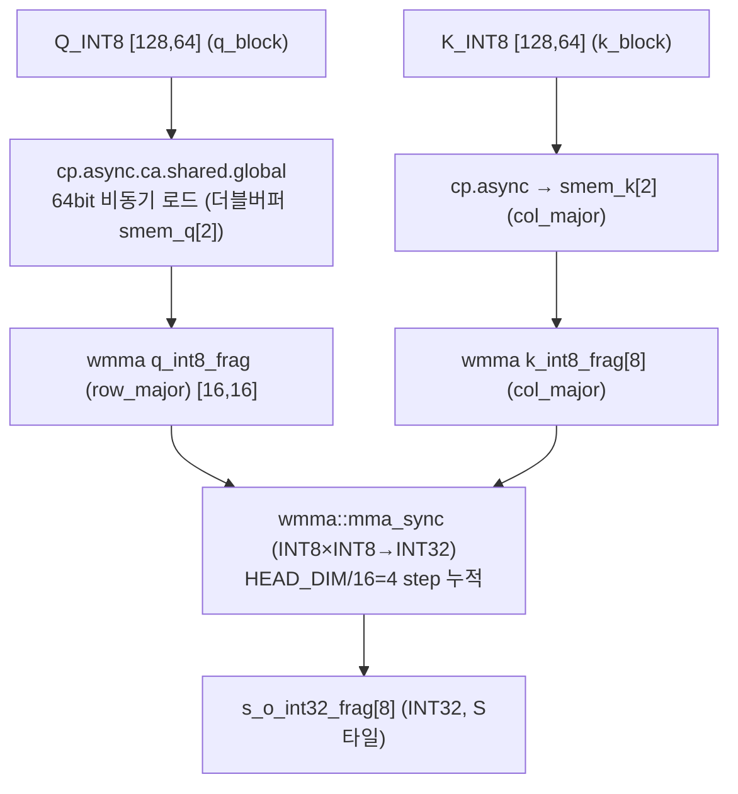
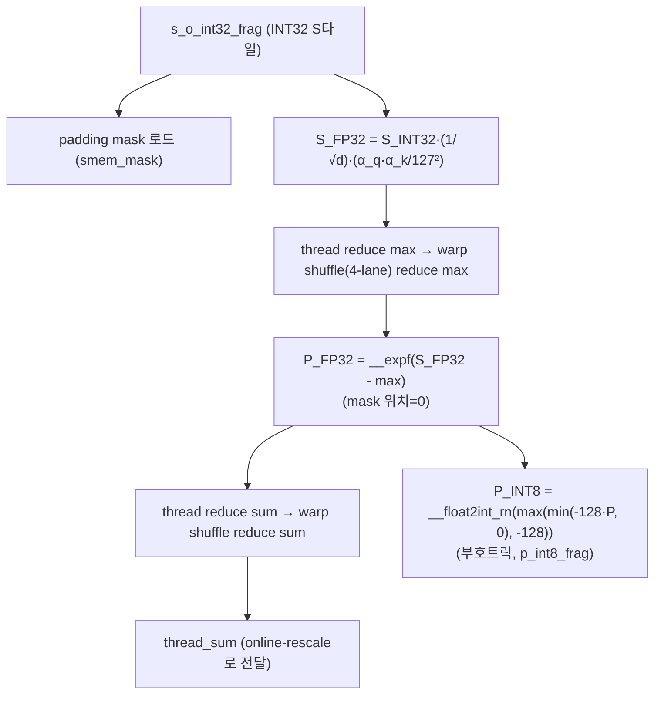
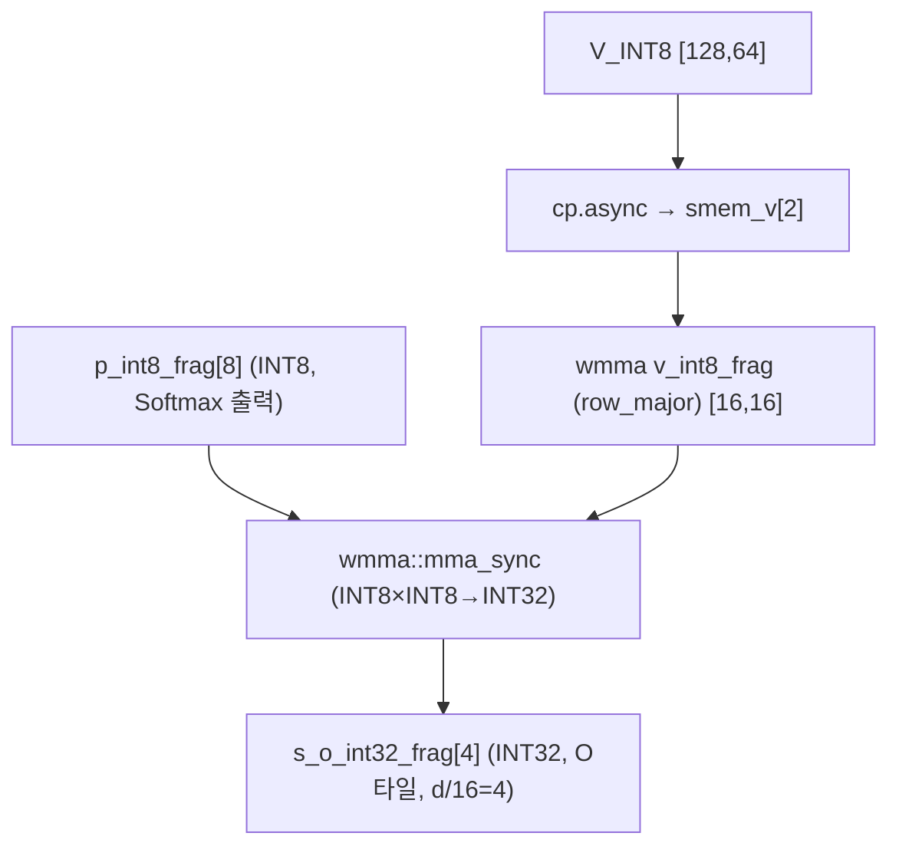
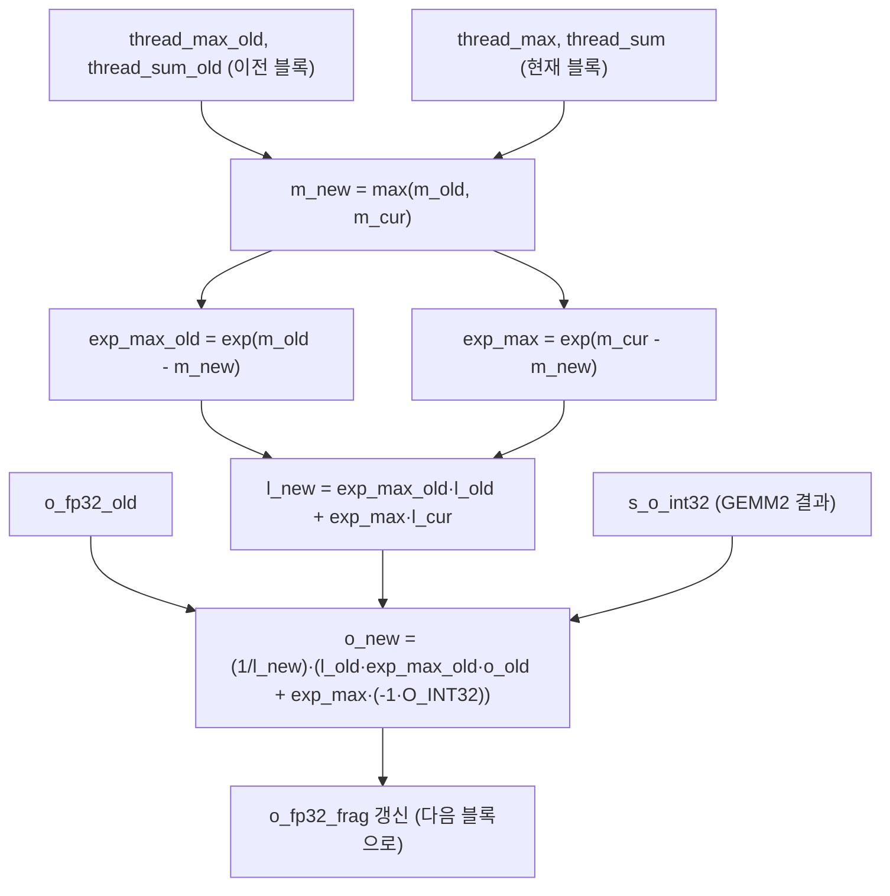
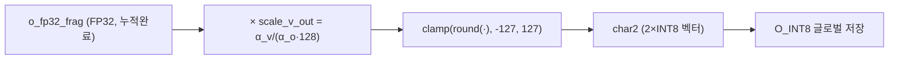
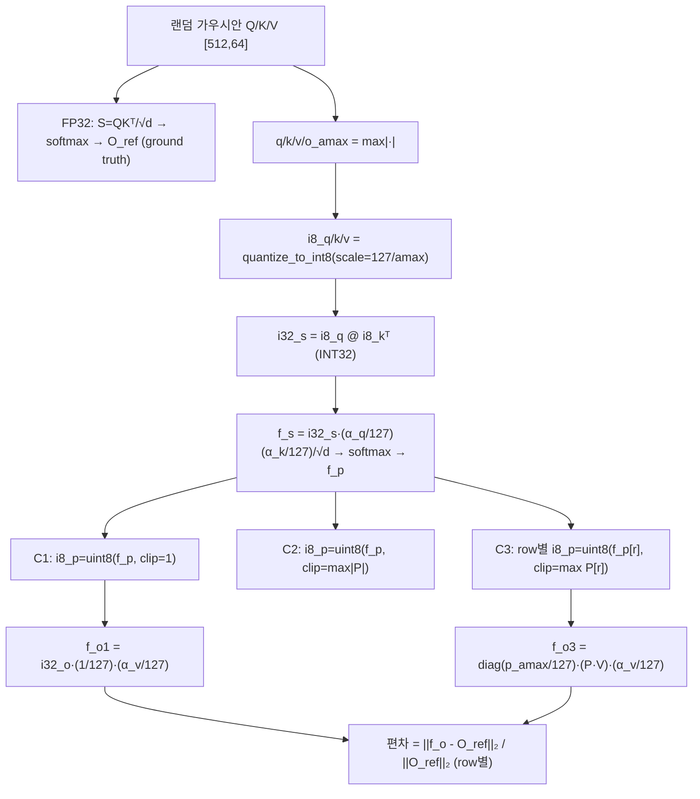
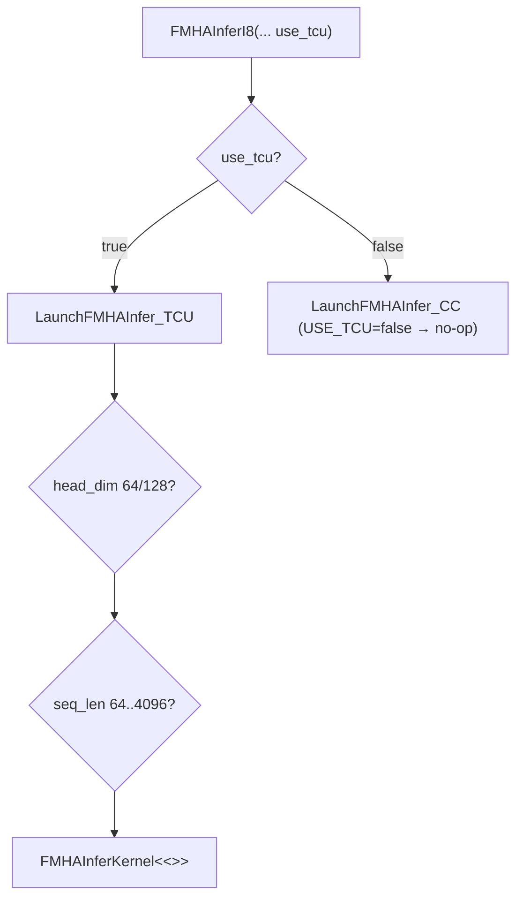

# INT8-Flash-Attention-FMHA-Quantization 모듈 통합 가이드 (S-PyTorch 변형)

> 1차 요약: [`../INT8-Flash-Attention-FMHA-Quantization.md`](../INT8-Flash-Attention-FMHA-Quantization.md) — 본 문서는 그 요약을 모듈(커널/함수) 단위로 심화한 통합 가이드다.
> 분석 대상: `\\wsl.localhost\ubuntu-24.04\home\user\project\PRJXR-HBTXR\REF\ViT-Quantization\INT8-Flash-Attention-FMHA-Quantization`
> 작성 원칙: 실제 소스 Read 후 `파일:라인` 근거 표기. 라인 근거 없는 추론은 "추정", 코드로 확인 불가는 "확인 불가"로 명시.
> 형제 가이드(`REF/Analysis/ViT-Quantization/I-ViT/MODULE_GUIDE.md`)의 6요소 구조를 따르되, 본 repo는 **PyTorch가 아니라 CUDA/WMMA 커널 + NumPy 시뮬레이션**이라 S-PyTorch 수치 규약(params/FLOPs/activation memory/비트폭/scale)을 **GEMM·FMHA 융합 단계·정수 누산**으로 치환·확장한다. I-ViT가 "정수전용 비선형(GELU/Softmax/LN)을 fake-quant QAT로" 다룬다면, 본 repo는 "두 GEMM을 INT8 Tensor Core로 fuse + Softmax만 FP32 혼합 + Flash online-rescale"을 다룬다 — 두 repo는 어텐션 양자화의 상보적 두 측면이다.

---

## 0. 문서 머리말

### 0.1 대표 케이스 선정
- **대표 커널 1개: `FMHAInferKernel<HEAD_DIM, BASE_SEQ_LEN, SEQ_LEN, NUM_WARPS, USE_TCU=true>`** (`inc/fmha_i8.cuh:43-334`). 블록당 1 head를 처리(`blockIdx.x=batch, blockIdx.y=head`, `:59-60`)하고, 두 GEMM(QKᵀ, PV)을 INT8 WMMA로 fuse하며 그 사이 Softmax만 FP32로 처리하는 **단일 fused kernel**이 repo 전체 알고리즘의 응축체다.
- **대표 launch config: `HEAD_DIM=64, SEQ_LEN=512, NUM_WARPS=8, head_dim=64` 경로** (`src/fmha_i8.cu:134-138`, `FMHAInferKernel<64,128,512,8,true>`). 근거:
  1. Python 시뮬레이션 두 파일 모두 **`SEQLEN=512, HEAD_DIM=64`** 를 기본값으로 사용(`fmha_i8_quant_deviation.py:9-10`)해 양자화 오차 분석의 공식 대표 형상.
  2. README 정확도 표가 **BERT BASE/LARGE 384** 기준(`README.md:206-220`)이라 seq_len=384/512가 실모델 대표 영역. head_dim=64는 BERT/ViT 표준 head 크기.
- **대표 분석 단위**: 1개 (batch, head)에 대한 **q_block(BASE_SEQ_LEN=128행) × 전체 K/V(SEQ_LEN열) 루프** = Flash-Attention의 1 outer-tile (`fmha_i8.cuh:87`(q_block 루프) × `:110`(k_block 루프)).
- **대표 양자화 3종(케이스)**: C1 worst(`p_amax=1` 고정), C2 static(`p_amax=max|P|` 전역), C3 dynamic(per-row `p_amax`) — Python 시뮬에서 직접 비교(`fmha_i8_quant_deviation.py:63,85,106-118`). 커널은 C1과 동치인 정적 방식 채택(`fmha_i8.cuh:241`).

### 0.2 S-PyTorch 수치 규약 → 본 repo 치환 규약 (CUDA/WMMA 버전)
- **params**: 본 repo는 **학습 파라미터가 없는 추론 전용 커널**이다. 가중치 Q/K/V는 외부에서 INT8로 미리 양자화돼 입력으로만 들어옴(`fmha_i8.cuh:45` 인자). 양자화 상수는 `FMHAParamI8`의 **스칼라 4개(q/k/v/o_amax) + 미사용 s_max 1개**뿐(`fmha_param_i8.h:10-17`). → **모든 모듈 params = 0**(학습 대상 없음). I-ViT처럼 FP 가중치를 fake-quant하지 않고, 진짜 INT8 정수 텐서로 연산.
- **FLOPs/MACs**: 표준식×config. 1 (batch,head)당 — QKᵀ MAC = `SEQ_LEN²·HEAD_DIM`, PV MAC = `SEQ_LEN²·HEAD_DIM`. 대표(seq=512, d=64): QKᵀ=512²×64≈**16.8M MAC**, PV=512²×64≈**16.8M MAC**, 합≈**33.6M MAC/(head)**. 전체 = ×batch×head_num.
- **activation memory**: 텐서 shape × 비트폭. 본 repo는 **on-chip shared memory(`SLB`)에 INT8 타일만 상주**시키고 S/P 전체 행렬을 글로벌에 쓰지 않음(Flash 특성). shared buffer 크기 = `BASE_SEQ_LEN·TC_SIZE·2·2 byte + BASE_SEQ_LEN byte`(`fmha_i8.cuh:53`, 주석 "128*16*2*2 = 8192 bytes"). 비트폭은 정수 도메인(INT8 in, INT32 누산, FP32 softmax 중간, INT8 out).
- **비트폭/scale**: 코드 직접. 입력 Q/K/V/O **INT8([-127,127])**(`fmha_i8.cuh:45`), GEMM 누산 **INT32**(`s_o_int32_frag`, `:100`), Softmax 중간 **FP32**(`p_fp32_frag`, `:102`; `o_fp32_frag`, `:103`), P 양자화 후 **INT8(부호트릭 [-128,0])**(`:241,249`). scale = `amax/127`(입력), `1/√d`(`:71`), `(α_q·α_k)/127²`(`:72`), 최종 `α_v/(α_o·128)`(`:318`).
- **정확도/속도**: README 인용. BERT F1/EM 표는 인용 가능(`README.md:206-220`), latency 실측은 **확인 불가**(README에 6×/4× 정성 주장만, `:62`; 본 세션 미실행).

### 0.3 운영 경로 (calibration → INT8 입력 → fused kernel → INT8 출력)
```
[외부 calibration] α_q, α_k, α_v, α_o = max|Q|,|K|,|V|,|O| (static 결정)
   │  코드는 amax를 입력으로 받기만 함 (FMHAParamI8, fmha_param_i8.h:10-17)
   │  Python 시뮬은 직접 max|·| 계산 (fmha_i8_quant_deviation.py:47-51)
   ▼
[INT8 양자화] Q_INT8 = round(Q·127/α_q) 등, 외부에서 수행 → 커널 입력은 int8_t*
   ▼
[호스트 launch] FMHAInferI8(stream, fmha_param, attn_desc, q,k,v,mask,o, use_tcu=true)
   │  (fmha_i8.cu:157-173) → LaunchFMHAInfer_TCU (head_dim/seq_len별 템플릿 분기, :31-155)
   │  grid=[batch, head_num, 1], block=[256,1,1]=8warp (또는 4warp) (:42-43,15-16)
   ▼
[fused kernel] FMHAInferKernel (fmha_i8.cuh:43-334)
   │  GEMM1(QKᵀ INT8→INT32) → Softmax(INT32→FP32→P_INT8) → GEMM2(P·V INT8→INT32)
   │  → online-rescale(FP32 누산) → 최종 dequant→INT8 저장
   ▼
[검증] test_fmha_i8.cpp + cpuGEMM.hpp/cpuSoftmax.hpp 로 CPU FP 참조와 대조 (미정독, 호스트측)
   또는 Python: fmha_i8_quant_deviation.py / _error_seqlen.py 로 오차 정량
```
- 타깃 디바이스: **NVIDIA Ampere급 GPU(sm_80+) 전제(추정)** — INT8 WMMA `m16n16k16`(`fmha_i8.cuh:46`) + PTX `cp.async.ca.shared.global`(`:137`)는 sm_80+에서 지원. README는 SM 명시 없음 → SM 버전은 추정. CUDA Core 경로(`USE_TCU=false`)는 **빈 함수**(`:337-342`)라 TCU 전용.

### 0.4 모델 / 데이터셋 / 정확도 (README 인용)
| 모델 | precision | BERT BASE 384 F1 | BERT LARGE 384 F1 | 근거 |
|---|---|---|---|---|
| BERT | Static 8-bit | 87.433 | 89.787 | `README.md:208` |
| BERT | Dynamic 8-bit | 87.526 | 89.861 | `README.md:209` |

| 모델 | precision | BERT BASE 384 EM | BERT LARGE 384 EM | 근거 |
|---|---|---|---|---|
| BERT | Static 8-bit | 80.123 | 82.800 | `README.md:219` |
| BERT | Dynamic 8-bit | 80.321 | 82.838 | `README.md:219-220` |

- 데이터셋: **SQuAD(BERT BASE/LARGE 384 추론)** — README 표가 F1/EM이라 QA 태스크(`README.md:201-222`). 정식 데이터셋명·FP32 baseline은 README에 **명시 없음 → 확인 불가**.
- Python 시뮬 입력: **랜덤 가우시안**(`np.random.randn`, `fmha_i8_quant_deviation.py:12-14`), SEQLEN=512/HEAD_DIM=64. 실데이터 아님(양자화 오차 메커니즘 분석용).
- 속도(latency): README "up to 6× faster, 4× less storage"는 **정성 주장**(`README.md:62`), 실측 표 없음 → **확인 불가**.

---

## 1. Repo / 커널 개요

INT8-Flash-Attention-FMHA-Quantization = Transformer 추론의 **Fused Multi-Head Attention(FMHA)과 Flash-Attention 전체를 8-bit 정수로 양자화**해 GPGPU에서 가속하는 구현 중심 repo(`README.md:57-62`). 핵심은 **두 GEMM(QKᵀ, PV)을 모두 INT8 Tensor Core로 수행하고 그 사이 Softmax만 FP32로 처리하는 혼합정밀 단일 fused kernel**이며, Softmax 출력 P의 통계적 성질(0~1, 합=1)을 이용해 **사전 데이터 지식 없이** P를 UINT8(커널은 부호트릭 INT8)로 양자화한다(`README.md:59`, `fmha_i8.cuh:241-250`). vendor 라이브러리(cutlass 등) 미사용 — WMMA(`mma.h`)와 PTX `cp.async`를 직접 사용한 **자체 커널**(`fmha_i8.cuh:6,137`).

### 1.1 자체 소스 vs 외부 의존 vs 제외
| 구분 | 파일(자체 소스) | 역할 |
|---|---|---|
| **양자화 파라미터** | `inc/fmha_param_i8.h` | `FMHAParamI8`(q/k/v/o/s_max amax 5스칼라), `AttnDataDescriptor`(batch/seq/head/dim) |
| **★ FMHA 융합 커널** | `inc/fmha_i8.cuh` ★핵심 | `FMHAInferKernel` — GEMM1+Softmax+GEMM2+online-rescale+dequant 전부. `sqrtExpr`(constexpr √) |
| **커널 launcher** | `src/fmha_i8.cu` | `FMHAInferI8` 진입 → `LaunchFMHAInfer_TCU/_CC`(head_dim·seq_len별 템플릿 인스턴스 분기) |
| **호스트 API 선언** | `inc/fmha_i8.h` | `FMHAInferI8` 시그니처 |
| **CPU 참조(검증)** | `inc/cpuGEMM.hpp`, `inc/cpuSoftmax.hpp` | FP 참조 GEMM/Softmax(정확도 대조용). `cpuSoftmax.hpp`는 max-subtract softmax 정독 완료 |
| **유틸** | `inc/utils.hpp` | 유틸(미정독) |
| **양자화 오차 시뮬** | `fmha_i8_quant_deviation.py` ★ | C1/C2/C3 3케이스 토큰별 편차 |
| | `fmha_i8_quant_error_seqlen.py` ★ | seqlen별 오차 합(16~1024) |
| **테스트 드라이버** | `test_fmha_i8.cpp` | 호스트측 검증(미정독) |
| **빌드** | `CMakeLists.txt` | CMake 빌드(미정독) |

### 1.2 진입점
- **호스트**: `FMHAInferI8`(`fmha_i8.cu:157`) → `use_tcu` 분기(`:167-172`) → `LaunchFMHAInfer_TCU`(`:31`, head_dim∈{64,128} × seq_len∈{64..4096} 템플릿 인스턴스 if-사다리) 또는 `LaunchFMHAInfer_CC`(`:6`, `USE_TCU=false`라 사실상 no-op).
- **디바이스**: `FMHAInferKernel`(`fmha_i8.cuh:43`) — outer q_block 루프(`:87`) 안에서 inner k_block 루프(`:110`)로 Flash 타일링.

### 1.3 제외 (지시에 따라 이름만, 미분석)
- **제외 디렉토리**: `.git/`(전부), `fig/`(결과 png 3장: `deviation_512.png`, `error_sum.png`, `fmha_quant_diagram.png`).
- **외부 의존(커스텀 아님)**: NVIDIA CUDA 헤더(`cuda.h`, `cuda/barrier`, `cooperative_groups`, `mma.h`, `fmha_i8.cuh:2-6`), nvcuda WMMA 네임스페이스. cutlass는 **계획 단계로만 언급**(`README.md:17`), 미사용.
- **미정독(확인 불가 세부)**: `test_fmha_i8.cpp`(호스트 검증 드라이버), `inc/cpuGEMM.hpp`(FP GEMM 참조), `inc/utils.hpp`, `CMakeLists.txt`. 커널 헤더 `fmha_i8.cuh`로 알고리즘 전모 파악 완료.

### 1.4 대표 형상 커널 구성 (seq=512, d=64, NUM_WARPS=8)
`FMHAInferKernel<64,128,512,8,true>`(`fmha_i8.cu:137`): BASE_SEQ_LEN=128 → q_block 4회(512/128), 각 q_block당 k_block 4회 → GEMM1 d/16=4 step WMMA 누적, GEMM2 BASE/16=8 step WMMA 누적. 워프 8개 = block당 256스레드(`:135`), 각 워프가 S의 16행 담당(`fmha_i8.cuh:50` static_assert `NUM_WARPS*16==BASE_SEQ_LEN`).

---

## 2. 모듈: 양자화 파라미터 구조체 — `fmha_param_i8.h` (FMHAParamI8 / AttnDataDescriptor)

### 2.1 역할 + 상위/하위
- **역할**: 어텐션 양자화 스케일(amax)과 텐서 형상을 커널에 전달하는 **값 전달용 POD 구조체**. scale 전파의 근간(α/127로 dequant 스케일 산출).
- **상위**: `FMHAInferI8`/`LaunchFMHAInfer_*`/`FMHAInferKernel`의 인자(`fmha_i8.cu:7,32`; `fmha_i8.cuh:45`). **하위**: 없음(순수 데이터).

### 2.2 데이터플로우


### 2.3 forward call stack
호스트가 `FMHAParamI8` 값 채움 → `FMHAInferI8(... fmha_param ...)`(`fmha_i8.cu:157`) → 커널에 **값 복사 전달**(`fmha_i8.cuh:45` `FMHAParamI8 fmha_param`, 포인터 아님) → `:72,318`에서 amax 필드 사용.

### 2.4 대표 코드 위치
`fmha_param_i8.h`: `AttnDataDescriptor` `:3-8`, `FMHAParamI8` `:10-17`.

### 2.5 대표 코드 블록
```c
// fmha_param_i8.h:10-17  어텐션 양자화 스케일 5스칼라
struct FMHAParamI8 {
  float q_amax = 0.0f;   // Q 절대최댓값 α_q
  float k_amax = 0.0f;   // K 절대최댓값 α_k
  float v_amax = 0.0f;   // V 절대최댓값 α_v
  float o_amax = 1.0f;   // O 절대최댓값 α_o (기본 1)
  float s_max  = 1.0f;   // softmax 결과 최댓값 (이 fused kernel에서 미사용, README:27)
};
```
→ **static quantization**: amax를 외부에서 미리 정함(calibration 필요). `s_max`는 정의돼 있으나 fused kernel에서 미참조(`fmha_i8.cuh` 전체에 `s_max` 등장 없음 — 동적 P 양자화 확장용으로 **추정**).

### 2.6 연산·수치표현 분해 + 정량
- **양자화 방식**: per-tensor 정적. scale = `amax/127`(대칭, zero-point=0 암묵). P는 별도(아래 §4).
- **scale/zp**: q/k/v/o 각 1스칼라, zp=0(대칭). dynamic 모드는 구조체 미지원 — Python 시뮬에서만 row별 amax 사용(`fmha_i8_quant_deviation.py:107-114`).
- **비트폭**: amax는 FP32. 양자화 대상은 INT8.
- **params**: 0. **메모리**: 5 float = 20 byte + descriptor 4 int = 16 byte(값 전달, 커널 레지스터/상수 메모리에 상주).

---

## 3. 모듈: GEMM1 — QKᵀ INT8→INT32 (cp.async 더블버퍼 + WMMA) — `fmha_i8.cuh:120-172`

### 3.1 역할 + 상위/하위
- **역할**: Q·Kᵀ를 **INT8×INT8→INT32 Tensor Core WMMA**로 수행. Q는 row-major, K는 col-major fragment로 로드해 `mma_sync` 누적. HEAD_DIM/TC_SIZE step에 걸쳐 K차원 누적. 결과 S는 INT32로 유지(dequant은 Softmax로 지연).
- **상위**: `FMHAInferKernel` k_block 루프(`:110`). **하위**: PTX `cp.async`(`:137-138`), `wmma::load_matrix_sync`/`mma_sync`(`:155-171`).

### 3.2 데이터플로우 (텐서 shape, seq=512/d=64)


### 3.3 forward call stack
`FMHAInferKernel`(`:110` k_block) → `wmma::fill_fragment(s_o_int32_frag,0)`(`:122-124`) → prologue cp.async(`:130-138`) → main loop k=1..d/16(`:140-161`): commit/wait(`:142-143`) + 다음 타일 cp.async(`:152-153`) + `load_matrix_sync` + `mma_sync`(`:155-160`) → epilogue 마지막 step(`:163-172`).

### 3.4 대표 코드 위치
`fmha_i8.cuh`: GEMM1 블록 `:120-172`, cp.async 비동기 로드 `:137-138,152-153`, WMMA 누적 `:155-160,168-172`, 더블버퍼 smem 포인터 `:78-85`.

### 3.5 대표 코드 블록
```c
// fmha_i8.cuh:137-138  PTX cp.async: 글로벌→공유 INT8 비동기 64bit 로드 (더블버퍼)
asm volatile("cp.async.ca.shared.global.L2::128B [%0], [%1], %2;\n"
             :: "r"(store_smem_addr_a), "l"(load_gmem_addr_a), "n"(CP_SIZE_BYTE));
asm volatile("cp.async.ca.shared.global.L2::128B [%0], [%1], %2;\n"
             :: "r"(store_smem_addr_b), "l"(load_gmem_addr_b), "n"(CP_SIZE_BYTE));
```
→ `cp.async`로 메모리 로드와 WMMA 연산을 **오버랩**(Flash-Attention IO 효율). CP_SIZE_BYTE=8(`:48`, 64bit = INT8 8개).

```c
// fmha_i8.cuh:155-160  WMMA INT8 누적 (S = Q·Kᵀ, INT32 누산)
wmma::load_matrix_sync(q_int8_frag, &(...smem_q[(k-1)%2]...), TC_SIZE);
#pragma unroll
for(int xi=0; xi<(BASE_SEQ_LEN/TC_SIZE); xi++){
  wmma::load_matrix_sync(k_int8_frag[xi], &(...smem_k[(k-1)%2]...), TC_SIZE);
  wmma::mma_sync(s_o_int32_frag[xi], q_int8_frag, k_int8_frag[xi], s_o_int32_frag[xi]);
}
```
→ `s_o_int32_frag`는 **INT32 누산기**(`:100`). dequant 없이 INT32로 유지 후 Softmax 단계에서 한 번에 FP32 변환.

### 3.6 연산·수치표현 분해 + 정량 (seq=512, d=64, 1 head)
- **양자화 방식**: INT8×INT8→INT32 WMMA(`[16,16,16]`, `:46`). 입력 Q/K는 정수 그대로(외부 양자화), 누산 INT32. **dequant 지연**(Softmax로).
- **scale/zp**: S_INT32의 dequant scale = `(1/√d)·(α_q/127)·(α_k/127)`(`:71-72`, `README.md:125`). zp=0(대칭).
- **비트폭**: in INT8, accum **INT32**(`int` accumulator fragment, `:100`).
- **params**: 0.
- **MACs**: SEQ_LEN²·HEAD_DIM = 512²×64 ≈ **16.8M MAC/head**(전체 = ×batch×head). WMMA 타일 수 = (SEQ/16)²·(d/16) = 32²×4 = 4096 mma_sync/head(추정, 타일 카운트).
- **activation memory**: S 전체 행렬은 글로벌에 안 씀(Flash). on-chip smem_q/k 더블버퍼 INT8만 상주(`SLB`, `:53`).
- **융합 단계**: FMHA 1단계 — 정수 누산을 다음 Softmax까지 유지하는 것이 핵심(스케일 1회 합성으로 적용).

---

## 4. 모듈: Softmax (FP32 혼합) + P INT8 양자화 — `fmha_i8.cuh:174-253` ★핵심

### 4.1 역할 + 상위/하위
- **역할**: INT32 S를 **FP32로 dequant**해 row-wise max-subtract softmax 수행, 그 P를 다시 **INT8(부호트릭 [-128,0])로 양자화**. padding mask 반영. **Softmax 정규화(1/l)를 양자화 단계에서 생략**하고 online-rescale로 미룸(양자화 범위 최대 활용).
- **상위**: `FMHAInferKernel` k_block 루프 내(`:110`). **하위**: `__shfl_xor_sync`(warp reduce, `:204,233`), `__expf`(`:218`), `__float2int_rn`(`:249`).

### 4.2 데이터플로우 (텐서 shape, attn 타일)


### 4.3 forward call stack
`FMHAInferKernel`(`:174` Softmax 구간) → mask 로드(`:176-180`) → thread max(`:182-197`) + warp shfl max(`:200-206`) → thread exp&sum(`:208-225`) + warp shfl sum(`:228-235`) → P INT8 양자화(`:238-253`).

### 4.4 대표 코드 위치
`fmha_i8.cuh`: mask `:176-180`, dequant+reduce max `:183-206`, exp+reduce sum `:208-235`, **P 양자화(부호트릭)** `:238-253`, softmax_out_scale `:241`.

### 4.5 대표 코드 블록
```c
// fmha_i8.cuh:193  INT32 S를 FP32로 dequant (scale 1회 합성 적용)
float tmp_max_val = row_scale*max(tmp_val1, tmp_val2)*scale_qk_out;
// row_scale=1/√d (:71), scale_qk_out=(α_q·α_k)/127² (:72) → S_FP32 = S_INT32·이 두 상수곱
```

```c
// fmha_i8.cuh:218-222  max-subtract exp → P_FP32, mask 위치 0, row sum 누적
float tmp_sum_val_0 = __expf(row_scale*s_o_int32_frag[xi].x[...]*scale_qk_out - thread_max[tc_yi]);
p_fp32_frag[xi].x[...] = mask1 ? 0 : tmp_sum_val_0;
thread_sum[tc_yi] += (p_fp32_frag... + p_fp32_frag...);
```

```c
// fmha_i8.cuh:241,249  P를 INT8로 양자화 — 부호트릭(softmax_out_scale = -128)
const float softmax_out_scale = -128.f;
int8_t tmp_val = __float2int_rn(max(min(softmax_out_scale * which_val, 0.f), -128.f));
p_int8_frag[xi].x[...] = tmp_val;   // P∈[0,1] → -128·P∈[-128,0] (INT8 음수영역 사용)
```
→ README `P_UINT8=[255·P]₀²⁵⁵`(`:137`)의 커널 버전. **UINT8 TCU가 없어 INT8 음수영역([-128,0])에 매핑**(부호트릭). `1/l` 정규화를 여기서 생략 → GEMM2 후 online-rescale에서 일괄 적용. README:186이 지적한 "절반 범위 손실" 한계가 이 트릭에 해당(hybrid uchar×char TCU 미적용 시 사실상 7-bit).

### 4.6 연산·수치표현 분해 + 정량
- **양자화 방식**: S는 INT32→FP32 dequant(softmax 정확도 위해 FP 사용), P는 FP32→INT8(부호트릭 [-128,0]). **혼합정밀**(GEMM은 정수, softmax는 부동).
- **scale/zp**: P scale = `1/128`(=`softmax_out_scale` 역수), GEMM2 후 보정. softmax 정규화 `1/l`은 지연.
- **비트폭**: dequant FP32, exp FP32, P 출력 **INT8(7-bit 실효, 부호트릭)**.
- **params**: 0.
- **FLOPs**: row당 max-reduce O(N) + exp O(N) + sum-reduce O(N) + 양자화 O(N). warp shuffle reduce는 4-lane(`__shfl_xor_sync(...,4)`, `:204`) — head_dim 행 분할 레이아웃 반영.
- **융합 단계**: FMHA 2단계 — **두 GEMM 사이 유일한 FP 구간**. FPGA 매핑 시 별도 softmax 유닛(exp LUT)으로 분리하는 지점.

---

## 5. 모듈: GEMM2 — P·V INT8→INT32 (cp.async + WMMA) — `fmha_i8.cuh:255-296`

### 5.1 역할 + 상위/하위
- **역할**: 양자화된 P(INT8) × V(INT8)→INT32 WMMA. V를 비동기 로드, `p_int8_frag × v_int8_frag → s_o_int32_frag` 누적. BASE_SEQ_LEN/TC_SIZE step에 걸쳐 P의 열차원(=k_block 행) 누적.
- **상위**: `FMHAInferKernel` k_block 루프(`:110`). **하위**: `cp.async`(`:267,280`), `mma_sync`(`:285,295`).

### 5.2 데이터플로우 (seq=512/d=64)


### 5.3 forward call stack
`FMHAInferKernel`(`:255` GEMM2) → `fill_fragment(s_o_int32_frag,0)`(`:257-260`) → V prologue cp.async(`:262-268`) → main loop k=1..BASE/16(`:270-287`): commit/wait + 다음 V 로드 + `load_matrix_sync(v)` + `mma_sync(p,v)`(`:283-286`) → epilogue(`:289-296`).

### 5.4 대표 코드 위치
`fmha_i8.cuh`: GEMM2 `:255-296`, V 비동기 로드 `:264-268,276-281`, WMMA `:283-286,293-296`.

### 5.5 대표 코드 블록
```c
// fmha_i8.cuh:283-286  P(INT8)·V(INT8) → O(INT32) WMMA 누적
for(int xi=0; xi<(HEAD_DIM/TC_SIZE); xi++){
  wmma::load_matrix_sync(v_int8_frag, &(...smem_v[(k-1)%2]...), TC_SIZE);
  wmma::mma_sync(s_o_int32_frag[xi], p_int8_frag[k-1], v_int8_frag, s_o_int32_frag[xi]);
}
```
→ P가 INT8 음수영역([-128,0])이므로 O_INT32는 음수 스케일 내포 → online-rescale에서 `scale_o_fp32=-1`로 부호 복원(`:298,309`).

### 5.6 연산·수치표현 분해 + 정량 (seq=512, d=64, 1 head)
- **양자화 방식**: INT8×INT8→INT32 WMMA. P는 부호트릭 INT8, V는 정적 INT8.
- **scale/zp**: O_INT32 scale = `(1/l)·(1/128)·(α_v/127)·(-1)` (분산: 1/l과 1/128은 online-rescale·최종 dequant로, α_v/127은 최종 `scale_v_out`로, `:309,318`).
- **비트폭**: in INT8, accum **INT32**(`:100`).
- **params**: 0.
- **MACs**: SEQ_LEN²·HEAD_DIM = 512²×64 ≈ **16.8M MAC/head**(GEMM1과 동일). 두 GEMM 합 ≈ **33.6M MAC/head**.
- **activation memory**: smem_v 더블버퍼 INT8만 on-chip. O는 FP32 누산기(`o_fp32_frag`, `:103`)에 상주(글로벌 미기록, 마지막에만 INT8 저장).
- **융합 단계**: FMHA 3단계 — GEMM2 결과를 글로벌에 안 쓰고 바로 online-rescale로(Flash IO 효율).

---

## 6. 모듈: Online-Softmax Rescale (Flash 누적) — `fmha_i8.cuh:298-315` ★Flash 핵심

### 6.1 역할 + 상위/하위
- **역할**: Flash-Attention의 블록 간 재정규화. k_block마다 새 max/sum으로 이전 O 누산기를 rescale해 **전체 S/P 행렬을 한 번에 메모리에 올리지 않고** 정확한 softmax 결과 누적. thread-local FP32 누산기 사용.
- **상위**: `FMHAInferKernel` k_block 루프 끝(`:110` 루프 내 `:298`). **하위**: `__expf`(`:302-303`), `__frcp_rn`(reciprocal, `:309`).

### 6.2 데이터플로우


### 6.3 forward call stack
`FMHAInferKernel`(`:298`) → tc_yi 루프(`:300`): `thread_max_new`(`:301`) + `exp_max_old/exp_max`(`:302-303`) + `thread_sum_new`(`:304`) → o_fp32_frag rescale(`:306-312`) → old 갱신(`:313-314`).

### 6.4 대표 코드 위치
`fmha_i8.cuh`: online-rescale 전체 `:298-315`, scale_o_fp32=-1 `:298`, max/sum 재계산 `:301-304`, O 누산 갱신 `:309-310`.

### 6.5 대표 코드 블록
```c
// fmha_i8.cuh:301-310  Flash online-rescale (블록 간 max/sum 재정규화)
float thread_max_new = max(thread_max_old[tc_yi], thread_max[tc_yi]);
float exp_max_old = __expf(thread_max_old[tc_yi] - thread_max_new);
float exp_max     = __expf(thread_max[tc_yi]     - thread_max_new);
float thread_sum_new = exp_max_old*thread_sum_old[tc_yi] + exp_max*thread_sum[tc_yi];
o_fp32_frag[xi].x[...] = __frcp_rn(thread_sum_new) *
   (thread_sum_old[tc_yi]*exp_max_old*o_fp32_frag[xi].x[...]
    + exp_max*(scale_o_fp32 * s_o_int32_frag[xi].x[...]));   // scale_o_fp32=-1 (부호 복원)
```
→ README Flash 누적식(`:170,180`)의 thread-local 구현. `scale_o_fp32=-1`(`:298`)이 P 부호트릭([-128,0]) 보상. **O는 FP32 누산기에 유지** — 정수 누산이 아니라 FP 누산(정확도 위해).

### 6.6 연산·수치표현 분해 + 정량
- **양자화 방식**: **이 단계는 FP32**(정수 아님). O 누산기·max/sum·exp 전부 FP32. P의 1/128과 softmax 1/l 정규화가 여기서 흡수됨.
- **scale/zp**: 누산값은 dequant 진행 중인 FP. zp 무의미.
- **비트폭**: FP32 누산(`o_fp32_frag`, `thread_max/sum`).
- **params**: 0.
- **FLOPs**: thread당 2 exp + 1 reciprocal + (d/16·2·2) MAC형 갱신. exp/reciprocal이 비선형 비용.
- **융합 단계**: FMHA 4단계 — **Flash의 정의적 특징**. int-flashattention과의 핵심 차이가 여기(아래 말미 비교): 본 repo는 rescale을 **FP32**로, int-flashattention은 **정수 도메인**으로 시도.

---

## 7. 모듈: 최종 Dequant & INT8 저장 — `fmha_i8.cuh:318-332`

### 7.1 역할 + 상위/하위
- **역할**: FP32 O 누산기를 출력 스케일로 dequant 후 INT8([-127,127])로 양자화, `char2`(2×INT8 벡터)로 글로벌 O에 저장. q_block 루프 끝(전 k_block 누적 완료 후).
- **상위**: `FMHAInferKernel` q_block 루프 끝(`:87` 루프 내 `:318`). **하위**: `__frcp_rn`, `__float2int_rn`.

### 7.2 데이터플로우


### 7.3 forward call stack
`FMHAInferKernel`(`:318`) → `scale_v_out` 계산(`:318`) → xi/tc_yi/tc_xi 루프(`:319-331`): `char2` 패킹(`:326-328`) → `*store_gmem_addr`(`:329`).

### 7.4 대표 코드 위치
`fmha_i8.cuh`: scale_v_out `:318`, INT8 양자화+char2 저장 `:325-329`.

### 7.5 대표 코드 블록
```c
// fmha_i8.cuh:318,327-328  최종 dequant scale + INT8 저장
const float scale_v_out = fmha_param.v_amax * __frcp_rn(fmha_param.o_amax * 128.f); // α_v/(α_o·128)
tmp_char2.x = __float2int_rn(max(min(scale_v_out * o_fp32_frag[xi].x[...], 127.f), -127.f));
tmp_char2.y = __float2int_rn(max(min(scale_v_out * o_fp32_frag[xi].x[...], 127.f), -127.f));
*store_gmem_addr = tmp_char2;   // char2 = 2 INT8 벡터화 저장
```
→ README `O_INT8 = [127/α_o · O_FP32]`(`:143`)에 P의 1/128 보정과 V의 α_v/127을 합친 형태. `scale_v_out = α_v/(α_o·128) = (α_v/127)·(127/α_o)·(1/128)`(P scale 1/128 + V dequant α_v/127 + O 재양자화 127/α_o 합성). `char2` 벡터 저장으로 글로벌 쓰기 효율↑(단 README:16이 uncoalesced 쓰기 미해결로 언급).

### 7.6 연산·수치표현 분해 + 정량
- **양자화 방식**: FP32→INT8([-127,127]) 대칭. 스케일 3개(P 1/128, V α_v/127, O 127/α_o) 1상수로 합성.
- **scale/zp**: `scale_v_out`(스칼라), zp=0.
- **비트폭**: in FP32, out **INT8**.
- **params**: 0.
- **FLOPs**: 원소당 1 mul + clamp + round. char2로 2원소씩.
- **activation memory**: O [batch,head,seq,dim] INT8 = batch·head·512·64 byte/head_group. 대표 1 head: 512×64×1 = **32 KB**.
- **융합 단계**: FMHA 5단계(최종) — 출력도 INT8이라 다음 레이어(예: BERT FFN)에 정수로 직결.

---

## 8. 모듈: 양자화 오차 시뮬레이션 (C1/C2/C3) — `fmha_i8_quant_deviation.py` / `_error_seqlen.py` ★

### 8.1 역할 + 상위/하위
- **역할**: 커널이 채택한 P 양자화 방식의 정당성을 NumPy로 검증. **C1 worst(`p_amax=1`)/C2 static(`p_amax=max|P|`)/C3 dynamic(per-row `p_amax`)** 3케이스를 FP32 ground truth와 비교. `_error_seqlen.py`는 seqlen 16~1024 스윕으로 오차 누적 경향 분석.
- **상위**: 독립 실행 스크립트(`python fmha_i8_quant_deviation.py`). **하위**: numpy, matplotlib.

### 8.2 데이터플로우


### 8.3 forward call stack
`fmha_i8_quant_deviation.py`: FP32 참조(`:16-29`) → 입력 양자화(`:47-55`) → C1(`:57-76`) → C2(`:79-98`) → C3(`:100-121`) → 토큰별 편차 플롯(`:75-76,97-98,120-126`).

### 8.4 대표 코드 위치
`fmha_i8_quant_deviation.py`: `quantize_to_int8/uint8` `:31-44`, C1(p_amax=1) `:63-73`, C2(static) `:85-95`, **C3(dynamic per-row)** `:106-118`. `fmha_i8_quant_error_seqlen.py`: seqlen 스윕 `:21-118`, 오차 합 `:76,96,118`.

### 8.5 대표 코드 블록
```python
# fmha_i8_quant_deviation.py:31-37  INT8 양자화 (대칭, scale=quant_range/clip_max)
def quantize_to_int8(tensor, clip_max, quant_range = 127):
    scale = quant_range / clip_max
    outputs = np.clip((tensor.astype(np.float32) * scale).round(), -quant_range, quant_range)
    return outputs.astype(np.int8)
```

```python
# fmha_i8_quant_deviation.py:106-118  C3 dynamic: per-row(per-token) amax 양자화 + dequant
for row in range(SEQLEN):
    ...
    f_p[row] = row_exp/row_exp_sum
    p_amax[row] = np.max(f_p[row])                                  # row별 amax
    ui8_p[row] = quantize_to_uint8(f_p[row], p_amax[row], SOFTMAX_QUANT_SCALE)
i32_o = np.matmul(ui8_p, i8_v, dtype = np.int32)
f_o3 = np.matmul(np.diag(p_amax/SOFTMAX_QUANT_SCALE), i32_o) * v_amax/127  # row별 scale GEMM2 후 적용
```
→ **dynamic은 per-token scale을 GEMM2 직후 `diag(p_amax/127)`로 적용** = 토큰마다 다른 dequant 스케일. 커널은 정적(C1형, `p_amax`=1 효과의 `softmax_out_scale=-128`)이라 C3는 향후 동적 확장의 레퍼런스(`s_max` 필드 용도 추정).

### 8.6 연산·수치표현 분해 + 정량
- **양자화 방식**: C1 worst(고정 1), C2 static(전역 max), C3 dynamic(row max). UINT8은 `quant_range=127`로 호출(`:70,92,114`) → 실효 7-bit(부호트릭 커널과 일관).
- **scale/zp**: C1 `1/127`, C2 `p_amax_ref/127`, C3 `diag(p_amax[row]/127)`.
- **비트폭**: 입력 INT8, P UINT8(127 range), GEMM INT32 누산.
- **params**: 0(시뮬). 입력 SEQLEN=512, HEAD_DIM=64(`:9-10`).
- **정량 결과**: README 정성 — "worst < static < dynamic" 정확도 순(`README.md:126,192`), 정확도 약 2배 개선(`:59`). 오차는 **seqlen 증가에 따라 누적 증가**(`README.md:196`, `_error_seqlen.py:76,96,118`이 `np.sum(np.abs(diff))` 합산). 수치 표는 없음 → 절대값 **확인 불가**.

---

## 9. 모듈: launcher 템플릿 디스패치 — `fmha_i8.cu` (FMHAInferI8 / LaunchFMHAInfer_TCU)

### 9.1 역할 + 상위/하위
- **역할**: 런타임 `head_dim`/`seq_len` 값으로 **컴파일타임 템플릿 인스턴스를 if-사다리로 선택**. grid=[batch,head,1], block=256(8warp) 또는 그에 맞는 워프수 결정. CUDA Core 경로(`_CC`)는 `USE_TCU=false`라 사실상 미동작.
- **상위**: 외부 호스트 코드. **하위**: `FMHAInferKernel` 인스턴스(`fmha_i8.cuh:43`).

### 9.2 데이터플로우


### 9.3 forward call stack
`FMHAInferI8`(`:157`) → `use_tcu` 분기(`:167-172`) → `LaunchFMHAInfer_TCU`(`:31`) → head_dim 분기(`:39,97`) → seq_len if-사다리(`:41-153`) → 템플릿 인스턴스 launch.

### 9.4 대표 코드 위치
`fmha_i8.cu`: `LaunchFMHAInfer_CC`(no-op TCU=false) `:6-29`, `LaunchFMHAInfer_TCU` `:31-155`, grid/block `:42-43`, `FMHAInferI8` `:157-173`.

### 9.5 대표 코드 블록
```c
// fmha_i8.cu:134-138  대표 인스턴스 (head_dim=64, seq=512, 8warp, TCU)
else if(attn_desc.seq_len==512){
  const dim3 blockDim = {256,1,1};                                       // 8 warp
  const dim3 gridDim = {batch_num, head_num, 1};                         // 블록당 1 head
  kernel::FMHAInferKernel<64, 128, 512, 8, true> <<<gridDim, blockDim, 0, stream>>>(...);
}
```
→ BASE_SEQ_LEN은 seq≤64면 64(4warp), seq≥128이면 128(8warp)로 선택(`:99-153`). grid는 **(batch, head_num) 2D** → head 병렬화. seq_len 지원: {64,128,192,256,320,384,448,512,1024,2048,4096}(head_dim 64/128 각각).

### 9.6 연산·수치표현 분해 + 정량
- **양자화 방식**: N/A(디스패치). 
- **params**: 0.
- **병렬도**: grid = batch×head_num 블록, block = 256 thread(8warp). 블록당 q_block 루프로 SEQ_LEN 행 전부 처리.
- **제약**: head_dim ∈ {64,128}, seq_len = 위 이산집합만(`README.md:12` "multiple of 64"이나 코드는 특정값 if-사다리). SRC≠DST seq_len 미지원(`README.md:13` Planning). 그 외 값은 **launch 누락(no-op)** — 확인된 한계.

---

## N+1. 모듈 한눈 요약 표

| 모듈 | 파일:라인 | 역할 | 정밀/비트폭 | 대표 정량(seq=512,d=64,1head) |
|---|---|---|---|---|
| FMHAParamI8/Descriptor | fmha_param_i8.h:3-17 | amax 5스칼라 + 형상 | FP32 amax | params 0, 20+16 byte |
| GEMM1 QKᵀ | fmha_i8.cuh:120-172 | INT8 WMMA, cp.async 더블버퍼 | INT8→INT32 | 16.8M MAC, S dequant 지연 |
| Softmax+P양자화 | fmha_i8.cuh:174-253 | FP32 softmax + P→INT8 부호트릭 | INT32→FP32→INT8(7bit) | 1/l 지연, mask 반영 |
| GEMM2 P·V | fmha_i8.cuh:255-296 | INT8 WMMA | INT8→INT32 | 16.8M MAC, O 글로벌 미기록 |
| Online-rescale | fmha_i8.cuh:298-315 | Flash 블록간 max/sum 재정규화 | **FP32 누산** | 2 exp+1 reciprocal/thread |
| 최종 dequant | fmha_i8.cuh:318-332 | FP32→INT8 char2 저장 | FP32→INT8 | scale_v_out=α_v/(α_o·128), 32KB |
| 오차 시뮬 C1/C2/C3 | fmha_i8_quant_deviation.py | worst/static/dynamic 비교 | INT8/UINT8(127) | worst<static<dynamic, ~2× 개선 |
| launcher 디스패치 | fmha_i8.cu:31-173 | head_dim·seq별 템플릿 선택 | — | grid=batch×head, block=256 |

**전체 (1 head, seq=512, d=64)**: 두 GEMM ≈ **33.6M MAC**, params 0(추론전용), on-chip smem ≈ **8 KB**(`fmha_i8.cuh:53`), 출력 O INT8 32 KB. 정밀 분포: GEMM=INT8/INT32, Softmax·rescale=FP32, 입출력=INT8.

---

## N+2. 평가 / 벤치마크 (README 인용)

- **정확도(실모델)**: BERT BASE/LARGE 384, SQuAD F1/EM. Static 8-bit F1 87.433/89.787, Dynamic 8-bit F1 87.526/89.861(`README.md:208-209`); EM Static 80.123/82.800, Dynamic 80.321/82.838(`README.md:219-220`). **Dynamic이 Static보다 일관되게 약간 높음**(per-token scale 이득). FP32 baseline은 표에 없음 → 절대 손실 **확인 불가**.
- **양자화 오차(시뮬)**: C1 worst < C2 static < C3 dynamic 순으로 정확(`README.md:126,192`), 정확도 약 2배 개선(`:59`). seqlen↑ → 오차 합↑(`README.md:196`, `_error_seqlen.py`). 수치 절대값 **확인 불가**(png만, `fig/deviation_512.png`, `fig/error_sum.png`).
- **속도**: "up to 6× faster, 4× less storage vs FP32"(`README.md:62`) — **정성 주장, 실측 표 없음 → 확인 불가**. 본 세션 미실행.
- **검증 경로**: `test_fmha_i8.cpp` + `cpuGEMM.hpp`/`cpuSoftmax.hpp`로 CPU FP 참조 대조(`cpuSoftmax.hpp:11-51` max-subtract softmax 확인). 빌드 CMake(`CMakeLists.txt`, 미정독).
- **재현 명령**:
  ```bash
  # 빌드: CMake (CMakeLists.txt) → test_fmha_i8 실행 (호스트 검증)
  python fmha_i8_quant_deviation.py     # C1/C2/C3 토큰별 편차 (SEQLEN=512, d=64)
  python fmha_i8_quant_error_seqlen.py  # seqlen 16~1024 오차 합
  ```
- **의존성**: CUDA(`cuda.h`/`cuda/barrier`/`cooperative_groups`/`mma.h`, `fmha_i8.cuh:2-6`), **INT8 WMMA + cp.async 지원 GPU(Ampere sm_80+, 추정)**. Python: numpy, matplotlib. 빌드: CMake. **하드웨어 미보유/미실행 → 실측 전부 확인 불가**.

---

## N+3. 우리 프로젝트(FPGA ViT 가속, HG-PIPE 계열 + XR 시선추적) 시사점

### N+3.1 두 GEMM 정수 + Softmax만 분리 = FPGA 어텐션 데이터패스 청사진 (최우선)
- **GEMM1/GEMM2를 INT8 정수 누산(INT32)으로 유지, Softmax만 별도 정밀 처리**(`fmha_i8.cuh:120-172, 255-296` vs `:174-253`) → FPGA에서 **systolic INT8 PE 배열 2개 + 독립 Softmax 유닛**으로 직접 매핑. I-ViT가 softmax까지 정수화(`IntSoftmax`)한다면, 본 repo는 softmax를 FP로 두는 **상보적 설계** — FPGA에서는 둘을 합쳐 "정수 GEMM + (정수 또는 PWL/LUT) softmax"로 절충 가능.
- **scale 1상수 합성**: `scale_qk_out = (α_q·α_k)/127²`(`:72`), `scale_v_out = α_v/(α_o·128)`(`:318`)를 **컴파일타임/런타임 상수로 미리 합쳐 1회만 적용** → FPGA에서 dequant 스케일을 단일 상수 곱(shift+mul)으로 환원, DSP 절감. I-ViT의 dyadic `(z·m)>>e`와 같은 목적(FP 나눗셈 제거)을 정적 상수로 달성.

### N+3.2 P를 1/l 지연 양자화 = 중간 활성 저비트 유지
- Softmax 정규화(1/l)를 양자화에서 빼고 online-rescale로 미루는 트릭(`fmha_i8.cuh:241-250` + `:309`)은 **중간 P를 저비트(INT8)로 유지해 PV GEMM 대역폭·BRAM을 절감**하는 직접 지침. FPGA 스트리밍 어텐션에서 P를 on-chip에 좁은 비트폭으로 들고 있는 설계 근거.
- 단 부호트릭([-128,0])은 **실효 7-bit**(`README.md:186` 지적) → FPGA에서는 진짜 UINT8(0~255) 또는 비대칭 양자화로 1-bit 더 확보 가능(hybrid TCU 한계가 FPGA엔 없음 → 본 repo보다 유리).

### N+3.3 Online-softmax rescale = FPGA 스트리밍 어텐션 레지스터
- `m_new=max(m_old,m_cur)`, `l_new=exp(Δm)·l_old+exp(Δm')·l_cur`, O rescale(`fmha_i8.cuh:301-310`)의 블록간 재정규화 = HG-PIPE류 layer-by-layer 파이프라인에서 **행 단위 max/sum 레지스터 + O 누산기**로 구현. exp는 LUT/PWL 근사. 본 repo는 rescale을 FP32로 하지만 FPGA에서는 고정소수점 누산기로 치환(정밀/면적 트레이드오프 분석점).

### N+3.4 FPGA 친화도 평가
| 항목 | 평가 | 근거 |
|---|---|---|
| 정수 GEMM | ★★★ 두 GEMM 모두 INT8→INT32 | `fmha_i8.cuh:159,285` |
| scale 단순화 | ★★★ 상수 1회 곱(shift+mul) | `:72,318` |
| Softmax 정밀 | ★★ FP32 의존(exp/reciprocal) → FPGA는 LUT/PWL 필요 | `:218,309` |
| 중간 활성 저비트 | ★★★ P INT8 유지(1/l 지연) | `:241-250` |
| 비트폭 효율 | ★★ 부호트릭 7-bit(UINT8 미활용) | `:241`, README:186 |
| Flash IO 효율 | ★★★ S/P/O 글로벌 미기록, smem 타일만 | `:53`, online-rescale `:298` |
| 이식성(저비트) | ★ INT8 고정, W4A4 미검증 | README INT8만 |
| calibration | △ static amax 외부 결정 필요 | `fmha_param_i8.h:10-17` |

### N+3.5 XR 시선추적 적용 (프로젝트 성격 추정)
- 시선추적 ViT는 **짧은 토큰(작은 패치 그리드)**라 본 repo의 "seqlen↑ → 오차 누적"(`README.md:196`) 약점이 **오히려 무해** → INT8 어텐션 + 정적 amax가 저지연·저전력 실시간 추론에 적합. Flash의 글로벌 미기록 특성은 on-chip 메모리 작은 FPGA에 유리.
- 단 본 repo는 **추론 전용·calibration 외부 의존** → I-ViT의 QAT(정확도 회복)와 결합하거나 PTQ calibration 파이프라인 별도 필요(추정).

---

## 부록 A. int-flashattention 대비 차이 (핵심 비교)

> 두 repo 모두 "INT8 + Flash-Attention"을 표방하나, **정수화 깊이와 누산 도메인**에서 갈린다. int-flashattention 소스는 본 세션 미열람(별도 repo) → 아래는 본 repo 코드 근거 + 일반 int-flashattention 설계 통념(추정) 대비.

| 축 | 본 repo (INT8-FMHA-Quant) | int-flashattention (일반형, 추정) |
|---|---|---|
| **두 GEMM** | INT8×INT8→INT32 WMMA (`fmha_i8.cuh:159,285`) | 동일하게 INT8 GEMM(공통점) |
| **Softmax** | **FP32 혼합**: S를 FP32 dequant 후 `__expf`/reduce (`:218`) | **정수/고정소수점 softmax 시도**(정수 exp 근사) — 본 repo와 가장 큰 차이 |
| **online-rescale 누산** | **FP32 누산기**(`o_fp32_frag`, max/sum FP32, `:301-310`) | 정수 누산기로 rescale 시도(누적 정수 유지) |
| **P 양자화** | UINT8 대신 **부호트릭 INT8([-128,0])**, 1/l 지연 (`:241,250`) | per-block/per-row 정수 scale로 P 정수화 |
| **정수화 깊이** | 부분(GEMM만 정수, softmax·rescale FP) | 전면(softmax 포함 정수 지향) |
| **목표** | GPGPU에서 INT8 TCU 활용 + 양자화 범위 손실 최소화(`README.md:59,186`) | end-to-end 정수 파이프라인(FP 연산 제거) |
| **trade-off** | softmax FP라 정확도 안정 ↔ FPGA엔 exp LUT 추가 필요 | 완전 정수라 HW 친화 ↔ 정수 exp 근사 오차 위험 |

- **요지**: 본 repo는 "**정수 GEMM + FP softmax**"의 **혼합정밀 Flash**다. int-flashattention이 softmax까지 정수화하는 방향이라면, 본 repo는 **softmax를 의도적으로 FP로 남겨** 양자화 오차를 GEMM 경계에만 국한(정확도 안정성 우선). 우리 FPGA 프로젝트엔 **본 repo의 GEMM 정수화 + I-ViT/int-flashattention의 정수 softmax(IntSoftmax/Shiftmax)를 결합**하는 것이 최적(정수 GEMM PE + 정수 exp LUT) — 두 repo가 상보적 부품을 제공.
- **확인 불가**: int-flashattention 실제 소스 라인(미열람), 두 repo의 직접 latency/accuracy 벤치 대조(미실행).

---

## 부록 B. 근거 / 확인 불가

- **직접 코드 확인(전 라인 인용)**: `inc/fmha_i8.cuh`(43-342 전체), `inc/fmha_param_i8.h`(전체), `src/fmha_i8.cu`(전체), `inc/fmha_i8.h`(전체), `inc/cpuSoftmax.hpp`(전체), `fmha_i8_quant_deviation.py`(전체), `fmha_i8_quant_error_seqlen.py`(전체), `README.md`(전체).
- **분석적 산출(검증 가능)**: MAC = SEQ_LEN²·HEAD_DIM(GEMM당), smem 8KB(`fmha_i8.cuh:53` 주석), O 출력 32KB는 형상×INT8. 정밀 분포는 fragment 타입(`:94-103`)에서 직독.
- **추정**: SM 버전(sm_80+ Ampere, cp.async/INT8 WMMA 지원 요건 기반), WMMA 타일 카운트, `s_max` 용도(동적 P 확장), int-flashattention 비교의 상대측(소스 미열람), 프로젝트 성격(FPGA+XR).
- **확인 불가(미정독/미실행)**: `test_fmha_i8.cpp`/`inc/cpuGEMM.hpp`/`inc/utils.hpp`/`CMakeLists.txt` 세부, latency 실측(README 정성 주장만), BERT FP32 baseline·SQuAD 정식 데이터셋명·양자화 오차 절대값(png만), CUDA Core 경로 동작(빈 함수 확인, 실행 미검증), int-flashattention 실소스.
