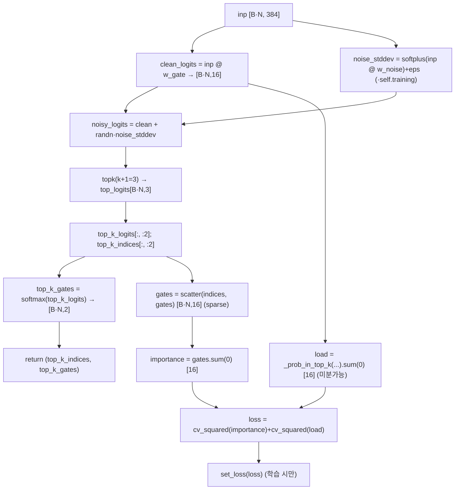
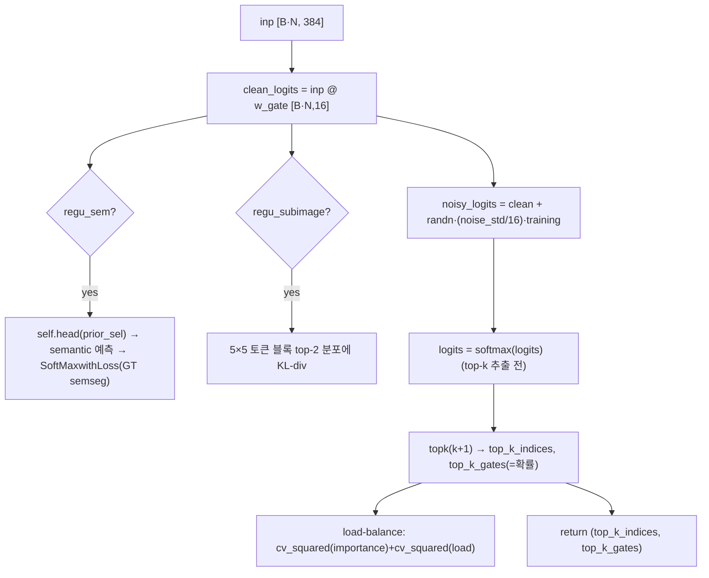
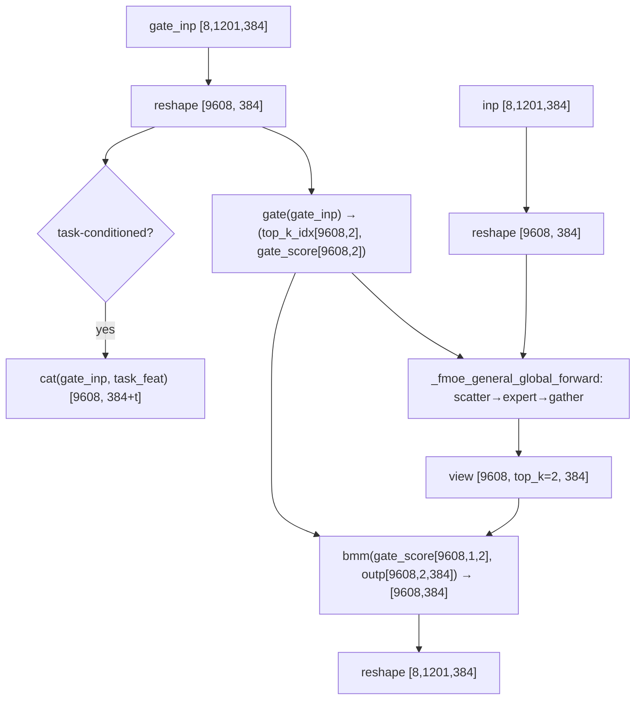
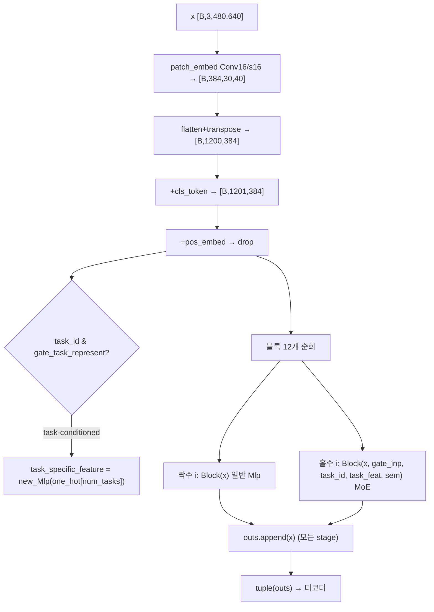
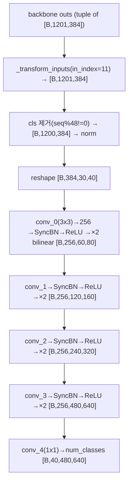
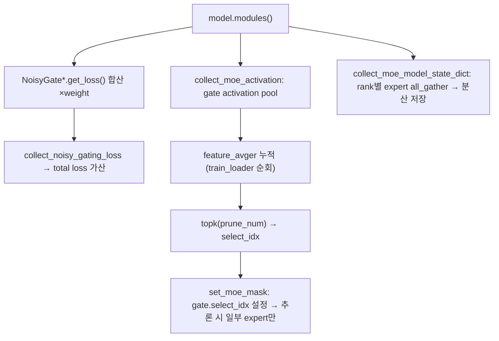
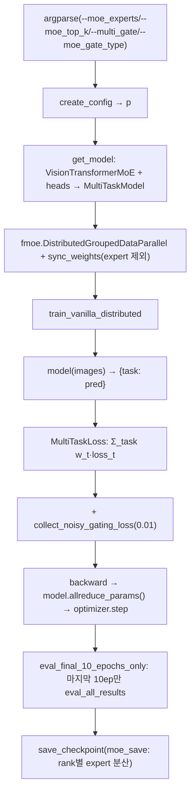

# M3ViT 모듈 통합 가이드 (S-PyTorch)

> 1차 요약: [`../M3ViT.md`](../M3ViT.md) — 본 문서는 그 요약을 모듈 단위로 심화한 통합 가이드다.
> 분석 대상: `\\wsl.localhost\ubuntu-24.04\home\user\project\PRJXR-HBTXR\REF\ViT-Quantization\M3ViT`
> 작성 원칙: 실제 소스 Read 후 `파일:라인` 근거 표기. 라인 근거 없는 추론은 "추정", 코드로 확인 불가는 "확인 불가"로 명시.
> 형제 가이드(`REF/Analysis/ViT-Quantization/I-ViT/MODULE_GUIDE.md`)의 6요소 구조를 따르되, I-ViT의 정수전용 양자화 지표는 **MoE 수치 규약**(params·MACs의 active vs total expert·게이팅/expert 구성·멀티태스크 head)으로 치환한다. HW 시사점은 Edge-MoE HW 가이드(`REF/Analysis/Transformer-Accel/Edge-MoE/MODULE_GUIDE.md`)와 연계.
> **중요 사전 결론(1차 요약 §3.8 재확인)**: 본 repo의 "ViT-Quantization" 위치는 분류상이며, **모델 양자화(PTQ/QAT/INT8/fake-quant/observer/qconfig) 코드는 자체 소스에 없다.** 핵심은 **MoE(Mixture-of-Experts) ViT 멀티태스크 학습 + 모델-가속기 코디자인(연산 reordering)**. `fp16` Grep 매칭은 mmcv `auto_fp16` AMP 데코레이터로 양자화 아님(`models/decoder_head.py:6,85,163`). 따라서 본 가이드의 "수치 규약"은 비트폭/observer 대신 **MoE sparsity(active/total)**를 1급 지표로 둔다.

---

## 0. 문서 머리말

### 0.1 대표 케이스 선정
- **대표 모델: `vit_small_patch16_224` MoE 변형 (ViT-S-MoE)** — `embed_dim=384, depth=12, num_heads=12, mlp_ratio=4, patch16` + MoE 옵션 `moe_experts=16, moe_top_k=2, moe_mlp_ratio=2` (config: `configs/nyud/vit_moe/pup_moe_vit_small_multi_task_baseline.yml:24-53`; README 권장 `--moe_experts 16`: `README.md:75`). 근거:
  1. NYUD/PASCAL vit_moe config가 모두 `vit_small_patch16_224` 백본을 씀(`configs/nyud/vit_moe/pup_moe_vit_small_multi_task_baseline.yml:27`, `configs/pascal/vit_moe/pup_moe_vit_small_multi_task_baseline.yml:30`)이라 공식 대표 케이스.
  2. 멀티태스크 dense 예측(semseg+depth on NYUD, semseg/human_parts/sal/edge/normals on PASCAL)이 MoE 게이팅·sparse expert·태스크별 head를 모두 비자명하게 활성화 → 분석 가치 높음(`configs/.../pup_moe_vit_small_multi_task_baseline.yml:74-94`).
- **대표 분석 단위: VisionTransformerMoE 1개 MoE Block** = `norm1 → Attention → residual` 다음 `norm2 → FMoETransformerMLP(NoisyGate/NoisyGate_VMoE → top-k → expert(htoh4·act·h4toh) → gate_score 가중합) → residual` (`models/vision_transformer_moe.py:226-283`). ViT-S는 12 block 중 **홀수 인덱스 6개만 MoE**(격층, `:425-437`), 짝수 6개는 일반 Mlp.
- **대표 게이팅 2종**: `NoisyGate`(GShard/Switch식 noisy top-k + load-balancing, `models/gate_funs/noisy_gate.py:14-218`), `NoisyGate_VMoE`(V-MoE식 + sem/subimage/task 정규화, `models/gate_funs/noisy_gate_vmoe.py:15-300`) — FPGA 동적 라우팅 HW화의 직접 청사진(Edge-MoE 연계).
- **대표 멀티태스크 head**: `VisionTransformerUpHead`(PUP 4단 업샘플 분할 디코더, `models/vit_up_head.py:73-224`), 태스크별 1개씩 `MultiTaskModel.decoders`로 묶임(`models/models.py:118-264`).

### 0.2 MoE 수치 규약 (I-ViT의 비트폭/observer 대체)
- **params**: 모듈 차원 분석적 계산. Linear `in·out (+out bias)`, LayerNorm `2·C`, Conv `Cout·Cin·Kh·Kw (+Cout)`. **MoE는 expert 수만큼 곱**: 한 MoE MLP의 expert 파라미터 = `num_expert × (d_model·d_hidden + d_hidden + d_hidden·d_model + d_model)`(htoh4+h4toh, bias 포함, `models/custom_moe_layer.py:32-33`). **total params**(전체 expert 저장) vs **active params**(top_k expert만 추론 활성)를 구분 표기.
- **MACs/FLOPs**: 표준식×config. **MoE 핵심: active MAC ∝ top_k(전체 expert 수 무관)**. 토큰당 expert MAC = `top_k × 2 × d_model · d_hidden`(htoh4+h4toh), gating MAC = `N · d_gate · tot_expert`(`noisy_gate.py:142`). 이것이 "학습 dense / 추론 sparse"의 정량 근거.
- **active vs total expert**: `num_expert`(=총 expert, config `moe_experts`)와 `top_k`(=토큰당 활성, config `moe_top_k`)로 구분. ViT-S-MoE는 total=16, active=2(README `:75`는 top_k=4 예시도). sparsity = `top_k/num_expert`.
- **게이팅/expert 구성**: noisy top-k(학습 시 노이즈 ON, 추론 OFF), load-balancing loss `cv_squared(importance)+cv_squared(load)`, multi-gate(태스크별 router) vs task-conditioned(공유 router + task embedding concat).
- **멀티태스크 head**: 태스크 수 = `len(p.TASKS.NAMES)`(NYUD 2, PASCAL 5), 각 태스크에 독립 `VisionTransformerUpHead`(`common_config.py:271-291`, `models.py:120-125`).
- **정확도**: README는 정량 수치표를 **제공하지 않음**(아키텍처/설치/명령만, `README.md` 전체). → **정확도 수치 확인 불가**(논문 본문 필요, 본 repo 미포함).

### 0.3 운영 경로 (분산 MoE 학습 ↔ 체크포인트 ↔ 멀티태스크 평가)
```
[config 로드] create_config(env, exp) → p (backbone/head/tasks/moe args)   (train_fastmoe.py:162-190)
   │  CLI가 moe_experts/top_k/gate_type/multi_gate를 p에 주입 (train_fastmoe.py:91-148, 164-188)
   ▼
[모델 조립] get_model(p,args): VisionTransformerMoE 백본 + 태스크별 VisionTransformerUpHead → MultiTaskModel
   │  (common_config.py:168-202 백본, :282-291 head, :297-313 래퍼)
   │  랜덤초기화 또는 사전학습 로드(cvt_state_dict / read_specific_group_experts) (common_config.py:207-247)
   ▼
[분산 wrap] fmoe.DistributedGroupedDataParallel + sync_weights(expert 제외) (train_fastmoe.py:267-270)
   ▼
[학습] train_vanilla_distributed: forward → MultiTaskLoss(태스크 합) + collect_noisy_gating_loss(load-balance)
   │  → backward → model.allreduce_params()(fmoe) → optimizer.step  (train/train_utils.py:197-263)
   │  SGD lr 0.002 / poly / 100 epochs (config :11-18)
   ▼
[체크포인트] save_checkpoint(moe_save=True): rank별 expert 분산 저장 (moe_utils.py:68-93)
   ▼
[평가] save_model_predictions → eval_all_results (태스크별 metric); eval_final_10_epochs_only로 마지막 10ep만
   │  (train_fastmoe.py:421-471)
   ▼
[(옵션) expert pruning] prune_moe_experts: 게이트 활성 평균 → top-N expert 고정 (moe_utils.py:174-204)
```
- 타깃 디바이스: **CUDA + 분산(NCCL) 전제** — `torch.cuda.is_available()` 아니면 `NotImplementedError`(`train_fastmoe.py:257-258`), `dist.init_process_group(backend="nccl")`(`:203`), fastmoe `DistributedGroupedDataParallel`(`:269`). → 단일 CPU 실행 불가(코드 근거 확인, 실행 실패는 미검증).

### 0.4 모델 / 데이터셋 / 정확도
| 항목 | 값 | 근거 |
|---|---|---|
| 백본 | ViT-S `vit_small_patch16_224` | `configs/nyud/vit_moe/pup_moe_vit_small_multi_task_baseline.yml:27` |
| embed/depth/heads | 384 / 12 / 12 | 같은 파일 `:31-33` |
| mlp_ratio / moe_mlp_ratio | 4.0 / 2 | `:40,48` |
| moe_experts(total) / top_k(active) | 16(README) / 2(config) | `README.md:75`, config `:50` |
| MoE 삽입 | 홀수 layer(격층, 12 중 6개) | `vision_transformer_moe.py:425-437` |
| 데이터셋 | NYUD-v2, PASCAL-Context, Cityscapes | `data/nyud.py`, `data/pascal_context.py`, `data/cityscapes.py`; config `:5-6` |
| NYUD 태스크 | semseg(40 cls) + depth | config `:34,74-77` |
| PASCAL 태스크 | semseg/human_parts/sal/edge/normals(5) | `configs/pascal/vit_moe/...:78-94` |
| 입력 해상도 | NYUD [480,640], PASCAL [512,512] | config `:28`, pascal `:31` |
| 정확도(Top-1/mIoU 등) | **확인 불가** (README 수치표 부재) | `README.md` 전체 |
- 속도(latency)/HW 측정: 본 repo는 **SW 학습/추론만**, RTL/HW 코드 없음 → latency **확인 불가**(`README.md:19-24`는 코디자인 개념만).

---

## 1. Repo / Layer 개요

M3ViT = ViT 백본의 MLP를 **MoE 레이어로 격층 교체**하여 멀티태스크 학습 시 태스크별 sparse expert를 활성화, 학습 충돌 완화 + 추론 sparse pathway를 달성하는 프레임워크(`README.md:8-10`). 본 repo는 **fastmoe 위에 얹은 커스텀 MoE/게이팅/멀티태스크 모듈**이 자체 소스이고, expert scatter/gather·분산 통신은 fastmoe(`fmoe`)를 그대로 임포트한다(`custom_moe_layer.py:6-19`).

### 1.1 자체 소스 vs 외부 프레임워크 vs 제외

| 구분 | 파일(자체 소스) | 역할 |
|---|---|---|
| **게이팅** ★핵심 | `models/gate_funs/noisy_gate.py` | NoisyGate (GShard/Switch noisy top-k + load-balancing) |
| | `models/gate_funs/noisy_gate_vmoe.py` | NoisyGate_VMoE (V-MoE식 + sem/subimage/task 정규화) |
| **MoE MLP** ★핵심 | `models/custom_moe_layer.py` | FMoETransformerMLP(FMoE 래핑) + _Expert + forward_moe 라우팅 |
| **MoE ViT 백본** ★핵심 | `models/vision_transformer_moe.py` | Attention/Block(MoE 토글)/VisionTransformerMoE(격층 삽입) |
| **멀티태스크 head** | `models/vit_up_head.py` | VisionTransformerUpHead (PUP 4단 업샘플 분할 디코더) |
| | `models/models.py` | SingleTaskModel/MultiTaskModel(공유 백본+태스크별 head)/TamModule |
| **MoE 보조** | `utils/moe_utils.py` | load-balance loss 수집, expert pruning, 분산 expert 체크포인트 I/O |
| **모델 조립** | `utils/common_config.py` | get_model/get_backbone/get_head(config→모듈) |
| **학습 엔트리** | `train_fastmoe.py` | 분산 MoE 학습/평가 루프, argparse |
| **학습 루프** | `train/train_utils.py` | train_vanilla_distributed (MoE loss 합산, allreduce) |
| **loss** | `losses/loss_schemes.py`, `losses/loss_functions.py` | MultiTaskLoss / SoftMaxwithLoss·DepthLoss 등 |
| **baseline(비-MoE)** | `models/{resnet,hrnet,mti_net,padnet,...}.py` | 비교용 CNN MTL (분석 비중 낮음) |

### 1.2 forward 진입점
`MultiTaskModel.forward`(`models.py:170`) → 공유 백본 `VisionTransformerMoE.forward`(`vision_transformer_moe.py:562`) → `forward_features`(`:537-560`):
`patch_embed`(Conv2d patchify) → flatten/transpose → +cls_token → +pos_embed → drop → **블록 순회**: MoE 블록엔 `(gate_inp, task_id, task_specific_feature, sem)` 전달, 일반 블록엔 `x`만 → 각 stage feature를 `outs`에 누적 → tuple 반환. 이후 각 태스크 `VisionTransformerUpHead`가 tuple에서 `in_index=11`(최종 stage) 선택 후 업샘플(`vit_up_head.py:150-224`, `common_config.py:290`).

### 1.3 제외 (지시에 따라 이름만 표기, 미분석)
- **외부 프레임워크(커스텀 아님)**: `fmoe.layers.{FMoE,_fmoe_general_global_forward}`, `fmoe.linear.FMoELinear`, `fmoe.functions.*`, `fmoe.gates.base_gate.BaseGate`, `fmoe.DistributedGroupedDataParallel` (`custom_moe_layer.py:6-16`, `noisy_gate.py:4`, `train_fastmoe.py:32,269`). 특정 커밋 `4edeccd` 별도 빌드(`README.md:42-50`). `timm`(lecun_normal_ 등), `mmcv`(build_norm_layer/auto_fp16), `thop`(FLOPs), `tree`(dm-tree).
- **제외**: `evaluation/seism/`(외부 edge 평가 repo), `models/pretrained_models/`·`*.pth`(사전학습 가중치), `.git/`·`__pycache__/`·`*.pyc`, `data/db_info/*.npy`·`*.json`(데이터셋 메타).
- **분석 비중 낮음(이름만)**: baseline CNN(`resnet.py`/`hrnet`/`mti_net.py`/`padnet.py`/`papnet.py`/`mtan.py`/`nddr_cnn.py`/`cross_stitch.py`) — MoE-ViT 경로와 무관한 비교군. `vits_gate.py`(MoCo-with-gate 사전학습 변형, `moe_use_gate=True`일 때만, `common_config.py:179-188`).
- **미열람(확인 불가)**: `evaluation/eval_*.py` 태스크별 metric 세부, `data/{nyud,pascal_context,cityscapes}.py` 로더 세부, `vit_up_head`의 `_transform_inputs`(BaseDecodeHead, mmcv 기반).

### 1.4 대표 모델 레이어 구성 (ViT-S-MoE, NYUD)
`forward_features`(`vision_transformer_moe.py:537-560`): PatchEmbed(Conv 16×16 s16, [B,3,480,640]→[B,384,30,40]) → flatten [B,1200,384] → +cls → +pos → Block×12(짝수 6 일반 Mlp / 홀수 6 MoE) → outs tuple. 1 MoE Block당 Attention(qkv·proj Linear) 1, LayerNorm 2, FMoETransformerMLP 1(gate + 16 expert), Mlp(일반 블록만).

---

## 2. 모듈: NoisyGate — `noisy_gate.py` (GShard/Switch Noisy Top-K) ★핵심

### 2.1 역할 + 상위/하위
- **역할**: 토큰 임베딩 → expert 선택. clean logits에 학습 가능한 노이즈를 더해 top-k expert를 뽑고, 선택된 k개를 softmax해 게이트 가중치 생성. 학습 시 **load-balancing loss**로 expert 사용 균등화.
- **상위**: `FMoETransformerMLP.gate`(`custom_moe_layer.py:140`), `forward_moe`가 호출(`:215,217`). **하위**: `fmoe.gates.base_gate.BaseGate`(loss/activation buffer, `noisy_gate.py:4,17`), `torch.distributions.Normal`(load 확률).

### 2.2 데이터플로우 (텐서 shape 흐름, d_model=384, tot_expert=16, top_k=2)


### 2.3 forward call stack
`FMoETransformerMLP.forward_moe`(`custom_moe_layer.py:217`) → `NoisyGate.forward(gate_inp)`(`noisy_gate.py:136`) → clean/noisy logits(`:142-149`) → `topk(k+1)`(`:178`) → `softmax`(`:184`) → `scatter`(`:187`) → `_prob_in_top_k`(`:192`)/`cv_squared`(`:200`) → `set_loss`(`:204`).

### 2.4 대표 코드 위치
`noisy_gate.py`: 클래스/파라미터 `:14-46`, `_prob_in_top_k` `:69-112`, `cv_squared` `:114-128`, `forward` `:136-218`, load-balance `:189-200`, activation 캐시 `:205-228`.

### 2.5 대표 코드 블록

```python
# noisy_gate.py:142-149  clean + 학습가능 노이즈 → noisy logits
clean_logits = inp @ self.w_gate                                   # [B·N, tot_expert]
raw_noise_stddev = inp @ self.w_noise
noise_stddev = (self.softplus(raw_noise_stddev) + self.noise_epsilon) * self.training  # 학습 중만
noisy_logits = clean_logits + (torch.randn_like(clean_logits) * noise_stddev)
```
→ `* self.training`으로 **추론 시 노이즈=0**(결정적). `w_noise`는 학습 파라미터(`:21-22`)라 노이즈 std도 입력 의존.

```python
# noisy_gate.py:178-187  top-(k+1) → 상위 k softmax → sparse one-hot scatter
top_logits, top_indices = logits.topk(min(self.top_k + 1, self.tot_expert), dim=1)  # k+1개
top_k_logits = top_logits[:, : self.top_k]
top_k_gates = self.softmax(top_k_logits)                           # 선택 k개만 정규화
gates = zeros.scatter(1, top_k_indices, top_k_gates)              # [B·N, tot_expert] sparse
```
→ k+1을 뽑는 이유는 `_prob_in_top_k`가 k번째/k+1번째 경계 threshold로 "top-k 포함 확률"을 미분가능하게 계산하기 위함(`:92-97`).

```python
# noisy_gate.py:189-200  load-balancing loss (학습 시)
load = self._prob_in_top_k(clean_logits, noisy_logits, noise_stddev, top_logits).sum(0)  # 미분가능 load
importance = gates.sum(0)                                          # expert별 게이트 가중치 합
loss = self.cv_squared(importance) + self.cv_squared(load)        # 둘 다 균등화
# cv_squared(x) = var(x)/(mean(x)^2 + eps)  (:128)
```
→ `cv_squared`(변동계수²)를 0으로 밀어 **expert 사용 분포 균등화** → routing collapse 방지. `set_loss`로 누적(`:130-134`), `collect_noisy_gating_loss`가 전 게이트 합산(§7).

### 2.6 연산·MoE 분해 + 정량 (ViT-S-MoE, d_model=384, tot_expert=16, top_k=2)
- **게이팅 방식**: noisy top-k, 학습 노이즈 ON / 추론 OFF, load-balancing `cv_squared×2`.
- **params**: `w_gate` 384×16 + `w_noise` 384×16 = **12,288**/gate. (decoupled 시 `w_gate_aux`/`w_noise_aux` 추가 ×2, `:27-32`.)
- **MACs/토큰**: clean+noisy logits = 2 × (384×16) = **12,288 MAC/token**(2개 matmul). top-k/softmax는 O(tot_expert).
- **active vs total**: 출력 indices는 token당 `top_k=2`개만 → 다운스트림 expert MAC은 2개만 계산(전체 16 무관).
- **시사**: w_gate/w_noise는 작은 dense matmul → HW에서 expert보다 게이트가 저비용. 단 `randn` 노이즈·`topk`·`scatter`는 동적 제어 → 정적 파이프라인 FPGA에 부담(추론 시 노이즈 제거되어 단순화 가능, 추정).

---

## 3. 모듈: NoisyGate_VMoE — `noisy_gate_vmoe.py` (V-MoE식 + 정규화) ★핵심

### 3.1 역할 + 상위/하위
- **역할**: V-MoE 스타일 게이트. NoisyGate와 골격 동일하나 (i) 노이즈가 **학습 파라미터가 아닌 상수 비율** `noise_std/tot_expert`(`:183`), (ii) **softmax를 top-k 추출 전 logits에 적용**(`:258`), (iii) M3ViT 고유 **sem/subimage/task 정규화** 추가.
- **상위**: `FMoETransformerMLP.gate`(`custom_moe_layer.py:152`). **하위**: `BaseGate`, `losses.loss_functions.SoftMaxwithLoss`(sem 정규화용, `:46-47`).

### 3.2 데이터플로우 (텐서 shape 흐름)


### 3.3 forward call stack
`forward_moe`(`custom_moe_layer.py:217`) → `NoisyGate_VMoE.forward(gate_inp, task_id, sem)`(`noisy_gate_vmoe.py:171`) → regu_experts_fromtask 슬라이스(`:178-183`) → regu_sem(`:186-197`)/regu_subimage(`:199-222`) → softmax(`:258`) → topk(`:259`) → load-balance(`:270-282`).

### 3.4 대표 코드 위치
`noisy_gate_vmoe.py`: 클래스 `:15-61`, sem head `:45-49`, `_prob_in_top_k` `:82-125`, regu_sem `:186-197`, regu_subimage `:199-222`, noise 상수 `:182-184`, softmax-before-topk `:258`, load-balance `:270-282`.

### 3.5 대표 코드 블록

```python
# noisy_gate_vmoe.py:182-184  노이즈가 학습 파라미터 아닌 상수 비율 (w_noise 없음)
clean_logits = inp @ self.w_gate
raw_noise_stddev = self.noise_std / self.tot_expert               # 상수 (NoisyGate와 차이)
noise_stddev = raw_noise_stddev * self.training
```

```python
# noisy_gate_vmoe.py:258-265  softmax를 top-k 추출 "전" 적용 → 게이트=softmax 확률
logits = self.softmax(logits)                                     # NoisyGate는 선택 후 softmax
top_logits, top_indices = logits.topk(min(self.top_k + 1, self.tot_expert), dim=1)
top_k_indices = top_indices[:, : self.top_k]
top_k_gates = top_k_logits                                        # 이미 확률 (재softmax 없음)
```

```python
# noisy_gate_vmoe.py:186-196  regu_sem: 게이트 logit으로 semantic 예측 → GT semseg와 정렬
prior_selection = clean_logits.reshape(batch,-1,self.num_expert)[:,1:,:]  # cls 제외
prior_out = self.head(prior_selection)                           # Linear(num_expert→40 cls)
prior_out = prior_out.reshape(batch,sem.shape[2],sem.shape[3],self.num_class).permute(0,3,1,2)
semregu_loss = self.criterion(prior_out, sem)                    # SoftMaxwithLoss
self.semregu_loss = semregu_loss
```
→ expert 선택을 의미정보와 정렬(태스크 인지 라우팅). `regu_subimage`는 5×5 토큰 블록 내 top-2 expert 분포에 KL-div를 걸어 공간적 라우팅 일관성 유도(`:199-222`, 단 patch grid 30×40 하드코딩 `:203`).

### 3.6 연산·MoE 분해 + 정량
- **게이팅 방식**: softmax-then-topk(V-MoE), 상수 노이즈, + sem(40-class head)/subimage(KL)/task-slice 정규화 옵션.
- **params**: `w_gate` 384×16 = **6,144**/gate (w_noise 없어 NoisyGate의 절반). regu_sem 시 `head` Linear(16→40)= 16×40+40 = **680** 추가(`:49`).
- **MACs/토큰**: clean logits = 384×16 = **6,144 MAC**. regu_sem head = 16×40/token(학습 시만).
- **하드코딩 리스크**: `num_class=40`(`:48`), patch grid `30,40`(`:203`), subimage_tokens `5`(`:53`) → 입력 해상도/태스크 종속. `regu_subimage` 내부 `print`(`:217`) 디버그 잔존.
- **시사**: task-conditioned 라우팅(sem/task)은 멀티태스크 전용 정규화. FPGA 추론에선 정규화 손실 경로 불필요(학습 전용) → expert 디스패치만 남으면 Edge-MoE식 매핑 가능(추정).

---

## 4. 모듈: FMoETransformerMLP — `custom_moe_layer.py` (MoE MLP 본체) ★핵심

### 4.1 역할 + 상위/하위
- **역할**: Transformer MLP를 MoE로 대체. gate로 expert 선택 → fastmoe scatter/gather로 토큰을 expert별 계산 → gate_score 가중합. multi-gate(태스크별 router) / task-conditioned(task embedding concat) 모드 분기.
- **상위**: `Block.mlp`(`vision_transformer_moe.py:265`, moe=True 블록). **하위**: `fmoe.layers.FMoE`(상속, `:66`), `_fmoe_general_global_forward`(`:255`), `FMoELinear`(expert, `:32-33`), NoisyGate/NoisyGate_VMoE(`:132-155`).

### 4.2 데이터플로우 (텐서 shape 흐름, B=8, N=1201, d_model=384, d_hidden=768)


### 4.3 forward call stack
`Block.forward`(`vision_transformer_moe.py:282`) → `FMoETransformerMLP.forward(x, gate_inp, task_id, task_specific_feature, sem)`(`custom_moe_layer.py:161`) → reshape(`:170-174`) → task concat(`:176-179`) → `forward_moe`(`:180,184`) → gate(`:213-217`) → `_fmoe_general_global_forward`(`:255`) → view(`:283-288`) → `bmm`(`:290-297`).

### 4.4 대표 코드 위치
`custom_moe_layer.py`: `_Expert` `:24-44`, `__init__` `:73-159`(gate 조립 `:132-158`), `forward` `:161-181`(task concat `:176-179`), `forward_moe` `:184-314`(gate `:213-217`, prune `:219-222`, sem_force `:223-233`, task offset `:236-238`, scatter/gather `:255-257`, 가중합 `:290-297`).

### 4.5 대표 코드 블록

```python
# custom_moe_layer.py:32-44  _Expert: 한 worker 내 여러 expert를 FMoELinear 2개로 묶음
self.htoh4 = FMoELinear(num_expert, d_model, d_hidden, bias=True, rank=rank)
self.h4toh = FMoELinear(num_expert, d_hidden, d_model, bias=True, rank=rank)
def forward(self, inp, fwd_expert_count):
    x = self.htoh4(inp, fwd_expert_count)     # d_model → d_hidden
    x = self.activation(x)                     # GELU + Dropout
    x = self.h4toh(x, fwd_expert_count)        # d_hidden → d_model
```
→ `fwd_expert_count`(expert별 토큰 수)로 grouped GEMM. **expert MAC = top_k개만**(scatter된 토큰만 각 expert 통과).

```python
# custom_moe_layer.py:132-150  multi-gate(태스크별 router) vs 단일 게이트
if self.multi_gate:
    self.gate = nn.ModuleList([gate(d_gate, num_expert, world_size, top_k, ...)
                for i in range(self.our_d_gate - self.our_d_model)])  # 태스크 수만큼 router
else:
    self.gate = gate(d_gate, num_expert, world_size, top_k, ...)      # 공유 router
```
→ multi-gate면 `gate_dim - embed_dim`(=태스크 수)개의 독립 router(`vision_transformer_moe.py:417`이 `num_tasks=gate_dim-embed_dim`). NYUD gate_dim=386, embed=384 → 2 router(=2 task), PASCAL 389-384=5.

```python
# custom_moe_layer.py:213-217  gate 호출: multi-gate면 task_id로 router 선택
if (task_id is not None) and self.multi_gate:
    gate_top_k_idx, gate_score = self.gate[task_id](gate_inp)         # 태스크별 router
else:
    gate_top_k_idx, gate_score = self.gate(gate_inp, task_id=task_id, sem=sem)
```

```python
# custom_moe_layer.py:255-297  scatter→expert→gather 후 gate_score 가중합
fwd = _fmoe_general_global_forward(moe_inp, gate_top_k_idx, self.expert_fn, self.num_expert, self.world_size)
moe_outp = tree.map_structure(view_func, fwd)                        # [B·N, top_k, dim]
gate_score = gate_score.view(-1, 1, self.top_k)                      # [B·N, 1, top_k]
moe_outp = bmm(gate_score, moe_outp)                                 # 가중합 → [B·N, dim]
```
→ `y = Σ_{i∈topk} g_i·Expert_i(x)`. task-conditioned 모드에선 `forward`(`:176-179`)에서 `task_specific_feature`를 gate_inp에 concat 후 단일 게이트 사용(`multi_gate=False` assert, `:177`).

### 4.6 연산·MoE 분해 + 정량 (ViT-S-MoE, d_model=384, d_hidden=768=384·moe_mlp_ratio2, top_k=2, num_expert=16)
- **게이팅/expert 구성**: 16 expert 저장, 토큰당 2 expert 활성, multi-gate(태스크별 router) 또는 task-conditioned.
- **params (1 MoE MLP)**:
  - expert: 16 × (384×768 + 768 + 768×384 + 384) = 16 × 591,360 = **9,461,760** (total, 전체 expert 저장)
  - gate: NoisyGate 12,288 또는 NoisyGate_VMoE 6,144 (multi-gate면 ×태스크 수)
  - **active params(추론, top_k=2)**: 2 × 591,360 = **1,182,720** (total의 1/8)
- **MACs/토큰 (active, top_k=2)**: 2 × (384×768 + 768×384) = 2 × 589,824 = **1,179,648 MAC/token** + gate 6~12K. **expert 수 16과 무관, top_k=2에만 비례** → sparse 효율.
- **MACs (전체, B=8, N=1201)**: 9608 token × 1.18M ≈ **11.3 GMAC** (1개 MoE 블록, active). MoE 블록 6개 → ~68 GMAC (active expert만).
- **active vs total 비교**: total expert MAC(16개 다 계산 시) = 8× active → sparsity로 7/8 절감. dense 학습(load-balance로 다양 expert 사용) vs sparse 추론(top_k 고정)의 정량 차이.
- **시사**: scatter/gather + grouped GEMM(`fwd_expert_count`)는 **데이터 의존 동적 디스패치** → FPGA 정적 파이프라인에 부담. Edge-MoE식 expert weight double-buffer + 토큰 큐 매핑 필요(README `:19-24`, 추정).

---

## 5. 모듈: MoE ViT 백본 — `vision_transformer_moe.py` (Attention/Block/VisionTransformerMoE) ★핵심

### 5.1 역할 + 상위/하위
- **역할**: 표준 ViT 토폴로지에 **격층 MoE 삽입**. 짝수 layer는 일반 Mlp, 홀수 layer는 FMoETransformerMLP. task embedding 생성(task-conditioned), 다단계 stage feature 누적(디코더용).
- **상위**: `MultiTaskModel.backbone`(`models.py:123`), `common_config.get_backbone`(`:168-202`). **하위**: `Attention`(`:194`), `Block`(`:226`), `FMoETransformerMLP`(`:265`), `PatchEmbed`(`:285`), `new_Mlp`(task embed, `:174`).

### 5.2 데이터플로우 (텐서 shape 흐름, NYUD [B,3,480,640])


### 5.3 forward call stack
`VisionTransformerMoE.forward`(`:562`) → `forward_features`(`:537`) → patch_embed(`:539`) → cls/pos(`:541-543`) → task embed(`:547-550`) → 블록 순회(`:553-559`): `blk(x, gate_inp, task_id, task_specific_feature, sem)`(`:555`, moe) 또는 `blk(x)`(`:557`) → `Block.forward`(`:275`) → attn(`:278`) → MoE mlp(`:282`).

### 5.4 대표 코드 위치
`vision_transformer_moe.py`: `Attention` `:194-224`, `Block`(MoE 토글) `:226-283`, `VisionTransformerMoE.__init__` `:350-470`(격층 삽입 `:425-437`, task embed `:420-423`), `forward_features` `:537-560`, `get_groundtruth_sem` `:519-535`.

### 5.5 대표 코드 블록

```python
# vision_transformer_moe.py:425-437  격층 MoE 삽입 (짝수 일반 / 홀수 MoE)
for i in range(self.depth):
    if i % 2 == 0:
        blocks.append(Block(dim=embed_dim, num_heads=num_heads, mlp_ratio=mlp_ratio, ...))  # 일반
    else:
        blocks.append(Block(..., moe=True, moe_mlp_ratio=moe_mlp_ratio, moe_experts=moe_experts,
                            moe_top_k=moe_top_k, moe_gate_dim=gate_dim, moe_gate_type=moe_gate_type,
                            multi_gate=multi_gate, regu_sem=regu_sem, ...))                   # MoE
```
→ depth=12면 layer 1,3,5,7,9,11(홀수 6개)만 MoE. V-MoE의 "every-other-layer" 관행.

```python
# vision_transformer_moe.py:275-283  Block: MoE면 추가 인자 전달, 아니면 일반
def forward(self, x, gate_inp=None, task_id=None, task_specific_feature=None, sem=None):
    if self.gate_input_ahead: gate_inp = x
    x = x + self.drop_path(self.attn(self.norm1(x)))                # attention (공통)
    if not self.moe:
        x = x + self.drop_path(self.mlp(self.norm2(x)))            # 일반 Mlp
    else:
        x = x + self.drop_path(self.mlp_drop(self.mlp(self.norm2(x), gate_inp, task_id, task_specific_feature, sem)))
```

```python
# vision_transformer_moe.py:546-550  task-conditioned: task one-hot → embedding
if (task_id is not None) and (self.gate_task_represent is not None):
    task_specific = torch.zeros(self.num_tasks, device=x.device)
    task_specific[task_id] = 1.0
    task_specific_feature = self.gate_task_represent(task_specific)  # new_Mlp(num_tasks→gate_task_specific_dim)
```
→ multi-gate=False & gate_task_specific_dim≥0일 때 사용(`:420-423`). 이 feature가 FMoETransformerMLP에서 gate_inp에 concat(§4.5).

### 5.6 연산·MoE 분해 + 정량 (ViT-S-MoE, NYUD, B=1, N=1201)
- **Attention(표준, 모든 12 블록)**: qkv 384×1152, proj 384×384. QKᵀ/AV = H·N²·dh = 12×1201²×32 ≈ 554M/block(N=1201 크다). Attention Linear = N×(384×1152+384×384) ≈ 0.6G/block.
- **params (백본 전체)**:
  - PatchEmbed Conv: 3×384×16×16 + 384 = 295,296
  - cls_token 384, pos_embed 1201×384 ≈ 461K (해상도 의존, interp)
  - Attention×12: 12 × (qkv 384×1152+1152 + proj 384×384+384) ≈ 12 × 590,592 ≈ 7.09M
  - LayerNorm×24: 24 × 768 ≈ 18.4K
  - 일반 Mlp×6(짝수): 6 × (384×1536+1536 + 1536×384+384) ≈ 6 × 1.18M ≈ 7.08M (mlp_ratio=4)
  - MoE MLP×6(홀수): 6 × 9.46M(expert total) ≈ **56.8M** (+ gate 6×6~12K)
  - **백본 total params ≈ 71.7M** (MoE expert가 지배), **active(top_k=2 추론) ≈ 71.7M − 56.8M + 6×1.18M ≈ 22M** (MoE를 active 2 expert로 환산 시 일반 ViT-S급).
- **active vs total 핵심**: total 72M 저장 / 추론 active ~22M. MoE가 파라미터를 8배 늘리되 추론 연산은 일반 ViT-S 수준 유지 = MoE의 "용량↑ 연산 유지" 특성.
- **시사**: N=1201(고해상도 dense 예측)이라 Attention N² 비용이 큼 → FPGA에서 attention과 MoE 둘 다 병목. classification(N=197)보다 메모리 압박 심함.

---

## 6. 모듈: 멀티태스크 head — `vit_up_head.py` + `models.py` (VisionTransformerUpHead / MultiTaskModel)

### 6.1 역할 + 상위/하위
- **역할**: (head) ViT 토큰 시퀀스를 2D로 reshape 후 **PUP 4단 conv+SyncBN+ReLU+×2 bilinear**로 점진 업샘플해 dense map 생성. (래퍼) 공유 백본 + 태스크별 head를 묶어 dict 출력.
- **상위**: `MultiTaskModel.decoders[task]`(`models.py:124`), `common_config.get_head`(`:282-291`). **하위**: `BaseDecodeHead`(mmcv, `vit_up_head.py:12,73`), `build_norm_layer`(SyncBN).

### 6.2 데이터플로우 (텐서 shape 흐름, NYUD semseg head)


### 6.3 forward call stack
`MultiTaskModel.forward`(`models.py:170`) → 백본 `forward`(`:178/183`) → 태스크별 `self.decoders[task](shared_representation)`(`:209`) → `VisionTransformerUpHead.forward`(`vit_up_head.py:149`) → `_transform_inputs`(`:150`) → norm/reshape(`:155-163`) → conv 4단(`:182-218`) → `F.interpolate`로 out_size 정렬(`models.py:209`).

### 6.4 대표 코드 위치
`vit_up_head.py`: `__init__`(num_conv 분기) `:77-138`, `num_conv==4` conv 정의 `:115-129`, multi_level/tam 옵션 `:95-105,131-134`, `forward` `:149-224`(PUP 4단 `:182-218`). `models.py`: `MultiTaskModel` `:118-264`(태스크 id 맵 `:126-130`, multi_gate별 forward `:175-263`, TAM 융합 `:211-223`).

### 6.5 대표 코드 블록

```python
# vit_up_head.py:182-191  PUP: conv→SyncBN→ReLU→×2 bilinear 반복 (4단)
x = self.conv_0(x); x = self.syncbn_fc_0(x); x = F.relu(x, inplace=True)
x = F.interpolate(x, size=(x.shape[-2]*2, x.shape[-1]*2), mode='bilinear', align_corners=self.align_corners)
if self.multi_level: out['level1'] = self.output_level_0(x)        # 중간 레벨 출력 옵션
x = self.conv_1(x); ...                                            # conv_1,2,3 동일 패턴 → conv_4(1x1) 분류
```

```python
# models.py:198-209  MultiTaskModel: 공유 표현 → 태스크별 head → out_size interp
for task in self.tasks:
    out[task] = F.interpolate(self.decoders[task](shared_representation), out_size, mode='bilinear')
```
→ 백본 1회 forward의 `shared_representation`(tuple)을 모든 태스크 head가 공유 → **백본 공유 + head 분기**가 MTL 효율 핵심. multi_gate=True면 태스크별로 백본을 따로 forward(`:235-236`, `pertask_representation`)해 태스크별 router 사용.

```python
# models.py:236  multi-gate 모드: 태스크마다 백본 재실행 (태스크별 expert 경로)
pertask_representation = self.backbone(x, task_id=self.tasks_id[task])
```
→ multi-gate는 태스크 수만큼 백본 forward → 연산 비용 ↑(공유 표현 못 씀). 대신 태스크별 완전 분리 라우팅. trade-off 명확.

### 6.6 연산·멀티태스크 분해 + 정량 (NYUD, head per task)
- **head 수 = 태스크 수**: NYUD 2(semseg 40cls + depth 1ch), PASCAL 5. 각 head 독립 `VisionTransformerUpHead`(`common_config.py:290` `num_classes=p.TASKS.NUM_OUTPUT[task]`).
- **params (1 head, num_conv=4)**: conv_0 384×256×9+256 + conv_1~3 각 256×256×9+256 ×3 + conv_4 256×40+40 ≈ 884K + 3×590K + 10.3K ≈ **2.66M**/semseg head. depth head(out 1ch) conv_4만 작음 ≈ 2.06M.
- **MACs (1 head, [B,384,30,40]→[B,40,480,640])**: conv가 점진 업샘플로 해상도 증가 → 마지막 단(480×640) conv가 지배. 추정 수 GMAC/head(정확 산출은 단계별 해상도 적분 필요 — "추정").
- **active vs total head**: multi-gate=False(공유 백본)면 백본 1회 + 모든 head 실행. 추론 시 **관심 태스크 head만 실행**하면 다른 head 연산 생략 가능(sparse pathway, README `:8-10`).
- **시사**: head는 표준 conv+bilinear → FPGA conv 엔진으로 단순 매핑. MoE 백본보다 정적이라 HW화 용이. 태스크 전환 = head 스위칭(저비용).

---

## 7. 모듈: MoE 보조 — `moe_utils.py` (loss 수집 / pruning / 분산 체크포인트)

### 7.1 역할 + 상위/하위
- **역할**: (i) 전 게이트의 load-balance/sem/subimage loss 합산, (ii) 게이트 활성 통계로 expert pruning, (iii) rank별 expert 파라미터 분산 저장/수집.
- **상위**: `train_vanilla_distributed`(loss, `train_utils.py:228,247`), `train_fastmoe.py`(save_checkpoint `:443`). **하위**: NoisyGate/NoisyGate_VMoE(`get_loss`/`get_activation`/`select_idx`), `torch.distributed`.

### 7.2 데이터플로우


### 7.3 forward call stack
`train_vanilla_distributed`(`train_utils.py:247`) → `collect_noisy_gating_loss(model, weight)`(`moe_utils.py:105`) → 각 gate `get_loss()`(`:110`). pruning: `prune_moe_experts`(`:174`) → `collect_moe_activation`(`:180`) → `feature_avger.update`(`:187`) → `set_moe_mask`(`:202`).

### 7.4 대표 코드 위치
`moe_utils.py`: `collect_noisy_gating_loss` `:105-111`, `collect_semregu_loss`/`collect_regu_subimage_loss` `:114-128`, `collect_moe_activation` `:130-152`, `set_moe_mask` `:155-158`, `prune_moe_experts` `:174-204`, 분산 체크포인트 `:21-102`.

### 7.5 대표 코드 블록

```python
# moe_utils.py:105-111  전 게이트 load-balance loss 합산
def collect_noisy_gating_loss(model, weight):
    loss = 0
    for module in model.modules():
        if (isinstance(module, NoisyGate) or isinstance(module, NoisyGate_VMoE)) and module.has_loss:
            loss += module.get_loss()
    return loss * weight                                          # 기본 weight 0.01 (train_fastmoe.py:102)
```

```python
# moe_utils.py:196-202  게이트 활성 평균 top-N expert 선택 → mask
for n, item in save_gate_activations_avger_dict.items():
    top_logits, top_indices = item.topk(moe_experts_prune_num)    # 자주 쓰인 expert
    select_idx_dict[n] = top_indices
set_moe_mask(model, select_idx_dict)                             # gate.select_idx 설정
```
→ `select_idx` 설정 후 게이트는 그 subset에서만 top-k(`noisy_gate.py:151-153,167-175`) → **추론 expert 수 축소**(정적화). FPGA 매핑 시 동적성 완화의 직접 수단.

```python
# moe_utils.py:21-30  분산 expert 체크포인트: expert만 all_gather
for key, item in moe_state_dict.items():
    if "mlp.experts.htoh4" in key or "mlp.experts.h4toh" in key:
        collect_moe_state_dict[key] = gather_features(item, rank, world_size)  # expert 분산→수집
    else:
        collect_moe_state_dict[key] = item
```

### 7.6 연산·MoE 분해 + 정량
- **loss 가중치**: `moe_noisy_gate_loss_weight=0.01`(`train_fastmoe.py:102`), semregu/subimage 각 0.01(`:126,134`).
- **pruning**: `moe_experts_prune_num`개로 축소(`:199`), train_loader 전체 순회로 통계(`:177`).
- **분산**: expert 파라미터만 rank 분산(`world_size`로 나눔, `common_config.py:178`), 나머지는 복제. expert가 GPU에 분산 저장되는 구조.
- **시사**: expert pruning = "정적으로 top-N expert 고정" → 동적 라우팅을 정적 디스패치로 전환하는 FPGA 친화 변형의 코드 근거(추정 효과). load-balance loss는 학습 전용(추론 무관).

---

## 8. 모듈: 학습·평가 파이프라인 — `train_fastmoe.py` + `train_utils.py` + `loss_schemes.py`

### 8.1 역할 + 상위/하위
- **역할**: config 로드 → 모델/criterion/optimizer 조립 → 분산 wrap → 멀티태스크 학습(태스크 loss 합 + MoE loss) → best 평가/체크포인트.
- **상위**: CLI(`README.md:71-77`). **하위**: `get_model`/`get_criterion`/`get_optimizer`(common_config), `train_vanilla_distributed`, `collect_noisy_gating_loss`, fastmoe DDP.

### 8.2 데이터플로우


### 8.3 forward call stack
`main`(`train_fastmoe.py:160`) → `get_model`(`:255`) → DDP wrap(`:269`) → epoch loop(`:407`): `train_vanilla_distributed`(`:417`) → `model(images)`(`train_utils.py:240`) → `criterion`(`:244`) → `collect_noisy_gating_loss`(`:247`) → `backward`(`:260`) → `allreduce_params`(`:262`).

### 8.4 대표 코드 위치
`train_fastmoe.py`: argparse `:70-149`, config 주입 `:162-190`, 분산 init `:200-234`, 모델/DDP `:255-282`, eval/resume `:323-396`, epoch loop `:407-471`. `train_utils.py`: `train_vanilla_distributed` `:197-278`(MoE loss `:246-247`, allreduce `:261-262`). `loss_schemes.py`: `MultiTaskLoss` `:23-115`(태스크 합 `:106-111`).

### 8.5 대표 코드 블록

```python
# train_utils.py:240-263  멀티태스크 forward → loss 합 + MoE load-balance → allreduce
output = model(images)                                            # {task: pred}
loss_dict = criterion(output, targets)                           # MultiTaskLoss
if p['backbone'] == 'VisionTransformer_moe' and (not args.moe_data_distributed):
    loss_dict['total'] += collect_noisy_gating_loss(model, args.moe_noisy_gate_loss_weight)  # +0.01·load-balance
loss_dict['total'].backward()
if p['backbone'] == 'VisionTransformer_moe' and (not args.moe_data_distributed):
    model.allreduce_params()                                      # fastmoe expert grad 동기화
optimizer.step()
```

```python
# loss_schemes.py:106-111  MultiTaskLoss: 가중 태스크 합
out = {task: self.loss_ft[task](pred[task], gt[task]) for task in self.tasks}
out['total'] = torch.sum(torch.stack([self.loss_weights[t] * out[t] for t in self.tasks]))
```
→ `L = Σ_task w_t·L_task + 0.01·Σ_gate L_balance`. NYUD: semseg 1.0 + depth 1.0(config `:81-83`). PASCAL: semseg1/human_parts2/sal5/edge50/normals10(`:89-94`).

```python
# train_utils.py:211-234  one_by_one(task-conditioned): 태스크마다 forward/backward
for single_task in p.TASKS.NAMES:
    output = model(images, single_task=single_task, task_id=id)   # 태스크별
    loss_dict = criterion(output, targets, single_task)
    loss_dict['total'] += collect_noisy_gating_loss(model, ...)
    loss_dict['total'].backward()                                 # 태스크별 backward
model.allreduce_params(); optimizer.step()
```

### 8.6 연산·학습 분해 + 정량 / 재현 명령
- **optimizer**: SGD lr 0.002 / momentum 0.9 / wd 1e-4 / poly scheduler (config `:13-18`). epochs 100(`:12`). batch 8/8(`:7-8`).
- **MoE 학습 모드**: dense(모든 expert가 load-balance로 학습되되 토큰당 top_k만) → 추론 sparse(top_k 고정).
- **재현 명령** (`README.md:73-75`):
  ```bash
  CUDA_VISIBLE_DEVICES=0,1 python -m torch.distributed.launch --nproc_per_node=2 train_fastmoe.py \
    --config_env configs/env.yml --config_exp configs/$DATASET/vit_moe/$MODEL.yml \
    --moe_gate_type "noisy_vmoe" --moe_experts 16 --moe_top_k 4 --multi_gate True \
    --moe_mlp_ratio 1 --vmoe_noisy_std 0 --backbone_random_init False ...
  ```
- **평가**: `eval_final_10_epochs_only: True`(config `:87`)로 마지막 10 epoch만 태스크별 metric(`eval_all_results`). edge는 외부 seism(`README.md:57`).
- **정확도**: README 수치표 부재 → **확인 불가**. metric 종류: semseg mIoU, depth RMSE, normals mErr, sal/edge 등(`evaluation/eval_*.py`, 세부 미열람).

---

## N+1. 모듈 한눈 요약 표

| 모듈 | 파일:라인 | 역할 | MoE/게이팅 방식 | 대표 정량(ViT-S-MoE) |
|---|---|---|---|---|
| NoisyGate | noisy_gate.py:14-218 | GShard noisy top-k + load-balance | w_gate+w_noise, 선택후 softmax | params 12,288/gate, top_k=2 |
| NoisyGate_VMoE | noisy_gate_vmoe.py:15-300 | V-MoE + sem/subimage/task 정규화 | 상수 노이즈, 선택전 softmax | params 6,144/gate, +sem head 680 |
| FMoETransformerMLP | custom_moe_layer.py:66-314 | MoE MLP(gate+expert+가중합) | scatter/gather, multi/task-cond | expert total 9.46M / active 1.18M |
| _Expert | custom_moe_layer.py:24-44 | 16 expert grouped GEMM | htoh4·GELU·h4toh | 591K/expert (d_h=768) |
| VisionTransformerMoE | vision_transformer_moe.py:350-566 | 격층 MoE ViT 백본 | 홀수 layer만 MoE(6/12) | backbone total ~72M / active ~22M |
| Block(MoE 토글) | vision_transformer_moe.py:226-283 | attn + MoE/일반 Mlp | moe=True면 gate 인자 전달 | attn N²(N=1201) 지배 |
| VisionTransformerUpHead | vit_up_head.py:73-224 | PUP 4단 분할 디코더 | conv+SyncBN+×2 bilinear | ~2.66M/semseg head |
| MultiTaskModel | models.py:118-264 | 공유 백본+태스크별 head | multi_gate면 태스크별 백본 | head 수 = 태스크 수(2/5) |
| moe_utils | moe_utils.py:105-204 | loss 수집/pruning/분산 ckpt | cv_squared 합, expert top-N | loss weight 0.01 |
| 학습 파이프라인 | train_fastmoe.py + train_utils.py | 분산 MTL 학습+MoE loss | Σ태스크 + 0.01·load-balance | SGD lr0.002, 100ep |

---

## N+2. 학습·평가 파이프라인 + 재현 명령

- **데이터셋**: NYUD-v2(semseg+depth), PASCAL-Context(semseg/human_parts/sal/edge/normals), Cityscapes (`data/*.py`, config `:5-6`). 입력 NYUD [480,640], PASCAL [512,512].
- **백본 초기화**: `random_init: True`(config `:46`) 기본, 또는 `--pretrained`로 MoE 체크포인트/MAE 로드(`common_config.py:207-247`), `--backbone_random_init False`로 ImageNet ViT 로드(`README.md:75`).
- **학습**:
  ```bash
  python -m torch.distributed.launch --nproc_per_node=2 train_fastmoe.py \
    --config_env configs/env.yml --config_exp configs/$DATASET/vit_moe/$MODEL.yml \
    --moe_gate_type {noisy,noisy_vmoe} --moe_experts 16 --moe_top_k {2,4} \
    --multi_gate {True,False} --gate_task_specific_dim {-1,N} ...
  ```
  옵션: `--regu_sem`/`--regu_subimage`/`--sem_force`(라우팅 정규화), `--expert_prune`(추론 pruning), `--one_by_one`/`--task_one_hot`(task-conditioned).
- **체크포인트**: `moe_save=True`면 rank별 expert 분산 저장(`moe_utils.py:68-93`), best는 `p['best_model']`.
- **평가**: 마지막 10 epoch만(`eval_final_10_epochs_only`), `eval_all_results`로 태스크별 metric. edge 평가는 외부 seism 필요.
- **의존성**: PyTorch + CUDA 11.1, **fastmoe 커밋 4edeccd**(필수 빌드, `README.md:42-50`), mmcv, timm, thop, dm-tree, easydict, pyyaml. **CUDA+분산 필수**(0.3절 근거).

---

## N+3. 우리 프로젝트(FPGA ViT 가속) 시사점 + FPGA 친화도 (Edge-MoE HW 연계)

### N+3.1 MoE 동적 라우팅 = FPGA 정적 파이프라인의 최대 난점
- **scatter/gather + grouped GEMM**(`custom_moe_layer.py:255-297`): 토큰당 top_k expert가 **데이터 의존적으로 달라짐** → HG-PIPE류 레이어별 고정 데이터패스와 상충. `fwd_expert_count`(expert별 토큰 수)가 런타임 가변 → 정적 스케줄 불가. **Edge-MoE 가이드의 동적 expert 디스패치/토큰 큐 설계와 직접 연계**(Edge-MoE HW 가이드 참조).
- **완화책(코드 근거)**: `expert_prune`(`moe_utils.py:174-204`)로 추론 expert를 top-N으로 고정 → 동적성 축소. `select_idx`(`noisy_gate.py:151-153`)로 게이트를 subset으로 제한. "정적 top-N expert 고정" 변형이면 FPGA 매핑 난도 하락(추정).

### N+3.2 모델-가속기 코디자인(double-buffer) = weight prefetch / ping-pong BRAM
- README의 **double-buffered 연산 흐름**(한 expert 계산 중 다음 expert 파라미터 로드, `README.md:19-24`)은 FPGA의 weight streaming + ping-pong 버퍼와 1:1 대응. expert 수에 무관한 zero-overhead 태스크 전환 주장. **단 본 repo에 RTL/HW 코드 없음**(SW만) → 개념만 차용, Edge-MoE의 실제 HW 매핑이 구현 레퍼런스.

### N+3.3 active vs total expert = 메모리 vs 연산 분리 설계
- total params ~72M(16 expert) 저장 / active ~22M(top_k=2) 연산. FPGA에서 **expert weight를 off-chip(HBM/DDR)에, top_k만 on-chip 로드**하는 계층 메모리 설계의 정량 근거. sparsity = top_k/num_expert = 1/8 → off-chip 대역폭이 expert 전환 latency 결정(추정).

### N+3.4 표준 MHSA/일반 Mlp/head = 검증 워크로드 + 단순 HW 매핑
- 짝수 layer 일반 Mlp + 모든 layer Attention(`vision_transformer_moe.py:425-428,194-224`) + PUP conv head(`vit_up_head.py:182-218`)는 표준 데이터패스 → HG-PIPE attention/softmax/conv 엔진의 검증 워크로드로 적합. **MoE를 제외한 ViT backbone만 떼면 일반 ViT 가속기 타깃**으로 직접 사용 가능.

### N+3.5 FPGA 친화도 평가 (MoE/동적성 관점)
| 항목 | 평가 | 근거 |
|---|---|---|
| 정수전용(integer-only) | ✗ 양자화 코드 부재(FP32 학습) | 1차 요약 §3.8, 본 repo 미포함 |
| MoE 동적 라우팅 | △ 데이터 의존 scatter/gather | custom_moe_layer.py:255-257 |
| active 연산 효율 | ★★ top_k만 계산(expert 수 무관) | bmm 가중합 :290-297 |
| expert 메모리 | △ total 8× 저장(off-chip 필요) | expert total 9.46M/MoE블록 |
| 정적화 가능성 | ★★ expert_prune/select_idx로 고정 | moe_utils.py:174-204 |
| 표준 ViT 경로 | ★★★ MHSA/Mlp/conv head 표준 | vision_transformer_moe.py:194-283 |
| 멀티태스크 head | ★★ conv+bilinear 단순, 태스크 스위칭 | vit_up_head.py:182-218 |
| 양자화 적용 여지 | △ 별도 작업(gate 고정밀+expert 저비트 권장) | 추정 |

### N+3.6 XR 시선추적 적용 (프로젝트 성격은 추정)
- 시선추적은 보통 단일/소수 태스크·저지연 → M3ViT의 멀티태스크 MoE 전체 구조는 과해 보이나, **"태스크 조건부 sparse pathway"**(task-conditioned gate + 태스크별 head)는 XR에서 시선/제스처/장면 등 멀티모달 태스크를 한 백본으로 전환 처리할 때 개념적 시사. 실시간 FPGA 추론엔 동적 라우팅을 `expert_prune`로 정적화하고, 양자화(gate 고정밀 / expert 저비트)를 별도 적용하는 추가 설계가 필수(추정).

---

## 부록. 근거 / 확인 불가

- **직접 코드 확인**: §2~§8 전 라인 인용 — `noisy_gate.py`(전체), `noisy_gate_vmoe.py`(전체), `custom_moe_layer.py`(전체), `vision_transformer_moe.py`(전체), `vit_up_head.py`(전체), `models.py`(전체), `moe_utils.py`(전체), `train_fastmoe.py`(전체), `train/train_utils.py`(전체), `losses/loss_schemes.py`(전체), `common_config.py`(get_backbone/get_head/get_model 부), config(nyud/pascal vit_moe small), README, `loss_functions.py`(클래스 시그니처).
- **분석적 산출(검증 가능)**: params/MACs/active-vs-total은 config(`pup_moe_vit_small_multi_task_baseline.yml`)와 표준식으로 계산. expert params = num_expert×(2·d_model·d_hidden+...). active = top_k 환산. head MAC은 단계별 해상도 적분 필요로 "추정" 표기.
- **추정**: HW double-buffer 효과, off-chip expert 메모리 대역폭, FPGA 정적화 효과, batch_frexp류 병목 부재(양자화 없음), 프로젝트 성격(FPGA+XR), expert_prune의 정적화 이득.
- **확인 불가(미열람/미실행/부재)**: 정확도/metric 수치(README 수치표 부재, 논문 본문 필요), latency 실측(HW 코드 부재 + 미실행), `eval_*.py` metric 세부, 데이터 로더 세부, fastmoe 내부 `_fmoe_general_global_forward`/`FMoELinear` 구현(외부 패키지), CPU/단일GPU 실행 가능 여부(cuda+분산 하드코딩 근거는 확인, 실행 실패 미검증).
