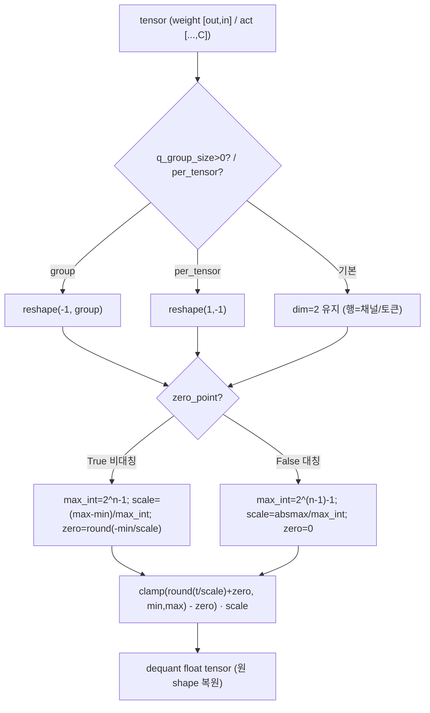
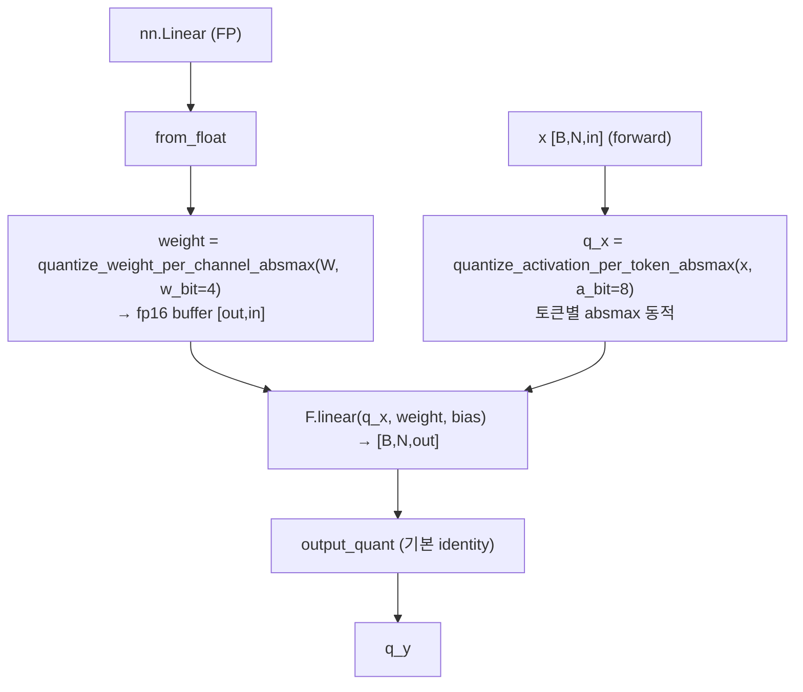
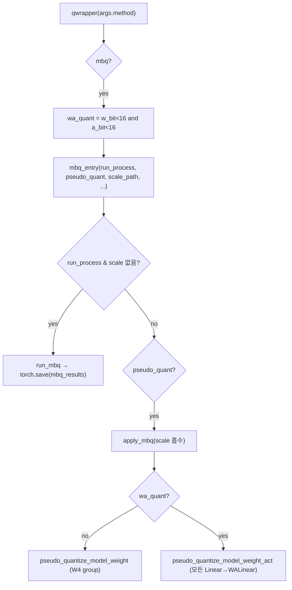
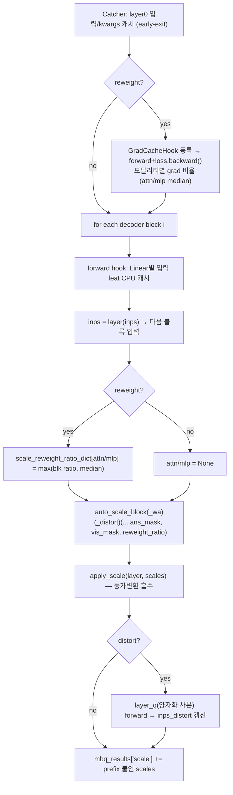
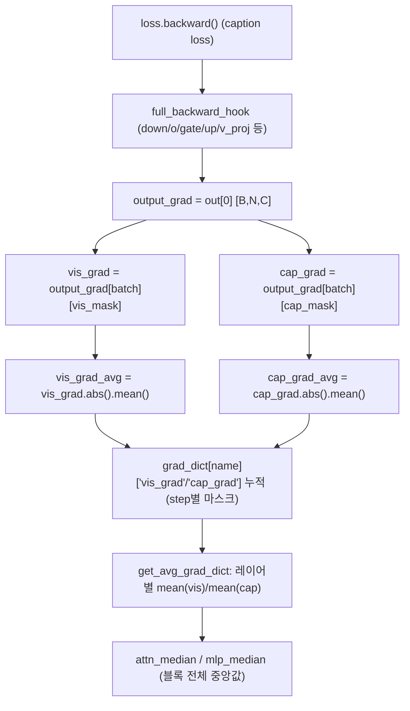
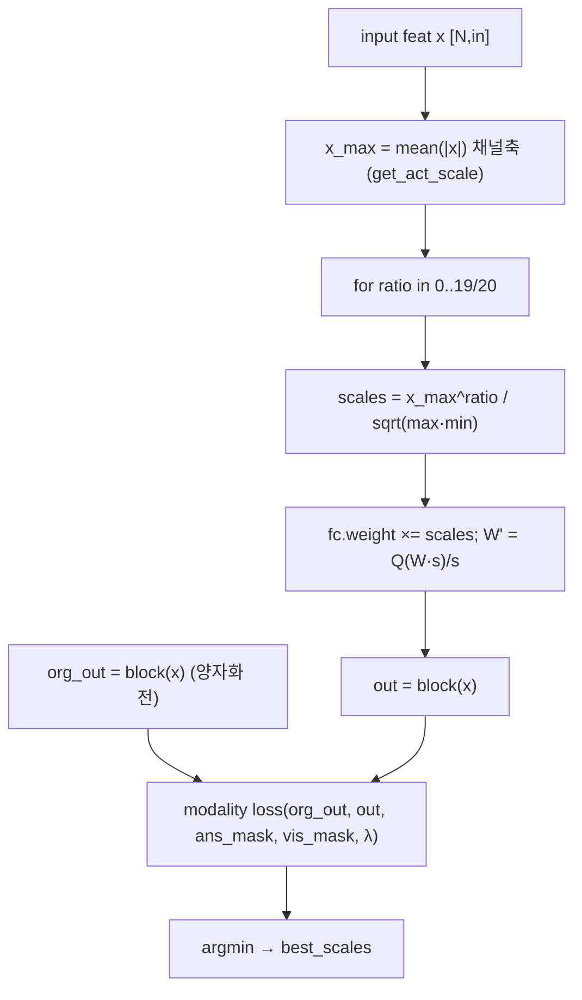
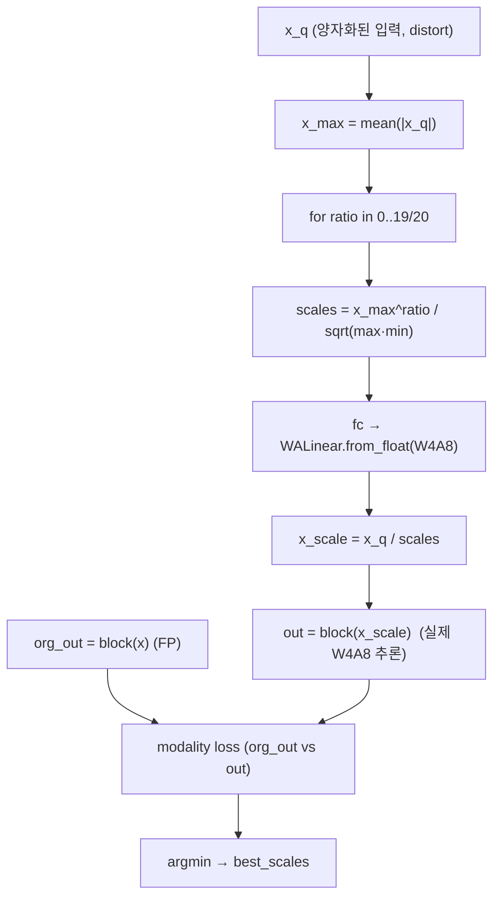
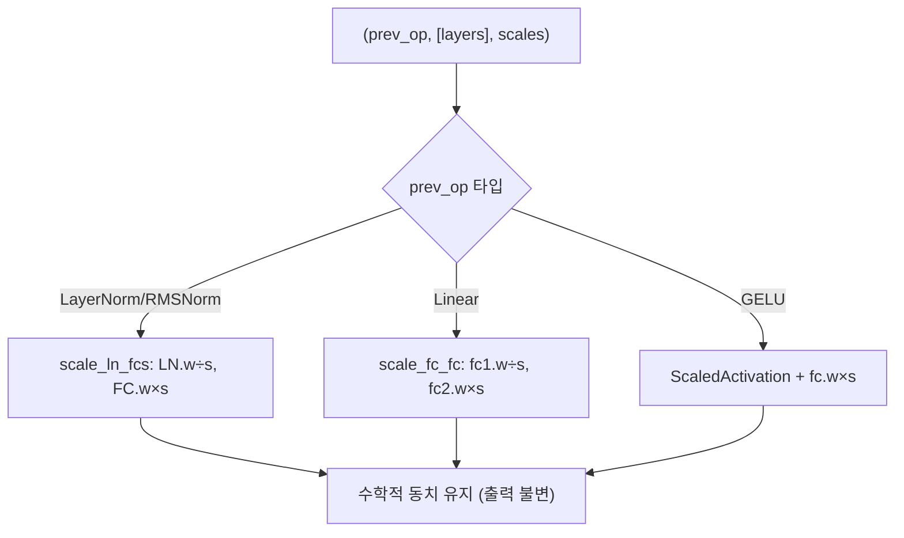
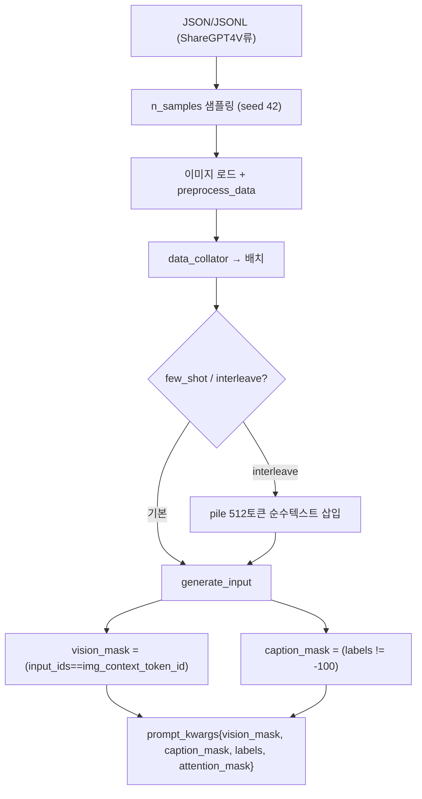

# MBQ 모듈 통합 가이드 (S-PyTorch)

> 1차 요약: [`../MBQ.md`](../MBQ.md) — 본 문서는 그 요약을 모듈 단위로 심화한 통합 가이드다.
> 분석 대상: `\\wsl.localhost\ubuntu-24.04\home\user\project\PRJXR-HBTXR\REF\ViT-Quantization\MBQ`
> 작성 원칙: 실제 소스 Read 후 `파일:라인` 근거 표기. 라인 근거 없는 추론은 "추정", 코드로 확인 불가는 "확인 불가"로 명시.
> 형제 가이드 [`../I-ViT/MODULE_GUIDE.md`](../I-ViT/MODULE_GUIDE.md)의 6요소 구조를 따르되, 본 repo는 **PTQ(학습 없음) + 대형 VLM**이므로 HW 지표(MAC lanes 등)는 **S-PyTorch 수치 규약**(params/FLOPs/activation memory/비트폭/모달리티 균형 손실)으로 치환한다.
> **핵심 차이(vs I-ViT)**: I-ViT는 integer-only **추론 커널 + QAT**(작은 ViT, ImageNet), MBQ는 **PTQ 스케일 서치 + fake-quant**(대형 VLM, LLM 디코더). I-ViT는 정수 비선형 HW화가 주제, MBQ는 **모달리티 민감도 균형**이 주제.

---

## 0. 문서 머리말

### 0.1 대표 케이스 선정 (대상 VLM · 모달리티)
- **대표 모델: `InternVL2-8B`** — README 전 예시 명령이 `pretrained="OpenGVLab/InternVL2-8B"`(`README.md:80,98,125,142`), 마스크 생성 래퍼(`generate_input`)가 가장 완비된 것이 InternVL2(`internvl2.py:432-485`). 양자화 대상은 **언어모델(LLM) 디코더 블록**: `model.language_model.model.layers`(`pre_quant.py:122-123`).
  - 8B 파라미터·레이어 수 등 **모델 규모 config는 본 repo에 미포함**(HF 원격 로드, `README.md:38`) → params/레이어 수치는 **확인 불가**, HF config 근거 시에만 인용. 본 가이드는 **블록 구조·연산 종류·비트폭**을 정량의 1차 근거로 삼고, 절대 규모는 "config 근거 없음→확인 불가"로 표기.
- **대표 분석 단위: LLaMA/Qwen2 계열 디코더 블록 1개** = `input_layernorm → self_attn(q/k/v_proj → o_proj) → post_attention_layernorm → mlp(gate_proj·up_proj → down_proj)` (`auto_scale.py:258-302`). 양자화 서치는 이 블록을 디코더 깊이만큼 순차 처리(`pre_quant.py:317`).
- **대표 모달리티 2종**:
  - **vision 토큰** — 이미지 컨텍스트 토큰 위치(`input_ids == img_context_token_id`)로 식별, `vision_mask`(`internvl2.py:457,469`).
  - **caption/answer 토큰** — 학습 라벨이 ignore(-100)가 아닌 위치, `caption_mask = (labels != -100)`(`internvl2.py:470`). MBQ 손실/grad가 이 두 마스크로 출력 오차를 **분리·가중**한다(`auto_scale.py:164-183`, `pre_quant.py:30-105`).

### 0.2 S-PyTorch 수치 규약 (HW의 MAC lanes/scalar MACs 대체)
- **params**: 모듈 차원에서 분석. Linear `in·out (+out bias)`. 단 **대형 VLM의 절대 in/out 차원은 HF config에 있고 repo에 없음** → 본 repo로는 **레이어 종류·개수만 확정**(qkv/o/gate/up/down = 블록당 Linear 5~7개, `auto_scale.py:258-302`). 절대 params는 config 근거 없으면 "확인 불가". MBQ는 가중치를 fake-quant로 덮어쓰므로(`quant_funcs.py:30-45`) **params 개수는 FP 원본과 동일**(추가 학습 파라미터 없음, 스케일은 가중치에 흡수).
- **FLOPs/MACs**: 표준식×config. Linear MAC = `B·N·in·out`. **N(토큰 수) = vision + caption + (interleave 시 순수텍스트 512)** — 캘리브레이션 시퀀스 길이는 데이터 의존(`coco_vl.py:84-93`). 절대 MAC은 config·시퀀스 길이 근거 시에만 산출, 그 외 "확인 불가".
- **activation memory**: 텐서 shape × 비트폭. MBQ는 fake-quant라 실제 저장은 FP16(`qlinear.py:14-15`)이지만 **정수 도메인 비트폭(W/A)**을 "HW 환산 activation bit"로 표기. 서치 중 input feature는 **CPU로 캐시**(`pre_quant.py:325-326`)되어 GPU 메모리를 절약.
- **비트폭/observer**: 코드 직접. 기본 weight-only `W4 g128`(`README.md:88-89`, `entry.py:8`), W·A는 `W4A8`(`README.md:105-106`). weight per-channel 대칭 absmax, activation per-token 동적 absmax(`qlinear.py:55,61-62` + `quant_funcs.py:23-28`). **observer = 동적(매 forward absmax)** — running-stat 없음(PTQ + fake-quant). 비대칭(zero_point) 기본 True(weight-only group), 대칭은 absmax(W·A 경로).
- **모달리티 균형 손실**: §6에서 코드 수식. **본 repo의 핵심 차별점**.
- **GPTQ/calibration**: MBQ는 **GPTQ가 아니라 AWQ식 activation-aware scaling 그리드 서치**(`auto_scale.py:125-135`) + 모달리티 손실. calibration = COCO/ShareGPT4V 멀티모달 + (옵션) pile 순수텍스트(`coco_vl.py:14-97`).
- **정확도/속도**: README에 정확도 표 **없음**(설치·명령만). 본 세션 미실행 → 정확도·속도 모두 **확인 불가**.

### 0.3 운영 경로 (PTQ 스케일 서치 → 캐시 → fake-quant 평가)
```
[VLM 로드] lmms-eval get_model → create_from_arg_string (HF pretrained)   (main_quant.py:104-111)
   │  process_model = Process_ModelClass(lm._model, tokenizer, processor)  (:114-117)
   ▼
[캘리브레이션 생성] coco(멀티모달) 또는 pileval(순수텍스트)               (main_quant.py:123-132)
   │  generate_input → vision_mask / caption_mask 동봉                     (internvl2.py:469-483)
   ▼
[양자화 디스패치] qwrapper(args.method)                                    (quant_wrapper.py:8-30)
   │  mbq: wa_quant = (w_bit<16 and a_bit<16)                              (:14)
   ▼
[MBQ 스케일 서치] run_mbq: Catcher로 layer0 입력 캐치 →                     (pre_quant.py:199-477)
   │  (reweight) grad backward로 모달리티 민감도 측정    (:265-305)
   │  블록 루프: input feat 캐시 → auto_scale_block(_wa)(_distort) → apply_scale  (:317-461)
   │  → torch.save(mbq_results) [스케일만 저장]          (entry.py:43)
   ▼
[fake-quant 적용] apply_mbq(스케일 흡수) → pseudo_quantize_model_weight(_act)  (entry.py:46-55)
   ▼
[평가] main.py + lmms-eval 태스크(mmmu 등)로 fake-quant 모델 평가          (README.md:113-153)
```
- 타깃 디바이스: **CUDA GPU 전제** — `layers[0].cuda()`/`move_embed(..,"cuda")`(`pre_quant.py:222-223`), `vis_mask_expand.cuda()`(`auto_scale.py:147,167`), `WALinear(dev='cuda')`(`qlinear.py:7`). 서치 중 레이어를 GPU↔CPU로 스왑(`pre_quant.py:319,471`, `model.to_cpu()/to_cuda()` `entry.py:25,57`)해 8B+ 모델 메모리를 관리.

### 0.4 모델 / 데이터셋 / 정확도 (README 인용)
| 항목 | 값 | 근거 |
|---|---|---|
| 지원 VLM | `internvl2`, `llava_onevision`, `llava`(v1.5), `qwen2_vl` (CLI), 코드상 `vila`(LlavaLlamaModel)도 매핑 | `README.md:37`; `pre_quant.py:118-127` |
| 양자화 대상 | LLM 디코더 Linear (qkv/o/gate/up/down) | `pre_quant.py:74,122-123`; `auto_scale.py:258-302` |
| 캘리브레이션 | `coco`(ShareGPT4V류 JSON/JSONL+이미지) / `pileval`(순수텍스트) | `README.md:42-46`; `coco_vl.py:24-31` |
| n_samples | 기본 128 | `README.md:84`; `main_quant.py:51` |
| 비트폭 | weight-only `W4 g128`, W·A `W4A8` | `README.md:88-89,105-106` |
| 평가 태스크 | lmms-eval `mmmu` 등 | `README.md:126` |
| **정확도 수치** | **README에 표 없음 → 확인 불가** | `README.md` 전체(정확도 표 부재) |
| **속도/메모리 실측** | **본 세션 미실행 → 확인 불가** | — |
- 데이터셋 주의: COCO 이미지/JSON 경로는 사용자 제공(`--data_path`, `--image_folder`, `README.md:44-47`), repo에 데이터 미포함.

---

## 1. Repo / Layer 개요

MBQ = 대형 VLM(MLLM)을 **PTQ로 저비트 양자화**하면서 vision/language 모달리티 양자화 민감도 불균형을 보정하는 프레임워크(`README.md:1`, arXiv:2412.19509 `:1,157-165`). 구조적으로는 **AWQ(activation-aware weight scaling)의 그리드 서치를 그대로 차용**하고, 그 위에 (a) 모달리티 분리 손실, (b) grad 기반 reweight, (c) distort(누적 양자화 오차) 입력의 3요소를 추가한다. 모델 정의·평가 파이프라인은 외부(transformers/lmms-eval/LLaVA-NeXT)를 임포트하고, **자체 소스는 `qmllm/` 내 양자화 코어**다.

### 1.1 자체 소스 vs 외부 프레임워크 vs 제외

| 구분 | 파일(자체 소스) | 역할 |
|---|---|---|
| **양자화 기반함수** | `qmllm/quantization/quant_funcs.py` | pseudo_quantize_tensor(대칭/비대칭, per-tensor/group/channel/token) |
| **W·A Linear** | `qmllm/quantization/qlinear.py` | WALinear(weight 정적 + activation 동적 양자화) |
| **디스패처** | `qmllm/quantization/quant_wrapper.py` | mbq/awq/smoothquant/rtn 분기 |
| **MBQ 본체** ★핵심 | `qmllm/methods/mbq/quantize/pre_quant.py` | run_mbq(블록 루프), GradCacheHook(모달리티 민감도), Catcher |
| | `…/mbq/quantize/auto_scale.py` | AWQ식 스케일 서치 + **모달리티 균형 손실** + apply_scale |
| | `…/mbq/quantize/auto_scale_wa.py`, `auto_scale_distort.py`, `auto_scale_wa_distort.py` | W·A 인지 / distort(누적오차) / 둘 다 변형 |
| | `…/mbq/quantize/quantizer.py`, `qmodule.py`, `entry.py` | weight·W·A 일괄 양자화, ScaledActivation, 진입점 |
| **비교 메소드** | `…/methods/awq/`, `smoothquant/`, `rtn/` | AWQ·SmoothQuant(ViT smooth 포함)·RTN |
| **캘리브레이션** | `qmllm/calibration/{coco_vl,pileval}.py` | 멀티모달/순수텍스트 캘리브 데이터 |
| **모델 래퍼** | `qmllm/models/{internvl2,llava_*,vila,qwen2_vl}/*.py` | VLM별 마스크 생성·전처리(양자화 연동부만) |
| **진입점** | `main_quant.py`(서치), `main.py`(평가) | CLI/YAML |

### 1.2 진입점 / forward 경로
`main_quant.py:138 → cli_quant → cli_quant_single`(`:99`): VLM 로드 → `get_multimodal_calib_dataset`(`:126`) → `qwrapper`(`:135`) → `mbq_entry`(`quant_wrapper.py:15`) → `run_mbq`(`entry.py:26`). 서치 핵심은 `run_mbq`(`pre_quant.py:199`)의 **디코더 블록 순차 루프**(`:317`).

### 1.3 제외 (지시에 따라 이름만 표기, 미분석)
- **외부 프레임워크(커스텀 아님)**: `transformers`(bloom/opt/llama/qwen2/mistral/mixtral/falcon/clip 모델 정의, `pre_quant.py:12-14`, `smooth.py:4-17`), `lmms_eval`(모델 로드/평가, `main_quant.py:18`), `3rdparty/LLaVA-NeXT`·`lmms-eval`(**repo 미포함**, 설치 안내만 `README.md:15-28`).
- **모델 정의 본문**: `models/*/` 내 HF VLM 원본 forward·conversation·tokenizer·constants — 이식 코드이므로 **양자화 연동부(마스크 생성)만** 요약(§11).
- **외부 가중치**: HF `OpenGVLab/InternVL2-8B` 등 사전학습 체크포인트 — 로드만, 코드는 본 repo.
- **사실상 빈 파일**: `qmllm/sensitive/gen_grad.py`(1줄) — grad 로직은 `pre_quant.py`의 `GradCacheHook`에 인라인(확인: §6).
- **미열람(확인 불가)**: `main.py` 본문(README 명령으로 흐름만), `datasets/multimodal_dataset.py`, `models/*/dataset.py` 전처리 세부, `auto_scale_wa.py`·`auto_scale_distort.py`(wa_distort/auto_scale와 동형 구조로 추정 — wa는 distort 없는 W·A, distort는 weight-only distort).

---

## 2. 모듈: 기본 양자화 함수 — `quant_funcs.py` (pseudo_quantize_tensor)

### 2.1 역할 + 상위/하위
- **역할**: weight/activation/KV의 **공통 fake-quant 함수**. group/per-tensor/대칭/비대칭을 인자로 분기. 양자화→역양자화를 한 번에 수행하고 **dequant된 float만 반환**(실제 INT 패킹 없음).
- **상위**: `WALinear.from_float`(weight, `qlinear.py:62-66`), `auto_scale.py`의 `w_quantize_func`(`:94-99`), `quantizer.py`(일괄, `:74`), RTN(`rtn/quantizer.py`). **하위**: torch round/clamp.

### 2.2 데이터플로우 (텐서 shape 흐름)


### 2.3 forward call stack
`WALinear.from_float`(`qlinear.py:62`) → `quantize_weight_per_channel_absmax`(`quant_funcs.py:49`) → `pseudo_quantize_tensor`(`:4`) → round/clamp(`:32` 또는 `:36`).

### 2.4 대표 코드 위치
`quant_funcs.py`: `pseudo_quantize_tensor` `:3-45`, 비대칭 `:15-21`, 대칭 `:22-28`, fake-quant 적용 `:30-37`, **scale/zero 미반환(주석)** `:43-45`. per-channel/token 래퍼 `:48-77`.

### 2.5 대표 코드 블록
```python
# quant_funcs.py:15-28  비대칭(zero_point=True) vs 대칭(False)
if zero_point:                                    # 비대칭
    max_val = tensor.amax(dim=1, keepdim=True); min_val = tensor.amin(dim=1, keepdim=True)
    max_int = 2**n_bits - 1; min_int = 0
    scales = (max_val - min_val).clamp(min=1e-5) / max_int
    zeros = (-torch.round(min_val / scales)).clamp_(min_int, max_int)
else:                                             # 대칭 absmax
    max_val = tensor.abs().amax(dim=1, keepdim=True).clamp(min=1e-5)
    max_int = 2 ** (n_bits - 1) - 1; min_int = -(2 ** (n_bits - 1))
    scales = max_val / max_int; zeros = 0
```
→ weight-only group 경로는 **비대칭**(zero_point 기본 True, `entry.py:16`), W·A 경로의 weight per-channel·act per-token은 **대칭**(래퍼가 `zero_point=False`, `quant_funcs.py:49,57`).

```python
# quant_funcs.py:35-45  fake-quant: dequant된 float만 반환 (INT 저장 아님)
tensor = (torch.clamp(torch.round(tensor / scales) + zeros, min_int, max_int) - zeros) * scales
...
# return tensor, scales.view(...), zeros.view(...)   # ← 주석 처리: scale/zero 미반환
return tensor
```
→ **실제 INT 커널·패킹이 없는 fake quant**. 정확도 검증용이지 속도/메모리 이득은 별도 추론엔진 필요(한계, §N+2). FPGA 관점에선 scale/zero 정의식만 차용(§N+3).

### 2.6 연산·수치표현 분해 + 정량
- **양자화 방식**: 비대칭(min/max, zero≠0) 또는 대칭(absmax, zero=0). per-group(`q_group_size=128`)/per-tensor/per-channel(group=-1)/per-token.
- **scale/zp**: 비대칭 `scale=(max-min)/(2^n-1)`, `zero=round(-min/scale)`; 대칭 `scale=absmax/(2^(n-1)-1)`, `zero=0`(`:18-28`).
- **비트폭**: 호출처 인자(weight 4, act 8 기본).
- **params**: 0 (순수 함수).
- **FLOPs**: 원소수 N에 div+round+clamp+mul = O(N). group 양자화는 그룹마다 amax/amin reduce 추가.
- **activation bit**: 출력 float이나 HW 환산 비트는 n_bits.

---

## 3. 모듈: W·A 동시 양자화 Linear — `qlinear.py` (WALinear)

### 3.1 역할 + 상위/하위
- **역할**: weight는 `from_float`에서 **정적 fake-quant**(fp16 buffer 저장), activation은 **forward 때 동적 양자화**(per-token/per-tensor absmax)하는 Linear. W·A(W4A8) 경로의 실제 추론 오차를 모사.
- **상위**: `pseudo_quantize_model_weight_act`(전체 교체, `quantizer.py:98`), `auto_scale_wa_distort`(서치 중 임시 교체, `auto_scale_wa_distort.py:130`), distort 출력 산출(`pre_quant.py:442`). **하위**: `quantize_weight_per_channel_absmax`, `quantize_activation_per_token_absmax`.

### 3.2 데이터플로우 (텐서 shape 흐름)


### 3.3 forward call stack
`pseudo_quantize_model_weight_act`(`quantizer.py:98`) → `WALinear.from_float`(`qlinear.py:54`) → weight 양자화(`:61-66`); 추론 시 `WALinear.forward`(`:47`) → `act_quant`(`:49`) → `F.linear`(`:50`).

### 3.4 대표 코드 위치
`qlinear.py`: 클래스 `:6-77`, weight fp16 buffer `:14-15`, act_quant 선택 `:22-31`, forward `:47-52`, from_float `:54-74`, `__repr__` `:76-77`.

### 3.5 대표 코드 블록
```python
# qlinear.py:47-52  forward: activation을 매번 동적 양자화 후 정수MAC 모사
@torch.no_grad()
def forward(self, x):
    q_x = self.act_quant(x)                      # per_token absmax (동적)
    y = torch.functional.F.linear(q_x, self.weight, self.bias)
    q_y = self.output_quant(y)                   # 기본 identity (:37-38)
    return q_y
```
```python
# qlinear.py:55-66  from_float: weight 정적 양자화 (per_channel 기본)
def from_float(module, weight_quant='per_channel', act_quant='per_token', w_bit=4, a_bit=8, weight_group=128, ...):
    new_module = WALinear(module.in_features, module.out_features, ...)
    if weight_quant == 'per_channel':
        new_module.weight = quantize_weight_per_channel_absmax(module.weight, n_bits=w_bit)
    elif weight_quant == 'per_group':
        new_module.weight = pseudo_quantize_tensor(module.weight, n_bits=w_bit, q_group_size=weight_group, inplace=True)
```
→ **MBQ의 W·A 고정 조합 = weight per-channel(대칭 absmax) + activation per-token(동적 대칭)**. group-wise activation은 미지원(한계).

### 3.6 연산·수치표현 분해 + 정량
- **양자화 방식**: weight per-channel 대칭 W4(정적), activation per-token 대칭 A8(동적, 토큰마다 absmax).
- **비트폭**: W4 / A8 기본(`from_float` 디폴트 `:55`, 실호출 `:98`).
- **params**: weight `out×in`(fp16 buffer), bias `out`. 개수는 원본 동일.
- **FLOPs**: MAC `B·N·in·out` + **act 양자화 오버헤드**(토큰당 absmax reduce + div/round). per-token 동적 양자화는 **토큰마다 absmax 회로**가 필요 → HW 비용 큼(§N+3).
- **activation bit**: 입력 A8(동적), 출력 기본 미양자화(`output_quant=identity`).

---

## 4. 모듈: 메소드 디스패처 + 진입점 — `quant_wrapper.py` / `mbq/entry.py`

### 4.1 역할 + 상위/하위
- **역할**: `args.method`로 4메소드 분기, mbq에 모달리티 고유 인자(reweight/distort/loss_mode) 전달. `mbq_entry`는 scale 캐시 유무로 **서치(run_mbq) ↔ 적용(apply_mbq+pseudo-quant)** 결정.
- **상위**: `main_quant.py:135`. **하위**: `run_mbq`, `apply_mbq`, `pseudo_quantize_model_weight(_act)`.

### 4.2 데이터플로우


### 4.3 forward call stack
`qwrapper`(`quant_wrapper.py:13`) → `mbq_entry`(`entry.py:8`) → `run_mbq`(`:26`) **또는** `apply_mbq`+`pseudo_quantize_model_weight(_act)`(`:48-55`).

### 4.4 대표 코드 위치
`quant_wrapper.py`: mbq 분기 `:13-25`, `wa_quant` 결정 `:14`. `entry.py`: q_config `:15-18`, 서치/저장 `:24-44`, 적용 `:46-55`.

### 4.5 대표 코드 블록
```python
# quant_wrapper.py:13-25  mbq에 모달리티 고유 인자 전달
elif args.method == "mbq":
    wa_quant = args.w_bit < 16 and args.a_bit < 16          # W·A vs weight-only 자동 결정
    model = mbq_entry(..., w_bit=args.w_bit, a_bit=args.a_bit, wa_quant=wa_quant,
                      reweight=args.reweight, distort=args.distort, loss_mode=args.loss_mode)
```
```python
# entry.py:46-55  적용 단계: 스케일 흡수 후 fake-quant
if pseudo_quant:
    mbq_results = torch.load(scale_path, map_location="cpu")
    apply_mbq(model.model, mbq_results)                     # 스케일을 가중치에 흡수
    if not wa_quant:
        pseudo_quantize_model_weight(model.model, w_bit=w_bit, q_config=q_config)   # weight-only
    else:
        pseudo_quantize_model_weight_act(model.model, w_bit=w_bit, a_bit=a_bit)     # 모든 Linear→WALinear
```
→ **서치 결과는 "스케일 리스트"만 저장**(`entry.py:43`), 적용 시 스케일을 등가변환으로 흡수 후 fake-quant. 서치/적용 분리 = 캐시 재사용·재현성.

### 4.6 연산·수치표현 분해 + 정량
- **양자화 방식**: 디스패치 로직(연산 없음). q_config = `{zero_point: True, q_group_size: 128}`(`entry.py:15-18`).
- **비트폭**: weight-only W4 g128 또는 W·A W4A8(README 명령 기준).
- **params**: 0.

---

## 5. 모듈: MBQ 본체 블록 루프 — `pre_quant.py` (run_mbq) ★핵심

### 5.1 역할 + 상위/하위
- **역할**: (1) Catcher로 디코더 layer0 입력 캐치, (2) reweight 시 grad로 모달리티 민감도 측정, (3) 디코더 블록 순차 루프 — Linear 입력 feature 캐시 → 4가지 auto_scale 중 하나로 스케일 서치 → `apply_scale` 즉시 흡수 → distort 시 양자화 출력을 다음 블록 입력으로 갱신, (4) 스케일 리스트 누적 반환.
- **상위**: `mbq_entry`(`entry.py:26`). **하위**: `auto_scale_block(_wa)(_distort)`, `apply_scale`, `GradCacheHook`, `get_blocks`/`move_embed`.

### 5.2 데이터플로우 (블록 루프)


### 5.3 forward call stack
`run_mbq`(`pre_quant.py:199`) → Catcher forward(`:233-236`) → (reweight) `GradCacheHook.register_hooks`+`loss.backward()`(`:270,288`) → 블록 루프(`:317`) → `auto_scale_block*`(`:379-430`) → `apply_scale`(`:433`) → (distort) `layer_q` forward(`:449,460`).

### 5.4 대표 코드 위치
`pre_quant.py`: Catcher `:228-251`, process_input(마스크 분리) `:190-196`, reweight grad `:265-305`, 블록 루프 `:317-477`, reweight ratio clip `:352-360`, auto_scale 4분기 `:377-430`, distort 입력 갱신 `:435-461`, 스케일 누적 `:463-466`.

### 5.5 대표 코드 블록
```python
# pre_quant.py:228-247  Catcher: layer0 입력+kwargs를 가로채고 early-exit (AWQ 패턴)
class Catcher(nn.Module):
    def forward(self, inp, **kwargs):
        inps.append(inp); layer_kwargs.update(kwargs)
        raise ValueError                              # 첫 블록 직후 중단
layers[0] = Catcher(layers[0])
inputs, vision_mask, caption_mask = process_input(prompt_inputs, prompt_kwargs)  # 마스크 분리
try: model(**inputs)
except ValueError: pass
```
```python
# pre_quant.py:352-360  reweight: 현재 블록의 grad 비율을 median으로 clip 후 전달
if str(i) in item_list:
    if "wo" in item_list or "o_proj" in item_list:
        scale_reweight_ratio_dict["attn"] = max((vis_avg_grad / cap_avg_grad), attn_median)
    elif "w2" in item_list or "down_proj" in item_list:
        scale_reweight_ratio_dict["mlp"]  = max((vis_avg_grad / cap_avg_grad), mlp_median)
```
```python
# pre_quant.py:435-461  distort: 양자화 사본 출력을 다음 블록 입력으로 (누적오차 반영)
if distort:
    layer_q = copy.deepcopy(layer).cuda()
    for n, m in named_linears_q.items():
        new_linear = WALinear.from_float(m, weight_quant="per_channel", act_quant="per_token", w_bit=w_bit, a_bit=a_bit)
        setattr(father_module, ..., new_linear)       # Linear→WALinear 교체 (W·A 경로)
    inps_distort = layer_q(inps_distort, **layer_kwargs)[0]   # 양자화 출력 = 다음 입력
```
→ **distort = 순차적 블록 재구성**: 다음 블록 입력으로 "이미 양자화된 출력"을 사용해 누적 오차를 서치에 반영. weight-only distort는 `pseudo_quantize_tensor`로 가중치만 덮어씀(`:456`).

### 5.6 연산·수치표현 분해 + 정량
- **양자화 방식**: 블록 단위 PTQ 서치. `@torch.no_grad`(`:199`)이되 reweight backward만 `torch.enable_grad`(`:272`) — **가중치 갱신은 없음**(grad는 민감도 측정용).
- **비트폭**: w_bit/a_bit 인자 전달(W4 / A8).
- **params**: 추가 학습 파라미터 0(스케일은 가중치에 흡수).
- **비용(추정)**: 블록 N개 × {n_grid=20 후보 × (forward 1회 + 손실)}; distort/wa는 후보마다 `deepcopy`+WALinear 교체+재forward로 **비용 가장 큼**(`auto_scale_wa_distort.py:118-145`). input feat은 CPU 캐시(`:325-326`)로 GPU 메모리 절약. 절대 시간은 미실행 → 확인 불가.
- **activation memory**: input feature를 블록마다 캐시 후 즉시 삭제(`:473`). 레이어 GPU↔CPU 스왑(`:319,471`).

---

## 6. 모듈: 모달리티 민감도 측정 — `pre_quant.py` (GradCacheHook) ★모달리티 균형 핵심

### 6.1 역할 + 상위/하위
- **역할**: 각 Linear의 **출력 grad**를 backward hook으로 받아 vision/caption 마스크로 인덱싱, `abs().mean()`을 모달리티별로 누적. 레이어별 `vis_avg_grad/cap_avg_grad` 비율이 **모달리티 민감도**를 정량화 → reweight λ의 근거.
- **상위**: `run_mbq`(reweight 경로, `:269-270`). **하위**: `register_full_backward_hook`.

### 6.2 데이터플로우


### 6.3 forward call stack
`run_mbq`(`:269`) → `GradCacheHook(vis_masks, cap_masks)`(`:30`) → `register_hooks`(`:72`) → backward 시 `cache_grad_hook`(`:41`) → `get_avg_grad_dict`(`:93`) → median(`:304-305`).

### 6.4 대표 코드 위치
`pre_quant.py`: 클래스 `:30-105`, hook 등록 대상 Linear `:74`, 모달리티 grad 분리 `:54-65`, 평균 `:93-105`, 비율 리스트·median `:298-305`.

### 6.5 대표 코드 블록
```python
# pre_quant.py:54-65  출력 grad를 vision/caption 마스크로 분리해 누적
for batch_idx in range(B):
    vis_mask = self.vis_masks[step]; cap_mask = self.cap_masks[step]
    vis_grad = output_grad[batch_idx][vis_mask]
    cap_grad = output_grad[batch_idx][cap_mask]
    self.grad_dict[name]["vis_grad"].append(vis_grad.abs().mean().detach().cpu())
    self.grad_dict[name]["cap_grad"].append(cap_grad.abs().mean().detach().cpu())
```
```python
# pre_quant.py:72-80  민감도 측정 대상 = attn out / mlp down / v·gate·up proj
if isinstance(m, nn.Linear) and any([_ in n for _ in
    ["wo","w2","down_proj","o_proj","v_proj","gate_proj","up_proj","w1","w3"]]):
    self.hooks.append(m.register_full_backward_hook(functools.partial(self.cache_grad_hook, name=...)))
```
```python
# pre_quant.py:298-305  attn/mlp 비율 리스트 → 블록 전체 중앙값을 baseline
for key_name in grad_avg_dict:
    if "down_" in key_name or "w2" in key_name:
        mlp_list.append(vis_avg_grad / cap_avg_grad)
    if "o_proj" in key_name or "wo" in key_name:
        attn_list.append(vis_avg_grad / cap_avg_grad)
attn_median = np.median(attn_list); mlp_median = np.median(mlp_list)
```
→ **vision grad가 caption grad보다 크면 비율>1 → 해당 블록 vision 손실에 가중**. median으로 clip(`max(ratio, median)`, §5.5)해 비전 가중이 baseline 아래로 떨어지지 않게 함. 이것이 "modality-balanced"의 직접 구현.

### 6.6 연산·수치표현 분해 + 정량
- **양자화 방식**: 양자화 아님 — **민감도 측정**(grad 통계). 가중치 갱신 없음(`:288` backward는 grad만).
- **비트폭**: 무관(FP grad).
- **params**: 0.
- **FLOPs**: backward 1패스(샘플당, mini_batch=1, `:273-288`) + 마스크 인덱싱 reduce. 샘플 수만큼 backward(`accum_steps`, `:275`).
- **시사**: grad 기반 모달리티 민감도 분석은 **어느 모달리티/레이어에 비트를 더 줄지 결정하는 도구**로 재사용 가치 높음(§N+3 XR).

---

## 7. 모듈: AWQ식 스케일 서치 + 모달리티 손실 — `auto_scale.py` (weight-only) ★핵심

### 7.1 역할 + 상위/하위
- **역할**: AWQ activation-aware scaling 그리드 서치(채널 스케일 `x_max^ratio` 20-grid) + **모달리티 균형 손실**(`loss_mode`×ans/vis 마스크×reweight). 블록별 prev_op→layers 매핑으로 LLaMA/Qwen2/OPT/Bloom 등 디코더 타입을 커버.
- **상위**: `run_mbq`(`:420`). **하위**: `pseudo_quantize_tensor`, `apply_scale`, `get_act_scale`.

### 7.2 데이터플로우 (스케일 서치 1쌍)


### 7.3 forward call stack
`auto_scale_block`(`:88`) → `_auto_get_scale`(`:201`) → `_search_module_scale`(`:110`) → `block(x)`(`:136`) → 손실 분기(`:144-183`) → `best_scales`(`:196`).

### 7.4 대표 코드 위치
`auto_scale.py`: 서치 `:110-199`, 스케일 후보 `:129-135`, **mse 손실** `:144-163`, **mae 손실** `:164-183`, LLaMA 블록 매핑 `:258-302`(reweight 분배 `:269,282,291,301`), `apply_scale` 등가변환 `:633-665`.

### 7.5 대표 코드 블록
```python
# auto_scale.py:129-135  AWQ 후보 스케일 (채널 outlier를 weight로 흡수)
scales = x_max.pow(ratio).clamp(min=1e-4).view(-1)
scales = scales / (scales.max() * scales.min()).sqrt()      # 정규화
for fc in linears2scale:
    fc.weight.mul_(scales.view(1, -1))
    fc.weight.data = w_quantize_func(fc.weight.data) / (scales.view(1, -1))   # Q(W·s)/s 등가
```
```python
# auto_scale.py:164-183  MBQ mae 모달리티 균형 손실 (차별점)
elif loss_mode == "mae":
    if ans_mask is not None and vis_mask is not None:
        ans_mask_expand = ans_mask.unsqueeze(-1).expand_as(out)
        vis_mask_expand = vis_mask.unsqueeze(-1).expand_as(out).cuda()
        masked_diff_ans = (org_out - out).float().abs() * ans_mask_expand
        masked_diff_vis = (org_out - out).float().abs() * vis_mask_expand
        if reweight_ratio is not None:
            loss = (masked_diff_ans.sum() + reweight_ratio * masked_diff_vis.sum()) \
                   / (ans_mask_expand.sum() + vis_mask_expand.sum())
```
→ **MBQ 손실** = `(L_ans + λ·L_vis)/(N_ans+N_vis)`, λ=reweight_ratio. mse는 `abs()→pow(2)`(`:144-163`). 마스크 없으면 일반 mean으로 폴백(`:180-183`).

```python
# auto_scale.py:258-302  LLaMA 디코더: prev_op→layers 매핑 + reweight 분배
# attn input: input_layernorm → [q/k/v_proj], reweight=attn      (:260-272)
# attn out  : v_proj → [o_proj], reweight=attn                   (:276-284)
# fc1       : post_attention_layernorm → [gate_proj, up_proj], reweight=mlp  (:286-294)
# fc2       : up_proj → [down_proj], reweight=mlp                (:296-302)
```

### 7.6 연산·수치표현 분해 + 정량
- **양자화 방식**: AWQ scaling + 모달리티 손실. 채널별 스케일을 weight에 흡수(등가변환), weight만 fake-quant(weight-only).
- **scale/zp**: 채널 스케일 `s = x_max^ratio / sqrt(max·min)`, n_grid=20(`:125`). weight 양자화는 `q_config`(비대칭 group).
- **비트폭**: weight w_bit(=4 g128), activation은 FP(weight-only).
- **params**: 0(스케일은 흡수).
- **FLOPs**: 쌍마다 forward 20회(n_grid). 블록당 쌍 4개(LLaMA, `:258-302`). 절대치는 N·in·out·20·4 — config 의존, 확인 불가.

### 7.7 AWQ 대비 차별 (코드 비교)
| 항목 | MBQ `auto_scale.py` | AWQ `awq/.../auto_scale.py` |
|---|---|---|
| 손실 | mae/mse 선택 + ans/vis 마스크 + reweight λ | **단일 mse, ans_mask만, λ 없음** (`awq …:144-151`) |
| 마스크 | vision + caption 둘 다 | caption(ans)만 |
| reweight | grad median 기반 λ | 없음 |
| distort | wa/weight-only 변형 존재 | 없음 |
→ **MBQ = AWQ + (vision 마스크 + grad reweight + distort)**.

---

## 8. 모듈: W·A / distort 변형 — `auto_scale_wa_distort.py` (외 3종)

### 8.1 역할 + 상위/하위
- **역할**: weight-only(`auto_scale`)에 (a) **W·A 양자화 인지**(후보마다 WALinear로 W4A8 적용 후 양자화 입력으로 forward → 실제 추론 오차 최적화), (b) **distort**(이전 블록까지의 누적 양자화 오차를 입력 feature에 반영) 두 축을 추가. 4조합: `auto_scale_block`(weight-only) / `_wa` / `_distort` / `_wa_distort`.
- **상위**: `run_mbq`(wa_quant/distort 분기, `:377-430`). **하위**: `WALinear.from_float`, `apply_scale`, `get_act_scale`.

### 8.2 데이터플로우 (wa_distort 서치)


### 8.3 forward call stack
`auto_scale_block_wa_distort`(`:93`) → `_auto_get_scale_wa_distort`(`:222`) → `_search_module_scale_wa_distort`(`:99`) → WALinear 교체(`:130`) → `block(x_scale)`(`:145`) → 손실(`:154-193`). distort 입력 재계산은 `_auto_get_input_feat_distort`(`:240`).

### 8.4 대표 코드 위치
`auto_scale_wa_distort.py`: 서치 `:99-220`, WALinear 적용 `:124-138`, 양자화 입력 `:140`, 손실(weight-only와 동형) `:154-193`, **distort 입력 재수집** `:240-287`, 블록 매핑 `:290-803`.

### 8.5 대표 코드 블록
```python
# auto_scale_wa_distort.py:124-145  후보마다 W4A8 적용 후 양자화 입력으로 forward
for fc, fc_name in zip(linears2scale, layers_name):
    fc.weight.mul_(scales.view(1, -1).to(fc.weight.device))
    new_fc = WALinear.from_float(fc, weight_quant="per_channel", act_quant="per_token", w_bit=w_bit, a_bit=a_bit)
    setattr(block, fc_name, new_fc)
x_scale = x_q / (scales.view(1, 1, -1))          # 양자화된 입력을 스케일로 나눠 등가
out = block(x_scale, **kwargs)                    # 실제 W4A8 추론 오차 측정
```
```python
# auto_scale_wa_distort.py:240-258  distort: deepcopy→스케일 적용→WALinear 교체→양자화 feat 수집
new_module = copy.deepcopy(module)
if scales_list is not None:
    apply_scale(new_module, scales_list)
    for n, m in named_linears.items():
        new_linear = WALinear.from_float(m, "per_channel", "per_token", w_bit, a_bit)
        setattr(father_module, ..., new_linear)   # 이전 sub-layer까지 양자화 반영
# forward hook으로 다음 sub-layer "양자화된 입력 feature" 수집
```
→ **wa = W·A 추론 오차 직접 최적화**, **distort = 누적 양자화 오차 인지**. 둘 다 후보마다 deepcopy/교체로 비용이 크다(한계).

### 8.6 연산·수치표현 분해 + 정량
- **양자화 방식**: W4A8(WALinear) 인지 서치. 손실식은 §7과 동일(모달리티 균형).
- **비트폭**: W4 / A8.
- **params**: 0(스케일 흡수).
- **FLOPs**: §7 대비 후보마다 **WALinear 변환 + 재forward** 추가 → 가장 비쌈. 절대치 확인 불가.

---

## 9. 모듈: 일괄 양자화 + 등가변환 적용 — `quantizer.py` / `apply_scale`

### 9.1 역할 + 상위/하위
- **역할**: 서치된 스케일을 **등가변환으로 가중치에 흡수**(`apply_scale`), 이후 전 Linear를 일괄 fake-quant(weight-only) 또는 WALinear 교체(W·A).
- **상위**: `apply_mbq`(`pre_quant.py:480-481`), `entry.py:52-55`. **하위**: `scale_ln_fcs`/`scale_fc_fc`/`scale_gelu_fc`, `pseudo_quantize_tensor`, `WALinear.from_float`.

### 9.2 데이터플로우 (등가변환)


### 9.3 forward call stack
`apply_mbq`(`pre_quant.py:481`) → `apply_scale`(`auto_scale.py:633`) → `scale_ln_fcs`(`:36`)/`scale_fc_fc`(`:57`)/`scale_gelu_fc`(`:78`).

### 9.4 대표 코드 위치
`auto_scale.py`: `apply_scale` `:633-665`, 등가변환 3종 `:36-86`. `quantizer.py`: weight 일괄 `:61-77`, W·A 일괄 `:86-102`. `qmodule.py`: `ScaledActivation` `:24-31`.

### 9.5 대표 코드 블록
```python
# auto_scale.py:643-651  prev_op 타입별 등가변환 (출력 불변)
if isinstance(prev_op, nn.Linear):
    scale_fc_fc(prev_op, layers[0], scales)
elif isinstance(prev_op, (nn.LayerNorm, LlamaRMSNorm)) or prev_op.__class__.__name__ in ("InternLM2RMSNorm","Qwen2RMSNorm"):
    scale_ln_fcs(prev_op, layers, scales)             # LN.weight÷s, FC.weight×s
elif isinstance(prev_op, (nn.GELU, BloomGelu, GELUActivation)):
    set_op_by_name(module, prev_op_name, ScaledActivation(prev_op, scales))
    scale_gelu_fc(prev_op, layers[0], scales)
```
```python
# quantizer.py:96-100  W·A: 모든 Linear를 WALinear로 교체
new_linear = WALinear.from_float(m, weight_quant="per_channel", act_quant="per_token", w_bit=w_bit, a_bit=a_bit)
setattr(father_module, n.split('.')[-1], new_linear)
```
→ **스케일을 LN/FC/GELU에 흡수**해 추론 시 추가 연산 0(채널 상수배는 인접 weight에 미리 곱함). FPGA에서 가중치 ROM에 사전 흡수하는 발상과 동일(§N+3).

### 9.6 연산·수치표현 분해 + 정량
- **양자화 방식**: 등가 스케일 흡수 + fake-quant. ScaledActivation은 `act(x)/scales`(`qmodule.py:31`).
- **비트폭**: weight w_bit, W·A 시 A8.
- **params**: ScaledActivation의 scales가 nn.Parameter로 추가(`qmodule.py:28`) — GELU 경로만, 그 외 0.

---

## 10. 모듈: 캘리브레이션 + 모달리티 마스크 — `coco_vl.py` / `internvl2.py`

### 10.1 역할 + 상위/하위
- **역할**: 멀티모달 캘리브 데이터(이미지+텍스트) 또는 순수텍스트(pile)를 만들고, VLM 래퍼가 입력 임베딩 + **vision_mask/caption_mask**를 생성해 MBQ 손실·grad의 입력으로 제공.
- **상위**: `main_quant.py:126`(coco), `:124`(pileval). **하위**: `model.preprocess_data`/`data_collator`/`generate_input`(모델별).

### 10.2 데이터플로우


### 10.3 forward call stack
`get_multimodal_calib_dataset`(`coco_vl.py:14`) → `model.preprocess_data`(`:60`) → `data_collator`(`:63`) → (interleave) pile 512토큰(`:84-93`) → `generate_input`(`:95`) → `internvl2.py:432` 마스크 생성(`:469-470`).

### 10.4 대표 코드 위치
`coco_vl.py`: 샘플링 `:24-61`, interleave 512토큰 `:84-93`, 마스크 동봉 반환 `:95-97`. `internvl2.py`: `generate_input` `:432-485`, vision/answer 마스크 `:469-470`, prompt_kwargs `:478-483`.

### 10.5 대표 코드 블록
```python
# internvl2.py:457-470  vision_mask(이미지토큰) / caption_mask(answer 라벨)
selected = (input_ids == self.model.img_context_token_id)
input_embeds[selected] = input_embeds[selected]*0.0 + vit_embeds.reshape(-1, C)   # 이미지토큰에 ViT 특징 주입
vision_mask = selected.reshape(B, N)              # 비전 토큰 위치
answer_mask = (labels != -100)                    # 캡션/정답 토큰 (ignore 제외)
```
```python
# coco_vl.py:84-93  interleave: 이미지-텍스트 사이 순수텍스트 512토큰 삽입
if len(line_encoded) > 512:
    sample = torch.tensor(line_encoded[:512]); samples.append(sample); n_run += 1
if n_run == 128: break
examples = model.interleave_data_samples(examples, pure_text=pure_text)
```
→ **모달리티 마스크가 MBQ 손실/grad의 입력**(§6, §7). interleave는 순수텍스트를 섞어 캘리브 분포를 보강.

### 10.6 연산·수치표현 분해 + 정량
- **양자화 방식**: 양자화 아님(데이터 준비). 마스크는 bool 텐서.
- **params**: 0.
- **시사**: 비전/텍스트 토큰 분리 마스크는 XR에서 "시각 입력 vs 메타 텍스트" 경로 분리의 직접 모델(§N+3).

---

## 11. 모듈: VLM 래퍼 양자화 연동 범위 — `models/*` (요약)

### 11.1 역할 + 상위/하위
- **역할**: VLM별로 디코더 블록 경로(`get_blocks`)·임베딩(`move_embed`)·마스크 생성(`generate_input`)을 제공. **양자화 대상은 LLM 디코더 Linear에 한정**(비전 인코더는 MBQ 경로 대상 아님).
- **상위**: `run_mbq`(`get_blocks`/`move_embed`). **하위**: HF VLM 정의(제외).

### 11.2 디코더 블록 경로 매핑 (코드)
```python
# pre_quant.py:112-142  VLM별 LLM 디코더 레이어 경로
InternVLChatModel             → model.language_model.model.layers   (:122-123)
LlavaLlamaForCausalLM/Qwen    → model.model.layers                  (:115-119)
Qwen2VLForConditionalGen.     → model.model.layers                  (:124-125)
LlavaLlamaModel(VILA)         → model.llm.model.layers              (:126-127)
```
→ **비전 인코더(ViT)는 get_blocks에 없음** → MBQ는 언어모델만 양자화. ViT smooth는 SmoothQuant `smooth_vit`(CLIP/SigLIP)에만 존재(`smooth.py:208-272`).

### 11.3 정량
- **params/MACs**: 절대 규모는 HF config 의존(repo 미포함) → **확인 불가**. 본 repo로는 **블록당 Linear 5~7개(qkv/o/gate/up/down)**·디코더 깊이만 확정(`auto_scale.py:258-302`).

---

## N+1. 모듈 한눈 요약 표

| 모듈 | 파일:라인 | 역할 | 양자화/방식 | 대표 정량·근거 |
|---|---|---|---|---|
| pseudo_quantize_tensor | quant_funcs.py:3-45 | 공통 fake-quant | 대칭/비대칭, group/tensor/channel/token | params 0, INT 커널 없음(:43-45) |
| WALinear | qlinear.py:6-77 | W 정적+A 동적 Linear | W4 per-ch 대칭 + A8 per-token 동적 | act absmax 회로 필요(:49) |
| qwrapper/mbq_entry | quant_wrapper.py:13-25, entry.py:8-58 | 디스패치·서치/적용 | wa_quant=w<16&a<16 | 스케일만 저장(entry.py:43) |
| run_mbq | pre_quant.py:199-477 | 블록 루프 PTQ 서치 | @no_grad, 가중치 갱신 없음 | n_grid20×블록N, distort 최비용 |
| GradCacheHook | pre_quant.py:30-105 | 모달리티 민감도 측정 | grad 비율 vis/cap | median clip(:304-305) |
| auto_scale_block | auto_scale.py:88-302 | AWQ 서치+모달리티 손실 | s=x_max^r, (L_ans+λL_vis)/(N) | mae/mse(:144-183) |
| auto_scale_*_wa/distort | auto_scale_wa_distort.py:93-287 | W·A 인지 / 누적오차 distort | 후보마다 WALinear 재forward | deepcopy 비용 큼(:240-287) |
| apply_scale | auto_scale.py:633-665 | 등가 스케일 흡수 | LN/FC/GELU 흡수, 출력불변 | ScaledActivation(qmodule.py:31) |
| quantizer | quantizer.py:61-102 | 일괄 weight/W·A 양자화 | weight-only / Linear→WALinear | per-ch+per-token 고정 |
| coco_vl/internvl2 | coco_vl.py:14-97, internvl2.py:432-485 | 캘리브+모달리티 마스크 | vision_mask/caption_mask | (labels!=-100), img_token(:469-470) |
| AWQ/SmoothQuant/RTN | awq/…:144-151, smooth.py:35-272, rtn/… | 비교 메소드 | AWQ=ans만/single mse; SQ=ViT smooth | MBQ=AWQ+mask+reweight+distort |

---

## N+2. 평가 / 캘리브레이션 / 재현 명령

- **데이터셋**: `coco`(ShareGPT4V류 JSON/JSONL + 이미지, 사용자 제공) / `pileval`(`mit-han-lab/pile-val-backup`). n_samples 128(`README.md:45-46,84`).
- **양자화 서치(weight-only W4 g128)**:
  ```bash
  python3 -W ignore main_quant.py --model internvl2 \
    --model_args pretrained="OpenGVLab/InternVL2-8B" \
    --calib_data coco --data_path <DIR> --image_folder <DIR> --n_samples 128 \
    --interleave_format --method mbq --run_process \
    --w_bit 4 --w_group 128 --reweight --loss_mode mae \
    --scale_path scale_cache/mbq/internvl2_w4g128.pt
  ```
  (`README.md:78-93`)
- **양자화 서치(W·A W4A8)**: 위에 `--a_bit 8 --distort` 추가, `--w_group` 제거(`README.md:96-110`).
- **평가**: `main.py` + lmms-eval `--tasks mmmu --pseudo_quant --scale_path ...`(`README.md:123-153`). main.py 본문 **미정독**(확인 불가).
- **학습(파인튜닝) 없음** — 순수 PTQ. reweight backward만 grad 계산, **가중치 미갱신**(`pre_quant.py:199,272-288`).
- **정확도 수치**: README에 표 **부재** → **확인 불가**. 속도/메모리 실측도 미실행 → **확인 불가**.
- **의존성**: PyTorch, `transformers`(bloom/opt/llama/qwen2/mistral/mixtral/falcon/clip, `pre_quant.py:12-14`/`smooth.py:4-17`), `lmms-eval`·`LLaVA-NeXT`(3rdparty, repo 미포함), `datasets`/`accelerate`/numpy/tqdm/yaml/PIL(`coco_vl.py:7`, `main_quant.py:11-12`). **CUDA 필수**(0.3절 cuda 하드코딩 근거).

---

## N+3. 우리 프로젝트(FPGA ViT 가속 + XR 시선추적) 시사점 + VLM 양자화의 HW 함의

### N+3.1 모달리티별 비트 예산 차등 = XR 다중경로 양자화 설계 근거 (최우선)
- **GradCacheHook**(`pre_quant.py:30-105`)의 grad 기반 모달리티 민감도 측정 + **모달리티 균형 손실**(`auto_scale.py:164-183`)은, XR 시선추적에서 "시각 입력(eye/scene patch) 경로"와 "메타/텍스트(상태·명령) 경로"의 **비트 예산을 차등 배분**하는 직접 설계 모델. 민감 모달리티(grad 큰 쪽)에 비트/스케일을 더 주고, 둔감 모달리티는 더 공격적으로 압축 → FPGA 자원(LUT/DSP/BRAM) 한정 하에서 정확도-자원 최적 배분.
- 단 **MBQ는 LLM 디코더 중심**이라 ViT 인코더 가속(HG-PIPE 계열)에 코드 직접 재사용은 제한적. ViT 양자화는 SmoothQuant `smooth_vit`(CLIP/SigLIP, `smooth.py:208-272`)가 더 직접 참고점.

### N+3.2 AWQ 등가 스케일 흡수 = 가중치 ROM 사전 흡수
- `apply_scale`(`auto_scale.py:633-665`)의 LN/FC/GELU 채널 스케일 흡수 = **추론 시 추가 연산 0**(상수배를 인접 weight에 미리 곱함). FPGA에서 채널별 scale을 **가중치 ROM/상수에 사전 흡수**하면 런타임 scale 곱셈기 불필요. outlier를 weight로 흡수해 activation 동적범위를 줄이는 AWQ 발상(`:129-135`)은 **좁은 정수 폭(INT4/INT8)에서 정확도 유지** → FPGA 친화.

### N+3.3 per-token 동적 양자화는 HW 비용 — 정적 calibration 권장
- WALinear의 **activation per-token 동적 absmax**(`qlinear.py:49`, `quant_funcs.py:57`)는 토큰마다 absmax 산출 회로가 필요 → FPGA에서 비용 큼. 우리는 **per-tensor 또는 정적 calibration scale**(SmoothQuant식 미리 고정 scale, `smooth.py:35-46`)이 더 친화적. MBQ는 정확도 우선의 PTQ 연구 도구이지 HW 효율 설계가 아님(설계 시 정적화 필요).

### N+3.4 FPGA 친화도 평가 (vs I-ViT)
| 항목 | 평가 | 근거 |
|---|---|---|
| integer-only 추론 커널 | ✗ fake-quant만(dequant float) | `quant_funcs.py:43-45` |
| 정수 비선형(GELU/Softmax/LN) | ✗ 별도 정수 비선형 없음(HF 원본 사용) | I-ViT와 대비 |
| 등가 스케일 흡수 | ★★★ LN/FC/GELU 흡수 | `apply_scale:633-665` |
| outlier→weight 흡수(저비트) | ★★★ INT4 weight 친화 | `auto_scale.py:129-135` |
| activation 양자화 | ★ per-token 동적(HW 비용 큼) | `qlinear.py:49` |
| 모달리티 비트배분 도구 | ★★★ grad 민감도 분석 재사용 | `pre_quant.py:30-105` |
| 적용 규모 | LLM 디코더(대형), ViT 인코더 아님 | `pre_quant.py:122-123` |
- **요약**: I-ViT는 "정수 추론 HW 청사진", MBQ는 "**모달리티 인지 양자화 알고리즘·민감도 도구**". FPGA 직접 이식 가치는 I-ViT가 높고, MBQ는 **비트 예산 배분 전략·outlier 흡수·민감도 측정**에서 설계 가치.

### N+3.5 XR 시선추적 적용 (프로젝트 성격은 추정)
- VLM은 XR에서 "장면 이해+명령" 멀티모달에 쓰일 수 있고, MBQ의 모달리티 균형(비전≫텍스트 또는 역) 통찰은 시선추적 멀티모달 백본의 저비트화에 차용 가능. 단 본 repo는 INT 커널·ViT 인코더가 없어 실시간 FPGA 구동에는 **(a) 정적 calibration화, (b) ViT 인코더 양자화(I-ViT/SmoothQuant 병합), (c) 실제 INT 커널** 추가가 필요(추정).

---

## 부록. 근거 / 확인 불가

- **직접 코드 확인**: `quant_funcs.py`(전체), `qlinear.py`(전체), `quant_wrapper.py`(전체), `mbq/entry.py`(전체), `mbq/quantize/pre_quant.py`(전체), `auto_scale.py`(서치·손실·매핑·apply_scale), `auto_scale_wa_distort.py`(서치·distort), `quantizer.py`(전체), `qmodule.py`(전체), `coco_vl.py`(전체), `internvl2.py`(generate_input), `smooth.py`(smooth_ln_fcs·smooth_vit), `awq/.../auto_scale.py`(비교 손실), `main_quant.py`(CLI 흐름), README(명령/논문).
- **분석적 산출(검증 가능)**: 비트폭(W4/A8)·observer(per-channel 대칭/per-token 동적)·손실식·grad reweight식·블록 Linear 종류/개수는 코드 라인 직접. n_grid=20, n_samples=128, q_group=128 등 상수는 라인 인용.
- **추정**: distort/wa의 상대 비용 순위, auto_scale_wa·auto_scale_distort 세부(wa_distort/auto_scale와 동형 추정), 논문 원식 기호 1:1 매칭(PDF 부재), XR 적용·정적화 권장.
- **확인 불가(미열람/미실행/부재)**: 정확도·속도 실측(README 표 부재 + 미실행), 절대 params/MACs(HF config repo 미포함), `main.py` 본문, `datasets/*`·`models/*/dataset.py` 전처리 세부, `auto_scale_wa.py`/`auto_scale_distort.py` 전문, `sensitive/gen_grad.py`(1줄 빈 파일), 3rdparty(LLaVA-NeXT/lmms-eval, repo 미포함).
