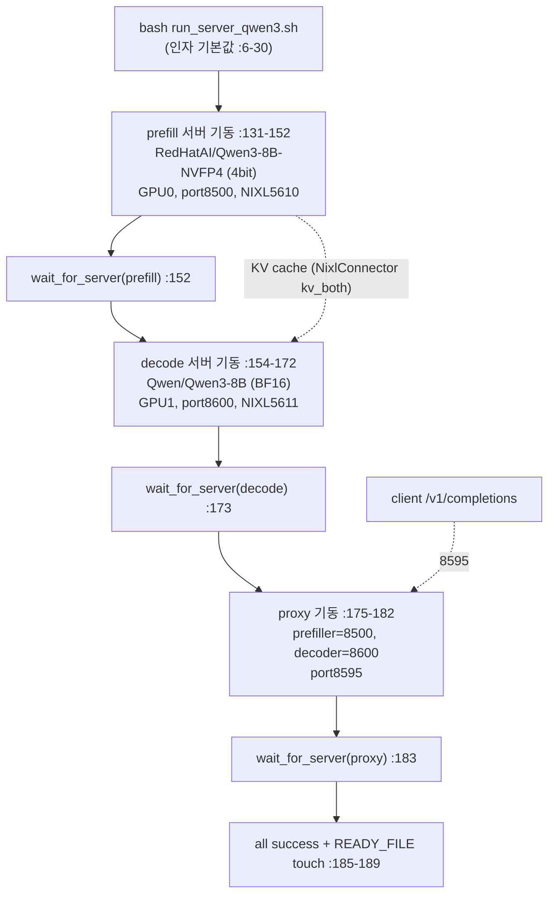
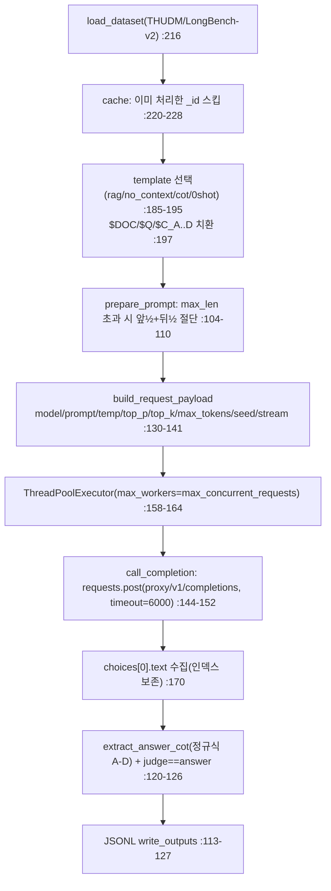
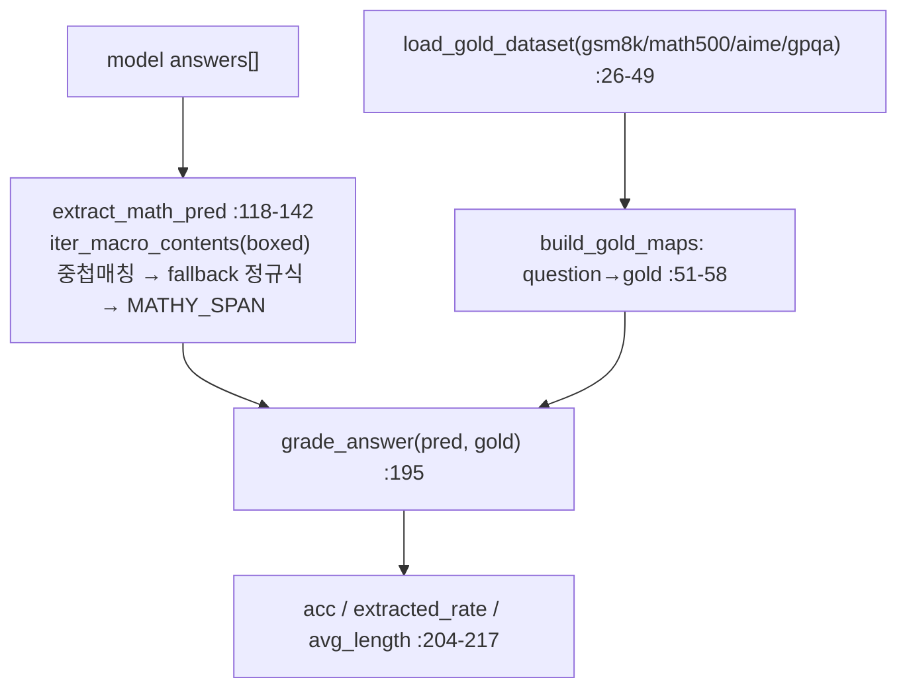
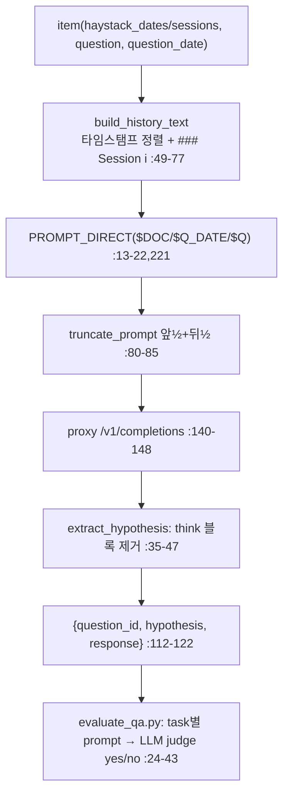

# Mix-Quant 모듈 통합 가이드 (S-PyTorch)

> 1차 요약: [`../Mix-Quant.md`](../Mix-Quant.md) — 본 문서는 그 요약을 모듈 단위로 심화한 통합 가이드다.
> 분석 대상: `\\wsl.localhost\ubuntu-24.04\home\user\project\PRJXR-HBTXR\REF\ViT-Quantization\Mix-Quant`
> 작성 원칙: 실제 소스 Read 후 `파일:라인` 근거 표기. 라인 근거 없는 추론은 "추정", 코드로 확인 불가는 "확인 불가"로 명시.
> 형제 S-PyTorch 가이드(`REF/Analysis/ViT-Quantization/I-ViT/MODULE_GUIDE.md`)의 6요소 구조(동형)를 따르되, HW 지표(MAC lanes/scalar MACs)는 **S-PyTorch 수치 규약**(params/FLOPs/activation memory/비트폭 탐색공간/할당 결과)으로 치환한다.

---

## 0. 문서 머리말

### 0.0 ★ 정체에 대한 솔직한 명시 (분석 전 필수 경고)
- 본 repo는 폴더 분류상 `ViT-Quantization/` 아래에 있으나, **실제 내용은 ViT(Vision Transformer)와 무관한 LLM(Qwen3-8B) 서빙·양자화 프로젝트**다. README 제목이 *"Mix-Quant: Quantized Prefilling, Precise Decoding for **Agentic LLMs**"* (`README.md:1-2,19`). ViT 관련 코드/모델/데이터셋은 자체 코드에서 **발견되지 않았다(확인)**.
- 따라서 I-ViT 가이드의 "정수 비선형/dyadic requant/QAT" 모듈 해부와 달리, 본 가이드의 모듈은 **분리 서빙 오케스트레이션 + 평가 클라이언트 + 채점기**로 구성된다. 이는 대상 repo의 실제 구조를 반영한 결과다.
- **혼합정밀(mixed-precision) 양자화의 핵심 알고리즘(NVFP4 커널·KV transfer·proxy 라우팅)은 자체 코드에 없고 `vllm/` 서브모듈(외부 프레임워크)에 위치**한다(`.gitmodules:1-4`, `run_server_qwen3.sh:35`). 지시(third_party 제외, 커스텀만)에 따라 vllm 내부는 이름만 언급하고 분석에서 제외한다.

### 0.1 대표 케이스 선정
- **대표 모델 구성: Qwen3-8B를 두 정밀도로 분리 서빙** — prefill = `RedHatAI/Qwen3-8B-NVFP4`(NVFP4, 4bit FP), decode = `Qwen/Qwen3-8B`(BF16, 16bit) (`run_server_qwen3.sh:7-8`, `README.md:75-76`). 근거: README Quick Start 기본 구성이며(`README.md:73-82`), 평가 러너 3종이 모두 served-model `Qwen/Qwen3-8B`/`Qwen3-8B` alias를 가정(`eval_qwen3_reasoning.sh:8`, `eval_qwen3_longbench-v2.sh:8`, `eval_qwen3_longmemeval.sh:8`).
- **대표 분석 단위: "phase-aware 추론 1회"** = `클라이언트가 proxy(8595)에 /v1/completions 전송 → proxy가 prefill 서버(8500, NVFP4)로 라우팅 → NixlConnector로 KV cache를 decode 서버(8600, BF16)로 전송 → BF16 autoregressive decode → 응답 반환`. 이 토폴로지가 Mix-Quant "혼합정밀" 전략의 **물리적 구현체**다(`run_server_qwen3.sh:131-183`, `README.md:28,68`).
- **대표 코드 3종**: ① 분리 서빙 오케스트레이터 `scripts/run_server_qwen3.sh`(혼합정밀의 실제 구현), ② 분리 서빙 평가 클라이언트 `evaluation/**/pred_mix.py`·`evaluate_mix.py`(HTTP 호출로 양자화/분리를 서버에 위임), ③ baseline `pred.py`·`evaluate.py`(로컬 단일정밀 `vllm.LLM`, 비교 기준).

### 0.2 S-PyTorch 수치 규약 (HW의 MAC lanes/scalar MACs 대체)
- **params**: Qwen3-8B 공칭 8B급 파라미터. 단, **자체 코드는 모델을 정의·로드하지 않는다**. 가중치는 외부 HF 체크포인트(`Qwen/Qwen3-8B`, `RedHatAI/Qwen3-8B-NVFP4`)를 `vllm serve`로 로드하므로(`run_server_qwen3.sh:137,160`), 본 가이드의 params/레이어 구조는 **자체 코드 근거 없음 → 확인 불가**(모델 정의는 vllm/HF 측). 자체 코드가 정의하는 파라미터는 **없음**(평가 스크립트는 학습 파라미터 0).
- **FLOPs/MACs**: 마찬가지로 모델 연산은 vllm 내부. 자체 코드의 "연산"은 토큰화·프롬프트 절단·HTTP I/O·정규식 채점뿐. **모델 FLOPs는 자체 코드로 산출 불가(확인 불가)**.
- **activation memory**: 자체 코드는 KV cache·activation을 직접 다루지 않음(서버가 보유). 단 **컨텍스트 길이 상한**(메모리 압박의 대리 지표)은 자체 config/스크립트에 명시 — `max-model-len 131072`(`run_server_qwen3.sh:15`), LongBench `maxlen 100000`(`model2maxlen.json:18`), LongMemEval `max_context_len 112000`(`eval_qwen3_longmemeval.sh:14`). 이를 "activation memory의 상한 대리값"으로 표기.
- **★ 비트폭 탐색공간**: Mix-Quant의 혼합정밀은 **레이어별 민감도 기반 탐색이 아니라 "추론 단계(phase)별 고정 매핑"**이다. 탐색공간 = `{prefill: NVFP4(4bit), decode: BF16(16bit)}`의 **2점 고정 매핑**(자유도 0). 근거 §2.6, §3.6. 레이어/토큰/민감도 기반 가변 비트할당 코드는 자체 코드에 **없음(확인, grep 전수)**.
- **★ 민감도 메트릭**: 자체 코드에 레이어 민감도(Hessian/SQNR/perturbation/KL 등) 계산 로직 **전무(확인)**. "민감한 단계는 고비트" 판단은 README의 정성적 설계 명제(prefill=compute-intensive→저비트 OK, decode=error accumulation 민감→BF16)이며 코드 산출이 아님(`README.md:27-28`).
- **★ 할당 결과**: prefill 4bit / decode 16bit 고정(`run_server_qwen3.sh:7-8,137,160`). 동적 재할당 없음.
- **정확도/속도**: README는 정량 수치를 본문에 **싣지 않음**(citation·project page만, `README.md:181-189`). 정확도/speedup 수치는 논문(arXiv 2605.20315) 영역 → **확인 불가**. 자체 코드는 정확도를 **측정**(acc/extracted_rate/avg_length)하지만 결과 파일은 사용자 실행물이라 본 분석에 부재.

### 0.3 운영 경로 (서빙 기동 ↔ 분리 추론 ↔ 평가 채점)
```
[서빙 기동] bash scripts/run_server_qwen3.sh                       (run_server_qwen3.sh:131-189)
   │  prefill 서버(GPU0, NVFP4, port8500, NIXL 5610)  ─┐
   │  decode  서버(GPU1, BF16 , port8600, NIXL 5611)  ─┤ kv_role=kv_both, kv_load_failure_policy=fail
   │  proxy   서버(port8595, prefiller→decoder 라우팅) ─┘ (vllm 서브모듈, 외부)
   ▼  각 서버 wait_for_server()로 /v1/completions 폴링 ready 확인 (:97-117)
[클라이언트 평가] pred_mix.py / evaluate_mix.py
   │  prompt 구성(chat template) → 길이 초과 시 앞½+뒤½ 절단 (pred_mix.py:104-110, 80-85)
   │  requests.post(proxy/v1/completions) + ThreadPoolExecutor 동시요청  (:144-171)
   ▼  응답 choices[0].text 수집
[채점/집계] eval_utils.evaluate_predictions(\boxed 추출 + grade_answer)  (reasoning)
   │           extract_answer_cot(정규식 A-D)   (longbench-v2, pred_mix.py:59-92)
   │           extract_hypothesis(think 블록 제거) + LLM-judge evaluate_qa.py  (LongMemEval)
   ▼  metrics(acc/extracted_rate/avg_length) 또는 difficulty/length별 정확도(result.py)
[(비교) baseline] pred.py / evaluate.py: 로컬 vllm.LLM 단일정밀 오프라인 추론  (pred.py:119-124, evaluate.py:83)
```
- 타깃 디바이스: **CUDA GPU 2장 전제**(prefill GPU0 / decode GPU1, `run_server_qwen3.sh:11-12`). NIXL KV transfer + UCX(`UCX_NET_DEVICES=all`, `:135,158`) 의존. 단일 디바이스/엣지 직접 적용 곤란.
- **자체 코드는 추론·평가 전용**. 학습/QAT/양자화 보정(calibration) 코드 **없음(확인)** — NVFP4 체크포인트는 외부(RedHatAI) 사전 생성물.

### 0.4 모델 / 데이터셋 / 정확도 (코드·config 인용)
| 항목 | 값 | 근거 |
|---|---|---|
| Prefill 모델(저비트) | `RedHatAI/Qwen3-8B-NVFP4` (NVFP4, 4bit) | `run_server_qwen3.sh:7`, `model2path.json:14` |
| Decode 모델(고비트) | `Qwen/Qwen3-8B` (BF16, 16bit) | `run_server_qwen3.sh:8`, `model2path.json:13` |
| 확장 모델군(config) | Qwen3.5-9B(-NVFP4), gemma-4-26B/31B(-NVFP4) | `model2path.json:15-20` |
| Reasoning 데이터셋 | math500 / aime24 / aime25 / gsm8k | `evaluate_mix.py:131-142`, `eval_qwen3_reasoning.sh:12` |
| Long-context 데이터셋 | THUDM/LongBench-v2 | `pred_mix.py:216` |
| Agentic memory 데이터셋 | LongMemEval (longmemeval_s_cleaned) | `eval_qwen3_longmemeval.sh:11`, `README.md:152-158` |
| 컨텍스트 상한 | 131072(서버) / 100000(LongBench) / 112000(LongMemEval) | `run_server_qwen3.sh:15`, `model2maxlen.json:18`, `eval_qwen3_longmemeval.sh:14` |
- 정확도/speedup 정량: README 본문 미수록, 논문 영역 → **확인 불가**.

---

## 1. Repo / Layer 개요

Mix-Quant = "긴 입력(prefilling)은 **저비트(NVFP4) 고처리량**으로 빠르게, 토큰 생성(decoding)은 **고비트(BF16) 고정밀**으로" 하는 **phase-aware 혼합정밀 LLM 추론**을 **prefill-decode disaggregated serving(분리 서빙)** 토폴로지로 구현한 프로젝트(`README.md:27-28,68`). 자체 repo는 **서빙 오케스트레이션 셸 + 평가 파이프라인(Python)**이 전부이고, 실제 양자화·KV transfer·proxy 본체는 modified vLLM fork에 의존한다.

### 1.1 자체 소스 vs 외부 프레임워크 vs 제외

| 구분 | 파일(자체 소스) | 역할 |
|---|---|---|
| **★ 분리 서빙 오케스트레이션** | `scripts/run_server_qwen3.sh` | prefill(NVFP4)/decode(BF16)/proxy 3프로세스 기동, NIXL KV transfer 설정, healthcheck |
| **평가 러너(셸)** | `scripts/eval_qwen3_reasoning.sh` | math/aime ×seed 루프 → `evaluate_mix.py` |
| | `scripts/eval_qwen3_longbench-v2.sh` | cot/no_context/rag 토글 → `pred_mix.py` |
| | `scripts/eval_qwen3_longmemeval.sh` | 데이터 검사 + optional LLM-judge → `pred_mix.py`/`evaluate_qa.py` |
| **★ 분리 서빙 평가 클라이언트** | `evaluation/reasoning/evaluate_mix.py` | proxy HTTP 호출(usage.completion_tokens로 길이까지 추출) |
| | `evaluation/longbench-v2/pred_mix.py` | proxy HTTP 호출 + 4지선다 정규식 채점 |
| | `evaluation/LongMemEval/pred_mix.py` | proxy HTTP 호출 + think 블록 제거 |
| **baseline(비교 기준)** | `evaluation/reasoning/evaluate.py` | 로컬 `vllm.LLM` 단일정밀 오프라인 |
| | `evaluation/longbench-v2/pred.py` | 로컬 `vllm.LLM` 단일정밀 오프라인 |
| | `evaluation/LongMemEval/pred.py` | 로컬 `vllm.LLM` 단일정밀 오프라인 |
| **채점/집계** | `evaluation/reasoning/utils/eval_utils.py` | `\boxed{}` 추출 + `grade_answer` 정오 |
| | `evaluation/reasoning/utils/math_eval/{grader,math_normalize}.py` | 수식 정규화·동치 판정 |
| | `evaluation/longbench-v2/result.py` | difficulty/length별 정확도 집계 |
| | `evaluation/LongMemEval/src/evaluation/evaluate_qa.py` | task별 프롬프트로 LLM-judge 채점 |
| **config** | `evaluation/longbench-v2/config/model2path.json` | 모델키→HF 경로(NVFP4 변종 포함) |
| | `evaluation/longbench-v2/config/model2maxlen.json` | 모델별 컨텍스트 상한 |

### 1.2 진입점
- **서빙 진입점**: `run_server_qwen3.sh` `main 흐름`(`:131` prefill → `:154` decode → `:175` proxy → `:191` wait). proxy 본체 경로는 `vllm/tests/v1/kv_connector/nixl_integration/toy_proxy_server.py`(`:35`, 외부).
- **평가 진입점(혼합정밀 경로)**: `pred_mix.py`/`evaluate_mix.py`의 `__main__` → `run_disaggregated_generation()`(`pred_mix.py:155`, `evaluate_mix.py:93`) → `call_completion()`(proxy `/v1/completions` POST).
- **평가 진입점(baseline)**: `pred.py`/`evaluate.py`의 `get_pred`/`__main__` → `LLM(...)` 로컬 로드 → `llm.generate(...)`(`pred.py:119-155`, `evaluate.py:83-95`).

### 1.3 제외 (지시에 따라 이름만 표기, 미분석)
- **외부 프레임워크(커스텀 아님)**: `vllm/` 서브모듈 전체(modified vLLM fork @ `mix-quant`, `.gitmodules:1-4`). NVFP4 커널·NixlConnector·`toy_proxy_server.py`·FP4 MoE 경로가 여기 위치. README Acknowledgements가 명시하는 vllm / llm-compressor / evalscope / FP-Quant(`README.md:192-199`)도 외부.
- **외부 체크포인트(가중치만 로드)**: `Qwen/Qwen3-8B`(BF16), `RedHatAI/Qwen3-8B-NVFP4`(사전 양자화) — 코드는 본 repo 밖.
- **외부 라이브러리**: `from vllm import LLM, SamplingParams`(baseline), `requests`, `transformers.AutoTokenizer`, `datasets.load_dataset`, `openai`(judge), `concurrent.futures`.
- **LongMemEval 원본 보조**: `src/retrieval/`, `src/generation/`, `src/index_expansion/`(LongMemEval 원본 RAG/index 파이프라인) — Mix-Quant 핵심 경로(직접 generation+judge)와 무관한 원저자 자산이라 본 분석은 `src/evaluation/evaluate_qa.py`(judge)만 다룬다.

### 1.4 대표 구성 (phase-aware 1회 추론)
`클라이언트 → proxy(8595)` 단일 OpenAI API 뒤에서: `prefill(NVFP4, GPU0)이 긴 입력 KV 생성 → NixlConnector가 KV를 decode(BF16, GPU1)로 전송 → decode가 BF16 토큰 생성`. 클라이언트(`pred_mix.py`)는 분리·양자화를 **인지하지 못하고** 표준 `/v1/completions`만 호출(`pred_mix.py:144-152`) → 비침습 설계.

---

## 2. 모듈: 분리 서빙 오케스트레이터 — `scripts/run_server_qwen3.sh` ★혼합정밀 구현 핵심

### 2.1 역할 + 상위/하위
- **역할**: Mix-Quant "phase-aware 혼합정밀"의 **실제 구현체**. prefill(저비트)·decode(고비트)·proxy 세 프로세스를 순차 기동하고 각 서버 ready를 폴링 확인. 비트폭 "할당"이 코드 알고리즘이 아니라 **두 서버에 서로 다른 정밀도 모델을 배치**하는 토폴로지로 실현된다.
- **상위**: 사용자 CLI / README Quick Start(`README.md:73-82`), 평가 러너 셸(서버 ready 전제). **하위**: `vllm serve`(외부), `toy_proxy_server.py`(외부, `:35`), `curl`(healthcheck).

### 2.2 데이터플로우 (프로세스/포트 토폴로지)


### 2.3 forward call stack (기동 순서)
`인자 파싱`(`:62-80`) → `cleanup trap`(`:86-95`) → prefill `vllm serve ... --kv-transfer-config`(`:137-150`) → `wait_for_server "prefill"`(`:152`) → decode `vllm serve`(`:160-171`) → `wait_for_server "decode"`(`:173`) → `python $PROXY_SERVER`(`:176-181`) → `wait_for_server "proxy"`(`:183`) → `wait`(`:191`).

### 2.4 대표 코드 위치
`run_server_qwen3.sh`: 기본값/포트 `:6-30`, proxy 경로 `:35`, `wait_for_server` `:97-117`, prefill 기동 `:131-152`, decode 기동 `:154-173`, proxy 기동 `:175-183`.

### 2.5 대표 코드 블록

```bash
# run_server_qwen3.sh:7-8  ★ phase별 비트폭 "할당" = 두 모델 변수 (탐색이 아님)
PREFILL_MODEL_NAME="${PREFILL_MODEL_NAME:-RedHatAI/Qwen3-8B-NVFP4}"   # 4bit FP
DECODE_MODEL_NAME="${DECODE_MODEL_NAME:-Qwen/Qwen3-8B}"               # BF16
```
→ 혼합정밀의 "비트 할당 결과"가 **두 문자열 변수에 하드코딩된 고정 매핑**. 레이어/토큰 단위 민감도 탐색 없음(확인).

```bash
# run_server_qwen3.sh:137-150  prefill 서버: NVFP4 + NixlConnector(KV 송수신)
CUDA_VISIBLE_DEVICES="$PREFILL_GPU" VLLM_NIXL_SIDE_CHANNEL_PORT="$PREFILL_NIXL_SIDE_CHANNEL_PORT" \
vllm serve "$PREFILL_MODEL_NAME" --port "$PREFILL_PORT" \
  --max-model-len "$MAX_MODEL_LENGTH" --max-num-seqs "$MAX_NUM_SEQS" \
  --no-disable-hybrid-kv-cache-manager \
  --kv-transfer-config '{"kv_connector":"NixlConnector","kv_role":"kv_both","kv_load_failure_policy":"fail"}' &
```
→ NVFP4 가중치는 `vllm serve`에 사전 양자화 체크포인트를 넘기는 것으로 처리(양자화 자체는 vllm/체크포인트). `kv_role=kv_both`로 prefill이 만든 KV를 네트워크 송수신.

```bash
# run_server_qwen3.sh:176-181  proxy: 양자화 prefill ↔ BF16 decode를 단일 API로 캡슐화
python "$PROXY_SERVER" --port "$PROXY_PORT" \
  --prefiller-hosts localhost --prefiller-ports "$PREFILL_PORT" \
  --decoder-hosts localhost  --decoder-ports "$DECODE_PORT" &
```

### 2.6 연산·수치표현 분해 + 정량 (★ 비트폭 탐색·민감도)
- **혼합정밀 방식**: **phase별 고정 2점 매핑** — prefill=NVFP4(4bit FP, block scaling), decode=BF16(16bit). 단계 단위(자유도 0), 레이어/토큰/입력 적응 없음(`:7-8`).
- **비트폭 탐색공간**: `{4bit(prefill), 16bit(decode)}` 고정. **탐색 알고리즘 없음**. 사용자는 `--prefill-model-name`/`--decode-model-name`으로 모델을 바꿀 수 있으나(`:64-65`), 이는 "탐색"이 아니라 외부 체크포인트 교체.
- **민감도 메트릭**: 자체 코드 **없음**. "decode가 error accumulation에 민감 → BF16 유지"는 README 정성 설계 명제(`README.md:27-28`)이며 코드 산출 메트릭이 아님.
- **할당 결과**: prefill 4bit / decode 16bit(고정).
- **params/FLOPs**: 셸은 모델을 정의하지 않음 → 0(스크립트 자체) / 모델 연산은 vllm 측(확인 불가).
- **메모리 대리 지표**: `MAX_MODEL_LENGTH=131072`(`:15`), `gpu_memory_utilization=0.85`×2(`:26-27`), prefill `MAX_NUM_SEQS=1`(`:14`, prefill은 단일 시퀀스 대량 토큰 / decode는 미지정→continuous batching).
- **RoPE 확장**: `HF_OVERRIDES` 기본값 YaRN(`rope_type=yarn, rope_theta=1e6, factor=4.0, original_max_position_embeddings=32768`, `:17`) → 32768→131072 컨텍스트 확장. reasoning 평가 시 `--hf-overrides ''`로 비활성(native 40960, `README.md:114-124`).
- **견고성**: `kv_load_failure_policy=fail`(`:150,171`) → KV 수신 실패 시 요청 자체 실패(운영 안정성이 NIXL/네트워크에 종속).

---

## 3. 모듈: 분리 서빙 평가 클라이언트 — `pred_mix.py` / `evaluate_mix.py` ★혼합정밀 측정 경로

### 3.1 역할 + 상위/하위
- **역할**: 양자화/분리를 **직접 수행하지 않고** proxy(8595)에 표준 `/v1/completions`를 보내는 HTTP 클라이언트. baseline(`pred.py`/`evaluate.py`, 로컬 `vllm.LLM` 단일정밀)을 "추론 백엔드만" 교체한 버전. 즉 mix 클라이언트의 본질은 **"오프라인 vllm.LLM 대신 분리 서빙 엔드포인트 호출"**.
- **상위**: 평가 러너 셸(`eval_*.sh`). **하위**: `requests.post`, `transformers.AutoTokenizer`, `concurrent.futures.ThreadPoolExecutor`, 데이터셋별 채점 모듈.

### 3.2 데이터플로우 (텐서 대신 요청/응답 흐름, longbench 예)


### 3.3 forward call stack (longbench-v2 mix)
`main`(`pred_mix.py:203`) → `get_pred`(`:174`) → 프롬프트 구성(`:182-199`) → `run_disaggregated_generation`(`:201`) → `ThreadPoolExecutor.submit(call_completion)`(`:161-162`) → `requests.post(url, json=build_request_payload)`(`:145-147`) → `write_outputs`(`:171`).

### 3.4 대표 코드 위치
- longbench `pred_mix.py`: payload `:130-141`, call `:144-152`, 동시요청 `:155-171`, 프롬프트/채점 `:174-201`, 절단 `:104-110`, 캐시 `:220-228`.
- reasoning `evaluate_mix.py`: payload `:25-35`, call(+length) `:77-90`, 동시요청 `:93-109`, 결과 저장 `:38-74`.
- LongMemEval `pred_mix.py`: payload `:126-137`, call `:140-148`, 동시요청 `:151-167`, 히스토리 `:49-77`, think 제거 `:35-47`.

### 3.5 대표 코드 블록

```python
# longbench-v2/pred_mix.py:144-152  ★ 양자화/분리를 서버에 위임 — 클라이언트는 표준 HTTP만
def call_completion(args, url, prompt):
    response = requests.post(url, json=build_request_payload(args, prompt), timeout=6000)
    response.raise_for_status()
    return {"text": response.json()["choices"][0]["text"]}
# url = server_url.rstrip("/") + "/v1/completions"  (:156, 기본 proxy 8595)
```
→ 여기에 NVFP4·KV transfer·정밀도 분기가 **전혀 없음**. 혼합정밀은 전적으로 서버(proxy+2서버)가 담당.

```python
# longbench-v2/pred_mix.py:104-110  긴 입력 절단: 앞 절반 + 뒤 절반 (중간 버림)
def prepare_prompt(prompt, model, tokenizer):
    max_len = maxlen_map[model]
    input_ids = tokenizer.encode(prompt)
    if len(input_ids) > max_len:
        input_ids = input_ids[:max_len//2] + input_ids[-max_len//2:]   # head+tail
        prompt = tokenizer.decode(input_ids, skip_special_tokens=False)
    return build_chat(tokenizer, prompt)
```
→ long-context 입력의 표준 head+tail 절단(LongBench-v2/LongMemEval 공통, `LongMemEval/pred_mix.py:80-85`).

```python
# reasoning/evaluate_mix.py:86-89  baseline엔 없는 추가: 생성 길이(완료 토큰 수) 추출
usage = response_json.get("usage") or {}
return {"text": text, "length": usage.get("completion_tokens")}
```
→ reasoning mix는 `usage.completion_tokens`로 평균 생성 길이까지 측정(thinking 길이 분석용). baseline은 로컬 `token_ids` 길이 사용(`evaluate.py:112-113`).

### 3.6 baseline vs mix 비교 + 정량 (★ 혼합정밀 측정 구조)
| 구분 | baseline (`pred.py`/`evaluate.py`) | mix (`pred_mix.py`/`evaluate_mix.py`) |
|---|---|---|
| 추론 백엔드 | `from vllm import LLM, SamplingParams` 로컬 | `requests.post(proxy/v1/completions)` |
| 모델 로드 | `LLM(model=..., gpu_memory_utilization=0.95, max_model_len=200000/140000/49152)` (`pred.py:119-124`, `LongMemEval/pred.py:132-137`, `evaluate.py:83`) | 없음(서버 보유) |
| 정밀도 | **단일**(체크포인트 1개) | prefill NVFP4 / decode BF16 **분리**(서버 측) |
| 동시성 | vllm 내부 배칭 | `ThreadPoolExecutor(max_workers)` (`:158`) |
| 결과 디렉토리 | `results/baselines/<model>/` (`evaluate.py:98`) | `results/<model>/` (`evaluate_mix.py:41`) |
- **혼합정밀의 "탐색/할당"은 클라이언트에 없음**: 클라이언트는 비트폭을 모름. → 혼합정밀 측정 = "동일 프롬프트를 baseline(단일정밀)과 mix(NVFP4 prefill+BF16 decode)에 보내 acc/length 비교"하는 **A/B 구조**(추정 — 결과 디렉토리 분리로 뒷받침).
- **샘플링 파라미터**(reasoning 기본): `temperature=0.6, top_p=0.95, top_k=20, max_tokens=32768, seed=42`(`evaluate_mix.py:118-121,114`). longbench: `max_new_tokens=16384(러너 30720), top_k=40`(`pred_mix.py:245-249`, `eval_qwen3_longbench-v2.sh:13`). LongMemEval: `max_new_tokens=16384(러너 19072), max_context_len=120000(러너 112000)`(`LongMemEval/pred_mix.py:180-181`, `eval_qwen3_longmemeval.sh:14-15`).
- **params/FLOPs**: 클라이언트 학습 파라미터 0. 연산 = 토큰화·정규식·HTTP(모델 FLOPs 미관여).
- **`skip_special_tokens=False`**(longbench/LongMemEval payload, `pred_mix.py:138`, `LongMemEval/pred_mix.py:134`): think 토큰 보존을 위해 — 이후 후처리에서 제거(§5).

---

## 4. 모듈: Reasoning 채점기 — `utils/eval_utils.py` + `math_eval/`

### 4.1 역할 + 상위/하위
- **역할**: 수학 reasoning(math500/aime/gsm8k/gpqa) 응답에서 `\boxed{}` 답을 **중첩 중괄호 매칭**으로 추출하고, gold와 수식 동치(`grade_answer`)로 정오 판정. acc/extracted_rate/avg_length 산출.
- **상위**: `evaluate_mix.py:64`(mix), `evaluate.py:124`(baseline) 둘 다 호출(공유). **하위**: `math_eval.grader.grade_answer`, `math_normalize`, `datasets.load_dataset`(gold).

### 4.2 데이터플로우


### 4.3 forward call stack
`save_decode_results`(`evaluate_mix.py:38`) → `evaluate_predictions`(`eval_utils.py:159`) → `load_gold_dataset`(`:172`) + `build_gold_maps`(`:173`) → 루프: `extract_math_pred`(`:191`)/`extract_gpqa_pred`(`:188`) → `grade_answer`(`:195`).

### 4.4 대표 코드 위치
`eval_utils.py`: gold 로더 `:11-49`, 중첩괄호 추출 `iter_macro_contents` `:64-95`, `extract_math_pred` `:118-142`, `extract_gpqa_pred` `:144-153`, `evaluate_predictions` `:159-218`.

### 4.5 대표 코드 블록
```python
# eval_utils.py:118-125  \boxed{} 중첩 중괄호 매칭 추출 (마지막 boxed 우선)
def extract_math_pred(text):
    boxed = list(iter_macro_contents(text, "boxed"))
    if boxed:
        candidate = boxed[-1].strip()
        candidate = _unwrap_text_macro(candidate)   # \text{...} 벗기기
        return candidate if candidate else None
    # fallback: "final answer:" / "answer is" 정규식 → MATHY_SPAN 마지막 수식
```
```python
# eval_utils.py:190-198  수식 동치 채점 + 추출률 집계
pred = extract_math_pred(raw)
ok = bool(grade_answer(pred, gold)) if (pred and gold) else False
if pred is not None: extracted += 1
```

### 4.6 연산·수치표현 분해 + 정량
- **채점 메트릭**: `acc=Σok/total`, `extracted_rate=추출성공/total`, `avg_length=평균 완료토큰`(`:204-217`). 이는 **양자화 정확도가 아니라 task 정확도**(혼합정밀 손실 측정용).
- **params/FLOPs**: 0(정규식·문자열). gpqa는 정답을 항상 "A"에 고정하는 prompt 전제(`gold_from_gpqa` `:22-24`, 주석 "正确选项固定放在 A").
- **주의**: 주석에 중국어 혼재(`:9,166` 등) → 원저자 코드 재사용 흔적(추정).

---

## 5. 모듈: LongMemEval 후처리 + LLM-judge — `LongMemEval/pred_mix.py` + `evaluate_qa.py`

### 5.1 역할 + 상위/하위
- **역할**: ① 세션 히스토리를 타임스탬프 정렬해 `### Session i` 문자열로 구성하고 think 블록을 제거(`extract_hypothesis`), ② QA 정확도를 **LLM judge**(gpt-4o 등)로 task별 규칙에 맞춰 채점.
- **상위**: `eval_qwen3_longmemeval.sh`(generation `:102` → judge `:104-110`). **하위**: `requests`(generation), `openai.OpenAI`(judge), `backoff`(재시도).

### 5.2 데이터플로우


### 5.3 forward call stack
generation: `main`(`pred_mix.py:170`) → `build_history_text`(`:220`) → `truncate_prompt`(`:222`) → `run_disaggregated_generation`(`:227`) → `write_outputs`+`extract_hypothesis`(`:101-123`). judge: `evaluate_qa.py __main__`(`:46`) → `get_anscheck_prompt`(`:24`) → `chat_completions_with_backoff`(`:20`).

### 5.4 대표 코드 위치
`LongMemEval/pred_mix.py`: think 제거 `:35-47`, 히스토리 `:49-77`, 절단 `:80-85`, 캐시 스킵 `:202-214`. `evaluate_qa.py`: model_zoo `:11-15`, task별 채점 프롬프트 `:24-43`, backoff `:18-21`, 결과파일 suffix `:56`.

### 5.5 대표 코드 블록
```python
# LongMemEval/pred_mix.py:35-47  think 블록 제거 (Gemma4 channel / Qwen <think>)
def extract_hypothesis(response):
    if "<|channel>thought" in response and "<channel|>" in response:
        return GEMMA4_THOUGHT_RE.sub("", response).strip()
    if "</think>" in response:
        return GENERIC_THINK_RE.sub("", response).strip()
    return response
```
```python
# evaluate_qa.py:29-31  task-specific 채점: temporal-reasoning은 off-by-one 관용
elif task == 'temporal-reasoning':
    template = "... do not penalize off-by-one errors for the number of days ..."
```
→ knowledge-update는 갱신값 우선(`:32-33`), single-session-preference는 rubric 충족(`:35-36`) 등 task별 규칙. judge는 `gpt-4o`/`gpt-4o-mini`(openai) 또는 `llama-3.1-70b-instruct`(local, `:11-15`).

### 5.6 연산·수치표현 분해 + 정량
- **채점 메트릭**: judge가 yes/no로 정오 판정(`get_anscheck_prompt`), abstention(답불가) 별도 프롬프트(`:40-42`). 결과는 `<hyp>.eval-results-<judge>`(`:56`).
- **params/FLOPs**: 0(외부 LLM judge 호출). judge 모델 자체는 외부.
- **주의**: judge가 외부 API(OpenAI) → 채점 비결정성·비용 존재(추정). local judge는 `http://localhost:8001/v1`(`:68`).

---

## 6. 모듈: config + 결과 집계 — `model2path.json` / `model2maxlen.json` / `result.py`

### 6.1 역할 + 상위/하위
- **역할**: ① 모델 키→HF 경로 매핑(NVFP4 변종 명시), ② 모델별 컨텍스트 상한, ③ LongBench 예측을 difficulty(easy/hard)·length(short/medium/long)별 정확도로 집계.
- **상위**: `pred_mix.py:12-13`(config 로드), `result.py`(독립 실행). **하위**: 없음(JSON/파일 I/O).

### 6.2 대표 코드 위치 + 블록
```json
// model2path.json:13-20  ★ BF16 ↔ NVFP4 짝(혼합정밀 비트폭 매핑의 config 근거)
"Qwen3-8B": "Qwen/Qwen3-8B",                  "Qwen3-8B-NVFP4": "RedHatAI/Qwen3-8B-NVFP4",
"Qwen3.5-9B": "Qwen/Qwen3.5-9B",              "Qwen3.5-9B-NVFP4": "RedHatAI/Qwen3.5-9B-NVFP4",
"gemma-4-26B-A4B-it": "google/...",           "gemma-4-26B-A4B-it-NVFP4": "RedHatAI/...",
"gemma-4-31B-it": "google/gemma-4-31B-it",    "gemma-4-31B-it-NVFP4": "RedHatAI/gemma-4-31B-it-NVFP4"
```
→ 각 모델이 **BF16 / NVFP4 쌍**으로 등록됨 = "탐색"이 아니라 사전 양자화된 두 버전을 짝지어 둔 것(혼합정밀 할당의 config화).
```python
# result.py:13-37  difficulty/length별 정확도 집계 (compensated=0.25 보정 옵션 off)
acc = int(pred['judge'])
if compensated and pred["pred"] == None: acc = 0.25   # 4지선다 무작위 기댓값(:5,17-18)
# easy/hard, short/medium/long 버킷 → Overall/Easy/Hard/Short/Medium/Long 표(:37)
```

### 6.3 연산·수치표현 분해 + 정량
- **컨텍스트 상한**(`model2maxlen.json`): Qwen3-8B(+NVFP4) **100000**(`:18-19`), Qwen3.5/gemma-4 **120000**(`:20-25`). 이것이 prepare_prompt 절단 기준(`pred_mix.py:105`).
- **NVFP4 등장 위치(grep 근거)**: 자체 코드의 NVFP4는 전부 **모델 이름 문자열**(`run_server_qwen3.sh:7`)·**env 이름**(`VLLM_MAX_TOKENS_PER_EXPERT_FP4_MOE`, `:28,132,155`)·**config 경로**(`model2path.json:14,16,18,20`)·**config 길이**(`model2maxlen.json:19,21,23,25`)뿐. **양자화 구현 로직 0**(확인).
- **params/FLOPs**: config·집계 모두 0.

---

## N+1. 모듈 한눈 요약 표

| 모듈 | 파일:라인 | 역할 | 혼합정밀/비트 관여 | 대표 정량 |
|---|---|---|---|---|
| 분리 서빙 오케스트레이터 | `run_server_qwen3.sh:131-189` | prefill/decode/proxy 3프로세스 기동 + NIXL KV | ★할당 결과 = prefill 4bit / decode 16bit 고정(`:7-8`) | max-len 131072, GPU0/1, port 8500/8600/8595 |
| mix 평가 클라이언트(longbench) | `pred_mix.py:144-201` | proxy HTTP 호출 + 4지선다 채점 | 비트 미인지(서버 위임) | max_new_tokens 30720, top_k40, head+tail 절단 |
| mix 평가 클라이언트(reasoning) | `evaluate_mix.py:77-109` | proxy HTTP + 완료토큰 길이 추출 | 비트 미인지 | temp0.6/top_p0.95/top_k20, max 32768 |
| mix 평가 클라이언트(LongMemEval) | `LongMemEval/pred_mix.py:140-227` | proxy HTTP + think 제거 | 비트 미인지 | max_context 112000, max_new 19072 |
| baseline | `pred.py:119-155`, `evaluate.py:83-95` | 로컬 vllm.LLM 단일정밀 | 단일 정밀(비교 기준) | gpu_util 0.95, max_len 200000/140000/49152 |
| reasoning 채점기 | `eval_utils.py:118-218` | \boxed 추출 + grade_answer | 무관(task 정확도) | acc/extracted_rate/avg_length |
| LongMemEval judge | `evaluate_qa.py:11-56` | task별 LLM-judge yes/no | 무관 | gpt-4o/4o-mini/llama-70b |
| config/집계 | `model2path.json:13-20`, `result.py:13-37` | BF16↔NVFP4 짝, difficulty/length 집계 | ★비트 매핑 config화 | maxlen 100000/120000 |

- **★ 탐색방법 확정**: Mix-Quant의 혼합정밀은 **레이어별 민감도 기반 비트 탐색/검색이 아니다**. 자체 코드 전체에 민감도 메트릭·비트 탐색·할당 알고리즘이 **전무**(확인). 실제 방식은 **추론 단계(phase)별 고정 2점 매핑**(prefill=NVFP4 4bit, decode=BF16 16bit)을 **분리 서빙 토폴로지로 물리 구현**(`run_server_qwen3.sh:7-8,137,160`). 비트 "할당"은 두 서버에 서로 다른 사전 양자화 체크포인트를 배치하는 것으로 환원된다.

---

## N+2. 학습·평가 파이프라인 + 재현 명령

- **학습/QAT/calibration**: 자체 코드에 **없음(확인)**. NVFP4 체크포인트는 외부(RedHatAI) 사전 생성물(생성 스크립트 미포함 → llm-compressor/FP-Quant 계열 추정, `README.md:192-199`). 본 repo는 **추론·평가 전용**.
- **서빙 기동**:
  ```bash
  bash scripts/run_server_qwen3.sh \
    --prefill-model-name RedHatAI/Qwen3-8B-NVFP4 --decode-model-name Qwen/Qwen3-8B \
    --prefill-gpu 0 --decode-gpu 1 --tensor-parallel-size 1 \
    --max-model-length 131072 --proxy-port 8595
  ```
  (`README.md:73-82`)
- **Reasoning 평가**(math500/aime24/aime25/gsm8k): 서버를 `--hf-overrides ''`(native 40960)로 기동 권장(`README.md:114-124`) 후
  ```bash
  bash scripts/eval_qwen3_reasoning.sh --seed 42 --max-concurrent-requests 32
  ```
  데이터셋 기본 `math500 aime24 aime25`(`eval_qwen3_reasoning.sh:12`), 결과 `evaluation/reasoning/results/<model>/thinking/`(`evaluate_mix.py:41-45`, `README.md:136`).
- **LongBench-v2**: `bash scripts/eval_qwen3_longbench-v2.sh --seed 42 --save-dir results/qwen3-8b`(`README.md:143-146`). cot 기본 on(`eval_qwen3_longbench-v2.sh:18`), 집계는 `result.py`.
- **LongMemEval**: 데이터 다운로드 후 `bash scripts/eval_qwen3_longmemeval.sh --data-file data/longmemeval_s_cleaned.json --seed 42`(`README.md:163-167`). QA 채점은 `--judge-model gpt-4o`(+ `OPENAI_API_KEY`)로 LLM judge(`eval_qwen3_longmemeval.sh:104-110`, `README.md:169-179`).
- **의존성**: 루트 `requirements.txt` = `transformers==5.6.2, datasets, tqdm, tiktoken, pylatexenc, nixl`(`:1-6`). vllm fork는 precompiled wheel commit `28ee78af...`로 editable 설치(`README.md:55`). longbench 원본 baseline 요건 `transformers==4.56.0, vllm==0.10.1`(`longbench-v2/requirements.txt:2-3`) — 루트와 **버전 상충**(mix 경로는 vllm 로컬 불필요라 루트만 충족하면 됨, 추정).
- **정확도/speedup 정량**: README 본문 미수록 → **확인 불가**(논문 영역). 자체 코드는 측정 가능하나 본 세션 미실행.

---

## N+3. 우리 프로젝트(FPGA ViT/Transformer 가속 + XR 시선추적) 시사점 — 혼합비트의 HW 함의

> Mix-Quant는 GPU/vLLM 기반 LLM 서빙 프로젝트로, FPGA·ViT·시선추적과 **직접 코드 공유 없음(확인)**. 아래는 "혼합정밀(혼합비트) 설계 원리"의 HW 함의로, 라인 근거 있는 사실 + 설계 유추("추정")를 구분한다.

### N+3.1 단계별 비트 분리 = FPGA 파이프라인 스테이지별 비트폭 분리 (핵심 함의)
- Mix-Quant의 **"prefill=4bit / decode=16bit" 단계 분리**(`run_server_qwen3.sh:7-8`)는, FPGA 가속기에서 **연산 단계(스테이지)별로 다른 비트폭을 할당**하는 설계와 1:1 대응(추정). HG-PIPE류 ViT 파이프라인에서 초반 대량 연산(patch embed, attention QK)을 저비트 PE로, 정밀 민감 후단(분류 head, 좌표 회귀)을 고비트 PE로 분리하는 전략의 GPU측 선례.
- **시사점(중요)**: 이 분리는 **민감도 탐색의 산물이 아니라 단계 특성에 대한 정성 판단**(compute-bound는 저비트 OK, error-accumulation은 고비트, `README.md:27-28`). FPGA 초기 설계에서도 **"스테이지별 고정 비트폭"이 적응형 비트할당보다 구현·검증이 단순**하다는 근거 — 우리 프로젝트의 출발점으로 적합(추정).

### N+3.2 NVFP4 = HW 친화적 4bit 블록스케일 포맷 레퍼런스 (추정)
- NVFP4(4비트 FP, block scaling)는 DSP/LUT로 구현 가능한 최신 저비트 포맷. ViT 양자화 가속기에서 INT4 대안으로 FP4 계열 채택 시 면적/정확도 trade-off 참고점. 단 **본 repo에 커널 구현 없음** → 포맷 사양은 vllm/RedHatAI/FP-Quant 측 참조 필요(`README.md:198`).

### N+3.3 KV transfer(NixlConnector) = 스테이지 간 중간표현 전달 (추정)
- prefill→decode KV cache 전송(`kv_role=kv_both`, `run_server_qwen3.sh:150,171`)은 "한 스테이지가 만든 중간 상태를 다음 스테이지로 넘기는" 메커니즘. FPGA에서는 BRAM/URAM/스트림 FIFO를 통한 스테이지 간 중간 텐서 전달에 대응. **비트폭이 다른 스테이지 간 전달 시 재양자화 경계**가 필요(I-ViT의 dyadic requant `fixedpoint_mul`와 연결되는 설계점, 추정).

### N+3.4 혼합비트 FPGA 친화도 평가
| 항목 | 평가 | 근거 |
|---|---|---|
| 혼합정밀 개념 명료성 | ★★★ 단계 단위 2점 매핑(자유도 0) | `run_server_qwen3.sh:7-8` |
| 비트 탐색/민감도 알고리즘 | ✗ 자체 코드 부재 | grep 전수(확인) |
| HW 직접 이식성(커널) | ✗ 커널은 vllm 외부 | `.gitmodules:1-4` |
| 스테이지 분리 설계 원리 | ★★★ FPGA dataflow와 동형 | §N+3.1 |
| 단일 디바이스/엣지 적합성 | ✗ 2-GPU+3프로세스 전제 | `:11-12`, proxy 상시 |
| 평가 방법론 재사용 | ★★ baseline vs 혼합 A/B 비교 | §3.6 |

### N+3.5 직접 재사용 가능 자산
- **혼합정밀 정확도 회귀 검증 프레임**: 동일 프롬프트를 baseline(단일정밀)과 mix(혼합비트)에 보내 acc/length를 비교하는 구조(§3.6, `evaluate.py:98` vs `evaluate_mix.py:41`) → FPGA 양자화 ViT의 비트 구성별 정확도 회귀 검증에 차용 가능(추정).
- **단계별 고정 비트 매핑의 단순성**: 적응형 비트할당 대비 검증 용이 → FPGA 초기 설계에서 "스테이지별 고정 비트폭" 출발점(추정).

### N+3.6 XR 시선추적 적용 (프로젝트 성격은 추정)
- 시선추적 실시간 파이프라인(프레임 단위 대량 전처리 + 순차 추적 갱신)에 prefill/decode 분리 원리(throughput 스테이지 + latency 스테이지)를 적용 가능(추정). 단 Mix-Quant는 LLM·GPU 기반이라 직접 자산 이식은 불가, **설계 원리만** 차용.

---

## 부록. 근거 / 확인 불가

- **직접 코드 확인(전 라인 인용)**:
  - 서빙 오케스트레이터: `scripts/run_server_qwen3.sh`(전체 192라인 Read).
  - mix 클라이언트: `evaluation/longbench-v2/pred_mix.py`(전체 251), `evaluation/reasoning/evaluate_mix.py`(전체 155), `evaluation/LongMemEval/pred_mix.py`(전체 232).
  - baseline: `evaluation/longbench-v2/pred.py`(전체 224), `evaluation/reasoning/evaluate.py`(전체 133), `evaluation/LongMemEval/pred.py`(부분 :125-167).
  - 채점/집계: `utils/eval_utils.py`(전체 218), `evaluation/longbench-v2/result.py`(전체 40), `src/evaluation/evaluate_qa.py`(:1-70).
  - 평가 러너: `eval_qwen3_reasoning.sh`(98), `eval_qwen3_longbench-v2.sh`(107), `eval_qwen3_longmemeval.sh`(112).
  - config/의존성: `model2path.json`, `model2maxlen.json`, `requirements.txt`, `longbench-v2/requirements.txt`, `.gitmodules`, `README.md`(전체).
- **분석적 산출(검증 가능)**: 비트폭 탐색공간(2점 고정), phase별 할당 결과 — 모두 코드 문자열 직접 근거. 컨텍스트 상한은 config 직접값.
- **추정(명시)**: baseline vs mix A/B 비교 의도, NVFP4 체크포인트의 llm-compressor/FP-Quant 생성, longbench requirements 버전 적용 범위, §N+3 FPGA/XR 시사점 전반(설계 원리 유추), judge 비결정성.
- **확인 불가 / 분석 제외**:
  - **모델 params/FLOPs/activation memory**: 자체 코드가 모델을 정의하지 않음(vllm/HF 측) → S-PyTorch 수치 규약의 모델 정량은 산출 불가.
  - **NVFP4 커널·NixlConnector·proxy 내부**: `vllm/` 서브모듈(외부 프레임워크) → 지시상 제외.
  - **민감도 메트릭·비트 탐색/검색 알고리즘**: 자체 코드에 부재(확인, grep 전수) → "탐색 방법"은 존재하지 않으며 단계별 고정 매핑이 실체.
  - **정확도/speedup 정량 수치**: README 본문 미수록 + 본 세션 미실행 → 확인 불가(논문 arXiv 2605.20315 영역).
- **정체 명시(재확인)**: 폴더상 ViT-Quantization이나 **실제는 LLM(Qwen3-8B) 혼합정밀 분리 서빙** 프로젝트. ViT 코드/모델 자체 코드 내 미발견(확인).
