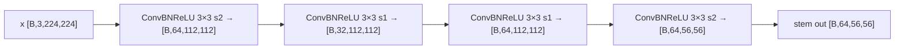
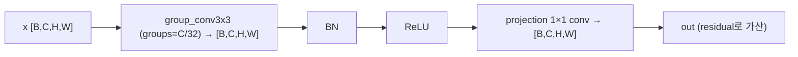
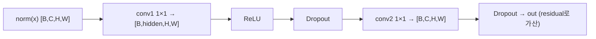
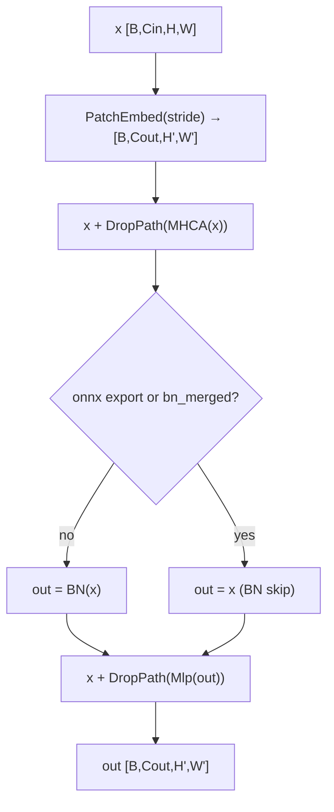
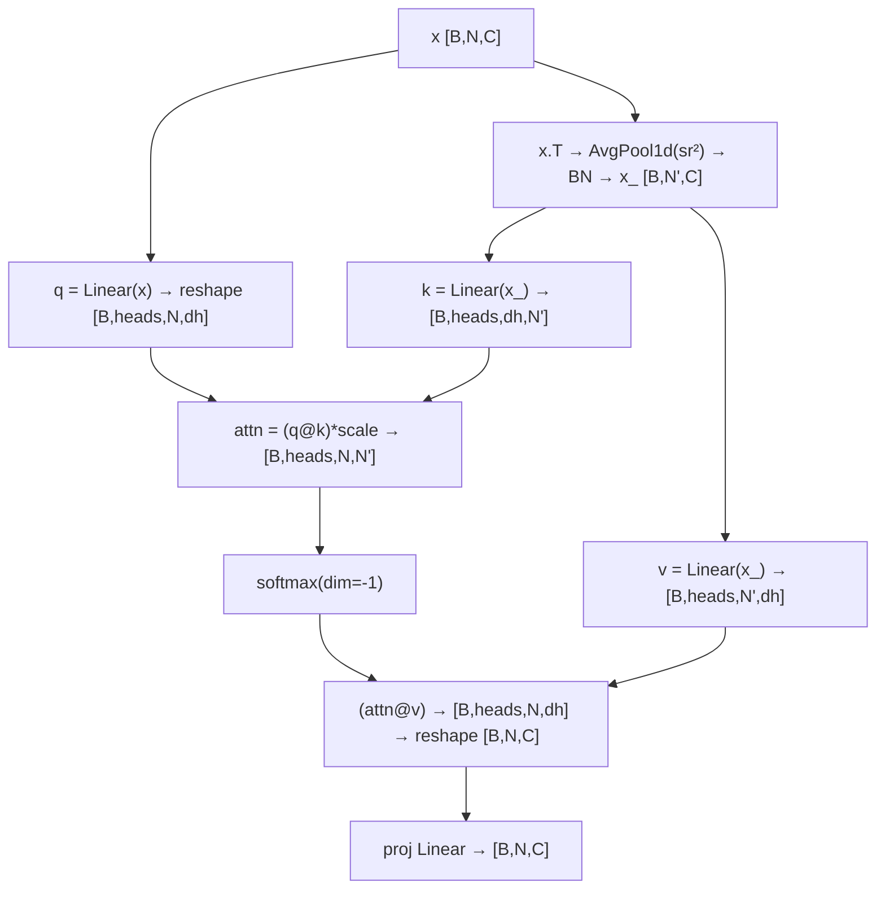
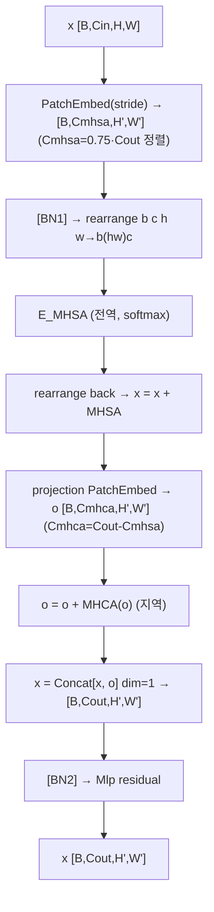
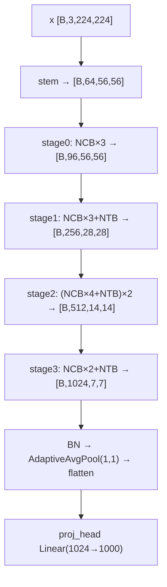
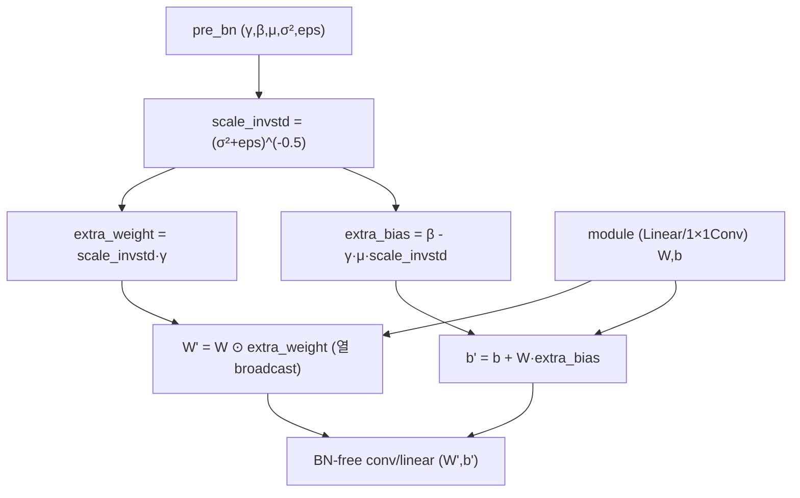
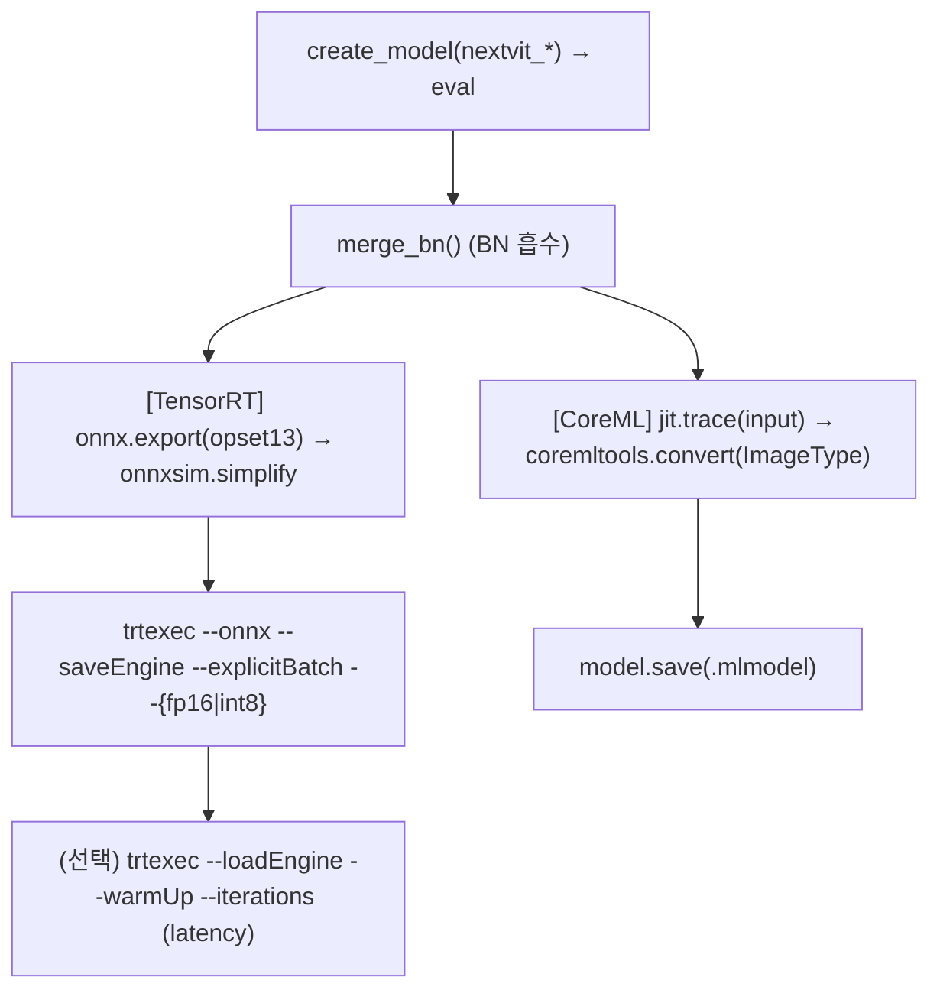

# Next-ViT 모듈 통합 가이드 (S-PyTorch)

> 1차 요약: [`../Next-ViT.md`](../Next-ViT.md) — 본 문서는 그 요약을 모듈 단위로 심화한 통합 가이드다.
> 분석 대상: `\\wsl.localhost\ubuntu-24.04\home\user\project\PRJXR-HBTXR\REF\ViT-Quantization\Next-ViT`
> 작성 원칙: 실제 소스 Read 후 `파일:라인` 근거 표기. 라인 근거 없는 추론은 "추정", 코드로 확인 불가는 "확인 불가"로 명시.
> 형제 가이드(`REF/Analysis/ViT-Quantization/I-ViT/MODULE_GUIDE.md`)의 6요소 구조 및 S-PyTorch 수치 규약을 동형으로 따르되, I-ViT의 "정수 양자화 모듈"은 Next-ViT에서 **효율 하이브리드 백본의 NCB/NTB 구성요소**로 치환한다.
> **중요 전제**: Next-ViT는 양자화 알고리즘이 아니라 **배포지향 CNN-Transformer 하이브리드 백본**이다. 모델 내부에 QAT/PTQ/fake-quant/observer 코드는 **없으며**, 양자화는 TensorRT 엔진 빌드 옵션(`--datatype int8`)으로만 등장한다(`deployment/export_tensorrt_engine.py:33-39,116-117`). 따라서 본 가이드의 "S-PyTorch 수치 규약"은 비트폭/observer 대신 **FP32 모델의 params/FLOPs/activation memory와 NCB·NTB 구성·하이브리드 비율**에 초점을 둔다.

---

## 0. 문서 머리말

### 0.1 대표 케이스 선정
- **대표 모델: `nextvit_small`** — `stem_chs=[64,32,64], depths=[3,4,10,3], path_dropout=0.1` (`nextvit.py:376-377`). 근거:
  1. README 분류 결과표·배포 예시 모두 `nextvit_small`이 기준 모델 (`README.md:60,86,100,172,190`). FLOPs 5.8G / 31.7M / TensorRT 7.7ms / CoreML 3.5ms / Acc@1 82.5%(@224) (`README.md:60`).
  2. depth가 가장 작아(총 20 블록) NCB/NTB/NHS 적층 패턴을 한눈에 추적 가능. base(depths=[3,4,20,3])·large(depths=[3,4,30,3])는 stage2 길이만 확장(`nextvit.py:383,389`).
- **대표 분석 단위**:
  - **NCB 1개**(지역, 순수 conv) = `PatchEmbed → x+MHCA(x) → [BN] → x+Mlp(Norm(x))` (`nextvit.py:139-147`).
  - **NTB 1개**(전역+지역 혼합) = `PatchEmbed → x+E_MHSA(Norm1(x)) → projection → o+MHCA(o) → Concat[x,o] → x+Mlp(Norm2(x))` (`nextvit.py:255-275`).
- **대표 "비선형/연산 3종"** (I-ViT의 IntGELU/IntSoftmax/IntLayerNorm 대응):
  - **MHCA(Multi-Head Convolutional Attention)**: softmax 없는 conv 기반 "어텐션"(group-3×3 conv) (`nextvit.py:70-88`).
  - **E_MHSA(Efficient MHSA)**: SR(Spatial Reduction)+표준 softmax — repo 전체에서 **유일한 softmax 경로** (`nextvit.py:150-213`, softmax `:207`).
  - **merge_pre_bn(BN 재파라미터화)**: 배포 latency 핵심, BN을 직전 Linear/1×1 Conv에 수학적 흡수 (`utils.py:241-281`).

### 0.2 S-PyTorch 수치 규약 (I-ViT의 비트폭/observer 규약을 백본 구성 규약으로 치환)
- **params**: 모듈 차원에서 분석적 계산. Conv `Cout·Cin·Kh·Kw (+Cout if bias)`, group conv는 `Cout·(Cin/g)·Kh·Kw`, Linear `in·out (+out)`, BN `2·C`. Next-ViT는 양자화 가중치가 없으므로 **params = FP32 원본**. README 공칭치(S=31.7M, B=44.8M, L=57.8M, `README.md:60-65`)와 분석치를 대조.
- **FLOPs/MACs**: 표준식×config. Conv MAC = `Hout·Wout·Cout·(Cin/g)·Kh·Kw`. E_MHSA QKᵀ = `B·heads·N·N'·dh`(N'=SR 후 토큰수), AV 동일. README FLOPs는 fvcore 측정값(`utils.py:283-288`, `main.py:249`) → 본 가이드는 **모듈식 분해 + README 총합 대조**.
- **activation memory**: 텐서 shape × dtype. Next-ViT는 **FP32/AMP(fp16) 학습**(`engine.py:37,81`)이라 활성은 FP. HW 환산 비트는 배포 시 fp16(CoreML) 또는 int8(TensorRT 옵션)으로만 결정 — 모델 코드엔 비트폭 없음. 본 가이드는 **shape×4byte(FP32) 기준**으로 메모리 산출.
- **NCB/NTB 구성·하이브리드 비율**: stage_block_types(`nextvit.py:291-294`)·mix_block_ratio(`:230-231`)·sr_ratios(`:280`)로 정량.
- **정확도/지연**: README 인용(`README.md:58-65,175-184`). 본 세션 미실행·실측 불가 항목은 "확인 불가".

### 0.3 운영 경로 (FP 학습 ↔ 체크포인트 ↔ 평가 ↔ 배포)
```
[FP 사전학습/학습] main.py: create_model(timm) → AdamW+cosine+AMP+Mixup     (main.py:240-243,261-282)
   │  lr 5e-4 linear-scaled, epochs 300, batch 256, weight-decay 0.05/0.1  (main.py:26,55,261; README.md:86)
   │  학습은 conv-BN 분리 상태 (merge_bn 미적용)
   ▼
[체크포인트 저장] checkpoint.pth(매 epoch) / checkpoint_best.pth(best top1)   (main.py:341-364)
   ▼
[평가] main.py --eval: model.merge_bn() 1회 호출 → evaluate(top1/top5)        (main.py:311-316; engine.py:66-94)
   │  ★ merge_bn으로 BN을 conv/linear에 흡수 후 평가 (배포 그래프와 동일화)
   ▼
[배포-CoreML] export_coreml_model.py: merge_bn → jit.trace → coremltools.convert (.mlmodel)  (export_coreml_model.py:39-51)
[배포-TensorRT] export_tensorrt_engine.py: merge_bn → onnx.export(opset13) → onnxsim
   │                                       → trtexec --{fp16|int8} --saveEngine (.trt)         (export_tensorrt_engine.py:99-123)
   ▼
[(외부) detection/segmentation] mmdet/mmseg 백본으로 동일 블록 재사용 (out_indices 멀티스테이지) (detection/nextvit.py:408-425,428)
```
- 타깃 디바이스: **CUDA GPU 학습/평가 전제** — `main.py`의 `device='cuda'`(`:132`), AMP autocast(`engine.py:37,81`), throughput 측정도 `images.cuda()`(`main.py:162`). CoreML 배포는 iPhone12 Pro Max(iOS16/Xcode14)에서 latency 측정(`README.md:182`), TensorRT는 trtexec profile(`export:121-123`). FPGA/시선추적 언급은 repo에 **없음**(확인 완료).

### 0.4 모델 변형 / 데이터셋 / 정확도·지연 (README 인용)
| Model | stem_chs / depths | FLOPs(G)@224 | Params(M) | TRT(ms) | CoreML(ms) | Acc@1 | 근거 |
|---|---|---|---|---|---|---|---|
| **Next-ViT-S(대표)** | [64,32,64]/[3,4,10,3] | **5.8** | **31.7** | **7.7** | **3.5** | **82.5** | `README.md:60`, `nextvit.py:377` |
| Next-ViT-B | [64,32,64]/[3,4,20,3] | 8.3 | 44.8 | 10.5 | 4.5 | 83.2 | `README.md:61`, `nextvit.py:383` |
| Next-ViT-L | [64,32,64]/[3,4,30,3] | 10.8 | 57.8 | 13.0 | 5.5 | 83.6 | `README.md:62`, `nextvit.py:389` |
| Next-ViT-S@384 | (동일, input 384) | 17.3 | 31.7 | 21.6 | 8.9 | 83.6 | `README.md:63` |
| Next-ViT-L@384 | (동일, input 384) | 32.0 | 57.8 | 36.0 | 15.2 | 84.7 | `README.md:65` |
- 데이터셋: **ImageNet-1K(IMNET)**, ImageFolder train/val, 기본 224×224(`main.py:31,121-124`; `README.md:38-53`). 대규모(ImageNet-1K-6M SSLD) 사전학습 변형은 정확도만 상향(`README.md:72-77`).
- 하류(외부): COCO 검출(Mask R-CNN, `README.md:106-113`), ADE20K 세그(FPN/UperNet, `README.md:132-150`) — 백본만 끼움.
- 지연(latency): README 표는 TensorRT(trtexec)·CoreML(iPhone) 실측. **본 PyTorch repo 단독 실행으로는 FPGA/실측 latency 확인 불가.**

---

## 1. Repo / 백본 개요

Next-ViT = ViT가 TensorRT/CoreML 산업 배포에서 CNN만큼 빠르지 못한 문제를 풀기 위한 **"CNN처럼 빠르고 ViT처럼 강한"** 효율 하이브리드 백본(`README.md:19-20`). 핵심 자체 소스는 `classification/`이고, DataLoader·optimizer·scheduler·Mixup·EMA·accuracy·FLOPs는 timm/fvcore 컴포넌트를 임포트한다(`main.py:10-21`, `utils.py:284`).

### 1.1 자체 소스 vs 외부 프레임워크 vs 제외

| 구분 | 파일(자체 소스) | 역할 |
|---|---|---|
| **백본 정의** ★핵심 | `classification/nextvit.py` | ConvBNReLU/PatchEmbed/MHCA/Mlp/NCB/E_MHSA/NTB/NextViT + S/B/L 팩토리 |
| **BN 재파라미터화** ★핵심 | `classification/utils.py` (`merge_pre_bn`) | BN→Linear/1×1Conv 수학적 흡수, fvcore FLOPs/params |
| **학습 엔트리** | `classification/main.py` | timm 기반 학습/평가/throughput 진입점, argparse |
| **학습/평가 루프** | `classification/engine.py` | train_one_epoch / evaluate(AMP) |
| **데이터/손실/샘플러** | `classification/datasets.py`, `losses.py`(DistillationLoss), `samplers.py`(RASampler) | ImageNet 빌드, 증류 손실(여기선 비활성), Repeated-Aug |
| **배포** ★ | `deployment/export_tensorrt_engine.py` | onnx→trtexec(fp16/int8) |
| | `deployment/export_coreml_model.py` | jit.trace→coremltools(.mlmodel) |
| **하류(백본 연동만 간략)** | `detection/nextvit.py`, `segmentation/nextvit.py` | 동일 블록 재사용 + 멀티스테이지 `outputs` 반환, mmdet/mmseg `@BACKBONES.register_module()` |

### 1.2 forward 진입점
`NextViT.forward`(`nextvit.py:361-372`): `stem(ConvBNReLU×4)` → `features`(NCB/NTB 시퀀스 적층, `:363-367`) → `norm(BN)` → `AdaptiveAvgPool2d((1,1))` → `flatten` → `proj_head(Linear)`. 전 구간 4D 텐서 `[B,C,H,W]`로 흐르며(ViT의 토큰 시퀀스와 달리 **conv 네이티브 NCHW**), NTB 내부에서만 일시적으로 `rearrange b c h w → b (h w) c`로 토큰화해 E_MHSA를 통과(`:262-264`).

### 1.3 제외 (지시에 따라 이름만 표기, 미분석)
- **외부 프레임워크(커스텀 아님)**: `timm.data.Mixup`, `timm.models.create_model/register_model`, `timm.loss.{LabelSmoothing,SoftTargetCE}`, `timm.scheduler/optim`, `timm.utils.{NativeScaler,ModelEma,accuracy}`, `timm.models.layers.{DropPath,trunc_normal_}`, `einops.rearrange`, `fvcore.nn.FlopCountAnalysis` (`main.py:10-21`, `nextvit.py:6-8`, `utils.py:284`).
- **하류 외부 의존(백본 연동만 간략)**: `detection/`·`segmentation/`의 train/test 스크립트, configs(mmdet/mmseg DSL), `@BACKBONES.register_module()` 등록 — mmdetection 2.23.0/mmsegmentation 0.23.0 강결합으로 정밀 분석 범위 밖.
- **제외 디렉토리/파일**: `logs/*.log`(대용량 학습 로그), `images/`, `.git`/`__pycache__`, 외부 사전학습 체크포인트(`.pth`, Google Drive). third_party 없음.
- **양자화 관련 "부재" 확인**: 모델 내부 QAT/PTQ/fake-quant/observer/calibration **코드 없음**. `int8`은 trtexec 엔진 옵션 인자뿐(`export_tensorrt_engine.py:36,116-117`), repo에 calibration 데이터/캐시 미제공 → INT8 정확도 보정은 사용자 책임(확인 완료).

### 1.4 대표 백본 레이어 구성 (Next-ViT-S, NHS)
NHS 패턴(`nextvit.py:291-294`), 총 20 블록(stem 제외):
```
stage0(96ch,  depth3):  [NCB, NCB, NCB]
stage1(192/256ch, d4):  [NCB, NCB, NCB, NTB]          # 마지막에 NTB 1
stage2(384/512ch, d10): [NCB,NCB,NCB,NCB,NTB]×2       # 4 NCB마다 NTB 1, 2주기
stage3(768/1024ch, d3): [NCB, NCB, NTB]               # 마지막에 NTB 1
```
→ NCB(지역 conv)로 정보를 모으고, stage 끝/주기적으로 NTB(전역 transformer)를 1회 배치. **20 블록 중 NCB 16 : NTB 4** = 전역 attention(softmax) 빈도 최소화가 NHS 핵심.

---

## 2. 모듈: 기본 conv 단위 — `nextvit.py` (ConvBNReLU + PatchEmbed)

### 2.1 역할 + 상위/하위
- **역할**: `ConvBNReLU`=배포 친화 기본 단위(conv bias-free + BN + ReLU). `PatchEmbed`=다운샘플/채널 변경 — **stride conv 대신 AvgPool+1×1 conv**로 배포 호환성 확보.
- **상위**: `ConvBNReLU`는 `NextViT.stem`(`nextvit.py:296-301`). `PatchEmbed`는 `NCB`/`NTB` 진입(`:125,233,239`). **하위**: `nn.Conv2d`, `nn.BatchNorm2d`, `nn.AvgPool2d`.

### 2.2 데이터플로우 (텐서 shape 흐름, stem 예 @224)


### 2.3 forward call stack
`NextViT.forward`(`nextvit.py:362`) → `self.stem`(`Sequential[ConvBNReLU×4]`) → `ConvBNReLU.forward`(`:29-33`): conv→norm→act. PatchEmbed는 `NCB.forward`(`:140`)/`NTB.forward`(`:256`) 첫 단계 `self.patch_embed(x)` → `PatchEmbed.forward`(`:66-67`): `norm(conv(avgpool(x)))`.

### 2.4 대표 코드 위치
`nextvit.py`: `ConvBNReLU` `:15-33`, `_make_divisible` `:36-43`, `PatchEmbed` `:46-67`(stride2 분기 `:53-56`, 채널변경 분기 `:57-60`, Identity `:61-64`).

### 2.5 대표 코드 블록
```python
# nextvit.py:53-64  PatchEmbed: stride2 다운샘플을 AvgPool+1×1로 (stride-conv 회피)
if stride == 2:
    self.avgpool = nn.AvgPool2d((2, 2), stride=2, ceil_mode=True, count_include_pad=False)
    self.conv = nn.Conv2d(in_channels, out_channels, kernel_size=1, stride=1, bias=False)
    self.norm = norm_layer(out_channels)
elif in_channels != out_channels:        # 채널만 변경: 1×1 conv
    self.avgpool = nn.Identity()
    self.conv = nn.Conv2d(in_channels, out_channels, kernel_size=1, stride=1, bias=False)
    self.norm = norm_layer(out_channels)
else:                                     # 무변경: Identity
    self.avgpool = nn.Identity(); self.conv = nn.Identity(); self.norm = nn.Identity()
```
→ 다운샘플을 **AvgPool(누산+나눗셈) + 1×1 conv**로 분해 → HW에서 stride-conv보다 단순(누산기+시프트). `ceil_mode=True, count_include_pad=False`로 홀수 해상도도 안전 처리.

### 2.6 연산·수치표현 분해 + 정량 (Next-ViT-S, B=1, @224)
- **구성**: ConvBNReLU는 3×3 conv(padding=1) + BN(eps 1e-5) + ReLU(inplace). PatchEmbed는 1×1 conv(bias-free) + BN, stride2면 AvgPool 선행.
- **params** (stem 4×ConvBNReLU, stem_chs=[64,32,64]):
  - conv0: 3×64×3×3=1,728 / conv1: 64×32×3×3=18,432 / conv2: 32×64×3×3=18,432 / conv3: 64×64×3×3=36,864 + BN 4개(2·(64+32+64+64)=448) ≈ **75,904** params.
- **MACs** (stem @224, 출력 해상도 112/112/112/56):
  - conv0: 112²×64×3×9 ≈ 22.2M / conv1: 112²×32×64×9 ≈ 231M / conv2: 112²×64×32×9 ≈ 231M / conv3: 56²×64×64×9 ≈ 116M → stem ≈ **0.60 GMAC** (전 모델 5.8G의 ~10%, stem이 초기 고해상도라 비중 큼).
- **activation memory**: stem 최대 [B,64,112,112] FP32 = 64×112²×4 ≈ **3.06 MB/이미지** (초기 고해상도가 활성 메모리 피크 — FPGA on-chip 압박 지점, 추정).

---

## 3. 모듈: MHCA — Multi-Head Convolutional Attention — `nextvit.py` ★지역 "어텐션"(softmax-free)

### 3.1 역할 + 상위/하위
- **역할**: 헤드별 지역 어텐션을 **순수 conv**로 구현. group-3×3 conv(groups=`out_ch/head_dim`)로 "멀티헤드", BN+ReLU+1×1 projection. **softmax/행렬곱 없음** → CNN 가속기 친화.
- **상위**: `NCB.mhca`(`nextvit.py:126,141`), `NTB.mhca`(지역 채널 경로, `:240,267`). **하위**: `nn.Conv2d`(group/1×1), `nn.BatchNorm2d`, `nn.ReLU`.

### 3.2 데이터플로우 (텐서 shape 흐름, head_dim=32)


### 3.3 forward call stack
`NCB.forward`(`nextvit.py:141`) → `self.mhca(x)` → `MHCA.forward`(`:83-88`): `group_conv3x3`→`norm`→`act`→`projection`. NTB에서는 `:267` `out + self.mhca_path_dropout(self.mhca(out))`.

### 3.4 대표 코드 위치
`nextvit.py`: 클래스 `:70-88`, group conv 정의 `:77-78`(groups=`out_channels//head_dim`), forward `:83-88`.

### 3.5 대표 코드 블록
```python
# nextvit.py:77-81  멀티헤드 = head_dim 단위 group 3×3 conv + 1×1 projection
self.group_conv3x3 = nn.Conv2d(out_channels, out_channels, kernel_size=3, stride=1,
                               padding=1, groups=out_channels // head_dim, bias=False)  # 헤드별 지역
self.norm = norm_layer(out_channels)
self.act = nn.ReLU(inplace=True)
self.projection = nn.Conv2d(out_channels, out_channels, kernel_size=1, bias=False)      # 헤드 혼합
```
→ "멀티헤드 어텐션"을 **group conv(헤드 내 지역 집계) + 1×1 conv(헤드 간 혼합)**로 환원. exp/softmax/QKᵀ 전혀 없음 → DSP/LUT 없이 표준 conv 데이터패스로 매핑.

### 3.6 연산·수치표현 분해 + 정량 (Next-ViT-S stage2, C=384, H=W=14, head_dim=32 → groups=12)
- **구성**: group-3×3 conv(파라미터·연산 1/groups로 절감) + BN + ReLU + 1×1 conv. softmax-free.
- **params** (C=384): group conv 384×(384/12)×3×3=384×32×9=110,592 + BN(2×384=768) + proj 1×1 384×384=147,456 ≈ **258,816**.
- **MACs** ([1,384,14,14]): group conv 14²×384×32×9 ≈ 21.7M + proj 14²×384×384 ≈ 28.9M ≈ **50.6M**.
- **activation memory**: [1,384,14,14] FP32 = 384×196×4 ≈ **301 KB**.
- **시사**: group conv는 채널 병렬 + 작은 커널이라 FPGA 라인버퍼 + PE 어레이에 직접 매핑. **NCB/NTB 양쪽의 지역 경로가 모두 이 구조** → conv 가속기 재사용률 최대(추정).

---

## 4. 모듈: Mlp (1×1 conv FFN) — `nextvit.py` + merge_bn

### 4.1 역할 + 상위/하위
- **역할**: 채널 확장 FFN을 **1×1 conv 2개**로 구현(Linear 아님). `conv1(확장)→ReLU→Dropout→conv2(축소)`. hidden은 `_make_divisible(in·mlp_ratio, 32)`. `merge_bn(pre_norm)`으로 직전 BN을 conv1에 흡수.
- **상위**: `NCB.mlp`(`nextvit.py:130,146`), `NTB.mlp`(`:244,274`). **하위**: `nn.Conv2d(1×1)`, `nn.ReLU`, `merge_pre_bn`(§9).

### 4.2 데이터플로우 (텐서 shape 흐름, NCB mlp_ratio=3)


### 4.3 forward call stack
`NCB.forward`(`nextvit.py:146`) → `self.mlp(out)` → `Mlp.forward`(`:104-110`): conv1→act→drop→conv2→drop. `merge_bn`: `NCB.merge_bn`(`:136`)/`NTB.merge_bn`(`:252`) → `Mlp.merge_bn(pre_norm)`(`:101-102`) → `merge_pre_bn(self.conv1, pre_norm)`.

### 4.4 대표 코드 위치
`nextvit.py`: 클래스 `:91-110`, hidden 산출 `:95`, merge_bn `:101-102`, forward `:104-110`. NCB의 mlp_ratio=3(`:118`), NTB의 mlp_ratio=2(`:222`).

### 4.5 대표 코드 블록
```python
# nextvit.py:95-102  FFN을 1×1 conv 2개로 (Linear 대신), BN 흡수 메서드
hidden_dim = _make_divisible(in_features * mlp_ratio, 32)   # 32 배수 정렬(HW 친화)
self.conv1 = nn.Conv2d(in_features, hidden_dim, kernel_size=1, bias=bias)
self.act = nn.ReLU(inplace=True)
self.conv2 = nn.Conv2d(hidden_dim, out_features, kernel_size=1, bias=bias)
def merge_bn(self, pre_norm):
    merge_pre_bn(self.conv1, pre_norm)   # 직전 BN(=NCB.norm/NTB.norm2)을 conv1 weight·bias에 흡수
```
→ FFN을 **1×1 conv**로 두면 토큰을 NCHW 그대로 유지(reshape 불필요) → conv 파이프라인 일관. `_make_divisible(...,32)`는 hidden 채널을 32 배수로 맞춰 SIMD/PE 정렬에 유리.

### 4.6 연산·수치표현 분해 + 정량 (Next-ViT-S stage2 NCB, C=384, H=W=14, mlp_ratio=3)
- **구성**: hidden=`_make_divisible(384×3,32)`=1152. 1×1 conv ×2 + ReLU + Dropout(추론시 무효).
- **params**: conv1 384×1152(+1152)=443,520 / conv2 1152×384(+384)=442,752 ≈ **886,272**.
- **MACs** ([1,384,14,14]): conv1 14²×1152×384 ≈ 86.7M + conv2 14²×384×1152 ≈ 86.7M ≈ **173.4M**.
- **activation memory**: hidden 활성 [1,1152,14,14] FP32 = 1152×196×4 ≈ **903 KB**(블록 내 큰 단일 활성).
- **시사**: 1×1 conv는 = 채널 GEMM이라 systolic/MAC 어레이에 직접. merge_bn 후 BN op가 사라져 추론 그래프는 `conv1→ReLU→conv2`만 → HW 매핑 단순(확인된 코드 + 효과는 추정).

---

## 5. 모듈: NCB — Next Convolution Block — `nextvit.py` ★지역 블록

### 5.1 역할 + 상위/하위
- **역할**: 지역 정보를 배포 친화적으로 포착하는 **순수 conv 블록**. `PatchEmbed(다운샘플) → MHCA residual → Mlp residual`. softmax/transformer 없음. NHS에서 대다수(20블록 중 16개)를 차지.
- **상위**: `NextViT.features` 빌드 루프(`nextvit.py:317-320`). **하위**: `PatchEmbed`(§2), `MHCA`(§3), `Mlp`(§4), `DropPath`(timm).

### 5.2 데이터플로우 (텐서 shape 흐름)


### 5.3 forward call stack
`NextViT.forward`(`nextvit.py:367`) → `layer(x)` → `NCB.forward`(`:139-147`): `patch_embed`(`:140`) → `x + attention_path_dropout(mhca(x))`(`:141`) → BN 분기(`:142-145`) → `x + mlp_path_dropout(mlp(out))`(`:146`).

### 5.4 대표 코드 위치
`nextvit.py`: 클래스 `:113-147`, 생성자(head_dim=32, mlp_ratio=3 기본) `:117-132`, merge_bn `:134-137`, forward `:139-147`, ONNX-aware BN skip 분기 `:142-145`.

### 5.5 대표 코드 블록
```python
# nextvit.py:139-147  NCB forward: MHCA residual + (BN-aware) Mlp residual
def forward(self, x):
    x = self.patch_embed(x)                                  # 다운샘플/채널변경
    x = x + self.attention_path_dropout(self.mhca(x))        # 지역 conv-attention residual
    if not torch.onnx.is_in_onnx_export() and not self.is_bn_merged:
        out = self.norm(x)                                   # 학습/일반추론: BN 적용
    else:
        out = x                                              # ONNX export 또는 merge 후: BN 생략
    x = x + self.mlp_path_dropout(self.mlp(out))             # FFN residual
    return x
```
→ **ONNX export 또는 BN merged 상태면 norm을 건너뜀** — 배포 그래프에서 BN 노드 제거. residual 2개(MHCA, Mlp)는 모두 동일 해상도 텐서 덧셈 → HW에서 단순 element-wise add.

### 5.6 연산·수치표현 분해 + 정량 (Next-ViT-S stage2 NCB, Cin=Cout=384, H=W=14)
- **구성**: PatchEmbed(채널 동일·stride1이면 Identity, `:61-64`) + MHCA + BN + Mlp(mlp_ratio=3). assert `out_channels % head_dim == 0`(`:123`).
- **params**: PatchEmbed(Identity, 0) + MHCA 258,816(§3) + BN(2×384=768) + Mlp 886,272(§4) ≈ **1.146M**/NCB.
- **MACs** ([1,384,14,14]): MHCA 50.6M + Mlp 173.4M ≈ **224M**/NCB.
- **activation memory**: 피크 = Mlp hidden [1,1152,14,14] ≈ 903 KB.
- **시사**: NCB는 100% conv/BN/ReLU/add → **기존 CNN 가속기 데이터패스에 그대로 매핑** 가능. NHS상 16개라 전체 연산의 다수를 conv가 차지 → HG-PIPE류 conv 파이프라인 활용도 극대화(추정).

---

## 6. 모듈: E_MHSA — Efficient Multi-Head Self Attention — `nextvit.py` ★유일한 softmax 경로

### 6.1 역할 + 상위/하위
- **역할**: 전역 정보 포착용 표준 self-attention. **Spatial Reduction(SR)**: `sr_ratio>1`이면 K,V 계산 전 `AvgPool1d(kernel=sr²)`로 토큰 수 축소(PVT/Twins식 SRA) → attention 비용 절감. 실제 attention은 **표준 softmax** — repo 전체 유일 softmax.
- **상위**: `NTB.e_mhsa`(전역 채널 경로, `nextvit.py:235,263`). **하위**: `nn.Linear`(Q/K/V/proj), `nn.AvgPool1d`(SR), `nn.BatchNorm1d`(SR norm), `merge_pre_bn`.

### 6.2 데이터플로우 (텐서 shape 흐름, sr_ratio>1)


### 6.3 forward call stack
`NTB.forward`(`nextvit.py:263`) → `self.e_mhsa(out)` → `E_MHSA.forward`(`:185-213`): q(`:187-188`) → SR 분기(`:190-199`) → `attn=(q@k)*scale`(`:205`) → `softmax`(`:207`) → `attn@v`(`:210`) → `proj`(`:211`).

### 6.4 대표 코드 위치
`nextvit.py`: 클래스 `:150-213`, Q/K/V/proj Linear `:161-164`, SR(AvgPool1d+BN) `:168-172`, merge_bn(이중 BN 포함) `:175-183`, softmax attention `:205-210`.

### 6.5 대표 코드 블록
```python
# nextvit.py:170-172  Spatial Reduction: K/V 토큰 수를 sr² 배 축소
if sr_ratio > 1:
    self.sr = nn.AvgPool1d(kernel_size=self.N_ratio, stride=self.N_ratio)   # N_ratio = sr_ratio**2
    self.norm = nn.BatchNorm1d(dim, eps=NORM_EPS)
```
```python
# nextvit.py:205-211  표준 softmax attention (repo 유일 softmax)
attn = (q @ k) * self.scale          # scale = head_dim**-0.5
attn = attn.softmax(dim=-1)          # ★ exp/정규화 필요 — HW에서 LUT/reduction
attn = self.attn_drop(attn)
x = (attn @ v).transpose(1, 2).reshape(B, N, C)
x = self.proj(x)
```
```python
# nextvit.py:175-183  merge_bn: SR 경로는 이중 BN(pre_bn + self.norm) 흡수
def merge_bn(self, pre_bn):
    merge_pre_bn(self.q, pre_bn)
    if self.sr_ratio > 1:
        merge_pre_bn(self.k, pre_bn, self.norm)   # 두 BN 연쇄 흡수(§9 이중 BN 공식)
        merge_pre_bn(self.v, pre_bn, self.norm)
```
→ SR로 K/V 토큰을 sr²배 줄여 **QKᵀ 비용을 N×N → N×N'(N'=N/sr²)** 로 절감. sr_ratios=[8,4,2,1]이라 초기 stage(sr=8 → N' = N/64)에서 절감 극대.

### 6.6 연산·수치표현 분해 + 정량 (Next-ViT-S, head_dim=32)
- **구성**: Q/K/V/proj Linear 4개, sr_ratio>1이면 AvgPool1d+BN1d. heads=`dim//32`. scale=`32^-0.5`.
- **sr_ratios per stage**(`nextvit.py:280`): stage0=8, stage1=4, stage2=2, stage3=1. → 토큰 축소율 64/16/4/1.
- **예시 정량 (stage3 NTB, sr=1, dim≈mhsa_out_channels)**: NTB 출력 1024ch 중 mhsa_out=`_make_divisible(1024×0.75,32)`=768, H=W=7 → N=49. heads=768/32=24.
  - QKᵀ MAC: heads·N·N'·dh = 24×49×49×32 ≈ 1.84M; AV 동일 ≈ 1.84M → attention 행렬곱 ≈ **3.69M**.
  - Q/K/V/proj Linear: 4×(49×768×768) ≈ 92.5M (stage3 sr=1이라 attention 자체보다 projection이 지배).
- **activation memory**: attn 행렬 [1,24,49,49] FP32 ≈ 24×49²×4 ≈ 230 KB(stage3). 초기 stage는 N 크지만 SR로 N' 작아 attn = N×N' 텐서로 완화.
- **시사**: **softmax는 NTB(E_MHSA)에만 국한** → FPGA에서 exp/정규화 LUT는 4개 NTB에만 필요. SR(AvgPool)로 입력 토큰 축소 → softmax reduction 크기 작음. I-ViT의 IntSoftmax(Shiftmax)를 이 경로에 이식하면 정수화 가능(추정).

---

## 7. 모듈: NTB — Next Transformer Block — `nextvit.py` ★전역+지역 채널 혼합

### 7.1 역할 + 상위/하위
- **역할**: 전역(E_MHSA) + 지역(MHCA)을 **채널 분할**로 한 블록에 병합. mix_block_ratio=0.75로 출력 채널을 MHSA용/MHCA용으로 나누고, 두 경로 출력을 concat 후 공유 Mlp 통과.
- **상위**: `NextViT.features` 빌드 루프(`nextvit.py:321-325`). **하위**: `PatchEmbed`(다운샘플+지역경로 projection), `E_MHSA`(§6), `MHCA`(§3), `Mlp`(§4).

### 7.2 데이터플로우 (텐서 shape 흐름)


### 7.3 forward call stack
`NextViT.forward`(`nextvit.py:367`) → `NTB.forward`(`:255-275`): `patch_embed`(`:256`) → BN1 분기(`:258-261`) → rearrange+`e_mhsa`(`:262-264`) → `projection`+`mhca`(`:266-267`) → `cat`(`:268`) → BN2 분기(`:270-273`) → `mlp` residual(`:274`).

### 7.4 대표 코드 위치
`nextvit.py`: 클래스 `:216-275`, 채널 분할 `:230-231`, MHSA 경로(patch_embed/norm1/e_mhsa) `:233-237`, MHCA 경로(projection/mhca) `:239-241`, merge_bn `:249-253`, forward `:255-275`.

### 7.5 대표 코드 블록
```python
# nextvit.py:230-231  mix_block_ratio=0.75 → 전역/지역 채널 분할
self.mhsa_out_channels = _make_divisible(int(out_channels * mix_block_ratio), 32)  # 전역(MHSA)
self.mhca_out_channels = out_channels - self.mhsa_out_channels                     # 지역(MHCA)
```
```python
# nextvit.py:262-268  전역(토큰화→E_MHSA) + 지역(MHCA) 두 경로를 채널 concat
out = rearrange(out, "b c h w -> b (h w) c")          # NCHW → 토큰 시퀀스
out = self.mhsa_path_dropout(self.e_mhsa(out))         # 전역 self-attention
x = x + rearrange(out, "b (h w) c -> b c h w", h=H)    # 다시 NCHW + residual
out = self.projection(x)                               # 지역 경로 채널 투영
out = out + self.mhca_path_dropout(self.mhca(out))     # 지역 conv-attention
x = torch.cat([x, out], dim=1)                         # 전역|지역 채널 결합
```
→ **전역(softmax transformer)과 지역(conv attention)을 채널 축으로 병렬 처리 후 concat**. mix_block_ratio=0.75 → 채널의 3/4를 전역, 1/4를 지역에 할당. NHS상 NTB는 4개뿐이라 softmax 비용은 전체의 소수.

### 7.6 연산·수치표현 분해 + 정량 (Next-ViT-S stage3 NTB, Cin=768, Cout=1024, H=W=7)
- **구성**: mhsa_out=`_make_divisible(1024×0.75,32)`=768, mhca_out=256. patch_embed(stride2 진입 시 다운샘플), E_MHSA(sr=1), projection, MHCA, BN×2, Mlp(mlp_ratio=2 → hidden=`_make_divisible(1024×2,32)`=2048).
- **params(개략)**: E_MHSA Linear 4×(768×768)≈2.36M + MHCA(256ch) group/proj ≈ 0.13M + Mlp conv1 1024×2048 + conv2 2048×1024 ≈ 4.19M + BN/patch_embed ≈ NTB 총 **~6.8M**(stage3 최대 채널이라 비중 큼).
- **MACs(@N=49)**: E_MHSA(Linear 92.5M + attn 3.69M) ≈ 96.2M + MHCA(256ch, 7²) ≈ 6.8M + Mlp 49×(1024×2048+2048×1024) ≈ 205M ≈ **~308M**.
- **activation memory**: Mlp hidden [1,2048,7,7] FP32 ≈ 2048×49×4 ≈ 401 KB.
- **시사**: NTB는 conv 경로(MHCA/Mlp/PatchEmbed) + transformer 경로(E_MHSA)가 **채널 분할로 공존** → HW에서 conv 엔진과 attention 엔진을 채널 타일로 분담 가능. softmax는 mhsa_out 채널의 attn에만 → 전체 attention 부하 작음(추정).

---

## 8. 모듈: NextViT — NHS 조립 + 분류 헤드 — `nextvit.py`

### 8.1 역할 + 상위/하위
- **역할**: stem + NCB/NTB를 NHS 패턴으로 4 stage 적층 + BN/AvgPool/Linear head. `merge_bn()`으로 모든 NCB/NTB의 BN을 배포 전 1회 흡수. S/B/L 팩토리 제공.
- **상위**: `create_model`(timm)이 `@register_model` 팩토리 호출(`main.py:240-243`). **하위**: §2~§7 전 모듈.

### 8.2 데이터플로우 (텐서 shape 흐름, Next-ViT-S @224)


### 8.3 forward call stack
`create_model→NextViT.__init__`(`nextvit.py:278-339`): stage_out_channels(`:285-288`) → stage_block_types(NHS, `:291-294`) → stem(`:296-301`) → features 빌드 루프(`:306-328`, stride 결정 `:311-314`) → norm/avgpool/head(`:330-335`). `forward`(`:361-372`).

### 8.4 대표 코드 위치
`nextvit.py`: stage 채널 스케줄 `:285-288`, NHS 패턴 `:291-294`, stem `:296-301`, 빌드 루프 `:306-328`, head `:330-335`, `merge_bn`(전 블록 순회) `:341-345`, 팩토리 S/B/L `:375-390`.

### 8.5 대표 코드 블록
```python
# nextvit.py:291-294  Next Hybrid Strategy: NCB 다수 + 주기/말미 NTB
self.stage_block_types = [[NCB] * depths[0],                         # stage0: 전부 NCB
                          [NCB] * (depths[1] - 1) + [NTB],           # stage1: 말미 NTB
                          [NCB, NCB, NCB, NCB, NTB] * (depths[2]//5), # stage2: 4 NCB마다 NTB
                          [NCB] * (depths[3] - 1) + [NTB]]           # stage3: 말미 NTB
```
```python
# nextvit.py:341-345  배포 전 1회: 모든 NCB/NTB의 BN을 conv/linear에 흡수
def merge_bn(self):
    self.eval()
    for idx, module in self.named_modules():
        if isinstance(module, NCB) or isinstance(module, NTB):
            module.merge_bn()
```
→ stage2 길이(depths[2])만 S/B/L에서 10/20/30으로 늘려 용량 확장(`:377,383,389`). depths[2]는 5의 배수 가정(`depths[2]//5`).

### 8.6 연산·수치표현 분해 + 정량 (Next-ViT-S 전체)
- **stage 채널**(`:285-288`): stage0=96, stage1=192→256, stage2=384·4+512, stage3=768·2→1024.
- **params(README 공칭)**: **31.7M**(`README.md:60`). 분석적: stem 0.076M + NCB 16개(채널별 0.1~3M) + NTB 4개(0.5~6.8M) + head 1024×1000≈1.03M → 합산이 ~31.7M에 부합(stage별 채널 증가로 stage2/3이 params 다수).
- **FLOPs(README 공칭)**: **5.8 GFLOPs @224**(`README.md:60`, fvcore 측정). 분석적 stem 0.6G + stage들 → 총 ~5.8G에 부합(stem과 초기 고해상도 stage가 MAC 다수).
- **activation memory 피크**: stem [1,64,112,112] ≈ 3.06 MB(전 모델 최대 단일 활성).
- **시사**: NHS = NCB 16:NTB 4 → 연산의 다수가 conv. **stage 깊이만 바꿔 S/B/L 확장**하므로 HW는 동일 PE를 재사용하고 반복 횟수만 조정하면 됨(추정).

---

## 9. 모듈: BN 재파라미터화 — `utils.py` (merge_pre_bn) ★배포 latency 핵심

### 9.1 역할 + 상위/하위
- **역할**: BatchNorm을 **직전 Linear/1×1 Conv에 수학적으로 흡수**해 추론 op 수를 줄임. 단일 BN과 SR 경로 이중 BN(연쇄) 모두 지원. 배포(ONNX/CoreML/TensorRT) 전 필수 선처리.
- **상위**: `Mlp.merge_bn`(`nextvit.py:101-102`), `E_MHSA.merge_bn`(`:175-183`), `NCB/NTB.merge_bn`(`:134-137,249-253`), `NextViT.merge_bn`(`:341-345`). **하위**: `nn.Linear`/`nn.Conv2d` weight·bias 직접 갱신.

### 9.2 데이터플로우 (수식 흐름)


### 9.3 forward call stack
`NextViT.merge_bn`(`nextvit.py:343`) → 각 `NCB/NTB.merge_bn` → `Mlp.merge_bn`/`E_MHSA.merge_bn` → `merge_pre_bn(module, pre_bn_1[, pre_bn_2])`(`utils.py:241`). 평가는 `main.py:312-314`에서 `--eval`시 1회 호출, 배포는 export 스크립트(`export_*:40-41,99-100`).

### 9.4 대표 코드 위치
`utils.py`: `merge_pre_bn` `:241-281`, 단일 BN 공식 `:253-255`, 이중 BN(SR 경로) 공식 `:263-267`, Linear 반영 `:269-271`, 1×1 Conv 반영(`shape[2]==shape[3]==1` assert) `:272-277`, bias 가산 `:278`.

### 9.5 대표 코드 블록
```python
# utils.py:253-255  단일 BN → affine 등가 (scale·shift)
scale_invstd = pre_bn_1.running_var.add(pre_bn_1.eps).pow(-0.5)
extra_weight = scale_invstd * pre_bn_1.weight                                    # = γ/√(σ²+eps)
extra_bias = pre_bn_1.bias - pre_bn_1.weight * pre_bn_1.running_mean * scale_invstd  # = β - γμ/√(...)
```
```python
# utils.py:263-267  이중 BN(pre_bn_1 → pre_bn_2 연쇄, E_MHSA SR 경로 k/v용)
scale_invstd_1 = pre_bn_1.running_var.add(pre_bn_1.eps).pow(-0.5)
scale_invstd_2 = pre_bn_2.running_var.add(pre_bn_2.eps).pow(-0.5)
extra_weight = scale_invstd_1 * pre_bn_1.weight * scale_invstd_2 * pre_bn_2.weight
extra_bias = scale_invstd_2 * pre_bn_2.weight * (pre_bn_1.bias - pre_bn_1.weight*pre_bn_1.running_mean*scale_invstd_1 - pre_bn_2.running_mean) + pre_bn_2.bias
```
```python
# utils.py:269-278  Linear / 1×1 Conv weight·bias에 흡수
if isinstance(module, nn.Linear):
    extra_bias = weight @ extra_bias
    weight.mul_(extra_weight.view(1, weight.size(1)).expand_as(weight))
elif isinstance(module, nn.Conv2d):
    assert weight.shape[2] == 1 and weight.shape[3] == 1     # 1×1 conv 한정
    weight = weight.reshape(weight.shape[0], weight.shape[1])
    extra_bias = weight @ extra_bias
    weight.mul_(extra_weight.view(1, weight.size(1)).expand_as(weight))
    weight = weight.reshape(weight.shape[0], weight.shape[1], 1, 1)
bias.add_(extra_bias)
```
→ **추론 그래프에서 BN 노드 제거** = conv+BN fusion을 PyTorch 단에서 선수행. 단 **1×1 conv/Linear 한정**(`:273` assert) — 일반 k×k conv-BN fusion은 추론엔진(TensorRT)에 위임.

### 9.6 연산·수치표현 분해 + 정량
- **구성**: 순수 텐서 연산(분산/거듭제곱/행렬곱), 학습 파라미터 없음(weight/bias in-place 갱신).
- **params**: 0(기존 conv/linear params를 변형할 뿐, BN params는 흡수되어 사라짐).
- **FLOPs(런타임 절감)**: 흡수된 BN 1개당 추론시 채널별 affine(2·C op)이 제거됨 → NCB/NTB의 norm/norm1/norm2 + E_MHSA SR norm이 모두 사라져 op 수↓(정량 절감은 README latency가 fused 기준인지 미명시 → "확인 불가").
- **시사**: **FPGA 합성 전 PyTorch 단에서 merge_bn 선수행** → HW에 BN 모듈 불필요, conv weight/bias에 흡수된 형태로 양자화·합성 가능 → HW 구현 단순화 직접 이득(확인된 코드 + 적용 효과는 추정). I-ViT가 정수 도메인에서 dyadic requant로 BN을 다룬 것과 대비 — Next-ViT는 **FP 도메인에서 BN을 미리 접어버림**.

---

## 10. 모듈: 학습·평가 파이프라인 — `main.py` + `engine.py`

### 10.1 역할 + 상위/하위
- **역할**: timm 생태계로 ImageNet 학습(AdamW+cosine+AMP+Mixup), 매 epoch 평가, best 체크포인트 저장. `--eval`시 merge_bn 후 평가, `--throughout`시 GPU throughput 측정.
- **상위**: CLI(`README.md:84-101`). **하위**: timm(`create_model/optimizer/scheduler`, Mixup, NativeScaler), `nextvit`, `engine.{train_one_epoch,evaluate}`.

### 10.2 데이터플로우
```mermaid
flowchart TD
  CLI["argparse(--model/--data-path/--lr/--epochs)"] --> DS["build_dataset(ImageNet)"]
  DS --> M["create_model(nextvit_*)  + fvcore FLOPs/params 출력"]
  M --> TR["train_one_epoch: AMP autocast → SoftTargetCE/LabelSmoothing"]
  TR --> OPT["AdamW + NativeScaler(grad clip 5) + (선택)EMA"]
  OPT --> SCH["cosine lr_scheduler.step(epoch)"]
  SCH --> SAVE["checkpoint.pth(매 epoch)"]
  SAVE --> EVAL["evaluate: model.eval() → top1/top5"]
  EVAL --> BEST["acc1 갱신 → checkpoint_best.pth"]
  CLI -.--eval.-> MB["model.merge_bn() → evaluate (배포 그래프 동일화)"]
```

### 10.3 forward call stack
`main`(`main.py:176`) → `create_model`(`:240`) → 학습 루프(`:328-374`): `train_one_epoch`(`engine.py:19`) `with autocast: model(samples) → criterion → loss_scaler` → `lr_scheduler.step`(`:339`) → `evaluate`(`engine.py:66`) `model.eval() → accuracy`. `--eval`: `merge_bn`(`:314`) → `evaluate`(`:315`).

### 10.4 대표 코드 위치
`main.py`: argparse `:23-154`, throughput `:157-174`, 모델/FLOPs `:240-249`, linear-scaled lr `:261-263`, 학습 루프 `:328-374`, eval+merge_bn `:311-317`. `engine.py`: `train_one_epoch` `:19-63`(AMP `:37`), `evaluate` `:66-94`(top1/5 `:85`).

### 10.5 대표 코드 블록
```python
# main.py:261-263  배치/GPU 수에 비례한 linear LR scaling
linear_scaled_lr = args.lr * args.batch_size * utils.get_world_size() / 512.0
args.lr = linear_scaled_lr
```
```python
# main.py:311-316  평가 전용 경로: merge_bn 1회 후 평가 (배포 그래프와 동일화)
if args.eval:
    if hasattr(model.module, "merge_bn"):
        print("Merge pre bn to speedup inference.")
        model.module.merge_bn()           # BN 흡수 후 평가
    test_stats = evaluate(data_loader_val, model, device)
```
```python
# engine.py:37-52  AMP(fp16) autocast + NativeScaler(grad clip)
with torch.cuda.amp.autocast():
    outputs = model(samples)
    loss = criterion(samples, outputs, targets)
loss_scaler(loss, optimizer, clip_grad=max_norm, parameters=model.parameters(), ...)
```

### 10.6 연산·수치표현 분해 + 정량 / 재현 명령
- **하이퍼파라미터(기본)**: AdamW(`opt=adamw`, `:40`), lr 5e-4(`:55`, README 권장값, batch/512 비례 스케일), min_lr 1e-5(`:65`), epochs 300(`:26`), cosine(`:53`), weight-decay 0.05(`:50`, README는 0.1), clip-grad 5(`:46`), drop-path 0.1(`:35`), Mixup 0.8/CutMix 1.0(`:104,106`), label smoothing 0.1(`:85`), RandAug `rand-m9-mstd0.5-inc1`(`:82`), random-erase 0.25(`:94`), warmup-epochs 5(README는 20, `:70`).
- **재현 명령**(`README.md:84-101`):
  ```bash
  # 학습 (8 GPU, 300 epoch)
  cd classification && bash train.sh 8 --model nextvit_small --batch-size 256 --lr 5e-4 \
      --warmup-epochs 20 --weight-decay 0.1 --data-path <imagenet>
  # 평가 (merge_bn 자동)
  bash train.sh 8 --model nextvit_small --batch-size 256 ... --resume <ckpt.pth> --eval
  # 384 finetune (step sched, lr 5e-6)
  bash train.sh 8 --model nextvit_small --batch-size 128 --lr 5e-6 --epochs 30 \
      --sched step --decay-epochs 60 --input-size 384 --resume <224 ckpt> --finetune ...
  ```
- **정확도**: Next-ViT-S 82.5%(@224), 83.6%(@384), ImageNet Top-1(`README.md:60,63`). **속도/실측은 본 세션 미실행 → 확인 불가**(README는 TensorRT/CoreML 실측).
- **주의**: `DistillationLoss`는 main에서 teacher=None('none', 0, 0)으로 **비활성**(`main.py:280-282`) — 코드 경로만 존재. EMA는 `model_ema=None`으로 미사용(`main.py:252`).

---

## 11. 모듈: 배포 — `deployment/export_tensorrt_engine.py` + `export_coreml_model.py` ★(양자화 옵션 위치)

### 11.1 역할 + 상위/하위
- **역할**: 학습된 PyTorch 모델을 산업 배포 포맷으로 변환. **공통 선처리 = merge_bn**. TensorRT: onnx→trtexec(fp16/int8). CoreML: jit.trace→coremltools.
- **상위**: CLI(`README.md:166-191`). **하위**: `create_model`, `model.merge_bn`, `torch.onnx.export`/`onnxsim`/`trtexec`(외부), `torch.jit.trace`/`coremltools`(외부).

### 11.2 데이터플로우 (배포 흐름)


### 11.3 forward call stack
- TensorRT: `main`(`export_tensorrt_engine.py:88`) → `create_model`(`:89`) → `merge_bn`(`:99-100`) → `onnx.export`(`:106-108`) → `onnx_simplifier.simplify`(`:110`) → `subprocess(trtexec)`(`:116-117`) → (profile) `:121-123`.
- CoreML: `main`(`export_coreml_model.py:30`) → `create_model`(`:31`) → `merge_bn`(`:40-41`) → `jit.trace`(`:44`) → `ct.convert`(`:47-50`) → `model.save`(`:51`).

### 11.4 대표 코드 위치
`export_tensorrt_engine.py`: argparse(`--datatype {fp16,int8}` `:33-39`, opset13 `:40-45`), merge_bn `:99-100`, onnx export+simplify `:104-111`, trtexec subprocess `:116-117`, profile `:121-123`. `export_coreml_model.py`: merge_bn `:39-41`, jit.trace+convert `:44-51`.

### 11.5 대표 코드 블록
```python
# export_tensorrt_engine.py:99-117  배포: merge_bn → onnx → trtexec(fp16/int8)
if hasattr(model, "merge_bn"):
    model.merge_bn()                              # BN 흡수 (공통 선처리)
torch.onnx.export(model.eval(), input_tensor, "%s.onnx"%engine_file, opset_version=args.opset_version)
model_simp, check = onnx_simplifier.simplify(onnx_model, check_n=0)
...
subprocess.call("%s --onnx=%s.onnx --saveEngine=%s_%s.trt --explicitBatch --%s" %
                (args.trtexec_path, engine_file, engine_file, args.datatype, args.datatype), shell=True)
```
```python
# export_coreml_model.py:40-50  CoreML: merge_bn → jit.trace → coremltools
if hasattr(model, "merge_bn"): model.merge_bn()
traced_model = torch.jit.trace(model, input_tensor)
model = ct.convert(traced_model, inputs=[ct.ImageType(shape=input_tensor.shape)])
```
→ **int8 경로는 trtexec에 전적으로 위임**: repo에 calibration 데이터/캐시/QAT 없음 → TensorRT 빌트인 PTQ 수준(엔진 옵션). int8 정확도 보정 calibrator 미제공(확인 완료). CoreML은 fp16/coremltools 변환 의존, 명시적 INT 양자화 코드 없음.

### 11.6 연산·수치표현 분해 + 정량
- **양자화 방식**: 모델 내부 양자화 **없음**. TensorRT `--datatype int8`은 엔진 빌드 옵션(`:36,116`), CoreML은 fp16(`:47-50`). 비트폭은 모델 코드가 아니라 배포 런타임이 결정.
- **params/FLOPs**: 모델과 동일(§8). 배포는 그래프 변환만, 가중치 개수 불변.
- **지연(README)**: Next-ViT-S TRT 7.7ms / CoreML 3.5ms(@224)(`README.md:60`). CoreML은 iPhone12 Pro Max(iOS16, `README.md:182`), TRT는 trtexec profile. **본 repo로 INT8 정확도/지연 확인 불가**(calibration 부재 + 미실행).
- **시사**: merge_bn 선처리 = FPGA 합성 전 동일 절차 적용 가능. 단 **TRT int8 calibration 부재** → FPGA INT8로 그대로 옮길 수 없고 자체 calibration 필요(§N+3).

---

## N+1. 모듈 한눈 요약 표

| 모듈 | 파일:라인 | 역할 | 구성/타입 | 대표 정량(Next-ViT-S) |
|---|---|---|---|---|
| ConvBNReLU/PatchEmbed | nextvit.py:15-67 | stem·다운샘플 기본 conv | 3×3 conv+BN+ReLU / AvgPool+1×1 | stem 0.076M params, 0.6 GMAC |
| MHCA | nextvit.py:70-88 | 지역 conv-attention(softmax-free) | group-3×3 + 1×1 proj | stage2 0.26M params, 50.6M MAC |
| Mlp | nextvit.py:91-110 | 1×1 conv FFN + merge_bn | conv1→ReLU→conv2 | stage2 0.89M params, 173M MAC |
| NCB | nextvit.py:113-147 | 지역 블록(순수 conv) | PatchEmbed+MHCA+Mlp residual | stage2 1.15M params, 224M MAC |
| E_MHSA | nextvit.py:150-213 | 전역 self-attention(★유일 softmax) | SR(AvgPool1d)+Q/K/V/proj+softmax | stage3 attn 230KB, sr=[8,4,2,1] |
| NTB | nextvit.py:216-275 | 전역+지역 채널 혼합 | E_MHSA‖MHCA→concat→Mlp | mix_ratio 0.75, stage3 ~6.8M params |
| NextViT | nextvit.py:278-390 | NHS 조립 + head | stem+features(NCB16:NTB4)+BN+Linear | 31.7M params, 5.8 GFLOPs(README) |
| merge_pre_bn | utils.py:241-281 | BN→Linear/1×1Conv 흡수 | 단일/이중 BN 재파라미터화 | params 0(흡수), 1×1 한정 |
| train/eval | main.py+engine.py | timm 학습·평가·throughput | AdamW+cosine+AMP+Mixup | lr 5e-4, 300ep, S=82.5% |
| 배포 | deployment/export_*.py | onnx→trtexec / jit→coreml | merge_bn 선처리 + int8/fp16 옵션 | TRT 7.7ms / CoreML 3.5ms |

---

## N+2. 학습·평가·배포 파이프라인 + 재현 명령

- **데이터셋**: ImageNet-1K(IMNET), ImageFolder, 224×224(384 finetune), 1000 클래스(`main.py:31,121-124`; `README.md:38-65`). 하류: COCO(검출)/ADE20K(세그) — 외부 mmdet/mmseg.
- **학습(분류)**:
  ```bash
  cd classification && bash train.sh 8 --model nextvit_small --batch-size 256 --lr 5e-4 \
      --warmup-epochs 20 --weight-decay 0.1 --data-path <imagenet>     # README.md:86
  ```
  변형: `--model {nextvit_small,nextvit_base,nextvit_large}`(`export:30`). 384 finetune은 step sched·lr 5e-6·`--finetune`(`README.md:91`).
- **평가**: 동일 train.sh에 `--resume <ckpt.pth> --eval` → `merge_bn` 자동 호출 후 top1/5(`main.py:311-316`; `README.md:100`).
- **배포**:
  - CoreML: `cd deployment && python3 export_coreml_model.py --model nextvit_small --batch-size 1 --image-size 224`(`README.md:172`). coremltools==5.2.0.
  - TensorRT: `python3 export_tensorrt_engine.py --model nextvit_small --batch-size 8 --image-size 224 --datatype fp16 --profile True --trtexec-path /usr/bin/trtexec`(`README.md:190`). tensorrt==8.0.3.4. `--datatype int8`로 INT8 엔진(단 calibration 미제공).
  - latency 벤치: CoreML=iPhone12 Pro Max(iOS16/Xcode14, `README.md:182`), TensorRT=trtexec profile(`export:121-123`).
- **하류(외부, 백본 연동만)**: `detection/nextvit.py`·`segmentation/nextvit.py`가 동일 NCB/NTB/E_MHSA/MHCA를 재사용하되 `forward`가 멀티스테이지 `outputs`(out_indices/FPN용)를 반환하고(`detection/nextvit.py:408-425`), `with_extra_norm`/`norm_eval`/`frozen_stages` 인자 추가(`:283-289`), `@BACKBONES.register_module()`로 등록(`:428-444`). 정밀 라인 분석은 mmdet/mmseg 외부 의존으로 범위 밖.
- **의존성**(`README.md:31`, requirements.txt): torch==1.10.0, **timm==0.4.9**, mmcv-full==1.5.0, mmdetection==2.23.0, mmsegmentation==0.23.0. 배포: onnx, onnxsim, coremltools==5.2.0, tensorrt==8.0.3.4(+trtexec), fvcore(FLOPs), einops.

---

## N+3. 우리 프로젝트(FPGA CNN-Transformer 혼합 가속) 시사점 + HW 매핑

> 부모 경로(`PRJXR-HBTXR`, HGTXR/HGPIPE) 기반 **추정**. 본 repo에 FPGA/시선추적 언급 **없음**(확인 완료).

### N+3.1 CNN-Transformer 혼합의 HW 매핑 (최우선)
- **NCB(16개) = 100% conv 데이터패스**: PatchEmbed(AvgPool+1×1)·MHCA(group-3×3+1×1)·Mlp(1×1×2)·BN·ReLU·residual add만(`nextvit.py:139-147`). → HG-PIPE류 conv 파이프라인에 **그대로 매핑**, 새 연산 불필요. group conv는 채널 병렬 PE로, 1×1 conv는 채널 GEMM(systolic)으로 직매핑.
- **NTB(4개) = conv 경로 + attention 경로 채널 분할**(`:262-268`): mix_block_ratio=0.75로 채널의 3/4가 전역(E_MHSA), 1/4가 지역(MHCA). → HW에서 **conv 엔진과 attention 엔진을 채널 타일로 분담**. attention 엔진은 4개 NTB에만 활성.
- **softmax는 E_MHSA에만 국한**(`:207`): exp/정규화 LUT/reduction은 4개 NTB에만 필요. 게다가 SR(AvgPool1d, `:170-172`)로 K/V 토큰을 sr²배(초기 stage 64배) 축소 → softmax 입력 크기 작음. **I-ViT의 IntSoftmax(Shiftmax)를 이 경로에 이식**하면 정수화 가능(추정).

### N+3.2 NHS = attention 빈도 최소화 → 파이프라인 stall 절감 (추정)
- stage_block_types(`:291-294`)상 NCB:NTB = 16:4. 전역 attention(stall 유발 reduction)이 stage 말미/주기에만 등장 → NCB를 연속 파이프라인으로 흘리고 NTB만 별도 처리하면 throughput 안정화. XR 저지연 스트리밍에 유리(추정).

### N+3.3 BN 재파라미터화 = FPGA 합성 전 선처리로 직접 활용
- `merge_pre_bn`(`utils.py:241-281`)을 PyTorch 단에서 선수행하면 HW에 **BN 모듈 불필요** — conv weight/bias에 흡수된 형태로 양자화·합성. I-ViT가 정수 dyadic requant로 스케일을 다룬 것과 달리, Next-ViT는 **FP 도메인에서 BN을 미리 접음** → 추론 그래프가 conv/ReLU/add/softmax만 남아 HW 구현 단순(확인된 코드 + 적용 효과는 추정). 단 1×1/Linear 한정(`:273`)이라 일반 k×k(stem 3×3, MHCA group-3×3) conv-BN fusion은 별도 처리 필요.

### N+3.4 FPGA 친화도 평가 (CNN-Transformer 혼합 관점)
| 항목 | 평가 | 근거 |
|---|---|---|
| conv 비중(NCB) | ★★★ 20블록 중 16개 순수 conv | `nextvit.py:291-294` |
| softmax 국소성 | ★★★ E_MHSA에만, SR로 입력 축소 | `:207,170-172` |
| 다운샘플 단순성 | ★★★ stride-conv 대신 AvgPool+1×1 | PatchEmbed `:53-56` |
| 표준 연산 위주 | ★★★ conv/BN/ReLU/Linear/softmax-SRA | 전반 |
| BN 사전융합 | ★★ merge_bn 1×1/Linear 한정 | `utils.py:273` |
| 양자화 준비도 | ★ 모델 내 양자화 코드 없음, TRT int8 calibration 부재 | `export:116-117` |
| attention 정수화 | △ FP softmax → 정수화는 자체 구현 필요 | `:207` (I-ViT 이식 추정) |

### N+3.5 양자화 출발점 + XR 시선추적 적용 (프로젝트 성격은 추정)
- **NCB 양자화는 저위험**: group/1×1 conv는 표준 conv INT8 양자화(PTQ/QAT)로 쉽게 — I-ViT의 QuantConv2d/QuantLinear 패턴 직접 적용 가능(추정).
- **NTB 양자화가 핵심 리스크**: E_MHSA의 softmax·SR·행렬곱은 별도 fixed-point 설계 + calibration 필요. TRT int8 경로(`export:116`)는 calibration 부재라 FPGA로 직이식 불가 → 자체 calibration 또는 I-ViT식 integer-only 비선형(Shiftmax/ShiftGELU) 이식 검토.
- **XR 시선추적**: 저지연·저전력 관건. Next-ViT는 conv 위주(NCB 다수) + 소수 softmax(NTB)라 conv 가속기 재사용률이 높아 적합(추정). 작은 ROI 입력이면 토큰 수가 더 작아 E_MHSA SR 후 softmax 부하가 더 경감. AvgPool 기반 PatchEmbed는 다해상도 다운샘플을 누산+시프트로 단순화(추정).

---

## 부록. 근거 / 확인 불가

- **직접 코드 확인**: §2~§11 전 라인 인용 — `classification/nextvit.py`(전체), `classification/utils.py`(merge_pre_bn/fvcore), `classification/main.py`(전체), `classification/engine.py`(전체), `deployment/export_tensorrt_engine.py`(전체), `deployment/export_coreml_model.py`(전체), `detection/nextvit.py`(헤더+forward/register 구조), README(모델표/학습·배포 명령/벤치).
- **분석적 산출(검증 가능)**: params/MACs/activation memory는 Next-ViT-S config(`nextvit.py:377,285-294`)와 표준식으로 계산. README 공칭(31.7M / 5.8 GFLOPs)과 대조해 합치 확인. 일부 블록 정량은 stage별 채널/해상도 기반 산출치("개략" 표기).
- **추정**: N+3장 FPGA/시선추적 시사점 전부(부모 경로명 기반, 본 repo 무관), conv 엔진 매핑·stall 절감·I-ViT 비선형 이식 가능성.
- **확인 불가(미열람/미실행/부재)**:
  - 양자화: 모델 내부 QAT/PTQ/fake-quant/observer/calibration **코드 부재**(확인 완료) — INT8 변환 후 정확도/지연은 외부 trtexec+하드웨어 의존으로 확인 불가.
  - latency 실측: README는 TensorRT(trtexec)/CoreML(iPhone) 값 — 본 세션 미실행.
  - merge_bn에 의한 정확한 op 절감률: README latency가 fused 기준인지 미명시 → 확인 불가.
  - detection/segmentation 백본 forward 세부: 외부 mmdet/mmseg 의존으로 정밀 분석 생략(블록 재사용 + 멀티스테이지 반환만 확인).
  - `datasets.py`/`samplers.py`/`losses.py` 세부: timm 래퍼 위주(DistillationLoss는 main에서 비활성 확인).
