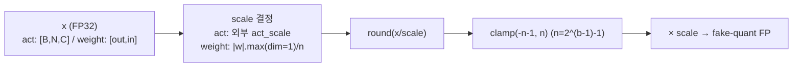
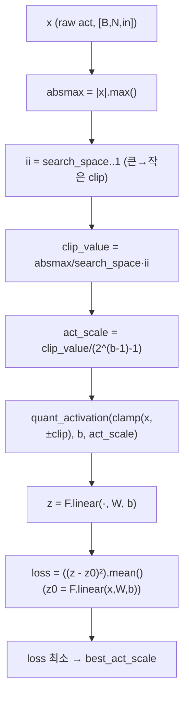
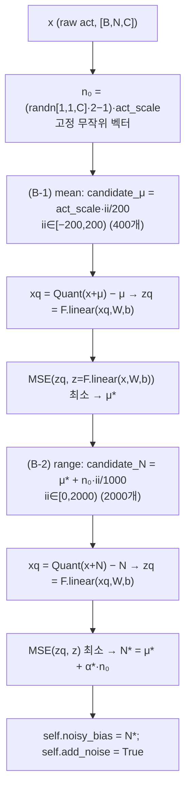
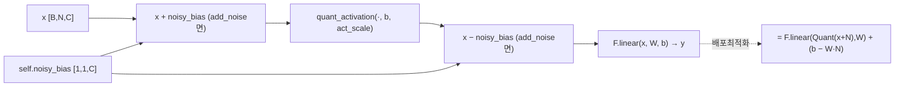
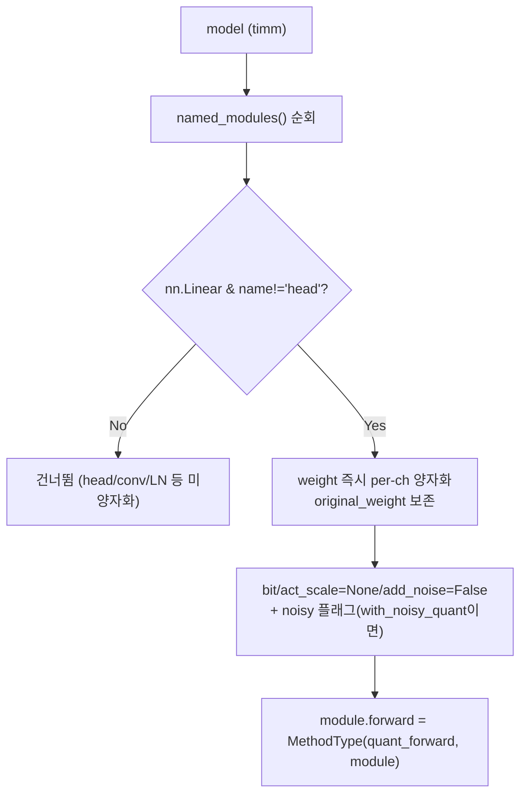
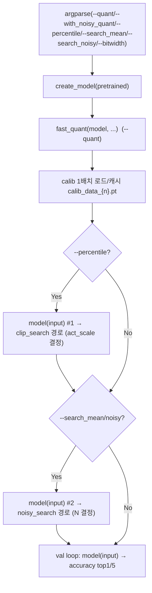

# NoisyQuant 모듈 통합 가이드 (S-PyTorch)

> 1차 요약: [`../NoisyQuant.md`](../NoisyQuant.md) — 본 문서는 그 요약을 모듈 단위로 심화한 통합 가이드다.
> 분석 대상: `\\wsl.localhost\ubuntu-24.04\home\user\project\PRJXR-HBTXR\REF\ViT-Quantization\NoisyQuant`
> 작성 원칙: 실제 소스 Read 후 `파일:라인` 근거 표기. 라인 근거 없는 추론은 "추정", 코드로 확인 불가는 "확인 불가"로 명시.
> 형제 가이드(`REF/Analysis/ViT-Quantization/I-ViT/MODULE_GUIDE.md`)의 6요소 구조와 동형으로 작성하되, HW 지표는 **S-PyTorch 수치 규약**(params/FLOPs/activation memory/비트폭)으로 치환한다. NoisyQuant 고유의 핵심은 §3~§5의 **noisy bias 생성·적용·제거 메커니즘 정밀해부**다.

---

## 0. 문서 머리말

### 0.1 대표 케이스 선정
- **대표 모델: `vit_base_patch16_224` (ViT-B)** — `embed_dim=768, depth=12, num_heads=12, mlp_ratio=4, patch16, img224`. 근거:
  1. README의 모든 실행 예시·결과 JSON이 `vit_base_patch16_224`(`README.md:30,39,53,61,86`)이고, run.sh도 `MODEL=vit_base_patch16_224`를 기본 예로 명시(`run.sh:8`)라 공식 대표 케이스.
  2. README 보고 정확도가 ViT-B 단일 모델에 대해서만 제시됨: FP 85.1 → vanilla 6-bit 64.612 → NoisyQuant 6-bit 83.28(`README.md:39,62,87`). 다른 모델 수치는 본 repo에 **없음**(확인 불가).
  3. ViT-B는 timm `create_model`로 생성(`validate.py:210-218`)되며 모델 코드는 **본 repo에 없음**(timm 원본 사용). NoisyQuant는 그 위에 `nn.Linear.forward`만 monkey-patch(`fast_quant.py:163`).
- **대표 분석 단위: 하나의 `nn.Linear` 레이어** = qkv/proj/fc1/fc2 중 1개. NoisyQuant의 양자화·noisy bias는 **오직 `nn.Linear`에만, head 제외**로 적용(`fast_quant.py:146`). Conv(patch embed)·LayerNorm·GELU·Softmax·attention의 두 matmul(q@kᵀ, attn@v)은 **양자화 대상이 아님**(`fast_quant.py:146` isinstance 필터).
- **대표 메커니즘 3종**: ① 균등 fake-quant(`quant_activation`/`quant_weight`, `fast_quant.py:9-24`), ② percentile clipping 탐색(`percentile_search`, `:26-59`), ③ **noisy bias 생성·탐색·적용/제거**(`quant_forward`, `:62-141`) — 본 repo 유일의 신규 기여이자 FPGA 시사점의 핵심.

### 0.2 S-PyTorch 수치 규약 (HW의 MAC lanes/scalar MACs 대체)
- **params**: 모듈 차원에서 분석적 계산. Linear `in·out (+out bias)`. NoisyQuant는 FP 가중치를 호출 즉시 양자화해 `module.weight.data`에 덮어쓰지만(원본은 `original_weight`에 보존, `fast_quant.py:148-151`), **개수 자체는 FP 원본과 동일**(추가 학습 파라미터 없음). noisy bias `N`은 채널 길이 벡터 `[1,1,C]`(`fast_quant.py:74`)로 layer당 1개 추가 버퍼이나 학습 파라미터는 아님.
- **FLOPs/MACs**: 표준식×config. Linear MAC = `B·N·in·out`. NoisyQuant는 **PTQ**(학습 없음)이고 추론 시 `F.linear` 1회(`fast_quant.py:141`)만 수행하므로 추론 FLOPs는 FP 원본과 동일. **캘리브레이션 FLOPs**는 grid search 반복으로 별도 산정(§4, §5).
- **activation memory**: 텐서 shape × 비트폭. NoisyQuant도 fake-quant라 실제 메모리는 FP32지만(`quant_activation`이 `aint*act_scale`=float 반환, `fast_quant.py:12`), **정수 도메인 비트폭**(W/A bits)을 "HW 환산 activation bit"로 표기 — `shape × A_bit`. 기본 비트폭 6(`validate.py:164` `--bitwidth` default=6).
- **비트폭/observer**: 코드 직접. 기본 **W6/A6**(`--bitwidth` default=6, `validate.py:164`; `fast_quant.py:147` `module.bit=bit`). zero-point 없는 **대칭** 양자화(weight per-output-channel, activation per-tensor). observer = **정적(static) PTQ**: 캘리브레이션 1배치로 act_scale을 percentile-MSE 또는 absmax로 1회 결정(running EMA 아님, `quant_forward`의 `clip_search` 분기 `fast_quant.py:64-69`).
- **정확도/속도**: README 인용(ViT-B만). 본 세션 미실행 → 측정 불가 항목은 "확인 불가".

### 0.3 운영 경로 (PTQ 캘리브레이션 ↔ 평가, **학습 없음**)
```
[FP 사전학습 모델 로드] create_model(args.model, pretrained=True)        (validate.py:210-218, timm)
   │  ViT-B 등 timm 모델, 본 repo에 모델 코드 없음
   ▼
[양자화 적용] fast_quant(model, bit, with_noisy_quant, percentile, search_noisy, search_mean)  (validate.py:220-223)
   │  named_modules 순회: nn.Linear(head 제외)만 weight 즉시 per-ch 양자화 + forward를 quant_forward로 patch (fast_quant.py:144-163)
   ▼
[캘리브레이션 (PTQ, 1배치)]  model.eval() → calib 데이터 로드/캐시(calib_data_{n}.pt)  (validate.py:340-355)
   │  ① --percentile  : model(input) 1회 → 각 Linear의 clip_search 경로로 act_scale 결정 (validate.py:358-362, fast_quant.py:64-69)
   │  ② --search_mean / --search_noisy : model(input) 1회 → noisy_search 경로로 noisy bias 탐색 (validate.py:363-366, fast_quant.py:70-131)
   ▼
[ImageNet val 평가] for batch in loader: model(input) → accuracy top1/5  (validate.py:369-441)
   │  추론은 quant_forward의 (C) 정상경로: Quant(x+N) − N → F.linear  (fast_quant.py:135-141)
```
- 타깃 디바이스: `validate.py`의 기본 `--device cuda`(`validate.py:114`), AMP 옵션(`:116-121`)·`torch.cuda` 분기(`:172-174`) 존재. 단 **`fast_quant.py`에는 `.cuda()` 하드코딩이 없음**(I-ViT와 대비, I-ViT는 `quant_modules.py`에 `.cuda()` 다수). → NoisyQuant 양자화 로직 자체는 **device-agnostic**(텐서 연산만), CPU 실행 이론상 가능(코드 근거 확인, 실행 미검증 → "확인 불가").

### 0.4 모델 / 데이터셋 / 정확도 (README 인용)
| Model | embed/depth/heads | FP32 | vanilla 6-bit | NoisyQuant 6-bit | 근거 |
|---|---|---|---|---|---|
| **ViT-B(대표)** | **768/12/12** | **85.1** | **64.612** | **83.28** | `README.md:39,62,87` |
| (그 외 모델) | — | — | — | — | 본 repo 미보고 → **확인 불가** |
- 데이터셋: 평가 = **ImageNet val**(`/data/.../imagenet/val/`, `README.md:30`, `validate.py:271-279`). 캘리브레이션 = **train의 소수 샘플**(`--calib_root .../imagenet/train --calib_num 256`, `README.md:76`, `validate.py:157-159,281-289`).
- vanilla 6-bit는 `--quant`만(noisy 없음, `README.md:53`), NoisyQuant 6-bit는 `--quant --with_noisy_quant --percentile --search_mean --search_noisy --bitwidth 6`(`README.md:76`).
- **정확도 회복폭: 64.612 → 83.28 (약 +18.67%p)**, FP 대비 잔여 손실 85.1 − 83.28 = **−1.82%p**(`README.md:39,62,87` 계산).
- 속도(latency): 본 repo에 latency 측정 코드 없음(`validate.py`는 batch_time 로깅만, `:403`) → 절대 latency **확인 불가**.

---

## 1. Repo / Layer 개요

NoisyQuant = ViT activation의 **heavy-tailed outlier 분포**를 **layer별 고정 noisy bias `N`**으로 평탄화한 뒤 균등 양자화하는 **PTQ(Post-Training Quantization) 기법**(`README.md:1-3`, CVPR 2023 arXiv:2211.16056). 양자화기 자체는 평범한 대칭 균등 양자화이고(`fast_quant.py:9-24`), 기여는 양자화 직전 더했다가 직후 빼는 noisy bias이며 **선형성으로 추론 시 bias로 흡수 가능**(런타임 비용 0). 본 repo는 **`fast_quant.py` 한 파일이 양자화 로직 전부**이고, 모델 정의·DataLoader·accuracy·validate 루프는 timm을 그대로 사용(`validate.py:25-31`).

### 1.1 자체 소스 vs 외부 프레임워크 vs 제외

| 구분 | 파일(자체 소스) | 역할 |
|---|---|---|
| **양자화 핵심** | `fast_quant.py` ★전부 | quant_activation/quant_weight, percentile_search, **quant_forward(noisy bias 탐색·적용)**, fast_quant(모델 patch) |
| **검증/캘리브레이션 엔트리** | `validate.py` | timm 표준 validate(Ross Wightman 작성, `:8`) + 양자화 인자/캘리브레이션 호출만 추가(`:31,154-164,220-223,340-367`) |
| **재현 스크립트** | `run.sh` | 4단계 ablation(easyQuant→+mean→+noisy→+shifted noisy) 일괄 실행 |
| **문서** | `README.md` | 사용법·정확도(ViT-B) |

### 1.2 forward 진입점
모델 forward는 **timm의 `create_model` 모델**(예 ViT-B)이 그대로 담당(`validate.py:210-218`). 단 모든 `nn.Linear`(head 제외)의 `.forward`가 `quant_forward`로 교체됨(`fast_quant.py:163` `MethodType(quant_forward, module)`). 즉 모델을 한 번 `model(input)` 호출하면, 내부 각 Linear가 `quant_forward`(`fast_quant.py:62`)를 타며 현재 플래그 상태(`clip_search`/`noisy_search`/정상)에 따라 분기한다. **스케일 인자를 텐서 페어로 전파하는 I-ViT와 달리**, NoisyQuant는 각 Linear가 `self.act_scale`/`self.noisy_bias`를 모듈 속성으로 보유하고 출력은 일반 FP 텐서다(스케일 버스 없음).

### 1.3 제외 (지시에 따라 이름만 표기, 미분석)
- **외부 프레임워크(커스텀 아님)**: `timm.models.create_model`/`load_checkpoint`, `timm.data.{create_dataset,create_loader,resolve_data_config,RealLabelsImagenet}`, `timm.utils.{accuracy,AverageMeter,...}`, `timm.layers.*`(`validate.py:25-29`). ViT/DeiT **원본 사전학습 체크포인트**(timm `pretrained=True`로 로드) — 가중치만 로드.
- **timm 모델 정의 전체**: NoisyQuant는 모델 코드를 갖지 않음. ViT/Swin/DeiT 구조는 timm 원본 → 분석 제외.
- **`validate.py`의 timm 보일러플레이트**: argparse 대부분(`:57-152`), AMP/torchscript/torchcompile 분기(`:178-264`), bulk 검증(`main`, `:470-530`)은 양자화 무관 → 양자화 관련(`:154-164,220-223,281-367`)만 분석.
- **제외 디렉토리**: `.git/`(hooks/objects/pack 전부) — 지시상 제외.

### 1.4 대표 모델 레이어 구성 (ViT-B, timm)
ViT-B 1 block 내 양자화 대상 `nn.Linear` = qkv(768→2304), proj(768→768), fc1(768→3072), fc2(3072→768). attention의 q@kᵀ·attn@v(matmul), softmax, LayerNorm, patch-embed conv, cls/pos embed는 **모두 미양자화**(`fast_quant.py:146` 필터). → NoisyQuant는 **부분 양자화(Linear-only)**이고 **end-to-end 정수 추론이 아님**(I-ViT와 근본 차이).

---

## 2. 모듈: 균등 양자화 기반함수 — `fast_quant.py` (quant_activation / quant_weight)

### 2.1 역할 + 상위/하위
- **역할**: FP 텐서를 **zero-point 없는 대칭(symmetric) 선형 양자화**로 fake-quant. activation은 per-tensor, weight는 per-output-channel. backward 정의 없음(PTQ라 grad 불필요, `torch.round`의 STE도 불필요 — 추론 전용).
- **상위**: `quant_activation`은 `percentile_search`(`fast_quant.py:43`)·`quant_forward`(`:68,85,111,130,134,138`)에서 호출. `quant_weight`는 `fast_quant`(`:149`)가 모델 패치 시 1회 호출. **하위**: `torch.round`/`clamp`/`abs().max()`.

### 2.2 데이터플로우 (텐서 shape 흐름)


### 2.3 forward call stack
`fast_quant`(`fast_quant.py:149`) → `quant_weight(w, bit)`(`:15`) → `w.abs().max(dim=1)`(`:18`) → round/clamp(`:19`). / `quant_forward`(`:138`) → `quant_activation(x, bit, act_scale)`(`:9`) → round/clamp(`:11`).

### 2.4 대표 코드 위치
`fast_quant.py`: `quant_activation` `:9-13`, `quant_weight` `:15-24`, symmetric=False raise `:21-22`.

### 2.5 대표 코드 블록

```python
# fast_quant.py:9-13  활성: per-tensor 대칭 균등 양자화 (zero-point 없음)
def quant_activation(x, bit, act_scale):
    n = 2 ** (bit - 1) - 1               # b=6 → n=31, 정수범위 [-32, 31]
    aint = (x / act_scale).round().clamp(-n-1, n)
    x = aint * act_scale
    return x
```
→ b=6이면 `n=31`, qmin=−32, qmax=31. `act_scale`은 외부에서 결정(percentile-MSE 또는 absmax). zero-point=0 대칭 → HW에서 zero-point 가산 불필요.

```python
# fast_quant.py:15-24  가중치: per-output-channel 대칭 (dim=1 = 입력축 reduce)
def quant_weight(w, bit, mode="channel_wise", symmetric=True):
    if mode=="channel_wise" and symmetric:
        n = 2 ** (bit - 1) - 1
        scale_channel_wise = w.abs().max(dim=1, keepdim=True)[0] / n   # [out,1] 행(출력채널)별
        wint = (w/scale_channel_wise).round().clamp(-n-1, n)
        wq = wint * scale_channel_wise
    else:
        raise NotImplementedError                                      # asym/per-tensor 미지원
```
→ `dim=1` reduce = `[out,in]`에서 in축 축약 → out_features개 scale. **absmax 기반**(percentile 없음). per-channel 대칭이라 HW MAC 후 채널별 scale 1회 곱으로 dequant.

### 2.6 연산·수치표현 분해 + 정량 (ViT-B qkv 예, in=768, out=2304)
- **양자화 방식**: activation per-tensor 대칭(zp=0), weight per-output-channel 대칭(absmax, zp=0). asymmetric/per-tensor weight는 NotImplementedError(`:21-22`).
- **scale/zp**: act_scale = 외부(percentile-MSE 또는 absmax), zp=0; weight scale = `|w|.max(dim=1)/n` `[out,1]`, zp=0.
- **비트폭**: 기본 W6/A6(`--bitwidth` default=6, `validate.py:164`). weight·activation 동일 비트.
- **params**: 0 (순수 함수).
- **FLOPs**: activation 양자화 = 원소수 N에 div+round+clamp+mul = O(N). weight 양자화는 fast_quant 호출 시 **1회만**(추론 중 재계산 없음, I-ViT가 매 forward 재양자화하는 것과 대비). ViT-B qkv weight(768×2304=1.77M 원소) absmax+round = 1.77M 원소연산 ×1회.
- **activation bit**: 출력은 fake-quant FP이나 HW 환산 비트는 b=6.

---

## 3. 모듈: percentile clipping 탐색 — `fast_quant.py` (percentile_search) ★EasyQuant 기반

### 3.1 역할 + 상위/하위
- **역할**: raw activation에 대해 clipping point를 **출력 재구성 MSE**가 최소가 되도록 grid search → act_scale 결정. outlier를 적절히 잘라내는 percentile clipping. run.sh 주석이 이 경로를 **"easyQuant method"**로 명시(`run.sh:14`) → NoisyQuant의 baseline 양자화 = EasyQuant.
- **상위**: `quant_forward`의 `clip_search` 분기(`fast_quant.py:66`, search_space=1000). **하위**: `quant_activation`(`:43`), `F.linear`(`:43`).

### 3.2 데이터플로우 (텐서 shape 흐름)


### 3.3 forward call stack
`quant_forward`(`fast_quant.py:64`, clip_search=True) → `z0 = F.linear(x,W,b)`(`:65`) → `percentile_search(x,W,b,z0,bit,search_space=1000)`(`:66`) → loop(`:40`) → `quant_activation`(`:43`) → `F.linear`(`:43`) → MSE(`:44`).

### 3.4 대표 코드 위치
`fast_quant.py`: `percentile_search` `:26-59`, absmax `:36`, clip grid `:40-42`, MSE 선택 `:43-51`, 반환 `:59`.

### 3.5 대표 코드 블록

```python
# fast_quant.py:39-51  출력-MSE 최소화 clipping grid search (큰 clip → 작은 clip)
pbar = tqdm(range(search_space, 0, -1), desc="search clip")
for ii in pbar:
    clip_value = absmax/search_space*ii                           # absmax의 ii/SS 배
    act_scale = clip_value/(2**(bit-1)-1)
    z = F.linear(quant_activation(x.clamp(-clip_value, clip_value), bit, act_scale), w, bias)
    loss = ((z-z0)**2).mean()                                     # 출력 재구성 MSE
    if min_loss is None:
        min_loss = loss; best_clip = clip_value
    elif loss < min_loss:
        min_loss = loss; best_clip = clip_value
        best_act_scale = act_scale                                # MSE 최소 act_scale 채택
```
→ **출력(F.linear 결과) MSE 최소화**가 목표(입력 MSE 아님). search_space=1000(`:66`)이라 1000개 후보. clip을 absmax부터 0까지 균등 분할.

### 3.6 연산·수치표현 분해 + 정량 (ViT-B qkv, 캘리브 N≈256·197 토큰)
- **양자화 방식**: per-tensor 대칭, act_scale = clip_value/n. percentile clipping(EasyQuant 계열).
- **비트폭**: A6(`bit` 인자).
- **params**: 0.
- **FLOPs(캘리브 1회)**: search_space=1000 × (clamp + quant_activation O(N_act) + **F.linear** + MSE). F.linear가 지배: 1000 × (B·N·in·out). ViT-B qkv 1 layer, calib (B≈256,N≈197,in=768,out=2304) → 1000 × 256·197·768·2304 ≈ **8.9×10¹⁴ MAC/layer** (단순 추정, 라인 근거 `:43`). → **캘리브 비용이 매우 큼**(layer×1000회 full linear). 단 **추론 비용은 0**(act_scale 1회 결정 후 상수).
- **시사**: 출력-MSE 기반 layer별 scale 선정 = HW 가속기의 per-layer scale 캘리브 알고리즘 reference로 재사용 가능.

---

## 4. 모듈: ★ noisy bias 생성·탐색 — `fast_quant.py` (quant_forward noisy_search 분기) ★핵심

### 4.1 역할 + 상위/하위
- **역할**: NoisyQuant 유일 기여. layer마다 **고정 noisy bias `N`**(채널 길이 무작위 벡터)을 캘리브레이션으로 결정. (B-1) mean μ 탐색 → (B-2) range(노이즈 스케일) α 탐색, 둘 다 **출력 재구성 MSE** grid search. 결정된 `N`은 `self.noisy_bias`에 저장되어 이후 추론에서 더했다 빼짐.
- **상위**: `quant_forward`의 `noisy_search` 분기(`fast_quant.py:70`), `validate.py:363-366`의 두 번째 캘리브 forward가 트리거. **하위**: `quant_activation`, `F.linear`, `torch.randn_like`, `MSELoss`.

### 4.2 noisy bias 생성·적용/제거 수식
초기 무작위 벡터(layer당 고정 1회 샘플, `fast_quant.py:74`):
```
n₀ = (randn_like(x[:1,:1,:]) · 2 − 1) · act_scale          # shape [1,1,C], 채널별 고정 노이즈
```
(B-1) **mean μ 탐색**(`search_mean`, `fast_quant.py:78-99`):
```
candidate_μ = act_scale · ii/200,   ii ∈ [−200, 200)        # 400개 스칼라 후보
μ* = argmin_μ  || F.linear( Quant(x+μ) − μ, W, b )  −  F.linear(x, W, b) ||²   (MSE)
```
(B-2) **range α 탐색**(`search_noisy`, `fast_quant.py:104-125`):
```
candidate_N = μ* + n₀ · ii/1000,    ii ∈ [0, 2000)          # 2000개 벡터 후보
N* = μ* + α*·n₀,   α* = argmin_α  || F.linear( Quant(x+N) − N, W, b ) − F.linear(x, W, b) ||²
self.noisy_bias = N*                                         # 최종 고정 (fast_quant.py:125)
```
- 플래그 조합: `search_mean`만 → `N=μ*`(`:127`); `search_noisy`만 → `μ=0`에서 시작(`:101-102`), `N=α*·n₀`; 둘 다 → `N=μ*+α*·n₀`. run.sh가 4단계 ablation(percentile / +mean / +noisy / +mean+noisy)으로 분리(`run.sh:15-24`).

### 4.3 데이터플로우 (텐서 shape 흐름)


### 4.4 forward call stack
`validate.py:366` `model(input)`(두 번째 calib) → 각 Linear `quant_forward`(`fast_quant.py:70`, noisy_search=True, with_noisy_quant=True) → `noisy_bias=randn...`(`:74`) → mean loop(`:83-97`) → range loop(`:109-124`) → `self.noisy_bias=best_candidate`(`:125`) → `add_noise=True; noisy_search=False`(`:128-129`) → 확정 N으로 1회 quant(`:130-131`).

### 4.5 대표 코드 블록

```python
# fast_quant.py:74  noisy bias 초기 무작위 벡터 (채널 길이, layer당 1회 고정 샘플)
noisy_bias = (torch.randn_like(x[:1,:1,:])*2-1)*self.act_scale     # shape [1,1,C]
```
→ `x[:1,:1,:]` 슬라이스로 **채널 차원만 남긴 [1,1,C]** 벡터. `randn*2−1`로 변형(분포는 가우시안 기반). 스케일 단위 = act_scale. **단일 시드 의존** → 시드 민감성 가능(추정).

```python
# fast_quant.py:83-98  (B-1) mean 탐색: Quant(x+μ)−μ 출력 MSE 최소화
for ii in range(-200, 200):                                  # 400개
    candidate = self.act_scale * ii/200                      # 스칼라 이동량
    xq = quant_activation(x + candidate, bit=self.bit, act_scale=self.act_scale)
    xq -= candidate                                          # 적용 후 즉시 제거
    zq = F.linear(xq, self.weight, self.bias)
    z  = F.linear(x,  self.weight, self.bias)                # raw 출력
    loss = criterion(zq, z)                                  # MSELoss
    if loss < loss_min: loss_min = loss; best_candidate = candidate
self.noisy_bias = best_candidate; best_noisy_mean = best_candidate
```

```python
# fast_quant.py:110-125  (B-2) range 탐색: mean에 무작위 벡터를 점증 가산
for ii in range(0, 2000):                                    # 2000개
    candidate = best_noisy_mean + noisy_bias * ii/1000       # μ* + n₀·(ii/1000)  → 벡터
    xq = quant_activation(x + candidate, bit=self.bit, act_scale=self.act_scale)
    xq -= candidate
    zq = F.linear(xq, self.weight, self.bias)
    z  = F.linear(x,  self.weight, self.bias)
    loss = criterion(zq, z)
    if loss < loss_min:
        loss_min = loss; best_candidate = candidate; best_candidate_scale = ii/1000
self.noisy_bias = best_candidate                            # 최종 N = μ* + α*·n₀
```
→ noise 스케일을 0부터 2배(ii up to 2000, /1000)까지 키우며 최적 α 탐색. `best_candidate`는 **벡터**(채널별 noisy bias 확정).

### 4.6 연산·수치표현 분해 + 정량 (ViT-B 1 layer, 캘리브)
- **양자화 방식**: noisy bias 결정은 양자화가 아니라 **양자화 전처리 파라미터 탐색**. 목적함수 = 출력 재구성 MSE(`criterion = MSELoss`, `:73`).
- **scale/zp**: 탐색 자체는 act_scale를 고정(percentile에서 이미 결정)하고 N만 탐색.
- **params**: 0 학습 파라미터. 결과물 `self.noisy_bias` = `[1,1,C]` 버퍼(추론용 상수). ViT-B qkv면 C=768 원소.
- **FLOPs(캘리브 1회/layer)**: mean 400회 + range 2000회 = **2400 iteration**, 각 iteration이 `quant_activation` + **F.linear ×2**(zq, z) + MSE. z는 루프 내 매번 재계산(`:88,114` — 비효율, 상수화 가능했음). → 2400 × 2 × (B·N·in·out) ≈ ViT-B qkv calib (256·197·768·2304) → **2400×2 ≈ 4800 full-linear/layer**. **layer 수 × 4800회**가 캘리브 시간 병목(추정, 라인 근거 `:83-124`).
- **activation memory**: noisy_bias `[1,1,768]` A6 환산 = 768×6bit ≈ **0.56 KB/layer**.
- **시사**: noisy bias 탐색은 **순수 SW 캘리브레이션**으로 HW 데이터패스 불변. 단 캘리브 grid search가 무거움 → HW 배포 전 오프라인 1회.

---

## 5. 모듈: ★ noisy bias 적용/제거 (추론) + bias 흡수 — `fast_quant.py` (quant_forward 정상경로) ★핵심

### 5.1 역할 + 상위/하위
- **역할**: 확정된 `N`으로 정상 추론 수행. `Quant(x+N) − N` 후 `F.linear`. **선형성에 의해 `W·N`이 상수이므로 bias로 사전 흡수 가능**(런타임 추가 비용 0) — NoisyQuant의 HW 매력 포인트.
- **상위**: `validate.py:387` `model(input)`(평가 루프)이 각 Linear의 정상경로(`fast_quant.py:135-141`) 호출. **하위**: `quant_activation`, `F.linear`.

### 5.2 noisy bias 적용/제거 수식 (bias 흡수 정리)
```
정상 추론:  y = W · ( Quant(x + N) − N ) + b
            = W · Quant(x + N)  −  W·N  +  b           (선형성)
            = W · Quant(x + N)  +  b'                   (b' = b − W·N, 사전계산 상수)
```
- `Quant(u) = round(u/s)·s, clamp[−2^(b−1), 2^(b−1)−1]` (대칭 균등, `fast_quant.py:9-13`).
- 즉 **추론 시 실제 추가 연산은 `x+N`(가산 1회)뿐**이고, `−N`은 bias로 접을 수 있음(`b' = b − W·N`). 코드는 명시적으로 `+N`/`−N` 둘 다 수행(`:137,140`)하나, 배포 시 `−N`→bias 흡수가 논문 주장의 핵심. 근거 코드: `fast_quant.py:136-141`.

### 5.3 데이터플로우 (텐서 shape 흐름)


### 5.4 forward call stack
`validate.py:387` `model(input)` → Linear `quant_forward`(`fast_quant.py:135`, clip_search/noisy_search 모두 False) → `x+noisy_bias`(`:137`) → `quant_activation`(`:138`) → `x−noisy_bias`(`:140`) → `F.linear`(`:141`).

### 5.5 대표 코드 블록

```python
# fast_quant.py:135-141  정상 추론: Quant(x+N) − N → F.linear (N 고정 → bias 흡수 가능)
else:
    if self.add_noise:
        x = x + self.noisy_bias                  # +N
    x = quant_activation(x, bit=self.bit, act_scale=self.act_scale)   # Quant
    if self.add_noise:
        x = x - self.noisy_bias                  # −N (배포 시 bias로 흡수)
    return F.linear(x, self.weight, self.bias)
```
→ `add_noise`가 False면(noisy 미적용 layer/모드) vanilla 양자화로 폴백. `with_noisy_quant`가 아닐 때 noisy_search 분기에서도 트릭 없는 vanilla 양자화(`fast_quant.py:132-134`).

```python
# fast_quant.py:128-131  탐색 직후 확정 N으로 1회 적용 (add_noise 활성화)
self.add_noise = True
self.noisy_search = False
x = quant_activation(x + self.noisy_bias, bit=self.bit, act_scale=self.act_scale)
x -= self.noisy_bias                             # 이후 모든 추론은 (C) 정상경로 사용
```

### 5.6 연산·수치표현 분해 + 정량 (ViT-B, 추론)
- **양자화 방식**: 적용 = 가산 1회 + 균등 양자화 + 감산 1회. 감산은 선형 흡수 가능 → **유효 추가연산 = 채널별 가산 1회**.
- **scale/zp**: act_scale(percentile 결정), N(noisy 탐색 결정) 모두 고정 상수, zp=0.
- **비트폭**: A6/W6.
- **params**: noisy_bias `[1,1,C]` 버퍼(학습 X). bias 흡수 시 `b' = b − W·N`로 기존 bias에 병합(개수 불변).
- **FLOPs(추론)**: 가산 O(N_act) + quant O(N_act) + F.linear(B·N·in·out). **F.linear 외 오버헤드 무시 가능** → FP 추론과 동일 차수. 배포 최적화 시 `+N`만 남고 `−N` 제거 → **0 추가 MAC**.
- **시사**: **고정 noisy bias의 HW 적용/제거 비용이 사실상 0**(bias 흡수). FPGA MAC 어레이 변경 없이 정확도만 개선 → §N+3 핵심.

---

## 6. 모듈: 모델 양자화 적용 (monkey-patch) — `fast_quant.py` (fast_quant)

### 6.1 역할 + 상위/하위
- **역할**: `model.named_modules()`를 순회하며 `nn.Linear`(head 제외)의 weight를 즉시 per-channel 양자화하고 `.forward`를 `quant_forward`로 교체. 플래그(`clip_search`/`noisy_search`/`search_mean`/`search_noisy`/`with_noisy_quant`) 세팅.
- **상위**: `validate.py:220-223`(`--quant`일 때). **하위**: `quant_weight`(`:149`), `MethodType`(`:163`).

### 6.2 데이터플로우


### 6.3 forward call stack
`validate.py:221` `fast_quant(model, ...)` → loop(`fast_quant.py:144`) → `own_name` 부여(`:145`) → isinstance 필터(`:146`) → `quant_weight`(`:149`) → `original_weight` 보존(`:150`) → weight 덮어쓰기(`:151`) → 플래그(`:152-162`) → forward patch(`:163`).

### 6.4 대표 코드 위치
`fast_quant.py`: `fast_quant` `:143-165`, isinstance·head 제외 `:146`, weight 즉시 양자화 `:148-151`, 플래그 `:152-162`, monkey-patch `:163`.

### 6.5 대표 코드 블록
```python
# fast_quant.py:146-163  Linear(head 제외)만: weight 즉시 양자화 + forward 교체
if isinstance(module, nn.Linear) and name!="head":
    module.bit = bit
    w = module.weight.data.clone()
    wq = quant_weight(w, bit, mode="channel_wise", symmetric=True)
    module.original_weight = w                       # 원본 FP 보존
    module.weight.data = wq.data                     # 양자화 weight로 덮어씀(추론 시 재양자화 X)
    module.act_scale = None; module.add_noise = False
    module.with_noisy_quant = with_noisy_quant
    if with_noisy_quant:
        module.clip_search = percentile
        module.noisy_search = (search_mean or search_noisy)
        module.search_mean = search_mean; module.search_noisy = search_noisy
    else:
        module.clip_search = False; module.noisy_search = False
    module.forward = MethodType(quant_forward, module)   # ★ forward만 교체
```
→ **head 양자화 제외**(`name!="head"`). weight는 호출 즉시 1회 양자화(추론마다 재계산하는 I-ViT와 대비). `with_noisy_quant`가 False면 noisy 없이 percentile/vanilla.

### 6.6 연산·수치표현 분해 + 정량 (ViT-B)
- **양자화 방식**: 대상 = `nn.Linear` ∩ (head 아님). conv/LN/GELU/softmax/matmul은 제외(`:146`).
- **params**: 0 추가(weight in-place 교체). `original_weight`로 FP 사본 1부 보존(메모리 2배 일시).
- **FLOPs**: weight 양자화 layer당 1회(추론 무관). monkey-patch는 O(레이어수).
- **시사**: 극단적 경량·비침투 적용. 단 **표준 `nn.Linear`가 아닌 커스텀 모듈은 누락**(예: fused QKV가 Conv1d면 미적용) → HW 매핑 시 커버리지 점검 필요.

---

## 7. 모듈: 캘리브레이션·평가 파이프라인 — `validate.py`

### 7.1 역할 + 상위/하위
- **역할**: timm 표준 validate에 ① 양자화 적용(`fast_quant`), ② 2-pass 캘리브레이션(percentile → noisy), ③ ImageNet val 평가만 추가. **학습(QAT) 없음** — PTQ 전용.
- **상위**: CLI(`README.md`, `run.sh`). **하위**: `fast_quant`(`:221`), timm DataLoader/accuracy.

### 7.2 데이터플로우


### 7.3 forward call stack
`main`(`validate.py:470`) → `validate`(`:167`) → `create_model`(`:210`) → `fast_quant`(`:221`) → calib 데이터(`:340-355`) → `model(input)` percentile(`:361`) → `model(input)` noisy(`:366`) → val loop `model(input)`(`:387`) → `accuracy`(`:397`).

### 7.4 대표 코드 위치
`validate.py`: 양자화 인자 `:154-164`, `fast_quant` 호출 `:220-223`, calib 데이터 캐시 `:281-289,318-333,344-355`, **2-pass 캘리브** `:357-367`, 평가 루프 `:369-441`.

### 7.5 대표 코드 블록
```python
# validate.py:357-367  2-pass 캘리브레이션 (percentile 먼저, 그다음 noisy)
with amp_autocast():
    if args.percentile:
        print("Begin percentile search!")
        output = model(input)            # pass#1: 각 Linear clip_search → act_scale
        print("Finish percentile search!")
    if args.search_noisy or args.search_mean:
        print("Begin noisy bias search!")
        output = model(input)            # pass#2: 각 Linear noisy_search → noisy_bias
```
```python
# validate.py:344-355  calib 1배치만 추출/캐시 (calib_num장, calib_data_{n}.pt)
if not os.path.exists(f"./calib_data_{args.calib_num}.pt"):
    for batch_idx, (input, target) in enumerate(calib_loader):
        ...
        torch.save(input, f"./calib_data_{args.calib_num}.pt"); break   # 단 1배치
else:
    input = torch.load(f"./calib_data_{args.calib_num}.pt")
```
→ 캘리브는 **단일 배치(calib_num장, 예 256)** 만 사용(`:322` batch_size=calib_num). 캐시로 재사용. flag가 forward 1회 후 자동으로 꺼지므로(`fast_quant.py:67,129`) 각 pass는 정확히 1회 model 호출.

### 7.6 연산·수치표현 분해 + 정량 / 재현 명령
- **양자화 방식**: static PTQ. act_scale·noisy_bias는 calib 1배치로 결정 후 평가 내내 고정.
- **하이퍼파라미터**: `--bitwidth` default 6(`:164`), `--calib_num` 예 256(`README.md:76`), batch_size default 256(`:72`). **학습 하이퍼파라미터 없음**(epoch/lr/optimizer 없음 — PTQ).
- **재현 명령**(`README.md:28-96`, `run.sh:15-24`):
  ```bash
  # FP baseline
  python validate.py /data/imagenet/val/ --model vit_base_patch16_224 --pretrained
  # vanilla 6-bit (85.1 → 64.612)
  python validate.py ... --pretrained --quant
  # 6-bit NoisyQuant (→ 83.28)
  python validate.py ... --pretrained --quant --with_noisy_quant \
     --calib_root /data/imagenet/train --calib_num 256 \
     --percentile --search_mean --search_noisy --bitwidth 6
  # 4단계 ablation 일괄: bash run.sh $GPU $MODEL $CALIB_NUM $IMAGENET_DIR
  ```
- **정확도**: ViT-B 6-bit NoisyQuant Top-1 83.28%(`README.md:87`). **속도/실측은 본 세션 미실행 + latency 코드 부재 → 확인 불가.**

---

## N+1. 모듈 한눈 요약 표

| 모듈 | 파일:라인 | 역할 | 양자화/메커니즘 | 대표 정량(ViT-B) |
|---|---|---|---|---|
| quant_activation/quant_weight | fast_quant.py:9-24 | 대칭 균등 fake-quant | act per-tensor / weight per-out-ch absmax, zp=0 | params 0, qkv weight 1.77M원소×1회 |
| percentile_search | fast_quant.py:26-59 | 출력-MSE clipping 탐색(EasyQuant) | act_scale=clip/n, grid 1000 | 캘리브 1000×F.linear/layer |
| **quant_forward (noisy 탐색)** | fast_quant.py:70-131 | **noisy bias mean/range grid search** | n₀=[1,1,C] 고정, μ(400)+α(2000) MSE | 캘리브 2400 iter×2 F.linear/layer |
| **quant_forward (정상추론)** | fast_quant.py:135-141 | **Quant(x+N)−N → F.linear (bias 흡수)** | 고정 N, 유효 추가연산 ≈ 가산 1회 | 추론 추가 MAC ≈ 0 |
| fast_quant (patch) | fast_quant.py:143-165 | Linear(head제외) weight 양자화+forward 교체 | per-ch W6, monkey-patch | weight in-place, 비침투 |
| validate (캘리브/평가) | validate.py:167-441 | 2-pass PTQ 캘리브 + ImageNet 평가 | static PTQ, calib 1배치 | ViT-B 6-bit 83.28% |

- **양자화 대상**: `nn.Linear`(head 제외)만(`fast_quant.py:146`). conv/LN/GELU/softmax/q@kᵀ/attn@v는 **미양자화** → end-to-end 정수 아님.

---

## N+2. 학습·평가 파이프라인 + 재현 명령

- **데이터셋**: 평가 = ImageNet val(`README.md:30`, `validate.py:271-279`); 캘리브 = train 소수(`--calib_num 256`, `validate.py:281-289,344-355`).
- **사전학습**: timm `pretrained=True`(`validate.py:212`). ViT-B 등 모델 코드는 본 repo 외부(timm).
- **PTQ 파이프라인**(학습 없음): `create_model` → `fast_quant`(weight 즉시 양자화 + forward patch) → calib pass#1(percentile, act_scale) → calib pass#2(noisy, N) → val 평가. 모두 `validate.py` 한 함수 내(`:210-441`).
- **재현 명령**(§7.6, `run.sh`): 4단계 ablation(`run.sh:15-24`) — ① percentile(easyQuant) ② +mean ③ +noisy ④ +mean+noisy. run.sh가 percentile 경로를 **"easyQuant method"**로 라벨(`run.sh:14`) → baseline = EasyQuant.
- **의존성**: PyTorch(`torch==2.0.1+cu117` 권장, `README.md:15`), **timm(0.9.8 권장, `README.md:15`)** — 모델/데이터/validate 보일러플레이트, tqdm(진행바, `fast_quant.py:7`). 외부 양자화 라이브러리 없음(순수 PyTorch fake-quant).
- **디바이스**: `validate.py` 기본 cuda(`:114`), AMP 옵션(`:116-121`). 단 `fast_quant.py`는 `.cuda()` 하드코딩 없음 → 양자화 로직 device-agnostic(CPU 실행 가능 여부는 미검증 → 확인 불가).
- **정확도**: ViT-B만 보고(FP 85.1 / vanilla 64.612 / NoisyQuant 83.28, `README.md:39,62,87`). 다른 모델·4bit 이하 = **확인 불가**. latency = **확인 불가**(측정 코드 부재).

---

## N+3. 우리 프로젝트(FPGA ViT 가속) 시사점 + 고정 bias의 HW 적용/제거 비용

### N+3.1 ★ 고정 noisy bias = HW 추가 비용 0 (최우선 시사점)
- **적용/제거 비용 분석**(`fast_quant.py:135-141` + §5.2 정리):
  - 추론 식 `y = W·(Quant(x+N)−N)+b = W·Quant(x+N) + (b−W·N)`. `N`이 **고정 상수**이므로 `W·N`은 컴파일 타임 사전계산 → `b' = b−W·N`으로 기존 bias에 병합.
  - **제거(−N) 비용 = 0**(bias 흡수). **적용(+N) 비용 = 양자화기 입력단 채널별 가산 1회**(MAC 어레이 변경 불필요). 가산기는 양자화 직전 1단만 추가하거나, 더 나아가 `Quant(x+N)`의 `+N`도 양자화기 내부 round 전 offset으로 흡수 가능(추정).
  - → **HG-PIPE류 파이프라인 가속기의 MAC 데이터패스를 전혀 건드리지 않고**, 캘리브 단계(SW)에서 결정한 N을 bias 테이블에 주입하는 것만으로 저비트 정확도 개선. **비침투적 결합**이 최대 강점.
- **대비**: I-ViT는 정수 비선형·dyadic requant로 데이터패스 자체를 정수화(침투적, 고성능 integer-only). NoisyQuant는 데이터패스 불변 + 정확도 보정(경량, 부분 양자화). **상보적** — I-ViT 데이터패스 위에 NoisyQuant의 noisy bias를 얹는 조합 가능(추정).

### N+3.2 저비트(W6/A6) outlier 완화 = FPGA 자원 절감에 직결
- FPGA는 자원/전력상 저비트(6bit 이하)를 선호. NoisyQuant는 **vanilla 6-bit 64.612 → 83.28(+18.67%p)**(`README.md:62,87`)로 저비트 정확도를 회복 → 우리 핵심 요구(저비트 정확도 유지)에 정확히 부합. 단 **6-bit만 검증**, W4A4 등은 확인 불가.

### N+3.3 출력-MSE 캘리브 = layer별 scale/bias 선정 알고리즘 reference
- `percentile_search`의 출력 재구성 MSE 기반 clipping(`fast_quant.py:43-44`)과 noisy bias MSE 탐색(`:89,115`)은 우리 가속기의 **layer별 scale·bias 캘리브 알고리즘** reference. 단 grid search 비용 큼(percentile 1000 + mean 400 + range 2000 = layer당 ~3400회 full-linear, §3.6·§4.6) → 오프라인 1회로 한정.

### N+3.4 FPGA 친화도 평가 (고정 bias / 부분 양자화 관점)
| 항목 | 평가 | 근거 |
|---|---|---|
| noisy bias HW 비용 | ★★★ 제거=0(bias 흡수), 적용=가산 1회 | `fast_quant.py:135-141`, §5.2 |
| 데이터패스 비침투성 | ★★★ MAC 어레이 불변, bias 테이블만 주입 | weight 즉시 양자화·forward만 patch `:151,163` |
| 저비트 정확도(6bit) | ★★★ +18.67%p 회복 | `README.md:62,87` |
| end-to-end 정수화 | ✗ Linear-only, conv/LN/softmax/matmul 미양자화 | `fast_quant.py:146` |
| 캘리브 비용 | △ layer당 ~3400 full-linear grid search | `:40,83,109` |
| 저비트 확장(4bit↓) | ? 6bit만 검증 | README INT6만 보고, 확인 불가 |
| 시드 안정성 | △ noisy bias 단일 randn 시드 의존 | `:74` (확정성 미검증, 추정) |

### N+3.5 결합 전략 + XR 시선추적 적용 (프로젝트 성격 추정)
- **결합**: NoisyQuant(Linear outlier 완화, 데이터패스 불변) + I-ViT류(attention matmul·softmax·LN의 integer-only)를 조합하면 "저비트 + end-to-end 정수 + 정확도 유지"를 동시 달성 가능(추정). NoisyQuant 단독은 Linear만 다루므로 attention/softmax/LN은 별도 정수화 필요(`fast_quant.py:146` 범위).
- **XR 시선추적**: 저지연·저전력 엣지 ViT 백본에서, NoisyQuant의 **0-비용 noisy bias**는 HW 재설계 없이 저비트 정확도를 끌어올리는 후처리 트릭으로 적합. PTQ라 **재학습 불필요**(I-ViT의 QAT 수십 epoch 대비 압도적 경량) → 빠른 배포·반복에 유리. 단 noisy bias 아이디어를 attention/softmax로 확장하려면 추가 연구 필요(논문 범위 밖, 추정).

---

## 부록. 근거 / 확인 불가

- **직접 코드 확인**: §2~§7 전 라인 인용 — `fast_quant.py`(전체 1-166), `validate.py`(양자화 관련 `:154-164,220-223,281-367` + 평가 루프), `README.md`(사용법/정확도), `run.sh`(4단계 ablation).
- **분석적 산출(검증 가능)**: params/FLOPs/activation memory는 ViT-B config(timm `vit_base_patch16_224`: 768/12/12)와 표준식으로 계산. 캘리브 FLOPs는 grid 후보수×F.linear 카운트 기반 추정("추정" 표기).
- **추정**: HW에서 `+N` offset의 양자화기 내부 흡수, 캘리브 시간 병목, noisy bias 시드 민감성, I-ViT+NoisyQuant 결합, 프로젝트 성격(FPGA+XR), `z` 루프 내 재계산 비효율.
- **확인 불가(미보고/미실행)**: ViT-B 외 모델 정확도(README 미보고), 4-bit 이하 효과(6-bit만 보고), latency 실측(측정 코드 부재 + 미실행), CPU 실행 가능 여부(fast_quant.py에 cuda 하드코딩 없음은 확인, validate.py 기본 cuda·실행 실패 미검증), noisy bias 결정성/재현성(단일 randn 시드, seed 고정 코드 부재).
