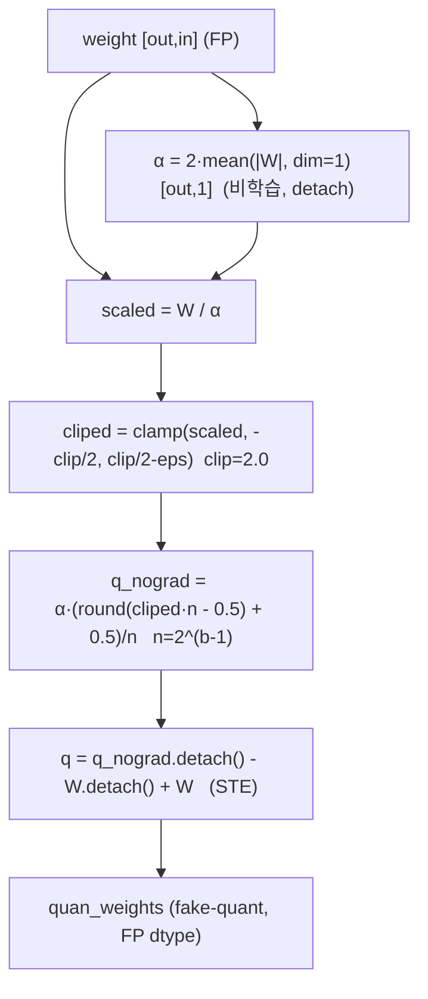
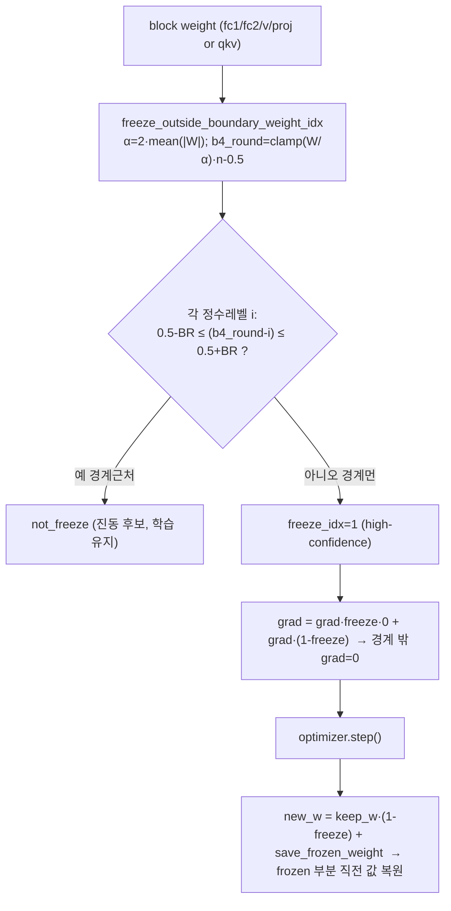
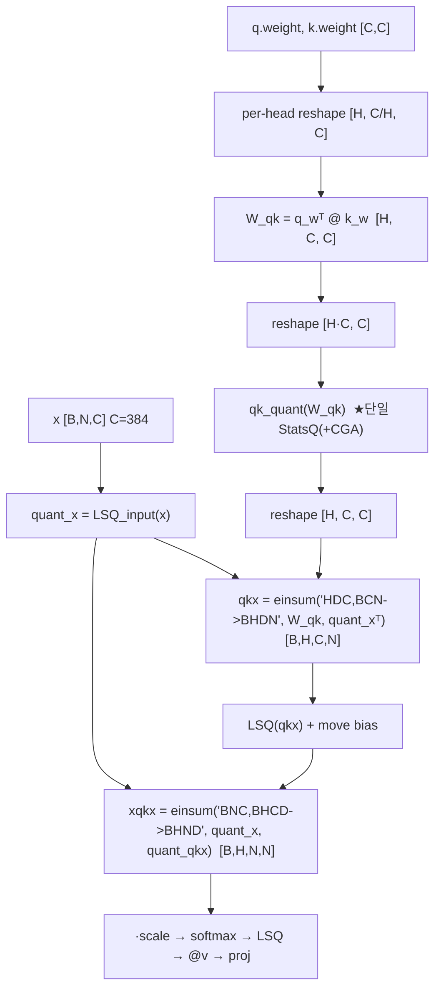
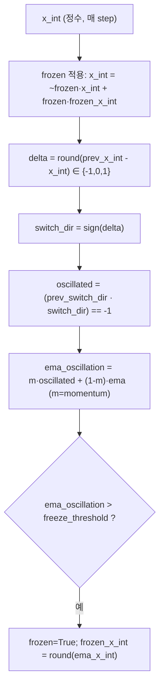
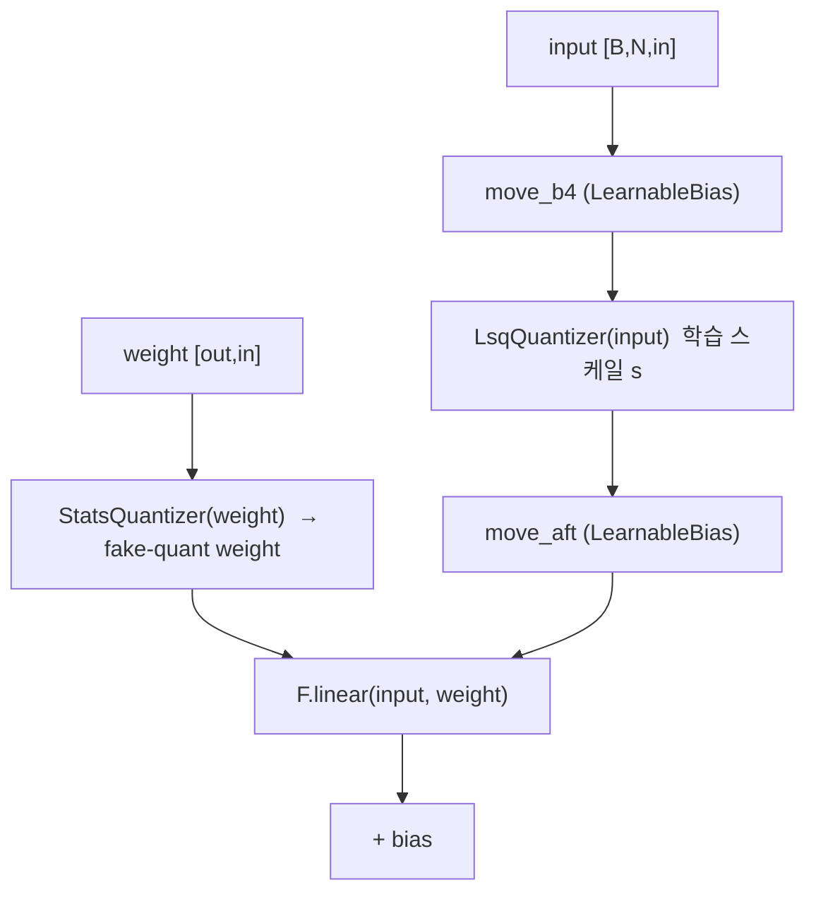
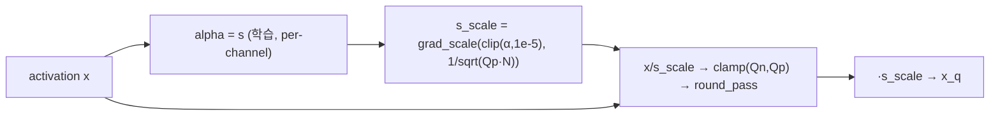

# OFQ 모듈 통합 가이드 (S-PyTorch)

> 1차 요약: [`../OFQ.md`](../OFQ.md) — 본 문서는 그 요약을 모듈 단위로 심화한 통합 가이드다.
> 분석 대상: `\\wsl.localhost\ubuntu-24.04\home\user\project\PRJXR-HBTXR\REF\ViT-Quantization\OFQ`
> 작성 원칙: 실제 소스 Read 후 `파일:라인` 근거 표기. 라인 근거 없는 해석은 "추정", 코드로 확인 불가는 "확인 불가"로 명시.
> 형제 가이드(`REF/Analysis/ViT-Quantization/I-ViT/MODULE_GUIDE.md`)의 6요소 구조를 따르되, I-ViT의 integer-only 비선형 대신 **OFQ의 oscillation 억제 3대 메커니즘(StatsQ / CGA / QKR) 정밀 해부**에 초점을 맞춘다. HW 지표는 **S-PyTorch 수치 규약**(params/FLOPs/activation memory/비트폭/oscillation 지표)으로 표기한다.

---

## 0. 문서 머리말

### 0.1 대표 케이스 선정
- **대표 모델: DeiT-S (`deit_small_patch16_224`)** — `embed_dim=384, depth=12, num_heads=6, mlp_ratio=4, patch16, img224`(I-ViT 동일 백본, `src/deit.py` 팩토리). 근거:
  1. README 결과표에서 OFQ가 **2-bit DeiT-S를 75.72%**(FP32 79.9 대비 -4.2)로 끌어올려, 이전 SOTA 대비 +7.7%p의 핵심 성과 모델(`README.md:5,45`).
  2. OFQ는 **저비트(2~4bit) QAT**가 목표이며(README abstract `:5,74`), DeiT-S는 N=197, C=384, H=6으로 QKR(W_qk=C×C)·CGA 경계 마스킹이 모두 비자명한 규모라 분석 가치가 높음(추정).
- **대표 비트폭: W2A2** (weight 2-bit, activation 2-bit) — README의 대표 결과 행(`:45`)이자 oscillation이 가장 심해 3대 기법이 모두 작동하는 케이스. (W3A3/W4A4도 동일 코드, `--wq_bitw/--aq_bitw`만 변경.)
- **대표 분석 단위: 1 Transformer Block** = `LayerNorm → QAttention(_qkreparam_4_cga) → residual → LayerNorm → QMLP → residual`. DeiT-S는 이를 12개 적층.
- **대표 oscillation 억제 3종**:
  1. **StatsQ** (비학습 통계 스케일, `statsq.py:122-150`)
  2. **CGA** (confidence-guided annealing = high-confidence weight freezing, `statsq.py:154-193` + `cga.py:450-469,953-1013`)
  3. **QKR** (query-key reparameterization, `attention.py:107-222`)
  - 보조: **TrackOscillation**(정수영역 진동 EMA 추적·동결, `statsq.py:32-120`, `lsq.py:111-200`).

### 0.2 S-PyTorch 수치 규약 (I-ViT의 MAC lanes/scalar MACs 대체)
- **params**: 모듈 차원에서 분석적 계산. OFQ는 weight를 fake-quant(`statsq.py:148` STE)하므로 **params 개수는 FP 원본과 동일**, 비트폭만 달라짐. 단, OFQ는 LearnableBias(RPReLU의 move, `qbias.py:5-13`)와 LSQ 활성 스케일 `s`(`lsq.py:46,57`)라는 **추가 학습 파라미터**가 있음(I-ViT의 0 추가 파라미터와 차이).
- **FLOPs/MACs**: 표준식×config. Linear MAC = `B·N·in·out`. Attention QKᵀ/AV = `B·H·N²·dh`. QKR은 attention을 `X·W_qk·Xᵀ`로 재구성하므로 **추가 행렬곱(W_qk=C×C, X·W_qk)** 발생 — 별도 산출.
- **activation memory**: 텐서 shape × 비트폭. OFQ는 fake-quant라 실제 텐서는 FP32지만, **정수 도메인 비트폭(W/A bits)**을 "HW 환산 activation bit"로 표기(`shape × A_bit`). 대표 A2(=2bit).
- **oscillation 지표**: 정수값 `x_int`의 step간 차분 `Δ∈{-1,0,1}`, 진동 = `sign(Δ(t-1))·sign(Δ(t))==-1`(`statsq.py:72-77`), 진동도 EMA `o_ema = m·o + (1-m)·o_ema`(`:78-80`), 동결 임계 `freeze_threshold`(`:90-98`). 본 세션 미실행 → 진동 **수치값은 확인 불가**, 정의·메커니즘만 라인 근거.
- **비트폭/스케일**: 코드 직접. weight StatsQ는 비학습 스케일 `α=2·mean(|W|)`(`statsq.py:138`), activation LSQ는 학습 스케일 `s`(`lsq.py:92`). per-channel(weight)·per-channel(act) 대칭.
- **정확도/속도**: README 인용. 본 세션 미실행 → 측정 불가 항목은 "확인 불가".

### 0.3 운영 경로 (2단계 QAT: 사전QAT → CGA finetune)
```
[FP 사전학습 가중치 로드] create_model(pretrained=True)  (cga.py:436, README.md:28)
   │  DeiT torch.hub deit_*_patch16_224 (timm/DeiT)
   ▼
[1단계: 사전 QAT] train.py: StatsQ(weight) + LSQ(act) QAT, CGA freezing 없음
   │  get_qat_model → replace_module_by_qmodule_deit (train.py:386-424)
   │  qk_reparam=False → QMODULE_MAPPINGS{Linear:QLinear, Attention:QAttention, Mlp:QMLP}
   ▼
[2단계: CGA finetune] cga.py: --qk_reparam --qk_reparam_type 1 --freeze_for_n_epochs 15
   │  QAttention_qkreparam_4_cga (StatsQuantizer_specific_4_qkreparam_cga) (utils.py:174-225)
   │  + train_one_epoch CGA: 경계 밖 grad=0 → step → frozen weight 복원 (cga.py:953-1013)
   │  boundaryRange 0.005/0.007 (cga.py:369)
   ▼
[best 체크포인트 저장] (SharePoint 링크, README.md:41-51 — 내용 확인 불가)
   ▼
[ImageNet 평가] eval.py / validate() — Top-1 (cga.py:1092)
```
- 타깃 디바이스: **CUDA GPU 전제** — StatsQ CGA의 `torch.zeros_like(...).cuda()`(`statsq.py:182`), LSQ `device="cuda"`(`lsq.py:57,65` 등 다수), freeze 함수 `.cuda()` 경로. → CPU 단독 실행 불가(코드 근거 확인, 실행 실패 미검증).

### 0.4 모델 / 데이터셋 / 정확도 (README 인용)
| Model | #Bits | FP32 | OFQ Top-1 | Diff | eval script | 근거 |
|---|---|---|---|---|---|---|
| DeiT-T | 2-2 | 72.02 | 64.33 | -7.69 | deit_t/w2a2.sh | `README.md:40-41` |
| DeiT-T | 3-3 | 72.02 | 72.72 | +0.70 | deit_t/w3a3.sh | `README.md:42` |
| DeiT-T | 4-4 | 72.02 | 75.46 | +3.44 | deit_t/w4a4.sh | `README.md:43` |
| **DeiT-S(대표)** | **2-2** | **79.9** | **75.72** | **-4.18** | deit_s/w2a2.sh | `README.md:44-45` |
| DeiT-S | 3-3 | 79.9 | 79.57 | -0.33 | deit_s/w3a3.sh | `README.md:46` |
| DeiT-S | 4-4 | 79.9 | 81.10 | +1.20 | deit_s/w4a4.sh | `README.md:47` |
| Swin-T | 2-2 | 81.2 | 78.52 | -2.68 | swin_t/w2a2.sh | `README.md:48-49` |
| Swin-T | 3-3 | 81.2 | 81.09 | -0.11 | swin_t/w3a3.sh | `README.md:50` |
| Swin-T | 4-4 | 81.2 | 81.88 | +0.68 | swin_t/w4a4.sh | `README.md:51` |
- **핵심 성과**: 2-bit DeiT-T/DeiT-S가 이전 SOTA 대비 **+9.8%/+7.7%** (`README.md:5,74`).
- 데이터셋: **ImageNet (ILSVRC12)**, 224×224, 1000 클래스 (`README.md:24-25`).
- 속도(latency): 본 repo는 QAT 학습 코드만, **확인 불가**.
- 체크포인트: SharePoint 링크(`README.md:41-51`) — 내용 **확인 불가**.

---

## 1. Repo / Layer 개요

OFQ = 저비트 ViT의 **QAT 중 weight oscillation(양자화 가중치가 두 정수 레벨 사이를 반복 점프)** 문제를 제거하여 학습 안정성·정확도를 높이는 QAT 프레임워크(`README.md:5`). 핵심 통찰: **학습형 스케일(LSQ)이 oscillation을 악화**시키며, **q·k 가중치의 상호의존**도 oscillation을 유발한다(`README.md:74`). LSQ 계열을 base로 하되 weight를 StatsQ로 치환하고 CGA·QKR을 추가한다.

### 1.1 자체 소스 vs 외부 프레임워크 vs 제외

| 구분 | 파일(자체 소스) | 역할 |
|---|---|---|
| **양자화기 ★핵심** | `src/quantization/quantizer/statsq.py` | StatsQuantizer(StatsQ) + StatsQuantizer_specific_4_qkreparam_cga(CGA) + TrackOscillation |
| | `src/quantization/quantizer/lsq.py` | LsqQuantizerWeight + LsqQuantizerWeight_iterative_freezing + 활성 LSQ 7종 + TrackOscillation |
| **양자화 모듈 ★핵심** | `src/quantization/modules/qlinear.py` | QLinear/QMLP(StatsQ weight + LSQ act), LSQ_QConv2d, LSQ_QLinear4head, LSQ_w_and_act_* |
| | `src/quantization/modules/attention.py` | QAttention / QAttention_qkreparam / QAttention_qkreparam_4_cga(QKR+CGA) / QAttention_lsq |
| | `src/quantization/modules/qbias.py` | LearnableBias(RPReLU move) |
| | `src/quantization/modules/utils.py` | replace_module_by_qmodule_deit/swin (모듈 교체 + 매핑 테이블) |
| | `src/quantization/modules/swin_attention_and_mlp.py` | Swin용 양자 어텐션/MLP(미열람 — ViT와 동일 패턴 추정) |
| **모델 정의** | `src/deit.py` / `src/deit_vision_transformer.py` | DeiT 베이스(Attention/Mlp 원형, 미열람 세부) |
| | `src/swin.py` | Swin 베이스(미열람) |
| **학습 엔트리** | `cga.py` ★ | CGA finetune 통합 학습 스크립트 (get_qat_model, freeze 함수, train_one_epoch CGA) |
| | `train.py` | 1단계 일반 QAT(StatsQ+LSQ, CGA freezing 없음) — cga.py와 동일 구조 |
| | `eval.py` | 평가(미열람) |
| **보조** | `src/registry.py`, `src/utils/*` | tokenizer/transformers/embedder 등(미열람) |

### 1.2 forward 진입점 / 모듈 교체 메커니즘
OFQ는 **timm DeiT 모델을 만든 뒤 `replace_module_by_qmodule_deit`로 nn.Linear/Attention/Mlp를 양자 모듈로 in-place 치환**한다(`utils.py:62-282`). 세 가지 매핑 분기:
- **W&Act LSQ 모드**(`utils.py:65-119`): weight·act 모두 LSQ — 비교군.
- **QKR 모드**(`utils.py:121-225`): `qk_reparam_type=0`→`QAttention_qkreparam`, `type=1`→`QAttention_qkreparam_4_cga`(CGA 적용).
- **StatsQ 모드(기본)**(`utils.py:227-280`): `QMODULE_MAPPINGS`(`:21-25`) = {Linear→QLinear, Attention→QAttention, Mlp→QMLP}.
- **공통**: `patch_embed.proj`는 항상 `LSQ_QConv2d`(W8A8 고정), `head`는 `LSQ_QLinear4head`(W8A8 고정)로 교체(`utils.py:68-101` 등 모든 분기). → **patch embed와 head는 8-bit, transformer block만 저비트(2/3/4bit)**.

### 1.3 제외 (지시에 따라 이름만 표기, 미분석)
- **외부 프레임워크(커스텀 아님)**: `timm`(create_model, optimizer/scheduler, Mixup, ModelEma, NativeScaler, accuracy — `cga.py` import), DeiT 원본 사전학습 체크포인트(timm/torch.hub — 가중치만 로드).
- **제외**: `imgs/`(그림), `train_scripts/`·`eval_scripts/`(셸 스크립트), `timm_fix_imagenet_loading_bugs/dataset_factory.py`(timm 버그픽스 — 외부), SharePoint 체크포인트(이름·링크만).
- **미열람(확인 불가)**: `src/deit.py`/`deit_vision_transformer.py`/`swin.py` 세부(base Attention/Mlp 정의 — 양자 모듈이 상속·참조), `swin_attention_and_mlp.py`, `eval.py`, `src/utils/*`.

### 1.4 대표 모델 레이어 구성 (DeiT-S, 2단계 CGA finetune 기준)
1 Block당 양자 모듈: QAttention_qkreparam_4_cga 1개(내부에 q/k/v Linear + qk_quant(CGA) + v_quant + proj(QLinear)), QMLP 1개(fc1/fc2 = QLinear×2 + GELU). + patch_embed(LSQ_QConv2d), head(LSQ_QLinear4head)는 모델당 1회.

---

## 2. 모듈: StatsQ — `statsq.py` (StatsQuantizer) ★oscillation 억제 1

### 2.1 역할 + 상위/하위
- **역할**: weight를 **비학습 통계 스케일** `α=2·mean(|W|)`로 양자화. LSQ의 학습형 스케일 `s`가 weight와 공진동(co-oscillation)하는 것을 차단 — OFQ의 1차 oscillation 억제.
- **상위**: `QLinear.statsq_fn`(`qlinear.py:51,62`), `QAttention.qkv/proj`(via QLinear), QKR의 `v_quant`(`attention.py:141,258`). **하위**: 순수 텐서 연산(round/clamp).

### 2.2 데이터플로우 (텐서 shape 흐름, DeiT-S qkv weight 예)


### 2.3 forward call stack
`QLinear.forward`(`qlinear.py:58`) → `self.statsq_fn(self.weight)`(`:62`) → `StatsQuantizer.forward`(`statsq.py:133`) → 스케일 산출(`:138-142`) → clamp(`:145`) → half-level round(`:147`) → STE(`:148`).

### 2.4 대표 코드 위치
`statsq.py`: 클래스 `:122-150`, 스케일 `α=2·mean(|W|)` `:138-140`, detach `:142`, clamp `:145`, half-level 양자화 `:146-147`, STE `:148`. STE 유틸 `round_pass`/`grad_scale`/`clip`/`modify_grad` `:13-29`.

### 2.5 대표 코드 블록
```python
# statsq.py:138-142  비학습 통계 스케일 (LSQ의 학습 스케일 대체)
if len(weight.shape) == 2:
    scaling_factor = 2 * torch.mean(abs(real_weights), dim=1, keepdim=True)   # [out,1]
elif len(weight.shape) == 3:
    scaling_factor = 2 * torch.mean(torch.mean(abs(real_weights), dim=-1, keepdim=True), dim=0, keepdim=True)
scaling_factor = scaling_factor.detach()   # ★ 그래디언트 차단: 스케일은 학습 안 함
```
→ **핵심**: `α`를 `.detach()`로 학습에서 분리. LSQ는 `s`가 grad_scale로 학습되어(`lsq.py:92`) weight 변화와 상호 진동하지만, StatsQ는 `α`가 매 step `|W|` 통계로 결정될 뿐 별도 학습 안 됨 → **스케일-가중치 공진동 제거**(README `:5,74`).

```python
# statsq.py:145-148  half-level(대칭 격자) 양자화 + STE
cliped_weights = torch.clamp(scaled_weights, min=(-self.clip_val/2), max=(self.clip_val/2)-1e-6)  # clip_val=2.0
n = float(2 ** (self.num_bits - 1))
quan_weights_no_grad = scaling_factor * ((torch.round((cliped_weights) * n - 0.5) + 0.5) / n)
quan_weights = quan_weights_no_grad.detach() - real_weights.detach() + real_weights   # STE
```
→ `round(x·n - 0.5) + 0.5` = **half-integer 격자**(±0.5, ±1.5, ...)로 대칭 양자화. n=2^(b-1)이므로 2-bit면 n=2, 격자 4레벨. clip_val=2.0 고정(`:126`, `requires_grad=False` `:128`).

### 2.6 연산·수치표현 분해 + oscillation 억제 정량 (DeiT-S, W2)
- **양자화 방식**: weight per-out-channel(2D는 dim=1, 3D는 dim=-1&0) 대칭, half-level. 스케일 **비학습**.
- **scale**: `α=2·mean(|W|)` per-channel, detach. clip_val=2.0 상수.
- **비트폭**: W2(대표). n=2^(b-1). (W3→n=4, W4→n=8.)
- **oscillation 억제 원리**: LSQ는 weight `w`와 스케일 `s`가 동시에 학습되어, `w/s`의 반올림 경계 근처에서 `s` 미세변화가 정수레벨을 뒤집어 진동을 증폭. StatsQ는 `s=α`를 학습에서 제외해 이 피드백 루프를 끊음(README `:5`, 코드 `:142`).
- **params**: 추가 학습 파라미터 0 (`clip_val`은 `requires_grad=False` `:128`). FP weight는 그대로 학습.
- **FLOPs**: weight 원소 N에 대해 mean reduce + div + clamp + round = O(N). DeiT-S qkv weight(384×1152≈442K) 양자화 = 442K 원소연산 (forward마다 재계산).
- **HW 친화성**: 추론 시 `α`는 채널당 **상수**(학습된 텐서가 아니라 |W| 통계로 정해진 고정값) → FPGA에서 정수 MAC + 채널당 고정 스케일 곱 1회. (5장 FPGA 시사점 참조.)

---

## 3. 모듈: CGA — `statsq.py` + `cga.py` (confidence-guided annealing) ★oscillation 억제 2

### 3.1 역할 + 상위/하위
- **역할**: 양자화 격자 경계(round의 0.5 지점) **근처에서 진동 중인 weight만 학습**시키고, 경계에서 먼 **high-confidence weight는 freeze**(grad=0 + step 후 값 복원). 진동 가중치를 천천히 수렴(annealing)시킴.
- **두 구현 경로**:
  1. **인-양자화기 마스킹**: `StatsQuantizer_specific_4_qkreparam_cga`(`statsq.py:154-193`) — QKR의 qk_quant에서 forward 중 경계 밖 grad 차단.
  2. **인-학습루프 마스킹**: `cga.py`의 `freeze_outside_boundary_weight_idx`(`:450-469`) + `train_one_epoch`(`:953-1013`) — 모든 block weight에 대해 backward 후 grad 마스킹 + step 후 복원.
- **상위**: `QAttention_qkreparam_4_cga`(`attention.py:257`), `cga.py:main` 학습 루프. **하위**: StatsQ 격자 산출.

### 3.2 데이터플로우 (CGA freezing, 학습루프 경로)


### 3.3 forward / 학습 call stack
- **인-학습루프**: `train_one_epoch`(`cga.py:885`) → backward(`:952`) → block weight 순회 `model.named_modules()`(`:974`) → `freeze_outside_boundary_weight_idx`(`:976`) → grad 마스킹(`:978`) → frozen weight 저장(`:980`) → `optimizer.step()`(`:986`) → frozen weight 복원(`:1007-1013`).
- **인-양자화기**: `QAttention_qkreparam_4_cga.forward`(`attention.py:291`) → `qk_quant(multi_head_qk)`(`:312`) → `StatsQuantizer_specific_4_qkreparam_cga.forward`(`statsq.py:164`) → 경계 마스킹(`:181-188`).

### 3.4 대표 코드 위치
`statsq.py`: CGA 양자기 `:154-193`, boundaryRange `:155,162`, 경계 마스킹 루프 `:181-188`, grad 차단 `:188`. `cga.py`: freeze 함수 `:450-469`, grad 마스킹 `:962,970,978`, frozen 저장 `:964,972,980`, 복원 `:994-997,1002-1005,1010-1013`, 인자 boundaryRange `:369`, freeze_for_n_epochs `:370`.

### 3.5 대표 코드 블록
```python
# statsq.py:181-188  CGA 인-양자화기 경계 마스킹 (training 중)
if self.training:
    not_freeze_idx = torch.zeros_like(real_weights).cuda()
    for i in np.arange(start=-(2**(self.num_bits-1)), stop=(2**(self.num_bits-1)-1)):
        within_boundary = ((b4_round - i) <= (0.5 + self.boundaryRange)) * ((b4_round - i) >= (0.5 - self.boundaryRange))
        not_freeze_idx = not_freeze_idx + within_boundary.float()    # 경계 ±BR 안 = 진동 후보
    freeze_idx = 1.0 - not_freeze_idx
    b4_round = b4_round.detach() * freeze_idx + b4_round * (1 - freeze_idx)  # ★ frozen 부분 grad 차단
```
→ 각 정수레벨 `i`에 대해 `round` 경계(0.5) ±boundaryRange 안에 있으면 "진동 후보(미동결)". 경계에서 먼(=확신 높은) weight는 `freeze_idx=1`로 `b4_round.detach()`되어 **그래디언트 0**. boundaryRange 기본 0.005(`:155`).

```python
# cga.py:976-980  CGA 인-학습루프 grad 마스킹 + frozen 저장 (backward 후)
freeze_idx = freeze_outside_boundary_weight_idx(v.weight, args.wq_bitw, boundaryRange=args.boundaryRange)
freeze_idx_dic[k] = freeze_idx.detach().clone()
v.weight.grad = v.weight.grad * freeze_idx * 0.0 + v.weight.grad * (1 - freeze_idx)  # 경계 밖 grad=0
save_frozen_weight[k] = (v.weight * freeze_idx).detach().clone()                     # frozen 값 저장
```
```python
# cga.py:1010-1013  step 후 frozen weight 복원 (확신 가중치 고정)
keep_w = (v.weight.detach().clone() * (1 - freeze_idx_dic[k]))   # 학습된(미동결) 부분
replace_freeze_part = save_frozen_weight[k]                       # 동결 부분 = 직전 값
new_weight = keep_w + replace_freeze_part
v.weight.data.copy_(new_weight)                                   # optimizer가 건드린 동결부분 되돌림
```
→ `freeze_outside_boundary_weight_idx`(`:450-469`)는 StatsQ와 **동일한 격자**(`α=2·mean(|W|)`, `b4_round=clamp(W/α)·n-0.5`, `:462-463`)로 경계를 판정. block 내 `fc1/fc2/qkv/proj`(QKR이면 `fc1/fc2/v/proj`) 가중치만 대상(`:975`/`:967`).

### 3.6 oscillation 억제 정량 + 메커니즘
- **억제 원리**: round 경계(`x·n`의 소수부 0.5 근처)에 있는 weight는 미세한 grad에도 정수레벨이 뒤집혀 진동. CGA는 (a) **경계 근처만 학습**시켜 진동을 점진 수렴시키고, (b) **경계에서 먼 weight는 완전 고정**해 불필요한 진동 유발을 막음. = "high-confidence freeze + oscillating-weight annealing"(README `:74`).
- **boundaryRange**: 진동 후보로 보는 경계 폭. 0.005/0.007이 최적(`cga.py:369` help). Fig.1(README `:9-10`)은 4개 BR[0.003,0.005,0.007,0.01]의 StatsQ 스케일 궤적 안정화를 시각화(이미지, 본 세션 미렌더 — 확인 불가).
- **적용 단계**: `freeze_for_n_epochs`(기본 15, `cga.py:370`) 동안 CGA finetune. `cooldown_epochs = freeze_for_n_epochs`(`:497`).
- **비용**: 매 step 전체 block weight를 `named_modules()` 순회하며 grad 마스킹·frozen 저장·step 후 복원 → **학습 오버헤드 큼**(`cga.py:953-1013`, GPU 메모리에 frozen weight 복제). 추론 시에는 영향 없음.
- **params/FLOPs**: 추가 파라미터 0. step당 추가 연산 = block weight 수 × (마스크 산출 + 복제) ≈ 21M weight 규모(DeiT-S block Linear) × O(1).

---

## 4. 모듈: QKR — `attention.py` (QAttention_qkreparam[_4_cga]) ★oscillation 억제 3

### 4.1 역할 + 상위/하위
- **역할**: attention logit `(XW_qᵀ)(XW_k)ᵀ = X(W_qᵀW_k)Xᵀ`에서 **q,k를 따로 양자화하지 않고 융합 행렬 `W_qk=W_qᵀW_k`를 단일 양자화**. q·k 가중치의 상호의존(interdependence)이 유발하는 진동·gradient misestimation 제거(README `:74`).
- **상위**: `replace_module_by_qmodule_deit`의 QKR 분기(`utils.py:159,211`). **하위**: `StatsQuantizer`(qk_quant, type=0) 또는 `StatsQuantizer_specific_4_qkreparam_cga`(qk_quant, type=1) + LSQ 활성.

### 4.2 데이터플로우 (텐서 shape 흐름, DeiT-S)


### 4.3 forward call stack
`QAttention_qkreparam_4_cga.forward`(`attention.py:291`) → `quant_x = quant_x_4_qkv(x)`(`:294`) → v 경로(`:296-304`) → q/k per-head reshape(`:307-308`) → `W_qk = q_wᵀ@k_w`(`:310`) → `qk_quant(W_qk)`(`:312`, CGA StatsQ) → `qkx = einsum`(`:317`) → LSQ(`:321`) → `xqkx = einsum`(`:327`) → softmax(`:331`) → `@v`(`:336`) → proj(`:337`).

### 4.4 대표 코드 위치
`attention.py`: QAttention_qkreparam `:107-222`, QAttention_qkreparam_4_cga `:224-339`. q/k/v 분리·사전학습 슬라이스 복사 `:126-138`(=`:243-255`), qk_quant 선언 `:140`(StatsQ) vs `:257`(CGA StatsQ), W_qk 융합 `:193`(=`:310`), 단일 양자화 `:195`(=`:312`), einsum logit `:200,210`(=`:317,327`), qkv 삭제 `:172`(=`:289`).

### 4.5 대표 코드 블록
```python
# attention.py:190-196  W_qk 융합 후 단일 양자화 (q,k 따로 양자화 안 함)
multi_head_q_weight = self.q.weight.reshape(self.num_heads, self.q.out_features//self.num_heads, self.q.in_features)
multi_head_k_weight = self.k.weight.reshape(self.num_heads, self.k.out_features//self.num_heads, self.k.in_features)
multi_head_qk = multi_head_q_weight.transpose(-2,-1).contiguous() @ multi_head_k_weight   # [H, C, C] = W_qᵀW_k
multi_head_qk = multi_head_qk.reshape(self.num_heads*self.q.out_features, self.q.in_features)
multi_head_qk_qunat = self.qk_quant(multi_head_qk)        # ★ 융합 행렬 단일 StatsQ(+CGA)
multi_head_qk_qunat = multi_head_qk_qunat.reshape(self.num_heads, self.q.in_features, self.q.in_features)
```
→ q,k 가중치를 **곱한 뒤(W_qk)** 한 번만 양자화. q·k 각각을 양자화할 때 발생하는 **상호 진동·gradient misestimation 제거**(README `:74`). 사전학습 가중치는 qkv를 슬라이스해 q/k/v로 복사(`:131-138`).

```python
# attention.py:200,210  logit = X·W_qk·Xᵀ (einsum 2회)
qkx = torch.einsum('HDC, BCN -> BHDN', multi_head_qk_qunat, quant_x.transpose(-2,-1).contiguous())  # W_qk·Xᵀ → [B,H,C,N]
...
xqkx = torch.einsum('BNC, BHCD -> BHND', quant_x, quant_qkx)   # X·(W_qk·Xᵀ) → [B,H,N,N]
```
→ `type=1`이면 `qk_quant = StatsQuantizer_specific_4_qkreparam_cga`(`:257`)로 CGA가 W_qk 양자화에 동시 적용 → **QKR + CGA 결합**(파이프라인 2단계).

### 4.6 연산·수치표현 분해 + oscillation 억제 정량 (DeiT-S, B=1, N=197, C=384, H=6)
- **양자화 방식**: W_qk는 StatsQ(또는 CGA StatsQ), v.weight는 StatsQ(`v_quant`, `:258`), proj는 QLinear(StatsQ). 활성은 LSQ(quant_x/qkx/v/softmax).
- **억제 원리**: q,k가 attention에서 곱으로만 등장하므로, 개별 양자화는 `Q(W_q)·Q(W_k)`로 이중 양자화 오차·상호의존 진동을 만듦. QKR은 `Q(W_qᵀW_k)`로 융합 후 1회 양자화 → 진동원 제거(README `:74`).
- **추가 MACs(QKR 오버헤드, block당)**:
  - W_qk 융합: `H·C·C·(C/H)` = 6×384×384×64 ≈ **3.6G**? — 실제는 per-head `q_wᵀ@k_w`: H개의 (C×C/H)ᵀ@(C/H×C) → H·C·C·(C/H)/H... 정정: `[H,C/H,C]ᵀ @ [H,C/H,C]` = H·C·C·(C/H) = 6·384·384·64 ≈ **5.4M** (weight 융합, 입력 무관, batch당 1회).
  - `qkx = W_qk·Xᵀ`: H·C·C·N = 6×384×384×197 ≈ **174M** (표준 QKᵀ의 H·N·dh·N=14.9M보다 큼 — 중간차원 C로 확장).
  - `xqkx = X·qkx`: H·N·C·N = 6×197×384×197 ≈ **89M**.
- **메모리 trade-off**: W_qk가 `[H,C,C]`=6×384×384≈884K 원소(FP면 3.5MB) — q+k weight(2×C×C=295K)보다 3배. qkx 중간텐서 `[B,H,C,N]`=6×384×197≈454K. → **연산·메모리 증가가 QKR의 대가**(추정, 라인 근거: shape 주석 `:193,200`).
- **params**: q/k/v Linear = 3×C×C(+v bias) ≈ 3×147K = 442K/block(qkv와 동일, bias만 v에). proj 별도.

---

## 5. 모듈: TrackOscillation + iterative freezing — `statsq.py`/`lsq.py` ★진동 추적

### 5.1 역할 + 상위/하위
- **역할**: 양자화 정수값 `x_int`의 **step간 진동을 정수영역에서 EMA로 추적**하고, 진동도가 임계 초과 시 해당 weight를 **동결**(frozen). LSQ weight에 끼워 쓰는 진동 대응 버전(`LsqQuantizerWeight_iterative_freezing`).
- **상위**: `LsqQuantizerWeight_iterative_freezing.forward`(`lsq.py:291`). StatsQ에도 동일 클래스 정의 존재(`statsq.py:32-120`)하나 본선 StatsQ는 CGA 마스킹을 쓰고 TrackOscillation은 LSQ-freezing 비교군에 사용(추정).
- **하위**: 순수 텐서 연산.

### 5.2 데이터플로우 (진동 추적·동결)


### 5.3 forward call stack
`LsqQuantizerWeight_iterative_freezing.forward`(`lsq.py:259`) → LSQ 양자화(`:282-287`) → `weight_freeze_tracker(x_int, skip_tracking=not training)`(`:291-293`) → `TrackOscillation.__call__`(`lsq.py:137`) → 진동 검출(`:151-156`) → EMA(`:157-159`) → 동결(`:169-177`).

### 5.4 대표 코드 위치
`statsq.py` TrackOscillation `:32-120`(진동 정의 `:72-77`, EMA `:78-80`, 동결 `:90-98`). `lsq.py` TrackOscillation `:111-200`(동일), `LsqQuantizerWeight_iterative_freezing` `:202-304`(tracker 선언 `:234`, 적용 `:289-293`).

### 5.5 대표 코드 블록
```python
# statsq.py:72-80 (= lsq.py:151-159)  정수영역 진동 정의 + EMA
delta_x_int = torch.round(self.prev_x_int - x_int).detach()   # {-1,0,1}
switch_dir = torch.sign(delta_x_int)
oscillated = (self.prev_switch_dir * switch_dir) == -1          # ★ 직전과 반대방향 점프 = 진동
self.ema_oscillation = self.momentum * oscillated + (1 - self.momentum) * self.ema_oscillation
```
```python
# statsq.py:90-98 (= lsq.py:169-177)  진동도 임계 초과 weight 동결
if self.freeze_threshold > 0:
    freeze_weights = self.ema_oscillation > self.freeze_threshold
    self.frozen[freeze_weights] = True
    self.frozen_x_int[freeze_weights] = torch.round(self.ema_x_int[freeze_weights])   # EMA 정수값으로 고정
```
→ CGA(경계 기반 freeze)와 달리, TrackOscillation은 **실제 진동 이력(EMA)** 기반 freeze. `freeze_threshold`는 "momentum의 2-3배 이상" 권장(`:131` 주석).

### 5.6 정량
- **oscillation 지표**: `ema_oscillation`(weight별 진동 빈도 EMA), `oscillated_sum`(step당 진동 weight 수), `total_oscillation`(누적). 본 세션 미실행 → **수치 확인 불가**, 추적 메커니즘만 라인 근거.
- **momentum/threshold**: 생성자 인자(`lsq.py:203`, 기본 momentum=0.01, freeze_threshold=0.0=비활성). LSQ-freezing 실험 시 활성화.
- **params**: 학습 파라미터 0(buffer: frozen, frozen_x_int, ema_x_int, prev_x_int 등 — weight와 동일 shape 복제 → 메모리 2-3배).

---

## 6. 모듈: 양자 Linear/MLP — `qlinear.py` (QLinear/QMLP)

### 6.1 역할 + 상위/하위
- **역할**: nn.Linear를 **weight=StatsQ + activation=LSQ**로 양자화. 입력에 RPReLU식 LearnableBias(move_b4/aft)로 분포 시프트.
- **상위**: `QAttention.qkv/proj`(`attention.py:29,42`), `QMLP.fc1/fc2`(`qlinear.py:104,118`), QKR proj(`attention.py:143,260`). **하위**: `StatsQuantizer`(weight), `LsqQuantizer`(act), `LearnableBias`.

### 6.2 데이터플로우 (텐서 shape 흐름)


### 6.3 forward call stack
`QLinear.forward`(`qlinear.py:58`) → `statsq_fn(weight)`(`:62`) → `move_b4`(`:66`) → `input_quant_fn`(LSQ, `:67`) → `move_aft`(`:68`) → `F.linear`(`:69`) → `+bias`(`:71`).

### 6.4 대표 코드 위치
`qlinear.py`: QLinear `:28-87`, statsq 선언 `:51`, LSQ act 선언 `:44`, move bias `:55-56`, forward `:58-73`. QMLP `:89-136`(fc1 symmetric=True `:105`, fc2 symmetric=False `:119`, act_layer 분기 `:110-115,126-131`). LSQ_input `:12-26`.

### 6.5 대표 코드 블록
```python
# qlinear.py:61-73  weight=StatsQ, act=LSQ + RPReLU move
if self.weight_quant_method == 'statsq':
    weight = self.statsq_fn(self.weight)        # ★ weight는 StatsQ (비학습 스케일)
input = self.move_b4(input)                     # RPReLU move (LearnableBias)
input = self.input_quant_fn(input)              # ★ activation은 LSQ (학습 스케일)
input = self.move_aft(input)
out = nn.functional.linear(input, weight)
if not self.bias is None:
    out += self.bias.view(1, -1).expand_as(out)
```
→ OFQ의 핵심 비대칭: **weight=StatsQ(진동 억제), activation=LSQ(학습 스케일 유지)**. activation은 weight만큼 진동에 취약하지 않다고 보고 LSQ를 유지(추정 — 코드상 act는 `LsqQuantizer`로 고정 `:44`).

### 6.6 연산·수치표현 분해 + 정량 (DeiT-S, B=1, N=197)
- **양자화 방식**: weight StatsQ per-channel, act LSQ per-channel(`per_channel=True` `:56,57`). fc1 act symmetric(signed), fc2 act asymmetric(all_positive=GELU 출력, `:105,119`).
- **비트폭**: W2/A2(대표). patch_embed·head는 W8A8(`utils.py` 고정).
- **params** (DeiT-S 1 block, C=384, fake-quant라 FP와 동일 + LearnableBias):
  - qkv: 384×1152+1152 = **443,520** + move_b4/aft(2×384=768)
  - proj: 384×384+384 = **147,840** + move(768)
  - fc1: 384×1536+1536 = **591,360** + move(768)
  - fc2: 1536×384+384 = **590,208** + move(768)
  - Linear params/block ≈ **1.773M** + LearnableBias ~3K + LSQ s(per-channel α) ~4K
  - ×12 block ≈ **21.3M** (DeiT-S 공칭 22M와 일치, 양자화로 개수 불변).
- **MACs/block**(B=1, N=197): qkv 87.1M + proj 29.0M + fc1 116.2M + fc2 116.2M ≈ **348.5M**, ×12 ≈ **4.18G**.
- **activation memory**(A2, [1,197,384]): 197×384×(2/8) byte ≈ **18.9 KB** (A8이면 75.6KB).

---

## 7. 모듈: 활성 LSQ 양자화기군 — `lsq.py` (LsqQuantizer 외)

### 7.1 역할 + 상위/하위
- **역할**: activation을 **학습형 스케일 `s`(LSQ)**로 per-channel/per-head 대칭/비대칭 양자화. weight와 달리 act는 LSQ 유지(OFQ는 act 진동을 StatsQ로 막지 않음).
- **상위**: QLinear/QAttention의 모든 활성 양자화(q/k/v/qkx/softmax/input). **하위**: `grad_scale`/`round_pass`/`clip`(`lsq.py:6-18`).

### 7.2 데이터플로우 (LSQ)


### 7.3 forward call stack
`LsqQuantizer.forward`(`lsq.py:571`) → init_from(첫 호출 α 초기화, `:544-569`) → `s_grad_scale` 산출(`:582-591`) → `grad_scale(clip(α))`(`:593`) → clamp+round_pass(`:599-600`) → `·s_scale`(`:601`).

### 7.4 대표 코드 위치
`lsq.py`: `LsqQuantizerWeight` `:20-109`(weight LSQ 비교군, init `α=2·mean(|W|)/sqrt(Qp)` `:54`, grad_scale `:87`). 활성 변형 7종: `LsqQuantizer`(`:515`), `LsqQuantizer4img`(`:306`, signed 자동감지 `:338-339`), `LsqQuantizer4Conv2d`(`:384`), `LsqQuantizer4head_input`(`:448`), `LsqQuantizer_only_headwise`(`:612`), `LsqQuantizer4v`(`:701`). `LsqQuantizerWeight_iterative_freezing`(`:202-304`, 5장).

### 7.5 대표 코드 블록
```python
# lsq.py:92-101  LSQ: 학습 스케일 s + grad_scale STE
s_scale = grad_scale(clip(alpha, torch.tensor(1e-5).float().to(x.device)), s_grad_scale)
x = x / s_scale
if self.bit == 1 and not self.all_positive:
    x = torch.sign(x)                              # 1-bit는 sign
else:
    x = torch.clamp(x, self.thd_neg, self.thd_pos)
    x = round_pass(x)                              # STE round
x = x * s_scale
```
→ `s_grad_scale = 1/sqrt(Qp·N)`(`:87,584`)로 스케일 그래디언트 정규화 — LSQ 표준. **이 학습형 `s`가 weight에서는 진동을 악화시키므로 StatsQ로 대체**한 것이 OFQ의 출발점(README `:5`).

### 7.6 정량
- **양자화 방식**: per-channel(기본) 대칭/비대칭. signed면 `[-2^(b-1), 2^(b-1)-1]`, all_positive(unsigned)면 `[0, 2^b-1]`(`:32-39`). 1-bit는 sign/{0,1}.
- **비트폭**: A2(대표). softmax 출력은 all_positive(unsigned, `attention.py:65,169,286`).
- **params**: 학습 스케일 `s` per-channel(예: qkv 출력 1152개, [out] 크기). weight LSQ 비교군은 `s` 학습/비학습 선택(`learnable` 인자).
- **HW 함의**: act LSQ 스케일은 **학습된 텐서** → 추론 시 채널당 상수로 동결되나, StatsQ(|W| 통계)와 달리 학습 산출물(추정).

---

## N+1. 모듈 한눈 요약 표

| 모듈 | 파일:라인 | 역할 | 양자화/억제 방식 | oscillation 억제 |
|---|---|---|---|---|
| **StatsQ** | statsq.py:122-150 | weight 비학습 통계 스케일 양자화 | α=2·mean(\|W\|) detach, half-level | ★스케일-가중치 공진동 제거 |
| **CGA(양자기)** | statsq.py:154-193 | 경계 ±BR 밖 grad 차단 | freeze_idx 마스킹 | ★high-confidence freeze |
| **CGA(학습루프)** | cga.py:450-469,953-1013 | block weight grad=0 + step후 복원 | freeze_outside_boundary | ★진동 가중치만 annealing |
| **QKR** | attention.py:107-339 | W_qk=W_qᵀW_k 융합 단일 양자화 | StatsQ(+CGA) on [H,C,C] | ★q-k 상호의존 진동 제거 |
| **TrackOscillation** | statsq.py:32-120 / lsq.py:111-200 | 정수영역 진동 EMA 추적·동결 | oscillated EMA > threshold | ★진동 이력 기반 freeze |
| QLinear/QMLP | qlinear.py:28-136 | weight=StatsQ + act=LSQ + RPReLU move | per-ch W2/A2 | (StatsQ 경유) |
| 활성 LSQ 7종 | lsq.py:306-801 | act 학습 스케일 양자화 | per-ch/head 대칭·비대칭 | (act는 LSQ 유지) |
| 모듈 교체 | utils.py:62-413 | nn 모듈→양자 모듈 in-place | 매핑 테이블 3종 | patch/head는 W8A8 고정 |
| 학습 파이프라인 | cga.py / train.py | 2단계 QAT(사전→CGA finetune) | StatsQ+LSQ→+QKR+CGA | 전체 통합 |

---

## N+2. 학습·평가 파이프라인 + 재현

### N+2.1 2단계 QAT 흐름
- **1단계(train.py)**: StatsQ(weight) + LSQ(act) 일반 QAT. `qk_reparam=False`(`train.py:365`), CGA freezing 없음. 모듈 교체 = `QMODULE_MAPPINGS`(QAttention/QLinear/QMLP, `utils.py:21-25,266`).
- **2단계(cga.py)**: 1단계 결과를 `--qk_reparam --qk_reparam_type 1`로 QKR+CGA finetune. `freeze_for_n_epochs`(기본 15, `cga.py:370`), `boundaryRange` 0.005/0.007(`:369`). 모듈 교체 = `QAttention_qkreparam_4_cga`(`utils.py:174-225`).

### N+2.2 핵심 인자 (cga.py argparse)
- 양자화: `--wq_mode`(weight, statsq), `--aq_mode`(act, lsq), `--wq_bitw`/`--aq_bitw`(비트폭), `--wq_per_channel`/`--aq_per_channel`, `--wq_clip_learnable`/`--aq_clip_learnable`, `--qmodules`(양자화 대상 모듈) (`cga.py:404-423` qconfig 생성).
- QKR/CGA: `--qk_reparam`(`:365`), `--qk_reparam_type {0,1}`(`:366`, 0=normal, 1=cga finetune), `--boundaryRange`(`:369`), `--freeze_for_n_epochs`(`:370`).
- 모델: `--model_type {deit,swin}`(`:349`), `--pretrained_initialized`(`:362`, 사전학습 가중치로 q/k/v 초기화), `--act_layer {gelu,relu,prelu,rprelu,None}`(`:359`).
- 증류: `--use-kd`(`:323`), `--teacher`(`:329`), `--kd_hard_and_soft`(`:360`), `--quant-teacher`(`:334`, teacher도 W4A4 양자화 `:443-444`).
- **setup_alpha**(`cga.py:1076-1089`): 첫 배치 forward 1회로 LSQ `s`(α) 초기화 후 학습 시작(`:684`).

### N+2.3 재현 명령 (스크립트 참조)
```bash
# 1단계 사전 QAT (예: DeiT-S W2A2) — train_scripts/ 참조
python train.py --model deit_small --wq_bitw 2 --aq_bitw 2 ...
# 2단계 CGA finetune — eval_scripts/deit_s/w2a2.sh 등 참조
python cga.py --model deit_small --qk_reparam --qk_reparam_type 1 \
    --freeze_for_n_epochs 15 --boundaryRange 0.005 --wq_bitw 2 --aq_bitw 2 ...
```
- **주의**: README는 "동일 global batch size(batch_size × world_size) 사용 필수"(`:31`) — 논문 결과 재현 조건. 구체 하이퍼파라미터는 `train_scripts/`·`eval_scripts/`(셸, 제외 대상) 안에 있음.
- 의존성: numpy 1.22.3, torch 2.0.0, torchvision 0.15.1, timm 0.5.4, pyyaml(`README.md:16-20`). timm `dataset_factory.py` 패치 필요(`:22`). **CUDA 필수**(0.3절 근거).
- 정확도: DeiT-S W2A2 75.72%(`README.md:45`). 속도/실측은 본 세션 미실행 → **확인 불가**.

---

## N+3. 우리 프로젝트(FPGA ViT 가속 + XR 시선추적) 시사점

### N+3.1 StatsQ = HW 친화 재양자화 (최우선)
- **비학습 통계 스케일**(`statsq.py:138`): 추론 시 `α=2·mean(|W|)`는 채널당 **상수**(학습 텐서가 아니라 weight 통계로 결정). LSQ의 학습 스케일과 달리 캘리브레이션·튜닝 불필요 → FPGA에서 정수 MAC + 채널당 고정 스케일(곱/시프트) 1회로 재양자화. half-level 격자(`:147`)도 정수 격자라 HW 매핑 단순(추정, 근거: `:138,147`).
- **단, weight=StatsQ / activation=LSQ 비대칭**(`qlinear.py:51,44`): activation 스케일은 여전히 학습된 텐서 → act 재양자화는 학습 산출 스케일을 동결해 사용. weight 경로만큼 단순하지 않음.

### N+3.2 oscillation 억제 = 저비트 가속기의 정확도·재현성 근거
- OFQ가 **2-bit DeiT-S를 75.72%**(`README.md:45`)로 끌어올림 → 시선추적용 초저비트(2~4bit) ViT 가속기의 정확도 실현성 근거. QAT 안정화로 동일 비트폭 정확도 분산↓ → 가속기 검증/배포 신뢰성↑(추정).
- 단 **CGA·TrackOscillation은 학습-시간 기법**(`cga.py:953-1013`) — 추론 HW에는 흔적 없음. FPGA 설계는 최종 양자화 weight만 사용하므로, OFQ의 가치는 "더 좋은 저비트 weight를 얻는 학습 파이프라인"에 있음.

### N+3.3 QKR의 HW 함의 (양날의 검)
- **장점**: `W_qk=W_qᵀW_k`를 **오프라인 융합·양자화**(`attention.py:193-195`)하면 추론 시 q·k 두 MatMul을 W_qk 단일 행렬로 흡수 가능 → HG-PIPE류 파이프라인의 QK 스테이지 단순화 여지(추정).
- **단점**: W_qk가 `[H,C,C]`로 커지고(DeiT-S 884K 원소), logit이 `X·W_qk·Xᵀ`(중간차원 C로 확장, `qkx` MAC ≈174M vs 표준 QKᵀ 14.9M, 4.6절) → **on-chip 저장·대역폭·연산 부담 증가**. FPGA 적용 시 타일링 필수, 표준 QKᵀ 대비 trade-off 분석 필요(추정).

### N+3.4 FPGA 친화도 평가
| 항목 | 평가 | 근거 |
|---|---|---|
| weight 재양자화(StatsQ) | ★★★ 비학습 상수 스케일, 캘리브레이션 불필요 | statsq.py:138,142 |
| 저비트(2/3/4-bit) | ★★★ block 전체 W2A2 실증(DeiT-S 75.72) | README:45 |
| activation 재양자화(LSQ) | ★★ 학습 스케일(동결 후 상수) | lsq.py:92 |
| QKR 연산/메모리 | ★ W_qk 확장(C×C), qkx MAC 10배+ | attention.py:193,200 |
| patch/head 8-bit 혼합 | ★★ block 저비트 + 입출력 8-bit | utils.py 고정 W8A8 |
| 학습 비용 | △ 2단계 QAT + CGA 순회 오버헤드 | cga.py:953-1013 |
| 추론 HW 단순성 | ★★★ 진동 억제는 학습-only, 추론은 표준 정수 ViT | (CGA/Track 추론 무관) |

### N+3.5 XR 시선추적 적용 (프로젝트 성격은 추정)
- 시선추적은 저지연·저전력 관건 → OFQ의 2-bit 무손실에 가까운 저비트 weight는 경량 ViT 백본을 FPGA 실시간 구동하기에 유리. weight 재양자화가 상수 스케일이라 HW 단순(StatsQ 강점).
- QKR은 연산 증가 trade-off가 있어, 시선추적 백본에 적용 시 표준 QKᵀ 유지 + StatsQ+CGA만 채택하는 선택지도 가능(추정). boundaryRange·freeze epoch은 백본/태스크별 재튜닝 대상(`cga.py:369-370`).

---

## 부록. 근거 / 확인 불가

- **직접 코드 확인(라인 인용)**: `statsq.py`(전체), `lsq.py`(전체), `qlinear.py`(전체), `attention.py`(전체), `qbias.py`(전체), `modules/utils.py`(전체), `cga.py`(get_qat_model·freeze 함수·train_one_epoch CGA·setup_alpha·argparse), `train.py`(get_qat_model/qk_reparam 인자 구조), `README.md`(전체).
- **분석적 산출(검증 가능)**: params/MACs/activation memory는 DeiT-S config(C=384,N=197,H=6,depth=12)와 표준식으로 계산. QKR 추가 MAC은 einsum shape(`attention.py:193,200,210`) 기반 산출.
- **추정**: HW 매핑 해석(StatsQ 상수 스케일, QKR 융합), act가 LSQ를 유지하는 이유, QKR 메모리 trade-off, 프로젝트 성격(FPGA+XR), TrackOscillation이 비교군용이라는 판단.
- **확인 불가(미열람/미실행)**: SharePoint 체크포인트 내용·정확도 외 수치, oscillation 실제 수치값(미실행), `src/deit.py`/`deit_vision_transformer.py`/`swin.py`/`swin_attention_and_mlp.py`/`eval.py` 세부, README Fig.1 이미지(미렌더), latency 실측(학습 코드만 + 미실행), CPU 실행 가능 여부(cuda 하드코딩 근거 확인, 실행 실패 미검증), `train_scripts/`·`eval_scripts/` 셸 하이퍼파라미터 상세(제외 대상).
