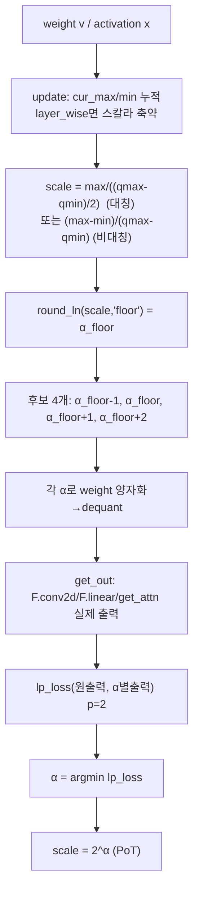
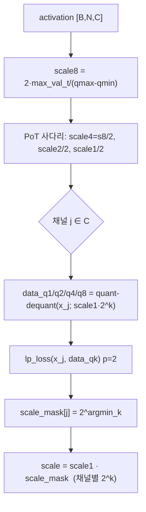
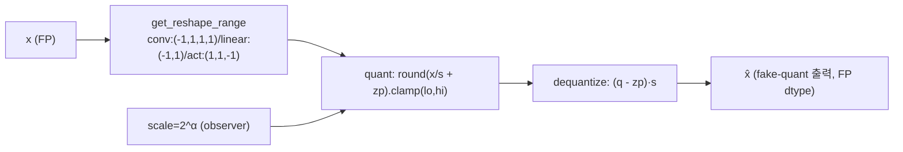
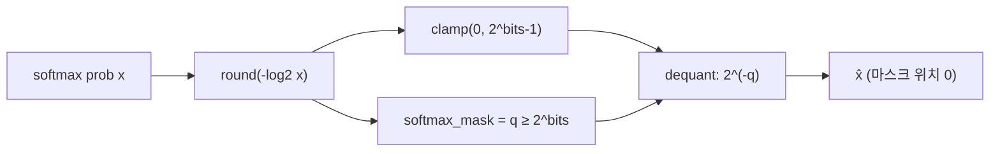
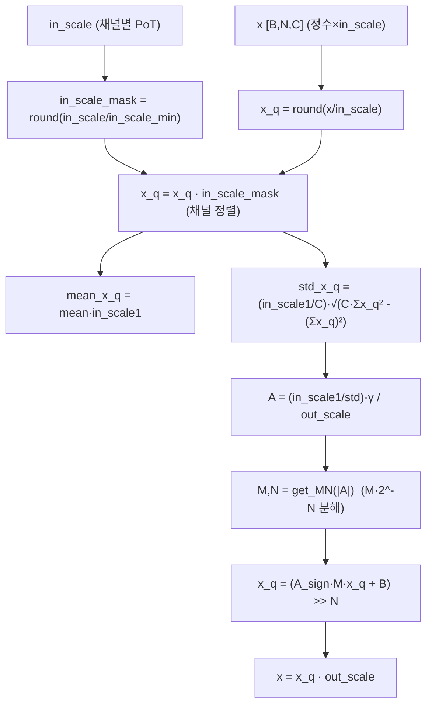
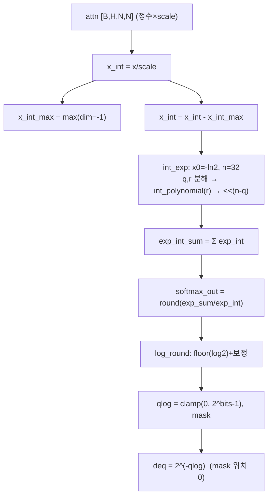
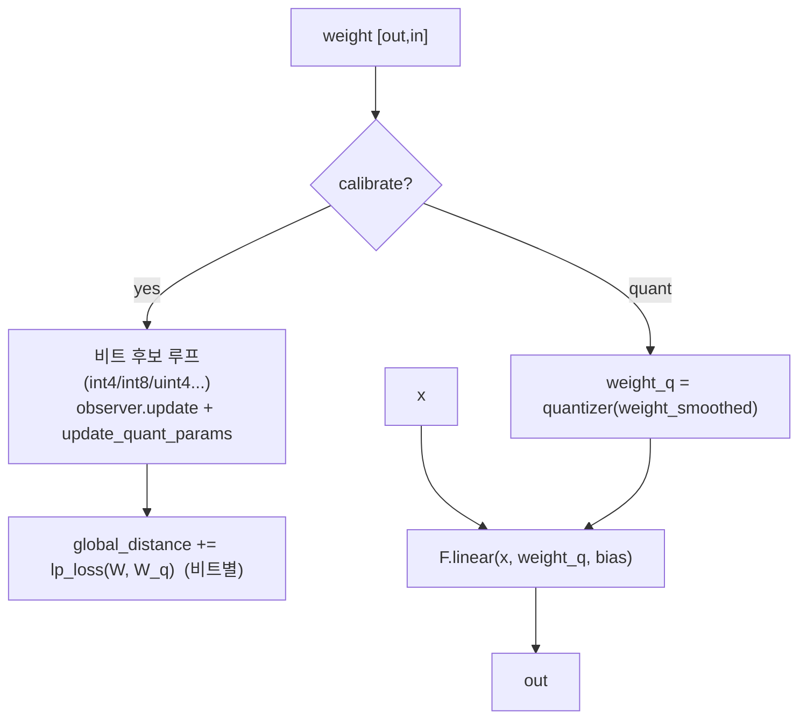
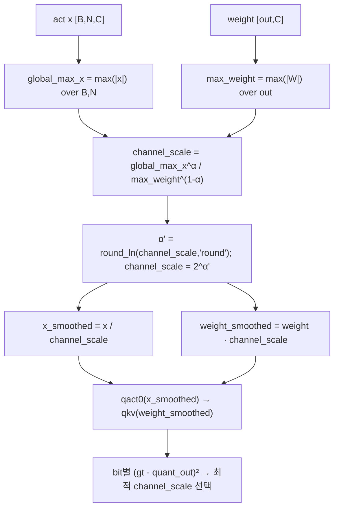
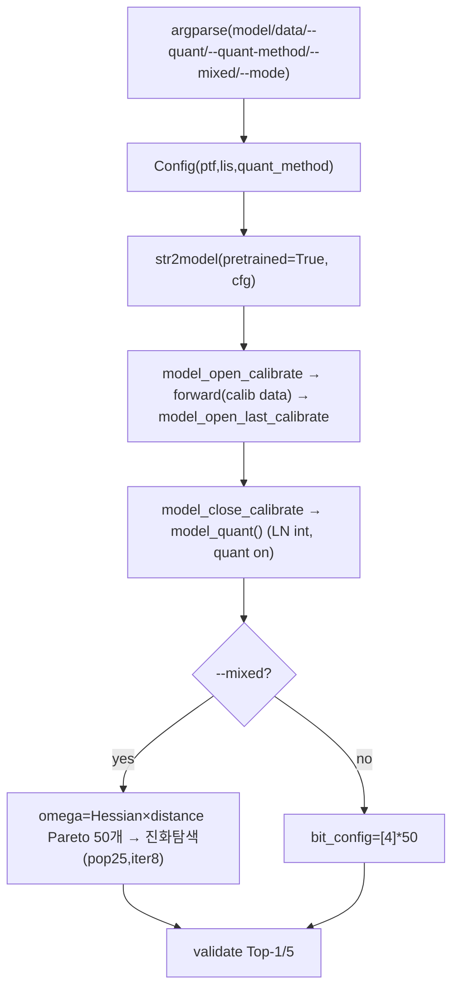

# P2-ViT 모듈 통합 가이드 (S-PyTorch)

> 1차 요약: [`../P2-ViT.md`](../P2-ViT.md) — 본 문서는 그 요약을 모듈 단위로 심화한 통합 가이드다.
> 분석 대상: `\\wsl.localhost\ubuntu-24.04\home\user\project\PRJXR-HBTXR\REF\ViT-Quantization\P2-ViT`
> 작성 원칙: 실제 소스 Read 후 `파일:라인` 근거 표기. 라인 근거 없는 추론은 "추정", 코드로 확인 불가는 "확인 불가"로 명시.
> 형제 가이드(`REF/Analysis/ViT-Quantization/I-ViT/MODULE_GUIDE.md`)의 6요소 구조를 따르되, S-PyTorch 수치 규약(params/FLOPs/activation memory/비트폭/observer/PoT scale·시프트 치환)으로 기술한다.

---

## 0. 문서 머리말

### 0.0 ★ 1차 요약 대비 정정 (활성 엔트리 식별)

본 가이드는 1차 요약(`../P2-ViT.md`)을 라인 단위로 재검증하면서 **활성 모델 파일을 정정**했다.

- `models/__init__.py:4`는 **`from .vit_fquant import *`** 를 임포트하고, `:5`에서 **`# from .vit_quant import *`** 는 주석 처리됨. 즉 `test_quant.py`가 실제로 구동하는 ViT는 **`vit_fquant.py`** 다(`__init__.py:1-5`).
- 근거 보강: `vit_fquant.py`의 `forward`는 `(x, FLOPs, global_distance)` 3-튜플을 반환(`vit_fquant.py:741-760`)하고, `test_quant.py:248,413`이 정확히 이 3개를 언패킹(`output, FLOPs, global_distance = model(...)`). 반면 `vit_quant.py`의 `forward`는 `x` 단일값만 반환(`vit_quant.py:421-425`)이라 호출부와 시그니처가 맞지 않는다 → `vit_quant.py`는 **비활성(legacy) 변종**.
- 결과적으로 1차 요약이 "TODO/비활성"으로 본 두 경로가 **활성 파일에서는 실제 동작**한다:
  1. **정수 LayerNorm(QIntLayerNorm.mode='int')**: `vit_fquant.py`의 모든 팩토리가 `norm_layer=partial(QIntLayerNorm, eps=1e-6)`로 LN을 교체(`vit_fquant.py:775,804,831,858,883`)하고, `model_quant()`가 `mode='int'`로 전환(`vit_fquant.py:644-649`). LN forward는 `norm1(x, last_quantizer, qact0.quantizer, channel_scale)` 형태로 양자화기를 받아 정수 경로 실행(`vit_fquant.py:419,449`).
  2. **Log-Int-Softmax(LIS)**: `vit_fquant.py:310`에서 `attn = self.log_int_softmax(attn, self.qact_attn1.quantizer.scale)`를 **실제 호출**(주석 아님). `vit_quant.py:108-110`의 `attn.softmax()` 직접 호출(LIS TODO)과 대조됨.
- 추가로 `vit_fquant.py`/`layers_quant.py`는 **SmoothQuant + PoT 채널 스케일링**(`smoothquant_process`, `vit_fquant.py:36-55,192-285`; `layers_quant.py:17-36,220-313`)을 자체 구현 — 1차 요약에 누락된 P2-ViT 고유 모듈이다.

### 0.1 대표 케이스 선정
- **대표 모델: `deit_small_patch16_224` (DeiT-S)** — `embed_dim=384, depth=12, num_heads=6, mlp_ratio=4, patch16, img224` (`vit_fquant.py:793-809`). 근거:
  1. README 실행 예시가 `deit_small`(`README.md:29-35`).
  2. 토큰 수 N=197(=14×14 패치 + cls), C=384는 PoT scale·SmoothQuant·정수 비선형(QIntLayerNorm/QIntSoftmax)이 모두 비자명한 크기로 활성화돼 분석 가치가 높음(`PatchEmbed.num_patches = (224/16)²=196`, `layers_quant.py:367-369`).
- **대표 분석 단위: VisionTransformer 1 Block** = `norm1(IntLayerNorm) → Attention(SmoothQuant qkv + QKᵀ + LIS softmax + AV + proj) → [residual qact2(PTF)] → norm2(IntLayerNorm) → Mlp(SmoothQuant fc1 + GELU + fc2) → [residual qact4(PTF)]` (`vit_fquant.py:402-466`). DeiT-S는 이 Block을 12개 적층(`vit_fquant.py:562-575`).
- **대표 PoT 메커니즘 3종**: ① **PoT scale(`2^α`) + 출력 인지 α 탐색**(`minmax.py:122-198`), ② **채널별 PoT Factor(PTF)**(`ptf.py:109-133`), ③ **Log2 softmax(`2^(-q)`)**(`log2.py:17-26`, LIS는 `layers.py:330-375`) — FPGA에서 곱셈을 시프트로 치환하는 핵심 청사진.

### 0.2 S-PyTorch 수치 규약 (HW의 MAC lanes/scalar MACs 대체)
- **params**: 모듈 차원에서 분석적 계산. Linear `in·out (+out bias)`, LayerNorm `2·C`, Conv `Cout·Cin·Kh·Kw (+Cout)`. P2-ViT는 **PTQ**라 FP 가중치를 그대로 두고 forward마다 fake-quant(`uniform.py:50-88`)하므로 **params 개수는 FP 원본과 동일**(추가 학습 파라미터 없음, 비트폭/스케일만 달라짐). SmoothQuant의 channel_scale도 calibration 시 결정되는 상수일 뿐 학습 파라미터 아님(`vit_fquant.py:233-235`).
- **FLOPs/MACs**: 표준식×config. Linear MAC = `B·N·in·out`. Attention QKᵀ = `B·H·N²·dh`, AV = `B·H·N²·dh`(H=heads, dh=head_dim). 본 repo는 자체 FLOPs 카운터로 **MAC 카운트**를 누적(`FLOPs.append(N*C*M)`, `vit_fquant.py:295,324`; `layers_quant.py:324,339`; PatchEmbed `C·K²·M·H·W`, `layers_quant.py:433`). 대표 레이어 1개를 DeiT-S(B=1,N=197,C=384,H=6,dh=64)로 산출 후 12 block 환원.
- **activation memory**: 텐서 shape × 비트폭. P2-ViT는 fake-quant라 런타임 텐서는 FP32(`uniform.py:126`의 `(x-zp)*scale`=float)지만, **정수 도메인 비트폭**(W/A bits)을 "HW 환산 activation bit"로 표기 — `shape × A_bit`.
- **비트폭/observer**: 코드 직접. 기본 **W4/A8**(`config.py:13,17`: `BIT_TYPE_W=int4`, `BIT_TYPE_A=int8`), softmax 확률 **uint4 log2**(`config.py:36,38`), LN 활성 observer **PTF**(`config.py:46`). weight observer=minmax(출력 인지 PoT), activation observer=`--quant-method`(minmax/ema/omse/percentile, `config.py:19-20`). weight=channel_wise, activation=layer_wise, LN활성=channel_wise(`config.py:27-29,47`).
- **PoT scale·시프트 치환**: 모든 uniform scale은 observer 단계에서 `2^α`로 산출(`minmax.py:177,195`; `ptf.py:133`)되므로 requantization이 `<<(Δα)` 시프트로 환원. softmax는 `2^(-q)`(`log2.py:24`), LN affine은 `M·2^-N` 분해(`layers.py:233-237`).
- **정확도/속도**: README 인용. 본 세션 미실행 → 측정 불가 항목은 "확인 불가". README는 정량 정확도 표를 제공하지 않음(아래 0.4).

### 0.3 운영 경로 (PTQ calibration ↔ 평가) — CUDA 전제
```
[FP 사전학습 가중치 로드] str2model(args.model)(pretrained=True, cfg)      (test_quant.py:100)
   │  DeiT: torch.hub deit_*_patch16_224.pth (vit_fquant.py:783-789 등)
   │  ViT : load_weights_from_npz (augreg npz) (vit_fquant.py:865-868)
   ▼
[calibration] model_open_calibrate() → model_open_last_calibrate() → forward로 통계+PoT scale 결정
   │  mode 0=실데이터(기본)/1=가우시안/2=PSAQ-ViT 생성  (test_quant.py:207-248)
   │  calib batch=100, calib_iter=10 (test_quant.py:35-43)
   ▼
[양자화 전환] model_close_calibrate() → model_quant()  (LN mode='int', quant=True)  (test_quant.py:252-253)
   ▼
[(옵션) mixed-precision] Hessian×distance Pareto → 진화탐색(pop=25,iter=8)  (test_quant.py:257-385)
   ▼
[ImageNet 평가] validate(): Top-1/5  (test_quant.py:395-443)
```
- 타깃 디바이스: **CUDA GPU 전제** — `round_ln`의 `torch.Tensor([2]).cuda()`(`minmax.py:52-57`, `ptf.py:55-60`), `round_x`의 `.cuda()`(`minmax.py:123-141`), uniform `quant`의 `inputs.cuda()/scale.cuda()`(`uniform.py:85-86`), LIS `scaling_factor` 등. CPU 단독 실행은 코드상 비자명(cuda 하드코딩 다수 확인, 실행 실패는 미검증).

### 0.4 모델 / 데이터셋 / 정확도 (README 인용)
- **모델**: DeiT-tiny/small/base, ViT-base/large, Swin-tiny/small/base (`test_quant.py:20-25`, `README.md:35`). embed/depth/heads: DeiT-T 192/12/3, DeiT-S 384/12/6, DeiT-B·ViT-B 768/12/12, ViT-L 1024/24/16 (`vit_fquant.py:768-888`).
- **데이터셋**: ImageNet (ILSVRC, ImageFolder train/val), 224×224 (`test_quant.py:124-149`). 전처리: deit mean/std=ImageNet·crop_pct 0.875, vit mean/std=0.5·crop 0.9, swin ImageNet·crop 0.9 (`test_quant.py:104-117`), bicubic resize+centercrop (`test_quant.py:481-511`).
- **정확도 수치**: **README에 정량 표 없음** — 논문(arXiv:2405.19915, TVLSI 2024) 본문에 PoT 양자화 정확도가 수록되나 본 repo README는 abstract만 인용(`README.md:6-22`). 따라서 **모델별 Top-1 수치는 확인 불가**. README abstract 인용 가능 지표: GPU Turing Tensor Core 대비 **최대 10.1× speedup, 36.8× energy saving**, SOTA ViT 가속기 대비 **최대 1.84× 연산 이용효율**(`README.md:22`) — 단 이는 **별도 가속기(본 repo 미포함)** 의 수치.
- **속도(latency)**: 본 PyTorch repo로는 측정 불가(가속기 RTL/HLS 미포함) → **확인 불가**.

---

## 1. Repo / Layer 개요

P2-ViT = ViT/DeiT/Swin을 **완전 양자화(fully quantized)** 하되 모든 부동소수점 스케일 팩터를 **2의 거듭제곱(PoT, `2^α`)** 으로 대체해 재양자화 오버헤드(부동소수점 곱셈)를 시프트로 환원하는 **PTQ + 자동 mixed-precision** 프레임워크(`README.md:15-16`). **FQ-ViT(megvii-research)** 포크로(`README.md:57`, 파일 헤더 "Copyright (c) MEGVII Inc."), FQ-ViT의 PTF(LayerNorm)·LIS(Softmax)를 계승하고 그 위에 **PoT scale + 출력 인지 α 탐색 + SmoothQuant PoT 채널스케일 + Hessian mixed-precision**을 추가했다.

### 1.1 자체 소스 vs 외부 프레임워크 vs 제외

| 구분 | 파일(자체 소스) | 역할 |
|---|---|---|
| **비트 정의** | `models/ptq/bit_type.py` | BitType(uint/int 비트, 상/하한) |
| **observer(통계→scale)** ★ | `models/ptq/observer/minmax.py` | **PoT scale `2^α` + 출력 인지 α 탐색**(가중치/활성) |
| | `models/ptq/observer/ptf.py` | **채널별 PoT Factor(LN 활성)** |
| | `observer/{ema,omse,percentile}.py` | 대체 활성 observer(PoT화 안 함) |
| | `observer/base.py`, `observer/utils.py` | reshape, lp_loss(목적함수) |
| **quantizer(양자화 실행)** ★ | `models/ptq/quantizer/uniform.py` | affine quant `round(x/s+z)` + per-bit scale dict |
| | `models/ptq/quantizer/log2.py` | **Log2 softmax `2^(-q)`** |
| | `quantizer/base.py`, `build.py` | fake-quant=quant∘dequant, 빌더 |
| **양자화 레이어** ★ | `models/ptq/layers.py` | QConv2d/QLinear/QAct/**QIntLayerNorm**/**QIntSoftmax(LIS)** |
| **모델 정의** ★ | `models/vit_fquant.py` (활성) | Attention/Block/VT + SmoothQuant + 팩토리 |
| | `models/layers_quant.py` | Mlp/PatchEmbed + SmoothQuant |
| | `models/swin_quant.py` | 정수 Swin (동일 ptq 모듈 재사용, `swin_quant.py:9-11`) |
| | `models/vit_quant.py` | **legacy 변종(비활성, `__init__.py:5` 주석)** |
| **설정/엔트리** | `config.py`, `test_quant.py` | Config + PTQ calib·평가·mixed-precision 탐색 |
| **보조** | `models/utils.py`, `generate_data.py` | npz 로딩, PSAQ-ViT calib 데이터 생성 |

### 1.2 forward 진입점
`VisionTransformer.forward`(`vit_fquant.py:741-760`) → `forward_features`(`:671-739`):
`qact_input → patch_embed(QConv2d) → cls_token cat → qact_embed → +qact_pos(pos_embed) → qact1 → blocks(12×Block) → norm(IntLayerNorm) → cls 추출 → qact2 → head(QLinear) → act_out`. forward는 calibration 중 weight 양자화 거리(`global_distance`)와 레이어별 MAC 카운트(`FLOPs`)를 누적해 mixed-precision 탐색에 사용(`vit_fquant.py:744-760`).

### 1.3 제외 (지시에 따라 이름만 표기, 미분석)
- **외부 프레임워크/원본**: timm 계열 ViT 구조(자체 `layers_quant.py`에 PatchEmbed/DropPath/trunc_normal_ 포함), DeiT/ViT **원본 사전학습 체크포인트**(torch.hub `.pth`, augreg `.npz`) — 가중치만 로드(`vit_fquant.py:783-893`).
- **제외 디렉토리/유틸**: `figures/`(논문 그림 PoT.png/Overview.png), `pyhessian/`(mixed-precision 민감도 외부 유틸 — 호출부만 `test_quant.py:153`, 본 repo에서는 trace 계산이 주석 처리되고 사전계산 `mean_hessian` 하드코딩, `test_quant.py:155-200`), `utils/`(build_model, data_utils, kde — 본선 무관).
- **미열람(확인 불가)**: `swin_quant.py` 세부(ViT와 동일 ptq 모듈 재사용 확인, 윈도우 attention 토폴로지 세부 미정독), `generate_data.py`/`test.py`(PSAQ-ViT calib 데이터, mode 2에서만 사용), legacy `vit_quant.py`(비활성).

### 1.4 대표 모델 레이어 구성 (DeiT-S)
`forward_features`(`vit_fquant.py:671-739`): PatchEmbed(QConv2d 16×16 s16) → +cls/pos → Block×12 → norm(IntLayerNorm) → head. 1 Block(`:402-466`)당 QLinear 6개(qkv·proj·fc1·fc2 = 4 + SmoothQuant가 calibration 시 추가 통과), QIntLayerNorm 2개(norm1·norm2), GELU 1개(`nn.GELU`, `layers_quant.py:170,326`), QIntSoftmax(LIS) 1개, QAct 다수(본선 A8, LN 입력 PTF A8).

> **주의(중요)**: P2-ViT의 정수 비선형은 I-ViT와 설계 철학이 다르다. I-ViT는 GELU/Softmax/LN을 **integer-only shift 근사**(ShiftGELU/Shiftmax/I-LayerNorm)로 대체해 FP를 완전 제거하지만, P2-ViT는 **GELU를 FP `nn.GELU`로 그대로 둔다**(`layers_quant.py:170`). P2-ViT의 핵심 기여는 **스케일 팩터를 PoT로 만들어 requantization을 시프트화**하는 것이며, LN(`QIntLayerNorm.mode='int'`)·Softmax(LIS) 정수화는 FQ-ViT에서 계승한 보조 요소다.

---

## 2. 모듈: 비트 타입 정의 — `bit_type.py` (BitType)

### 2.1 역할 + 상위/하위
- **역할**: 양자화 정수 범위(상/하한)를 비트수·부호로 정의. 모든 observer/quantizer가 `qmax/qmin`을 여기서 가져옴.
- **상위**: observer `get_quantization_params`(`minmax.py:44-45` 등), quantizer `quant` clamp(`uniform.py:86-87`). **하위**: 없음(순수 데이터).

### 2.2 데이터플로우
`BitType(bits, signed)` → `upper_bound = 2^b-1`(unsigned) / `2^(b-1)-1`(signed), `lower_bound = 0` / `-2^(b-1)` (`bit_type.py:17-27`).

### 2.3 대표 코드 위치
`bit_type.py`: 클래스 `:7-39`, 상/하한 `:17-31`, 활성 비트 목록 `:42-57`.

### 2.4 대표 코드 블록
```python
# bit_type.py:42-56  현재 활성 비트 후보 (4/8 위주, int5/6/7/10은 주석)
BIT_TYPE_LIST = [
    BitType(3, False, 'uint3'),  BitType(4, False, 'uint4'),
    BitType(4, True, 'int4'),    BitType(8, True, 'int8'),
    BitType(8, False, 'uint8')]
BIT_TYPE_DICT = {bit_type.name: bit_type for bit_type in BIT_TYPE_LIST}
```

### 2.5 연산·수치표현 분해 + 정량
- **비트폭**: 활성 후보 = uint3/uint4/int4/int8/uint8(`bit_type.py:42-56`). mixed-precision 탐색은 int4/int8만 사용(`test_quant.py:268` `bit_choice=[4,8]`).
- **params/FLOPs/memory**: 해당 없음(상수 정의).
- **PoT 연관**: 비트수가 PoT scale 산출식 `max/((qmax-qmin)/2)`의 분모를 결정(`minmax.py:173`).

---

## 3. 모듈: 출력 인지 PoT scale observer — `minmax.py` (MinmaxObserver) ★PoT 핵심

### 3.1 역할 + 상위/하위
- **역할**: calibration 중 min/max를 누적하고, **부동소수점 scale을 `2^α`로 강제**하되 단순 반올림이 아니라 **실제 연산 출력과의 L2 오차를 최소화하는 지수 α**를 후보 4개 중 탐색(output-aware). 가중치(symmetric)·활성(asymmetric) 모두 PoT화.
- **상위**: `QLinear/QConv2d/QAct`가 `observer_str='minmax'`로 weight observer 사용(`config.py:19`), quantizer `update_quantization_params`가 호출(`uniform.py:25-27`). **하위**: `lp_loss`(`observer/utils.py:2-9`), `F.conv2d/F.linear`(실제 출력 계산, `minmax.py:104-118`).

### 3.2 데이터플로우 (텐서 shape 흐름)


### 3.3 forward call stack
`QLinear.forward`(calibrate)(`layers.py:147-163`) → `quantizer.update_quantization_params`(`uniform.py:25`) → `MinmaxObserver.get_quantization_params`(`minmax.py:36`) → `round_x`(`minmax.py:122`) → `get_out`(`minmax.py:75`) → `F.linear`/`get_attn`(`minmax.py:111-118`) + `lp_loss`(`minmax.py:159-162`).

### 3.4 대표 코드 위치
`minmax.py`: `update` `:16-33`, `round_ln`(log2 반올림) `:50-58`, `get_out`(실연산) `:75-118`, `round_x`(α 후보 탐색) `:122-168`, 대칭 PoT `:170-187`, 비대칭 PoT `:188-197`.

### 3.5 대표 코드 블록

```python
# minmax.py:50-58  round_ln: scale의 log2를 정수 지수로 (round 모드=가까운 칸 선택)
def round_ln(x, type=None):
    if type == 'ceil':   return torch.ceil(torch.log(x)/torch.log(torch.Tensor([2]).cuda()))
    elif type == 'floor':return torch.floor(torch.log(x)/torch.log(torch.Tensor([2]).cuda()))
    else:
        y = torch.floor(torch.log(x)/torch.log(torch.Tensor([2]).cuda()))
        out = torch.gt((x-2**y),(2**(y+1)-x))   # floor 칸과 다음 칸 중 가까운 쪽
        return out + y
```
→ `2^α` 지수 α를 산출. **곱셈 scale을 시프트 지수로 변환**하는 1차 함수.

```python
# minmax.py:142-167  출력 인지 α 탐색: 후보 4개로 양자화 후 실제 출력 L2 최소
weight_1 = ((weight / 2**(alpha_floor[j]-1)).round().clamp(qmin,qmax)) * 2**(alpha_floor[j]-1)
out_1 = get_out(weight_1, j, quant=True)      # F.linear/conv2d/get_attn 실제 출력
# ... weight_2 (α_floor), weight_3 (α_floor+1), weight_4 (α_floor+2) 동일 ...
score = [lp_loss(out,out_1,p=2), lp_loss(out,out_2,p=2),
         lp_loss(out,out_3,p=2), lp_loss(out,out_4,p=2)]
alpha[j] = alpha_floor[j] - 1 + score.index(min(score))   # 최소오차 α 선택
```
→ 단순 `round(log2 s)`가 아니라 **하류 연산 출력**(attention의 경우 q@k softmax @v까지, `get_attn` `:62-73`)과의 오차로 α를 고르는 점이 P2-ViT 고유.

```python
# minmax.py:170-187 / 188-197  대칭/비대칭 PoT scale 최종
if self.symmetric:                                  # 가중치
    max_val = torch.max(-min_val, max_val)
    scale = max_val / (float(qmax - qmin) / 2)
    alpha_x = round_x(scale, self.v); scale = 2**alpha_x   # ★ PoT
else:                                                # 활성(uint8 asymmetric)
    scale = (max_val - min_val) / float(qmax - qmin)
    zero_point = qmin - torch.round(min_val / scale)
    alpha_x = round_x(scale, self.v, zero_point); scale = 2**alpha_x  # ★ PoT
```

### 3.6 연산·수치표현 분해 + 정량
- **양자화 방식**: weight symmetric(zp=0) PoT, activation asymmetric(uint8, zp≠0) PoT. weight=channel_wise(per-out-channel α), activation=layer_wise(`config.py:27-29`).
- **scale/zp**: `scale=2^α`, α=출력 인지 argmin. zp: 대칭=0, 비대칭=`qmin-round(min/scale)`(`minmax.py:191`).
- **비트폭/observer**: weight W4(기본), int8 후보는 layer_wise로 강제(`layers.py:63-67`). observer=minmax(출력 인지).
- **params**: 0(통계만).
- **FLOPs(calibration 비용)**: α 후보당 1회 실연산(`get_out`) → **레이어당 4× 실제 conv/linear/attn 재실행**(`minmax.py:144-155`). DeiT-S qkv weight(384×1152)의 channel_wise면 out=1152 채널 × 4후보 × F.linear → calibration이 무겁다(추정, 라인 근거 확인).
- **PoT 시프트 치환**: requant `y=(acc·s_in·s_w)/s_out`에서 모든 s가 `2^α`이면 `y = acc << (α_in+α_w-α_out)` → **곱셈기/나눗셈기 제거**(시프트 1회).

---

## 4. 모듈: 채널별 PoT Factor — `ptf.py` (PtfObserver) ★LayerNorm 활성

### 4.1 역할 + 상위/하위
- **역할**: LayerNorm 입력처럼 **채널간 분산이 큰 활성**을 단일 정수 데이터패스로 표현하기 위해, base scale `s1`에 채널별 `2^k`(k∈{0,1,2,3}) factor를 곱해 채널별 동적범위를 보정. FQ-ViT의 Power-of-Two Factor.
- **상위**: Block의 residual 출력 QAct(`qact2/qact4`)와 VT `qact1`이 `observer_str='ptf'`, `calibration_mode='channel_wise'`로 사용(`config.py:46-47`; `vit_fquant.py:374-379,395-400,552-557`). **하위**: `lp_loss`, `round_ln`(현재 base scale은 `2·max/(qmax-qmin)`를 그대로 사용, `round_x`는 정의되나 미적용 `ptf.py:91-94`).

### 4.2 데이터플로우 (텐서 shape 흐름)


### 4.3 forward call stack
`QAct.forward`(calibrate)(`layers.py:212-215`) → `quantizer.update_quantization_params`(`uniform.py:25`) → `PtfObserver.get_quantization_params`(`ptf.py:34`) → 채널 루프 `lp_loss`(`ptf.py:110-131`).

### 4.4 대표 코드 위치
`ptf.py`: base scale `:49-51`, PoT 사다리 `:97-99`, 채널별 factor 탐색 `:109-131`, 최종 scale `:133`.

### 4.5 대표 코드 블록
```python
# ptf.py:49-51,97-99  대칭 base scale8 + PoT 사다리 (1/2씩)
max_val_t = torch.max(-min_val.min(), max_val.max())
scale8 = 2*max_val_t / float(qmax - qmin)
scale4 = scale8/2;  scale2 = scale4/2;  scale1 = scale2/2
```
```python
# ptf.py:109-133  각 채널에 scale1·2^k 중 L2 최소 factor 선택
self.scale_mask = torch.ones_like(max_val)
for j in range(inputs.shape[2]):                 # 채널 C 루프
    data = inputs[..., j].unsqueeze(-1)
    data_q1 = ((data/scale1).round().clamp(qmin,qmax))*scale1   # k=0
    data_q2 = ((data/scale2).round().clamp(qmin,qmax))*scale2   # k=1
    data_q4 = ((data/scale4).round().clamp(qmin,qmax))*scale4   # k=2
    data_q8 = ((data/scale8).round().clamp(qmin,qmax))*scale8   # k=3
    score = [lp_loss(data,data_q1,2), lp_loss(data,data_q2,2),
             lp_loss(data,data_q4,2), lp_loss(data,data_q8,2)]
    self.scale_mask[j] *= 2**score.index(min(score))
scale = scale1 * self.scale_mask                 # 채널별 PoT factor
```

### 4.6 연산·수치표현 분해 + 정량
- **양자화 방식**: symmetric(zp=0), 채널별 `s_c = s1·2^(k_c)`, k_c=argmin L2(`ptf.py:131-133`). 활성 LN 경로 전용.
- **비트폭/observer**: A8(`config.py:17`), observer=ptf, channel_wise(`config.py:46-47`).
- **params**: 0(scale_mask는 calibration 산출 buffer).
- **FLOPs(calibration)**: 채널 C당 4회 quant-dequant + lp_loss → DeiT-S C=384이면 384×4 = **1536회 양자화 평가/observer**(`ptf.py:110-128`).
- **PoT 시프트 치환**: 채널별 factor가 `2^k`라, 정수 LayerNorm 입력 정규화 시 채널 마스크가 **`<<k` 시프트**로 환원(`layers.py:268-272`의 `in_scale_mask = (in_scale/in_scale1).round()`와 연계). 채널 분산을 곱셈 없이 시프트로 흡수.

---

## 5. 모듈: affine quantizer + per-bit scale — `uniform.py` (UniformQuantizer)

### 5.1 역할 + 상위/하위
- **역할**: observer가 산출한 (scale, zero_point)으로 표준 affine fake-quant `dequant(quant(x))` 실행. **weight는 비트별 scale dict**(`dic_scale[bit_name]`)에 보관 → mixed-precision에서 동일 가중치를 비트만 바꿔 재양자화.
- **상위**: `QConv2d/QLinear/QAct`가 `quantizer_str='uniform'`(`config.py:22-24`). **하위**: observer `get_quantization_params`, `get_reshape_range`(broadcast shape, `base.py:14-31`).

### 5.2 데이터플로우 (텐서 shape 흐름)


### 5.3 forward call stack
`BaseQuantizer.forward`(`base.py:42-45`) → `UniformQuantizer.quant`(`uniform.py:50`) → `dequantize`(`uniform.py:90`). 또는 weight 경로는 `QLinear.forward`에서 `self.quantizer(weight_smoothed)` 직접(`layers.py:164,176`).

### 5.4 대표 코드 위치
`uniform.py`: per-bit scale 저장 `:25-47`, `quant` `:50-88`, `dequantize` `:90-127`. `base.py`: broadcast shape `:14-31`, fake-quant `:42-45`.

### 5.5 대표 코드 블록
```python
# uniform.py:45-47  weight는 비트별 dict에 scale/zp 보관 (mixed-precision 지원)
else:   # module_type != 'activation' (즉 weight)
    self.dic_scale[self.bit_type.name] = scale          # 'int4','int8' 등
    self.dic_zero_point[self.bit_type.name] = zero_point
```
```python
# uniform.py:82-88  표준 affine 양자화 (scale은 이미 2^α=PoT)
range_shape = self.get_reshape_range(inputs)
scale = scale.reshape(range_shape); zero_point = zero_point.reshape(range_shape)
outputs = inputs.cuda() / scale.cuda() + zero_point.cuda()
outputs = outputs.round().clamp(self.bit_type.lower_bound, self.bit_type.upper_bound)
```
```python
# uniform.py:126  역양자화
outputs = (inputs.cuda() - zero_point.cuda()) * scale.cuda()
```
→ scale 자체가 observer 단계에서 `2^α`이므로 `x/scale = x>>α`, `q*scale = q<<α`로 HW에서 시프트 환원(PoT-aware affine).

### 5.6 연산·수치표현 분해 + 정량
- **양자화 방식**: affine. weight per-channel(scale `[out]`), activation per-tensor. zp: weight=0, activation uint8=비0.
- **비트폭**: bit_type.name 키로 비트 전환(int4/int8). `bit_config` 인자로 추론 시 동적 지정(`layers.py:172-176`).
- **params**: 0.
- **FLOPs**: 원소당 div+round+clamp(quant) + sub+mul(dequant) = O(N). weight는 forward마다 재양자화(PTQ 추론이지만 fake-quant 구현이라 매 호출 재계산).
- **activation memory**: fake-quant라 FP32 유지, HW 환산 비트 = W4(weight)/A8(activation).

---

## 6. 모듈: Log2 Softmax quantizer — `log2.py` (Log2Quantizer) ★PoT softmax

### 6.1 역할 + 상위/하위
- **역할**: softmax 확률 p를 `2^(-q)`로 표현(로그 양자화). attention `P·V`를 곱셈 대신 시프트로 환원. 너무 작은 확률은 마스크로 0 처리.
- **상위**: `config.lis=True`면 `QUANTIZER_S='log2'`, `BIT_TYPE_S=uint4`(`config.py:36-38`) → `QIntSoftmax`가 사용(단 실제 LIS forward는 `layers.py:330-375`의 `int_softmax`+`log_round`로 구현, `Log2Quantizer.quant`는 별도 경로). **하위**: 없음.

### 6.2 데이터플로우


### 6.3 forward call stack
`QIntSoftmax.forward`(log 경로)(`layers.py:366-375`)는 자체 `int_softmax`/`log_round` 사용. `Log2Quantizer`는 `BaseQuantizer.forward`(`base.py:42-45`) → `quant`(`log2.py:17`) → `dequantize`(`log2.py:23`).

### 6.4 대표 코드 위치
`log2.py`: `quant` `:17-21`, `dequantize` `:23-26`.

### 6.5 대표 코드 블록
```python
# log2.py:17-26  softmax 확률을 2^(-q)로 로그 양자화
def quant(self, inputs):
    rounds = torch.round(-1 * inputs.log2())             # q = round(-log2 p)
    self.softmax_mask = rounds >= 2**self.bit_type.bits  # 너무 작은 확률
    return torch.clamp(rounds, 0, 2**self.bit_type.bits - 1)
def dequantize(self, inputs):
    outputs = 2**(-1 * inputs)                           # p̂ = 2^(-q)
    outputs[self.softmax_mask] = 0
    return outputs
```

### 6.6 연산·수치표현 분해 + 정량
- **양자화 방식**: 로그(2의 거듭제곱) 양자화, uint4(`config.py:36`) → q∈[0,15].
- **비트폭**: uint4(LIS) 또는 uint8(lis=False, `config.py:41`).
- **params**: 0.
- **PoT 시프트 치환**: `P·V`에서 P=`2^(-q)`이므로 `P·V = V >> q` → **attention 가중합을 시프트+가산**으로 환원, 곱셈기 제거.

---

## 7. 모듈: 정수 LayerNorm — `layers.py` (QIntLayerNorm) ★정수 비선형

### 7.1 역할 + 상위/하위
- **역할**: LayerNorm을 정수로. scale을 `M·2^-N` 분해(get_MN), 채널 스케일 마스크·정수 평균/표준편차로 affine 계수 A를 정수 연산 후 `>>N` 시프트. 부동 나눗셈·sqrt 제거.
- **상위**: `vit_fquant.py`의 norm_layer=`partial(QIntLayerNorm)`(`vit_fquant.py:804` 등). `Block.norm1/norm2`(`vit_fquant.py:419,449`), VT `norm`(`:727`). `model_quant()`가 `mode='int'` 전환(`vit_fquant.py:644-649`). **하위**: `in_quantizer.scale`(PTF observer가 결정한 채널 PoT scale), `out_quantizer.scale`.

### 7.2 데이터플로우 (텐서 shape 흐름)


### 7.3 forward call stack
`Block.forward`(`vit_fquant.py:419`) → `norm1(x, last_quantizer, attn.qact0.quantizer, channel_scale)` → `QIntLayerNorm.forward`(mode='int')(`layers.py:254-288`).

### 7.4 대표 코드 위치
`layers.py`: `get_MN`(M·2^-N 분해) `:233-237`, mode='int' forward `:254-288`, 채널 마스크 `:268-272`, 정수 mean/std `:274-277`, affine A/B `:278-285`, 최종 시프트 `:287`.

### 7.5 대표 코드 블록
```python
# layers.py:233-237  scale을 M·2^-N (M:가수, N:시프트량)으로 분해 (bit=7)
def get_MN(self, x):
    bit = 7
    N = torch.clamp(bit - torch.floor(torch.log2(x)), 0, 31)
    M = torch.clamp(torch.floor(x * torch.pow(2, N)), 0, 2**(bit + 1) - 1)
    return M, N
```
```python
# layers.py:268-277  채널 PoT 스케일 마스크 + 정수 평균/표준편차
x_q = (x / in_scale).round()
in_scale1 = in_scale.min()
in_scale_mask = (in_scale / in_scale1).round()    # 채널별 2^k 비 (PTF 연계)
x_q = x_q * in_scale_mask
mean_x_q = x_q.mean(dim=-1) * in_scale1
std_x_q = (in_scale1/channel_nums) * torch.sqrt(
    channel_nums*(x_q**2).sum(dim=-1) - x_q.sum(dim=-1)**2)
```
```python
# layers.py:278-288  affine을 정수곱+시프트로 (>>N)
A = (in_scale1/std_x_q).unsqueeze(-1) * self.weight.reshape(1,1,-1) / out_scale
A_sign = A.sign();  M, N = self.get_MN(A.abs())
B = ((self.bias.reshape(1,1,-1) - (mean_x_q/std_x_q).unsqueeze(-1)*self.weight.reshape(1,1,-1))
     / out_scale * torch.pow(2, N)).round()
x_q = ((A_sign * M * x_q + B) / torch.pow(2, N)).round()    # = (...) >> N
return x_q * out_scale
```
→ 정규화 계수 A를 `M·2^-N`로 분해해 **정수 가산·정수곱 후 `>>N` 시프트 1회**로 LN affine 환원. `torch.sqrt`는 std 계산에 남아 있어 **완전 integer-only는 아님**(I-ViT의 뉴턴 정수 sqrt와 대조 — 확인된 차이).

### 7.6 연산·수치표현 분해 + 정량 (DeiT-S, C=384, N=197)
- **양자화 방식**: 입력 정수화 → 채널 PoT 마스크 정렬 → 정수 mean/var → A를 `M·2^-N` 분해 → `>>N`. 출력 = `x_q·out_scale`.
- **비트폭/observer**: get_MN bit=7(M≤255, N≤31). 입력 in_scale=PTF(채널별 PoT), 출력 out_scale.
- **params**: weight γ + bias β = 2×384 = **768**/LN. block당 LN 2개=1536, ×12 + 최종 norm 768 ≈ **~19K**(LN 전체).
- **FLOPs/block** (1 LN, [1,197,384]): mean+var reduce ≈ 2·N·C = 2×197×384 ≈ 151K; get_MN/affine O(N·C)=75.6K + `torch.sqrt` N개. LN 1개 ≈ **~230K 원소연산**.
- **PoT 시프트 치환**: A를 `M·2^-N`로 두어 affine을 정수곱+`>>N`로 환원. 채널 마스크도 PoT 비라 시프트. 단 std의 `sqrt`는 FP 잔존(HW에서 LUT-sqrt 필요).

---

## 8. 모듈: Log-Int-Softmax — `layers.py` (QIntSoftmax) ★정수 비선형

### 8.1 역할 + 상위/하위
- **역할**: Softmax를 정수 다항식 지수 근사(int_polynomial+int_exp)로 계산하고, 결과를 `log_round`로 로그 양자화해 `2^(-qlog)`로 반환. attention 확률을 PoT로 표현.
- **상위**: `Attention.log_int_softmax = QIntSoftmax(log_i_softmax=cfg.INT_SOFTMAX)`(`vit_fquant.py:137-144`), forward에서 실호출(`vit_fquant.py:310`). **하위**: 없음(자체 정수 다항식).

### 8.2 데이터플로우 (텐서 shape 흐름)


### 8.3 forward call stack
`Attention.forward`(`vit_fquant.py:310`) → `QIntSoftmax.forward`(log_i_softmax=True)(`layers.py:366-375`) → `int_softmax`(`:330-364`) → `int_exp`(`:345-357`) + `int_polynomial`(`:333-343`) → `log_round`(`:322-328`).

### 8.4 대표 코드 위치
`layers.py`: `log_round` `:322-328`, `int_polynomial`(2차 다항식) `:333-343`, `int_exp`(x0=-ln2, n=32) `:345-357`, `int_softmax` `:330-364`, forward(log 경로) `:366-375`.

### 8.5 대표 코드 블록
```python
# layers.py:345-357  정수 지수: x0=-ln2 몫/나머지 분해 + <<(n-q)
def int_exp(x_int, scaling_factor):
    x0 = -0.6931                       # -ln2
    n = 32                             # ★ I-ViT(n=23/15)와 다름
    x0_int = torch.floor(x0 / scaling_factor)
    x_int = torch.max(x_int, n * x0_int)
    q = torch.floor(x_int / x0_int);  r = x_int - x0_int * q
    exp_int, exp_sf = int_polynomial(r, scaling_factor)   # 2차 다항식 근사
    exp_int = torch.clamp(torch.floor(exp_int * 2**(n - q)), min=0)  # <<(n-q)
    return exp_int, exp_sf / 2**n
```
```python
# layers.py:366-375  LIS forward: 정수 softmax → 로그 양자화 → 2^(-qlog)
if self.log_i_softmax and scale is not None:
    exp_int, exp_int_sum = self.int_softmax(x, scale)
    softmax_out = torch.round(exp_int_sum / exp_int)
    rounds = self.log_round(softmax_out)
    mask = rounds >= 2**self.bit_type.bits
    qlog = torch.clamp(rounds, 0, 2**self.bit_type.bits - 1)
    deq_softmax = 2**(-qlog);  deq_softmax[mask] = 0
    return deq_softmax
```
→ `else` 분기(비-LIS)는 FP `x.softmax(dim=-1)`만 수행하고 양자화는 주석 처리(`layers.py:386-394`). 즉 **LIS=True일 때만 정수 softmax가 실제 동작**.

### 8.6 연산·수치표현 분해 + 정량 (DeiT-S, attn [1,6,197,197])
- **양자화 방식**: integer-only softmax(2차 다항식 지수) → 로그 양자화 uint4(`config.py:36`). 출력 `2^(-qlog)`.
- **비트폭**: `int_exp` n=32(`layers.py:349`, 주석에 30 후보), 다항식 계수 `[0.358,0.970,1.0]`(`layers.py:334`), 출력 uint4(qlog∈[0,15]).
- **params**: 0.
- **FLOPs/block**: int_exp on H·N²=6×197²≈233K 원소 × (몫/나머지+다항식 ≈ 수 op) + dim축 sum + log_round. ≈ **~수 M 원소연산/block**(추정).
- **activation memory**: attn 확률 [1,6,197,197] uint4(로그 양자화 후) — 격자상 4bit, 텐서 원소수 6×197²≈233K → 4bit 환산 ≈ **116 KB**. softmax 입력 attn은 A8.
- **PoT 시프트 치환**: 지수 `<<(n-q)`(`layers.py:355`), 출력 `2^(-qlog)`로 `P·V=V>>qlog` 환원. 곱셈기 제거.

---

## 9. 모듈: 양자화 레이어 (QConv2d/QLinear/QAct) — `layers.py`

### 9.1 역할 + 상위/하위
- **역할**: nn.Conv2d/Linear/Module을 양자화 래핑. calibrate 모드면 **비트 후보별 observer.update + 양자화 거리(`lp_loss`) 누적**(mixed-precision 민감도), quant 모드면 weight를 fake-quant 후 `F.conv2d/F.linear`. QAct는 활성 양자화(비대칭 옵션 포함).
- **상위**: `vit_fquant.py`/`layers_quant.py`의 Attention/Mlp/PatchEmbed/VT. **하위**: observer(minmax/ptf), quantizer(uniform), `lp_loss`.

### 9.2 데이터플로우 (QLinear, 텐서 shape 흐름)


### 9.3 forward call stack
`Attention.forward`(`vit_fquant.py:246,291,322`) → `QLinear.forward(x, global_distance, bit_config, weight_smoothed, attn, attn_para)`(`layers.py:132`) → calibrate 루프(`:147-169`) 또는 `quantizer(weight)`+`F.linear`(`:176-177`).

### 9.4 대표 코드 위치
`layers.py`: `QConv2d` `:12-100`(calibrate `:54-70`, quant `:85-86`), `QLinear` `:103-177`(거리 누적 `:147-169`, bit_config `:172-176`), `QAct` `:180-219`(비대칭 `:207-211`).

### 9.5 대표 코드 블록
```python
# layers.py:147-169  QLinear calibrate: 비트별 weight 양자화 거리 누적 (mixed-precision)
if self.calibrate:
    distance = []
    for bit_type in BIT_TYPE_LIST:
        if bit_type == BIT_TYPE_DICT['uint8']: continue
        self.quantizer.bit_type = bit_type; self.observer.bit_type = bit_type
        if bit_type == BIT_TYPE_DICT['int8']: self.observer.calibration_mode='layer_wise'
        else: self.observer.calibration_mode='channel_wise'
        self.quantizer.observer.update(weight_smoothed)
        self.quantizer.update_quantization_params(x, others=[self.bias], attn=attn, attn_para=attn_para)
        weight = self.quantizer(weight_smoothed)
        distance.append(utils.lp_loss(weight_smoothed, weight, p=2.0, reduction='all'))
    global_distance.append(distance)
```
```python
# layers.py:172-177  추론 시 bit_config로 비트 동적 지정 + 양자화 MAC
if bit_config:
    bit_type = 'int' + str(bit_config)        # 'int4'/'int8'
    self.quantizer.bit_type = BIT_TYPE_DICT[bit_type]
weight = self.quantizer(weight_smoothed)
return F.linear(x, weight, self.bias)
```
```python
# layers.py:207-215  QAct 비대칭(uint8) 옵션 + attention observer 전달
if asymmetric:
    self.quantizer.bit_type = BIT_TYPE_DICT['uint8']; self.observer.symmetric = False
self.quantizer.observer.update(x)
if self.last_calibrate:
    self.quantizer.update_quantization_params(x, attn=attn, attn_para=attn_para)
```

### 9.6 연산·수치표현 분해 + 정량 (DeiT-S, B=1, N=197)
- **양자화 방식**: weight per-channel PoT(W4 기본, int8 후보는 layer_wise), activation per-tensor PoT(A8), QAct 비대칭은 uint8.
- **비트폭**: W4/A8(`config.py:13,17`). calibrate는 int4/int8/uint4 후보 순회(`layers.py:150-160`).
- **params** (DeiT-S 1 block, C=384):
  - qkv: 384×1152 + 1152 = **443,520**
  - proj: 384×384 + 384 = **147,840**
  - fc1: 384×1536 + 1536 = **591,360**
  - fc2: 1536×384 + 384 = **590,208**
  - Linear params/block ≈ **1.773M**, ×12 ≈ **21.27M**.
- **MACs/block** (B=1, N=197, `FLOPs.append(N·C·M)` `vit_fquant.py:295`):
  - qkv: 197×384×1152 ≈ **87.1M**, proj: 197×384×384 ≈ **29.0M**
  - fc1: 197×384×1536 ≈ **116.2M**, fc2: 197×1536×384 ≈ **116.2M**
  - Linear MAC/block ≈ **348.5M**, ×12 ≈ **4.18G**(Attention matmul 제외).
- **activation memory**: 입력 A8 → 정수 MAC INT32 누산(추정) → dequant. W4라 weight 메모리 = FP 대비 1/8(HW 환산).

---

## 10. 모듈: SmoothQuant PoT 채널 스케일링 — `vit_fquant.py` / `layers_quant.py` ★P2-ViT 고유

### 10.1 역할 + 상위/하위
- **역할**: activation의 채널별 outlier를 weight로 이전(SmoothQuant)하되, **채널 스케일을 PoT(`2^α`)로 강제**. qkv/fc1 입력에서 `channel_scale = (act_max^α / weight_max^(1-α))`를 `round_ln`으로 PoT화하고, α 후보·비트별 양자화 손실을 비교해 최적 스케일 선택.
- **상위**: `Attention.forward`(qkv 앞)(`vit_fquant.py:192-285`), `Mlp.forward`(fc1 앞)(`layers_quant.py:220-313`). **하위**: `QLinear`(weight_smoothed 인자), `QAct`(qact0).

### 10.2 데이터플로우 (텐서 shape 흐름)


### 10.3 forward call stack
`Block.forward`(`vit_fquant.py:417`) → `Attention.forward`(smoothquant=True)(`vit_fquant.py:192`) → `round_ln`+`2**aplha`(`vit_fquant.py:234-235`) → `qact0`/`qkv`로 손실 평가(`vit_fquant.py:242-270`).

### 10.4 대표 코드 위치
`vit_fquant.py`: `smoothquant_process` `:36-55`, Attention SmoothQuant calibration `:192-270`, 추론 경로(best_scale 적용) `:273-285`. `layers_quant.py`: Mlp SmoothQuant `:220-313`.

### 10.5 대표 코드 블록
```python
# vit_fquant.py:232-239  채널 스케일을 PoT로 강제 (SmoothQuant + 2^α)
for i, alpha in enumerate(alpha_pool):                 # alpha_pool = [0.35]
    channel_scale = global_max_x**alpha / (max_weight**(1-alpha))
    aplha = round_ln(channel_scale, 'round')
    channel_scale = 2**aplha                           # ★ PoT 채널 스케일
    x_smoothed = x / channel_scale.reshape((1,1,-1))
    weight_smoothed = self.qkv.weight * channel_scale.reshape((1,-1))
    gt = F.linear(x_smoothed, weight_smoothed, self.qkv.bias)
```
```python
# vit_fquant.py:255-270  비트별 양자화 손실로 최적 채널 스케일 선택
for j, bit in enumerate(bit_pool):                     # bit_pool=[4,8]
    quant_out = self.qkv(middle_out, global_distance, bit, weight_smoothed, ...)
    loss_pool[j].append((gt - quant_out).abs().pow(2.0).mean())
# ... 손실 최소 인덱스로 best_scale/best_act_scale/best_weight_scale 저장
```
```python
# vit_fquant.py:334-337  requant scale도 PoT 지수로 추출 가능 (HW 연동 흔적)
def get_requant_scale(self):
    bit_type = 'int' + str(self.atten_bit_config[1])
    return (self.qact2.quantizer.scale * self.proj.quantizer.dic_scale[BIT_TYPE_DICT[bit_type].name]) / self.qact3.quantizer.scale
```
→ `get_requant_scale`는 `(s_in·s_w)/s_out`을 반환하고, 호출부(주석)에서 `floor(log2(scale))`로 PoT 지수를 출력(`vit_fquant.py:723-725`) → **requant를 시프트량으로 미리 산출**하는 HW 연동 흔적.

### 10.6 연산·수치표현 분해 + 정량
- **양자화 방식**: SmoothQuant migration scale = `2^round_ln((act_max^α/weight_max^(1-α)))`. α_pool=[0.35](Attention, `vit_fquant.py:32`) / [0.5](Mlp, `layers_quant.py:14`). bit_pool=[4,8]별 손실 비교.
- **params**: 0(channel_scale은 calibration 상수). weight_smoothed는 원 weight×scale이라 개수 불변.
- **FLOPs(calibration)**: α 후보 × bit 후보 × (F.linear gt + 양자화 MAC) → 레이어당 수 회 추가 linear. 추론 시엔 best_scale 1개만 적용(`vit_fquant.py:273-285`).
- **PoT 시프트 치환**: channel_scale이 `2^α'`라 `x/channel_scale = x>>α'`, `weight·channel_scale = weight<<α'` → **SmoothQuant 이전을 시프트로** 구현. activation outlier 평활화를 곱셈 없이 수행(FPGA 친화).

---

## 11. 모듈: PTQ 파이프라인 + mixed-precision 탐색 — `test_quant.py`

### 11.1 역할 + 상위/하위
- **역할**: FP 사전학습 로드 → calibration(통계+PoT scale 결정) → `model_quant()` → (옵션) Hessian×distance Pareto + 진화탐색 mixed-precision → ImageNet Top-1/5 평가.
- **상위**: CLI(`README.md:29-39`). **하위**: `config.Config`, `vit_fquant` 모델, `pyhessian`(주석 처리), `generate_data`(mode 2).

### 11.2 데이터플로우


### 11.3 forward call stack
`main`(`test_quant.py:94`) → calibration(`:203-253`) → `model_quant`(`:253`) → (mixed) Pareto(`:257-308`)+진화(`:328-385`) → `validate`(`:395`) → `model(data, bit_config, plot)`(`:413`).

### 11.4 대표 코드 위치
`test_quant.py`: argparse `:18-58`, calibration 3-mode `:203-248`, mixed-precision Pareto `:257-308`, Hessian 검증 `:309-325`, 진화탐색 `:328-385`, 비-mixed `bit_config=[4]*50` `:389`, `validate` `:395-443`.

### 11.5 대표 코드 블록
```python
# test_quant.py:236-248  실데이터 calibration (mode 0 기본)
model.model_open_calibrate()
with torch.no_grad():
    model.model_open_last_calibrate()
    output, FLOPs, global_distance = model(image_list[0], plot=False)
model.model_close_calibrate(); model.model_quant()
```
```python
# test_quant.py:264-304  omega = Hessian × 양자화거리, 모델크기 제약하 Pareto
model_constraint = 1.1*sum([FLOPs[i]*4 for i in range(len(FLOPs))])     # 4bit 기준 1.1배
bit_choice = [4,8]
# ... new_bit_config 생성, model_size ≤ constraint면 후보 추가 (최대 50개)
omega = [mean_hessian[i]*select_diastance[i] for i in range(len(FLOPs)-1)]
omega_list.append([bit_config, sum(omega)])
omega_list.sort(key=lambda x: x[-1])
```
```python
# test_quant.py:389  비-mixed: 전 레이어 4비트
bit_config = [4]*50
```
→ `mean_hessian`은 **deit-base용 49개 값이 하드코딩**(`test_quant.py:198`), trace 실계산은 주석 처리(`:155-195`). 다른 모델은 수동 재산출 필요.

### 11.6 연산·수치표현 분해 + 정량 / 재현 명령
- **양자화 방식**: PTQ(학습 불필요). calibration batch=100, calib_iter=10(`test_quant.py:35-43`), val batch=200(`:45-48`).
- **mixed-precision**: omega=Hessian×distance, Pareto 후보 50, 진화탐색 pop=25/iter=8/mutate=10/crossover=10(`test_quant.py:330-335`).
- **재현 명령** (`README.md:31-39`):
  ```bash
  python test_quant.py deit_small <DATA_DIR> --quant --quant-method minmax
  # 모델: deit_tiny/small/base, vit_base/large, swin_tiny/small/base
  # --quant-method: minmax/ema/omse/percentile (활성 observer)
  # --mixed: Hessian 자동 mixed-precision, --mode 0/1/2 calib 데이터
  ```
- **재현성**: seed 고정 + cudnn.deterministic(`test_quant.py:76-91`).
- **정확도**: README에 수치 표 없음 → **확인 불가**(0.4 참조). 본 세션 미실행.

---

## N+1. 모듈 한눈 요약 표

| 모듈 | 파일:라인 | 역할 | 양자화 방식 | 대표 정량(DeiT-S) |
|---|---|---|---|---|
| BitType | bit_type.py:7-57 | 정수 범위 정의 | uint3/4·int4/8·uint8 | mixed=int4/int8만 |
| MinmaxObserver ★ | minmax.py:36-198 | **출력 인지 PoT scale `2^α`** | 대칭 W / 비대칭 A, α=argmin L2 | α 후보 4개×실연산(calib 비용↑) |
| PtfObserver ★ | ptf.py:34-134 | **채널별 PoT factor `2^k`** | 대칭, channel_wise | 채널 384×4 양자화평가 |
| Omse/Ema/Percentile | omse/ema/percentile.py | 대체 활성 observer | clip(L2)/EMA/분위수, **PoT 안함** | omse 90 clip 탐색 |
| UniformQuantizer | uniform.py:8-127 | affine fake-quant + per-bit scale dict | round(x/s+z), s=2^α | params 0, W4/A8 |
| Log2Quantizer ★ | log2.py:7-26 | **softmax `2^(-q)`** | 로그 양자화 uint4 | P·V=V>>q |
| QConv2d/QLinear/QAct | layers.py:12-219 | 정수 conv/linear/act + 거리누적 | W4 per-ch PoT / A8 per-tensor | Linear 1.77M params, 348.5M MAC/block |
| QIntLayerNorm ★ | layers.py:225-291 | 정수 LN, A=M·2^-N → >>N | 채널 PoT 마스크 + 정수 mean/std(sqrt 잔존) | LN 768 params, ~230K op |
| QIntSoftmax(LIS) ★ | layers.py:294-415 | 정수 softmax(다항식 exp) → 2^(-qlog) | int_exp n=32, uint4 | attn 확률 ~116KB(4bit) |
| SmoothQuant PoT ★ | vit_fquant.py:192-285; layers_quant.py:220-313 | **채널 outlier 이전 `2^α'`** | act_max^α/w_max^(1-α) → PoT | α=0.35/0.5, bit=[4,8] |
| PTQ+mixed pipeline | test_quant.py:94-443 | calib→quant→Hessian Pareto→평가 | PTQ, [4]*50 또는 mixed | calib batch100, pop25/iter8 |

---

## N+2. 학습·평가 파이프라인 + 재현 명령

- **양자화 방식**: **PTQ**(학습 불필요). calibration 데이터로 PoT scale/zp 결정 후 평가. QAT 코드 없음(I-ViT와 대조).
- **데이터셋**: ImageNet(ImageFolder train/val), 224×224 (`test_quant.py:124-149`). 전처리 모델별 차등(`test_quant.py:104-117`).
- **사전학습 로드**: DeiT는 torch.hub `.pth`(`vit_fquant.py:783-789` 등), ViT는 augreg `.npz`(`vit_fquant.py:865-868`).
- **calibration**:
  ```bash
  python test_quant.py deit_small <DATA_DIR> --quant --quant-method minmax
  ```
  `--mode 0`(실데이터, 기본)/`1`(가우시안)/`2`(PSAQ-ViT 생성, `test_quant.py:207-248`).
- **mixed-precision**: `--mixed`(Hessian×distance Pareto + 진화탐색, `test_quant.py:257-385`). 비활성 시 `bit_config=[4]*50`(전 레이어 W4).
- **기본 비트폭**: W4/A8, softmax uint4(LIS), LN 활성 PTF(`config.py:13,17,36,46`).
- **의존성**: PyTorch, torchvision, numpy, PIL(`test_quant.py:7-16`); pyhessian(자체 포함, mixed용); FQ-ViT 기반(`README.md:57`). **CUDA 필수**(0.3절 cuda 하드코딩 근거).
- **정확도/속도**: README 정량 표 없음 → 모델별 Top-1 **확인 불가**. 가속기 speedup(10.1×)·energy(36.8×)는 abstract 인용(별도 HW, 본 repo 미포함, `README.md:22`).

---

## N+3. 우리 프로젝트(FPGA ViT 가속) 시사점 + FPGA 친화도 (PoT 시프트 치환의 DSP 절감)

> 프로젝트 성격(HG-PIPE 계열 ViT FPGA 가속기 + XR 시선추적)은 **추정**. P2-ViT는 "스케일 팩터 PoT화 → requantization 시프트화"가 핵심이라 FPGA requant 데이터패스에 가장 직접적이다.

### N+3.1 PoT scale → requantization 시프트화 = DSP 절감의 핵심 (최우선)
- 일반 양자화 가속기의 레이어 간 requant는 `y = round(acc · S)` (S=`(s_in·s_w)/s_out`, **부동소수점/고정소수점 곱셈**) → 레이어/채널당 DSP 곱셈기 1개씩 소모. P2-ViT는 모든 s를 `2^α`로 두므로(`minmax.py:177,195`; `uniform.py:85,126`) **`y = acc << (α_in+α_w−α_out)` 단일 배럴 시프터**로 환원. → **requant 단계의 DSP를 전부 LUT 시프터로 대체**, 채널 수만큼의 곱셈기 절감(추정). `get_requant_scale`+`floor(log2)` 흔적(`vit_fquant.py:334-337,723-725`)이 이 시프트량 사전산출을 시사.
- **DSP 절감 정량(추정)**: DeiT-S 레이어당 requant 채널 = qkv 1152 + proj/fc 등. 이 채널들의 곱셈을 시프트로 치환 → 곱셈 기반 requant 대비 해당 DSP 0개. 정확한 절감은 가속기 매핑 의존(확인 불가).

### N+3.2 채널별 PoT Factor(PTF) → 정수 LayerNorm 데이터패스
- `ptf.py:109-133`의 채널 `2^k` factor + `QIntLayerNorm`의 `in_scale_mask`(`layers.py:268-272`) = 채널 분산을 **시프트로 흡수**해 단일 정수 LN 데이터패스 구성. 시선추적 입력(저조도·고대비 눈 영상)처럼 채널 분포가 치우칠 때 유용(추정). 단 **std의 `torch.sqrt`는 FP 잔존**(`layers.py:276`) → HW에서 LUT-sqrt 또는 I-ViT식 뉴턴 정수 sqrt로 보완 필요(확인된 한계).

### N+3.3 Log-Int-Softmax → attention 시프트 가중합
- `int_exp`(`<<(n-q)`)+로그 양자화(`2^(-qlog)`)(`layers.py:345-375`)로 `P·V = V >> qlog` 환원 → softmax 정규화·가중합을 곱셈 없이 시프트로. attention N² 활성(DeiT-S [1,6,197,197])이 메모리 지배 → 행 스트리밍 softmax 권장(추정).

### N+3.4 SmoothQuant PoT 채널 스케일 = 곱셈-free outlier 평활
- `2^α'` 채널 스케일(`vit_fquant.py:234-235`)로 activation outlier를 weight로 이전 → `x>>α'`, `weight<<α'`. low-bit(W4) activation 양자화 정확도를 곱셈 없이 확보. W4A8 + mixed-precision은 시선추적 경량 ViT의 자원-정확도 균형점.

### N+3.5 FPGA 친화도 평가 (PoT/시프트 관점)
| 항목 | 평가 | 근거 |
|---|---|---|
| Requant 시프트화(DSP 절감) | ★★★ 전 scale `2^α` → 배럴 시프터 | `minmax.py:177`, `uniform.py:85,126` |
| 채널 PoT factor(LN) | ★★★ 채널 분산 시프트 흡수 | `ptf.py:131-133`, `layers.py:268-272` |
| Softmax PoT(P·V=V>>q) | ★★★ 곱셈 없는 가중합 | `log2.py:24`, `layers.py:355,373` |
| SmoothQuant PoT | ★★ outlier 이전을 시프트로 | `vit_fquant.py:234-235` |
| LayerNorm 정수화 | ★★ A=M·2^-N >>N, 단 sqrt FP 잔존 | `layers.py:233-237,276,287` |
| GELU | ★ **FP `nn.GELU` 그대로**(정수화 안함) | `layers_quant.py:170` |
| 저비트 이식 | ★★ W4A8 기본 + 자동 mixed-precision | `config.py:13,17`, `test_quant.py:257-385` |
| calibration 비용 | △ 출력 인지 α 4× 실연산 + SmoothQuant 탐색 | `minmax.py:144-155`, `vit_fquant.py:255-270` |
| 가속기 HW | — 본 repo 미포함(논문 chunk-based accel 별도) | `README.md:17`(확인 불가) |

### N+3.6 I-ViT 대비 상보성 (형제 가이드 연계)
- **I-ViT**: GELU/Softmax/LN을 **integer-only shift 근사**로 완전 FP 제거(ShiftGELU/Shiftmax/I-LayerNorm 정수 sqrt), dyadic requant(`(z·m)>>e`). QAT 기반.
- **P2-ViT**: **scale 자체를 PoT(`2^α`)** 로 만들어 requant를 순수 시프트(`<<Δα`)로 환원(I-ViT의 dyadic `m/2^e`보다 곱셈 m도 제거), SmoothQuant PoT·출력 인지 α·자동 mixed-precision 추가. PTQ 기반. 단 GELU는 FP 잔존.
- **결합 전략(추정)**: P2-ViT의 PoT-scale requant(시프트) + I-ViT의 ShiftGELU/정수 sqrt LN을 합치면 "곱셈기 최소 + GELU까지 integer-only" ViT 데이터패스 구성 가능. 우리 가속기의 비선형 블록은 I-ViT, requant/스케일 정렬은 P2-ViT를 참조.

---

## 부록. 근거 / 확인 불가

- **직접 코드 확인**: §2~§11 전 라인 인용 — `bit_type.py`, `observer/{base,minmax,ptf,omse,ema,percentile,utils,build}.py`, `quantizer/{base,uniform,log2,build}.py`, `ptq/layers.py`(전체), `vit_fquant.py`(활성 모델), `layers_quant.py`, `config.py`, `test_quant.py`, `models/__init__.py`, `swin_quant.py`(헤더). README(abstract/명령/인용).
- **분석적 산출(검증 가능)**: params/MACs는 DeiT-S config(`vit_fquant.py:793-809`)와 표준식으로 계산(본 repo FLOPs 카운터 식 `N·C·M`과 일치, `vit_fquant.py:295`). activation memory는 shape×비트폭.
- **★ 1차 요약 정정**: 활성 모델은 `vit_fquant.py`(`__init__.py:4`), 1차 요약이 분석한 `vit_quant.py`는 비활성 legacy. 따라서 정수 LN·LIS는 **실제 동작**(1차 요약의 "TODO/비활성" 평가는 vit_quant.py 한정).
- **추정**: HW 환산 누산 비트폭(INT32), DSP 절감 정량, calibration 비용, 프로젝트 성격(FPGA+XR), I-ViT 결합 전략, 행 스트리밍 softmax 권장.
- **확인 불가(미열람/미실행)**: 모델별 Top-1 정확도(README 정량 표 부재), latency(가속기 RTL/HLS 미포함), `swin_quant.py` 윈도우 attention 세부, `generate_data.py`/`pyhessian` 세부(mixed/mode2에서만), CPU 실행 가능 여부(cuda 하드코딩 근거 확인, 실행 실패 미검증), `int_exp` n=32 vs 주석 30의 실제 적용값(코드는 32 활성).
