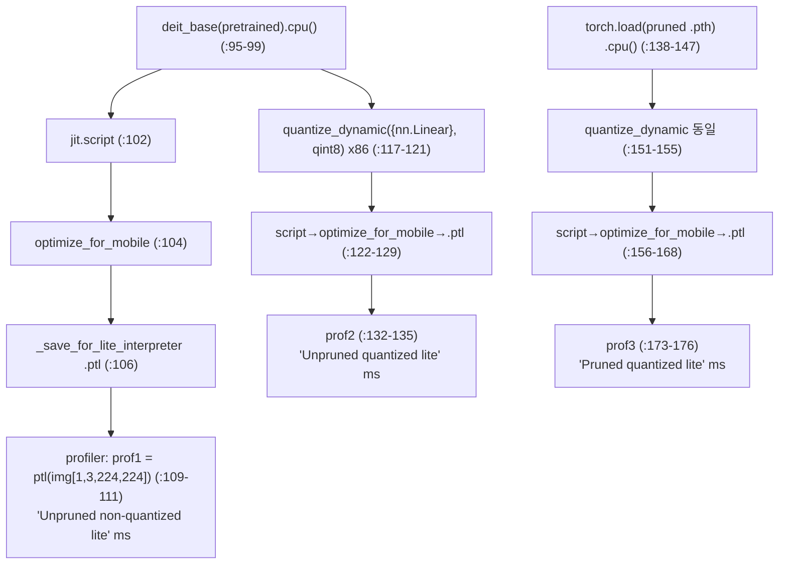
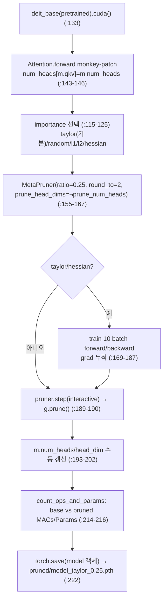
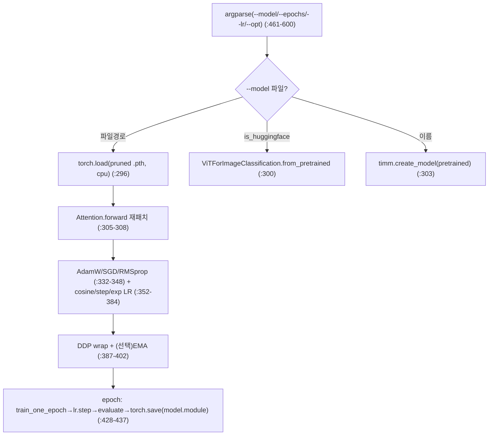
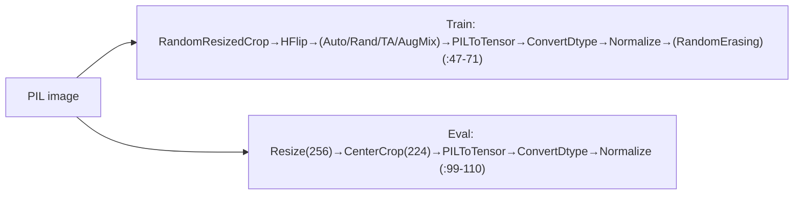

# PQV-Mobile 모듈 통합 가이드 (S-PyTorch)

> 1차 요약: [`../PQV-Mobile.md`](../PQV-Mobile.md) — 본 문서는 그 요약을 모듈 단위로 심화한 통합 가이드다.
> 분석 대상: `\\wsl.localhost\ubuntu-24.04\home\user\project\PRJXR-HBTXR\REF\ViT-Quantization\PQV-Mobile`
> 작성 원칙: 실제 소스 Read 후 `파일:라인` 근거 표기. 라인 근거 없는 추론은 "추정", 코드로 확인 불가는 "확인 불가"로 명시.
> 형제 가이드(`REF/Analysis/ViT-Quantization/I-ViT/MODULE_GUIDE.md`)의 6요소 구조를 따르되, HW 지표(MAC lanes/scalar MACs)는 **S-PyTorch 수치 규약**(params/FLOPs/activation memory/비트폭/observer/per-tensor·channel/latency)으로 치환한다.

---

## 0. 문서 머리말

### 0.1 대표 케이스 선정
- **대표 모델: `deit_base_patch16_224` (DeiT-B)** — `torch.hub.load('facebookresearch/deit:main', 'deit_base_patch16_224', pretrained=True)` (`prune_timm_vit.py:133`, `quant.py:95`). 근거:
  1. 세 스크립트 모두 main()에서 **deit_base를 하드코딩**해 로드(`prune_timm_vit.py:133`, `quant.py:95`; `--model_name` 인자는 `prune_timm_vit.py:21`에 있으나 main에서 미사용). finetune sh도 DeiT-B/16 대상(`finetune_timm_deit_b_16_taylor_uniform.sh:4`).
  2. DeiT-B = `embed_dim=768, depth=12, num_heads=12, head_dim=64, mlp_ratio=4, patch16, img224, N=197`(=14×14 패치 + cls). I-ViT 가이드의 DeiT-S(384/12/6)와 달리 PQV-Mobile은 **DeiT-B(768/12/12)** 가 공식 대표 케이스라 정량은 768 기준으로 산출.
- **대표 분석 단위: timm ViT 1개 Block** = `LayerNorm → Attention(Linear qkv + SDPA/softmax + Linear proj) → residual → LayerNorm → Mlp(Linear fc1 + GELU + Linear fc2) → residual`. PQV-Mobile은 timm 원본 Block을 쓰되 **Attention.forward만 monkey-patch**(`prune_timm_vit.py:38-61,145`)로 교체한다. block 12개 적층(추정, DeiT-B depth=12).
- **대표 동작 3종**(I-ViT의 "정수 비선형 3종" 대체): ① **structured pruning**(`prune_timm_vit.py`, head_dim/num_heads/FFN 채널), ② **INT8 dynamic quantization**(`quant.py:121,155`, Linear-only), ③ **mobile 변환 + CPU latency 측정**(`quant.py:102-176`, TorchScript→optimize_for_mobile→Lite Interpreter→autograd profiler).
- **I-ViT와의 핵심 차이(S-PyTorch 변형 성격)**: I-ViT는 **integer-only QAT + 정수 비선형(IntGELU/IntSoftmax/IntLayerNorm) + dyadic requant**의 정밀 양자화 프레임워크인 반면, PQV-Mobile은 **외부 라이브러리(Torch-Pruning + PyTorch eager dynamic-quant)를 조립한 압축·지연측정 도구**다. 자체 양자화 커널·observer·calibration이 없다(확인됨, §2).

### 0.2 S-PyTorch 수치 규약 (HW의 MAC lanes/scalar MACs 대체)
- **params**: 모듈 차원 분석적 계산. Linear `in·out (+out bias)`, LayerNorm `2·C`, Conv `Cout·Cin·Kh·Kw (+Cout)`. PQV-Mobile은 timm FP 가중치를 그대로 쓰다가 `quantize_dynamic`이 Linear를 INT8 packed weight로 치환(`quant.py:121`) → **params 개수는 FP 원본과 동일, 저장 비트폭만 FP32→INT8**. pruning은 **params 개수 자체를 구조적으로 감소**(`prune_timm_vit.py:189-190,214-216`, `count_ops_and_params`로 실측 출력).
- **FLOPs/MACs**: 표준식×config. Linear MAC = `B·N·in·out`. Attention QKᵀ = `B·H·N²·dh`, AV = `B·H·N²·dh`(H=heads, dh=head_dim). 대표 레이어를 DeiT-B(B=1, N=197, C=768, H=12, dh=64)로 산출 후 12 block 환원. **본 repo는 `tp.utils.count_ops_and_params`로 base/pruned MACs(G)·Params(M)를 런타임 출력**(`prune_timm_vit.py:214-216`)하나 본 세션 미실행 → 출력 수치는 확인 불가, 분석적 계산만 제시.
- **activation memory**: 텐서 shape × 비트폭. dynamic-quant은 활성값을 추론 시점에 동적 INT8화하지만 입출력 텐서는 FP32 dtype 유지(추정) → 정수 도메인 비트폭(W8/A8)을 "HW 환산 activation bit"로 표기.
- **비트폭/observer**: 코드 직접. **weight INT8(`torch.qint8`)**, dynamic이라 **calibration/observer 절차 부재**(Grep으로 `prepare`/`convert`/`HistogramObserver`/`MinMaxObserver`/`per_channel` 키워드 부재 — 1차 요약 §3.1.3 근거 재확인). per-tensor/per-channel 명시 설정 없음 → PyTorch dynamic 기본값 따름(추정). pruning round_to=2(`prune_timm_vit.py:166`).
- **per-tensor / per-channel**: 코드에 명시적 qscheme 지정이 **없음**(확인됨). `quantize_dynamic(qconfig_spec={nn.Linear}, dtype=qint8)`만 호출(`quant.py:121,155`) → PyTorch 기본 dynamic weight 양자화(통상 per-tensor symmetric, 추정).
- **latency 측정**: `torch.autograd.profiler.profile(use_cuda=False)`의 `self_cpu_time_total/1000`(ms), batch=1 단발 1회(`quant.py:109-111,132-135,173-176`). **x86 백엔드 호스트 CPU**, ARM on-device 아님(`quant.py:117,151` 주석). 본 세션 미실행 → 실측값 확인 불가.
- **정확도/속도**: README는 논문 링크(arXiv 2408.08437)만 제공, 정확도/지연 수치표 **부재**(`README:2`). → 정확도/지연 모두 **확인 불가**.

### 0.3 운영 경로 (prune → finetune → quant·latency)
```
[1. structured pruning] prune_timm_vit.py
   │  torch.hub deit_base_patch16_224(pretrained)  (prune_timm_vit.py:133)
   │  Attention.forward monkey-patch (reshape B,N,-1)  (:38-61,145)
   │  tp.pruner.MetaPruner(importance=taylor/..., pruning_ratio=0.25, round_to=2)  (:155-167)
   │  (taylor/hessian) train 10 batch grad 누적  (:169-187)
   │  pruner.step→g.prune() + num_heads/head_dim 수동 갱신  (:189-202)
   ▼  torch.save(model 객체 전체) → pruned/model_taylor_0.25.pth  (:222)
[2. (선택) finetune] finetune.py  (torchrun 4-GPU DDP)
   │  torch.load(pruned 모델) → Attention.forward 재패치  (:294-308)
   │  AdamW + cosine + AMP + (EMA/mixup/cutmix)  (:332-402)
   │  epoch마다 torch.save(model.module)  (:435-437)
   ▼  README: "does not affect the latency in quant.py"  (README:17)
[3. quant + latency] quant.py
   │  unpruned: deit_base 로드 → script → optimize_for_mobile → .ptl → profiler  (:95-135)
   │  quantize_dynamic({nn.Linear}, qint8) x86  (:121,155)
   │  pruned: torch.load → 동일 양자화·변환·측정  (:138-176)
   ▼  print 3종 latency: unpruned-FP / unpruned-INT8 / pruned-INT8  (:111,135,176)
```
- 타깃 디바이스: **pruning/finetune는 CUDA**(`prune_timm_vit.py:113,135` `.cuda()`; finetune `--device cuda` 기본 `:469`), **quant/latency는 CPU**(`quant.py:89,99` `device='cpu'`, `optimize_for_mobile`은 CPU 모바일 포맷). 즉 압축은 GPU, 지연측정은 호스트 CPU(x86).

### 0.4 모델 / 데이터셋 / 정확도·지연 (README/코드 인용)
| 항목 | 값 | 근거 |
|---|---|---|
| 대표 모델 | DeiT-Base/16 (deit_base_patch16_224, torch.hub Facebook) | `prune_timm_vit.py:133`, `quant.py:95` |
| 데이터셋 | ImageNet (ImageFolder train/val), 224×224 | `prune_timm_vit.py:67,83`, `quant.py:59` |
| 입력 전처리 | resize 256 / crop 224 / BILINEAR, mean·std 기본 **0.5**(또는 `--use_imagenet_mean_std`시 ImageNet 통계) | `quant.py:60-66`, `presets.py:99-110` |
| weight 비트폭 | INT8 (`torch.qint8`), Linear-only | `quant.py:121,155` |
| pruning 기본 비율 | 0.25 (head_dim 기본; head 50% 옵션) | `prune_timm_vit.py:24,165` |
| 정확도 (FP/INT8/pruned) | **확인 불가** (README에 수치표 없음, 논문 링크만) | `README:2` |
| latency (FP/INT8/pruned) | **확인 불가** (코드가 런타임 print, 본 세션 미실행) | `quant.py:111,135,176` |
- 라이선스: MIT, Copyright 2024 kshitij11(`LICENSE` — 1차 요약 §2.3). 고지: LLNL-CODE-865374, DE-AC52-07NA27344(`NOTICE.md:1-3`).

---

## 1. Repo / Layer 개요

PQV-Mobile = "**Pruning and Quantization framework for mobile applications of ViTs**"(`README:2`, 논문 arXiv 2408.08437). 사전학습 timm/DeiT ViT를 **structured pruning + INT8 dynamic quantization**으로 압축하고 압축 전후 **CPU 추론 latency**를 직접 측정하는 도구 모음. 4개 자체 .py 모두 헤더에 `## Modified from / Taken from Torch-Pruning Package`를 달고 있어(`prune_timm_vit.py:1`, `quant.py:1`, `finetune.py:1`, `presets.py:1`) **VainF/Torch-Pruning 예제를 ViT-mobile용으로 개조**한 성격이 명확하다.

### 1.1 자체 소스 vs 외부 프레임워크 vs 제외

| 구분 | 파일(자체 소스) | 역할 | 라인 |
|---|---|---|---|
| **양자화+모바일+지연** | `quant.py` ★핵심 | INT8 dynamic quant + TorchScript/Lite 변환 + autograd profiler latency | 179 |
| **구조적 프루닝** | `prune_timm_vit.py` ★핵심 | Torch-Pruning MetaPruner로 head/head_dim/FFN 구조 제거 | 225 |
| **미세조정** | `finetune.py` | pruned 모델 ImageNet DDP finetune(AdamW+cosine+AMP) | 605 |
| **전처리 preset** | `presets.py` | ClassificationPresetTrain/Eval (torchvision references 유래) | 115 |
| **스크립트** | `finetune_timm_deit_b_16_taylor_uniform.sh` | DeiT-B/16 Taylor uniform finetune 명령(torchrun 4-GPU) | 25 |
| **설정/고지** | `requirments.txt`(오타), `README`, `NOTICE.md`, `LICENSE` | 의존성/사용법/고지 | — |

### 1.2 forward 진입점 (Attention monkey-patch)
세 스크립트(`prune_timm_vit.py:38-61`, `quant.py:29-52`, `finetune.py:28-52`)는 동일한 `forward(self, x)` 함수를 정의해 timm `Attention.forward`를 대체한다(`prune_timm_vit.py:145`, `finetune.py:308`에서 `m.forward = forward.__get__(...)`). 핵심:
- `qkv(x).reshape(B,N,3,num_heads,head_dim).permute(...)` → q,k,v 분리(`:41-42`).
- `self.fused_attn = hasattr(F, 'scaled_dot_product_attention')`(`:44`) — SDPA 가능 여부 동적 판정. 가능하면 `F.scaled_dot_product_attention`(`:47`), 아니면 수동 `q@kᵀ → softmax → @v`(`:52-56`).
- **결정적 트릭**: `x.transpose(1,2).reshape(B,N,-1)`(`:58`, 주석 `original: reshape(B,N,C)`). 원본 `C` 대신 `-1`로 추론해 **head pruning 후 채널 수가 달라져도 reshape이 깨지지 않게** 함. PQV-Mobile pruning 동작의 핵심 enabler.

### 1.3 제외 (지시에 따라 이름만 표기, 미분석)
- **외부 프레임워크(커스텀 아님)**: `torch_pruning`(VainF/Torch-Pruning — importance/MetaPruner/count_ops_and_params 전부 외부, `prune_timm_vit.py:7,116-167,214`), `torch.quantization.quantize_dynamic`(PyTorch eager quant, `quant.py:121`), `torch.utils.mobile_optimizer.optimize_for_mobile`(`quant.py:104`), `timm`/`torch.hub deit`(원본 모델·가중치).
- **누락 의존 모듈(repo에 부재, 확인됨)**: `finetune.py`가 import하는 `utils`(`:14`), `from sampler import RASampler`(`:15`), `from transforms import get_mixup_cutmix`(`:20`) — Glob 결과 repo 내 .py는 4개뿐, 셋 다 없음. **torchvision references/classification 표준 유틸**이라 사용자가 별도 확보해야 finetune.py 동작(추정).
- **사전학습 체크포인트**: torch.hub DeiT `.pth`(가중치만 로드).

### 1.4 대표 모델 레이어 구성 (DeiT-B)
timm DeiT-B(`deit_base_patch16_224`): PatchEmbed(Conv 16×16 s16, 3→768) → +cls/pos → Block×12 → LayerNorm → head(768→1000). 1 Block당 Linear 4개(qkv 768→2304, proj 768→768, fc1 768→3072, fc2 3072→768), LayerNorm 2, GELU 1, Attention SDPA/softmax 1. **양자화 대상은 모든 nn.Linear**(`quant.py:121` `qconfig_spec={nn.Linear}`), LayerNorm/GELU/softmax/matmul은 FP 유지.

---

## 2. 모듈: INT8 Dynamic Quantization + 모바일 변환 + Latency — `quant.py` ★핵심

### 2.1 역할 + 상위/하위
- **역할**: (1) unpruned/pruned 모델을 PyTorch **eager-mode dynamic INT8 양자화**(Linear-only), (2) TorchScript→optimize_for_mobile→Lite Interpreter(`.ptl`) 모바일 포맷 변환, (3) autograd profiler로 CPU latency(ms) 측정. 3 시나리오(unpruned-FP / unpruned-INT8 / pruned-INT8) 비교.
- **상위**: CLI `python quant.py`(`README:15`). **하위**: `torch.quantization.quantize_dynamic`, `torch.jit.script`, `optimize_for_mobile`, `torch.autograd.profiler.profile` — 모두 PyTorch 표준(외부).

### 2.2 데이터플로우 (텐서/모델 흐름)


### 2.3 forward call stack
`main`(`quant.py:87`) → `torch.hub.load(deit_base, pretrained)`(`:95`) → `jit.script`(`:102`)/`optimize_for_mobile`(`:104`)/`_save_for_lite_interpreter`(`:106`) → `profiler.profile(use_cuda=False)`(`:109`) → `quantize_dynamic`(`:121`) → 동일 변환·측정 ×2(`:132-176`).

### 2.4 대표 코드 위치
`quant.py`: argparse `:19-27`, Attention forward(미주입) `:29-52`, `prepare_imagenet` `:54-69`, `validate_model` `:71-85`, unpruned-FP 측정 `:102-111`, **dynamic quant** `:117-121`(unpruned)/`:151-155`(pruned), 모바일 변환 `:122-130`/`:156-169`, latency 측정 `:132-135`/`:173-176`.

### 2.5 대표 코드 블록

```python
# quant.py:117-121  PyTorch eager dynamic quantization (unpruned; pruned는 :151-155 동일)
backend = "x86"  # replaced with ``qnnpack`` causing much worse inference speed ... on this notebook
model.qconfig = torch.quantization.get_default_qconfig(backend)
torch.backends.quantized.engine = backend
quantized_model = torch.quantization.quantize_dynamic(
    model, qconfig_spec={torch.nn.Linear}, dtype=torch.qint8)
```
→ **dynamic PTQ**: calibration 데이터 불필요, weight를 INT8(qint8)로, 활성값은 추론 시점 동적 양자화. 대상은 **오직 nn.Linear**(qkv/proj/fc1/fc2/head). LayerNorm/GELU/softmax/matmul은 FP 유지. **주의**: `get_default_qconfig`(static observer 설정)와 `quantized.engine` 라인은 dynamic 경로에서 사실상 무효(static PTQ 보일러플레이트 잔존, 추정 — `quantize_dynamic`은 자체 qconfig_spec으로 동작).

```python
# quant.py:102-111  TorchScript → 모바일 최적화 → Lite Interpreter → latency (FP 경로)
scripted_model = torch.jit.script(model)
optimized_scripted_model = torch.utils.mobile_optimizer.optimize_for_mobile(scripted_model)
optimized_scripted_model._save_for_lite_interpreter("vit_unpruned_optimized_scripted_lite.ptl")
ptl_unquant = torch.jit.load("vit_unpruned_optimized_scripted_lite.ptl")
with torch.autograd.profiler.profile(use_cuda=False) as prof1:
    out = ptl_unquant(img)
print("Unpruned non-quantized lite model: {:.2f}ms".format(prof1.self_cpu_time_total/1000))
```
→ latency = `self_cpu_time_total`(µs)/1000 = ms. **batch=1**(`img=torch.randn(1,3,224,224)`, `:100,171`), **단발 1회 forward**(warm-up·반복평균·표준편차 없음 — 측정 신뢰도 낮음, §N+2).

```python
# quant.py:138  pruned 모델은 객체 통째 로드 (state_dict 아님)
model = torch.load(args.load_from, map_location=torch.device('cpu'))
```
→ Torch-Pruning이 변경한 구조를 그대로 복원하려면 객체 전체 저장/로드 필요(`prune_timm_vit.py:222`와 짝). 역직렬화 보안 리스크 존재(§N+2).

### 2.6 연산·수치표현 분해 + 정량 (DeiT-B, B=1, N=197)
- **양자화 방식**: dynamic PTQ, weight INT8(qint8), Linear-only. **per-tensor/per-channel 미명시**(PyTorch 기본 따름, 추정). observer/calibration **부재**(확인됨).
- **비트폭**: W8(Linear), 활성 동적 INT8(추론시), non-Linear FP32.
- **params** (DeiT-B 1 block, C=768 — 양자화로 개수 불변, 비트폭만 FP32→INT8):
  - qkv: 768×2304 + 2304 = **1,771,776**
  - proj: 768×768 + 768 = **590,592**
  - fc1: 768×3072 + 3072 = **2,362,368**
  - fc2: 3072×768 + 768 = **2,360,064**
  - Linear params/block ≈ **7.085M**, ×12 ≈ **85.0M** (+ patch_embed/head 별도). DeiT-B 공칭 ~86M와 정합.
  - **저장 크기 효과**: Linear 가중치를 FP32→INT8화 → 해당 파라미터 메모리 약 1/4(추정, packed weight).
- **MACs/block** (B=1, N=197):
  - qkv: 197×768×2304 ≈ **348.5M**
  - proj: 197×768×768 ≈ **116.2M**
  - fc1: 197×768×3072 ≈ **464.6M**
  - fc2: 197×3072×768 ≈ **464.6M**
  - Attention matmul(QKᵀ+AV): 2×12×197²×64 ≈ **71.5M** (FP, 비양자화)
  - block MAC ≈ **1.465 GMAC**, ×12 ≈ **17.6 GMAC** (PatchEmbed/head 별도). dynamic quant은 MAC 수를 바꾸지 않음(연산 정밀도만 변경).
- **activation memory**: 최대 단일 활성 = attn 행렬 [1,12,197,197] = 12×197²×4 byte(FP32) ≈ **1.86 MB**(양자화 비대상). fc1 출력 [1,197,3072] FP32 ≈ **2.42 MB**.
- **latency**: 3종 print(`:111,135,176`), 본 세션 미실행 → **확인 불가**. 측정 환경 x86 CPU, qnnpack은 더 느렸다는 주석(`:117`).

### 2.7 코드 견고성 주의 (정적 분석)
- `--test_accuracy` 경로(`:91-92`)가 `args.train_batch_size`·`args.use_imagenet_mean_std`를 참조하나 `parse_args`(`:19-27`)에 **두 인자 미정의** → 사용 시 `AttributeError` 가능(확인됨).
- `quant.py:29-52`의 `forward`는 정의만 되고 main에서 모델에 **주입되지 않음**(`prune_timm_vit`/`finetune`과 달리 `m.forward=...` 호출 부재) → unpruned 측정은 timm 원본 forward 사용(추정). pruned는 `torch.load`로 패치된 forward 보유.

---

## 3. 모듈: 구조적 프루닝 (Torch-Pruning) — `prune_timm_vit.py` ★핵심

### 3.1 역할 + 상위/하위
- **역할**: 사전학습 DeiT-B를 Torch-Pruning `MetaPruner`로 **구조적 제거** — head_dim(각 head feature 차원) 또는 num_heads(head 개수), FFN 채널을 importance 기준으로 가지치기. round_to=2로 HW 친화 라운딩, pruned 모델 객체 저장.
- **상위**: CLI `python prune_timm_vit.py`(`README:13`). **하위**: `tp.importance.*`, `tp.pruner.MetaPruner`, `tp.utils.count_ops_and_params`(외부 Torch-Pruning), monkey-patch `forward`(§1.2).

### 3.2 데이터플로우


### 3.3 forward call stack
`main`(`prune_timm_vit.py:111`) → importance 선택(`:115-125`) → `torch.hub.load`(`:133`) → `count_ops_and_params`(base, `:136`) → Attention forward 패치(`:143-148`) → `tp.pruner.MetaPruner(...)`(`:155-167`) → (taylor/hessian) grad 누적(`:169-187`) → `pruner.step(interactive=True)→g.prune()`(`:189-190`) → head 메타 갱신(`:193-202`) → `count_ops_and_params`(pruned, `:214`) → `torch.save`(`:222`).

### 3.4 대표 코드 위치
`prune_timm_vit.py`: importance 분기 `:115-125`, 모델 로드+base MACs `:133-136`, forward 패치+num_heads 매핑 `:143-148`, **MetaPruner 구성** `:155-167`, grad 누적 `:169-187`, prune 실행 `:189-190`, head 갱신 `:193-202`, summary/save `:212-222`.

### 3.5 대표 코드 블록

```python
# prune_timm_vit.py:115-125  importance 기준 선택 (5종)
if   args.pruning_type == 'random':  imp = tp.importance.RandomImportance()
elif args.pruning_type == 'taylor':  imp = tp.importance.GroupTaylorImportance()   # 기본
elif args.pruning_type == 'l2':      imp = tp.importance.GroupNormImportance(p=2)
elif args.pruning_type == 'l1':      imp = tp.importance.GroupNormImportance(p=1)
elif args.pruning_type == 'hessian': imp = tp.importance.GroupHessianImportance()
```

```python
# prune_timm_vit.py:155-167  MetaPruner — head/head_dim/FFN 구조적 프루닝
pruner = tp.pruner.MetaPruner(
    model, example_inputs,
    global_pruning = args.global_pruning,        # False면 레이어별 uniform 비율
    importance = imp,
    pruning_ratio = args.pruning_ratio,          # 기본 0.25 (:24)
    ignored_layers = ignored_layers,             # 최소 model.head 보존 (:142)
    num_heads = num_heads,                        # qkv→head 수 매핑 (:146)
    prune_num_heads = args.prune_num_heads,       # head 개수 자체 제거 여부
    prune_head_dims = not args.prune_num_heads,   # head 차원 제거 (기본 True)
    head_pruning_ratio = 0.5,                     # head 50% 제거 (prune_num_heads=True일 때)
    round_to = 2)                                 # 채널 2의 배수 라운딩 (HW 친화)
```
→ 두 head 전략 **상호 배타**: 기본은 head_dim pruning(`prune_head_dims=True`), `--prune_num_heads`면 head 통째 50% 제거. **`head_pruning_ratio=0.5` 하드코딩**(`:165`, `--head_pruning_ratio` CLI 인자 `:30`는 주석으로 무시됨, 확인됨). `round_to=2`는 FPGA/SIMD 친화 라운딩.

```python
# prune_timm_vit.py:193-202  프루닝 후 head 메타데이터 수동 갱신 (없으면 reshape 깨짐)
for m in model.modules():
    if isinstance(m, timm.models.vision_transformer.Attention):
        m.num_heads = pruner.num_heads[m.qkv]
        m.head_dim  = m.qkv.out_features // (3 * m.num_heads)
```
→ qkv out_features가 줄었으므로 head_dim 재계산. §1.2 `reshape(B,N,-1)` 트릭과 짝을 이뤄 pruned 모델 forward 정합성 확보.

### 3.6 연산·수치표현 분해 + 정량
- **양자화 방식**: 해당 없음(프루닝은 비트폭 불변, 채널/head **개수**만 감소). pruning_ratio 0.25 → 대상 차원 25% 제거(uniform 기본). round_to=2.
- **Taylor importance 수식**(GroupTaylorImportance, 외부): 1차 Taylor 근사 `ΔL ≈ |∂L/∂w · w|`, 그룹(채널/head)별 (gradient×weight) 통계로 중요도 산정. 본 repo는 train 10 batch(`--taylor_batchs`, `:23,175`)로 grad 누적. L1/L2는 gradient 없이 `‖w‖₁/‖w‖₂`(`:121-122`). Hessian은 per-sample loss backward로 누적(`:179-184`).
- **params/MACs 감소(분석적, ratio=0.25 head_dim pruning 가정)**: DeiT-B Linear params/block 7.085M → head_dim 25%↓ 시 qkv/proj가 영향(attention 부분 약 25% 채널↓), FFN은 별개 ratio. **정확 수치는 `count_ops_and_params` 런타임 출력**(`:214-216`)이라 본 세션 미실행 → **확인 불가**(분석적으로는 attention 채널 25%↓ → attention MAC 약 25%↓ 추정).
- **저장**: `torch.save(model 객체 전체)`(`:222`, 기본 `pruned/model_taylor_0.25.pth`). state_dict 아님(구조 변경 복원 위함).

---

## 4. 모듈: pruned 모델 미세조정 — `finetune.py`

### 4.1 역할 + 상위/하위
- **역할**: 프루닝으로 떨어진 정확도를 ImageNet **분산 학습(DDP)**으로 회복. torchvision references/classification `train.py`를 ViT/Torch-Pruning용으로 개조(`:1` 헤더). **QAT 아님 — 일반 FP finetune**(I-ViT의 QAT와 다름). README: latency에는 영향 없음(`README:17`).
- **상위**: `finetune_timm_deit_b_16_taylor_uniform.sh`(torchrun 4-GPU). **하위**: `torch_pruning.count_ops_and_params`, timm Attention, (누락) `utils`/`sampler`/`transforms`(§1.3).

### 4.2 데이터플로우


### 4.3 forward call stack
`main`(`:245`) → `load_data`(`:267`) → mixup/cutmix collate(`:270-279`) → 모델 로드(`:294-303`)+forward 패치(`:305-308`) → optimizer/scheduler(`:332-384`) → DDP/EMA(`:387-402`) → epoch 루프 `train_one_epoch`(`:431`)→`lr_scheduler.step`(`:432`)→`evaluate`(`:433`)→`torch.save(model.module, path)`(`:437`).

### 4.4 대표 코드 위치
`finetune.py`: Attention forward `:28-52`, `train_one_epoch` `:54-96`, `evaluate` `:99-141`, `load_data` `:153-242`, `main` `:245-458`, 모델 로드 분기 `:294-303`, optimizer `:332-348`, scheduler `:352-384`, EMA `:391-402`, argparse `:461-600`.

### 4.5 대표 코드 블록

```python
# finetune.py:294-308  모델 로드 3분기 + Attention forward 재패치
if os.path.isfile(args.model):                       # pruned 모델 객체
    model = torch.load(args.model, map_location='cpu')
elif args.is_huggingface:
    model = ViTForImageClassification.from_pretrained(args.model)
else:
    model = timm.create_model(args.model, pretrained=True)
if not args.is_huggingface:
    for m in model.modules():
        if isinstance(m, timm.models.vision_transformer.Attention):
            m.forward = forward.__get__(m, timm.models.vision_transformer.Attention)
```

```python
# finetune.py:64-83  AMP + gradient clipping 학습 스텝
with torch.cuda.amp.autocast(enabled=scaler is not None):
    output = model(image)
    loss = criterion(output, target)
if scaler is not None:
    scaler.scale(loss).backward()
    if args.clip_grad_norm is not None:
        scaler.unscale_(optimizer); nn.utils.clip_grad_norm_(model.parameters(), args.clip_grad_norm)
    scaler.step(optimizer); scaler.update()
```

### 4.6 연산·수치표현 분해 + 정량 / 재현 명령
- **양자화 방식**: 없음(FP32/AMP finetune). 양자화는 quant.py 단계로 분리.
- **하이퍼파라미터**(`finetune_timm_deit_b_16_taylor_uniform.sh`): 4-GPU DDP, AdamW(`:7`), **lr 1.5e-5**(`:8`), weight_decay 0.3(`:9`), cosine annealing(`:10`), 300 epoch(`:5`), batch 64(`:6`), label smoothing 0.11(`:15`), mixup 0.2(`:16`)/cutmix 1.0(`:21`)/RandAugment(`:17`)/random-erase 0.25(`:20`), RA sampler(`:19`), `--use_imagenet_mean_std`(`:24`). DeiT 학습 레시피 계열(추정).
- **재현 명령**(`README:13-17`):
  ```bash
  python prune_timm_vit.py            # pruned/model_taylor_0.25.pth 생성
  bash finetune_timm_deit_b_16_taylor_uniform.sh   # (선택) 정확도 회복
  python quant.py                     # INT8 양자화 + latency 측정
  ```
- **정확도**: 본 repo·README에 수치 없음 → **확인 불가**(논문 2408.08437 본문 미열람).
- **코드 견고성 주의(정적 분석)**: ① `evaluate`(`:99`)가 인자에 `args` 없는데 `args.is_huggingface` 전역 참조(`:110`) → 단독 실행 시 `NameError` 가능(확인됨). ② import `utils`/`sampler`/`transforms` 누락(§1.3). ③ finetune mean/std는 `--use_imagenet_mean_std`시 ImageNet 통계(`:180-181,213-214`)인데 prune/quant 기본은 0.5/0.5 → **정규화 불일치 가능성**(주의, 추정). ④ sh의 `--path ..._0.0859375` 라벨과 `--model ..._0.25`(`:4,25`) 불일치(head_dim pruning 유효 비율 추정).

---

## 5. 모듈: 전처리 Preset — `presets.py`

### 5.1 역할 + 상위/하위
- **역할**: ImageNet train/eval 전처리 파이프라인(torchvision references/classification 유래, `:1`). prune/quant은 **Eval preset만**, finetune은 Train+Eval 모두 사용.
- **상위**: `prune_timm_vit.py:68,84`, `quant.py:60`, `finetune.py:179,212`. **하위**: torchvision `transforms`/`transforms.v2`(`:7-16`).

### 5.2 데이터플로우


### 5.3 forward call stack
`ClassificationPresetEval.__call__`(`:114`) → `T.Compose([Resize, CenterCrop, PILToTensor, ConvertImageDtype, Normalize])`(`:99-112`). Train은 `:73`의 Compose.

### 5.4 대표 코드 위치
`presets.py`: `get_module`(v2 분기) `:7-16`, `ClassificationPresetTrain` `:19-76`, `ClassificationPresetEval` `:79-115`.

### 5.5 대표 코드 블록
```python
# presets.py:99-110  Eval 전처리 (ViT 표준 256-resize / 224-crop)
transforms += [T.Resize(resize_size, interpolation=interpolation, antialias=True),
               T.CenterCrop(crop_size)]
if backend == "pil": transforms.append(T.PILToTensor())
transforms += [T.ConvertImageDtype(torch.float), T.Normalize(mean=mean, std=std)]
```

### 5.6 연산·수치표현 분해 + 정량
- **양자화 방식**: 없음(전처리). 출력 텐서 FP32.
- **입력 규격**: resize 256 → center crop 224 → [3,224,224]. mean/std는 호출처 결정(prune/quant 기본 0.5/0.5, finetune은 `--use_imagenet_mean_std`시 ImageNet 통계).
- **params/MACs**: 0(데이터 변환). activation: 출력 [3,224,224] FP32 = **588 KB**/이미지.
- **시사**: prune/quant이 Train preset 대신 **Eval preset으로 데이터 로드**(`prune_timm_vit.py:68`의 train_loader도 Eval transform 사용 — augmentation 없는 grad 누적, 확인됨). 정규화 통계 불일치 주의(§4.6).

---

## N+1. 모듈 한눈 요약 표

| 모듈 | 파일:라인 | 역할 | 양자화/압축 방식 | 대표 정량(DeiT-B) |
|---|---|---|---|---|
| quant (양자화) | quant.py:117-121,151-155 | INT8 dynamic quant, Linear-only | dynamic PTQ, W8 qint8, observer 부재 | block Linear 7.085M params, 1.394G MAC |
| quant (모바일/지연) | quant.py:102-176 | script→optimize_for_mobile→.ptl→profiler | — | latency 확인 불가(batch=1 단발, x86 CPU) |
| prune (구조적) | prune_timm_vit.py:155-167 | MetaPruner head/head_dim/FFN 제거 | structured, ratio 0.25, round_to=2 | base/pruned MACs print(미실행→확인불가) |
| prune (importance) | prune_timm_vit.py:115-125 | taylor/random/l1/l2/hessian | Taylor ΔL≈|∂L/∂w·w| | taylor 10 batch grad 누적 |
| finetune | finetune.py:294-437 | pruned 모델 DDP FP finetune | 없음(AMP FP32, QAT 아님) | AdamW lr1.5e-5, 300ep, 정확도 확인불가 |
| presets | presets.py:79-115 | resize256/crop224 전처리 | 없음 | 출력 [3,224,224] 588KB |
| Attention forward(패치) | prune_timm_vit.py:38-61 | timm Attention 대체, reshape(B,N,-1) | SDPA/수동 softmax | pruned reshape 정합 enabler |

---

## N+2. 학습·평가·지연 파이프라인 + 재현 명령 + 평가

### N+2.1 재현 명령 (README:13-17)
```bash
# (timm 사전 패치 필요: vision_transformer.py line 70/85 fast_attn→fused_attn, README:10-11)
python prune_timm_vit.py     # → pruned/model_taylor_0.25.pth (DeiT-B, taylor, ratio 0.25)
bash finetune_timm_deit_b_16_taylor_uniform.sh   # (선택) 4-GPU DDP 정확도 회복
python quant.py              # INT8 dynamic quant + Lite 변환 + CPU latency 3종 print
```
- 의존성(`requirments.txt` — 오타 그대로): `torch==2.0.0`, `torchvision==0.15.1`, `timm==0.8.17.dev0`, `torch-pruning`(버전 미고정). 추가 import(미기재): `tqdm`(`prune_timm_vit.py:11`, `quant.py:11`), `transformers`(huggingface 경로 `finetune.py:299`). Python 3.9(`README:4`). README의 `pip install -r requirements.txt`와 실제 파일명 `requirments.txt` 불일치(`README:6`).

### N+2.2 정확도 / 지연 (인용)
- **정확도**: README에 수치표 **없음**, 논문 링크(arXiv 2408.08437)만(`README:2`) → **확인 불가**. 코드는 `validate_model`(`prune_timm_vit.py:95`, `quant.py:71`)로 top-1을 런타임 산출 가능하나 본 세션 미실행.
- **지연**: `quant.py`가 3종 latency를 print(`:111,135,176`)하나 본 세션 미실행 → **확인 불가**. 측정 환경: x86 CPU, Lite Interpreter, batch=1.

### N+2.3 강점/한계/리스크 평가
**강점**: prune+quant+latency를 end-to-end로 한 흐름에 담은 간결한 레퍼런스. FP→INT8→pruned+INT8 3단 비교 프레이밍. Torch-Pruning ViT-aware structured pruning(head/head_dim/FFN) 활용, round_to=2·Lite 변환 등 배포 친화 디테일.
**한계**:
- **양자화가 dynamic + Linear-only로 매우 단순**: static PTQ(calibration)·QAT·per-channel weight·attention matmul/softmax/LayerNorm 양자화 미지원. I-ViT의 정수 비선형(IntGELU/IntSoftmax/IntLayerNorm)·dyadic requant 같은 깊이가 없음.
- **"Mobile"이지만 측정은 x86 호스트 CPU**: ARM(qnnpack) on-device 측정 코드 부재, qnnpack은 더 느렸다는 주석(`quant.py:117,151`).
- **latency 측정 신뢰성 낮음**: batch=1 단발 1회, warm-up/반복평균/표준편차 없음(`quant.py:109-176`).
- **코드 견고성**: quant.py:92 미정의 인자, finetune.py:110 전역 args, 누락 모듈 utils/sampler/transforms(§1.3, §2.7, §4.6).
**리스크**: timm 0.8.17.dev0 + 수동 소스 패치(fast_attn→fused_attn) 의존 → 업그레이드 취약. `torch.save(model 객체)` 역직렬화 보안·버전 의존성.

---

## N+3. 우리 프로젝트(FPGA ViT 가속 + XR 시선추적) 시사점 + FPGA 친화도

### N+3.1 Structured pruning = 가속기 연산량 직접 절감 (최우선)
- head/head_dim/FFN 채널을 구조적으로 줄이면 systolic array/MAC 활용도·BRAM·대역폭이 그대로 감소. **`round_to=2`(HW 친화 라운딩, `prune_timm_vit.py:166`)** + **`count_ops_and_params`로 MACs/Params 실측 출력**(`:214-216`)은 우리 가속기 PE 배열 크기·tiling 결정에 직접 입력 가능. **head pruning은 attention 헤드 단위 PE 병렬도 매핑과 직결**(HG-PIPE류 파이프라인의 head-parallel 구조).
- `reshape(B,N,-1)` 트릭(`:58`)과 head 메타 갱신(`:193-202`)은 pruned 차원이 불규칙해도 forward가 동작하게 함 → HW에서는 round_to로 정렬된 채널을 전제하는 게 유리(2의 배수 보장).

### N+3.2 INT8 PTQ baseline (단, 확장 필요)
- dynamic INT8(W8, Linear-only)은 FPGA fixed-point datapath 정확도 baseline reference로 활용 가능. **그러나 FPGA는 보통 static per-tensor/per-channel symmetric INT8 + LayerNorm/Softmax 정수 근사가 필요** → PQV-Mobile의 Linear-only dynamic 방식은 그대로 쓰기 부족. **I-ViT(형제 가이드)의 IntGELU/IntSoftmax/IntLayerNorm·dyadic requant로 확장하는 것이 우리 양자화 스택의 방향**.

### N+3.3 Latency 측정 방법론은 반면교사
- PQV-Mobile의 single-shot CPU profiler 측정(`quant.py:109-176`)은 신뢰도 낮음 → 우리 벤치마크는 warm-up + 다회 반복 + 분산 보고, FPGA는 **cycle-accurate(HLS report의 II/latency)** 로 측정해야 함. 다만 "FP vs INT8 vs pruned" 3단 비교 테이블 프레이밍은 우리 평가표에 차용 가능.

### N+3.4 FPGA 친화도 평가
| 항목 | 평가 | 근거 |
|---|---|---|
| 구조적 프루닝 → HW 절감 | ★★★ head/head_dim/FFN + round_to=2 | `prune_timm_vit.py:155-167,214-216` |
| 정수전용(integer-only) | △ Linear-only dynamic, 비선형 FP 유지 | `quant.py:121` (LN/GELU/softmax 비양자화) |
| 곱셈기-free 비선형 | ✗ 없음 (I-ViT와 대비) | quant 대상 nn.Linear 한정 |
| static PTQ/calibration | ✗ 부재 | observer/prepare/convert 미검출 |
| per-channel weight | ✗ 미명시 | qscheme 미지정 |
| 저비트(INT4 등) | ✗ INT8만 (배경의 INT4 언급은 코드 미반영) | `dtype=torch.qint8` |
| latency 신뢰성 | △ batch=1 단발, x86 CPU | `quant.py:109-176` |

### N+3.5 XR 시선추적 적용 (프로젝트 성격은 추정)
- 시선추적용 경량 ViT를 엣지(FPGA)에서 저지연 구동하려면 pruning(연산량↓)+quantization(비트폭↓)이 핵심. PQV-Mobile은 **압축 파이프라인의 SW 레퍼런스(특히 structured pruning)** 로서 유용하나, 양자화 깊이는 부족 → 우리는 그 위에 (a) FPGA-friendly static INT8/INT4, (b) 비선형(softmax/LN/GELU) 정수화(I-ViT 청사진 차용), (c) HLS 매핑을 더해야 함. **PQV-Mobile에서 가져올 것은 pruning 전략(head/head_dim/round_to)과 압축 단계별 비교 프레임, 가져오지 않을 것은 dynamic Linear-only 양자화·single-shot 측정**.

---

## 부록. 근거 / 확인 불가

- **직접 코드 확인(전 라인 Read)**: `quant.py`(전체 179), `prune_timm_vit.py`(전체 225), `finetune.py`(전체 605), `presets.py`(전체 115), `finetune_timm_deit_b_16_taylor_uniform.sh`(전체 25), `README`, `NOTICE.md`, `requirments.txt`, `LICENSE`(요약 경유). repo 내 .py 4개뿐(Glob 확인).
- **분석적 산출(검증 가능)**: params/MACs/activation memory는 DeiT-B config(embed768/depth12/heads12/dh64/N197/patch16)와 표준식으로 계산. dynamic quant은 params 개수·MAC 수 불변(정밀도만 변경).
- **추정**: per-tensor weight 양자화 여부(PyTorch dynamic 기본값 가정, per_channel 미명시), `get_default_qconfig`/`quantized.engine`이 dynamic 경로에서 무효, finetune 정규화 불일치 영향, `--path 0.0859375` 라벨 의미(head_dim 유효 비율), 프로젝트 성격(FPGA+XR), pruned MACs 25% 감소.
- **확인 불가(미실행/부재/repo 외부)**: ① 정확도(FP/INT8/pruned) — README 수치표 부재, 논문 2408.08437 본문 미열람. ② latency 실측 — 코드가 런타임 print, 본 세션 미실행. ③ ARM 모바일 on-device latency — 측정 코드 자체 부재. ④ 누락 모듈 `utils`/`sampler`/`transforms` 내부 — repo에 없음. ⑤ timm 0.8.17.dev0 vision_transformer.py line 70/85 내용 — 외부 패키지. ⑥ `count_ops_and_params` 출력 MACs/Params 실값 — 미실행. ⑦ Torch-Pruning importance 클래스 내부 구현 — 외부 라이브러리.
