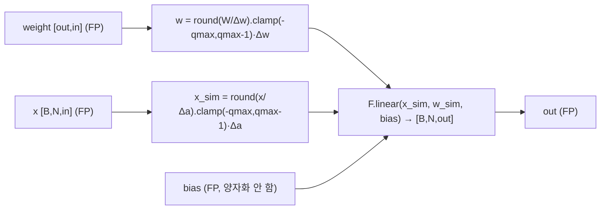
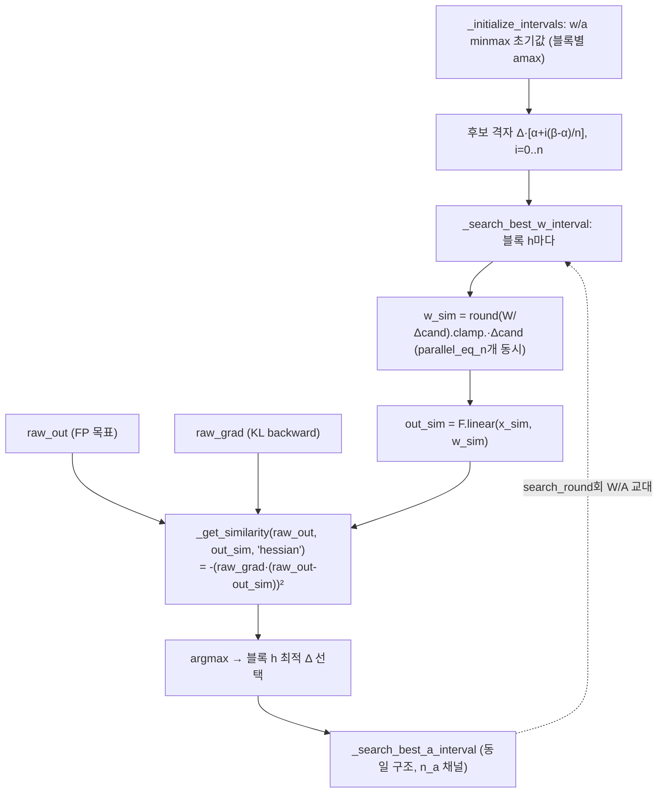
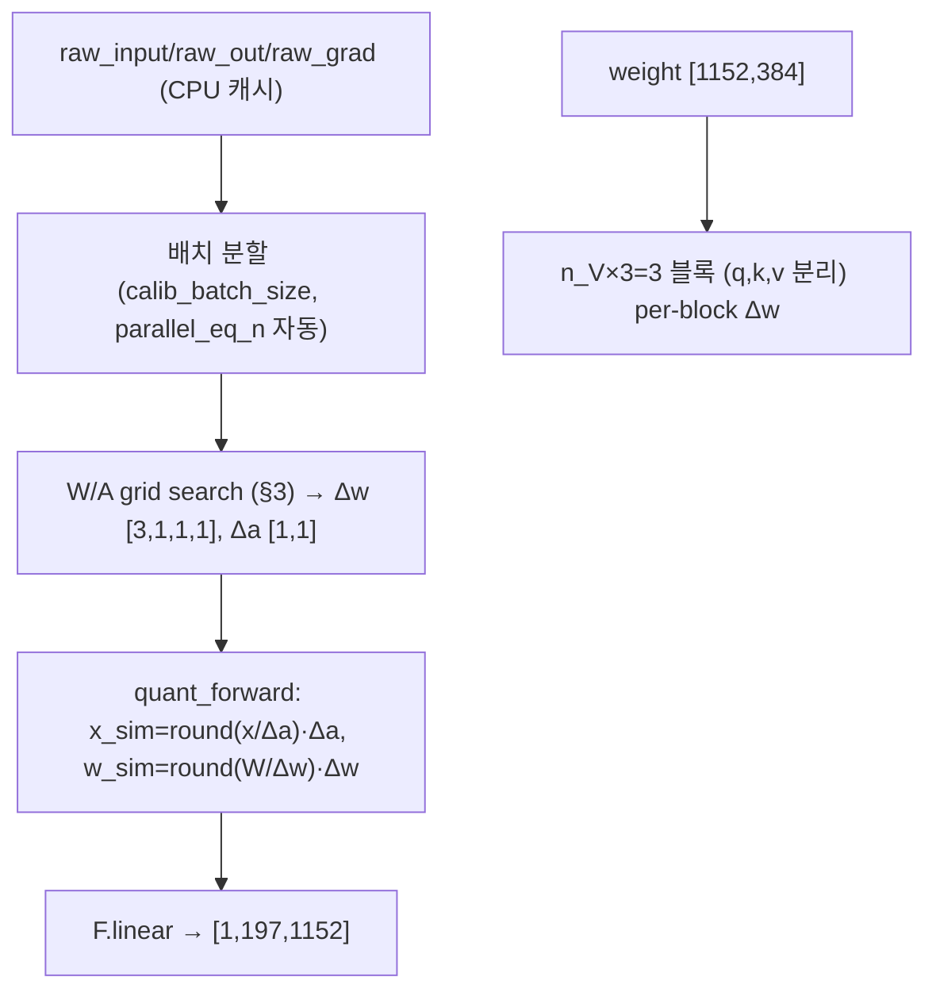
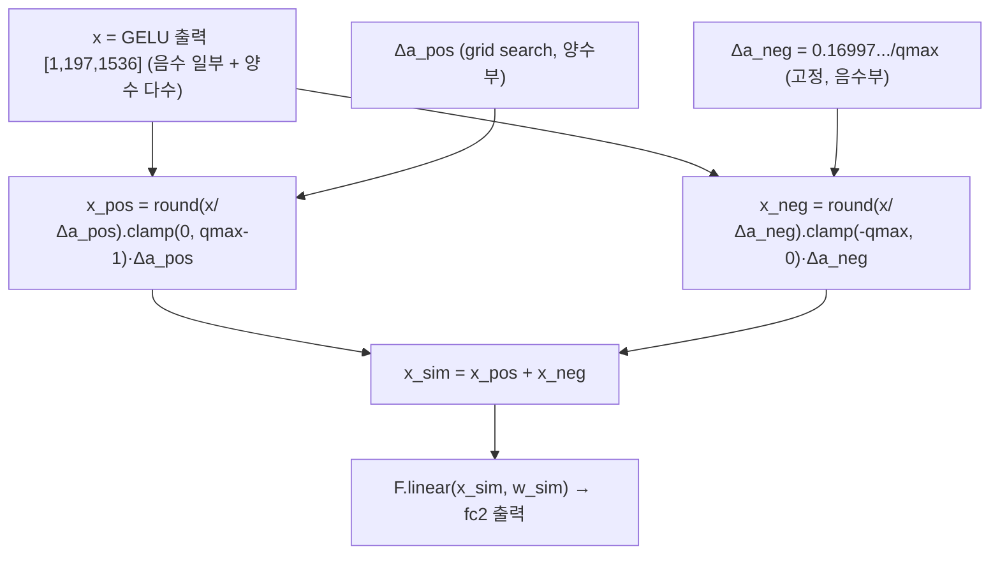
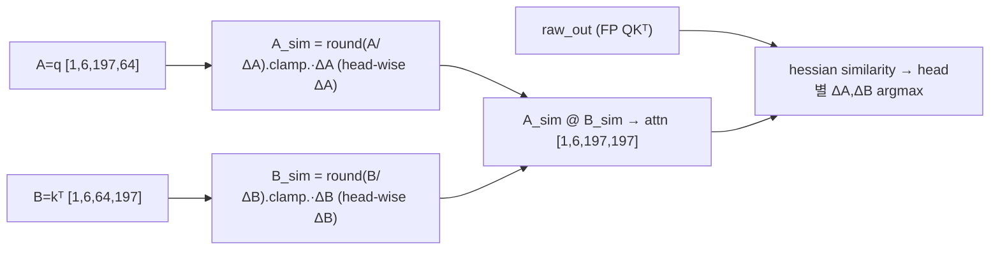
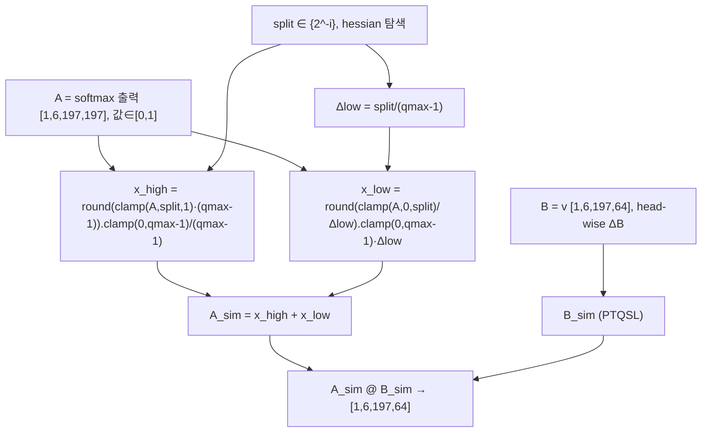
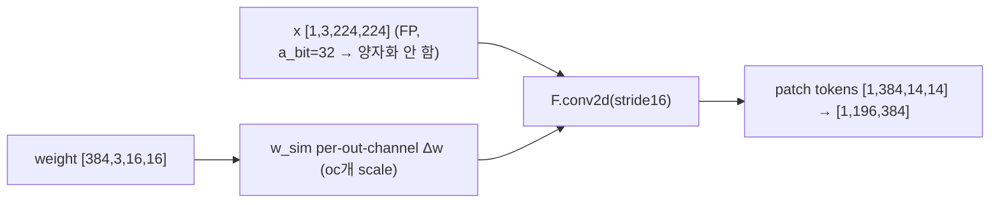
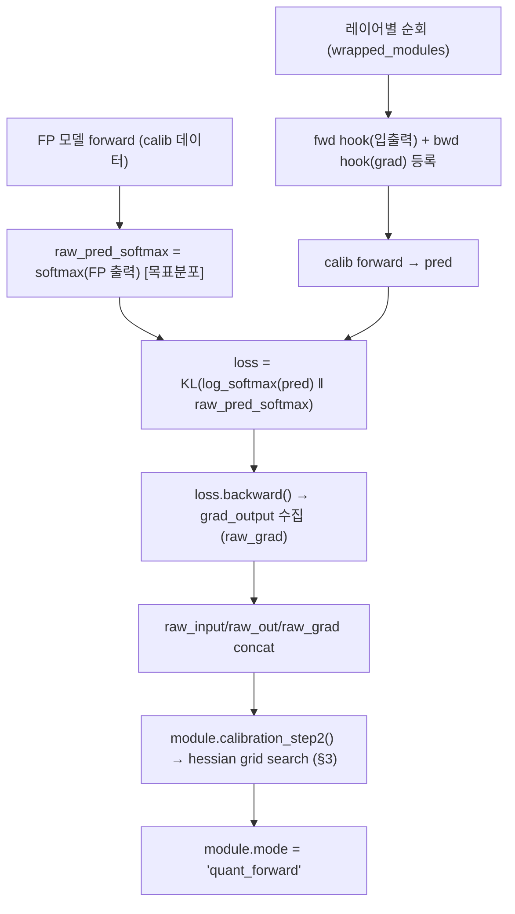
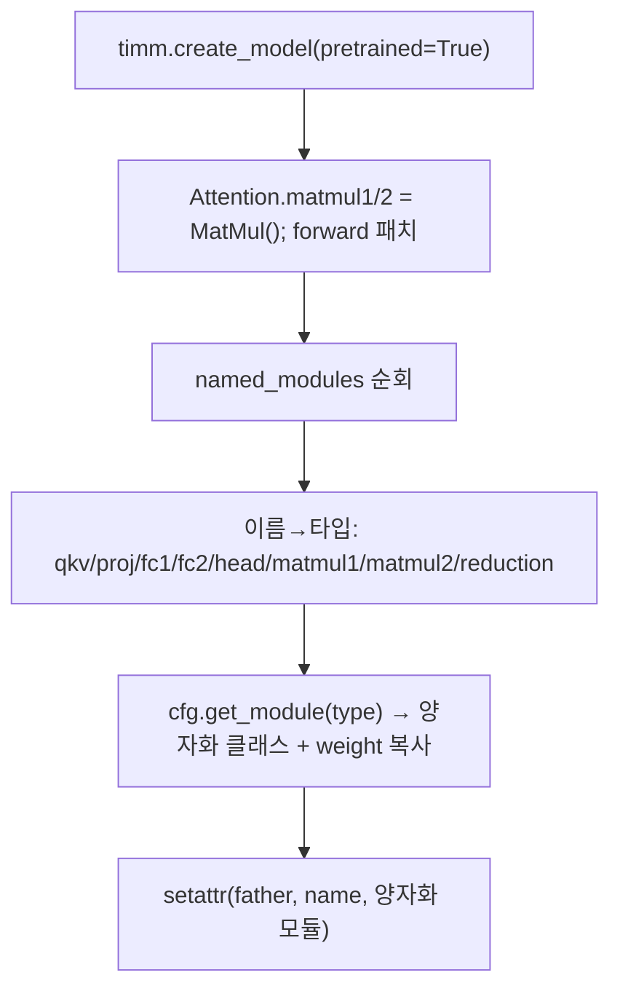

# PTQ4ViT 모듈 통합 가이드 (S-PyTorch)

> 1차 요약: [`../PTQ4ViT.md`](../PTQ4ViT.md) — 본 문서는 그 요약을 모듈 단위로 심화한 통합 가이드다.
> 분석 대상: `\\wsl.localhost\ubuntu-24.04\home\user\project\PRJXR-HBTXR\REF\ViT-Quantization\PTQ4ViT`
> 작성 원칙: 실제 소스 Read 후 `파일:라인` 근거 표기. 라인 근거 없는 추론은 "추정", 코드로 확인 불가는 "확인 불가"로 명시.
> 형제 가이드(`REF/Analysis/ViT-Quantization/I-ViT/MODULE_GUIDE.md`)의 6요소 구조(①역할+상하위 ②mermaid 텐서흐름 ③forward call stack ④코드위치 ⑤코드블록 ⑥양자화방식+정량)를 동형으로 따르되, HW 지표는 **S-PyTorch 수치 규약**(params/FLOPs/activation memory/비트폭)으로 치환한다.

---

## 0. 문서 머리말

### 0.1 대표 케이스 선정
- **대표 모델: `vit_small_patch16_224` (ViT-S/224)** — `embed_dim=384, depth=12, num_heads=6, mlp_ratio=4, patch16, img224` (timm 정의, 본 repo는 timm 모델을 로드만 함 `utils/models.py:77`). 근거:
  1. README 결과표·**ablation 표가 ViT-S/224 기준으로 가장 완비**(FP 81.39 → PTQ4ViT W8A8 81.00, W6A6 78.63 `README.md:158-159`; Hessian/Softmax-Twin/GELU-Twin 분해 표 `README.md:171-180`). 분석 가치 최상.
  2. 토큰 N=197(=14×14+cls), C=384, H=6, dh=64 — softmax/GELU 비대칭 분포(twin 양자화 대상)와 attention N² 행렬이 모두 비자명하게 활성화돼 분포 인지 양자화 분석에 적합(추정: `(224/16)²+1=197`).
- **동급 대표(보조): DeiT-S/224 `deit_small_patch16_224`** — 동일 차원, FP 79.80 → W8A8 79.47 (`README.md:162`). I-ViT 가이드의 DeiT-S와 1:1 비교용.
- **대표 분석 단위: ViT-S 1 Block** = `LN → Attention(qkv:QLinear → matmul1:QMatMul(QKᵀ) → softmax → matmul2:QMatMul(scores@V) → proj:QLinear) → residual → LN → Mlp(fc1:QLinear → GELU → fc2:QLinear) → residual`. 양자화 대상은 **6개 노드**(qkv/proj/fc1/fc2 = Linear 4, matmul1/matmul2 = MatMul 2)이며 LN/GELU/softmax/residual은 **FP로 유지**(I-ViT와 결정적 차이, §0.5).
- **대표 twin 양자화 2종**: **Split-of-Softmax(SoS)**(`matmul.py:284-388, 578-644`) — softmax 출력 0~1 롱테일 대응 / **GELU Twin(PostGelu)**(`linear.py:262-347, 557-642`) — GELU 음수영역 대응. FPGA 비대칭 양자화 회로의 직접 청사진.

### 0.2 S-PyTorch 수치 규약 (HW의 MAC lanes/scalar MACs 대체)
- **params**: 모듈 차원에서 분석적 계산. Linear `in·out (+out bias)`, Conv `Cout·Cin·Kh·Kw (+Cout)`. PTQ4ViT는 FP 가중치를 그대로 두고 forward마다 fake-quant하므로(`quant_weight_bias` `linear.py:46-48`) **params 개수는 FP 원본과 동일**(추가 학습 파라미터 없음, 비트폭만 달라짐). 양자화 파라미터는 학습 weight가 아닌 **calib 산출 buffer**(`w_interval`/`a_interval`/`split` 등, scale 격자).
- **FLOPs/MACs**: 표준식×config. Linear MAC = `B·N·in·out`. Attention QKᵀ = `B·H·N²·dh`, scores@V = `B·H·N²·dh` (H=heads, dh=head_dim). 대표 레이어 1개를 ViT-S(B=1, N=197, C=384, H=6, dh=64)로 산출 후 12 block 환원. **양자화는 연산 구조 불변**(fake-quant라 round/clamp/scale만 추가, MAC 수 동일).
- **activation memory**: 텐서 shape × 비트폭. PTQ4ViT는 fake-quant라 실제 메모리는 FP32지만(`quant_input`이 `x_sim = round(x/Δ)·Δ`=float `linear.py:57-60`), **정수 도메인 비트폭**(W/A bits)을 "HW 환산 activation bit"로 표기 — `shape × A_bit`. twin 경로(SoS/GELU)는 **uint8**로 저장 가능(`integer.py:62,86` MSB를 region/sign 비트로 사용).
- **비트폭/observer**: 코드 직접. 기본 **W8/A8**(`bit=8`, `configs/PTQ4ViT.py:8`), matmul도 A8/B8(`A_bit`/`B_bit` `:13-14`). bias는 **양자화 안 함**(주석처리 `linear.py:49-53`). **patch-embed conv는 활성 양자화 끔(`a_bit=32`)** (`configs/PTQ4ViT.py:54`). per-tensor 대칭 기본, PTQSL 블록 분할(`n_V/n_H/n_a` 또는 `n_G/n_V/n_H`)로 sub-layerwise 확장. observer = **calib 데이터 min/max → grid search**(running stat 아님; PTQ).
- **정확도/속도**: README 인용(`README.md:154-168`). 본 세션 미실행 → 측정 불가 항목은 "확인 불가". calib 시간은 README 표 인용(GPU, `README.md:28-40`).

### 0.3 운영 경로 (PTQ 캘리브레이션 ↔ ImageNet 평가)
```
[FP 사전학습 로드] get_net(name) = timm.create_model(pretrained=True)   (models.py:77)
   │  Attention.matmul1/2를 MatMul() 모듈로 치환 + forward 패치 (models.py:79-87)
   ▼
[모듈 래핑] wrap_modules_in_net(net, cfg): nn.Linear/Conv2d/MatMul → 양자화 클래스   (net_wrap.py:39-81)
   │  이름→클래스 매핑: qkv→PTQSLBatching, fc2→PostGelu(GELU Twin), matmul2→SoS(Softmax Twin) (configs/PTQ4ViT.py:51-80)
   ▼
[캘리브레이션] HessianQuantCalibrator.batching_quant_calib()   (quant_calib.py:300-378)
   │  (1) FP 모델로 raw_pred_softmax 목표분포 산출 (:309-313)
   │  (2) 레이어별 fwd 훅(입출력) + bwd 훅(grad) 등록 (:323-330)
   │  (3) calib 데이터 forward → KL(quant‖fp) loss backward로 raw_grad 수집 (:337-339)
   │  (4) module.calibration_step2(): minmax 초기화 → search_round회 W/A scale grid search (:359-366)
   │  calib 이미지 32 또는 128장이면 충분 (README.md:12-26, test_all.py:103)
   ▼
[ImageNet 평가] test_classification(net, test_loader): mode='quant_forward' Top-1   (test_vit.py:26-45)
   ▼
[(옵션) int8 추출] integer.get_model_int_weight: fp32 calib 모델 → int8 weight/uint8 activation   (integer.py:8-129, get_int.py)
```
- 타깃 디바이스: **CUDA GPU 전제** — grid search 후보 텐서가 `.cuda()` 하드코딩(`linear.py:247-248`, `matmul.py:265-266,369`, `conv.py:264-265`), calib 데이터 `inp.cuda()`(`quant_calib.py:336`), `net.cuda()`(`models.py:89`). → CPU 단독 실행 불가(코드 근거 확인, 실행 실패는 미검증).
- **재학습 없음(PTQ)** — I-ViT(QAT 수십 epoch)와의 핵심 차이. calib는 분 단위(`README.md:28-46`).

### 0.4 모델 / 데이터셋 / 정확도 (README 인용)
| Model | embed/depth/heads | FP32 | W8A8(PTQ4ViT) | W6A6(PTQ4ViT) | 근거 |
|---|---|---|---|---|---|
| ViT-S/224/32 | (patch32) | 75.99 | 75.582 | 71.908 | `README.md:158` |
| **ViT-S/224(대표)** | **384/12/6** | **81.39** | **81.002** | **78.63** | `README.md:159` |
| ViT-B/224 | 768/12/12 | 84.54 | 84.25 | 81.65 | `README.md:160` |
| ViT-B/384 | 768/12/12 | 86.00 | 85.828 | 83.348 | `README.md:161` |
| DeiT-S/224(보조) | 384/12/6 | 79.80 | 79.474 | 76.282 | `README.md:162` |
| DeiT-B/224 | 768/12/12 | 81.80 | 81.482 | 80.25 | `README.md:163` |
| Swin-T/224 | (swin, 미열람 모델정의) | 81.39 | 81.246 | 80.47 | `README.md:165` |
- **BasePTQ 대비(W6A6에서 격차 큼)**: ViT-S/224 BasePTQ W6A6 70.244 vs PTQ4ViT 78.63 (`README.md:143,159`) — twin+hessian의 저비트 이득 명확. ViT-B/384 BasePTQ W6A6 **46.886**(붕괴) → PTQ4ViT 83.348 (`README.md:145,161`).
- **ablation(ViT-S/224, FP 81.39)**: 기법 무(80.47) → +Hessian(80.93) → +Softmax-Twin(81.11) → +GELU-Twin(80.84) → 전부(81.00). W6A6에선 70.24→78.63 (`README.md:171-180`). **Hessian 단독이 W6A6에서 +7%p**로 가장 큰 기여.
- 데이터셋: **ImageNet2012** `/datasets/imagenet`, 224×224(또는 384), 1000 클래스 (`README.md:110`, `datasets.py:325-341`). calib=train subset 32/128장(`datasets.py:88-94`), test=val.
- 속도(calib time): ViT-S/224 W8A8 3분(#ims=32)/7분(#ims=128) (`README.md:31`). **추론 latency는 본 repo로 확인 불가**(fake-quant 시뮬레이터, 정수 추론 그래프 부재 `integer.py`는 weight/activation 추출만).

### 0.5 I-ViT와의 구조 대비 (동형 비교의 핵심)
| 축 | I-ViT | PTQ4ViT |
|---|---|---|
| 패러다임 | QAT(integer-only, 재학습 O) | **PTQ(fake-quant, 재학습 X)** |
| 비선형(LN/GELU/Softmax) | **정수 전용**(ShiftGELU/Shiftmax/I-LayerNorm) | **FP 유지**(양자화 대상 아님; matmul2 입력=softmax 출력만 SoS로 양자화) |
| 비대칭 분포 대응 | A16 비트폭 확대 + 정수 비선형 | **twin uniform 2-region 분리 양자화**(SoS/GELU Twin) |
| scale 산출 | running min/max EMA(0.95) observer | **calib min/max 초기화 → Hessian-guided grid search** |
| 재양자화 | dyadic `(z·m)>>e` | 없음(fake-quant, `round(x/Δ)·Δ` per node) |
| scale granularity | per-tensor(act)/per-ch(weight) | **sub-layerwise**(n_V/n_H/n_a 블록, head-wise n_G) |
→ PTQ4ViT의 FPGA 가치는 **(a) twin 2-region 양자화 회로**와 **(b) 오프라인 calib으로 결정된 per-block scale ROM**에 집중(비선형은 별도 HW 설계 필요).

---

## 1. Repo / Layer 개요

PTQ4ViT = ViT/DeiT/Swin을 **재학습 없이(PTQ)** 8-bit(W8A8)에서 무손실에 가깝게(<0.5% drop) 양자화하는 프레임워크(`README.md:1-5`). 두 핵심 기여: **twin uniform quantization**(softmax/GELU 후 비대칭 분포 2-region 분리)과 **Hessian-guided scale 탐색**(출력 기울기로 가중한 양자화 오차 최소화). 본 repo는 **timm ViT 위에 얹은 커스텀 양자화 레이어**가 자체 소스이고, 모델 정의·DataLoader·optimizer는 timm/torchvision을 임포트한다.

### 1.1 자체 소스 vs 외부 프레임워크 vs 제외
| 구분 | 파일(자체 소스) | 역할 |
|---|---|---|
| **양자화 Linear** | `quant_layers/linear.py` ★핵심 | MinMax→PTQSL→Batching→**PostGelu(GELU Twin)** 계층(642L) |
| **양자화 MatMul** | `quant_layers/matmul.py` ★핵심 | QKᵀ/scores@V + **SoS(Softmax Twin)** 계층(644L) |
| **양자화 Conv** | `quant_layers/conv.py` | PatchEmbed conv, Channelwise/EasyQuant 변형(614L) |
| **calib 엔진** | `utils/quant_calib.py` ★핵심 | QuantCalibrator / **HessianQuantCalibrator**(KL backward로 grad 수집)(378L) |
| **모듈 래핑** | `utils/net_wrap.py` | FP 모듈 → 양자화 모듈 치환, 이름→클래스 매핑 |
| **모델 로더** | `utils/models.py` | timm 로드 + Attention.matmul1/2 치환 + forward 패치 |
| **데이터** | `utils/datasets.py` | ViTImageNetLoaderGenerator(timm transform), calib subset |
| **int 변환** | `utils/integer.py` | calib fp32 → int8 weight / uint8 twin activation 추출 |
| **설정** | `configs/PTQ4ViT.py` / `configs/BasePTQ.py` | hessian+twin / cosine+minmax 베이스라인 |
| **엔트리** | `example/{test_all,test_vit,test_ablation,get_int}.py` | calib+평가 실행, ablation, int 추출 |

### 1.2 forward 진입점
모델 자체는 **timm VisionTransformer**(외부)이고, 양자화는 모듈 치환으로 주입된다. forward 경로:
`timm VisionTransformer.forward` → `Block` ×12 → 패치된 `attention_forward`(`models.py:10-26`): `qkv(QLinear)` → `matmul1(q, kᵀ)·scale` → `softmax`(FP) → `matmul2(attn, v)` → `proj(QLinear)`. 각 양자화 모듈의 `forward`는 **4-state 분기**(`raw`/`quant_forward`/`calibration_step1`/`calibration_step2`, `linear.py:33-44`, `matmul.py:22-33`)로, calib 단계와 평가 단계가 같은 forward에서 mode 스위칭으로 전환된다.

### 1.3 제외 (지시에 따라 이름만 표기, 미분석)
- **외부 프레임워크(커스텀 아님)**: `timm.create_model`(ViT/DeiT/Swin 모델 정의 자체 `models.py:77`), `timm.data.{resolve_data_config,create_transform}`(`datasets.py:322-340`), `torchvision.transforms/datasets`(`datasets.py:11-13`). DeiT/ViT **원본 사전학습 체크포인트**(timm pretrained, Google Drive 양자화 체크포인트 `README.md:80-92`) — 가중치만 로드/배포.
- **다른 데이터셋 로더(미사용)**: `CIFARLoaderGenerator`/`COCOLoaderGenerator`/`DetectionListDataset`(`datasets.py:96-196`) — ImageNet 외 경로, 본 분석 범위 밖.
- **미사용 양자화 변형**: `QuantileQuantConv2d`(`conv.py:91-124`), `BatchingEasyQuantConv2d`(`conv.py:279-442`, BasePTQ용), 비배칭 `PTQSLQuantLinear/MatMul/Conv2d`(`quant_calib`의 batching 경로가 배칭판만 호출). 단 배칭판이 비배칭판을 상속하므로 핵심 로직은 §4~10에서 공통 분석.
- **미열람(확인 불가)**: timm swin 모델 정의 세부(WindowAttention forward 패치 `models.py:28-56`만 확인), `example/test_ablation.py` 세부(no_softmax/no_postgelu 플래그 토글 추정 `net_wrap.py:5-6`).

### 1.4 대표 모델 양자화 노드 구성 (ViT-S/224, 12 block)
| 노드 | 이름(`net_wrap`) | 클래스(PTQ4ViT cfg) | twin | 근거 |
|---|---|---|---|---|
| qkv | qlinear_qkv | PTQSLBatchingQuantLinear (n_V×3) | - | `net_wrap.py:42`, `configs/PTQ4ViT.py:58-60` |
| proj | qlinear_proj | PTQSLBatchingQuantLinear | - | `configs/PTQ4ViT.py:70` |
| fc1 | qlinear_MLP_1 | PTQSLBatchingQuantLinear | - | `configs/PTQ4ViT.py:70` |
| **fc2** | qlinear_MLP_2 | **PostGeluPTQSLBatchingQuantLinear** | **GELU** | `configs/PTQ4ViT.py:61-65` |
| matmul1(QKᵀ) | qmatmul_qk | PTQSLBatchingQuantMatMul | - | `configs/PTQ4ViT.py:73-74` |
| **matmul2(scores@V)** | qmatmul_scorev | **SoSPTQSLBatchingQuantMatMul** | **Softmax** | `configs/PTQ4ViT.py:75-79` |
| patch conv | qconv | ChannelwiseBatchingQuantConv2d (a_bit=32) | - | `configs/PTQ4ViT.py:52-54` |
| head | qlinear_classifier | PTQSLBatchingQuantLinear (n_V=1) | - | `configs/PTQ4ViT.py:66-68` |
→ block당 양자화 노드 6개 + 전역 patch conv 1 + head 1.

---

## 2. 모듈: 균일 양자화 기반함수 — `linear.py` (MinMaxQuantLinear)

### 2.1 역할 + 상위/하위
- **역할**: 모든 양자화 Linear의 베이스. **대칭 균일 fake-quant** `Q(x)=round(x/Δ)·Δ`, clamp `[-qmax, qmax-1]`. weight/activation 각각 scale `Δ` 적용. minmax로 layerwise scale 산출하는 베이스라인 calib 포함.
- **상위**: `PTQSLQuantLinear`(`linear.py:94`)이 상속, 그 위에 Batching/PostGelu. **하위**: torch `round_/clamp_/F.linear`.

### 2.2 데이터플로우 (텐서 shape 흐름)


### 2.3 forward call stack
`attention_forward`(`models.py:24` proj 등) → `MinMaxQuantLinear.forward(x)`(`linear.py:33`) → mode 분기 → `quant_forward`(`:62`) → `quant_weight_bias`(`:46`) + `quant_input`(`:57`) → `F.linear`(`:66`). calib 시: `calibration_step1`(`:79` FP 캐시) → `calibration_step2`(`:86` minmax scale).

### 2.4 대표 코드 위치
`linear.py`: 클래스 `:6-92`, 4-state forward `:33-44`, qmax `:29-30`, weight fake-quant `:46-55`, activation fake-quant `:57-60`, minmax calib `:86-92`, bias correction `:69-77`.

### 2.5 대표 코드 블록

```python
# linear.py:29-30  부호 있는 대칭 양자화 범위 (qmax = 2^(bit-1))
self.w_qmax=2**(self.w_bit-1)   # W8 → 128
self.a_qmax=2**(self.a_bit-1)   # A8 → 128
```
→ INT8(bit=8)이면 qmax=128, 정수 범위 `[-128, 127]`. **부호 있는 대칭 양자화**(zero-point=0).

```python
# linear.py:46-48  weight fake-quant (round-clamp-rescale)
w=(self.weight/self.w_interval).round_().clamp_(-self.w_qmax,self.w_qmax-1)
w_sim=w.mul_(self.w_interval)   # 정수 → 다시 FP 격자로 복원 (시뮬레이션)
# bias는 양자화 안 함 (:49-53 주석처리)
```

```python
# linear.py:86-92  MinMax 베이스라인 scale: Δ = max|·| / (qmax-0.5)
self.w_interval=(self.weight.data.abs().max()/(self.w_qmax-0.5)).detach()
self.a_interval=(x.abs().max()/(self.a_qmax-0.5)).detach()
```
→ `qmax-0.5`=127.5로 나눠 max값이 마지막 레벨에 안전 매핑. PTQSL은 이 minmax를 **초기값**으로만 쓰고 grid search로 정밀화(§3).

### 2.6 연산·수치표현 분해 + 정량
- **양자화 방식**: per-tensor 대칭 균일, zp=0. `Δ = max|·|/(qmax-0.5)`(minmax) 또는 grid search(PTQSL). bias 미양자화(FP 유지).
- **scale/zp**: scalar `Δ`(layerwise), zp=0. PTQSL에서 블록별로 확장(§4).
- **비트폭**: 기본 W8/A8. bias FP32.
- **params**: 0 추가(FP weight 재사용). buffer: `w_interval`/`a_interval` scalar.
- **FLOPs**: weight 양자화 O(out·in) div+round+clamp(forward마다 재계산 — calib/평가 시 매번), activation 양자화 O(B·N·in). 대표 qkv weight(384×1152=442K) 양자화 = 442K div+round.
- **activation bit**: 출력은 FP(`round(x/Δ)·Δ`), HW 환산 비트는 a_bit=8.

---

## 3. 모듈: Hessian-guided scale 탐색 — `linear.py` (PTQSLQuantLinear) ★핵심

### 3.1 역할 + 상위/하위
- **역할**: PTQSL(sub-layerwise) 양자화의 두뇌. weight를 `n_V×n_H` 블록, activation을 `n_a` 채널그룹으로 분할해 **블록별 scale**을 grid search로 탐색. 후보 `Δ·[α + i(β-α)/n]`을 **batch 병렬 평가**, **Hessian 메트릭**(출력 기울기로 가중한 오차)이 최대인 scale 선택. W↔A 교대 `search_round`회.
- **상위**: `PTQSLBatchingQuantLinear`(`:349`)이 상속(메모리 친화 배칭 버전이 실사용). **하위**: `_get_similarity`(`:124`), `MinMaxQuantLinear.quant_input/quant_weight_bias`, `HessianQuantCalibrator`가 제공하는 `raw_grad`.

### 3.2 데이터플로우 (텐서 shape 흐름)


### 3.3 forward call stack
`HessianQuantCalibrator.batching_quant_calib`(`quant_calib.py:359`) → `module.calibration_step2`(배칭판 `linear.py:536`) → `_initialize_intervals`(`:380`) → `_search_best_w_interval`(`:455`) / `_search_best_a_interval`(`:497`) → `_get_similarity(..., "hessian", raw_grad)`(`:417-420`) → `argmax`(`:493,531`).

### 3.4 대표 코드 위치
`linear.py`: PTQSL 클래스 `:94-260`, 블록 파라미터 `:114-119`, `_get_similarity`(metric 7종) `:124-150`, hessian `:144-146`, w 탐색 `:171-200`, a 탐색 `:202-225`, 후보 격자 `:247-248`, 초기화 `:227-233`, step2 `:235-260`. 배칭판 `:349-555`, GPU 메모리 자동 배치 `:365-378`.

### 3.5 대표 코드 블록

```python
# linear.py:144-146  Hessian 메트릭: 출력 기울기로 가중한 양자화 오차
elif metric == "hessian":
    raw_grad = self.raw_grad.reshape_as(tensor_raw)
    similarity = -(raw_grad * (tensor_raw - tensor_sim)) ** 2   # = -(g·Δo)²
```
→ 단순 L2(`-(raw-sim)²` `:139`)와 달리 **출력 기여도 g²로 가중**. g는 KL(quant‖fp) 손실의 1차 기울기(§11) → Hessian 대각 근사. 출력 영향 큰 값의 양자화 오차를 우선 최소화. **ablation에서 W6A6 +7%p 기여**(`README.md:177`).

```python
# linear.py:247-248  scale 후보 격자 = Δ_minmax · [α + i(β-α)/n]
weight_interval_candidates = torch.tensor([self.eq_alpha + i*(self.eq_beta-self.eq_alpha)/self.eq_n
    for i in range(self.eq_n + 1)]).cuda().view(-1,1,1,1,1) * self.w_interval.unsqueeze(0)
# PTQ4ViT: α=0.01, β=1.2, n=100 → minmax의 0.01~1.2배를 100분할 (configs/PTQ4ViT.py:27-29)
```

```python
# linear.py:196-200  블록 h마다 유사도 argmax로 최적 scale 확정
similarities = torch.cat(similarities, dim=0)        # shape: eq_n, n_V
h_best_index = similarities.argmax(dim=0).reshape(1,-1,1,1,1)
tmp_w_interval[:,:,:,h:h+1,:] = torch.gather(
    weight_interval_candidates[:,:,:,h:h+1,:], dim=0, index=h_best_index)
```
→ `parallel_eq_n`개 후보를 한 번에 `F.linear`로 평가(배치 병렬, `:178-190`) → calib 시간 분 단위 단축의 핵심.

### 3.6 연산·수치표현 분해 + 정량
- **양자화 방식**: sub-layerwise 대칭 균일. weight `n_V(out)×n_H(in)` 블록별 `Δw`, activation `n_a` 채널그룹별 `Δa`. PTQ4ViT 기본 `n_V=n_H=n_a=1`(=layerwise, 단 qkv는 n_V×3 `configs/PTQ4ViT.py:59`).
- **scale/zp**: per-block `Δ`, zp=0. 후보 `Δ·[0.01→1.2]`×100, search_round=3.
- **비트폭**: W8/A8.
- **params**: 0 학습. buffer: `w_interval` `[n_V,1,n_H,1]`, `a_interval` `[n_a,1]`.
- **FLOPs(calib 비용)**: 레이어당 `eq_n × search_round × 2(W,A) × F.linear`. 대표 qkv(N=197, 384→1152): 후보 100 × 3라운드 × MAC(197×384×1152≈87M) ≈ **~52 GMAC/레이어 calib**(parallel_eq_n로 묶어 실행). → calib이 분 단위인 이유(`README.md:34` DeiT-S 3분).
- **시사**: scale을 오프라인에서 결정 → **HW는 결정된 per-block Δ만 ROM으로 받으면 됨**(런타임 탐색 부담 0).

---

## 4. 모듈: 정수 Linear (PTQSL Batching) — `linear.py` (PTQSLBatchingQuantLinear)

### 4.1 역할 + 상위/하위
- **역할**: PTQSL의 **메모리 친화 실사용 버전**. calib raw 데이터를 GPU 한도(`3GB/4` 가정 `:373`)에 맞춰 배치 분할 처리. weight per-block 대칭, activation per-channel-group, `F.linear`로 fake-quant MAC. PTQ4ViT cfg가 qkv/proj/fc1/head에 사용(`configs/PTQ4ViT.py:60,68,70`).
- **상위**: `net_wrap.wrap_modules_in_net`(`:64-72`)가 nn.Linear를 치환. **하위**: `_get_similarity`(빠른 pearson `:426-453` 포함), `quant_weight_bias`/`quant_input`.

### 4.2 데이터플로우 (텐서 shape 흐름, ViT-S qkv 예)


### 4.3 forward call stack
`batching_quant_calib`(`quant_calib.py:359-361`) → `calibration_step2()`(`linear.py:536`) → `_initialize_calib_parameters`(`:365` GPU 배치 산정) → `_initialize_intervals`(`:380`) → search → 평가시 `forward(x)`→`quant_forward`(`MinMaxQuantLinear.quant_forward` `:62`).

### 4.4 대표 코드 위치
`linear.py`: 클래스 `:349-555`, GPU 배치 자동 산정 `:365-378`, 배칭 w 탐색 `:455-495`, 배칭 a 탐색 `:497-533`, step2 `:536-555`, 빠른 pearson `:426-453`.

### 4.5 대표 코드 블록

```python
# linear.py:371-378  GPU 메모리 한도로 parallel_eq_n / 배치 자동 결정
while True:
    numel = (2*(self.raw_input.numel()+self.raw_out.numel())/self.calib_size*self.calib_batch_size)
    self.parallel_eq_n = int((3*1024*1024*1024/4)//numel)   # ~0.75GB 예산
    if self.parallel_eq_n <= 1:
        self.calib_need_batching = True
        self.calib_batch_size //= 2     # OOM 회피로 배치 반감
    else:
        break
```

```python
# linear.py:152-155  weight per-block fake-quant (n_V,n_H 블록)
w=(self.weight.view(self.n_V,self.crb_rows,self.n_H,self.crb_cols)/self.w_interval)\
    .round_().clamp_(-self.w_qmax,self.w_qmax-1)
w_sim=w.mul_(self.w_interval).view(self.out_features,self.in_features)
```
→ qkv는 `n_V*=3`(`configs/PTQ4ViT.py:59`)이라 q/k/v가 **각자 다른 행 블록 scale**. FPGA에서 q,k,v 분리 dequant 상수.

### 4.6 연산·수치표현 분해 + 정량 (ViT-S, B=1, N=197)
- **양자화 방식**: weight per-block(qkv는 3블록) 대칭 W8, activation per-channel-group(n_a=1=per-tensor) A8, bias FP. grid search scale.
- **scale/zp**: `Δw` `[n_V,1,n_H,1]`, `Δa` `[n_a,1]`, zp=0.
- **비트폭**: W8/A8/bias FP32.
- **params** (ViT-S 1 block, C=384):
  - qkv: 384×1152 + 1152 = **443,520**
  - proj: 384×384 + 384 = **147,840**
  - fc1: 384×1536 + 1536 = **591,360**
  - fc2: 1536×384 + 384 = **590,208**
  - Linear params/block ≈ **1.773M**, ×12 ≈ **21.27M** (patch_embed/head 별도).
- **MACs/block** (B=1, N=197):
  - qkv 87.1M / proj 29.0M / fc1 116.2M / fc2 116.2M → **348.5M/block**, ×12 ≈ **4.18G**(attn matmul 제외).
- **activation memory**: 입출력 FP, HW 환산 A8. qkv 출력 [1,197,1152] A8 = **227 KB**.
- **시사**: 양자화로 MAC 수 불변(I-ViT와 동일), 비트폭만 W8A8. **bias 미양자화**가 I-ViT(bias 32bit 정수)와의 차이 → HW에서 bias는 FP accumulator 또는 별도 처리 필요(추정).

---

## 5. 모듈: GELU Twin (PostGelu) — `linear.py` (PostGeluPTQSLBatchingQuantLinear) ★twin uniform

### 5.1 역할 + 상위/하위
- **역할**: GELU **출력**을 입력으로 받는 fc2 전용. GELU 출력은 음수영역이 작고(하한≈-0.17) 양수영역이 넓은 비대칭 → activation을 **양수부/음수부 2-region 분리 양자화**. 양수부 `Δa_pos`(grid search), 음수부 `Δa_neg`(**고정 상수** `0.16997.../qmax`=GELU 음수 하한 근사). 비대칭 분포를 두 균일 격자의 합으로 표현.
- **상위**: `configs/PTQ4ViT.py:61-65`가 fc2(`qlinear_MLP_2`)에 주입(`no_postgelu` 아니면). **하위**: `PTQSLBatchingQuantLinear`(weight 경로 동일), `quant_weight_bias`.

### 5.2 데이터플로우 (텐서 shape 흐름, 2-region 분리)


### 5.3 forward call stack
`batching_quant_calib` → `PostGeluPTQSLBatchingQuantLinear.calibration_step2`(상속 `:536`) → `_initialize_intervals`(`:576`) → `_search_best_a_interval`(twin 버전 `:609-642`) → 평가시 `quant_input`(twin `:601-607`).

### 5.4 대표 코드 위치
`linear.py`: 비배칭 클래스 `:262-347`(quant_input `:276-285`, neg interval 상수 `:320`), 배칭 클래스 `:557-642`(neg interval `:574`, twin quant_input `:601-607`, twin a 탐색 `:609-642`).

### 5.5 대표 코드 블록

```python
# linear.py:574  GELU 음수부 scale = 고정 상수 (GELU 음수 하한 ≈ -0.17)
self.a_neg_interval = 0.16997124254703522/self.a_qmax
```
→ GELU 최소값(≈-0.17)을 qmax 레벨로 양자화하는 **상수 step**. 음수부는 런타임/calib 탐색 불필요 → HW에서 **고정 LUT/시프트**로 처리.

```python
# linear.py:601-607  양수부/음수부 분리 양자화 후 합산 (twin uniform)
x_pos=(x_/(self.a_interval)).round_().clamp_(0,self.a_qmax-1).mul_(self.a_interval)       # [0, qmax-1]
x_neg=(x_/(self.a_neg_interval)).round_().clamp_(-self.a_qmax,0).mul_(self.a_neg_interval) # [-qmax, 0]
return (x_pos + x_neg).reshape_as(x)
```
→ 양수/음수를 **서로 다른 scale의 균일 격자**로 따로 양자화 후 더함. unsigned 8bit 2개(MSB=부호)로 표현 가능(`integer.py:61-67`).

### 5.6 연산·수치표현 분해 + 정량
- **양자화 방식**: twin uniform 2-region(양수/음수 분리). 양수 `Δa_pos`(grid search), 음수 `Δa_neg=0.16997/qmax`(고정). zp=0(각 region 대칭 아닌 단방향 clamp).
- **분할식**: `Q(x) = round(clamp(x,0,·)/Δpos)·Δpos + round(clamp(x,·,0)/Δneg)·Δneg`, `Δneg = 0.16997124254703522/qmax`(`linear.py:574,601-607`).
- **비트폭**: A8(양수 [0,127], 음수 [-128,0]). int 추출 시 uint8(MSB=sign `integer.py:54,62,86`).
- **params**: 0. buffer: `a_interval`(양수), `a_neg_interval`(상수).
- **activation memory**: fc2 입력 [1,197,1536] A8 = **302.6 KB**(twin이라 region 비트 포함해도 8bit 유지).
- **ablation 효과**: GELU Twin 단독 ViT-S W6A6 76.93(vs 무 70.24), 전체 78.63 (`README.md:178,180`).
- **시사**: 음수부 고정 상수 → **저비용 비대칭 양자화 회로**(음수=고정 step LUT, 양수=일반 dequant 곱). FPGA MLP GELU 후단에 직접 매핑.

---

## 6. 모듈: 정수 행렬곱 (PTQSL) — `matmul.py` (PTQSLBatchingQuantMatMul)

### 6.1 역할 + 상위/하위
- **역할**: Attention의 QKᵀ(matmul1) 양자화. 두 입력 A,B를 각각 그룹(`n_G`=head)·행(`n_V`)·열(`n_H`)으로 분할(`_get_padding_parameters` `:411-417`)해 **head-wise 블록 scale** grid search. 배칭판은 `n_G_A/B = head 수` 자동 설정(`:415-416`).
- **상위**: `configs/PTQ4ViT.py:73-74`가 matmul1(`qmatmul_qk`)에 주입. **하위**: `_get_similarity`(`:442`), `quant_input_A/B`(`:124-138`), torch `@`.

### 6.2 데이터플로우 (텐서 shape 흐름, ViT-S matmul1)


### 6.3 forward call stack
`attention_forward`(`models.py:16`) → `matmul1(q, kᵀ)` → calib: `batching_quant_calib` → `PTQSLBatchingQuantMatMul.calibration_step2`(`:565`) → `_search_best_A_interval`(`:483`) / `_search_best_B_interval`(`:524`). 평가: `quant_forward`(`:140`) → `quant_input_A/B`(`:124-138`) → `A_sim@B_sim`.

### 6.4 대표 코드 위치
`matmul.py`: 베이스 `:8-60`, PTQSL `:62-282`(padding `:109-122`, quant_input_A/B `:124-138`, A/B 탐색 `:177-241`), 배칭 `:390-576`(head-wise padding `:411-417`, A/B 탐색 `:483-563`).

### 6.5 대표 코드 블록

```python
# matmul.py:124-130  블록 분할 + 패딩 후 fake-quant (A 입력)
x = F.pad(x, [0,self.pad_cols_A,0,self.pad_rows_A,0,self.pad_groups_A])
x = x.view(-1,self.n_G_A,self.crb_groups_A,self.n_V_A,self.crb_rows_A,self.n_H_A,self.crb_cols_A)
x = (x/self.A_interval).round_().clamp(-self.A_qmax,self.A_qmax-1).mul_(self.A_interval)
```

```python
# matmul.py:415-417  배칭판은 head-wise 양자화 자동 (n_G = head 수)
def _get_padding_parameters(self, A, B):
    self.n_G_A = A.shape[1]   # = num_heads
    self.n_G_B = B.shape[1]
    super()._get_padding_parameters(A,B)
```
→ ViT-S는 H=6이므로 **head별 독립 scale**(`n_G_A=6`). FPGA에서 head 타일 = scale 경계.

### 6.6 연산·수치표현 분해 + 정량 (ViT-S, B=1, H=6, N=197, dh=64)
- **양자화 방식**: A,B 각각 head-wise(`n_G=6`) 대칭 균일 A8/B8, zp=0. grid search(α=0.01,β=1.2,n=100,round=3).
- **비트폭**: A8/B8(`A_bit`/`B_bit`=8, `configs/PTQ4ViT.py:13-14`).
- **params**: 0. buffer: `A_interval`/`B_interval` `[1,n_G,1,n_V,1,n_H,1]`.
- **MACs/block**:
  - QKᵀ(matmul1): H·N²·dh = 6×197²×64 ≈ **14.9M**, ×12 ≈ 179M.
- **activation memory**: q [1,6,197,64] A8 = 75.6 KB; attn 출력 [1,6,197,197] A8 = **233 KB**.
- **시사**: N² attn 행렬이 큰 중간 활성. head-wise scale → 타일별 dequant 상수만 저장(scale granularity vs ROM trade-off).

---

## 7. 모듈: Split-of-Softmax (SoS) — `matmul.py` (SoSPTQSLBatchingQuantMatMul) ★twin uniform, FPGA 1순위

### 7.1 역할 + 상위/하위
- **역할**: scores@V(matmul2)의 입력 A=**softmax 출력**(0~1, 극소수 큰 값 + 다수 작은 값 롱테일)을 균일 양자화하면 작은 값이 0으로 뭉개짐 → **구간 (0,1)을 split point로 둘로 쪼개 각각 균일 양자화**. `x_high`=[split,1]를 `(qmax-1)` 레벨, `x_low`=[0,split]를 `split/(qmax-1)` step으로 별도 양자화 후 합. split은 `2^(-i)`(i=0..19) 후보 중 hessian 유사도 최대 선택. **non-negative → 부호비트 불필요**(HW 효율, `:296,589`).
- **상위**: `configs/PTQ4ViT.py:75-79`가 matmul2(`qmatmul_scorev`)에 주입(`no_softmax` 아니면). **하위**: `PTQSLBatchingQuantMatMul`(B=V 경로 동일), torch `@`.

### 7.2 데이터플로우 (텐서 shape 흐름, 2-region 분리)


### 7.3 forward call stack
`attention_forward`(`models.py:22`) → `matmul2(attn, v)` → calib: `SoSPTQSLBatchingQuantMatMul.calibration_step2`(`:633`) → `_search_best_A_interval`(split 탐색 `:600-631`) + `_search_best_B_interval`(상속 `:524`). 평가: `quant_forward`(상속 `:140`) → `quant_input_A`(SoS `:595-598`).

### 7.4 대표 코드 위치
`matmul.py`: 비배칭 SoS `:284-388`(quant_input_A `:313-316`, split 탐색 `:318-344`, split 후보 2^-i `:369`), 배칭 SoS `:578-644`(qmax `:590`, quant_input_A `:595-598`, split 탐색 `:600-631`, 후보 `:636`).

### 7.5 대표 코드 블록

```python
# matmul.py:595-598  SoS: 고구간/저구간 분리 양자화 후 합 (2-region uniform)
x_high = (x.clamp(self.split, 1)*(self.A_qmax-1)).round_().clamp_(0,self.A_qmax-1)/(self.A_qmax-1)
x_low  = (x.clamp(0, self.split)/self.A_interval).round_().clamp_(0,self.A_qmax-1)*self.A_interval
return x_high + x_low    # A_interval = split/(A_qmax-1)
```
→ [split,1]은 `(qmax-1)` 레벨 균일, [0,split]은 더 촘촘한 `split/(qmax-1)` step. **롱테일 작은 값 보존**. 두 구간 모두 비음수 → unsigned.

```python
# matmul.py:636  split point 후보 = 2의 거듭제곱 (i=0..19)
A_split_candidates = torch.tensor([2**(-i) for i in range(20)]).cuda()
# → split ∈ {1, 0.5, 0.25, ..., 2^-19}, hessian 유사도 최대값 선택 (:627-629)
```
→ split이 2의 거듭제곱이라 `clamp/scale`이 **시프트로 환원** 가능(HW 친화).

```python
# matmul.py:589-590  부호비트 제거 주석 (HW 효율)
# with proper hardware implementation, we don't need to use a sign bit anymore
self.A_qmax = 2**(self.A_bit-1)
```

### 7.6 연산·수치표현 분해 + 정량 (ViT-S, attn [1,6,197,197])
- **양자화 방식**: twin uniform 2-region(고/저 구간). 고구간 step `1/(qmax-1)`, 저구간 step `split/(qmax-1)`, split=`2^-i` 탐색. **non-negative(부호비트 불필요)**.
- **분할식**: `Q(a) = round(clamp(a,s,1)·(qmax-1))/(qmax-1) + round(clamp(a,0,s)/Δlow)·Δlow`, `Δlow=s/(qmax-1)`, `s∈{2^-i}`(`matmul.py:595-598,636`).
- **비트폭**: A8(softmax 입력), B8(V). int 추출 시 uint8(MSB=region `integer.py:53,86`).
- **params**: 0. buffer: `split`(scalar), `A_interval=split/(qmax-1)`, `B_interval`(head-wise).
- **MACs/block**: scores@V = H·N²·dh = 6×197²×64 ≈ **14.9M**, ×12 ≈ 179M.
- **activation memory**: attn(softmax) [1,6,197,197] A8(uint8) = **233 KB**(block 내 최대 단일 활성).
- **ablation 효과**: Softmax Twin 단독 ViT-S W6A6 78.57(vs 무 70.24, `README.md:177`).
- **시사**: split=2^-i → **시프트 기반 region 판정**. 부호비트 제거로 unsigned INT8 데이터패스. HG-PIPE류 파이프라인에서 attention score 버퍼를 unsigned로 운용. **본 프로젝트 FPGA 이식 1순위**.

---

## 8. 모듈: 정수 Conv (PatchEmbed) — `conv.py` (ChannelwiseBatchingQuantConv2d)

### 8.1 역할 + 상위/하위
- **역할**: 입력 이미지 패치 투영(16×16 stride16 conv). **per-output-channel** weight scale(`n_V=out_channels` `:464`), grid search. **PTQ4ViT는 활성 양자화를 끔(`a_bit=32`)** (`configs/PTQ4ViT.py:54`) → weight만 W8, 입력은 FP.
- **상위**: `net_wrap.wrap_modules_in_net`(`:55-63`)가 nn.Conv2d(patch_embed.proj) 치환. **하위**: `MinMaxQuantConv2d`(베이스), `F.conv2d`.

### 8.2 데이터플로우 (텐서 shape 흐름, ViT-S)


### 8.3 forward call stack
`timm PatchEmbed.forward` → `ChannelwiseBatchingQuantConv2d.forward(x)`(`conv.py:40`) → calib: `calibration_step2`(`:591`) → `_search_best_w_interval`(`:526`); 평가: `quant_forward`(`:609`) → `quant_weight_bias`(per-ch `:605-607`) → `F.conv2d`(`:613`, 입력 a_bit≥32면 x 그대로).

### 8.4 대표 코드 위치
`conv.py`: 베이스 `:9-89`, Channelwise 클래스 `:444-614`(n_V=out_channels `:464`, per-ch 초기화 `:482-487`, w 탐색 `:526-557`, a_bit<32 가드 `:600,612`, quant_forward `:609-614`).

### 8.5 대표 코드 블록
```python
# conv.py:464-465  per-output-channel weight 양자화 (oc개 독립 scale)
self.n_V = self.out_channels   # 채널별 scale
self.n_H = 1
```
```python
# conv.py:609-613  활성 양자화 끔(a_bit≥32) → 입력 FP 유지
def quant_forward(self, x):
    w_sim,bias_sim=self.quant_weight_bias()
    x_sim=self.quant_input(x) if self.a_bit < 32 else x   # PTQ4ViT: a_bit=32 → x 그대로
    out=F.conv2d(x_sim, w_sim, bias_sim, self.stride, self.padding, self.dilation, self.groups)
```
→ patch conv는 **weight만 W8, 활성 FP**. 입력 이미지의 동적범위 보존(첫 레이어 민감도). I-ViT(입력도 QuantAct A8)와 차이.

### 8.6 연산·수치표현 분해 + 정량 (ViT-S PatchEmbed)
- **양자화 방식**: per-output-channel(384개) 대칭 W8, **활성 양자화 없음(a_bit=32)**, bias FP.
- **비트폭**: W8 / 입력 FP32 / bias FP32.
- **params**: 384×3×16×16 + 384 = **295,296**.
- **MACs**: 14×14=196 위치 × 384 × (3×16×16=768) ≈ **57.8M**(전 모델 1회).
- **activation memory**: 출력 [1,196,384] FP(입력 FP) → HW 환산 시 W8 weight만 압축.
- **시사**: 첫 레이어 활성 FP 유지 = 정확도 보호 설계. FPGA에서 patch conv는 W8×FP16(또는 W8×INT16) 혼합 정밀 필요(추정).

---

## 9. 모듈: 캘리브레이션 엔진 — `quant_calib.py` (HessianQuantCalibrator) ★핵심

### 9.1 역할 + 상위/하위
- **역할**: PTQ 전체 오케스트레이션. (1) FP 모델로 **목표 출력분포 raw_pred_softmax** 산출, (2) 레이어별 fwd 훅(입출력 캐시)+bwd 훅(출력 grad 캐시) 등록, (3) calib 데이터 forward 후 **KL(quant‖fp) 손실 backward**로 출력 기울기 수집(=hessian 메트릭의 `raw_grad`), (4) `calibration_step2` 호출로 scale 확정. **"Hessian"은 KL 손실 1차 기울기 제곱으로 2차(Hessian) 영향 근사**.
- **상위**: `example/test_*.py`가 인스턴스화(`test_vit.py:105`). **하위**: 각 양자화 모듈의 `calibration_step2`, `F.kl_div`, hook 함수(`:173-201`).

### 9.2 데이터플로우 (텐서 shape 흐름)


### 9.3 forward call stack
`test_classification` 전: `HessianQuantCalibrator(net, wrapped, calib_loader, batch_size=4)`(`test_vit.py:105`) → `batching_quant_calib`(`:300`) → raw_pred(`:309-313`) → 레이어 루프(`:317`) → 훅 등록(`:323-330`) → `kl_div`+`backward`(`:338-339`) → `calibration_step2`(`:359-365`).

### 9.4 대표 코드 위치
`quant_calib.py`: 베이스 `QuantCalibrator` `:9-171`(sequential/parallel/batching), 훅 `:173-201`, `HessianQuantCalibrator` `:203-378`(원조 `quant_calib` `:216-298`, 배칭 `batching_quant_calib` `:300-378`).

### 9.5 대표 코드 블록

```python
# quant_calib.py:309-313  FP 모델 출력을 목표 분포로 (KL 타깃)
with torch.no_grad():
    for inp, _ in self.calib_loader:
        raw_pred = self.net(inp.cuda())
        raw_pred_softmax = F.softmax(raw_pred, dim=-1).detach()
```

```python
# quant_calib.py:337-339  KL(quant‖fp) 손실 backward → 출력 기울기 수집
pred = self.net(inp_)
loss = F.kl_div(F.log_softmax(pred, dim=-1),
                raw_pred_softmax[batch_st:batch_st+self.batch_size], reduction="batchmean")
loss.backward()    # grad_hook이 각 모듈 출력 grad를 raw_grad에 누적
```

```python
# quant_calib.py:173-176  bwd 훅: 출력 grad를 raw_grad에 저장 (hessian 가중치)
def grad_hook(module, grad_input, grad_output):
    if module.raw_grad is None:
        module.raw_grad = []
    module.raw_grad.append(grad_output[0].cpu().detach())   # 출력에 대한 손실 기울기
```
→ 이 `raw_grad`가 §3.5 hessian 메트릭의 `g`. **출력이 최종 예측(KL)에 미치는 민감도**를 scale 선택에 반영.

### 9.6 연산·수치표현 분해 + 정량 / 재현 명령
- **양자화 방식**: PTQ. observer 없음(running stat 아님) — calib 데이터 1패스로 raw 수집, KL backward로 grad, grid search로 scale.
- **calib 설정**: calib 이미지 32 또는 128장(`test_all.py:103`), batch_size=4(`test_vit.py:105`), parallel(`sequential=False`).
- **재현 명령** (`README.md:118-132`):
  ```bash
  python example/test_all.py                      # 전체 모델 BasePTQ+PTQ4ViT
  python example/test_all.py --multigpu --n_gpu 6 # 6 GPU 병렬
  python example/test_ablation.py                 # ablation
  python example/get_int.py                       # int8 weight/uint8 activation 추출
  ```
- **calib 시간**: ViT-S/224 W8A8 3분(#ims=32) (`README.md:31`). **정확도**: ViT-S/224 81.00%(W8A8 PTQ4ViT) (`README.md:159`). **추론 latency 본 repo 확인 불가**.
- **주의**: `register_backward_hook`(`:330`)은 deprecated API(PyTorch 신버전 경고 가능, 추정). raw 데이터 전부 CPU 캐시 후 GPU 배치 분할 → 큰 모델(ViT-L) batch_size 축소 필요(`test_vit.py:105` 주석).

---

## 10. 모듈: 모듈 래핑 + 모델 로더 — `net_wrap.py` + `models.py`

### 10.1 역할 + 상위/하위
- **역할**: (models.py) timm ViT 로드 후 **Attention의 `q@k`/`attn@v`를 MatMul() 모듈로 치환** + forward 패치(양자화 노드화). (net_wrap.py) 모든 nn.Linear/Conv2d/MatMul을 이름 기반으로 양자화 클래스로 **in-place 치환**.
- **상위**: `example/test_*.py`. **하위**: `cfg.get_module`(클래스 선택 `configs/PTQ4ViT.py:51`), timm.

### 10.2 데이터플로우


### 10.3 forward call stack
`get_net(name)`(`models.py:62`) → `timm.create_model`(`:77`) → Attention/WindowAttention 순회(`:79-87`) → `MethodType(attention_forward, module)`(`:83`). 이어 `wrap_modules_in_net(net, cfg)`(`net_wrap.py:39`) → 모듈 타입별 `cfg.get_module`(`:58,67,76`) → weight 복사(`:59-60,68-69`).

### 10.4 대표 코드 위치
`models.py`: 패치된 attention forward `:10-26`, MatMul `:58-60`, get_net `:62-91`. `net_wrap.py`: 타입 매핑 `:42`, Conv/Linear/MatMul 치환 `:55-79`.

### 10.5 대표 코드 블록
```python
# models.py:16,22  q@k, attn@v를 MatMul 모듈 호출로 (양자화 가능 노드화)
attn = self.matmul1(q, k.transpose(-2, -1)) * self.scale
attn = attn.softmax(dim=-1)            # softmax는 FP (양자화 안 함)
x = self.matmul2(attn, v).transpose(1, 2).reshape(B, N, C)
```
→ softmax/LN/GELU는 FP로 남고, **matmul2의 입력(softmax 출력)만 SoS로 양자화**. I-ViT(softmax 자체를 Shiftmax 정수화)와의 결정적 차이.

```python
# net_wrap.py:42  모듈 이름 → 양자화 타입 매핑
module_types = {"qkv":"qlinear_qkv", "proj":'qlinear_proj', 'fc1':'qlinear_MLP_1',
    'fc2':"qlinear_MLP_2", 'head':'qlinear_classifier',
    'matmul1':"qmatmul_qk", 'matmul2':"qmatmul_scorev", "reduction":"qlinear_reduction"}
```

### 10.6 연산·수치표현 분해 + 정량
- **양자화 방식**: 모듈 치환만(연산 자체는 §4~8). weight는 FP에서 복사(`net_wrap.py:59`).
- **params**: 0 추가(weight 포인터 복사).
- **시사**: fc2=PostGelu, matmul2=SoS 매핑(`configs/PTQ4ViT.py:61-79`)이 twin 양자화 적용 지점. **HW에서 어느 노드가 twin인지** = 이 매핑이 결정.

---

## N+1. 모듈 한눈 요약 표

| 모듈 | 파일:라인 | 역할 | 양자화 방식 | 대표 정량(ViT-S) |
|---|---|---|---|---|
| MinMaxQuantLinear | linear.py:6-92 | 균일 fake-quant 베이스 + 4-state | per-tensor 대칭, Δ=max/(qmax-0.5) | params 0, qmax=128 |
| PTQSLQuantLinear | linear.py:94-260 | Hessian grid search scale | sub-layerwise, hessian -(g·Δo)² | calib ~52GMAC/qkv |
| PTQSLBatchingQuantLinear | linear.py:349-555 | 메모리친화 배칭 실사용 | per-block W8/A8, bias FP | block 1.77M params, 348.5M MAC |
| PostGeluPTQSLBatching | linear.py:557-642 | **GELU Twin** 음수부 고정 | 2-region, Δneg=0.16997/qmax | fc2 입력 302.6KB A8 |
| PTQSLBatchingQuantMatMul | matmul.py:390-576 | QKᵀ head-wise 양자화 | A8/B8, n_G=head, hessian | QKᵀ 14.9M MAC/block |
| SoSPTQSLBatching | matmul.py:578-644 | **Softmax Twin(SoS)** | 2-region, split=2^-i, unsigned | attn 233KB uint8 |
| ChannelwiseBatchingConv2d | conv.py:444-614 | PatchEmbed per-ch W8 | W8, 활성 a_bit=32(끔) | 295K params, 57.8M MAC |
| HessianQuantCalibrator | quant_calib.py:203-378 | calib 오케스트레이션 | KL backward → raw_grad | calib 3분(ViT-S #32) |
| net_wrap/models | net_wrap.py:39-81, models.py:62-91 | timm 모듈 → 양자화 치환 | 매핑(fc2=Twin, matmul2=SoS) | params 0 추가 |
| **전체(ViT-S)** | — | 12 block ViT PTQ | W8A8(twin+hessian) | 22M params, 4.6GMAC/img, 81.00% |

---

## N+2. 평가 파이프라인 + 재현 명령

- **데이터셋**: ImageNet2012 `/datasets/imagenet`, ViT는 timm transform(`datasets.py:325-341`), 224×224(384), 1000 클래스. calib=train subset 32/128장(`datasets.py:88-94`), test=val.
- **사전학습**: timm pretrained 자동 다운로드(`models.py:77`). 별도 양자화 체크포인트 Google Drive(`README.md:80-92`, 제외).
- **calib+평가**:
  ```bash
  python example/test_all.py --multigpu --n_gpu 6
  ```
  설정: `config={PTQ4ViT, BasePTQ}`, `bit={(8,8),(6,6)}`, `calib_size={32,128}`, `metric=hessian` (`test_all.py:100-104`).
- **PTQ4ViT 핵심 하이퍼파라미터**(`configs/PTQ4ViT.py:16-48`): `metric=hessian`, `eq_alpha=0.01`, `eq_beta=1.2`, `eq_n=100`, `search_round=3`, `n_V=n_H=n_a=1`(qkv만 n_V×3), `bias_correction=True`(linear). BasePTQ: `metric=cosine`, `eq_alpha=0.5`, `search_round=1`(`configs/BasePTQ.py:14-18`).
- **int 변환**(옵션): `python example/get_int.py` → int8 weight(`integer.py:8-18`), uint8 twin activation(MSB=region/sign `integer.py:53-110`). **단 완전한 정수 추론 그래프는 아님**(weight/activation 추출만).
- **정확도**: README 결과표(`README.md:154-168`) 인용. 본 세션 미실행 → 재현 정확도 **확인 불가**.
- **의존성**: python≥3.5, pytorch≥1.5, timm, matplotlib, pandas, numpy, tqdm (`README.md:102-107`, `quant_calib.py:7`). **CUDA 필수**(0.3절 .cuda 하드코딩 근거).

---

## N+3. 우리 프로젝트(FPGA ViT 가속) 시사점 + FPGA 친화도

### N+3.1 Twin uniform 2-region = 분포 인지 양자화 회로 (FPGA 1순위)
- **Split-of-Softmax(SoS)**(`matmul.py:595-598,636`): softmax 출력 롱테일을 고/저 2구간으로 나눠 양자화 → attention score INT8 표현에 직접 채택. **split=2^-i**라 구간 판정·scale이 **시프트로 환원**, **부호비트 불필요**(`:589`) → unsigned INT8 데이터패스 + 1비트 절약. HG-PIPE류 파이프라인에서 attn 버퍼를 unsigned로 운용.
- **GELU Twin(PostGelu)**(`linear.py:574,601-607`): 음수부 scale을 **고정 상수(0.16997/qmax)** → 런타임/calib 탐색 불필요, HW에서 음수부는 **고정 LUT/시프트**, 양수부만 일반 dequant 곱 → **저비용 비대칭 양자화 회로**. MLP GELU 후단에 적용.
- 두 twin 모두 **2-region 분기+합산 로직**(`x_high+x_low`, `x_pos+x_neg`) 필요 → HW에서 region MUX 1개 + dequant 2경로. ablation상 W6A6에서 각 +6~8%p(`README.md:177-180`).

### N+3.2 Hessian/per-block scale = 오프라인 calib, HW는 ROM만
- Hessian 메트릭(`linear.py:144-146`)·grid search(`:247-248`)는 **호스트 SW calib 단계** → RTL은 결정된 per-block/head-wise scale만 ROM으로 받으면 됨. **하드웨어 부담 없이 정확도 이득**(W6A6 +7%p, `README.md:177`).
- per-block(`n_V/n_H/n_a`)·head-wise(`n_G`=head, `matmul.py:415-416`) scale은 **FPGA 타일링과 자연 정합**(타일 경계=scale 경계). 단 **granularity↑ = scale ROM/스위칭↑** → BRAM 예산 trade-off(추정).

### N+3.3 FPGA 친화도 평가 (PTQ/twin 관점)
| 항목 | 평가 | 근거 |
|---|---|---|
| 재학습 불필요(PTQ) | ★★★ 사전학습 weight 즉시 W8A8 | calib 3분(`README.md:31`), backward 없는 추론 |
| twin 양자화 분포 대응 | ★★★ softmax/GELU 비대칭 정밀 | SoS `:595-598`, GELU Twin `:601-607` |
| 부호비트 제거(SoS) | ★★★ unsigned INT8 데이터패스 | `matmul.py:589` |
| scale 오프라인 결정 | ★★★ HW는 per-block ROM만 | grid search SW단 `:536-555` |
| 정수전용(integer-only) | ★ **fake-quant 시뮬레이터** | `round(x/Δ)·Δ`=FP, 정수 그래프 부재 |
| 비선형(LN/GELU/Softmax) | △ **FP 유지**(양자화 안 함) | `models.py:17`, HW는 별도 설계 필요 |
| bias 처리 | △ **bias 미양자화(FP)** | `linear.py:49-53` |
| 저비트(W6A6) | ★★ twin+hessian으로 우수 | `README.md:159` 78.63% |

### N+3.4 I-ViT 대비 보완 관계 (세트 활용)
- **PTQ4ViT**: 재학습 없이 빠른 W8A8 + 분포 인지 twin → **양자화 scheme(어디를 어떻게 나눌지)** 제공. 단 비선형은 FP.
- **I-ViT**: integer-only 비선형(ShiftGELU/Shiftmax/I-LayerNorm) + dyadic requant → **비선형 HW 데이터패스** 제공. 단 QAT 비용.
- **세트 시사(추정)**: PTQ4ViT의 **twin 양자화 격자(SoS/GELU Twin)** + I-ViT의 **정수 비선형 데이터패스**를 결합하면, 재학습 최소화하면서 비선형까지 정수화한 FPGA ViT 가속기 설계 가능. 시선추적 ViT 백본을 PTQ로 빠르게 W8A8화 후 비선형만 I-ViT 방식으로 HW 매핑.

### N+3.5 XR 시선추적 적용 (프로젝트 성격은 추정)
- 시선추적은 저지연·재학습 회피가 관건 → PTQ4ViT의 **재학습 없는 W8A8 + twin**으로 사전학습 시선추적 ViT를 빠르게 INT8 가속기로 내림(추정). split=2^-i 시프트·GELU 음수부 고정상수는 경량 데이터패스에 적합.
- **주의**: fake-quant 시뮬레이터라 **실제 정수 GEMM 커널·누산기 비트폭·비선형 HW**는 RTL에서 별도 설계 필요(`integer.py`는 weight/activation 추출만, 정수 추론 그래프 부재). twin 상수(0.16997, split 후보)·scale granularity는 백본/태스크별 재calib 대상.

---

## 부록. 근거 / 확인 불가

- **직접 코드 확인**: §2~§10 전 라인 인용 — `quant_layers/linear.py`(642L 전체), `matmul.py`(644L 전체), `conv.py`(614L 전체), `utils/quant_calib.py`(378L 전체), `net_wrap.py`(140L), `models.py`(92L), `integer.py`(129L), `datasets.py`(ViT 로더부), `configs/{PTQ4ViT,BasePTQ}.py`, `example/{test_all,test_vit,get_int}.py`, `README.md`(결과/ablation 표).
- **분석적 산출(검증 가능)**: params/MACs/activation memory는 ViT-S config(C=384,depth=12,H=6,dh=64,N=197)와 표준식으로 계산. calib FLOPs는 `eq_n×search_round×MAC` 추정치("추정" 표기).
- **추정**: HW 환산 누산 비트폭, register_backward_hook deprecated, patch conv 혼합정밀 필요, 프로젝트 성격(FPGA+XR), I-ViT/PTQ4ViT 결합 시사.
- **확인 불가(미열람/미실행)**: timm ViT/Swin **모델 정의 자체**(외부 패키지, forward 패치만 확인), `example/test_ablation.py` 세부, 추론 latency 실측(fake-quant + 미실행), 재현 정확도(미실행, README 인용만), CPU 실행 가능 여부(.cuda 하드코딩 근거는 확인, 실행 실패 미검증), 완전한 정수 추론 그래프(`integer.py`는 weight/activation 추출만, 부재 확인).
