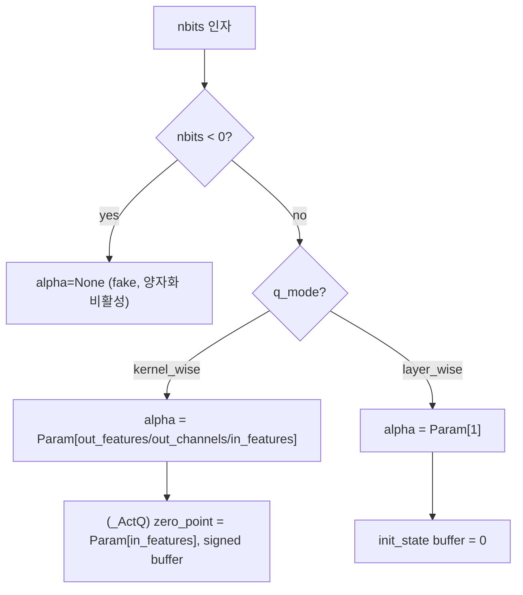
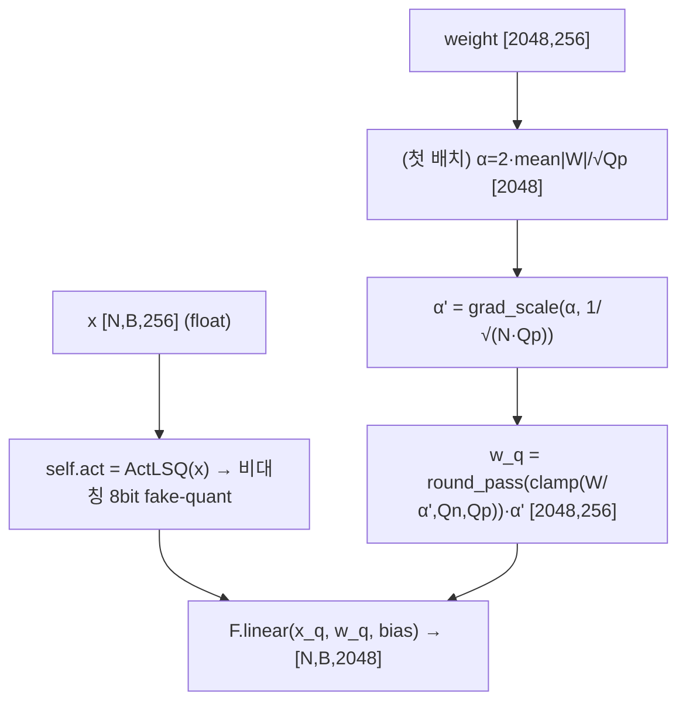
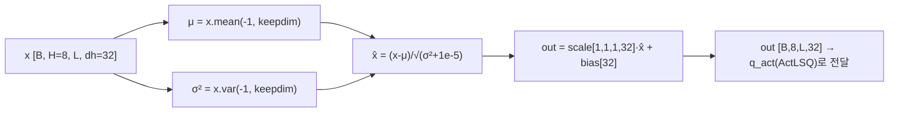
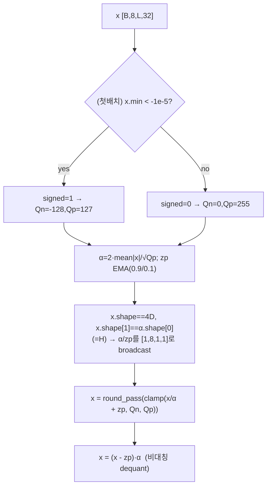
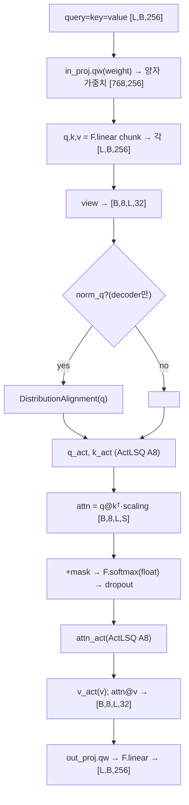
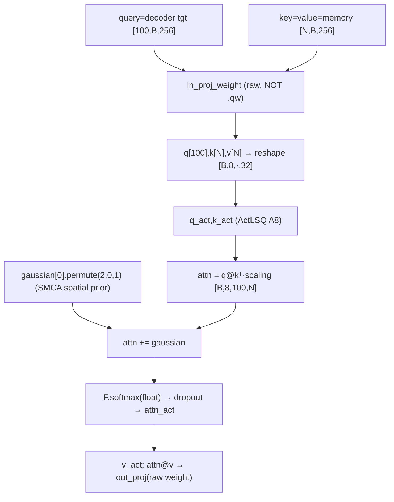
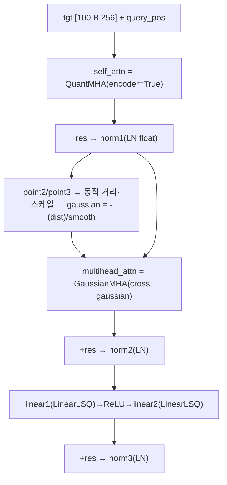
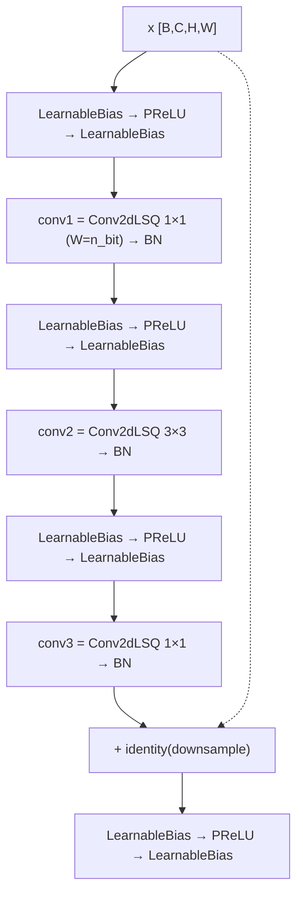
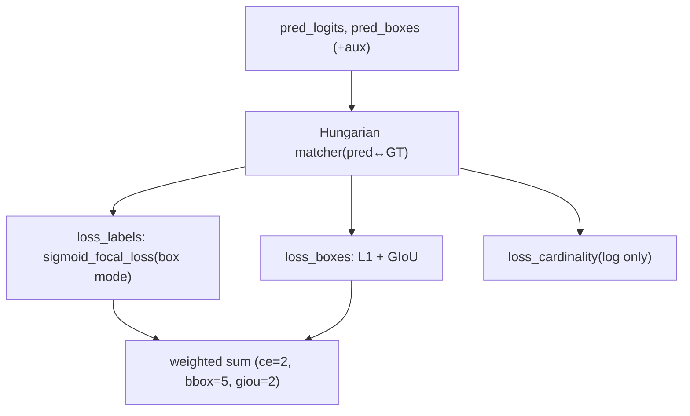

# Q-DETR 모듈 통합 가이드 (S-PyTorch)

> 1차 요약: [`../Q-DETR.md`](../Q-DETR.md) — 본 문서는 그 요약을 모듈 단위로 심화한 통합 가이드다.
> 분석 대상: `\\wsl.localhost\ubuntu-24.04\home\user\project\PRJXR-HBTXR\REF\ViT-Quantization\Q-DETR`
> 작성 원칙: 실제 소스 Read 후 `파일:라인` 근거 표기. 라인 근거 없는 추론은 "추정", 코드로 확인 불가는 "확인 불가"로 명시.
> 형제 가이드(`REF/Analysis/ViT-Quantization/I-ViT/MODULE_GUIDE.md`)의 6요소 구조를 따르되, HW 지표는 **S-PyTorch 수치 규약**(params/FLOPs/MACs/activation memory/비트폭)으로 치환한다.

---

## 0. 문서 머리말

### 0.1 대표 케이스 선정 (대상 DETR · DRD)
- **대표 모델: SMCA-DETR 기반 Q-DETR** — backbone `resnet50`, transformer `hidden_dim=256, nheads=8, enc=6, dec=6, dim_feedforward=2048, num_queries=100` (`main.py:43,53-66`, `transformer.py:23-26`). 양자화 비트 `n_bit ∈ {2,3,4}` (가중치), 활성 8bit 고정 (`main.py:51`, `quant_attention_layer.py:434-437`). 근거:
  1. README 결과표가 SMCA-DETR 기반 Q-DETR(4-bit 38.5 AP, 2-bit 32.4 AP, real 41.0 @50epoch)만 제시 (`README.md:46-52`).
  2. 양자화 본체는 `models/quant_smca_detr/`의 커스텀 모듈이고, float `smca_detr/`는 참조(`__init__.py:2-3`).
- **대표 분석 단위 1: Encoder layer** = `QuantMHA(self_attn, encoder=False) → +residual → LN → LinearLSQ → ReLU → LinearLSQ → +residual → LN` (`transformer.py:151-209`). DistributionAlignment **미적용**(encoder=False).
- **대표 분석 단위 2: Decoder layer** = `QuantMHA(self_attn, encoder=True) → +res → LN → GaussianMHA(cross_attn, SMCA) → +res → LN → LinearLSQ FFN → +res → LN` + 동적 가우시안 prior 생성(point1/point2/point3) (`transformer.py:212-321`). self/cross attn 모두 DistributionAlignment **적용**(encoder=True, `:218-219`).
- **대표 양자화 3종**: `LinearLSQ`(가중치 LSQ + ActLSQ, `lsq_plus.py:153-189`), `ActLSQ`(비대칭 per-head 활성 LSQ, `:255-334`), `Conv2dLSQ`(backbone conv, `:63-112`). 비선형(softmax/LayerNorm)은 **float 유지** → 혼합정밀.

> **DRD(Distribution-Rectification Distillation) 관련 핵심 결론**: 논문 Q-DETR(CVPR'23)의 두 기여 — ① **정보병목 기반 DRD(teacher 분포로 query 정보 최대화)**, ② **foreground-aware query matching** — 은 **본 공개 release 코드에 구현이 존재하지 않는다**. 학습 손실은 표준 DETR `SetCriterion`(focal/L1/GIoU)뿐이며 teacher 모델·KL/mutual-information·foreground 매칭 항이 전무하다(grep `distill|teacher|bottleneck|mutual|rectif|KL|DRD|foreground` → 커스텀 코드 매치 0건, "bottleneck"은 ResNet/MobileNet 블록명일 뿐, `quant_resnet.py:106`, `quant_mobilenet.py:66`). **코드에 실재하는 분포 보정 메커니즘은 `DistributionAlignment`**(어텐션 query 정규화+affine, `quant_attention_layer.py:19-34`)이며, 이는 논문의 DRD distillation 손실과는 다른 forward-time 모듈이다. 이하 본문은 코드 기준으로 기술하고, 논문↔코드 격차는 각 절에서 "확인 불가"로 명시한다.

### 0.2 S-PyTorch 수치 규약 (HW의 MAC lanes/scalar MACs 대체)
- **params**: 모듈 차원에서 분석적 계산. Linear `in·out (+out bias)`, Conv `Cout·Cin·Kh·Kw (+Cout)`. LSQ 양자화 모듈은 FP 가중치를 그대로 두고 forward마다 fake-quant하므로(`lsq_plus.py:101,172,326`) **params 개수는 FP 원본과 동일**, 단 LSQ는 layer당 학습 스케일 `alpha`(per-channel/head)·activation `zero_point`가 **추가**된다(`_quan_base_plus.py:163-166,214-222`). DistributionAlignment는 head_dim×2(scale+bias) 추가(`quant_attention_layer.py:23-24`).
- **FLOPs/MACs**: 표준식×config. Linear MAC = `B·N·in·out`. Attention QKᵀ = `B·H·L·S·dh`, AV = `B·H·L·S·dh`(H=nheads=8, dh=head_dim=32). DETR는 토큰 수가 가변(encoder N=H·W feature, decoder L=100 query)이므로 대표 입력 가정 명시 후 산출.
- **activation memory**: 텐서 shape × 비트폭. LSQ는 fake-quant라 실제 메모리는 FP32지만(`lsq_plus.py:327` 출력이 `(x-zp)·alpha`=float), **정수 도메인 비트폭**(W=n_bit/A=8)을 "HW 환산 activation bit"로 표기.
- **비트폭/observer**: 코드 직접. 가중치 `n_bit`(기본 4, `main.py:51`), 활성 **8bit 고정**(`ActLSQ(nbits_a=8)`, `quant_attention_layer.py:434-437`), backbone conv1 **W8**(`quant_resnet.py:204`) 나머지 conv W=n_bit. observer = **LSQ init(첫 배치 1회)**: `alpha=2·mean(|x|)/√Qp`(`lsq_plus.py:81,127,164,276`), zero_point는 EMA(0.9/0.1, `:277`). 이후 alpha는 **학습 파라미터**로 SGD 갱신(running stat 아님).
- **정확도(mAP)**: README 인용. 본 세션 미실행 → 측정 불가 항목은 "확인 불가".

### 0.3 운영 경로 (QAT 학습 ↔ 체크포인트 ↔ COCO 평가)
```
[빌드] main.py --quant → build_quant_model → quant_smca_detr.detr.build   (main.py:131-132, __init__.py:2-6)
   │  backbone: quant resnet50(Conv2dLSQ, n_bit) + FrozenBN   (backbone.py:100-104, quant_resnet.py:203-218)
   │  transformer: enc/dec = QuantMHA + LinearLSQ FFN   (transformer.py:29-42,156-161,218-223)
   ▼
[QAT fine-tune] train_one_epoch(): model.train() → fake-quant forward → SetCriterion(focal/L1/GIoU)
   │  AdamW(param group: backbone lr 1e-5, 나머지 1e-4), StepLR(lr_drop=200), grad clip 0.1   (main.py:145-154, engine.py:17-64)
   │  LSQ alpha 첫 배치 init → 이후 학습   (lsq_plus.py:79-83,126-130,163-166,263-278)
   ▼
[체크포인트] torch.save({model,optimizer,lr_scheduler,epoch,args}, checkpoint.pth)   (main.py:220-231)
   ▼
[COCO 평가] evaluate(): model.eval() → CocoEvaluator(bbox AP)   (engine.py:67-151, main.py:203-208)
   │  --finetune/--resume로 사전학습/체크포인트 로드   (main.py:185-199)
```
- 타깃 디바이스: **CUDA GPU 전제** — `--device='cuda'` 기본(`main.py:99`), DDP 지원(`:139-141`). CPU 강제 하드코딩(`.cuda()`)은 I-ViT와 달리 양자화 모듈엔 없음(추정: device-agnostic, 단 실행 미검증 → "확인 불가").
- **재현 명령**: `bash evaluate_coco.sh`(`--coco_path`, `--n_bit 2/3/4` 지정, `README.md:36-43`). 학습 스크립트는 release에 미동봉 → main.py 직접 호출 추정.

### 0.4 모델 / 데이터셋 / 정확도 (README 인용)
| Method | Bit(W) | Act | Epoch | box AP | 근거 |
|---|---|---|---|---|---|
| Real-valued (SMCA-DETR) | 32 | 32 | 50 | **41.0** | `README.md:50` |
| **Q-DETR (대표)** | **4** | 8 | 50 | **38.5** | `README.md:51`, `main.py:51`, act 8bit `quant_attention_layer.py:434` |
| Q-DETR | 2 | 8 | 50 | **32.4** | `README.md:52` |
- 데이터셋: **COCO 2017** (train2017/val2017/annotations), num_classes=91 (`README.md:24-34`, `detr.py:332`). 검출 평가지표 box AP(COCO `coco_eval['bbox'].stats`, `engine.py:144`).
- 3-bit AP는 README 표에 부재 → "확인 불가"(`--n_bit 3`는 코드상 지원, `README.md:39`).
- 속도(latency)/FPGA 실측: 본 repo로 **확인 불가**(미실행, 배포 커널 부재).

---

## 1. Repo / Layer 개요

Q-DETR = **SMCA-DETR(Spatially Modulated Co-Attention DETR) 검출기를 저비트(W2/3/4 + A8) QAT 양자화**한 프레임워크. 본 repo는 facebookresearch/detr + SMCA-DETR 위에 **LSQ 기반 양자화 모듈을 얹은 커스텀 소스**(`models/quant_smca_detr/`)가 자체이고, COCO DataLoader·matcher·box_ops·CocoEvaluator는 DETR 컴포넌트를 그대로 사용한다(`detr.py:8-17`, `engine.py:13`).

### 1.1 자체 소스 vs 외부 프레임워크 vs 제외

| 구분 | 파일(자체 소스) | 역할 |
|---|---|---|
| **양자화 베이스** | `models/quant_smca_detr/_quan_base_plus.py` | `_Conv2dQ/_LinearQ/_LinearQ_v2/_ActQ`(alpha/zero_point 파라미터, init_state buffer), round_pass/grad_scale STE |
| **양자화 레이어** ★핵심 | `models/quant_smca_detr/lsq_plus.py` | `FunLSQ`(LSQ autograd), `Conv2dLSQ/LinearLSQ/LinearLSQ_v2/ActLSQ/LinearMCN` |
| **양자 어텐션** ★핵심 | `models/quant_smca_detr/quant_attention_layer.py` | `DistributionAlignment` + `QuantMultiheadAttention` + custom `multi_head_attention_forward` |
| | `models/quant_smca_detr/attention_layer.py` | `GaussianMultiheadAttention`(QuantMHA 상속, SMCA 가우시안 prior cross-attn) |
| **양자 transformer** | `models/quant_smca_detr/transformer.py` | `TransformerEncoderLayer/DecoderLayer`(FFN=LinearLSQ), SMCA point1/2/3 동적 스케일 |
| **DETR head/손실** | `models/quant_smca_detr/detr.py` | `DETR`, `SetCriterion`(focal/L1/GIoU), `PostProcess`, `build` |
| **양자 backbone** | `models/quant_smca_detr/quant_resnet.py` | ReBNN식 `BasicBlock/Bottleneck`(LearnableBias+PReLU+Conv2dLSQ), `ResNet`, resnet50 |
| | `models/quant_smca_detr/quant_mobilenet.py` | 양자 MobileNetV2(미정밀, 동일 LSQ 추정) |
| | `models/quant_smca_detr/backbone.py` | `Backbone`(quant resnet/mobilenet + FrozenBN), `Joiner`, `build_backbone` |
| | `models/quant_smca_detr/{position_encoding,matcher,segmentation}.py` | pos enc, Hungarian matcher, focal/dice(미정밀, DETR 표준 추정) |
| **학습 엔트리** | `main.py` | argparse, build, AdamW+StepLR, train/eval 루프 |
| **학습 보조** | `engine.py` | `train_one_epoch`/`evaluate`(COCO) |

### 1.2 forward 진입점
`DETR.forward`(`detr.py:51-89`): `backbone(samples) → input_proj(1×1 conv) → transformer(src, mask, query_embed, pos, h_w) → class_embed/bbox_embed`. `Transformer.forward`(`transformer.py:59-79`): `encoder(src) → decoder(grid, h_w, tgt, memory, query_pos)` → 디코더가 SMCA 동적 가우시안 prior로 cross-attn 변조 후 박스 좌표 회귀.

### 1.3 제외 (지시에 따라 이름만 표기, 미분석)
- **외부 프레임워크(커스텀 아님)**: `models/smca_detr/`(float 원본 SMCA-DETR, 참조용 `__init__.py:3`), `util/`(box_ops/misc/plot), `datasets/`(COCO 로더·eval, DETR 표준), facebookresearch/detr·SMCA-DETR **사전학습 가중치**(torchvision resnet50 pretrained, `backbone.py:104`).
- **제외 디렉토리**: `Adaptive_Cluster_Transformer/`(외부 ACT 프레임워크 — DETR+클러스터링 어텐션 별도 실험, `ACT/ada_clustering_attention.py` 등), `d2/`(detectron2 연동 보조), `__pycache__`, Google Drive 체크포인트(이름만).
- **미열람(확인 불가)**: `quant_mobilenet.py` 세부(LSQ 동일 적용 추정), `segmentation.py`/`matcher.py`/`position_encoding.py` 세부(DETR 표준 추정), `LinearLSQ_v2`/`LinearMCN` 실사용 여부(transformer/attention에서 호출 미발견 → 비활성 추정).

### 1.4 대표 모델 레이어 구성 (Q-DETR W4A8)
`build`(`detr.py:323-378`): quant resnet50(Conv2dLSQ) → input_proj(float 1×1) → Transformer(enc6+dec6) → class_embed(float Linear)/bbox_embed(float MLP). Encoder layer 1개당 LinearLSQ 2(FFN) + QuantMHA(in_proj/out_proj LinearLSQ 2 + q/k/v/attn ActLSQ 4 + LayerNorm 2 float). Decoder layer 1개당 QuantMHA(self) + GaussianMHA(cross) + LinearLSQ 2(FFN) + LayerNorm 4 + SMCA point1/2/3(float Linear).

---

## 2. 모듈: LSQ 양자화 베이스 — `_quan_base_plus.py` (_Conv2dQ/_LinearQ/_ActQ)

### 2.1 역할 + 상위/하위
- **역할**: 양자화 레이어의 파라미터 컨테이너. nn.Conv2d/nn.Linear/nn.Module을 상속해 학습형 스케일 `alpha`(per-channel kernel_wise 또는 layer_wise), 활성용 `zero_point`·`signed` buffer, `init_state` buffer를 등록. STE 유틸 `round_pass`/`grad_scale` 정의.
- **상위**: `lsq_plus.py`의 `Conv2dLSQ(_Conv2dQ)`, `LinearLSQ(_LinearQ)`, `ActLSQ(_ActQ)`가 상속(`lsq_plus.py:63,153,255`). **하위**: torch.nn, Parameter.

### 2.2 데이터플로우 (파라미터 등록 흐름)


### 2.3 forward call stack
베이스는 forward 없음(컨테이너). `lsq_plus.py`의 자식 클래스 forward가 `self.alpha`/`self.zero_point`/`self.init_state`를 직접 읽음(`lsq_plus.py:73,79,260,263`).

### 2.4 대표 코드 위치
`_quan_base_plus.py`: `round_pass` `:32-35`, `grad_scale` `:20-23`, `_Conv2dQ` `:123-150`(alpha out_channels `:135`), `_LinearQ` `:153-175`(alpha out_features `:165`), `_LinearQ_v2`(alpha+beta `:177-200`), `_ActQ` `:203-234`(alpha+zero_point in_features `:217-219`, signed buffer `:222`).

### 2.5 대표 코드 블록
```python
# _quan_base_plus.py:20-35  LSQ의 핵심 STE 2종
def grad_scale(x, scale):
    y = x; y_grad = x * scale
    return y.detach() - y_grad.detach() + y_grad   # forward는 x, backward는 grad×scale
def round_pass(x):
    y = x.round(); y_grad = x
    return y.detach() - y_grad.detach() + y_grad    # forward round, backward identity(STE)
```
→ `grad_scale`은 LSQ 논문의 스케일 그래디언트 감쇠 `g=1/√(N·Qp)`를 적용하는 트릭. `round_pass`는 round의 미분불가 우회.

```python
# _quan_base_plus.py:216-222  활성 양자화기: per-channel alpha + zero_point(비대칭) + signed
if self.q_mode == Qmodes.kernel_wise:
    self.alpha = Parameter(torch.Tensor(in_features))
    self.zero_point = Parameter(torch.Tensor(in_features))   # 비대칭 → zp 학습
    torch.nn.init.zeros_(self.zero_point)
self.register_buffer('init_state', torch.zeros(1))
self.register_buffer('signed', torch.zeros(1))               # 입력 부호 자동감지 플래그
```

### 2.6 연산·수치표현 분해 + 정량
- **양자화 방식**: weight = per-channel(kernel_wise) **대칭**(zp 없음), activation = per-channel(in_features축) **비대칭**(zp 학습). zero_point=0 강제 아님(I-ViT와의 차이점).
- **비트폭/observer**: nbits 생성자 인자. observer는 별도 running stat 없음 — **alpha를 첫 배치 init 후 SGD로 학습**(QAT 정공법, `lsq_plus.py:79-83`).
- **params (추가 학습 파라미터)**: Conv2dLSQ alpha = out_channels, LinearLSQ alpha = out_features, ActLSQ alpha+zero_point = 2×in_features. DistributionAlignment 별도(§4). 예: in_proj(256→768) LinearLSQ alpha = **768개**.
- **FLOPs**: 0(컨테이너).
- **시사**: LSQ는 I-ViT의 running min/max(observer 토글)와 달리 **스케일을 역전파 학습**한다 → HW에선 학습 종료 후 alpha/zero_point가 상수로 고정(정적 스케일). per-channel alpha + zero_point는 채널별 dequant 스케일·바이어스 레지스터로 매핑.

---

## 3. 모듈: LSQ 정수 Linear/Conv — `lsq_plus.py` (LinearLSQ / Conv2dLSQ / FunLSQ) ★핵심

### 3.1 역할 + 상위/하위
- **역할**: nn.Linear/nn.Conv2d 가중치를 LSQ로 per-channel 대칭 양자화(`w_q=round(W/α)·α`), 입력은 내부 `self.act=ActLSQ`로 양자화 후 `F.linear`/`F.conv2d`. `qw()`가 가중치 양자화만 분리 제공(어텐션이 in_proj 분할 위해 사용).
- **상위**: FFN `linear1/linear2`(`transformer.py:159,161,221,223`), 어텐션 `in_proj/out_proj`(`quant_attention_layer.py:440,464`), backbone conv(`quant_resnet.py:40-46`). **하위**: `_LinearQ`/`_Conv2dQ`, `round_pass`/`grad_scale`, `ActLSQ`.

### 3.2 데이터플로우 (텐서 shape 흐름, LinearLSQ FFN linear1 예: 256→2048)


### 3.3 forward call stack
`TransformerEncoderLayer.forward_post`(`transformer.py:184`) → `LinearLSQ.forward`(`lsq_plus.py:175`) → `qw(weight)`(`:160-173`, α init/grad_scale/round_pass) → `self.act(x)`(=ActLSQ, `:181`) → `F.linear`(`:189`).

### 3.4 대표 코드 위치
`lsq_plus.py`: `FunLSQ`(autograd) `:23-48`, `Conv2dLSQ.forward` `:72-112`, `LinearLSQ.qw` `:160-173`, `LinearLSQ.forward` `:175-189`, `LinearLSQ_v2`(α⊗β 이중스케일) `:115-150`, `LinearMCN/MCF_Function` `:192-252`.

### 3.5 대표 코드 블록
```python
# lsq_plus.py:160-173  LinearLSQ.qw: 가중치 per-channel 대칭 LSQ
Qn = -2 ** (self.nbits - 1); Qp = 2 ** (self.nbits - 1) - 1
if self.training and self.init_state == 0:
    self.alpha.data.copy_(2 * self.weight.abs().mean() / math.sqrt(Qp))  # 첫 배치 init
    self.init_state.fill_(1)
g = 1.0 / math.sqrt(self.weight.numel() * Qp)
alpha = grad_scale(self.alpha, g).unsqueeze(1)        # [out,1]
w_q = round_pass((self.weight / alpha).clamp(Qn, Qp)) * alpha   # round→clamp→dequant
```
→ W4면 `Qn=-8, Qp=7` (정수범위 [-8,7]). per-out-channel α. `g`는 스케일 grad 감쇠.

```python
# lsq_plus.py:42-48  FunLSQ.backward: LSQ α 그래디언트(클리핑 구간별)
grad_alpha = ((indicate_small*Qn + indicate_big*Qp +
               indicate_middle*(-q_w + q_w.round())) * grad_weight * g).sum()
grad_weight = indicate_middle * grad_weight    # 포화 구간 weight grad = 0
```
→ 포화(Qn/Qp 초과)는 α만 미는 그래디언트, 중간구간은 round 잔차. **단 실사용 forward는 FunLSQ 미경유**(Method1=`round_pass`, Method2=FunLSQ는 주석, `:108-109,149,187-188`) — round_pass STE만 통과(α grad는 grad_scale로 처리).

```python
# lsq_plus.py:101  Conv2dLSQ: per-channel α를 4D broadcast
alpha = alpha.unsqueeze(1).unsqueeze(2).unsqueeze(3)   # [out,1,1,1]
w_q = round_pass((self.weight / alpha).clamp(Qn, Qp)) * alpha
x = self.act(x)                                        # 입력도 ActLSQ
```

### 3.6 연산·수치표현 분해 + 정량 (Q-DETR W4A8, transformer hidden=256, dff=2048)
- **양자화 방식**: weight per-channel(out축) 대칭 W=n_bit, 입력 ActLSQ A8 비대칭. 출력은 fake-quant float(`F.linear` 결과).
- **scale/zp**: W α `[out]` 학습, zp=0(대칭); 입력 α/zp `[in]` 학습.
- **비트폭**: W4(기본 n_bit=4), A8. backbone conv1 W8(`quant_resnet.py:204`).
- **params (FFN 1 layer, 256↔2048)**:
  - linear1: 256×2048 + 2048 = **526,336** (+α 2048개)
  - linear2: 2048×256 + 256 = **524,544** (+α 256개)
  - FFN params/enc-layer ≈ **1.05M**, enc6 ≈ 6.3M, dec6 동일 ≈ 6.3M.
- **MACs (FFN, encoder N=H·W 토큰, 대표 H·W=850 가정 추정)**:
  - linear1: 850×256×2048 ≈ **446M** /layer, linear2 동일 ≈ 446M → FFN ≈ **892M/enc-layer**, enc6 ≈ 5.35G (입력 토큰 수 가변, "추정").
  - decoder FFN은 L=100 query → linear1 100×256×2048 ≈ 52.4M /layer.
- **activation bit**: 입력 A8(75.6KB/토큰블록 추정), 가중치 W4 → 정수 MAC 누산 INT(추정 HW 환산).
- **시사**: in_proj/out_proj/FFN 전부 정수 MAC + per-channel dequant α → FPGA 정수 MAC PE + 채널별 고정소수점 스케일로 1:1 매핑. **단 LSQ는 dyadic requant(I-ViT)가 아니라 float α 곱**이므로 HW화 시 α를 dyadic(m/2^e)로 재근사하는 추가 단계 필요(I-ViT 대비 약점).

---

## 4. 모듈: DistributionAlignment — `quant_attention_layer.py` ★★ (코드상 분포 보정)

### 4.1 역할 + 상위/하위
- **역할**: 어텐션 head별 query(또는 key) 텐서에 **LayerNorm식 정규화 + 학습형 per-head affine(scale·bias)**을 적용. 저비트 양자화 직전 분포를 표준화해 양자화 강건성 확보. **논문 DRD distillation의 손실항이 아니라 forward-time 정규화 모듈**(0.1절 결론 참조).
- **상위**: `QuantMultiheadAttention.norm_q`(encoder=True일 때만 생성, `:426`). **하위**: torch 통계(mean/var).

### 4.2 데이터플로우 (텐서 shape 흐름, head_dim=32)


### 4.3 forward call stack
`multi_head_attention_forward`(`quant_attention_layer.py:325-326`) → `norm_q(q)`(`DistributionAlignment.forward`, `:27-34`) → 이후 `q_act(q)`(`:331`). **encoder=True인 어텐션만**(`:425-426`): 디코더 self-attn(`transformer.py:218`)·cross-attn(`:219`).

### 4.4 대표 코드 위치
`quant_attention_layer.py`: 클래스 `:19-34`, 파라미터(bias head_dim, scale [1,1,1,head_dim]) `:23-24`, forward 정규화+affine `:32-33`, 생성 조건 `:425-432`(encoder면 norm_q만, norm_k/v=None).

### 4.5 대표 코드 블록
```python
# quant_attention_layer.py:23-33  per-head 정규화 + affine
self.bias  = nn.Parameter(torch.zeros(head_dim), requires_grad=True)        # β [32]
self.scale = nn.Parameter(torch.ones(1,1,1,head_dim), requires_grad=True)   # γ [1,1,1,32]
...
out = (x - x.mean(-1,keepdim=True)) / torch.sqrt(x.var(dim=-1, keepdim=True) + 1e-5)
out = self.scale.expand_as(out) * out + self.bias.unsqueeze(0).unsqueeze(0).unsqueeze(0).expand_as(out)
```
→ head_dim축(마지막 차원) LayerNorm + 학습 γ/β. **양자화 전** 단계라 q 분포의 동적범위를 표준화 → ActLSQ의 alpha가 더 안정적으로 수렴(추정).

```python
# quant_attention_layer.py:425-432  encoder 분기: q에만 적용
if self.encoder:
    self.norm_q = DistributionAlignment(embed_dim//num_heads)   # head_dim=256//8=32
    self.norm_k = None     # k/v는 정규화 안 함
    self.norm_v = None
else:
    self.norm_q = self.norm_k = self.norm_v = None              # encoder=False → 전부 OFF
```
→ **encoder layer self-attn은 `encoder=False`(`transformer.py:156`)라 DistributionAlignment OFF**. decoder self-attn(`:218`)·cross-attn(GaussianMHA, `:219`)은 `encoder=True`라 q 정규화 ON. (1차 요약의 "인코더 q에 적용"은 정정: 실제는 **디코더 계열 q에 적용**.)

### 4.6 연산·수치표현 분해 + 정량
- **양자화 방식**: 양자화 아님(float 정규화). 출력이 ActLSQ로 양자화됨.
- **params**: head_dim(bias) + head_dim(scale) = 2×32 = **64**/어텐션. decoder self+cross 2개 × 6 layer = 12 × 64 = 768.
- **FLOPs**: mean/var reduce O(B·H·L·dh) + affine O(동일). 대표 decoder q [B,8,100,32]=25.6K 원소 → ~3×25.6K ≈ 77K op/어텐션.
- **activation memory**: q [B,8,100,32] (decoder), float.
- **시사**: HW LayerNorm 누산 유닛 + per-head γ/β 레지스터로 매핑(I-ViT IntLayerNorm 뉴턴 sqrt 데이터패스 재사용 가능). **저비트 어텐션 안정화를 어텐션 입력단 정규화로 해결하는 설계 근거**. 단 이는 논문 DRD(정보병목 distillation)의 대체가 아님 — DRD 손실은 코드 부재("확인 불가").

---

## 5. 모듈: 비대칭 활성 양자화 — `lsq_plus.py` (ActLSQ) ★핵심

### 5.1 역할 + 상위/하위
- **역할**: activation을 **per-channel/head 비대칭 LSQ**로 양자화. 입력 부호 자동감지(signed/unsigned), 입력 차원(2/3/4D)별로 alpha·zero_point를 매칭 축에 broadcasting. q/k/v/attn map을 헤드축 기준 양자화.
- **상위**: 모든 LSQ 레이어의 입력단(`Conv2dLSQ.act`, `LinearLSQ.act`), 어텐션 q/k/v/attn(`quant_attention_layer.py:434-437`). **하위**: `_ActQ`, `round_pass`/`grad_scale`.

### 5.2 데이터플로우 (텐서 shape 흐름, q_act on [B,H=8,L,dh])


### 5.3 forward call stack
`multi_head_attention_forward`(`quant_attention_layer.py:331`) → `q_act(q)`(=ActLSQ, in_features=num_heads=8) → `ActLSQ.forward`(`lsq_plus.py:259`) → signed 감지(`:267`) → α/zp init(`:276-277`) → 차원별 broadcast(`:296-322`) → round_pass+dequant(`:326-327`).

### 5.4 대표 코드 위치
`lsq_plus.py`: 클래스 `:255-334`, signed 자동감지 `:267-268`, α/zp init `:276-277`, signed 분기 `:282-287`, **차원별 broadcast 분기** `:296-322`(2D `:296`, 3D `:299-308`, 4D `:309-322`), 비대칭 양자화/dequant `:326-327`.

### 5.5 대표 코드 블록
```python
# lsq_plus.py:267-277  부호 자동감지 + α/zp init
if x.min() < -1e-5:
    self.signed.data.fill_(1)
if self.signed == 1: Qn=-2**(nbits-1); Qp=2**(nbits-1)-1   # signed: [-128,127] (A8)
else:                Qn=0;             Qp=2**nbits-1         # unsigned: [0,255]
self.alpha.data.copy_(2 * x.abs().mean() / math.sqrt(Qp))
self.zero_point.data.copy_(self.zero_point*0.9 + 0.1*(x.min() - self.alpha*Qn))  # zp EMA
```
→ ReLU 후 등 unsigned면 [0,255], 부호있으면 [-128,127]. zp는 init만 EMA, 이후 학습(`:292` round_pass STE).

```python
# lsq_plus.py:309-322  4D 텐서(q/k/v: [B,H,L,dh])에서 헤드축 매칭 broadcast
elif len(x.shape)==4:
    if   x.shape[1] == alpha.shape[0]:   # H축이 in_features(=num_heads)와 일치
        alpha      = alpha.unsqueeze(0).unsqueeze(2).unsqueeze(3)   # [1,H,1,1]
        zero_point = zero_point.unsqueeze(0).unsqueeze(2).unsqueeze(3)
    ...
```
→ **per-head 활성 스케일**(어텐션 헤드별 α/zp). q/k/v/attn 모두 num_heads=8 길이 α(`quant_attention_layer.py:434-437`). 어느 축이 H와 같은지 런타임 탐색 → 비표준 형상에서 취약 가능(추정).

```python
# lsq_plus.py:326-327  비대칭 LSQ 양자화 + dequant
x = round_pass((x / alpha + zero_point).clamp(Qn, Qp))
x = (x - zero_point) * alpha
```

### 5.6 연산·수치표현 분해 + 정량 (Q-DETR, num_heads=8, head_dim=32)
- **양자화 방식**: per-head **비대칭**(zero_point ≠ 0), signed 자동. dequant = `(x_q - zp)·α`.
- **비트폭**: **A8 고정**(`ActLSQ(nbits_a=8)`, `quant_attention_layer.py:434-437`) — n_bit(weight)와 독립. backbone conv 입력은 ActLSQ(nbits_a=n_bit, `lsq_plus.py:70,157`).
- **params (추가)**: α + zero_point = 2×num_heads = 2×8 = **16**/어텐션 활성기 ×4(q/k/v/attn) = 64/어텐션.
- **activation memory**: q/k/v [B,8,L,32] A8. attn map [B,8,L,S] A8(softmax 출력 양자화, `quant_attention_layer.py:360`). decoder self-attn L=S=100 → attn [B,8,100,100]=80K A8 ≈ 80KB.
- **시사**: 비대칭 zero_point는 HW에서 곱셈기-free가 아님(zp 가산 필요) → I-ViT 대칭(zp=0) 대비 HW 비용 ↑. per-head α/zp는 헤드별 dequant 유닛. **활성 8bit 고정은 저비트(2/4) 가중치와 혼합** → 전형적 WnA8 구조.

---

## 6. 모듈: 양자 Self-Attention — `quant_attention_layer.py` (QuantMultiheadAttention) ★핵심

### 6.1 역할 + 상위/하위
- **역할**: 커스텀 MHA. in_proj(LinearLSQ)로 q/k/v 투영 → (decoder면 norm_q) → q/k/v ActLSQ 양자화 → `q@kᵀ·scaling` → mask → **softmax(float)** → dropout → **attn map ActLSQ** → `@v` → out_proj(LinearLSQ). softmax/마스킹은 float 유지.
- **상위**: `TransformerEncoderLayer.self_attn`(encoder=False, `transformer.py:156`), `TransformerDecoderLayer.self_attn`(encoder=True, `:218`). `GaussianMultiheadAttention`이 상속(§7). **하위**: `LinearLSQ.qw`, `ActLSQ`, `DistributionAlignment`, `F.softmax`.

### 6.2 데이터플로우 (텐서 shape 흐름, self-attn)


### 6.3 forward call stack
`TransformerEncoderLayer.forward_post`(`transformer.py:180`) → `QuantMultiheadAttention.forward`(`quant_attention_layer.py:499`) → `multi_head_attention_forward`(`:518`) → `in_proj.qw`(`:183`) → reshape(`:291-295`) → norm_q(`:325`) → q_act/k_act(`:331-332`) → `q@kᵀ`(`:333`) → softmax(`:354`) → attn_act(`:360`) → v_act(`:363`) → `@v`(`:368`) → `out_proj.qw`(`:373`) → F.linear(`:375`).

### 6.4 대표 코드 위치
`quant_attention_layer.py`: in_proj 양자 분할 `:183-223`, reshape `:291-295`, norm_q `:325-326`, q/k 양자화 `:331-332`, QKᵀ `:333`, softmax `:354`, attn map 양자화 `:360`, v 양자화 `:363`, AV `:368`, out_proj 양자화 `:373-375`. 생성자 `:416-474`(act/in_proj/out_proj 정의 `:434-464`).

### 6.5 대표 코드 블록
```python
# quant_attention_layer.py:183-199  in_proj 가중치 LSQ 양자화 후 q/k/v 분할
in_proj_weight = in_proj.qw(in_proj.weight)   # LSQ 양자 가중치 [768,256]
_w = in_proj_weight[0:embed_dim, :]           # q 슬라이스 [256,256]
q = F.linear(query, _w, _b)                   # 양자 가중치로 투영
# k: [256:512], v: [512:768] 동일
```

```python
# quant_attention_layer.py:331-368  양자화 경계: 정수 q@kᵀ, float softmax, 양자 attn@v
q = q_act(q); k = k_act(k)
attn_output_weights = q @ k.transpose(-2, -1) * scaling     # 정수(fake) MAC
attn_output_weights = F.softmax(attn_output_weights, dim=-1)  # float softmax
attn_output_weights = attn_act(attn_output_weights)         # attn map 양자화(A8)
v = v_act(v)
attn_output = attn_output_weights @ v                        # 정수(fake) MAC
```
→ **softmax는 float 유지**, 입력(qkᵀ)과 출력(attn map)만 양자화. I-ViT의 IntSoftmax(integer-only)와 대조 — Q-DETR은 비선형 float, 경계만 양자화하는 **혼합정밀** 구조.

```python
# quant_attention_layer.py:434-440  활성 8bit 고정, in_proj는 n_bit
self.q_act = ActLSQ(nbits_a=8, in_features=num_heads)   # 활성 A8
self.k_act = ActLSQ(nbits_a=8, in_features=num_heads)
self.v_act = ActLSQ(nbits_a=8, in_features=num_heads)
self.attn_act = ActLSQ(nbits_a=8, in_features=num_heads)
self.in_proj = LinearLSQ(embed_dim, embed_dim*3, nbits_w=n_bit, bias=True)  # W=n_bit
```

### 6.6 연산·수치표현 분해 + 정량 (Q-DETR, embed=256, H=8, dh=32)
- **양자화 방식**: in_proj/out_proj weight LSQ W=n_bit, q/k/v/attn ActLSQ A8 비대칭 per-head, softmax float.
- **params (self-attn 1개)**: in_proj 256×768+768 = **197,376**(+α 768), out_proj 256×256+256 = **65,792**(+α 256), q/k/v/attn act 4×16=64, DistributionAlignment(decoder만) 64. ≈ **263K**/어텐션.
- **MACs (decoder self-attn, L=S=100)**:
  - in_proj: 100×256×768 ≈ **19.7M**
  - QKᵀ: H·L·S·dh = 8×100×100×32 ≈ **2.56M**
  - AV: 8×100×100×32 ≈ **2.56M**
  - out_proj: 100×256×256 ≈ **6.55M**
  - self-attn MAC ≈ **31.4M**/layer.
  - encoder self-attn(N≈850 가정 추정): in_proj 850×256×768 ≈ 167M, QKᵀ 8×850²×32 ≈ 185M, AV ≈ 185M, out_proj 850×256×256 ≈ 55.7M → ≈ **593M**/enc-layer (토큰 수 가변, "추정").
- **activation memory**: attn map [B,8,N,N]. encoder N≈850 → [B,8,850,850]=5.78M A8 ≈ **5.78MB**(block 내 최대, N² 지배).
- **시사**: N² attn 활성이 메모리 지배 → FPGA에서 encoder 어텐션 타일링·스트리밍 softmax 핵심. softmax float이라 비선형 유닛 별도 + 입출력 경계 양자화 패턴.

---

## 7. 모듈: SMCA 가우시안 Cross-Attention — `attention_layer.py` (GaussianMultiheadAttention)

### 7.1 역할 + 상위/하위
- **역할**: SMCA-DETR의 spatial-modulated co-attention. `QuantMultiheadAttention` 상속, cross-attn(query=decoder, key/value=encoder memory) 수행하되 **softmax 직전 가우시안 prior(`gaussian[0]`)를 attn weight에 가산**해 query별 공간 prior로 어텐션 집중. q/k/v/attn은 ActLSQ로 양자화.
- **상위**: `TransformerDecoderLayer.multihead_attn`(encoder=True, `transformer.py:219,308`). **하위**: `QuantMultiheadAttention`(act/in_proj 상속), `F.softmax`.

### 7.2 데이터플로우 (텐서 shape 흐름)


### 7.3 forward call stack
`TransformerDecoderLayer.forward_post`(`transformer.py:308`) → `GaussianMultiheadAttention.forward`(`attention_layer.py:308`) → `multi_head_attention_forward`(`:369`, 별도 구현) → q/k 양자화(`:261-262`) → `q@kᵀ`(`:265`) → **`attn += gaussian[0]`**(`:283`) → softmax(`:284`) → attn_act(`:289`) → `@v`(`:291`) → out_proj(`:296`).

### 7.4 대표 코드 위치
`attention_layer.py`: `multi_head_attention_forward` `:10-298`, q/k/v 양자화 `:261-262,290`, QKᵀ `:265`, **가우시안 가산** `:283`, softmax `:284`, attn map 양자화 `:289`, AV `:291`, out_proj(raw) `:296`. `GaussianMultiheadAttention` `:301-379`.

### 7.5 대표 코드 블록
```python
# attention_layer.py:283-291  SMCA 가우시안 prior를 softmax 직전 가산
attn_output_weights = attn_output_weights + gaussian[0].permute(2, 0, 1)  # spatial prior
attn_output_weights = F.softmax(attn_output_weights, dim=-1)
attn_output_weights = attn_act(attn_output_weights)   # attn map 양자화
v = v_act(v)
attn_output = attn_output_weights @ v
```
→ 가우시안은 decoder query의 초기 박스 추정 좌표(`transformer.py:282-306`)에서 생성된 거리 기반 `-(distance)/smooth`(`:306`). **query별 공간 집중 prior** = SMCA의 핵심.

```python
# attention_layer.py:296  ⚠ cross-attn out_proj는 raw weight (NOT 양자화)
attn_output = linear(attn_output, out_proj_weight, out_proj_bias)
# 호출부 attention_layer.py:362,376: self.out_proj.weight (raw), self.in_proj_weight (raw)
```
→ **cross-attn의 in_proj/out_proj 가중치는 `.qw()` 미경유**(`:360-376`이 raw `self.in_proj_weight`/`self.out_proj.weight` 전달). self-attn(`quant_attention_layer.py:183,373`이 `.qw()` 사용)과 **대조** → cross-attn 투영 가중치는 **양자화되지 않음**(활성 q/k/v/attn만 A8 양자화). 코드 근거 명확, 의도 여부 "확인 불가"(버그/설계 미상).

### 7.6 연산·수치표현 분해 + 정량 (decoder cross-attn, L=100, S=N≈850 추정)
- **양자화 방식**: q/k/v/attn ActLSQ A8 per-head; **in_proj/out_proj weight 양자화 안 됨**(raw float, `:296,360-376`). 가우시안 prior float 가산. softmax float.
- **params**: in_proj 197,376 + out_proj 65,792(가중치는 float 사용) + act 64 + DistributionAlignment(encoder=True) 64.
- **MACs (L=100, S=850 추정)**: in_proj q 100×256×256 ≈ 6.55M, k/v 850×256×256×2 ≈ 111M, QKᵀ 8×100×850×32 ≈ 21.8M, AV 동일 21.8M, out_proj 100×256×256 ≈ 6.55M → ≈ **168M**/dec-layer(추정).
- **activation memory**: cross attn [B,8,100,850] A8 ≈ 680K ≈ 680KB.
- **시사**: SMCA 가우시안 prior = HW에서 query별 spatial bias LUT/가산기. **cross-attn 가중치 미양자화는 HW 혼합정밀(투영 float, 활성 int)** → 완전 양자화 가속기엔 부적합, 재구현 시 `.qw()` 적용 필요(우리 프로젝트 관점 개선점).

---

## 8. 모듈: 양자 Transformer 조립 — `transformer.py` (Encoder/Decoder Layer + SMCA 동적스케일)

### 8.1 역할 + 상위/하위
- **역할**: QuantMHA·GaussianMHA·LinearLSQ FFN을 DETR transformer 토폴로지로 조립. encoder=False/True로 DistributionAlignment 분기. decoder는 SMCA point1/2/3로 query별 동적 가우시안 스케일 생성.
- **상위**: `DETR.forward`(`detr.py:76`) → `Transformer.forward`(`transformer.py:59`). **하위**: §4~7 모든 모듈 + float LayerNorm/Dropout/ReLU.

### 8.2 데이터플로우 (Decoder layer 1개)


### 8.3 forward call stack
`Transformer.forward`(`transformer.py:76-77`) → `encoder`(`:90-103`, EncoderLayer ×6) / `decoder`(`:115-148`, DecoderLayer ×6) → `TransformerDecoderLayer.forward_post`(`:255-321`): self_attn(`:269`) → norm1(`:272`) → SMCA point(`:266,275-306`) → multihead_attn(cross, `:308`) → FFN(`:315`).

### 8.4 대표 코드 위치
`transformer.py`: EncoderLayer `:151-209`(self_attn encoder=False `:156`, FFN `:159-161,184`), DecoderLayer `:212-321`(self_attn encoder=True `:218`, cross GaussianMHA `:219`, point1/2/3 `:236-247`, 동적 distance/scale `:282-306`, gaussian `:306`, FFN `:315`), `build_transformer` `:381-394`.

### 8.5 대표 코드 블록
```python
# transformer.py:156-161  Encoder: self-attn encoder=False(DA OFF) + LinearLSQ FFN
self.self_attn = QuantMultiheadAttention(d_model, nhead, n_bit=n_bit, dropout=dropout, encoder=False)
self.linear1 = LinearLSQ(d_model, dim_feedforward, nbits_w=n_bit)   # 256→2048 W=n_bit
self.linear2 = LinearLSQ(dim_feedforward, d_model, nbits_w=n_bit)   # 2048→256
```

```python
# transformer.py:218-223  Decoder: self+cross 모두 encoder=True(DA ON) + LinearLSQ FFN
self.self_attn      = QuantMultiheadAttention(d_model, nhead, n_bit=n_bit, dropout=dropout, encoder=True)
self.multihead_attn = GaussianMultiheadAttention(d_model, nhead, n_bit=n_bit, dropout=dropout, encoder=True)
self.linear1 = LinearLSQ(d_model, dim_feedforward, nbits_w=n_bit)
self.linear2 = LinearLSQ(dim_feedforward, d_model, nbits_w=n_bit)
```

```python
# transformer.py:282-306  SMCA 동적 가우시안: query 박스추정 → 거리 → 스케일 → prior
point = point_sigmoid_ref + point_sigmoid_offset      # query별 박스 중심
distance = (point.unsqueeze(1) - grid.unsqueeze(0)).pow(2)
# dynamic_scale type2/3/4면 point3(out)로 학습 스케일 적용
gaussian = -(distance - 0).abs() / self.smooth        # 가우시안형 prior(smooth=8)
```
→ FFN/in_proj/out_proj는 LinearLSQ, **LayerNorm·SMCA point(point1/2/3)·class/bbox head는 float**(혼합정밀). `_get_activation_fn`은 ReLU 기본(`:399`).

### 8.6 연산·수치표현 분해 + 정량
- **양자화 방식**: enc/dec FFN + self-attn in/out_proj = LinearLSQ W=n_bit, 활성 A8. cross-attn 투영 raw float(§7). LayerNorm/SMCA point/head float.
- **params (transformer 핵심, 추정 분석)**: enc6 (FFN 1.05M + self-attn 0.26M)×6 ≈ 7.9M; dec6 (self 0.26M + cross 0.26M + FFN 1.05M + SMCA point ~소량)×6 ≈ 9.5M. 양자화 대상 weight 위주.
- **MACs/이미지**: encoder가 N² attn + FFN으로 지배(N≈850 가정 → enc6 ≈ 0.6G attn + 5.3G FFN ≈ 5.9G, 추정). decoder L=100이라 ≈ 1G 수준. backbone resnet50 별도(~4 GMAC, 표준값 추정).
- **시사**: encoder의 N²·FFN이 연산 지배 → FPGA 가속 1순위. self-attn(완전 양자화) vs cross-attn(투영 미양자화) 혼합정밀 경계 = HW 데이터패스 분기점.

---

## 9. 모듈: 양자 Backbone (ReBNN식) — `quant_resnet.py` + `backbone.py`

### 9.1 역할 + 상위/하위
- **역할**: resnet50 backbone을 Conv2dLSQ로 양자화. **ReBNN/ReActNet 스타일**(각 conv 전후 LearnableBias + PReLU)로 저비트 conv 성능 확보. FrozenBN, IntermediateLayerGetter로 feature map 추출.
- **상위**: `build_backbone`(`backbone.py:135-142`) → `DETR.backbone`(`detr.py:48,68`). **하위**: `Conv2dLSQ`, `LearnableBias`, `nn.PReLU`, `FrozenBatchNorm2d`.

### 9.2 데이터플로우 (Bottleneck 1개)


### 9.3 forward call stack
`DETR.forward`(`detr.py:68`) → `Joiner`(`backbone.py:123`) → `Backbone.body`(IntermediateLayerGetter) → `ResNet._forward_impl`(`quant_resnet.py:261-277`): conv1(W8)→bn1→prelu→maxpool→layer1~4(Bottleneck ×[3,4,6,3]) → 각 `Bottleneck.forward`(`:149-178`).

### 9.4 대표 코드 위치
`quant_resnet.py`: `LearnableBias` `:17-24`, `quanconv3x3/1x1`(Conv2dLSQ) `:38-46`, `Bottleneck`(bias/prelu/conv 구성 `:123-147`, forward `:149-178`), `ResNet.conv1`(W8 kernel_wise `:203-204`), `_make_layer` `:237-259`, resnet50 `:312-322`. `backbone.py`: quant resnet50 빌드 `:100-104`, `build_backbone` `:135-142`.

### 9.5 대표 코드 블록
```python
# quant_resnet.py:152-167  ReBNN식 Bottleneck: 각 conv 앞 LearnableBias+PReLU+LearnableBias
out = self.bias11(x); out = self.prelu1(out); out = self.bias12(out)
out = self.conv1(out); out = self.bn1(out)       # Conv2dLSQ 1×1
out = self.bias21(out); out = self.prelu2(out); out = self.bias22(out)
out = self.conv2(out); out = self.bn2(out)       # Conv2dLSQ 3×3
```
→ ReActNet 계열 저비트 CNN 패턴(가산 바이어스 + PReLU로 분포 시프트 학습). conv는 Conv2dLSQ(W=n_bit, 입력 ActLSQ).

```python
# quant_resnet.py:203-204  첫 conv는 W8 고정(입력 민감 레이어)
self.conv1 = Conv2dLSQ(3, 64, kernel_size=7, stride=2, padding=3,
                       bias=False, nbits_w=8, mode=Qmodes.kernel_wise)
```
→ 첫 레이어 8bit, 나머지 conv n_bit(2/3/4) — 입력단 정밀도 보존(표준 양자화 관행).

```python
# backbone.py:100-104  --backbone_quant 무관, 항상 quant resnet50 사용
backbone = resnet50(n_bit=n_bit, replace_stride_with_dilation=[False,False,dilation],
                    pretrained=is_main_process(), norm_layer=FrozenBatchNorm2d)
```
→ `quant_smca_detr` 경로는 backbone을 **항상 양자화**(argparse `--backbone_quant`는 정의되나 `build_backbone`에서 미참조, `main.py:41` vs `backbone.py:139`). backbone 미양자화 옵션은 코드상 미연결("확인 불가").

### 9.6 연산·수치표현 분해 + 정량 (resnet50 backbone)
- **양자화 방식**: conv = Conv2dLSQ per-channel(out) 대칭 W; conv1 W8, layer1~4 W=n_bit. 입력 ActLSQ(nbits_a=n_bit). BN은 FrozenBN(고정 affine).
- **params**: resnet50 ~25.5M(표준), 양자화로 개수 불변 + 각 conv α(out_channels) + LearnableBias/PReLU 다수 추가(ReBNN 오버헤드).
- **MACs**: resnet50 입력 800×800 기준 ~수 GMAC(표준값, 정확 산출은 입력 해상도 의존 "추정").
- **시사**: backbone+transformer **end-to-end 저비트** 가능 = 시선추적 CNN→transformer 단일 정밀도 가속 근거. 단 ReBNN의 LearnableBias/PReLU가 conv마다 추가 → HW에서 채널별 bias 가산 + PReLU(2-구간 LUT) 유닛 필요.

---

## 10. 모듈: DETR Head + 손실 — `detr.py` (DETR / SetCriterion)

### 10.1 역할 + 상위/하위
- **역할**: transformer 출력(query별 hidden)을 class_embed(분류)·bbox_embed(박스 회귀)로 디코딩. SMCA 박스 좌표를 query point에 가산 후 sigmoid. `SetCriterion`이 Hungarian matching 후 focal/L1/GIoU 손실 계산.
- **상위**: `build_quant_model`(`__init__.py:5-6`) → `main.py:132`. **하위**: `build_backbone`, `build_transformer`, `build_matcher`, `sigmoid_focal_loss`/`box_ops`.

### 10.2 데이터플로우 (손실)


### 10.3 forward call stack
`engine.train_one_epoch`(`engine.py:32-35`) → `model(samples) = DETR.forward`(`detr.py:51`) → `criterion(outputs, targets) = SetCriterion.forward`(`:238`) → matcher(`:248`) → `get_loss`(`:259-260`: loss_labels `:125`, loss_boxes `:166`, loss_cardinality `:153`).

### 10.4 대표 코드 위치
`detr.py`: `DETR.forward` `:51-89`(좌표 가산+sigmoid `:84-85`), `SetCriterion.loss_labels`(focal) `:125-150`, `loss_boxes`(L1+GIoU) `:166-185`, `loss_masks`(focal+dice) `:187-214`, `forward`(aux loss 포함) `:238-278`, `build`(weight_dict `:353-357`, losses `:365`) `:323-378`.

### 10.5 대표 코드 블록
```python
# detr.py:144,176-184  손실: focal CE + L1 + GIoU (DETR 표준, distillation 無)
loss_ce = sigmoid_focal_loss(src_logits, labels, num_boxes, mode="box")
loss_bbox = F.l1_loss(src_boxes, target_boxes, reduction='none')
loss_giou = 1 - torch.diag(box_ops.generalized_box_iou(...))
```

```python
# detr.py:353-365  weight_dict / losses: teacher·distillation·foreground 항 전무
weight_dict = {'loss_ce': 2, 'loss_bbox': args.bbox_loss_coef}   # bbox=5, giou=2
weight_dict['loss_giou'] = args.giou_loss_coef
losses = ['labels', 'boxes', 'cardinality']                       # DRD/IB 손실 없음
```
→ **논문 DRD(정보병목 distillation)·foreground-aware query matching 손실이 SetCriterion·matcher에 부재**. matcher는 표준 Hungarian(`build_matcher`, `matcher.py` 미정밀). teacher 모델 인자도 `main.py` 전체에 없음 → **release 코드는 순수 QAT**(0.1절 결론 재확인).

### 10.6 연산·수치표현 분해 + 정량
- **양자화 방식**: head(class_embed nn.Linear, bbox_embed MLP)는 **float**(`detr.py:43,45`). 손실은 float.
- **params**: class_embed 256×92 ≈ 23.6K, bbox_embed MLP(256→256→256→4) ≈ 132K, query_embed 100×512 = 51.2K, input_proj 2048×256(1×1 conv) ≈ 524K. 전부 float.
- **시사**: head·input_proj float → HW에서 검출 head는 float 또는 별도 양자화 필요. **DRD/foreground 매칭 미구현이 본 release 최대 격차** — 논문 정확도 재현엔 추가 구현 요구(우리 재현/개선 시 핵심 작업 항목).

---

## N+1. 모듈 한눈 요약 표

| 모듈 | 파일:라인 | 역할 | 양자화 방식 | 대표 정량(W4A8) |
|---|---|---|---|---|
| LSQ 베이스 | _quan_base_plus.py:123-234 | alpha/zero_point/init_state 컨테이너 + STE | per-ch 대칭(W)/비대칭(A) | round_pass/grad_scale, α 학습 |
| LinearLSQ/Conv2dLSQ | lsq_plus.py:63-189 | 가중치 LSQ + 입력 ActLSQ + F.linear/conv | W=n_bit per-ch 대칭, A8 | FFN 1.05M params, in_proj 19.7M MAC |
| DistributionAlignment | quant_attention_layer.py:19-34 | head별 q 정규화+affine(분포 보정) | float(양자화 전 정규화) | params 64/attn, decoder만 ON |
| ActLSQ | lsq_plus.py:255-334 | per-head 비대칭 활성 LSQ + signed 자동 | A8 비대칭(zp 학습) | α+zp 16/활성기, attn map A8 |
| QuantMHA(self) | quant_attention_layer.py:385-531 | 양자 self-attn, softmax float | in/out_proj W=n_bit, q/k/v/attn A8 | decoder self 31.4M MAC, enc N² 지배 |
| GaussianMHA(cross) | attention_layer.py:301-379 | SMCA 가우시안 cross-attn | 활성 A8, **투영 weight 미양자화** | dec cross 168M MAC(추정) |
| Transformer | transformer.py:151-321 | enc/dec 조립 + SMCA 동적스케일 | FFN/self W=n_bit, LN/SMCA float | enc6+dec6, encoder 연산 지배 |
| 양자 backbone | quant_resnet.py:106-322 | ReBNN resnet50(LearnableBias+PReLU+Conv2dLSQ) | conv1 W8, 나머지 W=n_bit | resnet50 ~25.5M, 항상 양자화 |
| DETR/SetCriterion | detr.py:27-378 | head(float) + focal/L1/GIoU | head float, **DRD/foreground 無** | ce=2/bbox=5/giou=2, distill 부재 |
| QAT pipeline | main.py + engine.py | AdamW+StepLR train ↔ COCO eval | fake-quant, α SGD 학습 | lr 1e-4/bb 1e-5, AP 38.5(W4) |

---

## N+2. 학습·평가 파이프라인 (QAT) + 재현 명령

- **데이터셋**: COCO 2017(train2017/val2017/annotations), num_classes=91, box AP 평가(`README.md:24-34`, `detr.py:332`, `engine.py:144`).
- **모델 빌드**: `main.py --quant` → `build_quant_model` → `quant_smca_detr.detr.build`(`main.py:131-132`, `__init__.py:2-6`). `--n_bit {2,3,4}`(weight), 활성 A8 고정(`main.py:51`, `quant_attention_layer.py:434`).
- **옵티마이저**: AdamW, param group 2개(backbone lr 1e-5, 나머지 lr 1e-4), weight_decay 1e-4, StepLR(lr_drop=200), grad clip max_norm 0.1, batch 2, epochs 기본 300(README는 50 epoch 결과, `main.py:23-28,145-154`, `engine.py:54`).
- **LSQ init**: 각 양자기 첫 배치에서 `alpha=2·mean(|·|)/√Qp` init 후(`lsq_plus.py:79-83,126-130,163-166,263-278`) alpha/zero_point를 SGD로 학습. running min/max observer 토글(I-ViT 방식) 없음.
- **체크포인트**: `checkpoint.pth`(model/optimizer/lr_scheduler/epoch/args), lr_drop·100ep마다 추가 저장(`main.py:220-231`). `--finetune`/`--resume`로 로드(`:185-199`).
- **평가**: `evaluate`(`engine.py:67-151`) → CocoEvaluator bbox AP. 재현 명령:
  ```bash
  bash evaluate_coco.sh        # --coco_path, --n_bit 2/3/4 지정 (README.md:36-43)
  # 학습 스크립트 미동봉 → main.py 직접 호출 추정:
  python main.py --quant --coco_path <COCO> --n_bit 4 --backbone resnet50 --epochs 50
  ```
- **정확도**: W4A8 38.5 AP, W2A8 32.4 AP, real 41.0 @50epoch(`README.md:50-52`). 속도/지연 **확인 불가**(미실행). 학습 스크립트(evaluate_coco.sh 내용 포함) **확인 불가**(미열람).

---

## N+3. 우리 프로젝트(FPGA ViT/Transformer 가속 — HG-PIPE + XR 시선추적) 시사점

### N+3.1 저비트 검출-Transformer 데이터패스 (참조 가치 高)
- in_proj/out_proj/FFN = LinearLSQ(W2/3/4 per-ch 대칭) → FPGA 정수 MAC PE + 채널별 dequant α(고정소수점)로 매핑. 시선추적이 동공/glint **검출 헤드**(DETR식 set prediction)를 쓸 경우 Q-DETR의 저비트 검출 transformer가 직접 참조 가능(추정).
- **단 LSQ는 dyadic requant가 아니라 float α 곱**(`lsq_plus.py:172`) → HW화 시 α를 `m/2^e`로 재근사하는 후처리 필요. I-ViT의 `batch_frexp`/`fixedpoint_mul` 패턴을 LSQ α에 결합하면 정수전용 데이터패스 완성(설계 제안).

### N+3.2 DistributionAlignment ↔ HW LayerNorm + per-head affine
- decoder q 정규화+affine(`quant_attention_layer.py:32-33`) = HG-PIPE LayerNorm 누산 유닛(I-ViT IntLayerNorm 뉴턴 sqrt 재사용) + per-head γ/β 레지스터로 매핑. 저비트 어텐션 안정화를 **어텐션 입력단 정규화**로 푸는 설계 직접 참조. (단 이는 논문 DRD distillation의 HW 대체가 아님.)

### N+3.3 혼합정밀 경계 = HW 데이터패스 분기점
- **softmax/LayerNorm/SMCA point/검출 head = float**, q@kᵀ·attn@v·FFN = 정수(fake) → FPGA에서 비선형 유닛(softmax exp/LUT, LN sqrt) 분리 + 입출력 경계 양자화 패턴. I-ViT(integer-only) 대비 **Q-DETR은 부분 양자화** → 완전 정수 가속엔 softmax/LN을 I-ViT식 정수 비선형으로 교체 권장.
- **cross-attn 투영 가중치 미양자화**(`attention_layer.py:296,360-376`)는 HW 비효율 → 재구현 시 `.qw()` 적용 필수(개선 항목).
- **비대칭 ActLSQ(zero_point≠0)**는 곱셈기-free 아님(zp 가산) → I-ViT 대칭(zp=0) 대비 HW 비용 ↑. 시선추적 저지연 목표면 대칭 양자화로 전환 검토.

### N+3.4 FPGA 친화도 평가
| 항목 | 평가 | 근거 |
|---|---|---|
| 저비트 가중치(W2/3/4) | ★★★ LSQ per-ch, 검출 transformer 저비트 | `lsq_plus.py:153-189`, AP 38.5(W4) |
| 정수전용(integer-only) | ★ softmax/LN/head float → 부분 양자화 | `quant_attention_layer.py:354`, `transformer.py:163` |
| 곱셈기-free 비선형 | ✗ softmax/LN float, 정수 비선형 미구현 | I-ViT와 대조 |
| 재양자화 | △ float α 곱(dyadic 아님) | `lsq_plus.py:172` |
| backbone 통합 | ★★★ ReBNN resnet50 항상 양자화 | `backbone.py:100-104` |
| 어텐션 일관성 | ★★ self 완전양자화 vs cross 투영 미양자화 | `attention_layer.py:296` vs `quant_attention_layer.py:373` |
| QAT 비용 | △ COCO 50 epoch, batch 2, teacher 無 | `README.md:51`, `main.py:25,27` |

### N+3.5 XR 시선추적 적용 (프로젝트 성격은 추정)
- 시선추적이 검출 기반(동공/glint as objects)이면 Q-DETR의 저비트 set-prediction transformer가 backbone+transformer end-to-end 저비트 파이프 근거. 트레이드오프: W4 갭 작음(41.0→38.5), W2 갭 큼(→32.4) → 시선 정밀도 요구에 따라 **3~4bit 권장**(추정).
- 단 **softmax/LN float·cross-attn 투영 미양자화·DRD 미구현**이 제약 → 완전 정수·고정확도 가속엔 (a) 비선형 정수화(I-ViT 차용), (b) cross-attn 가중치 양자화, (c) DRD/foreground 매칭 재구현이 선행 작업.

---

## 부록. 근거 / 확인 불가

- **직접 코드 확인**: §2~§10 전 라인 인용 — `_quan_base_plus.py`(전체), `lsq_plus.py`(전체), `quant_attention_layer.py`(전체), `attention_layer.py`(전체), `transformer.py`(전체), `detr.py`(전체), `quant_resnet.py`(전체), `backbone.py`(전체), `main.py`(전체), `engine.py`(전체), `models/__init__.py`. README(결과/데이터/명령).
- **분석적 산출(검증 가능)**: params/MACs는 config(embed=256, H=8, dh=32, dff=2048, n_bit=4)와 표준식으로 계산. encoder 토큰 수 N은 입력 해상도 의존이라 N≈850 가정치 사용 → 해당 MACs는 "추정" 표기.
- **추정**: encoder 토큰 수 N, backbone resnet50 정확 MAC(입력 해상도 의존), `quant_mobilenet.py`/`matcher.py`/`segmentation.py` 세부(DETR/LSQ 표준 재사용 추정), `LinearLSQ_v2`/`LinearMCN` 비활성, ActLSQ 차원분기 취약성, 3-bit AP, FPGA HW 매핑·시선추적 성격.
- **확인 불가(미실행/미열람/코드부재)**:
  - **논문 DRD(Distribution-Rectification Distillation, 정보병목 기반 query 정보 최대화)·foreground-aware query matching 손실** — 본 release 코드에 **부재**(grep 0건, teacher 인자 없음, SetCriterion=focal/L1/GIoU만). 논문 핵심 2기여가 공개 코드에 미포함. 코드상 분포 보정은 `DistributionAlignment`(forward 정규화)뿐.
  - cross-attn 투영 가중치 미양자화(`attention_layer.py:296`)의 의도(버그/설계) 여부.
  - `--backbone_quant` 플래그 미연결(backbone은 항상 양자화) — 비양자화 backbone 옵션 코드 부재.
  - latency/FPGA 실측(미실행), CPU 실행 가능 여부(미검증), `evaluate_coco.sh` 내용, Google Drive 체크포인트, ACT(`Adaptive_Cluster_Transformer/`) 외부 모듈 세부(제외).
