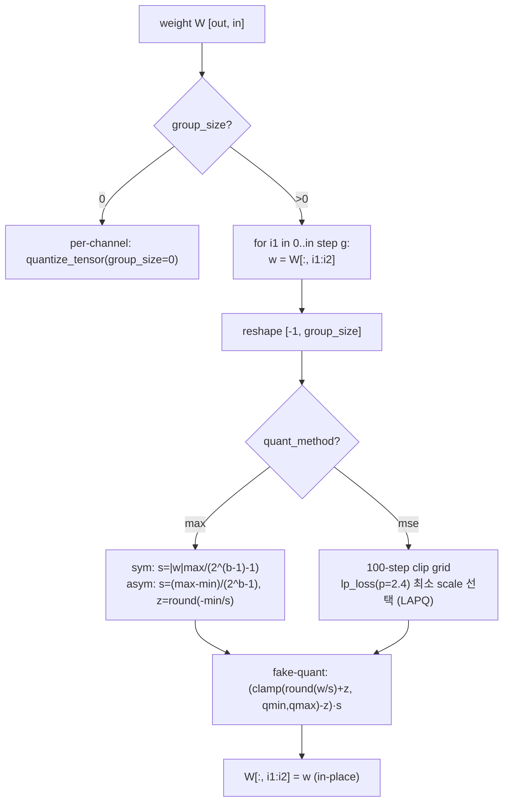
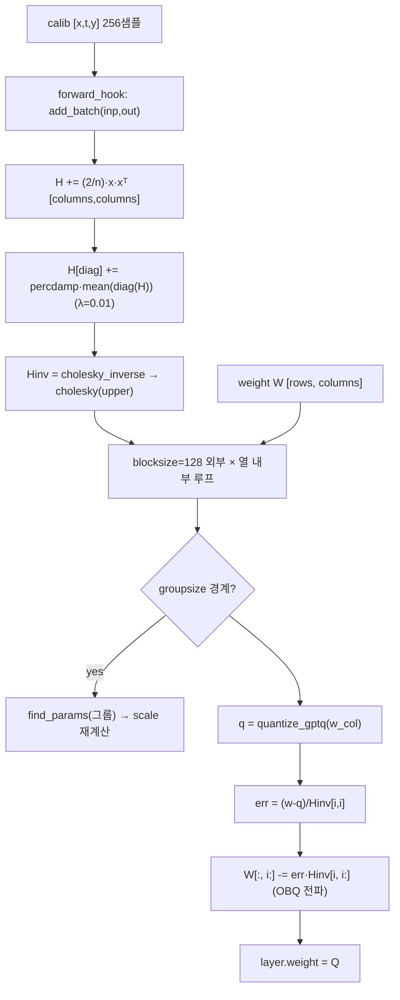
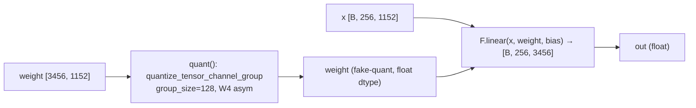
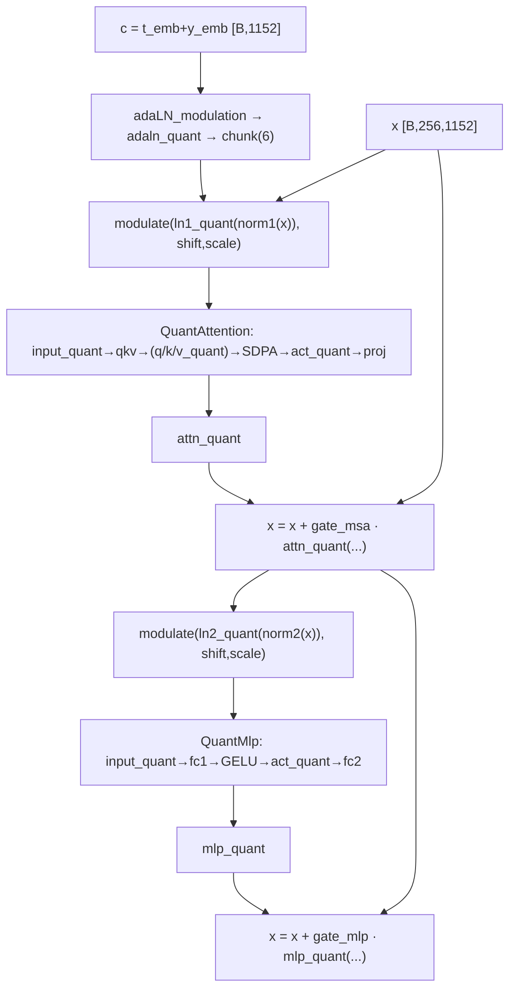
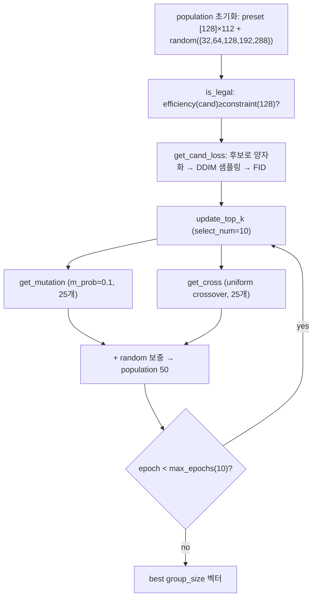
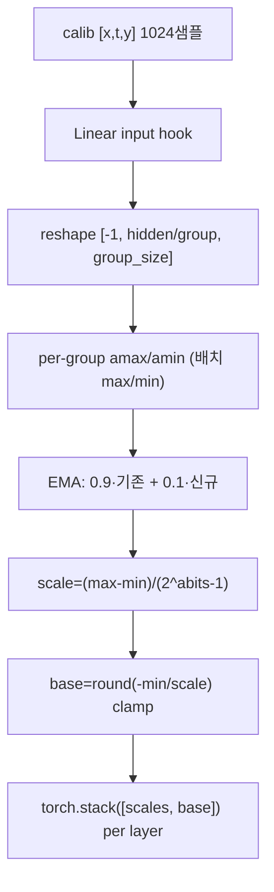
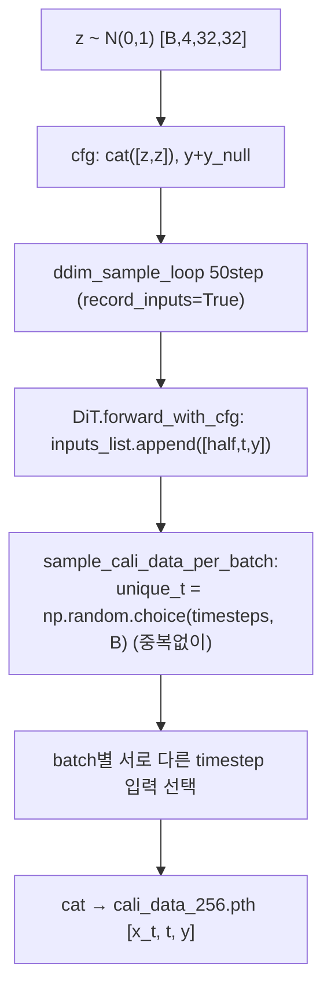
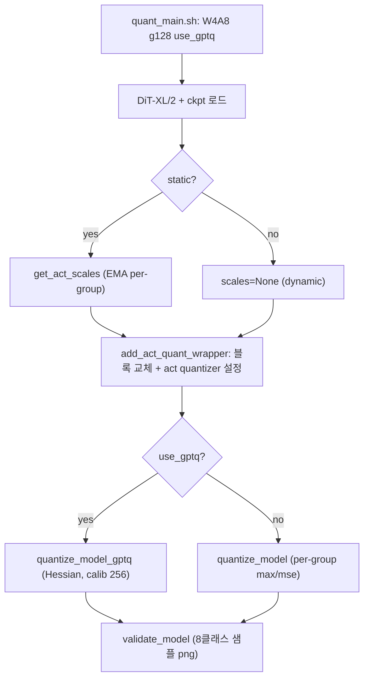

# Q-DiT 모듈 통합 가이드 (S-PyTorch)

> 1차 요약: [`../Q-DiT.md`](../Q-DiT.md) — 본 문서는 그 요약을 모듈 단위로 심화한 통합 가이드다.
> 분석 대상: `\\wsl.localhost\ubuntu-24.04\home\user\project\PRJXR-HBTXR\REF\ViT-Quantization\Q-DiT`
> 작성 원칙: 실제 소스 Read 후 `파일:라인` 근거 표기. 라인 근거 없는 추론은 "추정", 코드로 확인 불가는 "확인 불가"로 명시.
> 형제 HW 가이드(`REF/Analysis/ViT-Quantization/I-ViT/MODULE_GUIDE.md`)의 6요소 구조를 따르되, HW 지표(MAC lanes/scalar MACs)는 **S-PyTorch 수치 규약**(params/FLOPs/activation memory/비트폭/group quant/타임스텝/evolutionary search)으로 치환한다.

---

## 0. 문서 머리말

### 0.1 대표 케이스 선정 (대상 DiT + 타임스텝)
- **대표 모델: `DiT-XL/2`** — `depth=28, hidden_size=1152, patch_size=2, num_heads=16` (`models/models.py:346-347`). head_dim = 1152/16 = **72** (`quant.py:179,191,203`의 `assert w.shape[-1]==72`와 일치, 모델 종속 상수). ImageNet 256×256(latent 32×32→patch2→토큰 **256개**, `models.py:174` num_patches), 1000 class-conditional (`quant_main.py:294-298`).
- **대표 분석 단위: 1개 QuantDiTBlock** = `adaLN_modulation(Linear) → modulate(norm1) → QuantAttention(input_quant + QLinearLayer×2 + SDPA/softmax) → residual gate → modulate(norm2) → QuantMlp(input_quant + QLinearLayer×2 + tanh-GELU) → residual gate` (`qBlock.py:52-61`). DiT-XL/2는 이 Block을 **28개** 적층(`models.py:178-180, 347`).
- **대표 PTQ 3대 축**: ① **group-wise 양자화**(`quant.py:7-47`의 weight, `:151-173`의 activation), ② **GPTQ Hessian weight 보정**(`gptq.py:197-318`), ③ **automatic granularity evolutionary search**(`evolution.py:74-319`). 이 세 가지가 FPGA 양자화 PE 설계의 직접 청사진.
- **타임스텝 처리**: DiT는 diffusion 모델이라 입력이 `(x_t, t, y)` 3종(`models.py:249`). calibration 데이터를 **여러 timestep에 분산 샘플링**(`collect_cali_data.py:32` `unique_t = np.random.choice`)하여 timestep별 활성 분산을 커버한다. group-wise·search 목적함수(FID)는 timestep-aware로 동작(0.4절·6장).

### 0.2 S-PyTorch 수치 규약 (HW의 MAC lanes/scalar MACs 대체)
- **params**: 모듈 차원에서 분석적 계산. Linear `in·out (+out bias)`. Q-DiT는 **fake quantization**(dequant까지 시뮬레이션, `quant.py:97,142`)이라 가중치 개수는 FP 원본과 동일 — 비트폭만 바뀐다. 단 group-wise는 그룹마다 `(scale, base)` 메타데이터가 추가됨(아래 activation bit 항목).
- **FLOPs/MACs**: 표준식×config. Linear MAC = `B·N·in·out`. Attention QKᵀ = `B·H·N²·dh`, AV = `B·H·N²·dh`(H=16, dh=72, N=256). 대표 레이어를 DiT-XL/2(B=1, N=256, C=1152, H=16, dh=72)로 산출 후 28 block 환원. cfg(classifier-free guidance) 사용 시 배치 2배(`quant_main.py` 샘플링은 cond+uncond, `collect_cali_data.py:78-82`).
- **activation memory**: 텐서 shape × 비트폭. Q-DiT도 fake-quant라 실제 메모리는 FP지만, **정수 도메인 비트폭**(W/A bits)을 "HW 환산 activation bit"로 표기. group-wise는 `(scale,base)` per-group 메타데이터 메모리가 추가(group_size 작을수록↑) — 그룹 수 = `텐서_채널수 / group_size`.
- **비트폭/observer**: 코드 직접. 기본 실험 **W4/A8 + group_size 128**(`quant_main.sh:3-4`, `evolution.sh:3-4`). bit choices `[2,3,4,5,6,8,16]`(`quant_main.py:218-223`). weight observer = **per-group max 또는 mse(LAPQ p=2.4)**(`quant.py:75-142`); activation observer = **dynamic per-group max(기본)** 또는 **static EMA(0.9/0.1) per-group**(`outlier.py:83-84`). GPTQ는 per-channel min/max + 선택적 mse grid(`gptq.py:99-184`).
- **정확도(FID/IS)**: README는 BibTeX·셋업만 포함하고 **정확도 표를 싣지 않음**(`README.md` 전체) → FID/IS 수치는 **확인 불가**(논문 본문 미포함). evolution은 FID를 목적함수로 직접 사용(`evolution.py:199`)하나 실측값은 미실행 → 확인 불가.

### 0.3 운영 경로 (PTQ: calibration ↔ 양자화 ↔ 샘플링/평가)
```
[FP 사전학습 DiT 로드]  DiT_models["DiT-XL/2"](input_size, num_classes)  (quant_main.py:167-170)
   │  find_model("DiT-XL-2-256x256.pt") → load_state_dict → eval()       (quant_main.py:172-175)
   ▼
[calibration 데이터 생성]  collect_cali_data.py: record_inputs=True DiT로 DDIM 샘플링
   │  → timestep 분산 샘플 [x_t, t, y] 256개 저장 cali_data_256.pth        (collect_cali_data.py:53-57, 99-106)
   ▼
[activation quantizer 삽입]  add_act_quant_wrapper: DiTBlock → QuantDiTBlock 교체
   │  블록별 weight_group_size[i]/act_group_size[i] 주입, scale 연결        (modelutils.py:15-71)
   │  (static이면 get_act_scales로 EMA scale 선계산)                       (quant_main.py:184-189, outlier.py:63-124)
   ▼
[weight 양자화]  --use_gptq → quantize_model_gptq (Hessian 보정, calib 256)  (modelutils.py:134-204)
   │            아니면 quantize_model (max/mse per-group)                  (modelutils.py:73-99)
   ▼
[샘플링/평가]  validate_model(8 클래스 샘플 png)                            (quant_main.py:38-68, 209)
   │  (FID용 sample_fid 50K 샘플은 주석 처리, :211)
   ▼
[(별도) automatic granularity]  evolution.py: group_size 벡터 EA 탐색
      목적=FID 최소화, 제약=평균 group≥128                                 (evolution.py:286-319)
```
- 타깃 디바이스: **CUDA GPU 전제** — `quant_main.py:148` `device="cuda" if available`, GPTQ Cholesky/누산은 GPU(`gptq.py:268-271,306`), evolution은 추가로 **TF1 Inception**(`evolution.py:50,486-491`) 필요. CPU 단독 실행 가능 여부는 확인 불가(분기는 있으나 미검증).

### 0.4 모델 / 데이터셋 / 정확도 (README·스크립트 인용)
| 항목 | 값 | 근거 |
|---|---|---|
| 베이스 모델 | DiT-XL/2 (depth28, hidden1152, heads16, patch2) | `models.py:347`, `quant_main.py:294` |
| 데이터셋/태스크 | ImageNet 256×256 class-conditional generation, 1000 class | `quant_main.py:296-298`, `evolution.sh:7` |
| 기본 비트 | **W4 / A8** | `quant_main.sh:3`, `evolution.sh:3` |
| group size | weight 128 / act 128 (기본), search space `{32,64,128,192,288}` | `quant_main.sh:4`, `evolution.py:484` |
| calibration | 256 샘플(timestep 분산), DDIM 50 step, cfg 1.5 | `collect_cali_data.py:116-118` |
| 샘플링 | DDIM 50 step, cfg_scale 1.5 | `quant_main.sh:8`, `quant_main.py:300` |
| FID 평가 | reference `VIRTUAL_imagenet256_labeled.npz`, 800/10000 samples | `evolution.sh:7-8`, `quant_main.sh:8` |
| **정확도(FID/IS)** | **확인 불가** (README에 결과표 없음, 논문 본문 미포함) | `README.md` 전체 |
| 의존성 | torch, torchvision, timm, diffusers(AutoencoderKL), transformers, accelerate, pytorch_lightning; evolution은 TF1 | `evolution.py:29-50` |

> **근거 기반 정정 (1차 요약 대비)**: 1차 요약 `Q-DiT.md`는 README BibTeX를 인용하며 "CVPR'25 추정"으로 표기했으나, **README에는 정확도(FID/IS) 표가 전혀 없다**(`README.md` 1-52행 전부 확인). 따라서 본 가이드는 모든 정확도 수치를 "확인 불가"로 통일한다.

---

## 1. Repo / Layer 개요

Q-DiT = **Diffusion Transformer(DiT)** 에 대한 **Post-Training Quantization(PTQ)** 프레임워크다. 학습 없이 calibration 데이터(256 샘플)만으로 weight/activation을 저비트(W4A8)로 양자화한다(`README.md:1`, `quant_main.sh:3`). 입력채널·타임스텝 분산이 큰 DiT 활성에 대응하기 위해 **fine-grained group quant + GPTQ + evolutionary search**를 결합한다. 본 repo는 **Meta DiT 원본 모델 정의 위에 얹은 커스텀 양자화 패키지(`qdit/`)** 가 자체 소스이고, diffusion 샘플링·FID 평가·DiT 백본은 외부(ADM/DiT/diffusers) 차용이다(`README.md:49-50`).

### 1.1 자체 소스 vs 외부 프레임워크 vs 제외
| 구분 | 파일(자체 소스) | 역할 |
|---|---|---|
| **양자화 커널** | `qdit/quant.py` ★핵심 | quantize_tensor(uniform int max/mse), group-wise 분기, activation/attn wrapper, Quantizer(static/dynamic) |
| **GPTQ 보정** | `qdit/gptq.py` ★핵심 | Quantizer_GPTQ, GPTQ.fasterquant(Hessian OBQ), quantize_gptq |
| **양자화 레이어** | `qdit/qLinearLayer.py` | QLinearLayer(weight fake-quant 래퍼), find_qlinear_layers |
| | `qdit/qBlock.py` | QuantDiTBlock/QuantAttention/QuantMlp(DiT 토폴로지 양자화 래핑) |
| **오케스트레이션** | `qdit/modelutils.py` | add_act_quant_wrapper, quantize_model, quantize_model_gptq |
| **activation 통계** | `qdit/outlier.py` | get_act_stats(Hessian), get_act_scales(static EMA scale/base) |
| **데이터** | `qdit/datautils.py` | CalibDataset, get_loader, KL-gradient 수집(save_grad_data) |
| **search** | `scripts/evolution.py` ★핵심 | EvolutionSearcher(group_size 벡터 EA 탐색, 목적=FID) |
| **calibration** | `scripts/collect_cali_data.py` | DiT DDIM 샘플링으로 [x_t,t,y] 수집 |
| **엔트리** | `scripts/quant_main.py` | PTQ 메인(로드→삽입→양자화→샘플링) |
| **모델 정의** | `models/models.py` | DiT/DiTBlock/TimestepEmbedder/LabelEmbedder (Meta DiT 기반) |

### 1.2 forward 진입점
- **PTQ 메인**: `quant_main.main()`(`quant_main.py:143`) → 모델 로드 → `add_act_quant_wrapper`(`:192`) → `quantize_model_gptq`/`quantize_model`(`:195-199`) → `validate_model`(`:209`).
- **양자화 모델 forward**: `DiT.forward(x,t,y)`(`models.py:249-264`) — `c = t_emb + y_emb`를 각 `QuantDiTBlock.forward(x,c)`(`qBlock.py:52`)에 전달. 블록 내부는 `(tensor)` 단일 전파(I-ViT처럼 scale 페어 전파가 아니라 fake-quant 후 float 텐서 전파).

### 1.3 제외 (지시에 따라 이름만 표기, 미분석)
- **외부 프레임워크(커스텀 아님)**: `diffusion/`(gaussian_diffusion/respace/ddim — ADM/DiT 차용 샘플러), `evaluations/evaluator.py`(TF Inception FID/IS), `diffusers.AutoencoderKL`(VAE), timm `PatchEmbed/Attention/Mlp`. DiT **원본 사전학습 체크포인트**(`DiT-XL-2-256x256.pt`) — 가중치만 로드.
- **제외 디렉토리/파일**: `utils/download.py`, `utils/logger_setup.py`(보조), `setup.py`. third_party·체크포인트·`__pycache__`·`.git` 제외.
- **미열람(확인 불가)**: `evaluations/evaluator.py` 내부(FID/IS 계산 세부 — frechet_distance만 호출 라인 확인 `evolution.py:199`), `diffusion/` 샘플러 세부.

### 1.4 대표 모델 레이어 구성 (DiT-XL/2)
`DiT.forward`(`models.py:249-264`): PatchEmbed(timm, conv patch2) + pos_embed → Block×28 → FinalLayer. 1 Block(`qBlock.py:52-61`)당 **QLinearLayer 5개**(attn.qkv, attn.proj, mlp.fc1, mlp.fc2, adaLN_modulation[1]) + Quantizer 다수(input_quant 2, act_quant 2, +bmm용 5개 옵션). LayerNorm(affine=False)·GELU(tanh 근사)·Softmax은 **FP 그대로**(I-ViT의 integer-only 비선형과 대조 — Q-DiT는 Linear weight/act만 양자화).

---

## 2. 모듈: 양자화 커널 — `quant.py` (quantize_tensor / group-wise) ★핵심

### 2.1 역할 + 상위/하위
- **역할**: FP 텐서를 **uniform integer 양자화**(대칭/비대칭)하는 본체. group_size에 따라 per-channel ↔ per-group 분기. dequant까지 포함한 **fake quantization**.
- **상위**: weight는 `QLinearLayer.quant()`(`qLinearLayer.py:48`), activation은 `quantize_activation_wrapper`(`:152`) → `Quantizer`(`:212`). **하위**: `quantize_tensor`(`:50`)가 모든 경로의 최종 커널.

### 2.2 데이터플로우 (텐서 shape 흐름, weight group-wise)


### 2.3 forward call stack
- weight: `QLinearLayer.quant()`(`qLinearLayer.py:48`) → `quantize_tensor_channel_group`(`quant.py:7`) → 그룹 루프(`:19-45`) → `quantize_tensor`(`:50`) → max/mse 분기(`:75-142`).
- activation(dynamic): `Quantizer.forward`(`quant.py:221`) → `act_quant`(=`quantize_activation_wrapper`, `:152`) → `quantize_tensor`(`:171`).

### 2.4 대표 코드 위치
`quant.py`: `quantize_tensor_channel_group` `:7-47`(그룹 루프 `:19-45`), `quantize_tensor` `:50-147`(max `:75-97`, mse `:99-142`), `quantize_activation_wrapper` `:151-173`, `Quantizer` 클래스 `:212-267`(static 경로 `:225-245`).

### 2.5 대표 코드 블록
```python
# quant.py:19-45  group-wise: 입력 채널축(shape[1])을 group_size 단위로 분할
for i1 in range(0, W.shape[1], group_size):
    i2 = min(i1 + group_size, W.shape[1])
    w = W[:, i1:i2]
    if channel_group > 1:                       # 연속 채널 묶음 공유 (bitsandbytes 효율)
        w = w.reshape(int(W.shape[0]/channel_group), -1).contiguous()
    w = quantize_tensor(w, n_bits, group_size=0, ...)   # 슬라이스 독립 양자화
    W[:, i1:i2] = w                             # in-place 덮어쓰기
```
→ **그룹 경계가 입력 채널 축(shape[1])** 이라, FPGA에서 채널 타일 크기를 group_size의 배수로 맞추면 scale 재로드가 단순해짐.

```python
# quant.py:89-97  비대칭(기본) uniform affine + fake-quant
q_max = (2**(n_bits)-1); q_min = 0
scales = (w_max-w_min).clamp(min=1e-5) / q_max
base   = torch.round(-w_min/scales).clamp_(min=q_min, max=q_max)   # zero-point
w = (torch.clamp(torch.round(w / scales) + base, q_min, q_max) - base) * scales
```
→ W4A8 기본은 **비대칭**(`w_sym`/`a_sym` 미지정, `quant_main.sh` 플래그 없음). dequant까지 포함 → 실제 정수 저장 아님(시뮬레이션).

```python
# quant.py:107-130  mse: clip ratio 100단계 grid + LAPQ Lp(p=2.4) 최소화
for i in range(100):
    new_max = w_max * (1.0 - (i * 0.001))       # clip ratio 점진 축소
    ...
    score = lp_loss(w, w_q, p=2.4)              # https://arxiv.org/abs/1911.07190
    best_max = torch.where(score < best_score, new_max, best_max)
```

### 2.6 연산·수치표현 분해 + 정량 (DiT-XL/2)
- **양자화 방식**: uniform int, 대칭(sym)/비대칭(asym, 기본). per-channel(group_size=0) 또는 **per-group(group_size>0)**. fp 경로는 `quantize_tensor`에서 `assert quant_type=="int"`로 차단(`:74`).
- **scale/zp**: per-group `s=(max-min)/(2^b-1)`, `z=round(-min/s)`(asym); `s=|w|max/(2^(b-1)-1)`, `z=0`(sym).
- **비트폭**: W4/A8 기본. tiling(16×16 block-wise)은 `assert False`로 폐기(`:58-59`).
- **params**: 0 학습 파라미터(순수 함수). 단 group-wise **메타데이터**: qkv weight `[3456, 1152]` group_size=128 → 그룹 수 = 1152/128 × 3456 = **31,104 그룹** → `(scale, base)` 31,104쌍/레이어(W4 4비트 weight 대비 메타 오버헤드 비자명).
- **FLOPs**: 원소당 div+round+clamp = O(N). DiT-XL/2 qkv weight = 3456×1152 = **3.98M 원소** 양자화(forward 1회, PTQ는 1회만).
- **activation bit**: dynamic 경로는 forward마다 per-group max로 재계산(`abits<16`일 때). A16이면 패스(`:153-154`).

---

## 3. 모듈: GPTQ Hessian weight 보정 — `gptq.py` ★핵심

### 3.1 역할 + 상위/하위
- **역할**: calibration 입력으로 layer Hessian을 근사하고, **OBQ(Optimal Brain Quantization)** 로 열(입력 채널)을 순차 양자화하며 잔차를 나머지 가중치로 전파. group-wise와 결합 시 그룹 경계마다 scale 재계산.
- **상위**: `quantize_model_gptq`(`modelutils.py:134-204`)가 블록별 Linear에 `GPTQ`+`Quantizer_GPTQ` 생성 후 `fasterquant` 호출. **하위**: `quantize_gptq`(`gptq.py:26`), `torch.linalg.cholesky`.

### 3.2 데이터플로우 (텐서 shape 흐름)


### 3.3 forward call stack
`quantize_model_gptq`(`modelutils.py:159-195`) → `GPTQ(subset[name])`(`gptq.py:198`) → forward_hook `add_batch`(`:216`) → calib 데이터 통과(`modelutils.py:183-184`) → `fasterquant(percdamp, groupsize=weight_group_size[0])`(`modelutils.py:190-191`) → 열 루프 `quantize_gptq`(`gptq.py:290`).

### 3.4 대표 코드 위치
`gptq.py`: `GPTQ.__init__` `:198-214`(Hessian 버퍼, `n_nonout=W.shape[1]` `:213`), `add_batch` `:216-238`(Hessian 누적 `:235-238`), `fasterquant` `:240-318`(damping `:264-266`, Cholesky `:268-271`, 열 루프 `:283-304`, 그룹 scale 재계산 `:287-289`).

### 3.5 대표 코드 블록
```python
# gptq.py:235-238  Hessian 온라인 누적  H ≈ (2/N) Σ x xᵀ
self.H *= self.nsamples / (self.nsamples + tmp)
self.nsamples += tmp
inp = math.sqrt(2 / self.nsamples) * inp.float()
self.H += inp.matmul(inp.t())
```

```python
# gptq.py:283-299  OBQ 열 순차 양자화 + 잔차 전파 (그룹 경계마다 scale 갱신)
for i in range(count):
    w = W1[:, i]; d = Hinv1[i, i]
    if groupsize > 0 and (i1 + i) % groupsize == 0:
        self.quantizer.find_params(W[:, (i1+i):min((i1+i+groupsize), self.n_nonout)], weight=True)
    q = quantize_gptq(w.unsqueeze(1), self.quantizer.scale, self.quantizer.zero, self.quantizer.maxq, ...)
    Losses1[:, i] = (w - q) ** 2 / d ** 2
    err1 = (w - q) / d
    W1[:, i:] -= err1.unsqueeze(1).matmul(Hinv1[i, i:].unsqueeze(0))   # 나머지 열로 오차 전파
```

```python
# gptq.py:264-271  damping + Cholesky 역행렬 (수치 안정)
damp = percdamp * torch.mean(torch.diag(H))     # percdamp=0.01
H[diag, diag] += damp
H = torch.linalg.cholesky(H)
H = torch.cholesky_inverse(H)
H = torch.linalg.cholesky(H, upper=True)         # Hinv (upper)
```

### 3.6 연산·수치표현 분해 + 정량 (DiT-XL/2 qkv)
- **양자화 방식**: per-channel(`perchannel=True`, `modelutils.py:167`) min/max scale, GPTQ 루프 내 그룹별(`groupsize`) 재계산. sym/asym 선택(W4A8은 비대칭 기본, GPTQ는 `sym=args.w_sym`=False).
- **scale/zp**: `scale=(xmax-xmin)·clip_ratio/maxq`, `zero=round(-xmin/scale)`(asym, `gptq.py:139-143`). mse 옵션 grid(`maxshrink·grid`, `:145-162`)는 `quantize_model_gptq`에서 `mse=False`로 비활성.
- **비트폭**: W4(maxq=2^4-1=15). Hessian/Cholesky는 float(GPU).
- **핵심 한계 (1차 요약 확인)**: `n_nonout = W.shape[1]`(`gptq.py:213`)로 **전 입력 채널을 처리** → outlier/non-outlier 분리(Atom 스타일) **비활성**. `fasterquant`에 `groupsize=weight_group_size[0]`(첫 블록 값)만 전달(`modelutils.py:191`) → automatic granularity로 찾은 **블록별 weight group이 GPTQ에 완전히 반영되지 않음**(블록별 다른 group을 weight 양자화 시점에는 첫 블록 값으로 일괄 적용, 추정).
- **params**: 0(보정만). Hessian 버퍼 `[columns, columns]` = qkv는 [1152,1152] = 1.33M float (calibration 동안만).
- **MACs**: Hessian 누적 = N_calib·columns² 행렬곱(qkv: 256·256토큰 ÷ batch × 1152²), Cholesky O(columns³)=1152³≈**1.53G** (오프라인 1회).

---

## 4. 모듈: 양자화 Linear 래퍼 — `qLinearLayer.py` (QLinearLayer)

### 4.1 역할 + 상위/하위
- **역할**: nn.Linear의 weight/bias를 buffer로 복제, `quant()` 호출 시점에 weight를 **in-place fake-quant**. forward는 평범한 `F.linear`(양자화된 weight 사용).
- **상위**: `QuantAttention.qkv/proj`(`qBlock.py:85,91`), `QuantMlp.fc1/fc2`(`:152,157`), `QuantDiTBlock.adaLN_modulation[1]`(`:28`). **하위**: `quantize_tensor_channel_group`(`quant.py:7`).

### 4.2 데이터플로우 (텐서 shape 흐름, DiT-XL/2 qkv)


### 4.3 forward call stack
`QuantAttention.forward`(`qBlock.py:116`) → `self.qkv(x)`(`qLinearLayer.py:34`의 forward = `F.linear`). 양자화는 별도로 `quantize_model`이 `qkv.quant()`(`modelutils.py:94`) 시점에 수행 → 이후 forward는 양자화된 weight를 그대로 사용.

### 4.4 대표 코드 위치
`qLinearLayer.py`: 클래스 `:16-65`, weight/bias buffer 복제 `:25-30`, forward(F.linear) `:33-36`, `quant()` `:43-62`, `find_qlinear_layers` `:5-14`.

### 4.5 대표 코드 블록
```python
# qLinearLayer.py:43-62  weight를 그룹 단위 fake-quant 후 self.weight 교체
@torch.no_grad()
def quant(self):
    if self.args.wbits >= 16: return            # 16bit면 패스
    self.weight = quantize_tensor_channel_group(
        self.weight.clone(), n_bits=self.args.wbits, sym=self.args.w_sym,
        group_size=self.args.weight_group_size,  channel_group=self.args.weight_channel_group,
        clip_ratio=self.args.w_clip_ratio, tiling=self.args.tiling,
        quant_type=self.args.quant_type, quant_method=self.args.quant_method)
    self.quantized = True
```
→ **forward 시점이 아니라 quant() 호출 시 1회** in-place fake-quant. GPTQ 경로는 weight를 `gptq.py:315`에서 직접 덮어쓰므로 `quant()` 미호출(GPTQ가 양자화 weight 생성).

### 4.6 연산·수치표현 분해 + 정량 (DiT-XL/2, B=1, N=256)
- **양자화 방식**: weight per-group W4(group_size=128, 입력채널 축), 비대칭. bias는 미양자화(buffer 그대로, `:28`).
- **params/block** (C=1152, mlp_ratio=4 → mlp_hidden=4608):
  - qkv: 1152×3456 + 3456 = **3,984,768**
  - proj: 1152×1152 + 1152 = **1,328,256**
  - fc1: 1152×4608 + 4608 = **5,312,256**
  - fc2: 4608×1152 + 1152 = **5,310,144**
  - adaLN[1]: 1152×6912 + 6912 = **7,969,536** (adaLN_modulation: SiLU→Linear(1152→6·1152))
  - Linear params/block ≈ **23.9M**, ×28 block ≈ **669M** (+ patch/embed/final 별도). DiT-XL/2 공칭 ~675M와 정합.
- **MACs/block** (B=1, N=256):
  - qkv: 256×1152×3456 ≈ **1.02G**
  - proj: 256×1152×1152 ≈ **340M**
  - fc1: 256×1152×4608 ≈ **1.36G**
  - fc2: 256×4608×1152 ≈ **1.36G**
  - adaLN[1]: 1(토큰무관, c는 [B,1152])×1152×6912 ≈ **8M** (배치당 1회)
  - Linear MAC/block ≈ **4.08G**(+adaLN 8M), ×28 ≈ **114.3G** (Attention matmul 제외).
- **activation bit**: 입력 A8(input_quant 통과), weight W4. 정수 MAC 누산 HW 환산 INT(추정) — 단 Q-DiT는 fake-quant라 실제 float MAC.

---

## 5. 모듈: DiT Block/Attention/MLP 양자화 래핑 — `qBlock.py`

### 5.1 역할 + 상위/하위
- **역할**: 원본 `DiTBlock`을 받아 attn/mlp를 `QuantAttention`/`QuantMlp`로 교체, adaLN의 Linear를 QLinearLayer로 래핑. `quantize_bmm_input` 옵션 시 LayerNorm·attention·adaLN 출력에 `Quantizer` 삽입(activation 양자화).
- **상위**: `add_act_quant_wrapper`/`quantize_model(_gptq)`(`modelutils.py`)가 DiTBlock을 교체. **하위**: `QLinearLayer`, `Quantizer`, timm `Attention/Mlp`.

### 5.2 데이터플로우 (텐서 shape 흐름, 1 Block, quantize_bmm_input=True)


### 5.3 forward call stack
`DiT.forward`(`models.py:260-261`) → `QuantDiTBlock.forward(x,c)`(`qBlock.py:52`) → `adaLN_modulation(c).chunk(6)`(`:54/58`) → `QuantAttention.forward`(`:111`) → `QuantMlp.forward`(`:176`). bmm_input 분기 `:53-61`.

### 5.4 대표 코드 위치
`qBlock.py`: `QuantDiTBlock` `:12-61`(bmm_input quantizer 삽입 `:30-35`, forward 분기 `:53-61`), `QuantAttention` `:64-142`(forward `:111-142`, reorder_index 미사용 buffer `:92-93`), `QuantMlp` `:144-187`(forward `:176-187`).

### 5.5 대표 코드 블록
```python
# qBlock.py:58-60  quantize_bmm_input=True: LayerNorm·attn·adaLN 출력에 Quantizer 삽입
shift_msa, scale_msa, gate_msa, ... = self.adaln_quant(self.adaLN_modulation(c)).chunk(6, dim=1)
x = x + gate_msa.unsqueeze(1) * self.attn_quant(self.attn(modulate(self.ln1_quant(self.norm1(x)), shift_msa, scale_msa)))
x = x + gate_mlp.unsqueeze(1) * self.mlp_quant(self.mlp(modulate(self.ln2_quant(self.norm2(x)), shift_mlp, scale_mlp)))
```
→ residual add(`x = x + gate·...`)와 norm/GELU/softmax는 **FP 유지**. 양자화는 Linear weight·act 입출력에만(I-ViT의 integer-only residual/비선형과 대조).

```python
# qBlock.py:116-134  QuantAttention: input_quant → qkv → (q/k/v_quant) → SDPA/manual
x = self.input_quant(x)
qkv = self.qkv(x).reshape(B, N, 3, self.num_heads, self.head_dim).permute(2,0,3,1,4)
q, k, v = qkv.unbind(0)
if self.quantize_bmm_input:
    q = self.q_quant(q); k = self.k_quant(k); v = self.v_quant(v)   # head_dim축 양자화(72)
if self.fused_attn:
    x = F.scaled_dot_product_attention(q, k, v, ...)               # softmax는 FP
```

### 5.6 연산·수치표현 분해 + 정량 (DiT-XL/2, B=1, H=16, N=256, dh=72)
- **양자화 방식**: Linear weight W4(per-group) + activation A8(input_quant/act_quant, dynamic per-group). bmm_input 옵션 시 q/k/v는 head_dim(72)축 비대칭 양자화(`quant.py:179-210`). softmax/GELU/LayerNorm/residual은 FP.
- **MACs/block** (Attention 행렬곱): QKᵀ = H·N²·dh = 16×256²×72 ≈ **75.5M**; AV = 16×256²×72 ≈ **75.5M**. Attention matmul MAC/block ≈ **151M**, ×28 ≈ **4.23G**.
- **activation memory**: attn 행렬 `[1,16,256,256]` = 16×256² = **1.05M 원소**(A8이면 1.05MB, 단 softmax 입출력은 FP). block 내 최대 단일 활성.
- **reorder_index**: `reorder_index_qkv/proj/fc1` buffer 존재하나 **기본 None**(`qBlock.py:92-93,159`) → Atom 채널 재정렬 차용 흔적, 실제 미사용(forward `:113-114`는 None이면 skip).

---

## 6. 모듈: automatic granularity evolutionary search — `evolution.py` ★핵심

### 6.1 역할 + 상위/하위
- **역할**: 블록·연산자별 **group size 조합**을 진화 알고리즘으로 자동 탐색하여 FID를 최소화. 평균 group size 제약(메모리/연산 budget) 하에서 mixed-granularity 할당.
- **상위**: `evolution.py:__main__`(`:447-497`)가 모델 로드 후 `EvolutionSearcher.search()` 호출. **하위**: `add_act_quant_wrapper`, `quantize_model`, `configure_group_size`, `Evaluator.frechet_distance`(TF Inception).

### 6.2 데이터플로우 (탐색 루프)


### 6.3 forward call stack
`search()`(`evolution.py:286`) → `get_random(preset=[[128]*112])`(`:290-292`) → `is_legal`(`:110`) → `get_cand_loss`(`:145`) → `configure_group_size`(`:151`) → `quantize_model`(`:152`) → `ddim_sample_loop`(`:178`) → `frechet_distance`(`:199`). EA: `get_mutation`(`:260`)/`get_cross`(`:226`).

### 6.4 대표 코드 위치
`evolution.py`: `EvolutionSearcher` `:74-315`, `sample_subnet`(k=112) `:106-108`, `is_legal`(제약) `:110-123`, `configure_group_size` `:125-143`, `get_cand_loss`(FID) `:145-202`, `get_cross` `:226-258`, `get_mutation` `:260-284`, `search` `:286-315`, `efficiency_predictor` `:317-319`, search_space `:484`.

### 6.5 대표 코드 블록
```python
# evolution.py:125-143  탐색 차원 = len(blocks)*4 (28블록 → 112), 블록당 4연산자에 group 부여
def configure_group_size(self, model, group_size):
    assert(len(group_size) == len(blocks)*4)
    for i in range(len(blocks)):
        m.attn.input_quant.args.act_group_size  = group_size[i*4]      # attn-qkv act
        m.attn.qkv.args.weight_group_size        = group_size[i*4]     # attn-qkv weight
        m.attn.act_quant.args.act_group_size     = group_size[i*4+1]   # attn-proj act
        m.attn.proj.args.weight_group_size       = group_size[i*4+1]
        m.mlp.input_quant.args.act_group_size    = group_size[i*4+2]   # mlp-fc1
        m.mlp.fc1.args.weight_group_size         = group_size[i*4+2]
        m.mlp.act_quant.args.act_group_size      = group_size[i*4+3]   # mlp-fc2
        m.mlp.fc2.args.weight_group_size         = group_size[i*4+3]
```
→ **연산자별 weight·act group을 동일 값으로 묶어** 탐색 차원을 4/block로 압축(112 = 28×4).

```python
# evolution.py:199-202  목적함수 = FID (생성 품질 직접 최적화)
fid_score = sample_stats.frechet_distance(ref_stats)
loss = fid_score
return loss

# evolution.py:110-111, 317-319  제약 = 평균 group size ≥ constraint (기본 128)
def is_legal(self, cand):
    if self.efficiency_predictor(cand) < self.constraint: return False
def efficiency_predictor(cand):
    return sum(eval(cand)) / len(eval(cand))      # 평균 group size = bit/메모리 budget proxy
```

```python
# evolution.py:484  search space (group size 후보)
search_space = [32, 64, 128, 192, 288]
```

### 6.6 연산·수치표현 분해 + 정량
- **탐색 방식**: EA — population 50(`:334`), select_num 10(`:330`), crossover 25 + mutation 25(`evolution.sh:11`), m_prob 0.1(`:343`), max_epochs 10(`evolution.sh:10`)/기본 20(`:327`). uniform crossover(`:240-244`), per-element mutation(`:269-271`).
- **탐색 차원**: 112 = 28 block × 4 operator(`:107,127`). 후보 = `{32,64,128,192,288}^112`.
- **목적함수**: FID(낮을수록 좋음, `:199`). 제약: 평균 group ≥ 128(`:349`).
- **비용**: 후보마다 **전체 모델 양자화 + DDIM 50step × 800샘플 + Inception FID**(`evolution.sh:7-8`, `get_cand_loss:160-200`) → 후보당 수 분~수십 분(GPU). population 50 × epoch 10 → 수백 회 평가 → 매우 비쌈(`evolution.py:497` 총 시간 hours 로깅).
- **calibration**: search 내 `quantize_model`은 calib 1024 샘플 사용(`evolution.py:103`, get_loader nsamples=1024).
- **타임스텝 처리 (search 맥락)**: search는 다양한 timestep을 거치는 **full DDIM 샘플링 후 FID**로 적합도 산정 → group 할당이 timestep 전 구간 품질에 정렬됨(timestep별 분리 탐색은 없음, 추정).

---

## 7. 모듈: activation 통계/static scale — `outlier.py` (get_act_scales / get_act_stats)

### 7.1 역할 + 상위/하위
- **역할**: (파일명은 outlier지만) **activation 통계 수집기**. `get_act_stats`는 Hessian/abs-mean 통계, `get_act_scales`는 **static activation 양자화용 (scale, base)** 를 EMA로 산출. outlier 채널 분리 로직은 **없음**.
- **상위**: `get_act_scales`는 `quant_main.main`(`quant_main.py:187-189`, `static` 시). **하위**: `nn.Module.register_forward_hook`.

### 7.2 데이터플로우 (텐서 shape 흐름, static scale)


### 7.3 forward call stack
`quant_main.main`(`quant_main.py:184-189`) → `get_act_scales(model, diffusion, dataloader, device, args)`(`outlier.py:64`) → Linear hook `stat_tensor`(`:72`) → calib 통과(`:107-108`) → scale/base 계산(`:114-121`).

### 7.4 대표 코드 위치
`outlier.py`: `get_act_stats`(Hessian/absmean) `:8-60`, `get_act_scales`(static scale) `:63-124`(per-group max/min `:74-81`, EMA `:83-84`, scale/base `:114-121`).

### 7.5 대표 코드 블록
```python
# outlier.py:74-87  per-group max/min + EMA (momentum 0.9/0.1)
if group_size > 0:
    tensor = tensor.reshape(-1, hidden_dim//group_size, group_size)
comming_max_scales, _ = torch.max(tensor.amax(dim=-1, keepdim=True), dim=0)   # (hidden/group, 1)
comming_min_scales, _ = torch.min(tensor.amin(dim=-1, keepdim=True), dim=0)
if name in act_max_scales:
    act_max_scales[name] = 0.9 * act_max_scales[name] + 0.1 * comming_max_scales   # EMA
    act_min_scales[name] = 0.9 * act_min_scales[name] + 0.1 * comming_min_scales
```

```python
# outlier.py:117-121  비대칭 static scale/base 산출
q_max = (2**(abits)-1); q_min = 0
scales = (max_value-min_value).clamp(min=1e-5) / q_max
base   = torch.round(-min_value/scales).clamp_(min=q_min, max=q_max)
act_scales[name] = torch.stack([scales, base])
```

### 7.6 연산·수치표현 분해 + 정량
- **양자화 방식**: static은 **per-group 비대칭**(EMA로 범위 추적), `Quantizer.forward` static 경로(`quant.py:225-245`)는 `assert a_sym==False`(비대칭만). dynamic(기본)은 forward마다 per-group max 재계산.
- **observer**: static EMA(0.9/0.1, `outlier.py:83-84`). `get_act_stats`의 Hessian은 `sqrt(2/nsamples)·xxᵀ` 대각(`:19-21`) — GPTQ와 유사하나 별도 통계용.
- **params**: 0. scale/base buffer per layer (group 수만큼).
- **정정 (1차 요약 확인)**: 작업 지시·파일명의 "outlier 처리"는 **코드에 없음**. `get_act_stats`/`get_act_scales` 모두 outlier 분리 없이 전 채널 통계만 수집. GPTQ `n_nonout=전체`(`gptq.py:213`)와 일관 — Atom outlier-aware는 비활성(group-wise로 대체, 추정).

---

## 8. 모듈: calibration 데이터 생성 — `collect_cali_data.py` (타임스텝 분산 샘플링)

### 8.1 역할 + 상위/하위
- **역할**: DiT-XL/2를 `record_inputs=True`로 로드해 DDIM 샘플링 중 내부 입력 `[x_t, t, y]`를 기록, **timestep을 무작위 분산 샘플링**하여 다양한 timestep을 커버하는 calibration set(256 샘플) 생성.
- **상위**: 독립 스크립트(PTQ 전처리). **하위**: `DiT.forward_with_cfg`(`models.py:266-284`)의 `inputs_list.append`(`:274`), `diffusion.ddim_sample_loop`.

### 8.2 데이터플로우


### 8.3 forward call stack
`main`(`collect_cali_data.py:40`) → `ddim_sample_loop`(`:85`) → DiT 내부 `forward_with_cfg`(`models.py:273-274` 입력 기록) → `model.get_input_list`(`:94`) → `sample_cali_data_per_batch`(`:95`) → `torch.save`(`:106`).

### 8.4 대표 코드 위치
`collect_cali_data.py`: `sample_cali_data_per_batch`(timestep 분산) `:26-38`, main 샘플링 루프 `:68-100`, 저장 `:102-106`, num_cali_data=256 `:116`. `models.py`: `record_inputs` `:161,183`, `forward_with_cfg` 기록 `:273-274`.

### 8.5 대표 코드 블록
```python
# collect_cali_data.py:32-38  timestep 무작위 분산 샘플링 (batch당 서로 다른 t)
unique_t = np.random.choice(range(0, timesteps), batch_size, replace=False)
for idx in range(batch_size):
    t = unique_t[idx]
    samples_t = input_list_per_batch[t]
    cali_data.append([samples_t[0][idx], samples_t[1][idx], samples_t[2][idx]])  # [x_t, t, y]
```
→ **diffusion timestep마다 활성 분산이 달라지므로**, calibration이 단일 t가 아닌 전 구간 t를 커버하도록 분산 추출. Q-DiT가 "타임스텝 분산 큰 활성"에 대응하는 핵심 데이터 설계.

### 8.6 연산·수치표현 분해 + 정량
- **calibration 크기**: 256 샘플(`:116`), DDIM 50 step(`:118`), batch 16(`:114`), cfg 1.5(`:117`).
- **저장 포맷**: `[x_t, t, y]` 텐서 리스트 → `cali_data_256.pth`(`:105-106`). `CalibDataset`(`datautils.py:9-26`)이 로드, `get_loader`(nsamples 256/1024)로 subset 샘플링(`datautils.py:48-55`).
- **타임스텝 처리**: `unique_t = np.random.choice(..., replace=False)`(`:32`)로 batch 내 중복 없는 timestep 보장 → timestep 다양성 극대화.

---

## 9. 모듈: PTQ 오케스트레이션 — `modelutils.py` + `quant_main.py`

### 9.1 역할 + 상위/하위
- **역할**: DiTBlock→QuantDiTBlock 교체, 블록별 group size 주입, activation quantizer 설정, weight 양자화(max/mse 또는 GPTQ) 실행. `quant_main`이 전 파이프라인 엔트리.
- **상위**: CLI(`quant_main.sh`). **하위**: `QuantDiTBlock`, `GPTQ`, `Quantizer_GPTQ`, `get_act_scales`.

### 9.2 데이터플로우


### 9.3 forward call stack
`quant_main.main`(`quant_main.py:143`) → `add_act_quant_wrapper`(`modelutils.py:15`) → `quantize_model_gptq`(`:134`)/`quantize_model`(`:73`) → `validate_model`(`quant_main.py:38`).

### 9.4 대표 코드 위치
`modelutils.py`: `add_act_quant_wrapper`(블록별 group 주입 `:18-27`, act configure `:37-66`) `:15-71`, `quantize_model`(quant() 호출 `:92-95`) `:73-99`, `quantize_model_gptq`(GPTQ 루프 `:159-195`) `:134-204`. `quant_main.py`: main `:143-211`, group_size 파싱 `:178-181`, static 분기 `:184-191`, 양자화 분기 `:195-199`.

### 9.5 대표 코드 블록
```python
# modelutils.py:18-27  블록별 weight/act group size 주입 (automatic granularity 반영)
for i in range(len(blocks)):
    args_i = copy.deepcopy(args)
    args_i.weight_group_size = args.weight_group_size[i]   # 블록 리스트
    args_i.act_group_size    = args.act_group_size[i]
    m = QuantDiTBlock(dit_block=blocks[i], args=args_i)
```

```python
# modelutils.py:183-191  GPTQ: calib hook으로 Hessian 누적 후 fasterquant
for calib_x, calib_t, calib_y in tqdm(dataloader):
    model(calib_x.to(device), calib_t.to(device), calib_y.to(device))   # Hessian 누적
...
gptq[name].fasterquant(percdamp=args.percdamp, groupsize=args.weight_group_size[0])  # 첫 블록 group 일괄
```
→ **GPTQ groupsize = weight_group_size[0]**(첫 블록 값) 일괄 전달 → 블록별 다른 group이 GPTQ에 완전 반영 안 됨(3.6절 한계 재확인).

### 9.6 연산·수치표현 분해 + 정량 / 재현 명령
- **기본 설정**(`quant_main.sh`): W4A8, group 128, `--use_gptq`, `quant_method max`, calib 256, DDIM 50, cfg 1.5, FID 10000 샘플(단 sample_fid는 주석, `quant_main.py:211`).
- **재현 명령**:
  ```bash
  cd scripts
  python collect_cali_data.py                       # calibration 256 생성
  bash quant_main.sh                                # W4A8 + GPTQ + group128 양자화→샘플
  bash evolution.sh                                 # automatic granularity 탐색 (TF1 필요)
  ```
- **정확도**: validate_model은 8개 클래스 샘플 png만 생성(`quant_main.py:43,67`), FID 자동 계산은 비활성(`:211` 주석). **FID/IS 실측 확인 불가**(README 결과표 없음 + 미실행).

---

## N+1. 모듈 한눈 요약 표

| 모듈 | 파일:라인 | 역할 | 양자화/탐색 방식 | 대표 정량(DiT-XL/2) |
|---|---|---|---|---|
| quantize_tensor (group-wise) | quant.py:7-147 | uniform int max/mse, per-group | sym/asym, group 입력채널축, fake-quant | params 0, qkv weight 3.98M 원소, 메타 31K group |
| GPTQ (Hessian OBQ) | gptq.py:197-318 | weight 순차 보정+잔차 전파 | per-channel min/max, 그룹경계 재계산 | Hessian 1152², Cholesky ~1.53G(오프라인) |
| QLinearLayer | qLinearLayer.py:16-65 | weight fake-quant 래퍼 | W4 per-group, quant() 1회 | Linear 23.9M params/block, 4.08G MAC/block |
| QuantDiTBlock/Attn/Mlp | qBlock.py:12-187 | DiT 토폴로지 양자화 래핑 | Linear W4/act A8, norm/GELU/softmax는 FP | Attn matmul 151M MAC/block, attn 1.05M 원소 |
| EvolutionSearcher | evolution.py:74-319 | group_size 벡터 EA 탐색 | 112차원, 목적=FID, 제약 평균group≥128 | pop50×ep10, search_space{32..288} |
| get_act_scales | outlier.py:63-124 | static activation scale/base | per-group 비대칭 EMA(0.9/0.1) | params 0, group당 (scale,base) |
| collect_cali_data | collect_cali_data.py | calib [x_t,t,y] 생성 | timestep 무작위 분산(replace=False) | 256샘플, DDIM 50step |
| modelutils (orchestration) | modelutils.py:15-204 | 블록교체+group주입+양자화 | 블록별 group 리스트, GPTQ groupsize[0] | 28 block 순차, calib 256 |
| DiT 모델 | models.py:145-388 | DiT-XL/2 정의 | (양자화 대상, FP 원본) | 28 block, ~675M params, ~118.5G MAC/img |

---

## N+2. 학습·평가 파이프라인 + 재현 명령

- **데이터셋**: ImageNet 256×256 class-conditional generation, 1000 class (`quant_main.py:296-298`). calibration은 DiT가 생성한 latent 입력(`collect_cali_data.py`).
- **PTQ (재학습 없음)**:
  ```bash
  cd scripts
  python collect_cali_data.py                  # cali_data_256.pth 생성
  bash quant_main.sh                           # --wbits 4 --abits 8 --act/weight_group_size 128 --use_gptq --quant_method max
  ```
  옵션: bit `{2,3,4,5,6,8,16}`(`quant_main.py:218-223`), group `{0..1152}`(`evolution.py:381`), `--static`(EMA scale), `--quant_method {max,mse}`, `--quantize_bmm_input`(q/k/v 양자화).
- **automatic granularity 탐색**:
  ```bash
  bash evolution.sh                            # W4A8 sym, EA(epoch10, pop50, cross25, mut25, constraint128)
  ```
  `--ref_batch VIRTUAL_imagenet256_labeled.npz`, FID 800 samples(`evolution.sh:7-11`). **TF1 Inception 필요**(`evolution.py:50,486-491`).
- **평가**: `validate_model`(8클래스 샘플 png, `quant_main.py:209`). FID 50K(`sample_fid`)는 주석 처리(`:211`). evolution 내부는 frechet_distance 직접 계산(`evolution.py:199`).
- **체크포인트**: `--save_ckpt` 옵션(`quant_main.py:305-307`), 기본 미저장.
- **의존성**: torch, torchvision, timm, diffusers(AutoencoderKL), transformers(Conv1D 호환), accelerate, pytorch_lightning(seed_everything). evolution은 추가로 tensorflow.compat.v1. Python 3.8(`README.md:14`). **CUDA 필수**(0.3절).
- **정확도(FID/IS)**: README에 결과표 없음 → **확인 불가**. 미실행으로 실측도 불가.

---

## N+3. 우리 프로젝트(FPGA ViT/DiT 가속 + XR 시선추적) 시사점 + FPGA 친화도

> 프로젝트 맥락(HG-PIPE 계열 ViT/Transformer FPGA 가속기 + XR 시선추적)은 **추정**이며, 아래는 그 가정 하 시사점이다.

### N+3.1 Group-wise quantization의 하드웨어 매핑 (최우선 설계 포인트)
- Q-DiT의 group-wise는 그룹마다 `(scale, base)` 메타데이터를 저장/적용한다(`quant.py:89-97`). FPGA 매핑 시 **그룹 scale을 어디에 저장(BRAM/URAM)·언제 곱할지**가 PE 데이터패스 비용을 좌우. group_size 작을수록(32) scale 테이블↑, dequant 곱셈 빈도↑ → **BRAM 점유·DSP 트레이드오프**. group 경계가 **입력 채널 축**(`quant.py:19`)이므로 가속기 채널 타일 크기를 group_size 배수로 맞추면 scale 재로드가 단순.
- **확장 아이디어**: per-group scale을 **power-of-two로 제약**하면 dequant 곱셈을 shift로 대체 가능(Q-DiT 코드엔 없음, 우리 측 변형). I-ViT의 dyadic `(z·m)>>e`(I-ViT 가이드 §3) 방식을 group scale에 적용하면 정수 데이터패스로 환원.

### N+3.2 GPTQ weight-only 보정의 가속기 친화성
- GPTQ는 **weight만** 보정하고 activation 분포를 건드리지 않으므로(`gptq.py`), ViT/시선추적 백본에도 전이 가능. FPGA에서는 **오프라인 GPTQ로 보정한 정수 weight를 ROM/BRAM에 적재**하면 추론 측 추가 비용 0 → 가속기 친화. Hessian/Cholesky(`gptq.py:268-271`)는 오프라인 단계라 FPGA 자원과 무관.
- **단**: Q-DiT GPTQ는 outlier 분리 비활성(`n_nonout=전체`, `:213`) + groupsize 일괄(`modelutils.py:191`) → 우리 측 재구현 시 블록별 group을 GPTQ에 정확히 반영하면 정확도 개선 여지(추정).

### N+3.3 Automatic granularity → FPGA 비트/그룹 할당 DSE 프레임
- evolution의 "**평균 group 제약 하 FID 최소화**"(`evolution.py:110-111,317-319`) 발상은 **FPGA 자원 제약(DSP/BRAM/LUT) 하 정확도 최대화**로 직접 치환 가능.
  - 목적함수 FID → (우리 태스크) gaze angular error/IoU.
  - `efficiency_predictor`(평균 group) → **실제 HW 비용 모델**(레이어별 cycle/DSP)로 교체 → hardware-aware NAS-style 탐색(우리 algo2fpga DSE 흐름과 정합).
- **단**: Q-DiT는 후보마다 full DDIM 샘플링+FID(`get_cand_loss:160-200`)라 매우 비쌈(수백 평가). FPGA용은 proxy metric(소수 샘플)/surrogate predictor 도입 권장.

### N+3.4 타임스텝 분산 대응 = 시계열/스트리밍 활성 양자화 참조
- DiT의 timestep별 활성 분산 큼 → calibration을 timestep 분산 샘플링(`collect_cali_data.py:32`)으로 커버. XR 시선추적(시계열 프레임) 가속기에서 **프레임/상태별 activation 분포 변화**에 dynamic per-group scale을 적용하는 설계의 참조(추정).

### N+3.5 FPGA 친화도 평가 (정수전용/곱셈기-free 관점)
| 항목 | 평가 | 근거 |
|---|---|---|
| 정수전용(integer-only) | △ fake-quant 시뮬레이션만, 실제 정수 데이터패스 미구현 | `quant.py:97,142` dequant 포함 |
| group-wise 양자화 | ★★★ 입력채널축 fine-grained, 블록별 가변 | `quant.py:19`, `modelutils.py:18-27` |
| weight 보정(GPTQ) | ★★★ 오프라인, 추론 비용 0 | `gptq.py:240-318` |
| 비선형(GELU/softmax/LN) | ✗ FP 유지 (I-ViT의 integer-only와 대조) | `qBlock.py:124-134` SDPA softmax FP |
| 자동 granularity 탐색 | ★★ DSE 프레임 재사용 가능하나 평가 비용 큼 | `evolution.py:160-200` |
| 저비트 이식성 | ★★ W4A8 검증(bit choices 2~16) | `quant_main.sh:3`, `:218` |
| residual/scale 전파 | △ Q-DiT는 fake-quant float 전파(I-ViT의 정수 dyadic 정렬 없음) | `qBlock.py:55-56` FP residual |

### N+3.6 I-ViT 대비 핵심 차이 (형제 가이드 교차참조)
- **I-ViT**: integer-only(비선형까지 정수, dyadic requant, QAT 재학습) — FPGA 비선형 HW화 청사진.
- **Q-DiT**: weight/act Linear만 양자화(비선형 FP), **PTQ**(재학습 없음), **group-wise + GPTQ + EA 자동 granularity** — diffusion·대형 모델 PTQ + 그룹/비트 할당 탐색 프레임이 강점.
- **결합 시사**: Q-DiT의 group-wise + EA granularity 탐색을 I-ViT의 integer-only 비선형/dyadic requant와 결합하면, **FPGA용 fine-grained mixed-granularity integer-only ViT/DiT 가속기** 설계 가능(추정, 우리 측 통합 방향).

---

## 부록. 근거 / 확인 불가

- **직접 코드 확인**: §2~§9 전 라인 인용 — `quant.py`(전체), `gptq.py`(전체), `qLinearLayer.py`(전체), `qBlock.py`(전체), `modelutils.py`(전체), `outlier.py`(전체), `collect_cali_data.py`(전체), `quant_main.py`(전체), `datautils.py`(전체), `evolution.py`(전체), `models/models.py`(전체), `README.md`, `quant_main.sh`, `evolution.sh`.
- **분석적 산출(검증 가능)**: params/MACs는 DiT-XL/2 config(`models.py:347`)와 표준식으로 계산(DiT-XL/2 ~675M params 공칭과 정합). group 메타데이터 개수는 group_size 128 가정 산출.
- **추정**: GPTQ groupsize 일괄 전달이 블록별 group을 완전 반영 못 할 가능성(§3.6, §9.5), outlier 흔적이 Atom 차용 잔재라는 해석(§7.6), power-of-two scale·HW 비용 모델·proxy metric 권장(§N+3), 프로젝트 맥락(FPGA+XR), HW 환산 누산 비트폭.
- **확인 불가(미열람/미실행/부재)**:
  - **정확도(FID/IS)**: README에 결과표 없음(`README.md` 전체 확인) + 논문 본문 미포함 + validate_model은 png만(`quant_main.py:211` FID 주석) → 실측·인용 모두 불가.
  - `quant_type=fp` 경로: `quantize_fp4`/`dequantize_fp4` import 부재(`gptq.py:54-55`) → 실제 동작 불가 가능.
  - `evaluations/evaluator.py` 내부(frechet_distance 호출만 확인), `diffusion/` 샘플러 세부 — 외부 차용으로 분석 제외.
  - CPU 단독 실행 가능 여부(분기 존재하나 미검증), evolution 실제 탐색 결과 group 벡터.
