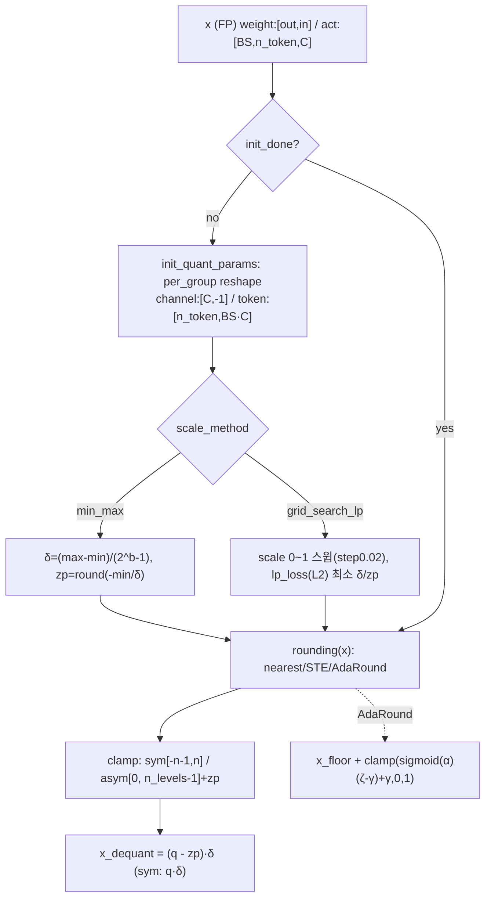
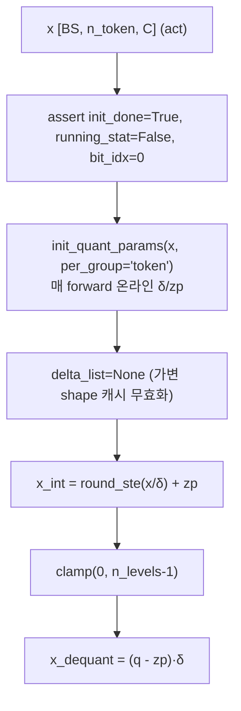
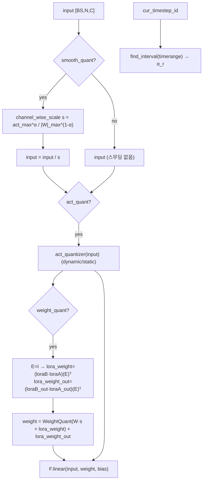
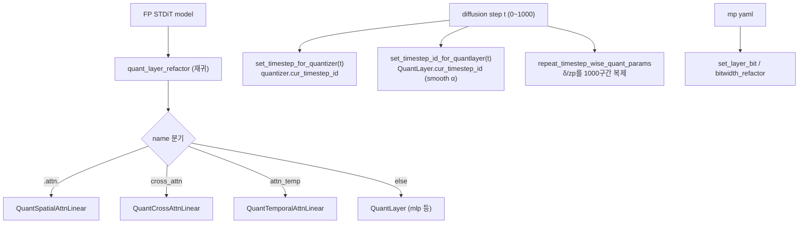
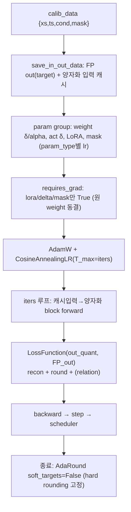
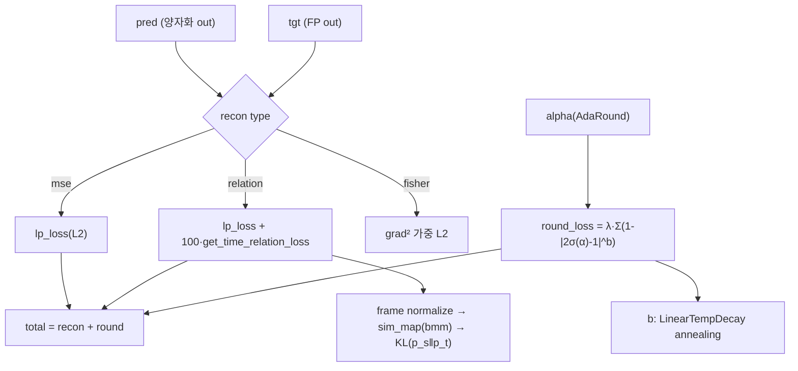

# Q-VDiT 모듈 통합 가이드 (S-PyTorch)

> 1차 요약: [`../Q-VDiT.md`](../Q-VDiT.md) — 본 문서는 그 요약을 모듈 단위로 심화한 통합 가이드다.
> 분석 대상: `\\wsl.localhost\ubuntu-24.04\home\user\project\PRJXR-HBTXR\REF\ViT-Quantization\Q-VDiT`
> 작성 원칙: 실제 소스 Read 후 `파일:라인` 근거 표기. 라인 근거 없는 추론은 "추정", 코드로 확인 불가는 "확인 불가"로 명시.
> 형제 HW 가이드(`REF/Analysis/ViT-Quantization/I-ViT/MODULE_GUIDE.md`)의 6요소 구조를 따르되, HW 지표는 **S-PyTorch 수치 규약**(params/FLOPs/activation memory/비트폭/observer/token·temporal 보정/calibration)으로 치환한다.
> I-ViT가 **integer-only QAT(ImageNet 분류)** 인 반면, Q-VDiT는 **PTQ + 증류(BRECQ류) 기반 video DiT 양자화**다. 두 repo의 양자화 철학 차이는 N+3절 말미 "I-ViT/Q-DiT 대비 차이"에 정리.

---

## 0. 문서 머리말

### 0.1 대표 케이스 선정
- **대표 모델: OpenSora v1.0 `STDiT-XL/2` (Spatio-Temporal DiT)** — `hidden_size=1152, depth=28, num_heads=16, mlp_ratio=4.0, in_channels=4, patch_size=(1,2,2)` (`t2v/opensora/models/stdit/stdit.py:139-142,137-138`; config `t2v/configs/quant/opensora/16x512x512.py:7`). 근거:
  1. README가 OpenSora STDiT 양자화를 메인 타깃으로 명시하고 quant config(`16x512x512.py`)의 `model.type="STDiT-XL/2"`(`:7`)가 공식 대표 케이스.
  2. 양자화 레이어 분기(`quant_model.py:76-94`)가 `opensora`(STDiT)와 `pixart`(이미지 DiT)를 구분하며, **STDiT 경로**(`QuantSpatial/Temporal/CrossAttnLinear`)가 video DiT 보정의 핵심이라 분석 가치 최대.
- **대표 입력 텐서 형상 (16×512×512, 16프레임)**: latent `[B,C=4,T=16,H=64,W=64]` → PatchEmbed3D(patch (1,2,2)) → `num_temporal d_t=16`, `num_spatial d_s=1024`(=32×32), `num_patches=16384`, token 시퀀스 `[B, T·S=16384, C=1152]` (`stdit.py:165-168,251-254`). text prompt `model_max_length=n_prompt=120` (`16x512x512.py:24`, `stdit.py:148`).
- **대표 분석 단위: STDiTBlock 1개** = `norm1 → spatial-attn(attn) → +gate_msa residual → temporal-attn(attn_temp) → +residual → cross_attn → +residual → norm2 → mlp → +gate_mlp residual` (`stdit.py:97-129`). STDiT-XL/2는 이 Block을 **28개 적층**(`stdit.py:140,194-211`).
- **대표 양자화 기법 3종**: ① **token-aware per-token dynamic act quant**(`dynamic_quantizer.py:11-45`), ② **timestep-aware smooth-quant**(구간별 채널 스케일, `quant_layer.py:116-148`), ③ **learnable LoRA codebook + temporal mask 보정**(`quant_layer.py:55-64,182-197`; `stdit_quant_layer.py:130-131,227-230`). 모두 BRECQ류 block reconstruction으로 학습(`block_recon.py`).

### 0.2 S-PyTorch 수치 규약 (HW의 MAC lanes/scalar MACs 대체)
- **params**: 모듈 차원에서 분석적 계산. Linear `in·out (+out bias)`. STDiT-XL/2: hidden C=1152, mlp_hidden=4C=4608, heads=16, head_dim=72(=1152/16). 양자화로 **원 weight params 개수는 불변**(fake-quant, FP weight 유지) — 단 Q-VDiT는 양자화기마다 **LoRA 보정항(loraA/B rank=32 + loraA_out/B_out rank=1) + δ/zp/alpha 버퍼**가 추가 학습 파라미터로 붙음(`quant_layer.py:55-64`). 이것이 I-ViT(추가 파라미터 0) 대비 결정적 차이.
- **FLOPs/MACs**: 표준식×config. Linear MAC = `B·N·in·out`. STDiT 1 Block의 Linear(qkv·proj×2 attn + qkv·proj cross + fc1·fc2 mlp)를 STDiT-XL/2(B=1, spatial N=1024, temporal N=16, C=1152)로 산출 후 28 block 환원. **추론 시 LoRA 보정은 weight에 fold 가능**(`W_q = Quant(W·s + W_lora) + W_lora_out`, `quant_layer.py:194-197`)하므로 추가 MAC 없음(추정).
- **activation memory**: 텐서 shape × 비트폭. Q-VDiT는 fake-quant(출력 `(q-zp)·δ`=float, `base_quantizer.py:161`)라 실제 메모리는 FP16/FP32지만, **정수 도메인 비트폭**(W/A bits)을 "HW 환산 activation bit"로 표기 — `shape × A_bit`.
- **비트폭/observer**: 코드+config 직접. 대표 W4A8(weight 4bit per-channel grid_search_lp, act 8bit per-token dynamic, `base_quantizer.py:235-281`; quant yaml). observer: weight는 init 1회(또는 grid search), act는 **dynamic이면 매 forward 온라인**(`dynamic_quantizer.py:22`), static이면 running_stat EMA(momentum 0.95, `base_quantizer.py:47,226-227`). softmax용 `always_zero`(zp=0) 옵션(`:48-49,247-248`).
- **token/temporal 보정**: per-group `'token'`(act를 `[n_token, BS·C]`로 reshape 후 토큰축 양자화, `base_quantizer.py:199-207`), temporal layer는 `mask[1,T,1]` 가중 LoRA-out(`stdit_quant_layer.py:227-230`).
- **calibration**: PTQ. diffusion sampling 궤적에서 timestep subsample → calib data(xs/ts/cond/mask) → block reconstruction으로 δ·alpha·LoRA·mask 최적화(`utils.py:get_quant_calib_data`, `block_recon.py`). I-ViT의 ImageNet QAT(수십 epoch)와 대비.
- **정확도/속도**: README/논문 인용. 코드상 정량 미제시(README는 `imgs/result.png` 이미지로만 제시) → 수치는 **확인 불가**(0.4절).

### 0.3 운영 경로 (FP 추론 → calib → 양자화 재구성 → 양자화 추론)
```
[QKV 분리] split_ckpt.py: OpenSora merged-QKV Linear → 3개 분리(양자화 단위화)  (README.md:62-67)
   ▼
[FP16 기준 영상] fp16_inference.sh: STDiT FP 추론으로 기준 영상 생성             (README.md:71-84)
   ▼
[calib data 수집] get_calib_data.py: FP sampling 궤적에서 timestep별 활성 저장
   │  get_quant_calib_data: xs/ts/cond/mask subsample                          (utils.py:17-63)
   ▼
[Calibration = 양자화 + 재구성] calib.py:
   │  QuantModel(FP model) → quant_layer_refactor(이름기반 분기)                (quant_model.py:63-103)
   │  weight init(grid_search_lp/min_max) + act init                           (base_quantizer.py:168-325)
   │  block_reconstruction: AdamW+CosineLR로 δ·alpha(AdaRound)·LoRA·mask 학습   (block_recon.py:35-372)
   │  Q_CFG(yaml) + MP weight/act + --part_fp(소수 레이어 FP)                   (README.md:103-131)
   ▼
[양자화 영상 추론] quant_txt2video.py: 양자화 ckpt로 영상 생성                   (README.md:133-156)
   ▼
[(외부) VBench 등 평가] 코드 미포함 → 확인 불가
```
- 타깃 디바이스: **CUDA GPU 전제** — `QuantModel`이 `torch.device("cuda")`(`quant_model.py:41`), 다수 텐서 `.cuda()`/`.to(input.device)`. CPU 실행 가능 여부는 확인 불가(미실행).
- diffusion: iddpm scheduler, `num_sampling_steps=100`, `cfg_scale=4.0`(`16x512x512.py:26-29`). 별도 `_20steps` config도 존재(Glob 확인).

### 0.4 모델 / 데이터셋 / 정확도 (README 인용)
| 항목 | 값 | 근거 |
|---|---|---|
| 백본 | OpenSora v1.0 STDiT-XL/2 (hidden 1152, depth 28, heads 16) | `stdit.py:139-142` |
| 보조 | VAE(VideoAutoencoderKL), Text=T5(max_len 120) | `16x512x512.py:14-25` |
| 해상도/프레임 | 16프레임 × 512×512 (대표), 16×256×256 등 | configs glob |
| 비트 설정 | W4A8 / W6A6 / W8A8 / W3A8(viditq 비교군) | quant config(`base_quantizer.py:29` n_bits) |
| 데이터셋 | OpenSora 예제 프롬프트(t2v_samples) + 사전계산 text_embeds | `16x512x512.py:36`, README.md:74 |
| 정확도(VBench 등) | **확인 불가** — README는 이미지(`imgs/result.png`)로만 제시, 코드/텍스트 정량 없음 | README.md |
- 논문: *Q-VDiT: Towards Accurate Quantization and Distillation of Video-Generation Diffusion Transformers* (ICML 2025, arXiv:2505.22167) (`README.md:1-3`). VBench/FVD 등 정량 지표는 **본 repo 코드·README 텍스트에 미수록 → 확인 불가**.

---

## 1. Repo / Layer 개요

Q-VDiT = **video diffusion transformer(OpenSora STDiT)** 를 W4A8 등 저비트로 **PTQ**하되, **AdaRound(learned rounding) + LoRA codebook + timestep-aware smooth-quant + token-aware dynamic act quant + temporal relation 증류**를 block reconstruction(BRECQ류)으로 결합해 품질을 복원하는 프레임워크(`README.md:1-12`). 양자화 엔진은 `qdiff/`(Q-Diffusion/BRECQ 계열), 백본은 open-sora v1.0 + ViDiT-Q 기반(`README.md:166`).

### 1.1 자체 소스 vs 외부 프레임워크 vs 제외

| 구분 | 파일(자체 소스) | 역할 |
|---|---|---|
| **양자화기 기반** | `qdiff/quantizer/base_quantizer.py` ★핵심 | Base/Weight/ActQuantizer, rounding(AdaRound 포함), init(min_max/grid_search_lp), lp_loss |
| | `qdiff/quantizer/dynamic_quantizer.py` ★핵심 | DynamicActQuantizer(online per-token 양자화, 클리핑에러 0) |
| **양자화 레이어** | `qdiff/models/quant_layer.py` ★핵심 | QuantLayer (LoRA codebook + timestep smooth_quant) |
| | `qdiff/models/stdit_quant_layer.py` ★핵심 | STDiT Spatial/Temporal/CrossAttn Linear (token reshape + temporal mask) |
| | `qdiff/models/dit_quant_layer.py` | PixArt(이미지 DiT) AttnLinearImg/CrossAttnLinearImg |
| | `qdiff/models/quant_block.py` | diffusers BasicTransformerBlock 래핑(opensora는 미사용) |
| **모델 래핑** | `qdiff/models/quant_model.py` ★핵심 | QuantModel(레이어 refactor, timestep 제어, mixed-precision) |
| **재구성(증류)** | `qdiff/optimization/block_recon.py` ★핵심 | block reconstruction(BRECQ류, δ·alpha·LoRA·mask opt) |
| | `qdiff/optimization/layer_recon.py` | 레이어 단위 재구성 |
| | `qdiff/optimization/model_recon.py` | block_recon 호출 래퍼 |
| **손실/calib** | `qdiff/utils.py` ★핵심 | LossFunction(recon+round+relation), get_time_relation_loss, calib data, save_in_out_data |
| **백본** | `t2v/opensora/models/stdit/stdit.py` | STDiT(STDiTBlock×28) 정의 |
| **설정** | `t2v/configs/quant/opensora/*.py` | 비트/iters/smooth/MP config (yaml 아님, .py dict) |

### 1.2 forward 진입점 (양자화 모델)
`QuantModel.__init__`(`quant_model.py:38-60`) → `quant_layer_refactor`(`:63-103`): FP STDiT의 모든 `nn.Linear`를 **이름 기반**으로 양자화 레이어로 치환 →
- `.attn.` → `QuantSpatialAttnLinear` (opensora) (`:78-81`)
- `cross_attn` → `QuantCrossAttnLinear` (`:85-88`)
- `attn_temp` → `QuantTemporalAttnLinear` (`:92-94`)
- 그 외(mlp.fc1/fc2, t_block 등) → `QuantLayer` (`:95-97`).

추론 forward는 STDiT 백본(`stdit.py:234`)을 그대로 사용하되, 치환된 Linear가 양자화 forward를 수행. timestep_wise면 매 step `set_timestep_*`로 양자화기에 timestep 주입(`quant_model.py:160-183`).

### 1.3 제외 (지시에 따라 이름만 표기, 미분석)
- **외부 프레임워크(커스텀 아님)**: `diffusers==0.24.0`, `transformers`, `einops`, `omegaconf`, `torch-fidelity`(평가), `timm.models.layers.DropPath`(`stdit.py:10`). OpenSora 본체 일부(VAE/T5/scheduler)는 양자화 대상 아님(STDiT만 양자화).
- **제외 디렉토리/파일**: `.git/`, `__pycache__/`, `assets/*.gif`(데모), `t2v/configs/latte`(외부 백본), `bak/`(레거시 config), opensora/diffusers/T5/VAE 원본(가중치·미커스텀).
- **미열람(확인 불가)**: `quant_layer_pixart.py`, `stdit_quant_layer_pixart.py`(PixArt-STDiT 변형 — STDiT/PixArt 동일 구조 재사용 추정), `t2v/shell_scripts/*`(README 인용만), VBench 평가 코드(repo 외).

### 1.4 대표 모델 레이어 구성 (STDiT-XL/2, 1 Block)
`STDiTBlock.forward`(`stdit.py:97-129`): spatial-attn(`attn`: q/k/v/proj Linear) → temporal-attn(`attn_temp`: q/k/v/proj) → cross-attn(`cross_attn`: q/kv/proj) → mlp(`fc1/fc2`). 양자화 시 attn→`QuantSpatialAttnLinear`, attn_temp→`QuantTemporalAttnLinear`, cross_attn→`QuantCrossAttnLinear`, mlp→`QuantLayer`. **softmax/QK·AV 행렬곱은 양자화 대상 아님**(레이어 단위 Linear만 치환, `quant_model.py:73,77`) → I-ViT와 결정적 차이.

---

## 2. 모듈: 양자화기 기반 — `base_quantizer.py` (BaseQuantizer) ★핵심

### 2.1 역할 + 상위/하위
- **역할**: FP 텐서를 **asymmetric uniform affine 양자화**(zp 포함)로 정수화. AdaRound(learned rounding), min_max/grid_search_lp scale init, per-channel/per-token group, timestep-wise·mixed-precision 버퍼, running_stat EMA를 모두 담당. backward는 STE.
- **상위**: `WeightQuantizer`/`ActQuantizer`(`:371-389`)가 상속, `QuantLayer`가 `weight_quantizer`/`act_quantizer`로 보유(`quant_layer.py:74-79`). **하위**: `round_ste`(`:400-404`), `lp_loss`(`:406-438`), `quantize`(grid search 내부, `:327-352`).

### 2.2 데이터플로우 (텐서 shape 흐름)


### 2.3 forward call stack
`QuantLayer.forward`(`quant_layer.py:174` act / `:194` weight) → `BaseQuantizer.forward`(`:122-166`) → (최초) `init_quant_params`(`:168-325`) → `rounding`(`:83-116`) → dequant(`:158-161`).

### 2.4 대표 코드 위치
`base_quantizer.py`: 설정 언팩 `:25-81`, `n_levels` `:51-52`, AdaRound 상수 `:78-81`, `rounding` `:83-116`, `forward` `:122-166`, `init_quant_params` `:168-325`(per_group `:190-207`, min_max `:235-250`, grid_search_lp `:252-281`, AdaRound α init `:287-296`), `quantize` `:327-352`, `bitwidth_refactor` `:355-364`, `lp_loss` `:406-438`.

### 2.5 대표 코드 블록

```python
# base_quantizer.py:235-250  min_max scale 산출 (asym/sym 분기)
if self.scale_method == 'min_max':
    x_absmax = torch.maximum(x_min.abs(), x_max.abs())
    if self.sym:                       delta = x_absmax / n_levels
    else:                              delta = (x_max - x_min) / (n_levels - 1)
    ...
    if self.always_zero or self.sym:   zero_point = torch.zeros_like(delta)   # softmax/sym: zp=0
    else:                              zero_point = torch.round(-x_min / delta)
```
→ **asymmetric**(zp≠0)이 기본이라 HW에서 zero-point 가산 필요 — I-ViT의 순수 대칭(zp=0)과 대비. softmax/대칭 경로만 `always_zero`로 zp=0.

```python
# base_quantizer.py:252-269  grid_search_lp: scale 스윕으로 L2 최소 δ/zp (outlier 강건)
range_scaling = torch.arange(0, 1, 0.02)            # 50 step
scaled_max = x_max.unsqueeze(0) * range_scaling.unsqueeze(-1)
for i in range(0, x.shape[0]):                       # per-channel(행별) 독립 탐색
    x_q = self.quantize(x_ranged[:, i, :], scaled_max[:, i], scaled_min[:, i], n_bits, n_batch=50)
    min_idx = torch.argmin(lp_loss(x_ranged[:, i, :], x_q, p=2., reduction='none', n_batch=50))
    delta[i] = (scaled_max[min_idx, i] - scaled_min[min_idx, i]) / (2 ** n_bits - 1)
```
→ weight 양자화 scale을 0~1×max 그리드(50점)로 스윕, **L2 재구성손실 최소 scale 선택** → outlier를 잘라 W4 정확도 확보. FPGA용 weight scale 결정에 직접 차용 가능.

```python
# base_quantizer.py:95-105  AdaRound(learned_hard_sigmoid): 학습형 rounding
x_floor = torch.floor(x / self.delta)
if self.soft_targets:                                # 학습 단계
    soft_targets = torch.clamp(torch.sigmoid(self.alpha) * (self.zeta - self.gamma) + self.gamma, 0, 1)
    x_int = x_floor + soft_targets                   # round를 [0,1) 연속값으로 학습
else:                                                # 추론(hard)
    x_int = x_floor + (self.alpha >= 0).float()
```
→ `α`를 학습해 올림/내림 방향을 결정(BRECQ/AdaRound). `gamma=-0.1, zeta=1.1`(`:80`)로 stretched sigmoid. 학습 종료 시 `soft_targets=False`로 hard rounding 고정(`block_recon.py:363-366`).

### 2.6 연산·수치표현 분해 + 정량
- **양자화 방식**: asymmetric uniform affine(기본). `n_levels=2^b`(asym) / `2^(b-1)-1`(sym) (`:51-52`). per-group `channel`/`token`/tensor-wise.
- **scale/zp**: `δ=(max-min)/(2^b-1)`, `zp=round(-min/δ)` (`:241,250`). grid search면 L2 최소 scale.
- **비트폭**: config n_bits(W4/W6/W8, A6/A8). mixed_precision 리스트(`[4,6,8]`)면 비트별 init(`:125-130`), `bitwidth_refactor`로 레이어별 변경(`:355-364`). 2≤b≤16 강제(`:129,356`).
- **observer**: weight init 1회 또는 grid search; act는 dynamic(online) 또는 running_stat EMA(momentum 0.95, `:47,226-227`).
- **params**: 양자화기 자체 학습 파라미터 = `alpha`(AdaRound, weight와 동일 shape) + `delta`/`zero_point` 버퍼. AdaRound면 weight당 원소수만큼 α(예: STDiT mlp.fc1 weight 1152×4608≈5.3M개 α/레이어, learned_hard_sigmoid 시).
- **FLOPs**: 양자화 O(N) div+round+clamp. grid_search_lp는 **50×채널수×원소 = O(50·N)** (init 1회, calib 비용 요인). dynamic act는 매 forward init(아래 3장).

---

## 3. 모듈: 동적 활성 양자화 — `dynamic_quantizer.py` (DynamicActQuantizer) ★핵심·token-aware

### 3.1 역할 + 상위/하위
- **역할**: **매 forward마다 입력으로부터 δ/zp를 온라인 계산**(per-token min-max) → 클리핑 에러 0. text_embed 등 가변 shape 입력 대응. Q-VDiT의 token-aware act 양자화 핵심.
- **상위**: `QuantLayer`가 `act_quant_params.dynamic=True`면 이 클래스를 act_quantizer로 선택(`quant_layer.py:76-77`). **하위**: `ActQuantizer`(=BaseQuantizer) `init_quant_params`(`base_quantizer.py:168`), `round_ste`.

### 3.2 데이터플로우 (텐서 shape 흐름)


### 3.3 forward call stack
`QuantLayer.forward`(`quant_layer.py:174`) → `DynamicActQuantizer.forward`(`dynamic_quantizer.py:16-45`) → `init_quant_params`(`base_quantizer.py:168`, per_group='token' `:199-207`) → `round_ste`(`:36`).

### 3.4 대표 코드 위치
`dynamic_quantizer.py`: 클래스 `:11-45`, assert(online 전제) `:17-19`, online init `:22`, 캐시 무효화 `:28-29`, 양자화 `:36-42`.

### 3.5 대표 코드 블록
```python
# dynamic_quantizer.py:16-42  매 forward 온라인 per-token 양자화 (클리핑 에러 0)
def forward(self, x):
    assert self.init_done is True            # init 단계 없음
    assert self.running_stat is False        # EMA 미사용 (online)
    self.init_quant_params(x, self.per_group, momentum=self.running_stat)  # per_group='token'
    self.delta_list = None; self.zero_point_list = None   # text_embed 가변 shape 대응
    x_int = round_ste(x / self.delta) + self.zero_point
    x_quant = torch.clamp(x_int, 0, self.n_levels - 1)
    x_dequant = (x_quant - self.zero_point) * self.delta
    return x_dequant
```
→ **per-token**(`base_quantizer.py:199-207`: `x.permute([1,0,2]).reshape([n_token, BS·C])`)이라 토큰축마다 독립 δ/zp. 동적이라 추론 시 매번 min/max 계산 필요 → 정수 전용 HW 직접 매핑 어려움(N+3 한계).

### 3.6 연산·수치표현 분해 + 정량
- **양자화 방식**: asymmetric uniform, per-token, **online**(매 forward). zp 포함.
- **observer**: 없음(매번 재계산). `running_stat=False`, `bit_idx=0` 강제(mixed-precision/timestep-wise 미적용, `:18-19`).
- **비트폭**: A8 기본(W4A8 config). per_group='token'(`base_quantizer.py:206`).
- **params**: 0(버퍼 δ/zp는 매 forward 갱신, 영구 학습 파라미터 아님).
- **FLOPs**: 매 forward min/max reduce O(N) + div+round+clamp O(N). 토큰 N=16384(spatial)이면 토큰축 reduce 비용 큼 → calib·추론 양쪽 오버헤드.
- **시사**: 클리핑 에러 0(분포 적응)으로 정확도 유리하나 **온라인 scale 계산이 HW 비친화**. 오프라인 static per-tensor로 단순화 시 정확도-효율 트레이드오프(추정).

---

## 4. 모듈: 양자화 레이어 + LoRA codebook + smooth-quant — `quant_layer.py` (QuantLayer) ★핵심

### 4.1 역할 + 상위/하위
- **역할**: nn.Linear/Conv를 래핑. ① **timestep-aware smooth-quant**(구간별 채널 스케일로 outlier 흡수), ② **LoRA codebook**(loraA/B rank32 weight 보정 + loraA_out/B_out rank1 출력 보정)을 양자화에 합산, ③ act/weight 양자화 on/off. Q-VDiT 보정의 본체.
- **상위**: `QuantModel.quant_layer_refactor`가 mlp/기타 Linear에 적용(`quant_model.py:95-97`), STDiT 어텐션 3종이 이 클래스를 상속(`stdit_quant_layer.py:14,126,239`). **하위**: `WeightQuantizer`/`ActQuantizer`/`DynamicActQuantizer`(`:74-79`), `find_interval`(timerange→idx, `:16-20`).

### 4.2 데이터플로우 (텐서 shape 흐름, smooth+LoRA+weight quant)


### 4.3 forward call stack
`QuantLayer.forward`(`:107-219`) → smooth scale 산출(`:116-148`) → `input/s`(`:148`) → `act_quantizer(input)`(`:174`) → LoRA 추출(`:182-187`) → `weight_quantizer(W·s + lora_weight)`(`:194`) → `+ lora_weight_out`(`:197`) → `F.linear`(`:211`).

### 4.4 대표 코드 위치
`quant_layer.py`: LoRA 정의 `:55-64`(loraB/loraB_out 0초기화 `:62-64`), 양자화기 선택 `:73-79`, smooth_quant 설정 `:87-105`, smooth scale `:116-148`, act quant `:166-174`, LoRA+weight quant `:176-197`, `set_quant_state` `:221-223`, `set_split` `:228-232`.

### 4.5 대표 코드 블록

```python
# quant_layer.py:124-148  timestep-aware smooth-quant 채널 스케일
cur_timerange_id = find_interval(self.timerange, self.cur_timestep_id)
alpha = self.smooth_quant_alpha[cur_timerange_id]      # 구간별 α
if self.channel_wise_scale_type == "dynamic":
    channel_wise_scale = input.abs().max(dim=-2)[0].pow(alpha).mean(dim=0, keepdim=True) \
                         / self.weight.abs().max(dim=0)[0].pow(1 - alpha)
elif "momentum" in self.channel_wise_scale_type:       # act_max를 momentum EMA로 추정
    channel_wise_scale = self.act_quantizer.act_scale[cur_timerange_id].pow(alpha) \
                         / self.weight.abs().max(dim=0)[0].pow(1 - alpha)
input = input / channel_wise_scale                     # outlier를 weight로 이동
```
→ `s_c = act_max_c^α / |W|_max,c^(1-α)`. timestep 구간 r마다 α_r 다름 → **timestep-aware**. `input/s`, `W·s`로 수학적 등가 유지(outlier 이동).

```python
# quant_layer.py:182-197  LoRA codebook 보정 + 양자화 (smooth면 timestep-wise weight quant)
E = torch.eye(self.weight.shape[1], device=input.device)
lora_weight = self.loraB(self.loraA(E)).T              # rank=32 weight 보정
lora_weight_out = self.loraB_out(self.loraA_out(E_out)).T   # rank=1 출력 보정
if self.smooth_quant:
    if self.weight_quantizer.timestep_wise is None:    # 구간별 weight quantizer 활성화
        self.weight_quantizer.timestep_wise = True
        self.weight_quantizer.n_timestep = len(self.timerange)
    self.weight_quantizer.cur_timestep_id = cur_timerange_id
    weight = self.weight_quantizer(self.weight * channel_wise_scale + lora_weight)
else:
    weight = self.weight_quantizer(self.weight + lora_weight)
weight = weight + lora_weight_out                      # 양자화 후 출력 보정 합산
```
→ **양자화 대상(W·s)에 LoRA 보정을 합산** 후 양자화 → 양자화 오차를 학습형 codebook으로 흡수. `lora_weight_out`은 양자화 밖에서 가산(양자화되지 않는 잔차 보정). loraB/loraB_out 0초기화(`:62-64`)라 초기엔 항등.

### 4.6 연산·수치표현 분해 + 정량 (STDiT-XL/2, C=1152)
- **양자화 방식**: weight per-channel asym(또는 grid_search_lp), act dynamic/static per-token. smooth-quant로 채널 스케일 fold.
- **비트폭**: W4/A8 대표(config). smooth 시 weight quantizer가 timestep_wise(구간별 δ/zp).
- **params (LoRA codebook, 레이어당)**: loraA `in·32` + loraB `32·out` + loraA_out `in·1` + loraB_out `1·out`. 예: mlp.fc1(in=1152,out=4608): loraA=36,864 + loraB=147,456 + loraA_out=1,152 + loraB_out=4,608 = **190,080** 추가 학습 파라미터/레이어. (원 weight 1152×4608=5.31M은 동결.)
- **MACs (추론, fold 후)**: 표준 Linear와 동일 — `B·N·in·out`(LoRA·smooth는 weight에 fold, 추가 MAC 없음, 추정). 학습 시엔 `loraB(loraA(E))` (E는 in×in 항등) = in×32×out 추가 계산.
- **시사**: smooth scale·LoRA를 **오프라인 fold하면 추론 비용 0**으로 정확도 복원 → FPGA용 ViT weight 준비 단계에 유용(추정). 단 dynamic act는 fold 불가(온라인).

---

## 5. 모듈: STDiT 어텐션 Linear (token/temporal 보정) — `stdit_quant_layer.py` ★핵심·video DiT 정밀해부

### 5.1 역할 + 상위/하위
- **역할**: OpenSora STDiT의 **공간/시간/교차 어텐션** Linear을 각 어텐션의 토큰 레이아웃에 맞춰 reshape 후 per-token 양자화. QuantLayer(LoRA+smooth) 상속. **Temporal은 프레임별 mask 가중 LoRA-out** 추가 → Q-VDiT의 **temporal 보정 핵심**.
- **상위**: `QuantModel.quant_layer_refactor`가 이름 기반 치환(`quant_model.py:78-94`). **하위**: `QuantLayer`(`stdit_quant_layer.py:14,126,239`), `find_interval`.

### 5.2 세 클래스 토큰 reshape 정밀 비교
| 클래스 | 입력 shape | act 양자화 reshape | 복원 | 특이사항 | 라인 |
|---|---|---|---|---|---|
| `QuantSpatialAttnLinear` | `[BS·T, S, C]` (S=spatial token) | `[BS, T·S, C]` | `[BS·T, S, C]` | spatial attn | `:25-29,76-82` |
| `QuantTemporalAttnLinear` | `[BS·S, T, C]` (T=temporal token) | `[BS, S·T, C]` | `[BS·S, T, C]` | **mask[1,T,1] 가중 LoRA-out** | `:135-139,186-191,227-230` |
| `QuantCrossAttnLinear` | Q `[BS, T·S, C]` / KV `[1, BS·n_prompt, C]` | Q: 그대로 / KV: `[BS, n_prompt, C]` | KV: `[1, BS·n_prompt, C]` | prompt(120) 단위, dynamic 분기 | `:250-262,312-328` |

### 5.3 forward call stack (Temporal)
`STDiT attn_temp` → `QuantTemporalAttnLinear.forward`(`:133-237`) → BS/T/S 산출(`:135-139`) → smooth scale(`:141-184`) → reshape `[BS,S·T,C]`→act_quant→복원(`:186-191`) → LoRA+weight quant(`:193-221`) → `F.linear`(`:226`) → **LoRA-out 마스크 가중 합산**(`:227-230`).

### 5.4 대표 코드 위치
`stdit_quant_layer.py`: Spatial `:14-124`(reshape `:78-82`), Temporal `:126-237`(mask 정의 `:130-131`, reshape `:188-191`, **mask LoRA-out** `:227-230`), Cross `:239-370`(Q/KV 분기 `:254-262`, KV reshape `:316-328`).

### 5.5 대표 코드 블록

```python
# stdit_quant_layer.py:130-131  Temporal: 프레임축 학습형 mask
T = self.act_quant_params['n_temporal_token']
self.mask = nn.Parameter(torch.ones([1, T, 1]))      # 프레임(T)별 보정 강도 (학습)
```

```python
# stdit_quant_layer.py:186-191  Temporal act 양자화: 시간축 토큰 reshape
input = input.reshape([BS, S*T, C])                  # [BS·S, T, C] → [BS, S·T, C]
input = self.act_quantizer(input)                    # per-token 양자화
input = input.reshape([BS*S, T, C])                  # 복원
```

```python
# stdit_quant_layer.py:226-230  Temporal 출력 보정: LoRA-out를 프레임 mask로 가중
out = self.fwd_func(input, weight, bias, **self.fwd_kwargs)
if self.weight_quant:
    out_lora = self.fwd_func(input, lora_weight_out, **self.fwd_kwargs)
    out_lora = out_lora * self.mask                  # 프레임별 보정 강도
    out = out + out_lora                             # 시간 일관성 보정
```
→ **Q-VDiT의 temporal-aware 보정 핵심**: 프레임축 mask로 시간 프레임별 LoRA 출력 보정 강도를 학습. Spatial/Cross는 mask 없이 LoRA를 weight에 fold(`:104`)하지만, Temporal만 출력단에서 분리 가산(mask 곱 때문).

```python
# stdit_quant_layer.py:316-328  Cross-Attn KV: dynamic 여부로 reshape 분기
elif layer_type == 'kv':
    if not self.act_quant_params.get('dynamic', False):
        if self.act_quant_params.per_group is False:   # tensor-wise: reshape 불필요
            input = self.act_quantizer(input)
        else:                                          # per-token: prompt 단위 reshape
            input = input.reshape([BS, n_prompt, C])
            input = self.act_quantizer(input)
            input = input.reshape([1, BS*n_prompt, C])
    else:                                              # dynamic: 토큰별 직접
        input = self.act_quantizer(input)
```
→ KV는 prompt 토큰(n_prompt=120) 단위 양자화. static per-token이면 `[BS, n_prompt, C]`로 reshape, dynamic이면 그대로.

### 5.6 연산·수치표현 분해 + 정량 (STDiT-XL/2, 16×512×512: d_t=16, d_s=1024, C=1152, n_prompt=120)
- **양자화 방식**: 세 어텐션 모두 LoRA codebook + smooth-quant + per-token act. Temporal만 mask 가중 LoRA-out.
- **토큰 수 정량**: spatial attn 토큰 S=1024, temporal attn 토큰 T=16, cross-attn Q 토큰 T·S=16384, KV prompt 120 (`stdit.py:165-168`, `16x512x512.py:24`).
- **params (어텐션 Linear/Block, separate-qkv)**: hidden C=1152, heads=16. attn q·k·v 각 1152×1152 + proj 1152×1152 = 4×1.327M ≈ **5.31M**. cross_attn(q 1152×1152, kv 1152×2304, proj 1152×1152) ≈ 5.31M. attn_temp ≈ 5.31M. + 각 레이어 LoRA 보정(§4.6, ~약 19만/레이어). Temporal mask = T=16 파라미터/temporal-Linear.
- **MACs (1 Block, fold 후 추정)**: spatial attn qkv `1024×1152×3456`(per BS·T=16) ≈ 큰 항, temporal attn `16×1152×3456`, cross Q `16384×1152×1152`. attn N²(softmax/AV)은 **양자화 미대상**이라 별도(FP/비양자 경로). 정확 총합은 토큰 곱이 커 생략, **spatial·cross-attn Linear가 MAC 지배**(N=1024/16384).
- **activation memory (16프레임, A8)**: spatial attn 입력 `[BS·16, 1024, 1152]`, cross-attn Q `[BS, 16384, 1152]` A8 ≈ BS·16384·1152 byte ≈ **18.9 MB/BS** — video라 토큰 수가 ViT 대비 수십~수백 배(N=16384 vs ViT 197). FPGA on-chip 압박 지배 요인.

---

## 6. 모듈: PixArt 이미지 DiT Linear — `dit_quant_layer.py`

### 6.1 역할 + 상위/하위
- **역할**: PixArt(이미지 단일프레임 DiT)용 self-attn/cross-attn Linear. STDiT 대비 **시간축 없음**(token reshape 단순, temporal mask 없음).
- **상위**: `QuantModel.quant_layer_refactor`가 `model_type=='pixart'`일 때 치환(`quant_model.py:82-91`). **하위**: `QuantLayer` 상속.

### 6.2 대표 코드 위치
`dit_quant_layer.py`: `QuantAttnLinearImg` `:9-32`(단순 act_quant→weight_quant→linear), `QuantCrossAttnLinearImg` `:34-79`(Q/KV 분기 `:43-49`, KV prompt reshape `:58-64`).

### 6.3 연산·수치표현 분해 + 정량
- **양자화 방식**: STDiT와 동일 QuantLayer 골격이나 reshape 없음(이미지 단일프레임). LoRA codebook 상속(forward에서 weight_quantizer는 단순 `weight_quantizer(self.weight)` 호출 `:20,67` — smooth/LoRA 합산은 부모 미사용, 확인: 본 forward는 `self.weight_quantizer(self.weight)`만 — LoRA 미적용 경로).
- **주의**: `QuantAttnLinearImg.forward`(`:14-32`)는 `self.org_weight`/`self.org_bias` 참조(`:23-24`)인데 `QuantLayer`는 `self.weight`/`self.bias`만 정의(`quant_layer.py:48-52`) → **FP 경로(weight_quant=False)에서 AttributeError 가능성**(코드 불일치, 추정 — 실행 미검증, 확인 불가).
- **시사**: 본 프로젝트(video) 타깃 아님. STDiT 대비 단순화 참조용.

---

## 7. 모듈: 모델 래핑 + timestep/MP 제어 — `quant_model.py` (QuantModel) ★핵심

### 7.1 역할 + 상위/하위
- **역할**: FP STDiT를 받아 Linear를 양자화 레이어로 재귀 치환(이름 기반), timestep을 양자화기/레이어에 주입, mixed-precision 비트 적용, fp_layer_list FP 유지, LoRA/δ/zp 직렬화.
- **상위**: `calib.py`/추론 스크립트가 생성. **하위**: `QuantSpatial/Temporal/CrossAttnLinear`, `QuantLayer`, `BaseQuantizer`.

### 7.2 데이터플로우 (refactor + timestep 제어)


### 7.3 forward call stack
`QuantModel.__init__`(`:38-60`) → `quant_layer_refactor`(`:63-103`). 추론: scheduler가 매 step `set_timestep_for_quantizer`(`:160-168`)+`set_timestep_id_for_quantlayer`(`:171-183`) → STDiT backbone forward.

### 7.4 대표 코드 위치
`quant_model.py`: refactor `:63-103`(이름 분기 `:78-97`), `set_quant_state`(fp_layer 보호) `:130-141`, `set_timestep_for_quantizer` `:160-168`, `set_timestep_id_for_quantlayer` `:171-183`, `repeat_timestep_wise_quant_params` `:186-199`, `set_quant_init_done` `:203-219`, `get_quant_params_dict`(LoRA/mask 직렬화) `:222-247`.

### 7.5 대표 코드 블록
```python
# quant_model.py:78-97  이름 기반 양자화 레이어 분기 (STDiT 어텐션 구분)
if '.attn.' in full_name:        # spatial attention
    setattr(module, name, QuantSpatialAttnLinear(child_module, w_params, a_params))
elif 'cross_attn' in full_name:  # text cross attention
    setattr(module, name, QuantCrossAttnLinear(child_module, w_params, a_params))
elif 'attn_temp' in full_name:   # temporal attention
    setattr(module, name, QuantTemporalAttnLinear(child_module, w_params, a_params))
else:                            # mlp, t_block 등
    setattr(module, name, QuantLayer(child_module, w_params, a_params))
```
```python
# quant_model.py:186-199  timestep-wise δ/zp를 1000 step으로 복제
choose_idx = torch.unique(ts)                        # calib에서 본 timestep
assert 1000 % len(choose_idx) == 0
module_.delta_list = torch.repeat_interleave(
    module_.delta_list[:, choose_idx, :], 1000 // len(choose_idx), dim=1)
```
→ calib 시 subsample한 timestep의 δ/zp를 전체 1000 step으로 보간(복제). timestep-aware 양자화의 메모리/적용 메커니즘.

### 7.6 연산·수치표현 분해 + 정량
- **양자화 방식**: 레이어 단위 치환(블록 단위 아님 — `quant_block_refactor` 주석 처리 `:106-127`). opensora는 Linear만(`:77`).
- **mixed-precision**: `set_layer_bit`/`load_bitwidth_config`(`:529-622`, 본 발췌 외 — 1차 요약 근거)로 레이어별 비트(예: attn 4bit, mlp 8bit).
- **params 직렬화**: QuantLayer는 loraA/B/out, QuantTemporal은 +mask까지 저장(`:235-247`).
- **시사**: 이름 규칙(attn/cross_attn/attn_temp)이 토큰 레이아웃과 1:1 → HW에서 어텐션 종류별 다른 양자화 처리의 설계 기준.

---

## 8. 모듈: Block Reconstruction (BRECQ류 증류) — `block_recon.py` ★핵심·calibration

### 8.1 역할 + 상위/하위
- **역할**: 블록 단위로 **양자화 출력이 FP 출력을 재현**하도록 δ·alpha(AdaRound)·LoRA·mask를 학습(원 weight 동결). I-ViT의 ImageNet QAT를 대체하는 **PTQ + 블록 증류**.
- **상위**: `model_recon.py`/`calib.py`. **하위**: `save_in_out_data`(calib 입출력, `utils.py`), `LossFunction`, AdamW+CosineLR.

### 8.2 데이터플로우


### 8.3 forward call stack
`block_reconstruction`(`:35-372`) → `save_in_out_data`(`:65-73`) → param group 구성(`:98-190`) → AdamW(`:194`)+scheduler(`:203`) → `LossFunction`(`:218`) → grad checkpoint(`:247-248`) → iters 루프(`:250-`) → hard rounding(`:363-366`, 1차 요약 근거).

### 8.4 대표 코드 위치
`block_recon.py`: 시그니처 `:35`, calib io `:62-73`, weight param group(δ/alpha) `:100-151`, act param group `:152-166`, **LoRA/mask param group** `:167-188`, optimizer `:192-203`, loss config `:206-218`, **requires_grad(lora/delta/mask만)** `:237-242`, grad checkpoint `:247-248`.

### 8.5 대표 코드 블록
```python
# block_recon.py:178-188  LoRA + (temporal)mask를 최적화 대상에 추가, lr=1e-5
if isinstance(layer_, QuantTemporalAttnLinear):
    params_ = [p for n, p in layer_.named_parameters()
               if ('lora' in n and 'minus' not in n) or 'mask' in n]   # temporal: mask 포함
else:
    params_ = [p for n, p in layer_.named_parameters()
               if ('lora' in n and 'minus' not in n)]
opt_params += [{'params': params_, 'lr': 1.e-5}]
```
```python
# block_recon.py:237-242  원 weight 동결, 양자화 step·LoRA·mask만 학습
for name, param in block.named_parameters():
    if ('lora' in name and 'minus' not in name) or 'delta' in name or 'mask' in name:
        param.requires_grad = True          # 학습형 codebook + 양자화 scale
    else:
        param.requires_grad = False         # 원 weight 동결
```
→ **PTQ 철학**: 원 weight는 고정, **양자화 격자(δ)·learnable rounding(alpha)·LoRA codebook·temporal mask만** 학습 → 적은 calib 데이터로 W4A8 품질 복원. I-ViT(전체 weight QAT) 대비 학습 파라미터·데이터 비용 작음(추정).

```python
# block_recon.py:247-248  27개 블록 grad checkpoint (메모리 절감)
for i in range(1, 27):
    set_grad_checkpoint(block.blocks[i])
```

### 8.6 연산·수치표현 분해 + 정량
- **최적화 대상**: weight δ/alpha, act δ, LoRA(loraA/B/out), temporal mask. 원 weight 동결.
- **optimizer**: AdamW + CosineAnnealingLR(T_max=iters, `:203`). LoRA lr=1e-5(`:187`), weight/act lr은 config.
- **iters**: W4A8 기준 weight recon ~10000 iter, act ~100(1차 요약 근거, quant config). round_loss는 0.9×iters에서 최소 annealing(`:214`).
- **손실**: `LossFunction`(recon + round + 옵션 relation, §10).
- **FLOPs**: iters × (블록 forward + backward). 28블록 × 수천 iter → **PTQ 비용 큼**(데이터-free 아님). grad checkpoint로 메모리 절감.

---

## 9. 모듈: 레이어/모델 재구성 — `layer_recon.py` + `model_recon.py`

### 9.1 역할 + 상위/하위
- **역할**: `layer_reconstruction`(`layer_recon.py:15-204`)은 block_recon의 단일 레이어 버전(weight/act/joint 그룹별 δ·alpha 최적화, lp_loss). `our_model_reconstruction`(`model_recon.py:17-27`)은 block_reconstruction 호출 래퍼.
- **상위**: `calib.py`. **하위**: `save_in_out_data`, `LossFunction`, `lp_loss`.

### 9.2 대표 코드 위치
`layer_recon.py`: 시그니처 `:15`, calib io 분기(opensora/pixart/sdxl/sd) `:44-59`, param group `:83-128`(1차 요약 근거), lp_loss 재구성 `:130-151`, hard rounding 종료 `:200-202`. `model_recon.py`: `:17-27`.

### 9.3 연산·수치표현 분해 + 정량
- **양자화 방식**: 블록 재구성과 동일(δ·alpha opt), 단일 레이어 단위라 메모리 작으나 블록간 상호작용 미포착.
- **calib io**: `save_in_out_data`로 이전 레이어 양자화(`previous_layer_quantized=True`) + 대상 FP target → BRECQ식 누적 재구성(`utils.py:606-618`, 1차 요약 근거).
- **시사**: block_recon이 메인 경로, layer_recon은 보조(확인: model_recon은 block 호출).

---

## 10. 모듈: 손실 + 시간 일관성 증류 + calib — `utils.py` ★핵심·temporal 보정

### 10.1 역할 + 상위/하위
- **역할**: 재구성 손실 = `reconstruction_loss + round_loss`. reconstruction은 mse/**relation**(시간 일관성)/fisher. **`get_time_relation_loss`** = 프레임축 정규화 후 frame-frame 유사도맵의 KL divergence → **temporal relation 증류**(Q-VDiT 비디오 특화). calib data 수집·레이어 입출력 hook도 담당.
- **상위**: `block_recon.py`/`layer_recon.py`. **하위**: `lp_loss`, `pair_wise_sim_map_speed`, `LinearTempDecay`.

### 10.2 데이터플로우 (LossFunction)


### 10.3 forward call stack
`block_reconstruction` 루프 → `LossFunction.__call__`(`utils.py:160-224`) → recon(`:174-192`, relation 시 `get_time_relation_loss` `:100-123`) → round_loss(`:197-211`) → `LinearTempDecay`(`:227-244`).

### 10.4 대표 코드 위치
`utils.py`: `get_time_relation_loss` `:100-123`, `LossFunction` `:127-224`(recon 분기 `:174-192`, relation `:177-183`, round_loss `:197-211`), `LinearTempDecay` `:227-244`. (calib/`save_in_out_data` `:17-63,268-663`은 1차 요약 근거.)

### 10.5 대표 코드 블록
```python
# utils.py:112-123  시간 일관성 증류: 프레임-프레임 유사도맵 KL divergence
b, c, t, h, w = pred.shape
pred = pred.reshape(b, t, -1); tgt = tgt.reshape(b, t, -1)
pred = F.normalize(pred, p=2, dim=2); tgt = F.normalize(tgt, p=2, dim=2)
s_sim_map = pair_wise_sim_map_speed(pred)            # 프레임간 유사도 (bmm)
t_sim_map = pair_wise_sim_map_speed(tgt)
p_s = F.log_softmax(s_sim_map, dim=1); p_t = F.softmax(t_sim_map, dim=1)
sim_dis = F.kl_div(p_s, p_t, reduction='mean')       # FP의 프레임 관계를 양자화가 모사
return sim_dis
```
→ **Q-VDiT temporal relation 증류**: 양자화 출력의 프레임간 유사도 구조를 FP와 일치시켜 **시간 일관성 보존**. `reconstruction_loss += relation_loss × 100`(`:183`)으로 가중.

```python
# utils.py:200-211  AdaRound round_loss: rounding을 0/1로 수렴시키는 정규화
round_vals = module_.weight_quantizer.get_soft_targets()    # sigmoid(α) 기반
round_loss += self.lambda_coeff * (1 - ((round_vals - .5).abs() * 2).pow(b)).sum()
```
→ `b`가 LinearTempDecay로 annealing(`:227-244`) → 학습 후반 rounding이 hard(0/1)로 수렴(AdaRound).

### 10.6 연산·수치표현 분해 + 정량
- **손실 구성**: total = recon(mse/relation/fisher) + round(AdaRound 정규화). relation은 `lp_loss + 100×KL(frame_sim)`.
- **temporal 보정 위치**: get_time_relation_loss(손실단) + temporal mask(레이어단, §5). 두 메커니즘이 시간 일관성을 양쪽에서 강제.
- **FLOPs**: relation은 프레임 sim_map bmm(`b·t·t` 행렬) + KL. round_loss는 weight α 원소수만큼 sum.
- **시사**: 비디오 특화 손실(frame relation)이 양자화-증류의 핵심 차별점 → 정적 이미지 ViT에는 불필요(추정).

---

## N+1. 모듈 한눈 요약 표

| 모듈 | 파일:라인 | 역할 | 양자화/보정 방식 | 대표 정량(STDiT-XL/2) |
|---|---|---|---|---|
| BaseQuantizer | base_quantizer.py:13-369 | asym uniform + AdaRound + grid_search_lp | asym(zp≠0), per-ch/token, min_max/grid | α params=weight 원소수, grid O(50N) |
| DynamicActQuantizer | dynamic_quantizer.py:11-45 | online per-token act 양자화 | asym per-token, 매 forward, 클리핑 0 | params 0, online min/max O(N) |
| QuantLayer | quant_layer.py:24-232 | LoRA codebook + timestep smooth-quant | W·s+lora 양자화, +lora_out | LoRA ~19만 params/레이어 |
| QuantSpatialAttnLinear | stdit_quant_layer.py:14-124 | spatial attn, `[BS,T·S,C]` reshape | per-token, LoRA fold | spatial token S=1024 |
| QuantTemporalAttnLinear | stdit_quant_layer.py:126-237 | temporal attn, **mask 가중 LoRA-out** | per-token + mask[1,T,1] | T=16, mask 16 params |
| QuantCrossAttnLinear | stdit_quant_layer.py:239-370 | cross attn, Q/KV 분기 | prompt(120) 단위, dynamic 분기 | KV n_prompt=120 |
| QuantLayerImg(PixArt) | dit_quant_layer.py:9-79 | 이미지 DiT(시간축 없음) | 단순 act/weight quant | 본 프로젝트 비대상 |
| QuantModel | quant_model.py:38-629 | refactor + timestep/MP 제어 | 이름 기반 치환, fp_layer 보호 | depth 28 블록 |
| block_reconstruction | block_recon.py:35-372 | BRECQ류 증류(δ·alpha·LoRA·mask) | 원 weight 동결, AdamW+CosLR | ~10000 iter(weight) |
| layer/model_recon | layer_recon.py:15-204 | 레이어 단위 재구성 | δ·alpha opt, lp_loss | 보조 경로 |
| LossFunction | utils.py:127-244 | recon+round+**relation 증류** | mse/relation(KL frame)/fisher | relation×100 가중 |

---

## N+2. 학습·평가(calibration) 파이프라인 + 재현 명령

- **백본**: OpenSora v1.0 STDiT-XL/2(hidden 1152, depth 28, heads 16) (`stdit.py:139-142`). VAE+T5(max_len 120).
- **데이터**: OpenSora 예제 프롬프트 + 사전계산 text_embeds (`README.md:74`). calib data는 FP sampling 궤적에서 활성 저장(`utils.py:17-63`).
- **파이프라인** (`README.md:62-156`):
  1. `split_ckpt.py`: merged-QKV Linear 3분리(`:62-67`).
  2. `fp16_inference.sh`: FP 기준 영상(`:71-84`).
  3. `get_calib_data.py`: calib_data.pt 생성(`:88-101`).
  4. `calib.py`: `--config Q_CFG.py --weight_mp ... --act_mp ... --part_fp ...` → 양자화 + block reconstruction(`:103-131`).
  5. `quant_txt2video.py`: 양자화 ckpt로 영상(`:133-156`).
- **비트 설정**(quant config .py, dict 형식): W4A8(weight 4bit per-ch grid_search_lp, act 8bit per-token dynamic, smooth α≈0.11) / W6A6 / W8A8 / viditq 비교군. mixed-precision: attn 4bit, mlp.fc1/fc2 8bit(계산량 큰 MLP 보호) — 1차 요약 근거.
- **확인 불가**: shell 스크립트 본문(`t2v/shell_scripts/*`), VBench/FVD 등 정량 지표(README 이미지만), CPU 실행 가능 여부.

---

## N+3. 우리 프로젝트(FPGA ViT 가속 + XR 시선추적) 시사점 + FPGA 친화도

> 아래 시사점은 프로젝트 맥락 **추정**. 코드 사실과 분리.

### N+3.1 직접 차용 가능한 양자화 기법
- **grid_search_lp weight scale**(`base_quantizer.py:252-281`): scale 그리드 스윕으로 L2 최소 → outlier 강건. **오프라인 1회**라 FPGA용 ViT weight scale 결정에 그대로 차용(추론 비용 0).
- **AdaRound(learned_hard_sigmoid) + block reconstruction**(`:95-105`, `block_recon.py`): calib 데이터만으로 W4 정확도 복원, 원 weight 동결. HG-PIPE 정수 데이터패스용 weight 준비에 적용 가능(추정).
- **smooth-quant 채널 스케일**(`quant_layer.py:124-148`): `W·s`로 흡수 시 추론 추가연산 없음 → **오프라인 fold하면 FPGA 친화**. LoRA codebook도 `W_q=Quant(W·s+lora)+lora_out`로 weight에 fold 가능(`:194-197`) → 정확도 복원을 추론 비용 0으로.
- **mixed-precision(attn 4bit, MLP 8bit)**: 레이어별 PE 비트폭 차등 설계 참고.

### N+3.2 FPGA 비친화 요소 (주의)
- **dynamic per-token act quant**(`dynamic_quantizer.py`): 매 forward 온라인 min/max·δ 계산 → 정수 고정소수점 파이프라인(HG-PIPE)에 직접 매핑 어려움. **static per-tensor로 단순화 필요**(정확도-효율 트레이드오프, 추정).
- **asymmetric(zp≠0)**(`base_quantizer.py:250`): zero-point 가산기 필요 → I-ViT의 순수 대칭(zp=0)보다 HW 비용 큼.
- **softmax/LayerNorm/QK·AV 행렬곱 미양자화**: 본 repo는 **Linear만 양자화**(`quant_model.py:77`), 정수 비선형 없음 → 완전 정수 추론 아님. HG-PIPE 완전 양자화엔 별도 정수 비선형(I-ViT의 IntGELU/IntSoftmax류) 필요.
- **video 토큰 폭증**(N=16384 spatial / 16384 cross-Q): activation memory가 ViT 대비 수십~수백 배 → on-chip 압박. video DiT 자체는 XR 경량 단일패스 타깃과 무관(추정).

### N+3.3 FPGA 친화도 평가
| 항목 | 평가 | 근거 |
|---|---|---|
| 정수전용(integer-only) | ★ Linear만, 비선형 FP | `quant_model.py:77`, softmax/LN 미양자화 |
| 오프라인 fold 가능성 | ★★★ smooth·LoRA·grid scale 모두 fold | `quant_layer.py:194-197`, `base_quantizer.py:252-281` |
| 동적 양자화 의존 | △ per-token dynamic은 온라인 | `dynamic_quantizer.py:22` |
| zero-point | ★ asym(zp≠0) 기본 | `base_quantizer.py:250` |
| 저비트(W4) 복원 | ★★★ AdaRound+LoRA+증류로 W4A8 | `block_recon.py`, README W4A8 |
| 추론 비용(증류 후) | ★★ LoRA fold 시 추가 MAC 0 | `quant_layer.py:194-197` (추정) |
| calib 비용 | △ 28블록×수천 iter, calib 데이터 필수 | `block_recon.py:247-250` |

### N+3.4 I-ViT / Q-DiT 대비 차이 (요청 핵심)
| 축 | **Q-VDiT (본 repo)** | I-ViT (형제) | Q-DiT(이미지 DiT, 참고) |
|---|---|---|---|
| 타깃 | video DiT(OpenSora STDiT) | ViT/DeiT 분류 | 이미지 DiT 생성 |
| 양자화 방식 | **PTQ + 블록 증류(BRECQ)** | **QAT(ImageNet fine-tune)** | PTQ |
| 대칭성 | asymmetric(zp≠0) 기본 | 순수 symmetric(zp=0) | (일반) asym |
| 비선형 | softmax/LN **미양자화**(Linear만) | IntGELU/IntSoftmax/IntLayerNorm **정수화** | (Q-DiT는 비선형 처리 별도) |
| 학습 파라미터 | LoRA codebook + δ + alpha + mask | 추가 0(weight만 재학습) | δ/rounding |
| video 특화 | **token-aware(spatial/temporal/cross 분리) + temporal mask + frame relation 증류** | 없음(이미지) | 없음(이미지, group-wise quant 중심) |
| timestep 의존 | **timestep-aware smooth α/δ**(diffusion) | 없음 | (Q-DiT: timestep grouping) |
| 데이터 비용 | calib 궤적(소량, PTQ) | ImageNet 수십 epoch(QAT) | calib(PTQ) |
| HW 친화 | smooth/LoRA fold ★, dynamic act/asym/비선형FP △ | integer-only 전 경로 ★★★ | 중간 |

> **핵심 요지**: I-ViT는 "**integer-only 추론 자체**"가 목표(비선형까지 정수화, QAT)이고, Q-VDiT는 "**저비트 PTQ에서 video 품질 복원**"이 목표(증류·LoRA·timestep/temporal 보정 중심, 비선형은 FP 유지). FPGA 완전 정수 파이프라인엔 I-ViT의 비선형 모듈 + Q-VDiT의 weight 준비(grid/AdaRound/fold)를 **결합**하는 것이 합리적(추정).

---

## 부록. 근거 / 확인 불가

- **직접 코드 확인(Read)**: `base_quantizer.py`(전체), `dynamic_quantizer.py`(전체), `quant_layer.py`(전체), `stdit_quant_layer.py`(전체), `dit_quant_layer.py`(전체), `quant_model.py`(`:38-247`), `block_recon.py`(`:35-264`), `layer_recon.py`(`:1-60`), `utils.py`(`:95-244`), `stdit.py`(`:1-279`), quant config(`16x512x512.py`).
- **1차 요약 근거(재인용)**: `quant_model.py:529-622`(mixed-precision), `block_recon.py:363-366`(hard rounding), `utils.py:17-63,268-663`(calib/save_in_out_data), quant yaml의 W4A8 iters/α — 본 세션에서 직접 라인 재확인하지 못한 부분은 1차 요약(`../Q-VDiT.md`) 근거 유지.
- **분석적 산출(검증 가능)**: params/토큰 수/activation memory는 STDiT-XL/2 config(`stdit.py:139-142`, `16x512x512.py`)와 표준식으로 계산. MAC 총합은 토큰 곱이 커 지배 항만 표기.
- **추정**: LoRA/smooth fold 후 추론 비용 0, dynamic act의 HW 비친화, `QuantAttnLinearImg`의 org_weight 불일치(실행 미검증), 프로젝트 성격(FPGA+XR), I-ViT+Q-VDiT 결합 권장.
- **확인 불가(미열람/미실행/부재)**: `quant_layer_pixart.py`/`stdit_quant_layer_pixart.py` 세부, `t2v/shell_scripts/*` 본문, **VBench/FVD 등 정확도 정량**(README 이미지만, 텍스트·코드 미수록), CPU 실행 가능 여부, latency 실측.
