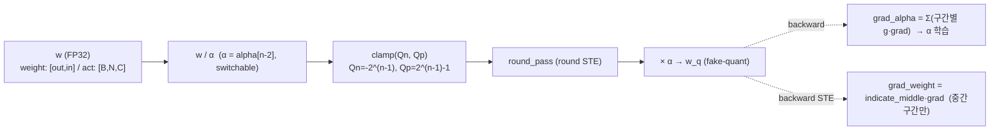
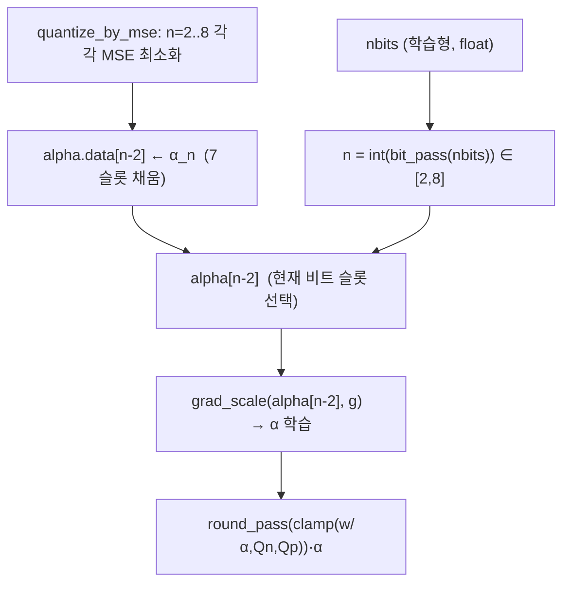
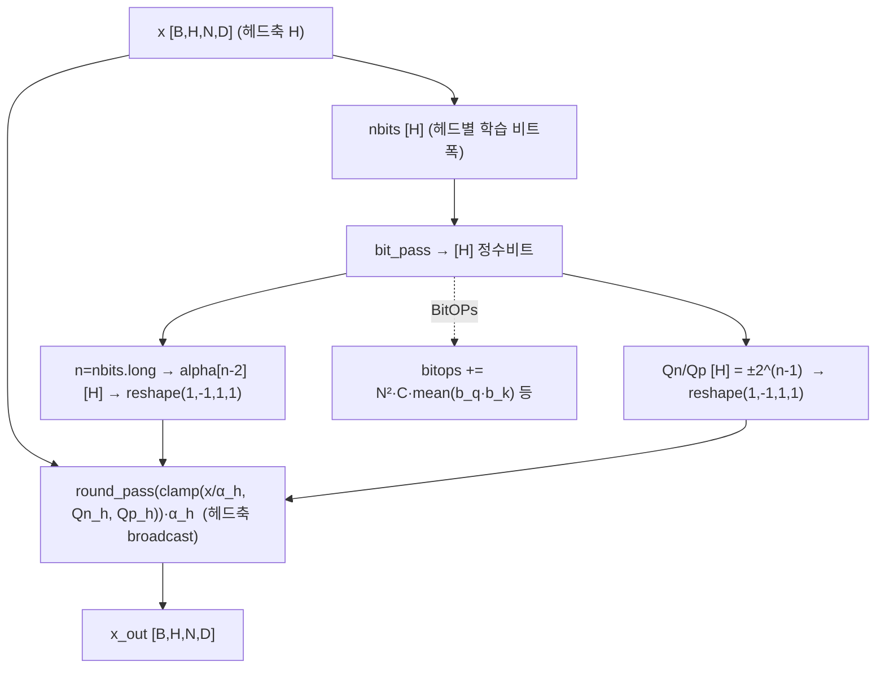
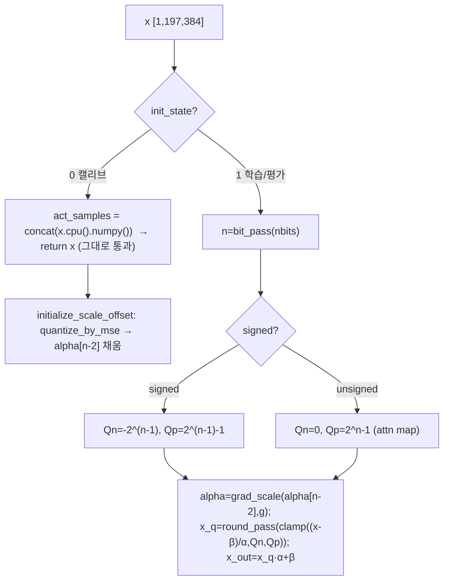
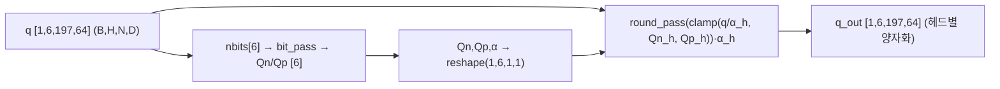
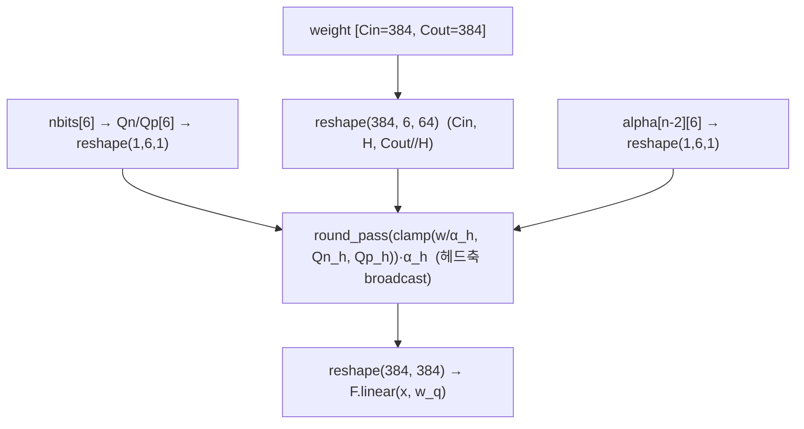
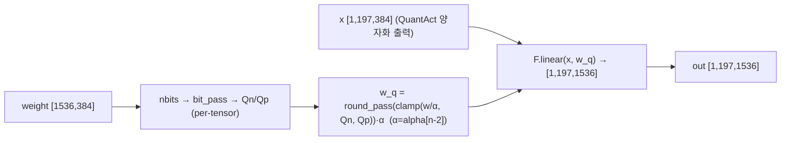
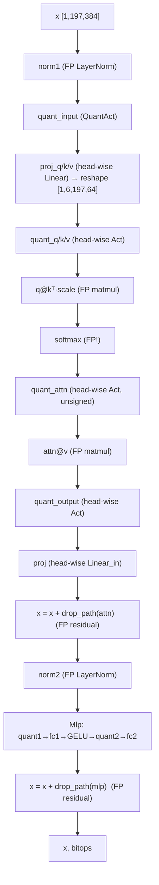
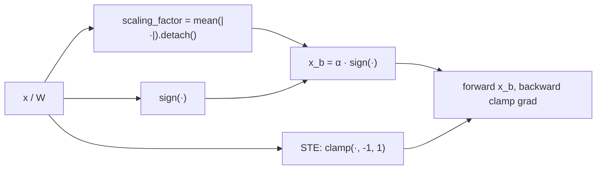
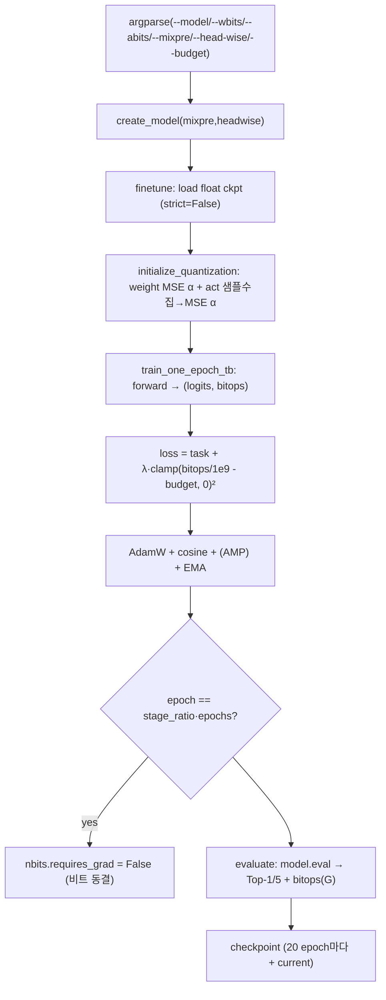

# Q-ViT (DeiT) 모듈 통합 가이드 (S-PyTorch)

> 1차 요약: [`../Q-ViT-DeiT.md`](../Q-ViT-DeiT.md) — 본 문서는 그 요약을 모듈 단위로 심화한 통합 가이드다.
> 분석 대상: `\\wsl.localhost\ubuntu-24.04\home\user\project\PRJXR-HBTXR\REF\ViT-Quantization\Q-ViT-DeiT`
> 작성 원칙: 실제 소스 Read 후 `파일:라인` 근거 표기. 라인 근거 없는 추론은 "추정", 코드로 확인 불가는 "확인 불가"로 명시.
> 형제 가이드(`REF/Analysis/ViT-Quantization/I-ViT/MODULE_GUIDE.md`)의 6요소 구조와 S-PyTorch 수치 규약을 따르되, I-ViT의 **integer-only(정수전용)** 초점을 Q-ViT의 **미분가능 양자화(differentiable quant) + head-wise 비트폭 + switchable scale**로 치환해 정밀 해부한다.

---

## 0. 문서 머리말

### 0.1 대표 케이스 선정
- **대표 모델: `deit_small_patch16_224_mix` (DeiT-S)** — `embed_dim=384, depth=12, num_heads=6, mlp_ratio=4, patch16, img224, qkv_bias=True` (`quantvit_mixpre.py:395-398`). 근거:
  1. I-ViT 형제 가이드와 동일하게 DeiT-S를 대표로 두어 직접 비교 가능. Q-ViT도 tiny/small/base 3종을 등록하며(`quantvit_mixpre.py:379,395,409`) small이 중간 규모로 head-wise(6 head) 분석이 비자명.
  2. head-wise 양자화의 head 수 H=6이 tiny(3)보다 헤드별 비트 배분 다양성이 크고 base(12)보다 분석이 간결.
- **대표 분석 단위: QuantVisionTransformer 1개 Block** = `LayerNorm → Attention(QuantAct + QuantMultiHeadLinear×3(q/k/v) + 정수 q@kᵀ + float softmax + QuantMultiHeadAct(attn) + attn@v + QuantMuitiHeadLinear_in(proj)) → [FP residual add] → LayerNorm → Mlp(QuantAct + QuantLinear×2 + GELU) → [FP residual add]` (`quantvit_mixpre.py:175-198`). DeiT-S는 이 Block을 12개 적층(`:300-305`).
- **대표 미분가능 3요소**: ① LSQ 학습형 스케일 α(`lsq_layer.py:25-47` `FunLSQ`, `:50-59` STE), ② switchable scale(`alpha=Parameter(zeros(7))`, 비트폭별 슬롯 `alpha[n-2]`, `_quan_base.py:34,56,84` / `lsq_layer.py:129,170,243`), ③ 학습형 비트폭 + BitOPs 예산(`bit_pass`, `lsq_layer.py:61-63` / `engine.py:135`) — FPGA 가변비트·헤드 타일 매핑의 직접 청사진.

### 0.2 S-PyTorch 수치 규약 (HW의 MAC lanes/scalar MACs 대체)
- **params**: 모듈 차원에서 분석적 계산. Linear `in·out (+out bias)`, LayerNorm `2·C`, Conv `Cout·Cin·Kh·Kw (+Cout)`. Q-ViT 양자화 모듈은 FP 가중치를 그대로 두고 forward마다 fake-quant(`lsq_layer.py:132,173`)하므로 **가중치 params는 FP 원본과 동일**. 단 I-ViT와 달리 **양자화 파라미터 자체가 학습 파라미터**로 추가됨: 레이어당 `alpha=Parameter(zeros(7))`(`_quan_base.py:34,56,84`), `nbits=Parameter`(`:24,51,76`), offset이면 `beta=Parameter(zeros(7))`(`:86`). head-wise는 `nbits=Parameter(ones(num_head)*nbits)`(`:104,133`).
- **FLOPs/MACs**: 표준식×config. Linear MAC = `B·N·in·out`. Attention QKᵀ = `B·H·N²·dh`, AV = `B·H·N²·dh`(H=heads, dh=head_dim). 대표 레이어 1개를 DeiT-S(B=1,N=197,C=384,H=6,dh=64)로 산출 후 12 block 환원. **I-ViT와 MAC 수는 동일**(같은 DeiT-S 토폴로지) — 차이는 비트폭과 양자화 방식.
- **activation memory**: 텐서 shape × 비트폭. Q-ViT는 fake-quant라 실제 메모리는 FP32지만(`lsq_layer.py:252` `x_q*alpha+beta`=float), **정수 도메인 비트폭**(학습된 W/A bits)을 "HW 환산 activation bit"로 표기. mixed-precision이라 비트폭은 [2,8] 범위에서 가변(`bit_pass` clamp, `:62`).
- **비트폭/observer**: 코드 직접. 초기 비트폭은 CLI `--wbits/--abits`(`main.py:173-174`), patch_embed·head는 고정 8bit(`quantvit_mixpre.py:213-214,313-314`). **observer 없음** — running min/max 대신 **MSE 고정점 반복으로 1회 캘리브레이션**(`lsq_layer.py:415-470` `quantize_by_mse`), 이후 α는 SGD로 학습. per-tensor(layer_wise) 또는 per-head 대칭(signed) / 비대칭(offset, attn은 unsigned).
- **정확도/속도**: README는 결과 이미지 링크만 제공(`README.md:91-92`) → **수치 텍스트 부재, 확인 불가**. 본 세션 미실행.

### 0.3 운영 경로 (3단계 QAT 워크플로 ↔ 체크포인트 ↔ ImageNet 평가)
```
[1단계: Float 베이스라인]  main.py --model deit_*_patch16_224_float --epochs 300   (README.md:15-27)
   │  (models/vit.py 의 float DeiT, 본 양자화 모듈 미사용)
   ▼
[2단계: 균일 QAT finetune]  --model deit_*_mix --wbits 4 --abits 4 --finetune <float>   (README.md:29-53)
   │  create_model(...wbits,abits,mixpre=False,headwise=False)  (main.py:270-284)
   │  initialize_quantization(): weight α는 MSE, act α는 샘플 수집 후 MSE  (engine.py:186-223)
   ▼
[3단계: Q-ViT mixed]  --wbits 5 --abits 5 --mixpre --head-wise --bitops-scaler 1e-1 --budget 21.455 --stage-ratio 0.9   (README.md:55-89)
   │  mixpre=True → nbits 학습, headwise=True → QuantMultiHead* 사용  (main.py:282-283)
   │  train_one_epoch_tb(): loss + λ·clamp(bitops/1e9 - budget,0)²  (engine.py:135)
   │  epoch == stage_ratio·epochs 에서 nbits.requires_grad=False (비트 동결)  (main.py:455-458)
   ▼
[체크포인트 저장] 20 epoch마다 + 매 epoch current_checkpoint.pth  (main.py:468-492)
   ▼
[ImageNet 평가] evaluate(): model.eval() → Top-1/5 + bitops(G) 로깅  (engine.py:69-104)
```
- 타깃 디바이스: **CUDA GPU 전제** — `--device default 'cuda'`(`main.py:152`), `torch.cuda.amp.autocast`(`engine.py:40`), `torch.cuda.synchronize`(`:57,166`), MSE 캘리브레이션 텐서가 `.to(device)`(`lsq_layer.py:194`). 분산학습 `torch.distributed.launch --nproc_per_node=8`(`README.md:20-21`).

### 0.4 모델 / 데이터셋 / 정확도
| Model | embed/depth/heads | 등록 함수 | 근거 |
|---|---|---|---|
| DeiT-T(mix) | 192/12/3 | `deit_tiny_patch16_224_mix` | `quantvit_mixpre.py:378-390` |
| **DeiT-S(mix, 대표)** | **384/12/6** | `deit_small_patch16_224_mix` | `quantvit_mixpre.py:394-406` |
| DeiT-B(mix) | 768/12/12 | `deit_base_patch16_224_mix` | `quantvit_mixpre.py:408-420` |
- 사전학습: DeiT torch.hub `.pth`를 `--finetune`로 로드(`main.py:286-294`, strict=False). 팩토리 내 `pretrained=True` 경로도 fbaipublicfiles deit `.pth` 로드(`quantvit_mixpre.py:384-389`).
- 데이터셋: **ImageNet (IMNET)** `--data-set IMNET`, 224×224, 1000 클래스 (`main.py:144,39`).
- **정확도/속도: README가 결과를 이미지 링크로만 제시(`README.md:91-92`) → 수치 확인 불가. 본 세션 미실행 → 측정 불가.**

---

## 1. Repo / Layer 개요

Q-ViT = DeiT를 **완전 미분가능 저비트 양자화(LSQ 기반 QAT)** 로 학습하되, **switchable scale(2~8bit 슬롯)**, **head-wise 비트폭/스케일**, **학습형 비트폭 + BitOPs 예산 정규화**로 정확도-효율 트레이드오프를 명시 제어하는 프레임워크(`README.md:1-4`, NeurIPS'22 arXiv 2201.07703). 본 repo는 **DeiT(facebookresearch) + hustzxd LSQ 구현 위에 얹은 커스텀 양자화 모듈**이 자체 소스이고, ImageNet DataLoader·optimizer·scheduler·Mixup·EMA·accuracy는 timm 컴포넌트를 그대로 임포트한다(`main.py:14-19`).

### 1.1 자체 소스 vs 외부 프레임워크 vs 제외

| 구분 | 파일(자체 소스) | 역할 |
|---|---|---|
| **양자화 베이스** | `quantization/_quan_base.py` | `_Conv2dQ/_LinearQ/_ActQ/_MultiHeadActQ/_MultiHeadLinearQ` — α/nbits/β Parameter 컨테이너, switchable 슬롯 |
| **양자화 레이어** | `quantization/lsq_layer.py` ★핵심 | `FunLSQ`, `grad_scale/round_pass/bit_pass`(STE), `QuantConv2d/QuantLinear/QuantAct`, `QuantMultiHeadAct/QuantMuitiHeadLinear(_in)`, `quantize_by_mse(_with_offset)` |
| **mixed-precision 모델** | `quantization/quantvit_mixpre.py` ★핵심 | `Mlp/Attention/Block/PatchEmbed/QuantVisionTransformer` + BitOPs 누적 + deit_*_mix 팩토리 |
| **단일정밀 모델** | `quantization/quantvit.py` | mixpre 없는 고정비트 QAT 모델(미열람 — 확인 불가, mixpre와 동일 모듈 재사용 추정) |
| **1-bit 경로** | `quantization/binary_layer.py` | `BinaryActivation/BinaryLinear/HardBinaryConv` + ReActNet(`reactnet`) — abits/wbits==1 분기 |
| **학습/평가 엔트리** | `main.py` | argparse, create_model, 3단계 워크플로, 체크포인트, bit 동결 |
| **학습/평가 루프** | `engine.py` | `train_one_epoch_tb`(BitOPs 손실), `evaluate`, `initialize_quantization`(MSE 캘리브), 로깅/head_analysis |
| **학습 보조** | `losses.py` | DistillationLoss(DeiT KD, 미열람 세부) |
| **데이터/유틸** | `datasets.py`, `samplers.py`(RASampler), `utils.py` | ImageNet 로더, 분산 유틸(미열람 세부) |
| **float 베이스** | `models/vit.py`, `models/distill_models.py` | 1단계 float DeiT(미열람 — 양자화 무관) |

### 1.2 forward 진입점
`QuantVisionTransformer.forward`(`quantvit_mixpre.py:359-366`) → `forward_features`(`:340-357`):
`patch_embed`(QuantAct+QuantConv2d, +bitops) → `cls_token` cat → `+pos_embed`(**FP 덧셈**, `:348`) → `blocks`(12×Block, bitops 누적) → `norm`(**FP LayerNorm**) → cls 추출 → `quant`(QuantAct 8bit) → `head`(QuantLinear 8bit) → `(logits, total_bitops)` 반환. **I-ViT와 달리 LayerNorm/softmax/residual은 FP 유지**, 양자화는 Linear·MatMul 입출력 경계에만 삽입.

### 1.3 제외 (지시에 따라 이름만 표기, 미분석)
- **외부 프레임워크(커스텀 아님)**: `timm.data.Mixup`, `timm.models.create_model/register_model`, `timm.loss.{LabelSmoothing,SoftTarget}CrossEntropy`, `timm.scheduler/optim`, `timm.utils.{NativeScaler,ModelEma,accuracy}`, `timm.models.layers.{DropPath,trunc_normal_}` (`main.py:14-19`, `quantvit_mixpre.py:29-33`). DeiT **원본 사전학습 체크포인트**(torch.hub deit `.pth`) — 가중치만 로드.
- **미열람(확인 불가)**: `quantvit.py`(단일정밀, mixpre 모듈 재사용 추정), `models/vit.py`(float 베이스), `losses.py`(DistillationLoss), `datasets.py`/`samplers.py`/`utils.py` 세부, `hubconf.py`. `binary_layer.py`의 `reactnet`/`BasicBlock`은 ReActNet CNN 이진화로 ViT 본체와 별개(1-bit 비교용 추정).
- **제외 디렉토리/파일**: `.github/`, `__pycache__`, 체크포인트(`*.pth`, 이름만, 확인 불가).

### 1.4 대표 모델 레이어 구성 (DeiT-S mix)
`forward_features`(`quantvit_mixpre.py:340-357`): PatchEmbed(QuantAct 8bit + QuantConv2d 16×16 s16 8bit) → +cls/pos(**FP 합**) → Block×12 → FP LayerNorm → head(QuantAct 8bit + QuantLinear 8bit). 1 Block(`:192-198`)당: Attention에 QuantAct(input) 1 + QuantMultiHeadLinear 3(q/k/v) + QuantMultiHeadAct 5(q/k/v/attn/output) + QuantMuitiHeadLinear_in 1(proj); Mlp에 QuantAct 2 + QuantLinear 2 + GELU 1. **LayerNorm·softmax·GELU·residual은 비양자화 FP**.

---

## 2. 모듈: LSQ 미분가능 양자화 함수 — `lsq_layer.py` (FunLSQ + STE 헬퍼) ★핵심

### 2.1 역할 + 상위/하위
- **역할**: FP 텐서를 **학습형 스케일 α로 대칭 양자화**하고, α 자체에 그래디언트를 흘리는 LSQ(Learned Step Size Quantization) 정석 구현. round/clamp의 미분불가는 STE로 우회. I-ViT의 고정 min/max 대칭양자화(`SymmetricQuantFunction`)와 달리 **스케일이 역전파로 학습**되는 것이 핵심 차이.
- **상위**: `QuantConv2d/QuantLinear/QuantAct`가 forward에서 `round_pass(clamp(w/α,Qn,Qp))*α` 인라인으로 호출(`lsq_layer.py:132,173,251`). `FunLSQ.apply`는 Method2(주석, 메모리 절약형)로 정의만 됨(`:134,177,257` 주석). **하위**: 없음(autograd primitive).

### 2.2 데이터플로우 (텐서 shape 흐름)


### 2.3 forward call stack
`QuantLinear.forward`(`lsq_layer.py:150`) → `nbits=bit_pass(self.nbits)`(`:153`) → `g=1/sqrt(numel·Qp)`(`:165`) → `alpha=grad_scale(self.alpha[n-2], g)`(`:170`) → `w_q=round_pass(clamp(self.weight/alpha, Qn, Qp))*alpha`(`:173`) → `F.linear`(`:178`). (Method2 `FunLSQ.apply`는 `:177` 주석 처리.)

### 2.4 대표 코드 위치
`lsq_layer.py`: `FunLSQ.forward` `:26-33`, `FunLSQ.backward` `:35-47`, `grad_scale` `:50-53`, `round_pass` `:56-59`, `bit_pass` `:61-63`, `clamp` `:65-68`.

### 2.5 대표 코드 블록

```python
# lsq_layer.py:31-33  FunLSQ forward: 대칭 fake-quant
q_w = (weight / alpha).round().clamp(Qn, Qp)
w_q = q_w * alpha
return w_q
```

```python
# lsq_layer.py:39-46  backward: α 그래디언트(구간별) + STE weight 그래디언트
q_w = weight / alpha
indicate_small  = (q_w < Qn).float()
indicate_big    = (q_w > Qp).float()
indicate_middle = 1.0 - indicate_small - indicate_big
grad_alpha = ((indicate_small*Qn + indicate_big*Qp
               + indicate_middle*(-q_w + q_w.round())) * grad_weight * g).sum().unsqueeze(0)
grad_weight = indicate_middle * grad_weight     # 포화구간은 weight grad 차단(STE)
```
→ **α 그래디언트**: 포화 영역(|w/α|>Qp 또는 <Qn)은 ±클립값 `Qn/Qp`, 중간 영역은 `round(q_w)-q_w`(양자화 오차). LSQ 논문 식 그대로. `g=1/√(N·Qp)`로 스케일 학습률 정규화(`:124,165,235`).

```python
# lsq_layer.py:50-63  STE 헬퍼 3종 (detach 트릭으로 forward/backward 분리)
def grad_scale(x, scale):   # forward x, backward x*scale
    y = x; y_grad = x * scale
    return y.detach() - y_grad.detach() + y_grad
def round_pass(x):          # forward round(x), backward identity
    y = x.round(); y_grad = x
    return y.detach() - y_grad.detach() + y_grad
def bit_pass(x):            # 비트폭 [2,8] clamp + round-STE → 학습형 비트의 정수화 통로
    x.data.clamp_(2, 8)
    return round_pass(x)
```
→ `bit_pass`가 **학습형 비트폭의 핵심**: float `nbits` Parameter를 [2,8]로 clamp 후 round하되 그래디언트는 통과(round_pass) → BitOPs 손실이 `nbits`로 역전파됨.

### 2.6 연산·수치표현 분해 + 정량 (미분가능 양자화 정밀 해부)
- **양자화 방식**: 대칭(weight/signed act, zp=0), 비대칭(offset act는 `(x-β)/α`, zp=β, `:251`). per-tensor(layer_wise) 또는 per-head. **스케일·비트폭 모두 학습 대상**(I-ViT 대비 결정적 차이).
- **scale/zp**: `α=alpha[n-2]`(switchable, 3장), `Qn=-2^(n-1)`, `Qp=2^(n-1)-1`(signed) / `Qn=0, Qp=2^n-1`(unsigned, `:231-233`).
- **비트폭**: 가변 [2,8]. forward마다 `bit_pass(nbits)`로 정수화(`:113,153,226,306`).
- **params**: FunLSQ 자체 0(함수). 단 호출 레이어가 α(7) + nbits(1 또는 H) Parameter 보유(3·4장).
- **FLOPs**: 원소당 div+clamp+round+mul = O(N). 대표 DeiT-S qkv weight(proj_q `[384,384]`=147K 원소) fake-quant = 147K div+round (forward마다, QAT 비용 요인). I-ViT와 동일하게 매 forward 재양자화.
- **미분가능성의 HW 함의**: α는 학습 종료 후 **레이어/헤드당 상수**가 됨 → 추론 시 정수 MAC + 출력단 α 곱(dyadic/고정소수점 환산 가능, 추정). 학습 중에만 미분가능, 배포 시엔 I-ViT류 고정 스케일과 동형.

---

## 3. 모듈: Switchable Scale — `_quan_base.py` (alpha=zeros(7) + alpha[n-2] 인덱싱) ★핵심

### 3.1 역할 + 상위/하위
- **역할**: 단일 텐서 `alpha∈ℝ⁷`에 **2~8bit 각각의 스케일을 슬롯으로 보관**, 현재 비트폭 `n`에 대해 `alpha[n-2]` 슬롯만 선택. 학습형 비트폭이 바뀌어도 해당 비트의 사전 캘리브된 스케일을 즉시 사용 → 비트 전환 시 재캘리브 불필요. "switchable"의 직접 구현.
- **상위**: `_Conv2dQ/_LinearQ/_ActQ/_MultiHead*Q` 생성자가 `alpha=Parameter(torch.zeros(7))` 선언(`_quan_base.py:34,56,84,113,139`). offset이면 `beta=Parameter(zeros(7))`(`:86,115`). **하위**: `quantize_by_mse`가 7개 슬롯을 채움(`lsq_layer.py:438,469`).

### 3.2 데이터플로우 (텐서 shape 흐름)


### 3.3 forward call stack
`QuantLinear.forward`(`lsq_layer.py:150`) → `n=int(nbits)`(`:156`) → `alpha=grad_scale(self.alpha[n-2], g)`(`:170`). head-wise는 `n=nbits.to(torch.long)`(헤드별 벡터, `:325,365,403`) → `self.alpha[n-2]`(헤드 인덱스 벡터로 7-슬롯 gather, `:327,369,407`).

### 3.4 대표 코드 위치
`_quan_base.py`: alpha 선언 `:34,56,84`(7-벡터), beta 선언 `:86,115`. `lsq_layer.py`: 슬롯 선택 `:129,170,243,327,369,407`, MSE 슬롯 채움 `:438,469-470`.

### 3.5 대표 코드 블록

```python
# _quan_base.py:34,56,84  switchable scale 컨테이너: 2~8bit = 7개 슬롯
self.alpha = Parameter(torch.zeros(7), requires_grad=self.learned)   # _Conv2dQ/_LinearQ/_ActQ
# offset(비대칭)이면 동일 형태의 zero-point 슬롯도:
if self.offset:
    self.beta = Parameter(torch.zeros(7), requires_grad=self.learned)  # :86
```

```python
# lsq_layer.py:129,170,243  현재 비트폭 n에 대응하는 슬롯 선택 (n=2..8 → index 0..6)
n = int(nbits)
alpha = grad_scale(self.alpha[n-2], g)     # alpha[0]=2bit ... alpha[6]=8bit
```

```python
# lsq_layer.py:421-438  MSE 고정점 반복으로 7 슬롯을 한 번에 캘리브레이션
for n in range(2, 9):
    Qn, Qp = (-2**(n-1), 2**(n-1)-1) if signed else (0, 2**n-1)
    alpha = flatten_tensor.abs().max() / Qp           # 초기값
    while abs((alpha - alpha_old)/alpha) >= 1e-5:     # 고정점 반복
        flatten_tensor_q = (flatten_tensor/alpha).clamp(Qn,Qp).round()
        alpha = flatten_tensor.dot(flatten_tensor_q) / flatten_tensor_q.dot(flatten_tensor_q)
    p_alpha.data[n-2].copy_(alpha)                     # 슬롯 n-2 채움
```
→ `α = <x, x_q> / <x_q, x_q>` 최소제곱 고정점(MSE 최소화). 2~8bit **각각 독립 캘리브** → 7개 슬롯 동시 확보. 비대칭은 `quantize_by_mse_with_offset`이 α,β 슬롯을 함께 채움(`:440-470`).

### 3.6 연산·수치표현 분해 + 정량 (switchable scale 정밀 해부)
- **양자화 방식**: 비트폭별 독립 스케일. 한 텐서가 2~8bit 전 범위의 스케일을 동시 보유 → mixed-precision 학습 중 비트가 바뀌어도 즉시 대응.
- **scale/zp**: α 7-벡터(`:34`), offset β 7-벡터(`:86`). 헤드별은 α는 여전히 7-슬롯(`:113`)이되 비트폭 `nbits`가 헤드별 벡터(`:104`)라 슬롯 선택이 헤드마다 다름.
- **params**: 레이어당 alpha **7개**(+ offset 시 beta 7개). DeiT-S Block당 양자화 모듈 수(Attention 9 + Mlp 4 = 13) × 7 ≈ **91 α/block**, ×12 ≈ **~1.1K α params**(전 모델, head-wise 시 일부는 7로 동일하나 nbits가 H-벡터). FP 가중치 대비 무시 가능한 오버헤드.
- **FLOPs**: 캘리브는 학습 전 1회(`initialize_quantization`, `engine.py:186-223`). forward 슬롯 선택은 인덱싱 O(1).
- **HW 함의**: 배포 시 학습된 비트폭 1개로 고정 → 7 슬롯 중 1개만 사용 → **HW엔 단일 스케일 레지스터**면 충분(추정). switchable은 학습/탐색 단계 장치. 단 동적 정밀도 가속기를 노린다면 7 슬롯을 룩업테이블로 유지하는 설계도 가능(추정).

---

## 4. 모듈: 학습형 비트폭 + Head-wise 비트 — `_quan_base.py` + `lsq_layer.py` (mixpre/multihead) ★핵심

### 4.1 역할 + 상위/하위
- **역할**: ① 비트폭 `nbits`를 **학습 파라미터**로 두어(`requires_grad=mixpre`) BitOPs 예산 손실로 역전파, ② head-wise 모듈은 `nbits`를 **헤드별 벡터**(`ones(num_head)*nbits`)로 두어 멀티헤드 어텐션의 헤드마다 독립 비트폭 배분. I-ViT의 고정 W8/A8/A16과 정반대 — 비트폭이 데이터로 학습됨.
- **상위**: mixed-precision = `_LinearQ/_ActQ/_Conv2dQ`(`nbits=Parameter([nbits], requires_grad=mixpre)`, `_quan_base.py:24,51,76`); head-wise = `_MultiHeadActQ/_MultiHeadLinearQ`(`nbits=Parameter(ones(num_head)*nbits)`, `:104,133`). **하위**: `bit_pass`(정수화), BitOPs 누적(`quantvit_mixpre.py`).

### 4.2 데이터플로우 (텐서 shape 흐름, head-wise)


### 4.3 forward call stack
- mixed: `QuantLinear.forward`(`lsq_layer.py:150`) → `bit_pass(self.nbits)`(`:153`); BitOPs는 `Mlp.forward`(`quantvit_mixpre.py:104,109`)/`Attention.forward`(`:157,162,168,170`)에서 누적.
- head-wise: `QuantMultiHeadAct.forward`(`lsq_layer.py:290`) → `bit_pass(self.nbits)`(`:306`, H-벡터) → Qn/Qp/α를 `reshape(1,-1,1,1)`(`:323-330`) → 헤드축 broadcast 양자화(`:332-333`).

### 4.4 대표 코드 위치
`_quan_base.py`: 학습형 nbits `:24,51,76`, head-wise nbits `:104,133`. `lsq_layer.py`: head-wise act `:290-337`, head-wise linear(out분할) `:339-375`, (in분할) `:377-413`, `bit_pass` `:61-63`. `engine.py`: BitOPs 손실 `:135`, head 비트 강제 `head_analysis :344-350`.

### 4.5 대표 코드 블록

```python
# _quan_base.py:24,51,76  비트폭을 학습 파라미터로 (mixpre=True면 역전파 대상)
self.nbits = Parameter(torch.tensor([float(kwargs_q['nbits'])]), requires_grad=kwargs_q['mixpre'])
```

```python
# _quan_base.py:104,133  head-wise: 헤드마다 독립 비트폭 벡터
self.num_head = kwargs_q['num_head']
self.nbits = Parameter(torch.ones(self.num_head) * kwargs_q['nbits'])   # [H]
```

```python
# lsq_layer.py:306-333  head-wise 양자화: 헤드축(H) broadcasting
nbits = bit_pass(self.nbits)                     # [H]
Qn = -2 ** (nbits - 1); Qp = 2 ** (nbits - 1) - 1  # [H]
g = 1.0 / torch.sqrt(x.numel()/self.num_head * Qp) # 헤드 단위 grad 정규화
Qp = Qp.reshape(1,-1,1,1); Qn = Qn.reshape(1,-1,1,1)   # x.shape=B,H,N,D
n = nbits.to(torch.long).detach()
alpha = grad_scale(self.alpha[n-2], g).reshape(1,-1,1,1)
x_q = round_pass(clamp(x / alpha, Qn, Qp))
x_out = x_q * alpha                               # 헤드별 스케일 적용
```
→ Qn/Qp/α 모두 `[H]→(1,H,1,1)` reshape로 **헤드축 broadcast**. 헤드마다 다른 비트폭/스케일이 한 텐서 연산에 공존. weight 쪽은 `(Cin,H,Cout//H)`(out분할, `:360`) 또는 `(H,Cin//H,Cout)`(in분할, `:398`)로 reshape 후 동일 처리.

```python
# main.py:455-458  탐색 단계 종료 후 비트폭 동결 (stage_ratio·epochs 지점)
if epoch == int(args.stage_ratio * args.epochs):
    for m in model.modules():
        if hasattr(m, 'nbits'):
            m.nbits.requires_grad = False     # 후반엔 비트 고정, 가중치만 미세조정
```

### 4.6 연산·수치표현 분해 + 정량 (head-wise 비트 정밀 해부, DeiT-S H=6)
- **양자화 방식**: 비트폭이 학습 변수. head-wise는 6개 헤드 각각 독립 비트(`nbits[6]`). 후반 stage(0.9·epochs 이후)엔 동결(`main.py:455-458`).
- **scale/zp**: 헤드별 α(switchable 7-슬롯에서 헤드별 슬롯 gather), grad scale `g=1/√(numel/H·Qp)`(헤드 단위 정규화, `:315,362,400`).
- **비트폭**: 초기 `--wbits/--abits`(균일 4 또는 5, `README.md:34-35,60-61`), 학습 후 헤드/레이어별 [2,8] 분포. patch_embed·head·classifier-quant는 **고정 8bit**(`quantvit_mixpre.py:213-214,313-314`).
- **params**: head-wise nbits = num_head개(`:104`) → DeiT-S Attention의 head-wise 모듈(q/k/v/attn/output act 5 + q/k/v/proj linear 4 = 9개) × 6 head = **54 nbits/Attention**, ×12 block ≈ **648 nbits**(head-wise 경로). mixed-precision 비-headwise(Mlp/patch/head)는 레이어당 1개.
- **FLOPs/BitOPs** (DeiT-S, B=1, N=197, C=384): BitOPs = Σ(연산수×b_act×b_weight). qkv: `N·numel(proj_q)·mean(b_q+b_k+b_v)·b_in`(`:157`), QKᵀ: `N²·C·mean(b_q·b_k)`(`:162`), AV: `N²·C·mean(b_v·b_attn)`(`:168`). 균일 4bit 가정 시 qkv BitOPs ≈ 197×147456×(4+4+4)×4 ≈ **1.39 GBitOps**(헤드 평균). budget=21.455 G가 전 모델 목표(`README.md:64`).
- **HW 함의**: head-wise 가변비트 = systolic array를 **헤드 타일로 분할**하고 타일마다 비트폭 레지스터를 두는 설계와 직결(N+3장). 단 헤드마다 다른 비트폭은 **재양자화 로직·PE 비트폭 가변성**을 요구 → HW 복잡도 trade-off.

---

## 5. 모듈: 활성 양자화 + MSE 캘리브 — `lsq_layer.py` (QuantAct)

### 5.1 역할 + 상위/하위
- **역할**: activation을 LSQ 대칭/비대칭 양자화. **observer 없음** — `init_state==0`인 초기 forward에서 **입력 샘플을 CPU numpy로 누적만 하고 통과**, 이후 `initialize_scale_offset()`이 MSE로 α(,β) 7-슬롯 초기화. 학습 중 α는 SGD로 갱신. I-ViT의 running min/max EMA observer와 정반대 방식(MSE 1회 + 학습).
- **상위**: `Mlp.quant1/quant2`(`quantvit_mixpre.py:92,95`), `Attention.quant_input`(`:132`), `PatchEmbed.quant`(`:213`), `QuantVisionTransformer.quant`(head 앞, `:313`). **하위**: `grad_scale/round_pass/clamp`, `quantize_by_mse(_with_offset)`.

### 5.2 데이터플로우 (텐서 shape 흐름)


### 5.3 forward call stack
`Mlp.forward`(`quantvit_mixpre.py:102`) → `QuantAct.forward(x)`(`lsq_layer.py:210`) → init_state 분기(`:215-225`) → `bit_pass(nbits)`(`:226`) → signed/unsigned Qn/Qp(`:228-233`) → `g=1/sqrt(numel·Qp)`(`:235`) → `alpha=grad_scale(alpha[n-2],g)`(`:243`) → `x_q=round_pass(clamp((x-β)/α,Qn,Qp))`(`:251`) → `x_out=x_q*alpha+beta`(`:252`).

### 5.4 대표 코드 위치
`lsq_layer.py`: 클래스 `:180-258`, MSE 캘리브 `:186-208`, 샘플 누적 `:215-223`, signed/unsigned `:228-233`, offset 분기 `:245-248`, 최종 양자화 `:249-252`.

### 5.5 대표 코드 블록

```python
# lsq_layer.py:215-223  observer 대신 입력 샘플 수집 (CPU numpy 누적)
if self.init_state == 0:
    sample = x.cpu().numpy()
    if not self.act_samples.any():
        self.act_samples = sample
    else:
        self.act_samples = np.concatenate((self.act_samples, sample), axis=0)
    return x          # 캘리브 단계엔 그대로 통과(양자화 안 함)
```
→ I-ViT의 running min/max EMA(forward마다 갱신)와 달리 **수집→MSE 1회**. `act_samples`를 CPU numpy로 쌓아 메모리·속도 부담(추정).

```python
# lsq_layer.py:249-252  signed/unsigned + offset(비대칭) 양자화
x_q = round_pass(clamp((x - beta) / alpha, Qn, Qp))
x_out = x_q * alpha + beta
```
→ attn map은 `signed=False, offset`로 unsigned 양자화(`quantvit_mixpre.py:142`), GELU 뒤 Mlp.quant2도 `signed=False, offset=True`(`:95`). 나머지는 signed.

```python
# lsq_layer.py:186-208  MSE 캘리브레이션 호출 (offset 유무 분기)
if self.offset:
    quantize_by_mse_with_offset(act_samples, self.alpha, self.beta, signed=self.signed)
else:
    quantize_by_mse(act_samples, self.alpha, signed=self.signed)
self.init_state.fill_(1); self.act_samples = None    # 캘리브 후 샘플 해제
```

### 5.6 연산·수치표현 분해 + 정량 (DeiT-S, [1,197,384])
- **양자화 방식**: per-tensor LSQ. signed 대칭(기본) / unsigned 비대칭(attn, GELU 후). observer 없음 = MSE 1회 캘리브 + α 학습.
- **scale/zp**: α=`alpha[n-2]`(7-슬롯), β=`beta[n-2]`(offset 시). 캘리브 초기값은 MSE 고정점(`:426-438`).
- **비트폭**: 가변 [2,8](mixpre) 또는 균일(2단계). patch/head act는 고정 8bit(`quantvit_mixpre.py:213,313`).
- **params**: α 7 + (offset 시 β 7) + nbits 1. (head-wise act는 4장.)
- **activation memory** (DeiT-S, [1,197,384]):
  - 4bit: 197×384×0.5 byte = **37.8 KB**
  - 8bit: 197×384×1 byte = **75.6 KB** (I-ViT A8과 동일 shape)
- **FLOPs**: 캘리브 MSE는 학습 전 1회(고정점 반복, 텐서당 수 step, `:430-437`). forward 양자화 O(N).
- **I-ViT 대비**: residual은 **양자화 안 함**(FP add, `quantvit_mixpre.py:194,196`) → I-ViT의 16bit residual fixedpoint_mul 정렬과 정반대. Q-ViT는 Linear/MatMul 입출력 경계만 양자화.

---

## 6. 모듈: Head-wise 활성 양자화 — `lsq_layer.py` (QuantMultiHeadAct) ★head-wise

### 6.1 역할 + 상위/하위
- **역할**: 멀티헤드 어텐션의 Q/K/V/attn/output을 **헤드별 독립 스케일·비트폭**으로 양자화. 입력 `[B,H,N,D]`의 헤드축 H마다 다른 α·Qn·Qp 적용. Q-ViT head-wise의 활성 측 핵심.
- **상위**: `Attention`이 `headwise=True`면 `ActClass=QuantMultiHeadAct`로 교체(`quantvit_mixpre.py:126`), `quant_q/k/v/attn/output`에 사용(`:139-144`). **하위**: `grad_scale/round_pass/clamp`, `quantize_by_mse`.

### 6.2 데이터플로우 (텐서 shape 흐름, DeiT-S quant_q)


### 6.3 forward call stack
`Attention.forward`(`quantvit_mixpre.py:159`) → `self.quant_q(q)` → `QuantMultiHeadAct.forward`(`lsq_layer.py:290`) → init_state 분기(`:295-303`) → `bit_pass(nbits)`(`:306`, [H]) → `g=1/sqrt(numel/H·Qp)`(`:315`) → reshape(`:323-330`) → 헤드축 broadcast 양자화(`:332-333`).

### 6.4 대표 코드 위치
`lsq_layer.py`: 클래스 `:260-337`, MSE 캘리브 `:266-288`, 헤드 grad 정규화 `:315`, 헤드축 reshape `:323-330`, 양자화 `:331-333`.

### 6.5 대표 코드 블록
```python
# lsq_layer.py:314-333  head-wise 활성 양자화 (헤드축 H broadcasting)
g = 1.0 / torch.sqrt(x.numel() / self.num_head * Qp)   # 헤드 단위 정규화
Qp = Qp.reshape(1, -1, 1, 1)                            # x.shape = B,H,N,D
Qn = Qn.reshape(1, -1, 1, 1)
n = nbits.to(torch.long).detach()                       # [H]
alpha = grad_scale(self.alpha[n-2], g).reshape(1, -1, 1, 1)
x_q = round_pass(clamp(x / alpha, Qn, Qp))
x_out = x_q * alpha
```
→ attn map 양자화는 `signed=False`(`quantvit_mixpre.py:142`)라 Qn=0, Qp=2^n-1(`lsq_layer.py:312-313`). q/k/v/output은 offset 옵션 따름.

### 6.6 연산·수치표현 분해 + 정량 (DeiT-S, H=6, dh=64, N=197)
- **양자화 방식**: 헤드별 대칭(q/k/v/output) / 비대칭 unsigned(attn). per-head 스케일·비트폭.
- **비트폭**: 헤드별 [2,8]. q/k/v/attn/output 각 5개 head-wise act 모듈/Attention.
- **params**: α 7 + nbits H(=6)/모듈. Attention의 head-wise act 5모듈 × (7+6) = **65 양자화 params/Attention**(추정 합산).
- **activation memory**: q/k/v 각 [1,6,197,64] = 75.6K 원소; 4bit → **37.8 KB**, 8bit → 75.6 KB. attn map [1,6,197,197]=233K 원소 → 4bit **116 KB**, 8bit 233 KB (block 내 최대 활성, I-ViT softmax 출력과 동일 shape).
- **FLOPs**: 헤드축 reshape는 view O(1), 양자화 O(N).
- **HW 함의**: 헤드별 스케일 레지스터 6개 + 헤드별 비트폭 → systolic array 헤드 타일 분할과 1:1(N+3장). 단 헤드마다 비트폭이 다르면 attn 행렬곱 PE가 가변비트를 지원해야 함.

---

## 7. 모듈: Head-wise 가중치 양자화 — `lsq_layer.py` (QuantMuitiHeadLinear / _in) ★head-wise

### 7.1 역할 + 상위/하위
- **역할**: q/k/v projection과 output projection의 **가중치를 헤드별로 분할 reshape 후 헤드별 α 적용**. out-feature 분할(`QuantMuitiHeadLinear`)과 in-feature 분할(`QuantMuitiHeadLinear_in`) 2종. Q-ViT head-wise의 가중치 측 핵심.
- **상위**: `Attention`이 headwise면 `LinearClass=QuantMuitiHeadLinear`(q/k/v, out분할, `:127,134-136`), `LinearClass_in=QuantMuitiHeadLinear_in`(proj, in분할, `:127,145`). **하위**: `grad_scale/round_pass/clamp`, `bit_pass`, `F.linear`.

### 7.2 데이터플로우 (텐서 shape 흐름, DeiT-S proj_q, out분할)


### 7.3 forward call stack
`Attention.forward`(`quantvit_mixpre.py:154`) → `self.proj_q(x)` → `QuantMuitiHeadLinear.forward`(`lsq_layer.py:350`) → `bit_pass(nbits)`(`:353`) → weight reshape `(Cin,H,Cout//H)`(`:360`) → reshape Qn/Qp/α(`:363-370`) → 헤드별 양자화(`:372`) → `reshape(Cin,Cout)`(`:373`) → `F.linear`(`:375`). `_in`은 weight를 `(H,Cin//H,Cout)`로 분할(`:398`).

### 7.4 대표 코드 위치
`lsq_layer.py`: out분할 `QuantMuitiHeadLinear` `:339-375`, in분할 `QuantMuitiHeadLinear_in` `:377-413`, weight reshape `:360,398`, 헤드별 양자화 `:372,410`.

### 7.5 대표 코드 블록
```python
# lsq_layer.py:358-375  head-wise weight 양자화 (out-feature 헤드 분할)
Cin, Cout = self.weight.shape
weight = self.weight.reshape(Cin, self.num_head, Cout // self.num_head)  # (Cin, H, Cout/H)
g = 1.0 / torch.sqrt(weight.numel() / self.num_head * Qp)
Qp = Qp.reshape(1, -1, 1); Qn = Qn.reshape(1, -1, 1)
n = nbits.to(torch.long).detach()
alpha = grad_scale(self.alpha[n-2], g).reshape(1, -1, 1)
w_q = round_pass(clamp(weight / alpha, Qn, Qp)) * alpha
w_q = w_q.reshape(Cin, Cout)                          # 원형 복구 후 F.linear
return F.linear(x, w_q, self.bias)
```
→ `_in`(proj)은 `weight.reshape(num_head, Cin//num_head, Cout)`로 **입력축 분할**(`:398`), Qn/Qp/α를 `reshape(-1,1,1)`(`:401-408`). out 분할(q/k/v)과 in 분할(proj)을 구분하는 이유: attention 후 proj는 헤드별 출력을 concat한 입력을 받으므로 입력축이 헤드 구조를 가짐(추정).

### 7.6 연산·수치표현 분해 + 정량 (DeiT-S, H=6, C=384)
- **양자화 방식**: 헤드별 대칭 weight 양자화. out분할(q/k/v): `[384,6,64]`, in분할(proj): `[6,64,384]`.
- **scale/zp**: 헤드별 α(7-슬롯에서 헤드별 비트로 gather), grad scale 헤드 단위 정규화(`:362,400`).
- **params**: weight params = FP 원본과 동일(proj_q `384×384`=147,456, qkv 합 442,368/block — bias는 qkv_bias=True). + α 7 + nbits 6/모듈.
- **MACs/block** (DeiT-S, B=1, N=197): proj_q/k/v 각 197×384×384 ≈ 29.0M, proj 197×384×384 ≈ 29.0M → Attention Linear MAC/block ≈ **116.2M**(I-ViT의 qkv 합산형 87.1M + proj 29.0M = 116.1M과 동일, 분리/합산 차이만). ×12.
- **HW 함의**: 헤드별 weight 스케일 → 가중치 메모리 옆에 헤드당 α 테이블. 비트폭도 헤드별이면 가중치 비트 패킹이 헤드마다 달라져 메모리 레이아웃 복잡(추정).

---

## 8. 모듈: 정수 Linear/Conv (mixed-precision) — `lsq_layer.py` (QuantLinear / QuantConv2d)

### 8.1 역할 + 상위/하위
- **역할**: head-wise 아닌 일반 Linear/Conv(Mlp의 fc1/fc2, patch_embed proj, head). per-tensor LSQ weight 양자화 + 학습형 비트폭. 입력은 이미 QuantAct로 양자화된 상태로 받음.
- **상위**: `Mlp.fc1/fc2`(`quantvit_mixpre.py:93,96`), `PatchEmbed.proj`(QuantConv2d, `:214`), `QuantVisionTransformer.head`(`:314`), non-headwise Attention의 proj_q/k/v(`:124`). **하위**: `FunLSQ` 인라인, `bit_pass`, `F.linear/F.conv2d`.

### 8.2 데이터플로우 (텐서 shape 흐름, DeiT-S fc1)


### 8.3 forward call stack
`Mlp.forward`(`quantvit_mixpre.py:103`) → `QuantLinear.forward(x)`(`lsq_layer.py:150`) → `bit_pass(nbits)`(`:153`) → `g=1/sqrt(numel·Qp)`(`:165`) → `alpha=grad_scale(alpha[n-2],g)`(`:170`) → `w_q=round_pass(clamp(weight/alpha,Qn,Qp))*alpha`(`:173`) → `F.linear(x, w_q, bias)`(`:178`). QuantConv2d 동형(`:108-136`).

### 8.4 대표 코드 위치
`lsq_layer.py`: `QuantLinear` `:139-178`, `QuantConv2d` `:92-136`, `initialize_scale`(MSE) `:101-106,143-148`, weight 양자화 `:132,173`.

### 8.5 대표 코드 블록
```python
# lsq_layer.py:153-178  per-tensor LSQ weight 양자화 + F.linear
nbits = bit_pass(self.nbits)
Qn = -2 ** (nbits - 1); Qp = 2 ** (nbits - 1) - 1; n = int(nbits)
assert self.init_state == 1                       # MSE 캘리브 필수
with torch.no_grad():
    g = 1.0 / math.sqrt(self.weight.numel() * Qp)
self.alpha.data.clamp_(min=1e-4)                  # α 양수 보장
alpha = grad_scale(self.alpha[n-2], g)            # switchable 슬롯
w_q = round_pass(clamp(self.weight / alpha, Qn, Qp)) * alpha
return F.linear(x, w_q, self.bias)                # bias는 FP (양자화 안 함)
```
→ **I-ViT와 결정적 차이**: ① 입력을 정수 복원하지 않고 fake-quant된 입력을 그대로 `F.linear`(정수 MAC 아닌 FP MAC); ② **bias 양자화 없음**(FP bias 직접 사용); ③ 출력 dequant/스케일 전파 없음(다음 QuantAct가 재양자화). I-ViT의 `bias_scale=W_scale·A_scale` 정수 정렬과 달리 Q-ViT는 학습용 fake-quant.

### 8.6 연산·수치표현 분해 + 정량 (DeiT-S, B=1, N=197)
- **양자화 방식**: per-tensor 대칭 weight, 학습형 비트. bias FP 미양자화.
- **비트폭**: fc1/fc2 가변 [2,8](mixpre); patch_embed proj·head **고정 8bit**(`quantvit_mixpre.py:214,314`).
- **params** (DeiT-S 1 block Mlp, C=384, hidden=1536): fc1 384×1536+1536 = 591,360; fc2 1536×384+384 = 590,208 → Mlp Linear ≈ **1.18M/block**, ×12 ≈ 14.2M. (Attention Linear 116.2M MAC분은 7장.)
- **MACs/block** (Mlp): fc1 197×384×1536 ≈ 116.2M, fc2 197×1536×384 ≈ 116.2M → **232.4M/block**, ×12 ≈ 2.79G. (I-ViT fc1/fc2와 동일.)
- **activation memory**: fc1 출력 [1,197,1536] 4bit = **151 KB**, 8bit 302 KB.
- **HW 함의**: 학습 후 α·비트 고정 시 I-ViT류 정수 MAC + 출력 스케일 곱과 동형으로 배포 가능(추정). bias FP는 추론 시 고정소수점 변환 필요(추정).

---

## 9. 모듈: Attention / Block / VisionTransformer 조립 + BitOPs — `quantvit_mixpre.py` ★

### 9.1 역할 + 상위/하위
- **역할**: 양자화 모듈을 DeiT 토폴로지로 조립하되 **LayerNorm·softmax·GELU·residual은 FP 유지**, 양자화는 Linear/MatMul 입출력 경계에만 삽입. forward마다 **BitOPs(b_act×b_weight×연산수)를 누적**해 반환 → engine의 예산 손실로 비트 배분 제어.
- **상위**: `main.py`의 `create_model → forward`. **하위**: §2~8 모든 양자화 모듈 + FP `nn.LayerNorm`/`F.softmax`/`nn.GELU`.

### 9.2 데이터플로우 (텐서 shape 흐름, 1 Block)


### 9.3 forward call stack
`QuantVisionTransformer.forward_features`(`quantvit_mixpre.py:340`) → `blk(x)` ×12(`:351-353`) → `Block.forward`(`:192`): `attn(norm1(x))`(`:193`) → FP residual(`:194`) → `mlp(norm2(x))`(`:195`) → FP residual(`:196`). `Attention.forward`(`:148`): quant_input → proj_q/k/v → quant_q/k/v → q@kᵀ → softmax(FP) → quant_attn → attn@v → quant_output → proj.

### 9.4 대표 코드 위치
`quantvit_mixpre.py`: `Mlp` `:85-112`, `Attention` `:117-172`, `Block` `:175-198`, `PatchEmbed` `:201-227`, `QuantVisionTransformer` `:265-366`, BitOPs 누적 `:104,109,157,162,168,170,226,365`, 팩토리 `:378-420`.

### 9.5 대표 코드 블록

```python
# quantvit_mixpre.py:161-170  Attention: softmax는 FP, BitOPs 누적
attn = (q @ k.transpose(-2, -1)) * self.scale        # FP matmul
bitops += N * N * C * torch.mean(bit_pass(self.quant_q.nbits) * bit_pass(self.quant_k.nbits))
attn = attn.softmax(dim=-1)                           # ★ FP softmax (양자화 안 함)
attn = self.attn_drop(attn)
attn = self.quant_attn(attn)                          # softmax 출력만 양자화
x = self.quant_output(attn @ v).transpose(1,2).reshape(B,N,C)
bitops += N * N * C * torch.mean(bit_pass(self.quant_v.nbits) * bit_pass(self.quant_attn.nbits))
```
→ I-ViT의 IntSoftmax(정수 시프트 지수)와 정반대 — **Q-ViT는 softmax를 FP로 두고 그 입출력 경계에서만 양자화**(quant_attn 위치). HW에서 softmax는 별도 비선형 유닛으로 분리해야 함(N+3장).

```python
# quantvit_mixpre.py:104,109  Mlp BitOPs = N · weight수 · b_act · b_weight
bitops += N * self.fc1.weight.numel() * bit_pass(self.quant1.nbits) * bit_pass(self.fc1.nbits)
...
bitops += N * self.fc2.weight.numel() * bit_pass(self.quant2.nbits) * bit_pass(self.fc2.nbits)
```

```python
# quantvit_mixpre.py:194,196  residual은 FP 덧셈 (I-ViT의 정수 dyadic 정렬과 대조)
x1, bitops1 = self.attn(self.norm1(x))
x = x + self.drop_path(x1)            # FP add
x2, bitops2 = self.mlp(self.norm2(x))
x = x + self.drop_path(x2)            # FP add
```

### 9.6 연산·수치표현 분해 + 정량 (DeiT-S, B=1, N=197)
- **양자화 방식**: Linear/MatMul 입출력만 양자화. LayerNorm/softmax/GELU/residual FP. head-wise 시 Attention 전부 헤드별.
- **params (DeiT-S 전체, 분석적)**: PatchEmbed conv 384×3×16×16+384 = 295,296; cls 384 + pos 197×384 = 75,648; Block×12(Attention Linear 442,368+147,456 + Mlp 1,181,568 + LN 2×768 ≈ 1.773M)×12 ≈ 21.3M; 최종 norm 768; head 384×1000+1000 = 385,000 → **총 ≈ 22.0M**(DeiT-S 공칭, 양자화로 개수 불변; + α/nbits ≈ 1~2K 추가).
- **MACs/이미지 (B=1, N=197)**: PatchEmbed 57.8M + Block×12(Attention Linear 116.2M + Attn matmul 29.8M + Mlp 232.4M ≈ 378.4M)×12 ≈ 4.54G + head 0.384M → **총 ≈ 4.6 GMAC/이미지**(I-ViT와 동일 토폴로지).
- **BitOPs**: budget 21.455 G가 전 모델 목표(`README.md:64`). 균일 4bit 대비 mixed가 동일 budget에서 정확도 최적화.
- **activation memory (block당 피크)**: attn map [1,6,197,197] 8bit = 233 KB(4bit 116 KB)가 최대.
- **HW 함의**: 양자화 경계가 Linear/MatMul I/O에 집중 → 정수 MAC PE + 경계 재양자화. FP softmax/LN/GELU/residual은 별도 FP/근사 유닛 필요(I-ViT는 모두 정수화) → **Q-ViT는 MAC만 정수, 비선형은 FP**라는 점이 HW 분담 설계의 핵심 차이.

---

## 10. 모듈: 1-bit 경로 (Binary) — `binary_layer.py` (BinaryActivation / BinaryLinear)

### 10.1 역할 + 상위/하위
- **역할**: `abits==1` 또는 `wbits==1`일 때 LSQ 대신 사용하는 **1-bit(±α·sign) 양자화**. ReActNet 스타일. ViT 본체에 1-bit 비교 경로를 제공.
- **상위**: `Mlp`/`Attention`이 abits/wbits==1이면 `QuantAct→BinaryActivation`, `QuantLinear→BinaryLinear`로 분기(`quantvit_mixpre.py:92-96,132-145`). **하위**: `torch.sign`, `F.linear`. `HardBinaryConv/BasicBlock/reactnet`은 ReActNet CNN(ViT 무관, 1-bit 비교용 추정).

### 10.2 데이터플로우


### 10.3 forward call stack
`Mlp.forward`(`quantvit_mixpre.py:102`, abits==1) → `BinaryActivation.forward`(`binary_layer.py:46`) → `scaling_factor=mean(|x|)`(`:51`) → `α·sign(x)`(`:52`) → STE(`:53-54`). `BinaryLinear.forward`(`:75`) 동형.

### 10.4 대표 코드 위치
`binary_layer.py`: `BinaryActivation` `:42-60`, `BinaryLinear` `:71-83`, `HardBinaryConv` `:85-105`, `LearnableBias` `:62-69`, `reactnet` `:186-208`.

### 10.5 대표 코드 블록
```python
# binary_layer.py:51-54  1-bit 활성: x_b = mean(|x|)·sign(x), STE=clamp(x,-1,1)
scaling_factor = torch.mean(torch.mean(abs(x),dim=2,keepdim=True), dim=1, keepdim=True).detach()
binary_activations_no_grad = scaling_factor * torch.sign(x)
cliped_activations = torch.clamp(x, -1.0, 1.0)
binary_activations = binary_activations_no_grad.detach() - cliped_activations.detach() + cliped_activations
```
→ scaling_factor는 detach(역전파 차단), STE는 clamp 경로. weight도 동형(`:76-81`).

### 10.6 연산·수치표현 분해 + 정량
- **양자화 방식**: 1-bit `±α·sign`. α=`mean(|x|)`(활성은 토큰축 평균, weight는 출력축 평균).
- **params**: 0(BinaryLinear weight는 FP 원본). HardBinaryConv는 자체 weight Parameter(`:92`).
- **HW 함의**: 1-bit MAC = XNOR-popcount + α 곱 → 극단적 경량화. 단 ViT 본체 1-bit는 정확도 손실 큼(추정). ReActNet 경로는 CNN 비교 베이스라인(추정, ViT 가속과 직접 무관).

---

## 11. 모듈: QAT 학습·평가 파이프라인 + BitOPs 예산 — `main.py` + `engine.py`

### 11.1 역할 + 상위/하위
- **역할**: 3단계 워크플로(float → 균일 QAT → Q-ViT mixed). float 체크포인트 finetune 로드 → MSE 캘리브 → AdamW+cosine+AMP QAT → BitOPs 예산 손실로 비트 배분 → stage_ratio 지점에서 비트 동결 → ImageNet 평가(Top-1/5 + bitops).
- **상위**: CLI(`README.md`). **하위**: timm(create_model/optimizer/scheduler/Mixup/EMA/accuracy), §2~9 양자화 모듈, `initialize_quantization`.

### 11.2 데이터플로우


### 11.3 forward call stack
`main`(`main.py:189`) → `create_model`(`:270`) → `initialize_quantization`(`:316-317`, `engine.py:186`) → 루프(`main.py:450`): 비트 동결 체크(`:455-458`) → `train_one_epoch_tb`(`:460`, `engine.py:106`) → `lr_scheduler.step`(`:467`) → `evaluate`(`:494`, `engine.py:69`).

### 11.4 대표 코드 위치
`main.py`: argparse `:31-186`, create_model `:270-284`, finetune `:286-294`, MSE 캘리브 호출 `:316-317`, lr 선형스케일 `:328-329`, 비트 동결 `:455-458`, 체크포인트 `:468-492`. `engine.py`: `train_one_epoch_tb` `:106-184`, BitOPs 손실 `:135`, `evaluate` `:69-104`, `initialize_quantization` `:186-223`.

### 11.5 대표 코드 블록
```python
# engine.py:135  BitOPs 예산 정규화 (예산 초과분만 2차 페널티)
loss = criterion(samples, outputs, targets) + bitops_scaler * (torch.clamp(bitops/1e9 - budget, min=0)) ** 2
```
→ `bitops/1e9`(GBitOps)가 budget(21.455 G) 초과 시에만 `(초과분)²` 페널티 → **비트폭이 예산 내에서 자동 배분**. mixed-precision의 핵심 제어.

```python
# main.py:455-458  탐색 단계 종료 후 비트폭 동결
if epoch == int(args.stage_ratio * args.epochs):    # 0.9·300 = 270 epoch
    for m in model.modules():
        if hasattr(m, 'nbits'):
            m.nbits.requires_grad = False           # 후반엔 비트 고정, 가중치만 미세조정
```

```python
# engine.py:186-217  MSE 캘리브레이션: weight α 먼저, act α는 샘플 forward 후
for name, m in model.named_modules():               # weight 모듈
    if isinstance(m, (QuantLinear,QuantConv2d,QuantMuitiHeadLinear,QuantMuitiHeadLinear_in)) and m.alpha is not None:
        m.initialize_scale(device)                  # weight MSE
model.eval()
for images,_ in ...: model(images)                  # act 샘플 수집(init_state==0)
for name, m in model.named_modules():               # act 모듈
    if isinstance(m, (QuantAct,QuantMultiHeadAct)) and m.alpha is not None:
        m.initialize_scale_offset(device)           # act MSE
```

### 11.6 연산·수치표현 분해 + 정량 / 재현 명령
- **양자화 방식**: fake-quant QAT, MSE 1회 캘리브 + α/nbits 학습. observer 없음.
- **하이퍼파라미터** (기본/스크립트): AdamW(`--opt adamw`, `main.py:53`), lr 균일 5e-4 / mixed 2e-4(`README.md:36,62`), lr 선형 스케일 `lr·bs·world/512`(`main.py:328`), min_lr 0(`README.md:46,74`), weight_decay 0.05(`main.py:63` / mixed `--wd 0.05`), epochs 300(`main.py:34`), cosine(`:66`), warmup 0(mixed/uniform, `README.md:47,77`), batch 64(`main.py:33`), Mixup 0.8/CutMix 1.0(`:117,119`), label smoothing 0.1(`:98`), drop_path 0.1(`:43`), EMA decay 0.99996(`:49`, 기본 off `:48`).
- **재현 명령** (`README.md`):
  ```bash
  # 1) Float 베이스라인
  python -m torch.distributed.launch --nproc_per_node=8 --use_env main.py \
    --model deit_tiny_patch16_224_float --batch-size 256 --dist-eval --epochs 300
  # 2) 균일 QAT (w4a4)
  python ... main.py --model deit_tiny_patch16_224_mix --wbits 4 --abits 4 \
    --lr 5e-4 --min-lr 0 --warmup-epochs 0 --epochs 300 --finetune <float>
  # 3) Q-ViT (mixed + head-wise)
  python ... main.py --model deit_tiny_patch16_224_mix --wbits 5 --abits 5 \
    --lr 2e-4 --weight-decay 0.05 --bitops-scaler 1e-1 --budget 21.455 \
    --stage-ratio 0.9 --mixpre --head-wise --finetune <float>
  ```
- **정확도**: README가 결과를 **이미지 링크로만 제시(`README.md:91-92`)** → 수치 텍스트 부재, **확인 불가**. 속도/실측 **본 세션 미실행 → 확인 불가.**

---

## N+1. 모듈 한눈 요약 표

| 모듈 | 파일:라인 | 역할 | 양자화 방식 | 대표 정량(DeiT-S) |
|---|---|---|---|---|
| FunLSQ + STE | lsq_layer.py:25-68 | LSQ 미분가능 양자화, α 학습 + round/grad/bit STE | 대칭/비대칭, 스케일·비트 학습 | params 0(함수), 구간별 grad_alpha |
| Switchable scale | _quan_base.py:34,56,84 / lsq_layer.py:129,415-470 | 2~8bit 7-슬롯 α, alpha[n-2] 선택, MSE 캘리브 | 비트별 독립 스케일 | 레이어당 α 7개, 전모델 ~1.1K α |
| 학습형 비트 + head-wise bit | _quan_base.py:24,104 / engine.py:135 | nbits Parameter(헤드별 벡터) + BitOPs 예산 | 비트폭 [2,8] 학습 | head-wise nbits 6/모듈, budget 21.455 G |
| QuantAct | lsq_layer.py:180-258 | 활성 LSQ, observer 없이 MSE 1회 캘리브 | per-tensor signed/unsigned+offset | A4 37.8KB / A8 75.6KB |
| QuantMultiHeadAct | lsq_layer.py:260-337 | head-wise 활성, 헤드축 broadcast | per-head 대칭/unsigned | q/k/v 헤드별, attn map A8 233KB |
| QuantMuitiHeadLinear(_in) | lsq_layer.py:339-413 | head-wise weight, out/in 분할 reshape | per-head 대칭 weight | Attention Linear 116.2M MAC/block |
| QuantLinear/Conv2d | lsq_layer.py:92-178 | per-tensor LSQ weight, bias FP | per-tensor 대칭, 비트 학습 | Mlp 1.18M params, 232.4M MAC/block |
| Attention/Block/VT + BitOPs | quantvit_mixpre.py:85-366 | 정수 MAC 조립, LN/softmax/GELU/residual FP | Linear/MatMul I/O만 양자화 | 총 22M params, 4.6 GMAC/img |
| Binary(1-bit) | binary_layer.py:42-105 | abits/wbits==1 경로, ±α·sign | 1-bit, STE clamp | params 0(weight FP) |
| QAT pipeline | main.py:189-528 / engine.py:69-223 | 3단계 워크플로 + BitOPs 손실 + 비트 동결 | fake-quant, MSE 캘리브 | AdamW lr2e-4, 정확도 확인 불가 |

---

## N+2. 학습·평가 파이프라인 + 재현 명령

- **데이터셋**: ImageNet-1k (IMNET), 224×224, 1000 클래스 (`main.py:144,39`). RASampler(repeated aug, `main.py:216`).
- **3단계 워크플로**:
  1. **Float 베이스라인**: `deit_*_patch16_224_float` 300 epoch (`README.md:15-27`).
  2. **균일 QAT(finetune)**: `--model deit_*_mix --wbits 4 --abits 4 --finetune <float>` (`README.md:29-53`). mixpre/head-wise off.
  3. **Q-ViT(mixed)**: `--wbits 5 --abits 5 --bitops-scaler 1e-1 --budget 21.455 --stage-ratio 0.9 --mixpre --head-wise` (`README.md:55-89`). wbits/abits는 **초기** 비트(`README.md:89`).
- **캘리브레이션**: 학습 전 1회 `initialize_quantization`(weight MSE → act 샘플수집→MSE, `engine.py:186-223`, `main.py:316-317`).
- **비트 동결**: `epoch == stage_ratio·epochs`(0.9·300=270)에서 `nbits.requires_grad=False`(`main.py:455-458`).
- **체크포인트**: 20 epoch마다 `checkpoint_{epoch}.pth` + 매 epoch `current_checkpoint.pth`(`main.py:468-492`). best 기준 저장 로직은 없음(`max_accuracy`는 로깅만, `:496-497`).
- **평가**: 매 epoch 후 `evaluate`(Top-1/5 + bitops(G), `engine.py:69-104`).
- **의존성**: PyTorch 1.7.0+, torchvision 0.8.1+, **timm 0.3.2**(`README.md:6-12`), numpy. **CUDA 필수**(0.3절 근거). 분산 8-GPU 전제(`README.md:20-21`).

---

## N+3. 우리 프로젝트(FPGA ViT 가속) 시사점 + FPGA 친화도

### N+3.1 Head-wise 가변비트 = systolic array 헤드 타일 분할의 직접 청사진 (최우선)
- **QuantMultiHeadAct / QuantMuitiHeadLinear**(`lsq_layer.py:260-413`): 헤드별 독립 α·비트폭을 `[H]→(1,H,1,1)` broadcast로 적용. → FPGA에서 멀티헤드 어텐션을 **헤드 타일로 분할**하고 타일마다 **스케일 레지스터 + 가변비트 PE**를 두는 설계와 1:1(HG-PIPE류 파이프라인의 헤드 타일링). DeiT-S는 6 head → 6 타일.
- **HW 함의 (head-wise 가변비트)**:
  1. **PE 비트폭 가변성**: 헤드마다 다른 비트폭(예: head0=4bit, head1=8bit)이면 attn 행렬곱 PE가 가변비트를 지원하거나, 최대 비트(8)로 통일하고 비트 패킹으로 대역폭 절감(추정).
  2. **스케일 메모리**: 헤드당 α 1개(배포 시 switchable 7-슬롯 중 1개 확정) → 헤드 타일 옆 소형 레지스터.
  3. **비트 배분 = BitOPs budget**: `loss + λ·clamp(bitops-budget,0)²`(`engine.py:135`)로 비트가 예산 내 배분 → HW latency/대역 예산을 budget으로 직접 매핑 가능(동적 정밀도 가속기, 추정).

### N+3.2 LSQ 미분가능 스케일 = 배포 시 고정 스케일 (I-ViT와 수렴)
- `w_q=round_pass(clamp(w/α,Qn,Qp))·α`(`lsq_layer.py:173`): α는 학습 중 미분가능하지만 **배포 시 레이어/헤드당 상수**. → 추론은 정수 MAC + 출력단 α 곱(고정소수점/dyadic 환산)으로 I-ViT의 정수 양자화와 동형 합성 가능(추정). switchable 7-슬롯은 학습/탐색 장치이므로 배포 HW엔 단일 스케일이면 충분.

### N+3.3 Softmax/LayerNorm/GELU FP 유지 = HW 비선형 분담의 핵심 차이 (I-ViT 대비)
- Q-ViT는 **softmax(`quantvit_mixpre.py:163`)·LayerNorm·GELU·residual을 FP로 유지**, 양자화는 Linear/MatMul 입출력 경계(quant_attn 등)에만 삽입. ↔ I-ViT는 IntSoftmax/IntGELU/IntLayerNorm으로 전부 정수화.
- **함의**: Q-ViT를 FPGA에 올리면 ① MAC은 정수 PE로 경량, ② softmax/LN/GELU는 **별도 FP 또는 근사(LUT) 유닛** 필요. I-ViT의 시프트 비선형(`int_exp_shift`)을 Q-ViT 비선형 자리에 이식하는 하이브리드 설계가 합리적(추정). XR 저지연 요구 시 softmax 근사·LUT 처리와 연결.

### N+3.4 FPGA 친화도 평가 (head-wise 가변비트/미분가능 관점)
| 항목 | 평가 | 근거 |
|---|---|---|
| 저비트 정수 MAC | ★★★ W/A [2,8] 학습 가능, 4/5bit 검증 | `--wbits/--abits 4,5`(`README.md:34,60`) |
| head-wise 비트 배분 | ★★★ 헤드 타일 매핑 자연스러움 | `QuantMultiHead*`(`lsq_layer.py:260-413`) |
| BitOPs 예산 제어 | ★★★ latency/대역 예산 직접 매핑 | `engine.py:135`, budget 21.455 G |
| 비선형(softmax/LN/GELU) | ★ FP 유지 → 별도 유닛 필요 | `quantvit_mixpre.py:163,181,189` |
| residual 정렬 | ★ FP add(정수 정렬 없음) | `quantvit_mixpre.py:194,196` |
| 가변비트 PE 복잡도 | ★★ 헤드별 비트 다양성 → 재양자화/패킹 복잡 | 헤드별 nbits(`_quan_base.py:104`) |
| QAT 비용 | △ float 베이스 + 300 epoch finetune | `README.md:26,64` |
| 미분가능성 | ★★★ 스케일+비트 동시 최적화 → 저비트 정확도 | `FunLSQ`(`lsq_layer.py:35-47`), `bit_pass`(`:61-63`) |

### N+3.5 XR 시선추적 적용 (프로젝트 성격은 추정)
- 시선추적은 저지연·저전력이 관건 → Q-ViT의 **head-wise 가변비트 + BitOPs 예산**은 latency 예산에 맞춘 layer/head별 비트 배분을 학습으로 자동화 → 동적 정밀도 가속기 설계 근거. 소형 DeiT-Tiny(3 head)면 QAT 부담도 상대적으로 작음(추정).
- 단 ① **softmax/LN/GELU FP 유지**는 HW 비선형 유닛 추가 부담 → I-ViT의 정수 비선형과 절충/이식 필요, ② head-wise 비트 다양성은 PE 가변비트/메모리 패킹 복잡도 ↑. 비트폭·budget은 백본/태스크별 재튜닝 대상.

---

## 부록. 근거 / 확인 불가

- **직접 코드 확인**: §2~§11 전 라인 인용 — `_quan_base.py`(전체), `lsq_layer.py`(전체), `quantvit_mixpre.py`(전체), `binary_layer.py`(전체), `engine.py`(전체), `main.py`(전체), `README.md`(전체).
- **분석적 산출(검증 가능)**: params/MACs/activation memory는 DeiT-S config(`quantvit_mixpre.py:395-398`)와 표준식으로 계산. BitOPs는 코드 공식(`:104,162` 등)에 균일 비트 가정 대입(추정 표기). MAC 수는 I-ViT와 동일 토폴로지라 일치.
- **추정**: switchable 7-슬롯의 배포 시 단일화, head-wise 비트의 HW 가변비트 PE/패킹 함의, FP softmax→정수 이식 하이브리드, `_in`(in분할) 사용 이유, ReActNet 경로 용도, act 캘리브 CPU numpy 비용, 프로젝트 성격(FPGA+XR).
- **확인 불가(미열람/미실행)**: `quantvit.py`(단일정밀, mixpre 모듈 재사용 추정), `models/vit.py`(float 베이스), `losses.py`(DistillationLoss), `datasets.py`/`samplers.py`/`utils.py` 세부; **정확도 수치**(README가 이미지 링크만 제공, `README.md:91-92`); 속도/latency 실측(미실행); 체크포인트 내용.
