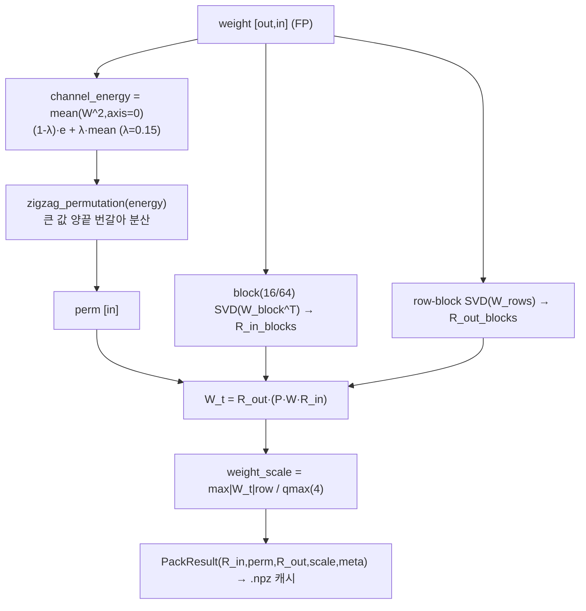
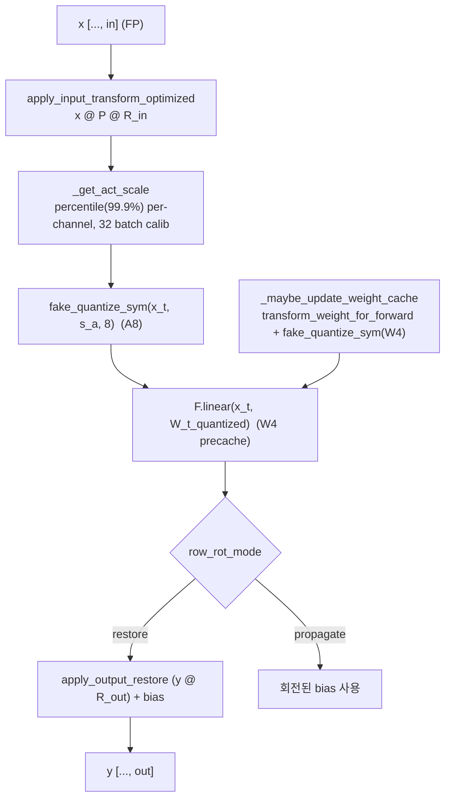
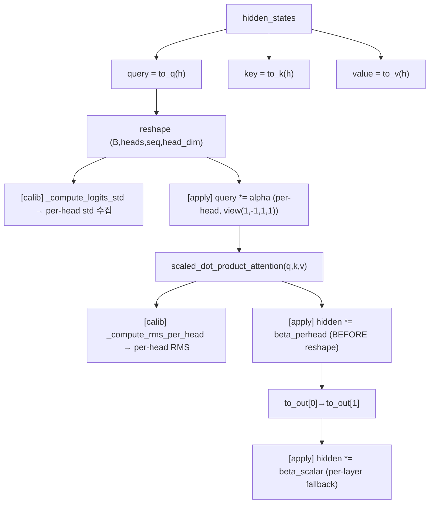
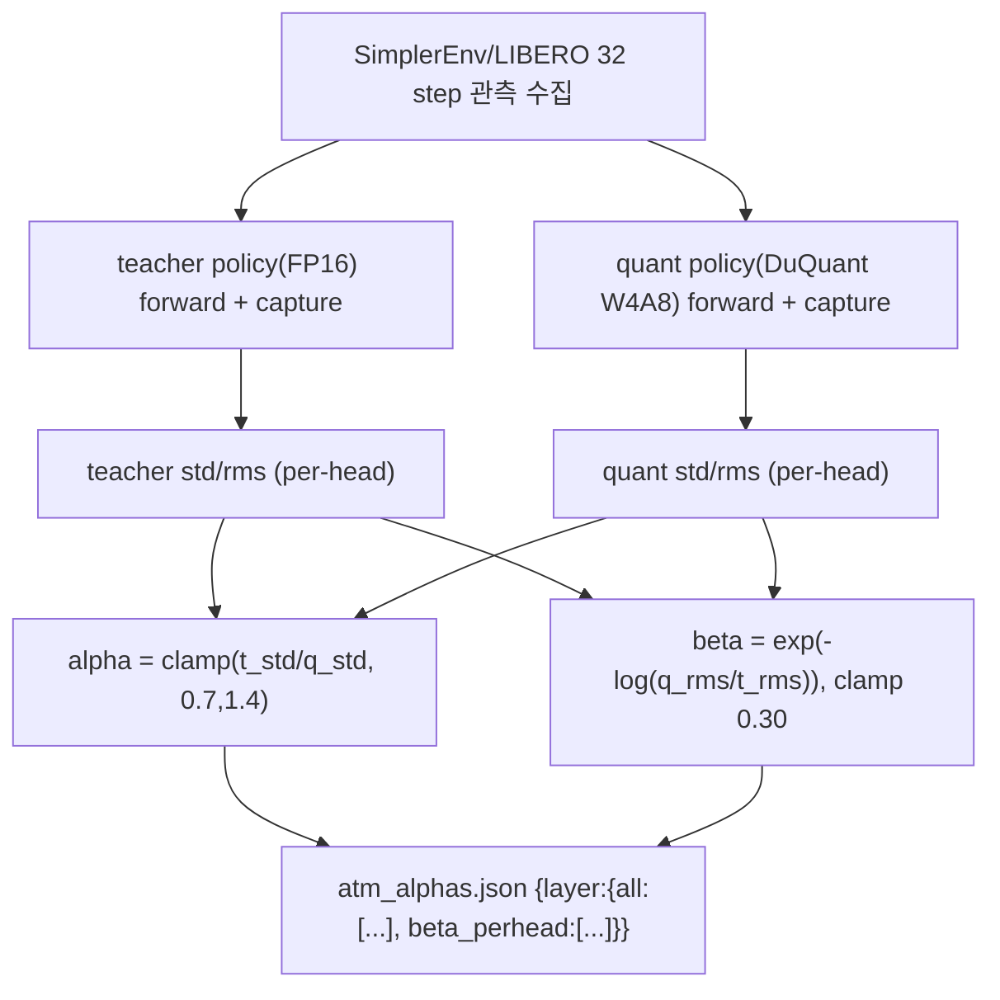

# QuantVLA 모듈 통합 가이드 (S-PyTorch)

> 1차 요약: [`../QuantVLA.md`](../QuantVLA.md) — 본 문서는 그 요약을 모듈 단위로 심화한 통합 가이드다.
> 분석 대상: `\\wsl.localhost\ubuntu-24.04\home\user\project\PRJXR-HBTXR\REF\ViT-Quantization\QuantVLA`
> 작성 원칙: 실제 소스 Read 후 `파일:라인` 근거 표기. 라인 근거 없는 추론은 "추정", 코드로 확인 불가는 "확인 불가"로 명시.
> 형제 가이드(`REF/Analysis/ViT-Quantization/I-ViT/MODULE_GUIDE.md`)의 6요소 구조를 따르되, HW 지표(MAC lanes/scalar MACs)는 **S-PyTorch 수치 규약**(params/FLOPs/activation memory/비트폭/observer)으로 치환한다.
> 경로 표기: 본문 `파일:라인`은 `gr00t/quantization/duquant_preprocess.py` 등 repo 상대경로 기준.

---

## 0. 문서 머리말

### 0.0 핵심 한 줄
QuantVLA = NVIDIA **GR00T-N1.5(3B) VLA 모델**(SigLIP ViT + Qwen3 LLM + flow-matching DiT action head)을 **학습 불필요(training-free) PTQ**로 양자화하는 프레임워크. 기법은 **DuQuant W4A8(회전·순열 기반 fake-quant)** + **ATM(Attention Temperature Matching)** + **OHB(Output Head Balancing)**의 3종 보정으로 확정(코드: `gr00t/quantization/`, `gr00t/atm/`, `tools/calibrate_atm_*.py`).

### 0.1 VLA 대상·기법 코드 확정

| 구성 | 모델/모듈 | 양자화 여부 | 코드 근거 |
|---|---|---|---|
| **Vision** | Eagle2 SigLIP ViT | **비양자화(exclude)** | exclude 정규식 `vision_model\|vision\|radio` (`duquant_layers.py:469`), 메모리툴 exclude `vision` (`calc_gr00t_duquant_memory.py:88,93,98,103`) |
| **Language** | Eagle2 Qwen3 LLM | **W4A8 양자화** | include = `backbone.eagle_model.language_model.*.(q\|k\|v\|o\|gate\|up\|down)_proj` (`duquant_layers.py:458`) |
| **Action** | flow-matching **DiT** action head | **W4A8 양자화 (DiT MLP + attn proj)** | include = `action_head.model.*(attn1.to_q/k/v\|attn1.to_out.0\|ff.net.0.proj/2)` (`duquant_layers.py:460`) |
| Action 보조 | state/action encoder, action_decoder, future_tokens, vl_self_attention | **비양자화** | exclude (`duquant_layers.py:469`); action_head 기본 제외 가드 (`duquant_layers.py:393-401`) |

- **기법 확정(코드)**:
  1. **DuQuant W4A8 fake-quant** — symmetric, per-output-channel weight(W4) + per-channel activation(A8). 회전(R_in/R_out, SVD) + zigzag perm + MSE scale + percentile observer (`duquant_preprocess.py`, `duquant_layers.py`).
  2. **ATM** — per-head alpha로 attention logit 분산 매칭, query에 곱해 추론 시 folding (`dit_atm.py:111-119`).
  3. **OHB** — per-head/per-layer beta로 attention 출력 RMS 드리프트 보정 (`dit_atm.py:121-148`).
- **원논문**: *QuantVLA: Scale-Calibrated PTQ for VLA Models*, Zhang 외, **CVPR 2026**, arXiv 2602.20309 (`README.md:5-13,283-291`). "VLA 최초 PTQ + **DiT action head 양자화 최초**" 주장 (`README.md:22,36`).

### 0.2 S-PyTorch 수치 규약 (HW의 MAC lanes/scalar MACs 대체)
- **params**: Linear `in·out (+out bias)`로 분석적 산출. DuQuantLinear는 원 weight를 buffer(`_weight`)로 복제 보존하고 forward마다 fake-quant하므로(`duquant_layers.py:99,302-313`) **학습 가능 params 개수는 FP 원본과 동일**(비트폭만 W4/A8). 단, DuQuant은 레이어당 추가 **회전행렬 R_in/R_out + perm + scale**을 buffer로 보유(메모리 오버헤드, `calc_gr00t_duquant_memory.py:62-76`).
- **FLOPs/MACs**: 표준식. Linear MAC = `B·N·in·out`. DuQuant은 여기에 **블록 회전 matmul 오버헤드**(R_in: 입력 측, R_out: 출력 복원)가 forward마다 추가됨(`duquant_preprocess.py:560-649`). DiT/LLM 차원 config로 산출(0.4절).
- **activation memory**: 텐서 shape × 비트폭. fake-quant라 실제 텐서는 FP16/FP32지만(`fake_quantize_sym`이 `x_clamped*scale`=float 반환, `duquant_preprocess.py:130-134`), **정수 도메인 비트폭**(W4/A8)을 "HW 환산"으로 표기.
- **비트폭/observer**: 코드 직접. 기본 **W4 / A8**(`DuQuantConfig.weight_bits=4, act_bits=8`, `duquant_layers.py:52,54`). weight=per-out-channel symmetric(MSE grid scale), activation=per-channel symmetric(percentile 99.9% observer, momentum 없이 running-max, `duquant_preprocess.py:429-463`). zero-point=0(대칭). bias는 양자화 안 함(FP로 유지, `duquant_layers.py:323-332`).
- **정확도/성공률**: README/논문 인용. 코드로 직접 재현(미실행) → 측정 불가 항목은 "확인 불가".

### 0.3 운영 경로 (PTQ calibration ↔ 환경변수 ↔ LIBERO 평가)
```
[FP GR00T-N1.5 체크포인트 로드] Gr00tPolicy(model_path=...)        (policy.py)
   │  action_head 재생성(action_horizon 갱신) 후 DiT까지 양자화 보장   (policy.py:250-276)
   ▼
[DiT attention 패치] ensure_dit_attention_patch → _ATMProcessor    (policy.py:280, dit_atm.py:211-219)
   ▼
[DuQuant 적용] enable_duquant_if_configured(model)                  (policy.py:288-289)
   │  GR00T_DUQUANT_* env → select_targets(include/exclude regex) → wrap_duquant
   │  레이어별 pack_weight(SVD 회전/perm/scale) 사전계산 + .npz 캐시   (duquant_layers.py:106-115)
   │  W4 per-out-ch + A8 per-ch percentile(99.9%, 32 batch calib)
   ▼
[ATM/OHB 적용] enable_dit_atm_if_configured(model)                  (policy.py:295)
   │  alpha/beta JSON 로드 → 각 DiT attention에 per-head alpha·beta 주입 (dit_atm.py:336-365)
   ▼
[추론] flow-matching DiT N-step denoising (기본 8 step)            (flow_matching_action_head.py:373-377; README.md:267)
   ▼
[(별도) calibration] tools/calibrate_atm_*.py: teacher(FP) vs quant 32-step → alpha/beta JSON
   ▼
[(별도) 배포] deployment_scripts/export_onnx.py → ViT/LLM/action-head FP16 ONNX → TRT
```
- 타깃 디바이스: **NVIDIA CUDA GPU 전제**(A40/H100/RTX4090/A6000 테스트, CUDA ≥12.4, `README.md:61-63`). SVD가 GPU torch.linalg.svd 우선·CPU fallback(`duquant_preprocess.py:170-180`), 활성 양자화/회전이 GPU 텐서 연산 → CPU 단독 추론 가능 여부는 확인 불가(실행 미검증).
- 이중 conda 환경: `groot_test`(torch 2.5.1+cu124, transformers 4.51.3, diffusers 0.30.2, flash-attn 2.7.1, gr00t) + `libero_test`(LIBERO/robosuite/mujoco) (`README.md:53-56,130-136`).

### 0.4 모델 / 데이터셋 / 정확도·성공률 (README·코드 인용)

**모델 구성 (GR00T-N1.5-3B)**
| 서브모델 | 구성 | config 근거 |
|---|---|---|
| Vision (Eagle2) | SigLIP ViT (`SiglipVisionTransformer`) | `export_onnx.py:26-29,49` |
| Language (Eagle2) | Qwen3 ForCausalLM | `export_onnx.py:24,144` |
| Action head | flow-matching **DiT** + state/action encoder + action_decoder + future_tokens | `flow_matching_action_head.py:165-199` |
| DiT (클래스 기본값) | heads=8, head_dim=64, layers=12, output_dim=26, ada_norm, gelu-approximate | `cross_attention_dit.py:197-213` |
| DiT (**N1.5 실제 인스턴스**) | **16 transformer_blocks × 32 heads** = 512 head | calib 스크립트 docstring·beta 수 (`calibrate_atm_simpler_perhead_ohb.py:8-9`) |
| action head config | hidden_size=1024, input_embedding_dim=1536, num_target_vision_tokens=32, max_num_embodiments=32 | `flow_matching_action_head.py:118,124,140,155-157` |
| flow-matching | noise Beta(α=1.5,β=1.0), s=0.999, timestep buckets=1000, 기본 denoising 8 step | `flow_matching_action_head.py:128-134`; `README.md:267` |

> 주: DiT 클래스 기본값(8 head/12 layer)과 N1.5 실제 인스턴스(32 head/16 block)가 다르다. 양자화·calibration 코드는 N1.5의 실제 `transformer_blocks` 수(16)·head 수(32)를 동적으로 따른다(`dit_atm.py:336`, `calibrate_atm_simpler_perhead_ohb.py:8-9`). 본 가이드 정량은 **N1.5 실제값(16블록·32헤드·inner_dim=2048)**을 기준으로 하며 "추정" 표기.

**데이터셋 / 벤치마크**
- **LIBERO**(시뮬, libero_spatial/goal/object/90/10), SimplerEnv(google_robot/widowx), SO-100/RoboCasa (`README.md:224`, `examples/*`, `calibrate_atm_simpler_perhead_ohb.py:286-294`).
- calibration buffer: **32 step**(unlabeled, teacher policy 또는 dummy action 수집) (`calibrate_atm_simpler_perhead_ohb.py:78,317-355`).

**정확도/성공률** (README 인용 — 코드 재현 미실행)
- LIBERO에서 **FP baseline 성공률 상회**, 양자화 컴포넌트 **~70% 상대 메모리 절감**, **1.22× end-to-end 속도** 주장 (`README.md:22,36`). 구체 수치표는 README에 없음 → 세부 성공률·레이턴시 **확인 불가**.

---

## 1. Repo / Layer 개요

QuantVLA = **GR00T 공식 코드(NVIDIA Isaac-GR00T) 위에 얹은 커스텀 양자화·보정 모듈**이 자체 소스(`README.md:274-275`). 모델 정의(gr00t/model, action_head, backbone)는 GR00T 원본에 가까우나, `gr00t/quantization/`·`gr00t/atm/`·`tools/calibrate_atm_*`·`tools/calc_gr00t_duquant_memory.py`가 QuantVLA 고유 구현. DuQuant 자체는 **OpenPI duquant 구현 차용**(`duquant_layers.py:1-6,33`).

### 1.1 자체 소스 vs 외부 프레임워크 vs 제외

| 구분 | 파일(자체/핵심) | 역할 |
|---|---|---|
| **양자화 기반함수** | `gr00t/quantization/duquant_preprocess.py` ★핵심 | fake_quantize_sym, pack_weight(SVD 회전/zigzag perm), compute_mse_scales, PercentileCalibrator, transform/restore 함수군 |
| **양자화 레이어** | `gr00t/quantization/duquant_layers.py` ★핵심 | DuQuantLinear, DuQuantConfig, select_targets, wrap_duquant, enable_duquant_if_configured |
| **attention 보정** | `gr00t/atm/dit_atm.py` ★핵심 | _ATMProcessor(ATM alpha + OHB beta), capture 콜백, enable_dit_atm_if_configured |
| **적용 진입점** | `gr00t/model/policy.py` | Gr00tPolicy 로드 시 패치→DuQuant→ATM/OHB wiring |
| **calibration** | `tools/calibrate_atm_simpler_perhead_ohb.py` 등 3종 | teacher(FP)/quant std·RMS 수집 → alpha/beta JSON 산출 |
| **메모리 분석** | `tools/calc_gr00t_duquant_memory.py` | safetensors 차원 읽어 DuQuant 메모리/압축비 추정 |
| **배포** | `deployment_scripts/export_onnx.py`, `trt_torch.py`, `trt_model_forward.py` | ViT/LLM/action-head FP16 ONNX 분할 export + TRT 래퍼 |
| **모델 정의(GR00T 원본 계열)** | `gr00t/model/action_head/{flow_matching_action_head,cross_attention_dit,action_encoder}.py`, `backbone/eagle_backbone.py` | DiT, flow-matching head, Eagle2 백본 (양자화 대상 모듈 정의) |

### 1.2 forward 진입점 / 양자화 wiring
`Gr00tPolicy` 모델 로드 마무리 단계(`policy.py:278-299`):
1. `ensure_dit_attention_patch(model)` — DiT(`action_head.model.transformer_blocks`) attention processor를 `_ATMProcessor`로 교체(`policy.py:280`, `dit_atm.py:211-219`).
2. `enable_duquant_if_configured(model)` — `GR00T_DUQUANT_*` env 있으면 select→wrap (`policy.py:288-289`).
3. `enable_dit_atm_if_configured(model)` — alpha/beta JSON 주입 (`policy.py:295`).
4. `model.to(device)` — 양자화/패치 후 디바이스 이동 (`policy.py:299`).
- 추론 시 DuQuantLinear.forward는 `(입력회전 → A8 fake-quant → W4 정수 weight로 F.linear → 출력 복원 → bias)` (`duquant_layers.py:285-340`). DiT attention은 `_ATMProcessor.__call__`로 ATM/OHB folding (`dit_atm.py:46-158`).

### 1.3 제외 (지시에 따라 미분석/이름만)
- **외부 프레임워크(커스텀 아님)**: `diffusers`(Attention/AttnProcessor2_0/FeedForward/Timesteps — `dit_atm.py:10-11`, `cross_attention_dit.py:20-27`), `transformers`(Qwen3/SigLIP — `export_onnx.py:24-29`), torch/numpy/safetensors. **GR00T-N1.5 사전학습 가중치**(HF `youliangtan/gr00t-n1.5-*`, safetensors — `calibrate_atm_simpler_perhead_ohb.py:13-14`, `calc_gr00t_duquant_memory.py:118`) — 가중치만 로드.
- **제외 대형 자산**: `demo_data/`(parquet/mp4), `tests/*.mp4`, `.git/`, `__pycache__/`(지시).
- **미열람(확인 불가)**: SimplerEnv/LIBERO 환경 래퍼 세부, `eagle_backbone.py`/`eagle2_hg_model/` 내부, `trt_*.py` TRT 추론 경로 세부, `data/`·`experiment/` 파이프라인.

### 1.4 대표 분석 단위
- **DuQuantLinear 1개**(가중치 양자화 PE) = 0.4·0.5절 핵심.
- **DiT attention 1 block**(ATM/OHB 보정) = `_ATMProcessor` (3장).
- 대표 정량 환원 기준: **Qwen3 LLM linear** + **DiT 16블록(32헤드, inner_dim=2048)**.

---

## 2. 모듈: DuQuant 전처리/양자화 커널 — `duquant_preprocess.py` ★핵심

### 2.1 역할 + 상위/하위
- **역할**: DuQuant의 수치 핵심. (1) `fake_quantize_sym` symmetric round-clamp-rescale, (2) `pack_weight` 블록 직교회전(SVD R_in/R_out) + zigzag perm 사전계산, (3) `compute_mse_scales` MSE grid weight scale, (4) `PercentileCalibrator` activation observer, (5) transform/restore 함수군(회전 적용/복원).
- **상위**: `DuQuantLinear`(`duquant_layers.py`)가 전부 호출. **하위**: numpy, torch.linalg.svd, np.frexp 미사용(I-ViT와 달리 dyadic 없음).

### 2.2 데이터플로우 (pack_weight 사전계산 → forward)


### 2.3 forward call stack
`DuQuantLinear.__init__`(`duquant_layers.py:106-115`) → `pack_weight`(`:206`) → `zigzag_permutation`(`:188`) + `compute_block_rotation`(`:158`, SVD) ×블록 + row SVD(`:273-289`). 추론: `DuQuantLinear.forward`(`:285`) → `apply_input_transform_optimized`(`:288`,`preprocess:560`) → `fake_quantize_sym`(`:295`,`preprocess:120`) → `transform_weight_for_forward_optimized`(`:204`,`preprocess:652`) → `apply_output_restore_optimized`(`:320`,`preprocess:610`).

### 2.4 대표 코드 위치
`duquant_preprocess.py`: `fake_quantize_sym` `:120-137`, `pack_weight` `:206-309`, `zigzag_permutation` `:188-203`, `compute_block_rotation`(SVD) `:158-185`, row SVD `:264-289`, `compute_mse_scales` `:474-491`, `PercentileCalibrator` `:429-463`, optimized transform `:560-728`.

### 2.5 대표 코드 블록

```python
# duquant_preprocess.py:130-134  symmetric fake-quant (dequant까지 1회)
max_q = qmax(bits)                                   # W4→7, A8→127
x_scaled = x / scale
x_clamped = torch.clamp(torch.round(x_scaled), -max_q - 1, max_q)
return x_clamped * scale                             # 정수→float 복원(STE 없음, inference-only)
```
→ `qmax(bits)=(1<<(bits-1))-1` (`:27-28`). W4 범위 [-8,7], A8 [-128,127]. **곱셈기 친화 zero-point=0 대칭**.

```python
# duquant_preprocess.py:219-223  채널 에너지 평활 + zigzag perm (outlier 분산)
channel_energy = np.mean(W_np ** 2, axis=0)
channel_energy = (1.0-λ)*channel_energy + λ*mean_e   # λ=lambda_smooth=0.15
perm = zigzag_permutation(channel_energy)            # 큰 에너지 채널을 블록에 고루 분배
```

```python
# duquant_preprocess.py:166-185  블록 직교회전 = W_block^T의 SVD U (GPU 우선)
X = W_block.T  # [B, out]
U_torch, _, _ = torch.linalg.svd(X_torch, full_matrices=True)  # GPU SVD
U = U_torch.cpu().numpy()                                       # 직교행렬 R_in
```
→ 입력 블록(B=16 또는 calib 64)마다 직교회전 행렬 산출. **DuQuant의 핵심: 양자화 grid-friendly basis로 회전 후 정수화**.

```python
# duquant_preprocess.py:484-491  MSE grid scale (max-abs보다 robust)
Q = torch.clamp(torch.round(W_row / S_e), -max_q-1, max_q)
mse = torch.mean((Q*S_e - W_row)**2, dim=2)          # 후보 5종(α=0.5~1.5) MSE
best = S[arange(O), argmin(mse, dim=1)]              # per-out-channel 최적 scale
```

### 2.6 연산·수치표현 분해 + 정량
- **양자화 방식**: weight per-output-channel symmetric, scale=MSE grid(`alphas=[0.5,0.75,1.0,1.25,1.5]`, `:468`); activation per-channel symmetric, scale=percentile(99.9%)/qmax. zero-point=0.
- **회전 불변성**: R_in/R_out 직교 → `(W·R_in)(R_in^T·x)=W·x` 보존, 출력은 `apply_output_restore`로 R_out 역회전(`:389-408`). row_rot_mode='restore'(기본)는 출력 복원, 'propagate'는 bias에 회전 전파(`:411-426`).
- **비트폭**: W4(기본), A8. pack 단계 scale은 `qmax(4)` 가정이나 레이어가 override(`:293` 주석, `transform_weight_for_forward`가 weight_bits로 재산출 `:380-385`).
- **params**: 함수 자체 0. 단 PackResult이 레이어당 **R_in(블록수×B²) + R_out + perm(in) + weight_scale(out)** buffer 생성.
- **FLOPs(추가 오버헤드)**: 입력 회전 = 블록 batched matmul(einsum `rnb,nbc->rnc`, `:594`), 출력 복원 동일. block=64면 in/out당 `(in/64)·64²` = `64·in` 추가 곱(원 MAC 대비 `64/out` 비율, 추정).
- **observer**: PercentileCalibrator는 **momentum 없는 running-max**(`torch.maximum(_p_running, q)`, `:453`), max_batches(기본 32, calib_batches로 override) 도달 시 finalize. I-ViT의 EMA(0.95)와 대비.
- **병목**: 레이어마다 SVD(GPU torch.linalg.svd) 사전계산 + `.npz` 디스크 캐시. 첫 실행 ~5-10분(`README.md:251`).

---

## 3. 모듈: DuQuant Linear / 레이어 선택·치환 — `duquant_layers.py` ★핵심

### 3.1 역할 + 상위/하위
- **역할**: nn.Linear를 `DuQuantLinear`로 in-place 교체. forward에서 (입력 perm·회전 → A8 활성 fake-quant → W4 weight fake-quant → F.linear → 출력 복원 → bias). DuQuantConfig은 환경변수 기반. select_targets/wrap_duquant/enable_duquant_if_configured로 선택적 레이아웃 구현.
- **상위**: `policy.py:288-289`의 `enable_duquant_if_configured`. **하위**: `duquant_preprocess.py` 전 함수.

### 3.2 데이터플로우 (DuQuantLinear.forward)


### 3.3 forward call stack
`DuQuantLinear.forward`(`:285`) → `apply_input_transform_optimized`(`:288`) → `_get_act_scale`(`:294`→`:248-283`) → `fake_quantize_sym`(`:295`) → `_maybe_update_weight_cache`(`:298`→`:196-247`) → `F.linear`(`:302` precache 경로 / `:304-313` fallback) → `apply_output_restore_optimized`(`:320`).

### 3.4 대표 코드 위치
`duquant_layers.py`: `DuQuantConfig.__post_init__`(env read) `:49-70`, `DuQuantLinear.__init__` `:93-168`, `_maybe_update_weight_cache` `:196-247`, `_get_act_scale` `:248-283`, `forward` `:285-340`, `select_targets` `:351-378`, `wrap_duquant`(action_head 가드) `:381-429`, `enable_duquant_if_configured`(기본 include/exclude) `:432-509`.

### 3.5 대표 코드 블록

```python
# duquant_layers.py:51-70  환경변수 기반 W4A8 기본 설정
self.weight_bits = int(os.environ.get("GR00T_DUQUANT_WBITS_DEFAULT", 4))   # W4
self.act_bits    = int(os.environ.get("GR00T_DUQUANT_ABITS", 8))           # A8
self.block_size  = int(os.environ.get("GR00T_DUQUANT_BLOCK", 16))          # calib 스크립트는 64
self.act_percentile = float(os.environ.get("GR00T_DUQUANT_ACT_PCT", 99.9))
self.row_rot_mode   = os.environ.get("GR00T_DUQUANT_ROW_ROT", "restore")
```

```python
# duquant_layers.py:259-267  activation scale = percentile / qmax (per-channel)
p_vec = self.calibrator.finalize()                  # running-max percentile [C]
max_q = qmax(self.cfg.act_bits)                      # 127
scale = torch.clamp(p_vec / max_q, min=1e-6)         # per-channel A8 scale
```

```python
# duquant_layers.py:300-313  precache된 INT4 weight로 F.linear (또는 즉시 fake-quant)
if self._weight_quantized_cached:
    y_lin = F.linear(x_t, self._W_t_quantized, None)        # 사전양자화 W4 weight
elif self.weight_bits > 0:
    y_lin = F.linear(x_t, fake_quantize_sym(self._W_t, self._w_scales[:,None],
                     self.weight_bits, label="weight_fallback"), None)
```
→ `GR00T_DUQUANT_PRECACHE_WEIGHTS=1`(기본)이면 W4 양자화 weight를 buffer에 캐시(`:219-224`)해 forward마다 재양자화 회피. **bias는 양자화하지 않고 FP로 가산**(`:323-332`).

```python
# duquant_layers.py:393-401  action head 기본 제외 가드
if os.environ.get("GR00T_DUQUANT_INCLUDE_ACTION_HEAD","0") in ("0",...):
    is_action_head = "action_head" in name and not name.startswith("action_head.model.")
    if name.endswith("action_out_proj") or is_action_head:
        continue                                     # action_decoder 등 보호
```

```python
# duquant_layers.py:458-472  기본 selective layout (LLM 전부 + DiT MLP/attn proj, vision 제외)
inc = r".*(?:backbone\.eagle_model\.language_model\..*\.(?:q|k|v|o|gate|up|down)_proj
          |action_head\.model\..*(?:attn1\.to_(?:q|k|v)|attn1\.to_out\.0|ff\.net\.(?:0\.proj|2))).*"
exc = r"...(?:vision_model|vision|radio|norm|...|lm_head|...|action_decoder|...)..."
```
→ §0.1 selective quantization layout의 코드 구현. **단, calibration 스크립트 기본 include는 DiT의 attn1을 제외하고 ff.net만**(`calibrate_atm_simpler_perhead_ohb.py:46-47`) → 논문의 "attention projection FP 유지" 변형. 시나리오별로 DiT attn1 포함/제외가 달라짐(`calc_gr00t_duquant_memory.py:90-104` SCENARIOS).

### 3.6 연산·수치표현 분해 + 정량 (Qwen3 LLM linear 예, 차원은 추정)
- **양자화 방식**: W4 per-out-ch symmetric(MSE), A8 per-ch symmetric(percentile). bias FP. zp=0.
- **params**: 레이어 weight params = `out·in`(FP 개수 불변). + DuQuant buffer: R_in `(in/B)·B²`, R_out `(out/B)·B²`, perm `in`, scale `out`. block=64면 R_in/R_out은 각 `64·in`/`64·out` float32(`calc_gr00t_duquant_memory.py:65-70`).
- **메모리(메모리툴 모델식, `calc_gr00t_duquant_memory.py:62-76`)**:
  - quantized_weights = `out·in·4/8` bytes (W4)
  - weight_scales = `out·2`(FP16), bias = `out·2`(FP16)
  - R_in = `⌈in/64⌉·64²·4`, R_out = `⌈out/64⌉·64²·4`(restore), perm = `in·4`
  - → 원본 BF16(`out·in·2`) 대비 압축비는 레이어 클수록 4×에 근접(회전·perm 오버헤드 amortize).
- **활성 memory(HW 환산)**: 입력 [B,N,in] A8 = `B·N·in·1 byte`(I-ViT 대비 동일 규약).
- **시사**: 실제 INT4 GEMM이 아니라 **W4 양자값을 float로 복원해 F.linear**(`:302`) → 실 정수 커널·메모리 절감은 시뮬레이션. 실 INT 커널/ONNX·TRT INT export는 확인 불가(배포는 FP16, 7장).

---

## 4. 모듈: ATM (Attention Temperature Matching) — `dit_atm.py` (_ATMProcessor) ★보정

### 4.1 역할 + 상위/하위
- **역할**: DiT attention의 QKᵀ logit 분산을 per-head alpha로 안정화. `query *= alpha` 후 `scaled_dot_product_attention` → temperature 조정. alpha는 calibration에서 teacher/quant logit std 비로 산출, 추론 시 query 스케일에 folding(추가 op 없음).
- **상위**: `policy.py:295` `enable_dit_atm_if_configured`, calibration 스크립트. **하위**: diffusers `AttnProcessor2_0`, `scaled_dot_product_attention`.

### 4.2 데이터플로우 (DiT attention forward)


### 4.3 forward call stack
`_ATMProcessor.__call__`(`dit_atm.py:46`) → to_q/k/v(`:77-85`) → reshape(`:90-92`) → `_compute_logits_std`(`:103`,`:161-188`, calib 시) → `query *= alpha`(`:113-115`) → `scaled_dot_product_attention`(`:117-119`) → `_compute_rms_per_head`(`:125`,`:195-208`) → `hidden *= beta_perhead`(`:128-133`) → to_out(`:138-139`) → `hidden *= beta`(`:146-148`).

### 4.4 대표 코드 위치
`dit_atm.py`: `_ATMProcessor.__call__` `:46-158`, ATM alpha 적용 `:111-119`, logit std `:161-188`, RMS `:191-208`, 패치 `:211-219`, alpha/beta 주입 `:336-365`.

### 4.5 대표 코드 블록

```python
# dit_atm.py:111-119  ATM: per-head alpha를 query에 folding 후 SDPA
alpha = getattr(attn, "_atm_alpha_all", None)
if alpha is not None:
    alpha = alpha.to(query.dtype, query.device).view(1, -1, 1, 1)  # per-head
    query = query * alpha                                          # logit temperature 조정
hidden_states = F.scaled_dot_product_attention(query, key, value, ...)
```

```python
# dit_atm.py:170-185  calib: per-head logit std 계산 (teacher/quant 매칭 대상)
scale = 1.0 / math.sqrt(head_dim)
logits = (query @ key.transpose(-1,-2)) * scale
mean = (logits*valid).sum((-1,-2)) / count
var  = ((logits-mean)**2 * valid).sum((-1,-2)) / count
std  = sqrt(var.clamp_min(1e-12))                    # per-head std
```

### 4.6 연산·수치표현 분해 + 정량
- **방식**: per-head 스칼라 alpha(곱셈). 양자화 자체가 아니라 **양자화 유발 attention drift 보정층**.
- **alpha 산출**(calib, `calibrate_atm_simpler_perhead_ohb.py:399-406`): `alpha = clamp(teacher_std/(quant_std+ε), 0.7, 1.4)`, `|alpha-1|<0.02`면 1.0(neutral). per-layer per-head 벡터.
- **params/FLOPs**: 학습 params 0. forward 추가 비용 = query에 per-head 곱(`B·heads·seq·head_dim` mul, 무시 가능). **dequant scale에 folding되어 추가 op 없음** 주장(`README.md:36`; 코드상 query 곱 1회, "추정").
- **N1.5 규모**: 16블록 × 32head = **512 alpha 값**(`calibrate_atm_simpler_perhead_ohb.py:8-9`).
- **활성 memory**: 변화 없음(스케일만).

---

## 5. 모듈: OHB (Output Head Balancing) — `dit_atm.py` (beta) ★보정

### 5.1 역할 + 상위/하위
- **역할**: attention 출력(projection 전후)의 per-head/per-layer RMS 에너지 드리프트를 beta로 보정. per-head beta는 reshape 전 `hidden *= beta_perhead`, per-layer beta는 to_out 후 스칼라 곱.
- **상위**: `enable_dit_atm_if_configured`(`dit_atm.py:353-365`). **하위**: 없음(텐서 곱).

### 5.2 forward call stack / 코드 위치
per-head: `_ATMProcessor.__call__`(`:128-133`), capture `_compute_rms_per_head`(`:125`,`:195-208`). per-layer: `:146-148`, capture `_compute_rms`(`:144`,`:191-192`). 주입: `:353-365`(beta_perhead 우선, 없으면 per-layer scalar fallback).

### 5.3 대표 코드 블록
```python
# dit_atm.py:128-133  per-head OHB beta (reshape 전, (1,heads,1,1))
beta_perhead = getattr(attn, "_ohb_beta_perhead", None)
if beta_perhead is not None:
    beta_perhead = beta_perhead.to(hidden.dtype).view(1, -1, 1, 1)
    hidden_states = hidden_states * beta_perhead     # per-head energy 보정
```
```python
# calibrate_atm_simpler_perhead_ohb.py:439-445  beta = exp(-log(quant_rms/teacher_rms)), log-domain clamp
rho = q / t                                          # quant/teacher RMS 비
log_beta = -math.log(max(rho, 1e-8))
log_beta = max(-0.30, min(0.30, log_beta))           # log_clamp=0.30
beta = 1.0 if abs(log_beta) < 0.03 else math.exp(log_beta)   # neutral=0.03
```

### 5.4 연산·수치표현 분해 + 정량
- **방식**: per-head/per-layer 스칼라 beta(곱셈). teacher/quant RMS 비를 log-domain clamp(0.30)·neutral(0.03)로 산출.
- **N1.5 규모**: per-layer = 16 beta(블록당 1), **per-head = 16×32 = 512 beta**(`calibrate_atm_simpler_perhead_ohb.py:8-9`).
- **params/FLOPs**: 학습 params 0. 추가 곱 1회(무시 가능).
- **scope**: 기본 DiT만(`GR00T_OHB_ONLY_DIT=1`, `dit_atm.py:328`).

---

## 6. 모듈: calibration 파이프라인 — `tools/calibrate_atm_simpler_perhead_ohb.py`

### 6.1 역할 + 상위/하위
- **역할**: teacher(FP) vs quant(DuQuant) 모델을 32 step 같은 관측으로 forward, DiT attention의 per-head **logit std**(ATM) + per-head **output RMS**(OHB)를 수집해 `alpha = teacher_std/quant_std`, `beta = teacher_rms/quant_rms`(log-domain)로 JSON 산출.
- **상위**: CLI. **하위**: `gr00t.atm`의 capture 콜백(`register_atm_capture`, `register_ohb_perhead_capture`), `Gr00tPolicy`.

### 6.2 데이터플로우 / 코드 위치

`calibrate_atm_simpler_perhead_ohb.py`: 기본 DuQuant env(W4/A8/block64/permute off/restore) `:44-56`, parse_args(steps/alpha-min·max/ohb-clamp) `:69-98`, std 수집 `:101-126`, RMS 수집 `:129-155`, alpha 산출 `:386-407`, beta 산출 `:410-449`, main(teacher→quant→JSON) `:494-559+`.

### 6.3 연산·수치표현 분해 + 정량
- **calibration buffer**: 32 step(`--steps 32`, `:78`), teacher policy-driven 또는 dummy action(`:330-349`). training-free(역전파 없음, `torch.set_grad_enabled(False)` `:283,376`).
- **하이퍼파라미터**: alpha clamp [0.7,1.4](`:92-95`), alpha neutral 0.02(`:391,405`), OHB log_clamp 0.30(`:84`), OHB neutral 0.03(`:86`), seed 42(`:96`), denoising_steps 8(`:522`).
- **DuQuant env(calib 기본)**: W4/A8/**block 64**/permute **off**/row_rot restore/act_pct 99.9/calib 32/λ 0.15 (`:44-56`). DiT include = ff.net만(attn1 제외, `:46-47`).
- **재현 명령**(`:11-18`):
  ```bash
  python tools/calibrate_atm_simpler_perhead_ohb.py \
    --teacher-checkpoint youliangtan/gr00t-n1.5-fractal-posttrain \
    --quant-checkpoint   youliangtan/gr00t-n1.5-fractal-posttrain \
    --env google_robot_pick_coke_can --steps 32 \
    --out atm_alphas_fractal_perhead_ohb.json --calibrate-ohb 1
  ```

---

## 7. 모듈: 배포 export — `deployment_scripts/export_onnx.py`

### 7.1 역할 + 상위/하위
- **역할**: GR00T를 3개 ONNX로 분할 export — Eagle2 ViT(SigLIP), Eagle2 LLM(Qwen3), action head(vlln/vl_self_attention, state/action encoder, DiT, action_decoder). 전부 **FP16, opset 19**. TRT 엔진 빌드는 `build_engine.sh`, 추론은 `trt_torch.py`/`trt_model_forward.py`.
- **상위**: CLI(`deployment_scripts/README.md`, `getting_started/5_policy_deployment.md`). **하위**: torch.onnx.export, transformers SigLIP/Qwen3.

### 7.2 코드 위치
`export_onnx.py`: `export_eagle2_vit` `:49-141`, `export_eagle2_llm`(attn=eager) `:144-238`, `export_action_head`(vlln/state/action encoder/DiT/decoder) `:253-385`.

### 7.3 연산·수치표현 분해 + 정량
- **export precision**: 모두 `.to(torch.float16)`(`:258,280,302`). DuQuant INT4/INT8 정수 커널을 ONNX/TRT로 내보내는 코드는 **확인 불가**(export 경로는 FP16, DuQuant fake-quant는 PyTorch 런타임 시뮬). → 양자화(W4A8)와 배포(FP16)가 **분리된 경로**.
- action head export 입력: backbone_features `[1,seq,backbone_embedding_dim]`, state `[1,N,state_dim]`, actions `[1,action_horizon,action_dim]` (`:261-308`).
- **시사**: 70% 메모리·1.22× 속도(`README.md:22`)는 양자화 컴포넌트 기준 주장이며, 본 FP16 export 경로로는 코드 직접 재현 미확인 → 확인 불가.

---

## N+1. 모듈 한눈 요약 표

| 모듈 | 파일:라인 | 역할 | 양자화/보정 방식 | 대표 정량 |
|---|---|---|---|---|
| fake_quantize_sym | duquant_preprocess.py:120-137 | symmetric round-clamp-rescale | zp=0, W4 [-8,7]/A8 [-128,127] | params 0, inference-only(STE 없음) |
| pack_weight | duquant_preprocess.py:206-309 | SVD 회전(R_in/R_out)+zigzag perm 사전계산 | 직교회전 grid-friendly basis | 레이어당 SVD+.npz 캐시, λ=0.15 |
| compute_mse_scales | duquant_preprocess.py:474-491 | per-out-ch MSE grid scale | α∈[0.5,1.5] 5종 | max-abs보다 robust |
| PercentileCalibrator | duquant_preprocess.py:429-463 | per-ch activation observer | percentile 99.9% running-max | max_batches 32(momentum 없음) |
| DuQuantLinear | duquant_layers.py:90-340 | Linear→W4A8 fake-quant + 회전 | W4 per-out-ch / A8 per-ch / bias FP | params FP불변, +R_in/R_out/perm buffer |
| select/wrap/enable | duquant_layers.py:351-509 | selective layout(LLM+DiT, vision 제외) | include/exclude regex | LLM q/k/v/o/gate/up/down + DiT ff/attn1 |
| _ATMProcessor (ATM) | dit_atm.py:46-158,111-119 | per-head alpha logit temperature | query*=alpha, folding | 16블록×32head=512 alpha, [0.7,1.4] |
| OHB (beta) | dit_atm.py:121-148 | per-head/layer RMS 보정 | hidden*=beta(log-clamp 0.30) | per-head 512 / per-layer 16 |
| calibrate_atm | tools/...perhead_ohb.py | teacher/quant 32step→alpha/beta JSON | training-free, no backprop | buffer 32 step, seed 42 |
| export_onnx | deployment_scripts/export_onnx.py | ViT/LLM/action-head ONNX | **FP16** opset19 | INT export 확인 불가 |
| calc memory | tools/calc_gr00t_duquant_memory.py | DuQuant 메모리/압축비 추정 | W4 weight+회전+perm bytes | 시나리오별(LLM/DiT/full) |

---

## N+2. 학습·평가 파이프라인 + 재현 명령

- **모델**: NVIDIA GR00T-N1.5-3B = Eagle2(SigLIP ViT + Qwen3 LLM) + flow-matching DiT action head (`export_onnx.py:24-33`, `flow_matching_action_head.py:165-199`).
- **데이터/벤치**: LIBERO(spatial/goal/object/90/10), SimplerEnv, SO-100/RoboCasa (`README.md:224`, `examples/*`).
- **양자화 = training-free PTQ**(역전파·재학습 없음, `README.md:22,36`). calibration buffer 32 step만 필요.
- **양자화 실행**(환경변수 → policy 로드 시 자동 적용):
  ```bash
  # 1) calibration: alpha/beta JSON 산출
  python tools/calibrate_atm_simpler_perhead_ohb.py --teacher-checkpoint <FP> \
    --quant-checkpoint <FP> --steps 32 --out atm_alphas.json --calibrate-ohb 1
  # 2) 양자화 추론 서버 (run_quantvla.sh가 env 세팅)
  GR00T_DUQUANT_WBITS_DEFAULT=4 GR00T_DUQUANT_ABITS=8 GR00T_DUQUANT_BLOCK=64 \
  GR00T_DUQUANT_ROW_ROT=restore GR00T_ATM_ENABLE=1 GR00T_ATM_ALPHA_PATH=atm_alphas.json \
  GR00T_OHB_ENABLE=1 GR00T_DENOISING_STEPS=8 ./run_quantvla.sh libero_10
  ```
  (`README.md:240-267`; env 표 `:259-267`)
- **평가**: 이중 conda — `groot_test`(추론 서버) + `libero_test`(LIBERO 클라이언트). `run_inference_server.sh libero_10` ↔ `run_libero_eval.sh libero_10 --headless` (`README.md:216-235`).
- **체크포인트**: 외부 GR00T-N1.5 사전학습(HF `youliangtan/gr00t-n1.5-*`) — 가중치만 로드(제외).
- **정확도/성공률**: FP baseline 성공률 상회·70% 메모리·1.22× 속도 주장(`README.md:22,36`), 세부 수치표 README 부재 → **확인 불가**(미실행).

---

## N+3. 우리 프로젝트(FPGA ViT/Transformer 가속) 시사점 + FPGA 친화도

> 본 repo는 로봇 제어 VLA로 XR 시선추적과 직접 도메인은 멀다(추정). 그러나 멀티모달 Transformer 양자화 기법은 ViT 가속기에 전이 가능.

### N+3.1 DuQuant 회전·순열 = 양자화 전처리 (전이 가치 ★★)
- **R_in/R_out(SVD 직교회전) + zigzag perm**(`duquant_preprocess.py:158-203`): outlier를 직교회전·순열로 평탄화해 동일 비트폭에서 정확도↑. FPGA INT4/INT8 가중치 양자화 전 단계로 유용.
- **단, 회전행렬 matmul이 HW 추가 비용**(forward마다 입력 회전 + 출력 복원). 가속기에선 R을 **가중치에 사전 folding**(`W'=R_out·W·R_in`을 오프라인 고정)하고 입력 회전만 on-chip 처리하는 방식이 필요(추정). I-ViT의 dyadic requant처럼 정수 도메인 정렬이 아니라 **FP 회전 후 양자화**라 정수전용 파이프라인엔 직접 부적합.

### N+3.2 robust observer / scale (전이 가치 ★★)
- **percentile(99.9%) per-channel observer**(`:429-463`) + **MSE grid scale**(`:474-491`): max-abs보다 outlier-robust. FPGA scale/zp 산출 레퍼런스. I-ViT의 running min/max(EMA)와 상보적.

### N+3.3 ATM/OHB folding per-head 스케일 (전이 가치 ★★)
- **per-head alpha/beta를 dequant scale에 folding**(`dit_atm.py:111-148`): attention logit 분산·출력 에너지를 per-head 스케일로 보정하고 추가 op 없이 흡수. 가속기의 **per-head requantize 스테이지** 설계에 시사(softmax 전후 스케일 folding). 단 alpha/beta는 task별 calibration 필요(일반화 리스크).

### N+3.4 selective layout (전이 가치 ★)
- **attention proj는 FP/정밀 유지, Linear(MLP)만 정수화**(`duquant_layers.py:458-460`, `README.md:36`): HW에서도 softmax/attention은 정밀, GEMM만 정수화하는 하이브리드 데이터패스 근거.

### N+3.5 FPGA 친화도 평가
| 항목 | 평가 | 근거 |
|---|---|---|
| 정수전용(integer-only) | △ fake-quant(float 복원 후 F.linear) | `duquant_layers.py:302`, `duquant_preprocess.py:134` |
| 저비트(W4A8) | ★★ W4 weight + A8 activation | `duquant_layers.py:52,54` |
| 곱셈기-free 비선형 | ✗ 정수 비선형 없음(GELU/Softmax는 diffusers FP) | `cross_attention_dit.py:20-27` |
| 재양자화 PE | △ dyadic 없음, FP scale 곱 | `fake_quantize_sym` `:130-134` |
| 회전 전처리 | ★ outlier 평탄화(단 HW 오버헤드) | `pack_weight` `:206-309` |
| 실 정수 커널/배포 | ✗ ONNX/TRT는 FP16, INT export 확인 불가 | `export_onnx.py:258` |
| calibration 비용 | ★★ training-free 32 step | `README.md:22`, calib `:78` |

### N+3.6 I-ViT 대비 핵심 차이 (동형 비교)
| 축 | I-ViT (integer-only ViT) | QuantVLA (VLA PTQ) |
|---|---|---|
| 패러다임 | QAT(ImageNet 수십 epoch) | **training-free PTQ**(32 step calib) |
| 비트폭 | W8/A8(+A16 residual/softmax) | **W4/A8**(bias FP) |
| weight scale | 대칭 max(\|min\|,max)/n | **MSE grid + SVD 회전** |
| activation observer | running min/max EMA(0.95) | **percentile 99.9% running-max** |
| 비선형 | 정수전용(ShiftGELU/Shiftmax/I-LN) | **FP 유지**(diffusers attention/GELU) |
| requant | dyadic `(z·m)>>e` | FP scale 곱(정수 도메인 정렬 없음) |
| 정수 추론 | TVM 정수 커널(배포) | fake-quant 시뮬(배포는 FP16) |
| 대상 | ViT/DeiT/Swin(이미지) | **멀티모달 VLA**(SigLIP+Qwen3+DiT) |
| 보정 | 없음 | **ATM(logit) + OHB(RMS) per-head** |

---

## 부록. 근거 / 확인 불가

- **직접 코드 확인(전체 Read)**: `duquant_preprocess.py`(729L 전체), `duquant_layers.py`(509L 전체), `dit_atm.py`(380L 전체), `calc_gr00t_duquant_memory.py`(236L 전체), `calibrate_atm_simpler_perhead_ohb.py`(주요 구간), `policy.py`(양자화 wiring), `cross_attention_dit.py`(DiT config), `flow_matching_action_head.py`(action head config), `export_onnx.py`(배포 구간), `README.md`(전체).
- **분석적 산출/규약**: params는 FP 불변 + DuQuant buffer 오버헤드(메모리툴 식 `:62-76`). FLOPs는 Linear 표준식 + 회전 오버헤드(블록 matmul). 정확한 LLM/DiT 레이어 차원은 외부 safetensors 의존 → **분석값은 차원 미확정분 "추정"**.
- **추정**: DiT N1.5 실제 규모(16블록·32헤드, calib docstring 근거), 회전 HW folding 전략, ATM folding "추가 op 없음", §N+3 FPGA/XR 적용 해석, 프로젝트 성격.
- **확인 불가(미열람/미실행)**: 실 INT4/INT8 정수 GEMM 커널(현 코드는 float 복원 F.linear), ONNX/TRT INT export(export는 FP16), 70% 메모리·1.22× 속도·LIBERO 성공률 실측(README 주장, 코드 직접 재현 미확인), 외부 GR00T-N1.5 가중치 내부, SimplerEnv/LIBERO 환경·eagle_backbone·trt_*.py 세부, CPU 단독 추론 가능 여부.
