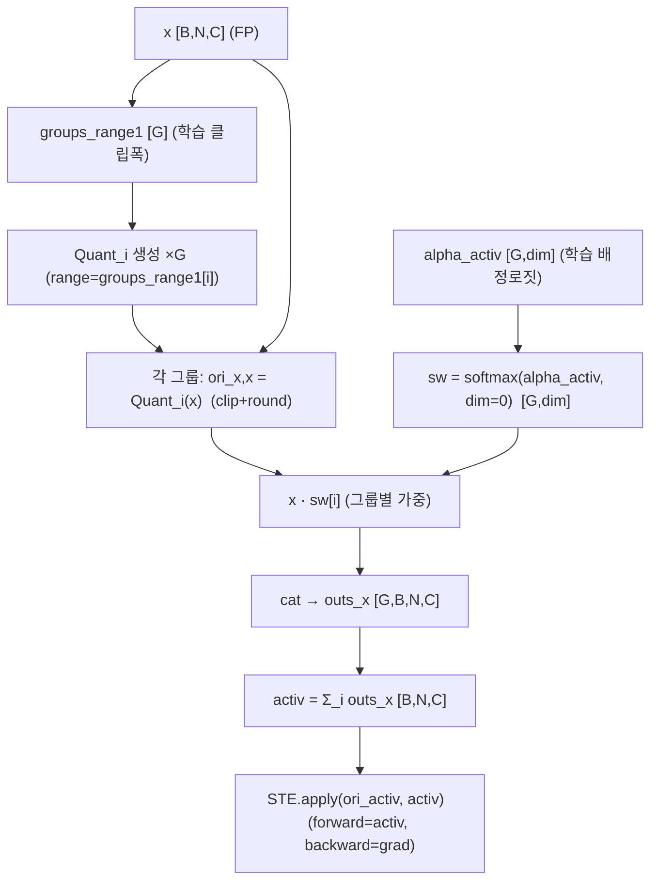
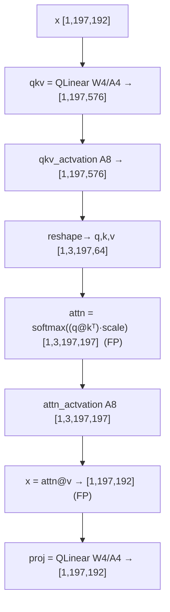

# Quantformer 모듈 통합 가이드 (S-PyTorch)

> 1차 요약: [`../Quantformer.md`](../Quantformer.md) — 본 문서는 그 요약을 코드 Read로 검증·심화한 모듈 단위 통합 가이드다.
> 분석 대상: `\\wsl.localhost\ubuntu-24.04\home\user\project\PRJXR-HBTXR\REF\ViT-Quantization\Quantformer`
> 원논문: *Quantformer: Learning Extremely Low-precision Vision Transformers*
> 작성 원칙: 실제 소스 Read 후 `파일:라인` 근거 표기. 라인 근거 없는 추론은 "추정", 코드로 단정 불가는 "확인 불가"로 명시.
> 형제 가이드(`REF/Analysis/ViT-Quantization/I-ViT/MODULE_GUIDE.md`)와 **동형(S-PyTorch 변형)**. HW 지표(MAC lanes/scalar MACs)는 **S-PyTorch 수치 규약**(params/FLOPs/activation memory/비트폭/observer)으로 치환한다.

---

## 0. 문서 머리말

### 0.1 Quantformer 기법 — 코드 확정

I-ViT가 **정수-only 추론**(시프트 기반 비선형)에 집중하는 반면, Quantformer는 **극저비트(기본 4-bit) QAT + group-wise 활성 양자화의 미분 탐색**이 핵심이다(코드 확정). 정확히 다음 4요소로 구성된다:

1. **균일(uniform) fake-quant QAT** — 정수-only가 아니라 `round/clamp + STE`로 FP 도메인에서 시뮬레이트(`quantize_utils.py:282-301`). I-ViT의 dyadic·Shiftmax·ShiftGELU 같은 정수 비선형은 **없다**(softmax/GELU/LayerNorm 모두 FP 그대로, `vision_transformer.py:158,162`, `qmlp.py:16` `act_layer()`).
2. **group-wise 활성 양자화 + soft-mixture** — 그룹 G개의 클립폭(`groups_range1`)으로 각각 양자화한 뒤 `softmax(alpha_activ)`로 가중합(`quantize_utils.py:93-110`). EdMIPS류 continuous relaxation.
3. **미분 가능 그룹 배정 탐색(differentiable search)** — `alpha_activ`(그룹 배정 로짓)를 별도 `arch_optimizer`로 학습하는 양수준(bi-level) 최적화(`main.py:374-383`), 엔트로피 정규화 `dm_loss`로 one-hot 수렴 유도(`engine.py:70-78`).
4. **FP 어텐션 정렬 증류(aux_loss)** — FP 교사 모델의 어텐션 맵을 학생 양자화 모델과 L2 정렬(`engine.py:58-68`).

> **용어 vs 구현 차이(코드 확정)**: README는 "**patch** group assignment"(`README.md:3`)라 하나, 코드의 배정 단위는 **채널(임베딩 차원 `dim`)**이다 — `alpha_activ`가 `(group_n, dim)` 형태(`quantize_utils.py:88`)이고 `dim=in_features`(`quantize_utils.py:404,407`)다. 재현 시 의미 해석 주의.

> **"자기학습/엔트로피 기반 attention 양자화" 가설 판정**: 엔트로피는 **attention이 아니라 그룹 배정 가중치 `sw`에 대한 정규화**(`engine.py:22-23, 70-78`)이고, attention은 양자화(`attn_actvation`, A=bitwidth/8)되지만 그 양자화에 엔트로피가 쓰이지는 않는다 → 가설은 **부분적으로만 맞음**(엔트로피=그룹탐색용, attention=별도 8/bit 양자화 + L2증류).

### 0.2 S-PyTorch 수치 규약 (HW의 MAC lanes/scalar MACs 대체)
- **params**: 모듈 차원에서 분석적 계산. Linear `in·out (+out bias)`. Quantformer는 FP 가중치를 그대로 두고 forward마다 fake-quant(`quantize_utils.py:323-327`)하므로 **params 개수는 FP 원본과 동일**. 단 group 양자화는 추가 학습 파라미터 `groups_range1[G]`, `alpha_activ[G,dim]`을 **QLinear마다** 생성(`quantize_utils.py:79,88`) → 탐색 단계의 추가 params 요인.
- **FLOPs/MACs**: 표준식×config. Linear MAC = `B·N·in·out`. Attention QKᵀ/AV = `B·H·N²·dh`. 대표 레이어를 DeiT-T(B=1,N=197,C=192,H=3,dh=64)로 산출 후 12 block 환원. **group 양자화는 forward당 G배의 양자화 연산을 추가**(`quantize_utils.py:101-108`, 그룹 수만큼 `Quant` 반복) — MAC가 아니라 elementwise 오버헤드.
- **activation memory**: 텐서 shape × 비트폭. fake-quant라 실제 메모리는 FP32지만, **정수 도메인 비트폭**(a_bit)을 "HW 환산 activation bit"로 표기. group 양자화 중간 텐서 `outs_x[G,B,N,C]`는 forward 시점에 G배 메모리 점유(`quantize_utils.py:95,106`).
- **비트폭/observer**: 코드 직접. 기본 W4/A4(`--bit-width 4`, `main.py:178`; 전 레이어 균일 적용 `main.py:304-324`). qkv/attn-map 활성은 DeiT에서 **A8 고정**(`vision_transformer.py:177-178`), Swin에서 **A=bitwidth**(`swin_transformer.py:236-237`). patch-embed conv·classifier head는 **W8/A8**(`vision_transformer.py:253,336`). observer = **percentile(0.9999) / init_range=6~8 / KL(histogram)** 분기, calibrate 8배치(`quantize_utils.py:434-458`).
- **정확도/속도**: README에 수치표 **없음**(논문 본문에만 존재) → 본 repo로는 **확인 불가**.

### 0.3 운영 경로 (3단계 QAT: Pretrain → Search → Finetune)
```
[FP 사전학습 로드] --finetune(양자화 사전학습) / --fpfinetune(FP 교사)  shape-매칭 부분 로드 (main.py:274-298, 329-349)
   ▼
[비트 설정] strategy = [bit_width]*(blocks·4); layer.w_bit/a_bit 재설정  (main.py:304-324)
   ▼
[calibrate] QModule.set_calibrate(True) → 8배치(1+7) forward로 클립범위·그룹 초기화 → set_calibrate(False) (quantize_utils.py:434-458)
   ▼
[이중 옵티마이저 학습] 'alpha' 포함 파라미터 → arch_optimizer(AdamW lr=1e-4), 나머지 → optimizer(AdamW args.lr) (main.py:374-383)
   │  train_one_epoch: 매 step 두 옵티마이저 step() (engine.py:88-92); FP 교사 eval() (engine.py:54)
   │  3단계: Pretrain(group=1) / Search(group=8, search=True, dm_loss ON) / Finetune(search=False, dm_loss OFF)
   ▼
[체크포인트 저장] checkpoint.pth (model/optimizer/lr_scheduler/ema/scaler/args)  (main.py:459-470)
   ▼
[ImageNet 평가] evaluate(): model.eval() → Top-1/5, AMP autocast  (engine.py:106-137)
```
- 타깃 디바이스: **CUDA GPU 전제** — `args.device='cuda'`(`main.py:157`), AMP autocast(`engine.py:49,122`), `torch.distributed.launch`(`README.md:31`, run.sh). 텐서 `.cuda()`/`device=inputs.device` 다수(`quantize_utils.py:46-50`).
- 실험 환경: **TITAN Xp 12GB**(`README.md:24`).

### 0.4 모델 / 데이터셋 / 정확도
| Model | embed/depth/heads | 등록 위치 | 비고 |
|---|---|---|---|
| **DeiT-T(대표, run.sh)** | 192/12/3 | (확인 불가 — 본 사본에 `deit_tiny_patch16_224` register_model 부재) | `deit_run.sh:6`, group-num 2, search False |
| Swin-S(탐색 실제 경로) | 96/(2,2,18,2)/(3,6,12,24) | `swin_transformer.py:840-845` | `swin_run.sh:6`, group-num 8, search True |
| DeiT-S | 384/12/6 | distilled만 `models.py:80-91` | `vit_deit_small_patch16_224` `vision_transformer.py:670` |
| DeiT-B | 768/12/12 | distilled만 `models.py:95` | — |
- 데이터셋: **ImageNet ILSVRC2012 (IMNET)** `--data-set IMNET` 기본, 224×224, 1000 클래스 (`main.py:149`, `README.md:16`).
- **정확도: README에 표 부재 → 본 repo 기준 확인 불가**. 속도/지연도 측정 코드 없음 → 확인 불가.

> **정합성 경고 A (모델 등록 부재)**: run.sh·README가 사용하는 `deit_tiny_patch16_224`, `fpdeit_tiny_patch16_224`, `fpswin_small_patch4_window7_224`의 `@register_model` 정의가 **이 사본에 존재하지 않는다**(grep 전수: `models.py`는 distilled·`__all__` 선언만, `vision_transformer.py`는 `vit_deit_*`만, swin은 `fpswin_*` 무매치). DeiT 비-distilled 양자화 경로와 FP 교사(`fp*`) 생성 경로가 이 사본에서 누락 → 그대로는 `create_model` 실패 가능(확인 불가, 원 저장소엔 있었으나 사본 누락 추정).

### 0.5 대표 분석 단위 (DeiT 1 QBlock)
`QBlock.forward`(`vision_transformer.py:235-238`): `norm1(FP LayerNorm) → QAttention → +residual(FP) → norm2 → QMlp → +residual(FP)`. 12개 적층. QAttention 내부: `qkv(QLinear) → qkv_actvation(QActvation A8) → softmax(FP) → attn_actvation(QActvation A8) → proj(QLinear)`(`vision_transformer.py:185-200`). QMlp: `fc1(QLinear,'Q') → GELU(FP) → fc2(QLinear,'A')`(`qmlp.py:20-26`).

---

## 1. Repo / Layer 개요

Quantformer = DeiT/Swin 백본 위에 **HAQ 유래 fake-quant 모듈 + EdMIPS류 미분 group 탐색**을 얹은 QAT 프레임워크(`README.md:49-56`). 자체 소스는 `lib/utils/quantize_utils*.py`와 `custom_timm/models/{vision,swin}_transformer.py`·`qmlp.py`이며, ImageNet DataLoader·optimizer·Mixup·EMA·accuracy는 timm/DeiT 컴포넌트를 임포트한다(`main.py:14-27`).

### 1.1 자체 소스 vs 외부 프레임워크 vs 제외

| 구분 | 파일(자체 소스) | 역할 |
|---|---|---|
| **양자화 심장** | `lib/utils/quantize_utils.py` ★핵심 | QModule/QLinear/QConv2d + group 양자화(Quant, QuantGroup, two_groups, STE), 가중치 layer-wise 대칭 |
| **활성 양자화기** | `lib/utils/quantize_utils_activation.py` ★ | QModule1/QActvation (PACT/LSQ형 학습 클립 cw_1/dw_1, group 없음) |
| **모델(DeiT)** | `custom_timm/models/vision_transformer.py` | Attention/QAttention/QBlock/QPatchEmbed/VisionTransformer |
| **모델(Swin)** | `custom_timm/models/swin_transformer.py` | WindowAttention/QWindowAttention(탐색 실제 경로), register `swin_*` |
| **MLP** | `custom_timm/models/layers/qmlp.py` | QMlp (QLinear 2개) |
| **학습 엔트리** | `main.py` | argparse, 비트설정, calibrate, 이중 옵티마이저, train/eval 루프 |
| **학습/평가 루프** | `engine.py` | train_one_epoch(aux_loss·dm_loss), evaluate, cal_entropy/cal_l2loss |
| **모델 등록** | `models.py` | DistilledVisionTransformer + deit distilled register |
| **손실** | `losses.py` | DistillationLoss (DeiT 원본) |

### 1.2 forward 진입점
`VisionTransformer.forward`(`vision_transformer.py:390-401`) → `forward_features`(`:375-388`): `patch_embed(QPatchEmbed)` → cls cat → `+pos_embed`(FP) → `blocks`(QBlock×depth) → `norm`(FP LayerNorm) → cls 추출 → `head`(QLinear W8/A8). 활성 양자화는 **각 QLinear 내부**에서만 일어나며(스케일 전파 없음, I-ViT와 대비), 잔차·LayerNorm·softmax·GELU는 FP.

### 1.3 제외 (지시에 따라 이름만, 미분석)
- **외부 프레임워크**: `timm.data.Mixup`, `timm.utils.{NativeScaler,ModelEma,accuracy}`, `timm.scheduler/optim`, `timm.loss.*`(`main.py:14-27`). DeiT/Swin **원본 사전학습 체크포인트**(`.pth`) — 가중치만 로드.
- **미사용 dead code(코드 확정)**: `lib/rl/ddpg.py`, `lib/env/quantize_env.py`, `lib/env/linear_quantize_env.py`(HAQ mixed-precision RL) — main/engine이 import 안 함, 비트는 전 레이어 균일(`main.py:304-324`). `lib/utils/quantize_utils_train.py`·`quantize_utils_search.py`(변형 사본). `custom_timm/models/layers/lib/`(중복 사본).
- **벤더링 timm CNN**: `resnet.py`, `efficientnet*.py`, `densenet.py`, `vgg.py`, `regnet.py`, `cait.py`, `pit.py`, `mlp_mixer.py` 등(`custom_timm/models/`).
- **확인 불가(부재)**: `deit_*`/`fp*` register_model 정의(0.4 경고 A), `BinActiveBiReal`(1-bit 경로 import 부재, `quantize_utils_activation.py:190`).

---

## 2. 모듈: group-wise 양자화기 — `quantize_utils.py` (Quant / QuantGroup) ★핵심

### 2.1 역할 + 상위/하위
- **역할**: 활성을 **G개 그룹의 클립폭으로 각각 비대칭 균일 양자화** 후 `softmax(alpha_activ)`로 채널별 가중합. Quantformer의 차별화 핵심.
- **상위**: `QModule._quantize_activation`(`quantize_utils.py:252`)이 `QuantGroup` 호출 → `QLinear.forward`(`:415-417`). **하위**: `Quant`(단일 그룹 양자화기, `:38-60`), `STE`(`:339-347`), `two_groups`(calibrate 초기 배정, `:483-524`).

### 2.2 데이터플로우 (텐서 shape 흐름, DeiT-T qkv fc1 입력 C=192)


### 2.3 forward call stack
`QLinear.forward`(`:415`) → `_quantize`(`:323`) → `_quantize_activation`(`:234`) → `QuantGroup`(`:93`) → 그룹별 `Quant.forward`(`:43`, clip+round) → `F.softmax(alpha_activ)`(`:100`) → 가중합(`:104-108`) → `STE.apply`(`:254`).

### 2.4 대표 코드 위치
`quantize_utils.py`: `Quant.forward` `:43-60`, `QModule.__init__`(group 파라미터) `:62-91`, `QuantGroup` `:93-110`, `_quantize_activation` `:234-257`, `STE` `:339-347`, `two_groups` `:483-524`.

### 2.5 대표 코드 블록

```python
# quantize_utils.py:88-90  그룹 배정 파라미터 (단위 = 채널 dim)
self.alpha_activ = nn.Parameter(torch.Tensor(self.group_n, dim), requires_grad=True)  # [G, dim]
self.alpha_activ.data.fill_(0.01)
self.sw = torch.Tensor(self.group_n, dim)
```
→ 배정 단위가 **채널(dim)**임을 확정(README의 "patch"와 다름). G개 그룹 × dim 채널의 soft 배정.

```python
# quantize_utils.py:98-108  그룹별 양자화 후 softmax 가중합 (soft mixture)
for group in self.groups_range1.data:
    self.mix_activ_mark1.append(Quant(range=group, dim=self.dim))   # G개 양자화기 (매 forward 재생성)
self.sw = F.softmax(self.alpha_activ, dim=0)                        # 그룹축 softmax
for i, branch in enumerate(self.mix_activ_mark1):
    ori_x, x = branch(input, half_wave=self._half_wave, a_bit=self._a_bit)
    ...cat((outs_x, (x * self.sw[i]).unsqueeze(0)), 0)             # sw로 가중
activ = torch.sum(outs_x, dim=0)                                    # 전 그룹 가중합 = 최종 양자화값
```
→ **매 forward마다 `Quant` 모듈 G개 재생성 + 텐서 cat 반복**(`:97-99,106-107`) — 성능 리스크(추정).

```python
# quantize_utils.py:51-59  Quant: 비대칭 균일 양자화 (range/(2^b-1))
scaling_factor1 = activation_r / (2. ** a_bit - 1.)
if half_wave == 'A':   ori_x = 0.5*(inputs.abs() - (inputs-activation_r).abs() + activation_r)   # >=0 클립
elif half_wave == 'Q': ori_x = 0.5*((-inputs+lw_1).abs() - (inputs-rw_1).abs() + lw_1 + rw_1)    # 양방향 클립
x = ori_x.detach().clone(); x.div_(b).round_().mul_(b)              # 균일 라운드
```
→ 스케일 `s = range/(2^b−1)` (대칭 `2^(b−1)−1` 아님 → **비대칭 양수 격자**). `'A'`=GELU 출력처럼 비음수용, `'Q'`=양/음 모두용.

### 2.6 연산·수치표현 분해 + 정량 (DeiT-T, a_bit=4, G=2~8)
- **양자화 방식**: per-channel soft-mixture(그룹별 비대칭 균일), 라운드 STE. zp 명시 없음(비대칭 클립).
- **scale/zp**: `s_i = groups_range1[i]/(2^a−1)`, 배정 `sw=softmax(alpha)[G,dim]`.
- **비트폭**: a_bit = bitwidth(기본 4); qkv/attn-map 활성은 A8(DeiT)/A=bitwidth(Swin).
- **params(그룹 추가)**: QLinear마다 `groups_range1[G]` + `alpha_activ[G·dim]`. DeiT-T qkv(dim=192,G=8) = 8 + 8×192 = **1,544** 추가 학습 파라미터/레이어. 레이어 4개×12 block = 48 QLinear → 탐색 시 수십~수백 K 추가(추정 합산).
- **FLOPs(오버헤드)**: forward당 그룹 G배 clip+round + softmax + 가중합. DeiT-T fc1 입력([1,197,192], G=8) = 8 × (197×192 clip+round) ≈ **8×37.8K ≈ 302K elementwise/레이어** (MAC 외 추가 비용).
- **activation memory**: `outs_x[G,B,N,C]` = G배 중간 텐서. fc1 입력 G=8 → 8×[1,197,192] FP32 ≈ **1.16 MB**(forward 시점).
- **시사**: 추론 시 `dm_loss` 엔트로피로 `sw`가 one-hot 수렴 → **배포 시 채널→그룹 lookup 1개**만 남아 mixture 연산 불필요(FPGA 친화, 추정). 학습 그래프에만 G배 비용 존재.

---

## 3. 모듈: 가중치/바이어스 양자화 — `quantize_utils.py` (QModule._quantize_weight)

### 3.1 역할 + 상위/하위
- **역할**: 가중치를 **레이어 단위 대칭 균일 양자화**(group 아님). `threshold=max|W|`, b>1이면 `s=t/(2^(b−1)−1)`, b=1이면 BNN형(`sign×mean|W|`). calibrate 시 b<5는 KL(histogram) 임계값.
- **상위**: `_quantize`(`:323-327`) → `QLinear/QConv2d.forward`. **하위**: `STE`, `_compute_threshold`(KL, `:186-232`).

### 3.2 대표 코드 위치
`quantize_utils.py`: `_quantize_weight` `:259-303`, KL threshold `:186-232`, `_quantize_bias` `:305-321`(단 `_quantize`에서 **bias 양자화는 주석처리** `:326`).

### 3.3 대표 코드 블록
```python
# quantize_utils.py:282-294  가중치 대칭 양자화 (b>1) / 1-bit BNN
if self._w_bit > 1:
    scaling_factor = threshold / (pow(2., self._w_bit - 1) - 1.)    # 대칭 격자
    w = ori_w.clamp(-threshold, threshold)
    w.div_(scaling_factor).round_().mul_(scaling_factor)
else:
    scaling_factor = ori_w.abs().mean()                            # 1-bit: 평균절댓값
    w = ori_w.clamp(-threshold, threshold).sign_().mul_(scaling_factor)
return STE.apply(ori_w, w)                                         # :301
```
→ 가중치는 **그룹 양자화 아님**(레이어 단위 대칭) → group 이득은 활성에만 한정(코드 확정).

### 3.4 연산·수치표현 분해 + 정량
- **양자화 방식**: per-tensor 대칭 균일(W), zp=0. calibrate b<5 → KL 임계, b≥5 → max|W|(`:273-277`).
- **비트폭**: W = bitwidth(기본 4); patch-embed conv·head는 W8(`vision_transformer.py:253,336`).
- **bias**: `_quantize`에서 **양자화 비활성(주석)**(`:326`) → bias는 FP 유지(코드 확정).
- **params**: 0 추가(가중치 자체는 FP 원본). `weight_range[1]` buffer만.
- **FLOPs**: 가중치 텐서 원소수 O(N) clip+round (forward마다 재계산, QAT 비용).

---

## 4. 모듈: 활성 전용 양자화기 — `quantize_utils_activation.py` (QActvation/QModule1)

### 4.1 역할 + 상위/하위
- **역할**: **그룹 없는** 텐서 전체 단일 양자화. `half_wave='Q'`면 학습 파라미터 `cw_1`(중심)·`dw_1`(폭)로 PACT/LSQ형 학습 클립. qkv 출력·attention map 양자화 전용.
- **상위**: `QAttention.qkv_actvation/attn_actvation`(`vision_transformer.py:177-178`), Swin 동(`swin_transformer.py:236-237`). **하위**: `STE`(`:208-216`).

### 4.2 대표 코드 위치
`quantize_utils_activation.py`: `QModule1.__init__`(cw_1/dw_1) `:28-32`, `_quantize_activation` `:146-196`, calibrate 분기 `:150-163`, QActvation `:218-224`.

### 4.3 대표 코드 블록
```python
# quantize_utils_activation.py:169,181-183  학습 클립(cw_1,dw_1) + 균일 양자화
ori_x = 0.5*((-inputs + self.cw_1 - self.dw_1).abs() - (inputs - (self.cw_1 + self.dw_1)).abs() + 2*self.cw_1)
scaling_factor = self.dw_1.item() / (2. ** self._a_bit - 1.)
x = ori_x.detach().clone(); x.div_(scaling_factor).round_().mul_(scaling_factor)
```
→ I-ViT의 running min/max observer와 달리 **학습 가능한 클립 경계**(LSQ류). calibrate 시 `dw_1 = min(init_range=8, |x|.max())`(`:154,162`).

### 4.4 연산·수치표현 분해 + 정량
- **양자화 방식**: per-tensor, 학습 클립(`cw_1,dw_1`) 비대칭 균일. observer=calibrate 시 max/init_range.
- **비트폭**: DeiT qkv/attn A8(`vision_transformer.py:177-178`), Swin A=bitwidth(`swin_transformer.py:236-237`).
- **params**: `cw_1[1]`+`dw_1[1]` = 2/QActvation 인스턴스. QAttention당 2개 = 4 params/attention.
- **activation memory**: attention map [1,3,197,197] A8(DeiT-T) ≈ **116 KB**; qkv 출력 [1,197,576] A8 ≈ 113 KB.
- **1-bit 경로**: `BinActiveBiReal()`(`:190`) 호출하나 **정의/import 부재** → 확인 불가.

---

## 5. 모듈: QAttention / QWindowAttention — 양자화 어텐션

### 5.1 역할 + 상위/하위
- **역할**: qkv/proj를 QLinear(W·A=bitwidth)로, qkv 출력·attention map을 QActvation으로 양자화. **softmax·QKᵀ·AV는 FP**(정수 비선형 없음). Swin은 relative position bias·window mask 유지.
- **상위**: `QBlock.attn`(`vision_transformer.py:227`), `QSwinTransformerBlock.attn`(`swin_transformer.py:410`). **하위**: QLinear, QActvation.

### 5.2 데이터플로우 (DeiT-T, B=1, N=197, C=192, H=3, dh=64)


### 5.3 대표 코드 위치
`vision_transformer.py`: `QAttention.__init__` `:166-183`, forward `:185-200`. `swin_transformer.py`: `QWindowAttention.__init__` `:204-244`, forward `:246-280`.

### 5.4 대표 코드 블록
```python
# vision_transformer.py:175-181  qkv/proj=bitwidth, 활성=A8 (DeiT)
self.qkv = QLinear(dim, dim*3, bias=qkv_bias, w_bit=bitwidth, a_bit=bitwidth, half_wave='Q')   # :175
self.qkv_actvation = QActvation(dim*3, a_bit=8, half_wave='Q')                                   # :177
self.attn_actvation = QActvation(dim,  a_bit=8, half_wave='Q')                                   # :178
self.proj = QLinear(dim, dim, w_bit=bitwidth, a_bit=bitwidth, half_wave='Q')                     # :181
# swin_transformer.py:236-237  Swin은 활성도 bitwidth로 통일
self.qkv_actvation = QActvation(dim*3, a_bit=bitwidth, half_wave='Q')
self.attn_actvation = QActvation(dim,  a_bit=bitwidth, half_wave='Q')
```

### 5.5 연산·수치표현 분해 + 정량 (DeiT-T 1 block, B=1, N=197)
- **MACs**: QKᵀ = H·N²·dh = 3×197²×64 ≈ **7.45M**; AV = 3×197²×64 ≈ **7.45M**; Attention matmul/block ≈ **14.9M** (FP). qkv MAC = 197×192×576 ≈ **21.8M**, proj = 197×192×192 ≈ **7.26M**.
- **비트폭**: qkv/proj W4/A4(group), qkv출력·attn-map A8(DeiT)/A4(Swin), QKᵀ/AV/softmax = FP.
- **activation memory**: attn map [1,3,197,197] = **466 KB**(FP32) / A8 환산 116 KB.
- **시사**: I-ViT 대비 **softmax/matmul이 FP로 남음** → FPGA 정수-only 추론엔 부적합, 그러나 **W/A 4-bit Linear + 채널 그룹 스케일** 아이디어는 차용 가치(추정).

> **정합성 경고 B (`bitwidth` vs `bit_width`)**: argparse는 `--bit-width`→`args.bit_width`(`main.py:178`)인데 attention 생성자는 `args.bitwidth`(언더스코어 없음, `vision_transformer.py:170`, `swin_transformer.py:209`)를 읽는다. `args`에 `bitwidth` 설정 코드 부재 → 생성 시점 AttributeError 가능. 동작은 생성 후 `main.py:323-324` 재설정에 의존하나 생성자 자체가 먼저 실패할 수 있음(확인 불가).

---

## 6. 모듈: QMlp — 양자화 MLP (`qmlp.py`)

### 6.1 역할 + 상위/하위
- **역할**: ViT MLP의 두 Linear를 QLinear로 교체. fc1='Q'(양방향), fc2='A'(GELU 출력 비음수용). GELU는 FP.
- **상위**: `QBlock.mlp`(`vision_transformer.py:233`), `QSwinTransformerBlock.mlp`(`swin_transformer.py:417`). **하위**: QLinear, `nn.GELU`.

### 6.2 대표 코드 블록
```python
# qmlp.py:15-17  fc1='Q'(일반분포), fc2='A'(GELU 출력=비음수)
self.fc1 = QLinear(in_features, hidden_features, half_wave='Q', **kwargs)
self.act = act_layer()                                                       # FP GELU
self.fc2 = QLinear(hidden_features, out_features, half_wave='A', **kwargs)
```

### 6.3 연산·수치표현 분해 + 정량 (DeiT-T, C=192, hidden=768)
- **params**: fc1 = 192×768+768 = **148,224**; fc2 = 768×192+192 = **147,648**.
- **MACs**: fc1 = 197×192×768 ≈ **29.0M**; fc2 = 197×768×192 ≈ **29.0M**.
- **비트폭**: W4/A4(group), `half_wave` fc1='Q'/fc2='A'. GELU = FP.
- **activation memory**: GELU 입출력 [1,197,768] = **604 KB**(FP32) / A4 환산 75.6 KB.

---

## 7. 모듈: differentiable search 손실 — `engine.py` (aux_loss + dm_loss)

### 7.1 역할 + 상위/하위
- **역할**: (1) `aux_loss`=FP/Q 어텐션 맵 L2 정렬(증류), (2) `dm_loss`=그룹 배정 `sw`의 엔트로피(one-hot 수렴 정규화). 두 항 모두 `group_num>1`에서만, dm_loss는 `search=True`에서만.
- **상위**: `train_one_epoch`(`engine.py:28`) → `loss.backward()` → 두 옵티마이저 step.

### 7.2 대표 코드 위치
`engine.py`: `cal_entropy` `:22-23`, `cal_l2loss` `:25-26`, aux_loss 순회 `:58-68`, dm_loss `:70-78`, 총손실 `:80`, 이중 step `:88-92`.

### 7.3 대표 코드 블록
```python
# engine.py:59-67  aux_loss: QWindowAttention ↔ WindowAttention 어텐션 L2
for i, layer in enumerate(model.modules()):
    if type(layer) in [QWindowAttention]: attn.append(layer.attent)      # :60-61
for i, layer in enumerate(fpmodel.modules()):
    if type(layer) in [WindowAttention]:
        fpattn = torch.pow(layer.attent.detach(), pnorm)                 # :65-66 (FP 교사 sharpen)
        aux_loss += cal_l2loss(fpattn, attn[j]); j += 1                  # :67-68
# engine.py:70-78  dm_loss: 그룹 배정 엔트로피 (search 시만)
if args.search == True:
    for layer in model.modules():
        if type(layer) in [QLinear]:
            alpha = layer.sw                                             # softmax(alpha_activ) [G,dim]
            for k in range(group_n): dm_loss_t += cal_entropy(alpha[k])  # -Σ p·log p
            dm_loss += dm_loss_t / (group_n*dim)
loss = loss + dm_weight*dm_loss + aux_weight*aux_loss                    # :80
```

### 7.4 연산·수치표현 분해 + 정량
- **하이퍼파라미터**: `aux_weight`=20(run.sh)·0.5(default), `dm_weight`=0.025, `pnorm`=2(`main.py:179-182`, run.sh).
- **시사**: dm_loss 엔트로피 최소화 → `sw` one-hot 수렴 → 추론 단일 그룹(FPGA 친화). aux_loss = XR 시선추적처럼 공간 attention 보존 중요한 태스크 차용 가치(추정).

> **정합성 경고 C (aux_loss 미동작, 코드 확정)**: aux_loss는 `layer.attent`를 읽지만(`engine.py:60-65`), **`WindowAttention.forward`(`swin_transformer.py:171-202`)와 `QWindowAttention.forward`(`:246-280`) 어디에도 `self.attent = attn` 대입이 없다**(grep `attent` 전수: engine.py 2회 읽기 외 모델 forward에 대입 부재). → 이 사본 그대로는 aux_loss 경로가 AttributeError로 실패(원 저장소엔 대입 존재, 사본 누락 추정).
> **추가**: aux_loss/dm_loss 순회는 `QWindowAttention`/`WindowAttention`(Swin)만 대상 → **DeiT 경로에서는 aux_loss=0**(DeiT의 `QAttention`은 type 매칭 안 됨, `engine.py:60,64`). DeiT에서 search 시 dm_loss는 `QLinear`로 동작하나 aux_loss는 사실상 비활성(코드 확정).

---

## 8. 모듈: QConv2d (Patch Embed) — `quantize_utils.py`

### 8.1 역할 + 정량
- **역할**: patch 투영 conv(16×16 s16, DeiT). W8/A8, group 양자화 적용(QModule 상속, `vision_transformer.py:253`).
- **상위**: `QPatchEmbed.proj`(`vision_transformer.py:252-253`). **하위**: `_quantize`, `F.conv2d`(`:381-383`).
- **params**(DeiT-T): 192×3×16×16 + 192 = **147,648**.
- **MACs**: 14×14 패치 × (192·3·16·16) = 196×147,456 ≈ **28.9M**.
- **비트폭**: W8/A8 고정(`half_wave='Q'`). activation [1,192,14,14] A8 ≈ 37.6 KB.

---

## 9. 한눈에 보기 — 모듈 요약표 (DeiT-T 1 block, B=1, N=197)

| 모듈 | 파일:라인 | 양자화 | 비트폭 | params | MACs/block | act mem(FP32) |
|---|---|---|---|---|---|---|
| group 양자화기 Quant/QuantGroup | `quantize_utils.py:43,93` | per-ch soft-mixture 균일 | A=bitwidth(4) | +`G+G·dim`/QLinear | G배 elementwise | G배 중간텐서 |
| weight 양자화 | `quantize_utils.py:259` | layer-wise 대칭 균일 | W=bitwidth(4) | 0(FP원본) | clip+round O(N) | — |
| QActvation | `quantize_utils_activation.py:218` | per-tensor 학습클립(cw/dw) | A8(DeiT)/A4(Swin) | 2/인스턴스 | O(N) | 116 KB(attn) |
| QAttention | `vision_transformer.py:166` | qkv/proj=Q, attn=QAct | W4/A4 + A8 | qkv 111K+proj 37K | qkv 21.8M+proj 7.3M+QKᵀ/AV 14.9M | 466 KB(attn) |
| QMlp | `qmlp.py:8` | fc1='Q' fc2='A' | W4/A4 | fc1 148K+fc2 148K | fc1 29M+fc2 29M | 604 KB(GELU) |
| QConv2d patch | `quantize_utils.py:350` / `vit:253` | per-ch 균일 | W8/A8 | 148K | 28.9M | 37.6 KB |
| aux/dm loss | `engine.py:58-80` | — | — | — | — | — |
- **Linear params/block** ≈ 444K, ×12 ≈ **5.33M**(patch/head 별도). **Linear MAC/block** ≈ 87.1M(qkv+proj+fc1+fc2), ×12 ≈ **1.05G**; Attention matmul ×12 ≈ **179M**(FP).
- **비선형(softmax/GELU/LayerNorm)**: 전부 **FP**(I-ViT의 정수 비선형과 대조 — Quantformer의 가장 큰 구조적 차이).

---

## 10. 학습 · 평가

- **3단계 명령(README/run.sh)**:
  - Pretrain: `--group-num 1 --bit-width 4 --epoch 120 --lr 1e-4`(shared quant, `README.md:31`).
  - Search: `--group-num 8 --aux-weight 20 --dm-weight 0.025 --pnorm 2 --search True --epoch 1 --lr 2e-6`(`README.md:39`).
  - Finetune: `--search False --epoch 5 --lr 5e-6`(`README.md:46`).
  - 실제 스크립트: `deit_run.sh`(deit_tiny, group 2, search False, lr 20e-6), `swin_run.sh`(swin_small, group 8, search True, batch 2).
- **이중 옵티마이저**: `'alpha'` 포함 → `arch_optimizer`(AdamW lr=1e-4), 나머지 → `optimizer`(AdamW args.lr)(`main.py:374-383`). DARTS/EdMIPS형 bi-level.
- **calibrate**: 8배치(1+7) forward로 클립범위/그룹 초기화(`quantize_utils.py:443-451`); `--resume`/`--eval` 아닐 때만(`main.py:326-327`).
- **평가**: top-1/5, AMP autocast(`engine.py:106-137`). **정확도 수치는 README 부재 → 확인 불가**.
- **데이터**: ImageNet ILSVRC2012(IMNET), 224×224(`main.py:149`, `README.md:16`).

---

## 11. FPGA 시사점 (HG-PIPE 계열 ViT 가속기 + XR 시선추적 관점)

> 전제: 본 프로젝트가 ViT/Transformer FPGA 데이터플로우 가속기(HG-PIPE류) + XR 시선추적이라는 점은 추정.

1. **정수-only가 아님 — I-ViT와 정반대**(코드 확정): softmax/GELU/LayerNorm·QKᵀ·AV가 모두 FP(`vision_transformer.py:158,162`, `qmlp.py:16`). Quantformer를 그대로 FPGA에 올리면 비선형 FP 유닛 필요 → **정수 비선형은 I-ViT/TATAA에서 차용**, Quantformer에서는 **Linear의 W4/A4 + 채널 그룹 스케일**만 가져오는 것이 현실적.
2. **채널 그룹 양자화 ↔ FPGA 매핑**: G개 그룹별 다른 스케일을 채널 타일 단위 dequant 상수(BRAM)로 두는 데이터플로우와 정합(추정). 추론 시 `sw` one-hot 수렴(dm_loss 정규화)으로 **채널→그룹 lookup 1개**만 남아 mixture 연산 불필요 → 가속기 부담 없음(코드 확정 기반 추정).
3. **W/A 4-bit 균일 양자화**가 기본 → DSP 대신 좁은 정수 곱셈기로 Linear 매핑 가능. 단 attention 활성 A8(DeiT)이라 attention 경로는 8-bit 정밀 필요(`vision_transformer.py:177-178`).
4. **mixed-precision RL은 미사용**(코드 확정): `lib/rl`·`lib/env`는 dead code. "Quantformer가 RL로 비트할당"은 사실 아님 — FPGA 비트할당 참고는 HAQ 원본 직접 참조.
5. **XR attention 보존**: aux_loss(FP 어텐션 L2 정렬)는 시선추적처럼 공간 attention 정확도가 중요한 저비트 태스크에서 drift 억제 정규화로 차용 가치(추정). 단 본 사본은 `self.attent` 누락(경고 C)으로 그대로는 미동작.
6. **재현 리스크 3종(경고 A/B/C)**: 모델 register 부재, `bitwidth` 속성 불일치, `self.attent` 대입 누락 — 이 REF 사본은 그대로 실행 시 실패 가능. 알고리즘 개념(group soft-mixture + bi-level search) 차용은 유효하되 **실행 재현 시 원 저장소 대조 필수**.

---

## 12. 근거 표기 요약

| 주장 | 근거 | 상태 |
|---|---|---|
| group 활성 양자화 = softmax(alpha) soft-mixture | `quantize_utils.py:88-110` | 코드 확정 |
| 배정 단위 = 채널(dim), patch 아님 | `quantize_utils.py:88`, `:404,407` | 코드 확정 |
| 가중치 = layer-wise 대칭(group 아님) | `quantize_utils.py:282-301` | 코드 확정 |
| bias 양자화 비활성(주석) | `quantize_utils.py:326` | 코드 확정 |
| softmax/GELU/LayerNorm/QKᵀ/AV = FP(정수-only 아님) | `vision_transformer.py:158,162`, `qmlp.py:16` | 코드 확정 |
| 비트폭 전 레이어 균일(mixed X) | `main.py:304-324` | 코드 확정 |
| 기본 W4/A4, attn 활성 A8(DeiT)/A4(Swin) | `main.py:178`, `vision_transformer.py:177-178`, `swin_transformer.py:236-237` | 코드 확정 |
| 이중 옵티마이저(arch=alpha) bi-level | `main.py:374-383` | 코드 확정 |
| dm_loss=sw 엔트로피(search 시만), aux=FP/Q attn L2 | `engine.py:70-78`, `:58-68` | 코드 확정 |
| RL/DDPG/env 미사용(HAQ dead code) | main/engine import 부재, `ddpg.py:1-3` | 코드 확정 |
| calibrate 8배치 | `quantize_utils.py:443-451` | 코드 확정 |
| QActvation 학습 클립(cw_1/dw_1, group 없음) | `quantize_utils_activation.py:28-32,169` | 코드 확정 |
| `self.attent` 대입 누락(aux 경로 미동작) | engine만 읽음, 모델 forward 대입 부재 | 확인 불가(누락 추정) |
| `args.bitwidth` vs `args.bit_width` 불일치 | `main.py:178` vs `vit:170`/`swin:209` | 확인 불가(주의) |
| deit/fp* register_model 부재 | grep 전수(`models.py`/`vision_transformer.py`/swin) | 확인 불가(누락 추정) |
| 정확도/속도 수치 | README 표 부재, 측정 코드 없음 | 확인 불가 |
| BinActiveBiReal(1-bit) | 호출만, 정의/import 부재 | 확인 불가 |
| 대표 수치(DeiT-T params/MACs) | 차원(192/12/3) × 표준식 산출 | 추정(분석적 계산) |
| FPGA/XR 프로젝트 성격 | 외부 전제 | 추정 |
