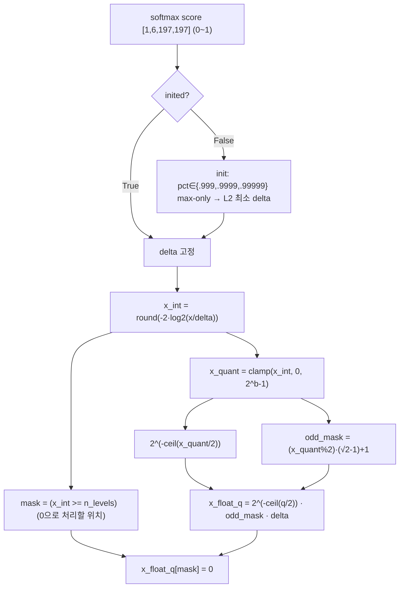
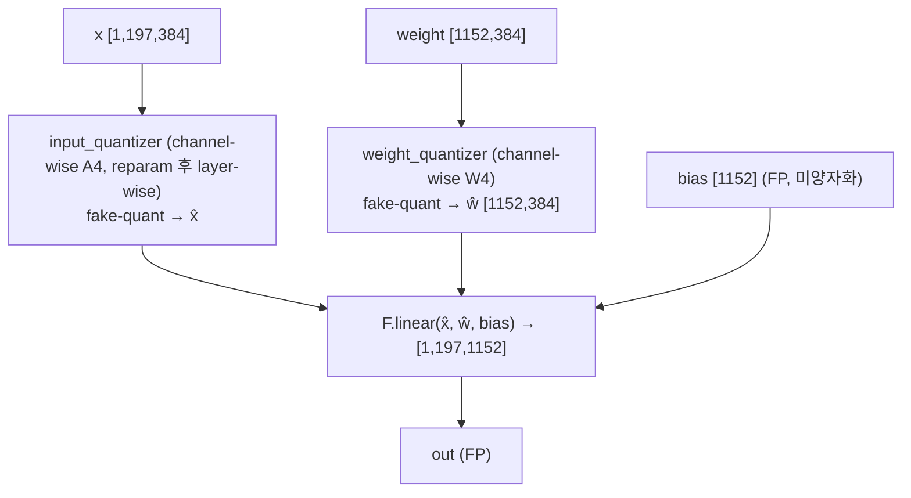
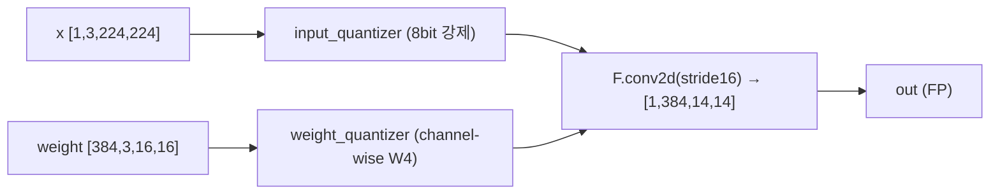
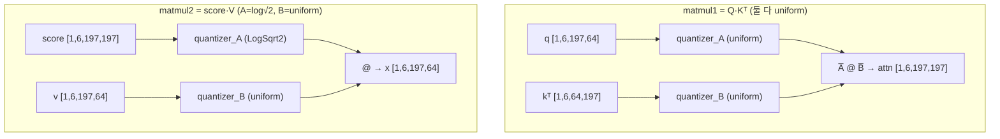
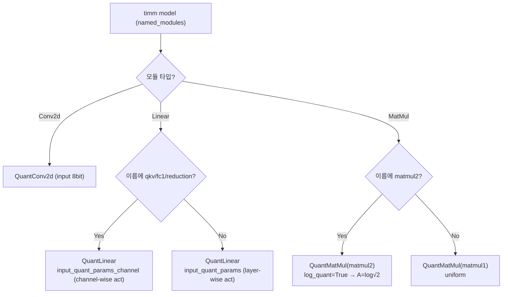
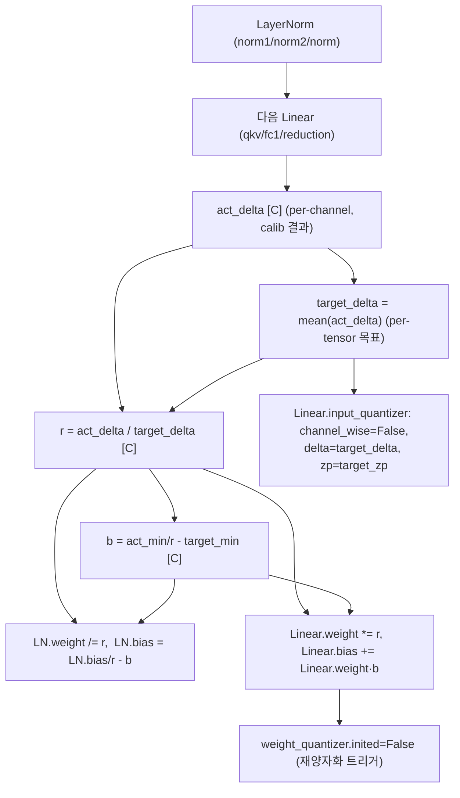
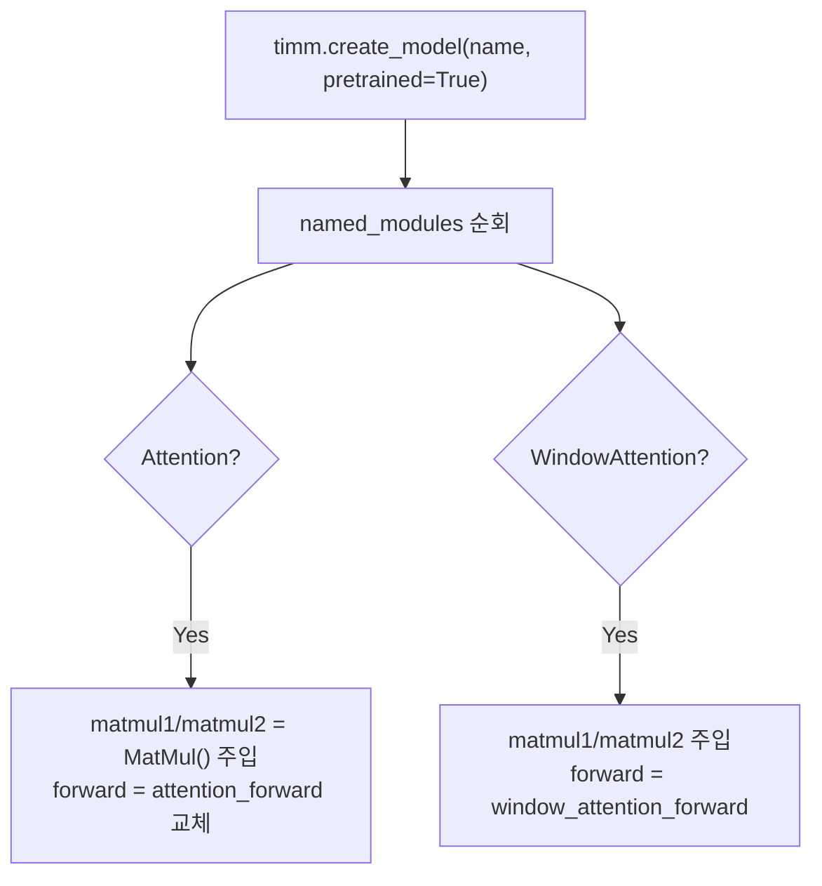
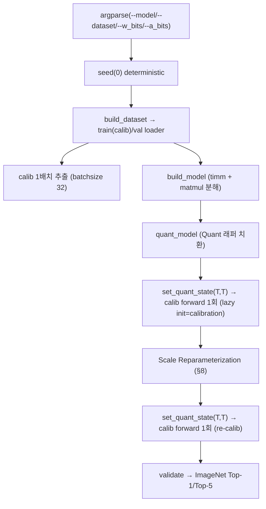

# RepQ-ViT 모듈 통합 가이드 (S-PyTorch)

> 1차 요약: [`../RepQ-ViT.md`](../RepQ-ViT.md) — 본 문서는 그 요약을 모듈 단위로 심화한 통합 가이드다.
> 분석 대상: `\\wsl.localhost\ubuntu-24.04\home\user\project\PRJXR-HBTXR\REF\ViT-Quantization\RepQ-ViT\classification`
> 작성 원칙: 실제 소스 Read 후 `파일:라인` 근거 표기. 라인 근거 없는 추론은 "추정", 코드로 확인 불가는 "확인 불가"로 명시.
> 형제 가이드(`REF/Analysis/ViT-Quantization/I-ViT/MODULE_GUIDE.md`)의 6요소 구조를 따르되, HW 지표는 **S-PyTorch 수치 규약**(params/FLOPs/activation memory/비트폭)으로 치환한다.
> **I-ViT(integer-only QAT) 대비 RepQ-ViT는 PTQ(무학습) + scale reparameterization** 이 정체성. 정수 비선형 대신 **fake-quant 시뮬레이터 + 등가변환**이 핵심.

---

## 0. 문서 머리말

### 0.1 대표 케이스 선정
- **대표 모델: `deit_small_patch16_224` (DeiT-S)** — `embed_dim=384, depth=12, num_heads=6, mlp_ratio=4, patch16, img224`(timm 표준, `test_quant.py:60`에서 `'deit_small': 'deit_small_patch16_224'` 매핑). 근거:
  1. README 실행 예시·기본 인자가 DeiT-S(`README.md:20-24`, `test_quant.py:16`의 `default="deit_small"`).
  2. 결과표에서 DeiT-S **FP 79.85 → W4/A4 69.03 / W6/A6 78.90**으로 극저비트 대표 케이스(`README.md:35`).
  3. 토큰 N=197(=14×14 패치 + cls), C=384는 LayerNorm 직후 채널별 분포 편차(reparam 대상)와 attention N² 활성이 모두 비자명하게 드러나 분석 가치가 높음(추정 근거: `(224/16)²=196` + cls).
- **대표 분석 단위: timm VisionTransformer 1개 Block** = `LayerNorm(norm1) → Attention(qkv → matmul1(Q·Kᵀ) → softmax → matmul2(score·V) → proj) → residual → LayerNorm(norm2) → Mlp(fc1 → GELU → fc2) → residual`. RepQ는 timm 원본 Block을 그대로 쓰되 **(a) Attention의 두 matmul만 `MatMul` 모듈로 노출**(`build_model.py:11-58,82-90`), **(b) Conv/Linear/MatMul을 Quant 래퍼로 치환**(`quant_model.py:30-65`)한다. DeiT-S는 이 Block을 12개 적층.
- **대표 알고리즘 3종**:
  1. **Scale Reparameterization** (LayerNorm→다음 Linear 등가변환, `test_quant.py:96-143`) ★RepQ 정체성
  2. **Asymmetric Uniform Quantization** (`quantizer.py::UniformQuantizer:18-122`)
  3. **Log√2 Quantization** (post-Softmax, `quantizer.py::LogSqrt2Quantizer:125-183`)

### 0.2 S-PyTorch 수치 규약 (HW의 MAC lanes/scalar MACs 대체)
- **params**: 모듈 차원에서 분석적 계산. Linear `in·out (+out bias)`, LayerNorm `2·C`, Conv `Cout·Cin·Kh·Kw (+Cout)`. RepQ는 FP 가중치를 그대로 두고 forward마다 fake-quant하므로(`quant_modules.py:114,62`) **params 개수는 FP 원본과 동일** — 단, **scale reparameterization은 weight/bias 값을 실제로 in-place 수정**(`test_quant.py:130-138`)하므로 가중치 *값*은 변하나 *개수*는 불변(reparam은 bias 없던 Linear에 bias를 신규 생성하기도 함, `:137-138`).
- **FLOPs/MACs**: 표준식×config. Linear MAC = `B·N·in·out`. Attention QKᵀ = `B·H·N²·dh`, score·V = `B·H·N²·dh`(H=heads, dh=head_dim). 대표 레이어 1개를 DeiT-S(B=1,N=197,C=384,H=6,dh=64)로 산출 후 12 block 환원. timm 표준 Block 구조 기반(`build_model.py:11-27`).
- **activation memory**: 텐서 shape × 비트폭. RepQ는 fake-quant라 실제 메모리는 FP32지만(`quant_modules.py:51` `x_dequant=(x_quant-zp)·delta`=float), **양자화 비트폭**(W/A bits)을 "HW 환산 activation bit"로 표기 — `shape × A_bit`.
- **비트폭/observer**: 코드 직접. 기본 **W4/A4**(`test_quant.py:34-37`), W6/A6도 지원. weight는 **channel-wise**(`test_quant.py:83`), activation은 기본 **layer-wise**(`:84`)이되 LayerNorm 직후(qkv/fc1/reduction)는 calibration 시 channel-wise 후 reparam으로 layer-wise 전환. **input(patch conv) 양자화만 8bit 강제**(`quant_modules.py:38`). observer = **percentile 탐색 + L2 loss 최소**(`quantizer.py:93-111`), lazy init(`:44-46`).
- **정확도/속도**: README/논문 인용. 본 세션 미실행 → 측정 불가 항목은 "확인 불가".

### 0.3 운영 경로 (PTQ calibration ↔ reparam ↔ ImageNet 평가)
```
[timm FP 사전학습 로드] timm.create_model(name, pretrained=True)        (build_model.py:79)
   │  + Attention/WindowAttention forward monkey-patch (matmul1/matmul2 노출)  (:82-90)
   ▼
[Quant 래퍼 치환] quant_model(): Conv2d/Linear/MatMul → Quant*       (quant_model.py:9-67)
   │  배치 정책: qkv/fc1/reduction=channel-wise act, matmul2(post-softmax)=log√2  (:51-65)
   ▼
[Initial quantization] set_quant_state(True,True) → calib forward 1회  (test_quant.py:89-93)
   │  lazy init: 첫 forward가 곧 calibration (percentile+L2)            (quantizer.py:44-46)
   ▼
[Scale Reparameterization] LN(γ,β) ↔ 다음 Linear(W,b) 등가변환         (test_quant.py:96-143) ★
   │  per-channel act scale → per-tensor(layer-wise)로 흡수
   ▼
[Re-calibration] set_quant_state(True,True) → calib forward 1회        (test_quant.py:146-148)
   │  변환된 weight 재양자화 (weight_quantizer.inited=False로 강제 재초기화)  (:143)
   ▼
[ImageNet 평가] validate() → Top-1/Top-5                               (test_quant.py:160-208)
```
- 타깃 디바이스: **CUDA GPU 전제** — `--device default="cuda"`(`test_quant.py:29`), `LogSqrt2Quantizer`의 분기에서 device 추종(`quantizer.py:100,164`)하나 CPU 대체 경로(`np.percentile`)도 존재(`:97-105`). I-ViT 같은 `.cuda()` 하드코딩은 없음 → **CPU 실행 가능성은 추정**(미검증).
- **I-ViT와의 결정적 차이**: I-ViT는 QAT(수십 epoch 재학습) + integer-only 비선형(IntGELU/IntSoftmax/IntLayerNorm), RepQ는 **PTQ(calib forward 2회, backprop 없음)** + fake-quant. RepQ에는 정수 GELU/LayerNorm 모듈이 **없다**(timm FP GELU/LayerNorm을 그대로 사용, softmax만 log√2 양자화).

### 0.4 모델 / 데이터셋 / 정확도 (README 인용)
| Model | embed/depth/heads | FP | W4/A4 | W6/A6 | 근거 |
|---|---|---|---|---|---|
| ViT-S | 384/12/6 (추정, timm) | 81.39 | 65.05 | 80.43 | `README.md:32` |
| ViT-B | 768/12/12 | 84.54 | 68.48 | 83.62 | `README.md:33` |
| DeiT-T | 192/12/3 | 72.21 | 57.43 | 70.76 | `README.md:34` |
| **DeiT-S(대표)** | **384/12/6** | **79.85** | **69.03** | **78.90** | `README.md:35`, `test_quant.py:60` |
| DeiT-B | 768/12/12 | 81.80 | 75.61 | 81.27 | `README.md:36` |
| Swin-T | 96/(2,2,6,2)/(3,6,12,24) (추정) | 81.35 | 72.31 | 80.69 | `README.md:37` |
| Swin-S | 96/(2,2,18,2) (추정) | 83.23 | 79.45 | 82.79 | `README.md:38` |
- 데이터셋: **ImageNet**, `datasets.ImageFolder(train/val)`, 224×224, 1000 클래스(`build_dataset.py:30-50`). 모델군별 정규화/crop_pct 상이(deit 0.875, vit/swin 0.9, `:11-22`).
- calib: train set에서 **1배치(batchsize 32)**만 추출(`test_quant.py:23,72-75`). val batchsize 200(`:25`).
- 속도(latency): 본 repo는 fake-quant 시뮬레이터 + accuracy만 측정, 정수 커널/latency 코드 부재 → **확인 불가**.

---

## 1. Repo / Layer 개요

RepQ-ViT = ViT/DeiT/Swin을 **극저비트(W4/A4, W6/A6) PTQ로 무학습 양자화**하는 프레임워크(`README.md:1-3`). 핵심은 **scale reparameterization**(LayerNorm 직후 활성의 채널별 정확 calibration을 추론 직전 layer-wise로 등가 흡수)과 **log√2 post-softmax 양자화**다. 본 분석은 `classification/`(자체 양자화 코드)에 집중하고 `detection/`(mmdet 외부 객체검출 프레임워크)은 제외한다.

### 1.1 자체 소스 vs 외부 프레임워크 vs 제외

| 구분 | 파일(자체 소스) | 역할 |
|---|---|---|
| **양자화기** | `classification/quant/quantizer.py` ★핵심 | UniformQuantizer(asym affine), LogSqrt2Quantizer(log√2), lp_loss |
| **양자화 레이어** | `classification/quant/quant_modules.py` | QuantConv2d/QuantLinear/QuantMatMul (forward fake-quant 래퍼) |
| **치환·배치 정책** | `classification/quant/quant_model.py` | quant_model(모델 치환), set_quant_state(on/off) |
| **엔트리 + reparam** | `classification/test_quant.py` ★핵심 | main(3단계 PTQ), Scale Reparameterization 본체, validate |
| **모델 빌더** | `classification/utils/build_model.py` | timm 로드 + Attention forward monkey-patch(MatMul 노출) |
| **데이터** | `classification/utils/build_dataset.py` | ImageNet 로더/transform |
| **패키지 노출** | `classification/quant/__init__.py`, `classification/utils/__init__.py` | import 노출 |

### 1.2 forward 진입점 (양자화 후)
치환된 timm `VisionTransformer.forward`(timm 원본) → 각 Block 내부:
- `norm1`(timm FP LayerNorm) → `attn.qkv`(QuantLinear, **channel-wise act**) → `matmul1`(QuantMatMul, uniform) → `*scale` → softmax(timm FP) → `matmul2`(QuantMatMul, **A=log√2**) → `proj`(QuantLinear, layer-wise) → residual
- `norm2` → `mlp.fc1`(QuantLinear, channel-wise act) → GELU(timm FP) → `mlp.fc2`(QuantLinear, layer-wise) → residual

각 Quant 모듈은 `use_input_quant`/`use_weight_quant` 플래그가 켜져 있을 때만 fake-quant 수행(`quant_modules.py:58-64,110-116,150-152`). 평가 시 scale은 lazy-init으로 1회 고정 후 불변(`quantizer.py:44-46`).

### 1.3 제외 (지시에 따라 이름만 표기, 미분석)
- **외부 프레임워크**: `timm`(`timm.create_model`, `timm.models.vision_transformer.Attention`, `swin_transformer.WindowAttention`, FP LayerNorm/GELU/softmax) — `build_model.py:5-8,79`. ImageNet 사전학습 가중치(timm hub)는 로드만, 코드는 본 repo 정의.
- **제외 디렉토리**: `detection/mmdet/*` 및 그 `configs/tests/docs`(open-mmlab mmdetection 기반 외부 객체검출 라이브러리, VOCdevkit 테스트 데이터 포함) — 지시상 제외.
- **미확인(확인 불가)**: Swin 경로 세부(`window_attention_forward`는 Read 완료 `build_model.py:30-58`이나 reparam의 swin 분기 `q_model.layers`/`reduction` 동작은 실행 미검증), timm 내부 Block 정의(외부).

### 1.4 대표 모델 레이어 구성 (DeiT-S)
PatchEmbed(QuantConv2d 16×16 s16, input 8bit 강제) → +cls/pos(timm FP) → Block×12 → 최종 LayerNorm(timm FP) → head(QuantLinear, layer-wise). 1 Block당 QuantLinear 4개(qkv/proj/fc1/fc2) + QuantMatMul 2개(matmul1/matmul2). 정수 비선형 모듈 없음(GELU/LayerNorm/softmax 모두 timm FP).

---

## 2. 모듈: 비대칭 Uniform 양자화기 — `quantizer.py` (UniformQuantizer) ★핵심

### 2.1 역할 + 상위/하위
- **역할**: FP 텐서를 **비대칭(affine, zero-point 사용) 선형 양자화**로 정수화하는 fake-quant 모듈. lazy init으로 첫 forward에서 percentile+L2 탐색으로 scale/zero-point 산출 후 고정. backward는 STE(별도 grad 정의 없이 round의 미분불가를 PyTorch autograd가 통과 — 단 PTQ라 backprop 미사용).
- **상위**: `QuantConv2d`/`QuantLinear`의 `input_quantizer`/`weight_quantizer`(`quant_modules.py:39-40,90-91`), `QuantMatMul`의 `quantizer_A`(uniform일 때)/`quantizer_B`(`:136-137`). **하위**: `lp_loss`(`quantizer.py:8-15`), `torch.quantile`/`np.percentile`.

### 2.2 데이터플로우 (텐서 shape 흐름)
```mermaid
flowchart TD
  X["x (FP32)<br/>weight: [out,in] / act: [B,N,C]"] --> INIT{"inited?"}
  INIT -->|False (첫 forward)| CAL["init_quantization_scale"]
  CAL --> CW{"channel_wise?"}
  CW -->|True (weight, qkv/fc1/reduction act)| PC["채널별 |max| → delta_c, zp_c<br/>reshape broadcast"]
  CW -->|False (layer-wise)| PCT["pct∈{.999,.9999,.99999}<br/>quantile → L2 최소 clip → delta, zp"]
  INIT -->|True| Q
  PC --> Q["delta, zero_point 고정"]
  PCT --> Q
  Q --> XINT["x_int = round(x/delta) + zp"]
  XINT --> CLAMP["x_quant = clamp(x_int, 0, 2^b-1)"]
  CLAMP --> DEQ["x_dequant = (x_quant - zp)·delta (FP 복원)"]
```

### 2.3 forward call stack
`QuantLinear.forward`(`quant_modules.py:110`) → `self.input_quantizer(x)` = `UniformQuantizer.forward`(`quantizer.py:42`) → (첫 호출) `init_quantization_scale`(`:55`) → channel-wise(`:57-87`) 또는 layer-wise percentile(`:88-113`) → 이후 매 호출 `round/clamp/dequant`(`:49-51`).

### 2.4 대표 코드 위치
`quantizer.py`: 클래스 `:18-122`, `forward` `:42-53`, `init_quantization_scale` `:55-113`, channel-wise `:57-87`, layer-wise(percentile+L2) `:88-113`, `quantize`(loss 평가용) `:115-122`.

### 2.5 대표 코드 블록

```python
# quantizer.py:42-53  lazy-init fake-quant (asymmetric affine)
def forward(self, x):
    if self.inited is False:
        self.delta, self.zero_point = self.init_quantization_scale(x, self.channel_wise)
        self.inited = True
    x_int = torch.round(x / self.delta) + self.zero_point      # affine: +zp
    x_quant = torch.clamp(x_int, 0, self.n_levels - 1)         # [0, 2^b-1] unsigned 격자
    x_dequant = (x_quant - self.zero_point) * self.delta       # FP 복원(fake-quant)
    return x_dequant
```
→ **첫 forward가 곧 calibration**(`inited` 플래그). `clamp(0, 2^b-1)`이라 **부호없는(unsigned) 격자 + zero-point offset** = 비대칭. I-ViT의 대칭(zp=0, clamp `[-2^(k-1),2^(k-1)-1]`)과 정반대 — HW에서 zero-point 보정항이 추가로 필요.

```python
# quantizer.py:88-111  layer-wise: percentile 탐색 + L2 loss 최소 clipping
best_score = 1e+10
for pct in [0.999, 0.9999, 0.99999]:
    new_max = torch.quantile(x_clone.reshape(-1), pct)        # outlier 제거
    new_min = torch.quantile(x_clone.reshape(-1), 1.0 - pct)
    x_q = self.quantize(x_clone, new_max, new_min)
    score = lp_loss(x_clone, x_q, p=2, reduction='all')       # L2 양자화 오차
    if score < best_score:
        best_score = score
        delta = (new_max - new_min) / (2 ** self.n_bits - 1)
        zero_point = (- new_min / delta).round()
```
→ observer = **고정 3개 percentile 중 L2 최소** 선택. running min/max(I-ViT) 대신 **단발 calibration 통계의 robust clipping**. PTQ라 EMA momentum 없음.

```python
# quantizer.py:57-85  channel-wise: 채널별 |max| 기반 재귀 호출 + broadcast reshape
n_channels = x_clone.shape[-1] if len(x.shape) == 3 else x_clone.shape[0]
# (3D activation은 마지막 dim=채널, 2D linear weight는 dim0, 4D conv weight는 dim0)
for c in range(n_channels):
    delta[c], zero_point[c] = self.init_quantization_scale(x_clone[...,c or c], channel_wise=False)
# reshape: conv (-1,1,1,1) / linear (-1,1) / 3D activation (1,1,-1)
```
→ **3D activation은 마지막 축(채널 C)이 채널 단위**(`:59,64-65,83-85`) — 이것이 LayerNorm 직후 per-channel act scale의 정확성을 만들고, 동시에 reparam이 흡수해야 할 대상.

### 2.6 연산·수치표현 분해 + 정량
- **양자화 방식**: 비대칭 uniform affine, `delta=(max-min)/(2^b-1)`, `zp=round(-min/delta)`(`:110-111`). weight=channel-wise, activation=layer-wise(reparam 전 qkv/fc1/reduction은 channel-wise).
- **scale/zp**: weight per-out-channel, activation per-tensor(또는 per-channel). zp≠0.
- **비트폭**: W4/A4 기본(`test_quant.py:34-37`), `assert 2<=n_bits<=8`(`quantizer.py:29`). conv input은 8bit 강제(`quant_modules.py:38`).
- **params**: 0 학습 파라미터. `delta`/`zero_point`는 calib 후 텐서 buffer로 보유(`:32-33`).
- **FLOPs**: calib 1회만 percentile(3회)+L2(3회) reduce; 이후 매 forward div+round+clamp = O(N). 대표 qkv weight(384×1152=442K 원소) calib = 3×(quantile+L2) over 442K + 매 추론 442K div.
- **activation bit**: 출력은 fake-quant float(`:51`) → HW 환산 비트 = n_bits(4/6/8).

---

## 3. 모듈: Log√2 양자화기 (post-Softmax) — `quantizer.py` (LogSqrt2Quantizer) ★FPGA 친화 핵심

### 3.1 역할 + 상위/하위
- **역할**: softmax 출력(0~1, power-law 분포)을 **log base √2** 도메인에서 양자화. 짝수 레벨은 순수 2의 거듭제곱(시프트), 홀수 레벨만 √2 보정. 곱셈 없이 시프트로 dequant 가능.
- **상위**: `QuantMatMul.quantizer_A` — `input_quant_params`에 `log_quant` 키가 있으면(=matmul2) 생성(`quant_modules.py:132-134`). matmul2는 `score @ V`이므로 A=softmax score. **하위**: `lp_loss`, `torch.quantile`/`np.percentile`, `math.sqrt`.

### 3.2 데이터플로우 (텐서 shape 흐름, DeiT-S attn)


### 3.3 forward call stack
`QuantMatMul.forward`(`quant_modules.py:149`) → `self.quantizer_A(A)` = `LogSqrt2Quantizer.forward`(`quantizer.py:143`) → (첫 호출) `init_quantization_scale`(`:153`, max-only percentile+L2) → `quantize`(`:174-183`).

### 3.4 대표 코드 위치
`quantizer.py`: 클래스 `:125-183`, `forward` `:143-151`, `init_quantization_scale`(max-only) `:153-172`, `quantize`(log√2 격자) `:174-183`.

### 3.5 대표 코드 블록

```python
# quantizer.py:174-183  log√2 양자화 (시프트 친화 dequant)
def quantize(self, x, delta):
    from math import sqrt
    x_int = torch.round(-1 * (x/delta).log2() * 2)            # √2 간격 = log2 ×2 해상도
    mask = x_int >= self.n_levels
    x_quant = torch.clamp(x_int, 0, self.n_levels - 1)
    odd_mask = (x_quant % 2) * (sqrt(2) - 1) + 1              # 홀수 레벨만 √2 보정
    x_float_q = 2 ** (-1 * torch.ceil(x_quant/2)) * odd_mask * delta   # 2^-k = 시프트
    x_float_q[mask] = 0                                       # 너무 작은 확률은 0
    return x_float_q
```
→ **짝수 q: `odd_mask=1` → `2^(-q/2)·delta` (순수 비트시프트)**, **홀수 q: `odd_mask=√2` → `2^(-(q+1)/2)·√2·delta` (시프트 + √2 상수곱 1회)**. softmax 분모/dequant를 barrel shifter + 단일 √2 상수 mul로 환원 → DSP 절감.

```python
# quantizer.py:156-170  scale 산출: softmax는 양수만 → max-only percentile+L2
delta = x_clone.max()
for pct in [0.999, 0.9999, 0.99999]:
    new_delta = torch.quantile(x_clone.reshape(-1), pct)      # min 불필요(0~1)
    x_q = self.quantize(x_clone, new_delta)
    score = lp_loss(x_clone, x_q, p=2, reduction='all')
    if score < best_score:
        best_score = score; delta = new_delta
```

### 3.6 연산·수치표현 분해 + 정량 (DeiT-S, attn [1,6,197,197])
- **양자화 방식**: log√2(log2의 2배 해상도). 양자화 식 `q=clamp(round(-2·log2(x/Δ)),0,2^b-1)`, `x̂=2^(-ceil(q/2))·[(q%2)(√2-1)+1]·Δ`. zero_point 개념 없음(log 도메인).
- **scale/zp**: `delta`(=Δ) 단일 스칼라(layer-wise), zp 없음. dequant 본질이 2의 거듭제곱 → **dyadic 친화**.
- **비트폭**: A4/A6(`a_bits`). `assert 2<=n_bits<=8`(`:136`).
- **params**: 0(`delta` buffer만).
- **FLOPs**: calib 3×(quantile+L2); 추론 시 원소당 log2 1 + round + ceil + shift + (홀수면 √2 mul). 대표 attn 233K 원소/head, H·N²=6×197²≈233K.
- **activation memory**: score [1,6,197,197] A4 = 6×197²×0.5byte ≈ **116 KB**(A4), A6 ≈ **175 KB**. block 내 최대 단일 활성(N² 텐서).

---

## 4. 모듈: 정수 Linear 래퍼 — `quant_modules.py` (QuantLinear)

### 4.1 역할 + 상위/하위
- **역할**: nn.Linear 상속. forward에서 input/weight를 각각 `UniformQuantizer`로 fake-quant 후 `F.linear`. **양자화 정수 도메인 연산이 아니라 dequant된 FP끼리 곱** = 시뮬레이션(I-ViT의 정수 MAC과 다름).
- **상위**: `Attention.qkv/proj`, `Mlp.fc1/fc2`, `head`(`quant_model.py:48-57`로 치환). **하위**: `UniformQuantizer`×2.

### 4.2 데이터플로우 (텐서 shape 흐름, DeiT-S qkv)


### 4.3 forward call stack
`Attention.forward`(`build_model.py:13`) → `self.qkv(x)` = `QuantLinear.forward`(`quant_modules.py:105`) → `input_quantizer(x)`(`:111`) → `weight_quantizer(self.weight)`(`:114`) → `F.linear`(`:118`).

### 4.4 대표 코드 위치
`quant_modules.py`: 클래스 `:79-120`, 생성자(quantizer 2개) `:88-91`, `set_quant_state` `:101-103`, `forward` `:105-120`.

### 4.5 대표 코드 블록
```python
# quant_modules.py:105-120  input/weight 각각 fake-quant 후 FP linear
def forward(self, x):
    if self.use_input_quant:
        x = self.input_quantizer(x)          # asym uniform (channel/layer-wise)
    if self.use_weight_quant:
        w = self.weight_quantizer(self.weight)   # channel-wise W4
    else:
        w = self.weight
    out = F.linear(x, weight=w, bias=self.bias)  # bias는 FP 그대로
    return out
```
→ **bias는 양자화하지 않음**(`self.bias` 직접 사용). I-ViT(bias 32bit 정수)와 대조. PTQ fake-quant라 정수 MAC 누산/dyadic requant 없음 — **HW 매핑 시 정수 커널은 별도 구현 필요**(이 repo는 정확도 시뮬레이터까지만).

### 4.6 연산·수치표현 분해 + 정량 (DeiT-S, B=1, N=197)
- **양자화 방식**: weight channel-wise(out축) W4 asym, input layer-wise(또는 channel-wise) A4 asym, bias 미양자화(FP).
- **scale/zp**: W_delta `[out]`/W_zp `[out]`; act_delta/act_zp 스칼라(reparam 후) 또는 채널벡터(reparam 전).
- **비트폭**: W4/A4 기본, W6/A6 옵션.
- **params** (DeiT-S 1 block, C=384, 동일 차원 → I-ViT와 동일):
  - qkv: 384×1152 + 1152 = **443,520**
  - proj: 384×384 + 384 = **147,840**
  - fc1: 384×1536 + 1536 = **591,360**
  - fc2: 1536×384 + 384 = **590,208**
  - Linear params/block ≈ **1.773M**, ×12 ≈ **21.27M**.
- **MACs/block** (B=1, N=197): qkv 87.1M / proj 29.0M / fc1 116.2M / fc2 116.2M → **348.5M/block**, ×12 ≈ **4.18G**(Attention matmul 제외).
- **activation bit**: 입력 A4(fake-quant) → 출력 FP(시뮬레이션). HW 환산 입력 4bit.

---

## 5. 모듈: 정수 Conv (PatchEmbed) — `quant_modules.py` (QuantConv2d)

### 5.1 역할 + 상위/하위
- **역할**: 입력 이미지 패치 투영(16×16 stride16). input/weight `UniformQuantizer`. **input 양자화는 항상 8bit 강제**(embedding 보호).
- **상위**: timm `PatchEmbed.proj`(nn.Conv2d → QuantConv2d 치환, `quant_model.py:30-47`). **하위**: `UniformQuantizer`×2, `F.conv2d`.

### 5.2 데이터플로우 (텐서 shape 흐름, DeiT-S)


### 5.3 forward call stack
`PatchEmbed.forward`(timm) → `self.proj(x)` = `QuantConv2d.forward`(`quant_modules.py:54`) → `input_quantizer(x)`(`:59`) → `weight_quantizer(self.weight)`(`:62`) → `F.conv2d`(`:66-74`).

### 5.4 대표 코드 위치
`quant_modules.py`: 클래스 `:13-76`, input 8bit 강제 `:37-39`, `forward` `:54-76`.

### 5.5 대표 코드 블록
```python
# quant_modules.py:37-40  input은 항상 8bit (patchify 보호)
input_quant_params_conv = deepcopy(input_quant_params)
input_quant_params_conv['n_bits'] = 8                     # a_bits 무시, 8 고정
self.input_quantizer = UniformQuantizer(**input_quant_params_conv)
self.weight_quantizer = UniformQuantizer(**weight_quant_params)
```
→ 임베딩 입력(원본 픽셀)은 동적범위가 커서 4bit면 정확도 붕괴 → **8bit 하한 보장**. FPGA에서 첫 레이어만 고정밀(8bit)로 두는 설계의 근거.

### 5.6 연산·수치표현 분해 + 정량 (DeiT-S PatchEmbed)
- **양자화 방식**: weight channel-wise(out=384) W4 asym, input A8 asym 강제.
- **비트폭**: W4 / A8(input 고정).
- **params**: 384×3×16×16 + 384 = **295,296**.
- **MACs**: 14×14=196 위치 × 384 × (3×16×16=768) ≈ **57.8M**(전 모델 1회).
- **activation memory**: 출력 [1,384,14,14] → [1,196,384]. 입력 A8 = 3×224²×1byte ≈ **150 KB**.

---

## 6. 모듈: 정수 행렬곱 (A/B 비대칭 정책) — `quant_modules.py` (QuantMatMul) ★

### 6.1 역할 + 상위/하위
- **역할**: Attention의 QKᵀ(matmul1), score·V(matmul2)를 fake-quant 후 수행. **A/B 두 입력을 비대칭 정책으로 양자화**: matmul2의 A(=softmax score)만 `LogSqrt2Quantizer`, 나머지는 `UniformQuantizer`.
- **상위**: `Attention.matmul1/matmul2`(`build_model.py:84-85`로 `MatMul()` 주입 → `quant_model.py:58-65`로 QuantMatMul 치환). **하위**: `UniformQuantizer`(B 항상), `LogSqrt2Quantizer`(A, matmul2일 때).

### 6.2 데이터플로우 (텐서 shape 흐름)


### 6.3 forward call stack
`Attention.forward`(`build_model.py:17`) → `self.matmul1(q, k.transpose(-2,-1))` = `QuantMatMul.forward`(`quant_modules.py:149`) → `quantizer_A(A)`/`quantizer_B(B)`(`:151-152`) → `A @ B`(`:154`). matmul2 동일(`build_model.py:23`).

### 6.4 대표 코드 위치
`quant_modules.py`: 클래스 `:123-155`, A/B quantizer 분기 `:131-137`, `forward` `:149-155`.

### 6.5 대표 코드 블록
```python
# quant_modules.py:131-137  A/B 비대칭 quantizer 배치
input_quant_params_matmul = deepcopy(input_quant_params)
if 'log_quant' in input_quant_params_matmul:               # matmul2(post-softmax)만
    input_quant_params_matmul.pop('log_quant')
    self.quantizer_A = LogSqrt2Quantizer(**input_quant_params_matmul)   # A=softmax score
else:                                                       # matmul1(Q·Kᵀ)
    self.quantizer_A = UniformQuantizer(**input_quant_params_matmul)
self.quantizer_B = UniformQuantizer(**input_quant_params_matmul)        # B 항상 uniform
```
→ `log_quant` 키 유무로 matmul1/matmul2 구분(`quant_model.py:11-12,61-62`). softmax 출력만 log√2 격자, V(=B)와 Q·Kᵀ는 uniform. **HW에서 attention의 두 matmul을 서로 다른 dequant 경로로 설계해야 함**(matmul2 입력 A는 시프트 dequant).

```python
# quant_modules.py:149-155  fake-quant 후 FP matmul
def forward(self, A, B):
    if self.use_input_quant:
        A = self.quantizer_A(A)
        B = self.quantizer_B(B)
    out = A @ B                # dequant된 FP끼리 곱 (정수 누산 시뮬레이션 아님)
    return out
```

### 6.6 연산·수치표현 분해 + 정량 (DeiT-S, B=1, H=6, N=197, dh=64)
- **양자화 방식**: matmul1 A,B uniform asym; matmul2 A=log√2, B=uniform. 정수 누산/scale곱 없음(fake-quant).
- **비트폭**: A4/A6. matmul2 A는 log√2 격자.
- **params**: 0.
- **MACs/block**: QKᵀ H·N²·dh = 6×197²×64 ≈ **14.9M**; score·V 동일 ≈ **14.9M** → **29.8M/block**, ×12 ≈ **358M**.
- **activation memory**: attn 행렬 [1,6,197,197] — matmul1 출력(softmax 입력 전) FP, matmul2 입력 A4 log√2 ≈ **116 KB**(A4). block 내 최대 단일 활성.
- **시사**: N² 텐서가 attention 메모리 지배 → FPGA에서 attn 타일링·on-chip 재사용 핵심(HG-PIPE류 파이프라인 메모리 압박점). matmul2 A의 log√2 dequant는 시프트 기반.

---

## 7. 모듈: 모델 치환 + 양자화기 배치 정책 — `quant_model.py` ★핵심

### 7.1 역할 + 상위/하위
- **역할**: timm 모델을 순회하며 `nn.Conv2d`/`nn.Linear`/`MatMul`을 Quant 래퍼로 in-place 치환. **레이어 이름으로 양자화 정책을 분기**(LayerNorm 직후 레이어 식별 → channel-wise act + 후속 reparam 대상 지정).
- **상위**: `main`(`test_quant.py:85`). **하위**: `QuantConv2d/QuantLinear/QuantMatMul`, `MatMul`(build_model).

### 7.2 데이터플로우 (배치 정책)


### 7.3 forward call stack
`main`(`test_quant.py:85`) → `quant_model(model, aq_params, wq_params)`(`quant_model.py:9`) → 파라미터 3종 준비(`:10-16`) → `named_modules` 순회(`:19`) → 타입·이름별 치환(`:30-65`).

### 7.4 대표 코드 위치
`quant_model.py`: `quant_model` `:9-67`, 파라미터 3종 `:10-16`, Conv 치환 `:30-47`, Linear 정책 분기 `:48-57`, MatMul 정책 분기 `:58-65`, `set_quant_state` `:70-73`.

### 7.5 대표 코드 블록
```python
# quant_model.py:10-16  3가지 activation 양자화 파라미터 세트
input_quant_params_matmul2 = deepcopy(input_quant_params)
input_quant_params_matmul2['log_quant'] = True            # post-softmax → log√2
input_quant_params_channel = deepcopy(input_quant_params)
input_quant_params_channel['channel_wise'] = True         # LayerNorm 직후 → per-channel
```
```python
# quant_model.py:48-65  이름 기반 정책 분기 (reparam 대상 식별의 출발점)
elif isinstance(m, nn.Linear):
    if 'qkv' in name or 'fc1' in name or 'reduction' in name:   # ← LayerNorm 직후
        new_m = QuantLinear(..., input_quant_params_channel, weight_quant_params)
    else:                                                       # proj/fc2/head
        new_m = QuantLinear(..., input_quant_params, weight_quant_params)
elif isinstance(m, MatMul):
    if 'matmul2' in name:
        new_m = QuantMatMul(input_quant_params_matmul2)         # log√2
    else:
        new_m = QuantMatMul(input_quant_params)                 # uniform
```
→ **`qkv`/`fc1`/`reduction`은 각각 norm1/norm2/Swin-norm 직후 Linear** = reparameterization 대상. 이들만 channel-wise act로 정밀 calibration 후, reparam에서 layer-wise로 흡수.

### 7.6 연산·수치표현 분해 + 정량
- **양자화 방식**: 이름 기반 정책 분기. 핵심 표:

| 위치 | activation quantizer | weight quantizer | 근거 |
|---|---|---|---|
| patch embed conv | Uniform **8bit** asym | Uniform channel-wise W4 | `quant_modules.py:37-40` |
| qkv / fc1 / reduction (LayerNorm 직후) | Uniform **channel-wise** → (reparam 후) layer-wise | channel-wise W4 | `quant_model.py:51-52`, `test_quant.py:140` |
| proj / fc2 / head | Uniform layer-wise asym | channel-wise W4 | `quant_model.py:54` |
| matmul1 (Q·Kᵀ) A,B | Uniform asym | — | `quant_model.py:64` |
| matmul2 (score·V) A | **Log√2** | — | `quant_model.py:62`, `quant_modules.py:134` |
| matmul2 B (V) | Uniform asym | — | `quant_modules.py:137` |

- **params**: 0(치환 함수). 단 weight.data/bias를 timm 원본에서 복사(`:45-46,55-56`).

---

## 8. 모듈: Scale Reparameterization — `test_quant.py` ★★ RepQ 정체성

### 8.1 역할 + 상위/하위
- **역할**: LayerNorm 직후 활성의 **per-channel scale을 LayerNorm(γ,β)과 다음 Linear(W,b)로 흡수해 layer-wise scale로 등가변환**. 정확도는 per-channel급, 추론은 per-tensor급. 수학적 항등 변환(출력 불변).
- **상위**: `main`(`test_quant.py:96`), initial quantization(`:89-93`) 직후 실행. **하위**: 각 Block의 `norm1/norm2`(LayerNorm), `attn.qkv`/`mlp.fc1`/`reduction`(QuantLinear)의 `input_quantizer.delta/zero_point`.

### 8.2 데이터플로우 (등가변환 흐름)


### 8.3 forward call stack
`main`(`test_quant.py:96`) → `q_model.blocks`(swin은 `.layers`) 순회(`:99-100`) → norm1/norm2/norm 식별(`:111`) → next_module 지정(`:112-117`) → r/b 산출(`:119-128`) → LN·Linear in-place 수정(`:130-138`) → quantizer 전환(`:140-143`).

### 8.4 대표 코드 위치
`test_quant.py`: reparam 블록 `:96-143`, swin/vit 분기 `:99`, norm→next_module `:111-117`, per-channel scale 추출 `:119-121`, target 산출 `:123-125`, r/b `:127-128`, **LN 흡수** `:130-131`, **Linear 흡수** `:133-138`, quantizer 전환 `:140-143`.

### 8.5 대표 코드 블록
```python
# test_quant.py:119-128  per-channel act scale → per-tensor target + 보정계수 r,b
act_delta = next_module.input_quantizer.delta.reshape(-1)        # [C] per-channel
act_zero_point = next_module.input_quantizer.zero_point.reshape(-1)
act_min = -act_zero_point * act_delta                            # 채널별 min

target_delta = torch.mean(act_delta)                            # per-tensor 목표 scale
target_zero_point = torch.mean(act_zero_point)
target_min = -target_zero_point * target_delta

r = act_delta / target_delta                                    # 채널별 보정비
b = act_min / r - target_min                                    # 채널별 offset 보정
```
```python
# test_quant.py:130-138  LayerNorm 흡수 + 다음 Linear 흡수 (항등 변환)
module.weight.data = module.weight.data / r                     # γ' = γ/r
module.bias.data = module.bias.data / r - b                     # β' = β/r - b
next_module.weight.data = next_module.weight.data * r           # W' = W·r (열별)
if next_module.bias is not None:
    next_module.bias.data = next_module.bias.data + torch.mm(next_module.weight.data, b.reshape(-1,1)).reshape(-1)
else:                                                           # bias 없으면 신규 생성
    next_module.bias = Parameter(torch.Tensor(next_module.out_features))
    next_module.bias.data = torch.mm(next_module.weight.data, b.reshape(-1,1)).reshape(-1)
```
```python
# test_quant.py:140-143  다음 Linear input quantizer를 per-tensor로 전환 + weight 재양자화
next_module.input_quantizer.channel_wise = False
next_module.input_quantizer.delta = target_delta               # per-tensor scale 고정
next_module.input_quantizer.zero_point = target_zero_point
next_module.weight_quantizer.inited = False                    # W' 변경 → 재calibration
```

### 8.6 연산·수치표현 분해 + 정밀 수식 해부 (★요청 핵심)

**[수학적 등가성 증명]** LayerNorm 출력을 `LN_out`이라 하고 다음 Linear를 `y = W · LN_out + b_lin`이라 하자. LayerNorm은 채널 c에 대해 `LN_out_c = γ_c · x̂_c + β_c` (x̂=정규화된 입력).

reparam 전 채널별 activation scale `s_c = act_delta_c`, 목표 per-tensor scale `s̃ = mean(s_c)`. 보정비 `r_c = s_c / s̃` 정의(`test_quant.py:127`).

- **LayerNorm 흡수**(`:130-131`): `γ'_c = γ_c / r_c`, `β'_c = β_c/r_c - b_c`
  → 새 LN 출력 `LN_out'_c = γ'_c·x̂_c + β'_c = (γ_c·x̂_c + β_c)/r_c - b_c = LN_out_c / r_c - b_c`
- **다음 Linear 흡수**(`:133-138`): `W'_{·,c} = W_{·,c} · r_c` (입력 채널 c열에 r_c 곱), `b'_lin = b_lin + W' · b`
  → 새 출력 `y' = Σ_c W'_{·,c}·LN_out'_c + b'_lin`
    `= Σ_c (W_{·,c}·r_c)·(LN_out_c/r_c - b_c) + b_lin + Σ_c W'_{·,c}·b_c`
    `= Σ_c W_{·,c}·LN_out_c - Σ_c W'_{·,c}·b_c + b_lin + Σ_c W'_{·,c}·b_c`
    `= Σ_c W_{·,c}·LN_out_c + b_lin = y` ∎
  → **r_c가 정확히 상쇄, b_c 항도 W'·b가 양변에서 소거**되어 출력 완전 동치. activation 분포만 채널별 s_c에서 균일 s̃로 평탄화.

**[양자화 관점 이득]** reparam 후 다음 Linear의 input은 per-tensor scale `s̃ = target_delta` 하나로 양자화(`:141`). 즉 **calibration은 per-channel(정확)으로 하고, 추론은 per-tensor(HW 효율)** — 채널별 scale 곱셈기/저장 불필요. weight는 W'=W·r로 흡수되었으므로 재양자화 필요(`:143` `inited=False`).

**[수식 요약 (1차 요약 §4.2와 일치)]**
```
per-channel scale s_c (=act_delta_c), 목표 s̃ = mean(s_c)
r_c = s_c / s̃,    b_c = act_min_c / r_c - target_min
LN:     γ'_c = γ_c / r_c,    β'_c = β_c / r_c - b_c
Linear: W'_{·,c} = W_{·,c} · r_c,   b'_lin = b_lin + W'·b
⟹ 출력 동치, activation scale을 per-tensor s̃로 통일 (추론 오버헤드 0)
```

- **params 영향**: 개수 불변(γ,β,W,b 값만 in-place 수정). 단 **bias 없던 Linear에 bias 신규 생성**(`:137-138`) — qkv/fc1은 timm에서 bias 보유라 통상 `:135` 경로.
- **FLOPs**: reparam 자체는 추론 그래프에 0 추가(컴파일타임 1회 변환). 변환 비용은 채널수 C에 대한 O(C) element 연산 + `W·b` mm(`:135` `[out,in]·[in,1]`).
- **주의**: LayerNorm이 없는 구조(BN 기반 하이브리드)엔 적용 불가. Swin은 `q_model.layers` 슬라이싱 + `reduction`(patch merging의 Linear) 대상(`:99,117`).

---

## 9. 모듈: 모델 빌더 (Attention 분해) — `build_model.py`

### 9.1 역할 + 상위/하위
- **역할**: timm 모델 로드 후 `Attention`/`WindowAttention`의 forward를 monkey-patch해 `Q·Kᵀ`와 `score·V`를 `MatMul` 모듈로 노출(양자화 가능하게 분해). RepQ가 timm 원본 ViT를 최소 침습으로 양자화하는 진입점.
- **상위**: `main`(`test_quant.py:79`). **하위**: `timm.create_model`, timm `Attention`/`WindowAttention`.

### 9.2 데이터플로우


### 9.3 forward call stack
`build_model(name)`(`build_model.py:66`) → `timm.create_model`(`:79`) → `named_modules` 순회(`:82`) → `Attention`이면 MatMul 주입 + `MethodType(attention_forward)`(`:83-86`); `WindowAttention`이면 `window_attention_forward`(`:87-90`).

### 9.4 대표 코드 위치
`build_model.py`: `attention_forward` `:11-27`, `window_attention_forward` `:30-58`, `MatMul` 클래스 `:61-63`, `build_model` `:66-92`, monkey-patch `:82-90`.

### 9.5 대표 코드 블록
```python
# build_model.py:16-23  matmul을 모듈 호출로 노출 (양자화 hook 지점)
# attn = (q @ k.transpose(-2, -1)) * self.scale          # 원본
attn = self.matmul1(q, k.transpose(-2, -1)) * self.scale  # MatMul 모듈 경유
attn = attn.softmax(dim=-1)                               # timm FP softmax
attn = self.attn_drop(attn)
# x = (attn @ v)...                                       # 원본
x = self.matmul2(attn, v).transpose(1, 2).reshape(B, N, C) # MatMul 모듈 경유
```
```python
# build_model.py:82-86  forward in-place 교체
if isinstance(module, Attention):
    setattr(module, "matmul1", MatMul())
    setattr(module, "matmul2", MatMul())
    module.forward = MethodType(attention_forward, module)
```
→ **softmax/GELU/LayerNorm은 교체하지 않음** = timm FP 그대로. I-ViT가 모든 비선형을 정수 모듈로 교체한 것과 정반대. RepQ의 정수화 대상은 Linear/Conv weight·act + softmax 출력(log√2)뿐.

### 9.6 연산·수치표현 분해 + 정량
- **양자화 방식**: 양자화 자체는 없음(구조 분해만). matmul을 모듈화해 후속 `quant_model`이 hook.
- **params**: 0(`MatMul`은 파라미터 없는 wrapper, `:61-63`).
- **시사**: HW 관점에서 attention의 두 matmul이 명시적 연산 노드로 분리됨 → RTL/HLS에서 QKᵀ-PE와 AV-PE를 독립 설계·서로 다른 dequant(uniform vs log√2) 적용하는 근거.

---

## 10. 모듈: PTQ 엔트리·평가 파이프라인 — `test_quant.py` (main/validate) + `build_dataset.py`

### 10.1 역할 + 상위/하위
- **역할**: 전체 PTQ 흐름 오케스트레이션(데이터 → 모델 → 치환 → calib → reparam → re-calib → 평가). QAT/backprop 없음.
- **상위**: CLI(`README.md:9-24`). **하위**: `build_dataset`, `build_model`, `quant_model`, `set_quant_state`, reparam(§8), `validate`.

### 10.2 데이터플로우


### 10.3 forward call stack
`main`(`test_quant.py:51`) → `build_dataset`(`:71`) → calib 추출(`:72-75`) → `build_model`(`:79`) → `quant_model`(`:85`) → `set_quant_state(T,T)`+forward(`:91-93`) → reparam(`:96-143`) → re-calib(`:146-148`) → `validate`(`:155`).

### 10.4 대표 코드 위치
`test_quant.py`: argparse `:14-39`, `seed` `:42-48`, `main` `:51-157`, model_zoo `:55-65`, calib 추출 `:72-75`, bit params `:83-84`, initial quant `:89-93`, reparam `:96-143`, re-calib `:146-148`, `validate` `:160-208`, `accuracy` `:230-243`. `build_dataset.py`: `:9-52`.

### 10.5 대표 코드 블록
```python
# test_quant.py:83-93  W/A bit 설정 + initial quantization (calib forward 1회)
wq_params = {'n_bits': args.w_bits, 'channel_wise': True}     # weight 항상 channel-wise
aq_params = {'n_bits': args.a_bits, 'channel_wise': False}    # act 기본 layer-wise
q_model = quant_model(model, input_quant_params=aq_params, weight_quant_params=wq_params)
set_quant_state(q_model, input_quant=True, weight_quant=True)
with torch.no_grad():
    _ = q_model(calib_data)                                   # 첫 forward = lazy calibration
```
```python
# test_quant.py:42-48  결정적 추론 (PTQ 재현성)
torch.backends.cudnn.benchmark = False
torch.backends.cudnn.deterministic = True
```

### 10.6 연산·수치표현 분해 + 정량 / 재현 명령
- **양자화 방식**: PTQ, calib forward 총 2회(initial + re-calib), backprop 없음. observer = percentile+L2(QuantAct EMA 없음).
- **하이퍼파라미터**: calib_batchsize 32(`:23`), val_batchsize 200(`:25`), seed 0(`:32`), W4/A4 기본(`:34-37`), device cuda(`:29`).
- **재현 명령**(`README.md:9-24`):
  ```bash
  python test_quant.py --model deit_small --dataset <YOUR_DATA_DIR>           # W4/A4 기본
  python test_quant.py --model deit_small --dataset <DIR> --w_bits 6 --a_bits 6   # W6/A6
  ```
  옵션: `--model {vit_small,vit_base,deit_tiny,deit_small,deit_base,swin_tiny,swin_small}`(`:16-20`).
- **정확도**(`README.md:35`): DeiT-S W4/A4 **69.03%**, W6/A6 **78.90%**(FP 79.85). **속도/latency 본 세션 미실행 + repo에 정수 커널 없음 → 확인 불가.**
- **주의**: 체크포인트 저장 없음(평가 후 종료). calib이 train set 1배치라 batch 선택에 따른 분산 가능(추정).

---

## N+1. 모듈 한눈 요약 표

| 모듈 | 파일:라인 | 역할 | 양자화 방식 | 대표 정량(DeiT-S) |
|---|---|---|---|---|
| UniformQuantizer | quantizer.py:18-122 | FP→정수 비대칭 affine + lazy calib | asym, zp≠0, channel/layer-wise, percentile+L2 | params 0, calib 1회 후 O(N) |
| LogSqrt2Quantizer | quantizer.py:125-183 | post-softmax log√2 양자화 | `2^(-ceil(q/2))·odd_mask·Δ`, 시프트 친화 | score A4 116KB, dyadic dequant |
| QuantLinear | quant_modules.py:79-120 | fake-quant linear | W4 ch-wise / A4 / bias FP | block 1.77M params, 348.5M MAC |
| QuantConv2d | quant_modules.py:13-76 | PatchEmbed, input 8bit 강제 | W4 ch-wise / A8 input | 295K params, 57.8M MAC |
| QuantMatMul | quant_modules.py:123-155 | QKᵀ/score·V fake-quant | matmul2 A=log√2, 나머지 uniform | block 29.8M MAC, attn 116KB |
| quant_model | quant_model.py:9-73 | 모델 치환 + 배치 정책 | 이름 기반(qkv/fc1=ch-wise, matmul2=log√2) | params 0 |
| Scale Reparam | test_quant.py:96-143 | LN↔Linear 등가변환 | per-channel→per-tensor 흡수 | 추론 오버헤드 0(항등변환) |
| build_model | build_model.py:66-92 | timm 로드 + matmul 분해 | 구조 분해(양자화 없음) | params 0 |
| main/validate | test_quant.py:51-208 | PTQ 3단계 + ImageNet 평가 | PTQ, calib forward 2회 | DeiT-S W4A4 69.03% |

---

## N+2. 학습·평가 파이프라인 + 재현 명령

- **데이터셋**: ImageNet, `datasets.ImageFolder(train/val)`, 224×224, 1000 클래스(`build_dataset.py:30-50`). 모델군별 정규화/crop_pct(`:11-22`).
- **사전학습**: timm hub `pretrained=True`(`build_model.py:79`) — 가중치만 로드, 코드는 본 repo 정의.
- **PTQ(학습 없음)**:
  ```bash
  python test_quant.py --model deit_small --dataset <DATA_DIR>            # W4/A4
  python test_quant.py --model deit_small --dataset <DATA_DIR> --w_bits 6 --a_bits 6
  ```
  3단계: ① initial quant(calib forward, `test_quant.py:89-93`) → ② scale reparam(`:96-143`) → ③ re-calib(`:146-148`) → 평가(`:155`). **backprop/체크포인트 없음**.
- **calib 비용**: train set 1배치(32장) forward 2회만 — I-ViT QAT(수십 epoch) 대비 압도적으로 가벼움.
- **평가**: `validate`가 val set 전체 Top-1/Top-5(`:160-208`).
- **의존성**: `torch`, `timm`(모델+Attention/WindowAttention), `torchvision`(ImageFolder), `numpy`, `PIL`(`build_model.py:1-8`, `build_dataset.py:1-6`). **버전 명시 없음 → 확인 불가**. detection은 mmdet(제외).
- **디바이스**: 기본 cuda(`:29`). I-ViT 같은 `.cuda()` 하드코딩 없음(np.percentile CPU 대체 경로 `quantizer.py:97-105` 존재) → CPU 실행 가능성 추정(미검증).

---

## N+3. 우리 프로젝트(FPGA ViT 가속) 시사점 — reparam이 HW에 주는 단순화 이점

### N+3.1 Scale Reparameterization = requantization 유닛의 결정적 단순화 (최우선)
- **per-channel→per-tensor 흡수**(`test_quant.py:127-143`): LayerNorm 직후 activation은 채널 편차가 커서 단일 per-tensor scale로는 정확도 손실이 크다. RepQ는 이를 **컴파일타임에 LN의 γ,β로 흡수**(`:130-131`)해 런타임을 per-tensor로 만든다. → FPGA 가속기에서 **qkv/fc1 앞 requantization을 per-channel scale 벡터(채널수 C개 곱셈기/BRAM)에서 scalar 1개로 축소**. HG-PIPE류 파이프라인에서 채널별 scale broadcast 회로·저장 완전 제거. **추론 오버헤드 0(수학적 항등변환, §8.6 증명)**.
- I-ViT의 dyadic per-tensor requant와 결합 시: RepQ로 per-tensor화 → I-ViT식 `(z·m)>>e` 단일 PE로 처리 = 양자화 정책×재양자화 HW 모두 최소화(추정 시너지).

### N+3.2 Log√2 softmax 양자화 = 시프트 기반 dequant (DSP 절감)
- `2^(-ceil(q/2))·odd_mask·Δ`(`quantizer.py:180`): **짝수 레벨은 순수 비트시프트, 홀수 레벨만 √2 상수곱 1회**. softmax 출력(matmul2 A 입력) dequant을 **barrel shifter + 단일 √2 상수 mul**로 구현 → attention의 score·V 경로에서 DSP 절감. attention이 병목인 ViT 가속기에 직접 이득. odd_mask는 1bit(짝/홀) 선택으로 √2 곱 게이팅.

### N+3.3 비대칭(zero-point) 양자화의 HW 비용 — bias folding 기회
- RepQ는 affine(zp≠0, `quantizer.py:49,110-111`)이라 정수 MAC 후 zero-point 보정항(`-zp·Σw`)이 필요 → I-ViT 대칭(zp=0)보다 HW 부담↑. 단 RepQ의 reparam이 **이미 offset(b)을 다음 Linear의 bias로 folding하는 패턴**(`test_quant.py:135`)을 쓰므로, **zero-point도 동일하게 bias로 사전 folding**하면 런타임 보정항 제거 가능(추정 확장).

### N+3.4 FPGA 친화도 평가 (PTQ/극저비트 관점)
| 항목 | 평가 | 근거 |
|---|---|---|
| requant 단순화(per-tensor) | ★★★ reparam으로 scalar화 | `test_quant.py:127-143` |
| 곱셈기-free softmax dequant | ★★★ 시프트+√2 1회 | `quantizer.py:180` |
| 극저비트(W4/A4) | ★★★ 무학습으로 4bit 동작 | `README.md:35`(DeiT-S 69.03) |
| calibration 비용 | ★★★ 1배치 forward 2회 | `test_quant.py:72-75,89-148` |
| 정수전용(integer-only) | ★ fake-quant 시뮬레이터만, 정수 커널 부재 | `quant_modules.py:118,154` |
| 비선형(GELU/LN/softmax) | △ timm FP 그대로(정수화 안 함) | `build_model.py:18`, GELU/LN 미치환 |
| zero-point HW 비용 | △ asym(zp≠0) 보정 필요 | `quantizer.py:49` |

### N+3.5 RepQ vs I-ViT 비교 (백본별 전략 분기)
| 축 | RepQ-ViT | I-ViT |
|---|---|---|
| 방식 | PTQ(무학습) | QAT(수십 epoch) |
| 비선형 | timm FP(softmax만 log√2) | integer-only(IntGELU/Softmax/LN) |
| 양자화 | asym uniform + log√2 | sym + dyadic requant |
| 핵심 HW 이점 | requant per-tensor 단순화(reparam) | integer-only 비선형 LUT/시프트 |
| 비트폭 | W4/A4 극저비트 | W8/A8(+A16) |
| 정수 커널 | 부재(시뮬레이터) | 부재(별도 TVM, 제외) |
- **시사**: 표준 LayerNorm 기반 ViT(DeiT/Swin)에 극저비트가 필요하면 RepQ, 비선형까지 정수 데이터패스로 합성하려면 I-ViT 청사진. **둘을 조합**(RepQ reparam으로 scale 단순화 + I-ViT식 정수 비선형)이 면적-정확도 최적점일 수 있음(추정).

### N+3.6 XR 시선추적 적용 (프로젝트 성격은 추정)
- 저지연·저전력 핵심 → RepQ W4/A4는 weight/act 메모리·대역폭을 ~1/8(vs FP32)로 줄여 XR 엣지 ViT 백본에 유리. reparam으로 requant 회로가 단순해져 파이프라인 면적↓. 단 **시선추적 백본이 LayerNorm 기반 ViT일 때만 reparam 이득 직접 발생**(BN 기반 경량 하이브리드면 reparam 적용 불가). 비선형(GELU/softmax)은 본 repo가 FP라 HW화 시 I-ViT/별도 LUT 설계 병행 필요.

---

## 부록. 근거 / 확인 불가

- **직접 코드 확인**: §2~§10 전 라인 인용 — `quantizer.py`(전체 184줄), `quant_modules.py`(전체 156줄), `quant_model.py`(전체 74줄), `test_quant.py`(전체 249줄), `build_model.py`(전체 93줄), `build_dataset.py`(전체 82줄). README(실행 명령/결과표).
- **분석적 산출(검증 가능)**: params/MACs/activation memory는 DeiT-S config(384/12/6, N=197, dh=64)와 표준식으로 계산(I-ViT 가이드와 동일 차원이므로 Linear params/MAC 수치 일치). reparam 등가성은 §8.6에서 대수적으로 증명.
- **추정**: (a) Swin reparam 분기(`q_model.layers`/`reduction`) 실행 동작, (b) CPU 실행 가능 여부(`.cuda()` 하드코딩은 없으나 미검증), (c) zero-point→bias folding 확장, (d) RepQ+I-ViT 조합 최적점, (e) calib 1배치 분산, (f) 프로젝트 성격(FPGA+XR).
- **확인 불가(미열람/미실행/부재)**: (a) 의존성 버전(README 미기재), (b) 실제 FPGA latency/면적/전력(repo에 정수 커널 부재 — fake-quant 시뮬레이터까지만), (c) 원논문 PDF 내부 수식 전체(repo에 PDF 미동봉, README 인용만), (d) `detection/mmdet`(제외), (e) timm 내부 Block/Attention 정의(외부 프레임워크).
