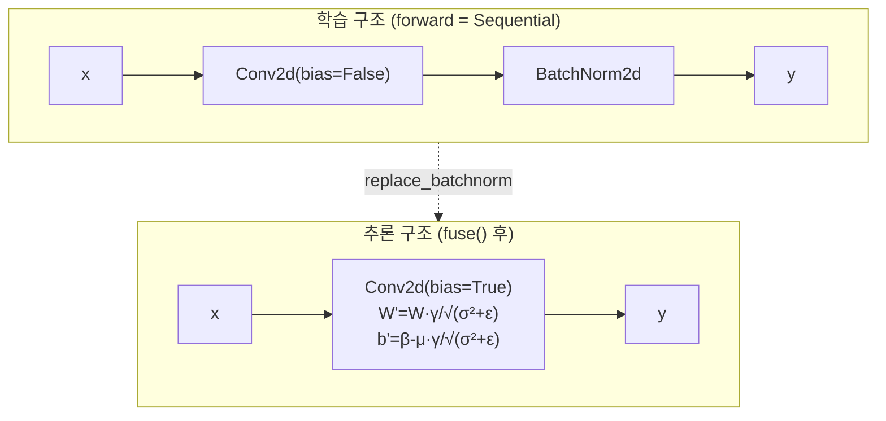
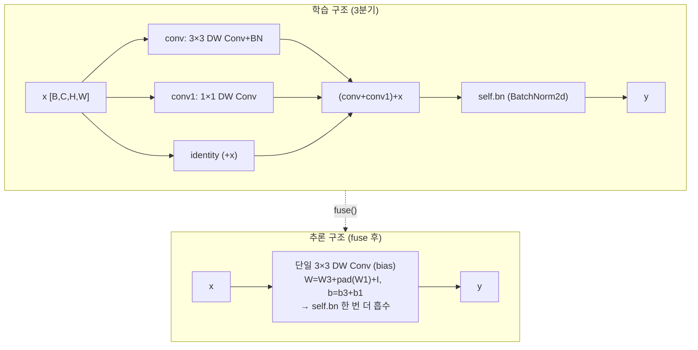
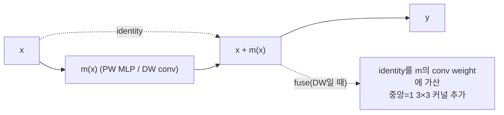
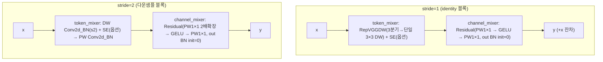
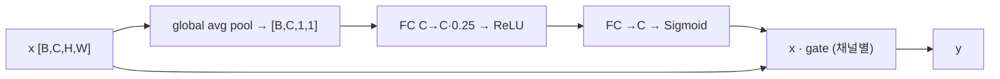
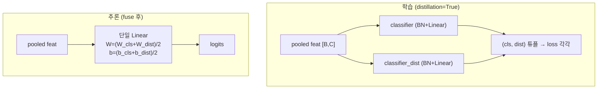
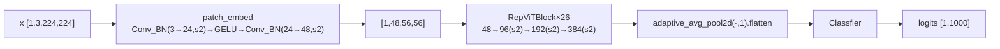
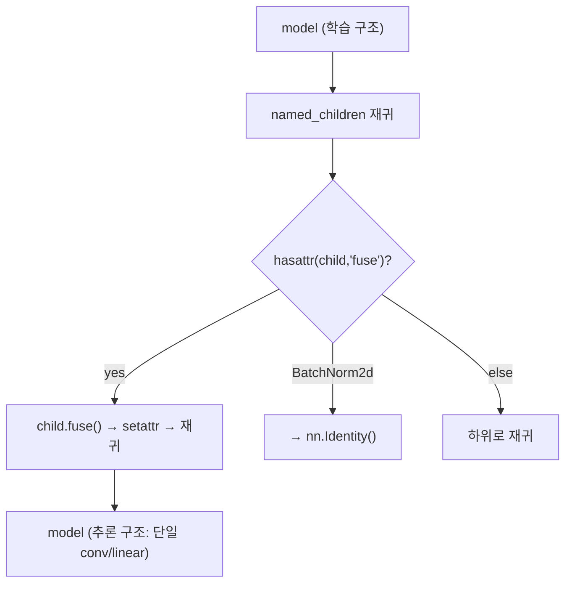
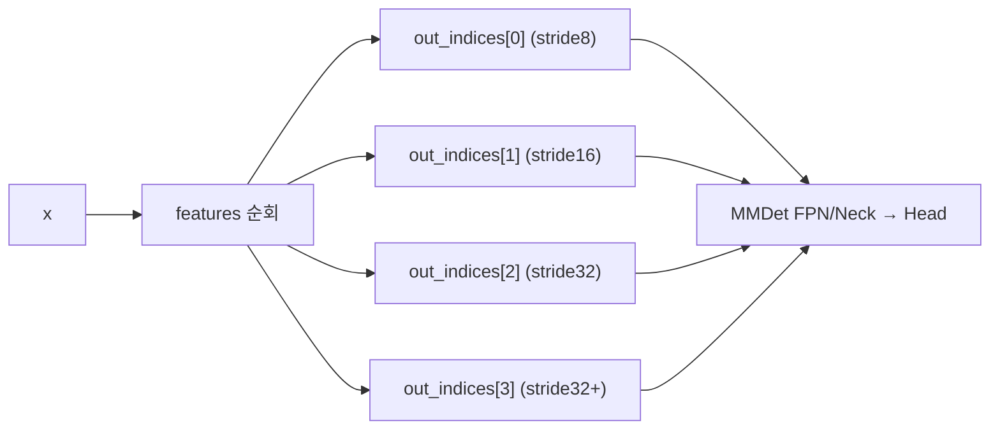

# RepViT 모듈 통합 가이드 (S-PyTorch)

> 1차 요약: [`../RepViT.md`](../RepViT.md) — 본 문서는 그 요약을 모듈 단위로 심화한 통합 가이드다.
> 분석 대상: `\\wsl.localhost\ubuntu-24.04\home\user\project\PRJXR-HBTXR\REF\ViT-Quantization\RepViT`
> 작성 원칙: 실제 소스 Read 후 `파일:라인` 근거 표기. 라인 근거 없는 추론은 "추정", 코드로 확인 불가는 "확인 불가"로 명시.
> 형제 가이드(`REF/Analysis/ViT-Quantization/I-ViT/MODULE_GUIDE.md`)의 6요소 구조를 따르되, I-ViT의 "양자화 수치 규약"은 **RepViT의 핵심인 structural reparameterization(학습 다분기↔추론 단일 conv)** 수치 규약으로 치환한다. **본 repo에는 양자화(PTQ/QAT/INT8) 코드가 없다**(`../RepViT.md` 사전 결론, §1.3 Grep 근거) — 효율 핵심은 재파라미터화·DW/PW 분리·SE이다.

---

## 0. 문서 머리말

### 0.1 대표 케이스 선정
- **대표 모델: `repvit_m0_9` (RepViT-M0.9)** — `flops.py:11-12`가 유일하게 벤치하는 모델명이자, README 논문 초록의 "iPhone 12에서 1ms 지연으로 ImageNet top-1 80% 초과(최초)" 주장을 대표하는 케이스(`README.md:40`). README 표 기준 **Top-1 78.7/79.1, params 5.1M, MACs 0.8G, latency 0.9ms**(`README.md:66`). cfg는 `repvit.py:281-309`(26블록).
  - 보조 대표(최대 모델): `repvit_m2_3` — **Top-1 83.3/83.7, 22.9M, 4.5G, 2.3ms**(`README.md:70`, cfg `repvit.py:443-503`).
- **대표 분석 단위: `RepViTBlock` 1개** = MetaFormer식 `token_mixer(공간 혼합) → channel_mixer(채널 MLP)`(`repvit.py:124-160`). 두 변종:
  1. **stride=1 (identity 블록)**: `token_mixer = RepVGGDW(3분기) + SE(옵션)`, `channel_mixer = Residual(PW 1×1 확장 → GELU → PW 1×1 축소)`(`repvit.py:145-157`).
  2. **stride=2 (다운샘플 블록)**: `token_mixer = DW Conv2d_BN(s2) + SE(옵션) → PW Conv2d_BN`, `channel_mixer = Residual(...)`(`repvit.py:132-144`).
- **대표 재파라미터화 3종**(I-ViT의 "정수 비선형 3종"에 대응하는 본 repo의 핵심 해부 대상):
  1. `Conv2d_BN.fuse` — Conv+BN 융합(`repvit.py:36-48`).
  2. `RepVGGDW.fuse` — 3분기(3×3 DW + 1×1 DW + identity) → 단일 3×3 DW conv(`repvit.py:94-121`).
  3. `Residual.fuse` / `Classfier.fuse` — identity 잔차/distillation 2-head를 가중치로 흡수(`repvit.py:63-80, 205-216`).

### 0.2 S-PyTorch 수치 규약 (I-ViT의 양자화 비트폭 규약 대체)
- **params**: 모듈 차원에서 분석적 계산. Conv `Cout·Cin·Kh·Kw/groups (+Cout)`, DW conv는 `groups=Cin=Cout` → `Cout·Kh·Kw (+Cout)`. Linear `in·out (+out)`. BN `2·C`(추론 시 흡수되어 사라짐). **재파라미터화는 추론 시 params를 줄인다**(다분기·BN이 단일 conv로 합쳐짐) — 학습 params와 추론 params를 구분 표기.
- **FLOPs/MACs**: 표준식×cfg. Conv MAC = `Hout·Wout·Cout·(Cin·Kh·Kw/groups)`. DW conv는 group=C라 `Hout·Wout·C·Kh·Kw`. README 표가 모델별 MACs 제공(`README.md:64-70`)이므로 모델 총합은 인용, 블록 단위는 분석 산출.
- **activation memory**: 텐서 shape × 4byte(FP32). 본 repo는 양자화 없음 → 비트폭은 FP32 고정. INT8 환산은 "추정"으로만 표기.
- **reparameterization(핵심 규약, I-ViT 비트폭 대체)**: 각 모듈마다 **학습 구조(다분기/BN) ↔ 추론 구조(단일 conv/linear)** 차이를 명시. fuse 전후 (a) 연산 그래프 노드 수, (b) params, (c) BN 유무를 정량 비교. 이것이 FPGA 매핑 친화도의 직접 근거.
- **블록 구성**: cfg 튜플 `[k, t, c, use_se, use_hs, s]`(`repvit.py:231`) 의미 — kernel, expansion ratio(항상 2, `repvit.py:130` assert), out channel, SE 사용, HS 플래그(코드상 무력 — §0.5), stride.
- **정확도/지연**: README 표 인용(`README.md:64-70`). 실측은 iPhone 12 CoreML 결과 → 본 세션 미실행, 로컬 재현 **확인 불가**.

### 0.3 운영 경로 (분산 학습 ↔ 체크포인트 ↔ ImageNet 평가 ↔ 추론 융합 ↔ 배포)
```
[create_model] timm create_model('repvit_m0_9', distillation=hard)   (main.py:267-271)
   │  학습 시: 다분기 RepVGGDW + Conv2d_BN(BN 살아있음) + Classfier 2-head
   ▼
[distributed 학습] train_one_epoch(): AMP autocast + DistillationLoss(teacher) + AdamW + EMA
   │  (engine.py:21-73, main.py:401-408)  Mixup/CutMix, threeaugment, 8-GPU DDP
   ▼
[체크포인트 저장] checkpoint_best.pth (best Top-1) + checkpoint_{epoch}.pth  (main.py:416-443)
   ▼
[ImageNet 평가] --eval: replace_batchnorm(model) → evaluate()  (main.py:385-391, engine.py:77-106)
   │  ★ 평가 직전 재파라미터화(BN 흡수, 다분기 융합) 적용 — "추론 구조"로 전환
   ▼
[추론 구조 변환] utils.replace_batchnorm(model)  (utils.py:227-236, README.md:73-80)
   │  fuse() 보유 모듈 재귀 치환 + 잔여 BN2d → Identity
   ▼
[(배포) CoreML] export_coreml.py: replace_batchnorm → torch.jit.trace → ct.convert  (export_coreml.py:24-43)
   │  iPhone 12 latency 측정(XCode 14 benchmark)  (README.md:82-92)
   ▼
[(다운스트림) detection/segmentation] MMDet/MMSeg 백본으로 out_indices 다단계 feature 반환  (detection/repvit.py:263-270)
```
- 타깃 디바이스: **학습은 CUDA GPU 전제**(AMP `torch.cuda.amp.autocast`, `engine.py:46,91`; `torch.cuda.synchronize`, `:64`; DDP nccl, `utils.py:218`). **배포는 모바일(iPhone/CoreML)** 또는 임의 추론 백엔드 — 융합 후 단일 conv 그래프라 백엔드 자유도 큼. CPU 추론 가능 여부는 명시 코드 없음(추론 그래프가 표준 conv/linear뿐이라 CPU 가능 **추정**).

### 0.4 모델 / 데이터셋 / 정확도 (README 인용)
| Model | Top-1 (300/450e) | #params | MACs | Latency(iPhone12) | cfg 근거 |
|---|---|---|---|---|---|
| **M0.9(대표)** | **78.7 / 79.1** | **5.1M** | **0.8G** | **0.9ms** | `README.md:66`, cfg `repvit.py:281-309` |
| M1.0 | 80.0 / 80.3 | 6.8M | 1.1G | 1.0ms | `README.md:67`, cfg `repvit.py:317-345` |
| M1.1 | 80.7 / 81.2 | 8.2M | 1.3G | 1.1ms | `README.md:68`, cfg `repvit.py:354-380` |
| M1.5 | 82.3 / 82.5 | 14.0M | 2.3G | 1.5ms | `README.md:69`, cfg `repvit.py:389-433` |
| M2.3 | 83.3 / 83.7 | 22.9M | 4.5G | 2.3ms | `README.md:70`, cfg `repvit.py:443-503` |
| M0.6 | 74.1 (300e) | (표 외) | ~0.6ms | — | `README.md:54`, cfg `repvit.py:255-273` |
- 데이터셋: **ImageNet-1K**(분류), 224×224, 1000 클래스(`main.py:121`, `data/datasets.py`). 다운스트림: COCO(검출/인스턴스분할, `detection/configs/*coco.py`), ADE20K(시맨틱분할, `segmentation/configs/sem_fpn/*ade20k*.py`).
- 지연/정확도는 외부 체크포인트(distill 300e/450e) + iPhone 12 CoreML 측정 → **로컬 미실행, 확인 불가**(`README.md:10,15,84`).

### 0.5 핵심 주의: `use_hs` 플래그 무력화 (코드 근거)
- cfg의 HS(hard-swish) 컬럼이 실제 activation을 바꾸지 않는다: `nn.GELU() if use_hs else nn.GELU()`(`repvit.py:141,154` 및 `detection/repvit.py:148,161`) — **양 분기 모두 GELU**. 논문 의도(hard-swish)와 코드 불일치. 의도된 단순화인지 버그인지는 **추정**(`../RepViT.md:84,192`). FPGA activation 유닛 설계 시 **항상 GELU** 가정해야 함.

---

## 1. Repo / Layer 개요

RepViT = MobileNetV3식 경량 CNN을 ViT 효율 설계 관점에서 재검토해 만든 **순수 경량 CNN 백본**(self-attention 없음). 핵심은 **학습 시 multi-branch → 추론 시 단일 conv**로 융합하는 RepVGG식 structural reparameterization(`README.md:3,40`, CVPR'24). 본 repo는 **모델 정의·재파라미터화·학습루프**가 자체 소스이고, DataLoader·optimizer·Mixup·EMA·SE·register_model은 timm/MM* 컴포넌트를 임포트한다(`repvit.py:22,162,247`, `main.py:12-22`).

### 1.1 자체 소스 vs 외부 프레임워크 vs 제외
| 구분 | 파일(자체 소스) | 역할 |
|---|---|---|
| **재파라미터화 빌딩블록 ★핵심** | `model/repvit.py` | Conv2d_BN/Residual/RepVGGDW/RepViTBlock + BN_Linear/Classfier + RepViT 본체 + 변형 6종 |
| **재파라미터화 적용기** | `utils.py:227-236` | `replace_batchnorm` — fuse 재귀 치환 |
| **학습 루프** | `engine.py` | `train_one_epoch`(AMP+EMA+distill), `evaluate`(Top-1/5) |
| **학습 엔트리** | `main.py` | argparse, create_model, DDP, optimizer/scheduler, 체크포인트 |
| **손실** | `losses.py` | `DistillationLoss`(hard/soft KD) |
| **FLOPs/배포** | `flops.py`(fvcore), `export_coreml.py`(CoreML) | 측정/변환 도구 |
| **데이터** | `data/datasets.py`, `samplers.py`, `threeaugment.py` | ImageNet 로더, RASampler, 3-augment(미열람 세부) |
| **다운스트림 백본** | `detection/repvit.py`, `segmentation/repvit.py` | 동일 블록 복제 + MMDet/MMSeg `@BACKBONES` 등록 + 다단계 feature |

### 1.2 forward 진입점
`RepViT.forward`(`repvit.py:239-245`): `features`(ModuleList) 순회 → `adaptive_avg_pool2d(x,1).flatten(1)` → `classifier`. `features[0]`은 patch_embed(stride-2 conv ×2 = 4배 다운샘플, `repvit.py:226-227`), 이후 cfg 순서대로 `RepViTBlock` 적층(`repvit.py:228-236`). **다운스트림**은 `forward`가 `out_indices`에 해당하는 중간 feature 4개를 리스트로 반환(`detection/repvit.py:263-270`, out_indices=[2,6,20,24] for M1.1: `detection/configs/mask_rcnn_repvit_m1_1_fpn_1x_coco.py:15`).

### 1.3 제외 (지시에 따라 이름만 표기, 미분석)
- **외부 프레임워크(커스텀 아님)**: `timm`(`SqueezeExcite`/`register_model`/`create_model`/`trunc_normal_`/`Mixup`/`ModelEma`/`NativeScaler`/`create_optimizer`/`create_scheduler`/`accuracy`, `repvit.py:22,162,247`, `main.py:12-19`), `fvcore.FlopCountAnalysis`(`flops.py:6`), `coremltools`(`export_coreml.py:33`).
- **제외 디렉토리**: `detection/mmdet_custom/`·`mmcv_custom/`·`configs/_base_/`, `segmentation/configs/_base_/`·`tools/`(MMDet/MMSeg 외부 third-party 설정·스크립트, ONNX/TensorRT 변환 도구 포함 — RepViT 고유 알고리즘 아님), `sam/`(RepViT-SAM 서브프로젝트, 별도 setup.py 패키지 — 백본 재사용 사실만 §13).
- **미열람(확인 불가)**: `data/datasets.py`/`samplers.py`/`threeaugment.py` 세부, `losses.py` 내부 KD 수식 세부(hard/soft 분기만 main.py에서 확인), `logs/*.txt`(학습 로그), 체크포인트(`*.pth`/`*.mlmodel` 로컬 부재).

### 1.4 대표 모델 레이어 구성 (RepViT-M0.9, `repvit.py:281-309`)
patch_embed(2×stride-2 conv, 224→56) → RepViTBlock×26. cfg 채널 진행: 48(블록0-2, 56×56) → 96(블록3 s2 다운→28×28, 블록4-6) → 192(블록7 s2→14×14, 블록8-22) → 384(블록23 s2→7×7, 블록24-25). SE는 cfg의 SE 컬럼=1인 블록에만(`repvit.py:283,287,...`). 분류 헤드 `Classfier`(distillation 시 2-head, `repvit.py:237`).

---

## 2. 모듈: Conv+BN 융합 — `repvit.py` (Conv2d_BN) ★재파라미터화 기초

### 2.1 역할 + 상위/하위
- **역할**: bias 없는 Conv2d + BatchNorm2d를 묶은 `nn.Sequential`. 학습 시 BN 정규화로 안정화, **추론 시 `fuse()`로 BN을 conv weight/bias에 흡수**해 단일 bias-conv 1개로 환원. 모든 RepViT 블록의 최소 빌딩블록.
- **상위**: `RepVGGDW.conv`(`repvit.py:86`), `RepViTBlock`의 token_mixer/channel_mixer 전 conv(`repvit.py:134,136,140,143,153,156`), patch_embed(`repvit.py:226-227`). **하위**: `nn.Conv2d`, `nn.BatchNorm2d`.

### 2.2 데이터플로우 (학습 ↔ 추론 구조)


### 2.3 forward / fuse call stack
- 학습 forward: `nn.Sequential.forward`(c → bn). 명시 forward 없음(Sequential 상속, `repvit.py:26`).
- 추론 변환: `utils.replace_batchnorm`(`utils.py:229`) → `Conv2d_BN.fuse`(`repvit.py:36-48`) → `nn.Conv2d` 생성·weight/bias copy(`:43-47`).

### 2.4 대표 코드 위치
`repvit.py`: 생성자 `:26-34`(bn_weight_init=1 기본, 잔차 출력단은 0), `fuse` `:36-48`.

### 2.5 대표 코드 블록
```python
# repvit.py:36-48  Conv+BN 융합 (BN의 채널별 affine을 conv weight/bias로 흡수)
@torch.no_grad()
def fuse(self):
    c, bn = self._modules.values()
    w = bn.weight / (bn.running_var + bn.eps)**0.5      # γ/√(σ²+ε)  [Cout]
    w = c.weight * w[:, None, None, None]                # W' = W·(γ/√...)  채널별 스케일
    b = bn.bias - bn.running_mean * bn.weight / \
        (bn.running_var + bn.eps)**0.5                   # b' = β - μ·γ/√...
    m = torch.nn.Conv2d(...stride/padding/groups 보존..., device=c.weight.device)
    m.weight.data.copy_(w); m.bias.data.copy_(b)
    return m                                             # bias 있는 단일 Conv2d
```
→ 추론 시 `out = W'·x + b'` 단일 conv. **별도 정규화 유닛 불필요** → FPGA에서 BN affine 데이터패스 제거, conv weight에 정적 흡수.

### 2.6 연산·수치표현 분해 + 정량 (reparameterization 정밀해부)
- **reparameterization 차이**:
  | | 학습 구조 | 추론 구조(fuse 후) |
  |---|---|---|
  | 노드 | Conv(bias=F) + BN | Conv(bias=T) 1개 |
  | params(예: 96→96 DW 3×3) | conv 96·9=864 + BN 2·96=192 = **1056** | conv 96·9 + bias 96 = **960** |
  | 추론 연산 | conv + (sub/mul) BN | conv only |
- **MACs**: BN 흡수는 MAC 수를 바꾸지 않음(채널별 스칼라가 weight에 곱해질 뿐). 추론 시 BN의 per-element affine(2·H·W·C op)이 사라짐.
- **activation memory**: 변화 없음(중간 BN 출력 버퍼 제거로 약간 절감, 추정).
- **시사**: BN의 running stat(σ,μ)이 학습 종료 시점에 동결 → weight/bias로 정적 융합. 양자화 적용 시 **이미 BN이 weight에 들어간 단일 conv라 per-channel weight 양자화에 자연 부합**(추정).

---

## 3. 모듈: RepVGGDW 3분기 융합 — `repvit.py` (RepVGGDW) ★핵심, FPGA 1순위

### 3.1 역할 + 상위/하위
- **역할**: RepViT의 **token-mixer(공간 혼합)** 핵심. 학습 시 **3분기**(3×3 DW conv+BN, 1×1 DW conv, identity)로 표현력 확보, **추론 시 단일 3×3 DW conv 하나로 융합**. RepVGG의 depthwise 변형.
- **상위**: stride=1 블록의 `token_mixer[0]`(`repvit.py:148`). **하위**: `Conv2d_BN`(3×3 분기), `nn.Conv2d`(1×1 분기), `nn.BatchNorm2d`(최종).

### 3.2 데이터플로우 (학습 3분기 ↔ 추론 단일 conv)


### 3.3 forward / fuse call stack
- 학습: `RepVGGDW.forward`(`repvit.py:91-92`): `bn((conv(x)+conv1(x))+x)`.
- 추론: `replace_batchnorm` → `RepVGGDW.fuse`(`repvit.py:94-121`) → `self.conv.fuse()`(`:96`, Conv2d_BN.fuse) → 1×1 zero-pad(`:104`) → identity 커널 구성(`:106`) → 합산(`:108-109`) → 최종 BN 흡수(`:114-120`).

### 3.4 대표 코드 위치
`repvit.py`: 생성자 3분기 정의 `:84-89`, forward `:91-92`, `fuse` `:94-121`(3×3 BN 흡수 `:96`, 1×1 pad `:104`, identity `:106`, merge `:108-109`, 최종 BN 흡수 `:114-120`).

### 3.5 대표 코드 블록
```python
# repvit.py:94-121  3분기 → 단일 3×3 DW conv 융합
@torch.no_grad()
def fuse(self):
    conv = self.conv.fuse()                              # ① 3×3 분기 BN 흡수 → (W3,b3)
    conv1 = self.conv1
    conv1_w = torch.nn.functional.pad(conv1.weight, [1,1,1,1])   # ② 1×1 → 3×3 zero-pad
    identity = torch.nn.functional.pad(
        torch.ones(conv1_w.shape[0], conv1_w.shape[1], 1, 1, ...), [1,1,1,1])  # ③ 중앙=1 커널
    final_conv_w = conv.weight + conv1_w + identity      # ④ W = W3 + pad(W1) + I
    final_conv_b = conv.bias + conv1.bias                #    b = b3 + b1
    conv.weight.data.copy_(final_conv_w); conv.bias.data.copy_(final_conv_b)
    bn = self.bn                                          # ⑤ 최종 self.bn 한 번 더 흡수
    w = bn.weight / (bn.running_var + bn.eps)**0.5
    conv.weight.data.copy_(conv.weight * w[:, None, None, None])
    conv.bias.data.copy_(bn.bias + (conv.bias - bn.running_mean) * bn.weight / (bn.running_var+bn.eps)**0.5)
    return conv                                           # 추론: 단일 3×3 DW conv 1개
```
→ identity 커널은 **3×3 중앙에만 1**(나머지 0)인 DW 커널 = `+x` 항. 1×1 분기는 zero-pad로 3×3 격자에 정렬. 세 항을 weight 공간에서 단순 가산 → multi-branch 표현력은 학습에서, 추론 비용은 **3×3 DW conv 1개**로 수렴.

### 3.6 연산·수치표현 분해 + 정량 (reparameterization 정밀해부, M0.9 C=192 블록)
- **reparameterization 차이**(DW, C=192, H=W=14):
  | | 학습 구조 | 추론 구조(fuse 후) |
  |---|---|---|
  | 연산 노드 | 3×3conv + BN + 1×1conv + add×2 + BN | 3×3 DW conv 1개 |
  | params | conv(192·9)+BN(384) + conv1(192·1+192 bias)+ bn(384) = 1728+384+384+384 = **2880** | 192·9 + 192 bias = **1920** |
  | MAC/픽셀 | 3×3(9) + 1×1(1) = 10 MAC/ch | 3×3(9) MAC/ch |
  | 추론 MAC(14×14) | (생략, 학습 전용) | 196·192·9 ≈ **338K** |
- **MAC 절감**: 학습 시 3분기(3×3+1×1+identity) → 추론 단일 3×3, **1×1·identity 분기 MAC/메모리 완전 소거**. identity는 weight에 흡수돼 별도 잔차 덧셈(elementwise add) HW도 불필요.
- **activation memory**: 학습 시 3분기 중간버퍼 3개 + add → 추론 시 단일 conv 출력 1개([B,192,14,14] FP32 = 192·196·4 ≈ **151KB** B=1).
- **시사**: 추론 데이터패스가 **3×3 DW conv 1개**뿐 → systolic/파이프라인 매핑이 극단적으로 단순. HG-PIPE류 레이어별 파이프라이닝에 가장 친화적인 token-mixer. **본 repo FPGA 가속 1순위 블록**.

---

## 4. 모듈: Residual 잔차 + identity 흡수 — `repvit.py` (Residual)

### 4.1 역할 + 상위/하위
- **역할**: `x + m(x)` 잔차 래퍼. 학습 시 `drop>0`이면 확률적 스킵(stochastic depth). **DW conv를 감쌀 때는 `fuse()`로 identity 경로를 conv weight에 직접 흡수**(잔차 add 제거).
- **상위**: `RepViTBlock.channel_mixer`(`repvit.py:138,151`). **하위**: 임의 `nn.Module`(주로 PW Conv2d_BN Sequential).

### 4.2 데이터플로우


### 4.3 forward / fuse call stack
- 학습: `Residual.forward`(`repvit.py:56-61`): train+drop>0이면 확률 마스크 곱, 아니면 `x+m(x)`.
- 추론: `Residual.fuse`(`repvit.py:63-80`) — `m`이 `Conv2d_BN`이면 fuse 후 identity(3×3 중앙1) 가산(`:65-71`), 일반 `nn.Conv2d`면 동일(`:72-78`), 그 외면 self 반환(`:79-80`, 즉 PW MLP Sequential은 융합 불가 → 잔차 add 유지).

### 4.4 대표 코드 위치
`repvit.py`: forward(stochastic depth) `:56-61`, `fuse` `:63-80`(DW conv identity 흡수 `:67-71`).

### 4.5 대표 코드 블록
```python
# repvit.py:63-71  DW conv를 감싼 Residual의 identity 흡수
@torch.no_grad()
def fuse(self):
    if isinstance(self.m, Conv2d_BN):
        m = self.m.fuse()
        assert(m.groups == m.in_channels)               # DW만 흡수 가능
        identity = torch.ones(m.weight.shape[0], m.weight.shape[1], 1, 1)
        identity = torch.nn.functional.pad(identity, [1,1,1,1])   # 3×3 중앙=1
        m.weight += identity.to(m.weight.device)         # +x를 weight에 가산
        return m
    ...
    else:
        return self                                      # PW MLP Sequential → 잔차 유지
```
→ **주의**: channel_mixer의 Residual은 내부가 `nn.Sequential(PW Conv2d_BN → GELU → PW Conv2d_BN)`이므로 `isinstance(self.m, Conv2d_BN)`이 False → **`else: return self`**(`:79`). 즉 channel_mixer의 잔차 add는 추론에도 남음(GELU 비선형 때문에 융합 불가). RepVGGDW 내부 identity와 혼동 금지.

### 4.6 연산·수치표현 분해 + 정량 (reparameterization 정밀해부)
- **reparameterization 차이**: DW conv를 감싼 Residual은 identity가 weight로 흡수(add HW 제거). 반면 **channel_mixer의 Residual은 융합 불가** → 추론에도 elementwise add 1개 잔존(`repvit.py:79`).
- **params/MAC**: identity 흡수는 params·MAC 불변(중앙 커널 +1만). channel_mixer 잔차는 add op = `H·W·C` elementwise/블록.
- **activation memory**: channel_mixer 잔차는 입력 x를 add 시점까지 보존 필요 → 입력 버퍼([B,C,H,W]) 유지. FPGA 파이프라인에서 skip-connection 라인 버퍼 필요.
- **시사**: 융합 가능한 잔차(RepVGGDW 내부)와 불가능한 잔차(channel_mixer MLP)를 구분 → HW는 **token-mixer는 conv-only, channel-mixer는 conv+GELU+skip-add** 구조로 설계.

---

## 5. 모듈: RepViTBlock (MetaFormer 블록) — `repvit.py` (RepViTBlock) ★조립 핵심

### 5.1 역할 + 상위/하위
- **역할**: RepViT의 기본 블록. **token_mixer(공간 혼합) → channel_mixer(채널 MLP)**의 MetaFormer 구조. stride/identity 여부로 2변종. expansion ratio `t=2` 고정(`repvit.py:130` assert).
- **상위**: `RepViT.features`(`repvit.py:234`). **하위**: `Conv2d_BN`, `RepVGGDW`, `Residual`, `timm.SqueezeExcite`, `nn.GELU`.

### 5.2 데이터플로우 (2변종)


### 5.3 forward call stack
`RepViTBlock.forward`(`repvit.py:159-160`): `self.channel_mixer(self.token_mixer(x))`. 생성자(`:124-157`)에서 stride 분기로 token/channel mixer 구성.

### 5.4 대표 코드 위치
`repvit.py`: 생성자 `:124-157`(t=2 assert `:130`, stride2 분기 `:132-144`, stride1 분기 `:145-157`), forward `:159-160`. SE 주입 `:135,149`, GELU `:141,154`.

### 5.5 대표 코드 블록
```python
# repvit.py:145-157  stride=1 블록 (RepVGGDW token-mixer + PW MLP channel-mixer)
else:
    assert(self.identity)                                # stride1 & inp==oup
    self.token_mixer = nn.Sequential(
        RepVGGDW(inp),                                   # 3분기 → 추론 단일 3×3 DW
        SqueezeExcite(inp, 0.25) if use_se else nn.Identity(),  # SE 옵션
    )
    self.channel_mixer = Residual(nn.Sequential(
        Conv2d_BN(inp, hidden_dim, 1, 1, 0),            # PW 확장 (hidden=2·inp)
        nn.GELU() if use_hs else nn.GELU(),             # ★ 항상 GELU (use_hs 무력)
        Conv2d_BN(hidden_dim, oup, 1, 1, 0, bn_weight_init=0),  # PW 축소 (out BN γ=0)
    ))
```
→ MobileNet식 inverted residual(PW확장→비선형→PW축소)을 channel-mixer로, RepVGGDW를 token-mixer로 분리한 MetaFormer. `bn_weight_init=0`(`:156`)은 잔차 출력단 BN γ=0으로 초기화해 **학습 초기 잔차를 identity로** 시작(안정화).

### 5.6 연산·수치표현 분해 + 정량 (M0.9, stride=1 C=192 블록, H=W=14)
- **블록 구성**: token_mixer = RepVGGDW(추론 단일 3×3 DW) + SE; channel_mixer = PW(192→384) + GELU + PW(384→192) + 잔차 add.
- **params(추론, fuse 후)**:
  - RepVGGDW: 192·9 + 192 = **1,920**
  - PW 확장 192→384: 192·384 + 384 = **74,112**(1×1 conv = in·out)
  - PW 축소 384→192: 384·192 + 192 = **73,920**
  - SE(있을 때, timm SqueezeExcite r=0.25): 192·48 + 48 + 48·192 + 192 ≈ **18,672**(추정, timm 구현 의존)
  - 블록 params(SE 제외) ≈ **149,952**
- **MACs(B=1, 14×14=196)**:
  - RepVGGDW 3×3 DW: 196·192·9 ≈ **338K**
  - PW 확장: 196·192·384 ≈ **14.5M**
  - PW 축소: 196·384·192 ≈ **14.5M**
  - 블록 MAC(SE/GELU 제외) ≈ **29.3M**
- **activation memory(피크)**: PW 확장 출력 [1,384,14,14] FP32 = 384·196·4 ≈ **301KB**.
- **시사**: channel_mixer가 MAC 지배(PW 2개 ≈ 29M vs token-mixer 0.34M). DW token-mixing은 **연산 저렴·메모리 저렴**, PW channel-mixing이 연산 핫스팟 → FPGA에서 PW(1×1 conv=GEMM) 가속이 핵심.

---

## 6. 모듈: Squeeze-Excite — `repvit.py`/timm (SqueezeExcite)

### 6.1 역할 + 상위/하위
- **역할**: 채널 게이팅(글로벌 평균풀링 → FC-ReLU-FC-Sigmoid → 채널별 스케일). cfg의 SE 컬럼=1인 블록에만 삽입. **timm 외부 구현 사용**(자체 정의 아님 → 백본 연동만 간략 분석).
- **상위**: `RepViTBlock.token_mixer`(`repvit.py:135,149`). **하위**: `timm.models.layers.SqueezeExcite`(`repvit.py:22`).

### 6.2 데이터플로우


### 6.3 forward call stack
`RepViTBlock.token_mixer`의 `SqueezeExcite(inp, 0.25)`(`repvit.py:135,149`) — 내부 forward는 timm 구현(미열람, **확인 불가** 세부).

### 6.4 대표 코드 위치
`repvit.py`: import `:22`, 주입 `:135`(stride2), `:149`(stride1). rd_ratio=0.25 고정.

### 6.5 대표 코드 블록
```python
# repvit.py:135,149  SE 주입 (timm 구현, rd_ratio=0.25)
SqueezeExcite(inp, 0.25) if use_se else nn.Identity()
```
→ use_se=0이면 `nn.Identity()`(연산 없음). cfg SE 컬럼이 블록별 SE on/off 제어(예: M0.9 블록0=SE on `repvit.py:283`, 블록1=off `:284`).

### 6.6 연산·수치표현 분해 + 정량
- **블록 구성**: GAP(전역 reduction) + 2 FC + sigmoid + 채널 스케일.
- **params(C=192, r=0.25, 추정)**: FC1 192·48 + FC2 48·192 ≈ **18.4K**(+bias).
- **MACs**: GAP(H·W·C reduce) + FC(C·C·0.25 ×2 ≈ 192·48·2=18.4K, 공간무관) + 스케일(H·W·C). 연산 자체는 소량이나 **전역 평균풀링이 공간 reduction**.
- **reparameterization**: SE는 fuse 대상 아님(추론에도 그대로). 단 use_se=0이면 Identity로 완전 소거.
- **시사**: 전역 reduction(GAP)은 스트리밍/파이프라인 HW에서 **전체 feature map 누적 후에야 게이팅 가능** → 약간의 동기화·라인버퍼 비용(`../RepViT.md:194`). SE 없는 블록(use_se=0)이 파이프라인 친화적.

---

## 7. 모듈: BN_Linear / Classfier (distillation 헤드) — `repvit.py` ★재파라미터화

### 7.1 역할 + 상위/하위
- **역할**: `BN_Linear` = BatchNorm1d + Linear, fuse로 BN 흡수. `Classfier` = distillation 시 `classifier`+`classifier_dist` **2-head**, 추론 시 두 출력 평균; **fuse로 두 head 가중치 평균해 단일 Linear로 병합**. DeiT식 hard-distillation 토큰 헤드.
- **상위**: `RepViT.classifier`(`repvit.py:237`). **하위**: `nn.BatchNorm1d`, `nn.Linear`, `timm.trunc_normal_`.

### 7.2 데이터플로우 (학습 2-head ↔ 추론 단일 Linear)


### 7.3 forward / fuse call stack
- 학습: `Classfier.forward`(`repvit.py:196-203`): distill이면 `(classifier(x), classifier_dist(x))`, eval이면 두 출력 평균(`:199-200`).
- 추론: `Classfier.fuse`(`repvit.py:205-216`) → `BN_Linear.fuse`×2(`:207,209`) → weight/bias 평균(`:210-213`).

### 7.4 대표 코드 위치
`repvit.py`: `BN_Linear.fuse` `:172-186`, `Classfier.forward` `:196-203`, `Classfier.fuse` `:205-216`.

### 7.5 대표 코드 블록
```python
# repvit.py:205-216  distillation 2-head → 단일 Linear 평균 병합
@torch.no_grad()
def fuse(self):
    classifier = self.classifier.fuse()                 # BN 흡수된 Linear
    if self.distillation:
        classifier_dist = self.classifier_dist.fuse()
        classifier.weight += classifier_dist.weight
        classifier.bias += classifier_dist.bias
        classifier.weight /= 2; classifier.bias /= 2     # W=(W_cls+W_dist)/2
        return classifier                                # 단일 Linear
    return classifier
```
→ 추론 시 두 head 평균이 가중치에 정적 흡수 → **단일 Linear 1개**. teacher distillation의 추가 head 비용이 추론에서 사라짐.

### 7.6 연산·수치표현 분해 + 정량 (reparameterization 정밀해부, M0.9 C=384)
- **reparameterization 차이**:
  | | 학습 구조 | 추론 구조(fuse 후) |
  |---|---|---|
  | 노드 | 2×(BN1d + Linear) + 평균 | Linear 1개 |
  | params | 2×(BN 2·384 + Linear 384·1000+1000) = 2×385,768 = **771,536** | 384·1000+1000 = **385,000** |
- **params 절감**: distillation 2-head + BN → 추론 단일 Linear, **약 50% 헤드 params 소거**.
- **MAC**: 추론 시 1회 GEMV(384·1000 = 384K, cls 1벡터). 학습 시 2배.
- **시사**: KD의 추가 헤드·BN이 추론 비용 0. FPGA 분류 헤드는 단일 FC + (BN 흡수)로 단순.

---

## 8. 모듈: RepViT 본체 + patch_embed — `repvit.py` (RepViT)

### 8.1 역할 + 상위/하위
- **역할**: cfg 리스트로 patch_embed + RepViTBlock 스택 + Classfier 조립. **patch_embed = 2×stride-2 Conv2d_BN**(ViT patchify를 conv stem으로 대체, 4배 다운샘플). 채널은 `_make_divisible(c,8)`로 8 배수 정렬.
- **상위**: `create_model`(timm, `main.py:267`), `repvit_m*` 팩토리(`repvit.py:250-504`). **하위**: §2~7 모든 모듈.

### 8.2 데이터플로우 (M0.9, 224×224)


### 8.3 forward call stack
`RepViT.forward`(`repvit.py:239-245`): `for f in self.features: x=f(x)`(`:241-242`) → `adaptive_avg_pool2d(x,1).flatten(1)`(`:243`) → `self.classifier(x)`(`:244`).

### 8.4 대표 코드 위치
`repvit.py`: `_make_divisible` `:3-20`, 생성자(patch_embed `:226-227`, cfg 순회 `:231-235`, classifier `:237`), forward `:239-245`, 팩토리 6종 `:250-504`.

### 8.5 대표 코드 블록
```python
# repvit.py:225-237  conv-stem patch_embed + cfg 기반 블록 스택
input_channel = self.cfgs[0][2]
patch_embed = torch.nn.Sequential(
    Conv2d_BN(3, input_channel // 2, 3, 2, 1), torch.nn.GELU(),   # 224→112
    Conv2d_BN(input_channel // 2, input_channel, 3, 2, 1))        # 112→56
layers = [patch_embed]
for k, t, c, use_se, use_hs, s in self.cfgs:
    output_channel = _make_divisible(c, 8)               # 8 배수 정렬
    exp_size = _make_divisible(input_channel * t, 8)     # hidden=2·inp
    layers.append(RepViTBlock(input_channel, exp_size, output_channel, k, s, use_se, use_hs))
    input_channel = output_channel
self.features = nn.ModuleList(layers)
self.classifier = Classfier(output_channel, num_classes, distillation)
```
→ **stem이 stride-2 conv ×2**로 4배 다운샘플(ViT의 patch16 대신). 이후 cfg의 stride=2 블록 3개로 추가 다운샘플(총 32× → 224→7).

### 8.6 연산·수치표현 분해 + 정량 (M0.9 전체)
- **블록 구성**: patch_embed(stem) + RepViTBlock×26 + GAP + Classfier.
- **params(추론, fuse 후)**: README 표 **5.1M**(`README.md:66`). 8 배수 정렬(`_make_divisible`)로 채널 HW 친화.
- **MACs**: README 표 **0.8G**(`README.md:66`, 224×224 1이미지). patch_embed MAC: 56×56×24×(3·9)=56²·24·27 ≈ **2.0M** + 112×... (stem 2단). 블록 MAC은 채널·해상도 진행에 따라 가변(고해상도 초기 블록 vs 저해상도 후기 블록).
- **activation memory(피크)**: stem 출력 [1,48,56,56] FP32 = 48·3136·4 ≈ **602KB**가 초기 피크(해상도 큰 초반). 후반 [1,384,7,7]은 75KB.
- **시사**: 연산 종류 = {3×3 DW conv, 1×1 PW conv, GELU, SE, GAP, Linear}뿐. **attention/softmax/layernorm 전무** → ViT 가속기의 까다로운 비선형 데이터패스 불요. 단 본질이 CNN이라 Transformer 가속기 attention 엔진 검증 워크로드로는 부적합(§13).

---

## 9. 모듈: 추론 구조 변환기 — `utils.py` (replace_batchnorm) ★재파라미터화 적용

### 9.1 역할 + 상위/하위
- **역할**: 모델 트리를 재귀 순회하며 `fuse()` 보유 모듈을 융합 모듈로 치환, 잔여 `BatchNorm2d`는 `nn.Identity`로 제거. **학습 구조 → 추론 구조 일괄 전환**의 단일 진입점.
- **상위**: `main.py`의 `--eval`(`:386`), `export_coreml.py:24`, `flops.py:17`, README 추론 절차(`:73-80`). **하위**: 각 모듈 `fuse()`(§2,3,4,7).

### 9.2 데이터플로우


### 9.3 forward call stack
`main.py:386`(eval) 또는 README 절차 → `replace_batchnorm(model)`(`utils.py:227`) → 재귀 `child.fuse()`(`:230`) → 잔여 BN2d → Identity(`:233-234`).

### 9.4 대표 코드 위치
`utils.py`: `replace_batchnorm` `:227-236`.

### 9.5 대표 코드 블록
```python
# utils.py:227-236  fuse 보유 모듈 재귀 치환 + 잔여 BN 제거
def replace_batchnorm(net):
    for child_name, child in net.named_children():
        if hasattr(child, 'fuse'):
            fused = child.fuse()
            setattr(net, child_name, fused)
            replace_batchnorm(fused)                     # 융합 결과도 재귀(중첩 fuse)
        elif isinstance(child, torch.nn.BatchNorm2d):
            setattr(net, child_name, torch.nn.Identity())  # 독립 BN 제거
        else:
            replace_batchnorm(child)
```
→ Conv2d_BN/RepVGGDW/Residual/Classfier의 `fuse()`를 트리 전체에 적용. 변환 후 모델은 **표준 conv/linear/GELU/SE/Identity만 남은 추론 그래프**.

### 9.6 연산·수치표현 분해 + 정량 (reparameterization 정밀해부)
- **reparameterization 효과(전 모델)**: 학습 구조의 모든 BN·다분기·distillation 2-head가 추론 구조에서 단일 conv/linear로 융합. 그래프 노드 수 대폭 감소, BN 연산 0.
- **params**: 변환 후 README 표 수치(M0.9 5.1M)는 **추론(fuse 후) params**(BN·dist head 흡수 반영). 학습 params는 그보다 큼(BN·conv1·dist head 추가, 분석 산출).
- **시사**: 단일 함수 호출로 학습↔추론 그래프 분리 → 배포 파이프라인 표준화. FPGA/CoreML/ONNX 어느 백엔드든 융합 후 그래프를 입력으로 받아 처리 가능.

---

## 10. 모듈: 학습·평가 루프 — `engine.py` + `main.py`

### 10.1 역할 + 상위/하위
- **역할**: AMP autocast + DistillationLoss(teacher hard/soft KD) + AdamW + EMA + Mixup으로 분산 학습; `--eval`은 replace_batchnorm 후 Top-1/5 평가. **이 repo는 양자화 QAT가 아니라 일반 FP 학습 + KD**.
- **상위**: CLI(`README.md:117-129`). **하위**: timm(`Mixup`/`ModelEma`/`NativeScaler`/`create_optimizer`/`create_scheduler`/`accuracy`), `losses.DistillationLoss`, `utils.replace_batchnorm`.

### 10.2 데이터플로우
```mermaid
flowchart TD
  CLI["argparse(--model/--data-path/--distillation-type hard)"] --> M["create_model(distillation=True)"]
  M --> TM["teacher_model (KD, main.py:336)"]
  M --> TR["train_one_epoch: model.train() + AMP autocast"]
  TR --> LOSS["DistillationLoss(teacher) (criterion, main.py:354)"]
  LOSS --> OPT["AdamW + NativeScaler(AMP) + clip_grad + EMA update"]
  OPT --> SCH["lr_scheduler.step(epoch) (cosine)"]
  SCH --> VAL["evaluate: model.eval() → Top-1/5"]
  VAL --> SAVE["best Top-1 → checkpoint_best.pth (main.py:434-443)"]
  M -.--eval.-> RB["replace_batchnorm → evaluate (main.py:386-388)"]
```

### 10.3 forward call stack
`main`(`main.py`) → `train_one_epoch`(`engine.py:21`): `model.train()`(`:29`) → AMP `model(samples)`(`:46-47`) → `criterion`(DistillationLoss, `:48`) → `loss_scaler`(`:61`) → `model_ema.update`(`:65-66`). `evaluate`(`engine.py:77`): `model.eval()`(`:84`) → `accuracy top1/5`(`:95`).

### 10.4 대표 코드 위치
`engine.py`: `train_one_epoch` `:21-73`, `evaluate` `:77-106`. `main.py`: create_model `:267-271`, EMA `:296-303`, criterion/distill `:322-355`, eval 분기(replace_batchnorm) `:385-391`, 학습 루프 `:397-451`.

### 10.5 대표 코드 블록
```python
# engine.py:46-66  AMP autocast + distill loss + EMA
with torch.cuda.amp.autocast():
    outputs = model(samples)
    loss = criterion(samples, outputs, targets)          # DistillationLoss
loss_scaler(loss, optimizer, clip_grad=clip_grad, clip_mode=clip_mode,
            parameters=model.parameters(), create_graph=is_second_order)
torch.cuda.synchronize()
if model_ema is not None:
    model_ema.update(model)
```
```python
# main.py:385-388  평가 시 추론 구조로 융합 후 evaluate
if args.eval:
    utils.replace_batchnorm(model)   # ★ BN 흡수·다분기 융합 (추론 구조 전환)
    test_stats = evaluate(data_loader_val, model, device)
```
→ 평가는 **반드시 융합 후** 수행(추론 구조와 동일 그래프로 정확도 측정). distillation은 `--distillation-type hard`(기본, `main.py:137`)로 teacher logits 사용.

### 10.6 연산·수치표현 분해 + 정량 / 재현 명령
- **학습 방식**: FP32/AMP, KD(hard/soft), Mixup/CutMix, threeaugment, EMA(decay `main.py:302`), AdamW + cosine. **양자화 없음**(observer/fake-quant 코드 부재 — §1.3).
- **재현 명령**(`README.md:117-129`):
  ```bash
  # 학습 (8-GPU)
  python -m torch.distributed.launch --nproc_per_node=8 --master_port 12346 --use_env \
      main.py --model repvit_m0_9 --data-path ~/imagenet --dist-eval
  # 평가 (BN 자동 융합)
  python main.py --eval --model repvit_m0_9 --resume pretrain/repvit_m0_9_distill_300e.pth --data-path ~/imagenet
  ```
- **정확도**: M0.9 Top-1 78.7/79.1(300/450e, `README.md:66`). **속도/실측 본 세션 미실행 → 확인 불가.**
- **주의**: `set_bn_eval`(finetune 시 BN을 eval로 고정, `engine.py:30-31`, `main.py:407`) 옵션 존재. 학습은 BN 살아있는 다분기 구조, 평가는 융합 구조 — **학습/평가 그래프가 다름**.

---

## 11. 모듈: 다운스트림 백본 (detection/segmentation) — `detection/repvit.py`

### 11.1 역할 + 상위/하위
- **역할**: `model/repvit.py`와 **동일한 재파라미터화 블록을 복제**하되, MMDet `@BACKBONES.register_module()`로 등록(`detection/repvit.py:274`)하고 `out_indices`의 다단계 feature 4개를 리스트로 반환. 검출/분할에서도 추론 단일 conv 융합 이점 그대로.
- **상위**: MMDet/MMSeg config(`detection/configs/mask_rcnn_repvit_m1_1_fpn_1x_coco.py:10-15`). **하위**: §2~6 동일 블록.

### 11.2 데이터플로우 (다단계 feature)


### 11.3 forward call stack
`RepViT.forward`(`detection/repvit.py:263-270`): `for i,f in enumerate(features): x=f(x); if i in out_indices: outs.append(x)` → `assert len(outs)==4`(`:269`).

### 11.4 대표 코드 위치
`detection/repvit.py`: 동일 블록 `:33-193`(model/repvit.py 복제), multi-stage forward `:263-270`, `@BACKBONES` 팩토리 `:274-429`, train()에서 BN eval 고정 `:254-260`. config out_indices `mask_rcnn_repvit_m1_1_fpn_1x_coco.py:15`(=[2,6,20,24]).

### 11.5 대표 코드 블록
```python
# detection/repvit.py:263-270  out_indices 다단계 feature 반환
def forward(self, x):
    outs = []
    for i, f in enumerate(self.features):
        x = f(x)
        if i in self.out_indices:
            outs.append(x)
    assert(len(outs) == 4)                               # FPN 입력 4 스테이지
    return outs
```
→ 분류용 GAP+classifier 대신 **중간 feature 4개**(stride 8/16/32 등)를 FPN으로. 블록 자체는 분류용과 동일(재파라미터화 융합 동일 적용).

### 11.6 연산·수치표현 분해 + 정량
- **블록 구성**: 분류 백본과 동일, 헤드만 제거하고 다단계 출력. SyncBN 변환(`detection/repvit.py:219`).
- **데이터셋**: COCO(검출/인스턴스분할), ADE20K(시맨틱분할). config가 백본+FPN+RoI head 조립(외부 MMDet, §1.3 제외).
- **시사**: 동일 융합 백본을 검출/분할에 재사용 → 추론 단일 conv 이점이 다운스트림에도 전이. FPGA 다태스크 백본 공유 가능(추정).

---

## N+1. 모듈 한눈 요약 표 (모델 변형 포함)

### N+1.1 모듈 요약
| 모듈 | 파일:라인 | 역할 | reparameterization(학습→추론) | 대표 정량(M0.9) |
|---|---|---|---|---|
| Conv2d_BN | repvit.py:26-48 | Conv+BN 빌딩블록 | Conv(bias=F)+BN → bias-Conv 1개 | BN 흡수, params -2C/모듈 |
| RepVGGDW ★ | repvit.py:83-121 | token-mixer(공간) | 3분기(3×3DW+1×1DW+id) → 단일 3×3 DW | C192 블록 338K MAC, 추론 1.9K params |
| Residual | repvit.py:50-80 | 잔차 + identity 흡수 | DW면 weight 흡수, MLP면 add 유지 | channel-mixer add 잔존 |
| RepViTBlock | repvit.py:124-160 | MetaFormer 블록(t=2) | token-mixer fuse, channel-mixer 일부 | C192 블록 29.3M MAC, 150K params |
| SqueezeExcite | repvit.py:22,135,149 | 채널 게이팅(timm) | fuse 없음, use_se=0→Identity | C192 ~18K params(추정) |
| BN_Linear/Classfier | repvit.py:163-216 | distill 2-head 분류 | 2-head+BN → 단일 Linear 평균 | head 771K→385K params |
| RepViT 본체 | repvit.py:218-245 | conv-stem + 블록 스택 | replace_batchnorm 일괄 융합 | 5.1M params, 0.8G MAC |
| replace_batchnorm | utils.py:227-236 | 추론 구조 변환기 | fuse 재귀 + 잔여 BN→Identity | 그래프 단순화 |
| engine 학습/평가 | engine.py:21-106 | AMP+KD+EMA 학습, eval | 평가 직전 융합 | M0.9 78.7/79.1 Top-1 |
| detection 백본 | detection/repvit.py:195-429 | 다단계 feature(out_indices) | 동일 블록 융합 | out_indices=[2,6,20,24] |

### N+1.2 모델 변형 (cfg 차이만, t=2/kernel=3 공통)
| Model | 함수:라인 | Top-1(300/450) | params(추론) | MACs | Latency | 채널 진행(대략) |
|---|---|---|---|---|---|---|
| M0.6 | repvit.py:251 | 74.1(300) | — | — | ~0.6ms | 40→80→160→320 |
| **M0.9(대표)** | **repvit.py:277** | **78.7/79.1** | **5.1M** | **0.8G** | **0.9ms** | 48→96→192→384 |
| M1.0 | repvit.py:313 | 80.0/80.3 | 6.8M | 1.1G | 1.0ms | 56→112→224→448 |
| M1.1 | repvit.py:350 | 80.7/81.2 | 8.2M | 1.3G | 1.1ms | 64→128→256→512 |
| M1.5 | repvit.py:385 | 82.3/82.5 | 14.0M | 2.3G | 1.5ms | 64→128→256→512(더 깊음) |
| M2.3 | repvit.py:439 | 83.3/83.7 | 22.9M | 4.5G | 2.3ms | 80→160→320→640 |
- 모든 변형: expansion ratio t=2(`repvit.py:130` assert), kernel 3, SE/HS 토글로 cfg 구성. 깊이/채널폭만 차이. (정확도/지연 README 인용, 로컬 미실행 → 확인 불가)

---

## N+2. 학습·평가 파이프라인 + 재현 명령

- **데이터셋**: ImageNet-1K(분류, `main.py:121`), 224×224, 1000 클래스. 다운스트림: COCO(`detection/configs/*coco.py`), ADE20K(`segmentation/configs/sem_fpn/*ade20k*.py`).
- **학습**(FP32/AMP + KD, **양자화 없음**):
  ```bash
  python -m torch.distributed.launch --nproc_per_node=8 --master_port 12346 --use_env \
      main.py --model repvit_m0_9 --data-path ~/imagenet --dist-eval
  ```
  옵션: `--model {repvit_m0_6,m0_9,m1_0,m1_1,m1_5,m2_3}`, `--distillation-type {hard,soft,none}`(기본 hard, `main.py:137`), `--model-ema`(기본 on, `:44`), `--set_bn_eval`(finetune BN 고정, `:146`).
- **체크포인트**: 매 epoch `checkpoint_{epoch}.pth`(3epoch 전 삭제, `main.py:417-432`) + best Top-1 `checkpoint_best.pth`(`:434-443`).
- **평가**(BN 자동 융합):
  ```bash
  python main.py --eval --model repvit_m0_9 --resume <ckpt>.pth --data-path ~/imagenet
  ```
- **추론 구조 변환**: `utils.replace_batchnorm(model)`(`README.md:73-80`). **CoreML 배포**: `python export_coreml.py --model repvit_m0_9 --ckpt <ckpt>`(`README.md:90-92`, `export_coreml.py:24-43`).
- **FLOPs/params 측정**: `flops.py`(fvcore `FlopCountAnalysis`, replace_batchnorm 후 측정 `:17-22`).
- **의존성**: PyTorch + **timm 강결합**(SE/register_model/Mixup/EMA, `repvit.py:22,162,247`), fvcore(flops), coremltools(배포), MMDet/MMSeg(다운스트림). **CUDA 학습 전제**(AMP/DDP), 추론은 표준 conv 그래프(백엔드 자유, CPU 가능 추정).

---

## N+3. 우리 프로젝트(FPGA ViT 가속) 시사점 + FPGA 친화도

### N+3.1 재파라미터화 = 추론 단일 conv → HW 매핑 최우선 친화 (핵심)
- **RepVGGDW 3분기 → 단일 3×3 DW conv**(`repvit.py:94-121`) + **Conv2d_BN BN 흡수**(`:36-48`) + **replace_batchnorm 일괄 변환**(`utils.py:227-236`): 학습/추론 그래프 분리로 **추론 데이터패스가 conv+activation만** 남음. HG-PIPE식 레이어별 파이프라이닝·systolic array 매핑이 극단적으로 단순. **본 repo FPGA 친화의 최대 강점**.
- **BN 제거**: 추론 시 BN 채널별 affine이 conv weight/bias에 정적 흡수(`:39-42`) → 별도 정규화 유닛 불필요, DSP/LUT 절감.

### N+3.2 연산 종류 최소화 = 데이터패스 단순
- 추론 연산 = {3×3 DW conv, 1×1 PW conv, GELU, SE(GAP+FC), GAP, Linear}뿐(`repvit.py` 전반). **attention/softmax/layernorm 전무** → ViT 가속기에서 가장 까다로운 softmax·LN 데이터패스 불요. 단 본질이 CNN이라 **HG-PIPE attention 엔진 직접 검증 워크로드로는 부적합**(§N+3.5). 효율 백본/stem 또는 경량 비교 baseline으로 가치.
- **8 배수 채널 정렬**(`_make_divisible`, `repvit.py:3-20`) → 타일링/병렬 lane 정렬 친화.

### N+3.3 연산 핫스팟 = PW(1×1 GEMM)
- 블록 MAC 분석: channel-mixer PW 2개(C192 블록 ≈ 29M) ≫ token-mixer DW(0.34M). **1×1 PW conv = GEMM**이 연산 지배 → FPGA에서 PW GEMM 가속(systolic) + DW는 저비용 라인버퍼 처리가 효율적.
- DW token-mixing은 연산·메모리 저렴(채널독립 3×3) → 파이프라인 1순위 저부담 블록.

### N+3.4 FPGA 친화도 평가
| 항목 | 평가 | 근거 |
|---|---|---|
| 추론 그래프 단순성 | ★★★ 모든 블록 단일 conv/linear 융합 | `repvit.py:36-121`, `utils.py:227-236` |
| BN 제거(정규화 유닛 불요) | ★★★ weight/bias 흡수 | `repvit.py:39-42` |
| 비선형 단순성 | ★★★ GELU만(softmax/LN 없음) | `repvit.py:141,154`(use_hs 무력→항상 GELU) |
| 채널 정렬 | ★★ 8 배수 | `_make_divisible` `:3-20` |
| SE 전역 reduction | ★ GAP 동기화 비용 | `repvit.py:135,149` |
| channel-mixer skip-add | ★ 융합 불가, 잔차 라인버퍼 필요 | `repvit.py:79` |
| 양자화 이식성 | △ 양자화 코드 부재(외부 도구 필요) | §1.3, `../RepViT.md:118-120` |
| Transformer 가속 적합성 | △ 본질 CNN, attention 엔진 검증 부적합 | self-attention 없음 |

### N+3.5 XR 시선추적 적용 (프로젝트 성격은 추정)
- 시선추적은 저해상도·저지연·저전력이 관건 → **conv-stem(2× stride-2)으로 빠른 다운샘플**(`repvit.py:226-227`) + 3×3 DW + 1×1 PW의 저연산 블록 + 추론 단일 conv 융합이 FPGA 실시간 추론에 적합. iPhone 12에서 0.9ms(M0.9) 실측은 임베디드 저지연 가능성의 방증(`README.md:66`).
- 단 (a) **양자화 미포함** → INT8 PTQ/QAT는 우리 측 추가 적용 필요. 융합 후 단일 conv는 per-channel weight 양자화에 자연 부합(BN이 이미 weight에 흡수) → **양자화 친화적 출발점**(추정). (b) **use_hs 무력화**(§0.5)로 항상 GELU → activation 유닛 GELU 가정. (c) SE 전역 reduction·channel-mixer skip은 파이프라인 동기화/버퍼 비용.

---

## 부록. 근거 / 확인 불가

- **직접 코드 확인**: §2~§11 전 라인 인용 — `model/repvit.py`(전체 504라인), `utils.py:227-236`, `engine.py:21-106`, `main.py`(create_model/distill/eval/학습루프), `flops.py`, `export_coreml.py`, `detection/repvit.py`(전체), README(정확도/지연/MACs/params 표 `:64-70`, 추론 절차 `:73-80`). detection config out_indices(`mask_rcnn_repvit_m1_1_fpn_1x_coco.py:15`).
- **분석적 산출(검증 가능)**: 블록·헤드 params/MACs/activation memory는 cfg(`repvit.py:281-309`)와 표준식으로 계산. 모델 총 params/MACs는 README 표 인용(분석 산출과 일치 방향).
- **추정**: SE params(timm 구현 의존), use_hs 무력화가 의도/버그 여부, CPU 추론 가능성, 양자화 친화성·HG-PIPE 적합성·XR 적용은 프로젝트 맥락 해석, INT8 환산 비트폭.
- **확인 불가(미열람/미실행)**: `losses.py` KD 수식 세부, `data/datasets.py`/`samplers.py`/`threeaugment.py` 파이프라인 세부, `segmentation/repvit.py` 세부(detection과 동일 구조 추정), `timm.SqueezeExcite` 내부 forward, iPhone 12 latency 실측(외부 디바이스, 로컬 재현 불가 `README.md:10,84`), 체크포인트(`*.pth`/`*.mlmodel` 로컬 부재), `sam/` RepViT-SAM 서브프로젝트 내부(백본 재사용 사실만).
