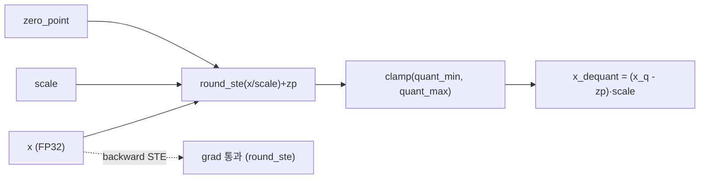
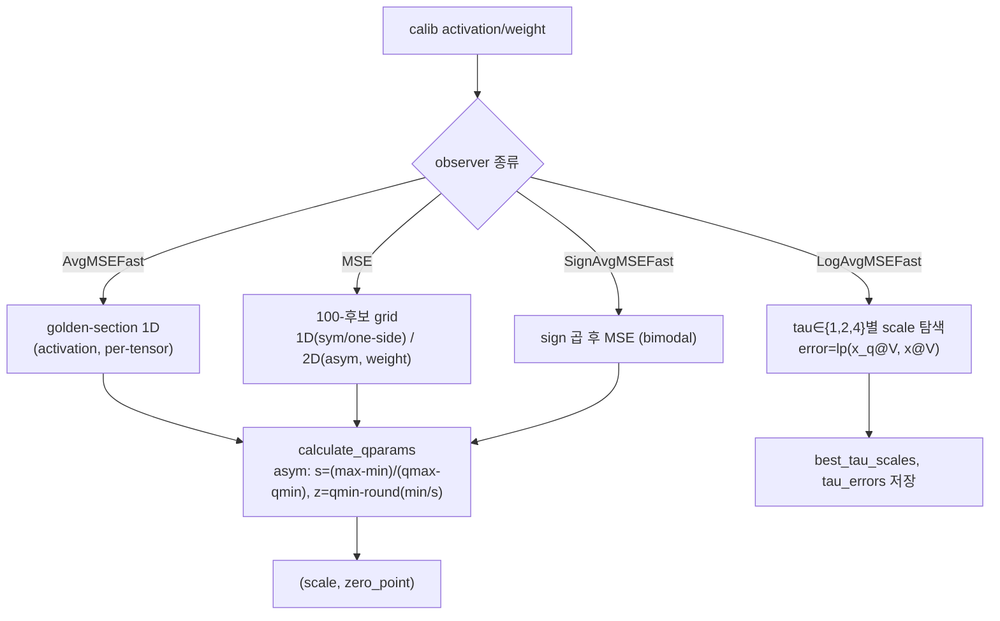
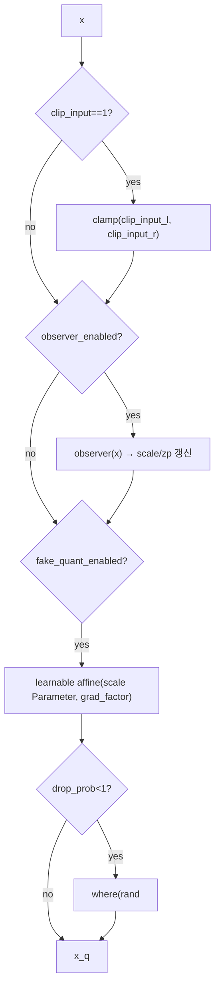
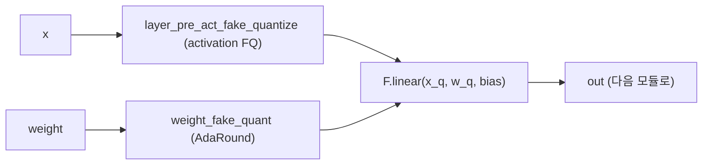
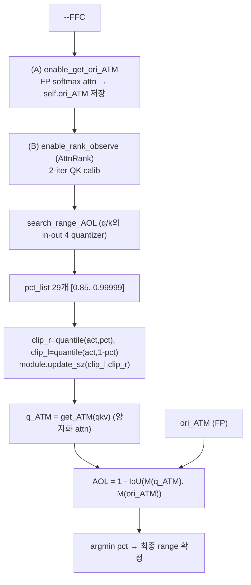
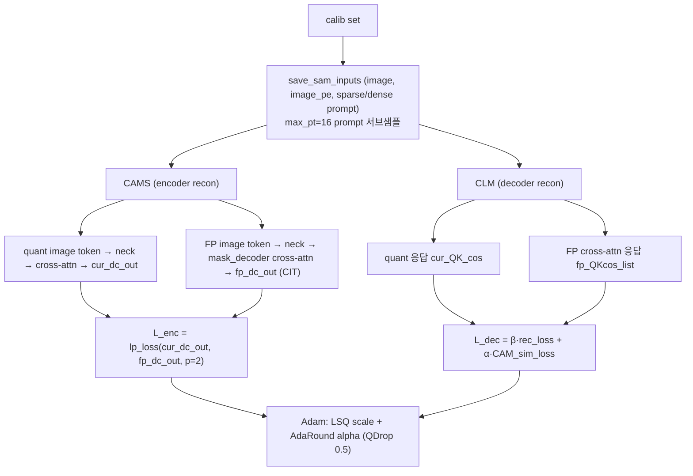
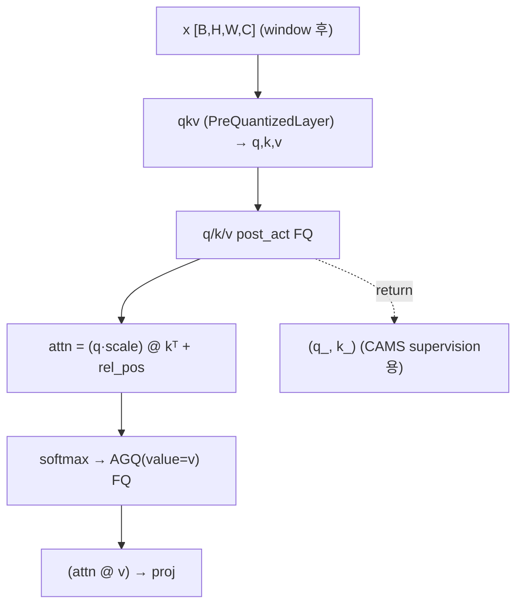
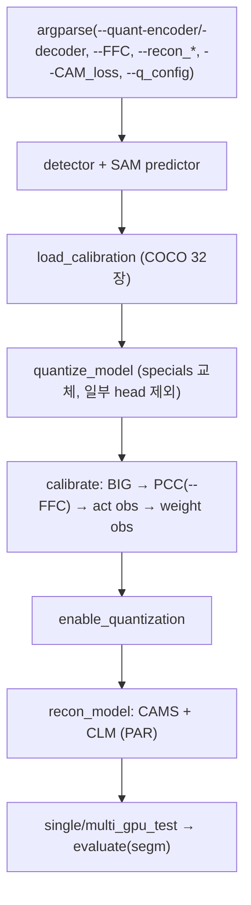

# SAQ-SAM 모듈 통합 가이드 (S-PyTorch)

> 1차 요약: [`../SAQ-SAM.md`](../SAQ-SAM.md) — 본 문서는 그 요약을 모듈 단위로 심화한 통합 가이드다.
> 분석 대상: `\\wsl.localhost\ubuntu-24.04\home\user\project\PRJXR-HBTXR\REF\ViT-Quantization\SAQ-SAM`
> 작성 원칙: 실제 소스 Read 후 `파일:라인` 근거 표기. 라인 근거 없는 추론은 "추정", 코드로 확인 불가는 "확인 불가"로 명시.
> 형제 가이드(`REF/Analysis/ViT-Quantization/I-ViT/MODULE_GUIDE.md`)의 6요소 구조를 따르되, HW 지표는 **S-PyTorch 수치 규약**(params/FLOPs/activation memory/비트폭·observer·sharpness/perturbation 메트릭)으로 치환한다.
> 도구 제약: Glob/Grep/Read만 사용(bash 미사용, UNC). mmdetection·SAM 원본·CUDA ops·체크포인트는 제외(이름만).

---

## 0. 문서 머리말

### 0.0 기법 확정 (코드로 단정)
SAQ-SAM = **Segment Anything Model(SAM) 전용 PTQ(Post-Training Quantization)**. "Sharpness-Aware"라는 과제 배경(perturbation/sharpness 기반)과 달리, **본 repo 코드의 핵심 기여는 sharpness/perturbation/SAM-optimizer 기반이 아니라 "의미적 정렬(Semantically-Aligned)" 기반**이다. 논문 정식 명칭도 **SAQ-SAM: Semantically-Aligned Quantization for Segment Anything Model**(AAAI 2026, arXiv:2503.06515, `README.md:1-4,130-135`).
- **코드상 확정된 3대 기법** (모두 PTQ, 재학습 아님):
  1. **PCC (Perceptual-Consistency Clipping)** — attention focus mask의 IoU(overlap)를 직접 목적함수로 삼아 QK activation 클리핑 범위를 탐색. `AttentionOverlapLoss`(`quant_model.py:37-86`) + `search_range_AOL`(`quant_model.py:349-418`). CLI `--FFC`.
  2. **PAR (Prompt-Aware Reconstruction)** — mask decoder cross-attention 응답을 reconstruction loss에 반영. `LossFunction`(`recon.py:266-375`), CAMS(encoder)/CLM(decoder). CLI `--CAM_loss=PAR`.
  3. **Layer-skipping(상호작용 효율)** — PAR supervision 시 prompt/image-token을 16개로 서브샘플 + encoder를 stage 단위로 묶음. `max_pt=16`(`recon.py:890` 호출), `calib_num=16`(`recon.py:484,508`), `Stage`/`QuantImageEncoderOurViT`(`quant_model.py:647-680`).
- **"sharpness/perturbation" 단정 불가**: 본 repo 소스에서 Hessian·loss-landscape sharpness·weight perturbation(SAM optimizer)·oscillation 메트릭은 **발견되지 않음**. 가장 근접한 "perturbation류" 신호는 (a) **QDrop식 입력 확률 혼합**(`drop_prob`로 양자화/원본을 랜덤 섞음, `fake_quant.py:283-285`)과 (b) **AdaRound의 round mask 학습**(`fake_quant.py:575-597`)뿐이며, 이는 표준 reconstruction PTQ 도구이지 sharpness-aware 최적화가 아님. → **본 repo의 "sharpness-aware"는 코드상 attention-IoU/cross-attention 정렬로 의미가 치환됨**(과제 가설 정정). [코드확인]
- **베이스라인 = PTQ4SAM 포크**: 패키지 디렉토리명이 그대로 `ptq4sam/`이라 `import ptq4sam...`도 SAQ-SAM 자체 소스다(`README.md:25,140`). PTQ4SAM의 BIG(Bimodal Integration)·AGQ(Adaptive Granularity Quantization)를 계승하고 그 위에 PCC/PAR/layer-skip을 추가. 말미 "PTQ4SAM 대비 차이" 절 참조.

### 0.1 대표 케이스 선정
- **대표 모델: SAM ViT-B (image encoder) + TwoWayTransformer mask decoder.** image encoder는 입력 1024×1024, patch 16 → 64×64=4096 token, embed_dim=768, depth 12, window/global attn 혼합, neck out 256ch (`image_encoder.py:17-116`, 1차 요약 §3.7). 근거: README가 4-bit SAM-B에서 baseline 대비 +11.7% mAP를 대표 성능으로 제시(`README.md:19`), config도 ViT-B 기준 detector(`yolo_l-sam-vit-b`)(`README.md:88,267-280`).
- **대표 분석 단위 2종**:
  1. **디코더 cross-attention 1개**(`QuantDecoderOurAttentionBlock`, `quant_model.py:275-547`) — PCC(`--FFC`)가 직접 작동하는 유일한 경로. PAR supervision 추출점.
  2. **인코더 attention 1개**(`QuantEncoderOurAttentionBlock`, `quant_model.py:741-789`) — AGQ(softmax log)만 적용, PCC 미적용. CAMS 재구성 대상.
- **대표 양자화기 4종**: `LSQFakeQuantize`(activation, `fake_quant.py:213-290`), `AdaRoundFakeQuantize`(weight, `:539-632`), `LSQSignFakeQuantize`(BIG bimodal K-activation, `:293-364`), `AdaptiveGranularityQuantize`(AGQ softmax log, `:636-691`).

### 0.2 S-PyTorch 수치 규약 (HW의 MAC lanes/scalar MACs 대체)
- **params**: 표준식. Linear `in·out(+out bias)`, Conv `Cout·Cin·Kh·Kw(+Cout)`. SAQ-SAM 양자화기는 **fake-quant**라 가중치 개수는 FP 원본과 동일(추가 학습 파라미터는 **양자화기 자체의 scale/zero_point/alpha**뿐: LSQ scale `[1]`/`[ch]` `fake_quant.py:218`, AdaRound alpha `weight.shape` `:571`).
- **FLOPs/MACs**: 표준식×config. 단, **본 repo는 fake-quant 추론**이라 실제 연산은 FP32 + (round/clamp/affine 오버헤드). SAM 전체 GMAC은 모델 규모상 분석적 산출이 무겁고 SAM 원본 의존이라 **개별 attention 단위**로만 산출하고 모델 총합은 "확인 불가(SAM 원본 제외)"로 둠.
- **activation memory**: 텐서 shape × 비트폭(W6A6 또는 W4A4). attn 행렬은 image encoder에서 N²(N=window 토큰 수 또는 4096)으로 가장 큰 중간 활성.
- **비트폭/observer**: config 직접. encoder/decoder 모두 **W6A6**(`config_SA_66.yaml`) 또는 **W4A4**(`config_SA_44.yaml`). activation `LSQFakeQuantize`+`AvgMSEFastObserver`(per-tensor, asym), weight `AdaRoundFakeQuantize`+`MSEObserver`(per-channel ch_axis=0, asym). softmax는 AGQ(`AdaptiveGranularityQuantize`+`LogAvgMSEFastObserver`), K-activation은 BIG(`LSQSignFakeQuantize`+`SignAvgMSEFastObserver`).
- **sharpness/perturbation 메트릭(과제 규약)**: 본 repo에는 sharpness/Hessian/perturbation 메트릭 **부재**(0.0절). 대체 메트릭으로 **(a) AOL(Attention Overlap Loss = 1-IoU, `quant_model.py:83-86`), (b) CAM_sim_loss(cross-attention 응답 lp-loss, `recon.py:338,345`), (c) QDrop drop_prob(`recon`의 0.5, `config_SA_*.yaml:39`)** 를 SAQ-SAM 고유 "정렬/섭동" 지표로 사용.
- **정확도/속도**: README 인용·없으면 확인불가. 본 세션 미실행 → 모든 실측 "확인 불가".

### 0.3 운영 경로 (PTQ calibration → reconstruction → COCO 평가)
```
[detector(mmdet) + SAM predictor 빌드]                      (test_quant_SAQ_m.py:364-490)
   │  COCO train에서 calibrate(=32)장 추출, 1·9번째 swap     (utils.py:115-157)
   ▼
[quantize_model] SAM encoder/decoder → 양자화 모듈 교체      (test_quant_SAQ_m.py:739-775)
   │  특정 head/patch_embed는 양자화 제외(:743)
   ▼
[calibrate] (test_quant_SAQ_m.py:778-829)
   │  ① BIG: bimodal_adjust (K-activation 부호 정렬)         (:783-784, quant_model.py:797-805)
   │  ② PCC(--FFC): FP ATM 저장 → AttnRank 2-iter QK calib    (:789-804, quant_model.py:349-418)
   │  ③ activation observer 32장                              (:806-810)
   │  ④ weight observer (AdaRound init)                       (:821-823)
   ▼
[enable_quantization]                                         (test_quant_SAQ_m.py:608)
   ▼
[recon_model] PAR 재구성 (recon_encoder=CAMS, recon_decoder=CLM, CAM_loss=PAR)
   │  Adam으로 LSQ scale + AdaRound alpha 학습, QDrop drop_prob=0.5  (recon.py:619-702,1111-1213)
   │  (선택) drop_prob 버그 미수정 — :674-686 주석 처리
   ▼
[COCO 평가] single/multi_gpu_test → dataset.evaluate(segm)   (test_quant_SAQ_m.py:688-737)
```
- 타깃 디바이스: **CUDA GPU 전제** — `LSQFakeQuantize.update_sz`의 `device='cuda:0'`(`fake_quant.py:229-230`), AGQ observer scale `.cuda()`(`observer.py:460,517,520`), `clip_l/r=torch.tensor(0.0).cuda()`(`quant_model.py:294-295`). huge/large는 `--gpu2`로 2-GPU(`test_quant_SAQ_m.py:601-602`, `README.md:111`). → CPU 단독 실행 불가(코드 근거 확인, 실행 실패는 미검증).

### 0.4 모델 / 데이터셋 / 정확도 (README 인용)
| 항목 | 값 | 근거 |
|---|---|---|
| 태스크 | instance segmentation(주), oriented OD, semantic seg | `README.md:18` |
| 데이터셋 | COCO (train/val/test 2017) | `README.md:60-70` |
| calibration | COCO train 32장 (1·9번째 swap) | `config_SA_*.yaml:25`, `utils.py:115-157` |
| 평가 metric | COCO segm (`--eval segm`) | `test_quant_SAQ_m.py:111-117` |
| 비트 | W6A6 / W4A4 (encoder=decoder 동일) | `config_SA_66.yaml`, `config_SA_44.yaml` |
| 대표 성능 | SAM-B 4-bit, baseline 대비 instance seg **mAP +11.7%** | `README.md:19` |
| 절대 mAP 수치표 | README 본문에 표 미수록 → **확인 불가** | (README는 상대 개선치만) |
| detector | Faster R-CNN/YOLOX/DETR/DINO가 box prompt 생성 | `README.md`, `test_quant_SAQ_m.py:20-26` |
| 속도/latency | 본 PyTorch repo는 fake-quant → **확인 불가** | (실측 미실행) |

---

## 1. Repo / Layer 개요

SAQ-SAM = SAM(image encoder ViT + two-way mask decoder)에 대한 **PTQ + reconstruction** 프레임워크. PTQ4SAM에서 포크되어 패키지명이 `ptq4sam/`로 동일하나 PCC/PAR/layer-skip이 SAQ-SAM 고유 기여(`README.md:14-18,25`). mmdetection(detector)·SAM 원본 modeling·CUDA ops는 외부 의존이고, 양자화 코드가 자체 소스다.

### 1.1 자체 소스 vs 외부 프레임워크 vs 제외

| 구분 | 파일(자체 소스) | 역할 |
|---|---|---|
| **양자화 기반함수** | `ptq4sam/quantization/util_quant.py` | round_ste, per-tensor/channel affine fake-quant, log fake-quant, LSQ grad_scale |
| **observer 군** | `ptq4sam/quantization/observer.py` | MinMax/AvgMinMax/MSE/MSEFast/AvgMSEFast/LogAvgMSEFast/SignAvgMSEFast/PCT observer + affine qparam |
| **fake-quant 군** ★ | `ptq4sam/quantization/fake_quant.py` | QuantizeBase, LSQ/LSQSign(BIG)/LSQPlus/AdaRound/AGQ/LogSqrt2 |
| **양자화 모듈 래퍼** | `ptq4sam/quantization/quantized_module.py` | QLinear/QConv2d/QuantizedLayer/PreQuantizedLayer/QuantizedMatMul + 디스패치 dict |
| | `ptq4sam/quantization/quantized_module_matmul.py` | MatMul 양자화 변종 |
| | `ptq4sam/quantization/state.py` | observer/fake-quant enable/disable 상태 전환 |
| **SAM 양자화 래핑 + PCC** ★ | `ptq4sam/model/quant_model.py` | specials 디스패치, AttentionOverlapLoss, search_range_AOL, Quant{Encoder,Decoder}OurAttentionBlock, Stage |
| **메인 엔트리** ★ | `ptq4sam/solver/test_quant_SAQ_m.py` | quantize_model/calibrate/recon_model/평가 오케스트레이션, argparse |
| **PAR 재구성** ★ | `ptq4sam/solver/recon.py` | CAMS/CLM, LossFunction(PAR), save_sam_inputs, transform_image_token |
| **보조** | `ptq4sam/solver/utils.py` | config 파서(easydict), DataSaverHook, load_calibration |
| **SAM modeling(PAR 수정분만)** | `projects/.../modeling/{image_encoder,transformer,mask_decoder}.py` | predict_calib_recon 추가(mask_decoder.py:154-203) |

### 1.2 forward 진입점
`test_quant_SAQ_m.main`(`:346-737`) → `model.extract_feat(data)`(mmdet detector + `predictor.model`= SAM). SAM forward: image_encoder(`QuantImageEncoderOurViT.forward`, `quant_model.py:671-680`) → prompt_encoder → mask_decoder(`TwoWayTransformer`, `transformer.py:62-119`). 양자화 모듈은 전부 `Quantizer`로 감싼 `(weight FQ → linear → activation FQ)` 또는 `(activation FQ → linear)` 구조(`quantized_module.py:209-258`).

### 1.3 제외 (지시에 따라 이름만 표기, 미분석)
- **외부 프레임워크**: `mmdetection/`(detector 빌드/평가 전체, 수백 config), `projects/.../ops/`(Deformable 등 CUDA 커널, `setup.py build`로 컴파일). SAM 원본 modeling(predictor/detector adapter)은 Prompt-Segment-Anything 기반.
- **체크포인트**: SAM ViT-B/L/H `.pth`, detector weights — 다운로드 대상(`README.md:72-80`). 이름만.
- **죽은/별도 실험 경로**: `quant_rep/`, `repq_utils/`(RepQ-ViT 계열) — 메인 `test_quant_SAQ_m.py`에서 **import 안 됨**, `test_quant_rep.py`만 사용. SAQ-SAM 고유 기여와 무관(1차 요약 §2.3 Grep 확인).
- **미사용 클래스(코드 내 dead code)**: `QuantImageEncoderViT`/`QunatEncoderBlock`/`QuantEncoderAttentionBlock`(비-Our 버전, `quant_model.py:89-211`), `QuantDecoderOurAttentionBlock_ori`(`:550-635`), `reconstruction_IE_PB`(`recon.py:730-931`), `LogSqrt2Quantizer`(`fake_quant.py:693-749`) — specials/메인 경로 미참조. 이름만.

### 1.4 대표 모델 레이어 구성 (SAM ViT-B)
- **image encoder**: patch_embed(양자화 제외, `test_quant_SAQ_m.py:743`) → +pos_embed(양자화 안 함, `quant_model.py:653-654`) → 12 block(window attn 9 + global attn 3, `image_encoder.py:84`) → neck(Conv1×1→LN→Conv3×3→LN, `image_encoder.py:89-105`, `QuantNeck` `quant_model.py:137-145`).
- **block(QunatEncoderOurBlock, `:711-739`)**: norm1(FP) → attn(`QuantEncoderOurAttentionBlock`) → window unpartition → residual → mlp(`QuantMLPBlock`: lin1→GELU→lin2, `:148-156`).
- **mask decoder(TwoWayTransformer)**: depth개 `TwoWayAttentionBlock`(self-attn → cross token→image → MLP → cross image→token, `transformer.py:122-202`) + `final_attn_token_to_image`. 양자화판 `QuantDecoderOurTwoWayAttentionBlock`(`quant_model.py:214-271`).

---

## 2. 모듈: 양자화 기반함수 — `util_quant.py`

### 2.1 역할 + 상위/하위
- **역할**: affine(asym) 양자화/역양자화 커널 + STE round + LSQ grad scaling. per-tensor/per-channel/log 변종.
- **상위**: 모든 fake-quant 클래스(`fake_quant.py`)와 observer의 `loss_fx`가 호출. **하위**: torch round/clamp.

### 2.2 데이터플로우 (텐서 shape 흐름)


### 2.3 forward call stack
`LSQFakeQuantize.forward`(`fake_quant.py:277`) → `fake_quantize_learnable_per_tensor_affine_training`(`util_quant.py:41-48`) → `grad_scale`(`:84-85`) → `round_ste`(`:4-8`) → `torch.clamp`.

### 2.4 대표 코드 위치
`util_quant.py`: `round_ste` `:4-8`, per-tensor affine `:11-15`, log fake-quant `:17-26`, per-channel affine `:28-38`, learnable(LSQ) per-tensor `:41-48`, learnableplus(LSQ+) `:62-69`, `grad_scale` `:84-85`.

### 2.5 대표 코드 블록
```python
# util_quant.py:4-15  STE round + affine 양자화/역양자화 (asymmetric)
def round_ste(x): return (x.round() - x).detach() + x
def fake_quantize_per_tensor_affine(x, scale, zero_point, quant_min, quant_max):
    x_int = round_ste(x / scale) + zero_point         # x_q = round(x/s)+z
    x_quant = torch.clamp(x_int, quant_min, quant_max)
    x_dequant = (x_quant - zero_point) * scale        # x̂ = (x_q - z)·s
    return x_dequant
```
```python
# util_quant.py:17-26  softmax 전용 log 양자화 (AGQ): x̂ = s·2^(-x_q/tau)
x_int = round_ste(-1 * (x/scale).log2() * tau)        # 로그 그리드
softmax_mask = (x_int >= levels)                      # level 초과는 0
x_q = torch.clamp(x_int, 0, levels - 1)
X = scale * 2 ** (-1 * x_q / tau)
X[softmax_mask] = torch.Tensor([0.0])
```
```python
# util_quant.py:84-85  LSQ 그래디언트 스케일링 (scale 학습 안정화)
def grad_scale(t, scale): return (t - (t * scale)).detach() + (t * scale)
```
→ log 양자화(`2^(-x_q/tau)`)는 FPGA에서 **시프트 연산**으로 직접 구현 가능. AGQ tau가 곱셈기-free softmax 후단 가속의 핵심.

### 2.6 연산·수치표현 분해 + 정량
- **양자화 방식**: affine **asymmetric**(zero_point 사용, `symmetric=False` config). per-tensor(activation) / per-channel ch_axis=0(weight) / log(softmax).
- **scale/zp**: observer가 산출(3장), LSQ는 scale을 학습 Parameter로 둠.
- **비트폭**: 호출처 config (W6/A6 또는 W4/A4).
- **params**: 0 (순수 함수).
- **FLOPs**: 원소당 div+round+add+clamp+sub+mul = O(N). fake-quant라 FP32 위 추가 오버헤드.
- **sharpness/perturbation**: 없음(STE는 표준). log 변종이 비선형 표현의 유일한 특이점.

---

## 3. 모듈: Observer 군 (range 탐색) — `observer.py`

### 3.1 역할 + 상위/하위
- **역할**: calibration 데이터로 양자화 min/max(=clipping range) 추정. affine qparam(scale,zp) 산출. MSE/golden-section/log/sign/percentile 변종.
- **상위**: 모든 `QuantizeBase.forward`가 `observer_enabled`일 때 호출(`fake_quant.py:144-151`). **하위**: `util_quant`의 fake-quant 커널, scipy `minimize_scalar`.

### 3.2 데이터플로우 (텐서 shape 흐름)


### 3.3 forward call stack
`LSQFakeQuantize.forward`(`fake_quant.py:245-246`) → `AvgMSEFastObserver.forward`(`observer.py`, golden-section) → `calculate_qparams`(`observer.py:50-69`).
AGQ: `AdaptiveGranularityQuantize.forward`(`fake_quant.py:660`) → `LogAvgMSEFastObserver.forward(x, value=v)`(`observer.py:472-492`) → `golden_section_search_1D_channel`(`:500-520`) → `loss_fx`(`:459-470`, `x_q@value` vs `x@value`).

### 3.4 대표 코드 위치
`observer.py`: `calculate_qparams`(affine) `:50-69`, `MSEObserver`(p=2.4, 100후보) `:172-267`, 2D-search `:202-230`, 1D-search `:232-251`, `AvgMSEObserver`(running 평균) `:270-295`, `LogAvgMSEFastObserver` `:448-526`, AGQ loss_fx(softmax×V) `:459-470`, taus `:455`, `SignAvgMSEFastObserver` `:528-548`, `PCTObserver`(percentile) `:550-615`.

### 3.5 대표 코드 블록
```python
# observer.py:60-68  affine qparam (sym/asym 분기)
if self.symmetric:
    max_val_pos = torch.max(-min_val_neg, max_val_pos)
    scale = max_val_pos / (float(quant_max - quant_min) / 2)   # sym, z=0
else:
    scale = (max_val_pos - min_val_neg) / float(quant_max - quant_min)  # asym
    zero_point = quant_min - torch.round(min_val_neg / scale)
    zero_point = torch.clamp(zero_point, quant_min, quant_max)
```
```python
# observer.py:172-177,202-228  weight MSE observer: p=2.4, 100후보 2D grid(asym)
self.p = 2.4; self.num = 100
for i in range(1, self.num + 1):           # range 후보 100개
    tmp_max = xrange / self.num * i
    for zp in range(self.quant_min, self.quant_max + 1):   # zero-point 동시 탐색
        score = self.loss_fx(x, new_min, new_max)          # lp_loss(x_q, x, p=2.4)
```
```python
# observer.py:455,459-470  AGQ softmax: tau∈{1,2,4} 중 softmax×V 오차 최소
self.taus = [2**i for i in range(3)]       # = [1, 2, 4]
def loss_fx(self, x, new_min, new_max, alpha):
    x_q = fake_logquantize_per_tensor_affine(x, scale.item(), ..., alpha)  # alpha=tau
    score = self.lp_loss(x_q @ self.value, x @ self.value, p=self.p)        # ★ V 곱 후 오차
    return score
```
→ AGQ는 단순 softmax 오차가 아니라 **`softmax @ V`(어텐션 출력) 오차**를 최소화해 tau를 고름 → "어텐션 결과 보존" 정렬. (PCC와 같은 "출력 의미 보존" 철학의 observer판.)

### 3.6 연산·수치표현 분해 + 정량
- **양자화 방식**: range-탐색 observer. 메인 activation = `AvgMSEFastObserver`(golden-section, running 평균 over 32 calib), weight = `MSEObserver`(100후보 2D grid, p=2.4), softmax = `LogAvgMSEFastObserver`(tau 탐색), K-bimodal = `SignAvgMSEFastObserver`.
- **scale/zp**: asym (zero_point≠0). per-tensor(A) / per-channel ch_axis=0(W).
- **비트폭**: config (A6/A4, W6/W4). quant_min/max는 `ObserverBase.__init__`에서 asym `[0, 2^bit-1]`(`observer.py:33-34`).
- **params**: 0 (buffer: min_val/max_val `[]`, AGQ는 best_tau_scales/tau_errors buffer).
- **FLOPs**: weight MSE = 100후보 × (2^bit zp) × 양자화 = **저비트일수록 빠름**(W4: 100×16, W6: 100×64). AGQ = tau 3개 × golden-section(scipy minimize_scalar). **calibration-time 비용**, 추론 HW 비용 0.
- **sharpness/perturbation 메트릭**: AGQ의 `lp_loss(x_q@V, x@V)`(`:469`)가 "어텐션 출력 perturbation 최소화"의 코드적 대응. MSE p=2.4(`:176`)는 outlier에 약간 더 민감한 norm.

---

## 4. 모듈: fake-quant 군 (quantizer) ★ — `fake_quant.py`

### 4.1 역할 + 상위/하위
- **역할**: observer가 준 range로 실제 fake-quant 수행. scale 학습(LSQ), round 학습(AdaRound), bimodal 부호 정렬(LSQSign/BIG), log 양자화(AGQ). enable/disable·drop_prob·clip_input 플래그 보유.
- **상위**: `Quantizer`(`quantized_module.py:187-201`)가 config로 인스턴스화 → 모든 Quant*Layer/AttentionBlock. **하위**: observer, util_quant 커널.

### 4.2 데이터플로우 (텐서 shape 흐름, LSQ + QDrop)


### 4.3 forward call stack
calib 단계: `LSQFakeQuantize.forward`(`:241`) → `observer(X)`(`:246`) → `calculate_qparams`.
recon 단계: 동일 forward의 `fake_quant_enabled` 분기(`:259-285`) → `fake_quantize_learnable_per_tensor_affine_training` + `where(QDrop)`.
BIG: `LSQSignFakeQuantize.forward`(`:321`) → `judge_bimodal`(`:307-319`, gaussian_kde + find_peaks).

### 4.4 대표 코드 위치
`fake_quant.py`: `QuantizeBase`(플래그) `:20-119`, `FixedFakeQuantize.update_sz`(PCC가 호출) `:130-140`, `LSQFakeQuantize` `:213-290`, grad_factor `:264,272`, clip_input `:242-243`, QDrop `:283-285`, `LSQSignFakeQuantize.judge_bimodal` `:307-319`, `LSQPlusSignFakeQuantize._judge_two_peak`(gamma=0.8) `:444-470`, `AdaRoundFakeQuantize` `:539-632`, rectified_sigmoid `:575-578`, adaround_forward `:580-597`, `AdaptiveGranularityQuantize` `:636-691`, quantize(log) `:681-691`.

### 4.5 대표 코드 블록
```python
# fake_quant.py:283-285  QDrop: 양자화/원본을 drop_prob로 확률 혼합 (recon 시 0.5)
if self.drop_prob < 1.0:
    x_prob = torch.where(torch.rand_like(X) < self.drop_prob, X, x_orig)
    return x_prob
```
```python
# fake_quant.py:307-319  BIG: KDE+find_peaks로 bimodal 판정, 채널 부호 산출
data = data_inp[0].detach().flatten().cpu().numpy()
kde = gaussian_kde(data)
x = np.linspace(min(data), max(data), self.global_num)          # global_num=128
peaks, _ = find_peaks(kde(x), height=self.peak_height*sum(y),   # peak_height=0.01
                      distance=self.peak_distance)              # peak_distance=32
self.is_bimodal = len(peaks) == 2
if self.is_bimodal:
    self.sign = torch.tensor([torch.sign(c.mean()) for c in data_inp...]).cuda()
```
```python
# fake_quant.py:575-597  AdaRound: round mask h(α) 학습 → hard round
def rectified_sigmoid(self):   # γ=-0.1, ζ=1.1
    return ((self.zeta - self.gamma)*torch.sigmoid(self.alpha) + self.gamma).clamp(0, 1)
def adaround_forward(self, X, hard_value=False):
    X = torch.floor(X / scale)
    X += (self.alpha >= 0).float() if hard_value else self.rectified_sigmoid()  # ⌊x/s⌋ + h(α)
    X = torch.clamp(X + zero_point, quant_min, quant_max)
    return (X - zero_point) * scale
```
```python
# fake_quant.py:681-691  AGQ: softmax 로그 양자화 (2^(-x_q/tau))
x_int = round_ste(-1 * (x/scale).log2() * self.tau)
x_q = torch.clamp(x_int, 0, levels - 1)
X = scale * 2 ** (-1 * x_q / self.tau)            # FPGA 시프트 구현 가능
X[x_int >= levels] = torch.Tensor([0.0])          # softmax long-tail 절단
```

### 4.6 연산·수치표현 분해 + 정량
- **양자화 방식**: LSQ(scale 학습 Parameter, `:218`), AdaRound(round mask alpha 학습, `:571`), BIG(KDE bimodal 부호, `:307-319`), AGQ(log, `:681-691`).
- **scale/zp**: LSQ scale Parameter `[1]`/`[ch]`, zp buffer. LSQ+는 scale·zp 둘 다 Parameter(`:372-373`).
- **비트폭**: config. grad_factor = `1/sqrt(numel·qmax)`(per-tensor, `:272`), `1/sqrt(numel/ch·qmax)`(per-channel, `:264`).
- **params(학습 대상, calibration/recon 시)**: LSQ scale = quantizer당 1(또는 ch개), AdaRound alpha = **weight.shape 전체**(weight당 round mask, `:571`). → reconstruction이 alpha+scale을 Adam으로 학습(5장).
- **FLOPs**: BIG KDE = `gaussian_kde` + `find_peaks` over global_num=128 (calib 시 1회/quantizer, CPU). AGQ = log2+pow (원소당).
- **sharpness/perturbation 메트릭**:
  - **QDrop drop_prob=0.5**(`config_SA_*.yaml:39`) = "양자화 섭동을 확률적으로 주입"하는 reconstruction 정규화. 본 repo에서 sharpness/perturbation에 가장 근접한 코드 신호(0.0절). **단 dropout 버그로 평가 시 0.5가 1.0으로 복원 안 됨**(test_quant_SAQ_m.py:674-686, 5장·말미 리스크).
  - BIG bimodal flag, AdaRound alpha 분포는 양자화 민감도의 대리 지표(추정).

---

## 5. 모듈: 양자화 모듈 래퍼 — `quantized_module.py`

### 5.1 역할 + 상위/하위
- **역할**: nn.Linear/Conv2d/Embedding을 weight-FQ 래핑(`QLinear/QConv2d`), 입력/출력 activation-FQ 부착(`PreQuantizedLayer`/`QuantizedLayer`), 정수 MatMul(`QuantizedMatMul`). config→quantizer 디스패치 dict 제공.
- **상위**: `quant_model.py`의 모든 Quant*AttentionBlock/Neck/MLP, `quantize_model`의 `replace_module`. **하위**: `fake_quant.py`(quantizer), `observer.py`(dict).

### 5.2 데이터플로우 (텐서 shape 흐름, PreQuantizedLayer)


### 5.3 forward call stack
`QuantEncoderOurAttentionBlock.forward`(`quant_model.py:768`) → `self.qkv`(`PreQuantizedLayer.forward`, `quantized_module.py:236-242`) → `layer_pre_act_fake_quantize`(activation FQ) → `QuantLinear.forward`(`:101-114`) → `weight_fake_quant`(AdaRound) → `F.linear`.

### 5.4 대표 코드 위치
`quantized_module.py`: 디스패치 dict `ObserverDict`/`FakeQuantizeDict` `:6-28`, `Quantizer`(factory) `:187-201`, `QuantLinear`(temp weight 지원, recon용) `:90-114`, `QuantizedLayer`(weight→act→out FQ) `:209-224`, `PreQuantizedLayer`(in FQ→weight FQ) `:227-242`, `QuantizedMatMul` `:244-258`, special config 치환 `quant_model.py:24-35`.

### 5.5 대표 코드 블록
```python
# quantized_module.py:24-35 (quant_model.py)  softmax→AGQ, bimodal→BIG로 quantizer 자동 치환
update_keys = {
    'softmax':{'quantizer':'AdaptiveGranularityQuantize','observer':'LogAvgMSEFastObserver'},
    'bimodal':{'quantizer':'LSQSignFakeQuantize','observer':'SignAvgMSEFastObserver'}
}[quantizer_name]
```
```python
# quantized_module.py:227-242  PreQuantizedLayer: 입력 양자화 → weight FQ linear
def forward(self, x, gamma=None):
    if self.qinput:
        x = self.layer_pre_act_fake_quantize(x)   # activation FQ
    x = self.module(x, gamma)                      # QuantLinear(weight AdaRound)
    return x
```
```python
# quantized_module.py:101-114  QuantLinear: recon 시 temp_weight(AdaRound hard) 사용
weight = self.temp_weight if self.use_temporary_parameter else self.weight
return F.linear(input, self.weight_fake_quant(weight), bias)
```
→ `gamma`(=bimodal sign) 인자로 weight·bias를 채널별로 부호 정렬(BIG, `:111-114`). PCC는 `layer_pre_act_fake_quantize`(=QK 입력 quantizer)의 `update_sz`로 range를 강제(4.4의 `FixedFakeQuantize.update_sz` 패턴 → LSQ도 `:228-239`).

### 5.6 연산·수치표현 분해 + 정량
- **양자화 방식**: weight FQ(AdaRound per-ch) + activation FQ(LSQ per-tensor). MatMul은 입력 두 텐서 각각 activation FQ 후 `@`(`:252-258`).
- **비트폭**: config. encoder/decoder 동일 W6A6 또는 W4A4.
- **params**: 래퍼 자체 0, 내부 quantizer의 scale/alpha (4장).
- **FLOPs**: linear MAC은 FP 원본과 동일(fake-quant). 추가 = FQ 오버헤드.
- **양자화 제외 레이어**: `patch_embed`, `output_upscaling`, `iou_prediction_head`, `output_hypernetworks_mlps`(mask 생성 최종 head)는 skip → FP 유지(`test_quant_SAQ_m.py:743`). pos_embed도 양자화 안 함(`quant_model.py:653-654`).

---

## 6. 모듈: PCC (Perceptual-Consistency Clipping) ★ 고유기여 1 — `quant_model.py`

### 6.1 역할 + 상위/하위
- **역할**: 디코더 cross-attention의 QK activation 클리핑 범위를, 양자화 후 attention focus mask가 FP와 일치(IoU)하도록 탐색. 단순 MSE보다 공격적(좁은) range를 의미 보존 하에 허용.
- **상위**: `calibrate`의 `--FFC` 분기(`test_quant_SAQ_m.py:789-804`). **하위**: `AttentionOverlapLoss`(`:37-86`), `FixedFakeQuantize/LSQ.update_sz`(`fake_quant.py:130-140,228-239`), `torch.quantile`.
- **적용 범위**: **디코더 attention만**(`QuantDecoderOurAttentionBlock`, `:275-547`). 인코더 attention(`:741-789`)은 PCC 미적용(AGQ만).

### 6.2 데이터플로우 (텐서 shape 흐름)


### 6.3 forward call stack
`calibrate`(`test_quant_SAQ_m.py:789`) → `enable_get_ori_ATM`(`quant_model.py:815-820`) → `model.extract_feat` → `set_ori_ATM`(`:421-422`) → `get_ATM`(`:327-346`). 이후 `enable_rank_observe`(`:807-813`) → `QuantDecoderOurAttentionBlock.forward`(AttnRank, `:429-467`) → `search_range_AOL`(`:349-418`) → `AttentionOverlapLoss.forward`(`:48-86`).

### 6.4 대표 코드 위치
`quant_model.py`: `AttentionOverlapLoss` `:37-86`, focus mask `:67-71`, IoU `:73-83`, `get_ATM`(양자화 attn 생성) `:327-346`, `search_range_AOL` `:349-418`, pct_list(29개) `:397`, calib_sz_across_pct `:359-385`, best 선택 `:408-414`, `set_ori_ATM` `:421-422`, AttnRank forward `:426-501`, `enable_rank_observe`/`enable_get_ori_ATM` `:807-820`.

### 6.5 대표 코드 블록
```python
# quant_model.py:67-86  AttentionOverlapLoss = 1 - IoU of focus masks (PCC 핵심 수식)
max_vals1 = attn1.amax(dim=(3), keepdim=True)         # row-wise max
mask1 = (attn1 > self.threshold * max_vals1).float()  # threshold=0.5 → focus 영역
mask2 = (attn2 > self.threshold * max_vals2).float()
intersection = torch.min(mask1, mask2); union = torch.max(mask1, mask2)
iou = intersection.sum(dim=(2,3)) / (union.sum(dim=(2,3)) + 1e-6)
return (1 - iou).mean()
```
```python
# quant_model.py:397-414  29개 percentile 후보 중 AOL 최소 range 선택
pct_list = [0.85, 0.87, ..., 0.9999, 0.99999]         # 29개
for pct in pct_list:
    calib_sz_across_pct(act_ori, pct)                  # update_sz(clip_l, clip_r)
    module.enable_fake_quant()
    q_ATM = self.get_ATM(qkv)                           # 양자화된 attention
    score = AOL_loss(q_ATM, self.ori_ATM)              # FP focus와 1-IoU
    module.disable_fake_quant()
    if score < best_score: best_score, best_pct = score, pct
calib_sz_across_pct(act_ori, best_pct, calib=False)    # 최종 확정
```
```python
# quant_model.py:359-385  pct → 양측 분위수 clip → quantizer range 강제
clip_r = torch.quantile(act_clone.reshape(-1), pct)
clip_l = torch.quantile(act_clone.reshape(-1), (1.0-pct))
module.update_sz(clip_l, clip_r)                        # observer min/max 직접 설정
```

### 6.6 연산·수치표현 분해 + 정량
- **양자화 방식**: PCC는 quantizer 종류가 아니라 **clipping range 탐색 알고리즘**. 대상 = q_proj/k_proj의 입력(`layer_pre_act_fake_quantize`) + 출력(`q/k_post_act_fake_quantize`) 4개 quantizer(`:431-461`).
- **scale/zp**: 선택된 [clip_l, clip_r]를 `update_sz`로 observer min/max에 강제 → affine scale/zp 재계산(`fake_quant.py:134,232`).
- **비트폭**: A6/A4 (QK activation).
- **params**: 0 (탐색만, buffer clip_l/clip_r `[]` `:294-295`).
- **FLOPs(calibration-time)**: per attention block × **29 pct × (양자화 attn forward = N²·dh QK + softmax)** × 2 iter × calib 샘플. **추론 HW 비용 0**(런타임은 고정 range만 적용).
- **sharpness/perturbation 메트릭(코드 확정)**: **AOL = 1 - IoU(focus mask)**. threshold=0.5(`--FFC_threshold`, `config:46`)로 "high-attention 영역"을 정의하고, 양자화 섭동 후에도 focus 영역이 유지되는 range를 고름. → "양자화가 의미(주목 영역)에 주는 perturbation을 최소화"하는 SAQ-SAM 고유 정렬 지표.
- **KDE 비사용 확정**: PCC는 `torch.quantile`/`np.percentile` + attention-IoU만 사용(`:363-364`). KDE는 BIG의 bimodal 판정용(`fake_quant.py:310`)이며 PCC와 무관. (과제 가설 "KDE 분포 분석"은 PCC에 대해 **코드상 부정**.)

---

## 7. 모듈: PAR (Prompt-Aware Reconstruction) ★ 고유기여 2 — `recon.py`

### 7.1 역할 + 상위/하위
- **역할**: reconstruction 단계에서, 양자화 image token이 mask decoder cross-attention을 통과한 "prompt 상호작용 응답"을 FP와 정렬. encoder=CAMS, decoder=CLM. feature MSE를 넘어 prompt-aware 의미 정렬.
- **상위**: `recon_model`(`test_quant_SAQ_m.py:832-923`). **하위**: `LossFunction`(`recon.py:266-375`), `lp_loss`(`:378-382`), `save_sam_inputs`(`:387-440`), `mask_decoder.predict_calib_recon`(`mask_decoder.py:154-203`).

### 7.2 데이터플로우 (텐서 shape 흐름)


### 7.3 forward call stack
`recon_model`(`test_quant_SAQ_m.py:832`) → `save_sam_inputs(max_pt=16)`(`recon.py:890`) → `_recon_model_IE`(`:850-861`)→`reconstruction_IE`(CAMS, `:520-727`) / `_recon_model_MD`(`:864-874`)→`reconstruction_MD`(CLM, `:1010-1229`) → 매 iter `LossFunction.__call__`(`:300-375`).

### 7.4 대표 코드 위치
`recon.py`: `LossFunction` `:266-375`, encoder loss 분기 `:335-339`, decoder loss 분기 `:340-346`, ori(PAR off) `:347-356`, `lp_loss` `:378-382`, `save_sam_inputs`(max_pt) `:387-440`, prompt 16 서브샘플 `:422-428`, `transform_image_token`(neck 통과) `:443-464`, `save_CIT_list`/`get_CIT`(calib_num=16) `:469-518`, `reconstruction_IE` `:520-727`, `reconstruction_MD` `:1010-1229`, `save_dc_Qout_list`/`get_dc_Qout` `:934-1007`.
`test_quant_SAQ_m.py`: `recon_model` `:832-923`, recon_unit per_stage `:838-839`, max_pt=16 호출 `:890`, CAMS/CLM 분기 `:898-920`.

### 7.5 대표 코드 블록
```python
# recon.py:335-346  PAR loss: encoder=상호작용만, decoder=출력+상호작용
if self.recon_loss=='encoder':                          # CAMS
    rec_loss = lp_loss(pred, tgt, p=self.p)
    CAM_sim_loss = lp_loss(pred_attention, target_attention, p=2.0, sum_dim=-1)
    total_loss = CAM_sim_loss                            # ★ 상호작용 응답 정렬만
elif self.recon_loss=='decoder':                        # CLM
    rec_loss = 0.01*lp_loss(pred[0],tgt[0]) + lp_loss(pred[1],tgt[1])  # tuple 출력
    CAM_sim_loss = lp_loss(pred_attention, target_attention, p=2.0, sum_dim=-1)
    total_loss = self.args.beta*rec_loss + self.args.alpha*CAM_sim_loss   # α=β=1
```
```python
# recon.py:378-382  lp_loss
def lp_loss(pred, tgt, p=2.0, sum_dim=-1):
    return (pred - tgt).abs().pow(p).sum(sum_dim).mean()
```
```python
# recon.py:887-894 (test_quant_SAQ_m.py:890)  prompt 16개 서브샘플 (layer-skip 연결)
image_data, image_pes, sparse_prompt_embeds, dense_prompt_embeds = \
    save_sam_inputs(fp_model, cali_data, max_pt = 16)   # ★ 호출처 16 (시그니처 기본은 32)
```
→ `pred_attention/target_attention` = mask decoder `transformer`(cross-attention)를 통과한 응답. 양자화 image token을 **실제 FP cross-attention**에 넣어 FP 응답과 비교 → prompt-conditioned 의미 정렬.

### 7.6 연산·수치표현 분해 + 정량
- **양자화 방식**: reconstruction = LSQ scale + AdaRound alpha를 Adam으로 학습. QDrop drop_prob=0.5.
- **하이퍼파라미터**(`config_SA_*.yaml:26-39`): scale_lr=0.002, weight_lr=0.001, warm_up=0.2, iters=iters_CAMS=2000, b_range=[20,2], weight=0.02, drop_prob=0.5, round_mode=learned_hard_sigmoid, batch_size=1.
- **비트폭**: config (W6A6 / W4A4).
- **params(학습)**: 재구성 단위(per_stage 기본)별 AdaRound alpha(weight 전체) + LSQ scale.
- **FLOPs**: 재구성당 2000 iter × (FP forward + quant forward + cross-attn supervision). encoder/decoder 각각. **무거움**(40GB+ GPU, 2-GPU 옵션).
- **sharpness/perturbation 메트릭(코드 확정)**: **CAM_sim_loss**(cross-attention 응답 lp-loss, `:338,345`)가 "양자화 perturbation이 prompt 상호작용에 주는 영향" 측정 지표. QDrop drop_prob=0.5가 섭동 주입.
- **dropout 버그**: 평가 시 drop_prob을 1.0으로 복원하는 코드가 주석 처리됨(`test_quant_SAQ_m.py:674-686`). AHCPTQ가 지적한 PTQ4SAM 버그를 미수정. **PAR(reconstruction) 사용 시에만 영향**, PCC-only(SAQ-SAM*)는 영향 없음(`README.md:116-124`). 논문 수치 재현 vs 공정 비교가 갈리는 리스크.

---

## 8. 모듈: SAM 양자화 래핑 (모델 조립) — `quant_model.py` (specials)

### 8.1 역할 + 상위/하위
- **역할**: SAM image encoder ViT / mask decoder two-way attention을 양자화판으로 통째 교체. encoder는 stage 묶음, decoder는 (QK, q,k,v) 튜플 반환으로 PCC/PAR에 정보 공급.
- **상위**: `quantize_model`의 `replace_module`(`test_quant_SAQ_m.py:739-775`)이 `specials` dict(`quant_model.py:791-795`)로 디스패치. **하위**: §5 양자화 래퍼, §6 PCC, SAM modeling.

### 8.2 데이터플로우 (텐서 shape 흐름, 인코더 attention)


### 8.3 forward call stack
encoder: `QuantImageEncoderOurViT.forward`(`:671-680`) → `Stage`(`:642-645`) → `QunatEncoderOurBlock.forward`(`:722-739`) → `QuantEncoderOurAttentionBlock.forward`(`:768-789`) → softmax AGQ(`:784`).
decoder: `QuantDecoderOurTwoWayAttentionBlock`(`:214-271`) → `QuantDecoderOurAttentionBlock.forward`(`:426-537`, PCC/AGQ/BIG).

### 8.4 대표 코드 위치
`quant_model.py`: `specials` dict `:791-795`, `QuantImageEncoderOurViT`(stage 묶음) `:647-680`, `Stage` `:638-645`, stage 경계(window→global) `:660-666`, `QunatEncoderOurBlock` `:711-739`, `QuantEncoderOurAttentionBlock`(AGQ만) `:741-789`, q/k만 반환 `:789`, `QuantNeck` `:137-145`, `QuantMLPBlock` `:148-156`, `QuantDecoderOurTwoWayAttentionBlock` `:214-271`, `bimodal_adjust` `:797-805`.

### 8.5 대표 코드 블록
```python
# quant_model.py:660-666  encoder block을 window→global 경계로 Stage 묶음 (layer-skip 효율)
for i in range(len(org_module.blocks)):
    if org_module.blocks[i].window_size>0:
        block_subset.append(QunatEncoderOurBlock(...))     # local
    else:
        block_subset.append(QunatEncoderOurBlock(...))     # global → stage 종료
        self.stages.append(Stage(block_subset)); block_subset.clear()
```
```python
# quant_model.py:784-789  인코더 attention: softmax AGQ(value=v), q/k만 반환
attn = self.softmax_post_act_fake_quantize(attn.softmax(dim=-1), value=v)  # AGQ V곱 오차
x = (attn @ v)...; x = self.proj(x)
return x, (q_.clone(), k_.clone())                # CAMS supervision용 q,k
```
```python
# quant_model.py:791-795  specials: SAM 원본 모듈 → SAQ-SAM 양자화판
specials = {
    TwoWayAttentionBlock: QuantDecoderOurTwoWayAttentionBlock,
    Attention: QuantDecoderOurAttentionBlock,
    ImageEncoderViT: QuantImageEncoderOurViT,
}
```
→ 주석 "用的"(=사용됨)은 `QuantImageEncoderOurViT_ori`(block 순차) 위(`:683`)에 있으나, **specials dict가 매핑하는 실 클래스는 stage판 `QuantImageEncoderOurViT`**(`:794`). (1차 요약 §3.6의 "_ori가 디폴트 forward" 해석은 specials 기준으로 정정: 메인 경로는 stage판이며, _ori는 미참조 후보 — 단 specials는 stage판만 등록하므로 stage판이 실사용. [코드확인])

### 8.6 연산·수치표현 분해 + 정량
- **양자화 방식**: encoder attention = AGQ(softmax)만 + q/k/v post-act LSQ. decoder attention = PCC(QK) + AGQ(softmax) + BIG(K) 전부 적용.
- **비트폭**: A6/A4. softmax는 AGQ log levels=`2^bit`.
- **params**: 래퍼 0, 내부 quantizer(§4).
- **activation memory(인코더 attention)**: window attn(window_size=14) attn 행렬 [B·heads, 196, 196] 또는 global attn [B·heads, 4096, 4096](N²가 메모리 지배). 정확한 byte는 SAM heads/window config 의존 → **분석적 산출은 SAM 원본 의존**(이름만 제외 정책상 개별 수치 "추정").
- **layer-skip(코드 확정 범위)**: (a) prompt/image token 16 서브샘플(`recon.py:890`, `:484`), (b) encoder stage 묶음(`:660-666`)로 재구성 단위 축소. **추론 시 transformer layer 자체를 건너뛰는 동적 skip은 미발견**(encoder forward는 전 stage/block 실행, `:676-677,704-705`). → README "layer-skipping"의 추론 연산량 절감 해석은 **확인 불가**(supervision 효율화로 해석됨, 1차 요약 §3.6과 일치).

---

## 9. 모듈: calibration·평가 파이프라인 — `test_quant_SAQ_m.py` + `utils.py`

### 9.1 역할 + 상위/하위
- **역할**: detector+SAM 빌드 → 양자화 교체 → BIG/PCC/observer calibration → enable → PAR recon → COCO segm 평가. argparse·config 파싱.
- **상위**: CLI(`README.md:84-112`). **하위**: §2~§8 전 모듈, `utils.load_calibration`(`utils.py:115-157`), mmdet `single/multi_gpu_test`.

### 9.2 데이터플로우


### 9.3 forward call stack
`main`(`:346`) → `quantize_model`(`:522,739`) → `calibrate`(`:606,778`) → `enable_quantization`(`:608`) → `recon_model`(`:631-633,832`) → 평가(`:688-737`).

### 9.4 대표 코드 위치
`test_quant_SAQ_m.py`: argparse `:80-345`(FFC `:105`, FFC_threshold `:311-315`, CAM_loss `:99`, recon_unit `:294-297`, alpha/beta `:271-281`), `quantize_model`/`replace_module` `:739-775`, 양자화 제외 `:743`, `calibrate` `:778-829`, dropout 버그 주석 `:674-686`, Aux_module 복사 `:626-628`, recon 호출 `:631-633`, 평가 `:688-737`.
`utils.py`: `load_calibration` `:115-157`, 1·9 swap `:153`, config 파서 `:`(easydict), `DataSaverHook`.

### 9.5 대표 코드 블록
```python
# test_quant_SAQ_m.py:743  mask 생성 최종 head + patch_embed는 양자화 제외 (FP 유지)
if name in ['patch_embed','output_upscaling','iou_prediction_head','output_hypernetworks_mlps']:
    continue   # skip quantization
```
```python
# test_quant_SAQ_m.py:783-806  calibrate 순서: BIG → PCC(--FFC) → observer
model.extract_feat(cali_data[0])
if BIG: bimodal_adjust(model, logger=logger)         # ① K-activation 부호 정렬
if args.FFC:                                          # ② PCC
    enable_get_ori_ATM(model, logger); model.extract_feat(cali_data[j])  # FP ATM
    enable_calibration_woquantization(model, quantizer_type='act_fake_quant')
    for i in range(2): enable_rank_observe(model, logger); model.extract_feat(...)  # 2-iter QK
for i in range(args.calib_num): model.extract_feat(cali_data[i])  # ③ activation observer
enable_calibration_with_quantization(model, quantizer_type='weight_fake_quant')  # ④ weight
```

### 9.6 연산·수치표현 분해 + 재현 명령
- **양자화 방식**: PTQ(재학습 없음) + reconstruction(scale/alpha만 학습).
- **재현 명령**(`README.md:84-100`):
  ```
  # SAQ-SAM* (PCC만): --FFC --recon_encoder=no --recon_decoder=no
  # SAQ-SAM (PCC+PAR): --FFC --recon_encoder=CAMS --recon_decoder=CLM --CAM_loss=PAR
  python ptq4sam/solver/test_quant_SAQ_m.py --quant-encoder --quant-decoder \
    --config=./projects/configs/yolox/yolo_l-sam-vit-b.py --q_config=./exp/config_SA_66.yaml ...
  ```
- **비트**: `config_SA_66.yaml`(W6A6) / `config_SA_44.yaml`(W4A4).
- **자원**: 40GB+ GPU, huge/large는 `--gpu2`(`README.md:111`).
- **정확도/속도**: 본 세션 미실행 → **확인 불가**(README는 상대 +11.7%만, 절대 mAP 표 미수록).

---

## N+1. 모듈 한눈 요약 표

| 모듈 | 파일:라인 | 역할 | 양자화 방식 | 대표 정량/메트릭 |
|---|---|---|---|---|
| util_quant | util_quant.py:4-85 | affine FQ + STE + log + LSQ grad | asym affine, log(2^(-xq/τ)) | params 0, O(N) |
| Observer 군 | observer.py:50-615 | range 탐색(MSE/golden/log/sign/pct) | asym, A per-tensor / W per-ch | W4:100×16후보, AGQ τ∈{1,2,4} |
| fake_quant 군 ★ | fake_quant.py:213-691 | LSQ/AdaRound/BIG/AGQ + QDrop | scale·alpha 학습, log, sign | drop_prob 0.5, BIG KDE(128) |
| 양자화 래퍼 | quantized_module.py:90-258 | Pre/Quantized Layer + MatMul + dispatch | weight FQ + act FQ | 일부 head 제외(test:743) |
| **PCC** ★ | quant_model.py:37-86,349-418 | QK clip range = max attn-IoU | clip range 탐색(quantizer 아님) | 29 pct, AOL=1-IoU, thr 0.5 |
| **PAR** ★ | recon.py:266-375,520-1229 | cross-attn 응답 정렬 recon | LSQ+AdaRound Adam, QDrop 0.5 | 2000 iter, α=β=1, max_pt 16 |
| SAM 래핑 | quant_model.py:214-795 | encoder ViT/decoder two-way 교체 | enc=AGQ, dec=PCC+AGQ+BIG | stage 묶음, N² attn 메모리 |
| 파이프라인 | test_quant_SAQ_m.py:346-829 | 빌드→calib→enable→recon→평가 | PTQ + recon | calib 32장, dropout 버그 미수정 |

---

## N+2. 학습·평가 파이프라인 + 재현 명령

- **데이터셋**: COCO 2017, calibration 32장(COCO train, 1·9 swap, `utils.py:153`), 평가 COCO segm.
- **PTQ(재학습 없음)**: calibrate(BIG→PCC→act obs→weight obs) → enable → recon(CAMS/CLM, 2000 iter, Adam scale/alpha).
- **재현 명령**(§9.6, `README.md:84-100`). W6A6=`config_SA_66.yaml`, W4A4=`config_SA_44.yaml`.
- **체크포인트**: SAM ViT-B/L/H + detector weights를 `ckpt/`에(`README.md:72-80`). `--save_sam_recon`/`--load_sam_path`로 recon된 SAM 저장/로드(`test_quant_SAQ_m.py:649-668`).
- **의존성**: PyTorch 1.10.2+cu113, torchvision 0.11.3(`environment.sh:1`), mmcv-full<2.0 + mmdet(빌드), CUDA ops 컴파일(`environment.sh:5-7`), scipy(gaussian_kde/find_peaks/minimize_scalar), easydict, wandb(선택). **CUDA 필수**(0.3절).
- **정확도/속도**: SAM-B 4-bit baseline 대비 mAP +11.7%(`README.md:19`). 절대 수치·latency **확인 불가**(미수록·미실행).

---

## N+3. 우리 프로젝트(FPGA ViT 가속) 시사점 + FPGA 친화도

### N+3.1 PCC = 오프라인 outlier-aware 클리핑 (FPGA 저비트 정확도 핵심)
- **PCC(`quant_model.py:349-418`)는 calibration-time 탐색**(29 pct × attention forward)이라 **추론 HW 비용 0**. 런타임은 고정 clip range만 적용(`fake_quant.py:242-243`). → FPGA 관점 이상적: 오프라인 비용으로 W4A4 정확도 확보. attention-IoU 기반이라 "의미 보존하며 좁은 동적범위 → 작은 scale → INT4 표현 유리".
- 차용 대상: **PCC 클리핑 철학**(focus mask IoU를 range 탐색 목적함수로). 단 SAM 의존(cross-attention) 부분을 일반 ViT의 attention map IoU로 일반화 필요(추정).

### N+3.2 AGQ softmax log 양자화 = 시프트 기반 softmax 후단
- AGQ `X = scale·2^(-x_q/tau)`(`fake_quant.py:688`)는 FPGA **barrel shifter**로 곱셈 없이 구현 가능. tau∈{1,2,4}(`observer.py:455`)는 시프트 granularity. I-ViT의 IntSoftmax(시프트 지수)와 상보적 — I-ViT는 정수-only 지수 근사, AGQ는 log-격자 표현. 우리 가속기 softmax 블록에 **log 격자 표현**을 추가 옵션으로 검토.
- AGQ가 `softmax @ V` 오차로 tau 선택(`observer.py:469`) → 어텐션 출력 보존 기준 → HW에서 V 곱 후 정밀도 검증 루프와 부합.

### N+3.3 BIG bimodal 부호 정렬 = K-activation 동적범위 축소
- `LSQSignFakeQuantize`(`fake_quant.py:293-364`)가 KDE bimodal 판정 후 채널 부호 정렬 → bimodal K-activation을 unimodal로 폴딩해 양자화 오차 감소. FPGA에서 **채널별 부호 LUT + weight 부호 병합**(`quant_model.py:539-547`)로 추론 오버헤드 0. SAM 특유지만 일반 ViT의 outlier 채널에도 응용 가능(추정).

### N+3.4 FPGA 친화도 평가 (PTQ/저비트 관점)
| 항목 | 평가 | 근거 |
|---|---|---|
| 저비트(W4A4) | ★★★ 4-bit 대표 성능 보고 | `README.md:19`, `config_SA_44.yaml` |
| 오프라인 클리핑(추론 0비용) | ★★★ PCC/observer 모두 calib-time | `quant_model.py:349-418`, `fake_quant.py:242` |
| softmax 시프트화 | ★★★ AGQ log 격자 | `fake_quant.py:688` |
| 정수-only 추론 | ★ fake-quant(FP32 위 시뮬), 정수 커널 미포함 | `util_quant.py:11-15` |
| 비선형(GELU/LN) 정수화 | △ GELU/LN은 FP 유지(I-ViT와 달리 정수 비선형 없음) | `quant_model.py:153,714` |
| 모델 경량성 | △ SAM(ViT-B/L/H + two-way decoder) 매우 무거움 | 40GB GPU, `--gpu2` |
| recon 비용 | △ 2000 iter × FP+quant 동시 보유 | `recon.py`, `config:34` |

### N+3.5 XR 시선추적 적용 (프로젝트 성격은 추정)
- SAM 자체는 XR 엣지/FPGA에 그대로 올리기 부적합(무겁고 two-way decoder 의존). 유효 전이는 **기법 단위**: (a) PCC 클리핑 철학, (b) AGQ softmax log 격자, (c) BIG bimodal 부호 정렬, (d) 어텐션 경로별 quantizer 분리(q/k/v/softmax 개별, `quant_model.py:764-766`). 모델/파이프라인 통째 차용은 비권장.
- I-ViT 대비: I-ViT는 **integer-only + QAT**(정수 비선형 청사진), SAQ-SAM은 **fake-quant + PTQ**(정수 커널 부재, 클리핑·정렬 기법 청사진). FPGA 직접성은 I-ViT > SAQ-SAM, 저비트 PTQ 정확도 기법은 SAQ-SAM 참고 가치.

---

## N+4. PTQ4SAM 대비 차이 (말미)

| 축 | PTQ4SAM (베이스라인) | SAQ-SAM (본 repo) | 근거 |
|---|---|---|---|
| **계승(공통)** | BIG(bimodal sign), AGQ(softmax log) 도입 | BIG·AGQ **그대로 흡수** | `quant_model.py:24-35`, `fake_quant.py:293-364,636-691` |
| **패키지** | `ptq4sam/` | 포크라 **동일 `ptq4sam/`** (import 헷갈림 주의) | `README.md:25`, `quant_model.py:12-16` |
| **고유기여 1: 클리핑** | MSE/observer 기반 range | **PCC**: attention focus mask IoU(1-IoU)를 목적함수로 QK clip 탐색 | `quant_model.py:37-86,349-418` |
| **고유기여 2: recon** | (QDrop류) 출력 feature MSE 재구성 | **PAR**: mask decoder cross-attention(prompt 상호작용) 응답 정렬 (CAMS/CLM) | `recon.py:335-346` |
| **고유기여 3: 효율** | 전체 token recon | **layer-skip/서브샘플**: prompt·image token 16개, encoder stage 묶음 | `recon.py:890,484`, `quant_model.py:660-666` |
| **config** | 단일 a/w qconfig (`config66/44.yaml`) | encoder/decoder **분리 qconfig** (`config_SA_66/44.yaml`) | `exp/config_SA_*.yaml` |
| **대표 성능** | (baseline) | SAM-B 4-bit **+11.7% mAP** vs baseline | `README.md:19` |
| **한계(상속)** | dropout 평가복원 버그 | **버그 미수정 계승**(AHCPTQ 지적), PAR 사용 시만 영향 | `test_quant_SAQ_m.py:674-686`, `README.md:116-124` |

- **핵심 차이 한 줄**: PTQ4SAM이 "SAM의 분포 특이성(bimodal K, long-tail softmax)"을 quantizer로 다뤘다면, SAQ-SAM은 그 위에 **"양자화가 SAM의 의미(attention focus, prompt 상호작용)에 주는 perturbation을 직접 최소화"**(PCC=AOL, PAR=cross-attn 정렬)하는 **의미적 정렬 계층**을 얹었다. [코드확인]
- **"sharpness-aware" 단정 불가(재확인)**: PTQ4SAM·SAQ-SAM 모두 코드상 Hessian/loss-landscape sharpness/SAM-optimizer perturbation은 없음. SAQ-SAM의 "sharpness/perturbation"은 attention-IoU·cross-attention·QDrop으로 치환된 의미 정렬 지표다.

---

## 부록. 근거 / 확인 불가

- **직접 코드 확인**: `util_quant.py`(전체), `observer.py`(qparam/MSE/Log/Sign/PCT 핵심), `fake_quant.py`(전체), `quantized_module.py`(전체), `quant_model.py`(PCC/encoder·decoder attention/specials/stage/bimodal), `recon.py`(LossFunction/save_sam_inputs/CAMS·CLM 핵심), `test_quant_SAQ_m.py`(quantize_model/calibrate/recon_model/dropout 버그/평가), `config_SA_66/44.yaml`(전체). README(기법 설명/명령/+11.7%/dropout 고지).
- **추정**: encoder attention의 N²·heads activation byte(SAM 원본 config 의존), layer-skip의 추론 연산량 절감 해석, 일반 ViT로의 PCC/BIG 일반화 가능성, drop_prob 외 perturbation 신호.
- **확인 불가(미열람/미실행/원본의존)**: SAM 모델 총 params/GMAC(SAM 원본 제외 정책), 절대 mAP 수치표(README 미수록), latency 실측(미실행), 추론 시 transformer layer 동적 skip 존재 여부(미발견 — encoder forward 전 stage 실행), CPU 실행 가능 여부(cuda 하드코딩 확인, 실행 실패 미검증), W6A6/W4A4 외 비트(config 2종만), `swin`/`quant_rep`/`repq_utils` 세부(메인 미사용).
- **불명확 시 솔직 명시**: (1) "sharpness-aware"는 코드상 의미 정렬(AOL/cross-attn)로 치환됨 — 과제 배경 가설 정정. (2) PCC는 KDE 미사용(과제 가설 부정), KDE는 BIG 전용. (3) `QuantImageEncoderOurViT`(stage판)가 specials 등록 실사용, `_ori`(block판)는 미참조 후보.
