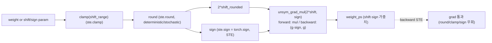
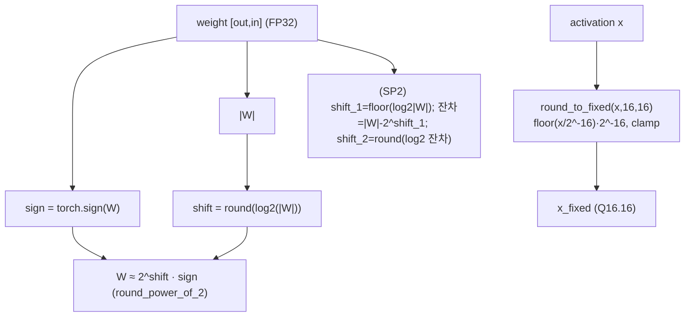
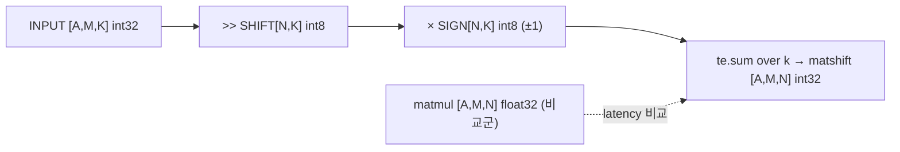
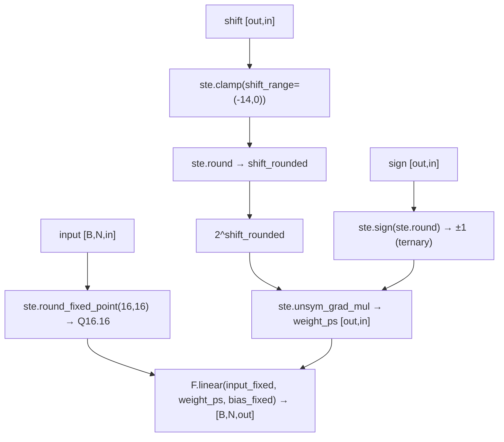
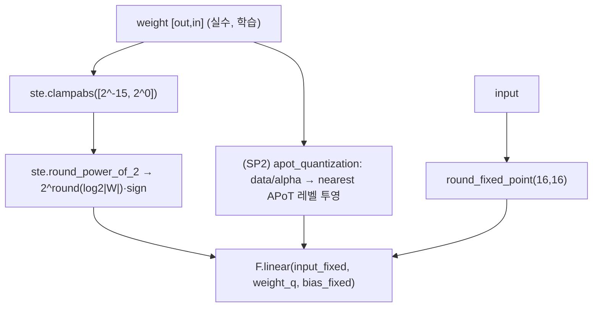
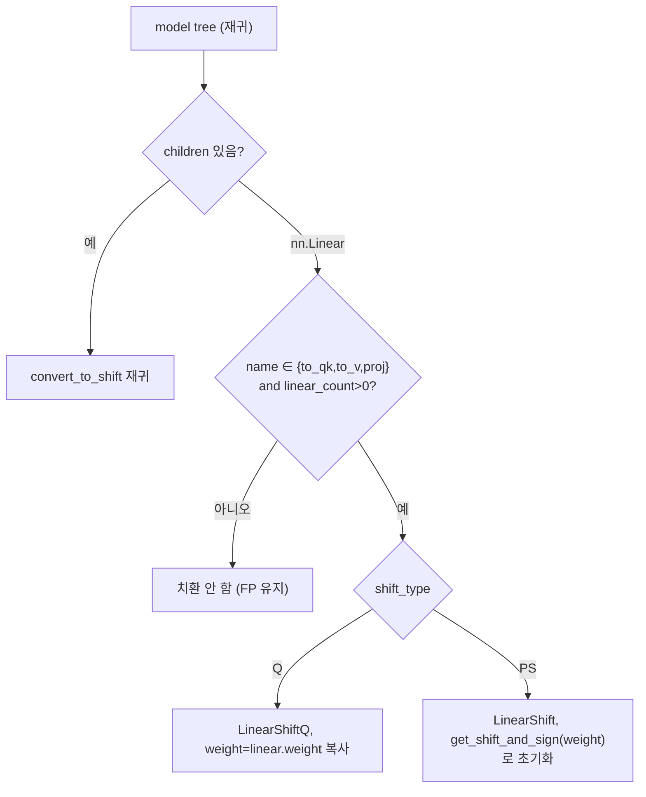
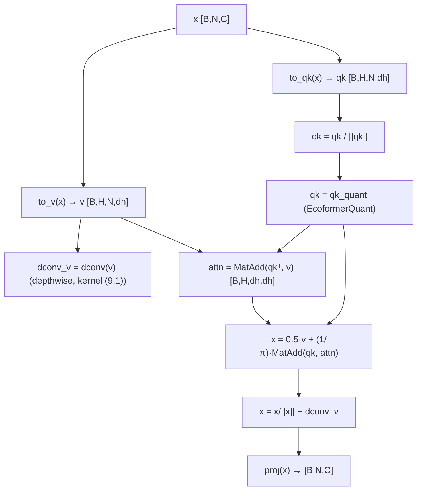
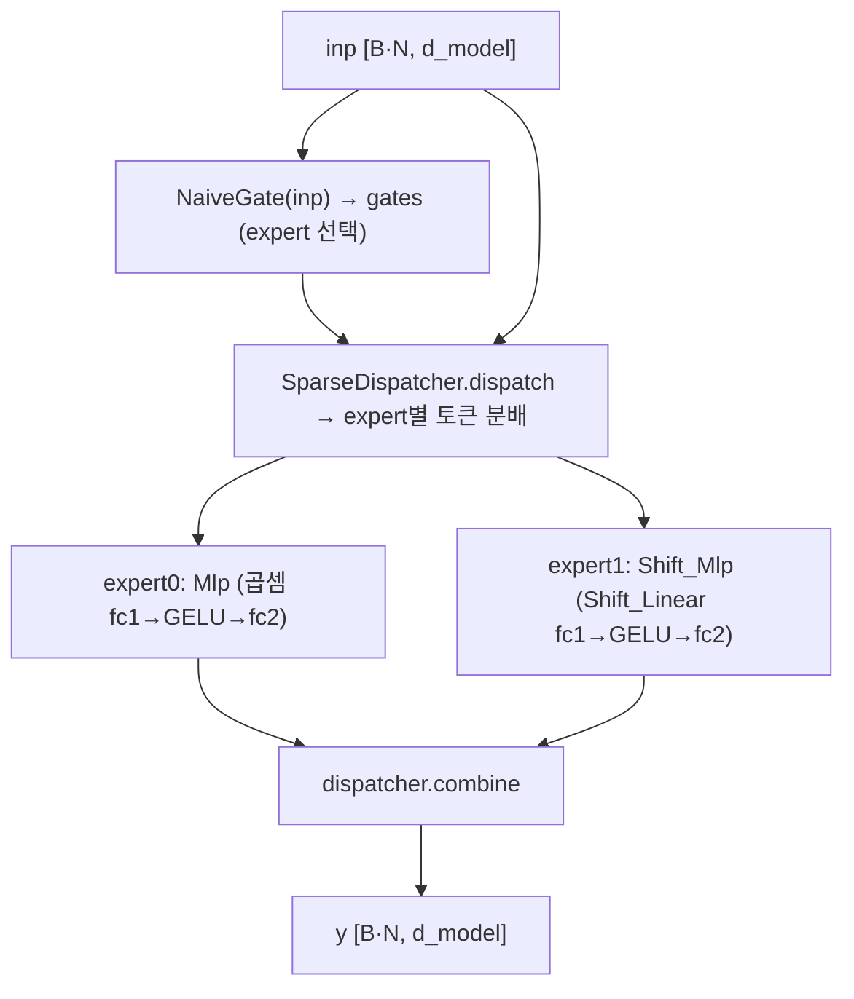
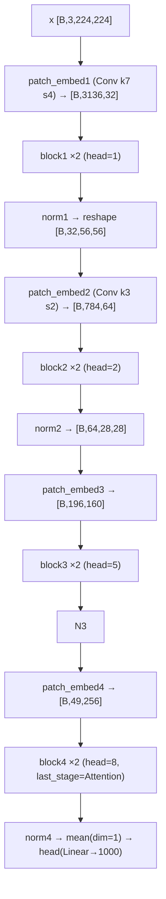
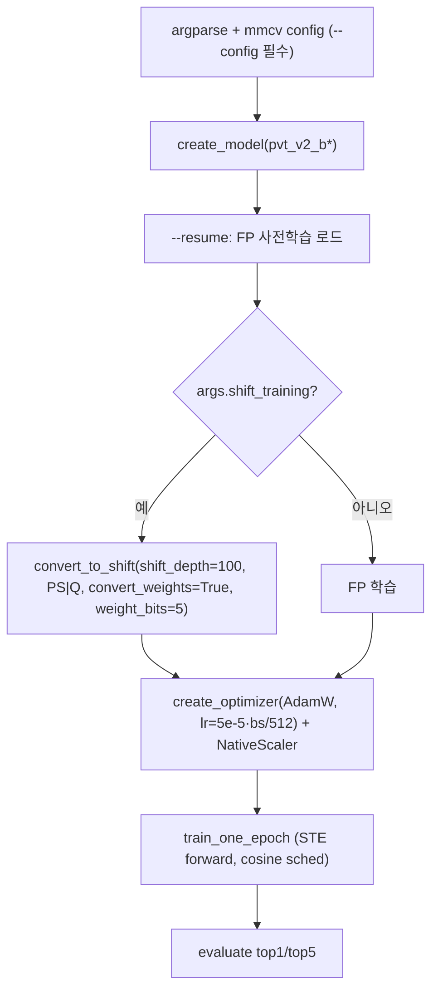

# ShiftAddViT 모듈 통합 가이드 (S-PyTorch)

> 1차 요약: [`../ShiftAddViT.md`](../ShiftAddViT.md) — 본 문서는 그 요약을 모듈 단위로 심화한 통합 가이드다.
> 분석 대상: `\\wsl.localhost\ubuntu-24.04\home\user\project\PRJXR-HBTXR\REF\ViT-Quantization\ShiftAddViT`
> 작성 원칙: 실제 소스 Read 후 `파일:라인` 근거 표기. 라인 근거 없는 추론은 "추정", 코드로 확인 불가는 "확인 불가"로 명시.
> 형제 가이드(`REF/Analysis/ViT-Quantization/I-ViT/MODULE_GUIDE.md`)의 6요소 구조를 따르되, HW 지표(MAC lanes/scalar MACs)는 **S-PyTorch 수치 규약**(params/FLOPs/activation memory/비트폭/**곱셈→shift&add 치환 규칙**)으로 치환한다.
> I-ViT가 "정수전용(integer-only)" 양자화라면, ShiftAddViT는 **곱셈기 자체를 시프트·덧셈으로 reparameterize**하는 점이 본질적 차이다 — 즉 본 가이드의 핵심은 비트폭이 아니라 **곱셈→2^shift 시프트 / MatMul→MatAdd / 곱셈 expert↔shift expert 혼합** 치환이다.

---

## 0. 문서 머리말

### 0.1 대표 케이스 선정
- **대표 모델: `pvt_v2_b0`** — `embed_dims=[32,64,160,256], num_heads=[1,2,5,8], mlp_ratios=[8,8,4,4], depths=[2,2,2,2], sr_ratios=[8,4,2,1], patch_size=4`(`pvt_v2.py:1052-1069`). 근거:
  1. ShiftAddViT의 `configs/pvt_v2/` 변종 중 shift/MoE/attn 조합 config가 가장 많이 갖춰진 백본이 b0/b1/b2이고(`pvt_v2_b0_LinAngular.py`, `pvt_v2_b0_ecoformer.py`, `pvt_v2_b0_performer_binary.py` 등 Glob 결과), b0가 가장 경량이라 4-stage 피라미드·다종 attention·shift MLP·MoE를 모두 비자명한 크기로 노출하면서 분석 가치가 높음(추정 근거: config 파일 개수).
  2. 논문/repo의 핵심 백본은 **PVT(Pyramid Vision Transformer) v2**이며(`README.md:14`, `pvt_v2.py:825-1025`), DeiT/ViT가 아닌 PVT-v2를 ImageNet 사전학습 후 shift로 변환하는 구조가 본 repo의 대표 운영 경로.
- **대표 분석 단위: 1개 `Block`** = `norm1 → attn(attn_dict[attn_type]) → residual add → norm2 → mlp(Mlp 또는 Mlp_FMoE/Shift_Mlp) → residual add`(`pvt_v2.py:759-762`). PVT-v2는 stage별로 이 Block을 `depths[i]`개 적층(`pvt_v2.py:881-902`).
- **대표 곱셈치환 3종**(본 repo의 "Mixture of Multiplication Primitives"):
  1. **Linear → Shift**: `W ≈ 2^shift × sign` → 곱셈을 비트시프트로(`modules.py:40,177`, `utils.py:23-29`).
  2. **MatMul → MatAdd**: linear-attention의 `Q@K`, `attn@V`를 add 마커로(`matkernel.py:6-11`, `pvt_v2.py:514,523`).
  3. **MoE 게이팅**: 정규 곱셈 MLP ↔ Shift MLP 두 expert를 토큰별로 라우팅(`fmoe_mlp.py:285-291`).

### 0.2 S-PyTorch 수치 규약 (HW의 MAC lanes/scalar MACs 대체) + 곱셈치환 규칙
- **params**: 모듈 차원에서 분석적 계산. `LinearShift`(PS 모드)는 nn.Linear와 달리 **weight 대신 `shift`+`sign` 2개 텐서**(각 `out×in`)를 학습 파라미터로 보유(`modules.py:125-126`) → **파라미터 개수가 원본 nn.Linear의 2배**(SP2 모드는 `shift_1/2`+`sign_1/2`+`sign` = 5배, `modules.py:117-121`). `LinearShiftQ`(Q 모드)는 실수 `weight` 1개만 보유(`modules_q.py:196`)해 원본과 동일 개수. 단 forward에서 shift/sign으로 환원되므로 **유효 비트폭은 weight_bits=5**(`fmoe_mlp.py:16`).
- **FLOPs/MACs(shift/add 치환 분해)**: 표준식×config로 산출하되, **곱셈 MAC을 시프트+덧셈 OP로 분해**한다.
  - 일반 nn.Linear MAC = `B·N·in·out`(곱셈+누산).
  - **LinearShift**: 동일 위치 수에 대해 곱셈 1회를 **시프트 1회**로 치환, 누산(덧셈)은 동일 → "MAC" 대신 "**shift-accumulate(SAC)**"로 카운트(`latency_test.py:32`의 `INPUT >> SHIFT` 누산).
  - **SP2**: 곱셈 1회 → **시프트 2회 + 덧셈 1회**(`modules.py:169-171`).
  - **MatAdd attention**: `softmax(QKᵀ)V`의 O(N²) 곱셈을 kernel-trick `(KᵀV) 먼저`로 O(N·d²)로 줄이고(`pvt_v2.py:514,636`), q/k binary화 시 곱셈을 누산(덧셈)으로 환원(`pvt_v2.py:384-400`).
- **activation memory**: 텐서 shape × 비트폭. ShiftAddViT는 **활성/바이어스를 Q16.16 고정소수점**(act_integer_bits=16, act_fraction_bits=16)으로 양자화(`utils.py:7-21`, `fmoe_mlp.py:14-15`) → HW 환산 activation bit = **32bit(=16정수+16소수)**. weight는 5bit(shift=ceil(log2)bits + sign 1bit).
- **비트폭/규약**: 코드 직접. `weight_bits=5`(`fmoe_mlp.py:16`, `main.py:386`), `act_integer_bits=16/act_fraction_bits=16`(`fmoe_mlp.py:14-15`). shift_range PS=`(-(2^(b-1)-2),0)`=`(-14,0)`(`modules.py:102`), Q=`(-(2^(b-1)-1),0)`=`(-15,0)`(`modules_q.py:174`), SP2 PS=`(-2,0)`(`modules.py:97`). 부호는 ternary(`-1,0,+1`) 허용(`modules.py:33` clamp(-1,1); `utils.py:88-89` sign==0 처리).
- **곱셈→shift&add 치환 규칙(핵심)**:
  - `Y = X·W`, `W=2^s·sign` → `Y = sign·(X << s)`(s≥0) 또는 `sign·(X >> -s)`(s<0). 본 repo는 shift_range가 음수라 **우측 산술시프트**(`latency_test.py:32` `INPUT >> SHIFT`).
  - dequant 불필요: 활성이 이미 Q16.16 고정소수점이라 시프트 결과가 같은 격자(추정, `round_to_fixed` 일관성 기반).
- **정확도/속도**: README/논문 인용. 사전학습 체크포인트 미공개(`README.md:17-19`) → 정확도 수치 **확인 불가**. latency는 TVM(USE_CUDA) 빌드 필요 + 본 세션 미실행 → **확인 불가**.

### 0.3 운영 경로 (FP 사전학습 → shift 변환 → QAT fine-tune → TVM 배포)
```
[FP PVT-v2 사전학습 가중치 로드] create_model + --resume checkpoint   (main.py:409-419)
   │  attn_type/moe_mlp/moe_attn는 mmcv config + argparse로 결정 (params.py:309-345)
   ▼
[shift 변환] if args.shift_training: convert_to_shift(model, shift_depth=100,
   │    shift_type=PS|Q, convert_weights=True, weight_bits=5, SP2)   (main.py:382-396)
   │  attention 내 to_qk/to_v/proj 이름의 nn.Linear만 LinearShift(Q)로 치환  (convert.py:29)
   │  PS면 get_shift_and_sign(weight)로 shift/sign 초기화  (convert.py:48-57)
   ▼
[QAT fine-tune] STE로 shift/sign 학습(UnsymmetricGradMul 등) + AdamW + cosine + AMP
   │  lr=5e-5×(bs/512) linear-scale (params.py:89, main.py:403-404), epochs=30 (params.py:10)
   │  weight_decay=0.05, drop_path=0.1, mixup0.8/cutmix1.0, label smoothing0.1 (params.py:78,29,221,227,182)
   ▼
[추론 전 라운딩] round_shift_weights: shift/sign을 정수로 고정  (convert.py:112-134)
   ▼
[(별도) TVM 컴파일·throughput] --tvm_tune/--tvm_throughput  (params.py:349-350, ste.py 전반 우회분기)
   │  OPs_Speedups/{Shift,Add}: matshift(INPUT>>SHIFT) vs matmul latency 비교 (latency_test.py:21-37)
```
- 타깃 디바이스: **CUDA GPU 전제** — `convert_to_shift`가 `use_cuda=(args.device=='cuda')`(`main.py:378-381`), `compress_bits`가 `.cuda()` 하드코딩(`utils.py:106`), TVM 커널 `target='cuda'`(`latency_test.py:11`). `main_cpu.py`가 별도 존재(CPU 경로 시도, 세부 미열람) → CPU 실행 가능 여부 **확인 불가**.

### 0.4 모델 / 데이터셋 / 정확도
| 항목 | 값 | 근거 |
|---|---|---|
| 백본 | PVT-v2 (b0~b5) + PVT-v1 | `pvt_v2.py:1052-1159`, `pvt.py` |
| 대표 b0 | embed[32,64,160,256]/head[1,2,5,8]/depth[2,2,2,2] | `pvt_v2.py:1054-1062` |
| 데이터셋 | ImageNet (1000-class) | `params.py`(--data-path), `mcloader/imagenet.py` |
| 입력 | 224×224 | `params.py:21` |
| attention 종류 | msa/sra/linear/performer/ecoformer/LinAngular | `pvt_v2.py:646-655` |
| **정확도** | **확인 불가**(체크포인트·.json 미공개) | `README.md:17-19` |
| **latency** | **확인 불가**(TVM 미실행) | `latency_test.py`, `README.md:14-15` |
- 논문(NeurIPS 2023, arXiv:2306.06446, `README.md:1-8`)에 정확도/속도 수치가 있을 것으로 추정되나 **본 repo 코드/README만으로는 수치 미확인** → 확인 불가.

---

## 1. Repo / Layer 개요

ShiftAddViT = ViT(PVT-v2 백본)의 **곱셈(MAC)을 시프트·덧셈 "곱셈 기본 연산의 혼합(Mixture of Multiplication Primitives)"으로 reparameterize**하는 효율화 프레임워크(`README.md:1`, arXiv:2306.06446). 본 repo는 **DeepShift(GATECH-EIC) shift 양자화 모듈을 PVT-v2 attention에 이식**한 구조이고, ImageNet DataLoader·optimizer·scheduler·Mixup은 timm/deit 컴포넌트를 임포트한다(`pvt_v2.py:6-8`).

### 1.1 자체 소스 vs 외부 프레임워크 vs 제외

| 구분 | 파일(자체 소스) | 역할 |
|---|---|---|
| **Shift 양자화 핵심** | `pvt/deepshift/modules.py` ★핵심 | LinearShift/Conv2dShift (PS 모드: shift·sign 직접 학습) |
| | `pvt/deepshift/modules_q.py` ★핵심 | LinearShiftQ/Conv2dShiftQ (Q 모드: 실수 weight를 forward 양자화), APoT |
| | `pvt/deepshift/ste.py` ★핵심 | STE Function들(Round/Sign/Clamp/**UnsymmetricGradMul**) |
| | `pvt/deepshift/utils.py` | round_to_fixed / get_shift_and_sign / SP2 / APoT / compress_bits |
| | `pvt/deepshift/convert.py` | nn.Linear → ShiftLinear 변환기, round_shift_weights, convert_to_multi |
| **연산 추상화** | `pvt/matkernel.py` | MatMul/MatAdd/Mul (FLOPs 분기 + TVM 커널 매핑 마커) |
| **모델 정의** | `pvt/pvt_v2.py` ★핵심 | PVTv2 + 다종 Attention(msa/sra/linear/LinAngular/binary) + Block |
| | `pvt/pvt.py` | PVTv1 |
| **MoE/Shift MLP** | `pvt/fmoe_mlp.py` ★핵심 | Shift_Linear/Shift_Mlp + PyTorchFMoE_MLP(곱셈+shift expert) |
| | `pvt/fmoe_fc.py`, `fmoe_new.py` | Mlp_FMoE, SparseDispatcher, NaiveGate |
| | `pvt/performer.py`, `performer_new.py` | Performer/Ecoformer linear-attn + EcoformerQuant |
| **TVM 커널 테스트** | `OPs_Speedups/Shift/{latency_test,Ansor_tune}.py` | matshift(`>>`) vs matmul latency |
| | `OPs_Speedups/Add/{...}.py` | add 커널 (Shift와 동일 구조) |
| **학습 엔트리** | `pvt/main.py`, `main_cpu.py` | train/eval 루프 + convert_to_shift 호출 |
| | `pvt/params.py` | argparse 전체 옵션 |
| | `pvt/engine.py`, `losses.py` | train/eval step, loss |
| **데이터** | `pvt/datasets.py`, `samplers.py`, `mcloader/` | ImageNet DataLoader |

### 1.2 forward 진입점
`PyramidVisionTransformerV2.forward`(`pvt_v2.py:998-1001`) → `forward_features`(`:979-996`): stage별로 `patch_embed{i}`(OverlapPatchEmbed Conv 패치, `:807-813`) → `block{i}` 리스트(각 Block) → `norm{i}`(LayerNorm) → 마지막 stage 외엔 `[B,H,W,C]→[B,C,H,W]` reshape → 최종 `x.mean(dim=1)` → `head`(nn.Linear). **스케일 페어 전파 없음**(I-ViT와 달리 고정소수점 한 종류로 통일).

### 1.3 제외 (지시에 따라 이름만 표기, 미분석)
- **외부 DeepShift 네이티브 커널**: `deepshift/kernels/cuda/`, `deepshift/kernels/cpu/`(`compress_sign_and_shift`, `deepshift.kernels.linear/conv2d`) — `use_kernel=True` 경로에서만 호출(`modules.py:24-31`, `utils.py:106`). 분석 제외.
- **unoptimized 커널**: `pvt/unoptimized/kernels/` — 제외.
- **외부 프레임워크**: `timm.models.layers.{DropPath,trunc_normal_}`, `timm.models.registry.register_model`, `thop.profile`, `mmcv`(config), `tree`(`pvt_v2.py:6-9`, `fmoe_mlp.py:11`). PVT-v2 **원본 사전학습 체크포인트**(미공개, `README.md:17-19`).
- **TVM 런타임**: `tvm.auto_scheduler`/Ansor 자체는 외부(`latency_test.py:2-8`), 단 워크로드 정의(matshift)는 자체 소스로 분석.
- **미열람(확인 불가)**: `pvt.py`(PVTv1) 세부, `performer.py`/`hashing/ksh.py`(Ecoformer 커널 해싱) 세부, `fmoe_new.py`(SparseDispatcher) 세부, `mcloader/` 데이터 파이프라인 세부.

### 1.4 대표 모델 레이어 구성 (pvt_v2_b0, attn_type=LinAngular + moe_mlp 가정)
`forward_features`(`pvt_v2.py:979-996`): 4 stage. stage i = OverlapPatchEmbed(Conv) → Block×depths[i] → LayerNorm. 1 Block(`:759-762`)당: norm1(LN) → attn(LinAngular: to_qk/to_v/proj nn.Linear → shift 변환 대상 + MatAdd×2 + dconv) → residual → norm2(LN) → mlp(Mlp_FMoE: 곱셈 Mlp expert + Shift_Mlp expert) → residual.

---

## 2. 모듈: STE 미분 처리 — `ste.py` (UnsymmetricGradMul 외) ★핵심

### 2.1 역할 + 상위/하위
- **역할**: shift/sign 파라미터는 round/clamp/sign 등 **미분 불가 연산**을 거치므로, forward는 양자화하되 backward는 gradient를 통과시키는 STE(Straight-Through Estimator)를 `torch.autograd.Function`으로 구현. `2^shift·sign` 곱셈의 비대칭 gradient(`UnsymmetricGradMul`)가 핵심.
- **상위**: `LinearShift.forward`(`modules.py:157-190`), `LinearShiftQ.forward`(`modules_q.py:215-250`), `Conv2dShift.forward`. **하위**: `utils.round_power_of_2`/`round_to_fixed`/`round`(`ste.py` 각 forward).

### 2.2 데이터플로우 (텐서 shape 흐름)


### 2.3 forward call stack
`LinearShift.forward`(`modules.py:174-177`) → `ste.clamp`(`ste.py:75`) → `ste.round`(`:45`) → `ste.sign`(`:60`) → `ste.unsym_grad_mul`(`:136`) → `UnsymmetricGradMulFunction.forward`(`:127`).

### 2.4 대표 코드 위치
`ste.py`: `UnsymmetricGradMulFunction` `:125-140`, `SignFunction` `:51-64`, `RoundFunction` `:36-49`, `ClampFunction` `:66-79`, `RoundFixedPoint` `:21-34`, `RoundPowerOf2` `:6-19`. TVM 우회 분기 `:16-19,46-49` 등(모든 함수 공통).

### 2.5 대표 코드 블록

```python
# ste.py:125-134  2^shift·sign 곱셈의 비대칭 gradient (shift/sign 독립 학습 트릭)
class UnsymmetricGradMulFunction(Function):
    @staticmethod
    def forward(ctx, input1, input2):     # input1 = 2^shift, input2 = sign
        ctx.save_for_backward(input1, input2)
        return torch.mul(input1, input2)
    @staticmethod
    def backward(ctx, grad_output):
        input1, input2 = ctx.saved_tensors
        return grad_output*input2, grad_output   # d/d(2^shift)=sign, d/dsign=1 (비대칭)
```
→ `2^shift`에는 `sign`을, `sign`에는 1을 곱한 gradient를 흘려보내 **shift와 sign을 분리 학습**. 일반 mul의 대칭 gradient(`g·input2, g·input1`)와 다름.

```python
# ste.py:51-58  Sign forward만 양자화, backward는 항등 통과 (STE)
class SignFunction(Function):
    @staticmethod
    def forward(ctx, input):    return torch.sign(input)
    @staticmethod
    def backward(ctx, grad_output):  return grad_output    # sign 미분불가 우회
```

```python
# ste.py:16-19  TVM 추론 모드에서는 autograd 우회 (순수 텐서 연산)
def round_power_of_2(input, stochastic=False):
    if args.tvm_tune or args.tvm_throughput:
        return utils.round_power_of_2(input, stochastic)   # STE 불필요
    else:
        return RoundPowerOf2.apply(input, stochastic)
```
→ 학습 시엔 STE, TVM 컴파일·throughput 측정 시엔 순수 연산으로 분기 — **HW 추론 경로엔 backward 불필요**를 명시.

### 2.6 연산·수치표현 분해 + 정량 (곱셈치환)
- **곱셈치환**: STE 자체는 치환 대상이 아니라 **shift/sign을 미분 가능하게 만드는 학습 보조**. `unsym_grad_mul`이 `2^shift × sign` 곱셈을 forward 산출하지만, 이 결과(weight_ps)는 추론에서 시프트로 환원(§3 참조).
- **params**: 0 (순수 Function).
- **FLOPs**: 원소당 clamp+round+sign+pow+mul = O(N). 학습 전용 오버헤드(추론 TVM 경로는 우회).
- **비트폭**: 입력 shift는 [-14,0] 정수, sign은 {-1,0,1}.
- **시사**: HW 추론에는 STE가 전혀 필요 없음(`:16-19` 분기) → FPGA 데이터패스는 forward 시프트 경로만 합성하면 됨.

---

## 3. 모듈: Shift 가중치 표현 — `utils.py` (get_shift_and_sign + round_to_fixed) ★핵심

### 3.1 역할 + 상위/하위
- **역할**: 부동소수점 가중치 `W`를 **2의 거듭제곱 × 부호** `W ≈ 2^shift·sign`으로 근사(곱셈→시프트의 수학적 근거). 활성/바이어스는 **Q16.16 고정소수점**으로 양자화. SP2(Sum-of-Power-of-2)/APoT로 표현력 보강.
- **상위**: `convert_to_shift`(`convert.py:50`), `LinearShiftQFunction`(`modules_q.py:22`), `LinearShift`(`modules.py`). **하위**: `torch.log`, `np.log`, `torch.floor/round`, (use_kernel 시)`deepshift.kernels.compress_sign_and_shift`.

### 3.2 데이터플로우 (텐서 shape 흐름)


### 3.3 forward call stack
`convert_to_shift`(`convert.py:50`) → `get_shift_and_sign`(`utils.py:23-29`) → `torch.log/torch.sign`. 또는 `LinearShiftQ.forward`(`modules_q.py:225`) → `round_power_of_2`(`utils.py:51-54`) → `get_shift_and_sign`.

### 3.4 대표 코드 위치
`utils.py`: `round_to_fixed` `:7-21`, `get_shift_and_sign` `:23-29`, `round_power_of_2` `:51-54`, `get_shift_and_sign_SP2` `:32-48`, `build_power_value`/`get_param_APoT` `:125-189`, `compress_bits` `:81-108`(외부 커널), `clampabs` `:64-72`.

### 3.5 대표 코드 블록

```python
# utils.py:23-29  부동소수점 가중치 → 2의 거듭제곱 + 부호 (곱셈→시프트의 수학적 근거)
def get_shift_and_sign(x, rounding='deterministic'):
    sign = torch.sign(x)
    x_abs = torch.abs(x)
    shift = round(torch.log(x_abs) / np.log(2), rounding)   # shift = round(log2(|W|))
    return shift, sign                                       # W ≈ 2^shift · sign
```
→ `Y = X·W = X·2^shift·sign = sign·(X << shift)`(shift<0이면 우측시프트). **곱셈 1회 → 시프트 1회 + 부호선택**.

```python
# utils.py:7-21  활성/바이어스 Q16.16 고정소수점 (HW 정수 데이터패스 정합)
def round_to_fixed(input, integer_bits=16, fraction_bits=16):
    delta = math.pow(2.0, -(fraction_bits))     # 2^-16
    bound = math.pow(2.0, integer_bits-1)       # 2^15
    rounded = torch.floor(input / delta) * delta
    clipped_value = torch.clamp(rounded, -bound, bound-1)   # [-2^15, 2^15-1]
    return clipped_value
```

```python
# utils.py:40-47  SP2: 잔차 분해로 2-term PoT (곱셈 → 시프트 2 + 덧셈 1)
shift_1 = (torch.log(x_abs) / np.log(2)).floor()
shift_1 = shift_1.clamp(-(2**(weight_bits_1)-1), -1)   # weight_bits_1=2 → [-3,-1]
x_diff = x_abs - torch.abs(sign_1*2**shift_1)          # 잔차
shift_2 = (torch.log(x_diff) / np.log(2)).round()
shift_2 = shift_2.clamp(-(2**(weight_bits_2)-1), -1)
```
→ `W ≈ 2^shift_1 + 2^shift_2` → `X·W = (X<<shift_1) + (X<<shift_2)`: **시프트 2회 + 덧셈 1회**로 단일 PoT 대비 양자화 오차↓.

### 3.6 연산·수치표현 분해 + 정량 (곱셈치환)
- **곱셈치환 규칙**: `W=2^s·sign`, s∈[-14,0](PS) 또는 [-15,0](Q). `Y=X·W → sign·(X>>(-s))`. SP2면 `(X>>(-s1)) + (X>>(-s2))`(+`·2/3` 스케일, `modules.py:171`).
- **비트폭**: weight = shift(`ceil(log2(범위))`bits) + sign(1~2bit, ternary). weight_bits=5(`fmoe_mlp.py:16`). 활성 = Q16.16(32bit).
- **params**: 0(순수 함수). 단 `LinearShift`가 보유하는 shift/sign 텐서는 §6 참조.
- **FLOPs**: `get_shift_and_sign`은 weight당 log+round+sign = O(weight 원소수). 변환은 1회성(추론 비반복).
- **activation memory**: 고정소수점 활성 = shape × 32bit(Q16.16). I-ViT의 A8/A16 대비 넉넉(시선추적 경량화 시 축소 여지, 추정).
- **시사**: `get_shift_and_sign`이 **FPGA shift-PE 가중치 생성기**의 레퍼런스. SP2는 "시프터 2 + 가산기 1" PE. `compress_bits`(`:81-108`)는 shift/sign 비트팩킹(외부 CUDA 커널, 제외)이나 **HW 가중치 압축 포맷의 참고**.

---

## 4. 모듈: TVM Shift 커널 — `OPs_Speedups/Shift/latency_test.py` (matshift) ★곱셈치환 실증

### 4.1 역할 + 상위/하위
- **역할**: shift 행렬곱을 **곱셈 없이 비트시프트 `>>`와 sign(±1) 곱만으로** TVM TE로 정의하고, float32 matmul과 latency 비교(논문 Fig.4/5 재현, `README.md:15`). 곱셈치환의 **HW 효과 실증** 단위.
- **상위**: `Ansor_tune.py`(스케줄 튜닝) → `latency_test.py`(실측). **하위**: `tvm.te`, `tvm.auto_scheduler`(외부).

### 4.2 데이터플로우 (텐서 shape 흐름, PVT 실제 shape)


### 4.3 forward call stack
`latency_test.py` 루프(`:76-154`) → `auto_scheduler.SearchTask(matshift)`(`:83`) → `tvm.build`(`:86`) → `time_evaluator`(`:134-135`). 비교: matmul(`:89-92,138`), matshift_fake(`:95-98,141`).

### 4.4 대표 코드 위치
`latency_test.py`: PVT shape `:14-17`, `matshift` `:21-37`, `matmul`(비교) `:41-52`, `matshift_fake`(가짜shift=곱셈) `:55-74`, 빌드·측정 `:76-154`.

### 4.5 대표 코드 블록

```python
# latency_test.py:21-37  곱셈 없는 행렬곱: INPUT을 SHIFT만큼 우측시프트 후 SIGN 곱·누산
def matshift(A, M, K, N):
    INPUT = te.placeholder((A, M, K), name="INPUT", dtype="int32")
    SHIFT = te.placeholder((N, K), name="SHIFT", dtype="int8")
    SIGN  = te.placeholder((N, K), name="SIGN",  dtype="int8")
    k = te.reduce_axis((0, K), name="k")
    matshift = te.compute((A, M, N),
        lambda a, i, j: te.sum(SIGN[j, k] * (INPUT[a, i, k] >> SHIFT[j, k]), axis=k))
    return [INPUT, SHIFT, SIGN, matshift]
```
→ **`INPUT >> SHIFT`가 곱셈 1회를 시프트 1회로 치환**. 주석(`:28-31`)엔 sign 분기형(`if sign>0: x>>s else ~(x>>s)+1`) 대안도 — 부호를 2's complement 부정으로(곱셈기 완전 제거).

```python
# latency_test.py:55-74  matshift_fake: weight=2^-SHIFT·SIGN 후 일반 곱셈 (PyTorch 시뮬 등가)
weight = te.compute((outDim, inDim),
    lambda o, j: tir.pow(2, -SHIFT[o, j]) * SIGN[o, j])     # 2^shift 복원
matshift = te.compute((bs, token, outDim),
    lambda b, t, o: te.sum(INPUT[b, t, i] * weight[o, i], axis=i))  # 일반 MAC
```
→ "fake shift"는 곱셈으로 시뮬레이션 → PyTorch `LinearShift`(use_kernel=False, `F.linear(x, weight_ps)`)와 등가. **진짜 shift(`>>`)와의 latency 격차가 곱셈치환 이득**.

### 4.6 연산·수치표현 분해 + 정량 (곱셈치환)
- **곱셈치환**: matshift는 `K`차원 누산당 곱셈 0회·시프트 1회·sign곱 1회(±1, 실HW는 부호선택). matmul은 곱셈 K회. **곱셈→시프트 1:1 치환**.
- **비트폭**: INPUT int32(Q16.16 등가), SHIFT/SIGN int8. 출력 int32 누산.
- **대표 shape**(`:14-17`, PVT stage1/2 MLP): `[1,3136,64,512]`, `[1,3136,512,64]`, `[1,784,128,1024]`, `[1,784,1024,128]`.
  - 예 `[1,3136,64,512]`: matmul MAC = 3136·64·512 ≈ **102.8M MAC** → matshift = **102.8M shift-accumulate**(곱셈 0).
- **latency 실측**: **확인 불가**(TVM USE_CUDA 빌드 + result/*.json 필요, 본 세션 미실행). REPEAT=10000(`:126`).
- **시사**: `INPUT >> SHIFT`(`:32`)가 **그대로 RTL barrel shifter로 매핑** — FPGA에서 DSP48 곱셈기 대신 LUT 시프터+가산기로 GEMM PE 구성의 직접 청사진. sign은 2's complement 부정(곱셈기-free).

---

## 5. 모듈: LinearShift (PS 모드) — `modules.py` ★핵심

### 5.1 역할 + 상위/하위
- **역할**: nn.Linear를 대체. **shift/sign을 직접 학습 파라미터로 보유**하고 forward에서 `2^shift·sign` 가중치 구성 후 고정소수점 입력과 `F.linear`. ShiftAddViT의 곱셈치환 메인 계층.
- **상위**: `Shift_Linear`(`fmoe_mlp.py:106-108`) → `Shift_Mlp.fc1/fc2`(`fmoe_mlp.py:157,160`); `convert_to_shift`가 `to_qk/to_v/proj`를 치환(`convert.py:44`). **하위**: `ste.*`, `F.linear` 또는 (use_kernel)`LinearShiftFunction`.

### 5.2 데이터플로우 (텐서 shape 흐름)


### 5.3 forward call stack
`Shift_Mlp.forward`(`fmoe_mlp.py:190`) → `LinearShift.forward`(`modules.py:157`) → shift clamp/round(`:174-176`) → `unsym_grad_mul`(`:177`) → `round_fixed_point`(`:180-184`) → `F.linear`(`:190`). use_kernel 시 `LinearShiftFunction.apply`(`:187`) → `forward`(`:18-47`) `input.mm(v.t())`(`:41`).

### 5.4 대표 코드 위치
`modules.py`: 클래스 `:79-197`, shift_range `:97,102`, 파라미터 생성 `:117-128`, PS forward `:173-190`, SP2 forward `:158-171`, `LinearShiftFunction.forward` `:18-47`, backward `:50-76`.

### 5.5 대표 코드 블록

```python
# modules.py:173-177  PS 모드: shift/sign → 2^shift·sign 가중치 (곱셈→시프트)
self.shift.data = ste.clamp(self.shift.data, *self.shift_range)   # (-14,0)
shift_rounded = ste.round(self.shift, rounding=self.rounding)
sign_rounded_signed = ste.sign(ste.round(self.sign, rounding=self.rounding))  # ±1
weight_ps = ste.unsym_grad_mul(2**shift_rounded, sign_rounded_signed)
```

```python
# modules.py:158-171  SP2 모드: 2-term PoT 합 (시프트 2 + 덧셈 1)
weight_ps_1 = ste.unsym_grad_mul(2**(2*shift_rounded_1), sign_1_rounded_signed)
weight_ps_2 = ste.unsym_grad_mul(2**(2*shift_rounded_2-1), sign_2_rounded_signed)
weight_ps   = ste.unsym_grad_mul((weight_ps_1 + weight_ps_2)*2/3, sign_rounded_signed)
```

```python
# modules.py:40-41  use_kernel=False 커널 경로: v=2^shift·sign 후 mm (곱셈→시프트 환원 가능)
v = 2**shift.round() * sign.round().sign()
out = input.mm(v.t())
# modules.py:70-72  backward: shift gradient에 log2 인수 (d(2^s)/ds = 2^s·ln2)
grad_shift = grad_sign * v * log2     # log2 = math.log(2) (modules.py:15)
```
→ `v`가 2의 거듭제곱이라 PyTorch는 `mm`(곱셈)으로 시뮬레이션하지만 **HW에선 시프트로 환원**. backward는 `2^shift`의 미분(`·ln2`)을 반영.

### 5.6 연산·수치표현 분해 + 정량 (곱셈치환, pvt_v2_b0 stage1 가정)
- **곱셈치환**: 위치당 곱셈 1 → 시프트 1(+sign). SP2면 시프트 2 + 덧셈 1.
- **비트폭**: weight = 5bit(shift∈[-14,0] 4bit + sign 1bit ternary). 활성 Q16.16(32bit).
- **params (LinearShift, in×out)**: shift `out×in` + sign `out×in` = **2·in·out**(원본 nn.Linear의 2배). SP2면 5·in·out(`modules.py:117-121`). bias `out`.
  - 예 Shift_Mlp fc1(stage1 b0: in=32, hidden=32·8=256): shift+sign = 2·32·256 = **16,384** + bias 256.
- **MACs→SAC**: fc1(B=1, N=3136, in=32, out=256) = 3136·32·256 ≈ **25.7M shift-accumulate**(곱셈 0).
- **시사**: 파라미터 2배는 학습 메모리 비용. HW 추론은 shift/sign을 정수로 round 고정(`round_shift_weights`, `convert.py:122-123`) → 시프트량+부호 LUT만 저장. **shift-PE = barrel shifter + sign-mux + 가산기**.

---

## 6. 모듈: LinearShiftQ (Q 모드) + APoT — `modules_q.py` ★핵심

### 6.1 역할 + 상위/하위
- **역할**: PS 모드와 달리 **실수 `weight`를 보관**하고 forward 시점에 2의 거듭제곱으로 양자화(QAT 친화, PS 대비 안정적 학습). SP2면 APoT(Additive Powers-of-Two) 사용. `convert_to_shift(shift_type='Q')`의 타깃.
- **상위**: `convert_to_shift`(`convert.py:32`)가 `to_qk/to_v/proj`를 치환. **하위**: `ste.round_power_of_2`/`clampabs`, `apot_quantization`, `F.linear`.

### 6.2 데이터플로우 (텐서 shape 흐름)


### 6.3 forward call stack
`LinearShiftQ.forward`(`modules_q.py:215`) → 일반: `clampabs`(`:224`) + `round_power_of_2`(`:225`); SP2: `apot_quantization`(`:222`) → `power_quant`(`:125-145`) → `F.linear`(`:245`). use_kernel 시 `LinearShiftQFunction.forward`(`:16-44`) `get_shift_and_sign`(`:22`) + `input.mm`(`:38`).

### 6.4 대표 코드 위치
`modules_q.py`: 클래스 `:163-257`, shift_range `:174`, 실수 weight `:196`, 일반 forward `:223-225`, SP2 forward `:216-222`, `apot_quantization` `:124-160`, `build_power_value` `:71-116`, `LinearShiftQFunction` `:16-44`.

### 6.5 대표 코드 블록

```python
# modules_q.py:223-225  Q 모드: 실수 weight를 clampabs 후 2의 거듭제곱 양자화
self.weight.data = ste.clampabs(self.weight.data, 2**self.shift_range[0], 2**self.shift_range[1])
weight_q = ste.round_power_of_2(self.weight, self.rounding)   # 2^round(log2|W|)·sign
```
→ 가중치를 실수로 두고 매 forward fake-quant(I-ViT의 fake-quant와 유사한 학습 방식). shift_range=`(-(2^4-1),0)`=`(-15,0)`(`:174`).

```python
# modules_q.py:124-145  APoT: 사전계산 PoT 레벨집합에 nearest 투영 (STE)
def apot_quantization(tensor, alpha, proj_set, is_weight=True, grad_scale=None):
    def power_quant(x, value_s):
        xhard = x.view(-1).abs()
        idxs = (xhard.unsqueeze(0) - value_s.unsqueeze(1)).abs().min(dim=0)[1]  # nearest
        xhard = value_s[idxs].view(shape).mul(sign)
        xout = (xhard - x).detach() + x       # STE
        return xout
    data = (tensor / alpha).clamp(-1, 1)      # alpha = 학습 스케일 (:180)
    return power_quant(data, proj_set) * alpha
```
→ `proj_set`은 `build_power_value(B=weight_bits-1)`로 생성한 additive PoT 레벨(`:179`, 예 B=2: `2^-1,2^-2,2^-3`, `:76-78`). **각 레벨이 2-3개 2-거듭제곱의 합** → 시프트 합으로 환원.

### 6.6 연산·수치표현 분해 + 정량 (곱셈치환)
- **곱셈치환**: 일반 Q = 단일 PoT(시프트 1). SP2/APoT = additive PoT(레벨에 따라 시프트 2~3 + 덧셈 1~2).
- **비트폭**: weight_bits=5, shift_range=[-15,0]. 활성 Q16.16.
- **params**: 실수 `weight` `out×in`(원본과 **동일 개수**, PS의 절반) + (SP2 시)`weight_alpha` 스칼라 1개(`:180`). bias `out`.
- **PS vs Q 비교**: PS는 shift/sign 분리 학습(파라미터 2배, `unsym_grad_mul`), Q는 실수 weight fake-quant(파라미터 1배, 학습 안정). HW 추론은 둘 다 동일한 `2^shift·sign` 시프트 가중치로 귀결.
- **시사**: Q 모드가 **PTQ/QAT 친화** — 시선추적 경량 ViT엔 Q 모드 + low-bit 탐색이 현실적(추정). APoT 레벨집합은 mixed-PoT HW LUT 설계 참조.

---

## 7. 모듈: 모델 변환기 — `convert.py` (convert_to_shift)

### 7.1 역할 + 상위/하위
- **역할**: 학습된 FP 모델 트리를 재귀 순회하며 **특정 attention projection의 nn.Linear만** LinearShift(Q/PS)로 치환. 추론 전 shift/sign 정수 라운딩(`round_shift_weights`), shift→nn.Linear 역변환(`convert_to_multi`).
- **상위**: `main.py:382-396`(args.shift_training). **하위**: `LinearShift`/`LinearShiftQ`, `get_shift_and_sign`/`get_param_APoT`, `compress_bits`(use_kernel).

### 7.2 데이터플로우 (치환 선택 로직)


### 7.3 forward call stack
`main.py:389/393` → `convert_to_shift`(`convert.py:12`) → 재귀(`:19`) → 이름 매칭(`:29`) → Q:`LinearShiftQ`(`:32-42`) / PS:`LinearShift` + `get_shift_and_sign`(`:44-57`).

### 7.4 대표 코드 위치
`convert.py`: `convert_to_shift` `:12-110`, 선택적 치환 조건 `:29`, Q 분기 `:31-42`, PS 분기 `:43-57`, Conv 블록(전체 주석) `:65-108`, `round_shift_weights` `:112-134`, `convert_to_multi` `:148-172`, `count_layer_type` `:136-145`.

### 7.5 대표 코드 블록

```python
# convert.py:29  attention의 to_qk/to_v/proj nn.Linear만 선택 치환 (전체 곱셈-free 아님)
if (name == 'to_qk' or name == 'to_v' or name == 'proj') and linear_count > 0:
    if shift_type == 'Q':
        shift_linear = deepshift.modules_q.LinearShiftQ(...)
        shift_linear.weight = linear.weight             # 실수 weight 복사
    elif shift_type == 'PS':
        shift_linear = deepshift.modules.LinearShift(...)
        if convert_weights:
            shift_linear.shift.data, shift_linear.sign.data = utils.get_shift_and_sign(linear.weight)
```

```python
# convert.py:122-123  추론 전 shift/sign 정수 고정 (deterministic HW 추론)
module.shift.data = module.shift.round()
module.sign.data  = module.sign.round().sign()
```

### 7.6 연산·수치표현 분해 + 정량 (곱셈치환)
- **곱셈치환 범위**: **attention의 to_qk/to_v/proj만** shift화(`:29`). qkv(합쳐진 경우), MLP fc1/fc2(별도 Shift_Mlp/MoE로만), patch embed Conv, dwconv는 **FP 유지**. Conv 변환 블록은 전체 주석(`:65-108`) → 현재 Conv 비치환.
- **params 영향**: 치환된 Linear만 PS(2배)/Q(동일). 모델 대부분(MLP·conv)은 FP 곱셈 잔존.
- **시사**: ShiftAddViT는 **부분 곱셈-free**(attention proj 중심). 전체 곱셈-free FPGA 설계엔 MLP·conv까지 shift화 확장 필요(추정). `round_shift_weights`(`:112-134`)는 HW 배포 전 정수 고정 단계의 참조.

---

## 8. 모듈: MatAdd 연산 추상화 — `matkernel.py` ★곱셈치환 마커

### 8.1 역할 + 상위/하위
- **역할**: `MatMul`/`MatAdd`/`Mul` 셋 다 forward는 `a@b`(또는 `a*b`)지만 **이름(클래스)으로 구분**하여 (1) thop FLOPs 계산 분기, (2) TVM 컴파일 시 add/shift 커널 매핑 마커 역할. PyTorch 레퍼런스에선 곱셈, 실제 HW/TVM에선 add 치환 의도(`matkernel.py:4-5` 주석).
- **상위**: `LinAngularAttention_ksh`/`_binary`의 `kq_matmul`/`kqv_matmul`(`pvt_v2.py:467-468,339-340`). **하위**: torch `@`.

### 8.2 대표 코드 위치 + 블록
`matkernel.py`: `MatAdd` `:6-11`, `MatMul` `:14-19`, `Mul` `:22-27`.
```python
# matkernel.py:4-11  곱셈을 add로 치환하는 의도를 이름으로 마킹
# here we have a or b = mask, MatAdd op can be used to mask out the attention
# but we use multiply here for simplicity
class MatAdd(nn.Module):
    def forward(self, a, b):
        out = a @ b      # PyTorch 레퍼런스는 곱셈, HW/TVM은 add 치환
        return out
```

### 8.3 연산·수치표현 분해 + 정량 (곱셈치환)
- **곱셈치환**: MatAdd는 알고리즘↔HW 매핑 분리 마커. q/k가 binary(`pvt_v2.py:384-400`)면 `qk@v`의 곱셈이 누산(덧셈)으로 환원 — binary×fp = 조건부 덧셈.
- **params**: 0. **FLOPs**: 이름으로 thop 카운트 분기(MatAdd는 add로 집계 의도, `:13` 주석 "if use Q@K, FLOPs calculation could be wrong").
- **시사**: "연산 종류 태깅 → 커널 선택" 패턴은 우리 HLS/RTL 파이프라인에서 차용 가능(연산 마커로 PE 종류 매핑).

---

## 9. 모듈: Add 기반 Attention — `pvt_v2.py` (LinAngularAttention / LinearAttn) ★곱셈치환

### 9.1 역할 + 상위/하위
- **역할**: 표준 `softmax(QKᵀ)V`의 O(N²) 곱셈을 (1) kernel-trick으로 `(KᵀV) 먼저` O(N·d²)로 축소, (2) q/k를 binary/Ecoformer 양자화 후 MatAdd로 치환. attention의 곱셈치환 단위.
- **상위**: `Block.attn = attn_dict[args.attn_type]`(`pvt_v2.py:692`). **하위**: `MatAdd`, `EcoformerQuant`, `to_qk/to_v/proj`(shift 변환 대상), `dconv`.

### 9.2 데이터플로우 (텐서 shape 흐름, LinAngular)


### 9.3 forward call stack
`LinAngularAttention_ksh.forward`(`pvt_v2.py:482`) → `to_qk/to_v`(`:491-500`) → L2 norm(`:508`) → `qk_quant`(`:510`) → `dconv`(`:512`) → `kq_matmul`=MatAdd(`:514`) → `kqv_matmul`=MatAdd(`:523`) → `proj`(`:527`). `LinearAttn.forward`(`:588`): `(kᵀ@v)·scale` 먼저(`:636`) → `q@attn`(`:638`).

### 9.4 대표 코드 위치
`pvt_v2.py`: `Attention`(표준 msa) `:92-136`, `LinAngularAttention_binary` `:296-419`, `LinAngularAttention_ksh` `:422-529`, `LinearAttn` `:532-643`, `attn_dict` `:646-655`.

### 9.5 대표 코드 블록

```python
# pvt_v2.py:514,523  attn을 MatAdd로, 출력을 0.5·v + (1/π)·MatAdd (곱셈→add 마커)
attn = self.kq_matmul(qk.transpose(-2, -1), v)               # MatAdd(qkᵀ, v) [B,H,dh,dh]
...
x = 0.5 * v + 1.0 / math.pi * self.kqv_matmul(qk, attn)      # MatAdd(qk, attn)
```

```python
# pvt_v2.py:384-400  q/k binary 양자화 (STE) → qk@v가 누산으로 환원 (binary 모드)
binary_q_no_grad = torch.gt(q - q.mean(), 0).type(torch.float32)
cliped_q = torch.clamp(q, 0, 1.0)
q = binary_q_no_grad.detach() - cliped_q.detach() + cliped_q   # STE
# (k도 동일) → q,k ∈ {0,1} → MatAdd가 조건부 덧셈
```

```python
# pvt_v2.py:636-638  LinearAttn: kernel-trick으로 O(N²)→O(N·d²) (KᵀV 먼저)
attn = (k.transpose(-2, -1) @ v) * self.scale    # [B,H,dh,dh] (N² 대신 dh²)
x = (q @ attn).transpose(1, 2).reshape(B, N, C)
```

### 9.6 연산·수치표현 분해 + 정량 (곱셈치환, pvt_v2_b0)
- **곱셈치환**: (1) linear-attn으로 `QKᵀ`(B·H·N²·dh) → `KᵀV`(B·H·dh²)·N로 곱셈량↓. (2) q/k binary → `qk@v` 곱셈이 조건부 덧셈. (3) to_qk/to_v/proj가 shift화되면 추가로 곱셈→시프트.
- **MAC 비교(stage1 b0: H=1, dh=32, N=3136)**:
  - 표준 QKᵀ: 1·3136²·32 ≈ **314.6M MAC**.
  - linear KᵀV: 1·32²·3136 ≈ **3.2M MAC** + q@attn 1·3136·32² ≈ 3.2M → **~6.4M**. **약 49배 절감**(추정 산출, N²→dh² 효과).
- **params**: to_qk/to_v/proj 각 dim×dim(shift화 시 PS 2배/Q 1배). dconv `H·(9·1)·(dh→dh? )`: 본 코드 `Conv2d(H,H,(9,1),groups=H)` = H·9 파라미터(`:345-352`).
- **activation memory**: LinAngular는 attn `[B,H,dh,dh]`(N² 회피) → I-ViT softmax `[B,H,N²]` 대비 메모리 압박↓.
- **시사**: linear-attn(N²→dh²) + MatAdd + shift proj 결합이 **FPGA attention의 메모리·곱셈 동시 절감**. 단 L2 norm·dconv·EcoformerQuant 등 비-shift 연산 잔존(HW 비용 분석 필요).

---

## 10. 모듈: Shift_Mlp + MoE MLP — `fmoe_mlp.py` ★곱셈치환 혼합

### 10.1 역할 + 상위/하위
- **역할**: fc1/fc2를 `Shift_Linear`(LinearShift)로 구성한 MLP(`Shift_Mlp`), 그리고 **정규 곱셈 Mlp expert + Shift_Mlp expert 2개를 게이트가 토큰별 라우팅**하는 MoE(`PyTorchFMoE_MLP`). 논문 제목 "Mixture of Multiplication Primitives"의 직접 구현.
- **상위**: `Block.mlp`(moe_mlp 시 `Mlp_FMoE`, `pvt_v2.py:733-740`). **하위**: `LinearShift`, `NaiveGate`, `SparseDispatcher`(`fmoe_new.py`).

### 10.2 데이터플로우 (텐서 shape 흐름, MoE)


### 10.3 forward call stack
`PyTorchFMoE_MLP.forward`(`fmoe_mlp.py:294`) → `gate(inp)`(`:319`) → `SparseDispatcher`(`:325`) → `dispatch`(`:326`) → `experts[i](...)`(`:327`, Mlp & Shift_Mlp) → `combine`(`:328`). `Shift_Mlp.forward`(`:185`): `fc1`(Shift_Linear)→`act`(GELU)→`fc2`(Shift_Linear).

### 10.4 대표 코드 위치
`fmoe_mlp.py`: 기본 비트폭 상수 `:14-16`, `Shift_Linear` `:106-108`, `Shift_Mlp` `:136-205`, `PyTorchFMoE_MLP` `:257-332`, expert 2개 구성 `:285-291`, dispatch/combine `:325-328`. `Mlp`(곱셈 expert) `:34-103`.

### 10.5 대표 코드 블록

```python
# fmoe_mlp.py:14-16  Shift 계층 기본 비트폭 상수
act_integer_bits=16
act_fraction_bits=16
weight_bits=5
```

```python
# fmoe_mlp.py:285-291  MoE: 곱셈 expert + shift expert (혼합)
self.experts = nn.ModuleList([
    Mlp(in_features=d_model, hidden_features=d_hidden, act_layer=activation, ...),       # 곱셈
    Shift_Mlp(in_features=d_model, hidden_features=d_hidden, act_layer=activation, ...), # shift
])
```

```python
# fmoe_mlp.py:157,160  Shift_Mlp: fc1/fc2를 Shift_Linear(=LinearShift)로
self.fc1 = Shift_Linear(in_features, hidden_features)
self.fc2 = Shift_Linear(hidden_features, out_features)
```
→ GELU(`act_layer`)는 일반 nn.GELU 유지(`:159`) — I-ViT의 IntGELU(시프트 지수)와 달리 **ShiftAddViT는 GELU/softmax를 정수화하지 않음**(곱셈치환은 Linear/MatMul 중심).

### 10.6 연산·수치표현 분해 + 정량 (곱셈치환)
- **곱셈치환**: expert1(Shift_Mlp)의 fc1/fc2만 시프트화. expert0(Mlp)는 곱셈 유지 + dwconv(`:56` 주석처리, b0 Shift_Mlp는 dwconv 없음). 게이트가 토큰별로 곱셈/시프트 선택 → **부분 시프트(토큰 비율 가변)**.
- **params**: expert0 Mlp(곱셈 fc1+fc2) + expert1 Shift_Mlp(shift fc1+fc2, PS면 2배). gate(NaiveGate) `d_model×num_expert`. **두 expert 동시 보유 → 파라미터 합산**.
- **FLOPs**: 토큰별 1 expert 활성(top_k=1, `:283`) → 평균적으로 곱셈/시프트 비율은 게이트 결정(shift_ratio, `:294`).
- **GELU/softmax**: 정수화·시프트화 **안 함**(nn.GELU/softmax 그대로) → I-ViT 대비 비선형 곱셈치환 부재(확인: `:159`, `pvt_v2.py:130` softmax). 이는 ShiftAddViT가 비선형보다 **선형/행렬곱 곱셈치환**에 집중함을 의미.
- **시사**: 곱셈+shift expert 동시 운영은 **FPGA에서 두 데이터패스 + 게이트 라우팅 자원 부담**(추정). 시선추적 실시간성엔 단일 shift-path 단순화가 현실적. GELU/softmax는 별도 정수화 필요(I-ViT의 IntGELU/IntSoftmax 참조).

---

## 11. 모듈: PVTv2 백본 조립 — `pvt_v2.py` (PyramidVisionTransformerV2 / Block / OverlapPatchEmbed)

### 11.1 역할 + 상위/하위
- **역할**: shift/MoE/attn 모듈을 PVT-v2 4-stage 피라미드로 조립. stage별 해상도 축소(patch stride), attn_type/moe를 config·argparse로 동적 선택.
- **상위**: `main.py`의 `create_model`. **하위**: `OverlapPatchEmbed`(Conv 패치), `Block`(§9,§10), `attn_dict`, LayerNorm.

### 11.2 데이터플로우 (텐서 shape 흐름, b0)


### 11.3 forward call stack
`forward`(`pvt_v2.py:998`) → `forward_features`(`:979`) → stage 루프: `patch_embed{i}`(`:988`) → `blk(x,H,W)`(`:991`) → `norm{i}`(`:992`) → reshape(`:994`) → `mean(dim=1)`(`:996`) → `head`(`:1000`).

### 11.4 대표 코드 위치
`pvt_v2.py`: `PyramidVisionTransformerV2` `:825-1025`, stage 구성 `:873-919`, `Block` `:658-762`, last_stage 표준 Attention 강제 `:680-690`, moe_mlp 분기 `:719-740`, `OverlapPatchEmbed` `:765-813`, `forward_features` `:979-996`, 팩토리 b0~b5 `:1052-1159`.

### 11.5 대표 코드 블록

```python
# pvt_v2.py:680-702  last_stage는 표준 Attention, 그 외는 attn_dict[attn_type]
if last_stage and args.attn_type != "sra":
    self.attn = Attention(dim, num_heads=num_heads, ...)        # 마지막 stage = 표준 MHSA
else:
    self.attn = attn_dict[args.attn_type](dim, ..., moe_attn=moe_attn)
```

```python
# pvt_v2.py:759-762  Block: residual add (스케일 페어 전파 없음, I-ViT와 차이)
def forward(self, x, H, W):
    x = x + self.drop_path(self.attn(self.norm1(x), H, W))
    x = x + self.drop_path(self.mlp(self.norm2(x), H, W))
    return x
```

### 11.6 연산·수치표현 분해 + 정량 (b0, 224×224)
- **곱셈치환 범위**: attention(to_qk/to_v/proj shift화 가능) + MLP(MoE shift expert). **patch_embed Conv, dwconv, LayerNorm, GELU, softmax, head는 FP 곱셈 유지**(확인: convert.py Conv 주석 `:65-108`).
- **stage 차원(b0)**: embed[32,64,160,256], head[1,2,5,8], depth[2,2,2,2], N=[3136,784,196,49](stride 4·2·2·2 → 56²,28²,14²,7²).
- **params(개략)**: PVT-v2-b0 공칭 ~3.4M(논문, 확인 불가) — shift 변환 시 PS면 to_qk/to_v/proj만 2배 증가. **정확 값은 thop profile 필요(미실행, 확인 불가)**.
- **activation memory**: 고정소수점 Q16.16 = shape×32bit. stage1 [1,3136,32]=3136·32·4byte ≈ **401 KB**(최대 해상도 stage).
- **시사**: 마지막 stage가 표준 Attention(`:680`)이라 N=49로 작아 N² 곱셈 부담↓. 초기 stage(N=3136)는 linear-attn 필수. 스케일 페어 전파 부재 = 고정소수점 단일 도메인(HW 인터페이스 단순, I-ViT 스케일 버스 대비 간결).

---

## 12. 모듈: 학습·평가 파이프라인 — `main.py` + `params.py`

### 12.1 역할 + 상위/하위
- **역할**: FP PVT-v2 로드 → (shift_training 시)convert_to_shift → QAT fine-tune(STE + AdamW + cosine + AMP) → 평가. attn_type/moe/shift_type을 argparse·mmcv config로 결정.
- **상위**: CLI(`README.md:14`). **하위**: timm(`create_optimizer/scheduler`, NativeScaler), `convert_to_shift`, `engine.train_one_epoch`.

### 12.2 데이터플로우


### 12.3 forward call stack
`main`(`main.py`) → `create_model` → `--resume` 로드(`:409-419`) → `convert_to_shift`(`:389/393`) → `create_optimizer`(`:405`) + `NativeScaler`(`:406`) + `create_scheduler`(`:407`) → train/eval 루프(`engine.py`, 미열람 세부).

### 12.4 대표 코드 위치
`main.py`: shift 변환 블록 `:378-396`, lr linear-scale `:403-404`, optimizer/scaler/sched `:405-407`, resume `:409-419`. `params.py`: 핵심 옵션 `:308-350`, 하이퍼파라미터 `:9-227`.

### 12.5 대표 코드 블록

```python
# main.py:382-393  shift_training 시 weight_bits=5로 convert_to_shift
if args.shift_training:
    act_integer_bits=16; act_fraction_bits=16; weight_bits=5; rounding='deterministic'
    model, conversion_count, linear_count, conv_count = convert_to_shift(
        model_without_ddp, shift_depth=100, shift_type=args.shift_type,
        convert_all_linear=True, convert_weights=True, weight_bits=weight_bits, SP2=args.SP2)
```

```python
# main.py:403-404  lr linear scaling (batch_size 비례)
linear_scaled_lr = args.lr * args.batch_size * utils.get_world_size() / 512.0
args.lr = linear_scaled_lr
```

### 12.6 연산·수치표현 분해 + 정량 / 재현 명령
- **곱셈치환 설정**: weight_bits=5, act 16/16, shift_type PS|Q(`--shift_type`, `params.py:314`), SP2(`--SP2`, `:313`), MoE(`--moe_mlp`/`--moe_attn`, `:309-310`), use_kernel(`:315`), tvm(`--tvm_tune`/`--tvm_throughput`, `:349-350`).
- **하이퍼파라미터(기본값)**: AdamW(`opt=adamw`, `params.py:43`), lr=5e-5(`:89`, ×bs/512 스케일), weight_decay=0.05(`:78`), cosine(`:83`), min_lr=1e-6(`:123`), epochs=30(`:10`), batch=128(`:9`), drop_path=0.1(`:29`), mixup=0.8(`:221`), cutmix=1.0(`:227`), label smoothing=0.1(`:182`), input 224(`:21`).
- **재현 명령**(`README.md:14` 참조):
  ```bash
  # shift QAT 학습 (예, attn_type/config는 configs/pvt_v2/* 참조)
  python main.py --config configs/pvt_v2/pvt_v2_b0_LinAngular.py --model pvt_v2_b0 \
      --shift_training --shift_type Q --attn_type LinAngular --moe_mlp \
      --resume <FP_CHECKPOINT> --epochs 30
  # TVM shift 커널 latency 비교
  cd OPs_Speedups/Shift && python Ansor_tune.py && python latency_test.py
  ```
- **정확도/속도**: **확인 불가**(체크포인트·.json·TVM 미공개/미실행, `README.md:17-19`).

---

## N+1. 모듈 한눈 요약 표

| 모듈 | 파일:라인 | 역할 | 곱셈치환 방식 | 대표 정량 |
|---|---|---|---|---|
| STE Functions | ste.py:6-157 | shift/sign 미분 처리 | UnsymmetricGradMul(비대칭 grad) | params 0, 학습 전용 |
| get_shift_and_sign | utils.py:23-29 | W≈2^shift·sign | 곱셈→시프트 수학근거 | weight 5bit |
| round_to_fixed | utils.py:7-21 | 활성 Q16.16 | 고정소수점 | act 32bit |
| SP2/APoT | utils.py:32-48, modules_q.py:124-160 | 2-term PoT | 시프트2+덧셈1 | 표현력↑ |
| matshift(TVM) | latency_test.py:21-37 | shift 행렬곱 실증 | INPUT>>SHIFT, sign±1 | latency 확인불가 |
| LinearShift(PS) | modules.py:79-197 | shift/sign 직접 학습 | 2^shift·sign | params 2배(shift+sign) |
| LinearShiftQ | modules_q.py:163-257 | 실수 weight forward 양자화 | round_power_of_2 | params 1배 |
| convert_to_shift | convert.py:12-110 | nn.Linear→Shift 변환 | to_qk/to_v/proj만 | 부분 곱셈-free |
| MatAdd | matkernel.py:6-11 | 곱셈→add 마커 | a@b(HW에선 add) | params 0 |
| LinAngular attn | pvt_v2.py:422-529 | linear-attn + MatAdd | N²→dh², binary | ~49배 곱셈↓(추정) |
| Shift_Mlp/MoE | fmoe_mlp.py:136-332 | shift MLP + 곱셈/shift expert | expert 혼합 게이팅 | 2 expert 동시 |
| PVTv2/Block | pvt_v2.py:658-1025 | 4-stage 백본 조립 | 부분(attn proj+MLP) | b0 act 401KB |
| main/params | main.py:378-419, params.py | shift 변환+QAT | weight5/act16.16 | lr5e-5, ep30 |

---

## N+2. 학습·평가 파이프라인 + 재현 명령

- **데이터셋**: ImageNet (1000-class), 224×224 (`params.py:21`, `mcloader/imagenet.py`).
- **사전학습**: PVT-v2 FP 체크포인트(`--resume`, `main.py:409`) — 본 repo 미공개(`README.md:17-19`).
- **shift QAT**:
  ```bash
  python main.py --config configs/pvt_v2/<cfg>.py --model pvt_v2_b0 \
      --shift_training --shift_type {PS,Q} [--SP2] --attn_type {LinAngular,linear,...} \
      [--moe_mlp] [--moe_attn] --resume <FP_CKPT> --epochs 30
  ```
  옵션: `--shift_type {PS,Q}`(`params.py:314`), `--SP2`(`:313`), `--attn_type`(`:345`, msa/sra/linear/performer/ecoformer/LinAngular), `--moe_mlp`/`--moe_attn`(`:309-310`), `--use_kernel`(`:315`), `--nbits`(`:346`, 기본 16).
- **하이퍼파라미터**: AdamW lr5e-5(×bs/512), wd0.05, cosine, ep30, bs128, mixup0.8/cutmix1.0, smoothing0.1 (`params.py:9,10,78,89,182,221,227`).
- **TVM 커널 비교**: `cd OPs_Speedups/Shift && python Ansor_tune.py && python latency_test.py`(`README.md:15`). USE_CUDA ON으로 TVM 빌드 필요, result/*.json 선행 튜닝 필요.
- **의존성**: PyTorch + timm(`pvt_v2.py:6-8`), mmcv(config), thop(FLOPs), TVM 0.9+(커널), tree/fmoe(MoE). **CUDA 필수**(0.3절 근거).
- **정확도/속도**: **확인 불가**(체크포인트·.json 미공개, TVM 미실행).

---

## N+3. 우리 프로젝트(FPGA ViT 가속) 시사점 + 곱셈기-free 자원 함의

### N+3.1 곱셈기-free GEMM = DSP-bound 완화 직결 (최우선)
- **LinearShift `W=2^shift·sign`**(`modules.py:40,177`, `utils.py:23-29`) → FPGA에서 **DSP48 곱셈기 대신 LUT barrel shifter + sign-mux + 가산기**로 GEMM PE 구성. TVM 커널 `INPUT >> SHIFT`(`latency_test.py:32`)가 그대로 RTL 시프트로 매핑. → HG-PIPE류 systolic/output-stationary PE를 **shift-PE로 재설계 시 DSP 절감 → 동일 LUT 예산으로 더 많은 PE 배치**(추정).
- **자원 함의**: 곱셈기(DSP)가 시프터(LUT)로 바뀌면 DSP-bound 설계가 LUT-bound로 전환. shift량이 5bit 정적(`weight_bits=5`)이라 barrel shifter는 small mux 트리. sign은 ternary(`-1,0,+1`, `modules.py:33`, `utils.py:88-89`)라 0이면 PE 비활성(희소 활용 가능, 추정).

### N+3.2 SP2(2-term PoT) = 정확도-자원 절충
- `W≈2^s1+2^s2`(`modules.py:169-171`, `utils.py:40-47`) → "시프터 2 + 가산기 1" PE. 단일 PoT 대비 양자화 오차↓ → **정확도 민감한 시선추적 회귀 헤드**에 mixed-PoT(일부 SP2, 일부 단일 PoT) 선택 적용 전략(추정).

### N+3.3 MatAdd + linear-attn = 곱셈·메모리 동시 절감
- linear-attn(N²→dh², `pvt_v2.py:514,636`) + MatAdd 마커(`matkernel.py`) + q/k binary(`pvt_v2.py:384-400`)로 attention 곱셈·N² 활성 메모리 동시↓. → 초기 고해상도 stage(N=3136)에서 N² softmax 회피가 핵심. **HG-PIPE 파이프라인 메모리 압박 완화**.

### N+3.4 고정소수점(Q16.16) = 정수 데이터패스 정합
- `round_to_fixed(16,16)`(`utils.py:7-21`)는 FPGA 정수 데이터패스와 정합(requant 단순). 단 **16/16=32bit는 과할 수 있음** → 시선추적 경량 ViT엔 더 공격적 비트(8/8 등) 탐색 권장(추정, I-ViT의 A8/A16 대비 넉넉).

### N+3.5 FPGA 친화도 평가 (곱셈기-free 관점)
| 항목 | 평가 | 근거 |
|---|---|---|
| 곱셈기-free GEMM | ★★★ shift+sign+add | `latency_test.py:32`, `modules.py:177` |
| sign ternary 희소 | ★★ 0 가중치 = PE skip 가능 | `modules.py:33`, `utils.py:88-89` |
| SP2 정확도 보강 | ★★ 시프터2+가산기1 | `modules.py:169-171` |
| 곱셈치환 범위 | ★ **부분만**(attn proj+MLP, conv/비선형 FP) | `convert.py:29,65-108` |
| 비선형(GELU/softmax) | ☆ 시프트화 **안 함**(nn.GELU/softmax) | `fmoe_mlp.py:159`, `pvt_v2.py:130` |
| 활성 비트폭 | ★ Q16.16(32bit), 축소 여지 | `utils.py:7-21` |
| MoE 자원 | △ 곱셈+shift 두 데이터패스+게이트 | `fmoe_mlp.py:285-291` |
| 정확도/속도 검증 | ☆ 체크포인트·TVM 미공개 | `README.md:17-19` |

### N+3.6 I-ViT 대비 차이 (보완 관계)
- **I-ViT**: integer-only, GELU/Softmax/LayerNorm까지 정수 시프트 비선형(IntGELU/IntSoftmax). **곱셈은 정수 MAC 유지**(DSP 사용).
- **ShiftAddViT**: 선형/행렬곱의 **곱셈 자체를 시프트로 제거**(DSP 제거). 단 **비선형은 FP 유지**(GELU/softmax 정수화 안 함).
- **결합 제안(추정)**: ShiftAddViT의 shift-Linear + I-ViT의 IntGELU/IntSoftmax를 합치면 "곱셈기-free 선형 + 시프트 비선형" 완전 정수·곱셈-free ViT — 우리 FPGA 가속기의 이상적 청사진.

### N+3.7 XR 시선추적 적용 (프로젝트 성격은 추정)
- 시선추적은 저지연·저전력 관건 → shift-GEMM(DSP-free)은 경량 ViT 백본을 FPGA 실시간 구동에 유리. 단 (1) 곱셈치환 범위를 MLP·conv·비선형까지 확장, (2) 활성 비트폭 8/8 등으로 축소, (3) MoE 대신 단일 shift-path 단순화, (4) 사전학습 체크포인트 자체 확보(정확도 재현) 필요(추정).

---

## 부록. 근거 / 확인 불가

- **직접 코드 확인**: §2~§12 전 라인 인용 — `ste.py`(전체), `utils.py`(전체), `modules.py`(전체), `modules_q.py`(전체), `convert.py`(전체), `matkernel.py`(전체), `fmoe_mlp.py`(전체), `pvt_v2.py`(Attention/LinAngular/LinearAttn/Block/PVTv2/forward/팩토리), `latency_test.py`(전체), `main.py`(shift 변환·하이퍼파라미터), `params.py`(옵션).
- **분석적 산출(검증 가능)**: params/MAC/activation memory는 b0 config(`pvt_v2.py:1052-1069`)와 표준식으로 계산. linear-attn 곱셈 절감(~49배)·shift-accumulate 카운트는 라인 근거 기반 산출("추정" 표기).
- **추정**: 대표 모델 b0 선정(config 개수 근거), FPGA shift-PE 자원 효과, sign ternary 희소 활용, I-ViT 결합 제안, 프로젝트 성격(FPGA+XR), 활성 비트폭 축소 여지.
- **확인 불가(미열람/미실행/미공개)**:
  - **정확도 수치**: 사전학습 체크포인트·기대 .json 미공개(`README.md:17-19`) → 재현·인용 불가.
  - **latency 실측**: TVM USE_CUDA 빌드 + result/*.json + 본 세션 미실행 → 불가.
  - **정확한 params/FLOPs 총계**: thop profile 미실행(`pvt_v2.py:9` import만 확인).
  - **CPU 실행 가능 여부**: `main_cpu.py` 존재(미열람), `compress_bits` cuda 하드코딩(`utils.py:106`) → 부분 cuda 의존 확인, CPU 전체 동작 미검증.
  - **미열람 세부**: `pvt.py`(PVTv1), `performer.py`/`hashing/ksh.py`(Ecoformer 커널 해싱), `fmoe_new.py`(SparseDispatcher/NaiveGate), `engine.py`(train step), `mcloader/`(데이터), 외부 DeepShift CUDA 커널(제외).
