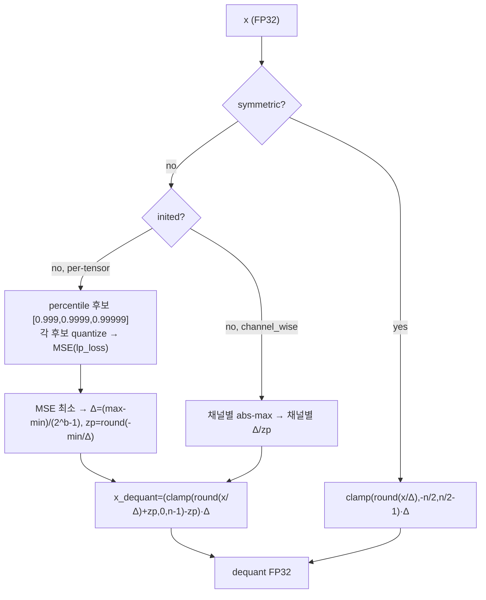
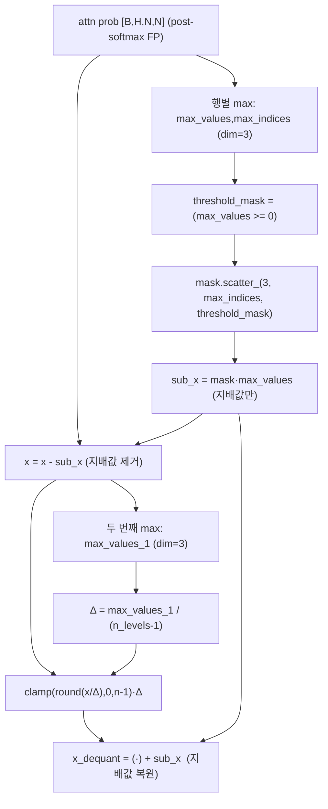
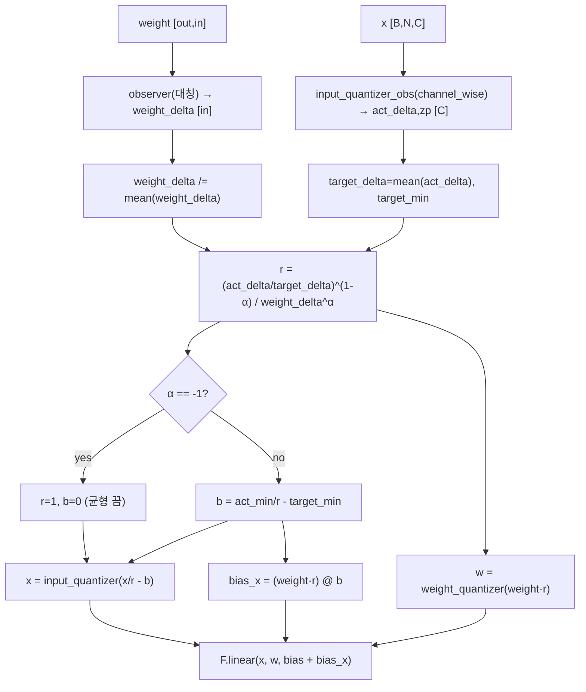
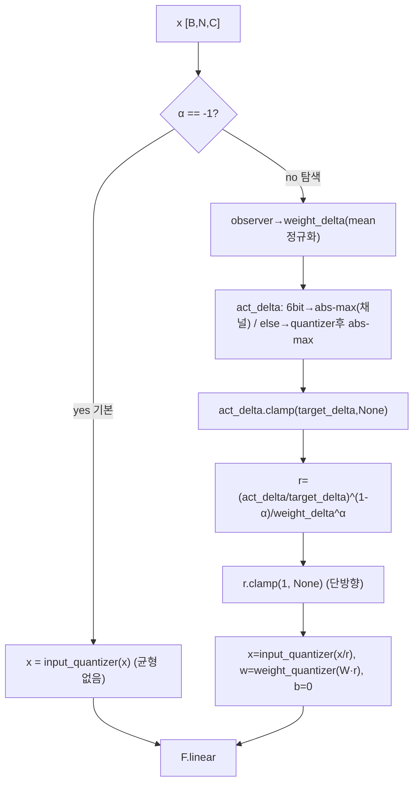
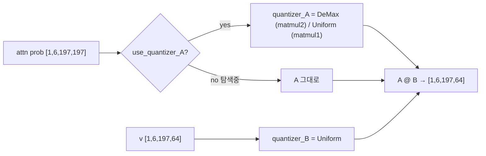
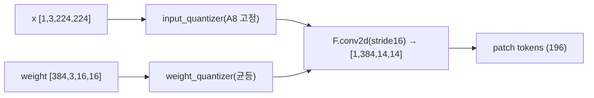
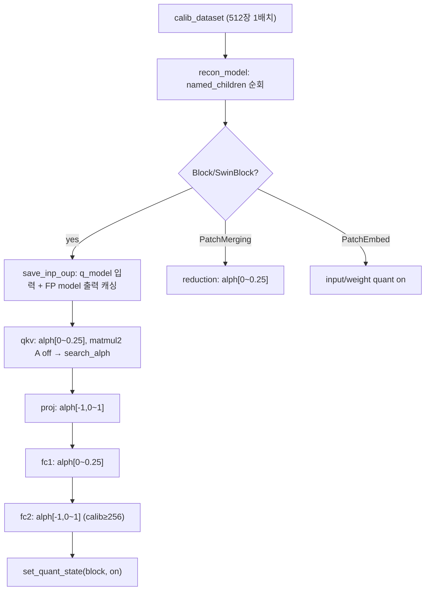

# UQ-ViT 모듈 통합 가이드 (S-PyTorch)

> 1차 요약: [`../UQ-ViT.md`](../UQ-ViT.md) — 본 문서는 그 요약을 모듈 단위로 심화·검증한 통합 가이드다.
> 분석 대상: `\\wsl.localhost\ubuntu-24.04\home\user\project\PRJXR-HBTXR\REF\ViT-Quantization\UQ-ViT`
> 작성 원칙: 실제 소스 Read 후 `파일:라인` 근거 표기. 라인 근거 없는 추론은 "추정", 코드로 확인 불가는 "확인 불가"로 명시.
> 형제 가이드(`REF/Analysis/ViT-Quantization/I-ViT/MODULE_GUIDE.md`)의 6요소 구조와 동형. HW 지표는 **S-PyTorch 수치 규약**(params/FLOPs/activation memory/비트폭/observer)으로 치환.
> 모든 경로 표기에서 `classification/`은 `REF/ViT-Quantization/UQ-ViT/classification/`을 가리킨다.

---

## 0. 문서 머리말

### 0.1 UQ의 의미 — 코드로 확정
- **UQ = Uniform Quantization**(균등 양자화), **uncertainty 아님**. 근거: README 제목 *"UQ-ViT: **Harmonizing Extreme Activations with Hardware-Friendly Uniform Quantization** in Vision Transformers"* (`classification/README.md:1`, `README.md:1`). 지시문의 "uncertainty 기반" 가설은 코드/문서상 **오류**로 확정.
- **핵심 명제**: ViT의 **극단(extreme) activation = outlier**(특히 post-softmax 지배값, LayerNorm 직후 채널 outlier)를, log-quant 등 **비균등 양자화 없이 순수 균등(uniform) 양자화로 조화**시킨다 → FPGA/ASIC의 단순 정수 datapath 유지. 부제 "hardware-friendly"가 본 프로젝트 타깃과 직접 정합.
- **양자화 패러다임 = PTQ**(Post-Training Quantization). 재학습 없이 calibration 데이터로 (a) percentile+MSE scale 탐색, (b) per-layer `alph` 그리드 탐색을 수행(`test.py:119-188`). I-ViT(QAT, fake-quant 학습)와 대비되는 지점.
- **두 핵심 기법(코드 확정)**:
  1. **DeMax**(`UniformQuantizer_DeMax`, `quantizer.py:239-268`): post-softmax(attention prob)에서 **각 행의 최댓값을 분리(빼고)** 잔여를 작은 Δ로 균등 양자화 → 작은 attention 가중치 해상도 보존.
  2. **NormQuant + alph 보간**(`QuantLinear`/`QuantLinear_no_b`, `quant_modules.py:130-161,228-266`): LayerNorm 직후 Linear의 채널 outlier를 SmoothQuant식 등가변환 `r`로 weight에 흡수, `alph`로 act↔weight 분담을 보간하고 per-layer MSE로 탐색(`test.py:43-77,140-160`).
- **출처/계보**: 본 repo는 **RepQ-ViT의 classification 구현 위에 구축**됨(`README.md:13` Acknowledgment). 논문 venue/연도는 코드·README에 **명기 없음 → 확인 불가**.

### 0.2 S-PyTorch 수치 규약 (HW의 MAC lanes/scalar MACs 대체)
- **params**: 모듈 차원에서 분석적 계산. Linear `in·out (+out bias)`, Conv `Cout·Cin·Kh·Kw (+Cout)`. UQ-ViT의 양자화 모듈은 timm FP 가중치를 그대로 상속(`quant_model.py:44,56` `new_m.weight.data = m.weight.data`)하고 forward마다 fake-quant하므로 **params 개수는 FP 원본과 동일**(추가 학습 파라미터 없음). 단 NormQuant는 weight를 `weight·r`로 미리 곱해 굽는 등가변환이라(`quant_modules.py:161`) 추론 시 추가 곱 0(추정, HW 매핑 별도).
- **FLOPs/MACs**: 표준식×config. Linear MAC = `B·N·in·out`. Attention QKᵀ/AV는 `build_model.MatMul`을 통과(`build_model.py:61-63`). 대표 레이어 1개를 DeiT-S(B=1,N=197,C=384,H=6,dh=64)로 산출 후 12 block 환원. **I-ViT MODULE_GUIDE와 동일 모델·동일 차원**이라 MAC/params 절댓값은 그쪽과 일치(둘 다 `deit_small_patch16_224`).
- **activation memory**: 텐서 shape × 비트폭. UQ-ViT는 fake-quant(출력 = `dequant float`, `quantizer.py:116`)라 실제 메모리는 FP32지만, **양자화 도메인 비트폭**(W/A bits)을 "HW 환산 activation bit"로 표기 — `shape × A_bit`. 기본 W4/A4(`test.py:34-37`).
- **비트폭/observer**: 코드 직접. 기본 **W4/A4**(`--w_bits 4 --a_bits 4`, `test.py:34-37`; README 예시도 W4/A4 기본 `classification/README.md:16-17`). PatchEmbed conv 입력은 **A8 고정**(`quant_modules.py:34`). 2~8bit 지원(`quantizer.py:95`). **observer = percentile(0.999/0.9999/0.99999) 후보 + MSE 최소 선택**(`quantizer.py:158-171`) — running min/max(EMA)인 I-ViT와 근본적으로 다름.
- **양자화 형식**: activation = **per-tensor 비대칭(asymmetric affine)**(`aq_params channel_wise=False`, `test.py:114`; `forward` zero_point 사용 `quantizer.py:116`). weight = **per-channel 대칭/비대칭**(`wq_params channel_wise=True`, `test.py:113`). NormQuant observer는 **대칭**(`quant_modules.py:97,199`).
- **정확도/속도**: README 인용. 본 세션 미실행 → 측정 불가 항목은 "확인 불가".

### 0.3 운영 경로 (PTQ calibration + alph 탐색 → ImageNet 평가)
```
[timm FP 사전학습 로드] build_model(model_zoo[args.model])    (test.py:98, build_model.py:79)
   │  timm.create_model(name, pretrained=True), MatMul 래퍼 주입 (build_model.py:79-90)
   │  Attention.forward → attention_forward(matmul1/matmul2 분리)  (build_model.py:11-27)
   ▼
[calibration 데이터 수집] train_loader에서 calibrate(512)개 (test.py:106-111)
   ▼
[모듈 치환] quant_model(): Conv2d→QuantConv2d, Linear→QuantLinear/_no_b, MatMul→QuantMatMul  (quant_model.py:7-68)
   │  qkv/fc1/reduction → QuantLinear(norm_quant=True),  fc2/proj → QuantLinear_no_b(norm_quant=True)  (:50-53)
   │  matmul2(post-softmax) → demax_quant=True  (:11-12,62-63)
   ▼
[PTQ 재구성] recon_model(): 블록별 calib in/FP out 수집 후 레이어별 alph 그리드 탐색  (test.py:119-176)
   │  qkv:[0~0.25], proj:[-1,0~1], fc1:[0~0.25], fc2:[-1,0~1] (MSE 최소)  (test.py:142-160)
   ▼
[전체 양자화 ON + 1배치 calibration forward]  (test.py:177-182)
   ▼
[ImageNet 평가] validate(): Top-1/5  (test.py:186-238)
```
- 타깃 디바이스: **CUDA GPU 전제** — `args.device default="cuda"`(`test.py:29`), `.to(x.device)` 다수(`quant_modules.py:148,150,176`), `torch.cuda.manual_seed`(`utils.py:9`), `torch.cuda.empty_cache`(`utils.py:71`). CPU 단독 실행은 코드상 가능성 있으나 미검증 → **확인 불가**.

### 0.4 모델 / 데이터셋 / 정확도 (README 인용)
| Model | FP32(README) | W4/A4 | W6/A6 | 근거 |
|---|---|---|---|---|
| ViT-S | 81.39 | 68.34 | 80.71 | `classification/README.md:32` |
| ViT-B | 84.54 | 72.07 | 83.81 | `:33` |
| DeiT-T | 72.21 | 59.71 | 71.17 | `:34` |
| **DeiT-S(대표)** | **79.85** | **72.13** | **79.07** | `:35` |
| DeiT-B | 81.80 | 76.59 | 81.45 | `:36` |
| Swin-S | 83.23 | 79.93 | 82.82 | `:37` |
| Swin-B | 85.27 | 81.96 | 84.99 | `:38` |
- 데이터셋: **ImageNet (ILSVRC, ImageFolder train/val)** `--dataset`, 224×224 BICUBIC center-crop(`build_dataset.py:30-33,55-81`), 정규화는 모델군별(deit/swin: ImageNet mean/std, crop 0.875/0.9; vit: 0.5/0.5, crop 0.9)(`build_dataset.py:11-22`).
- calibration: **calibrate=512, calib-batchsize=512** 기본(`test.py:21-24`) → 사실상 **1배치(512장)** 로 alph 탐색·scale 결정. val-batchsize=512(`:25`).
- 속도(latency): repo에 지연/처리량 측정 코드 없음 → **확인 불가**.
- timm 버전: **0.4.12 권장**(`README.md:4`).

> 1차 요약 대비 정정: ① W6/A6은 "FP 근접"이라기보다 **모델별 격차 존재**(DeiT-S 79.07 vs FP 79.85 = -0.78). ② DeiT-B FP는 81.80(요약 81.85과 약간 다름, README 기준 81.80). ③ Swin-S(83.23/79.93/82.82)는 요약에 누락. ④ **RepQ-ViT fork**(`README.md:13`)는 요약 미언급. ⑤ 1차 요약의 명령 인자 `--w_bit/--a_bit`는 실제 `--w_bits/--a_bits`(`test.py:34-37`).

---

## 1. Repo / Layer 개요

UQ-ViT = ViT/DeiT/Swin **PTQ 균등 양자화** 프레임워크. timm 모델을 로드 → MatMul 래퍼 주입 → 양자화 모듈 치환 → calibration으로 **percentile+MSE scale**과 **per-layer alph(SmoothQuant 보간)** 탐색 → 평가. 자체 소스는 `classification/quant/`의 4개 .py가 핵심이고, 모델 정의·DataLoader·timm Block은 **timm을 그대로 임포트**(`test.py:9-10`, `build_model.py:5-8`).

### 1.1 자체 소스 vs 외부 프레임워크 vs 제외

| 구분 | 파일(자체 소스) | 역할 |
|---|---|---|
| **양자화기** ★핵심 | `classification/quant/quantizer.py` | UniformQuantizer(percentile+MSE), UniformQuantizer_DeMax(극단값 분리), percentile 헬퍼, lp_loss |
| **양자화 레이어** ★핵심 | `classification/quant/quant_modules.py` | QuantConv2d/QuantLinear/QuantLinear_no_b/QuantMatMul + NormQuant(r/b/alph) |
| **모듈 치환** | `classification/quant/quant_model.py` | quant_model(이름 매칭 치환), set_quant_state/set_initquant_state |
| **양자화 패키지** | `classification/quant/__init__.py` | 공개 심볼 export(미열람 — 확인 불가) |
| **엔트리/PTQ** | `classification/test.py` | search_alph, recon_model, main, validate, accuracy |
| **모델 빌드** | `classification/utils/build_model.py` | MatMul 래퍼, attention_forward/window_attention_forward, build_model |
| **데이터/유틸** | `classification/utils/build_dataset.py` | ImageNet ImageFolder DataLoader, transform |
| | `classification/utils/utils.py` | seed, DataSaverHook, save_inp_oup_data(블록 in/out 캐싱) |

### 1.2 forward 진입점
표준 timm `VisionTransformer.forward`(timm 내부). 단 **Attention.forward만 monkey-patch**: `build_model`이 모든 `timm Attention`/`WindowAttention`에 `matmul1`/`matmul2`(MatMul 모듈)를 주입하고 forward를 `attention_forward`로 교체(`build_model.py:82-90`). 따라서 QKᵀ=`matmul1(q,kᵀ)`, attn·V=`matmul2(attn,v)`가 양자화 가능한 모듈 경계로 노출(`build_model.py:17,23`). softmax는 timm 표준 FP softmax(`attn.softmax(dim=-1)`, `build_model.py:18`) — **I-ViT의 정수 Shiftmax와 달리 softmax 자체는 FP 유지**, 대신 그 출력을 DeMax로 양자화.

### 1.3 제외 (지시에 따라 이름만 표기, 미분석)
- **외부 프레임워크(커스텀 아님)**: `timm.create_model`, `timm.models.vision_transformer.{Block,PatchEmbed,Attention}`, `timm.models.swin_transformer.{SwinTransformerBlock,PatchMerging,WindowAttention}`(`test.py:9-10`, `build_model.py:6-8`). timm 사전학습 체크포인트(pretrained=True, 가중치만 로드).
- **제외 디렉토리**: `detection/mmdet/*` 전체 — **MMDetection 외부 프레임워크**(검출 태스크). 지시상 제외, 이름만 표기.
- **미열람(확인 불가)**: `classification/quant/__init__.py` export 목록(quant 패키지 심볼), `detection/*` 일체.

### 1.4 대표 모델 레이어 구성 (DeiT-S, `deit_small_patch16_224`)
timm DeiT-S: PatchEmbed(Conv 16×16 s16, 3→384) → cls/pos → Block×12 → norm → head. 치환 후 1 Block당: QuantLinear(qkv, norm_quant), QuantLinear_no_b(proj, norm_quant), QuantMatMul×2(matmul1 일반 / matmul2 DeMax), QuantLinear(fc1, norm_quant), QuantLinear_no_b(fc2, norm_quant)(`quant_model.py:50-66`). PatchEmbed proj → QuantConv2d(A8 입력)(`quant_modules.py:34`).

---

## 2. 모듈: 균등 양자화기 — `quantizer.py` (UniformQuantizer) ★핵심

### 2.1 역할 + 상위/하위
- **역할**: FP 텐서를 **균등 affine(비대칭) 또는 대칭 양자화**하는 fake-quant 모듈. 첫 forward에서 scale(Δ)/zero_point를 calibration으로 결정 후 캐시(`inited` 플래그). per-tensor는 **percentile 3후보 × MSE 최소**로 outlier-robust scale 선택.
- **상위**: `QuantConv2d`/`QuantLinear`/`QuantLinear_no_b`/`QuantMatMul`의 `input_quantizer`/`weight_quantizer`/`observer`(`quant_modules.py:35-36,91-98,192-200,296-297`). **하위**: `calculate_quantiles`(`quantizer.py:6-31`), `lp_loss`(`:75-82`).

### 2.2 데이터플로우 (텐서 shape 흐름)


### 2.3 forward call stack
`QuantLinear.forward`(`quant_modules.py:160`) → `UniformQuantizer.__call__`(`quantizer.py:109`) → `init_quantization_scale`(`:120`, 최초 1회) → `calculate_quantiles`(`:160`) → `quantize`(`:165`) → `lp_loss`(`:166`) → fake-quant 식(`:116`).

### 2.4 대표 코드 위치
`quantizer.py`: 클래스 `:84-235`, `forward` `:109-117`, percentile+MSE per-tensor `:153-171`, GELU 하한 처리 `:161-163`, channel_wise `:122-152`, 대칭 경로 `:179-235`.

### 2.5 대표 코드 블록
```python
# quantizer.py:116  비대칭 fake-quant (affine)
x_dequant = (torch.clamp(torch.round(x / self.delta) + self.zero_point, 0, self.n_levels - 1) - self.zero_point) * self.delta
```
→ `n_levels=2^b`(`:97`). 비대칭이라 zero_point ≠ 0 → HW에서 zero-point 가감 필요(대칭인 I-ViT와 차이).

```python
# quantizer.py:158-171  per-tensor: percentile 3후보 × MSE 최소 (outlier-robust)
pcts = [0.999, 0.9999, 0.99999]
for pct in pcts:
    new_max, new_min = calculate_quantiles(x, pct)
    if (new_max - new_min) < 1e-5:           # GELU 출력 등 범위≈0
        new_max = 0; new_min = torch.tensor(GELU_MIN)   # GELU 음수 하한 -0.16997
    x_q = self.quantize(x_clone, new_max, new_min)
    score = lp_loss(x_clone, x_q, p=2, reduction='all')
    if score < best_score:
        best_score = score
        delta = (new_max - new_min) / (2 ** self.n_bits - 1)
        zero_point = (- new_min / delta).round()
```
→ **outlier에 Δ가 끌려가지 않도록** 상위 0.1~0.001% 분위를 잘라낸 후보들을 MSE로 비교. `GELU_MIN=-0.16997`(`:4`)은 GELU의 전역 최솟값으로 정수 격자 하한 고정.

```python
# quantizer.py:179-184  대칭 양자화 (zero-point 없음, observer 용)
def forward_symmetric(self, x):
    if not self.inited:
        self.delta = self.init_quantization_scale_symmetric(x, self.channel_wise, None)
        self.inited = True
    return torch.clamp(torch.round(x / self.delta), -self.n_levels/2, self.n_levels/2 - 1) * self.delta
```
→ NormQuant의 weight `observer`가 `symmetric=True`로 사용(`quant_modules.py:97`). 대칭 Δ = `2·abs_m/(2^b-1)`(`:229`).

### 2.6 연산·수치표현 분해 + 정량
- **양자화 방식**: per-tensor 비대칭(affine, zp≠0) 또는 channel_wise(채널별 Δ/zp). 대칭 옵션 존재. scale 결정 = percentile×MSE(per-tensor) / abs-max(channel).
- **scale/zp**: `Δ=(max-min)/(2^b-1)`, `zp=round(-min/Δ)`(`:169-170`). 대칭은 `Δ=2·abs_m/(2^b-1)`, zp=0(`:229`).
- **비트폭**: 2~8bit(`:95`). 기본 W4/A4, PatchEmbed 입력 A8.
- **params**: 0 학습 파라미터(Δ/zp는 calibration로 결정되는 buffer 성격, nn.Parameter 아님).
- **FLOPs(calibration 비용)**: per-tensor scale 결정 시 **후보 3개 × (quantize O(N) + lp_loss O(N))** = 6N 원소연산/레이어, 최초 1회. 대표 qkv weight(384×1152=442K) = ~2.7M 원소연산(1회). alph 탐색 중 재초기화로 반복(2.5절·test.py 참조).
- **activation bit**: 출력 dequant FP32, HW 환산 비트 = b. attention/Linear 입력은 A4(기본).
- **병목/주의**: `calculate_quantiles`가 `torch.quantile` 실패 시 `topk` → `np.percentile`(CPU 왕복) fallback(`quantizer.py:14-29`) → 대용량 텐서에서 CPU 왕복 가능(QAT 아닌 PTQ라 1회성, I-ViT의 batch_frexp 매 forward 병목보다는 경미).

---

## 3. 모듈: 극단값 분리 양자화 — `quantizer.py` (UniformQuantizer_DeMax) ★핵심·UQ-ViT 고유

### 3.1 역할 + 상위/하위
- **역할**: **post-softmax attention prob**(`matmul2`의 A입력) 전용. softmax 출력은 행마다 큰 확률 1개 + 다수 작은 값 → **각 행 max를 분리(빼고)** 잔여를 **두 번째 max** 기준 작은 Δ로 균등 양자화 → dequant 후 max 복원. 작은 attention 가중치의 해상도를 outlier(지배 확률)로부터 보호.
- **상위**: `QuantMatMul.quantizer_A`(matmul2일 때, `quant_modules.py:292-294`). **하위**: 내부 `UniformQuantizer`(미사용 보조, `quantizer.py:249`), torch max/scatter.

### 3.2 데이터플로우 (텐서 shape 흐름, DeiT-S attn)


### 3.3 forward call stack
`QuantMatMul.forward`(`quant_modules.py:316`) → `UniformQuantizer_DeMax.forward`(`quantizer.py:251`) → `init_quantization_uniform`(`:255-268`) → torch.max/scatter_/clamp.

### 3.4 대표 코드 위치
`quantizer.py`: 클래스 `:239-268`, `init_quantization_uniform` `:255-268`, max 분리 `:258-264`, 두 번째 max로 Δ `:265-266`, dequant+복원 `:267`.

### 3.5 대표 코드 블록
```python
# quantizer.py:256-267  DeMax: 행별 max 분리 → 잔여 균등 양자화 → max 복원
B,H,N,_ = x.shape
self.zero_point = 0
max_values, max_indices = torch.max(x, dim=3, keepdim=True)
threshold_mask = (max_values >= 0)                        # 음수 max는 분리 안 함
mask = torch.zeros_like(x, dtype=torch.bool)
mask.scatter_(3, max_indices, threshold_mask)             # 행 max 위치만 True
sub_x = mask.float() * max_values.expand_as(x)            # 지배값 텐서
x = x - sub_x                                             # 지배값 제거
max_values_1, _ = torch.max(x, dim=3, keepdim=True)       # 두 번째 max
self.delta = max_values_1 / (self.n_levels - 1)           # 작은 Δ
x_dequant = (torch.clamp(torch.round(x / self.delta) + self.zero_point, 0, self.n_levels - 1)
             - self.zero_point) * self.delta + sub_x       # 양자화 후 지배값 복원
```
→ Δ가 **두 번째로 큰 값** 기준이라, softmax 지배 확률(≈1)을 제거한 뒤의 작은 값들에 비트 해상도를 집중. `zero_point=0`(`:257`)으로 단순 비대칭(zp 무시) 처리.

### 3.6 연산·수치표현 분해 + 정량 (DeiT-S, attn [1,6,197,197])
- **양자화 방식**: 행별 max 분리 + 잔여 균등(uniform). Δ는 행별(`max_values_1` shape `[B,H,N,1]`) → **per-row(토큰별) Δ**. zp=0.
- **비트폭**: A4 기본(matmul2 input_quant, `test.py:114`로 a_bits=4 전파). 2~8bit.
- **params**: 0.
- **FLOPs/block**: max ×2(dim=-1, 각 H·N²=233K), scatter, sub, round/clamp on H·N²=233K → ≈ **~5·233K ≈ 1.2M 원소연산/block** (forward마다, 단 PTQ라 평가 1패스). ×12.
- **activation memory**: attn prob [1,6,197,197] A4 = 6×197²×0.5byte ≈ **116 KB**(dequant FP는 466 KB). 한 block 내 최대 단일 활성.
- **시사**: "행별 max 추출기 + 잔여 균등 양자화 + max 복원"은 attention·V 행렬곱 앞단의 **소형 max-extractor + uniform PE**로 직접 합성 가능. I-ViT의 정수 Shiftmax(softmax 자체를 정수화)와 상보적 — UQ-ViT는 softmax는 FP로 두고 **그 출력만** 균등 양자화로 길들임.

---

## 4. 모듈: NormQuant Linear (bias 있음) — `quant_modules.py` (QuantLinear) ★핵심

### 4.1 역할 + 상위/하위
- **역할**: LayerNorm 직후 Linear(qkv/fc1/reduction). **observer 3종**(weight 대칭 observer, act observer, 실제 input quantizer)으로 채널별 Δ를 측정해 **SmoothQuant식 등가 스케일 `r`**을 계산, activation outlier를 weight로 이동(`x/r`, `W·r`). `alph`로 act↔weight 분담 보간. bias 보정항 `bias_x` 추가.
- **상위**: `quant_model`이 `qkv/fc1/reduction` 이름 매칭으로 치환(`quant_model.py:50-51`). **하위**: `UniformQuantizer`(observer/input/weight quantizer), `F.linear`.

### 4.2 데이터플로우 (텐서 shape 흐름)


### 4.3 forward call stack
`attention_forward`(`build_model.py:13`, qkv) → `QuantLinear.forward`(`quant_modules.py:123`) → norm_quant 분기(`:130`) → observer/act observer 측정(`:135-140`) → `r`/`b` 계산(`:146-153`) → `input_quantizer`(`:160`) → `weight_quantizer`(`:161`) → `F.linear`(`:176`).

### 4.4 대표 코드 위치
`quant_modules.py`: 클래스 `:79-177`, observer 3종 생성 `:91-98`, NormQuant 측정+r/b `:133-158`, 적용 `:160-161`, 출력 `:176`.

### 4.5 대표 코드 블록
```python
# quant_modules.py:135-146  observer로 weight/act Δ 측정 → SmoothQuant식 r
_ = self.observer(self.weight.data.transpose(0,1).contiguous()) if not self.observer.inited else None
weight_delta = self.observer.delta.reshape(-1)
weight_delta = weight_delta / torch.mean(weight_delta)        # mean 정규화
_ = self.input_quantizer_obs(x) if not self.input_quantizer_obs.inited else None
act_delta = self.input_quantizer_obs.delta.reshape(-1)        # 채널별 act Δ
act_zero_point = self.input_quantizer_obs.zero_point.reshape(-1)
act_min = -act_zero_point * act_delta
target_delta = torch.mean(act_delta)                          # per-tensor 목표
target_min = -torch.mean(act_zero_point) * target_delta
self.r = (act_delta / target_delta)**(1 - self.alph) / (weight_delta)**self.alph   # ★SmoothQuant 보간
```
→ `r`은 **채널별 균형 인자**. `alph=0`이면 `r=act_delta/target_delta`(activation만 균형), `alph=1`이면 `r=1/weight_delta`(weight만), 사이값이면 보간. activation의 채널 outlier를 weight로 떠넘겨 act를 per-tensor 균등 양자화하기 쉽게 만듦.

```python
# quant_modules.py:148-161  alph==-1이면 균형 끔, 아니면 등가변환 적용
self.r = torch.ones_like(self.r).to(x.device) if self.alph == -1 else self.r
self.b = act_min / self.r - target_min
self.b = torch.zeros_like(self.b).to(x.device) if self.alph == -1 else self.b
self.input_quantizer.delta = target_delta                     # per-tensor Δ 강제
self.input_quantizer.zero_point = target_zero_point
bias = torch.mm(self.weight * self.r.reshape(-1), self.b.reshape(-1,1)).reshape(-1)
self.bias_x = bias                                            # b 이동에 따른 bias 보정
...
x = self.input_quantizer(x/self.r - self.b)                  # act 등가변환
w = self.weight_quantizer(self.weight*self.r.reshape(-1))    # weight에 outlier 흡수
```
→ `x/r - b`와 `W·r`, `bias_x=(W·r)·b`는 **수학적 등가**(`(W·r)(x/r - b) + (W·r)b = W·x`). 즉 출력 불변이면서 양자화 격자만 유리하게 재배치.

### 4.6 연산·수치표현 분해 + 정량 (DeiT-S, B=1, N=197)
- **양자화 방식**: weight per-channel(channel_wise=True) + activation per-tensor(target_delta 강제) 비대칭. NormQuant 등가변환 `r`(per-channel), bias 보정.
- **scale/zp**: act → target_delta/target_zero_point(per-tensor); weight → channel별 Δ. `r`은 calibration로 1회 결정.
- **비트폭**: W4/A4 기본.
- **params** (DeiT-S 1 block, C=384, NormQuant 대상 = qkv, fc1):
  - qkv: 384×1152 + 1152 = **443,520**
  - fc1: 384×1536 + 1536 = **591,360**
  - (proj/fc2는 5장 QuantLinear_no_b) — Linear params/block 합은 I-ViT와 동일(전체 ~21.3M, ×12).
- **MACs/block** (B=1, N=197): qkv 87.1M, fc1 116.2M (proj 29.0M, fc2 116.2M은 §5). Linear MAC/block ≈ **348.5M**, ×12 ≈ **4.18G** (I-ViT MODULE_GUIDE와 동일 — 동일 DeiT-S).
- **calibration 비용**: alph 후보 [0,0.05,0.1,0.15,0.2,0.25](qkv/fc1, 6개) × 블록 forward 1회씩 → 레이어당 ~6 forward(`test.py:142,155`). recon_model이 블록별 in/out 캐싱(`utils.py:42-72`).
- **activation bit**: 입력 A4(또는 PatchEmbed 후 A8) → dequant FP. NormQuant로 act 동적범위 압축 → A4에서도 정확도 유지가 핵심 기여.

---

## 5. 모듈: NormQuant Linear (bias 없음·단방향) — `quant_modules.py` (QuantLinear_no_b)

### 5.1 역할 + 상위/하위
- **역할**: proj/fc2용 NormQuant Linear. **`alph=-1` 기본**(`:207`)으로 균형을 끄는 경로가 디폴트이나, alph 탐색 시 `r`을 **clamp(1, None)** 으로 1 이상만 허용 → **activation→weight 단방향 이동**(weight→act 역방향 금지). bias 보정 없이(`b=0`) 스케일만 이동. act_delta를 채널 abs-max로 직접 산출(6bit 분기 포함).
- **상위**: `quant_model`이 `fc2`/`proj` 이름 매칭으로 치환(`quant_model.py:52-53`). **하위**: `UniformQuantizer`, `F.linear`.

### 5.2 데이터플로우 (텐서 shape 흐름)


### 5.3 forward call stack
`attention_forward`(`build_model.py:25`, proj) / `Mlp.forward`(timm, fc2) → `QuantLinear_no_b.forward`(`quant_modules.py:223`) → alph 분기(`:234`) → observer/act_delta(`:239-250`) → `r.clamp(1,None)`(`:252`) → `input_quantizer`/`weight_quantizer`(`:262-266`) → `F.linear`(`:281`).

### 5.4 대표 코드 위치
`quant_modules.py`: 클래스 `:179-282`, alph=-1 기본 `:207`, act_delta 6bit 분기 `:242-246`, clamp/단방향 `:248-252`, 적용 `:261-266`.

### 5.5 대표 코드 블록
```python
# quant_modules.py:242-252  act_delta(6bit 특수처리) + 단방향 r
if self.input_quantizer_obs.n_bits == 6:
    act_delta = x.reshape(-1, x.shape[-1]).abs().max(dim=0)[0].reshape(-1)   # 6bit: 직접 abs-max
else:
    _ = self.input_quantizer_obs(x)
    act_delta = (_.reshape(-1, x.shape[-1])).abs().max(dim=0)[0].reshape(-1)
act_delta = act_delta.clamp(0, None)
target_delta = torch.mean(act_delta)
act_delta = act_delta.clamp(target_delta, None)            # target 미만 채널은 target으로
self.r = (act_delta / target_delta)**(1 - self.alph) / (weight_delta)**self.alph
self.r = self.r.clamp(1, None)                            # ★ r≥1: activation→weight 단방향만
```
→ proj/fc2 입력은 activation outlier가 한쪽으로 치우쳐 **역방향 이동이 해로울 수 있어** `r≥1`로 제한. `b=0`(`:254`)이라 bias 보정 없이 scale만 이동.

### 5.6 연산·수치표현 분해 + 정량 (DeiT-S, B=1, N=197)
- **양자화 방식**: NormQuant 단방향(r≥1), bias 보정 없음. 기본 alph=-1(균형 끔)이나 탐색으로 [-1,0~1] 중 선택(`test.py:150,159`).
- **비트폭**: W4/A4. 6bit일 때 act_delta 산출 경로 분기(`:242`).
- **params/block**: proj 384×384+384=**147,840**, fc2 1536×384+384=**590,208**.
- **MACs/block**: proj 197×384×384≈**29.0M**, fc2 197×1536×384≈**116.2M**.
- **calibration 비용**: alph 후보 [-1,0,0.1,...,1] = **12개**(proj/fc2, calib-batchsize≥256일 때, `test.py:150,159`) → 레이어당 ~12 forward. 256 미만이면 fc2는 [-1]만(`:159`).
- **activation bit**: 입력 A4 → dequant FP.

---

## 6. 모듈: 정수 행렬곱 양자화 — `quant_modules.py` (QuantMatMul)

### 6.1 역할 + 상위/하위
- **역할**: Attention의 QKᵀ(matmul1), attn·V(matmul2)를 양자화. A/B 각각 quantizer. **matmul2(post-softmax)는 A입력에 DeMax 양자화기** 주입(`input_quant_params`에 `demax_quant` 키), matmul1은 일반 UniformQuantizer. `use_quantizer_A`로 A 양자화 on/off(alph 탐색 중 임시 off).
- **상위**: `quant_model`이 `MatMul`(build_model 래퍼) 치환(`quant_model.py:59-66`); matmul1/2 이름으로 분기. **하위**: `UniformQuantizer`/`UniformQuantizer_DeMax`.

### 6.2 데이터플로우 (텐서 shape 흐름, DeiT-S matmul2)


### 6.3 forward call stack
`attention_forward`(`build_model.py:23`, matmul2) → `QuantMatMul.forward`(`quant_modules.py:313`) → `quantizer_A`(DeMax, `:316`) + `quantizer_B`(`:317`) → `A @ B`(`:321`).

### 6.4 대표 코드 위치
`quant_modules.py`: 클래스 `:284-322`, demax_quant 분기 `:292-296`, forward `:313-322`. 치환 규칙 `quant_model.py:59-66`.

### 6.5 대표 코드 블록
```python
# quant_modules.py:292-297  matmul2면 A입력에 DeMax, B는 항상 일반
if 'demax_quant' in input_quant_params_matmul:
    input_quant_params_matmul.pop('demax_quant')
    self.quantizer_A = UniformQuantizer_DeMax(**input_quant_params_matmul)   # post-softmax 전용
else:
    self.quantizer_A = UniformQuantizer(**input_quant_params_matmul)         # matmul1(QKᵀ)
self.quantizer_B = UniformQuantizer(**input_quant_params_matmul)
```

```python
# quant_modules.py:313-321  A/B 양자화 후 행렬곱
def forward(self, A, B):
    if self.use_input_quant:
        if self.use_quantizer_A:
            A = self.quantizer_A(A); B = self.quantizer_B(B)
        else:
            B = self.quantizer_B(B)          # alph 탐색 중 A는 통과
    return A @ B
```
→ matmul1: Q,K를 각각 균등 양자화 후 QKᵀ. matmul2: attn prob를 DeMax로, V를 균등으로 양자화 후 곱. `use_quantizer_A=False`는 recon_model에서 qkv alph 탐색 시 matmul2 A를 끄는 용도(`test.py:143-146`).

### 6.6 연산·수치표현 분해 + 정량 (DeiT-S, B=1, H=6, N=197, dh=64)
- **양자화 방식**: A/B per-tensor 균등(matmul1) / A는 DeMax per-row + B 균등(matmul2). dequant 후 `@`(FP 누산, fake-quant).
- **비트폭**: A4 기본(input_quant_params a_bits).
- **params**: 0.
- **MACs/block**: QKᵀ H·N²·dh=6×197²×64≈**14.9M**, attn·V≈**14.9M** → matmul MAC/block ≈ **29.8M**, ×12 ≈ **358M**(I-ViT와 동일).
- **activation memory**: attn 행렬 [1,6,197,197] — DeMax 양자화 A4 ≈ 116 KB(dequant FP 466 KB).
- **시사**: matmul2 A에만 DeMax를 적용하는 비대칭 설계 → FPGA에서 **두 matmul의 PE를 다르게**(QKᵀ: 균등 입력 / AV: DeMax 입력) 구성. N² 활성이 메모리 지배 → 타일링·스트리밍 필요(HG-PIPE류).

---

## 7. 모듈: 정수 Conv (PatchEmbed) — `quant_modules.py` (QuantConv2d)

### 7.1 역할 + 상위/하위
- **역할**: PatchEmbed 16×16 stride16 conv. **입력 A8 고정**(다른 레이어 A4와 달리), weight는 균등 양자화. NormQuant 없음(LayerNorm 직후가 아님).
- **상위**: `quant_model`이 모든 `nn.Conv2d` 치환(`quant_model.py:29-46`). **하위**: `UniformQuantizer`, `F.conv2d`.

### 7.2 데이터플로우 (텐서 shape 흐름, DeiT-S)


### 7.3 forward call stack
timm `PatchEmbed.forward` → `QuantConv2d.forward`(`quant_modules.py:55`) → `input_quantizer`(A8, `:60`) → `weight_quantizer`(`:63`) → `F.conv2d`(`:67-75`).

### 7.4 대표 코드 위치
`quant_modules.py`: 클래스 `:9-76`, **A8 고정** `:33-34`, forward `:55-76`.

### 7.5 대표 코드 블록
```python
# quant_modules.py:33-35  PatchEmbed 입력만 8bit 고정
input_quant_params_conv = deepcopy(input_quant_params)
input_quant_params_conv['n_bits'] = 8          # ★ 입력 이미지는 A8 (A4 아님)
self.input_quantizer = UniformQuantizer(**input_quant_params_conv)
```
→ 입력 이미지 픽셀 분포는 저비트(A4)에 민감 → 첫 레이어만 A8로 안전 마진(low-bit ViT PTQ의 표준 관행, RepQ-ViT 계열).

### 7.6 연산·수치표현 분해 + 정량 (DeiT-S)
- **양자화 방식**: 입력 A8 균등(per-tensor), weight 균등(channel_wise). NormQuant 미적용.
- **params**: 384×3×16×16 + 384 = **295,296**.
- **MACs**: 196 패치 × (384×3×16×16) = 196×294,912 ≈ **57.8M**(전체 1회).
- **activation memory**: 출력 [1,384,14,14]=[1,196+1,384] A4 ≈ 37.8 KB.
- **시사**: 첫 레이어 A8/나머지 A4의 **혼합 비트** → FPGA에서 입력단 PE만 8bit, 본체 4bit 구성의 근거.

---

## 8. 모듈: PTQ 파이프라인 — `test.py` (search_alph + recon_model)

### 8.1 역할 + 상위/하위
- **역할**: 양자화 모델의 **per-layer alph 그리드 탐색**(SmoothQuant 보간량 최적화)을 calibration 데이터로 수행. 블록별로 양자화 입력과 **FP 원본 출력**을 캐싱, alph 후보별 양자화 출력의 MSE(lp_loss)를 최소화하는 alph 선택.
- **상위**: `main`(`test.py:176`). **하위**: `save_inp_oup_data`(`utils.py:42`), `set_quant_state`/`set_initquant_state`(`quant_model.py:71-81`), `lp_loss`(`quantizer.py:75`).

### 8.2 데이터플로우


### 8.3 forward call stack
`main`(`test.py:176`) → `recon_model`(`:120`) → Block 분기(`:129`) → `save_inp_oup_data`(`:130-131`) → `search_alph`(`:144,151,156,160`) → `child_module(input_data)` + `lp_loss`(`:55-56`).

### 8.4 대표 코드 위치
`test.py`: `search_alph` `:43-77`, `recon_model` `:119-176`, 레이어별 alph 후보 `:142,150,155,159`, 최종 calibration `:178-182`, `validate` `:190-238`.

### 8.5 대표 코드 블록
```python
# test.py:50-60  alph 후보 중 블록출력 MSE 최소 선택
for alph in alph_values:
    search_module.alph = alph
    for module in modules:
        set_initquant_state(module, False)        # 재초기화 → 새 alph로 r/b 재계산
    output = child_module(input_data)
    score = lp_loss(output, output_data, p=2, reduction='all')   # vs FP 출력
    if score < best_score:
        best_score = score; best_alph = alph
search_module.alph = best_alph
```

```python
# test.py:142-160  레이어별 alph 후보 (qkv/fc1 좁게, proj/fc2 넓게)
alph_values = [0.0, 0.05, 0.1, 0.15, 0.2, 0.25]              # qkv
matmul2.use_quantizer_A = False                              # qkv 탐색 중 post-softmax A 끔
search_alph(alph_values, child_module, input_data, output_data, name, qkv, [qkv, matmul1, matmul2])
...
alph_values = [-1, 0.0, 0.1, ..., 1]                        # proj (단방향 가능)
search_alph(alph_values, ..., proj, [proj])
alph_values = [0.0, 0.05, ..., 0.25]                        # fc1
alph_values = [-1, 0.0, ..., 1] if args.calib_batchsize >=256 else [-1]   # fc2
```
→ qkv/fc1은 양방향 작은 보간만(outlier 완만), proj/fc2는 단방향 포함 넓은 탐색(QuantLinear_no_b의 r≥1과 연동). 블록 단위 reconstruction은 RepQ-ViT/BRECQ 계열 PTQ 관행.

### 8.6 연산·수치표현 분해 + 정량
- **calibration 데이터**: 512장 1배치(`test.py:21-24,110`).
- **alph forward 횟수/block**: qkv 6 + proj 12 + fc1 6 + fc2 12 = **~36 블록 forward/block**(calib≥256), ×12 block ≈ 432 블록 forward(추정, 라인 근거 후보 개수 합산). PTQ 전체 비용의 주 항목.
- **params**: 0(탐색 코드).
- **시사**: alph는 **오프라인 결정 상수** → 추론 시 weight에 `r` 미리 곱해 굽고 act는 per-tensor 균등 → **추론 추가 연산 0**. FPGA에 weight 굽기 전 적용하면 datapath 단순화(uniform per-tensor act).

---

## 9. 한눈에 보기 (모듈 요약표)

| # | 모듈 | 파일:라인 | 핵심 기법 | 비트(기본) | params(0아니면) | 대표 MAC/메모리(DeiT-S/block) |
|---|---|---|---|---|---|---|
| 2 | UniformQuantizer | `quantizer.py:84-235` | percentile3+MSE scale, asym/sym | 2~8(W4/A4) | 0 | calib ~6N/레이어 |
| 3 | UniformQuantizer_DeMax | `quantizer.py:239-268` | 행별 max 분리+잔여 균등 | A4 | 0 | ~1.2M op; attn 116KB(A4) |
| 4 | QuantLinear(NormQuant) | `quant_modules.py:79-177` | SmoothQuant r(α 보간)+bias 보정 | W4/A4 | qkv443K+fc1591K | qkv87.1M+fc1116.2M MAC |
| 5 | QuantLinear_no_b | `quant_modules.py:179-282` | NormQuant 단방향(r≥1), b=0 | W4/A4 | proj148K+fc2590K | proj29M+fc2116.2M MAC |
| 6 | QuantMatMul | `quant_modules.py:284-322` | matmul2 A=DeMax / matmul1 균등 | A4 | 0 | 29.8M MAC |
| 7 | QuantConv2d(PatchEmbed) | `quant_modules.py:9-76` | 입력 A8 고정, weight 균등 | A8/W4 | 295K | 57.8M MAC(전체) |
| 8 | search_alph/recon_model | `test.py:43-77,119-176` | per-layer α 그리드+블록 MSE | — | 0 | ~36 fwd/block(calib) |

- **DeiT-S 합계(I-ViT MODULE_GUIDE와 동일 모델)**: Linear params ~21.3M(×12 block + head/patch), Linear MAC/block ≈ 348.5M(×12 ≈ 4.18G), Attention matmul ≈ 29.8M/block(×12 ≈ 358M).

---

## 10. 평가 (강점·한계·검증)

### 10.1 강점
- **순수 균등(uniform) 양자화로 outlier 처리** → log-quant/비균등 없이 FPGA/ASIC 단순 정수 datapath 유지. "hardware-friendly"가 본 프로젝트와 직접 정합.
- **DeMax**: post-softmax 지배값을 비파괴적으로 분리·복원 → 저비트(A4)에서 작은 attention 가중치 해상도 보존(`quantizer.py:256-267`).
- **NormQuant+alph**: SmoothQuant식 등가변환을 per-layer 자동 튜닝, **추론 시 추가 연산 0**(weight에 흡수)(`quant_modules.py:146-161`).
- **순수 PTQ**(재학습 불필요), timm 7개 모델 지원(`test.py:82-94`). RepQ-ViT 기반 검증된 PTQ 파이프라인(`README.md:13`).

### 10.2 한계·리스크
- **논문 메타데이터 부재**: venue/연도 코드·README에 없음 → **확인 불가**.
- **timm 구조 강결합**: `qkv/proj/fc1/fc2/reduction` 이름 매칭(`quant_model.py:50-53`), timm 0.4.12 권장(`README.md:4`) → 커스텀 ViT/회귀 head엔 이름 매핑 수정 필요.
- **DeMax는 matmul2 전용**: "행별 max 1개 분리"가 softmax 분포 가정 → 일반 텐서엔 부적합(`quantizer.py:256`).
- **fake-quant PTQ**: 정수/dyadic 실행 코드 없음(출력은 dequant FP, `quantizer.py:116`). HW 매핑(정수 datapath)은 별도.
- **calibration 비용**: 레이어×alph 후보 forward 반복(§8.6, ~36 fwd/block). 단 1회성.
- **CPU 단독 실행**: `.cuda()` 직접 호출은 적으나 device default cuda → CPU 가능성 미검증, **확인 불가**.

### 10.3 1차 요약 대비 검증 결과
- **확인(일치)**: UQ=Uniform Quantization, DeMax/NormQuant(alph)/percentile+MSE 기법, 모듈 치환 규칙, PTQ 흐름.
- **정정/보강**:
  1. 정확도표 일부 수정: W6/A6은 "FP 근접"이 아니라 모델별 격차 있음(DeiT-S 79.07 vs 79.85). Swin-S(83.23/79.93/82.82) 추가. DeiT-B FP 81.80(README 기준).
  2. **RepQ-ViT fork**(`README.md:13`) 명시 — 1차 요약 미언급.
  3. 명령 인자 `--w_bits/--a_bits`(요약의 `--w_bit/--a_bit`는 부정확, `test.py:34-37`).
  4. DeMax의 `threshold_mask=(max_values>=0)` 음수 max 비분리 조건(`quantizer.py:259`) 보강.
  5. PatchEmbed 입력 **A8 고정**(`quant_modules.py:34`) — 혼합 비트 명시.
  6. QuantLinear_no_b의 **6bit act_delta 직접 abs-max 분기**(`quant_modules.py:242-246`) 보강.

---

## 11. FPGA 시사점 (HG-PIPE / XR 시선추적 — 추정)

- **"hardware-friendly uniform"이 정확히 타깃**: HG-PIPE류 가속기의 균등 정수 MAC array가 본체 → UQ-ViT의 핵심 가치(비균등 없이 outlier 처리)는 HW 제약과 **직접 정합**. log-quant 회피하며 W4/A4 정확도 확보 경로.
- **DeMax HW 매핑**: post-softmax "행별 max 추출 → 잔여 균등 양자화 → max 복원"은 attn·V 행렬곱 앞단의 **per-row max-extractor + 작은 Δ uniform PE**로 합성 가능(`quantizer.py:256-267`). I-ViT Shiftmax(정수 softmax)와 결합 시 softmax는 Shiftmax로, 그 출력 양자화는 DeMax로 분담 검토 가치(추정).
- **NormQuant = 오프라인 등가변환**: `r`을 weight에 미리 곱해 굽고 act는 per-tensor 균등 → **추론 추가 연산 0**(`quant_modules.py:161`). FPGA weight 굽기 전 적용하면 datapath가 per-tensor uniform act로 단순화 → 이상적.
- **혼합 비트(A8 입력 / A4 본체)**: 입력단 PE만 8bit, 본체 4bit 구성의 근거(`quant_modules.py:34`). FPGA 리소스 절감.
- **matmul1/matmul2 비대칭 PE**: QKᵀ는 균등 입력, AV는 DeMax 입력 → 두 행렬곱 PE를 다르게 설계(`quant_modules.py:292-297`).
- **시선추적 적용**: 순수 PTQ라 fine-tuned ViT에 재학습 없이 적용 가능. 단 timm 레이어 이름 매칭/회귀 head 처리 수정 필요(추정).
- **조합 전략(추정)**: UQ-ViT(균등 PTQ로 scale/alph/DeMax 결정) → I-ViT식 dyadic 정수 datapath로 실행 → 세 repo 상보적.

---

## 12. 근거 표기 / 확인 불가 목록
- UQ = Uniform Quantization: **확인**(`classification/README.md:1`, `README.md:1`).
- RepQ-ViT 기반: **확인**(`README.md:13`).
- DeMax/NormQuant/percentile+MSE/alph 탐색: **확인**(`quantizer.py`, `quant_modules.py`, `quant_model.py`, `test.py` 라인 근거).
- 정확도/데이터셋/명령: **확인**(`classification/README.md:30-38,10-24`, `build_dataset.py`).
- 논문 venue/연도: **확인 불가**(코드/README 미기재).
- latency/throughput: **확인 불가**(측정 코드 없음).
- `quant/__init__.py` export, `detection/*` 세부: **미열람/제외**.
- CPU 단독 실행 가능 여부: **확인 불가**(미실행).
- FPGA 매핑·조합 전략·시선추적 적용: **추정**(지시 기반).
