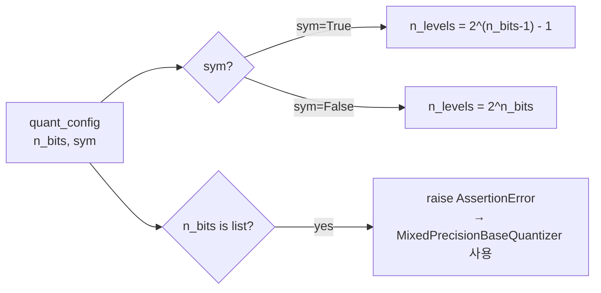
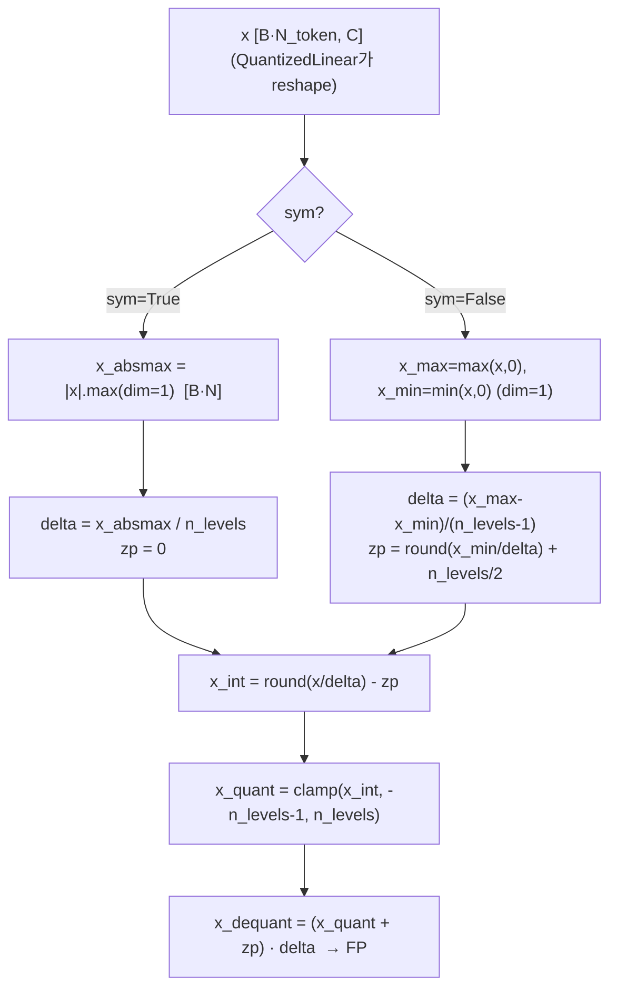
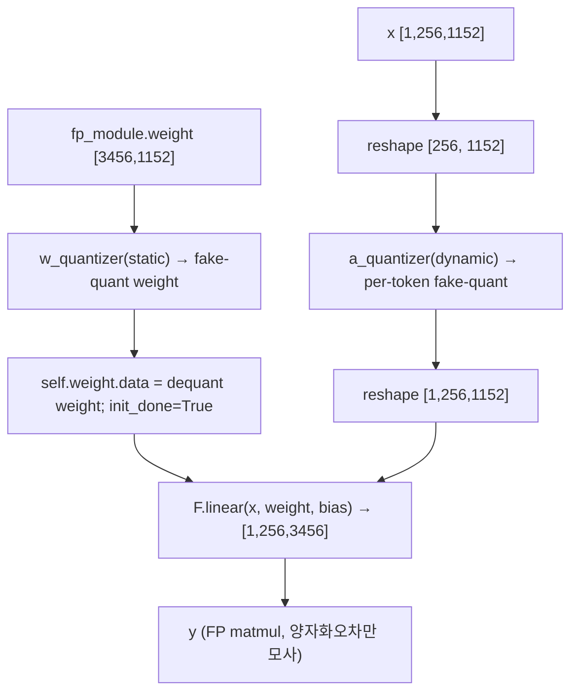
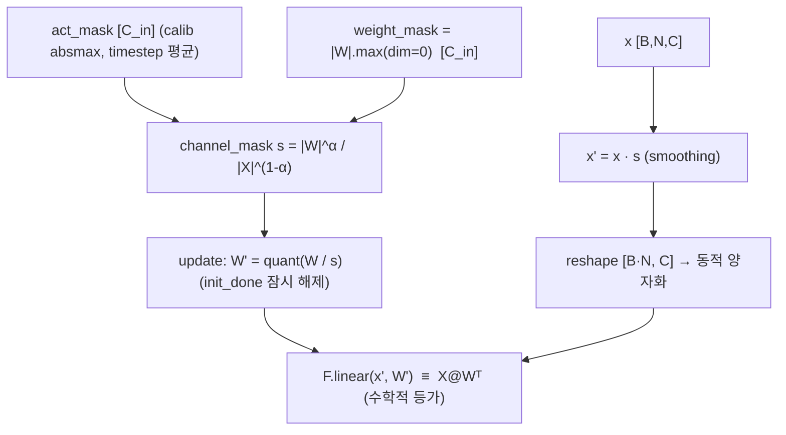
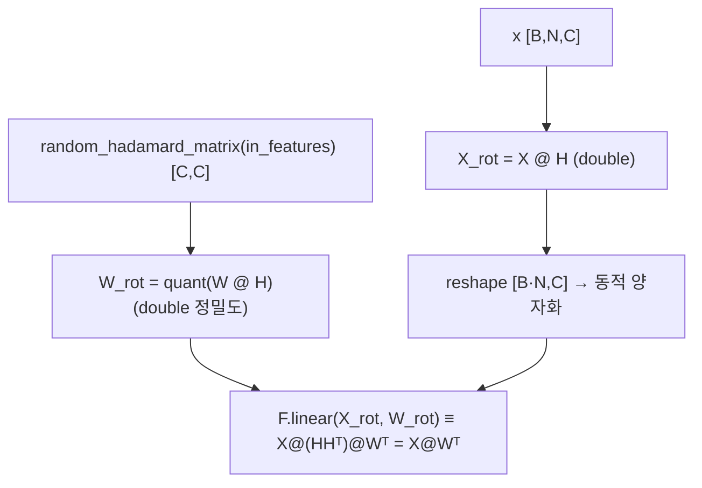
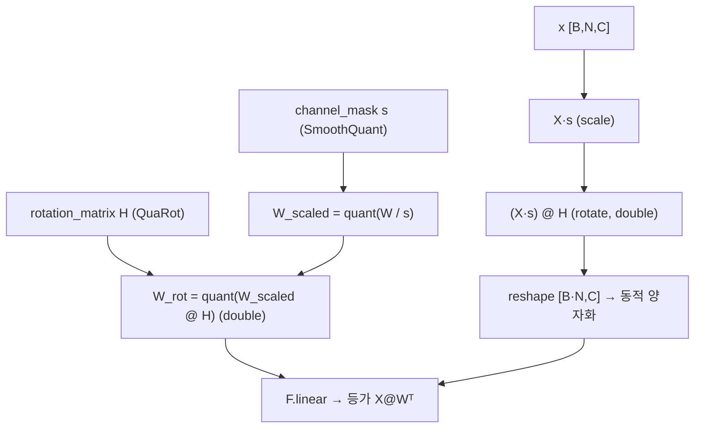
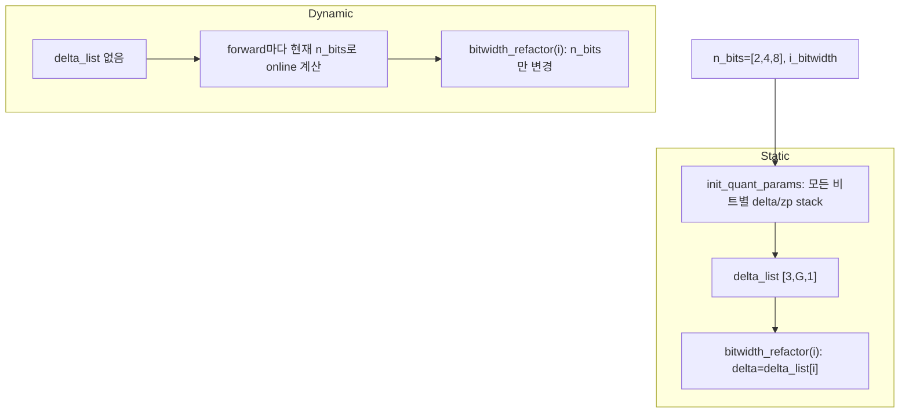
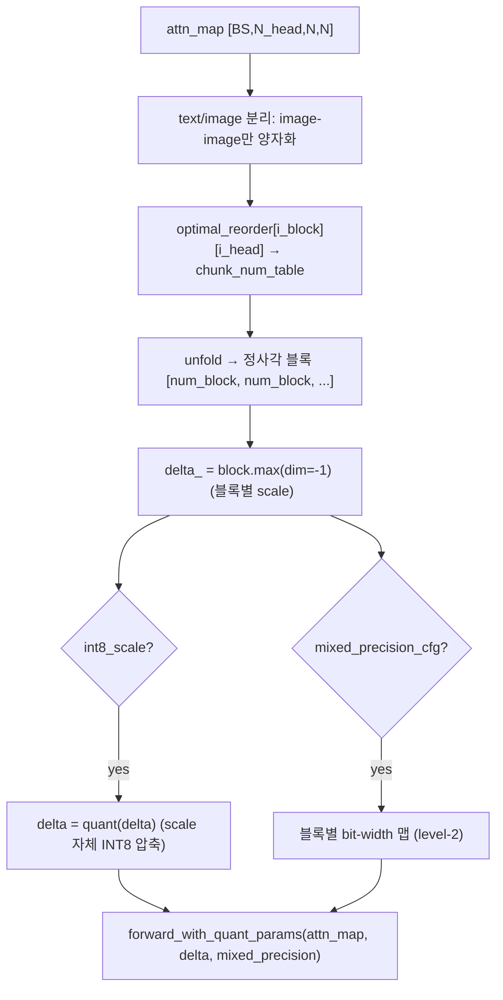
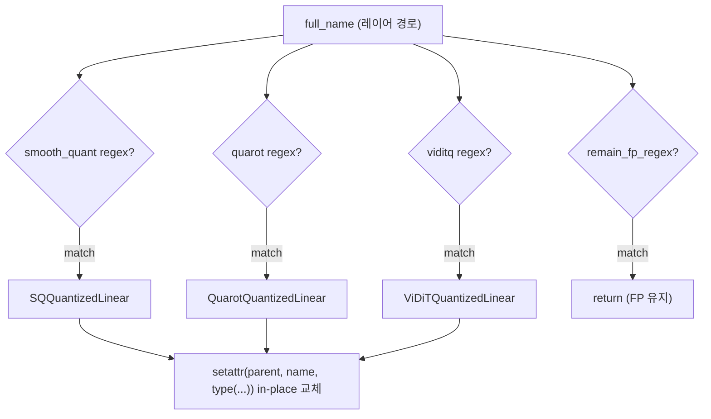
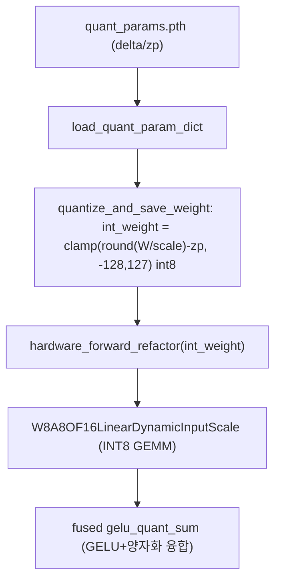

# ViDiT-Q 모듈 통합 가이드 (S-PyTorch)

> 1차 요약: [`../ViDiT-Q.md`](../ViDiT-Q.md) — 본 문서는 그 요약을 모듈 단위로 심화한 통합 가이드다.
> 분석 대상: `\\wsl.localhost\ubuntu-24.04\home\user\project\PRJXR-HBTXR\REF\ViT-Quantization\ViDiT-Q`
> 원논문: ViDiT-Q, *Efficient and Accurate Quantization of Diffusion Transformers for Image and Video Generation*, ICLR'25, arXiv 2406.02540
> 작성 원칙: 실제 소스 Read 후 `파일:라인` 근거 표기. 라인 근거 없는 추론은 "추정", 코드로 확인 불가는 "확인 불가"로 명시.
> 형제 가이드(`REF/Analysis/ViT-Quantization/I-ViT/MODULE_GUIDE.md`)의 6요소 구조를 그대로 따르되, ViDiT-Q는 **integer-only QAT(I-ViT)가 아니라 fake-quant PTQ + 동적(token-wise) 활성 양자화**라는 점이 본질적 차이다. HW 지표는 **S-PyTorch 수치 규약**(params/FLOPs/activation memory/비트폭)으로 표기한다.

---

## 0. 문서 머리말

### 0.1 대표 케이스 선정
- **대표 모델: `DiT-XL/2` (DiT-XL, patch2)** — `depth=28, hidden_size=1152, patch_size=2, num_heads=16, head_dim=72, mlp_ratio=4(→ mlp hidden 4608)`. 근거: `examples/dit`의 모든 엔트리가 이 차원을 하드코딩 (`ptq.py:57-65`, `quant_inference.py:58-66`, `get_calib_data.py:72-80`). `--image-size {256,512}` → latent_size = `img/8` (`ptq.py:49`). ImageNet 1000-class conditional 생성 (`ptq.py:151`).
  - 토큰 수: 256px → latent 32×32, patch2 → N = (32/2)² = **256 토큰**; 512px → latent 64×64 → N = **1024 토큰** (추정 근거: patch_size=2, latent=img/8).
  - **대표 분석 단위**: DiT block 1개 = `adaLN_modulation → attn(qkv·proj) → mlp(fc1·fc2)`. ViDiT-Q는 이 중 **모든 `nn.Linear`만 양자화 교체**하고(`quant_model.py:204`), `t_embedder|adaLN_modulation|final_layer`는 FP 유지(`config.yaml:6`).
- **대표 양자화 3종**:
  1. **DynamicQuantizer**(per-token, forward마다 online scale) — `base_quantizer.py:100-205` — ViDiT-Q의 핵심.
  2. **SQQuantizedLinear**(SmoothQuant migration, `s=|W|^α/|X|^(1-α)`) — `sq_quant_layer.py:6-68`.
  3. **ViDiTQuantizedLinear**(SmoothQuant scaling + QuaRot Hadamard rotation 결합) — `viditq_quant_layer.py:8-73`.

### 0.2 S-PyTorch 수치 규약 (HW의 MAC lanes/scalar MACs 대체)
- **params**: 모듈 차원에서 분석적 계산. Linear `in·out (+out bias)`. ViDiT-Q는 가중치를 **정적 fake-quant**(생성 즉시 1회, `quant_layer.py:40-41`)하므로 params 개수는 FP 원본과 동일(추가 학습 파라미터 없음, 비트폭만 달라짐). SmoothQuant `channel_mask`/QuaRot `rotation_matrix`는 학습 파라미터가 아니라 fuse용 텐서.
- **FLOPs/MACs**: 표준식×config. Linear MAC = `B·N·in·out`. Attention QKᵀ/AV = `B·H·N²·dh`. 대표 레이어를 DiT-XL/2(256px: B=1,N=256,C=1152,H=16,dh=72)로 산출 후 28 block 환원.
- **activation memory**: 텐서 shape × 비트폭. ViDiT-Q는 **fake-quant 시뮬레이션**(양자화→역양자화 후 FP matmul, `quant_layer.py:74`)이라 실제 메모리는 FP16(`ptq.py:67` `model.half()`). 정수 도메인 비트폭(W/A bits)을 "HW 환산 activation bit"로 표기 — `shape × A_bit`. **단 실제 INT8 가속은 CUDA kernel 경로**(`quant_dit.py:31-33`)에서만 INT8 메모리 실현.
- **비트폭/observer**: 코드 직접. 기본 W8/A8(`config.yaml:7-14`). weight **asymmetric**(`sym:False`), act **symmetric**(`sym:True`). observer = **weight=정적(calib/weight 1회), act=동적(forward마다 per-token)**. mixed precision은 `n_bits:[2,4,8]`로 layer 정규식 매칭(`mixed_precision.yaml:7-20`).
- **정확도/속도**: README/논문 인용. 본 세션 미실행 → 측정 불가 항목은 "확인 불가". 정량 metric(FID/CLIPScore/VBench)은 `eval/`(분석 제외)·논문 PDF 미확인 → **확인 불가**.

### 0.3 운영 경로 (PTQ calib ↔ quant_param 저장 ↔ 시뮬/HW 추론)
```
[FP DiT 사전학습 로드] DiT(depth=28,hidden=1152,...) + find_model(ckpt)   (get_calib_data.py:72-83)
   │  DiT-XL/2 ckpt: auto-download DiT-XL-2-{256,512}.pt (ptq.py:38,56)
   ▼
[Calib data 수집] get_calib_data.py: 모든 nn.Linear에 forward hook
   │  hook이 입력의 채널별 absmax [C]만 저장, timestep 누적 → [N_timestep, C]  (:35-38, :124)
   │  diffusion p_sample_loop 후 calib_data.pth 저장 (:115-128). 클래스 8개 고정 (:102)
   ▼
[PTQ] ptq.py: QuantDiT 생성 → 모든 Linear를 양자화 Linear로 교체 + weight 정적 양자화
   │  torch.set_grad_enabled(False) — 무학습 (:34)
   │  SmoothQuant: calib에서 채널 mask(timestep 평균) → update_quantized_weight_scaled (:91-95)
   │  QuaRot: rotation 생성·적용 (:116-131)
   │  set_init_done → save_quant_param_dict → quant_params.pth (:133-135)
   ▼
[양자화 추론] quant_inference.py
   │  QuantDiT + quant_params.pth 로드 (:86-87)
   │  mixed precision이면 bitwidth_refactor() (:69-71)
   │  --hardware → INT weight 저장 후 CUDA kernel forward (:73-83); 아니면 알고리즘 시뮬
   │  --profile → FP vs 양자화 e2e latency 측정 (:106-151)
   │  diffusion 샘플링 → VAE decode → 이미지 저장 (:155-162)
   ▼
[(제외) 평가] eval/ (VBench/FVD/PickScore/ImageReward 등) — 분석 제외
```
- 타깃 디바이스: **CUDA GPU 전제** — `device="cuda"`(`ptq.py:35`), rotation `random_hadamard_matrix(..,"cuda")`(`viditq_quant_layer.py:38`), StaticQuantizer `.to("cuda")`(`base_quantizer.py:76`), CUDA kernel은 `viditq_extension` 빌드 필요(`quant_dit.py:31-33`). → CPU 단독 실행 사실상 불가(코드 근거 확인, 실행 실패는 미검증).

### 0.4 모델 / 데이터셋 / 정확도 (README 인용)
| 항목 | 값 | 근거 |
|---|---|---|
| 대표 모델 | DiT-XL/2 (depth28, hidden1152, heads16, patch2) | `ptq.py:57-65` |
| 데이터셋(DiT 예제) | ImageNet class-conditional, 1000 classes, 256/512px | `ptq.py:39,151`, `quant_inference.py:43` |
| 목표 정밀도 | **W8A8 metric 저하 없음**, **W4A8 mixed precision 화질 저하 미미** | `README.md:23` |
| 정량 metric(FID/VBench 등) | **확인 불가** (eval/ 분석 제외, 논문 PDF 미확인) | — |
- 적용 모델군(README): OpenSora, Latte, Pixart-α/Σ, DiT-XL/2 등 image/video DiT (`README.md:23`, `ViDiT-Q.md:13`). 본 가이드는 코드가 완비된 `examples/dit`(DiT-XL/2) 기준.
- 속도(latency): `quant_inference.py --profile`로 GPU e2e 측정 가능하나 **본 세션 미실행 → 확인 불가**(`:106-151`).

---

## 1. Repo / Layer 개요

ViDiT-Q = Diffusion Transformer(DiT)에 특화된 **PTQ(학습후 양자화)** 프레임워크. LLM 양자화 기법(SmoothQuant, QuaRot)을 diffusion의 특수성(timestep마다 활성 분포 변동, 토큰별 분포 차이 큼)에 맞춰 재구성. 핵심 양자화 패키지는 **독립 pip 패키지 `qdiff`**(`quant_utils/setup.py`)이고, DiT 본체·diffusion 샘플러·VAE는 외부(diffusers/DiT 원본)를 차용한다.

### 1.1 자체 소스 vs 외부 프레임워크 vs 제외

| 구분 | 파일(자체 소스) | 역할 |
|---|---|---|
| **양자화 기반함수** | `qdiff/base/base_quantizer.py` ★핵심 | Base/Static/Dynamic Quantizer — 대칭/비대칭 수식, per-token 동적 scale |
| | `qdiff/base/mixed_precision_quantizer.py` | MixedPrecision Static/Dynamic — `[2,4,8]` 비트별 delta 보관·전환 |
| **양자화 레이어** | `qdiff/base/quant_layer.py` ★핵심 | QuantizedLinear — 정적 W + 동적 A, fake-quant matmul |
| | `qdiff/smooth_quant/sq_quant_layer.py` | SQQuantizedLinear — SmoothQuant migration |
| | `qdiff/quarot/quarot_quant_layer.py` | QuarotQuantizedLinear — Hadamard rotation |
| | `qdiff/viditq/viditq_quant_layer.py` ★핵심 | ViDiTQuantizedLinear — scaling+rotation 결합 |
| | `qdiff/base/quant_attn.py` | QuantizedAttentionMap(+OpenSORA) — attn map column/block 양자화 |
| **모델 디스패처** | `qdiff/base/quant_model.py` ★핵심 | layer refactor, bitwidth refactor, quant_param save/load |
| **Hadamard** | `qdiff/quarot/quarot_utils.py` | random_hadamard_matrix, matmul_hadU(butterfly), get_hadK |
| **유틸** | `qdiff/utils.py` | apply_func_to_submodules, seed_everything, setup_logging |
| **DiT 예제 엔트리** | `examples/dit/ptq.py` | PTQ 실행 (calib 적용 → quant_param 저장) |
| | `examples/dit/get_calib_data.py` | 채널별 활성 absmax 통계 수집 |
| | `examples/dit/quant_inference.py` | 양자화 추론(시뮬/HW), profile |
| | `examples/dit/models/quant_dit.py` | QuantDiT(모델 래핑) + CUDA kernel forward |
| | `examples/dit/sweep_alpha.py`, `fp_inference.py` | α 스윕, FP baseline |

### 1.2 forward 진입점
`QuantDiT`(서브클래스, `quant_dit.py`)는 `QuantModel`(`quant_model.py:182-234`)을 상속. 초기화 시 `quant_layer_refactor()`(`:202-205`)가 `apply_func_to_submodules(class_type=nn.Linear, function=quant_layer_refactor_)`로 **모든 Linear를 양자화 Linear로 in-place 교체**. forward는 DiT 토폴로지 그대로(차용)이되 Linear만 양자화 경로를 탄다. `QuantizedLinear.forward`(`quant_layer.py:57-76`): `[B,N,C] → [B·N,C]` reshape → 동적 act 양자화 → `F.linear`(dequant된 W·A로 FP matmul).

### 1.3 제외 (지시에 따라 이름만 표기, 미분석)
- **외부 프레임워크(커스텀 아님)**: `diffusers.AutoencoderKL`(VAE, `ptq.py:14`), `timm`(`README.md:5`), `omegaconf`(config), DiT 원본 **사전학습 체크포인트**(auto-download `.pt`, `ptq.py:38,56`), `examples/dit/diffusion/`(DiT 원본 샘플러 차용).
- **제외 디렉토리**: `eval/`(VBench/RAFT/PickScore/ImageReward 등 평가 metric·third_party), `examples/opensora1.2/Open-Sora`(OpenSora 본체), `kernels/`(CUDA 커널 C++/CUDA, `viditq_extension` 빌드 산출물) — 지시상 제외. CUDA kernel **호출부**(`quant_dit.py`의 forward 경로)는 본 repo 커스텀이라 §11에서 인터페이스 수준만 분석.
- **미열람(확인 불가)**: `quarot_utils.py`의 사전계산 Hadamard 상수 행렬(1.9MB, `get_had172/156/144/...` 본문), `examples/dit/models/models.py`(DiT 원본 정의 차용), `examples/dit/models/download.py`.

### 1.4 대표 모델 레이어 구성 (DiT-XL/2)
DiT block당 양자화 대상 Linear: `attn.qkv`(1152→3456), `attn.proj`(1152→1152), `mlp.fc1`(1152→4608), `mlp.fc2`(4608→1152). adaLN_modulation은 FP 유지(`config.yaml:6`). block 28개 적층. attention map은 별도 `QuantizedAttentionMap`(OpenSora/CogVideoX 경로, DiT 기본 경로는 미사용 — §9 주석).

---

## 2. 모듈: 양자화 기반함수 — `base_quantizer.py` (BaseQuantizer)

### 2.1 역할 + 상위/하위
- **역할**: 양자화의 공통 골격. config에서 `n_bits`, `sym` 파싱, `n_levels` 계산, `delta`(scale)/`zero_point` buffer 등록. Static/Dynamic이 상속.
- **상위**: `QuantizedLinear`가 `StaticQuantizer`(weight)/`DynamicQuantizer`(act)로 인스턴스화(`quant_layer.py:34-52`). **하위**: 없음(기반 클래스).

### 2.2 데이터플로우 (n_levels 결정 분기)


### 2.3 forward call stack
기반 클래스 `forward`는 `NotImplementedError`(`:37-38`). 실제 호출은 Static/Dynamic의 `forward`/`quantize`.

### 2.4 대표 코드 위치
`base_quantizer.py`: 클래스 `:13-41`, n_bits/sym 파싱 `:19-21`, list 차단 `:23-24`, delta/zp buffer `:27-28`, n_levels `:32`.

### 2.5 대표 코드 블록
```python
# base_quantizer.py:31-32  대칭/비대칭에 따른 양자화 레벨 수
if not isinstance(self.n_bits, ListConfig):
    self.n_levels = 2 ** self.n_bits if not self.sym else 2 ** (self.n_bits - 1) - 1
```
→ **비대칭(asym)**: `n_levels = 2^b`(예 8bit→256). **대칭(sym)**: `n_levels = 2^(b-1)-1`(예 8bit→127). config에서 weight asym / act sym(`config.yaml:7-14`)이므로 weight·act의 n_levels가 다르게 잡힌다.

```python
# base_quantizer.py:23-24  multi-bit이면 단독 사용 금지
if isinstance(self.n_bits, list):
    raise AssertionError("when multiple n_bits are adopted, use the MixedPrecisionBaseQuantizer")
```

### 2.6 연산·수치표현 분해 + 정량
- **양자화 방식**: affine(asym, zp≠0) 또는 symmetric(zp=0). per-group은 입력 reshape로 표현(§3).
- **scale/zp**: buffer로 등록, 서브클래스에서 산출.
- **비트폭**: config `n_bits`(기본 8). mixed면 `[2,4,8]`.
- **params**: 0(학습 파라미터 없음, delta/zp는 buffer).
- **FLOPs**: 없음(설정만).

---

## 3. 모듈: 정적/동적 양자화기 — `base_quantizer.py` (Static / Dynamic Quantizer) ★핵심

### 3.1 역할 + 상위/하위
- **역할**: **StaticQuantizer**(weight용) = calib/weight 통계를 오프라인 1회 계산해 delta/zp 고정(`init_done`). **DynamicQuantizer**(act용) = forward마다 online으로 delta/zp 재계산 → ViDiT-Q의 **per-token dynamic activation quantization** 실구현.
- **상위**: `QuantizedLinear.w_quantizer=StaticQuantizer`, `a_quantizer=DynamicQuantizer`(`quant_layer.py:36,52`). **하위**: 없음.

### 3.2 데이터플로우 (텐서 shape 흐름, 동적 per-token)

→ group 차원(dim=0) = **각 토큰**(QuantizedLinear가 `[B,N,C]→[B·N,C]` reshape, `quant_layer.py:65-66`) → 토큰마다 독립 delta = **per-token**.

### 3.3 forward call stack
`QuantizedLinear.forward`(`quant_layer.py:70`) → `DynamicQuantizer.forward`(`base_quantizer.py:158`) → `quantize`(`:109-156`) → 매 forward delta/zp 산출(`:114-148`) → round/clamp(`:154-155`) → dequant(`:160`).
weight: `QuantizedLinear.__init__`(`:40`) → `StaticQuantizer.forward`(`base_quantizer.py:58`) → `quantize`(`:63`) → `init_quant_params`(1회, `:71-98`).

### 3.4 대표 코드 위치
`base_quantizer.py`: Static `:43-98`(init_quant_params `:71-98`, 누적 max/min `:83-87`), Dynamic `:100-205`(online quantize `:109-156`, forward_with_quant_params `:163-205`).

### 3.5 대표 코드 블록
```python
# base_quantizer.py:114-119  대칭(symmetric): zp=0, |x|max 기반
if self.sym:
    x_absmax = x.abs().max(dim=1)[0]
    delta = x_absmax / self.n_levels
    zero_point = torch.zeros_like(delta, device=delta.device)
```
```python
# base_quantizer.py:130-148  비대칭(asymmetric): 0을 포함하는 affine
x_max = x.max(dim=1)[0];  x_max[x_max<0] = 0.    # 음수면 0으로 clip
x_min = x.min(dim=1)[0];  x_min[x_min>0] = 0.    # 양수면 0으로 clip
delta = (x_max - x_min)/(self.n_levels-1)
zero_point = torch.round(x_min/delta) + (self.n_levels/2)
```
```python
# base_quantizer.py:154-160  양자화 → clamp → 역양자화 (fake-quant)
x_int = torch.round(x / self.delta) - self.zero_point
x_quant = torch.clamp(x_int, -self.n_levels - 1, self.n_levels)
x_dequant = (x_quant + self.zero_point) * self.delta   # 다시 FP로
```
→ 핵심: **정적(weight)은 `init_done`으로 1회 고정, 동적(act)은 매 forward 재계산**. 정적은 다중 calib 배치를 `torch.max`/`torch.min`으로 누적(`:83-87`)해 통계 결합.

```python
# base_quantizer.py:163-205  forward_with_quant_params: 미리 계산된 delta로 양자화
def forward_with_quant_params(self, x, delta, mixed_precision=None):
    assert self.sym                                  # attn map은 항상 sym 가정
    if mixed_precision is not None:
        n_levels = torch.pow(2, mixed_precision) - 1  # 원소별 bit
        zero_bit_mask = (n_levels != 0).int()         # 0-bit 마스킹
        ...
        x_dequant = x_dequant * zero_bit_mask
```
→ attention map의 **블록별/원소별 mixed precision**을 구현하는 통로. 0-bit 원소는 마스킹(0)으로 제거(`:177,202-203`).

### 3.6 연산·수치표현 분해 + 정량 (DiT-XL/2, 256px)
- **양자화 방식**: weight=정적 asym(`config.yaml:7-10`), act=동적 sym per-token(`:11-14`). group=token(입력 reshape).
- **scale/zp**: act delta `[B·N,1]`(토큰마다), weight delta `[C_out,1]`(per-channel) 또는 `[1,1]`(per-tensor, group=tensor면 reshape로 결정).
- **비트폭**: W8/A8 기본, 누산 HW 환산 INT32(추정).
- **params**: 0.
- **FLOPs (per-token 동적 비용)**: act 양자화는 forward마다 `[B·N,C]`에 대해 max/min reduce + round + clamp = O(B·N·C). 256px qkv 입력 `[1·256, 1152]` = 295K 원소 × (reduce+div+round) → **forward마다 ~수십만 원소연산** × (28 block × 4 Linear × 250 timestep) → 동적 양자화의 시뮬 오버헤드 핵심 요인(추정, 라인 근거 `:130-156`).
- **활성 robustness**: delta가 토큰·forward마다 산출 → timestep별 분포 변동에 자동 대응(정적 통계 의존 없음). `import ipdb` 예외 핸들러가 비대칭 경로 `:144`에 잔존(프로덕션 hang 위험, 추정).

---

## 4. 모듈: 기본 양자화 Linear — `quant_layer.py` (QuantizedLinear) ★핵심

### 4.1 역할 + 상위/하위
- **역할**: `nn.Linear`를 상속. 생성 즉시 weight 정적 양자화(fake-quant), bias FP 유지, forward에서 act 동적 양자화 후 dequant된 W·A로 `F.linear`. `quant_mode=False`면 FP fallback.
- **상위**: `quant_layer_refactor_`가 in-place 교체(`quant_model.py:68`). SQ/Quarot/ViDiT 레이어의 부모. **하위**: `StaticQuantizer`/`DynamicQuantizer`, `MixedPrecision*Quantizer`.

### 4.2 데이터플로우 (텐서 shape 흐름, DiT-XL/2 qkv)


### 4.3 forward call stack
`QuantizedLinear.__init__`(`quant_layer.py:14`) → weight 양자화 `self.weight.data = self.w_quantizer(fp_module.weight)`(`:40`) → `init_done=True`(`:41`). `forward`(`:57`) → `quant_mode` 분기(`:61`) → reshape(`:65-66`) → `a_quantizer(x)`(`:70`) → `F.linear`(`:74`).

### 4.4 대표 코드 위치
`quant_layer.py`: 클래스 `:8-76`, w/a quantizer 선택(list→MixedPrecision) `:32-52`, weight 즉시 양자화 `:40-41`, forward `:57-76`, use_kernel/quant_mode 플래그 `:54-55`.

### 4.5 대표 코드 블록
```python
# quant_layer.py:32-46  weight 정적 양자화(생성 즉시), bias는 FP 유지
if isinstance(quant_config.weight.n_bits, ListConfig):  # mixed precision
    self.w_quantizer = MixedPrecisionStaticQuantizer(quant_config['weight'])
else:
    self.w_quantizer = StaticQuantizer(quant_config['weight'])
self.weight.data = self.w_quantizer(fp_module.weight)  # [C_out, C_in] fake-quant
self.w_quantizer.init_done = True
self.bias = fp_module.bias                              # bias FP16 그대로
```
```python
# quant_layer.py:61-76  forward: FP fallback / 동적 act 양자화 / fake-quant matmul
if not self.quant_mode:
    return self.fp_module(x, *args, **kwargs)            # FP16 우회(mixed precision FP 레이어)
B, N_token, C = x.shape
x = x.reshape([B*N_token, -1])                           # group=token
if self.a_quantizer is not None:
    x = self.a_quantizer(x)                              # per-token 동적 양자화
x = x.reshape([B, N_token, C])
y = F.linear(x, self.weight, self.bias, *args, **kwargs) # dequant W·A로 FP 연산
```
→ **시뮬레이션 모드 핵심**: 양자화→역양자화 거친 값으로 FP matmul → 양자화 오차만 모사. 실제 INT 가속은 §11 CUDA kernel.

### 4.6 연산·수치표현 분해 + 정량 (DiT-XL/2, B=1, N=256, 256px)
- **양자화 방식**: weight 정적 asym W8, act 동적 sym A8 per-token. bias FP.
- **params (DiT-XL/2 1 block, C=1152, mlp 4608)**:
  - qkv: 1152×3456 + 3456 = **3,984,768**
  - proj: 1152×1152 + 1152 = **1,328,256**
  - fc1: 1152×4608 + 4608 = **5,313,024**
  - fc2: 4608×1152 + 1152 = **5,309,568**
  - Linear params/block ≈ **15.94M**, ×28 block ≈ **446M** (양자화 대상 Linear만; adaLN/embedder/final 제외).
- **MACs/block (B=1, N=256)**:
  - qkv: 256×1152×3456 ≈ **1.019G**
  - proj: 256×1152×1152 ≈ **0.340G**
  - fc1: 256×1152×4608 ≈ **1.359G**
  - fc2: 256×4608×1152 ≈ **1.359G**
  - Linear MAC/block ≈ **4.08G**, ×28 ≈ **114G** (Attention matmul 제외).
- **activation bit**: act A8(HW 환산), 정수 MAC 누산 INT32(추정), 시뮬상 실제는 FP16(`quant_inference.py:68`).

---

## 5. 모듈: SmoothQuant migration — `sq_quant_layer.py` (SQQuantizedLinear) ★핵심

### 5.1 역할 + 상위/하위
- **역할**: 활성 outlier 채널을 가중치로 "이전(migration)"해 활성 양자화 난이도를 낮춤. smoothing factor `s = |W|^α / |X|^(1-α)`(채널별). 가중치엔 `1/s`를 fuse(오프라인), 활성엔 `×s`(추론 시).
- **상위**: `quant_layer_refactor_`가 `smooth_quant.layer_name_regex` 매칭 시 인스턴스화(`quant_model.py:21-29`). **하위**: `QuantizedLinear`(부모), `StaticQuantizer`/`DynamicQuantizer`.

### 5.2 데이터플로우 (텐서 shape 흐름)


### 5.3 forward call stack
PTQ: `ptq.py:91-95` → `module.get_channel_mask(act_mask)`(`sq_quant_layer.py:27`) → `update_quantized_weight_scaled`(`:36`). 추론: `SQQuantizedLinear.forward`(`:46`) → `x*channel_mask`(`:55`) → `a_quantizer`(`:62`) → `F.linear`(`:66`).

### 5.4 대표 코드 위치
`sq_quant_layer.py`: 클래스 `:6-68`, α `:24`, get_channel_mask `:27-34`, weight fuse `:36-44`, forward smoothing `:46-68`.

### 5.5 대표 코드 블록
```python
# sq_quant_layer.py:27-34  smoothing factor s = |W|^α / |X|^(1-α)
def get_channel_mask(self, act_mask):                 # act_mask: 채널별 absmax [C_in]
    weight_mask = self.fp_module.weight.abs().max(dim=0)[0]  # [C_in]
    channel_mask = (weight_mask.abs()**self.alpha) / (act_mask.abs()**(1-self.alpha))
    self.channel_mask = channel_mask
```
```python
# sq_quant_layer.py:36-44  가중치에 1/s를 fuse (outlier를 weight로 이전)
def update_quantized_weight_scaled(self):
    C_out, C_in = self.fp_module.weight.shape
    self.w_quantizer.init_done = False                 # 재양자화 허용
    self.weight.data = self.w_quantizer(self.fp_module.weight / self.channel_mask.reshape([1, C_in]))
    self.w_quantizer.init_done = True
```
```python
# sq_quant_layer.py:54-62  활성에 s를 곱해 smoothing 후 동적 양자화
x = x*self.channel_mask.reshape([1,1,C])               # X' = X·s
x = x.reshape([B*N_token,-1])
x = self.a_quantizer(x)                                # per-token 동적 양자화
```
→ `Y = (X·s) @ (W/s)ᵀ = X @ Wᵀ` 수학적 등가. **가중치 fuse는 오프라인**이라 추론 시 활성 곱셈(`×s`)만 추가.

### 5.6 연산·수치표현 분해 + 정량
- **양자화 방식**: SmoothQuant. `s` 채널별 스칼라(`[C_in]`). 가중치 정적, 활성 동적.
- **α**: config 기본 **0.88**(`sq.yaml:7`). `sweep_alpha.py:21`은 `np.arange(0.1,0.9,0.2)` 스윕.
- **적용 범위**: `sq.yaml:8` `layer_name_regex: mlp.fc2` → **mlp.fc2에만** 적용(가장 양자화 어려운 레이어 타겟).
- **params**: 0 추가 학습 파라미터. `channel_mask` `[C_in]` buffer만(fc2면 C_in=4608 → 4608 float).
- **FLOPs (추론 추가비용/fc2)**: 활성 smoothing `x·s` = O(B·N·C_in) = 256×4608 ≈ **1.18M mul/forward**. 가중치 fuse는 PTQ 1회(추론 비용 0).
- **시사**: 가중치 fuse가 오프라인이라 **FPGA 친화**(추론 시 활성 스케일 곱만, INT MAC 직전 채널 스칼라 1회). 형제 가이드 I-ViT의 "정수 도메인 fuse"와 유사한 HW 무비용 outlier 처리.

---

## 6. 모듈: QuaRot Hadamard rotation — `quarot_quant_layer.py` + `quarot_utils.py`

### 6.1 역할 + 상위/하위
- **역할**: randomized Hadamard 직교행렬 `H`로 활성·가중치를 회전(`X@H`, `W@H`)해 채널 outlier를 균등 분산. `HᵀH=I`라 출력 불변. 회전은 butterfly로 O(n log n).
- **상위**: `quant_layer_refactor_`가 `quarot.layer_name_regex` 매칭 시 인스턴스화(`quant_model.py:33-41`). **하위**: `random_hadamard_matrix`(`quarot_utils.py:186`), `matmul_hadU`(`:158`).

### 6.2 데이터플로우 (텐서 shape 흐름)


### 6.3 forward call stack
PTQ: `ptq.py:118-121` → `module.get_rotation_matrix()`(`quarot_quant_layer.py:27`) → `update_quantized_weight_rotated`(`:30`). 추론: `forward`(`:35`) → `x@rotation_matrix`(`:44`, double) → `a_quantizer`(`:48`) → `F.linear`(`:51`).

### 6.4 대표 코드 위치
`quarot_quant_layer.py`: 클래스 `:7-53`, get_rotation `:27-28`, weight rotate+quant `:30-33`, forward `:35-53`. `quarot_utils.py`: `random_hadamard_matrix` `:186-192`, `matmul_hadU`(butterfly) `:158-179`, `get_hadK`(약수별 사전행렬 선택) `:100-154`, `matmul_hadU_cuda`(fast lib) `:195-208`.

### 6.5 대표 코드 블록
```python
# quarot_utils.py:186-192  randomized Hadamard: ±1 대각 × Hadamard 변환
def random_hadamard_matrix(size, device):
    Q = torch.randint(low=0, high=2, size=(size,)).to(torch.float64)
    Q = Q * 2 - 1                                      # {0,1} → {-1,+1}
    Q = torch.diag(Q)
    return matmul_hadU(Q).to(device)
```
```python
# quarot_utils.py:163-179  butterfly fast Hadamard transform, /sqrt(n) 정규화
while input.shape[1] > K:
    input = input.view(input.shape[0], input.shape[1]//2, 2, input.shape[2])
    output[:, :, 0, :] = input[:, :, 0, :] + input[:, :, 1, :]   # 합
    output[:, :, 1, :] = input[:, :, 0, :] - input[:, :, 1, :]   # 차
    ...
return input.view(X.shape) / torch.tensor(n).sqrt()   # 직교성 보존
```
```python
# quarot_quant_layer.py:30-44  weight·act 회전 (double 정밀도)
def update_quantized_weight_rotated(self):
    self.w_quantizer.init_done = False
    self.weight.data = self.w_quantizer(torch.matmul(self.fp_module.weight.data.double(), self.rotation_matrix).float())
    self.w_quantizer.init_done = True
# forward:
x = torch.matmul(x.double(), self.rotation_matrix).to(dtype=x.dtype)  # X@H
```
→ `get_hadK`(`:100-154`)는 2의 거듭제곱이 아닌 hidden(172/156/**144**/140/108…)을 사전계산 행렬로 처리. **144는 pixart/opensora hidden 4608용**(`:110-113`, 4608 = 144×32).

### 6.6 연산·수치표현 분해 + 정량
- **양자화 방식**: 직교 회전 후 양자화. 가중치 회전 오프라인, 활성 회전 추론 시.
- **params**: 0 추가 학습. `rotation_matrix` `[C,C]`는 **저장 생략**(load 시 재생성, `quant_model.py:172`).
- **FLOPs (추론 추가비용)**: 활성 회전 `X@H` butterfly = O(B·N·C·log C). fc2(C_in=4608)면 256×4608×log₂4608 ≈ **13.9M op/forward** (full matmul이면 256×4608² ≈ 5.4G이나 butterfly로 절감). `.double()` 연산이라 무거움(`:44`).
- **적용 범위**: `quarot.yaml:7` `mlp.fc2`만.
- **시사**: butterfly는 FPGA 매핑 좋은 구조(합/차 트리)이나 추론마다 회전 데이터패스 필요. SmoothQuant(fuse 무비용) 대비 추론 비용 존재 → 비용-효익 검토 대상.

---

## 7. 모듈: ViDiT-Q 결합 레이어 — `viditq_quant_layer.py` (ViDiTQuantizedLinear) ★핵심

### 7.1 역할 + 상위/하위
- **역할**: SmoothQuant(channel scaling) + QuaRot(Hadamard rotation)을 **합성**. 두 outlier 처리(이전+분산)를 상보적으로 결합. **순서 = 먼저 scaling, 그 다음 rotation**.
- **상위**: `quant_layer_refactor_`가 `viditq.layer_name_regex` 매칭 시(`quant_model.py:45-53`). **하위**: `QuantizedLinear`(부모), `random_hadamard_matrix`.

### 7.2 데이터플로우 (텐서 shape 흐름)


### 7.3 forward call stack
PTQ: `get_channel_mask`(`viditq_quant_layer.py:30`) + `get_rotation_matrix`(`:37`) → `update_quantized_weight_rotated_and_scaled`(`:40`). 추론: `forward`(`:52`) → `x*channel_mask`(`:62`) → `x@rotation_matrix`(`:63`, double) → `a_quantizer`(`:67`) → `F.linear`(`:71`).

### 7.4 대표 코드 위치
`viditq_quant_layer.py`: 클래스 `:8-73`, channel_mask `:30-35`, rotation `:37-38`, weight 결합 fuse `:40-50`, forward `:52-73`.

### 7.5 대표 코드 블록
```python
# viditq_quant_layer.py:40-50  weight: 먼저 scaling, 그 다음 rotation (각 단계 재양자화)
def update_quantized_weight_rotated_and_scaled(self):
    C_out, C_in = self.fp_module.weight.shape
    self.w_quantizer.init_done = False
    self.weight.data = self.w_quantizer(self.fp_module.weight / self.channel_mask.reshape([1, C_in]))  # scale
    self.weight.data = self.w_quantizer(torch.matmul(self.weight.data.double(), self.rotation_matrix).float())  # rotate
    self.w_quantizer.init_done = True
```
```python
# viditq_quant_layer.py:60-67  activation: 동일 순서 scale → rotate → 동적 양자화
x = x*self.channel_mask.reshape([1,1,C])               # scale
x = torch.matmul(x.double(), self.rotation_matrix).to(dtype=dtype_)  # rotate (double)
x = x.reshape([B*N_token,-1])
x = self.a_quantizer(x)                                # per-token 동적 양자화
```
→ ViDiT-Q = **SmoothQuant(이전) ∘ QuaRot(분산)** 합성. 활성·가중치 모두 같은 순서(scale→rotate)로 처리해 수학적 등가 유지.

### 7.6 연산·수치표현 분해 + 정량
- **양자화 방식**: scaling + rotation 결합. α(`:26`), rotation_matrix `[C,C]`.
- **params**: 0 추가 학습. channel_mask `[C_in]` + rotation `[C,C]`(저장 생략).
- **FLOPs (추론 추가비용)**: scale O(B·N·C) + rotate O(B·N·C log C). SmoothQuant+QuaRot 비용 합.
- **시사**: 두 기법 합성이 정확도 최상이나 추론 비용(특히 double rotation)이 가장 큼. FPGA로 옮길 때 scale은 fuse 가능하나 rotation은 데이터패스 필요 → 정확도-비용 트레이드오프의 극단.

---

## 8. 모듈: Mixed Precision 양자화기 — `mixed_precision_quantizer.py`

### 8.1 역할 + 상위/하위
- **역할**: `n_bits=[2,4,8]` 같은 리스트를 받아 비트별 delta/zp를 모두 보관(Static) 또는 매번 재계산(Dynamic). `bitwidth_refactor(i)`로 현재 비트 전환. layer별 mixed precision의 quantizer 백엔드.
- **상위**: `QuantizedLinear`가 `n_bits`가 `ListConfig`면 인스턴스화(`quant_layer.py:34,50`). `bitwidth_refactor_`가 layer 정규식으로 비트 할당(`quant_model.py:77-106`). **하위**: `BaseQuantizer`.

### 8.2 데이터플로우 (비트 전환)


### 8.3 forward call stack
`bitwidth_refactor_`(`quant_model.py:82-106`) → layer 정규식 매칭 → idx0이면 `quant_mode=False`(FP16), idx≥1이면 `w/a_quantizer.bitwidth_refactor(idx-1)`(`:92,105`).

### 8.4 대표 코드 위치
`mixed_precision_quantizer.py`: Base `:15-54`(bitwidth_list/i_bitwidth `:29-31`, bitwidth_refactor `:50-54`), Static `:56-125`(모든 비트 init `:81-119`), Dynamic `:127-187`(online `:136-174`, refactor n_bits만 `:181-186`).

### 8.5 대표 코드 블록
```python
# mixed_precision_quantizer.py:81-119  Static: 모든 비트폭 delta를 한 번에 계산해 stack
for i_bitwidth, n_bits in enumerate(self.bitwidth_list):  # [2,4,8]
    self.n_bits = n_bits
    self.n_levels = 2 ** self.n_bits if not self.sym else 2 ** (self.n_bits-1) - 1
    ...
    delta_list.append(delta.unsqueeze(-1))
self.delta_list = torch.stack(delta_list, dim=0)          # [3, G, 1]
```
```python
# mixed_precision_quantizer.py:50-54  Static: 재계산 없이 비트 전환
def bitwidth_refactor(self, i_bitwidth):
    self.n_bits = self.bitwidth_list[i_bitwidth]
    self.delta = self.delta_list[i_bitwidth]
    self.zero_point = self.zero_point_list[i_bitwidth]
```
```python
# quant_model.py:88-93  layer 정규식 → 비트 인덱스 (idx0=FP16)
if match:
    if idx == 0:  submodule.quant_mode = False           # FP16 우회
    else:         submodule.w_quantizer.bitwidth_refactor(idx-1)  # bitwidth_list[idx-1] bit
```

### 8.6 연산·수치표현 분해 + 정량
- **양자화 방식**: layer별 multi-bit. `mixed_precision.yaml`: weight `[2,4,8] i=1(=4bit)`, act `[2,4,8] i=2(=8bit)` → 기본 **W4A8**(`:6-15`). `layer_name_regex:['mlp','','','attn']` → idx0='mlp'=FP16, idx3='attn'=8bit(`:18-20`).
- **params**: Static delta_list `[3,G,1]`(3× 메모리). Dynamic은 delta_list 없음(매번 재계산).
- **비트폭**: `[2,4,8]` 중 선택. W4A8 mixed가 README 목표(`README.md:23`).
- **시사**: layer별 비트 차등 = FPGA 레이어별 PE 비트폭 차등 설계 직접 참고. **단 CUDA kernel은 mixed 미지원**(W8A8 only, `quant_inference.py:74`) → mixed는 시뮬에서만.

---

## 9. 모듈: Attention Map 양자화 — `quant_attn.py`

### 9.1 역할 + 상위/하위
- **역할**: softmax 직후 attention map을 column/block 단위로 양자화(CogVideoX/OpenSora용). text-text·text-image는 FP 유지, image-image만 양자화. block 경로는 head별 reorder + 블록별 delta + 원소별 mixed precision.
- **상위**: 모델별 attention forward에서 삽입(OpenSora/CogVideoX 모델 코드, 분석 제외). **DiT-XL/2 기본 경로에서는 미사용**(`examples/dit`에 attn map 양자화 호출 없음 — 확인). **하위**: `DynamicQuantizer.forward_with_quant_params`.

### 9.2 데이터플로우 (block group)


### 9.3 forward call stack
`QuantizedAttentionMap.forward`(`quant_attn.py:38`) → group 분기(`:48 column`, `:52 block`) → unfold(`:80`) → block max(`:83`) → int8_scale(`:86-92`) → `forward_with_quant_params`(`:108-110`).

### 9.4 대표 코드 위치
`quant_attn.py`: CogVideoX `QuantizedAttentionMap` `:8-116`, OpenSORA `QuantizedAttentionMapOpenSORA` `:118-241`(거의 동일). column `:48-51`, block `:52-113`, text/image 분리 `:54-62`, int8_scale `:86-92`, mixed precision `:95-101`.

### 9.5 대표 코드 블록
```python
# quant_attn.py:54-62  text-text/text-image는 FP, image-image만 양자화
N_text_token = self.quant_config.model.n_text_tokens
N_image_token = N_token - N_text_token
F = 13; H = 30; W = 45                                  # OpenSora 해상도 하드코딩
assert N_image_token == F*W*H
attn_map_image = x[:,:,N_text_token:,N_text_token:]     # image-image 부분만
```
```python
# quant_attn.py:80-92  블록별 unfold + max → delta, scale 자체도 INT8 양자화 옵션
attn_map_image_head = attn_map_image_head.unfold(0,block_width,block_width).unfold(1,block_width,block_width)
delta_ = attn_map_image_head.max(dim=-1)[0]            # 블록별 scale
if self.quant_config.attn.attn_map.get('int8_scale', False):
    delta_ = self.attn_map_scale_quantizer.forward_with_quant_params(delta_, delta_max)  # scale INT8 압축
```

### 9.6 연산·수치표현 분해 + 정량
- **양자화 방식**: attn map sym(`base_quantizer.py:166` assert). column/row(행 단위) 또는 block(정사각 블록). 블록별 delta.
- **params**: 0. `optimal_reorder`(reorder 파일 로드, `:23`), `mixed_precision_cfg`(외부 주입).
- **FLOPs**: block max reduce O(N²) + 양자화 O(N²). N²이 가장 큰 텐서.
- **한계**: `F=13,H=30,W=45` OpenSora 특정 설정 하드코딩(`:56-59,181-184`) → DiT 일반화 안 됨. 이중 for 루프(`i_bs × i_head`, `:69-70`) → CPU 직렬 오버헤드(추정).
- **시사**: scale 자체를 INT8로 추가 압축(`int8_scale`)하는 아이디어는 FPGA scale 저장 비용 절감에 응용 가능.

---

## 10. 모듈: 모델 레벨 디스패처 — `quant_model.py` ★핵심

### 10.1 역할 + 상위/하위
- **역할**: 모듈 단위 함수들의 집합. `apply_func_to_submodules`로 (1) Linear 교체, (2) layer별 비트 할당, (3) quant_param save/load, (4) init_done 설정. `QuantModel` 베이스(서브클래스에서 모델 상속, 예 `QuantDiT`).
- **상위**: `QuantDiT.__init__`(`quant_dit.py`). **하위**: `apply_func_to_submodules`(`utils.py:15`), 각 양자화 레이어 타입.

### 10.2 데이터플로우 (layer refactor 디스패치)


### 10.3 forward call stack
`QuantModel.quant_layer_refactor`(`:202`) → `apply_func_to_submodules(class_type=nn.Linear, function=quant_layer_refactor_)`(`:203-205`) → `quant_layer_refactor_`(`:15-75`) 각 Linear에 적용.

### 10.4 대표 코드 위치
`quant_model.py`: `quant_layer_refactor_` `:15-75`(SQ `:21-29`, QuaRot `:33-41`, ViDiT `:45-53`, remain_fp `:57-62`, in-place 교체 `:68`), `bitwidth_refactor_` `:77-106`, `load_quant_param_dict_` `:139-160`, `save_quant_param_dict_` `:162-172`, `QuantModel` `:182-234`.

### 10.5 대표 코드 블록
```python
# quant_model.py:45-62  viditq(scaling+rotation) 매칭 + remain_fp 우회
if quant_config.get("viditq",None) is not None:
    layer_regex = quant_config.viditq.layer_name_regex
    if re.search(re.compile(layer_regex), full_name):
        quant_layer_type = ViDiTQuantizedLinear
if remain_fp_regex is not None:
    if re.compile(remain_fp_regex).search(full_name):
        return                                          # FP 유지(t_embedder|adaLN|final_layer)
```
```python
# quant_model.py:144-157  load 시 메서드별 가중치 재구성 (rotation 재생성)
if hasattr(parent, 'channel_mask') and hasattr(parent, 'rotation_matrix'):  # viditq
    parent.get_rotation_matrix()                        # rotation 재생성(저장 안 됨)
    parent.channel_mask = quant_param_dict[full_name]['channel_mask']
    parent.update_quantized_weight_rotated_and_scaled()
```
```python
# quant_model.py:171-172  rotation_matrix 저장 생략 (대용량·레이어 공통)
if hasattr(parent_module, 'rotation_matrix'):
    model.quant_param_dict[full_name]['rotation_matrix'] = None  # skip saving
```
→ **리스크**: rotation을 저장 않고 load 시 `random_hadamard_matrix` 재생성(`:146,151`). seed 고정(`seed_everything`)으로 동일성 의도이나 PTQ·추론의 난수 소비 순서가 다르면 행렬 불일치 가능 → 정확도 저하 위험(추정, `ViDiT-Q.md:351`).

### 10.6 연산·수치표현 분해 + 정량
- **디스패치**: 정규식 우선순위 SQ→QuaRot→ViDiT(뒤가 덮어씀). `remain_fp_regex: t_embedder|adaLN_modulation|final_layer`(`config.yaml:6`) → 민감 레이어 FP.
- **params**: 0(메타 로직). quant_param_dict는 delta/zp/channel_mask 저장(rotation 제외).
- **시사**: 정규식 기반 선택적 양자화 = FPGA 레이어별 비트/FP 정책의 직접 모델. `remain_fp_regex`가 "어떤 레이어를 FP 블록으로 둘지" 설계 지침.

---

## 11. 모듈: 모델 래핑 + CUDA kernel 추론 — `quant_dit.py`

### 11.1 역할 + 상위/하위
- **역할**: `QuantModel`을 DiT에 특화(`QuantDiT`). 시뮬레이션 외에 **실제 INT8 가속 경로** 제공: weight를 INT8로 변환 저장, `W8A8OF16LinearDynamicInputScale` 커널·`gelu_quant_sum` fused 커널로 forward.
- **상위**: `ptq.py:57`/`quant_inference.py:58` `QuantDiT(...)`. **하위**: `viditq_extension`(CUDA, 분석 제외), `quant_model.py`의 refactor 함수들.

### 11.2 데이터플로우 (HW 경로)


### 11.3 forward call stack
HW: `quant_inference.py:73-83` → `quantize_and_save_weight`(`quant_dit.py:35`) → `hardware_forward_refactor`(`:83 호출, quant_dit 내부 정의`). 커널: `QuantMlpWithCudaKernel.forward`(`:81-87`), `QuantAttentionWithCudaKernel.forward`(`:114-`).

### 11.4 대표 코드 위치
`quant_dit.py`: 커널 import `:31-33`, `quantize_and_save_weight_` `:35-49`, `QuantMlpWithCudaKernel` `:53-87`, `QuantAttentionWithCudaKernel` `:89-` (이후 분석 제외 범위와 인접).

### 11.5 대표 코드 블록
```python
# quant_dit.py:46-49  FP weight → INT8 변환 (W8A8 only)
int_weight = torch.clamp(
        torch.round(fp_weight / scale.view(-1,1)) - zero_point.view(-1,1),
        -128, 127).to(torch.int8)  # kernel supports W8A8 only for now
```
```python
# quant_dit.py:72-83  INT8 커널 Linear + fused GELU 양자화
self.fc1 = W8A8OF16LinearDynamicInputScale(in_features, hidden_features, ...)
self.fc2 = W8A8OF16LinearDynamicInputScale(hidden_features, in_features, ...)
def forward(self, x):
    x = self.fc1(x, self.quant_params)
    x = fused_kernels.gelu_quant_sum(x, self.quant_params.sum_input, self.quant_params.scale_input)
    x = self.fc2(x, self.quant_params)
```
→ 시뮬(역양자화 후 FP matmul)과 달리 **실제 INT8 GEMM + dynamic input scale**. `OF16` = output FP16.

### 11.6 연산·수치표현 분해 + 정량
- **양자화 방식**: 실제 INT8 weight(`clamp -128,127`), dynamic input scale(act 동적). GELU+양자화 fused.
- **제약**: **W8A8 only, mixed precision 미지원**(`quant_inference.py:74`, `quant_dit.py:48`). attention은 `q@kᵀ·scale → softmax`(`:119-120`)로 FP softmax(커널 외).
- **params**: weight INT8(`-128,127`), FP16 대비 메모리 1/2(weight buffer).
- **시사**: 실제 가속이 W8A8로 검증됨 → FPGA INT8 MAC 어레이 1차 타겟의 근거. dynamic input scale = 추론 시 활성 scale 계산 HW 비용 존재.

---

## N+1. 모듈 한눈 요약 표

| 모듈 | 파일:라인 | 역할 | 양자화 방식 | 대표 정량(DiT-XL/2 256px) |
|---|---|---|---|---|
| BaseQuantizer | base_quantizer.py:13-41 | 공통 골격, n_levels 분기 | sym/asym 설정, list 차단 | params 0, n_levels=2^b 또는 2^(b-1)-1 |
| Static/DynamicQuantizer | base_quantizer.py:43-205 | weight 정적 / act 동적 per-token | asym(W)/sym(A), forward마다 scale | params 0, act O(B·N·C)/forward |
| QuantizedLinear | quant_layer.py:8-76 | 정적 W + 동적 A, fake-quant matmul | W8 정적/A8 동적 | block Linear 15.94M params, 4.08G MAC |
| SQQuantizedLinear | sq_quant_layer.py:6-68 | SmoothQuant migration | s=\|W\|^α/\|X\|^(1-α), α=0.88 | fc2만, 활성 smoothing 1.18M mul |
| QuarotQuantizedLinear | quarot_quant_layer.py:7-53 | Hadamard rotation | X@H, W@H (직교, double) | fc2만, butterfly ~13.9M op |
| ViDiTQuantizedLinear | viditq_quant_layer.py:8-73 | scaling+rotation 결합 | scale→rotate 순 | SmoothQuant+QuaRot 비용 합 |
| MixedPrecision*Quantizer | mixed_precision_quantizer.py:15-187 | [2,4,8] 비트 보관/전환 | Static delta_list / Dynamic 재계산 | W4A8 mixed, delta_list 3× |
| QuantizedAttentionMap | quant_attn.py:8-241 | attn map column/block 양자화 | sym, 블록별 delta, int8_scale | N² 텐서, OpenSora 하드코딩 |
| quant_model 디스패처 | quant_model.py:15-234 | layer 교체·비트·save/load | 정규식 매칭, remain_fp | params 0, rotation 저장 생략 |
| QuantDiT + CUDA kernel | quant_dit.py:31-87 | 모델 래핑 + INT8 가속 | W8A8 only, fused GELU | INT8 weight, FP16 대비 1/2 메모리 |

---

## N+2. 학습·평가 파이프라인 + 재현 명령

- **무학습 PTQ**: `torch.set_grad_enabled(False)`(`ptq.py:34`). gradient 학습 없음(I-ViT의 QAT와 대조).
- **데이터셋(DiT 예제)**: ImageNet class-conditional, 1000 classes, 256/512px. calib 클래스 8개 고정 `[217,363,347,574,188,99,47,379]`(`ptq.py:72`, `get_calib_data.py:102`).
- **모델**: DiT-XL/2 (depth28, hidden1152, heads16, patch2), auto-download `.pt`(`ptq.py:38,56`).
- **PTQ 파이프라인**(`README.md:1-21`, `main.sh`):
  ```bash
  cd quant_utils && pip install -e .          # qdiff 패키지 설치
  # (커널) cd kernels && pip install -e .       # viditq_extension (선택, W8A8 HW)
  python get_calib_data.py --log ./logs/EXP --ptq-config ./configs/CFG.yaml
  python ptq.py --image-size 256 --ptq-config ./configs/CFG.yaml --log ./logs/EXP
  python quant_inference.py --image-size 256 --ptq-config ./configs/CFG.yaml --log ./logs/EXP [--hardware] [--profile]
  ```
- **비트 config**(확인):
  | config | weight | act | 메서드 | 근거 |
  |---|---|---|---|---|
  | `config.yaml` | 8bit/tensor/asym | 8bit/tensor/**sym** | 기본 W8A8 | `:7-14` |
  | `sq.yaml` | 8bit/asym | 8bit/asym | SmoothQuant(α=0.88, mlp.fc2) | `:6-16` |
  | `quarot.yaml` | 8bit/asym | 8bit/asym | QuaRot(mlp.fc2) | `:6-15` |
  | `mixed_precision.yaml` | `[2,4,8]` i=1(4bit) | `[2,4,8]` i=2(8bit) | layer 정규식 mixed (W4A8) | `:6-20` |
- **평가**: 본 repo `examples/dit`는 이미지 저장(`quant_inference.py:162`)·e2e latency profile(`:106-151`)까지. 정량 metric(FID/VBench/FVD)은 `eval/`(분석 제외) → **확인 불가**.
- **의존성**: `torch, torchvision, timm, omegaconf`(`README.md:5`), `diffusers.AutoencoderKL`(VAE), `fast_hadamard_transform`(선택, 미설치 시 경고만 `quarot_utils.py:87-93`), `viditq_extension`(선택 CUDA kernel). **CUDA 필수**(0.3절 근거).

---

## N+3. 우리 프로젝트(FPGA ViT 가속) 시사점 + FPGA 친화도

> 우리 프로젝트 추정: HG-PIPE 계열 ViT/Transformer FPGA 가속기 + XR 시선추적. diffusion transformer 자체는 무겁지만, ViDiT-Q의 **양자화 기법은 ViT로 전이 가능**.

### N+3.1 Dynamic token-wise quant의 HW 함의 (최우선 분석 대상)
- **per-token 동적 양자화**(`base_quantizer.py:130-156`)는 forward마다 토큰별 max/min reduce + scale 계산. → FPGA에서 **online scale 계산 데이터패스**(토큰 행마다 absmax tree + 나눗셈/reciprocal) 필요. I-ViT의 정적 observer(running min/max, 평가 시 고정)와 정반대로 **추론 시 매번 동적 계산** = HW 비용.
- **HW 트레이드오프**: (1) diffusion처럼 timestep 분포 변동이 크면 동적이 필수, (2) **시선추적 ViT처럼 입력 분포가 비교적 안정적이면 정적(per-tensor/per-channel) calib로 대체**해 online scale 회로 제거 가능. `base_quantizer.py`의 Static vs Dynamic이 그 선택지의 코드 레퍼런스.
- **per-token scale 버스**: 토큰마다 다른 delta → HW에서 scale을 행 단위 메타데이터로 운반(I-ViT의 `(tensor, scale)` 페어 전파와 유사하나 ViDiT-Q는 토큰 입도). dynamic input scale은 실제 커널도 채택(`quant_dit.py:72` `W8A8OF16LinearDynamicInputScale`).

### N+3.2 SmoothQuant = FPGA 친화 1순위 (fuse 무비용)
- `s=|W|^α/|X|^(1-α)`(`sq_quant_layer.py:30`)의 가중치 fuse(`W/s`)는 **오프라인 PTQ 1회**(`:36-44`). 추론 시 활성 곱셈(`×s`, 채널 스칼라)만 추가 → INT MAC 직전 채널 broadcast 1회. **활성 스케일을 미리 가중치에 흡수해 INT MAC만 수행** → HG-PIPE류 파이프라인에 거의 무비용 이식. **권장 1순위 전이 기법.**

### N+3.3 QuaRot rotation = 추론 데이터패스 비용
- `X@H` butterfly(`quarot_utils.py:163-179`)는 합/차 트리 구조라 FPGA 매핑은 좋으나 추론마다 회전 데이터패스 필요(O(n log n)). `.double()` 연산(`:44,63`)은 정확하나 무겁다 → FPGA는 고정소수점 butterfly로 대체 필요(추정). 실시간 제약 하 시선추적엔 비용-효익 검토 대상.

### N+3.4 Mixed precision layer 할당 = 레이어별 PE 비트폭 차등
- `mixed_precision.yaml`(W4A8, `['mlp','','','attn']`) + `bitwidth_refactor_`(`quant_model.py:77-106`) = 민감 레이어 고비트/FP, 내부 attention/mlp 저비트. **W4A8**(weight 4bit→BRAM/URAM 절반, act 8bit 유지)은 메모리 대역폭 절감 + 정확도 균형점 → HG-PIPE weight 버퍼 설계 유리. `remain_fp_regex`(embedder/adaLN/final FP)가 곧 "FP 블록 배치" 지침.

### N+3.5 FPGA 친화도 평가
| 항목 | 평가 | 근거 |
|---|---|---|
| 양자화 방식(fake-quant PTQ) | ★★★ 무학습, calib 8샘플 | `ptq.py:34,72` |
| SmoothQuant fuse | ★★★ 추론 무비용(weight 흡수) | `sq_quant_layer.py:36-44` |
| W8A8 실가속 검증 | ★★★ CUDA kernel W8A8 | `quant_dit.py:46-48` |
| W4A8 mixed precision | ★★ 시뮬만, 커널 미지원 | `quant_inference.py:74` |
| Dynamic per-token quant | ★ online scale 회로 비용 | `base_quantizer.py:130-156` |
| QuaRot rotation | ★ 추론 데이터패스 + double | `quarot_quant_layer.py:44` |
| 정수전용 비선형 | △ 없음 (GELU/softmax는 FP, fused 커널은 W8A8 GEMM 한정) | `quant_dit.py:83,119-120` |
| 이식성(저비트) | ★★ W4까지 검증(weight), A4 미보고 | `mixed_precision.yaml:6` |

> **I-ViT 대비 핵심 차이**: I-ViT는 integer-only(비선형까지 정수 시프트)+QAT, ViDiT-Q는 fake-quant PTQ+동적 양자화. FPGA 관점에서 I-ViT는 곱셈기-free 비선형 청사진을 주고, ViDiT-Q는 **outlier 처리(SmoothQuant/QuaRot)와 layer별 mixed precision 정책**을 준다. 두 기법은 상보적 → 시선추적 ViT 백본에 SmoothQuant(fuse)+layer mixed precision을 적용하고 비선형은 I-ViT식 시프트로 구현하는 하이브리드가 유망(추정).

### N+3.6 XR 시선추적 적용 (프로젝트 성격은 추정)
- 시선추적은 저지연·저전력 관건 → ViDiT-Q의 동적 양자화는 정확하나 online scale 비용. **정적 양자화 + SmoothQuant(오프라인 fuse)** 조합이 XR 엣지에 더 적합(추정).
- mixed precision으로 시선추적 ViT 비핵심 레이어 저비트화 → FPGA 리소스/전력 절감, 프레임률 향상 기대(추정).
- **주의**: ViDiT-Q는 생성(품질) 태스크 기준 검증. 시선추적 회귀/분류 정확도(시선각 오차)에 동일 비트 설정이 안전한지 **별도 검증 필요(확인 불가)**.

---

## 부록. 근거 / 확인 불가

- **직접 코드 확인(file:line 보유)**: `base_quantizer.py`(전체), `quant_layer.py`(전체), `sq_quant_layer.py`(전체), `viditq_quant_layer.py`(전체), `quarot_quant_layer.py`(전체), `mixed_precision_quantizer.py`(전체), `quant_attn.py`(전체), `quant_model.py`(전체), `utils.py`(전체), `quarot_utils.py:80-214`, `ptq.py`(전체), `get_calib_data.py`(전체), `quant_inference.py`(전체), `quant_dit.py:1-120`, configs(`config/sq/quarot/mixed_precision.yaml`).
- **분석적 산출(검증 가능)**: params/MACs는 DiT-XL/2 config(`ptq.py:57-65`: depth28/hidden1152/heads16/patch2/mlp4608)와 표준식으로 계산. 256px N=256(patch2, latent32×32) 가정. 동적 양자화 FLOPs는 원소연산 추정치("추정" 표기).
- **추정**: HW 환산 누산 비트폭(INT32), per-token online scale 회로 비용, QuaRot double 연산 부담, `import ipdb` hang 위험, butterfly 고정소수점 대체, 프로젝트 성격(FPGA+XR), I-ViT 하이브리드 제안.
- **확인 불가(미열람/미실행/제외)**: 정량 metric(FID/CLIPScore/VBench/FVD) — `eval/`(분석 제외)·논문 PDF 미확인. `viditq_extension` CUDA 커널 내부(`kernels/`, 제외). `quarot_utils.py` 사전계산 Hadamard 상수 행렬 본문(1.9MB). `optimal_reorder`/reorder 파일 생성 절차(경로만 참조). latency 실측(`--profile` 미실행). OpenSora/Pixart/Latte 예제(`examples/opensora1.2`, 제외). 랜덤 Hadamard 재현성 실제 영향도. CPU 실행 가능 여부(cuda 하드코딩은 확인, 실행 실패 미검증).

---

*분석 파일 경로*: `REF/Analysis/ViT-Quantization/ViDiT-Q/MODULE_GUIDE.md` (1차 요약: `../ViDiT-Q.md`)
