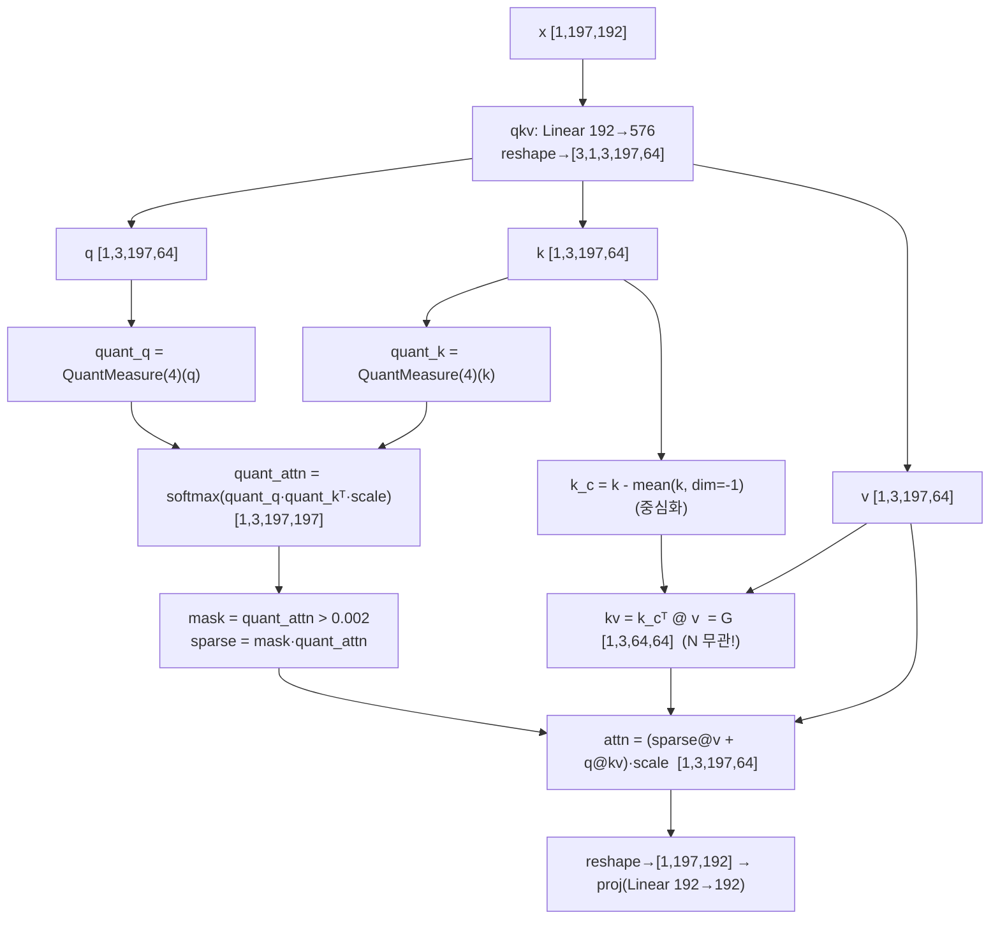
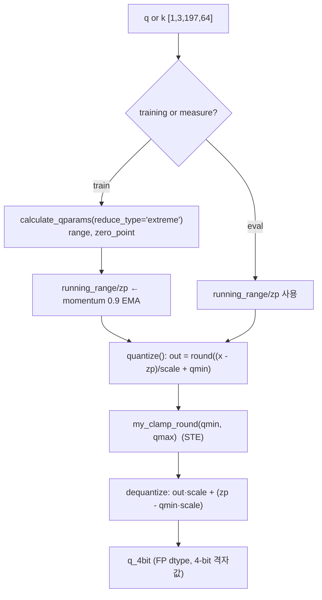
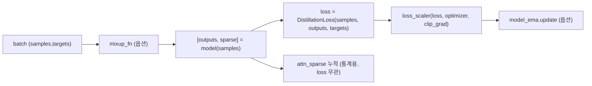

# ViTALiTy 모듈 통합 가이드 (S-PyTorch)

> 1차 요약: [`../ViTALiTy.md`](../ViTALiTy.md) — 본 문서는 그 요약을 모듈 단위로 심화한 통합 가이드다.
> 분석 대상: `\\wsl.localhost\ubuntu-24.04\home\user\project\PRJXR-HBTXR\REF\ViT-Quantization\ViTALiTy`
> 작성 원칙: 실제 소스 Read 후 `파일:라인` 근거 표기. 라인 근거 없는 추론은 "추정", 코드로 확인 불가는 "확인 불가"로 명시.
> 형제 가이드(`REF/Analysis/ViT-Quantization/I-ViT/MODULE_GUIDE.md`)의 6요소 구조를 따르되, HW 지표(MAC lanes/scalar MACs)는 **S-PyTorch 수치 규약**(params/FLOPs/MACs/activation memory/Taylor 차수·low-rank/sparse)으로 치환한다.
> 배경: ViTALiTy(HPCA'23, GATECH-EIC) — **low-rank Linear Taylor(차수 m=1) attention + sparse 보강**의 알고리즘-가속기 co-design. 본 repo는 **DeiT 포크의 알고리즘 측**만 담고, 전용 가속기(systolic array/pre-post processor)는 본 repo에 RTL 부재(논문·그림만). 관련 HW 가이드: `REF/Analysis/Transformer-Accel/efficient-transformer-accelerator/MODULE_GUIDE.md`.

---

## 0. 문서 머리말

### 0.1 대표 케이스 선정
- **대표 모델: `deit_tiny_patch16_224` (DeiT-T)** — `embed_dim=192, depth=12, num_heads=3, mlp_ratio=4, patch16, img224` (`models.py:62-65`). 근거:
  1. README의 학습/추론 예시 4종이 **모두 `deit_tiny_patch16_224`** 단일 모델(`README.md:50-61`). 본 repo의 공식 대표 케이스.
  2. ViTALiTy attention(Linear Taylor + sparse)은 모델 크기와 무관한 알고리즘 변형이므로 분석은 DeiT-T로 충분하고, 일부 정량은 비교 가능성을 위해 **DeiT-S(384/12/6, `models.py:77-80`)** 병기.
- **대표 분석 단위: `Attention` 1개** = `qkv(Linear) → [vitality 분기] → proj(Linear)` (`vision_transformer.py:92-137`). vitality=True일 때 내부에 **sparse(4-bit softmax 잔차) + low-rank(Taylor G=KᵀV) 2경로**. `Block`(`:140-160`)이 `LayerNorm → Attention → residual → LayerNorm → Mlp → residual`로 감싸고, DeiT-T는 이 Block 12개 적층(`:212-216`).
- **대표 알고리즘 3요소**: (1) **Linear Taylor attention** `q@(KᵀV)` 전역 컨텍스트(`:122-126`), (2) **sparse 보강** 4-bit softmax + 임계 0.002 마스킹(`:116-120`), (3) **q/k 4-bit `QuantMeasure`**(`:105,116`). — FPGA attention 선형화의 직접 청사진.

### 0.2 S-PyTorch 수치 규약 (HW의 MAC lanes/scalar MACs 대체)
- **params**: 모듈 차원에서 분석적 계산. Linear `in·out (+out bias)`, LayerNorm `2·C`, Conv `Cout·Cin·Kh·Kw (+Cout)`. ViTALiTy는 **표준 FP 모델에 attention forward만 교체**(`vision_transformer.py:115-128`)하므로 **params는 vanilla DeiT와 동일**(추가 학습 파라미터 없음 — `QuantMeasure`는 running buffer만, `quantize.py:230-231`).
- **FLOPs/MACs (핵심: softmax vs linear 복잡도 대비)**:
  - **vanilla softmax attention**(`:130-133`): QKᵀ `B·H·N²·dh` + AV `B·H·N²·dh` = **O(N²·d)** (N에 제곱).
  - **ViTALiTy low-rank Taylor**(`:124,126` `q@kv`): G=KᵀV `B·H·dh·N·dh` + Q·G `B·H·N·dh·dh` = **O(N·d²)** (N에 선형).
  - 단 본 repo 코드는 **학습용으로 sparse 경로(`:117-120,126` `sparse@v`, N² softmax)를 항상 함께 계산** → 코드 그대로의 추론은 O(N²)+O(N·d²)로 vanilla보다 무겁다. 논문 설계상 **추론 시 sparse 제거 → 순수 O(N·d²)** (README Fig.1-iii, `README.md:26`). 본 repo에는 sparse 제거 추론 스위치가 없음(확인 불가).
- **activation memory**: 텐서 shape × 비트폭. low-rank 경로의 `kv=KᵀV`는 **[B,H,dh,dh]로 N 무관**(`:124`) → 고정 크기. sparse 경로의 `quant_attn`은 [B,H,N,N]로 N² (`:117`).
- **Taylor 근사 차수**: softmax `exp(qkᵀ)≈1+qkᵀ`의 **1차 전개(m=1)**가 low-rank 항, **고차항(m>1)≈softmax**를 sparse로 근사(`README.md:25-26`). 코드의 `q@kv`가 1차항, `sparse@v`가 고차 근사항.
- **비트폭/observer**: 코드 직접. q/k는 **4-bit**(`QuantMeasure(4)`, `:105,116`), `quant_16`은 16-bit로 정의되나 forward에서 **미사용**(`:106`, dead). observer = running min/max + EMA(momentum 0.9, `quantize.py:236,255-258`), reduce_type='extreme'(`:248`).
- **정확도/속도**: README에 **수치 표 없음**(예시 명령만) → ImageNet Top-1 등 정확도/속도는 **확인 불가**(`README.md` 전수). 논문(arXiv:2211.05109) 본문 의존.

### 0.3 운영 경로 (학습 ↔ 평가; 양자화 연결 관계 ★중요)
```
[모델 생성] create_model(args.model, ..., vitality=args.vitality)   (main.py:248-256)
   │  timm registry → models.py @register_model deit_*  (models.py:61-)
   │  vitality 플래그가 VisionTransformer→Block→Attention로 전파 (vision_transformer.py:174,215,147,103)
   ▼
[FP 사전학습?] pretrained=False (main.py:250) — 본 학습은 from-scratch 또는 --finetune
   │  --finetune 시 checkpoint['model'] 로드 (main.py:258-269)
   ▼
[학습] train_one_epoch(): model.train() → [outputs, sparse]=model(x) → DistillationLoss → loss_scaler
   │  AMP autocast는 주석처리(미사용) (engine.py:36, main 추정)
   │  sparse 통계 누적 (engine.py:40-43)  — attn_sparse 평균만, loss엔 미반영
   ▼
[평가] evaluate(): model.eval() → accuracy top1/5  (engine.py:67-97)
   │  eval 시 QuantMeasure는 running stat 사용 (quantize.py:259-261)
```
- 타깃 디바이스: CUDA 전제(`quantize.py:107,160` scale `.cuda()`, 분산학습 `torch.distributed.launch`, `README.md:52`). CPU 단독 실행은 미검증(확인 불가).
- **양자화 연결 관계 (1차 요약의 "확인 불가" 해소)**:
  - **main.py는 `QLinear/QConv2d/QuantizedLinear/QuantizedMatMul`를 전혀 import/사용하지 않음** (`main.py` grep: `vitality`·`create_model`만, QLinear 등 0건). 모델은 표준 `nn.Linear`(`vision_transformer.py:99,101`, `mlp.py:12,14`)로 구성.
  - **실제 활성 양자화 경로 = `Attention`의 `QuantMeasure(4)`(q/k 4-bit)뿐** (`vision_transformer.py:105,116`). 나머지(`q@kv`, `sparse@v`, qkv/proj Linear)는 **FP**.
  - `quantize.py`의 **QLinear/QConv2d(학습형 비트폭 prec_w, 기울기 양자화)**와 `quant_utils.py`의 **QuantizedLinear/QuantizedMatMul/QuantizedEmbedding**은 **본 forward 경로에 미연결 = dead code**(어느 .py도 이들을 인스턴스화하지 않음; `build_quant_matmul`은 `vision_transformer.py:13`에서 import만 되고 본문 **호출 0건**). → 두 양자화 프레임워크는 **유산/실험 잔재**로 판단(추정, 라인 근거: 호출처 부재).

### 0.4 모델 / 데이터셋 / 정확도 (README 인용)
| 항목 | 값 | 근거 |
|---|---|---|
| 대표 모델 | `deit_tiny_patch16_224` (192/12/3) | `README.md:50-61`, `models.py:62-65` |
| 데이터셋 | ImageNet (`--data-path`) | `README.md:52` |
| 학습 설정(예시) | lr 1e-4, epochs 300, batch 256, 8 GPU | `README.md:52,55` |
| 정확도 수치 | **README에 없음 → 확인 불가** | `README.md` 전수 |
| 속도/지연 | HW 가속기(논문) — 본 repo RTL 부재 → 확인 불가 | `README.md:37-44` |
- 비교용 변형: `deit_small/base_patch16_224`, distilled, 384 해상도 (`models.py:76-178`).

---

## 1. Repo / Layer 개요

ViTALiTy = **softmax attention을 선형 복잡도 Taylor attention(low-rank G=KᵀV)으로 대체**하고, 정확도 보강을 위해 **sparse(4-bit softmax 잔차) 항**을 학습 시 병합하는 ViT 변형(`README.md:17-19`, `vision_transformer.py:115-128`). 본 repo는 **facebookresearch/deit 포크**(`README.md:64`)로, 양자화·학습 인프라(DataLoader/optim/scheduler/Mixup/EMA/accuracy)는 timm을 그대로 임포트하고, 자체 기여는 `Attention.forward`의 vitality 분기와 q/k 4-bit `QuantMeasure`다.

### 1.1 자체 소스 vs 외부 프레임워크 vs 제외
| 구분 | 파일(자체 소스) | 역할 |
|---|---|---|
| **핵심 알고리즘** ★ | `src/vision_transformer.py` | `Attention`(Taylor low-rank + sparse), `Block`, `VisionTransformer` |
| **활성 양자화(연결됨)** ★ | `src/quantize.py` | `QuantMeasure`(running min/max + EMA fake-quant) — **Attention의 q/k 4-bit만 실사용** |
| **양자화(미연결/dead)** | `src/quantize.py` | `QConv2d/QLinear`(학습형 비트폭 prec_w + 기울기 양자화 CPT), `RangeBN` — forward 미연결 |
| | `src/quant_utils.py` | Intel식 `QuantizedLinear/QuantizedMatMul/QuantizedEmbedding`(대칭 EMA QAT) — forward 미연결 |
| **모델 팩토리(DeiT fork)** | `src/models.py` | `deit_*_patch16_224` @register_model, `DistilledVisionTransformer` |
| **모델 보조** | `src/mlp.py` | `Mlp`(표준), DwMlp/GluMlp/GatedMlp(미사용 변형) |
| | `src/patch_embed.py`, `src/drop.py` | PatchEmbed, DropPath (미열람 세부) |
| **학습/평가 엔트리** | `src/main.py` | argparse, create_model, 학습/평가 디스패치 |
| | `src/engine.py` | `train_one_epoch`/`evaluate` 루프 |
| **학습 보조** | `src/losses.py`(DistillationLoss), `src/datasets.py`, `src/samplers.py`, `src/utils.py` | 손실/데이터/유틸 (미열람 세부) |

### 1.2 forward 진입점
`VisionTransformer.forward`(`vision_transformer.py:292-306`) → `forward_features`(`:275-290`):
`patch_embed` → `cls_token` cat → `+pos_embed`(`:282`) → `blocks`([x, attn_list] 페어 전파, `:283-285`) → `norm`(LayerNorm) → cls 추출 → `head`(Linear). 반환은 `(logits, np.array(sparse_list))`(`:306`) — sparse_list는 전역 누적용(`:81-82,293-294`). Block은 `[x, attn_list]` 리스트를 in/out으로 받아 attn을 누적(`:154-160`).

### 1.3 제외 (지시에 따라 이름만 표기, 미분석)
- **외부 프레임워크(커스텀 아님)**: `timm.models.create_model/register_model/layers.trunc_normal_`(`main.py:14`, `models.py:8-9`), `timm.data.Mixup`, `timm.utils.{accuracy,ModelEma}`(`engine.py:12-13`). DeiT 원본 사전학습 `.pth`(torch.hub URL, `models.py:68-71` 등) — 가중치만 로드.
- **DeiT/timm 기원 보일러플레이트**: `trunc_normal_`/`_init_vit_weights`(`vision_transformer.py:16-69,309-342`)는 timm 복붙(주석 명시 `:17`). `_cfg`(`:71-79`).
- **미사용 모델 변형(자체 소스이나 본 실험 경로 밖)**: `resmlp_models.py`, `patchconvnet_models.py`, `mlp.py`의 DwMlp/GluMlp/GatedMlp/ConvMlp, `vision_transformer.py:84-90` FNetBlock. `run_with_submitit.py`(클러스터 제출).
- **미열람(확인 불가)**: `patch_embed.py`/`drop.py`/`datasets.py`/`samplers.py`/`utils.py`/`losses.py` 세부, `requirement.txt`.

### 1.4 대표 모델 레이어 구성 (DeiT-T)
`forward_features`(`:275-290`): PatchEmbed(16×16 conv) → +cls/pos → Block×12 → LayerNorm → head. 1 Block(`:154-160`)당 Linear 2개(qkv `dim→3dim`, proj `dim→dim`) + Mlp Linear 2개(fc1 `dim→4dim`, fc2 `4dim→dim`) + LayerNorm 2개 + GELU 1개. vitality=True면 Attention 내 `QuantMeasure(4)` 2개(q,k) 추가(`:105`).

---

## 2. 모듈: Linear Taylor Attention — `vision_transformer.py` (`Attention`) ★★핵심

### 2.1 역할 + 상위/하위
- **역할**: softmax attention을 **1차 Taylor 전개**로 분해. **low-rank 전역 컨텍스트 G=KᵀV**(선형 복잡도)에 **sparse 고차 보강**(4-bit softmax 잔차)을 더해 출력. vanilla 경로(`vitality=False`)도 보존.
- **상위**: `Block.attn`(`:147`) ← `VisionTransformer.blocks`(`:212-216`). **하위**: `nn.Linear`(qkv/proj, `:99,101`), `QuantMeasure`(`quantize.py:224`), softmax/matmul.

### 2.2 데이터플로우 (텐서 shape 흐름, DeiT-T: B=1,N=197,C=192,H=3,dh=64; vitality=True)


### 2.3 forward call stack
`Block.forward`(`:156`) → `Attention.forward(self.norm1(x))`(`:108`) → `qkv`(`:111`) → vitality 분기(`:115`) → `QuantMeasure.forward(q,4)`/`(k,4)`(`:116` → `quantize.py:243`) → `softmax`(`:118`) → 마스킹(`:119-120`) → 중심화(`:122`) → `kv=kᵀ@v`(`:124`) → `attn=(sparse@v+q@kv)·scale`(`:126`) → `proj`(`:135`). 반환 `(x, attn)`(`:137`).

### 2.4 대표 코드 위치
`vision_transformer.py`: 생성자 `:93-106`, vitality 분기 `:115-128`, sparse 항 `:116-120`, low-rank 항 `:122-126`, vanilla 경로 `:130-133`.

### 2.5 대표 코드 블록

```python
# vision_transformer.py:115-126  ViTALiTy Algorithm 1 (학습 경로: sparse + low-rank 동시 계산)
if self.vitality:
    quant_q, quant_k = self.quant(q, 4), self.quant(k, 4)          # q,k 4-bit fake-quant
    quant_attn = (quant_q @ quant_k.transpose(-2, -1)) * self.scale
    quant_attn = quant_attn.softmax(dim=-1)                        # 고차항≈softmax
    mask = quant_attn > 0.002                                      # 임계 마스킹(희소화)
    sparse = mask * quant_attn                                     # sparse 보강 항

    k = k - k.mean(dim=-1, keepdim=True)                           # 키 중심화 (Taylor 안정화)
    kv = k.transpose(-2, -1) @ v                                   # G = KᵀV  [B,H,dh,dh] (N 무관)
    attn = (sparse @ v + ( q @ kv )) * self.scale                 # sparse·V(고차) + Q·G(1차 low-rank)
```
→ **핵심 정밀 해부**:
- `q @ kv`(`:126`) = `Q·(KᵀV)`. 결합법칙으로 `(QKᵀ)V`(O(N²d)) 대신 **`Q(KᵀV)`(O(Nd²))** 계산. `kv`는 **[B,H,dh,dh]=N 무관 고정 크기**(dh=64 → 64×64) → systolic array에 고정 타일 매핑 최적.
- `k - mean(k)`(`:122`)는 1차 Taylor `1+qkᵀ`의 상수항(`1`)이 행마다 동일 기여하는 것을 키 중심화로 흡수/안정화하는 처리(추정 — 논문 Algorithm 1 대응).
- `sparse`(`:120`)는 **별도 4-bit q/k로 만든 softmax를 임계 0.002로 희소화**한 행렬. 곧 고차 Taylor항(≈softmax) 근사. 출력에 `sparse@v`로 합산(`:126`). **추론 시 이 항을 제거하면 순수 선형**(README Fig.1-iii) — 단 본 코드엔 제거 스위치 없음.
- `scale = dh^-0.5`(`:97`)가 `sparse@v + q@kv` 전체에 한 번 곱해짐(`:126`) — vanilla(`:130`)는 QKᵀ에만 곱하는 것과 위치 다름(근사식 차이).

```python
# vision_transformer.py:130-133  vanilla softmax 경로 (vitality=False, 비교용)
attn = (q @ k.transpose(-2, -1)) * self.scale     # QKᵀ  O(N²·d)
attn = attn.softmax(dim=-1)
x = (drop_attn @ v).transpose(1, 2).reshape(B, N, C)
```

### 2.6 연산·수치표현 분해 + 정량 (DeiT-T, B=1, N=197, H=3, dh=64; C=192)
- **양자화 방식**: q/k만 4-bit fake-quant(`QuantMeasure(4)`, 비대칭 min/max, `quantize.py:154-177`). v·proj·qkv·`q@kv`는 **FP**. → **부분 양자화(q,k 4-bit) + FP low-rank**.
- **Taylor 차수**: low-rank=1차(m=1), sparse=고차(m>1) 근사. (`README.md:25-26`)
- **params** (DeiT-T 1 Attention, C=192): qkv `192×576+0`(qkv_bias=True면 +576) ≈ **110,592~111,168**, proj `192×192+192` ≈ **37,056**. Attention/block ≈ **148K**. `QuantMeasure` 학습 params=0(buffer만). ×12 block.
- **MACs/block — softmax vs linear 대비(B=1)**:
  - **sparse 경로**(학습 시): `quant_q@quant_kᵀ` H·N²·dh = 3×197²×64 ≈ **7.45M** + `sparse@v` 3×197²×64 ≈ **7.45M** = **~14.9M** (O(N²)).
  - **low-rank 경로**: `kv=kᵀ@v` H·dh·N·dh = 3×64×197×64 ≈ **2.42M** + `q@kv` 3×197×64×64 ≈ **2.42M** = **~4.84M** (O(N·d²)).
  - **코드 그대로(학습) 합** ≈ 19.7M/block. **추론 시 sparse 제거하면** ≈ 4.84M/block (vanilla softmax 14.9M 대비 **~3.1× 감소**, DeiT-T 기준). N↑일수록 격차 확대(N²→N·d²).
- **activation memory** (가장 큰 중간 텐서):
  - sparse `quant_attn`/`sparse`: [1,3,197,197] FP32 ≈ 3×197²×4 ≈ **466 KB** (N² 지배).
  - low-rank `kv`(G): [1,3,64,64] FP32 = 3×64²×4 ≈ **48 KB** (**N 무관 고정**) — sparse 대비 ~10×↓.
- **시사**: low-rank `kv`가 토큰 수 N에 무관한 64×64 고정 행렬 → FPGA에서 **N-독립 고정 버퍼**로 systolic array에 매핑. sparse는 N² → 추론 제거가 HW 단순화 핵심.

---

## 3. 모듈: 활성 양자화 (연결됨) — `quantize.py` (`QuantMeasure`) ★실사용 양자화

### 3.1 역할 + 상위/하위
- **역할**: 입력을 **running min/max + EMA**로 추적해 fake-quant. ViTALiTy에서 **유일하게 forward에 연결된 양자화 모듈** — Attention의 q/k를 4-bit로.
- **상위**: `Attention.quant=QuantMeasure(4)`(`vision_transformer.py:105`). **하위**: `quantize()`(`:214`) → `UniformQuantize.quantize`(`:128-177`) → `my_clamp_round`(STE, `:54-72`), `calculate_qparams`(`:32-51`).

### 3.2 데이터플로우 (텐서 shape 흐름)


### 3.3 forward call stack
`Attention.forward`(`vision_transformer.py:116`) → `QuantMeasure.forward(q, 4)`(`quantize.py:243`) → train이면 `calculate_qparams(...'extreme')`(`:247-248`) + EMA 갱신(`:255-258`); eval이면 running buffer(`:260-261`) → `quantize(...)`(`:265`) → `UniformQuantize.quantize`(`:128`) → `my_clamp_round.apply`(`:171`).

### 3.4 대표 코드 위치
`quantize.py`: `QuantMeasure` `:224-267`, EMA 갱신 `:245-258`, eval 분기 `:259-261`, `UniformQuantize.quantize` `:128-177`, `calculate_qparams` `:32-51`, `my_clamp_round`(STE) `:54-72`.

### 3.5 대표 코드 블록

```python
# quantize.py:154-177  비대칭 균일 양자화 + dequant (zero_point = min)
qmin = -(2.**(prec-1)) if signed else 0.        # signed=False(기본) → qmin=0
qmax = qmin + 2.**prec - 1.                      # 4-bit → [0, 15]
scale = qparams.range / (qmax - qmin)            # range=max-min (비대칭)
output.add_(qmin*scale - zero_point).div_(scale) # (x - min)/scale
output = my_clamp_round().apply(output, qmin, int(qmax))   # round+clamp, STE
if dequantize:
    output.mul_(scale).add_(zero_point - qmin*scale)       # 역양자화
```
→ **비대칭(zero_point=min)** 양자화. I-ViT의 대칭(zp=0)과 대조 — HW에서 zero-point 가산 필요. 4-bit·signed=False → 격자 `[0,15]`.

```python
# quantize.py:64-72  my_clamp_round STE — round/clamp의 그래디언트를 항등 통과
def backward(ctx, grad_output):
    grad_input = grad_output.clone()    # my impl: 전 범위 backprop (clamp 마스킹 안 함)
    return grad_input, None, None
```
→ 클램프 범위 밖도 그래디언트를 통과(주석 `:70` "backprop for all range") — 표준 STE보다 공격적. 학습형 양자화 안정화 의도(추정).

```python
# quantize.py:243-261  QuantMeasure: train=EMA 갱신, eval=running buffer
if self.training or self.measure:
    qparams = calculate_qparams(input, num_bits=bits, ..., reduce_type='extreme')  # :248
    self.running_zero_point.mul_(momentum).add_(qparams.zero_point*(1-momentum))   # :255
    self.running_range.mul_(momentum).add_(qparams.range*(1-momentum))             # :257
else:
    qparams = QParams(range=self.running_range, zero_point=self.running_zero_point, num_bits=bits)
```

### 3.6 연산·수치표현 분해 + 정량
- **양자화 방식**: 비대칭(zp=min) 균일, per-tensor(shape_measure=(1,1,1), `vision_transformer.py:105`). observer=running min/max EMA(momentum 0.9, `quantize.py:236`), reduce_type='extreme'(`:248`).
- **비트폭**: q/k **4-bit**(`:105,116`). `quant_16`=16-bit는 정의되나 **forward 미사용**(dead, `:106`).
- **params**: 0 학습 파라미터(buffer만: `running_zero_point [1,1,1]`, `running_range [1,1,1]`, `quantize.py:230-231`).
- **activation bit**: 4-bit(q,k 격자). 출력은 FP dtype 유지(dequant, `:173-175`) → 실제 메모리 FP32, HW 환산 4-bit.
- **시사**: q/k 4-bit + sparse 임계가 ViTALiTy의 유일한 정밀도 절감 지점. FPGA에서 sparse 경로 PE를 **4-bit MAC**으로, low-rank 경로를 FP/고비트로 차등 설계(경로별 차등 비트폭의 근거).

---

## 4. 모듈: 학습형 비트폭 양자화 (미연결/dead) — `quantize.py` (`QConv2d`/`QLinear`/`UniformQuantizeGrad`)

> ⚠️ 본 모듈군은 ViTALiTy forward 경로에 **인스턴스화되지 않음**(`main.py`·`vision_transformer.py`·`mlp.py`·`models.py` 어디서도 `QConv2d`/`QLinear` 호출 0건). CPT(Cyclic Precision Training) 계열 유산 코드로 판단(추정). 우리 프로젝트에 **레시피 참고용**으로만 분석.

### 4.1 역할 + 상위/하위
- **역할**: 가중치/활성/**기울기**를 모두 양자화하며, **비트폭 자체를 학습 가능 파라미터 `prec_w`로 두는 mixed-precision**(`quantize.py:291,431`). `fix_bit`로 고정 비트 평가 경로 제공.
- **상위**: 없음(미연결). **하위**: `quantize`/`quantize_grad`(`:214,218`), `fake_weight`(`:221`), `QuantMeasure`(`:280,424`).

### 4.2~4.4 데이터플로우 / call stack / 위치
- 데이터플로우(설계상): `prec_w(0~1) → curr_num_bit = round(prec_w·(max_bit-min_bit)+min_bit)`(`:341`) → 입력/가중치 양자화 → `F.linear`/`F.conv2d` → **출력 그래디언트 양자화**(`quantize_grad`, `:371,459`).
- `QLinear.forward` `:437-494`, `QConv2d.forward` `:296-413`, `UniformQuantizeGrad` `:180-209`, `RangeBN` `:499-564`.

### 4.5 대표 코드 블록
```python
# quantize.py:341-351  학습형 비트폭 prec_w → 정수 비트 + per-channel weight 양자화
curr_num_bit = round(self.prec_w.item() * (self.max_bit - self.min_bit) + self.min_bit)  # :341
qinput = self.quantize_input(input, num_bits, prec_sf=self.prec_w, max_bit=..., min_bit=...)
weight_qparams = calculate_qparams(self.weight.detach(), num_bits=curr_num_bit, flatten_dims=(1,-1), reduce_dim=None)
qweight = quantize(self.weight.detach(), qparams=weight_qparams, prec_sf=self.prec_w, ...)
qweight = qweight - fake_weight(...).detach() + fake_weight(...)   # STE 트릭(미분 가능 양자화)
```

```python
# quantize.py:204-208  UniformQuantizeGrad: backward에서 그래디언트도 양자화 (CPT)
qparams = calculate_qparams(grad_output, num_bits=ctx.num_bits, ..., reduce_type='extreme')  # :204
grad_input = quantize(grad_output, qparams=qparams, ..., stochastic=ctx.stochastic)          # :206
```
→ forward는 항등(`:193`), backward에서 grad를 extreme-range로 양자화 → **저정밀 학습(quantized gradient)**.

### 4.6 정량 / 결함
- `max_bit=8, min_bit=3`(`:275,420`) → 비트폭 학습 범위 [3,8]. `prec_w=nn.Parameter`(학습 대상).
- **코드 결함(라인 근거)**: `FakeWeight.forward`(`:75-120`)가 `prec_sf`(`:91`), `min_bit`/`max_bit`를 **함수 인자/전역 어디에도 정의 없이 참조** → 호출 시 `NameError`. `fake_weight()`(`:221`)가 `FakeWeight().apply(input)`만 넘겨(`:222`) qparams 미전달 → 정상 호출 불가. → **이 모듈군이 실행 경로 밖임을 방증**(미연결, 확인).
- **params**: 미연결로 모델 params에 미반영. 연결 시 layer당 `prec_w` 1개 추가.
- **시사**: 학습형 비트폭은 SW 학습 단계 산물 → 최종 결정된 per-layer 비트폭만 RTL에 반영(직접 HW화 불가). 우리 프로젝트엔 **참고용 레시피**.

---

## 5. 모듈: 대칭 QAT (미연결/dead) — `quant_utils.py` (`QuantizedLinear`/`QuantizedMatMul`)

> ⚠️ Intel NLP-architect 포팅(`quant_utils.py:1-3`). `build_quant_matmul`은 `vision_transformer.py:13`에서 **import만, 호출 0건**. `QuantizedLinear/MatMul/Embedding` 모두 모델에 미인스턴스화 → **dead code**. attention matmul 정수화 청사진으로만 분석.

### 5.1 역할 + 상위/하위
- **역할**: 대칭(zp=0) 양자화 기반 QAT. `QuantizedLinear`는 추론 시 **정수 연산 시뮬레이션 + 32-bit 누산 bias**, `QuantizedMatMul`은 attention matmul을 2/4/6/8-bit 대칭 양자화.
- **상위**: (설계상) `build_quant_matmul`(`:479`). 실제 호출처 없음. **하위**: `_fake_quantize`(`:68`), `quantize/dequantize`(`:33,39`), `get_scale`(`:23`).

### 5.2~5.4 데이터플로우 / call stack / 위치
- `QuantizedMatMul.forward`(`:451-467`): train이면 x/y threshold EMA 갱신(`:457-458`) → `_fake_quantize(x, x_scale, bits)` 양자화 후 `torch.matmul`(`:463-466`). `start_step` 전엔 FP matmul(`:452-454`).
- `QuantizedLinear` `:209-350`, `inference_quantized_forward`(정수 추론) `:268-283`, `_eval`(정수 bias 캐시) `:285-291`.

### 5.5 대표 코드 블록
```python
# quant_utils.py:23-36  대칭 양자화 (zero_point 없음)
def get_scale(bits, threshold):  return (2**(bits-1)-1) / threshold     # :25
def quantize(input, scale, bits):
    thresh = 2**(bits-1)-1
    return input.mul(scale).round().clamp(-thresh, thresh)              # :33-36  대칭 [-thresh,thresh]
```

```python
# quant_utils.py:461-466  QuantizedMatMul: attention matmul 양자화 (EMA threshold)
x_scale = get_scale(self.input_bits, self.input_x_thresh)
y_scale = get_scale(self.input_bits, self.input_y_thresh)
out = torch.matmul(_fake_quantize(x, x_scale, self.input_bits),
                   _fake_quantize(y, y_scale, self.input_bits))         # 2/4/6/8-bit
```

```python
# quant_utils.py:273-283  QuantizedLinear 정수 추론 시뮬레이션 + 32-bit 누산 bias
self.bias_scale = self.weight_scale * input_scale
out = F.linear(quantize(input,...), self.quantized_weight, self.quantized_bias)  # :275 정수 MAC
out = dequantize(out, self.bias_scale)                                            # :277
# bias는 accumulation_bits=32 (:238)
```
→ **bias 누산 32-bit 명시**(`:238`). I-ViT와 동일 사상(W_scale·A_scale 격자 정수 bias). HW 누산기 폭 사이징 안전 기준.

### 5.6 정량 / 시사
- 대칭, input_bits∈{2,4,6,8}(`:440`), quant_method='sym'만(`:441`). bias 32-bit(`:238`), ema_decay 0.9999(`:229,438`).
- **params**: 미연결 → 0 반영. buffer만(threshold).
- **시사**: 미사용이나 **`QuantizedMatMul`(2/4/6/8-bit 대칭, 32-bit 누산)**은 우리 attention 정수화의 직접 청사진. ViTALiTy 실험엔 q/k 4-bit `QuantMeasure`만 쓰였으므로(0.3절), 이 모듈을 우리가 **재활성화·연결**하면 low-rank matmul까지 정수화 가능(추정).

---

## 6. 모듈: 모델 팩토리 (DeiT fork) — `models.py` / `vision_transformer.py` (`VisionTransformer`)

### 6.1 역할 + 상위/하위
- **역할**: `@register_model deit_*`로 timm registry 등록(`models.py:61-178`), `vitality` 플래그를 VisionTransformer→Block→Attention로 전파. distilled 변형은 dist_token + 2-head(`models.py:20-59`).
- **상위**: `main.py:create_model`(`:248`). **하위**: `VisionTransformer`(`vision_transformer.py:163`), `Block`(`:140`), `PatchEmbed`/`Mlp`/`DropPath`.

### 6.2 데이터플로우


### 6.3 forward call stack
`main.py:248` → `models.py:62 deit_tiny_patch16_224(vitality=True)` → `VisionTransformer.__init__(...vitality=vitality)`(`vision_transformer.py:174`) → `Block(...vitality=vitality)`(`:215`) → `Attention(dim, vitality=vitality,...)`(`:147`) → `self.vitality=vitality`(`:103`) → `QuantMeasure(4)` 생성(`:105`).

### 6.4 대표 코드 위치
`models.py`: 팩토리 `:61-178`(deit_tiny `:62-73`, deit_small `:76-88`), Distilled `:20-59`. `vision_transformer.py`: VisionTransformer `:163-306`, vitality 전파 `:174,215,147,103`.

### 6.5 대표 코드 블록
```python
# models.py:62-73  DeiT-T 팩토리 (vitality는 **kwargs로 VisionTransformer에 전달)
@register_model
def deit_tiny_patch16_224(pretrained=False, **kwargs):
    model = VisionTransformer(patch_size=16, embed_dim=192, depth=12, num_heads=3,
        mlp_ratio=4, qkv_bias=True, norm_layer=partial(nn.LayerNorm, eps=1e-6), **kwargs)
    if pretrained:  # torch.hub deit_tiny .pth 로드 (strict=False)
        model.load_state_dict(checkpoint["model"], strict=False)
```

### 6.6 정량 (params, DeiT-T 전체 분석적 추정)
- Block당 Linear params ≈ qkv(192×576+576=111,168) + proj(192×192+192=37,056) + fc1(192×768+768=148,224) + fc2(768×192+192=147,648) = **~444K** + LayerNorm 2×(2×192)=768. ×12 block ≈ **~5.34M**.
- + patch_embed(conv 16×16×3×192+192≈147,648) + pos_embed(197×192≈37,824) + cls_token(192) + head(192×1000+1000=193,000) + final norm(384). → **DeiT-T 총 ~5.7M params**(분석적 추정, vitality와 무관 — 0.2절). 실측 미실행 → 추정.
- vitality=True 추가 params: `QuantMeasure` buffer만(학습 params 0). → **params는 vanilla와 동일**.

---

## 7. 모듈: 학습 / 평가 엔트리 — `main.py` / `engine.py`

### 7.1 역할 + 상위/하위
- **역할**: argparse → create_model → 분산 DataLoader/optim/scheduler/Mixup/EMA(timm) → `train_one_epoch`/`evaluate` 루프.
- **상위**: CLI(`README.md:50-61`). **하위**: `engine.py`(`:18,67`), timm 컴포넌트.

### 7.2 데이터플로우 (학습 1 step)


### 7.3 forward call stack
`main.py:248`(create_model) → 학습 루프 → `engine.train_one_epoch`(`:18`) → `model(samples)` 반환 `[outputs, sparse]`(`:37`) → `criterion`(`:38`) → `loss_scaler`(`:53`). 평가: `engine.evaluate`(`:67`) → `model.eval()`(`:75`) → `accuracy(...topk=(1,5))`(`:86`).

### 7.4 대표 코드 위치
`engine.py`: `train_one_epoch` `:18-64`, sparse 누적 `:40-43`, `evaluate` `:67-97`. `main.py`: argparse vitality `:173`, create_model `:248-256`, finetune 로드 `:258-269`.

### 7.5 대표 코드 블록
```python
# engine.py:37-43  모델 출력은 (logits, sparse) 페어; sparse는 통계 누적만(loss 미반영)
[outputs, sparse] = model(samples)               # :37
loss = criterion(samples, outputs, targets)      # :38  sparse는 손실에 안 들어감
if attn_sparse is None: attn_sparse = sparse
else: attn_sparse = (attn_sparse + sparse) / 2   # :40-43
```
→ `sparse`(=`np.array(sparse_list)`, `vision_transformer.py:306`)는 **모니터링용 평균**일 뿐 손실/학습에 직접 반영 안 됨. 실제 sparse 보강은 attention forward(`:126`)에서 출력에 합산되는 형태로만 작용.

### 7.6 정량
- AMP autocast는 **주석처리**(`engine.py:36,82`) → 기본 FP32 학습(확인). README 예시: lr 1e-4, epochs 300, batch 256, 8 GPU(`README.md:52`).
- 정확도/속도 측정값 없음 → 확인 불가.

---

## N+1. 한눈 비교표 (모듈 × S-PyTorch 지표)

| # | 모듈 (파일) | 연결? | params(학습) | 대표 MACs/연산 (DeiT-T 1 unit, B=1) | activation mem(대표) | 비트폭 | Taylor/복잡도 |
|---|---|---|---|---|---|---|---|
| 2 | Linear Taylor Attention `vision_transformer.py:92-137` | ✅핵심 | qkv+proj ~148K/blk | low-rank ~4.84M, sparse ~14.9M | kv(G) 48KB(N무관) / sparse 466KB(N²) | q/k 4b, 나머지 FP | m=1 선형 O(Nd²) + 고차 sparse O(N²) |
| 3 | QuantMeasure `quantize.py:224-267` | ✅연결 | 0(buffer) | O(N) div+round | 4b 격자(FP dtype) | 4-bit(q,k) | 비대칭 EMA fake-quant |
| 4 | QConv2d/QLinear/GradQuant `quantize.py:270-564` | ❌dead | (미반영) | — | — | 학습형 [3,8] + grad양자화 | CPT 유산, NameError 결함 |
| 5 | QuantizedLinear/MatMul `quant_utils.py:209-482` | ❌dead | (미반영) | — | — | 대칭 2/4/6/8b, bias 32b | Intel QAT 유산 |
| 6 | 모델 팩토리 `models.py` + `VisionTransformer` | ✅ | DeiT-T ~5.7M | — | — | — | vitality 플래그 전파 |
| 7 | 학습/평가 `main.py`/`engine.py` | ✅ | — | — | — | FP32(AMP 주석) | sparse는 통계만 |

> **핵심 정량 3-5**:
> 1. **복잡도 절감**: low-rank `q@(KᵀV)` = **O(N·d²)** vs vanilla softmax **O(N²·d)**. DeiT-T(N=197)에서 추론 시(sparse 제거) attention MAC **~4.84M vs 14.9M ≈ 3.1×↓**(2.6절). N↑일수록 확대.
> 2. **activation 메모리**: low-rank G(`kv`) [B,H,64,64] = **48KB로 N 무관 고정**, sparse attn [B,H,197,197] = **466KB(N²)**. → 약 10×↓(2.6절).
> 3. **비트폭**: 실사용 양자화는 **q/k 4-bit `QuantMeasure`뿐**(`vision_transformer.py:105,116`). low-rank·proj·qkv는 FP. `quant_16`은 dead(`:106`).
> 4. **params**: DeiT-T ~5.7M(분석적 추정), vitality와 동일(추가 학습 params 0).
> 5. **Taylor 차수**: m=1 전개 → 1차항=low-rank, 고차(m>1)≈softmax→sparse 근사(`README.md:25-26`).

---

## N+2. 학습 · 평가

- **명령**(README, DeiT-T): 학습 `python -m torch.distributed.launch --nproc_per_node=8 --use_env main.py --model deit_tiny_patch16_224 --lr 1e-4 --epochs 300 --batch-size 256 --data-path <IMAGENET> --vitality`; 추론은 `--eval` 추가(`README.md:53-61`).
- **데이터셋**: ImageNet. **AMP는 주석처리(미사용)** → FP32(`engine.py:36`).
- **양자화 학습**: q/k 4-bit `QuantMeasure`가 학습 중 EMA로 range 추적(`quantize.py:255-258`), eval 시 고정(`:260-261`). 별도 QAT 워밍업/캘리브레이션 단계는 코드상 없음(`QuantMeasure`는 항상 켜짐).
- **정확도**: README 수치 부재 → **확인 불가**. 논문(arXiv:2211.05109) 본문 의존.

---

## N+3. FPGA 시사점 (HW 가이드 연계)

> 연계 HW 가이드: `REF/Analysis/Transformer-Accel/efficient-transformer-accelerator/MODULE_GUIDE.md`. ViTALiTy 논문의 전용 가속기(systolic SA-Diag/SA-General + pre/post-processor + 4-level 메모리 + intra-layer pipeline, `README.md:37-44`)는 본 repo에 RTL 부재 → HW 수치는 논문 의존(확인 불가). 아래는 **알고리즘 측 코드에서 직접 도출한 HW 시사점**.

1. **low-rank G=KᵀV의 N-독립 고정 버퍼**(`vision_transformer.py:124`): `kv`가 [B,H,dh,dh]=64×64로 **토큰 수 N 무관**. → FPGA에서 **고정 크기 on-chip 버퍼 + 고정 타일 systolic array**. HG-PIPE류 파이프라인의 메모리 압박(I-ViT는 N² attn이 메모리 지배)을 ViTALiTy는 구조적으로 회피. XR 시선추적의 긴 토큰열/저지연에 직접 부합.
2. **두 matmul의 이종 PE 분할**(논문 SA-Diag/SA-General, `README.md:43`): 코드의 `kv=kᵀ@v`(작은 dh×dh)와 `q@kv`(N×dh)는 크기·형상이 달라 **이종 PE 어레이**로 나눌 근거. 우리가 attention을 heterogeneous datapath로 설계할 직접 레퍼런스.
3. **추론 시 sparse 제거 = 데이터패스 최소화**(README Fig.1-iii, `README.md:26`): 본 코드는 학습용으로 sparse(N² softmax)를 함께 계산하나, **추론 RTL은 low-rank 경로만 구현**하고 sparse는 SW 학습 단계로 분리 → 추론 데이터패스가 순수 선형. Castling-ViT의 switching 사상과 동형 → 교차 참고.
4. **경로별 차등 비트폭**: 실사용 양자화는 q/k 4-bit(`:105,116`). → sparse 경로 PE를 **4-bit MAC**, low-rank 경로를 FP/고비트로 차등. dead 모듈 `QuantizedMatMul`(2/4/6/8b 대칭 + 32-bit 누산, `quant_utils.py:437-482`)을 재활성화하면 low-rank matmul까지 정수화 가능(추정) — **누산기 32-bit는 우리 RTL 누산기 사이징 안전 기준**.
5. **pre/post-processor 매핑**(논문, `README.md:43`): 코드의 `k-mean(k)` 중심화(`:122`), `sparse@v + q@kv` 가산(`:126`), softmax(`:118`)는 논문의 accumulator/divider/adder array(pre-processor)에 대응 → LayerNorm/정규화 전처리 회로 설계의 참조.
6. **본 repo 한계**: ① 학습형 비트폭(`QConv2d/QLinear`)·Intel QAT(`QuantizedLinear/MatMul`)는 **미연결 dead code**(0.3절) → 실험 재현 시 이들이 아닌 q/k 4-bit만 유효함에 유의. ② `FakeWeight` NameError 결함(`quantize.py:91`). ③ 가속기 RTL·정확도 수치 부재 → HW 성능·정확도 **확인 불가**. ④ 시선추적 데이터셋 재학습은 우리 몫(추정).

---

## 부록. 근거 표기
- **확인(라인 인용)**: `vision_transformer.py`(Attention 92-137, vitality 115-128, vanilla 130-133), `quantize.py`(QuantMeasure 224-267, UniformQuantize 128-177, QConv2d/QLinear 270-494, FakeWeight 결함 91), `quant_utils.py`(QuantizedLinear/MatMul 209-482, build_quant_matmul 479), `models.py`(deit_* 팩토리), `main.py`(create_model 248-256, vitality 173, QLinear 호출 0건), `engine.py`(train/eval 18-97), `mlp.py`, `README.md`(전수).
- **추정**: 양자화 dead code 판정(호출처 부재 기반), k-mean 중심화의 Taylor 의미, 경로별 차등 비트폭·이종 PE 매핑 등 FPGA 시사점, DeiT-T params/MACs 분석적 산출(미실행).
- **확인 불가**: 정확도 수치(README 부재), HW 가속기 성능(RTL 부재), `patch_embed.py`/`drop.py`/`datasets.py`/`losses.py` 세부, `requirement.txt`, CPU 실행 가능 여부.
