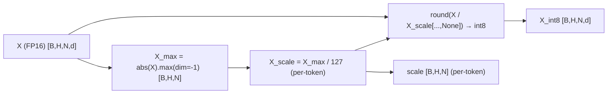
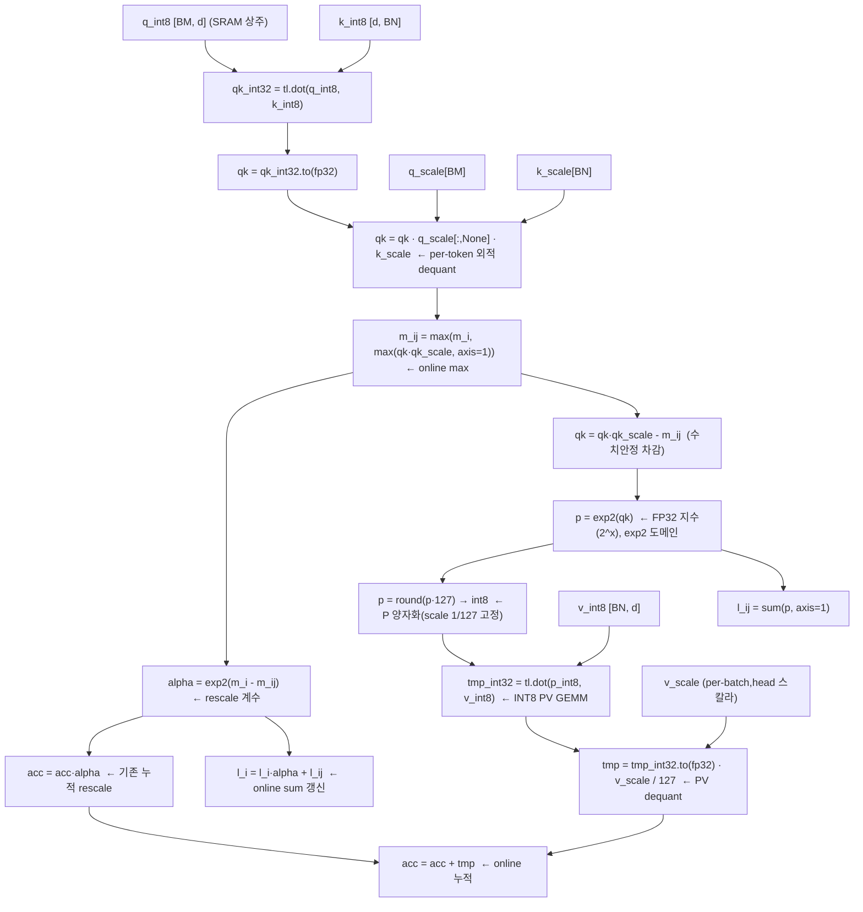
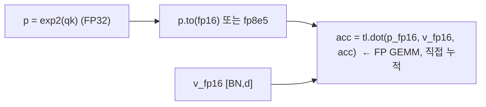
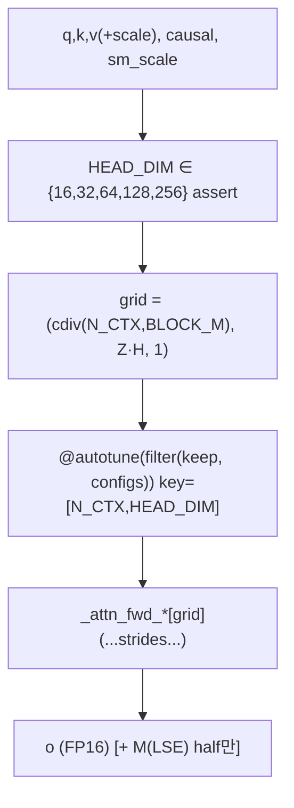
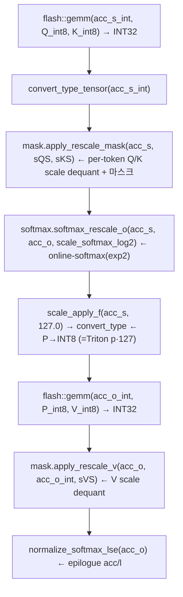

# INT-FlashAttention 모듈 통합 가이드 (S-PyTorch)

> 1차 요약: [`../int-flashattention.md`](../int-flashattention.md) — 본 문서는 그 요약을 모듈(커널/함수) 단위로 심화한 통합 가이드다.
> 분석 대상: `\\wsl.localhost\ubuntu-24.04\home\user\project\PRJXR-HBTXR\REF\ViT-Quantization\int-flashattention`
> 작성 원칙: 실제 소스 Read 후 `파일:라인` 근거 표기. 라인 근거 없는 추론은 "추정", 코드로 확인 불가는 "확인 불가"로 명시.
> 형제 가이드 `REF/Analysis/ViT-Quantization/I-ViT/MODULE_GUIDE.md`의 6요소 구조를 따르되, 본 repo는 **학습이 없는 INT8 FlashAttention 커널**이므로 HW 지표(MAC lanes 등)는 **S-PyTorch 수치 규약**(텐서 shape/FLOPs/activation memory/비트폭/online-softmax 타일)으로 치환한다. I-ViT가 "정수 비선형 모듈" 청사진이라면, 본 repo는 "**정수 어텐션 데이터플로우(타일 online-softmax)**" 청사진이다.

---

## 0. 문서 머리말

### 0.1 대표 케이스 선정
- **대표 케이스: full-INT8 FlashAttention 1 쿼리블록 (1 row-block) on Triton** = `_attn_fwd_inner_full_int8`(`flash_atten_full_int8.py:9-71`). 근거:
  1. Q·K·V 전부 INT8이라 **두 GEMM(QKᵀ, PV)이 모두 정수**가 되는 유일한 경로 → FPGA 어텐션 데이터패스 동질화(INT8 PE 재사용)의 직접 청사진(1차 요약 §8, `:49-62`).
  2. half-INT8(`flash_atten_int8.py`, Q·K만 INT8, V는 FP16)은 PV가 FP라 부분 정수화 → 본 가이드는 두 경로를 모두 해부하되 full-INT8을 대표 수치로 삼고 half를 대조.
- **대표 분석 단위: 1 쿼리블록(BLOCK_M개 토큰)의 K/V 전 블록 순회 inner loop** = `for start_n in range(lo, hi, BLOCK_N)`(`:30`). 이 루프 1회가 (a) INT8 QKᵀ GEMM → dequant → (b) online-softmax(FP32) → (c) P→INT8 양자화 → (d) INT8 PV GEMM → dequant → (e) online 누적 의 한 타일 step.
- **대표 GPU/커널 언어**: Triton `.py` 3종이 자체 핵심(`README.md:9`), CUDA `csrc/`는 대부분 Tri Dao flash-attention v2.5.7 vendor(`csrc/README.md:1`) + `*_qi8.h` 자체 INT8 파생. **알고리즘 전모는 Triton으로 파악, CUDA는 동형(同形) 확인용**으로 §6에서 교차검증.
- **대표 벤치 config**: `BATCH=4, N_HEADS=32, HEAD_DIM=64, N_CTX=2¹⁰~2¹⁴`(`benchmark.py:23,30`). 정확도 테스트 기본은 `BATCH=1,H=1,N_CTX=32,HEAD_DIM=32`(`benchmark.py:212`).

### 0.2 S-PyTorch 수치 규약 (HW의 MAC lanes/scalar MACs 대체)
- **params**: 어텐션 커널은 **학습 파라미터 0** (Q/K/V는 외부에서 들어오는 활성). I-ViT처럼 가중치를 갖지 않는 순수 연산 커널이므로 params는 전 모듈 0이며, 대신 **scale 텐서 크기**(per-token/per-tensor)를 보조 메타데이터로 표기.
- **FLOPs/MACs**: 표준식 `attention ≈ 2·S²·d` (두 GEMM 합). 본 repo 자체 계산식 `flops_per_matmul = 2·BATCH·H·N_CTX²·HEAD_DIM`, `total_flops = 2·flops_per_matmul`(`benchmark.py:90-91`). 대표 config(B=4,H=32,d=64)로 N_CTX별 산출.
- **activation memory**: 타일 단위. SRAM에 상주하는 것은 q블록(BLOCK_M×HEAD_DIM), K/V블록(BLOCK_N×HEAD_DIM), acc(BLOCK_M×HEAD_DIM FP32), 통계 m_i/l_i(BLOCK_M). **online-softmax 덕에 N² attn 행렬은 메모리에 머티리얼라이즈되지 않음**(FlashAttention 핵심) — I-ViT가 N² attn(466KB)을 한 번에 들고 있던 것과 대조되는 결정적 차이.
- **비트폭/scale**: 코드 직접. Q/K/V **INT8**(`benchmark.py:56-58` `torch.int8`, GEMM `tl.dot`이 INT8×INT8→INT32 누산), GEMM 누산 **INT32**(`tl.dot(q,k)` 결과를 `.to(tl.float32)`로 캐스트, `:36`), online-softmax 통계(m,l,acc) **FP32**(`:152-154`), P 양자화 **INT8(1/127 고정)**(`:50-51`). scale: Q/K **per-token(행) FP16**, V **per-(batch,head) per-tensor FP16**, P **고정 1/127**.
- **online-softmax 타일**: BLOCK_M(쿼리 타일), BLOCK_N(키 타일) ∈ {32,64,128,256}, autotune(`configs.py:13-19`). 1 타일 step당 max/sum 갱신(running max `m_i`, running sum `l_i`, rescale `alpha`).
- **정수 누산 비트폭**: QKᵀ = INT8·INT8→**INT32**(Ampere INT8 Tensor Core), PV = INT8·INT8→**INT32**(`:59` `tl.dot(p,v)`). 본 가이드 "HW 환산 누산 INT32"는 코드의 `tl.dot` 정수 입력으로 확정(추정 아님).
- **정확도/속도**: README/벤치 인용. **본 세션 미실행** → 실측 MRE/latency 수치는 "확인 불가"(벤치 코드 구조만 분석).

### 0.3 운영 경로 (양자화 → 커널 → dequant; 학습 없음)
```
[외부 FP Q,K,V]  (벤치는 torch.rand / 모델에서는 Linear 출력)
   │  quant_pertoken(Q), quant_pertoken(K)  → q8,qs  /  k8,ks   (benchmark.py:96-100)
   │  quant_pertensor(V)                     → v8,vs            (benchmark.py:102-107)
   ▼
[INT8 FlashAttention 커널 호출]
   half-INT8 : attention_int8(q8,k8, V_fp16, qs,ks, causal, sm_scale)        (flash_atten_int8.py:217)
   full-INT8 : attention_full_int8(q8,k8,v8, qs,ks,vs, causal, sm_scale)     (flash_atten_full_int8.py:223)
   │  grid=(cdiv(N_CTX,BLOCK_M), Z·H)  ← 쿼리블록 × (배치·헤드) 병렬          (:197 / :203)
   ▼
[커널 내부 1 row-block]  per query block:
   QKᵀ(INT8→INT32) → ·s_q[i]·s_k[j] dequant → online-softmax(FP32, exp2)
   → [full만] P=round(P·127)→INT8 → PV(INT8→INT32) → ·s_v/127 dequant → acc 누적
   ▼
[epilogue]  acc = acc / l_i ;  [half만] M(LSE) = m_i + log2(l_i) 저장   (:172-176 / :180-182)
   ▼
[정확도 검증]  MRE(int8_out, FP_ref) / MRE(full_int8_out, FP_ref)        (benchmark.py:176-185)
[성능 벤치]    triton.testing.do_bench (vs FP16/FP8/공식 Flash-2)         (benchmark.py:84-88)
```
- 타깃 디바이스: **Ampere+ NVIDIA GPU 전제** — INT8 Tensor Core(`tl.dot` INT8), `device="cuda"`(`benchmark.py:49`), 주석 "only works on post-Ampere GPUs"(`benchmark.py:192`). AMD HIP 분기 존재(`configs.py:7`, `is_hip()` 시 num_stages=1, waves_per_eu). → CPU 단독 실행 불가(코드 근거 확인, 실행 실패는 미검증).

### 0.4 모델 / 데이터셋 / 정확도 (README/벤치 인용)
| 항목 | 값 | 근거 |
|---|---|---|
| 정체 | INT-FlashAttention(arXiv 2409.16997) **공식 구현** | `README.md:1-3` |
| 대상 | 어텐션 커널(모델·데이터셋 비종속, 임의 Q/K/V) | `benchmark.py` 전반 |
| 벤치 입력 | 랜덤(`torch.rand`/`randint(-128,127)`), 학습/실데이터 없음 | `benchmark.py:56-58,140-142` |
| 비교 대상 | Triton FP16 / FP8(e5m2) / int8 / full-int8 / 공식 Flash-2 | `benchmark.py:32-35` |
| 정확도 지표 | MRE(mean relative error), **출력 텐서 마지막 4원소만**(`CALC_NUM=4`) 비교 | `benchmark.py:109-122,176-185` |
| 정확도 수치 | **확인 불가**(본 세션 미실행; README에 표 없음) | — |
| 속도(latency) | **확인 불가**(`do_bench` 구조만, 미실행) | `benchmark.py:84` |
- I-ViT(ImageNet Top-1 표 보유)와 달리 본 repo는 **정확도/속도 정량표가 코드/README에 없음** → 전부 "확인 불가". 단 MRE 검증 *방식*은 분석 가능(§5).

---

## 1. Repo / 커널 개요

INT-FlashAttention = FlashAttention(타일 online-softmax + IO-aware)을 **INT8 양자화와 결합**해 Ampere INT8 Tensor Core로 두 GEMM을 정수 연산하는 추론 커널(`README.md:1-3`, 1차 요약 §1). 자체 핵심은 **Triton 커널 3종**, CUDA는 Tri Dao vendor 베이스 + 자체 INT8 파생.

### 1.1 자체 소스 vs 외부 vendor vs 제외

| 구분 | 파일(자체 소스) | 역할 |
|---|---|---|
| **INT8 커널(half)** | `flash_atten_int8.py` ★핵심 | Q,K INT8 / V FP16. QKᵀ 정수, PV 혼합(FP). online-softmax FP32 |
| **INT8 커널(full)** | `flash_atten_full_int8.py` ★핵심 | Q,K,V 전부 INT8. **두 GEMM 모두 정수**, P를 INT8 재양자화 |
| **FP 기준** | `flash_atten_fp.py` | FP16/FP8 FlashAttention(벤치 베이스, OpenAI Triton tutorial 파생) |
| **양자화 헬퍼·벤치** | `benchmark.py` | quant_pertoken/pertensor, MRE 검증, do_bench 성능, pytest |
| **autotune config** | `configs.py` | BLOCK_M/N, num_stages/warps 그리드 + keep 필터 |
| **CUDA INT8 파생** | `csrc/flash_fwd_kernel_full_qi8.h` ★ | vendor 베이스 + `Element_Int8`·INT8 mainloop(full) |
| | `csrc/flash_fwd_kernel_half_qi8.h` | 동(half: Q/K INT8, V FP) |
| | `csrc/kernel_traits.h`(일부) | `Element_Int8=int8_t`, scale smem 레이아웃(자체 추가) |
| | `csrc/flash_fwd_hdim128_*_{full,half}_qi8.cu` | 위 변형의 hdim128 인스턴스화 |

### 1.2 진입점 (host wrapper)
- **half-INT8**: `_attention_int8.forward(ctx, q,k,v, q_scale,k_scale, causal, sm_scale)`(`flash_atten_int8.py:181-215`) → `_attn_fwd_int8[grid](...)`(`:199`). 출력 `o` FP16(`:189`), LSE `M` FP32 저장(`:198,174-175`).
- **full-INT8**: `_attention_full_int8.forward(ctx, q,k,v, q_scale,k_scale,v_scale, causal, sm_scale)`(`flash_atten_full_int8.py:187-221`) → `_attn_fwd_full_int8[grid](...)`(`:204`). v_scale 추가 인자(`:187`), LSE 미저장(`:180-182`).
- grid = `(cdiv(N_CTX, BLOCK_M), Z·H, 1)`(`:197`/`:203`) — **쿼리블록 × (배치·헤드)** 2D 병렬. 1 program = 1 쿼리블록.

### 1.3 제외 (지시에 따라 이름만 표기, 미분석)
- **외부 vendor(커스텀 아님)**: `csrc/`의 비-qi8 `.cu/.h` 전부 = Tri Dao flash-attention v2.5.7(commit 85881f5) 복사(`csrc/README.md:1`, 헤더 `Copyright (c) 2024, Tri Dao`). `flash_fwd_kernel.h`, `softmax.h`, `mask.h`, `dropout.h`, `rotary.h`, `alibi.h`, `block_info.h`, `utils.h`, `philox.cuh`, `static_switch.h`, `flash.h`, `flash_fwd_launch_template.h`, `kernel_traits_sm90.h`, 그리고 `flash_fwd_{hdim*,split_hdim*}_{fp16,bf16}_sm80*.cu` 일체. cutlass/cute 의존.
- **선택 외부 의존**: `flash_attn`(공식 Flash-2 비교, `benchmark.py:16-20`), `torch.float8_e5m2`(FP8 비교, `:22`).
- **미열람(확인 불가)**: `csrc/*_qi8.h`의 cute/cutlass copy/gemm 인프라 세부(vendor 동일 가정), `mask.h`의 `apply_rescale_mask/apply_rescale_v` 본문(헤더 호출부만 §6 확인), backward(repo가 `flash_bwd_*` 삭제, `csrc/README.md:3` → **forward-only**).

### 1.4 대표 데이터플로우 비교 (half vs full)
| 단계 | half-INT8(`flash_atten_int8.py`) | full-INT8(`flash_atten_full_int8.py`) |
|---|---|---|
| QKᵀ | INT8→INT32→FP32, ·s_q·s_k (`:35-37`) | 동일 (`:36-38`) |
| softmax | FP32 exp2, online max/sum (`:38-52`) | 동일 (`:39-54`) |
| P 처리 | `p.to(fp16/fp8)` (`:55-58`) | `round(p·127)→int8` (`:49-51`) |
| PV | `tl.dot(p, v_fp16, acc)` 누적 (`:59`) | `tl.dot(p_int8, v_int8)`→INT32→·v_scale/127→acc (`:59-62`) |
| epilogue | `acc/l_i`, LSE 저장 (`:172-176`) | `acc/l_i` (`:181-182`) |

---

## 2. 모듈: 입력 양자화 헬퍼 — `benchmark.py` (quant_pertoken / quant_pertensor)

### 2.1 역할 + 상위/하위
- **역할**: 커널에 들어가기 전 FP Q/K/V를 INT8로 변환하고 dequant용 scale 산출. Q/K는 **per-token(마지막 dim별)**, V는 **per-tensor(head_dim·seq 양축)** abs-max 대칭 양자화.
- **상위**: `acc_test`(`benchmark.py:158-162`)가 호출 → 커널에 (int8 텐서, scale) 쌍 공급. **하위**: torch `abs/max/round`. (I-ViT의 `SymmetricQuantFunction`(§2)에 대응하는 "입력단 양자화"지만, 여기선 autograd Function이 아닌 단순 헬퍼 — 학습 없음.)

### 2.2 데이터플로우 (텐서 shape 흐름)


### 2.3 forward call stack
`acc_test`(`benchmark.py:158`) → `quant_pertoken(q)`(`:96`) → `abs().max(dim=-1)`(`:97`) → `round(X/scale).to(int8)`(`:99`). V는 `quant_pertensor(v)`(`:160`→`:102-107`).

### 2.4 대표 코드 위치
`benchmark.py`: `quant_pertoken` `:96-100`, `quant_pertensor` `:102-107`, 호출 `:158-162`.

### 2.5 대표 코드 블록
```python
# benchmark.py:96-100  per-token(행별) 대칭 양자화 — Q/K
def quant_pertoken(X):
    X_max, _ = torch.abs(X).max(dim=-1)        # 마지막 dim(head_dim)별 abs-max → [B,H,N]
    X_scale = X_max / 127                       # 대칭, zero-point 없음 (7-bit 사실상)
    ret = torch.round(X / X_scale[:, :, :, None]).to(torch.int8)
    return ret, X_scale
```
→ **per-token scale**: 토큰(행)마다 별도 scale → QKᵀ dequant 시 `s_q[i]·s_k[j]` 외적(§4). I-ViT의 per-channel(가중치 out축) 대칭과 달리 **활성의 토큰축** 대칭이라는 점이 어텐션 특화.

```python
# benchmark.py:102-107  per-tensor 대칭 양자화 — V
def quant_pertensor(X):
    X_max, _ = torch.abs(X).max(dim=-1)
    X_max, _ = torch.max(X_max, dim=-1)         # head_dim·seq 양축 축약 → [B,H]
    X_scale = X_max / 127
    ret = torch.round(X / X_scale[:, :, None, None]).to(torch.int8)
    return ret, X_scale
```
→ **V는 per-(batch,head) per-tensor** scale 1개. PV dequant 시 스칼라 곱(§3 full-int8).

### 2.6 연산·수치표현 분해 + 정량
- **양자화 방식**: abs-max 대칭(zero-point=0), `scale = max|X|/127` → 정수범위 `[-127,127]`(round로 ±127, `(-128)`은 미사용 → **사실상 unsigned 7-bit 대칭**, 추정 근거 라인 `:98,105`).
- **scale/zp**: Q/K per-token `[B,H,N]`, V per-tensor `[B,H]`, zp=0.
- **비트폭**: 입력 INT8, scale FP16(`benchmark.py:59-61` `dtype=float16`).
- **params**: 0(순수 함수). **scale 메타데이터 크기**: Q/K 각 `B·H·N` FP16, V `B·H` FP16. 대표 N_CTX=4096,B=4,H=32 → Q scale = 4·32·4096·2byte = **1 MB**(per-token scale의 메모리 비용, FPGA 시 BRAM 벡터).
- **FLOPs**: 원소당 abs+div+round = O(B·H·N·d). 대표 = 4·32·4096·64 ≈ 33.5M 원소 ×3(Q,K,V).
- **주의(1차 요약 §7 재확인)**: 벤치 성능 경로는 V scale을 `randn`(음수 포함)으로 생성(`benchmark.py:61`) → 실제 abs-max scale과 다름. shape/속도 측정용이며 정확도(`acc_test`)는 `quant_pertensor`(abs-max)를 정상 사용(`:160`). **추정**: 벤치 편의.

---

## 3. 모듈: full-INT8 inner loop — `flash_atten_full_int8.py` (`_attn_fwd_inner_full_int8`) ★핵심·대표

### 3.1 역할 + 상위/하위
- **역할**: 1 쿼리블록에 대해 K/V 전 블록을 순회하며 **(INT8 QKᵀ → dequant → online-softmax → P INT8화 → INT8 PV → dequant → 누적)** 을 타일 단위로 수행. 두 GEMM 모두 정수.
- **상위**: `_attn_fwd_full_int8`(`flash_atten_full_int8.py:165,175`)가 STAGE별 2회 호출(off-band/on-band). **하위**: `tl.dot`(INT8 GEMM), `tl.math.exp2`, `tl.max/sum`.

### 3.2 데이터플로우 (1 타일 step, online-softmax 정수화 정밀해부)


### 3.3 forward call stack
`_attn_fwd_full_int8`(`:165` STAGE&1, `:175` STAGE&2) → `_attn_fwd_inner_full_int8`(`:9`) → 블록 순회 `for start_n`(`:30`) → `tl.dot(q,k)`(`:36`) → dequant(`:37-38`) → online-softmax(`:39-54`) → P양자화(`:49-51`) → `tl.dot(p,v)`(`:59`) → dequant·누적(`:61-62`).

### 3.4 대표 코드 위치
`flash_atten_full_int8.py`: QKᵀ+dequant `:34-38`, online-softmax(비causal) `:44-48`, online-softmax(causal) `:39-43`, P→INT8 `:49-51`, m/l/acc 갱신 `:53-56`, INT8 PV+dequant `:58-62`, 블록 advance `:67-70`.

### 3.5 대표 코드 블록

```python
# flash_atten_full_int8.py:34-38  INT8 QKᵀ → INT32 누산 → FP32 → per-token 외적 dequant
k = tl.load(K_block_ptr)
k_scale = tl.load(K_block_scale_ptr)        # per-token K scale [BN]
qk = tl.dot(q, k).to(tl.float32)            # INT8×INT8 = INT32 누산 후 FP32 캐스트
qk = qk * q_scale[:, None]                   # 행(쿼리 토큰) scale  s_q[i]
qk = qk * k_scale                            # 열(키 토큰)   scale  s_k[j]
```
→ **dequant 시점 = GEMM 직후, softmax 직전**. `S_fp[i,j] = (Σ_d Q_int·K_int)_int32 · s_q[i] · s_k[j]` = per-token scale **외적**. FPGA에서 systolic INT8 어레이 출력에 행/열 scale 벡터를 곱하는 후처리 스테이지로 1:1 매핑(1차 요약 §8).

```python
# flash_atten_full_int8.py:44-48  online-softmax (비causal): running max + exp2 + sum
m_ij = tl.maximum(m_i, tl.max(qk, 1) * qk_scale)   # 이번 타일 최댓값과 기존 running max 결합
qk = qk * qk_scale - m_ij[:, None]                  # max 차감(수치 안정)
p = tl.math.exp2(qk)                                # 2^x (FP32) — exp 대신 exp2
l_ij = tl.sum(p, 1)                                 # 이번 타일 분모 부분합
```
→ `qk_scale = sm_scale · 1.44269504(=1/ln2)`(`:156-157`)로 **exp를 exp2로 base 변환**. `exp2(x) = 2^⌊x⌋·2^frac`로 분해되므로 FPGA에서 정수 시프트 + 작은 LUT로 합성 가능 → HW 친화 설계와 정확히 일치(1차 요약 §8). **online-softmax의 정수화 정도**: 지수·합·max는 FP32(정수-only 아님), 정수화된 것은 GEMM 입력(QKᵀ, PV)과 P. → I-ViT의 IntSoftmax(지수까지 정수)와 대조: **본 repo는 softmax 비선형부를 FP32로 둠**.

```python
# flash_atten_full_int8.py:49-62  P→INT8 양자화 → online rescale → INT8 PV → dequant 누적
p = p.to(tl.float16); p = p * 127; p = (p + 0.5).to(tl.int8)   # P∈[0,1] → [0,127] round
alpha = tl.math.exp2(m_i - m_ij)        # 이전 누적을 새 max로 보정하는 rescale 계수
l_i = l_i * alpha + l_ij                # running 분모 갱신
acc = acc * alpha[:, None]              # 기존 출력 누적 rescale
v = tl.load(V_block_ptr)               # INT8 V
tmp = tl.dot(p, v)                      # INT8×INT8 = INT32 PV GEMM
tmp = tmp.to(tl.float32)
tmp = tmp * v_scale / 127               # per-(b,h) V scale + P의 1/127 역보정 dequant
acc = acc + tmp                        # online 누적 (정규화는 epilogue에서)
```
→ **P 양자화**: scale=1/127 고정(P∈[0,1] 가정), `(p+0.5)` round, zero-point 없음. **PV dequant**: `O_fp = O_int32 · (s_v / 127)` (P scale 1/127 · V scale s_v). 두 GEMM이 모두 INT8 → **어텐션 데이터패스 동질화**(FPGA에서 동일 INT8 PE 재사용).

### 3.6 연산·수치표현 분해 + 정량 (대표 B=4,H=32,d=64)
- **양자화 방식**: Q/K per-token, V per-tensor, P 고정 1/127, 전부 대칭(zp=0). 두 GEMM INT8→INT32.
- **비트폭**: 입력 INT8, GEMM 누산 **INT32**(`tl.dot` 정수 입력으로 확정), online 통계(m_i,l_i,acc) **FP32**(`:152-154`), P INT8, scale FP16.
- **params**: 0.
- **MACs** (full 양쪽 GEMM 정수, `benchmark.py:90-91`식): QKᵀ + PV = `2·flops_per_matmul = 4·B·H·N²·d`. N_CTX=4096 → `2·(2·4·32·4096²·64)` ≈ **549 GFLOP**(=274.5 GMAC) per forward. N_CTX=1024 → ≈ **34.4 GFLOP**.
- **online-softmax 타일 정량**: BLOCK_M×BLOCK_N 타일당 max/sum 1회, rescale(alpha) 1회. 쿼리블록당 타일 수 = `cdiv(N_CTX,BLOCK_N)`. N_CTX=4096, BLOCK_N=64 → 64 타일 step/쿼리블록.
- **activation memory(SRAM 타일)**: q `BM·d`, k/v 각 `BN·d`, acc `BM·d`(FP32), P `BM·BN`(INT8, **타일 한정** — 전체 N²는 비머티리얼라이즈). BM=BN=128,d=64 → q/k/v 각 16KB(INT8 8K), acc 64KB(FP32), P 16KB. **I-ViT는 attn N²(466KB)를 통째로 들었으나 본 repo는 타일(P 16KB)만** → FlashAttention 메모리 이점.
- **시사**: 두 GEMM 정수화 = FPGA 어텐션 가속의 핵심 패턴. online-softmax 덕에 N² 미저장 → on-chip 메모리 압박 완화(HG-PIPE류 파이프라인에 유리).

---

## 4. 모듈: half-INT8 inner loop — `flash_atten_int8.py` (`_attn_fwd_inner_int8`)

### 4.1 역할 + 상위/하위
- **역할**: Q,K만 INT8(QKᵀ 정수), **V는 FP16**이라 PV는 FP GEMM. online-softmax는 full과 동일. P 양자화 없음(`p.to(fp16)`).
- **상위**: `_attn_fwd_int8`(`flash_atten_int8.py:157,166`). **하위**: `tl.dot`, `tl.math.exp2`.

### 4.2 데이터플로우 (full과의 차이만)

→ full과 달리 P→INT8 양자화·V scale dequant 없음. PV는 **FP**라 정수 데이터패스 미완결.

### 4.3 forward call stack
`_attn_fwd_int8`(`:157/166`) → `_attn_fwd_inner_int8`(`:9`) → QKᵀ+dequant(`:35-37`, full과 동일) → online-softmax(`:38-50`) → `p.to(fp16)`(`:55-58`) → `tl.dot(p,v,acc)`(`:59`).

### 4.4 대표 코드 위치
`flash_atten_int8.py`: QKᵀ+dequant `:35-37`, online-softmax `:38-50`, PV(FP 누적) `:54-59`, epilogue+LSE `:171-176`.

### 4.5 대표 코드 블록
```python
# flash_atten_int8.py:54-59  V는 FP16, P를 FP로 캐스트 후 FP GEMM 누적 (정수 아님)
v = tl.load(V_block_ptr)
if fp8_v:
    p = p.to(tl.float8e5)
else:
    p = p.to(tl.float16)
acc = tl.dot(p, v, acc)          # FP16(또는 fp8) × FP16 → acc 직접 누적
```
→ full-int8(`:59-62`)의 INT8 PV + dequant와 대조. `acc = tl.dot(p, v, acc)`는 **누적을 GEMM 인자로 직접**(rescale은 `:52`에서 사전 적용). LSE 저장(`:172`)도 full엔 없는 half 고유.

### 4.6 연산·수치표현 분해 + 정량
- **양자화 방식**: Q/K per-token INT8(QKᵀ만 정수), V FP16, P FP16/FP8(양자화 없음).
- **비트폭**: QKᵀ INT32 누산 → FP32. PV는 **FP16 누산**(또는 fp8 입력). online 통계 FP32.
- **params**: 0.
- **MACs**: QKᵀ INT8 + PV FP16 = 동일 `4·B·H·N²·d`이나 **절반만 정수**.
- **시사**: P 양자화 오차 회피(P 분포 sharp해도 손실 없음, 1차 요약 §7 한계와 대조) ↔ PV가 FP라 정수 PE 재사용 불가. **정확도-효율 트레이드오프의 두 극단**을 full/half가 각각 대표.

---

## 5. 모듈: host wrapper + autotune — `flash_atten_*.py` 호스트 / `configs.py`

### 5.1 역할 + 상위/하위
- **역할**: 텐서 shape 검증, grid 계산, stride 전달, autotune config 필터로 커널 런치. half는 LSE 버퍼 M 할당, full은 V scale 추가.
- **상위**: `attention_int8`/`attention_full_int8`(`apply`, `:217`/`:223`), `acc_test`/벤치. **하위**: `_attn_fwd_*` 커널, `triton.autotune`.

### 5.2 데이터플로우 (런치 파라미터)


### 5.3 forward call stack
`attention_full_int8`(`flash_atten_full_int8.py:223`) → `_attention_full_int8.forward`(`:187`) → assert(`:192-193`) → grid lambda(`:203`) → `_attn_fwd_full_int8[grid]`(`:204`) ← `@triton.autotune(list(filter(keep, configs)), key=["N_CTX","HEAD_DIM"])`(`:73`).

### 5.4 대표 코드 위치
호스트: `flash_atten_full_int8.py:187-221`(full), `flash_atten_int8.py:181-215`(half). autotune grid: `configs.py:13-19`, keep 필터 `:30-35`. exp2 base 변환 `flash_atten_full_int8.py:156-157`.

### 5.5 대표 코드 블록
```python
# configs.py:13-35  autotune 그리드 + keep 필터
configs = [triton.Config({'BLOCK_M': BM, 'BLOCK_N': BN}, num_stages=s, num_warps=w)
    for BM in [32,64,128,256] for BN in [32,64,128,256]
    for s in ([1] if is_hip() else [3,4,7]) for w in [4,8]]
def keep(conf):
    if conf.kwargs["BLOCK_M"] * conf.kwargs["BLOCK_N"] < 128*128 and conf.num_warps == 8:
        return False                 # 작은 타일에 8 warp 조합 제외
    return True
```
→ **타일 파라미터**: BLOCK_M(쿼리), BLOCK_N(키) ∈ {32,64,128,256}, `tl.static_assert(BLOCK_N <= HEAD_DIM)`(`flash_atten_full_int8.py:88`). HIP은 num_stages=1(소프트웨어 파이프라인 깊이 1). **FPGA 시사**: BLOCK_M/N이 타일 버퍼 크기 = on-chip SRAM 예산 직결.

```python
# flash_atten_full_int8.py:156-157  exp → exp2 base 변환 상수
qk_scale = sm_scale
qk_scale *= 1.44269504  # 1/log(2)
```

### 5.6 연산·수치표현 분해 + 정량
- **양자화 방식**: 호스트는 양자화 안 함(외부 입력 INT8 그대로). dtype 검증·런치만.
- **비트폭**: HEAD_DIM 허용 {16,32,64,128,256}(`:193`), 출력 `o` FP16(`:195`).
- **params**: 0.
- **autotune 공간**: BM·BN·s·w = 4·4·3·2 = 96 config → keep 필터 후 일부 제외. key=(N_CTX, HEAD_DIM)별 재튜닝.
- **시사**: 타일 크기 autotune = HW에선 고정 설계 파라미터로 환원(DSE 대상). exp2 도메인 = softmax LUT 비트 설계 직접 참조.

---

## 6. 모듈: CUDA INT8 변형 — `csrc/flash_fwd_kernel_full_qi8.h` (외부 vendor + 자체 INT8 혼재)

### 6.1 역할 + 상위/하위
- **역할**: Triton full-INT8과 **동형(同形)** CUDA 구현. Tri Dao `compute_attn_1rowblock` 구조에 INT8 경로(`Element_Int8`, scale smem 로딩, INT8 GEMM)를 추가. cutlass/cute MMA로 INT8 Tensor Core 직접 구동.
- **상위**: `compute_attn_full_qi8` → `flash_fwd_*_full_qi8.cu` 인스턴스화(hdim128). **하위**: cute `gemm`, cutlass `convert_type`, vendor `softmax.h`/`mask.h`. 빌드는 공식 flash-attention 참조 필요(`README.md:12`).

### 6.2 데이터플로우 (Triton full과의 대응 — 동형 확인)


### 6.3 forward call stack
`compute_attn_1rowblock_full_qi8`(`:28`) → mainloop 2종(masking `:355-407`, non-masking `:414-469`) → `flash::gemm(acc_s_int, ...)`(`:425-428`) → `convert_type_tensor<float>`(`:356,429`) → `apply_rescale_mask`(`:357,430`) → `softmax_rescale_o`(`:383-384,454`) → `scale_apply_f(acc_s, 127.0f)`(`:387,457`) → `convert_type<Element_Int8>`(`:388,458`) → `flash::gemm(acc_o_int, ...)`(`:395-398,464-467`) → `apply_rescale_v`(`:399,468`).

### 6.4 대표 코드 위치
`csrc/flash_fwd_kernel_full_qi8.h`: scale 멤버 `:45-48`, INT8 텐서 reinterpret `:124,137,150`(Q/K/V), scale 텐서 `:130,143,156`, QKᵀ GEMM `:425`, dequant+mask `:356-357`, online-softmax `:383`, P→INT8 `:387-388`, PV GEMM `:395/:464`, V dequant `:399/:468`, epilogue `:473`. `kernel_traits.h`: `Element_Int8=int8_t` `:28`, scale smem 크기 `:147-150`, scale 로드 단위 `:154-157`.

### 6.5 대표 코드 블록
```cpp
// csrc/flash_fwd_kernel_full_qi8.h:386-399  P→INT8 → INT8 PV GEMM → V scale dequant
// Convert acc_s from fp32 to int8
flash::scale_apply_f(acc_s, 127.0f);                  // = Triton p*127 (P 양자화)
Tensor rP = flash::convert_type<Element_Int8>(acc_s); // → int8
...
flash::gemm(acc_o_int, tOrP, tOrVt, ...);             // INT8×INT8 PV → INT32 acc_o_int
mask.template apply_rescale_v(acc_o, acc_o_int, sVS); // V scale dequant (= Triton ·v_scale/127)
```
→ **Triton full-INT8과 1:1 동형**: `scale_apply_f(...,127)` = `p*127`, INT8 PV GEMM = `tl.dot(p_int8,v_int8)`, `apply_rescale_v` = `·v_scale/127`. CUDA는 P를 smem 경유 재배치(`tPsP`, `:391-392`) 후 INT8 Tensor Core MMA(`tiled_mma_Int8`).

### 6.6 연산·수치표현 분해 + 정량
- **양자화 방식**: Triton full과 동일(Q/K per-token, V per-tensor, P 1/127). `kernel_traits.h:28` `Element_Int8=int8_t`, `ElementAccum=float`(`:26`).
- **비트폭**: GEMM INT8→INT32(`acc_s_int`/`acc_o_int`), softmax FP32(`ElementAccum`). scale FP32(`:130` `reinterpret_cast<float*>`) — **Triton(FP16)과 scale dtype 다름**(CUDA는 FP32 scale).
- **params**: 0.
- **scale 로드 단위**: `kGmemScaleElemsPerLoad = sizeof(uint128_t)/sizeof(float) = 4`(`:154`) — 128bit 코얼레스드 로드로 scale 4개씩(`:155-157` M/N/H별 thread 분배).
- **시사**: Triton 알고리즘을 cutlass MMA로 실 HW 매핑한 레퍼런스. **FPGA 직접 이식은 cutlass/cute 강결합으로 어려움**(1차 요약 §7) → 알고리즘 참조는 Triton이 우월, 본 CUDA는 "Tensor Core 매핑이 어떻게 되는가"의 확인용.
- **half_qi8**: `flash_fwd_kernel_half_qi8.h`도 동형 존재(`compute_attn_1rowblock_half_qi8` `:28`, Q/K INT8 + V FP) — 세부 미열람(Triton half와 동일 가정, 추정).

---

## N+1. 모듈 한눈 요약 표

| 모듈 | 파일:라인 | 역할 | 양자화/수치 | 대표 정량 |
|---|---|---|---|---|
| quant_pertoken/pertensor | benchmark.py:96-107 | 입력 Q/K/V INT8화 + scale | abs-max 대칭 zp=0, Q/K per-token·V per-tensor | params 0, Q scale 1MB(N=4096) |
| full-INT8 inner ★ | flash_atten_full_int8.py:9-71 | 두 GEMM 정수 + 타일 online-softmax | QKᵀ/PV INT8→INT32, softmax FP32, P 1/127 | 274.5 GMAC(N=4096), P 타일 16KB |
| half-INT8 inner | flash_atten_int8.py:9-66 | QKᵀ 정수 / PV FP + online-softmax | QKᵀ INT8, V FP16, P FP, LSE 저장 | MACs 동일, 절반만 정수 |
| FP 기준 | flash_atten_fp.py:9-60 | FP16/FP8 베이스(벤치 비교) | 정수화 없음 | — |
| host wrapper | flash_atten_*.py:178-223 | shape 검증·grid·런치 | HEAD_DIM∈{16,32,64,128,256}, o FP16 | grid=(cdiv(N,BM),Z·H) |
| autotune config | configs.py:13-35 | 타일·warp 그리드 + keep | BLOCK_M/N∈{32,64,128,256} | 96 config, BN≤HEAD_DIM |
| CUDA full_qi8 | csrc/flash_fwd_kernel_full_qi8.h:28-473 | Triton full 동형(cutlass MMA) | Element_Int8, scale FP32, INT8 Tensor Core | scale 4/load(128bit) |
| CUDA half_qi8 | csrc/flash_fwd_kernel_half_qi8.h:28- | Triton half 동형 | Q/K INT8, V FP | 세부 미열람(추정) |

---

## N+2. 평가 / 벤치 (방식 분석 — 수치는 확인 불가)

- **정확도 검증** `acc_test`(`benchmark.py:133-187`): FP ref(`torch.matmul`+`softmax`) 대비 atten/fp8/int8/full-int8 출력의 **MRE**(mean relative error) 비교. 단 **출력 텐서 마지막 4원소만**(`CALC_NUM=4`, `:112-113`) 비교 → 전수 검증 아님(스폿 체크, 주의). 입력은 `torch.rand`(`:140-142`).
- **성능 벤치** `bench_flash_attention`(`benchmark.py:48-94`): `triton.testing.do_bench`(warmup25, rep100, `:50-51,84`). provider = FP16/FP8/int8/full-int8/공식 Flash-2(`:32-35`). config B=4,H=32,d=64, N_CTX=2¹⁰~2¹⁴(`:23,30`). 반환 `ms`(`:89`) — flops/ms 환산 코드(`:90-94`)는 `return ms` 뒤라 **도달 불가(dead code)**.
- **pytest** `test_op`(`benchmark.py:214-250`): causal FP FlashAttention vs torch ref forward+backward allclose(atol 1e-2). **FP 경로 정합성만** 검증(INT8 경로 pytest 없음).
- **재현 명령**:
  ```bash
  python benchmark.py    # 기본: acc_test(B=1,H=1,N_CTX=32,HEAD_DIM=32) 정확도 print (benchmark.py:212)
  # 성능 벤치: bench_flash_attention.run(...) 주석 해제 (:193)
  pytest benchmark.py    # FP 경로 정합성
  ```
- **정확도/속도 수치**: **확인 불가**(본 세션 미실행, README에 결과표 없음). I-ViT(ImageNet Top-1 표)와의 결정적 차이.
- **의존성**: Triton(핵심), PyTorch, Ampere+ GPU(INT8 Tensor Core). 선택: `flash_attn`(Flash-2 비교), `torch.float8_e5m2`(FP8), pandas/numpy. CUDA 빌드: cutlass/cute + 공식 Dao-AILab flash-attention 빌드 시스템(`README.md:12`). **backward 없음**(`flash_bwd_*` 삭제, `csrc/README.md:3` → forward-only 추론 커널).

---

## N+3. 우리 프로젝트(FPGA ViT/Transformer 가속, HG-PIPE 계열 + XR 시선추적) 시사점

### N+3.1 타일 online-softmax = 어텐션 HW화 직접 청사진 (최우선, I-ViT 대비 본 repo 고유 가치)
- `_attn_fwd_inner_full_int8`(`flash_atten_full_int8.py:9-71`)의 **타일 단위 (INT8 GEMM → dequant → online max/sum → P INT8 → INT8 GEMM → 누적)** 루프 = FPGA 어텐션 PE 파이프라인의 표준 step. **N² attn 행렬을 머티리얼라이즈하지 않음**(running m_i/l_i/acc만 유지) → I-ViT가 attn N²(466KB)를 통째로 들던 것과 달리 **on-chip 메모리를 타일(P 16KB)로 압축** → HG-PIPE류 스트리밍 파이프라인에 직결(메모리 압박 해소).
- **online max/sum/rescale**(`:42-56`): running max `m_ij = max(m_i, …)`, rescale `alpha = exp2(m_i - m_ij)`로 기존 누적 보정. FPGA에서 행 단위 스트리밍 softmax(누적기 + 비교기 + rescale 곱셈기) 데이터패스의 정확한 레퍼런스.

### N+3.2 두 GEMM 정수화 = 어텐션 데이터패스 동질화
- full-INT8(`:36 tl.dot(q,k)`, `:59 tl.dot(p,v)`)은 QKᵀ·PV **둘 다 INT8→INT32** → FPGA에서 **동일 INT8 systolic PE 재사용** 가능(자원 절감·데이터패스 통일, 1차 요약 §8). half-INT8(PV가 FP)은 두 번째 GEMM에 별도 FP PE 필요 → full이 HW 친화도 우위.
- **P=INT8(1/127 고정)**: softmax 출력을 7-bit로 양자화(`:49-51`). 두 번째 GEMM도 INT8 PE로 통일하는 핵심 트릭. 단 P 고정 scale은 분포 sharp 시 손실(1차 요약 §7) → XR 시선추적의 sharp attention(특정 패치 집중)에서 검증 필요.

### N+3.3 per-token scale 외적 + exp2 도메인 = scale 버스 / softmax LUT 설계
- **per-token Q/K scale 외적**(`:37-38` `qk·s_q[:,None]·s_k`): INT8 어레이 출력에 행/열 scale 벡터를 곱하는 후처리 스테이지. scale 벡터를 BRAM에 보관(N개)하면 FPGA에서 자연 구현. I-ViT의 per-channel(가중치 out축)과 달리 **활성 토큰축** scale.
- **exp2 base 변환**(`:156-157` `·1/ln2`): `2^x = 2^⌊x⌋·2^frac` → 정수 시프트 + 작은 LUT. I-ViT IntSoftmax의 `int_exp_shift`(시프트 기반 정수 지수)와 **동일 사상**이나, 본 repo는 exp2를 **FP32로** 계산(정수화 안 함) → FPGA화 시 I-ViT 방식(정수 지수)으로 치환하거나 본 repo의 exp2-LUT를 그대로 합성하는 두 옵션.

### N+3.4 FPGA 친화도 평가 (정수전용/타일 관점)
| 항목 | 평가 | 근거 |
|---|---|---|
| 두 GEMM 정수화 | ★★★ full은 QKᵀ·PV 모두 INT8 | `flash_atten_full_int8.py:36,59` |
| 타일 online-softmax | ★★★ N² 미저장, 스트리밍 친화 | `:9-71` running m/l/acc |
| scale 후처리(per-token 외적) | ★★★ 행/열 벡터곱, BRAM 친화 | `:37-38` |
| softmax 비선형(exp2) | ★★ exp2 도메인이나 **FP32 계산**(정수 아님) | `:47,156-157` |
| P 저비트(1/127) | ★★ 7-bit, 분포 sharp 시 손실 | `:49-51`, 1차 요약 §7 |
| half-INT8 PV | ★ V FP라 정수 데이터패스 미완결 | `flash_atten_int8.py:54-59` |
| CUDA 이식성 | △ cutlass/cute 강결합, Triton 참조 권장 | `csrc/README.md:1` |
| 정확도/속도 검증 | △ 미실행·결과표 부재(확인 불가) + MRE 4원소만 | `benchmark.py:112,193` |

### N+3.5 XR 시선추적 적용 (프로젝트 성격은 추정)
- 시선추적 ViT는 **짧은 시퀀스·작은 head_dim(32/64)** → 본 repo의 full-INT8이 두 GEMM 정수화로 저지연·저전력에 적합. 단 (a) P 고정 1/127 scale의 분포 민감성, (b) softmax FP32 비선형부를 정수(I-ViT IntSoftmax)로 치환할지 — 두 항목이 XR ViT 백본 FPGA 구동 시 재검증 대상.
- **I-ViT(정수 비선형 청사진) + INT-FlashAttention(정수 어텐션 데이터플로우 청사진)** 결합: I-ViT의 `int_exp_shift`(정수 지수)를 본 repo의 타일 online-softmax 루프에 끼워 넣으면 **softmax까지 정수화한 타일 FlashAttention** 설계 가능(추정, 두 repo 융합 방향).

---

## 부록. 근거 / 확인 불가

- **직접 코드 확인**: §2~§6 전 라인 인용 — `flash_atten_full_int8.py`(전체), `flash_atten_int8.py`(전체), `flash_atten_fp.py`(inner+호스트 상단), `benchmark.py`(전체), `configs.py`(전체), `README.md`, `csrc/README.md`, `csrc/flash_fwd_kernel_full_qi8.h`(머리·mainloop·epilogue), `csrc/kernel_traits.h`(INT8 멤버), `csrc/flash_fwd_kernel_half_qi8.h`(시그니처).
- **분석적 산출(검증 가능)**: MACs는 repo 자체 식(`benchmark.py:90-91`)과 대표 config로 계산. SRAM 타일 메모리는 BLOCK_M/N·HEAD_DIM·비트폭으로 계산. scale 메타데이터 크기는 shape·dtype로 계산.
- **추정**: HEAD_DIM 비트 사용이 unsigned 7-bit(round로 ±127, -128 미사용), 벤치 V scale `randn`은 측정 편의, CUDA half_qi8 세부가 Triton half와 동형, I-ViT 비선형과 본 repo 어텐션 융합 방향, 프로젝트 성격(FPGA+XR).
- **확인 불가(미실행/미열람)**: 정확도 MRE·latency 실측(본 세션 미실행, README 결과표 부재), `csrc/*_qi8.h`의 cute/cutlass copy/gemm 인프라 본문(vendor 동일 가정), `mask.h`의 `apply_rescale_mask/apply_rescale_v` 구현 본문(호출부만 확인), CPU 실행 가능 여부(`device="cuda"`·INT8 Tensor Core 근거는 확인, 실행 실패 미검증), backward(repo가 `flash_bwd_*` 삭제 → forward-only).
