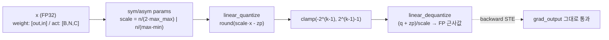
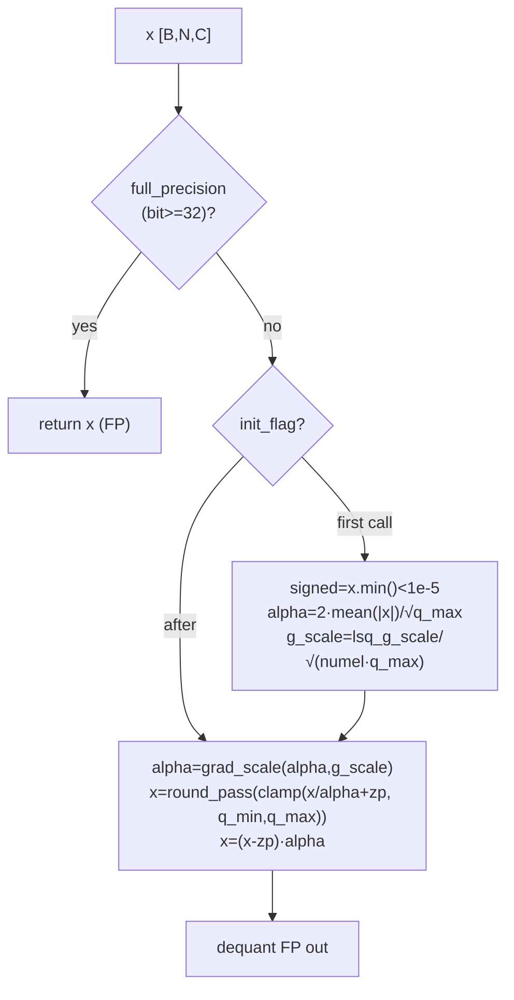
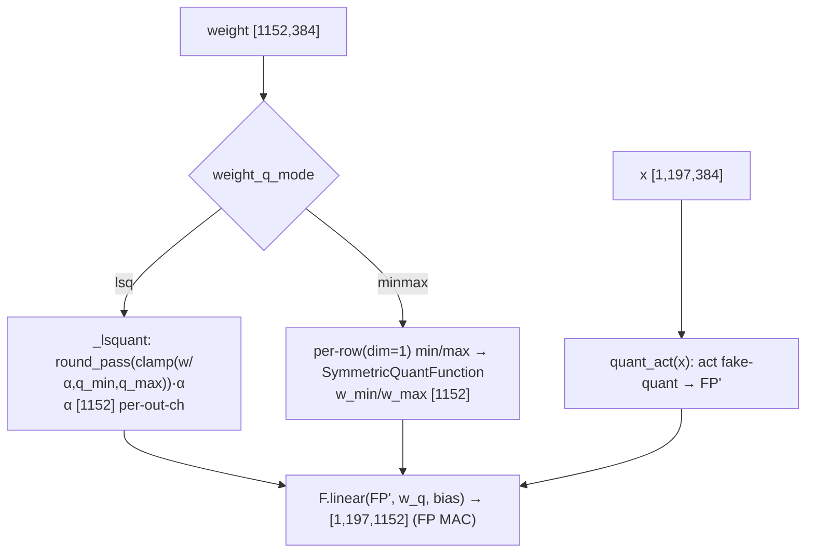
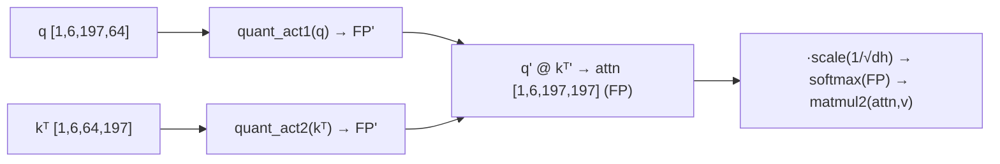
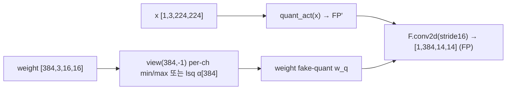
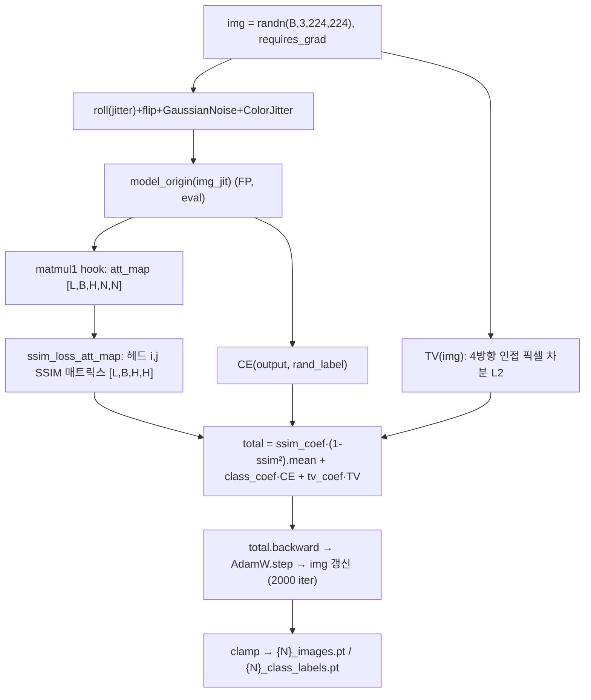
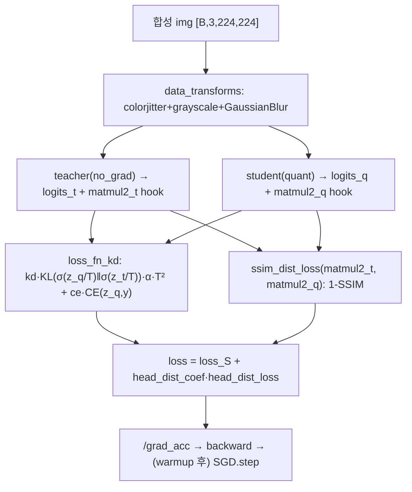
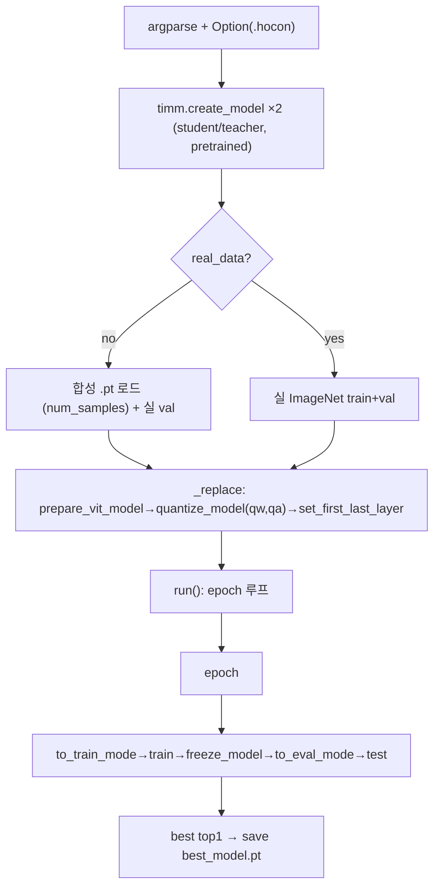

# MimiQ 모듈 통합 가이드 (S-PyTorch)

> 1차 요약: [`../mimiq.md`](../mimiq.md) — 본 문서는 그 요약을 모듈 단위로 심화·검증한 통합 가이드다.
> 분석 대상: `\\wsl.localhost\ubuntu-24.04\home\user\project\PRJXR-HBTXR\REF\ViT-Quantization\mimiq`
> 작성 원칙: 실제 소스 Read 후 `파일:라인` 근거 표기. 라인 근거 없는 추론은 "추정", 코드로 확인 불가는 "확인 불가"로 명시.
> 형제 가이드(`REF/Analysis/ViT-Quantization/I-ViT/MODULE_GUIDE.md`)의 6요소 구조를 따르되, HW 지표는 **S-PyTorch 수치 규약**(params/FLOPs/activation memory/비트폭/observer)으로 표기한다.

---

## 0. 문서 머리말

### 0.1 MimiQ의 실체 — 의미·대상 (코드 확정)
- **정식 명칭**: *MimiQ: Low-Bit Data-Free Quantization of Vision Transformer with Encouraging Inter-Head Attention Similarity* (`README.md:1-3`).
- **의미 (코드 확정)**: MimiQ는 **integer-only 추론 프레임워크가 아니다.** 실제 학습 데이터 없이(**data-free**) ViT/DeiT/Swin을 **저비트(기본 W4A4)** 로 양자화하는 **합성데이터 기반 QAT(=data-free quantization)** 다. 두 축으로 구성:
  1. **합성 데이터 생성** — 사전학습 모델의 **inter-head attention map 유사도(SSIM)** + cross-entropy + Total Variation을 손실로 입력 이미지 픽셀 자체를 AdamW로 최적화(`hydra_image_gen_ssim_att_map.py:175-251`).
  2. **head-wise attention 증류 QAT** — 합성 이미지로 student(양자화)를 teacher(FP)에 정렬. KD(KL+CE) + **head-wise attention-output(SSIM) distillation**(`trainer.py:212-232, 320-335`).
- **대상 (코드 확정)**: timm 백본 ViT/DeiT/Swin. `quantize_model`이 **`nn.Conv2d → Quant_Conv2d`, `nn.Linear → Quant_Linear`, `MatMul → Quant_Matmul`** 만 재귀 치환(`quant_modules.py:860-889`). **LayerNorm·Softmax·GELU는 비양자화(FP 유지)** — `to_train_mode/to_eval_mode`가 이름에 `'norm'` 포함 모듈을 건너뛰고(`:1025,1045`), softmax는 timm 원본 FP 그대로(`attention_forward` `:802`). → **부분 양자화(weight+linear/conv/matmul만), integer-only 아님.**
- **혼동 주의**: 사명 그대로 "minimal-inference quant"가 아니라 **mimic(teacher 어텐션 모방) + Quantization** 의 합성어 성격(코드 동작 기준 확정). 1차 요약(`mimiq.md:11-17`)의 "data-free PTQ-기반 QAT" 규정이 코드와 일치함을 검증.

### 0.2 S-PyTorch 수치 규약 (HW의 MAC lanes/scalar MACs 대체)
- **params**: 모듈 차원에서 분석적 계산. Linear `in·out (+out bias)`, Conv `Cout·Cin·Kh·Kw (+Cout)`. MimiQ는 FP weight를 `set_param`으로 복제 보관(`quant_modules.py:304-308, 678-682`)하고 forward마다 fake-quant하므로 **추론 가중치 개수는 FP 원본과 동일**. 단 **LSQ 모드는 학습 파라미터 추가**: weight 양자화기 `alpha`(per-out-channel, `:311`)·act 양자화기 `alpha`/`zero_point`(스칼라, `:151-152`).
- **FLOPs/MACs**: 표준식×config. Linear MAC = `B·N·in·out`. Attention QKᵀ = `B·H·N²·dh`, AV = `B·H·N²·dh`. 대표 레이어를 **DeiT-S(B=1,N=197,C=384,H=6,dh=64)** 로 산출 후 12 block 환원.
- **activation memory**: 텐서 shape × 비트폭. MimiQ는 fake-quant라 실제 메모리는 FP32지만(quant→clamp→dequant 결과가 float, `quant_utils.py:143-147`), **정수 도메인 비트폭**(W/A bits)을 "HW 환산 activation bit"로 표기.
- **비트폭/observer**: 코드 직접. 기본 **W4/A4**(`imagenet_deit_s_16_224.hocon:30-31`; main 기본 `qw/qa=None→hocon`, `main.py:275-276`). observer = **act min/max EMA(beta=0.9, bias 보정 `beta_t`)**(`quant_modules.py:121-124`) 또는 **LSQ 학습 step**(`:203-227`). weight observer = per-channel min/max(`:337-340, 709-711`).
- **정확도/속도**: README 인용. **README에 결과표 없음**(`README.md` 전체에 수치 미수록) → 본 가이드에서 정확도는 **확인 불가**(논문 본문 필요). 본 세션 미실행 → 속도 측정 불가.

### 0.3 운영 경로 (합성 데이터 생성 → QAT → 평가)
```
[1단계: 합성 데이터 생성]  hydra_image_gen_ssim_att_map.py
   │  FP 사전학습 모델 로드(timm, eval) → prepare_vit_model(matmul1 hook)  (:125-171)
   │  img = randn(B,3,224,224), requires_grad=True; AdamW(lr=0.1) + Cosine  (:175-178)
   │  2000 iter: SSIM(inter-head) + CE(rand label) + TV → img.backward      (:189-235)
   │  clamp_training 시 정규화 범위 클램프(:238-239) → {N}_images.pt/labels.pt 저장 (:248-251)
   ▼  (generate_dataset.sh → merge_dataset.sh: TensorDataset 병합)
[2단계: 양자화 QAT]  main.py(ExperimentDesign) + trainer.py
   │  teacher/student = 동일 FP 모델 2개 (main.py:150-155)
   │  _replace: prepare_vit_model → quantize_model(qw,qa) → set_first_last_layer (:184-191)
   │  run(): epoch 루프 — warmup 동안 act unfreeze→train→freeze→eval, best top1 저장 (:194-258)
   │  train(): teacher matmul2 hook → KD(KL+CE) + head_dist_coef·SSIM증류 → SGD step (trainer.py:263-387)
   ▼
[3단계: ImageNet 평가]  trainer.test()  — 항상 실제 ImageNet val (main.py:111,125; trainer.py:506-556)
```
- 타깃 디바이스: **CUDA GPU 전제** — `test_input=...cuda()`(`main.py:151`), 증강 텐서 `.cuda()`(`image_gen_aug_utils.py:15,33`), GaussianBlur `.cuda()`(`trainer.py:188,196`), 합성 손실 `.cuda()`(`hydra_*.py:129-132`). → CPU 단독 실행 불가(코드 근거 확인, 실행 실패는 미검증).

### 0.4 모델 / 데이터셋 / 정확도
| 항목 | 값 | 근거 |
|---|---|---|
| 모델 | ViT/DeiT/Swin × {tiny, small, base} — hocon 9개 | hocon 파일 9개 Glob 확인 |
| 대표 모델 | **DeiT-S** `deit_small_patch16_224` (384/12/6) | `imagenet_deit_s_16_224.hocon:8` |
| 비트폭 | **W4/A4** (모든 hocon `qw=4, qa=4`) | `imagenet_deit_s_16_224.hocon:30-31`, `imagenet_deit_b_16_224.hocon:30-31` |
| 데이터셋(학습) | **합성 `.pt` 데이터셋**(기본 `num_samples=10000`) 또는 순수 가우시안 노이즈(`--random_samples`) | `main.py:114-123, 284`; `trainer.py:420-432` |
| 데이터셋(평가) | **항상 실제 ImageNet val** (1000 클래스, 224×224, Resize256→CenterCrop224) | `main.py:111`; `dataloader.py:157-171`; `options.py:144-145` |
| 정확도 | **확인 불가** (README에 결과표 없음) | `README.md` 전체 수치 미수록 |
| 속도 | 본 세션 미실행 → 확인 불가 | — |

- **대표 모델 선정 근거**: DeiT-S는 1차 요약 및 train.sh 예시에서 다뤄지는 중간 규모로(`imagenet_deit_s_16_224.hocon:8`, embed_dim=384, depth=12, heads=6) N=197·C=384가 비자명한 분석 단위. I-ViT 형제 가이드의 대표 케이스와 동일 config라 직접 대조 가능.
- **의존성**: Python 3.9.18, PyTorch 2.0.1, **timm 0.9.8**(백본), einops 0.7.0(rearrange), pyhocon 0.3.60(설정) (`README.md:7-8`; `requirements.txt:4,40,47-49`).

---

## 1. Repo / Layer 개요

MimiQ = **사전학습 가중치만으로 합성 캘리브레이션 데이터를 만들고 그 데이터로 ViT를 저비트 fake-quant QAT** 하는 data-free 양자화 프레임워크. 본 repo는 **timm 백본 위에 얹은 커스텀 양자화·합성생성·증류 코드**가 자체 소스이고, 모델 정의(ViT/DeiT/Swin)·ImageNet DataLoader 구성·accuracy는 timm/torchvision을 임포트한다.

### 1.1 자체 소스 vs 외부 프레임워크 vs 제외

| 구분 | 파일(자체 소스) | 역할 |
|---|---|---|
| **양자화 기반함수** | `quant_utils/quant_utils.py` | linear_quantize/dequantize, sym/asym scale·zp, fake-quant(merged_*), STE, LSQ 헬퍼(grad_scale/round_pass) |
| **양자화 레이어** | `quant_utils/quant_modules.py` ★핵심 | QuantAct/QuantAct_lsq, Quant_Linear/Conv2d/Matmul, attention monkey-patch, quantize_model 등 |
| **합성 데이터 생성** | `hydra_image_gen_ssim_att_map.py` ★핵심 | inter-head SSIM + CE + TV로 입력 이미지 최적화 |
| | `hydra_image_gen_merge.py` | 생성 `.pt` → TensorDataset 병합 |
| | `image_gen_aug_utils.py` | 생성용 증강(ColorJitter, GaussianNoise, Centering, Zoom) |
| **학습/증류** | `trainer.py` ★핵심 | KD(KL+CE) + head-wise SSIM 증류 학습/평가 루프 |
| | `gaussian_blur.py` | 학습 증강 GaussianBlur(미열람 세부, trainer.py에서 import) |
| **엔트리/설정** | `main.py` | ExperimentDesign(양자화+학습 오케스트레이션) |
| | `options.py` + `utils/opt_static.py` | .hocon 파서 + 기본 NetOption |
| | `dataloader.py` | ImageNet val/합성셋 DataLoader |
| | `imagenet_{vit,deit,swin}_{t,s,b}_*.hocon` (9개) | 모델별 설정 |
| **학습 보조** | `utils/lr_policy.py` | LRPolicy(multi_step/const/step/linear/exp/inv) |
| | `utils/{compute,arglist,log_print,warmup,model_transform}.py` | AverageMeter·top-k·arg 파싱 등(보조) |

### 1.2 forward 진입점 (3단계 분리)
- **합성 생성**: `generate()`(`hydra_*.py:122`) → `model_origin(img_jit)`(`:211`) + matmul1 hook 수집 → `ssim_loss_att_map`(`:91-118`) + CE + TV → `img_train` 갱신.
- **QAT 학습**: `Trainer.train()`(`trainer.py:263`) → teacher `no_grad` forward(`:321`) → student `self.forward`=`model(images)`(`:240`) → `loss_fn_kd`(`:212`) + `ssim_dist_loss`(`:67`) → `backward`.
- **양자화 forward**: `Quant_Linear.forward`(`quant_modules.py:318`): `quant_act(x)`(act fake-quant) → weight fake-quant(`_lsquant` 또는 SymmetricQuantFunction) → `F.linear`.

### 1.3 제외 (지시에 따라 이름만 표기, 미분석)
- **외부 프레임워크(커스텀 아님)**: `timm.create_model`(ViT/DeiT/Swin 백본·사전학습 가중치, `main.py:152-154`), `timm.models.vision_transformer.Attention`, `timm.models.swin_transformer.WindowAttention`, `timm.data.resolve_data_config`, torchvision transforms/datasets. **양자화 유틸의 원본 출처**: 헤더상 `quant_utils.py`/`quant_modules.py`는 **ZeroQ 저장소 파생**(`quant_utils.py:5`, `quant_modules.py:5`), 어텐션 양자화 아이디어는 **PTQ4ViT 차용**(`quant_modules.py:21,789`) — 본 repo가 수정·통합한 형태라 자체 소스로 분석하되 출처 명기.
- **미열람(확인 불가)**: `gaussian_blur.py`, `utils/{compute,arglist,log_print,warmup,model_transform}.py` 세부, `imagenet_class_labels.py`, swin hocon 4개 세부(deit/vit와 동일 구조 추정).

### 1.4 대표 모델 레이어 구성 (DeiT-S, 양자화 대상만)
`quantize_model`(`quant_modules.py:860-889`)이 치환하는 대상: PatchEmbed `proj`(Conv2d→Quant_Conv2d) + Block×12 {qkv/proj/fc1/fc2 = Linear→Quant_Linear 4개, matmul1/matmul2 = MatMul→Quant_Matmul 2개} + head(Linear→Quant_Linear). **LayerNorm(norm1/norm2/norm)·GELU·softmax는 비양자화.** `set_first_last_layer`(`:932-948`)로 **첫 layer(patch conv)의 act는 FP 유지**.

---

## 2. 모듈: 양자화 수치 기반함수 — `quant_utils.py`

### 2.1 역할 + 상위/하위
- **역할**: FP 텐서를 **fake-quant(quant→clamp→dequant)** 하는 저수준 함수·autograd Function. sym/asym scale·zero-point 산출, conv(4D)/linear(2D) 채널축 reshape, STE backward, LSQ 헬퍼.
- **상위**: `Quant_Linear`/`Quant_Conv2d`(weight), `QuantAct`/`QuantAct_lsq`(act)가 호출(`quant_modules.py:270-272, 63, 127`). **하위**: `torch.round`, `torch.clamp`.

### 2.2 데이터플로우 (텐서 shape 흐름)


### 2.3 forward call stack
`Quant_Linear.forward`(`quant_modules.py:339`, minmax) → `SymmetricQuantFunction.apply(w, k, w_min, w_max)` → `forward`(`quant_utils.py:212-234`) → `merged_quantization_internal`(`:137-147`) → `symmetric_linear_quantization_params`(`:118-134`) + `linear_quantize`(`:41-69`) + `torch.clamp`(`:142`) + `linear_dequantize`(`:143-146`).

### 2.4 대표 코드 위치
`quant_utils.py`: `linear_quantize` `:41-69`, `linear_dequantize` `:71-92`, `asymmetric_linear_quantization_params` `:94-116`, `symmetric_linear_quantization_params` `:118-134`, `merged_quantization_internal*` `:136-171`, `SymmetricQuantFunction` `:207-239`, `AsymmetricQuantFunctionAct` `:241-273`, LSQ 헬퍼 `:371-380`.

### 2.5 대표 코드 블록

```python
# quant_utils.py:129-134  대칭 스케일 (zero-point = 0)
n = 2**num_bits - 1
max_max = torch.max(-saturation_min, saturation_max)   # |min|, max 중 큰 값
scale = n / torch.clamp(2*max_max, min=1e-8)            # 양방향 대칭 범위
zero_point = torch.zeros_like(scale)
```
→ W4(k=4)이면 `n=15`, 대칭 범위 정수 격자. **weight는 symmetric(zp=0)** → HW에서 zero-point 가산 불필요. (단 scale = `n/(2·max_max)`로 I-ViT의 `max_max/(2^(k-1)-1)`와 역수 정의이나 동치.)

```python
# quant_utils.py:105-115  비대칭 스케일 (activation, signed zp)
n = 2**num_bits - 1
scale = n / torch.clamp((saturation_max - saturation_min), min=1e-8)
zero_point = scale * saturation_min                     # 비대칭 오프셋
if signed: zero_point += 2**(num_bits - 1)              # signed 도메인 이동
```
→ **activation은 asymmetric**(`QuantAct`가 이 함수 사용, `:124`). min/max 비대칭 범위라 동적범위 활용이 좋으나 HW에서 zero-point 덧셈 회로 필요.

```python
# quant_utils.py:137-147  fake-quant 일괄 (quant→clamp→dequant)
scale, zero_point = symmetric_linear_quantization_params(k, x_min, x_max)
new_quant_x = linear_quantize(x, scale, zero_point)     # round(scale·x - zp)
n = 2**(k - 1)
new_quant_x = torch.clamp(new_quant_x, -n, n - 1)       # [-2^(k-1), 2^(k-1)-1]
quant_x = linear_dequantize(new_quant_x, scale, zero_point)  # (q+zp)/scale → FP
return quant_x                                          # ★정수가 아니라 FP 근사값 반환
```
→ **출력이 정수가 아닌 dequant된 FP 근사값** = fake-quant. I-ViT의 integer-only(`int×scale`, 정수 도메인 유지)와 **본질적으로 다름**. F.linear/F.conv2d가 FP로 실행됨.

```python
# quant_utils.py:237-239  backward: STE
return grad_output, None, None, None    # round/clamp 미분불가 우회 (grad 그대로)
```

```python
# quant_utils.py:371-380  LSQ STE 헬퍼
def grad_scale(x, scale):
    y_grad = x * scale
    return (x).detach() - y_grad.detach() + y_grad      # forward=x, backward=scale·grad
def round_pass(x):
    return x.round().detach() - x.detach() + x          # forward=round(x), backward=identity
```
→ LSQ step gradient 스케일링·미분가능 round. STE의 표준 구현.

### 2.6 연산·수치표현 분해 + 정량
- **양자화 방식**: fake-quant. weight=symmetric(zp=0) per-channel, act=asymmetric(signed zp) per-tensor. **출력은 dequant FP** (integer-only 아님).
- **scale/zp**: weight `scale=n/(2·max_max), zp=0`(`:131-132`); act `scale=n/(max-min), zp=round(scale·min)+2^(k-1)`(`:106-115`).
- **비트폭**: 호출처 인자(weight 4, act 4 기본).
- **params**: 0 (순수 함수). 단 `@torch.jit.script`로 JIT 컴파일(`:41,71,94,118,136`).
- **FLOPs**: 텐서 원소수 N에 대해 (sub/mul + round + clamp + div) = O(N) 원소연산. forward마다 재계산(QAT 비용). 대표 DeiT-S qkv weight(384×1152=442K 원소) 양자화 = 442K 원소연산.
- **activation bit**: 출력은 FP32(dequant) → 실제 메모리 FP, HW 환산 비트 k.
- **특이사항**: `AsymmetricQuantFunctionPerturb`/`PerturbNorm`(`:275-369`)은 grad 기반 양자화 섭동 실험 함수 — 메인 경로 미사용(추정, 호출처 없음 확인).

---

## 3. 모듈: 활성 양자화 — `quant_modules.py` (QuantAct / QuantAct_lsq) ★핵심

### 3.1 역할 + 상위/하위
- **역할**: activation을 양자화. 두 변종:
  - **`QuantAct`** (min/max): asymmetric, **running min/max EMA(beta=0.9 + bias 보정 beta_t)** observer. `fix()/unfix()`로 range 동결/해제.
  - **`QuantAct_lsq`** (LSQ): 학습형 step `alpha`·`zero_point`. 입력 부호 자동 판별 후 signed/unsigned 격자 선택. fix/unfix는 **더미(무의미)**.
- **상위**: `Quant_Linear`/`Quant_Conv2d`/`Quant_Matmul`이 `quant_act` 멤버로 보유(`:277-279, 570-575, 646-651`). **하위**: `AsymmetricQuantFunctionAct`(min/max), `grad_scale`/`round_pass`(LSQ).

### 3.2 데이터플로우 (텐서 shape 흐름, LSQ 경로)


### 3.3 forward call stack
- min/max: `Quant_Linear.forward`(`:323`) → `QuantAct.forward`(`:109`) → running EMA 갱신(`:121-124`) → `asymmetric_linear_quantization_params`(`:124`) → `act_function`=`AsymmetricQuantFunctionAct`(`:127`).
- LSQ: `Quant_Linear.forward`(`:323`) → `QuantAct_lsq.forward`(`:186`) → 초기화(`:194-207`) → `grad_scale`/`round_pass`(`:214-227`).

### 3.4 대표 코드 위치
`quant_modules.py`: `QuantAct` `:38-130`(EMA observer `:121-124`, fix/unfix `:74-84`), `QuantAct_lsq` `:133-234`(init `:194-207`, forward quant `:214-227`, **dummy fix/unfix** `:172-183`).

### 3.5 대표 코드 블록

```python
# quant_modules.py:121-124  min/max running observer (EMA beta=0.9 + bias 보정)
self.beta_t = self.beta_t * self.beta
self.x_min = (self.x_min * self.beta + x_min * (1 - self.beta)) / (1 - self.beta_t)
self.x_max = (self.x_max * self.beta + x_max * (1 - self.beta)) / (1 - self.beta_t)
self.scale, self.zero_point = self.asymmetric_linear_quantization_params(...)
```
→ Adam식 bias-corrected EMA(`/(1-beta_t)`)로 초기 배치 편향 보정. I-ViT의 단순 momentum(0.95)보다 정교. **per-tensor**(스칼라 x_min/x_max).

```python
# quant_modules.py:194-207  LSQ 초기화 (입력 부호 자동 판별)
if not self.init_flag:
    if x.min() < 1e-5: self.signed.data.fill_(1)         # 음수 있으면 signed
    q_min, q_max = self.q_signed_minmax if signed else self.q_unsigned_minmax
    self.alpha.data.copy_(2*x.abs().mean()/math.sqrt(q_max))   # LSQ 권장 초기화
    self.zero_point.data.copy_(... min(x) - alpha·q_max ...)
    self.g_scale = self.lsq_g_scale / math.sqrt(x.numel()*q_max)  # step grad scale
```

```python
# quant_modules.py:214-227  LSQ forward (step·zp 학습)
alpha = grad_scale(self.alpha, self.g_scale)
zero_point = round_pass(self.zero_point)
x = round_pass((x/alpha + zero_point).clamp(q_min, q_max))   # 정수 격자
x = (x - zero_point) * alpha                                 # dequant FP
```
→ `alpha`(step)와 `zero_point`이 **학습 파라미터**(`Parameter`, `:151-152`). g_scale로 step gradient를 안정화(LSQ 논문 핵심). 출력은 dequant FP.

### 3.6 연산·수치표현 분해 + 정량 (DeiT-S, [1,197,384])
- **양자화 방식**: min/max=asymmetric per-tensor running-EMA observer; LSQ=학습형 step(per-tensor act). 기본 act 모드 = **LSQ**(`main.py:290`).
- **비트폭**: A4 기본. `bit>=32`면 FP 우회(`:65-66, 159-160`).
- **params**: min/max=0(buffer만: x_min/x_max/beta/scale/zp 각 [1]); **LSQ=2개 학습 파라미터**(alpha[1], zero_point[1]) per 양자화기.
- **activation memory**: A4 → 197×384×0.5 byte = **37.8 KB**(HW 환산). 실제 메모리 FP32(dequant).
- **observer**: min/max는 train시 EMA 갱신, eval시 freeze(`fix()`로 running_stat=False); **LSQ는 fix/unfix 무의미**(`:172-183` 더미) — step이 학습 파라미터라 항상 활성.
- **시사**: act asymmetric(zp≠0)은 FPGA에서 zero-point 가산 회로 필요. LSQ는 채널 무관 단일 step이라 HW 단순(스칼라 scale 1개)하나 학습 필수.

---

## 4. 모듈: 정수(fake-quant) Linear — `quant_modules.py` (Quant_Linear)

### 4.1 역할 + 상위/하위
- **역할**: nn.Linear를 양자화 레이어로 치환. act를 `quant_act`로 fake-quant 후, weight를 3모드(`lsq`/`minmax`/`minmax_asym`) 중 하나로 fake-quant, `F.linear`로 **FP MAC**(weight·act 모두 dequant된 FP). eval시 quant weight 캐싱.
- **상위**: ViT의 qkv/proj/fc1/fc2/head가 `quantize_model`로 치환됨(`:870-873`). **하위**: `QuantAct`/`QuantAct_lsq`, `_lsquant`/`SymmetricQuantFunction`/`AsymmetricQuantFunction`.

### 4.2 데이터플로우 (텐서 shape 흐름, DeiT-S qkv 예)


### 4.3 forward call stack
`attention_forward`(`quant_modules.py:797`, `self.qkv(x)`) → `Quant_Linear.forward`(`:318`) → `quant_act(x)`(`:323`) → weight 양자화 분기(`:333-343`) → `F.linear`(`:346`).

### 4.4 대표 코드 위치
`quant_modules.py`: 클래스 `:240-426`, 모드 선택 `:265-274`, `_lsquant` `:286-292`, `set_param`(α init) `:301-315`, forward `:318-346`, eval 캐싱 `:328-329, 405-415`, `update_bit` `:417-426`.

### 4.5 대표 코드 블록

```python
# quant_modules.py:286-292  per-output-channel LSQ weight 양자화 (symmetric)
def _lsquant(self, w):   # alpha [out_features], grad_scale = 1/√(numel·q_max)
    alpha = grad_scale(self.alpha, self.grad_scale)
    alpha = alpha.unsqueeze(1)                               # [out,1] broadcast
    w_q = round_pass((self.weight/alpha).clamp(self.q_min, self.q_max)) * alpha
    return w_q
```
→ weight **per-output-channel step `alpha`**(`out_features`개, `:311`). symmetric(zp 없음). q_min=`-(2^k-1)`, q_max=`2^(k-1)-1`(`:267-268`) — 비대칭 클램프 범위(특이, I-ViT의 `[-n-1,n]`과 다름).

```python
# quant_modules.py:333-343  weight 모드 분기 (minmax는 per-row)
if "minmax" in self.weight_q_mode:
    x_transform = w.data.detach()
    w_min = x_transform.min(dim=1).values                   # per-output-row
    w_max = x_transform.max(dim=1).values
    w = self.weight_function(self.weight, self.weight_bit, w_min, w_max)
elif self.weight_q_mode == 'lsq':
    w = self._lsquant(self.weight)
return F.linear(x_processed, weight=w, bias=self.bias)       # ★FP MAC (bias는 FP 그대로)
```
→ **minmax는 per-row(out축) 대칭**, lsq는 per-out-ch step. **bias는 양자화 안 함**(FP). MAC은 dequant된 FP weight·act로 수행 — integer MAC 아님.

### 4.6 연산·수치표현 분해 + 정량 (DeiT-S, B=1, N=197)
- **양자화 방식**: weight per-out-channel(lsq step 또는 minmax 대칭) W4, act per-tensor(lsq/minmax) A4, **bias FP 비양자화**.
- **scale/zp**: weight zp=0(symmetric); act zp(asymmetric, minmax) 또는 LSQ zp(학습).
- **비트폭**: W4 / A4 / bias FP32. (기본 `wq_mode=minmax`, `aq_mode=lsq`, `main.py:289-290`.)
- **params** (DeiT-S 1 block, C=384; FP weight 개수는 I-ViT와 동일):
  - qkv 443,520 / proj 147,840 / fc1 591,360 / fc2 590,208 → Linear params/block ≈ **1.773M**, ×12 ≈ **21.27M**.
  - **LSQ 추가 학습 파라미터**(weight α): block당 `qkv 1152 + proj 384 + fc1 1536 + fc2 384 = 3,456`개, ×12 ≈ 41.5K (lsq weight 모드 시). 기본 minmax weight 모드면 weight α 없음.
- **MACs/block** (B=1, N=197): qkv 87.1M + proj 29.0M + fc1 116.2M + fc2 116.2M ≈ **348.5M**, ×12 ≈ **4.18G** (FP MAC, Attention matmul 제외).
- **activation bit**: act A4(dequant FP 실행).

---

## 5. 모듈: 어텐션 행렬곱 양자화 — `quant_modules.py` (Quant_Matmul + MatMul)

### 5.1 역할 + 상위/하위
- **역할**: Attention 내부 Q@Kᵀ, attn@V를 양자화. **두 입력 각각 별도 act quantizer**(`quant_act1`, `quant_act2`)로 fake-quant 후 `@`. weight 양자화 없음(matmul은 weightless).
- **상위**: `prepare_vit_model`이 timm `Attention`에 `matmul1`/`matmul2`(MatMul 모듈) 부착·forward monkey-patch(`:843-855`), `quantize_model`이 `MatMul → Quant_Matmul` 치환(`:886-889`). **하위**: `QuantAct`/`QuantAct_lsq` ×2.

### 5.2 데이터플로우 (텐서 shape 흐름, DeiT-S matmul1)


### 5.3 forward call stack
`attention_forward`(`:801`) → `Quant_Matmul.forward(q, kᵀ)`(`:586`) → `quant_act1(x1)`, `quant_act2(x2)`(`:591-592`) → `x1' @ x2'`(`:597`). 이후 `*self.scale → softmax(FP) → matmul2`(`:801-807`).

### 5.4 대표 코드 위치
`quant_modules.py`: `Quant_Matmul` `:545-612`(양자화기 2개 `:570-575`, forward `:586-597`), `MatMul` `:791-793`, `attention_forward` `:795-811`, `window_attention_forward`(Swin) `:813-841`, `prepare_vit_model` `:843-855`.

### 5.5 대표 코드 블록
```python
# quant_modules.py:586-597  두 입력 각각 양자화 후 행렬곱
def forward(self, x1, x2):
    if not self.act_full_precision_flag:
        x1_processed = self.quant_act1(x1)      # Q (또는 attn)
        x2_processed = self.quant_act2(x2)      # Kᵀ (또는 V)
    return x1_processed @ x2_processed          # FP matmul
```
```python
# quant_modules.py:795-807  attention monkey-patch (softmax는 FP 그대로)
attn = self.matmul1(q, k.transpose(-2, -1)) * self.scale   # 양자화된 Q@Kᵀ
attn = attn.softmax(dim=-1)                                 # ★softmax FP (양자화 X)
attn = self.attn_drop(attn)
x = self.matmul2(attn, v).transpose(1, 2).reshape(B, N, C) # 양자화된 attn@V
```
→ **softmax 입출력은 FP** — attn(matmul1 출력)이 양자화되지 않고 softmax로 직행. matmul2의 attn 입력만 `quant_act1`로 양자화. **부분 양자화** 명확.

### 5.6 연산·수치표현 분해 + 정량 (DeiT-S, B=1, H=6, N=197, dh=64)
- **양자화 방식**: 두 입력 각자 act fake-quant 후 FP `@`. weight 없음. matmul1=Q@Kᵀ, matmul2=attn@V. softmax는 비양자화.
- **비트폭**: 입력 A4(quant_act1/2). 출력 FP.
- **params**: 0 학습(matmul) + LSQ 모드 시 양자화기당 alpha/zp 2개 ×2 = 4개/matmul.
- **MACs/block**: QKᵀ H·N²·dh = 6×197²×64 ≈ **14.9M**, attn·V ≈ **14.9M** → Attention matmul ≈ **29.8M**/block, ×12 ≈ **358M**.
- **activation memory**: attn 행렬 [1,6,197,197] — softmax 전후 FP. A4 환산 시 6×197²×0.5 ≈ **116 KB**(단 실제 softmax 경로는 FP).
- **시사**: N² attn 텐서가 최대 중간 활성. softmax FP라 FPGA 완전정수 파이프라인엔 별도 정수 softmax 근사 필요(I-ViT의 Shiftmax 대비 미흡).

---

## 6. 모듈: 정수(fake-quant) Conv — `quant_modules.py` (Quant_Conv2d, PatchEmbed)

### 6.1 역할 + 상위/하위
- **역할**: nn.Conv2d(주로 PatchEmbed proj, 16×16 s16) 양자화. act fake-quant + weight per-output-channel fake-quant(`view(out_channels,-1)`) → `F.conv2d`(FP).
- **상위**: `quantize_model`이 `nn.Conv2d → Quant_Conv2d` 치환(`:866-869`). **하위**: `QuantAct`/`QuantAct_lsq`, `_lsquant`/Sym/AsymQuantFunction.

### 6.2 데이터플로우 (텐서 shape 흐름, DeiT-S)


### 6.3 forward call stack
`PatchEmbed.proj`(timm) → `Quant_Conv2d.forward`(`:691`) → `quant_act(x)`(`:696`) → weight 양자화(`:706-714`, `view(out_channels,-1)`) → `F.conv2d`(`:718`).

### 6.4 대표 코드 위치
`quant_modules.py`: 클래스 `:615-786`, `_lsquant`(α view 4D `:660`) `:656-662`, `set_param` `:670-689`, forward `:691-719`, `eval_mode_init` `:765-775`.

### 6.5 대표 코드 블록
```python
# quant_modules.py:706-718  per-channel(out) weight fake-quant + FP conv
if "minmax" in self.weight_q_mode:
    x_transform = w.data.contiguous().view(self.out_channels, -1)   # [out, Cin·Kh·Kw]
    w_min = x_transform.min(dim=1).values; w_max = x_transform.max(dim=1).values
    w = self.weight_function(self.weight, self.weight_bit, w_min, w_max)
elif self.weight_q_mode == 'lsq':
    w = self._lsquant(self.weight)
return F.conv2d(x_processed, w, self.bias, self.stride, self.padding, self.dilation, self.groups)
```
→ QuantLinear와 동일 패턴을 conv에 적용. **첫 conv는 `set_first_last_layer`로 act FP 유지**(`:939-940`).

### 6.6 연산·수치표현 분해 + 정량 (DeiT-S PatchEmbed)
- **양자화 방식**: weight per-channel(out=384) W4(lsq/minmax), act A4(단 `set_first_last_layer`로 patch conv act는 FP), bias FP.
- **비트폭**: W4 / act FP(첫 레이어 보호) / bias FP.
- **params**: 384×3×16×16 + 384 = **295,296** (+ lsq weight α 384개).
- **MACs**: 14×14=196 위치 × 384 × (3×16×16=768) ≈ **57.8M** (1회).
- **activation memory**: 출력 [1,384,14,14] → flatten [1,196,384].
- **시사**: 첫 conv act FP 유지 = 양자화 민감 입력 보호(mixed-precision 설계 근거, `:939-940`).

---

## 7. 모듈: 합성 데이터 생성 — `hydra_image_gen_ssim_att_map.py` ★핵심 (MimiQ의 정체성)

### 7.1 역할 + 상위/하위
- **역할**: **학습 데이터 없이** 사전학습 모델의 inter-head attention 통계를 모방하는 합성 이미지를 생성. `randn` 노이즈를 입력으로 두고 **이미지 픽셀을 AdamW로 직접 최적화**. 손실 = inter-head SSIM + CE + TV.
- **상위**: `generate_dataset.sh`(`:3`). **하위**: `prepare_vit_model`(matmul1 hook), `ssim_loss_att_map`, `get_image_prior_losses`(TV), image_gen_aug_utils.

### 7.2 데이터플로우 (텐서 shape 흐름)


### 7.3 forward call stack
`generate`(`:122`) → batch 루프(`:174`) → iter 루프(`:189`) → `model_origin(img_jit)`(`:211`) → `ssim_loss_att_map(hook.matmul_output)`(`:218`) + `F.cross_entropy`(`:223`) + `get_image_prior_losses`(`:227`) → `total_loss.backward()`(`:233`) → `opt.step()`(`:234`).

### 7.4 대표 코드 위치
`hydra_*.py`: `get_image_prior_losses`(TV) `:48-56`, `ssim_loss_att_map`(ViT) `:91-118`, `ssim_loss_att_map_swin` `:58-87`, `generate` `:122-251`, 입력 최적화 setup `:175-178`, 손실 합산 `:229`, 저장 `:248-251`, argparse 기본값 `:254-291`.

### 7.5 대표 코드 블록

```python
# hydra_*.py:175-178  이미지 픽셀 자체를 최적화 대상으로
img_train = torch.randn((args.batch_size,3,IMG_SIZE,IMG_SIZE)).cuda()
img_train.requires_grad = True
opt = torch.optim.AdamW([img_train], lr=0.1, betas=[0.9,0.999], eps=1e-8, weight_decay=1e-6)
lr_scheduler = torch.optim.lr_scheduler.CosineAnnealingLR(opt, args.iter, 0.001)
```

```python
# hydra_*.py:99-110  inter-head SSIM 매트릭스 (헤드 i,j 쌍 SSIM)
att_map = rearrange(hook_stack, "L B H (w h) -> L B H w h", w=14, h=14)
mu = att_map.mean([-2,-1])                              # (L B H)
mu1_mu2 = mu.unsqueeze(2)*mu.unsqueeze(3)              # (L B H H) 헤드쌍 평균곱
sigma_sq = (att_map*att_map).mean([-2,-1]) - mu.pow(2)
sigma12 = (att_map.unsqueeze(2)*att_map.unsqueeze(3)).mean([-2,-1]) - mu1_mu2  # (L B H H)
ssim_map = ((2*mu1_mu2+C1)*(2*sigma12+C2))/((mu_sq.un(2)+mu_sq.un(3)+C1)*(sigma_sq.un(2)+sigma_sq.un(3)+C2))
```
→ 어텐션 맵(q@kᵀ, matmul1 출력)을 14×14 spatial로 재배열 후 **헤드 i,j 간 SSIM**. C1=0.01², C2=0.03²(SSIM 표준 상수, `:107-108`).

```python
# hydra_*.py:220, 227-229  손실 = (1-SSIM²) + CE + TV
ssim_loss = (1-(ssim_map)**2).mean()                   # 헤드 다양성 유도 (SSIM² 패널티)
loss_tv = get_image_prior_losses(img_train)            # 자연 이미지 prior
total_loss = args.ssim_coef*ssim_loss + args.class_coef*class_loss + args.tv_coef*loss_tv
```
→ 기본 계수 `ssim_coef=1.0, class_coef=1.0, tv_coef=2.5e-5`(`:262-266`). `(1-SSIM²)` = 헤드 어텐션이 서로 적절히 다른(=diverse) 패턴을 갖도록 유도(추정: 헤드 다양성 확보).

### 7.6 연산·수치표현 분해 + 정량
- **양자화 방식**: 해당 없음(FP 생성 단계). 양자화는 2단계 QAT에서.
- **최적화**: AdamW(lr=0.1) + CosineAnnealing, **2000 iter/배치**(`:177-178, 260`), batch_size 16(`:267`), 기본 `num_images=10000`(`:258`).
- **params**: 학습 대상 = 이미지 픽셀 `B×3×224×224 = 16×150,528 ≈ 2.4M` 값(모델 가중치는 고정).
- **FLOPs**: 이미지당 = 2000 × (1 forward + 1 backward) full ViT. **이미지당 ~4000 ViT pass** → 대량 생성 시 GPU 비용 지배(추정, 라인 근거 `:189`).
- **출력**: `{N}_images.pt`(B×3×224×224 FP), `{N}_class_labels.pt`(rand label). merge가 TensorDataset 병합(`hydra_image_gen_merge.py:91-92`).
- **시사**: **학습 단계 오프라인 도구** — 추론 가속기와 무관. FPGA 부담 없음. data-free 캘리브레이션이 핵심 차별점.

---

## 8. 모듈: head-wise 증류 학습 — `trainer.py` ★핵심

### 8.1 역할 + 상위/하위
- **역할**: 합성(또는 랜덤) 이미지로 양자화 student를 학습. **KD(KL+CE)** + **head-wise attention-output(matmul2=attn@V) SSIM 증류**. warmup 동안 act range unfreeze 후 동결.
- **상위**: `ExperimentDesign.run`(`main.py:218`). **하위**: `loss_fn_kd`, `ssim_dist_loss`(teacher↔student 어텐션 정렬), matmul2 forward hook, `data_transforms`(증강).

### 8.2 데이터플로우 (텐서 shape 흐름)


### 8.3 forward call stack
`Trainer.train`(`:263`) → teacher matmul2 hook 등록(`:282-290`) → batch 루프(`:293`) → `data_transforms`(`:305`) → teacher `no_grad` forward(`:321`) → `self.forward`→`model(images)`+`loss_fn_kd`(`:240-242`) → `ssim_dist_loss`(`:331`) → `loss_S_total.backward()`(`:343`) → warmup 후 `optimizer_S.step()`(`:347`).

### 8.4 대표 코드 위치
`trainer.py`: `ssim_dist_loss`(ViT) `:67-104`, `ssim_dist_loss_swin` `:26-64`, `loss_fn_kd` `:212-232`, optimizer 선택(SGD/RMSProp/Adam) `:130-155`, 증강 setup `:168-199`, `train` `:263-387`, `train_random` `:390-504`, `test`/`test_teacher` `:506-622`.

### 8.5 대표 코드 블록

```python
# trainer.py:226-231  KD 손실 (KL + CE)
a = F.log_softmax(output / T, dim=1)               # student
b = F.softmax(teacher_outputs / T, dim=1)          # teacher
c = (alpha * T * T)
d = criterion_d(output, labels)                    # CE(student, label)
KD_loss = self.settings.kd_scale*kdloss(a,b)*c + self.settings.ce_scale*d
```
→ alpha=1, T=20(`imagenet_deit_s_16_224.hocon:34-35`; T는 `--kl_temp` override 가능 기본 5.0, `main.py:293`). `kd_scale=1.0`, `ce_scale=0.0` 기본(`main.py:267-268`) → 기본은 **순수 KL 증류**(CE 비활성).

```python
# trainer.py:86-94  teacher↔student 어텐션 출력 SSIM 거리 (head distill)
sigma_sq_t = (att_map_t*att_map_t - mu_t_sq.un(-1)).mean(-1)
sigma_sq_q = (att_map_q*att_map_q - mu_q_sq.un(-1)).mean(-1)
sigma_tq = (att_map_t*att_map_q - mut_muq.un(-1)).mean(-1)
ssim_map = (2*sigma_tq + C2) / (sigma_sq_t + sigma_sq_q + C2)   # contrast·structure만
return 1 - ssim_map.mean()                                      # SSIM 거리
```
→ matmul2(attn@V) 출력의 **teacher-student 헤드별 SSIM**(분산/공분산 항만 사용, luminance 항 생략). `head_dist_distance`로 mse/kl/l1도 선택(`:99-104`). 기본 ssim(`main.py:278`).

```python
# trainer.py:335, 345-348  총 손실 + warmup gated update
loss_S_total = loss_S + self.settings.head_dist_coef*head_dist_loss   # γ 기본 10.0
loss_S_total = loss_S_total / self.settings.grad_acc
loss_S_total.backward()
if epoch >= self.settings.warmup_epochs - LESS_UNFREEZE:             # warmup 후에만 step
    if ((i+1) % grad_acc == 0): self.optimizer_S.step()
```
→ warmup(`warmup_epochs=5`) 동안은 backward만(act range EMA 갱신용), 이후 weight 업데이트. LSQ/real_data면 `LESS_UNFREEZE=3`(`:337-340`).

### 8.6 연산·수치표현 분해 + 정량 (DeiT-S)
- **양자화 방식**: 학습 단계(student=양자화 model). loss = KD + γ·head_dist.
- **하이퍼파라미터**: optimizer **SGD**(momentum 0.9, nesterov, `:130-137`), lr_S=**1e-6**(`hocon:20`), lrPolicy=const(`:21`), weightDecay 1e-4, nEpochs=**100**(DeiT-S)/200(DeiT-B), warmup_epochs=5, batch 32(hocon) → train.sh는 `--bs 16`(`train.sh:3`), grad_acc 기본 1, **γ=head_dist_coef=10.0**(`main.py:277`), T=20/5, alpha=1.
- **params**: 학습 대상 = student 전체 weight(~22M) + LSQ step 파라미터. teacher 고정.
- **FLOPs/epoch**: `(num_samples/bs)` iter × (teacher forward + student forward+backward). num_samples=10000, bs=16 → ~625 iter/epoch × 3 ViT-pass.
- **시사**: head-wise SSIM 증류가 ViT 특화 핵심. matmul2 hook 기반이라 FPGA 추론과 무관(학습 전용).

---

## 9. 모듈: 엔트리·설정·데이터 — `main.py` + `options.py` + `dataloader.py`

### 9.1 역할 + 상위/하위
- **역할**: 전체 오케스트레이션. timm 모델 2개(student/teacher) 생성 → 합성/실 데이터 로더 → `prepare_vit_model`+`quantize_model`+`set_first_last_layer` → epoch 루프(unfreeze→train→freeze→eval, best 저장). 설정은 .hocon + argparse.
- **상위**: `main()`(`main.py:261`). **하위**: `Option`, `DataLoader`, `Trainer`, `quantize_model`.

### 9.2 데이터플로우


### 9.3 forward call stack
`main`(`main.py:261`) → `Option`(`options.py:10`) → `ExperimentDesign`(`:29`) → `prepare`(`:72`): `_set_model`(`:150`)→`_set_dataloader`(`:86`)→`_replace`(`:184`)→`_set_trainer`(`:158`) → `run`(`:194`).

### 9.4 대표 코드 위치
`main.py`: `_set_model` `:150-155`, `_set_dataloader`(합성 로드 `:113-123`) `:86-148`, `_replace` `:184-191`, `run` `:194-258`, argparse `:262-300`. `options.py`: 양자화 옵션 `:58-67`, KD 옵션 `:73-77`, LSQ/grad_acc `:113-116`. `dataloader.py`: imagenet val `:133-171`.

### 9.5 대표 코드 블록
```python
# main.py:184-191  양자화 적용 3단계
def _replace(self):
    prepare_vit_model(self.model)                       # matmul1/2 부착
    if self.settings.head_dist_coef > 0.0:
        prepare_vit_model(self.model_teacher)
    quantize_model(self.model, qw=self.settings.qw, qa=self.settings.qa,
                   weight_q_mode=self.settings.wq_mode, act_q_mode=self.settings.aq_mode,
                   lsq_g_scale=self.settings.lsq_g_scale)
    set_first_last_layer(self.model)                    # 첫 layer act FP
```
```python
# main.py:113-123  합성 데이터셋 로드 (data-free 핵심)
dataset_path = os.path.join(self.settings.dataset_path,
    f"{network}_ssim_{img_opt_ssim}_class_{img_opt_cls}_tv_{img_opt_tv}_merged.pt")
dataset_full = torch.load(dataset_path)
if len(dataset_full) > num_samples:
    dataset, _ = torch.utils.data.random_split(dataset_full, [num_samples, ...])
self.train_loader = torch.utils.data.DataLoader(dataset, batch_size=batchSize, shuffle=True)
```
→ 학습셋 = 합성 `.pt`(파일명에 ssim/cls/tv 계수 인코딩). 평가셋은 항상 실 ImageNet(`main.py:111`).

### 9.6 연산·수치표현 분해 + 정량 / 재현 명령
- **데이터셋**: 학습=합성 10000(기본) 또는 random_samples; 평가=실 ImageNet val.
- **비트폭/모드**: `qw=qa=4`(hocon), `wq_mode=minmax`(기본), `aq_mode=lsq`(기본), `lsq_g_scale=0.01`(`main.py:289-297`).
- **재현 명령**:
  ```bash
  # 1) 합성 데이터 생성 (generate_dataset.sh)
  ./generate_dataset.sh deit_small_patch16_224 <NUM_IMGS> <PREFIX> <SAVE_PATH>
  #   → hydra_image_gen_ssim_att_map.py --clamp_training
  ./merge_dataset.sh <SAVE_PATH> deit_small_patch16_224
  # 2) 양자화 QAT (train.sh)
  ./train.sh <CONF.hocon> <ID> <LR> <QW> <QA> <GAMMA> <DATA_PATH> <LR_POLICY> <LR_STEP> <AQ_MODE>
  #   → main.py ... --bs 16
  ```
  (`README.md:41-77`; `generate_dataset.sh:3`; `train.sh:3`)
- **정확도**: **확인 불가**(README 결과표 없음). 속도: 미실행 → 확인 불가.

---

## N+1. 모듈 한눈 요약 표

| 모듈 | 파일:라인 | 역할 | 양자화 방식 | 대표 정량(DeiT-S) |
|---|---|---|---|---|
| quant_utils 기반함수 | quant_utils.py:41-380 | fake-quant(quant→clamp→dequant)+STE+LSQ헬퍼 | weight sym(zp0)/act asym, **dequant FP 출력** | params 0, O(N) 원소연산 |
| QuantAct / QuantAct_lsq | quant_modules.py:38-234 | act 양자화 | minmax: asym EMA(β0.9); LSQ: 학습 step | A4 37.8KB, LSQ 2 학습param |
| Quant_Linear | quant_modules.py:240-426 | per-ch W4 + **FP MAC** | W4(lsq α[out]/minmax sym)/A4/bias FP | block 1.77M params, 348.5M MAC |
| Quant_Matmul | quant_modules.py:545-612 | Q@Kᵀ/attn@V 양자화 | 두 입력 각자 act fake-quant, **softmax FP** | block 29.8M MAC, attn N² |
| Quant_Conv2d | quant_modules.py:615-786 | PatchEmbed conv | per-ch W4/act(첫레이어 FP)/bias FP | 295K params, 57.8M MAC |
| 합성 데이터 생성 | hydra_image_gen_ssim_att_map.py:48-251 | inter-head SSIM+CE+TV로 이미지 최적화 | (FP 생성, 양자화 X) | 이미지당 2000 iter, ~4000 pass |
| head-wise 증류 학습 | trainer.py:67-387 | KD(KL+CE)+matmul2 SSIM 증류 | student=양자화 model | SGD lr1e-6, γ10.0, 100 epoch |
| 엔트리/설정/데이터 | main.py:184-258, options.py, dataloader.py | 오케스트레이션+합성/실 로더 | qw=qa=4, wq=minmax/aq=lsq | num_samples 10000, 평가=실ImageNet |

---

## N+2. 학습·평가 파이프라인 + 재현 명령

- **데이터셋**: 학습=합성 `.pt`(`{net}_ssim_{c}_class_{c}_tv_{c}_merged.pt`, 기본 10000) 또는 가우시안 노이즈; 평가=실 ImageNet val(224×224, 1000 클래스).
- **3단계 명령** (§9.6 참조): `generate_dataset.sh` → `merge_dataset.sh` → `train.sh`.
- **하이퍼파라미터**: SGD(momentum 0.9, nesterov), lr 1e-6 const, wd 1e-4, nEpochs 100(DeiT-S)/200(DeiT-B), warmup 5, batch 32(hocon)/16(train.sh), γ(head_dist) 10.0, T 20/5, α 1, kd_scale 1.0/ce_scale 0.0.
- **비트폭**: W4/A4(모든 hocon). weight=minmax(symmetric, 기본)/act=lsq(기본). 첫 conv act FP, `set_first_last_layer(fl8bit=True)` 시 첫/마지막 layer 8bit 옵션(`:941-947`).
- **체크포인트**: best top1 갱신 시 `best_model.pt`(`main.py:234-235`, `--save_model` 필요).
- **의존성**: PyTorch 2.0.1 + timm 0.9.8 + einops + pyhocon. **CUDA 필수**(0.3절 .cuda 하드코딩).
- **정확도**: README 결과표 없음 → **확인 불가**.

---

## N+3. 우리 프로젝트(FPGA ViT 가속) 시사점 + FPGA 친화도

### N+3.1 핵심 한계: integer-only가 아님 (I-ViT와 결정적 차이)
- MimiQ는 **fake-quant(quant→clamp→dequant)** 라 forward가 **FP 연산**으로 수행됨(`quant_utils.py:143-147`, `F.linear`/`F.conv2d`/`@` 모두 dequant FP 입력). **LayerNorm·Softmax·GELU 비양자화**(`quant_modules.py:802, 1025, 1045`). → **HG-PIPE류 완전정수 파이프라인에 직접 이식 불가.** 산출물은 "W4A4 양자화 가중치/스케일"이고, 정수 데이터패스·정수 비선형은 **별도 구현 필요**(I-ViT의 Shiftmax/ShiftGELU/I-LayerNorm 같은 정수 비선형 부재).

### N+3.2 활용 가능 자산: data-free 캘리브레이션 (최대 강점)
- **합성 데이터 생성기**(`hydra_image_gen_ssim_att_map.py`)는 **학습 데이터·캘리브레이션 데이터 없이** 양자화 보정 가능. XR 시선추적처럼 실데이터 확보·프라이버시가 어려운 도메인에서 **타깃 ViT의 W4A4 양자화 파라미터를 데이터 없이 산출**하는 오프라인 도구로 차용 가능(추정, 프로젝트 성격은 코드 외부 근거).
- 이는 추론 가속기 RTL과 무관한 **학습/보정 단계 자산** — FPGA 측 부담 없음.

### N+3.3 LSQ/symmetric weight의 HW 친화 요소
- **weight symmetric(zp=0)**(`quant_utils.py:132`) → zero-point 가산 회로 절감.
- **LSQ per-out-channel step α**(`quant_modules.py:311`) → FPGA에서 채널별 scale 곱(또는 shift)로 매핑.
- 단 **act asymmetric(zp≠0)**(`:106-115`) → activation 경로엔 zero-point 덧셈 필요. LSQ act는 per-tensor 스칼라라 단순.
- **첫/마지막 layer 보호**(`set_first_last_layer:932-948`) → mixed-precision 데이터패스 설계 참조(첫 conv act FP, fl8bit 시 8bit).

### N+3.4 FPGA 친화도 평가
| 항목 | 평가 | 근거 |
|---|---|---|
| 정수전용(integer-only) | ✕ fake-quant, FP forward | `quant_utils.py:143-147`, `F.linear` FP |
| 정수 비선형(LN/Softmax/GELU) | ✕ 전부 FP 유지 | `:802`(softmax), `:1025,1045`(norm 제외) |
| 저비트(W4A4) | ★★★ 4bit 기본 | 모든 hocon `qw=qa=4` |
| data-free 캘리브레이션 | ★★★ 합성 생성, 데이터 불필요 | `hydra_*.py` 전체 |
| weight symmetric(zp0) | ★★ zero-point 회로 절감 | `quant_utils.py:132` |
| act asymmetric(zp≠0) | ★ zero-point 덧셈 필요 | `quant_utils.py:106-115` |
| 추론 직접 배포 | △ 정수 추론 커널/비선형 별도 구현 필요 | fake-quant 한계 |

### N+3.5 XR 시선추적 적용 (프로젝트 성격은 추정)
- MimiQ의 직접 가치는 **추론 가속기 청사진이 아니라 "데이터 없이 W4A4 양자화"라는 보정 방법론**. XR 시선추적 ViT 백본을 양자화할 때 시선 데이터 확보가 어렵다면, MimiQ식 합성 캘리브레이션으로 4bit 양자화 파라미터를 산출한 뒤, **정수 추론·정수 비선형은 I-ViT/TATAA 등 integer-only 기법으로 별도 구현**하는 조합이 현실적(추정).
- 비교: integer-only 배포는 I-ViT(INT8, Shiftmax/ShiftGELU)가 청사진, 저비트 data-free 보정은 MimiQ(W4A4)가 청사진 — **상보적 자산**.

---

## 부록. 근거 / 확인 불가

- **직접 코드 확인(전체 Read)**: `quant_utils/quant_utils.py`(381줄 전체), `quant_utils/quant_modules.py`(1047줄 전체), `hydra_image_gen_ssim_att_map.py`(295줄 전체), `trainer.py`(623줄 전체), `main.py`(314줄 전체), `options.py`(전체), `dataloader.py`(전체), `image_gen_aug_utils.py`(전체), `hydra_image_gen_merge.py`(전체), `utils/lr_policy.py`(전체), `utils/opt_static.py`(전체), `README.md`, `requirements.txt`, hocon(deit_s/deit_b), `train.sh`/`generate_dataset.sh`.
- **분석적 산출(검증 가능)**: params/MACs는 DeiT-S config(C=384,N=197,H=6,dh=64)와 표준식으로 계산. 합성 생성 FLOPs는 iter 수 기반 추정치("추정" 표기).
- **추정**: HW 환산 비트폭, 합성 생성 GPU 비용, (1-SSIM²)의 헤드 다양성 의도, perturbation 함수 미사용, 프로젝트 성격(FPGA+XR), I-ViT 등과의 상보성.
- **확인 불가(미열람/미실행/부재)**: **정확도/속도 수치**(README에 결과표 없음 — 논문 본문 필요), `gaussian_blur.py`·`utils/{compute,arglist,warmup,model_transform}.py` 세부, swin hocon 4개 세부(deit/vit와 동일 구조 추정), CPU 실행 가능 여부(cuda 하드코딩은 확인, 실행 실패 미검증), W8/8bit 옵션 실측(fl8bit 코드 경로는 확인).
