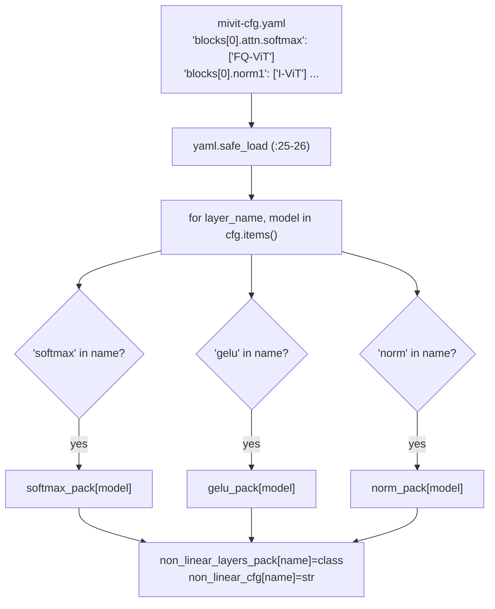
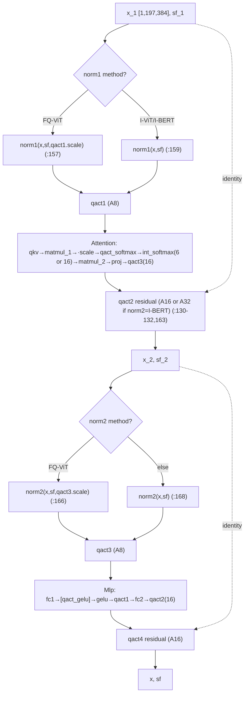
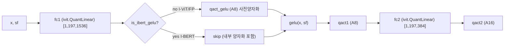
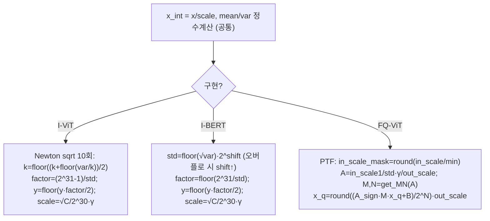
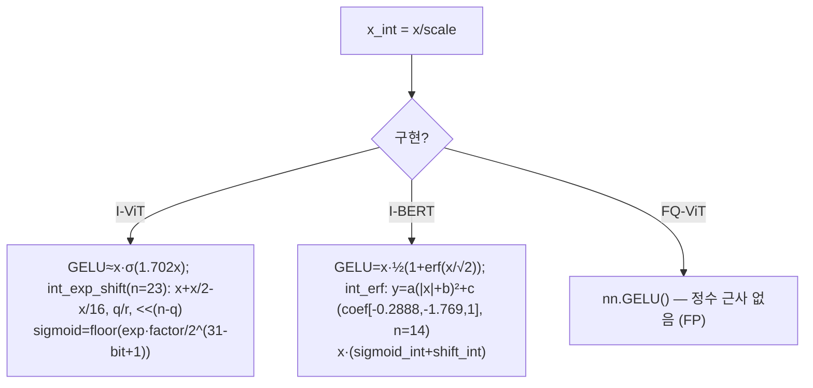
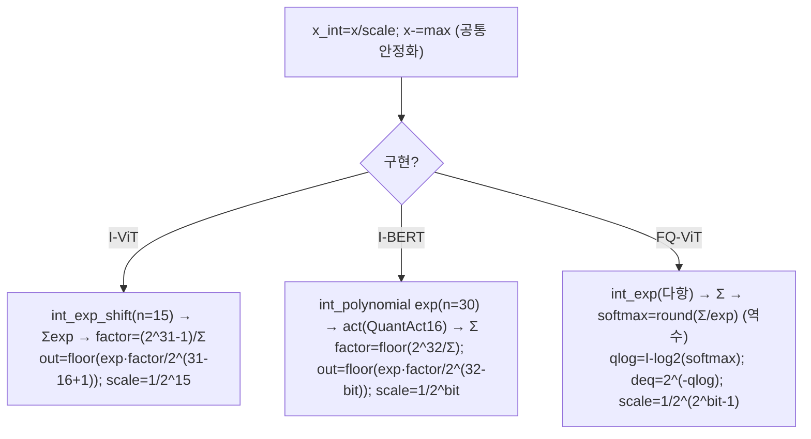
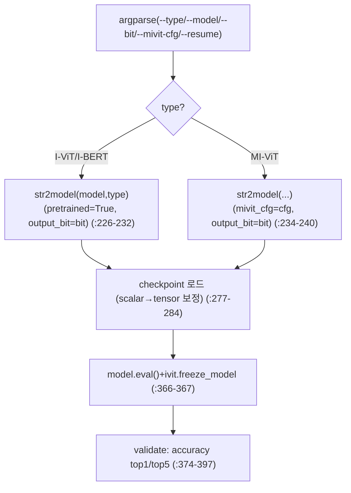
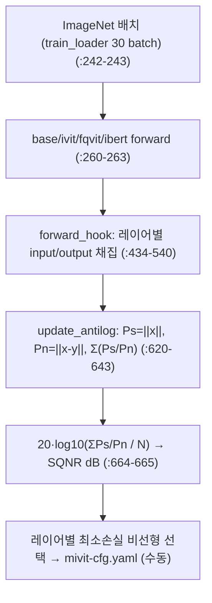

# mixed-non-linear-quantization 모듈 통합 가이드 (S-PyTorch)

> 1차 요약: [`../mixed-non-linear-quantization.md`](../mixed-non-linear-quantization.md) — 본 문서는 그 요약을 모듈 단위로 심화한 통합 가이드다.
> 분석 대상: `\\wsl.localhost\ubuntu-24.04\home\user\project\PRJXR-HBTXR\REF\ViT-Quantization\mixed-non-linear-quantization`
> 작성 원칙: 실제 소스 Read 후 `파일:라인` 근거 표기. 라인 근거 없는 추론은 "추정", 코드로 확인 불가는 "확인 불가"로 명시.
> 형제 가이드(`REF/Analysis/ViT-Quantization/I-ViT/MODULE_GUIDE.md`)의 6요소 구조를 따르되, HW 지표는 **S-PyTorch 수치 규약**(params/FLOPs/activation memory/비트폭/비선형별 근사)으로 치환한다.
> 핵심 차별점: 본 repo는 I-ViT/I-BERT/FQ-ViT **세 가지 정수 비선형 구현을 레이어별로 혼합(mixed)**하는 자체 프레임워크다. 따라서 모듈 해부의 무게중심은 **비선형 3종(Softmax/GELU/LayerNorm)의 근사 방식 차이와 혼합 정책**에 둔다.

---

## 0. 문서 머리말

### 0.1 대표 케이스 선정
- **대표 모델: `deit_small_patch16_224` (DeiT-S)** — `embed_dim=384, depth=12, num_heads=6, mlp_ratio=4, patch16, img224` (`models/mivit/vit_quant.py:351-360`). 근거:
  1. README 결과표에서 DeiT-S가 모든 방법의 비교 기준으로 등장(FP32 79.85, I-ViT 80.12, Ours 79.93; `README.md:36,39,40`)하고, 실제 혼합 cfg(`experiments/anaylisys_sqnr/DeiT-S/val/mivit-cfg.yaml`)가 존재해 혼합 정책 해부에 직접 활용 가능.
  2. N=197(=14×14+cls), C=384, H=6, dh=64가 정수 비선형(Softmax/GELU/LayerNorm)·정수 행렬곱이 모두 비자명한 크기로 활성화돼 분석 가치가 높음(`PatchEmbed.num_patches=(224/16)²=196`, `models/mivit/vit_quant.py:218`).
- **대표 분석 단위: VisionTransformer 1개 Block** = `norm1 → qact1 → Attention(qkv→matmul_1→·scale→int_softmax→matmul_2→proj→qact3(16)) → [residual qact2] → norm2 → qact3 → Mlp(fc1→[qact_gelu]→gelu→qact1→fc2→qact2(16)) → [residual qact4]` (`models/mivit/vit_quant.py:155-174`). DeiT-S는 이 Block을 12개 적층(`:233-251`).
- **대표 비선형 9슬롯**: Block당 `norm1, attn.softmax, norm2, mlp.gelu` 4개 + 모델 최종 `norm` 1개 = (4×12+1)=**49 슬롯**(`models/mivit/vit_quant.py:112,133,55-58,30`, `vit_layers_quant.py:30`). 각 슬롯은 YAML로 `I-ViT|I-BERT|FQ-ViT` 중 1개 구현이 바인딩됨 — **이것이 mixed의 본질**.

### 0.2 S-PyTorch 수치 규약 (HW의 MAC lanes/scalar MACs 대체)
- **params**: 모듈 차원에서 분석적 계산. Linear `in·out (+out bias)`, LayerNorm `2·C`(γ+β), Conv `Cout·Cin·Kh·Kw (+Cout)`. 세 비선형 구현 모두 FP 가중치를 그대로 두고 forward마다 정수 시뮬레이션하므로 **params 개수는 FP 원본과 동일**(추가 학습 파라미터 없음, 근사/비트폭만 달라짐). 단 I-BERT/FQ-ViT 비선형 모듈은 내부에 보조 `QuantAct`(`ibert IntSoftmax.act=QuantAct(16)`, `ibert/quant_modules.py:548`)를 가질 수 있으나 학습 파라미터는 0.
- **FLOPs/MACs**: 표준식×config. Linear MAC=`B·N·in·out`. Attention QKᵀ/AV=`B·H·N²·dh`(`vit_quant.py:67-83`). 선형부 MAC은 세 방법 공통(QuantLinear/QuantMatMul은 I-ViT 모듈 재사용, `vit_quant.py:38,46,60-61`)이고 **비선형부 원소연산만 방법별로 다름**(§7~9에서 방법별 분해).
- **activation memory**: 텐서 shape × 비트폭. 정수 시뮬레이션이라 실제는 FP32지만, **출력 정수 도메인 비트폭**을 HW 환산 activation bit로 표기. 본 repo는 비선형/방법별로 출력 비트가 다름(예: FQ-ViT softmax=6bit, I-ViT/I-BERT softmax=16bit; `vit_quant.py:55-58`).
- **비트폭/observer**: 코드 직접. 선형 기본 W8/A8(`ivit.QuantLinear.weight_bit=8`, `ivit/quant_modules.py:32`), bias 32bit(`:33`). residual·softmax·pos·patch 경로 A16. observer=running min/max(momentum 0.95)(I-ViT/I-BERT 계열). FQ-ViT는 **PTQ observer**(minmax/ema/omse/percentile + PTF) 별도 보유(`models/fqvit/ptq/observer/*.py`).
- **정확도**: **README에 전체 결과표 존재**(`README.md:34-43`) — 1차 요약의 "확인 불가"를 정정. 속도/실측은 본 세션 미실행 → "확인 불가".

### 0.3 운영 경로 (SQNR 민감도 분석 → 혼합 cfg 생성 → QAT/평가)
```
[1] SQNR 민감도 분석   analysis_sqnr.py
    base(FP timm) / I-ViT / FQ-ViT / I-BERT 4모델 동시 forward + forward_hook
    → 레이어별 출력 SQNR=20·log10(||x||/||x-y||) 측정      (analysis_sqnr.py:620-669)
    → 어느 레이어에 어느 비선형이 SQNR 손실 최소인지 파악
       (FQ-ViT는 사전 PTQ calibration 1000 iter: :194-206)
    ▼
[2] 혼합 cfg 작성     experiments/.../mivit-cfg.yaml (레이어별 I-ViT|I-BERT|FQ-ViT)
    ▼
[3] (QAT) quant_train.py — argparse 존재하나 본 repo의 quant_test.py main은
    train 루프 비활성, epoch 0 validate만 호출            (quant_test.py:296-302)
    ▼
[4] 평가   quant_test.py validate(): model.eval()+ivit.freeze_model → Top-1/5
                                                            (quant_test.py:352-428)
```
- 타깃 디바이스: **CUDA GPU, 특히 `cuda:1` 하드코딩** — `quant_test.py:214`, `analysis_sqnr.py:104`, `ivit/quant_utils.py:118,204-205`, `ivit/quant_modules.py:357,441,495`, `mivit/quant_utils.py:118,204-205`, FQ-ViT softmax scale `mivit/.../fqvit_quant_modules_wrapper.py:148`. → 단일 GPU·CPU 실행 시 디바이스 불일치 위험(코드 근거 확인, 실행 실패는 미검증).

### 0.4 모델 / 데이터셋 / 정확도 (README 인용)
| Method | Bit | ViT-S | ViT-B | DeiT-T | DeiT-S | DeiT-B | Swin-T | Swin-S | 근거 |
|---|---|---|---|---|---|---|---|---|---|
| Full-Precision | 32 | 81.39 | 84.53 | 72.21 | 79.85 | 81.85 | 81.35 | 83.2 | `README.md:36` |
| FQ-ViT | 8 | – | 83.31 | 71.61 | 79.17 | 81.20 | 80.51 | 82.71 | `README.md:37` |
| I-BERT | 8 | 80.47 | 83.70 | 71.33 | 79.11 | 80.79 | 80.15 | 81.86 | `README.md:38` |
| I-ViT | 8 | 81.27 | 84.76 | 72.24 | 80.12 | 81.74 | 81.50 | 83.01 | `README.md:39` |
| **Ours(mixed)** | **8** | **81.35** | **84.88** | **72.55** | **79.93** | **81.88** | **80.95** | **82.42** | `README.md:40` |
| FQ-ViT | 6 | 4.26 | 0.10 | 58.66 | 45.51 | 64.63 | 66.50 | 52.09 | `README.md:41` |
| I-ViT* | 6 | 70.24 | 76.89 | 63.80 | 74.48 | 76.0 | 71.89 | 81.04 | `README.md:42` |
| **Ours(mixed)** | **6** | **73.64** | **82.00** | **67.81** | **77.19** | **79.91** | **80.54** | **79.10** | `README.md:43` |
- **핵심 관찰**: 8bit에서 mixed는 ViT-S/ViT-B/DeiT-T/DeiT-B에서 단일 최강(I-ViT)을 상회하나 DeiT-S/Swin-T/Swin-S에선 I-ViT보다 낮음 — **혼합 이득은 모델 의존**. **6bit에서 mixed의 이득이 결정적**(예: DeiT-B 76.0→79.91, ViT-B 76.89→82.00; `README.md:42-43`).
- 데이터셋: **ImageNet (IMNET)** 또는 CIFAR, 224×224, 1000 클래스 (`quant_test.py:39-43`).
- 원논문: **"Mixed Non-linear Quantization for Vision Transformer", arXiv:2407.18437** (`README.md:1-3`).
- 속도/지연: 학습시간 정성 비교만 README 그림으로 언급(`README.md:147-159`), 수치 latency는 **확인 불가**.

---

## 1. Repo / Layer 개요

mixed-non-linear-quantization = ViT/DeiT/Swin의 **비선형 연산(Softmax/GELU/LayerNorm)을 정수-only로 근사**하되, 세 선행연구(I-ViT/I-BERT/FQ-ViT)의 구현을 **레이어 단위로 자유 조합**하는 자체 실험 프레임워크(`README.md:1-3`, `models/mivit/README.md:1` "Mixed ViT"). 선형부(QuantLinear/QuantMatMul/QuantConv2d/QuantAct)는 **I-ViT 모듈을 그대로 재사용**(`mivit/vit_quant.py:38,43-46,60-61`이 모두 `ivit.*` 참조)하고, 차별 기여는 비선형 혼합 메커니즘이다. 커널 언어 = **순수 PyTorch(.py)**, CUDA/Triton 커스텀 커널 없음(autograd STE 시뮬레이션).

### 1.1 자체 소스 vs 외부 프레임워크 vs 제외

| 구분 | 파일(자체 소스) | 역할 |
|---|---|---|
| **혼합 메커니즘** ★핵심 | `models/mivit/utils.py` | `generate_non_linear_layers_pack(yaml→class)` — 레이어별 비선형 바인딩 |
| | `models/mivit/vit_quant.py` | Attention/Block/VisionTransformer — 레이어별 비선형 선택·비트 분기 |
| | `models/mivit/vit_layers_quant.py` | Mlp — GELU I-BERT/그외 분기 |
| | `models/mivit/quantization_utils/fqvit_quant_modules_wrapper.py` ★ | FQ-ViT 스타일 IntLayerNorm(PTF)/IntSoftmax(log2) |
| | `models/mivit/quantization_utils/quant_utils.py` | STE, fixedpoint_mul, batch_frexp (I-ViT 동일 계열) |
| | `models/mivit/model_utils.py` | freeze/unfreeze (ivit.QuantAct 토글) |
| **I-ViT 비선형** | `models/ivit/quantization_utils/quant_modules.py` | ShiftGELU/Shiftmax/I-LayerNorm + Quant 선형 모듈(공유) |
| | `models/ivit/quantization_utils/quant_utils.py` | SymmetricQuantFunction, fixedpoint_mul/batch_frexp |
| **I-BERT 비선형** | `models/ibert/quantization_utils/quant_modules.py` | IntGELU(erf 2차다항)/IntSoftmax(2차다항 exp)/IntLayerNorm(floor-sqrt) |
| **FQ-ViT(PTQ)** | `models/fqvit/ptq/observer/{minmax,ema,omse,percentile,ptf}.py` | PTQ observer 5종 |
| | `models/fqvit/ptq/quantizer/{uniform,log2}.py` | uniform/log2 quantizer |
| **분석 엔트리** | `analysis_sqnr.py` ★ | 4모델 SQNR 민감도 측정(혼합 정책 근거) |
| **평가 엔트리** | `quant_test.py` | I-ViT/I-BERT/MI-ViT 선택, ImageNet val |
| **학습 엔트리** | `quant_train.py` | QAT 루프(본 repo main은 비활성) |
| **보조** | `utils/`, `manager.sh` | DataLoader, 실행 스크립트 |

### 1.2 forward 진입점
`VisionTransformer.forward`(`mivit/vit_quant.py:324-328`) → `forward_features`(`:296-321`): `qact_input` → `patch_embed`(ivit) → cls cat → `qact_pos`/`qact1`로 pos_embed 정수합(A16, `:306-307`) → `blocks`(12×Block) → 최종 `norm`(혼합 비선형, FQ-ViT면 out_scale 추가 인자 `:313-316`) → cls 추출 → `qact2` → `head`(ivit.QuantLinear). 전 구간 `(tensor, act_scaling_factor)` 페어 전파.

### 1.3 제외 (지시에 따라 이름만 표기, 미분석)
- **외부 프레임워크(커스텀 아님)**: `timm.data.Mixup`, `timm.models.create_model`, `timm.loss.*`, `timm.scheduler/optim`, `timm.utils.{NativeScaler,ModelEma,accuracy}` (`quant_test.py:16-21`). DeiT/ViT 원본 사전학습 체크포인트(torch.hub `.pth`, augreg `.npz`) — 가중치만 로드.
- **선행연구 기반 구현**: ivit/ibert/fqvit 모듈은 각 논문 공식 구현 기반(`analysis_sqnr.py:7-15`에 출처 URL 명시). 비선형 forward는 정독했으나 선형/observer 전체 라인은 부분 확인.
- **미열람(확인 불가)**: `swin_quant.py`/`swin_layers_quant.py`(ViT와 동일 모듈 재사용 추정), `utils/data_utils.py`/`samplers.py` 데이터 파이프라인 세부, fqvit observer 5종 내부(존재만 확인).

### 1.4 대표 모델 레이어 구성 (DeiT-S)
`forward_features`(`mivit/vit_quant.py:296-321`): PatchEmbed(ivit.QuantConv2d 16×16 s16) → +cls/pos(정수합 A16) → Block×12 → 최종 norm → head. 1 Block(`:155-174`)당 Linear 4개(qkv,proj=Attention; fc1,fc2=Mlp) + QuantMatMul 2(QKᵀ/AV) + **혼합 비선형 4슬롯**(norm1, attn.softmax, norm2, mlp.gelu) + QuantAct 다수.

---

## 2. 모듈: 혼합 선택 메커니즘 — `models/mivit/utils.py` (generate_non_linear_layers_pack) ★핵심

### 2.1 역할 + 상위/하위
- **역할**: YAML config를 읽어 **각 레이어 이름 → 비선형 구현 클래스**로 매핑하는 dict 2종(`non_linear_layers_pack`=클래스, `non_linear_cfg`=문자열) 생성. 이것이 mixed의 단일 진입점.
- **상위**: `VisionTransformer.__init__`(`vit_quant.py:204`)이 호출. **하위**: 클래스 dict `softmax_pack/norm_pack/gelu_pack`(`:7-21`).

### 2.2 데이터플로우


### 2.3 forward call stack
`VisionTransformer.__init__`(`vit_quant.py:204`) → `generate_non_linear_layers_pack(mivit_cfg)`(`utils.py:24`) → `yaml.safe_load`(`:26`) → 이름 substring 매칭(`:33-38`) → Block/Attention/Mlp가 `non_linear_pack[name](dim)`으로 인스턴스화(`vit_quant.py:112,133`; `vit_layers_quant.py:30`).

### 2.4 대표 코드 위치
`utils.py`: 클래스 dict `:7-21`, 함수 `:24-44`, 이름 매칭 분기 `:33-38`.

### 2.5 대표 코드 블록
```python
# models/mivit/utils.py:7-21  세 비선형의 구현 매핑 — GELU의 FQ-ViT는 정수 아님(FP nn.GELU)
softmax_pack = {'I-ViT': ivit.IntSoftmax, 'FQ-ViT': fqvit.IntSoftmax, 'I-BERT': ibert.IntSoftmax}
norm_pack    = {'I-ViT': ivit.IntLayerNorm,'FQ-ViT': fqvit.IntLayerNorm,'I-BERT': ibert.IntLayerNorm}
gelu_pack    = {'I-ViT': ivit.IntGELU,     'FQ-ViT': nn.GELU,          'I-BERT': ibert.IntGELU}
```
→ **GELU의 'FQ-ViT'는 정수 GELU가 아니라 FP `nn.GELU`**(`:19`). FQ-ViT 논문이 GELU를 정수화하지 않는 점 반영 → 혼합 정책에 정수↔FP 경계까지 포함된다. (그래서 README 매핑 표의 GELU 열은 I-BERT/I-ViT 2개뿐, `README.md:54-66`.)

```python
# models/mivit/utils.py:31-43  이름 substring으로 비선형 종류 판별
for layer_name, model in cfg.items():
    model = model[0]                          # YAML 값은 1원소 리스트 ['I-ViT']
    if "softmax" in layer_name:  layer = softmax_pack[model]
    elif "gelu" in layer_name:   layer = gelu_pack[model]
    elif "norm" in layer_name:   layer = norm_pack[model]
    non_linear_layers_pack[layer_name] = layer; non_linear_cfg[layer_name] = model
```

### 2.6 연산·수치표현 분해 + 정량
- **혼합 입력 형식**: 레이어당 `'blocks[i].{norm1|norm2|attn.softmax|mlp.gelu}': ['<method>']` + 모델 최종 `'norm': ['<method>']`. DeiT-S(depth12) = 4×12+1 = **49 슬롯**(`vit_quant.py:112,133,55-58,252`; `vit_layers_quant.py:30`).
- **탐색 공간**: 각 슬롯 3택(GELU는 사실상 2택, FQ-ViT가 FP) → 이론상 조합 폭발이나 **자동 탐색기 없음**(YAML 수동/SQNR 기반 수동 결정, §11 분석 엔트리 참조).
- **params**: 0(매핑 함수).
- **실제 cfg 분포(DeiT-S, `experiments/anaylisys_sqnr/DeiT-S/val/mivit-cfg.yaml` 49 슬롯 카운트)**: softmax=I-BERT 8/I-ViT 4/FQ-ViT 1, gelu=I-BERT 11/I-ViT 1, norm=I-BERT 다수/FQ-ViT 1/I-ViT 1 — **대부분 I-BERT, 군데군데 I-ViT/FQ-ViT 혼입**. README 매핑 카운트 표(`README.md:101-111`)와 정합(DeiT-S softmax I-BERT 8/FQ 1/I-ViT 3, gelu I-BERT 11/I-ViT 1, norm I-BERT 23/FQ 1/I-ViT 1).

---

## 3. 모듈: 혼합 Attention/Block 조립 + 비트 분기 — `models/mivit/vit_quant.py`

### 3.1 역할 + 상위/하위
- **역할**: 정수 모듈을 ViT 토폴로지로 조립하되, **레이어별로 비선형 구현과 그에 따른 출력 비트폭·호출 시그니처를 분기**한다. mixed의 런타임 실현부.
- **상위**: `quant_test.py str2model` → 모델 팩토리(`vit_quant.py:331-458`). **하위**: ivit.QuantLinear/QuantAct/QuantMatMul/PatchEmbed + 혼합 비선형(§7~9) + Mlp(§4).

### 3.2 데이터플로우 (1 Block, DeiT-S)


### 3.3 forward call stack
`forward_features`(`vit_quant.py:296`) → `blk(x, sf)` ×12(`:310-311`) → `Block.forward`(`:155`): norm1 분기(`:156-159`)→`qact1`→`Attention.forward`(`:161`,→`int_softmax` `:79`)→`qact2`(residual `:163`)→norm2 분기(`:165-168`)→`qact3`→`Mlp.forward`(`:170`)→`qact4`(residual `:172`).

### 3.4 대표 코드 위치
`vit_quant.py`: softmax 비트 분기 `:55-58`, Attention forward `:63-91`, norm2 비트 분기 `:129-132`, FQ-ViT scale 보정 `:148-152,255-256`, Block forward 비선형 분기 `:156-168`, pos_embed 정수합 `:306-307`, 팩토리 `:331-458`.

### 3.5 대표 코드 블록
```python
# models/mivit/vit_quant.py:55-58  softmax 출력 비트가 구현에 따라 차등 (mixed precision)
if non_linear_cfg[f'blocks[{idx}].attn.softmax'] == 'FQ-ViT':
    self.int_softmax = non_linear_pack[...](6)    # FQ-ViT log2 softmax = output_bit 6
else:
    self.int_softmax = non_linear_pack[...](16)   # I-ViT/I-BERT = 16
```
→ **op·구현별 출력 비트 차등의 직접 근거**. FQ-ViT softmax는 log2 도메인이라 6bit로도 충분, I-ViT/I-BERT는 선형 도메인이라 16bit.

```python
# models/mivit/vit_quant.py:129-132  norm2 후 residual qact 비트도 구현 의존
if non_linear_cfg[f'blocks[{idx}].norm2'] == 'I-BERT':
    self.qact2 = ivit.QuantAct(32)                 # I-BERT LayerNorm 후 32bit residual
else:
    self.qact2 = ivit.QuantAct(16)
```

```python
# models/mivit/vit_quant.py:148-152, 156-159  FQ-ViT LayerNorm은 out_scale 입력 필요 → 시그니처 분기
if self.non_linear_cfg[f'blocks[{self.idx}].norm1'] == 'FQ-ViT':
    self.qact1.act_scaling_factor += 1             # ad-hoc 초기 scale 보정
...
if self.non_linear_cfg[f'blocks[{self.idx}].norm1'] == 'FQ-ViT':
    x, asf = self.norm1(x_1, asf_1, self.qact1.act_scaling_factor)  # out_scale 추가 전달
else:
    x, asf = self.norm1(x_1, asf_1)
```
→ FQ-ViT LayerNorm은 **출력 scale을 외부에서 받아 고정소수점 변환**(§7.2 FQ-ViT 분기)하는 구조라 호출 시그니처가 다름. `act_scaling_factor += 1`은 PTQ가 아닌 환경에 끼워넣기 위한 **ad-hoc 보정**(`:149,152,256` — 재현/이식성 리스크).

### 3.6 연산·수치표현 분해 + 정량 (DeiT-S, B=1, N=197)
- **양자화 방식**: 선형부는 ivit 모듈(W8 per-channel, A8/A16). 비선형부는 슬롯별 혼합. residual은 norm2=I-BERT면 A32, 그외 A16(`:130-132`); 나머지 residual qact4=A16(`:146`).
- **params (DeiT-S 전체, 분석적, FP 원본과 동일)**: PatchEmbed 295,296 + cls 384 + pos 197×384=75,648 + Block×12(Linear 1.773M + LN 2×768)×12 ≈ 21.29M + 최종 norm 768 + head 384×1000+1000=385,000 → **총 ≈ 22.0M** (FP DeiT-S와 일치).
- **MACs/이미지 (B=1, N=197)**: PatchEmbed 57.8M + Block×12(Linear 348.5M + Attn matmul 29.8M) ≈ 4.54G + head 0.384M → **총 ≈ 4.6 GMAC/이미지** (비선형 원소연산 별도). 선형부는 §4 I-ViT 가이드와 동일(모듈 공유).
- **activation memory (block 피크)**: softmax 출력 — I-ViT/I-BERT(A16)면 [1,6,197,197]×2B ≈ **466 KB**, FQ-ViT(6bit log2)면 ≈ **175 KB**(약 2.7배 절감, `:55-58`).

---

## 4. 모듈: 혼합 Mlp (GELU 분기) — `models/mivit/vit_layers_quant.py`

### 4.1 역할 + 상위/하위
- **역할**: fc1→GELU→fc2 MLP. **GELU가 I-BERT인지 여부로 사전 양자화(qact_gelu) 유무를 분기**. I-BERT GELU는 내부에 정수화를 포함하므로 외부 qact 생략.
- **상위**: `Block.__init__`(`vit_quant.py:136`). **하위**: ivit.QuantLinear×2, ivit.QuantAct×3, 혼합 gelu(§8).

### 4.2 데이터플로우


### 4.3 forward call stack
`Mlp.forward`(`vit_layers_quant.py:44`) → `fc1`(`:45`) → (`is_ibert_gelu==False`면) `qact_gelu`(`:46-47`) → `self.act`(=혼합 gelu, `:48`) → `qact1`(`:49`) → `fc2`(`:51`) → `qact2`(A16 `:52`).

### 4.4 대표 코드 위치
`vit_layers_quant.py`: 클래스 `:7-54`, I-BERT 판별 `:28-29`, gelu 인스턴스화 `:30`, qact 분기 forward `:44-53`.

### 4.5 대표 코드 블록
```python
# models/mivit/vit_layers_quant.py:27-30  GELU 구현 판별 + 인스턴스화 (인자 없이 호출)
self.is_ibert_gelu = False
if non_linear_cfg[f'blocks[{idx}].mlp.gelu'] == 'I-BERT':
    self.is_ibert_gelu = True
self.act = non_linear_pack[f'blocks[{idx}].mlp.gelu']()   # ivit.IntGELU()/ibert.IntGELU()/nn.GELU()
```

```python
# models/mivit/vit_layers_quant.py:44-49  I-BERT GELU는 사전 qact 생략 (내부 양자화 보유)
x, asf = self.fc1(x, asf)
if self.is_ibert_gelu == False:
    x, asf = self.qact_gelu(x, asf)      # I-ViT GELU/FP GELU는 입력 양자화 필요
x, asf = self.act(x, asf)
x, asf = self.qact1(x, asf)
```
→ I-BERT IntGELU는 입력 scale을 받아 내부에서 erf 다항을 정수로 처리(`ibert/quant_modules.py:506-521`)하므로 외부 qact 불필요. FP `nn.GELU`는 `(x, sf)` 시그니처가 아니라 `nn.GELU()`가 위치 인자 sf를 무시하는 형태로 호출됨 — FQ-ViT gelu 경로는 사실상 FP 통과(추정: nn.GELU 호출 시 두 번째 반환 scale 없음 → 호환 위해 `self.act(x, asf)`가 작동하려면 wrapper 필요, **확인 불가**한 미세 호환점).

### 4.6 연산·수치표현 분해 + 정량 (DeiT-S Mlp, [1,197,1536])
- **양자화 방식**: 선형부 ivit.QuantLinear(W8/A8). GELU는 슬롯별 혼합. fc2 후 qact2=A16(`:39`).
- **params/block**: fc1 384×1536+1536=591,360, fc2 1536×384+384=590,208 → **1.18M/block**.
- **MACs/block**: fc1 197×384×1536≈116.2M, fc2 197×1536×384≈116.2M → **232.4M/block**, ×12 ≈ 2.79G.
- **activation memory**: GELU 입출력 [1,197,1536] A8 = **302.6 KB**.
- **시사**: I-BERT GELU(qact 생략) vs I-ViT GELU(qact_gelu 추가)는 HW에서 **GELU 앞단 양자화 PE 유무**로 직결 — 혼합 시 GELU 블록마다 다른 데이터패스 필요.

---

## 5. 모듈: 선형 양자화 기반 (재사용) — `models/ivit/quantization_utils/{quant_modules.py, quant_utils.py}`

### 5.1 역할 + 상위/하위
- **역할**: QuantLinear/QuantAct/QuantMatMul/QuantConv2d + SymmetricQuantFunction + fixedpoint_mul/batch_frexp(dyadic requant). **mivit가 이 모듈을 그대로 import해 선형부 전체를 구성**(`mivit/vit_quant.py:12` `import models.ivit as ivit`).
- **상위**: mivit Attention/Block/Mlp/VT. **하위**: SymmetricQuantFunction, fixedpoint_mul.

### 5.2 데이터플로우 (요약 — 형제 I-ViT 가이드 §2~6,10 동일)
- QuantLinear: per-channel W8 정수 + 입력 정수복원 → `F.linear` 정수 MAC → `×(W_scale·A_scale)` dequant + scale 전파(`ivit/quant_modules.py:67-97`).
- QuantAct: per-tensor 대칭, running min/max(0.95) observer, 입력단 SymQuant / 중간단 fixedpoint_mul + residual 정수 정렬(`:100-204`).
- QuantMatMul: 두 입력 정수복원 후 `@`, scale=sA·sB(`:221-226`).
- fixedpoint_mul: `(z_int·m)>>e`, m=batch_frexp 31bit 가수, residual dyadic 재정렬(`quant_utils.py:208-287, batch_frexp:179-205`).

### 5.3 forward call stack
mivit Attention `qkv`(`vit_quant.py:65`) → `ivit.QuantLinear.forward`(`ivit/quant_modules.py:67`) → `SymmetricQuantFunction.apply`(`quant_utils.py:107`) → `F.linear`(`:96`). residual은 `ivit.QuantAct.forward`(`:165`) → `fixedpoint_mul.apply`(`:197`).

### 5.4 대표 코드 위치
`ivit/quant_modules.py`: QuantLinear `:12-97`, QuantAct `:100-204`, QuantMatMul `:207-226`, QuantConv2d `:229-330`. `ivit/quant_utils.py`: SymmetricQuantFunction `:102-149`, batch_frexp `:179-205`, fixedpoint_mul `:208-287`. (라인 번호는 본 repo의 ivit 모듈 기준 — `grep '^class'` 확인: QuantLinear:12, QuantAct:100, QuantMatMul:209, QuantConv2d:231.)

### 5.5 대표 코드 블록
```python
# ivit/quant_utils.py:118  대칭 양자화 zero-point=0, cuda:1 하드코딩
zero_point = torch.tensor(0.).cuda('cuda:1')
new_quant_x = linear_quantize(x, scale, zero_point, is_weight=is_weight)
new_quant_x = torch.clamp(new_quant_x, -n-1, n)              # [-2^(k-1), 2^(k-1)-1]
```

```python
# ivit/quant_utils.py:248-256  dyadic requant (z_int·m)>>e — HW 정수 재양자화 PE
z_int = torch.round(pre_act / pre_act_scaling_factor)
new_scale = pre_act_scaling_factor.double() / z_scaling_factor.double()
m, e = batch_frexp(new_scale)                               # m≤2^31, e 시프트량
output = torch.round(z_int.double() * m.double() / (2.0 ** e))
```

### 5.6 연산·수치표현 분해 + 정량
- 선형부 정량은 §3.6(params 22M, 4.6 GMAC/img)에 통합. 본 모듈은 mixed에서 **고정(불변) 인프라** — 비선형만 혼합되고 선형/requant/residual 정렬은 I-ViT 방식으로 통일.
- **병목**: `batch_frexp`가 `.cpu().numpy()` + Python for 루프 + Decimal(`quant_utils.py:194-199`) → CPU 왕복 O(N) 루프, 학습/평가 속도 병목(추정, 라인 근거 확인).

---

## 6. 모듈: 비선형 혼합 정책 총괄 (3종 구현 비교) — 개요표

본 repo의 핵심은 같은 비선형 함수를 **세 가지 정수 근사**로 구현해 슬롯별로 갈아끼우는 것이다. §7~9에서 함수별로 세 구현을 정밀 해부하기 전, 한눈 비교:

| 함수 | I-ViT 근사 | I-BERT 근사 | FQ-ViT 근사 | 출력 비트 |
|---|---|---|---|---|
| **Softmax** | Shiftmax: 시프트 지수 `int_exp_shift`(n=15) + reciprocal | 2차 다항 exp `int_polynomial`(coef[0.358,0.970,1.0], n=30) + reciprocal(2³²) | **log2**: 2차 다항 exp → `round(Σexp/exp)` → I-log2 → `2^(-qlog)` | I-ViT/I-BERT 16, FQ-ViT **6** |
| **GELU** | ShiftGELU: `x·σ(1.702x)`, 시프트 지수(n=23) | erf 2차 다항: `x·½(1+erf(x/√2))`, erf=`a(x+b)²+c`(coef[-0.2888,-1.769,1], n=14, k=√2) | (정수 없음) **FP nn.GELU** | I-ViT/I-BERT 8 |
| **LayerNorm** | I-LayerNorm: 정수 Newton-sqrt(10회) + `(2³¹-1)/std` reciprocal | floor-sqrt + 오버플로 시프트 핸들링(`floor(√var)·2^shift`) | **PTF**: per-channel 2^N scale 정렬 + `M·2^-N` 고정소수점 | – (scale 전파) |

- 근거: I-ViT(`ivit/quant_modules.py:411-446,470-498,366-387`), I-BERT(`ibert/quant_modules.py:489-521,561-603,387-446`), FQ-ViT(`mivit/.../fqvit_quant_modules_wrapper.py:21-76,94-151`).
- **HW 관점 핵심**: 세 구현이 같은 함수를 (1)시프트, (2)다항, (3)로그 라는 **근본적으로 다른 데이터패스**로 환원 → FPGA에서 어느 근사가 LUT/DSP/지연에 유리한지 직접 비교 가능(§N+3).

---

## 7. 모듈: 정수 LayerNorm 3종 — I-ViT / I-BERT / FQ-ViT ★정수 비선형

### 7.1 역할 + 상위/하위
- **역할**: LayerNorm을 정수로. 세 구현 모두 정수 평균/분산까지 동일하나 **표준편차 근사와 affine 처리가 근본적으로 다름**.
- **상위**: `Block.norm1/norm2`(`vit_quant.py:112,133`), 최종 `norm`(`:252`). **하위**: floor_ste/round_ste (I-ViT/I-BERT), get_MN (FQ-ViT).

### 7.2 데이터플로우 (세 구현 비교)


### 7.3 forward call stack
- I-ViT: `ivit/quant_modules.py:354` → mean/var(`:360-364`) → Newton 10회(`:367-371`) → factor/affine(`:373-385`).
- I-BERT: `ibert/quant_modules.py:402` → mean/var + shift(`:419-424`) → 오버플로 핸들링(`:427-430`) → floor-sqrt(`:433`) → affine(`:434-444`).
- FQ-ViT: `fqvit_quant_modules_wrapper.py:39` → in_scale_mask(`:54-58`) → mean/std(`:60-62`) → get_MN(`:21-25,67`) → 고정소수점(`:73-74`).

### 7.4 대표 코드 위치
I-ViT `ivit/quant_modules.py:333-387`, I-BERT `ibert/quant_modules.py:331-446`(set_shift `:387-393`, overflow_fallback `:395-400`), FQ-ViT `fqvit_quant_modules_wrapper.py:10-76`.

### 7.5 대표 코드 블록
```python
# ivit/quant_modules.py:367-373  I-ViT: 정수 Newton-Raphson sqrt 10회 (나눗셈도 floor)
k = 2 ** 16
for _ in range(10):
    k_1 = floor_ste.apply((k + floor_ste.apply(var_int/k))/2)   # k ← (k + var/k)/2
    k = k_1
std_int = k
factor = floor_ste.apply((2 ** 31-1) / std_int)
```

```python
# ibert/quant_modules.py:427-434  I-BERT: floor-sqrt + 32bit 오버플로 시프트 핸들링
if self.overflow_handling:
    if var_int.max() >= 2**32:
        var_int = self.overflow_fallback(y_int)    # shift↑ 후 var 재계산 (:395-400)
        assert var_int.max() < 2**32
std_int = floor_ste.apply(torch.sqrt(var_int)) * 2 ** self.shift   # torch.sqrt 사용
factor = floor_ste.apply(2**31 / std_int)
```
→ I-BERT는 **`torch.sqrt`를 직접 호출**(주석 "To be replaced with integer-sqrt kernel", `:432`) — I-ViT의 순수 정수 Newton과 달리 **부동소수 sqrt에 의존**(HW화 시 별도 정수 sqrt 필요). 대신 32bit 오버플로를 시프트로 능동 관리.

```python
# fqvit_quant_modules_wrapper.py:21-25, 56-74  FQ-ViT: PTF + M·2^-N 고정소수점
def get_MN(self, x):                                # scale → (8bit mantissa M, exponent N)
    N = torch.clamp(8 - 1 - torch.floor(torch.log2(x)), 0, 31)
    M = torch.clamp(torch.floor(x * torch.pow(2, N)), 0, 2 ** 8 - 1)
    return M, N
...
in_scale_mask = (in_scale / in_scale.min()).round()    # Power-of-Two Factor: 채널별 2^k 정렬
x_q = x_q * in_scale_mask
A = (in_scale1 / std_x_q).unsqueeze(-1) * self.weight / out_scale
M, N = self.get_MN(A.abs())
x_q = ((A_sign * M * x_q + B) / torch.pow(2, N)).round()   # 정수곱+시프트 LayerNorm
```
→ FQ-ViT는 **채널별 scale을 2의 거듭제곱 정수배로 정렬(PTF)** 후 affine을 8bit mantissa M과 시프트 N으로 처리. 외부에서 `out_scale`을 받아야 함(`:42,48-49`) → §3.5의 시그니처 분기 원인.

### 7.6 연산·수치표현 분해 + 정량 (DeiT-S, C=384, N=197)
- **params**: γ+β = 2×384 = **768**/LN (세 구현 공통, FP와 동일).
- **FLOPs/LN (방법별)**: 공통 mean/var reduce ≈ 2·N·C = 151K.
  - I-ViT: + Newton 10회×N reduce ≈ 2K div (반복형, latency 결정).
  - I-BERT: + `torch.sqrt`(원소 1) + 오버플로 검사(max reduce) — FP sqrt 1회로 짧으나 정수 HW엔 부적합.
  - FQ-ViT: + log2/floor(get_MN, 채널별 C개) + PTF mask(C개) — div-free, **시프트 기반 최저비용**(추정).
- **activation/비트**: var 누산 31~32bit. I-BERT는 명시적으로 2³² 한계 관리(`:428`).
- **시사**: LayerNorm sqrt 3가지 = FPGA에서 (1)반복회로(I-ViT 10 iter), (2)LUT-sqrt(I-BERT 대체 필요), (3)시프트-only(FQ-ViT PTF) 의 **면적/지연 3분기**. 혼합 시 정확도 민감 레이어만 고비용 sqrt에 할당 가능.

---

## 8. 모듈: 정수 GELU 3종 — I-ViT / I-BERT / (FQ-ViT=FP) ★정수 비선형, FPGA 1순위

### 8.1 역할 + 상위/하위
- **역할**: GELU를 정수로. I-ViT는 sigmoid 근사+시프트 지수, I-BERT는 erf 2차 다항, FQ-ViT는 정수화 없이 FP.
- **상위**: `Mlp.act`(`vit_layers_quant.py:30,48`). **하위**: floor_ste.

### 8.2 데이터플로우


### 8.3 forward call stack
- I-ViT: `ivit/quant_modules.py:426` → `int_exp_shift`(`:411`)×2 → reciprocal(`:439`) → `pre_x_int·sigmoid_int`(`:443`).
- I-BERT: `ibert/quant_modules.py:506` → `int_erf`(`:489`) → `shift_int=floor(1/sig_scale)`(`:516`) → `x_int·(sigmoid_int+shift_int)`(`:518`).

### 8.4 대표 코드 위치
I-ViT `ivit/quant_modules.py:390-446`(n=23 `:400`, int_exp_shift `:411-424`), I-BERT `ibert/quant_modules.py:449-521`(k=√2/n=14/coeff `:478-481`, int_erf `:489-504`, forward `:506-521`).

### 8.5 대표 코드 블록
```python
# ivit/quant_modules.py:411-421  I-ViT: 시프트 밑변환 + 몫/나머지 + <<(n-q)
x_int = x_int + floor_ste.apply(x_int / 2) - floor_ste.apply(x_int / 2 ** 4)  # ≈×1.4375(log2 e)
x0_int = torch.floor(-1.0 / scaling_factor)
q = floor_ste.apply(x_int / x0_int); r = x_int - x0_int * q
exp_int = torch.clamp(floor_ste.apply((r/2 - x0_int) * 2 ** (self.n - q)), min=0)  # <<(n-q)
```
→ **곱셈 없이 시프트+가감산**으로 지수 — barrel shifter로 합성. n=23(`:400`, "varies depending on models" 주석).

```python
# ibert/quant_modules.py:489-504  I-BERT: erf를 2차 다항 a(|x|+b)²+c 로 (곱셈 기반)
b_int = torch.floor(self.coeff[1] / scaling_factor)        # coeff=[-0.2888,-1.769,1]
c_int = torch.floor(self.coeff[2] / scaling_factor ** 2)
abs_int = torch.min(torch.abs(x_int), -b_int)              # 포화
y_int = sign * ((abs_int + b_int) ** 2 + c_int)           # (x+b)² 곱셈 필요
y_int = floor_ste.apply(y_int / 2 ** self.n)               # n=14
```
→ I-BERT는 **제곱(곱셈) 기반** — 시프트만으론 안 되고 곱셈기 1개 필요. 대신 다항 근사라 정확도 제어 명시적(coeff 튜닝).

### 8.6 연산·수치표현 분해 + 정량 (DeiT-S, [1,197,1536]=302.6K 원소)
- **params**: 0(세 구현 모두).
- **FLOPs/block (GELU)**:
  - I-ViT: int_exp_shift ×2(시프트2+가감3+몫나머지2 ≈ 7op) + reciprocal + mul ≈ **~9op×302.6K ≈ 2.7M**.
  - I-BERT: int_erf(제곱1+가감2 ≈ 5op) + shift + mul ≈ **~7op×302.6K ≈ 2.1M**, 단 **곱셈 1개 포함**.
  - FQ-ViT: FP GELU — 정수 op 카운트 무의미(부동소수 1회).
- **activation memory**: [1,197,1536] A8 = **302.6 KB**.
- **시사**: GELU 혼합 = FPGA에서 (1)시프트-only 데이터패스(I-ViT), (2)곱셈 1개 다항 데이터패스(I-BERT), (3)FP GELU(FQ-ViT, 부동소수 유닛 필요) 의 트레이드오프. **DeiT-S cfg는 GELU를 거의 I-BERT(11/12)로** 선택(`mivit-cfg.yaml`, `README.md:108`) → 정확도상 다항이 우세하나 곱셈 비용 발생.

---

## 9. 모듈: 정수 Softmax 3종 — I-ViT / I-BERT / FQ-ViT(log2) ★정수 비선형

### 9.1 역할 + 상위/하위
- **역할**: Softmax를 정수로. I-ViT 시프트 지수, I-BERT 다항 지수, **FQ-ViT는 출력을 log2 도메인 정수로** 저장(후속 PV GEMM을 시프트화).
- **상위**: `Attention.int_softmax`(`vit_quant.py:55-58,79`). **하위**: floor_ste/round_ste.

### 9.2 데이터플로우 (세 구현)


### 9.3 forward call stack
- I-ViT: `ivit/quant_modules.py:484` → `int_exp_shift`(`:470`) → reciprocal(`:493`).
- I-BERT: `ibert/quant_modules.py:583` → `int_exp`(`:571`)→`int_polynomial`(`:561`) → `act`(QuantAct16, `:596`) → reciprocal(`:600`).
- FQ-ViT: `fqvit_quant_modules_wrapper.py:132` → `int_softmax`(`:124`)→`int_exp`(`:112`)→`int_polynomial`(`:102`) → `round(Σ/exp)`(`:134`) → `log_round`(I-log2, `:94`) → `2^(-qlog)`(`:143`).

### 9.4 대표 코드 위치
I-ViT `ivit/quant_modules.py:449-498`(n=15 `:459`), I-BERT `ibert/quant_modules.py:524-603`(x0=-ln2/n=30/coef `:549-553`, int_exp `:571-581`), FQ-ViT `fqvit_quant_modules_wrapper.py:79-151`(log_round `:94-100`, int_exp `:112-122`, forward `:132-151`).

### 9.5 대표 코드 블록
```python
# ibert/quant_modules.py:561-581  I-BERT: 2차 다항 exp (ax²+bx+c) — 곱셈 기반
def int_polynomial(self, x_int, scaling_factor):
    b_int = torch.floor(self.coef[1] / scaling_factor); c_int = torch.floor(self.coef[2] / scaling_factor**2)
    z = x_int * (x_int + b_int) + c_int                  # 다항 (곱셈)
    return z, self.coef[0] * scaling_factor**2
def int_exp(self, x_int, scaling_factor):
    x0_int = torch.floor(self.x0 / scaling_factor)       # x0=-ln2
    q = floor_ste.apply(x_int / x0_int); r = x_int - x0_int * q
    exp_int = torch.clamp(floor_ste.apply(self.int_polynomial(r,sf)[0] * 2**(self.n - q)), min=0)  # n=30
```

```python
# fqvit_quant_modules_wrapper.py:132-147  FQ-ViT: log2 도메인 출력 (PV GEMM을 시프트화)
exp_int, exp_int_sum, exp_sf = self.int_softmax(x, scaling_factor)
softmax_out = round_ste.apply(exp_int_sum / exp_int)     # 1/p 역수
rounds = self.log_round(softmax_out)                     # I-log2: floor(log2)+반올림 보정 (:94-100)
qlog = torch.clamp(rounds, 0, 2**self.output_bit - 1)    # output_bit=6 → qlog∈[0,63]
deq_softmax = 2**(-qlog)                                 # 확률 = 2의 거듭제곱
scaling_factor = 1 / 2 ** (2**self.output_bit - 1)       # cuda:1 (:148)
```
→ **FQ-ViT의 결정적 차이**: softmax 출력을 `2^(-qlog)`로 두어 **확률값이 전부 2의 거듭제곱** → 후속 attn·V 행렬곱이 곱셈 대신 시프트로 가능(DSP 절감). 단 `exp_int_sum/exp_int` 나눗셈은 FP(`:134`). output_bit=6이라 6bit log 인덱스로 표현.

### 9.6 연산·수치표현 분해 + 정량 (DeiT-S, attn [1,6,197,197], H·N²=233K 원소)
- **params**: 0(I-BERT softmax는 보조 `act=QuantAct(16)` 보유하나 학습 파라미터 0, `ibert/quant_modules.py:548`).
- **FLOPs/block**:
  - I-ViT: int_exp_shift(~7op) + reciprocal ≈ **~2M**.
  - I-BERT: int_polynomial(곱셈 포함 ~5op) + QuantAct(16) 1회 + reciprocal(2³²) ≈ **~2M + observer 오버헤드**.
  - FQ-ViT: int_exp(다항) + `Σ/exp`(나눗셈) + log_round(log2+보정) ≈ **~3op log 변환 추가**.
- **activation memory**: attn 확률 [1,6,197,197] — I-ViT/I-BERT **A16=466 KB**, FQ-ViT **6bit log≈175 KB**(2.7× 절감).
- **시사**: Softmax 혼합의 HW 의미가 가장 큼. **FQ-ViT log2 softmax**는 (1)6bit 저장으로 attn 행렬 메모리 압박 완화, (2)PV GEMM 시프트화로 DSP 절감 — N² 활성이 지배적인 HG-PIPE류 파이프라인에서 후단 자원 절감 1순위. 단 정확도 민감(README 6bit FQ-ViT 단독은 붕괴, `:41`).

---

## 10. 모듈: 평가 파이프라인 — `quant_test.py`

### 10.1 역할 + 상위/하위
- **역할**: `--type {I-ViT,I-BERT,MI-ViT}` 선택 → 모델 팩토리 → 체크포인트 로드 → ImageNet val Top-1/5. MI-ViT는 `mivit_cfg` 전달. (attention rollout heatmap 옵션.)
- **상위**: CLI(`README.md:162-191`, `manager.sh`). **하위**: str2model, ivit.freeze_model, timm.accuracy.

### 10.2 데이터플로우


### 10.3 forward call stack
`main`(`quant_test.py:194`) → `str2model(args.model, args.type)`(`:154`) → 모델 인스턴스(`:226-240`) → checkpoint 로드(`:270-294`) → `validate`(`:299`) → `ivit.freeze_model`(`:367`) → `model(data)`(`:375`) → `accuracy`(`:379`).

### 10.4 대표 코드 위치
`quant_test.py`: argparse `:29-151`, str2model `:154-191`, cuda:1 `:214`, 모델 분기 `:225-240`, checkpoint scalar 보정 `:277-284`, validate `:352-428`, freeze `:367`.

### 10.5 대표 코드 블록
```python
# quant_test.py:225-240  type별 모델 인스턴스 — MI-ViT만 mivit_cfg 전달
if args.type in ['I-ViT', 'I-BERT']:
    model = str2model(args.model, args.type)(pretrained=True, num_classes=..., output_bit=args.bit)
else:  # MI-ViT
    model = str2model(args.model, args.type)(pretrained=True, mivit_cfg=args.mivit_cfg, output_bit=args.bit)
```

```python
# quant_test.py:296-302  본 repo main은 train 비활성 — epoch 0 validate만 (평가 중심)
acc1 = validate(args, val_loader, model, criterion_v, device, file_names)
logging.info(f'Acc at epoch {0}: {acc1}')
```
→ argparse에 optimizer/scheduler/Mixup/EMA가 전부 정의(`:69-148`)돼 있으나 **main에서 train 루프 미호출** — 평가/분석용 엔트리. (QAT 실학습은 `quant_train.py` 또는 `manager.sh` 경유 추정.)

```python
# quant_test.py:277-284  checkpoint scalar act_scaling_factor를 tensor로 보정
for key in checkpoint:
    if checkpoint[key].dim() == 0:        # 'blocks.{}.mlp.qact1.act_scaling_factor' 등
        checkpoint[key] = checkpoint[key].view(1)
model.load_state_dict(checkpoint, strict=False)
```

### 10.6 연산·수치표현 분해 + 정량 / 재현
- **양자화 방식**: 평가시 `ivit.freeze_model`로 ivit.QuantAct만 fix(running_stat OFF, `mivit/model_utils.py:9`은 ivit.QuantAct 토글). FQ-ViT 비선형은 자체 PTQ 통계 사용.
- **재현 명령(추정, `manager.sh`/argparse 기반)**:
  ```bash
  python quant_test.py --type MI-ViT --model deit_small --bit 8 \
      --mivit-cfg experiments/anaylisys_sqnr/DeiT-S/val/mivit-cfg.yaml \
      --resume <ckpt> --data /dataset/imagenet/
  ```
- **주의**: `--resume`가 비면 `exit()`(`:241-243`) — 체크포인트 필수. device `cuda:1` 하드코딩(`:214`).
- **정확도**: §0.4 README 표(8bit DeiT-S Ours 79.93, `README.md:40`). **속도 확인 불가**.

---

## 11. 모듈: SQNR 민감도 분석 (혼합 정책 근거) — `analysis_sqnr.py` ★혼합의 과학적 근거

### 11.1 역할 + 상위/하위
- **역할**: base(FP timm)/I-ViT/FQ-ViT/I-BERT **4모델을 동시 실행**하고 forward_hook으로 레이어별 출력을 채집, 각 정수 모델의 출력이 FP 대비 얼마나 손실됐는지 **SQNR(dB)로 정량** → 레이어별로 어느 비선형이 손실 최소인지 판단해 혼합 cfg 작성의 근거 제공.
- **상위**: `manager.sh sqnr ...`(`README.md:178-180`). **하위**: 4개 모델 팩토리, forward_hook, SQNR 산출 함수.

### 11.2 데이터플로우


### 11.3 forward call stack
`main`(`analysis_sqnr.py:94`) → 4모델 로드(`:130-177`) → FQ-ViT PTQ calibration 1000 iter(`:194-206`) → `register_hook`×4(`:209-212`) → 배치 루프(`:242`) → 4모델 forward(`:260-263`) → `update_antilog_of_quant_sensitivity`(`:269-286`) → 최종 `20·log10`(`:664-665`).

### 11.4 대표 코드 위치
`analysis_sqnr.py`: 모델 로드 `:130-188`, FQ-ViT calibration `:192-206`, hook 정의 `:434-540`, register_hook(레이어 등록) `:541-580`, SQNR 산출 `:620-669`.

### 11.5 대표 코드 블록
```python
# analysis_sqnr.py:631-643  SQNR 분자/분모 (per-batch antilog 누적)
x = before_data.flatten(start_dim=1)                    # FP 출력 [B, *]
y = after_data.flatten(start_dim=1)                     # 정수 출력 [B, *]
Ps = torch.sqrt(torch.sum(torch.abs(x)**2, dim=1))     # 신호 크기
Pn = torch.sqrt(torch.sum(torch.abs(x-y)**2, dim=1))   # 양자화 잡음
return torch.sum(Ps/Pn).item() + prev_antilog, ...     # Σ(Ps/Pn) 누적
```

```python
# analysis_sqnr.py:664-665  최종 SQNR = 20·log10(평균 Ps/Pn)
quant_sensitivity[key][0] = round(20 * np.log10(quant_sensitivity[key][0] / dataset_len), 4)  # input SQNR
quant_sensitivity[key][1] = round(20 * np.log10(quant_sensitivity[key][1] / dataset_len), 4)  # output SQNR
```

```python
# analysis_sqnr.py:194-206  FQ-ViT는 PTQ라 사전 calibration (1000 iter) — I-ViT/I-BERT(QAT)와 다른 경로
fqvit_model.model_open_calibrate()
for i, (data, target) in enumerate(tqdm(train_loader)):
    if i == 1000: fqvit_model.model_open_last_calibrate()
    output = fqvit_model(data.to(device))
    if i == 1000: break
fqvit_model.model_close_calibrate(); fqvit_model.model_quant()
```

### 11.6 연산·수치표현 분해 + 정량
- **측정 지표**: SQNR(dB) = `20·log10(||x||₂ / ||x-y||₂)`, 레이어별 input/output 2종 + Ps/Pn 텐서(`:656`). 30 배치(`:243`) 평균.
- **혼합 결정 흐름**: README 그림(`README.md:6-23`)이 보여주듯 "단일 비선형이 모든 레이어에서 SQNR 최소가 아님" → 레이어별 최소손실 구현을 골라 cfg 작성. **자동 최적화기(NAS/그리디)는 코드에 없음** → SQNR 표를 보고 수동 결정(추정).
- **params**: 0(분석 스크립트). **비용**: 4모델 동시 메모리 상주 + FQ-ViT 1000 calibration → 분석 단계가 무겁다(추정).
- **시사**: 이 SQNR 민감도가 **혼합 정책의 과학적 근거** — FPGA 설계 시에도 동일 방법으로 "어느 레이어 비선형을 저비트/저비용 근사로 둘지" 사전 프로파일 가능.

---

## N+1. 모듈 한눈 요약 표

| 모듈 | 파일:라인 | 역할 | 양자화/근사 방식 | 대표 정량(DeiT-S) |
|---|---|---|---|---|
| generate_non_linear_layers_pack | mivit/utils.py:24-44 | YAML→비선형 클래스 매핑 | 레이어별 3택(GELU 2택) | 49 슬롯, params 0 |
| 혼합 Attention/Block | mivit/vit_quant.py:18-174 | 비선형·비트 분기 조립 | softmax 6/16, norm2 16/32 | 총 22M params, 4.6 GMAC/img |
| 혼합 Mlp | mivit/vit_layers_quant.py:7-54 | GELU I-BERT/그외 qact 분기 | I-BERT면 qact_gelu 생략 | MLP 1.18M params, 232M MAC/block |
| 선형 인프라(재사용) | ivit/quant_modules.py:12-330 | Linear/Act/MatMul/Conv + dyadic | W8/A8·A16, (z·m)>>e | batch_frexp CPU 병목 |
| LayerNorm I-ViT | ivit/quant_modules.py:333-387 | Newton-sqrt 10회 | 정수 반복 sqrt + reciprocal | LN 768 params, ~153K+2K op |
| LayerNorm I-BERT | ibert/quant_modules.py:331-446 | floor-sqrt + 오버플로 시프트 | torch.sqrt 의존(HW 대체 필요) | 32bit 오버플로 관리 |
| LayerNorm FQ-ViT | fqvit_wrapper.py:10-76 | PTF + M·2^-N 고정소수점 | 시프트-only, out_scale 입력 | div-free |
| GELU I-ViT | ivit/quant_modules.py:390-446 | ShiftGELU x·σ(1.702x) | int_exp_shift(n=23), 시프트 | GELU 302KB, ~2.7M op/block |
| GELU I-BERT | ibert/quant_modules.py:449-521 | erf 2차다항(곱셈) | coeff[-0.2888,-1.769,1], n=14 | ~2.1M op/block, 곱셈 1 |
| GELU FQ-ViT | mivit/utils.py:19 | FP nn.GELU(정수 없음) | 부동소수 | FP 유닛 필요 |
| Softmax I-ViT | ivit/quant_modules.py:449-498 | Shiftmax | int_exp_shift(n=15), 16bit | attn A16 466KB |
| Softmax I-BERT | ibert/quant_modules.py:524-603 | 2차다항 exp + reciprocal(2³²) | coef[0.358,0.970,1], n=30, 16bit | ~2M op + QuantAct16 |
| Softmax FQ-ViT | fqvit_wrapper.py:79-151 | log2: 2^(-qlog) | I-log2, output_bit 6 | 6bit log≈175KB(2.7×↓) |
| 평가 파이프라인 | quant_test.py:154-428 | type 선택 + val Top-1/5 | freeze(ivit.QuantAct fix) | DeiT-S Ours 79.93%(8bit) |
| SQNR 민감도 | analysis_sqnr.py:94-669 | 4모델 SQNR 비교 | 20·log10(||x||/||x-y||) | 30배치, FQ 1000 calib |

---

## N+2. 학습·평가 파이프라인 + 재현 명령

- **데이터셋**: ImageNet (IMNET), 224×224, 1000 클래스 (`quant_test.py:39-43`). CIFAR 옵션 존재.
- **사전학습**: DeiT torch.hub `.pth`(`mivit/vit_quant.py:342-385`), ViT augreg `.npz`(`:400-457`, `ivit.load_weights_from_npz`).
- **혼합 cfg 생성**: `analysis_sqnr.py`로 SQNR 측정 → 레이어별 최소손실 비선형을 YAML로 작성(`experiments/anaylisys_sqnr/<Model>/{train,val}/mivit-*.yaml`).
- **평가**:
  ```bash
  bash manager.sh ...   # 또는
  python quant_test.py --type MI-ViT --model deit_small --bit 8 \
      --mivit-cfg <yaml> --resume <ckpt> --data <DIR>
  ```
  옵션: `--type {I-ViT,I-BERT,MI-ViT}`(`:33`), `--model {vit/deit/swin _tiny/small/base}`(`:34-38`), `--bit {6,8}`(`:32`).
- **QAT**: argparse에 AdamW(`:75`)/cosine(`:88`)/lr 1e-6(`:90`)/min_lr=lr/15(`:256`)/epochs 90(`:56`)/Mixup 0.8·CutMix 1.0(`:135,137`)/EMA 0.99996(`:71`) 정의. 단 `quant_test.py main`은 train 미호출(`:296-302`) — 실학습은 `quant_train.py`/`manager.sh` 경유(미열람, 추정).
- **의존성**: PyTorch + timm(data/models/optim/scheduler/utils), numpy, yaml, (FQ-ViT) PTQ observer, (heatmap) opencv/PIL. **CUDA `cuda:1` 필수**(0.3절 하드코딩 근거).
- **정확도**: §0.4 README 표(8bit/6bit 7모델 전체). **속도/latency 확인 불가**.

---

## N+3. 우리 프로젝트(FPGA ViT 가속) 시사점 + 비선형별 HW 자원 트레이드오프

### N+3.1 비선형 3종 = FPGA 데이터패스 3분기 (혼합 가속기 청사진)
같은 비선형 함수가 **근본적으로 다른 데이터패스**로 환원되므로, FPGA에서 함수별·레이어별로 데이터패스를 선택 합성할 수 있다:

| 비선형 | 구현 | HW 데이터패스 | 자원 | 정확도 | 근거 |
|---|---|---|---|---|---|
| **Softmax** | I-ViT | barrel shifter(지수) + reciprocal LUT | DSP-free, LUT 소 | 우수(8bit 무손실급) | `ivit:470-498` |
| | I-BERT | 곱셈기(다항 exp) + QuantAct + reciprocal | DSP 1+, 16bit | 우수, observer 비용 | `ibert:561-603` |
| | FQ-ViT | 다항 exp + log2 인코딩(2^-qlog) | **PV GEMM 시프트화, 6bit 저장** | 6bit 단독 취약, 혼합시 강함 | `fqvit:132-151` |
| **GELU** | I-ViT | shift-only(int_exp_shift) | **DSP-free 1순위** | 우수 | `ivit:411-446` |
| | I-BERT | 곱셈기(제곱 다항 erf) | DSP 1 | 우수(DeiT-S 11/12 채택) | `ibert:489-521` |
| | FQ-ViT | FP nn.GELU | **부동소수 유닛 필요** | – | `mivit/utils.py:19` |
| **LayerNorm** | I-ViT | 반복 sqrt 회로(10 iter) | 반복 latency | 우수 | `ivit:367-371` |
| | I-BERT | LUT-sqrt(코드는 torch.sqrt, HW 대체 필요) + 오버플로 시프트 | LUT-sqrt 1 | 우수, 32bit 관리 | `ibert:427-433` |
| | FQ-ViT | PTF + M·2^-N 시프트 | **shift-only 최저비용** | 우수 | `fqvit:21-74` |

### N+3.2 혼합(mixed)의 HW 의의 = op·레이어별 자원 차등 배분
- README 매핑 카운트(`README.md:54-145`)는 모델마다 비선형 선택 분포가 다름을 보여줌(예: ViT-S LayerNorm은 I-ViT 23/24개, DeiT-S는 I-BERT 23개). → **FPGA에서 동일 함수라도 레이어별로 다른 데이터패스를 합성하거나, 가장 빈번한 구현 1종으로 통일하고 소수 레이어만 별도 처리**하는 설계 전략의 직접 근거.
- **mixed precision 비트**: softmax 6/16bit(`vit_quant.py:55-58`), norm2 residual 16/32bit(`:129-132`)가 op·구현별로 차등 → FPGA에서 고정소수점 폭을 op별로 다르게 합성하는 전략과 1:1.

### N+3.3 FQ-ViT log2 softmax = HG-PIPE 어텐션 후단 1순위
- softmax 출력을 `2^(-qlog)`(6bit)로 두면 **attn·V 행렬곱이 곱셈→시프트**로 전환 가능(`fqvit:143`) → N²×dh GEMM의 DSP를 크게 절감. N² 활성이 지배적인 파이프라인 메모리 압박도 6bit 저장으로 ~2.7× 완화(§9.6). 단 6bit FQ-ViT 단독은 정확도 붕괴(`README.md:41`)라 **혼합(다른 레이어는 I-ViT/I-BERT)으로 보완** 필수.

### N+3.4 FPGA 친화도 평가
| 항목 | 평가 | 근거 |
|---|---|---|
| 정수전용(integer-only) | ★★☆ I-ViT/I-BERT 경로는 FP-free, **FQ-ViT GELU·일부 나눗셈은 FP** | `mivit/utils.py:19`, `fqvit:134` |
| 곱셈기-free 비선형 | I-ViT ★★★(시프트), I-BERT ★★(다항 곱셈), FQ-ViT softmax ★★★(log2) | §N+3.1 |
| 비선형 데이터패스 선택성 | ★★★ 함수별 3구현 = HW 합성 옵션 | mixed 전체 |
| LayerNorm sqrt | I-ViT 반복/I-BERT LUT(코드 FP sqrt)/FQ-ViT 시프트 = 3분기 | `ivit:367`,`ibert:433`,`fqvit:62-74` |
| 재현/이식성 | ★ cuda:1 하드코딩, `act_scaling_factor += 1` ad-hoc | `quant_test.py:214`, `vit_quant.py:149` |
| 정확도(6bit) | ★★★ mixed가 단일 대비 결정적 이득 | `README.md:42-43` |
| 자동 탐색 | △ SQNR 측정만, cfg는 수동 | `analysis_sqnr.py`(NAS 부재) |

### N+3.5 XR 시선추적 적용 (프로젝트 성격은 추정)
- 시선추적 백본은 경량 ViT(deit_tiny/swin_tiny)가 주력 — 본 repo가 정확히 그 크기대를 다룸(`README.md` DeiT-T/Swin-T 결과). 저지연·저전력을 위해 비선형을 정수-only로 두되, **레이어별 혼합으로 정확도-자원 균형**을 맞추는 전략이 XR SoC/FPGA에 적합. 특히 6bit mixed가 단일 6bit 대비 큰 이득(`README.md:43`)이라 초저비트 XR 가속에 직접 시사. 단 SQNR 프로파일 + cfg 수동 결정 비용, FQ-ViT GELU FP 경로는 백본/태스크별 재검토 대상.

---

## 부록. 근거 / 확인 불가

- **직접 코드 확인(라인 인용)**: `mivit/utils.py`(전체), `mivit/vit_quant.py`(전체), `mivit/vit_layers_quant.py`(전체), `mivit/quantization_utils/{fqvit_quant_modules_wrapper.py, quant_utils.py, __init__.py}`(전체), `mivit/model_utils.py`(전체), `ivit/quantization_utils/quant_modules.py`(비선형 333-498 정독 + 선형 클래스 위치 grep 확인), `ivit/quantization_utils/quant_utils.py`(요약), `ibert/quantization_utils/quant_modules.py`(전체), `quant_test.py`(전체), `analysis_sqnr.py`(전체 핵심), `README.md`(결과표/매핑표/명령), `experiments/.../DeiT-S/val/mivit-cfg.yaml`.
- **1차 요약 대비 정정**: (1) 정확도 결과표는 **README에 존재**(`README.md:34-43`) — "확인 불가" → 인용으로 정정. (2) 원논문 **arXiv:2407.18437** 확인. (3) FQ-ViT IntSoftmax의 exp는 **I-BERT식 2차 다항**(시프트 아님, `fqvit:102-122`)이고 출력만 log2. (4) I-BERT GELU는 **erf 2차 다항**(coeff[-0.2888,-1.769,1], n=14, k=√2; `ibert:478-481`). (5) I-BERT LayerNorm은 **torch.sqrt + 오버플로 시프트**(Newton 아님, `ibert:433`).
- **분석적 산출(검증 가능)**: params(22M)/MACs(4.6 GMAC/img)/activation memory는 DeiT-S config(`mivit/vit_quant.py:351-360`)와 표준식으로 계산. 비선형 FLOPs는 원소연산 추정치(라인의 연산 카운트 기반, "추정" 표기).
- **추정**: HW 환산 누산 비트폭(INT32), batch_frexp CPU 병목, FP nn.GELU 호출 호환 미세점, 혼합 cfg가 SQNR 기반 수동 결정(자동 탐색기 부재), 프로젝트 성격(FPGA+XR), `act_scaling_factor += 1` ad-hoc 보정 의도.
- **확인 불가(미열람/미실행)**: `swin_quant.py`/`swin_layers_quant.py` 세부(ViT와 동일 모듈 재사용 추정), fqvit observer 5종(minmax/ema/omse/percentile/ptf) 내부, fqvit quantizer(uniform/log2) 내부, `utils/data_utils.py`/`samplers.py`, `quant_train.py` 실학습 루프, `manager.sh` 인자 매핑, latency 실측, CPU 실행 가능 여부(cuda:1 하드코딩 근거는 확인, 실행 실패 미검증).
