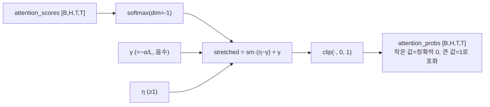
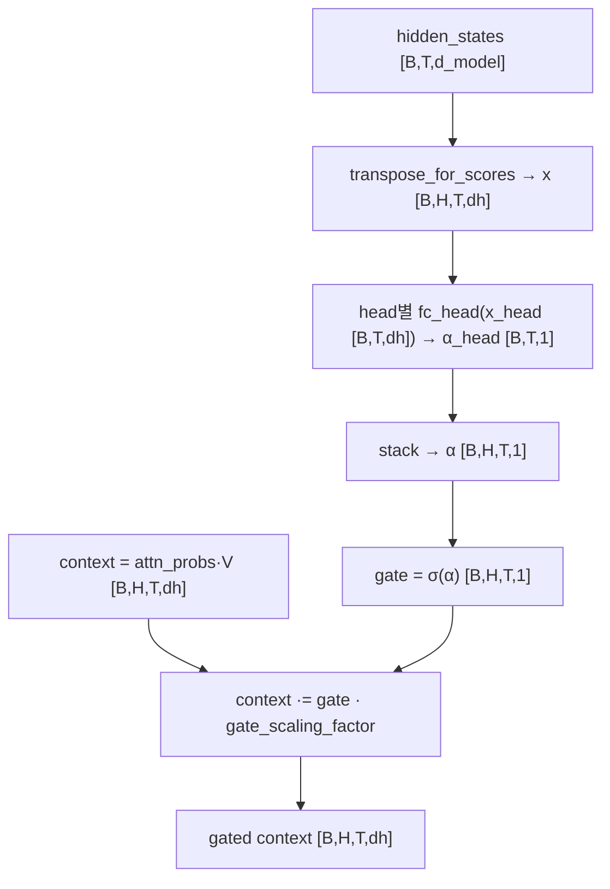
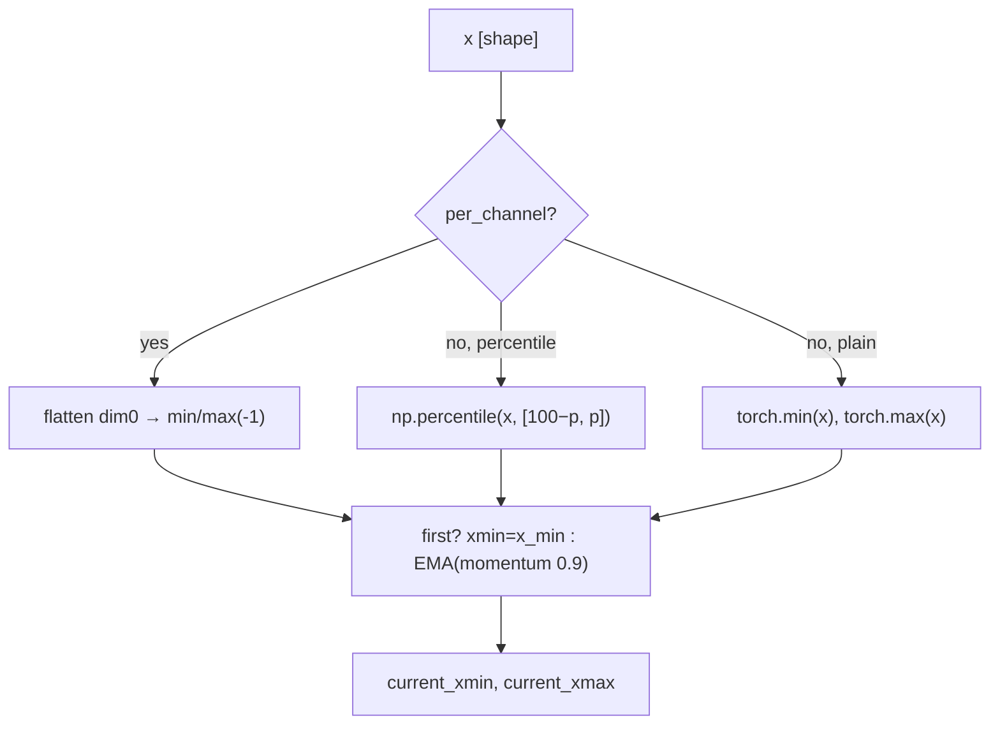
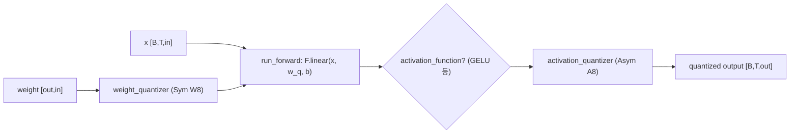
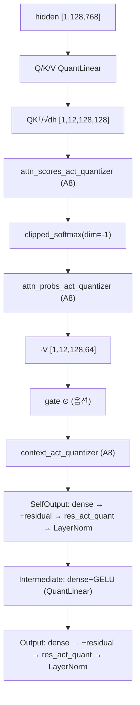
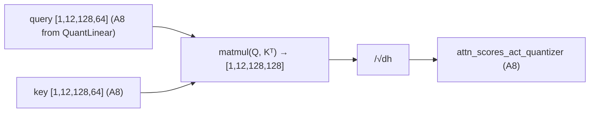
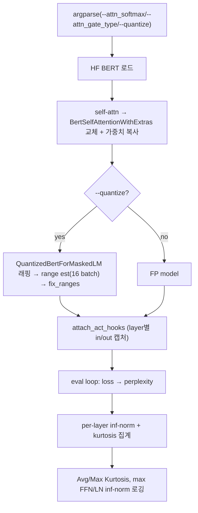

# Outlier-Free Transformers 모듈 통합 가이드 (S-PyTorch)

> 1차 요약: [`../outlier-free-transformers.md`](../outlier-free-transformers.md) — 본 문서는 그 요약을 모듈 단위로 심화한 통합 가이드다.
> 분석 대상: `\\wsl.localhost\ubuntu-24.04\home\user\project\PRJXR-HBTXR\REF\ViT-Quantization\outlier-free-transformers`
> 작성 원칙: 실제 소스 Read 후 `파일:라인` 근거 표기. 라인 근거 없는 추론은 "추정", 코드로 확인 불가는 "확인 불가"로 명시.
> 형제 가이드(`REF/Analysis/ViT-Quantization/I-ViT/MODULE_GUIDE.md`)의 6요소 구조를 따르되, HW 지표(MAC lanes/scalar MACs)는 **S-PyTorch 수치 규약**(params/FLOPs/activation memory/비트폭/observer)으로 치환한다.
> **I-ViT와의 근본 차이**: I-ViT는 *integer-only 추론*을 위한 정수 비선형/dyadic requant가 핵심이지만, 본 repo(Qualcomm "Quantizable Transformers", NeurIPS 2023)는 **activation outlier 발생 자체를 학습 단계에서 억제**(clipped softmax + gated attention)하여 평범한 INT8 PTQ만으로 무손실 양자화를 달성하는 것이 핵심이다. 즉 "양자화기"가 아니라 "양자화 친화 모델"이 주역.

---

## 0. 문서 머리말

### 0.1 대표 케이스 선정
- **대표 모델: `bert-base-uncased` (BERT-base, MLM)** — `hidden_size=768, num_attention_heads=12, head_dim=64, num_hidden_layers=12, max_seq_length=128` (학습 스크립트 `scripts/bert_base_clipped_softmax.sh:12-13,24`, attention 차원 계산 `bert_attention.py:55-57`). 근거:
  1. README의 검증 예시 출력이 모두 BERT-base 기준(`README.md:131-168`)이고, FP↔INT8 perplexity/kurtosis 수치(4.5438→4.6550, Avg Kurtosis 72.19→70.32)가 직접 제시되어 정량 비교가 가능한 유일한 공식 대표 케이스.
  2. clipped softmax / gated attention 두 핵심 기여가 모두 `bert_attention.py` 한 파일에서 완결적으로 구현되어 분석 단위가 명확함(`bert_attention.py:28-343`). OPT(`opt_attention.py`)는 동일 패턴의 디코더 변형.
- **대표 분석 단위: BERT encoder 1 layer** = `SelfAttention(Q/K/V Linear + QKᵀ + clipped_softmax + gate + AV) → SelfOutput(dense + residual + LayerNorm) → Intermediate(dense + GELU) → Output(dense + residual + LayerNorm)` (양자화 래핑: `quantized_bert.py:621-682`). BERT-base는 이 layer를 12개 적층.
- **대표 핵심 기법 2종**:
  1. **Clipped Softmax** (`softmax.py:8-11`) — softmax 출력을 `[γ,η]`로 stretch 후 `[0,1]` clip → 유한 logit으로 정확한 0/1 attention.
  2. **Gated Attention** (`bert_attention.py:120-162, 294-333`) — head별/토큰별 sigmoid gate를 AV 출력에 곱해 "no-op"을 gate로 표현 → softmax 극단화 불필요.
- **대표 양자화 엔진**: `AsymmetricUniformQuantizer`(activation, `uniform_quantizers.py:13-241`), `SymmetricUniformQuantizer`(weight, `:244-312`), `RunningMinMaxEstimator`/`MSE_Estimator`(observer, `range_estimators.py:78-107,115-383`).

### 0.2 S-PyTorch 수치 규약 (HW의 MAC lanes/scalar MACs 대체)
- **params**: 모듈 차원에서 분석적 계산. Linear `in·out (+out bias)`, LayerNorm `2·C`(weight+bias), Embedding `vocab·C`. 양자화는 FP 가중치를 그대로 두고 forward마다 fake-quant(STE)하므로(`uniform_quantizers.py:115,146`; `hijacker.py:93-94,103-104`) **params 개수는 FP 원본과 동일**(비트폭만 달라짐). gated attention만 **추가 학습 파라미터**(gate predictor) 발생 — §3 정량 참조.
- **FLOPs/MACs**: 표준식×config. Linear MAC = `B·T·in·out`. Attention QKᵀ = `B·H·T²·dh`, AV = `B·H·T²·dh`(H=12, dh=64, T=128, `bert_attention.py:55-56,222,292`). 대표 layer 1개를 BERT-base(B=1,T=128,C=768,H=12,dh=64)로 산출 후 12 layer 환원.
- **activation memory**: 텐서 shape × 비트폭. fake-quant라 실제 메모리는 FP32(quant→dequant 후 float, `uniform_quantizers.py:147`)지만 **정수 도메인 비트폭**(W/A bits)을 "HW 환산 activation bit"로 표기 — `shape × A_bit`.
- **비트폭/observer**: 코드 직접. 기본 **W8/A8**(`quant_configs.py:23-24`; `base_quantized_classes.py:53`). weight=**symmetric** uniform + per-tensor + current_minmax observer(`quant_configs.py:28,31`; `uniform_quantizers.py:244-312`), activation=**asymmetric** uniform + per-tensor + running_minmax(momentum 0.9) observer(`quant_configs.py:29,15`; `range_estimators.py:78-107`). INT8 검증 시 activation에 percentile 99.999 클리핑(`README.md:208`; `range_estimators.py:90-92`).
- **정확도/속도**: README perplexity/kurtosis 인용. 본 세션 미실행 → 측정 불가 항목은 "확인 불가". 속도/latency 측정 코드는 본 repo에 **없음**(확인 불가).

### 0.3 운영 경로 (사전학습 ↔ 체크포인트 ↔ FP/INT8 검증)
```
[사전학습] run_mlm.py / run_clm.py : HF BERT/OPT에 SelfAttentionWithExtras 주입
   │  clipped: --attn_softmax "clipped(-.025:1)"            (scripts/bert_base_clipped_softmax.sh:28)
   │  gated  : --attn_gate_type conditional_per_token --attn_gate_mlp  (scripts/bert_base_gated_attention.sh:28-29)
   │  BookCorpus+Wiki, lr 1e-4 linear, 1M steps, bs 256, A100 80GB 1장  (scripts/*.sh:15-19; README.md:95)
   ▼
[체크포인트] HF pytorch_model.bin (gate의 alpha 파라미터 포함)        (validate_mlm.py:187-192)
   ▼
[FP 검증] validate_mlm.py : attention 모듈 교체 → perplexity + kurtosis/inf-norm  (validate_mlm.py:166-183, 481-563)
   ▼
[INT8 검증] validate_mlm.py --quantize : QuantizedBertForMaskedLM 래핑
   │  range estimation(16 batch) → fix_ranges() → eval                (validate_mlm.py:400-470)
   │  W8/A8, weight sym minmax, act asym running_minmax + percentile  (quant_configs.py; README.md:204-210)
   ▼
[outlier 진단] Avg/Max Kurtosis + inf-norm 로깅으로 outlier 억제 효과 정량  (validate_mlm.py:541-563)
```
- 타깃 디바이스: GPU 전제이나 **cuda 하드코딩 없음** — `accelerate`가 device 배치(`validate_mlm.py:97-99,394`), 양자화기는 `x.device`/`data.device`로 디바이스 추종(`range_estimators.py:69-70,94-95`; `uniform_quantizers.py` device-agnostic). → I-ViT와 달리 **CPU 실행 가능성 있음(추정)**, 단 미검증.

### 0.4 모델 / 데이터셋 / 정확도 (README 인용)
| 항목 | FP | INT8 | 근거 |
|---|---|---|---|
| **BERT-base perplexity** | 4.5438 | 4.6550 | `README.md:133,162` |
| BERT max FFN out inf-norm | 20.8 | 20.6 | `README.md:134,163` |
| BERT max LN(FFN i+o) inf-norm | 25.9 | 25.7 | `README.md:136,165` |
| **BERT Avg Kurtosis** | 72.19 | 70.32 | `README.md:137,166` |
| **BERT Max Kurtosis** | 197.6 | 188.4 | `README.md:138,167` |
| OPT perplexity | 15.5449 | 16.0132 | `README.md:187,222` |
| OPT Avg / Max Kurtosis | 18.26 / 151.5 | (INT8는 perplexity만) | `README.md:191-192` |
- **주의**: README 수치는 "example output"으로 표기됨(`README.md:131,160`). 위 값은 **vanilla 기준 예시이거나 특정 설정 예시**일 수 있어, clipped/gated 적용 시 kurtosis 감소폭의 절대 비교는 **확인 불가**(논문 본문 표 필요). 핵심은 INT8가 FP 대비 perplexity 손실 미미(BERT +0.11, OPT +0.47)라는 점.
- 데이터셋: **BookCorpus + Wiki40b(en)** (`--dataset_setup bookcorpus_and_wiki`, `validate_mlm.py:261-283`), max_seq_length 128(BERT)/block_size 512(OPT).
- 속도(latency): 측정 코드 부재 → **확인 불가**.

### 0.5 제외 (지시: HuggingFace/원본·third_party·체크포인트 제외, 커스텀만)
- **외부 프레임워크(커스텀 아님)**: `transformers.*`(BERT/OPT 백본, `BertLayer`, `BertSelfAttention`, `AutoModelForMaskedLM` 등), `accelerate.*`, `datasets.*`, `timm.utils.AverageMeter`/`timm.models.layers.Swish`(`hijacker.py:6-7`; `validate_mlm.py:22,25-32`). HF 사전학습 가중치(`pytorch_model.bin`) — 로드만, 코드는 본 repo 정의.
- **본 repo지만 본 가이드 범위 밖(이름만)**: `dataset_setups.py`, `transformers_language/utils.py`의 데이터 헬퍼, `accelerate_configs/*.yaml`, `docker/`, `model_configs/*.yaml`(미열람), `run_mlm.py`/`run_clm.py`의 학습 루프 세부(스크립트 인자로 대체).
- **미열람(확인 불가)**: `validate_clm.py`/`quantized_opt.py` 세부(BERT와 동형 추정), `quantization/base_quantized_model.py`(QuantizedModel 베이스, 양자화 상태 토글 컨테이너로 추정), `quantization/utils.py`의 `StopForwardException`/`to_numpy`(헬퍼).

---

## 1. Repo / 모델 개요

Outlier-Free Transformers = Transformer activation의 **strong outlier 발생 원인(attention head의 "no-op" 시도가 softmax logit을 ±∞로 미는 현상)을 학습 단계에서 차단**하여, 추가 노력 없이 **full INT8 양자화**가 가능한 모델을 만드는 프레임워크(`README.md:26-35`). 본 repo의 자체 소스는 ① **두 어텐션 수정 기법**(clipped softmax / gated attention)과 ② **자체 uniform 양자화 엔진**이며, BERT/OPT 백본·데이터 파이프라인은 HuggingFace를 그대로 임포트한다(`validate_mlm.py:25-32`).

### 1.1 자체 소스 vs 외부 프레임워크
| 구분 | 파일(자체 소스) | 역할 |
|---|---|---|
| **핵심 기법 ★** | `transformers_language/models/softmax.py` | `clipped_softmax` + `SOFTMAX_MAPPING` 프리셋 |
| | `transformers_language/models/bert_attention.py` ★ | `BertSelfAttentionWithExtras`: clipped softmax 연동 + 4종 gate |
| | `transformers_language/models/opt_attention.py` | `OPTAttentionWithExtras`: OPT(디코더)용 동일 패턴 |
| **양자화 엔진** | `quantization/quantizers/uniform_quantizers.py` ★ | Asym/Sym uniform quantizer + STE |
| | `quantization/quantizers/base_quantizers.py` | QuantizerBase 추상 |
| | `quantization/quantizers/quantizer_utils.py` | RoundStraightThrough, ScaleGradient(STE) |
| | `quantization/range_estimators.py` ★ | running/current minmax + MSE + percentile observer |
| | `quantization/quantization_manager.py` | observer↔quantizer 결합 + range 상태머신 |
| | `quantization/base_quantized_classes.py` | QuantizedModule/QuantizedActivation/FP32Acts |
| | `quantization/hijacker.py` ★ | QuantizationHijacker: weight+act fake-quant forward |
| | `quantization/autoquant_utils.py` | quantize_model: nn.Linear/LayerNorm/Embedding → Quant* 자동 변환 |
| | `quantization/qstates.py` | range 추정 4-상태 enum |
| **양자화 모델** | `transformers_language/models/quantized_bert.py` ★ | QuantizedBert* 전체 래핑 + QuantLayerNorm(분해형) |
| | `transformers_language/models/quantized_opt.py` | OPT 양자화 래핑(미열람) |
| **설정/엔트리** | `transformers_language/quant_configs.py` | W8/A8 기본 양자화 config |
| | `transformers_language/args.py` | argparse(softmax/gate/quant 인자) |
| | `validate_mlm.py` / `validate_clm.py` | FP/INT8 검증 + outlier(kurtosis/inf-norm) 측정 |
| | `transformers_language/utils.py` | `kurtosis`, `count_params`, `pass_data_for_range_estimation` |

### 1.2 forward 진입점 (검증 경로)
`validate_mlm.main`(`validate_mlm.py:80`) → ① HF BERT 로드 후 GELU 교체(`:158-160`), self-attention을 `BertSelfAttentionWithExtras`로 교체+가중치 복사(`:166-183`), gate면 alpha 파라미터 재로드(`:186-192`) → ② `--quantize`면 `QuantizedBertForMaskedLM` 래핑(`:451`) → range estimation 16 batch(`:461-466`) → `fix_ranges()`(`:467`) → ③ `model.eval()` + DataLoader 순회(`:482-529`)로 perplexity + per-layer inf-norm/kurtosis 산출.

### 1.3 핵심 데이터플로우 한눈
```
hidden_states ─► Q/K/V Linear ─► QKᵀ/√dh ─► (+mask) ─► [clipped_softmax] ─► dropout ─► ·V
                                                                                          │
                                                              [gate ⊙] ◄── sigmoid(α or f(x))
                                                                                          ▼
                                                              context ─► out_proj ─► +residual ─► LayerNorm
```
clipped softmax(`softmax.py:8-11`)와 gate(`bert_attention.py:294-333`)는 **독립적으로 on/off** 가능(둘 다 끄면 vanilla, `args.py:331-371`).

---

## 2. 모듈: Clipped Softmax — `softmax.py` ★핵심 기여 #1

### 2.1 역할 + 상위/하위
- **역할**: 표준 softmax 출력을 `[γ,η]` 구간으로 선형 stretch 후 `[0,1]`로 clip. `γ<0`이면 작은 확률이 **정확히 0**으로, `η>1`이면 큰 확률이 1로 포화 → head가 0/1 attention을 만들기 위해 softmax 입력 logit을 무한대로 밀 필요가 사라짐 → **outlier 발생 원인 제거**.
- **상위**: `BertSelfAttentionWithExtras.__init__`이 `alpha` 인자로 `partial(clipped_softmax, gamma=-alpha/L, eta=1.0)` 구성(`bert_attention.py:89-92`), 또는 `SOFTMAX_MAPPING[args.attn_softmax]`로 프리셋 주입(`validate_mlm.py:170`). **하위**: `torch.nn.functional.softmax`, `torch.clip`.

### 2.2 데이터플로우 (텐서 shape 흐름)


### 2.3 forward call stack
`BertSelfAttentionWithExtras.forward`(`bert_attention.py:276`) → `self.softmax_fn(attention_scores, dim=-1)` → `clipped_softmax`(`softmax.py:8`) → `F.softmax`(`:9`) → stretch(`:10`) → `torch.clip(·,0,1)`(`:11`).

### 2.4 대표 코드 위치
`softmax.py`: `clipped_softmax` `:8-11`, `SOFTMAX_MAPPING` 프리셋 `:14-51`. 연동: `bert_attention.py:89-94`(BERT), `opt_attention.py:68-73`(OPT).

### 2.5 대표 코드 블록
```python
# softmax.py:8-11  핵심: stretch 후 clip (3-line)
def clipped_softmax(data, dim=1, eta=1.1, gamma=-0.1, **kw):
    sm_out = torch.nn.functional.softmax(data, dim=dim, **kw)
    stretched_out = sm_out * (eta - gamma) + gamma   # [0,1] → [γ, η]
    return torch.clip(stretched_out, 0, 1)           # γ<0 구간 → 정확히 0
```
→ FPGA 관점: 기존 softmax datapath에 **affine 1단(`×(η−γ) + γ`) + saturating clip 1단**만 추가. 곱셈 1, 가산 1, 비교 2 (원소당). 거의 무비용.

```python
# bert_attention.py:89-92  α로부터 시퀀스길이 비례 γ 자동 설정
if self.alpha is not None:
    assert self.max_seq_length is not None
    gamma = -self.alpha / self.max_seq_length          # γ = −α/L
    self.softmax_fn = partial(clipped_softmax, gamma=gamma, eta=1.0)
```
→ `γ = −α/L`(L=max_seq_length). 시퀀스가 길수록 |γ| 작아짐 — clip 임계가 토큰 수에 정규화. 학습 스크립트는 `clipped(-.025:1)` 직접 지정(`scripts/bert_base_clipped_softmax.sh:28`), 즉 γ=−0.025, η=1.0(`softmax.py:41`).

### 2.6 연산·수치표현 분해 + 정량
- **수식**: `clip-sm(x) = clip((η−γ)·softmax(x) + γ, 0, 1)` (`softmax.py:10-11`). softmax 확률 `p < −γ/(η−γ)`이면 출력 0; `p > (1−γ)/(η−γ)`이면 1.
- **대표 설정**: γ=−0.025, η=1.0 → 임계 `p < 0.025/1.025 ≈ 0.0244`이면 정확히 0(`softmax.py:41`). η=1이라 상단 clip은 사실상 비활성(softmax 최대값 ≤1).
- **params**: 0 (순수 함수, 학습 파라미터 없음 — α/γ는 하이퍼파라미터 상수).
- **FLOPs**: attention_probs 원소수 `B·H·T²`에 대해 mul 1 + add 1 + clip(min/max 2회) = ~4 op/원소. 대표 BERT layer(B=1,H=12,T=128, T²=16384) = `12×16384 ≈ 196.6K` 원소 × 4 = **~0.8M op/layer**. ×12 layer.
- **activation memory**: attention_probs `[1,12,128,128]` — A8이면 12×16384×1 ≈ **192 KB**(softmax 출력은 양자화 대상, `quantized_bert.py:375`).
- **outlier 억제 메커니즘**: no-op head가 softmax→0을 원할 때, vanilla는 logit→−∞를 요구 → 다른 위치 logit이 상대적으로 +∞로 밀리며 V/FFN/LN에 outlier. clipped는 **유한 logit으로 정확한 0** 달성 → logit 동적범위 축소 → kurtosis↓(`README.md:26-35,137-138`).

---

## 3. 모듈: Gated Attention — `bert_attention.py` ★핵심 기여 #2

### 3.1 역할 + 상위/하위
- **역할**: head별 또는 토큰별 **sigmoid gate `G`를 attention 출력(AV)에 element-wise 곱**. head가 "업데이트 안 함(no-op)"을 원하면 `G≈0`으로 직접 표현 → softmax를 0/1 극단으로 밀 필요 제거. clipped softmax와 **독립적 대안**(둘 중 하나만 써도 됨).
- **상위**: `BertSelfAttentionWithExtras.forward`(`bert_attention.py:294-333`), `OPTAttentionWithExtras.forward`(`opt_attention.py:269-310`), 양자화 버전 `QuantizedBertSelfAttentionWithExtras.forward`(`quantized_bert.py:390-429`). **하위**: `torch.sigmoid`, `nn.Linear`/`nn.Sequential`(gate predictor), `torch.mean`(pooling).

### 3.2 4종 gate 타입 (`AttentionGateType`, `bert_attention.py:21-26`)
| 타입 | 정의 위치 | gate 산출 | 학습 파라미터 |
|---|---|---|---|
| `none` | — | gate 없음(vanilla) | 0 |
| `unconditional_per_head` | `:120-122` | `G_h = σ(α_h)`, α는 head 수 벡터 | H개 (`α∈ℝ^H`) |
| `conditional_per_head` | `:124-162` | head별 FC가 토큰 예측 후 토큰 평균 pooling → `G_h` | head별 predictor |
| `conditional_per_token` | `:124-162` | head별 FC가 토큰마다 예측 → `G_{h,t}` | head별 predictor |

predictor 구조(`bert_attention.py:134-151`): `attn_gate_mlp`이면 `Linear(dh→dh/4)+ReLU+Linear(dh/4→1)`(2층 MLP, `:135-141`), `attn_gate_mlp2`이면 `Linear(dh→dh)+ReLU+Linear(dh→1)`(`:143-148`), 둘 다 아니면 단일 `Linear(dh→1)`(`:151`). `attn_gate_linear_all_features`이면 head별 대신 `Linear(d_model→H)` 1개(`:129`).

### 3.3 데이터플로우 (텐서 shape 흐름, conditional_per_token + MLP)


### 3.4 forward call stack
`BertSelfAttentionWithExtras.forward`(`bert_attention.py:292`) → `context_layer = attn_probs @ value` → gate 분기(`:294-333`): unconditional `σ(α).view(-1,1,1)`(`:295-299`) / conditional head별 FC 루프(`:313-327`) → `context *= gate · gate_scaling_factor`(`:327`) → gate 통계 로깅(`:329-331`).

### 3.5 대표 코드 위치
`bert_attention.py`: enum `:21-26`, gate 정의 `:119-162`, `logit`(역시그모이드 bias 초기화) `:16-18`, unconditional gate `:295-299`, conditional gate `:301-331`, `gate_scaling_factor` `:115-117`. OPT 동형: `opt_attention.py:99-138, 270-307`. 양자화 버전: `quantized_bert.py:391-427`(단 `gate_scaling_factor` 없이 `context *= gate`, `:423`).

### 3.6 대표 코드 블록
```python
# bert_attention.py:120-122  unconditional: head별 스칼라 학습 파라미터
if self.attn_gate_type == AttentionGateType.unconditional_per_head:
    init_alpha = torch.zeros(size=(self.num_attention_heads,))   # α 초기 0 → σ(0)=0.5
    self.alpha = nn.Parameter(init_alpha, requires_grad=True)
```

```python
# bert_attention.py:151-155  conditional 단일 Linear + gate 초기 확률 제어
fc = nn.Linear(self.attention_head_size, 1, bias=True)          # dh → 1
if self.attn_gate_init is not None:
    init_bias = logit(self.attn_gate_init)                      # 역시그모이드
    torch.nn.init.constant_(fc.bias, init_bias)                # 초기 gate≈attn_gate_init
```
→ `logit(p)`(`:16-18`)로 bias 설정 → 초기 gate 확률을 `attn_gate_init`(기본 0.5, `args.py:354`; 권장 0.25, `README.md:113`)로 제어. fine_tuning이면 weight를 std 0.01 정규초기화(`:157-159`).

```python
# bert_attention.py:295-299, 327  gate 적용 (AV 출력에 element-wise 곱)
# (A) unconditional:
gate = self.gate_fn(self.alpha)         # σ(α), shape (H,)
context_layer *= gate.view(-1, 1, 1)    # broadcast over (B,H,T,dh)
# (B) conditional (루프로 head별 α 산출 후):
gate = self.gate_fn(alpha)              # σ, (B,H,T,1) or (B,H,1,1)
context_layer *= gate * self.gate_scaling_factor
```
→ `gate_scaling_factor = 1/attn_gate_init`(fine_tuning 시, `:116-117`)는 초기 출력 스케일 보정용. 양자화 버전엔 이 보정 없음(`quantized_bert.py:423`).

### 3.7 연산·수치표현 분해 + 정량 (BERT-base, B=1, T=128, H=12, dh=64)
- **수식**: `out_h = G_h ⊙ (Attn_h · V)`, `G_h = σ(α_h)`(unconditional) 또는 `σ(f_h(x))`(conditional). (`bert_attention.py:296-297, 320-327`)
- **params (gate predictor, BERT-base 1 layer)**:
  - `unconditional_per_head`: **H = 12** params/layer (α 벡터, `:121`).
  - `conditional_per_token` 단일 Linear: head별 `Linear(64→1)` = 65 params × 12 head = **780** params/layer (`:151`).
  - `conditional_per_token` + MLP(`attn_gate_mlp`, 학습 스크립트 기본): head별 `Linear(64→16)+Linear(16→1)` = (64·16+16)+(16·1+1) = 1040+17 = 1057 × 12 head = **12,684** params/layer (`:135-141`).
  - → 12 layer면 MLP gate 추가 params ≈ **152K** (BERT-base 110M 대비 ~0.14%, 추정).
- **MACs (conditional MLP gate, 1 layer)**: head별 MLP를 토큰마다 = `H·T·(dh·dh/4 + dh/4·1)` = `12×128×(64·16+16) ≈ 12×128×1040 ≈ 1.6M` MAC/layer. AV(`H·T²·dh = 12×16384×64 ≈ 12.6M`) 대비 ~13% 추가(추정). unconditional은 MAC 0(스칼라 곱만).
- **activation memory**: gate 텐서 `[1,12,128,1]`(per_token) ≈ 1536 원소 — 무시 가능.
- **outlier 억제 메커니즘**: no-op을 `G≈0`으로 직접 표현 → softmax는 임의 분포를 유지해도 무방 → logit 극단화 압력 제거. unconditional이 가장 저비용(head당 1 param)이면서도 효과적(논문 주장, 추정).

---

## 4. 모듈: Uniform Quantizer (Asym/Sym) — `uniform_quantizers.py` ★양자화 엔진

### 4.1 역할 + 상위/하위
- **역할**: FP 텐서를 **균등(uniform) affine 양자화**. Asymmetric은 `q = round(x/Δ) + z`로 zero-point z 사용, Symmetric은 z=0. forward는 quant→dequant(`Δ·(q−z)`), backward는 round STE. activation=Asym, weight=Sym이 기본(`quant_configs.py:28-29`).
- **상위**: `QuantizationManager.forward`가 호출(`quantization_manager.py:103`), 그 위에 `QuantizationHijacker`(weight/act)와 `QuantizedActivation`(act). **하위**: `round_ste_func`(`quantizer_utils.py:28`), `scale_grad_func`(LSQ grad scaling, `:29`).

### 4.2 데이터플로우 (텐서 shape 흐름)
```mermaid
flowchart TD
  X["x_float [shape]"] --> RNG{"state==estimate_ranges?"}
  RNG -->|yes| OBS["range_estimator(x) → xmin,xmax"]
  OBS --> SQR["set_quant_range: Δ=(xmax−xmin)/int_max (asym)<br/>Δ=|xabsmax|/int_max (sym)"]
  RNG -->|no(fixed)| SQR
  SQR --> ZP["z = round(−xmin/Δ) (asym) / 0 (sym)"]
  X --> QI["x_int = round_ste(x/Δ) + z"]
  ZP --> QI
  QI --> CL["clamp(int_min, int_max)"]
  CL --> DQ["x_quant = Δ·(x_int − z)  (FP dtype 복귀)"]
```

### 4.3 forward call stack
`QuantizationHijacker.forward`(`hijacker.py:78`) → `quantize_weights`(`:103`)/`quantize_activations`(`:116-134`) → `QuantizationManager.forward`(`quantization_manager.py:95`) → (state면 `range_estimator` → `set_quant_range`) → `AsymmetricUniformQuantizer.forward`(`uniform_quantizers.py:120`) → `to_integer_forward`(`:93-118`) → `round_ste_func`(`:115`) + `clamp`(`:116`).

### 4.4 대표 코드 위치
`uniform_quantizers.py`: Asym `int_min/max` `:63-70`, `scale`(Δ) `:72-77`, `zero_point` `:79-83`, `to_integer_forward` `:93-118`, `forward` `:120-149`, `set_quant_range` `:205-225`. Sym override: `int_min/max` `:276-282`, `zero_point=0` `:284-286`, `set_quant_range`(absmax) `:288-299`. STE: `quantizer_utils.py:7-29`.

### 4.5 대표 코드 블록
```python
# uniform_quantizers.py:115-116  Asym: round STE + zero-point + clamp
x_int = round_ste_func(x_float / scale) + zero_point
x_int = torch.clamp(x_int, self.int_min, self.int_max)   # asym: [0, 2^b−1]
```

```python
# uniform_quantizers.py:288-294  Sym: 부호대칭 absmax 스케일, zero-point=0
self._signed = x_min.min() < 0
x_absmax = torch.max(x_min.abs(), x_max)
self._delta = x_absmax / self.int_max     # sym: int_max = 2^(b−signed)−1, int_min = −2^(b−1)
```
→ weight는 Sym(zp=0) → HW에서 zero-point 가산 불필요(곱셈기-free 친화, I-ViT와 동일 이점). activation은 Asym(zp≠0) → HW에서 bias 보정 필요(I-ViT의 모든-대칭 대비 차이점).

```python
# quantizer_utils.py:7-14  Round Straight-Through Estimator
class RoundStraightThrough(Function):
    @staticmethod
    def forward(ctx, x):           return torch.round(x)
    @staticmethod
    def backward(ctx, output_grad): return output_grad   # STE: round 그래디언트 = 1
```

### 4.6 연산·수치표현 분해 + 정량
- **양자화 방식**: weight = **Symmetric** uniform, per-tensor(기본, `quant_configs.py:25`), zp=0. activation = **Asymmetric** uniform, per-tensor, zp = `round(−xmin/Δ)`(`uniform_quantizers.py:81-82,220`).
- **scale/zp**: asym `Δ=(xmax−xmin)/(2^b−1)`, `z=round(−xmin/Δ)`(`:219-220,81`); sym `Δ=absmax/int_max`, `z=0`(`:294,286`). 정수범위: asym `[0,2^b−1]`(`:65,70`), sym signed `[−2^(b−1), 2^(b−1)−1]`(`:277,281`).
- **비트폭**: 기본 W8/A8(`quant_configs.py:23-24`), `--n_bits`/`--n_bits_act`로 변경(`args.py:377-378`). LSQ grad scaling 옵션(`uniform_quantizers.py:105-110,151-158`)은 기본 off(`grad_scaling=False`, `:36`).
- **params**: 학습 파라미터는 buffer(`_delta`,`_zero_float`,`_signed`, `:33-34,262`) — `make_range_trainable()` 호출 시에만 nn.Parameter화(`:227-231` — learn_ranges 모드, 검증 경로 미사용).
- **FLOPs**: 원소당 div + round + add + clamp(asym 4) / div + round + clamp(sym 3) + dequant mul/sub. O(N).
- **HW 환산**: dequant이 곧 forward에 포함되어 출력은 FP32(`:147`). HW에서는 정수 q를 그대로 다음 정수 MAC에 넘기고 스케일은 별도 전파(I-ViT의 dyadic requant 같은 정수-only 재양자화는 **본 repo에 없음** — fake-quant QAT/PTQ 방식이라 FP 연산 가정).

---

## 5. 모듈: Range Estimator (Observer) — `range_estimators.py` ★

### 5.1 역할 + 상위/하위
- **역할**: 양자화 범위 `(xmin,xmax)` 추정. ① `CurrentMinMaxEstimator`(매 배치 min/max, weight 기본), ② `RunningMinMaxEstimator`(EMA momentum 0.9, activation 기본), ③ `MSE_Estimator`(클리핑 임계를 MSE 최소화로 grid/golden search). percentile 옵션으로 outlier 무시 클리핑.
- **상위**: `QuantizationManager.__init__`이 observer 인스턴스화(`quantization_manager.py:61-63`), `forward`에서 호출(`:100`). **하위**: `np.percentile`, `scipy.optimize.minimize_scalar`(MSE golden section).

### 5.2 데이터플로우 (running minmax + percentile)


### 5.3 forward call stack
`QuantizationManager.forward`(`quantization_manager.py:96-101`) → `self.range_estimator(x)` → `RunningMinMaxEstimator.forward`(`range_estimators.py:84`) → percentile면 `np.percentile`(`:92`) → EMA 갱신(`:104-105`) → `set_quant_range`(`quantization_manager.py:101`).

### 5.4 대표 코드 위치
`range_estimators.py`: `CurrentMinMaxEstimator` `:55-75`, `RunningMinMaxEstimator` `:78-107`, percentile `:90-95`, EMA `:103-105`, `MSE_Estimator` `:115-383`(grid `:243-307`, golden `:309-357`), `RangeEstimators` enum `:393-396`.

### 5.5 대표 코드 블록
```python
# range_estimators.py:90-105  percentile 클리핑 + EMA (outlier-robust observer)
elif self.percentile:
    data_np = to_numpy(x)
    x_min, x_max = np.percentile(data_np, (100 - self.percentile, self.percentile))
    ...
if self.current_xmin is None:
    self.current_xmin = x_min; self.current_xmax = x_max
else:
    self.current_xmin = (1 - self.momentum) * x_min + self.momentum * self.current_xmin
    self.current_xmax = (1 - self.momentum) * x_max + self.momentum * self.current_xmax
```
→ INT8 검증은 `--percentile 99.999`(`README.md:208`) → 상위 0.001% activation을 잘라냄. **outlier가 남아있어도 percentile로 1차 방어**하지만, 본 repo의 본질은 애초에 outlier를 안 만드는 것(§2,§3)이라 percentile 의존도↓.

### 5.6 연산·수치표현 분해 + 정량
- **observer 종류**: weight=current_minmax(`quant_configs.py:31`), activation=running_minmax momentum **0.9**(`range_estimators.py:79`; `quant_configs.py:15`). I-ViT의 EMA 0.95와 유사하나 momentum 값 다름.
- **calibration**: range estimation에 **16 batch**(`quant_configs.py:13`; `--est_num_batches`, `README.md:147,209`), 그 뒤 `fix_ranges()`로 고정(`validate_mlm.py:467`).
- **percentile**: 기본 None, INT8 검증 시 99.999(`args.py:385`; `README.md:208`).
- **MSE**: weight `--ranges_weights mse`이면 grid search(`validate_mlm.py:415-417`), act는 golden section(asym, `:432-433`).
- **params**: buffer `current_xmin/xmax`만(`:17-18`), 학습 파라미터 0.
- **FLOPs**: min/max reduce O(N); percentile은 정렬 O(N log N)(numpy); MSE는 `num_candidates`(기본 100, `:117`) × loss_fx → calibration 시 1회성.

---

## 6. 모듈: Quantization Hijacker (Quant Linear/LayerNorm/Embedding) — `hijacker.py` + `autoquant_utils.py`

### 6.1 역할 + 상위/하위
- **역할**: `nn.Linear`/`nn.LayerNorm`/`nn.Embedding`을 **다중상속으로 hijack**하여 forward에서 ① weight fake-quant ② 원본 연산(F.linear 등) ③ output activation fake-quant를 자동 수행. `quantize_model`이 모델 트리를 재귀 순회하며 대상 모듈을 Quant* 버전으로 치환.
- **상위**: `quantize_model`/`quantize_sequential`(`autoquant_utils.py:237,180`), 이를 `QuantizedBert*`가 호출(`quantized_bert.py:160,238` 등). **하위**: `QuantizationManager`(weight/act 각각), `F.linear`/`F.layer_norm`/`F.embedding`(`autoquant_utils.py:21,66-73,83-92`).

### 6.2 데이터플로우 (QuantLinear)


### 6.3 forward call stack
`QuantLinear.forward`(상속, `hijacker.py:78`) → `get_params`(`:84-101`, weight quant `:93-94`) → `run_forward`(`autoquant_utils.py:20-21`, `F.linear`) → `quantize_activations`(`hijacker.py:116-134`, 옵션 activation_function 적용 후 act quant `:126-127`).

### 6.4 대표 코드 위치
`hijacker.py`: `QuantizationHijacker.__init__`(weight/act manager 생성) `:44-76`, `forward` `:78-82`, `get_params`(weight quant + 캐싱) `:84-101`, `quantize_activations` `:116-134`. `autoquant_utils.py`: `QuantLinear` `:19-21`, `module_map` `:96`, `quantize_model` 재귀 `:237-270`, `quant_module`(가중치 복사) `:166-177`.

### 6.5 대표 코드 블록
```python
# hijacker.py:78-82  hijack된 forward: weight quant → 원연산 → act quant
def forward(self, x, offsets=None):
    weight, bias = self.get_params()           # weight fake-quant (Sym W8)
    res = self.run_forward(x, weight, bias, offsets=offsets)   # F.linear 등
    res = self.quantize_activations(res)       # output fake-quant (Asym A8)
    return res
```

```python
# autoquant_utils.py:251-260  nn.Linear → QuantLinear 자동 치환 + 가중치 복사
modtype = module_map[type(model)]              # {nn.Linear:QuantLinear, ...}
quant_model = modtype(**kwargs, **quant_params)
quant_model.weight.data = model.weight.data    # FP 가중치 그대로 (fake-quant)
if getattr(model, "bias", None) is not None:
    quant_model.bias.data = model.bias.data
```
→ conv+act, linear+act를 `nn.Sequential`로 묶어 한 모듈로 양자화(`quantize_sequential` + `get_act` `:106-121`). 추론 시 `cached_params`로 양자화 가중치 캐싱(`hijacker.py:85-101`) → 반복 quant 회피.

### 6.6 연산·수치표현 분해 + 정량 (BERT-base 1 layer, B=1, T=128)
- **양자화 방식**: weight Sym W8 per-tensor, output Asym A8. bias는 양자화 안 함(FP 유지, `get_weight_bias` 그대로, `hijacker.py:106-110`).
- **params (BERT-base 1 layer Linear, C=768, intermediate=3072)**:
  - Q/K/V: 768×768+768 = 590,592 each ×3 = **1,771,776**
  - attn out(SelfOutput.dense): 768×768+768 = **590,592**
  - FFN fc1(intermediate): 768×3072+3072 = **2,362,368**
  - FFN fc2(output.dense): 3072×768+768 = **2,360,064**
  - Linear params/layer ≈ **7.08M**, ×12 ≈ **85.0M** (+ embeddings/LN/head 별도; BERT-base 총 ~110M).
- **MACs/layer (B=1, T=128)**:
  - Q/K/V: 128×768×768 ≈ 75.5M ×3 = **226.5M**
  - attn out: 128×768×768 ≈ **75.5M**
  - fc1: 128×768×3072 ≈ **301.99M**
  - fc2: 128×3072×768 ≈ **301.99M**
  - Linear MAC/layer ≈ **906M**, ×12 ≈ **10.87G** (Attention matmul 별도, §7).
- **activation bit**: weight W8, activation A8 → HW 환산 정수 MAC 누산 INT32(추정), 출력 dequant FP(코드상).

---

## 7. 모듈: 양자화 BERT 조립 (SelfAttention/SelfOutput/Layer) — `quantized_bert.py`

### 7.1 역할 + 상위/하위
- **역할**: HF BERT 토폴로지를 양자화 모듈로 재조립. attention scores/probs/context 3지점에 `QuantizedActivation` 삽입, residual 합 직후 activation 양자화 후 LayerNorm, clipped softmax/gate를 그대로 보존.
- **상위**: `QuantizedBertForMaskedLM`(`quantized_bert.py:858`) → `QuantizedBertModel`(`:707`) → `quantize_model(encoder, specials={BertLayer:QuantizedBertLayer})`(`:714-716`). **하위**: §2 clipped softmax, §3 gate, §6 QuantLinear/QuantLayerNorm, `QuantizedActivation`.

### 7.2 데이터플로우 (텐서 shape 흐름, 1 BERT layer)


### 7.3 forward call stack
`QuantizedBertLayer.forward`(`quantized_bert.py:649`) → `self.attention`(`:664`, = `QuantizedBertSelfAttentionWithExtras.forward` `:270` + `QuantizedBertSelfOutput.forward` `:566`) → `feed_forward_chunk`(`:679-682`): `intermediate`(dense+GELU) → `QuantizedBertOutput.forward`(`:601-607`, dense+residual+act_quant+LN).

### 7.4 대표 코드 위치
`quantized_bert.py`: `QuantizedBertSelfAttentionWithExtras` `:223-441`(softmax `:372`, gate `:391-427`, 3 act quantizer `:244-246`), `QuantizedBertSelfOutput`(residual+LN) `:542-572`, `QuantizedBertOutput` `:575-607`, `QuantizedBertLayer` `:621-682`, `QuantLayerNorm`(분해형 정수친화 LN) `:80-145`, `QuantizedBertForMaskedLM` `:858-927`.

### 7.5 대표 코드 블록
```python
# quantized_bert.py:362-388  attention 3지점 activation 양자화 + clipped softmax + gate
attention_scores = attention_scores / math.sqrt(self.attention_head_size)
attention_scores = self.attn_scores_act_quantizer(attention_scores)   # A8
if attention_mask is not None: attention_scores = attention_scores + attention_mask
attention_probs = self.softmax_fn(attention_scores, dim=-1)           # clipped or vanilla
attention_probs = self.attn_probs_act_quantizer(attention_probs)      # A8
...
context_layer = torch.matmul(attention_probs, value_layer)            # AV
# *** Gating ***  (§3와 동일, gate_scaling_factor 없이 context *= gate, :423)
```

```python
# quantized_bert.py:566-572  SelfOutput: residual 합 → act quant → LayerNorm
hidden_states = self.dense(hidden_states)        # QuantLinear
hidden_states = self.dropout(hidden_states)
hidden_states = hidden_states + input_tensor     # residual (FP 덧셈)
hidden_states = self.res_act_quantizer(hidden_states)   # A8 (residual 후 양자화)
hidden_states = self.LayerNorm(hidden_states)
```
→ I-ViT가 residual을 정수 dyadic 정렬로 합산하는 것과 달리, 본 repo는 **FP residual 덧셈 후 그 결과를 A8 양자화**(fake-quant). HW는 INT 누산 후 재양자화에 대응(추정).

```python
# quantized_bert.py:104-122  QuantLayerNorm: LN을 단항/이항 연산으로 분해해 각각 양자화
mu = self.input_quantizer(torch.mean(x, dim=-1, keepdim=True))
u_q = self.ln_aq_u(x - mu)
S = torch.mean(x**2.0, dim=-1, keepdim=True); S_q = self.ln_aq_S(S)   # v1
Sigma_q = self.ln_aq_Sigma(F.relu(S_q - mu2_q))
v_q = self.ln_aq_v(torch.rsqrt(Sigma_q + self.eps))   # rsqrt는 FP (정수근사 아님)
w_q = self.ln_aq_w(u_q * v_q)
```
→ `QuantLayerNorm`은 LN 내부 중간값(mu, S, Sigma, v, u, w, y)을 각각 양자화(`:91-100`)하나 **`rsqrt`는 FP 그대로**(I-ViT의 정수 뉴턴 sqrt와 대조). 단 기본 `layer_norm_*` 플래그가 모두 False(`:66-67`)라 **기본 검증 경로에선 평범한 `quantize_model(LayerNorm)`(QuantLayerNorm-hijacker) 사용**(`:188,564,599`), 이 분해형 LN은 옵트인.

### 7.6 연산·수치표현 분해 + 정량 (BERT-base 1 layer)
- **양자화 방식**: 전 Linear W8/A8(asym act), softmax/probs/context/residual 지점마다 별도 act quantizer. weight Sym, act Asym.
- **params (1 layer 전체)**: Linear 7.08M(§6) + LayerNorm 2×(2×768)=3072 + gate(옵션 §3) ≈ **7.08M**, ×12 ≈ 85M.
- **MACs/layer**: Linear 906M(§6) + Attention matmul(§8) 50.3M ≈ **956M**, ×12 ≈ **11.5G** (T=128 기준).
- **activation memory (layer 피크)**: attn scores/probs `[1,12,128,128]` A8 ≈ **192 KB** 각, hidden `[1,128,768]` A8 = 96 KB.
- **head 처리**: MLM head(`self.cls`)는 **양자화 안 함**(FP 유지, `:866`; `quant_setup fp32_head`, `README.md:204`).

---

## 8. 모듈: Attention 행렬곱 (QKᵀ / AV) — `bert_attention.py` / `quantized_bert.py`

### 8.1 역할 + 상위/하위
- **역할**: QKᵀ(attention scores)와 AV(context) 두 행렬곱. 양자화 버전은 입력(Q,K / probs,V)을 fake-quant한 텐서로 `torch.matmul` 수행, 결과는 act quantizer로 양자화.
- **상위**: `QuantizedBertSelfAttentionWithExtras.forward`(`quantized_bert.py:319,388`). **하위**: `torch.matmul`(BERT), `torch.bmm`(OPT, `opt_attention.py:198,257`).

### 8.2 데이터플로우 (BERT, QKᵀ)


### 8.3 forward call stack
`QuantizedBertSelfAttentionWithExtras.forward`(`quantized_bert.py:319`) → `torch.matmul(query_layer, key_layer.transpose(-1,-2))` → `/√dh`(`:362`) → `attn_scores_act_quantizer`(`:364`); AV: `torch.matmul(attention_probs, value_layer)`(`:388`) → gate → `context_act_quantizer`(`:435`).

### 8.4 대표 코드 위치
`quantized_bert.py`: QKᵀ `:319`, scale `:362`, AV `:388`, context quant `:435`. FP 원본: `bert_attention.py:222,265,292`. OPT bmm: `opt_attention.py:198,257`.

### 8.5 대표 코드 블록
```python
# quantized_bert.py:319, 362-364, 388  QKᵀ → scale → act quant → (softmax) → AV
attention_scores = torch.matmul(query_layer, key_layer.transpose(-1, -2))
attention_scores = attention_scores / math.sqrt(self.attention_head_size)
attention_scores = self.attn_scores_act_quantizer(attention_scores)   # A8
...
context_layer = torch.matmul(attention_probs, value_layer)            # AV (A8 inputs)
```
→ Q,K,V는 QuantLinear 출력(A8 fake-quant), matmul은 FP로 수행되나 입력이 양자화 격자에 정렬됨. I-ViT의 `QuantMatMul`(정수 `@` + scale 곱)과 달리 명시적 정수 누산 없음(fake-quant 가정).

### 8.6 연산·수치표현 분해 + 정량 (BERT-base, B=1, H=12, T=128, dh=64)
- **양자화 방식**: 입력 A8(asym), 행렬곱 결과 A8로 재양자화. zp는 asym이라 ≠0(I-ViT 대칭과 차이).
- **비트폭**: A8, 누산 HW 환산 INT32(추정).
- **params**: 0.
- **MACs/layer**:
  - QKᵀ: H·T²·dh = 12×16384×64 ≈ **12.6M**
  - AV: 12×16384×64 ≈ **12.6M**
  - Attention matmul MAC/layer ≈ **25.2M**, ×12 ≈ **302M** (T=128에선 Linear 대비 작음; T가 커지면 T² 지배).
- **activation memory**: attn scores/probs `[1,12,128,128]` A8 ≈ **192 KB**(layer 내 최대 단일 활성). T=512(OPT)면 16배 = 3MB로 급증.
- **시사**: T² 텐서가 outlier 진앙(softmax 입력). 본 repo는 이 텐서의 동적범위를 clipped softmax/gate로 줄여 A8 양자화를 무손실화.

---

## 9. 모듈: OPT Attention (디코더 변형) — `opt_attention.py`

### 9.1 역할 + 상위/하위
- **역할**: BERT용 기법을 OPT(causal LM, 디코더)에 적용. clipped softmax + gated attention 동일, 단 causal mask·KV cache·`bmm` 기반·query에 scaling 선적용 등 디코더 특성 반영.
- **상위**: `validate_clm.py`/`run_clm.py`(미열람). **하위**: §2 clipped softmax, §3 gate(import `bert_attention.AttentionGateType, logit`, `opt_attention.py:10`).

### 9.2 BERT와의 차이 (코드 근거)
| 항목 | BERT(`bert_attention.py`) | OPT(`opt_attention.py`) |
|---|---|---|
| query scaling | softmax 전 `/√dh`(`:265`) | q_proj 직후 `*self.scaling`(`:161`) |
| 행렬곱 | `torch.matmul`(`:222,292`) | `torch.bmm`(`:198,257`) |
| mask | additive(`:272`) | additive + finfo.min 클램프(`:214-217`) |
| fp16 | — | softmax fp32 upcast(`:221-224`) |
| gate fine_tuning weight std | 0.01(`:159`) | 0.001(`:135`) |
| clipped/gate 구조 | `:89-162, 294-333` | **동일**(`:68-138, 269-307`) |

### 9.3 forward call stack
`OPTAttentionWithExtras.forward`(`opt_attention.py:143`) → q/k/v proj(`:161,169-180`) → `bmm(q, kᵀ)`(`:198`) → mask(`:214-217`) → `softmax_fn`(`:222/226`) → `bmm(probs, v)`(`:257`) → gate(`:270-307`) → out_proj(`:318`).

### 9.4 대표 코드 위치
`opt_attention.py`: clipped softmax 연동 `:68-73`, gate 정의 `:99-138`, query scaling `:161`, bmm `:198,257`, softmax `:221-226`, gate 적용 `:270-307`.

### 9.5 대표 코드 블록
```python
# opt_attention.py:68-73  OPT도 동일한 clipped softmax 연동
if self.alpha is not None:
    gamma = -self.alpha / self.max_seq_length
    self.softmax_fn = partial(clipped_softmax, gamma=gamma, eta=1.0)
```
```python
# opt_attention.py:303  gate 적용 (BERT와 달리 gate_scaling_factor 포함)
attn_output *= gate * self.gate_scaling_factor
```

### 9.6 연산·수치표현 분해 + 정량
- **모델 규모(README)**: OPT-125m / 350m / 1.3B(`README.md:102-108`). 차원은 코드 미명시(HF config 의존) → 정확한 params/MACs **확인 불가**(추정: 125m ≈ 12 layer × d_model 768).
- **block_size 512**(`README.md:213`) → T=512라 attention T²=262144로 BERT(T=128)의 16배. → OPT가 outlier·activation 메모리에 훨씬 취약, 본 repo의 가치가 큰 케이스.
- **gate params**: BERT와 동일 구조(§3.7), d_head 의존.
- **clipped/gate 효과**: OPT FP perplexity 15.54 → INT8 16.01(+0.47, `README.md:187,222`).

---

## 10. 모듈: 검증·outlier 진단 파이프라인 — `validate_mlm.py` + `utils.kurtosis`

### 10.1 역할 + 상위/하위
- **역할**: ① attention 모듈 교체 + 가중치/gate 로드 ② (옵션)INT8 양자화 + range estimation + fix ③ perplexity ④ **outlier 정량(Avg/Max Kurtosis + inf-norm)**을 layer별 forward hook으로 측정. 본 repo의 핵심 평가가 정확도가 아니라 **outlier 억제 효과**임을 보여주는 모듈.
- **상위**: CLI(`README.md:115-223`). **하위**: §2~§7 전 모듈, `kurtosis`(`utils.py:10-16`), `pass_data_for_range_estimation`(`utils.py:46-67`), HF `AutoModelForMaskedLM`.

### 10.2 데이터플로우


### 10.3 forward call stack
`main`(`validate_mlm.py:80`) → 모델 교체(`:166-192`) → `QuantizedBertForMaskedLM`(`:451`) → `pass_data_for_range_estimation`(`:461`) → `fix_ranges`(`:467`) → `attach_act_hooks`(`:475`) → eval 루프(`:484-529`) → `kurtosis`(`:513`) + inf-norm(`:505`) → 집계 로깅(`:550-563`).

### 10.4 대표 코드 위치
`validate_mlm.py`: attention 교체 `:166-183`, gate alpha 로드 `:186-192`, 양자화 `:400-470`, hook `:64-77,472-475`, kurtosis/inf-norm 측정 `:492-528`, 집계 `:541-563`. `utils.py`: `kurtosis` `:10-16`.

### 10.5 대표 코드 블록
```python
# utils.py:10-16  Kurtosis = E[(x−μ)^4] / σ^4  (outlier 지표; 정규분포=3, 클수록 outlier↑)
def kurtosis(x, eps=1e-6):
    mu = x.mean(dim=1, keepdims=True)
    s = x.std(dim=1)
    mu4 = ((x - mu) ** 4.0).mean(dim=1)
    return mu4 / (s**4.0 + eps)
```
```python
# validate_mlm.py:166-183  HF self-attention을 우리 모듈로 교체 (가중치 복사)
new_self = BertSelfAttentionWithExtras(
    config, softmax_fn=SOFTMAX_MAPPING[args.attn_softmax], alpha=args.alpha,
    max_seq_length=args.max_seq_length,
    attn_gate_type=AttentionGateType[args.attn_gate_type],
    attn_gate_init=args.attn_gate_init, attn_gate_mlp=args.attn_gate_mlp, ...)
new_self.load_state_dict(old_self.state_dict(), strict=False)   # Q,K,V 복사
model.bert.encoder.layer[layer_idx].attention.self = new_self
```
```python
# validate_mlm.py:511-517  FFN output/LN 지점에서 kurtosis 측정 (256 batch까지)
if batch_idx <= 256:
    kurt = kurtosis(x)
    for v in kurt: act_kurtoses[name].update(v.item())
```
→ 측정 지점: `output.dense`(FFN 출력), `output.LayerNorm`(LN 출력+입력)(`:495-498`). outlier가 주로 FFN/LN에 나타난다는 논문 관찰과 일치(`README.md:26-30`).

### 10.6 연산·수치표현 분해 + 정량 / 재현 명령
- **outlier 지표**: kurtosis(`utils.py:10-16`) + inf-norm(`validate_mlm.py:505`, `x.norm(p=∞)`). README 예시: BERT FP Avg/Max Kurtosis 72.19/197.6, INT8 70.32/188.4(`README.md:137-138,166-167`).
- **calibration**: range estimation 16 batch(`--est_num_batches 16`, `README.md:147`).
- **재현 명령**:
  ```bash
  # FP 검증
  accelerate launch validate_mlm.py --model_type bert --max_seq_length 128 \
    --dataset_setup bookcorpus_and_wiki --attn_softmax "clipped(-.025:1)" --alpha 12 \
    --model_name_or_path /path/to/ckpt --output_dir output_metrics
  # INT8 검증
  accelerate launch validate_mlm.py --quantize --est_num_batches 16 \
    --ranges_acts running_minmax --qmethod_acts asymmetric_uniform --percentile 99.999 \
    --quant_setup fp32_head ... (위와 동일 softmax/gate 인자)   (README.md:118-218)
  ```
  > 주의: 검증 시 **사전학습과 동일한 softmax/gate 인자**를 넘겨야 함(`README.md:113`).
- **정확도**: BERT perplexity FP 4.5438 / INT8 4.6550(`README.md:133,162`). **속도/latency 측정 코드 없음 → 확인 불가.**

---

## N+1. 모듈 한눈 요약 표

| 모듈 | 파일:라인 | 역할 | 양자화/기법 | 대표 정량(BERT-base) |
|---|---|---|---|---|
| **Clipped Softmax ★** | softmax.py:8-11 | stretch+clip로 유한 logit 0/1 attention | γ=−α/L, η=1 | params 0, ~4 op/원소, outlier↓ |
| **Gated Attention ★** | bert_attention.py:120-162,294-333 | head/token gate로 no-op 직접표현 | G=σ(α) or σ(f(x)) | uncond 12 / MLP gate 12.7K params/layer |
| Uniform Quantizer | uniform_quantizers.py:13-312 | Asym(act)/Sym(weight) uniform + STE | W8 Sym zp0 / A8 Asym | params 0(buffer), O(N) |
| Range Estimator | range_estimators.py:78-396 | running/current minmax + MSE + percentile | act EMA 0.9, 16 batch calib | percentile 99.999(INT8) |
| Quant Hijacker | hijacker.py:28-134 | weight+act fake-quant forward | W8/A8 | layer Linear 7.08M params, 906M MAC |
| QuantizedBert 조립 | quantized_bert.py:223-682 | BERT layer 양자화 재조립 | 3+2 act quantizer/layer | layer ~956M MAC, attn 192KB |
| Attention matmul | quantized_bert.py:319,388 | QKᵀ/AV (A8 입력) | matmul, asym | layer 25.2M MAC(T=128) |
| OPT Attention | opt_attention.py:14-321 | 디코더용 clipped+gate | bmm, q-scaling, T=512 | 차원 확인불가(HF config) |
| QuantLayerNorm(분해형) | quantized_bert.py:80-145 | LN 중간값 양자화(옵트인) | rsqrt는 FP | 기본 경로 미사용 |
| 검증·outlier 진단 | validate_mlm.py:80-563 | perplexity + kurtosis/inf-norm | W8/A8 PTQ | FP/INT8 ppl 4.54/4.66 |

---

## N+2. 학습·평가 파이프라인 + 재현 명령

- **데이터셋**: BookCorpus + Wiki40b(en) (`validate_mlm.py:261-283`), BERT max_seq_length 128 / OPT block_size 512.
- **사전학습** (A100 80GB 1장, `README.md:95`):
  - vanilla: `--attn_softmax vanilla`
  - clipped: `--attn_softmax "clipped(-.025:1)"` (`scripts/bert_base_clipped_softmax.sh:28`) 또는 `--alpha 12`(`README.md:113`)
  - gated: `--attn_gate_type conditional_per_token --attn_gate_mlp` (`scripts/bert_base_gated_attention.sh:28-29`) 또는 `--attn_gate_init 0.25`(`README.md:113`)
  - 공통 하이퍼: lr **1e-4**, linear scheduler, **1M steps**, warmup 10K, bs **256**, grad clip 1.0, weight_decay 0.01, fp16 accelerate (`scripts/bert_base_*.sh:15-23`).
- **검증**: `accelerate launch validate_mlm.py [--quantize] ...` — FP/INT8 모두 perplexity + kurtosis/inf-norm 출력(`validate_mlm.py:536,559-563`).
- **INT8 설정**: W8/A8(`quant_configs.py:23-24`), weight Sym minmax(`:28,31`), act Asym running_minmax + `--percentile 99.999`(`README.md:204-210`), head는 FP(`--quant_setup fp32_head`, `quantized_bert.py:866`), range estimation 16(BERT)/4(OPT) batch(`README.md:147,209`).
- **체크포인트**: HF `pytorch_model.bin`(gate면 alpha 포함, `validate_mlm.py:187`).
- **의존성**: PyTorch **1.11** / CUDA 11.3(`README.md:79-81`), `transformers`+`accelerate`+`datasets`, Python ≥3.8(`README.md:73`). CUDA 권장이나 cuda 하드코딩 없음 → CPU 가능성 있음(추정, 미검증).

---

## N+3. 우리 프로젝트(FPGA ViT 가속) 시사점 + outlier 억제의 비트폭·스케일 이점

### N+3.1 outlier 억제 = 저비트 activation 양자화의 1차 병목 제거 (최우선 통찰)
- FPGA 가속기(HG-PIPE류)가 INT8 이하 activation을 쓸 때 **outlier가 activation 스케일을 키워 유효 비트수를 깎는 1차 병목**. 본 repo는 outlier를 *사후 처리(percentile/clip)가 아니라 학습 단계에서 생성 차단*하는 정공법(`README.md:26-35`).
- **비트폭 이점**: outlier 없는 activation은 동적범위가 좁아 동일 비트수에서 양자화 step Δ가 작아짐 → **A8 무손실(BERT +0.11 ppl), 잠재적으로 A6/A4까지 여유**(추정). I-ViT가 A16 residual 경로를 별도로 둔 것과 달리, outlier 억제 모델은 **모든 경로를 균일 A8**로 갈 수 있음(`README.md:162-167` INT8 무손실).
- **스케일 이점**: clipped softmax(`softmax.py:8-11`)는 attention probs를 정확히 [0,1]에 가두므로 softmax 출력 양자화 스케일이 **상수 1로 고정** → HW에서 attention probs 양자화기를 고정 스케일(LUT-free)로 단순화 가능(추정).

### N+3.2 Clipped Softmax = 거의 무비용 HW 추가 (직접 이식 가능)
- `softmax.py:8-11`은 프레임워크 독립 순수 함수 → **timm ViT softmax에 그대로 재사용 가능**. FPGA softmax datapath에 **affine 1단(`×(η−γ)+γ`) + saturating clip 1단**만 추가(원소당 mul 1·add 1·compare 2). I-ViT의 Shiftmax(int_exp_shift) 같은 복잡한 정수 지수 없이도 outlier 억제 효과를 얻음.
- 단, 본 repo는 **integer-only가 아님**(fake-quant). FPGA 배포 시 clipped softmax를 I-ViT식 정수 softmax 위에 얹어야 함(clip은 정수 도메인에서도 자명, 추정).

### N+3.3 Gated Attention = 작은 MAC + sigmoid LUT
- gate predictor(`bert_attention.py:151` 단일 Linear, 또는 `:135-141` MLP)는 head당 `dh→1` 소형 FC + sigmoid → FPGA에서 **소형 MAC 어레이 + sigmoid LUT**로 합성. unconditional(`:120-122`)은 head당 1 파라미터 스칼라 곱 → 거의 무비용. AV 출력에 element-wise 곱만 추가.
- 시선추적 경량 ViT라면 **unconditional_per_head**(추가 params H개/layer)가 비용 대비 효과 최적(추정).

### N+3.4 양자화 엔진 = 표준 fake-quant (I-ViT 대비 단순하나 HW 직결성↓)
- weight Sym(zp0, `uniform_quantizers.py:284-286`) → I-ViT처럼 HW 곱셈기-free 친화. **단 activation Asym(zp≠0, `:79-83`)** → HW에서 zero-point 가산 필요(I-ViT 모든-대칭 대비 추가 비용).
- **dyadic requantization·정수 비선형 없음** — fake-quant QAT/PTQ 방식이라 FP rsqrt/softmax 가정(`quantized_bert.py:121` rsqrt FP). FPGA 정수 배포에는 I-ViT의 정수 비선형을 **이식해와야 함**(본 repo는 "양자화 친화 모델", I-ViT는 "정수 추론 엔진" — 상보적).

### N+3.5 outlier 진단 도구 재사용
- `kurtosis`(`utils.py:10-16`) + inf-norm(`validate_mlm.py:505`)은 **우리 ViT activation의 outlier 진단에 그대로 응용 가능**. FPGA 비트폭 결정 전 activation kurtosis를 측정해 outlier-heavy layer를 식별 → 해당 layer만 비트폭↑ 또는 clipped softmax 재학습 결정의 근거.

### N+3.6 FPGA 친화도 평가
| 항목 | 평가 | 근거 |
|---|---|---|
| outlier 억제 → 저비트 여유 | ★★★ A8 무손실, A4 잠재 | `README.md:162-167` |
| clipped softmax HW 비용 | ★★★ affine+clip 2단 | `softmax.py:10-11` |
| gated attention HW 비용 | ★★ 소형 FC + sigmoid LUT | `bert_attention.py:135-151` |
| integer-only 추론 | ☆ 없음(fake-quant) | `quantized_bert.py:121` rsqrt FP |
| weight 대칭(곱셈기-free) | ★★★ Sym zp0 | `uniform_quantizers.py:286` |
| activation 대칭 | ★ Asym zp≠0(HW 가산) | `uniform_quantizers.py:81-83` |
| ViT 직접 적용 | ★ LLM(BERT/OPT)만, 기법 이식 필요 | `bert_attention.py`(BERT 전용) |
| QAT 비용 | ☆ 1M steps 사전학습 필요(PTQ 불가) | `scripts/*.sh:17` |

### N+3.7 XR 시선추적 적용 (프로젝트 성격은 추정)
- 시선추적 경량 ViT를 FPGA 저비트로 구동할 때, **사전학습/파인튜닝에 clipped softmax를 도입**하면 저비트 activation 정확도를 방어. clipped softmax는 ViT softmax에 즉시 이식 가능(프레임워크 독립). 단 **사전학습 단계 개입 필요**(이미 학습된 체크포인트에 PTQ만으로 적용 불가, `README.md:33-35`) → 백본 재학습 예산이 있을 때 채택. integer-only 배포는 I-ViT 정수 비선형과 결합 권장.

---

## 부록. 근거 / 확인 불가

- **직접 코드 확인**: §2~§10 전 라인 인용 — `softmax.py`(전체), `bert_attention.py`(전체), `opt_attention.py`(전체), `uniform_quantizers.py`(전체), `range_estimators.py`(전체), `quantization_manager.py`(전체), `base_quantized_classes.py`(전체), `hijacker.py`(전체), `autoquant_utils.py`(전체), `quantizer_utils.py`(전체), `base_quantizers.py`(전체), `quant_configs.py`(전체), `quantized_bert.py`(전체), `validate_mlm.py`(전체), `args.py`(전체), `utils.py`(전체), `qstates.py`(전체), `scripts/bert_base_{clipped_softmax,gated_attention}.sh`, `README.md`.
- **분석적 산출(검증 가능)**: params/MACs/activation memory는 BERT-base config(hidden 768, heads 12, intermediate 3072, T=128, `scripts/*.sh` + `bert_attention.py:55-57`)와 표준식으로 계산. clipped softmax/gate FLOPs는 원소연산 카운트 기반("추정" 표기).
- **추정**: HW 환산 누산 비트폭(INT32), gate params 비율(~0.14%), A4 저비트 여유, CPU 실행 가능성, OPT 정확한 차원, 행 스트리밍 softmax, 프로젝트 성격(FPGA+XR), clipped softmax의 정수도메인 이식.
- **확인 불가(미열람/미실행)**: `validate_clm.py`/`quantized_opt.py` 세부(BERT와 동형 추정), `base_quantized_model.py`(QuantizedModel 베이스), `run_mlm.py`/`run_clm.py` 학습 루프 세부(스크립트 인자로 대체), `model_configs/*.yaml`, latency 실측(측정 코드 부재), README kurtosis 수치의 정확한 설정(vanilla vs clipped/gated 구분 — "example output" 표기), OPT params/MACs(HF config 의존).
