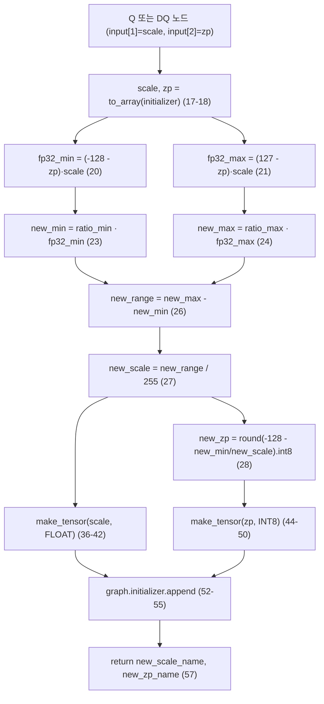
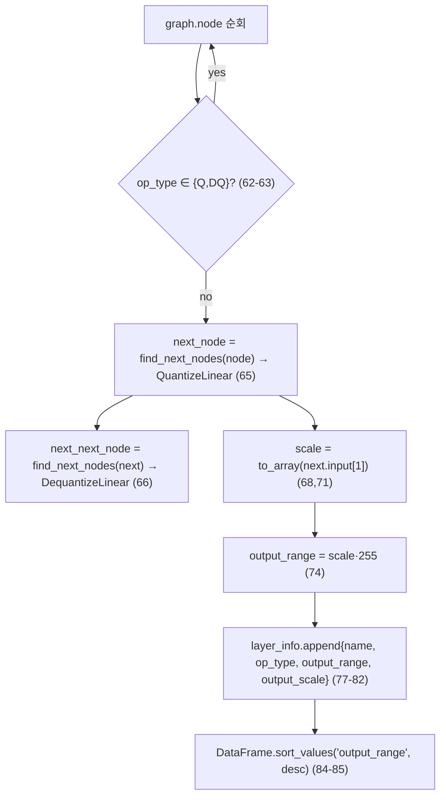
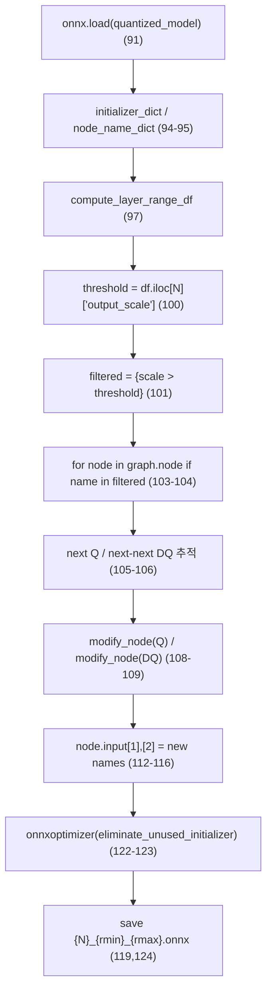
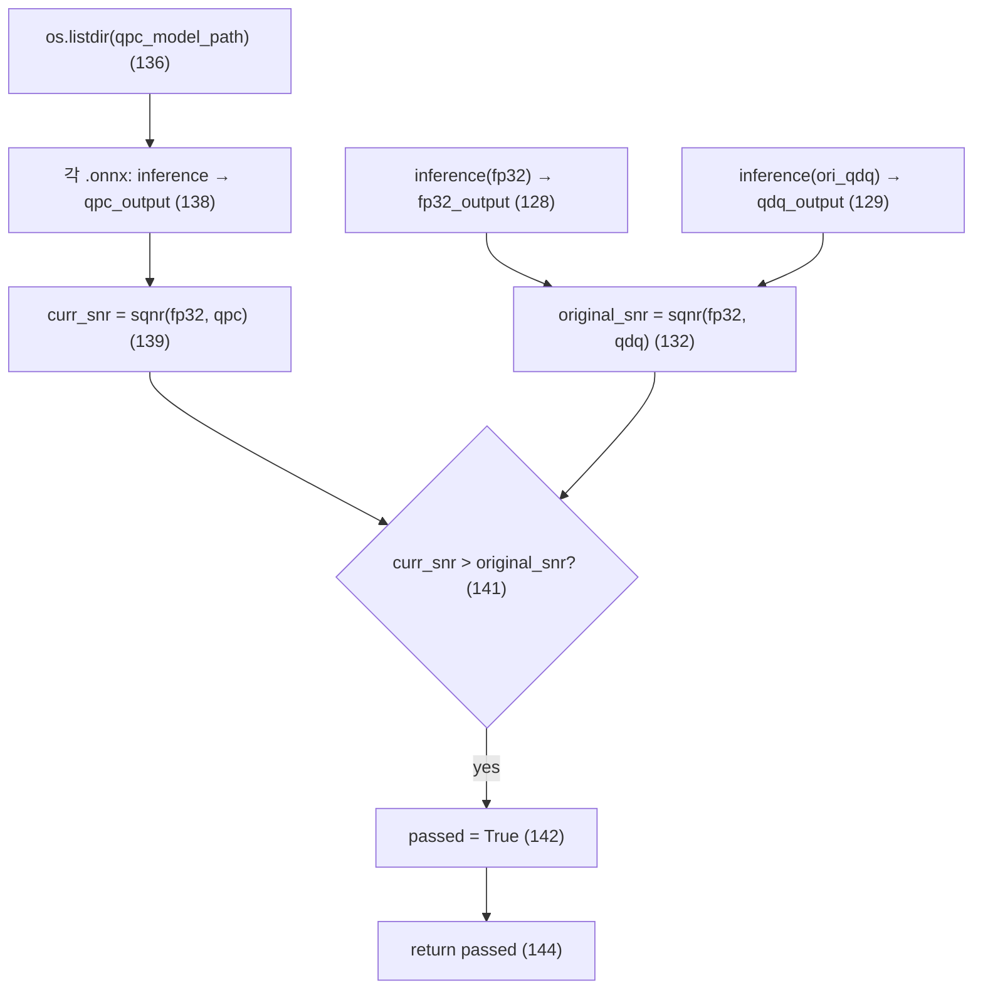

# postcalibration4quantization 모듈 통합 가이드 (S-PyTorch)

> 1차 요약: [`../postcalibration4quantization.md`](../postcalibration4quantization.md) — 본 문서는 그 요약을 모듈(함수) 단위로 심화한 통합 가이드다.
> 분석 대상: `\\wsl.localhost\ubuntu-24.04\home\user\project\PRJXR-HBTXR\REF\ViT-Quantization\postcalibration4quantization`
> 작성 원칙: 실제 소스 Read 후 `파일:라인` 근거 표기. 라인 근거 없는 추론은 "추정", 코드로 확인 불가는 "확인 불가"로 명시.
> 형제 가이드(`REF/Analysis/ViT-Quantization/I-ViT/MODULE_GUIDE.md`)의 6요소 구조를 따르되, HW/S-PyTorch 수치 규약(params/FLOPs/activation memory/비트폭/observer)을 **ONNX QDQ 후처리 도구**의 성격에 맞춰 치환한다.

---

## 0. 문서 머리말

### 0.1 기법·대상 코드 확정
- **정체(확정)**: 이미 PTQ로 양자화된 **ONNX QDQ(Quantize-Dequantize) 모델**의 정확도를, **재학습·calibration 데이터 없이** scale/zero-point만 미세조정해 회복하려는 **사후 재보정(post-calibration) 도구**다. README가 방법명을 **QPC(Quantization Post Calibration)**로 명명(`README.md` — 요약 근거). 저자 Tairen Piao(Nota AI).
- **기법 확정(코드 근거)**: 1차 요약에 가설로 적힌 "BN/bias correction, AdaRound류 가능성"은 **코드상 부재 — 해당 기법이 아님**. 실제 기법은 **clipping-range reduction(클리핑 범위 축소) 기반 per-tensor scale 재calibration**이다.
  - BN-folding/BN-correction 로직 **없음**: `BatchNormalization` 처리·평균/분산 보정 코드 부재(`main.py` 전체에 BN 관련 식 없음).
  - AdaRound류(weight rounding 학습) **없음**: 학습 루프·gradient·soft-rounding 변수 부재. 수정 대상은 **activation Q/DQ 노드의 scale·zero-point initializer**만(`main.py:13-57`).
  - bias correction(출력 평균 보정) **없음**: bias 텐서를 건드리는 코드 부재.
  - **실제 기법** = ① 레이어 출력 동적범위(`output_scale·255`) 내림차순 랭킹(`main.py:74,85`) → ② 상위 N개 선택(`main.py:100-101`) → ③ FP32 min/max를 ratio(<1) 배로 좁힘(`main.py:23-24`) → ④ 좁힌 범위로 scale/zp 재계산(`main.py:26-28`) → ⑤ Q·DQ 노드 교체(`main.py:108-116`) → ⑥ SQNR로 검증·채택(`main.py:141`).
- **대상 코드 확정(자체 소스 2파일)**:
  - `main.py`(207 lines) ★본체 — `modify_node`(scale/zp 재계산), `compute_layer_range_df`(랭킹), `post_calibration_onnx`(선택·적용), `compare_performance`(SQNR 검증), `main`(config sweep + CI).
  - `utils.py`(50 lines) ★보조 — `inference`(onnxruntime 더미추론), `sqnr`(신호대잡음비), `find_next_nodes`(QDQ 체인 추적).
- **I-ViT 동형성 주의**: I-ViT는 PyTorch 정수전용 모델+QAT라 "모듈=nn.Module"이지만, 본 repo는 **모델 정의·forward·학습이 전혀 없는** ONNX 그래프 변환 스크립트다. 따라서 "모듈"을 **함수(graph-transform 단위)**로 재해석해 6요소를 적용한다. params/FLOPs는 모델 자체가 아니라 **그래프 조작 비용**과 **검증 대상 모델의 외형 지표**로 치환한다.

### 0.2 S-PyTorch 수치 규약 (본 도구 성격에 맞춘 치환)
- **params**: 본 도구는 **학습 파라미터가 전무**(순수 그래프 상수 편집). 대신 "수정되는 그래프 상수 개수"로 치환 — 보정 1회당 레이어 L개 선택 시 Q/DQ 각각 scale·zp 2개씩 = **레이어당 4개 initializer**(`main.py:108-116`), 새 텐서로 추가(`main.py:52-55`).
- **FLOPs/MACs**: 도구 자체는 무거운 연산 없음. (a) 보정 비용 = 노드 순회 O(노드수) + 레이어당 상수 산술 O(1)(`main.py:20-28`). (b) **검증 비용**(`inference`)은 onnxruntime로 더미 입력 1회 forward — 모델 본연의 MAC은 검증 모델(MobileNetV2/ResNet18/MixNet) 의존, 본 repo 코드로 산출 불가(가중치만 .onnx, **확인 불가**).
- **activation memory**: 더미 입력 `np.random.randn(*input_shape)`(`utils.py:14`) 1배치 × FP32. 모델별 입력 shape는 세션에서 미열람(.onnx 미파싱) → **확인 불가**(분류 ONNX이므로 [1,3,224,224] FP32 ≈ 588KB로 **추정**).
- **비트폭/observer**:
  - **비트폭 하드코딩 INT8 per-tensor**: `(-128 - zp)·scale ... (127 - zp)·scale`(`main.py:20-21`), `range/255`(`main.py:27`), `np.int8`(`main.py:28`). → **8bit symmetric-ish QDQ 전제**, 다른 비트폭 미지원.
  - **observer 없음(런타임 미수집)**: min/max를 데이터로 관측하지 않고, **기존 QDQ 노드의 scale/zp에서 FP32 범위를 역산**(`main.py:20-21`) 후 ratio로 좁힘. 즉 calibration 데이터·observer가 불필요한 zero-shot 방식(이것이 본 도구의 핵심 차별점).
- **post-calibration 보정식(확정)**: §3.5에 수식 명시.
- **정확도**: README/코드에 top-1 정확도 측정 **없음**. 검증 지표는 **SQNR(dB)**만(`utils.py:23-29`). top-1 정확도 영향은 **확인 불가**.

### 0.3 운영 경로 (QPC sweep ↔ SQNR 검증 ↔ CI)
```
[입력] FP32 ONNX (--fp32_model_path)  +  QDQ INT8 ONNX (--quantized_model_path)   (main.py:149-153)
   │
   ▼
[config sweep] qpc_configs 24개: [top_N, "min_max", ratio_min, ratio_max]         (main.py:156-181)
   │   for each config:
   │     post_calibration_onnx():                                                  (main.py:89-125)
   │       compute_layer_range_df  → output_range=scale·255 내림차순 랭킹           (main.py:59-87)
   │       threshold = N번째 scale → scale>threshold 레이어만 선택                  (main.py:100-101)
   │       각 선택 레이어의 다음 Q, 그 다음 DQ 노드 modify_node로 재calibration     (main.py:103-116)
   │       onnxoptimizer(eliminate_unused_initializer) 후 저장 {N}_{rmin}_{rmax}.onnx (main.py:118-124)
   ▼
[검증] compare_performance: FP32 vs (원본 QDQ / 각 QPC) SQNR 비교                  (main.py:127-144)
   │   inference: onnxruntime + 더미 가우시안 입력                                  (utils.py:5-21)
   │   sqnr = 10·log10(var(orig)/var(error))                                       (utils.py:23-29)
   ▼
[CI 판정] QPC 중 1개라도 SQNR>원본 → exit(0)pass, 전부 실패 → exit(1)             (main.py:197-202)
```
- 타깃 디바이스: **CPU 전제** — onnxruntime 기본 provider, CUDA/Triton/PyTorch 코드 없음(`utils.py:1-3`, `main.py:1-10` import 목록). I-ViT의 `.cuda()` 하드코딩과 정반대로, GPU 의존성 없음(확인).
- 학습 단계 없음 — `main`은 sweep+검증+exit만 수행(`main.py:146-202`). I-ViT의 `quant_train.py`(QAT)에 해당하는 코드 **부재**.

### 0.4 모델 / 데이터셋 / 정확도
| 항목 | 내용 | 근거 |
|---|---|---|
| 검증 모델 | MobileNetV2-7, ResNet18, MixNet-S (ImageNet 분류 ONNX) | `postcalibration4quantization.md:18,118`, 1차 요약 (test_models/ 디렉토리) |
| 입력 데이터 | **랜덤 가우시안 더미** (`np.random.randn`) — 실데이터 아님 | `utils.py:14` |
| 검증 지표 | **SQNR(dB)** = `10·log10(var(orig)/var(err))` — top-1 정확도 아님 | `utils.py:23-29` |
| FP32/INT8 정확도 | README/코드에 미기재 — **확인 불가** | (top-1 측정 코드 부재) |
| 비트폭 | INT8 per-tensor QDQ만 (하드코딩) | `main.py:20-28` |
| 데이터셋 클래스 | 분류 ONNX로 추정(ImageNet) — 코드상 명시 없음 | `postcalibration4quantization.md:118` |
- **I-ViT와의 대조**: I-ViT는 ImageNet top-1을 README 표로 인용(DeiT-S 80.12% 등)하나, 본 도구는 **정확도 표 자체가 없고 SQNR만** 보고 → "정확도 README 인용·없으면 확인불가" 규약에 따라 **top-1 확인 불가**.

---

## 1. Repo / 함수 개요

postcalibration4quantization = ONNX QDQ 모델의 activation scale/zp를 **clipping range 축소로 zero-shot 재보정**하고 SQNR로 검증하는 경량 후처리 + CI 도구. 양자화 모델 자체를 만들지 않고, **이미 양자화된 그래프의 상수만 수정**한다(`postcalibration4quantization.md:11-17`).

### 1.1 자체 소스 vs 외부 라이브러리 vs 제외
| 구분 | 파일/심볼(자체 소스) | 역할 |
|---|---|---|
| **보정 본체** | `main.py::modify_node` (`:13-57`) | clipping range 축소 + scale/zp 재계산 + 새 initializer 추가 |
| | `main.py::compute_layer_range_df` (`:59-87`) | 레이어 출력범위(scale·255) 랭킹 |
| | `main.py::post_calibration_onnx` (`:89-125`) | 상위 N 선택 → Q/DQ 노드 교체 → 저장 |
| **검증** | `main.py::compare_performance` (`:127-144`) | FP32 vs QDQ/QPC SQNR 비교, pass 판정 |
| **엔트리** | `main.py::main` (`:146-202`) | config sweep + 검증 + CI exit code |
| **보조함수** | `utils.py::inference` (`:5-21`) | onnxruntime 더미 추론 |
| | `utils.py::sqnr` (`:23-29`) | 신호대잡음비 계산 |
| | `utils.py::find_next_nodes` (`:31-50`) | output→input 매칭으로 후속 노드 탐색(QDQ 체인) |

| 구분 | 외부 라이브러리(커스텀 아님) | 용도 |
|---|---|---|
| 그래프 조작 | `onnx`, `onnx.helper`, `onnx.numpy_helper` | initializer 읽기·텐서 생성·교체 (`main.py:3`, `:17,36,44`) |
| 추론 | `onnxruntime` | 더미 입력 forward (`utils.py:3,6`) |
| 그래프 정리 | `onnxoptimizer` | `eliminate_unused_initializer` (`main.py:8,122-123`) |
| 수치/표 | `numpy`, `pandas` | scale 산술·랭킹 DataFrame (`main.py:5-6`) |

### 1.2 진입점
`if __name__ == "__main__": main()`(`main.py:206-207`) → `main()`(`:146`):
argparse(`--fp32_model_path`, `--quantized_model_path`, `--output_path`)(`:149-151`) → `qpc_configs` 24개 정의(`:156-181`) → 각 config로 `post_calibration_onnx`(`:183-188`) → `compare_performance`(`:191-195`) → pass면 `sys.exit(0)` 아니면 `sys.exit(1)`(`:197-202`).

### 1.3 제외 (지시에 따라 이름만, 미분석)
- **외부 라이브러리**: `onnx`/`onnxruntime`/`onnxoptimizer`/`numpy`/`pandas` 내부 구현 — 표준 라이브러리, 커스텀 아님.
- **체크포인트/대용량**: `test_models/*.onnx`, `*_qdq.onnx`(MobileNetV2/ResNet18/MixNet, 가중치 바이너리) — 코드 아님, 이름만 참조(`postcalibration4quantization.md:31-34`).
- **CI 설정**: `.gitlab-ci.yml`(QPC pass 자동 판정) — 코드 로직은 `main.py` exit code에 의존(`postcalibration4quantization.md:88,120`). 세션 미열람 세부는 **확인 불가**.
- **미열람**: `requirements.txt` 정확한 버전(onnx 1.19.x 등, 1차 요약 인용), README 전문 라인(1차 요약 경유).

### 1.4 I-ViT 동형 구조 매핑
| I-ViT(PyTorch QAT) | 본 도구(ONNX 후처리) | 대응 관계 |
|---|---|---|
| SymmetricQuantFunction(FP→INT) | `modify_node`(scale/zp 재계산) | "양자화 파라미터 산출"의 후처리판 |
| QuantAct observer(running min/max) | (없음) — 기존 scale에서 범위 역산 | observer 불필요 = zero-shot |
| fixedpoint_mul(dyadic requant) | (없음) — float scale 직접 교체 | 본 도구는 HW requant 미구현 |
| 비트폭 W8/A8/A16 분리 | INT8 per-tensor 하드코딩 | 단일 비트폭 |
| QAT train/validate (top-1) | sweep + SQNR pass/fail | 학습 없음, 지표 다름 |

---

## 2. 모듈: scale/zero-point 재계산 — `main.py::modify_node` (`:13-57`) ★핵심

### 2.1 역할 + 상위/하위
- **역할**: 단일 Q 또는 DQ 노드의 기존 scale/zp에서 **그 노드가 표현하던 FP32 동적범위를 역산**한 뒤, ratio(<1)로 양끝을 잘라(clipping range 축소) **새 scale/zp를 재계산**하고 새 initializer를 그래프에 추가, 새 텐서 이름을 반환.
- **상위**: `post_calibration_onnx`가 선택된 레이어의 Q 노드와 DQ 노드 각각에 호출(`main.py:108-109`). **하위**: `onnx.numpy_helper.to_array`(`:17-18`), `onnx.helper.make_tensor`(`:36,44`).

### 2.2 데이터플로우 (텐서/상수 흐름)


### 2.3 forward call stack
`post_calibration_onnx`(`main.py:108`) → `modify_node(model, next_node, initializer_dict, qpc_config)` → `to_array`(`:17-18`) → 범위 역산/축소/재계산(`:20-28`) → `make_tensor`(`:36,44`) → `initializer.append`(`:52-55`) → 이름 반환(`:57`). 동일 호출이 DQ 노드에도(`main.py:109`).

### 2.4 대표 코드 위치
`main.py`: 시그니처 `:13`, scale/zp 로드 `:17-18`, FP32 범위 역산 `:20-21`, ratio 축소 `:23-24`, 재계산 `:26-28`, 새 텐서 생성 `:36-50`, append `:52-55`, 반환 `:57`.

### 2.5 대표 코드 블록

```python
# main.py:20-28  기존 scale/zp → FP32 범위 역산 → ratio로 축소 → 재계산
fp32_min = (-128 - output_zp) * output_scale       # 현재 QDQ가 표현하던 FP 하한
fp32_max = ( 127 - output_zp) * output_scale       # 상한
new_fp32_min = qpc_config[2] * fp32_min            # ratio_min(예 0.95)배로 안쪽 이동
new_fp32_max = qpc_config[3] * fp32_max            # ratio_max배
new_layer_range = new_fp32_max - new_fp32_min
new_scale = np.array([new_layer_range / 255], dtype=np.float32)   # 8bit 재calibration
new_zp = np.round(-128 - new_fp32_min / new_scale).astype(np.int8)
```
→ **핵심 수식**. INT8 격자 `[-128,127]`이 표현하던 FP32 구간을 복원(`:20-21`), 양끝을 ratio<1배로 잘라(`:23-24`) outlier를 saturate시키고, 좁아진 구간을 다시 255등분(`:27`)해 **inlier 해상도를 높임**. zp는 새 min이 -128에 매핑되도록 재계산(`:28`).

```python
# main.py:36-50  새 scale(FLOAT)/zp(INT8) initializer 생성 (raw bytes)
new_scale_tensor = onnx.helper.make_tensor(
    name=output_scale_name + "_new", data_type=onnx.TensorProto.FLOAT,
    dims=scale_tensor.dims, vals=new_scale.tobytes(), raw=True)
new_zp_tensor = onnx.helper.make_tensor(
    name=output_zp_name + "_new", data_type=onnx.TensorProto.INT8,
    dims=zp_tensor.dims, vals=new_zp.tobytes(), raw=True)
```
→ 기존 텐서를 덮어쓰지 않고 `_new` 접미사로 **새 initializer 추가**(`:33-34`), 노드 input 포인터만 교체(`post_calibration_onnx:112-116`)하는 비파괴 방식. 원본 dims 유지(per-tensor scalar 가정, `:39,47`).

### 2.6 연산·수치표현 분해 + 정량
- **양자화 방식**: per-tensor INT8 symmetric QDQ 재calibration. zp는 0 아닐 수 있는 affine(역산식에 zp 포함, `:20-21,28`) → I-ViT의 zp=0 순수 대칭과 달리 **affine zero-point 허용**.
- **scale/zp**: `new_scale = (ratio_max·max - ratio_min·min)/255`, `new_zp = round(-128 - new_min/new_scale)`(`:27-28`).
- **비트폭**: INT8 고정(`-128/127/255/np.int8`, `:20-28`). 다른 비트폭 미지원(하드코딩).
- **params(그래프 상수 치환)**: 노드당 새 텐서 2개(scale+zp) 추가(`:52-55`). 레이어당 Q+DQ = 4개.
- **FLOPs**: 노드당 산술 O(1)(`:20-28`, ~10개 스칼라 연산). 모델 전체 무시 가능.
- **수치 정밀**: scale은 FP32(`:27,38`), 중간 산술 numpy 기본 정밀.
- **주의/한계(라인 근거)**:
  - **per-tensor scalar 가정**: `.item()`으로 스칼라 변환(`:17-18`) → per-channel scale(여러 원소) 입력 시 `.item()`이 에러(ValueError) → **per-channel weight scale 미지원**(확인). activation Q/DQ(per-tensor)만 대상.
  - **ratio<1 가정**: ratio>1이면 범위가 넓어져 효과 반대(코드는 막지 않음, sweep는 0.95~0.99만, `:156-181`).
  - **zp 부호 처리**: `(-128 - zp)`는 INT8 하한 -128 기준(`:20`). uint8 QDQ(0~255)면 식이 어긋남 → **int8 QDQ 전제**(확인).

---

## 3. 모듈: 레이어 출력범위 랭킹 — `main.py::compute_layer_range_df` (`:59-87`)

### 3.1 역할 + 상위/하위
- **역할**: 그래프의 모든 연산 노드(Q/DQ 제외)에 대해, **그 노드의 출력을 양자화하는 다음 Q 노드의 scale**을 찾아 `output_range = scale·255`를 계산하고 내림차순 DataFrame으로 랭킹. 동적범위가 큰(=outlier로 scale이 커진) 레이어를 우선순위로.
- **상위**: `post_calibration_onnx`(`main.py:97`). **하위**: `find_next_nodes`(`utils.py:31`), `onnx.numpy_helper.to_array`(`:71-72`), `pandas`.

### 3.2 데이터플로우


### 3.3 forward call stack
`post_calibration_onnx`(`main.py:97`) → `compute_layer_range_df(model, initializer_dict)` → 노드 루프(`:61`) → `find_next_nodes`(`:65-66`) → `to_array(...).item()`(`:71-72`) → `range=scale·255`(`:74`) → `pd.DataFrame(...).sort_values`(`:84-85`).

### 3.4 대표 코드 위치
`main.py`: 함수 `:59`, Q/DQ 스킵 `:62-63`, 후속 노드 추적 `:65-66`, scale 로드 `:68-72`, range 계산 `:74`, DataFrame/정렬 `:84-85`.

### 3.5 대표 코드 블록
```python
# main.py:62-74  연산 노드 → 다음 Q 노드의 scale → output_range
for node in model.graph.node:
    if node.op_type in ("QuantizeLinear", "DequantizeLinear"): continue   # Q/DQ 자체는 스킵
    next_node      = find_next_nodes(model, node.name)        # → QuantizeLinear
    next_next_node = find_next_nodes(model, next_node[0].name)# → DequantizeLinear
    output_scale = to_array(initializer[next_node[0].input[1]]).item()
    layer_range  = output_scale * 255                         # 8bit 동적범위 추정치
```
→ "레이어 i의 출력 양자화 범위 = scale·255"는 INT8 격자 폭(256 step)을 곱한 **근사 동적범위**(`:74`). zp를 무시한 단순화(범위 = scale·255). I-ViT의 observer(데이터로 min/max 수집)와 달리 **그래프 상수만으로 민감도 랭킹**.

### 3.6 연산·수치표현 분해 + 정량
- **양자화 방식**: 직접 양자화 안 함. 기존 Q 노드의 scale을 읽어 민감도 프록시(`scale·255`)로 사용.
- **비트폭**: ·255 = 8bit 가정(`:74`).
- **params**: 0(읽기만).
- **FLOPs**: 노드 N개 × (find_next_nodes O(N) 탐색 + 상수곱). **`find_next_nodes`가 매 호출 전체 노드 순회**(`utils.py:35,47`)라 전체 O(N²) — 대형 그래프에서 비효율(추정, 라인 근거 확인).
- **주의**: `next_node[0]`/`next_next_node[0]`이 빈 리스트면 IndexError(`:65-66`) — 모든 연산 노드 뒤에 Q/DQ가 온다는 전제(QDQ 포맷 가정). 분기/멀티출력 노드는 `[0]`만 사용 → 첫 후속만 추적(한계).

---

## 4. 모듈: 선택·적용 파이프라인 — `main.py::post_calibration_onnx` (`:89-125`)

### 4.1 역할 + 상위/하위
- **역할**: QDQ 모델 로드 → 랭킹 → 상위 N 임계값으로 대상 레이어 필터 → 각 대상의 Q/DQ를 `modify_node`로 재calibration → 노드 input 포인터 교체 → unused initializer 제거 후 저장.
- **상위**: `main`(`main.py:184`). **하위**: `compute_layer_range_df`(`:97`), `find_next_nodes`(`:105-106`), `modify_node`(`:108-109`), `onnxoptimizer.optimize`(`:123`).

### 4.2 데이터플로우


### 4.3 forward call stack
`main`(`main.py:184`) → `post_calibration_onnx(quantized_model_path, output_path, qpc_config)` → `onnx.load`(`:91`) → `compute_layer_range_df`(`:97`) → threshold/filter(`:100-101`) → 노드 루프 내 `modify_node` ×2(`:108-109`) + input 교체(`:112-116`) → `onnxoptimizer.optimize`(`:123`) → `onnx.save`(`:124`).

### 4.4 대표 코드 위치
`main.py`: 함수 `:89`, 로드/딕셔너리 `:91-95`, 랭킹 `:97`, 임계값/필터 `:100-101`, 적용 루프 `:103-116`, 저장 `:118-124`.

### 4.5 대표 코드 블록
```python
# main.py:100-101  상위 N번째 scale을 임계값으로, 그보다 큰 레이어만 대상
threshold_scale = layer_info_df.iloc[qpc_config[0]]["output_scale"].item()   # N=qpc_config[0]
filtered_names  = set(layer_info_df.loc[
    layer_info_df["output_scale"] > threshold_scale, "name"].tolist())
```
→ "상위 N개"를 **N번째 행의 scale을 임계값**으로 삼아 `scale > threshold`인 레이어만 선택(`:100-101`). 동률 처리는 strict `>`라 N번째 자신은 제외될 수 있음(미세 차이, 라인 근거).

```python
# main.py:108-116  Q·DQ 노드 둘 다 같은 ratio로 수정, input 포인터 교체
ns_q, nz_q  = modify_node(model, next_node,      initializer_dict, qpc_config)  # QuantizeLinear
ns_dq, nz_dq = modify_node(model, next_next_node, initializer_dict, qpc_config)  # DequantizeLinear
node_name_dict[next_node[0].name].input[1]      = ns_q   # Q.scale
node_name_dict[next_node[0].name].input[2]      = nz_q   # Q.zp
node_name_dict[next_next_node[0].name].input[1] = ns_dq  # DQ.scale
node_name_dict[next_next_node[0].name].input[2] = nz_dq  # DQ.zp
```
→ **QDQ 쌍 일관성**: Q와 DQ에 동일 scale/zp를 적용해야 dequant가 올바름. 둘을 독립 `modify_node`로 처리하되 같은 config라 결과 동일(`:108-109`).

### 4.6 연산·수치표현 분해 + 정량
- **양자화 방식**: §2의 modify_node를 상위 N 레이어에 일괄 적용.
- **params(그래프 상수)**: 대상 레이어 L개 × 4 텐서(Q/DQ × scale/zp) 추가, 기존 텐서는 `eliminate_unused_initializer`로 정리(`:122-123`).
- **FLOPs**: 노드 순회 O(N) + 레이어당 find_next_nodes O(N) → O(N·L). 보정 자체는 경량.
- **출력**: `{N}_{ratio_min}_{ratio_max}.onnx`(`:119`) — config가 파일명에 인코딩.
- **주의**: `iloc[qpc_config[0]]`에서 N이 레이어 수 초과면 IndexError(`:100`) — sweep 최대 N=25(`:180`)가 모델 양자화 레이어 수보다 작아야 함(MobileNet/ResNet은 수십 레이어라 안전, 추정).

---

## 5. 모듈: SQNR 검증 — `main.py::compare_performance` (`:127-144`) + `utils.py::inference`/`sqnr`

### 5.1 역할 + 상위/하위
- **역할**: FP32 모델과 (원본 QDQ, 각 QPC 모델)의 출력을 더미 입력으로 추론해 **FP32 대비 SQNR**을 비교. 어떤 QPC라도 원본 QDQ보다 SQNR이 높으면 pass.
- **상위**: `main`(`main.py:191`). **하위**: `inference`(`utils.py:5`), `sqnr`(`utils.py:23`), `os.listdir`(`:136`).

### 5.2 데이터플로우


### 5.3 forward call stack
`main`(`main.py:191`) → `compare_performance(fp32_model_path, ori_qdq_model_path, qpc_model_path)` → `inference`×2(`:128-129`) → `sqnr`(원본, `:132`) → listdir 루프(`:136-143`): `inference`(`:138`) + `sqnr`(`:139`) + 비교(`:141`).

### 5.4 대표 코드 위치
`main.py`: 함수 `:127`, 기준 SQNR `:128-133`, QPC 루프/비교 `:135-143`, 반환 `:144`. `utils.py`: `inference` `:5-21`, `sqnr` `:23-29`.

### 5.5 대표 코드 블록
```python
# utils.py:14,17  더미 가우시안 입력으로 onnxruntime 추론
dummy_input = np.random.randn(*input_shape).astype(np.float32)   # 실데이터 아님
outputs = session.run(None, {input_name: dummy_input})
```
```python
# utils.py:23-29  SQNR = 10·log10(신호분산 / 오차분산)
quantization_error = original_data - quantized_data
sqnr = 10 * np.log10(np.var(original_data) / np.var(quantization_error))
```
→ FP32 출력을 신호, (FP32-양자화) 차이를 잡음으로 본 dB 지표(`:24-28`). 높을수록 양자화가 FP32에 가까움.

```python
# main.py:141-142  원본 QDQ보다 좋은 QPC가 1개라도 있으면 pass
if curr_snr > original_snr:
    passed = True
```

### 5.6 연산·수치표현 분해 + 정량
- **양자화 방식**: 검증 전용. 양자화 미수행.
- **FLOPs**: 모델 forward × (1 FP32 + 1 QDQ + 24 QPC) = 26회 추론(`:128-129,136-138`, sweep 24개). 검증 모델 MAC 의존 → **확인 불가**.
- **activation memory**: 더미 입력 1배치 FP32(`utils.py:14`), shape는 모델 의존 → **확인 불가**.
- **핵심 한계(라인 근거)**:
  - **랜덤 더미 입력**(`utils.py:14`) → 실데이터 분포 미반영. SQNR 개선과 top-1 정확도 개선 상관 **보장 없음**(추정).
  - **`np.random.randn`에 seed 미고정**(`utils.py:14`) → FP32와 QDQ/QPC 추론이 **각각 다른 랜덤 입력**(매 `inference` 호출 새 난수)! FP32 출력과 양자화 출력을 다른 입력으로 비교 → SQNR이 입력 불일치 잡음을 포함할 수 있음(코드상 명백한 결함, `:128-129,138`에서 각각 inference 재호출). **확인된 버그성 동작**.
  - **출력 [0]만 비교**(`:132,139`): 멀티출력 모델은 첫 출력만 평가.

---

## 6. 모듈: config sweep + CI 엔트리 — `main.py::main` (`:146-202`)

### 6.1 역할 + 상위/하위
- **역할**: argparse로 경로 수신 → 24개 `[N, "min_max", ratio_min, ratio_max]` config를 brute-force sweep → 각 config로 QPC 모델 생성 → SQNR 검증 → 1개라도 개선이면 `exit(0)`, 전부 실패면 `exit(1)`(CI 회귀 게이트).
- **상위**: `__main__`(`:206`). **하위**: `post_calibration_onnx`(`:184`), `compare_performance`(`:191`).

### 6.2 대표 코드 위치
`main.py`: argparse `:147-153`, qpc_configs `:156-181`, sweep 루프 `:183-188`, 검증 `:191-195`, exit code `:197-202`.

### 6.3 대표 코드 블록
```python
# main.py:156-181 (발췌)  N(10~25) × ratio(0.95~0.99) 24조합 그리드
qpc_configs = [
    [10,"min_max",0.95,0.95], [10,"min_max",0.96,0.96], ... [10,"min_max",0.99,0.99],
    [12,"min_max",0.99,0.99], [13,"min_max",0.96,0.96], ...
    [24,"min_max",0.96,0.96], [25,"min_max",0.97,0.97],
]
```
```python
# main.py:197-202  CI 게이트: 1개라도 SQNR 개선 → pass
if passed: print("At least 1 model passed the CI test"); sys.exit(0)
else:      print("All models failed the CI test");      sys.exit(1)
```

### 6.4 연산·수치표현 분해 + 정량
- **sweep 공간**: N ∈ {10,12,13,14,15,16,17,18,19,20,21,22,23,24,25}, ratio ∈ {0.95,…,0.99}, 명시 24조합(`:156-181`). ratio_min=ratio_max로 항상 대칭 축소(별도 비대칭 미사용).
- **"min_max"는 미사용 문자열**: config[1]="min_max"는 어떤 함수에도 인자로 전달되지 않음(`modify_node`는 config[2],[3]만 사용, `:23-24`) → **dead field**(확인). 향후 calibration 방식 확장용 placeholder로 추정.
- **CI 의미**: pass 기준이 "원본보다 나은 게 1개라도" → **개선 폭 보장 없음**, 단조 회귀만 방지.

---

## N+1. 모듈(함수) 한눈 요약 표

| 함수 | 파일:라인 | 역할 | 핵심 수치/방식 | 한계(라인) |
|---|---|---|---|---|
| modify_node | main.py:13-57 | scale/zp 재계산(clipping 축소) | `s'=(r·max-r·min)/255`, INT8 per-tensor | per-channel 미지원(`:17 .item()`) |
| compute_layer_range_df | main.py:59-87 | 출력범위 랭킹 | `range=scale·255` 내림차순 | find_next O(N²)(`utils:35,47`) |
| post_calibration_onnx | main.py:89-125 | 상위 N 선택·적용·저장 | threshold=N번째 scale, L×4 텐서 | iloc[N] 범위초과 IndexError(`:100`) |
| compare_performance | main.py:127-144 | SQNR 비교 pass 판정 | 26회 추론, curr>orig면 pass | 입력 seed 미고정(`utils:14`) |
| inference | utils.py:5-21 | onnxruntime 더미 추론 | `np.random.randn` FP32 | 실데이터 아님(`:14`) |
| sqnr | utils.py:23-29 | 신호대잡음비 | `10·log10(var_s/var_e)` | 출력[0]만(`main:132`) |
| find_next_nodes | utils.py:31-50 | QDQ 체인 추적 | output→input 매칭 | 전체노드 순회 O(N)(`:35,47`) |
| main | main.py:146-202 | sweep+CI | 24 config, exit 0/1 | "min_max" dead(`:157`) |

---

## N+2. 평가 (강점 / 한계 / 리스크)

### N+2.1 강점
- **zero-shot**: calibration 데이터·재학습·observer 전부 불필요. 기존 QDQ scale에서 FP 범위를 역산(`main.py:20-21`)해 그래프 상수만 수정 → 모델·태스크 비종속, 초경량.
- **선택적 보정**: output range 랭킹(`:74,85`)으로 영향 큰 레이어만 골라(`:100-101`) 최소 변경. 민감도 프록시를 데이터 없이 산출.
- **CI 통합 회귀 안전**: SQNR 단조성 게이트(`:197-202`)로 보정이 모델을 악화시키지 않음을 자동 검증.
- **비파괴**: `_new` 접미사로 새 initializer 추가 후 포인터 교체(`:33-34,112-116`), unused 정리(`:122-123`) → 원본 구조 보존.

### N+2.2 한계 (코드 라인 근거)
- **검증 신뢰성 결함**: `inference`가 매 호출 새 `np.random.randn`(seed 미고정, `utils.py:14`)을 생성 → FP32와 양자화 출력을 **서로 다른 입력**으로 비교(`main.py:128-129,138`). SQNR에 입력 불일치 잡음이 섞여 지표 자체가 불안정(확인된 결함). 실데이터도 아님.
- **per-tensor INT8 전용**: scale `.item()`(`main.py:17`), `-128/127/255/np.int8`(`:20-28`) 하드코딩 → per-channel weight scale·다른 비트폭·uint8 QDQ 미지원.
- **brute-force sweep**: 24개 고정 config(`:156-181`), 자동 탐색·early-stop 없음. ratio 대칭(min=max)만, 비대칭 축소·레이어별 ratio 미지원.
- **top-1 미측정**: SQNR만(`utils.py:23-29`), 실제 정확도 효과 **확인 불가**.
- **그래프 가정**: 모든 연산 노드 뒤 Q→DQ 존재(`:65-66`), 분기는 `[0]`만 추적 → 복잡 토폴로지(멀티출력·skip)에서 누락/에러 가능.

### N+2.3 리스크
- `iloc[qpc_config[0]]`(`:100`)·`next_node[0]`(`:65`) 경계 미검증 → 작은/비정형 그래프에서 예외.
- "min_max" config 필드 dead(`:157`) → 의도된 확장 미구현 상태.
- onnxoptimizer 버전 의존(`:123`) — pass 이름 변경 시 깨질 수 있음(추정).

---

## N+3. 우리 프로젝트(ViT/Transformer FPGA 가속, HG-PIPE 계열 + XR 시선추적) 시사점

### N+3.1 FPGA requantization 상수 오프라인 재튜닝 (직접 활용)
- `modify_node`의 `s'=range'/255, zp'=round(-128-min'/s')`(`main.py:27-28`)는 **FPGA requantization 유닛의 scale·zero-point 상수를 RTL 변경 없이 오프라인 갱신**하는 것과 정확히 1:1. HG-PIPE류 가속기는 비트폭 고정이므로, clipping range 축소로 inlier 해상도를 키우는 이 기법을 **합성 후 calibration LUT/레지스터 값만 교체**해 적용 가능. I-ViT의 dyadic requant(`fixedpoint_mul`)가 HW 연산이라면, 본 도구는 그 **상수를 고르는 후처리** 역할 — 두 가이드가 상보적.

### N+3.2 레이어 민감도 랭킹 → mixed-precision 비트할당 연계
- `output_range = scale·255` 랭킹(`:74,85`)은 **데이터 없이** 어느 레이어가 동적범위가 커 양자화에 취약한지 식별. 이를 mixed-precision 비트 할당("범위 큰 상위 레이어는 고비트 + QPC 보정")과 결합하면 FPGA 자원 예산 내 정확도 최적화 전략으로 확장 가능. I-ViT의 A8/A16 경로 분리(residual·softmax 16bit)와 같은 맥락의 "동적범위 큰 경로 우대".

### N+3.3 XR 시선추적: 데이터 없는 보정의 실용성
- XR eye-tracking은 개인화·온디바이스라 calibration 데이터 확보가 어렵다. 본 도구의 **zero-shot 그래프 상수 보정**은 이 제약에 직접 부합 — 단, ① 검증을 **실 시선추적 데이터 + seed 고정 입력**으로 교체해 SQNR 결함(`utils.py:14`)을 보강하고, ② per-channel·저비트(W4A4 등) 지원을 추가해야 ViT 백본 FPGA 배포에 쓸 수 있다(추정).

### N+3.4 FPGA 친화도 평가
| 항목 | 평가 | 근거 |
|---|---|---|
| HW requant 상수 재튜닝 | ★★★ RTL 무변경, scale/zp만 갱신 | `main.py:27-28,112-116` |
| 데이터 없는 보정 | ★★★ 기존 scale 역산, observer 불요 | `main.py:20-21` |
| 민감도 랭킹(mixed-precision 연계) | ★★ 데이터 없이 프록시 산출 | `main.py:74,85` |
| 검증 신뢰성 | △ 랜덤·seed미고정·SQNR만 | `utils.py:14`, `main.py:132` |
| 비트폭/스킴 유연성 | △ INT8 per-tensor 하드코딩 | `main.py:20-28` |
| 비선형/어텐션 특화 | ✗ CNN 분류 검증, ViT 전용 로직 없음 | (Softmax/GELU 처리 부재) |
| 직접 HW 커널 | ✗ 순수 ONNX 그래프 조작 | `utils.py:1-3` import |

- **I-ViT 대비 위치**: I-ViT가 "정수전용 비선형·dyadic requant의 HW 청사진"이라면, 본 도구는 **그 양자화 상수를 사후에 더 잘 고르는 경량 후처리** — HG-PIPE 파이프라인 배포 직전 단계에 끼우는 보정기. 단, 본 repo는 ViT 특화 로직(IntSoftmax/IntGELU)이 없어 ViT 적용 시 비선형 노드 처리 검증이 별도 필요(확인 불가).

---

## 부록. 근거 / 확인 불가

- **직접 코드 확인(전 라인)**: `main.py`(1-207 전체), `utils.py`(1-50 전체). §2~§6 모든 수치는 이 두 파일의 라인 인용.
- **확정 사항**:
  - 기법 = clipping-range reduction 기반 per-tensor INT8 scale/zp 재calibration(BN/bias correction·AdaRound **아님**, `main.py:13-57` 부재로 확인).
  - 순수 ONNX 그래프 조작, CUDA/Triton/PyTorch 커널 **없음**(import 목록 `main.py:1-10`, `utils.py:1-3`).
  - 검증 = SQNR(dB)만, top-1 정확도 측정 코드 **없음**.
  - `inference` seed 미고정으로 FP32/양자화 출력이 다른 랜덤 입력 비교(`utils.py:14`) — 결함 **확인**.
  - "min_max" config 필드 미사용 dead field(`main.py:157` vs `:23-24`) — **확인**.
- **추정**: 검증 모델 입력 shape([1,3,224,224])·activation memory, find_next_nodes O(N²) 비효율, SQNR↔top-1 상관, FPGA/XR 적용 시나리오, onnxoptimizer 버전 의존.
- **확인 불가(미열람/미실행/부재)**: 검증 모델 top-1 정확도(측정 코드 부재), 모델별 MAC/입력 shape(.onnx 미파싱), `.gitlab-ci.yml` 세부, `requirements.txt` 정확 버전(1차 요약 경유), per-channel/uint8 QDQ 동작(코드는 per-tensor int8 전제), 실제 SQNR 수치(미실행).
