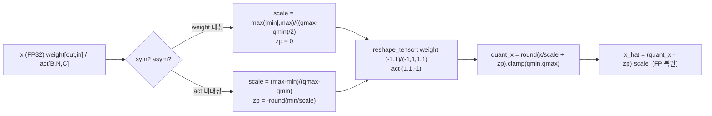
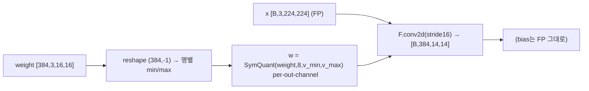
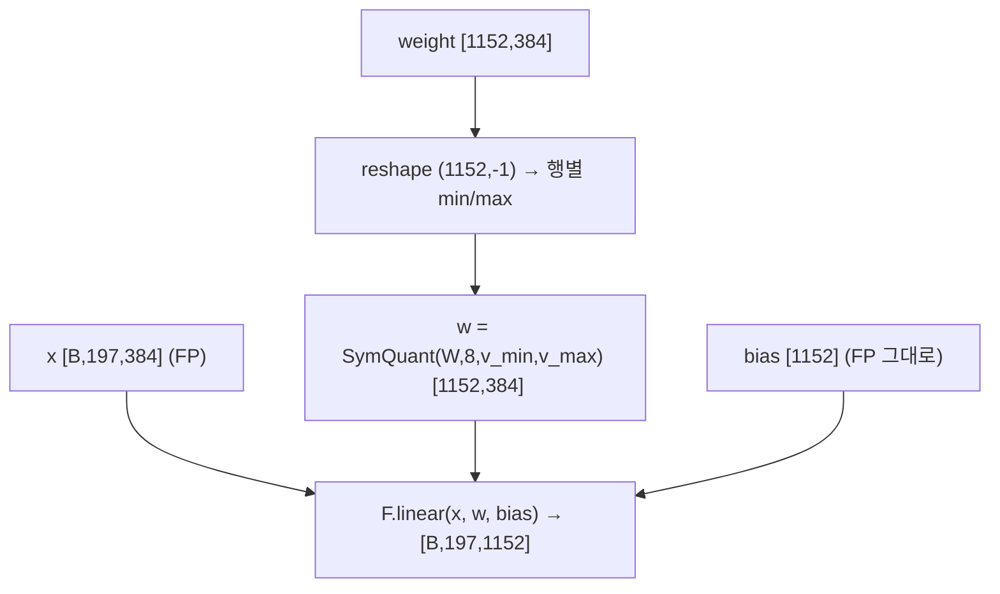
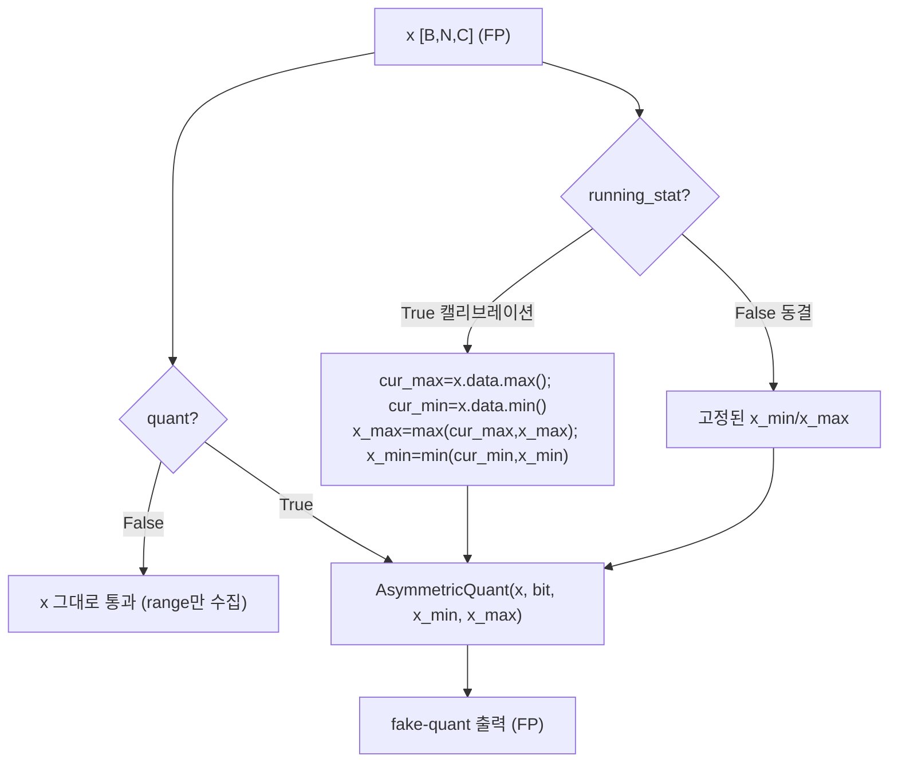
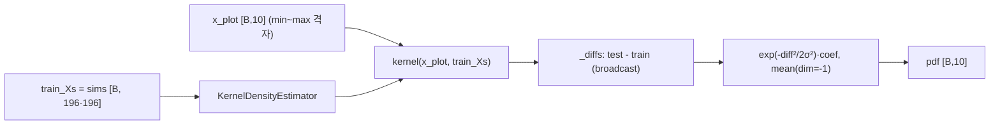
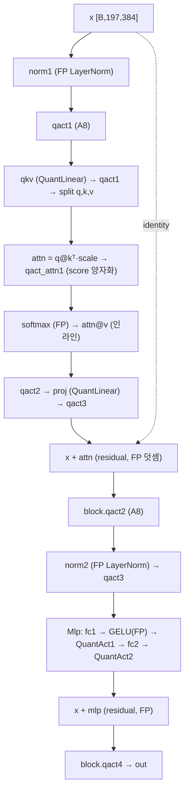
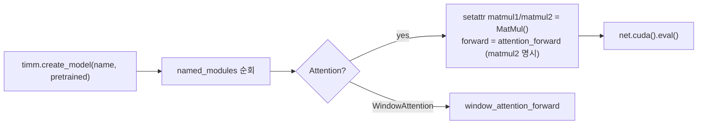
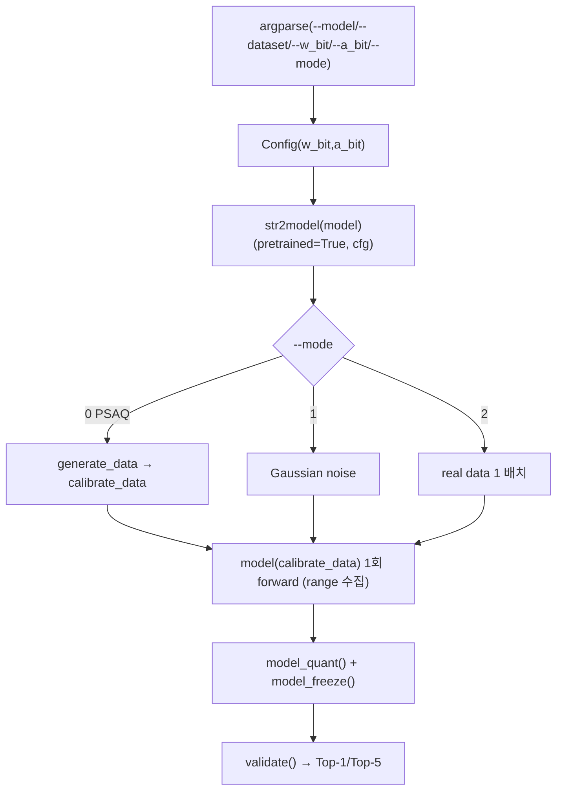

# PSAQ-ViT 모듈 통합 가이드 (S-PyTorch)

> 1차 요약: [`../psaq-vit.md`](../psaq-vit.md) — 본 문서는 그 요약을 모듈 단위로 심화한 통합 가이드다.
> 분석 대상: `\\wsl.localhost\ubuntu-24.04\home\user\project\PRJXR-HBTXR\REF\ViT-Quantization\psaq-vit`
> 작성 원칙: 실제 소스 Read 후 `파일:라인` 근거 표기. 라인 근거 없는 추론은 "추정", 코드로 확인 불가는 "확인 불가"로 명시.
> 형제 가이드(`REF/Analysis/ViT-Quantization/I-ViT/MODULE_GUIDE.md`)의 6요소 구조를 따르되, HW 지표는 **S-PyTorch 수치 규약**(params/FLOPs·MACs/activation memory/비트폭·observer/patch similarity 엔트로피 손실/합성샘플 최적화)으로 치환한다.
> **I-ViT와의 본질 차이**: I-ViT는 integer-only **QAT**(재학습)인 반면, PSAQ-ViT는 **data-free PTQ**(재학습 없음) + **합성 캘리브레이션 샘플 생성**이 핵심 기여다. 따라서 정수 비선형(IntGELU/IntSoftmax/IntLayerNorm)은 **없고**(softmax/GELU/LayerNorm은 FP 유지), 대신 "patch similarity 엔트로피로 합성샘플을 만드는 generator"가 분석의 1순위 청사진이다.

---

## 0. 문서 머리말

### 0.1 대표 케이스 선정
- **대표 모델: `deit_small_patch16_224` (DeiT-S)** — `embed_dim=384, depth=12, num_heads=6, mlp_ratio=4, patch16, img224, qkv_bias=True, input_quant=True` (`models/vit_quant.py:325-344`). 근거:
  1. README 결과표가 DeiT-S를 W4/A8 73.23%, W8/A8 76.92%로 보고(FP 79.85)(`README.md:63`)해 공식 측정 대상이고, I-ViT 가이드와 동일 모델이라 **횡단 비교**가 쉽다.
  2. N=197(=14×14 패치 + cls), C=384, H=6, head_dim=64 — attention/MLP 행렬곱과 patch-similarity 행렬(N′=196)이 모두 비자명한 크기로, 합성샘플 손실의 핵심 텐서가 잘 드러난다(추정 근거: `num_patches = (224/16)² = 196`, `models/layers_quant.py:165-167`).
- **대표 분석 단위(양자화 모델)**: VisionTransformer 1개 Block = `LayerNorm(FP) → qact1 → Attention(QuantLinear qkv → qact1 → q@kᵀ·scale → qact_attn1 → softmax(FP) → attn@v → qact2 → proj(QuantLinear) → qact3) → residual → qact2 → LayerNorm(FP) → qact3 → Mlp(QuantLinear fc1 → GELU(FP) → QuantAct1 → fc2 → QuantAct2) → residual → qact4` (`vit_quant.py:54-74, 119-123`, `layers_quant.py:138-146`). DeiT-S는 이 Block을 12개 적층(`vit_quant.py:192-208`).
- **대표 기여 단위(generator)**: `generate_data()`의 합성샘플 최적화 루프 = `Gaussian noise → (Adam으로 img 자체 최적화) → [patch-similarity 엔트로피 + one-hot CE + TV] 손실 → 2 epoch × 500 iter → 색 클립` (`generate_data.py:31-123`). **이 루프가 PSAQ-ViT의 정체성**이며 §6에서 정밀 해부한다.

### 0.2 S-PyTorch 수치 규약 (HW의 MAC lanes/scalar MACs 대체)
- **params**: 모듈 차원에서 분석적 계산. Linear `in·out (+out bias)`, LayerNorm `2·C`, Conv `Cout·Cin·Kh·Kw (+Cout)`. PSAQ-ViT 양자화 모듈은 FP 가중치를 그대로 두고 forward마다 fake-quant하므로(`quant_modules.py:62, 109`) **params 개수는 FP 원본과 동일**(추가 학습 파라미터 없음, 비트폭만 변함).
- **FLOPs/MACs**: 표준식×config. Linear MAC = `B·N·in·out`. Attention QKᵀ = `B·H·N²·dh`, AV = `B·H·N²·dh`(H=heads, dh=head_dim, `vit_quant.py:58-69`). 대표 레이어 1개를 DeiT-S(B=1, N=197, C=384, H=6, dh=64)로 산출 후 12 block 환원.
- **activation memory**: 텐서 shape × 비트폭. PSAQ-ViT는 fake-quant(quantize→dequantize, `quant_utils.py:91-95`)라 실제 메모리는 FP32지만, **정수 도메인 비트폭**(W/A bits)을 "HW 환산 activation bit"로 표기 — `shape × A_bit`.
- **비트폭/observer**: 코드 직접. 기본 W8/A8(`--w_bit 8 --a_bit 8`, `test_quant.py:36-39`; `Config`가 모든 모듈에 전파, `:44-47`). **weight = 대칭(symmetric, zp=0) per-channel**(`quant_modules.py:36, 87`), **activation = 비대칭(asymmetric, affine) per-tensor**(`quant_modules.py:129`). observer = QuantAct의 **단순 글로벌 running min/max**(percentile·MSE 없음, `quant_modules.py:155-163`).
- **patch similarity 엔트로피 손실**: §6에서 라인 단위 분해. attention context의 patch쌍 코사인 유사도 분포를 KDE로 추정 → 미분 엔트로피 **최대화**(`generate_data.py:100-111`).
- **합성샘플 최적화**: Adam으로 입력 이미지 텐서 자체를 갱신(`generate_data.py:48-53, 117-118`). 모델 가중치는 동결.
- **정확도/속도**: README 인용. 본 세션 미실행 → 측정 불가 항목은 "확인 불가".

### 0.3 운영 경로 (합성 생성 → 캘리브레이션 → PTQ → 평가)
```
[FP 사전학습 가중치 로드] str2model(args.model)(pretrained=True, cfg)         (test_quant.py:82)
   │  DeiT: torch.hub deit_*_patch16_224.pth (vit_quant.py:316-321 등)
   ▼
[mode 0 — 합성샘플 생성] generate_data(args)                                  (test_quant.py:96, generate_data.py:31)
   │  ① 별도 FP 모델 빌드 build_model(timm + matmul1/matmul2 패치) (build_model.py:64-93)
   │  ② attn.matmul2(=attn@v context)에 forward hook (generate_data.py:39-45)
   │  ③ img=Gaussian noise, requires_grad=True (generate_data.py:48-49)
   │  ④ Adam(lr 0.20 ViT/0.25 Swin)로 img 최적화 2ep×500it (generate_data.py:52-118)
   │     손실 = -Σ엔트로피(patch sim) + 1.0·CE(oh) + 0.05·TV (generate_data.py:114)
   ▼
[캘리브레이션] model(calibrate_data) 1회 forward로 QuantAct running min/max 수집  (test_quant.py:98-99)
   │  (mode 1 = Gaussian noise, mode 2 = real data 1 배치)         (test_quant.py:101-113)
   ▼
[PTQ 활성화] model.model_quant() : 모든 QuantLinear/Conv2d/QuantAct quant=True (test_quant.py:119, vit_quant.py:254-257)
[range 동결] model.model_freeze() : QuantAct running_stat=False              (test_quant.py:120, vit_quant.py:259-262)
   ▼
[ImageNet 평가] validate() : Top-1/Top-5                                     (test_quant.py:124, 129-177)
```
- 타깃 디바이스: **CUDA GPU 전제** — 합성 img `torch.randn(...).cuda()`(`generate_data.py:48`), pseudo label `.to('cuda')`(`:56`), `x_plot...cuda()`(`:108`), 모델 `build_model`이 `.cuda()`(`build_model.py:91`). CPU 단독 실행은 코드상 불가(라인 근거 확인, 실행 실패는 미검증).
- **QAT 없음**: `SymmetricQuantFunction.backward`/`AsymmetricQuantFunction.backward`가 모두 `raise NotImplementedError`(`quant_utils.py:100-101, 130-131`) → 양자화기를 통한 역전파 불가. 합성+PTQ 전용. (단, 합성샘플 최적화의 backward는 **양자화가 꺼진 FP 모델**(`build_model`)을 통과하므로 정상 동작 — §6.6.)

### 0.4 모델 / 데이터셋 / 정확도 (README 인용)
| Model | embed/depth/heads | FP32 | W4/A8 | W8/A8 | 근거 |
|---|---|---|---|---|---|
| DeiT-T | 192/12/3 | 72.21 | 65.57 | 71.56 | `README.md:62`, `vit_quant.py:302-321` |
| **DeiT-S(대표)** | **384/12/6** | **79.85** | **73.23** | **76.92** | `README.md:63`, `vit_quant.py:325-344` |
| DeiT-B | 768/12/12 | 81.85 | 77.05 | 79.10 | `README.md:64`, `vit_quant.py:347-366` |
| Swin-T | (swin_quant, 미열람) | 81.35 | 71.79 | 75.35 | `README.md:65` |
| Swin-S | (swin_quant, 미열람) | 83.20 | 75.14 | 76.64 | `README.md:66` |
- 데이터셋: 평가는 **ImageNet val**(`datasets.ImageFolder(valdir)`, `data_utils.py:33`), 224×224, 1000 클래스. **캘리브레이션은 mode 0에서 데이터 불필요**(합성 32장, `calib_batchsize=32` → `batch_size`, `test_quant.py:23`, `generate_data.py:32`).
- 측정 환경: 논문 결과는 **RTX 3090 GPU**(`README.md:58`). latency는 본 repo 미보고 → **확인 불가**.

---

## 1. Repo / Layer 개요

PSAQ-ViT = ViT/DeiT/Swin을 **실데이터 없이(data-free)** PTQ하는 프레임워크. 핵심 관찰: ViT self-attention의 patch 간 유사도 분포가 실데이터 입력 vs Gaussian noise에서 뚜렷이 다르며, 이를 **patch similarity 엔트로피 최대화**로 합성 캘리브레이션 샘플을 만들면 실데이터 통계에 근접한다(ECCV 2022, arXiv:2203.02250, `README.md:5-8`). 양자화 코어 자체는 표준 uniform PTQ(대칭 weight + 비대칭 activation)이고, **차별점은 합성샘플 generator**다. 본 repo는 timm 위에 얹은 커스텀 양자화 모듈/모델 + 합성 generator가 자체 소스이고, timm 사전학습 가중치/dataloader는 외부다.

### 1.1 자체 소스 vs 외부 프레임워크 vs 제외

| 구분 | 파일(자체 소스) | 역할 |
|---|---|---|
| **합성샘플 생성** ★핵심 | `generate_data.py` | patch-similarity 엔트로피 손실, Adam img 최적화, TV/oh prior, differential_entropy |
| **엔트로피 추정** | `utils/kde.py` | GaussianKernel + KernelDensityEstimator (유사도 분포 pdf 추정) |
| **양자화 기반함수** | `models/quantization_utils/quant_utils.py` | 대칭/비대칭 scale·zp 공식, Symmetric/AsymmetricQuantFunction(fake-quant) |
| **양자화 레이어** | `models/quantization_utils/quant_modules.py` ★핵심 | QuantConv2d / QuantLinear / QuantAct(observer) |
| **양자화 모델** | `models/vit_quant.py` | Attention/Block/VisionTransformer + deit_* 팩토리, model_quant/freeze |
| | `models/layers_quant.py` | Mlp, PatchEmbed, HybridEmbed, DropPath, trunc_normal_ |
| | `models/swin_quant.py` | 정수 Swin (미열람 — 확인 불가) |
| **FP 보조모델** | `utils/build_model.py` | timm 모델 + matmul1/matmul2 주입 (generator 전용 FP 모델) |
| **모델 보조** | `models/utils.py` | load_weights_from_npz(ViT augreg npz 로딩) |
| **데이터** | `utils/data_utils.py` | ImageNet ImageFolder dataloader, transform |
| **진입점** | `test_quant.py` | build → generate/calibrate → quant/freeze → validate, argparse |

### 1.2 forward 진입점 (양자화 모델)
`VisionTransformer.forward`(`vit_quant.py:295-299`) → `forward_features`(`:269-293`): `qact_input`(입력 양자화, `input_quant=True`) → `patch_embed`(QuantConv2d) → `cls_token` cat → `qact_embed` → `+ qact_pos(pos_embed)`(FP 덧셈, `:282`) → `qact1` → `blocks`(12×Block) → `norm`(FP LayerNorm)[:,0] → `qact2` → `head`(QuantLinear) → `act_out`. **스케일 전파 없음**: I-ViT와 달리 `(tensor, scale)` 페어를 전파하지 않고, 각 QuantAct가 독립적으로 자기 min/max로 fake-quant한다(`quant_modules.py:151-170`).

### 1.3 제외 (지시에 따라 이름만 표기, 미분석)
- **외부 프레임워크(커스텀 아님)**: `timm.create_model`, `timm.models.vision_transformer.Attention`, `timm.models.swin_transformer.WindowAttention`(`build_model.py:5-7`), `torchvision.datasets/transforms`(`data_utils.py:5-6`), `torch.hub`(사전학습 다운로드). 이들은 호출만, 코드는 본 repo 정의/패치를 사용.
- **원본 사전학습 체크포인트**: DeiT torch.hub `.pth`(`vit_quant.py:316-321 등`), ViT augreg `.npz`(`models/utils.py:11`) — 가중치만 로드.
- **제외(관례)**: `.git/`, `__pycache__/`, `overview.png`(논문 figure, `README.md:2`), `LICENSE`.
- **미열람(확인 불가)**: `models/swin_quant.py` 세부(ViT와 동일 quant 모듈 재사용 추정), `utils/data_utils.py`는 정독했으나 본선 분석에서 비중 낮음.

### 1.4 대표 모델 레이어 구성 (DeiT-S, 양자화 모델)
`forward_features`(`vit_quant.py:269-293`): PatchEmbed(QuantConv2d 16×16 s16) → +cls/pos(FP 합) → Block×12 → FP LayerNorm → head(QuantLinear). 1 Block(`:119-123`)당 QuantLinear 4개(qkv, proj, fc1, fc2), 일반 `@` 행렬곱 2개(q@kᵀ, attn@v — 양자화 모델에서는 **MatMul 모듈 아님, 인라인**, `:65, 69`), FP LayerNorm 2, FP GELU 1, FP softmax 1, QuantAct 다수(qact1~3 in Attn, qact1~4 in Block, QuantAct1/2 in Mlp).

---

## 2. 모듈: 대칭/비대칭 양자화 기반함수 — `quant_utils.py`

### 2.1 역할 + 상위/하위
- **역할**: FP 텐서를 fake-quant(quantize→clamp→dequantize)하는 autograd Function 2종. **weight는 대칭(zp=0)**, **activation은 비대칭(affine)**. scale/zp 공식 함수 2종 + broadcast용 `reshape_tensor` 보유.
- **상위**: `QuantConv2d`/`QuantLinear`가 `weight_function`(=SymmetricQuantFunction)으로(`quant_modules.py:36, 87`), `QuantAct`가 `act_function`(=AsymmetricQuantFunction)으로 호출(`:129`). **하위**: `symmetric/asymmetric_linear_quantization_params`(`quant_utils.py:31-71`), `reshape_tensor`(`:7-28`).

### 2.2 데이터플로우 (텐서 shape 흐름)


### 2.3 forward call stack
가중치 경로: `QuantLinear.forward`(`quant_modules.py:109`) → `SymmetricQuantFunction.apply(weight, weight_bit, v_min, v_max)` → `forward`(`quant_utils.py:79-97`) → `symmetric_linear_quantization_params`(`:87`) → `reshape_tensor`(`:88`).
활성 경로: `QuantAct.forward`(`quant_modules.py:168`) → `AsymmetricQuantFunction.apply(x, activation_bit, x_min, x_max)` → `forward`(`quant_utils.py:109-127`) → `asymmetric_linear_quantization_params`(`:117`).

### 2.4 대표 코드 위치
`quant_utils.py`: `reshape_tensor` `:7-28`, `symmetric_linear_quantization_params` `:31-51`, `asymmetric_linear_quantization_params` `:54-71`, `SymmetricQuantFunction` `:74-101`, `AsymmetricQuantFunction` `:104-131`.

### 2.5 대표 코드 블록

```python
# quant_utils.py:42-49  대칭 weight 스케일 (zero-point=0)
qmax = 2 ** (num_bits - 1) - 1        # INT8 → 127
qmin = -(2 ** (num_bits - 1))         # INT8 → -128
max_val = torch.max(-min_val, max_val)            # 부호 대칭: |min|과 max 중 큰 값
scale = max_val / (float(qmax - qmin) / 2)        # = max_val / 127
scale.clamp_(eps)
zero_point = torch.zeros_like(max_val, dtype=torch.int64)   # zp=0
```
→ zero-point=0인 전형적 대칭 양자화. HW에서 zero-point 가산 불필요(곱셈기-friendly).

```python
# quant_utils.py:66-69  비대칭 activation 스케일 (affine, zp≠0)
qmax = 2 ** num_bits - 1 ; qmin = 0               # INT8 → [0,255]
scale = (max_val - min_val) / float(qmax - qmin)
zero_point = qmin - torch.round(min_val / scale)
zero_point.clamp_(qmin, qmax)
```

```python
# quant_utils.py:91-95  fake-quant: quantize → clamp → dequantize (대칭/비대칭 공통 패턴)
quant_x = x / scale + zero_point
quant_x = quant_x.round().clamp(qmin, qmax)
quant_x = (quant_x - zero_point) * scale          # 다시 FP로 복원 (정수 도메인 유지 X)
```
→ **fake quantization**: 출력이 `정수×scale`=FP32라 실제 추론은 FP 연산. I-ViT의 integer-only(`F.linear(x_int,...)`)와 결정적으로 다름.

```python
# quant_utils.py:100-101 / 130-131  backward 미구현 → QAT 불가
@staticmethod
def backward(ctx, grad_output):
    raise NotImplementedError
```

### 2.6 연산·수치표현 분해 + 정량
- **양자화 방식**: weight per-channel(행=out축 broadcast, `reshape_tensor` `(-1,1)`, `:11`) 대칭 zp=0; activation per-tensor(`(1,1,-1)`이나 min/max가 스칼라, `:19`) 비대칭 zp≠0. STE 없음(backward 미구현).
- **scale/zp**: weight `scale=max(|min|,max)/127`, zp=0; act `scale=(max-min)/255`, `zp=-round(min/scale)`.
- **비트폭**: 호출처 인자 — weight 8(또는 4), act 8(`test_quant.py:36-39`).
- **params**: 0 (순수 함수).
- **FLOPs**: 텐서 원소수 N에 대해 div+round+clamp = O(N). 대표 DeiT-S qkv weight(384×1152=442K 원소) 양자화 = 442K div+round, **매 forward 재계산**(weight가 forward마다 fake-quant됨, `quant_modules.py:105-109`).
- **activation bit**: 출력은 `정수×scale`=FP32 → 실제 메모리 FP32, HW 환산 비트 k.

---

## 3. 모듈: 정수 Conv (PatchEmbed) — `quant_modules.py` (QuantConv2d)

### 3.1 역할 + 상위/하위
- **역할**: 패치 임베딩 conv(16×16 stride16)의 **가중치만** 양자화(입력/출력은 FP). `quant` 플래그로 FP↔fake-quant 토글.
- **상위**: `PatchEmbed.proj`(`layers_quant.py:169`). **하위**: `SymmetricQuantFunction`(`quant_modules.py:36`), `F.conv2d`.

### 3.2 데이터플로우 (텐서 shape 흐름, DeiT-S)


### 3.3 forward call stack
`PatchEmbed.forward`(`layers_quant.py:189`) → `QuantConv2d.forward(x)`(`quant_modules.py:43`) → (quant=True) weight reshape + 행별 max/min(`:58-61`) → `weight_function`(`:62`) → `F.conv2d`(`:64-72`).

### 3.4 대표 코드 위치
`quant_modules.py`: 클래스 `:12-72`, FP 경로 `:47-56`, per-out-channel min/max `:58-61`, fake-quant + conv `:62-72`.

### 3.5 대표 코드 블록
```python
# quant_modules.py:58-72  per-output-channel weight 양자화 후 FP conv
v = self.weight
v = v.reshape(v.shape[0], -1)            # [out, in·kh·kw]
v_max = v.max(axis=1).values             # 행별(=출력채널별) max → per-channel
v_min = v.min(axis=1).values
w = self.weight_function(self.weight, self.weight_bit, v_min, v_max)
return F.conv2d(x, w, self.bias, self.stride, self.padding, self.dilation, self.groups)
```
→ weight만 fake-quant, `self.bias`는 **양자화하지 않음**(FP). 입력 x도 그대로(앞단 QuantAct가 별도 처리). I-ViT의 정수 conv(`x_int·weight_integer`)와 달리 **순수 FP conv with quantized-then-dequantized weight**.

### 3.6 연산·수치표현 분해 + 정량 (DeiT-S PatchEmbed)
- **양자화 방식**: weight per-channel(out=384) 대칭 W8. bias FP. 입력 FP.
- **비트폭**: W8(또는 W4), bias FP32, 입력 FP32.
- **params**: 384×3×16×16 + 384 = **295,296**.
- **MACs**: out 14×14=196 위치 × 384 × (3×16×16=768) = 196×384×768 ≈ **57.8M**(전 모델 1회).
- **activation memory**: 출력 [B,384,14,14] → flatten [B,196,384] FP32. HW 환산 A8 = 196×384 = **75.3 KB/img**(다음 QuantAct 양자화 시).

---

## 4. 모듈: 정수 Linear — `quant_modules.py` (QuantLinear)

### 4.1 역할 + 상위/하위
- **역할**: nn.Linear 가중치를 per-channel 대칭 fake-quant 후 `F.linear`. QKV·proj·MLP fc1/fc2·head 전부.
- **상위**: `Attention.qkv/proj`(`vit_quant.py:37, 44`), `Mlp.fc1/fc2`(`layers_quant.py:127, 132`), `VisionTransformer.head`(`vit_quant.py:228`). **하위**: `SymmetricQuantFunction`.

### 4.2 데이터플로우 (텐서 shape 흐름, DeiT-S qkv)


### 4.3 forward call stack
`Attention.forward`(`vit_quant.py:56`) → `QuantLinear.forward(x)`(`quant_modules.py:94`) → weight reshape 행별 min/max(`:105-108`) → `weight_function`(`:109`) → `F.linear`(`:111-115`).

### 4.4 대표 코드 위치
`quant_modules.py`: 클래스 `:75-115`, FP 경로 `:98-103`, per-channel min/max `:105-108`, fake-quant + linear `:109-115`.

### 4.5 대표 코드 블록
```python
# quant_modules.py:105-115  per-channel weight fake-quant 후 FP linear
v = self.weight.reshape(self.weight.shape[0], -1)
v_max = v.max(axis=1).values ; v_min = v.min(axis=1).values   # out_features개 스케일
w = self.weight_function(self.weight, self.weight_bit, v_min, v_max)
return F.linear(x, weight=w, bias=self.bias)                  # bias FP, 입력 FP
```
→ QuantConv2d와 동형. **bias 미양자화·입력 FP** → I-ViT의 `bias_scale=W_scale·A_scale` 정수 정렬 패턴이 **없음**(fake-quant라 불필요).

### 4.6 연산·수치표현 분해 + 정량 (DeiT-S, B=1, N=197)
- **양자화 방식**: weight per-channel(out축) 대칭 W8, bias/입력 FP.
- **scale/zp**: W_scale `[out]`, zp=0.
- **비트폭**: W8(또는 W4) / bias·입력 FP32.
- **params** (DeiT-S 1 block, C=384):
  - qkv: 384×1152 + 1152 = **443,520**
  - proj: 384×384 + 384 = **147,840**
  - fc1: 384×1536 + 1536 = **591,360**
  - fc2: 1536×384 + 384 = **590,208**
  - Linear params/block ≈ **1.773M**, ×12 ≈ **21.27M**.
- **MACs/block** (B=1, N=197): qkv 197×384×1152 ≈ **87.1M**, proj 197×384×384 ≈ **29.0M**, fc1 197×384×1536 ≈ **116.2M**, fc2 197×1536×384 ≈ **116.2M** → **348.5M/block**, ×12 ≈ **4.18G**(Attention 행렬곱 제외).
- **activation bit**: 입출력 FP32(fake-quant). HW 환산 A8.

---

## 5. 모듈: 활성 양자화 + observer — `quant_modules.py` (QuantAct) ★observer 실체

### 5.1 역할 + 상위/하위
- **역할**: activation을 **비대칭 per-tensor** fake-quant. **running min/max observer**(글로벌, 단순 누적)로 캘리브레이션 range 수집. `fix()/unfix()`로 range 동결/해제, `quant` 플래그로 양자화 토글.
- **상위**: 거의 모든 모듈 사이 — `Attention.qact1/2/3/qact_attn1`(`vit_quant.py:42-50`), `Block.qact1~4`(`:93,106,108,117`), `Mlp.QuantAct1/2`(`layers_quant.py:131,135`), `PatchEmbed.QuantAct`(`:181`), `VisionTransformer.qact_input/embed/pos/1/2/act_out`(`vit_quant.py:162,185-187,210,236`). **하위**: `AsymmetricQuantFunction`(`:129`).

### 5.2 데이터플로우 (텐서 shape 흐름)


### 5.3 forward call stack
`Block.forward`(`vit_quant.py:120`) → `QuantAct.forward(x)`(`quant_modules.py:151`) → running stat 갱신(`:155-163`) → (quant=True) `act_function`(`:168`) → `AsymmetricQuantFunction`.

### 5.4 대표 코드 위치
`quant_modules.py`: 클래스 `:118-170`, buffer 등록 `:131-132`, fix/unfix `:139-149`, running observer `:155-163`, fake-quant `:165-170`.

### 5.5 대표 코드 블록
```python
# quant_modules.py:155-163  observer의 실체: 단순 글로벌 running min/max
if self.running_stat:
    cur_max = x.data.max()                # per-tensor 스칼라 (percentile 없음)
    cur_min = x.data.min()
    if self.x_max == 0:
        self.x_max = cur_max ; self.x_min = cur_min   # 첫 배치 초기화
    else:
        self.x_max = torch.max(cur_max, self.x_max)   # 누적 최대 (EMA 아님, 순수 max)
        self.x_min = torch.min(cur_min, self.x_min)
```
→ **percentile clipping·MSE 최적화·EMA 모두 없는** 가장 단순한 observer. outlier 1개가 range를 지배할 수 있음(§N+2 한계). I-ViT의 momentum 0.95 EMA보다 더 단순.

```python
# quant_modules.py:139-149  range 동결/해제 (캘리브레이션 후 freeze)
def fix(self):   self.running_stat = False    # model_freeze가 호출 → range 고정
def unfix(self): self.running_stat = True
```
```python
# quant_modules.py:165-170  quant 꺼지면 통과만, 켜지면 비대칭 fake-quant
if not self.quant:
    return x                              # 캘리브레이션 단계: range 수집만
quant_act = self.act_function(x, self.activation_bit, self.x_min, self.x_max)
```

### 5.6 연산·수치표현 분해 + 정량
- **양자화 방식**: per-tensor 비대칭(affine), zp≠0. observer = **글로벌 running min/max**(누적 max/min, momentum 없음).
- **비트폭**: 기본 A8(`cfg.activation_bit`, 전 QuantAct 동일). residual/softmax 경로 비트폭 분리 **없음**(I-ViT의 A16 분리와 대조).
- **params**: 0 학습 파라미터(buffer만: `x_min`, `x_max` 각 `[1]`, `:131-132`).
- **activation memory** (DeiT-S, [1,197,384]): A8 = 197×384×1 byte = **75.6 KB**.
- **FLOPs**: observer min/max reduce O(N) + fake-quant O(N).
- **시사**: 캘리브레이션 = "합성 32장 1회 forward"에서 본 min/max를 그대로 사용(`test_quant.py:98-99` → `model_freeze`). 합성샘플 품질이 곧 range 품질 → generator가 정확도 직결.

---

## 6. 모듈: 합성샘플 생성 (★핵심 기여) — `generate_data.py`

### 6.1 역할 + 상위/하위
- **역할**: 실데이터 없이 **patch similarity 엔트로피를 최대화**하도록 Gaussian noise 이미지를 Adam으로 최적화 → 실데이터와 유사한 attention 통계를 갖는 합성 캘리브레이션 샘플 생성. PSAQ-ViT의 정체성.
- **상위**: `test_quant.py:96`(mode 0). **하위**: `build_model`(FP 보조모델, `build_model.py:64`), `KernelDensityEstimator`(`kde.py:104`), `differential_entropy`/`get_image_prior_losses`/`clip`(동 파일 내).

### 6.2 데이터플로우 (텐서 shape 흐름)
```mermaid
flowchart TD
  N["img = randn[32,3,224,224], requires_grad"] --> JIT["random roll/flip jitter (DeepInversion)"]
  PM["FP 모델 build_model (timm + matmul1/matmul2)"] --> FWD
  JIT --> FWD["p_model(img_jit) → output"]
  FWD -.hook attn.matmul2.-> CTX["attention context [B,H,N,dh]"]
  CTX --> AVG["mean(dim=heads)[:,1:,:]  cls 제외 → [B,196,dh]"]
  AVG --> SIM["cosine_similarity(patch i,j) → sims [B,196,196]"]
  SIM --> KDE["KernelDensityEstimator(sims) → pdf @ 10 점"]
  KDE --> ENT["differential_entropy H(p) = -∫p·log p"]
  ENT --> LE["loss_entropy -= H(p)   (엔트로피 최대화)"]
  FWD --> OH["loss_oh = CE(output, pseudo_label)"]
  JIT --> TV["loss_tv = ||TV(img) - var_pred||"]
  LE --> TOT["total = loss_entropy + 1.0·loss_oh + 0.05·loss_tv"]
  OH --> TOT
  TV --> TOT
  TOT --> BWD["backward → Adam.step (img 갱신)"]
  BWD --> CLIP["img = clip(img)  채널별 정규화 범위"]
  CLIP -.500 iter × 2 epoch.-> JIT
```

### 6.3 forward call stack
`generate_data(args)`(`generate_data.py:31`) → `build_model`(`:35`) → attn hook 등록(`:39-45`) → 최적화 루프(`:62-121`): `p_model(img_jit)`(`:92`) → `criterion`(oh, `:94`) → `get_image_prior_losses`(tv, `:95`) → hook feature 추출·코사인 유사도(`:100-102`) → `KernelDensityEstimator`(`:105`) → `differential_entropy`(`:110`) → `total_loss.backward()`(`:117`) → `optimizer.step()`(`:118`) → `clip`(`:121`).

### 6.4 대표 코드 위치
`generate_data.py`: `AttentionMap` hook `:20-28`, `generate_data` `:31-123`, attn hook 등록 `:39-45`, noise init `:48-49`, Adam(img) `:52-53`, pseudo label/var_pred `:56-57`, 최적화 2ep×500it `:62-121`, 손실 조합 `:114`, `differential_entropy` `:126-132`, TV `get_image_prior_losses` `:135-143`, `clip` `:146-158`.

### 6.5 대표 코드 블록

```python
# generate_data.py:39-49  matmul2(=attn@v context)에 hook + Gaussian noise를 학습변수로
if 'swin' in args.model:
    for m in p_model.layers:
        for n in range(len(m.blocks)):
            hooks.append(AttentionMap(m.blocks[n].attn.matmul2))
else:
    for m in p_model.blocks:
        hooks.append(AttentionMap(m.attn.matmul2))     # ViT/DeiT: 블록마다 hook
img = torch.randn((args.batch_size, 3, 224, 224)).cuda()
img.requires_grad = True                               # ★ 입력 이미지 자체가 최적화 대상
optimizer = optim.Adam([img], lr=args.lr, betas=[0.5, 0.9], eps=1e-8)   # 모델 아닌 img를 갱신
```

```python
# generate_data.py:100-111  patch similarity 엔트로피 손실 (핵심)
attention = hooks[itr_hook].feature        # attn@v context [B,H,N,dh]
attention_p = attention.mean(dim=1)[:, 1:, :]    # head 평균 + cls 토큰 제외 → patch만 [B,196,dh]
sims = torch.cosine_similarity(attention_p.unsqueeze(1),
                               attention_p.unsqueeze(2), dim=3)   # patch쌍 코사인 유사도 [B,196,196]
kde = KernelDensityEstimator(sims.view(args.batch_size, -1))      # 유사도 분포
x_plot = torch.linspace(sims.min(), sims.max(), steps=10)...      # 10점 평가 격자
kde_estimate = kde(x_plot)
dif_entropy_estimated = differential_entropy(kde_estimate, x_plot)
loss_entropy -= dif_entropy_estimated      # ★ 엔트로피 최대화 (부호 -)
```
→ 직관: 실데이터의 attention은 patch 유사도가 다양(높은 엔트로피), noise 입력은 단조(낮은 엔트로피). 엔트로피를 키워 실데이터 통계에 근접.

```python
# generate_data.py:114  총손실 = 엔트로피 + one-hot CE + TV
total_loss = loss_entropy + 1.0 * loss_oh + 0.05 * loss_tv
```
```python
# generate_data.py:126-132  미분 엔트로피 = 사다리꼴 수치적분
def differential_entropy(pdf, x_pdf):
    pdf = pdf + 1e-4
    f = -1 * pdf * torch.log(pdf)
    ans = torch.trapz(f, x_pdf, dim=-1).mean()   # H(p) = -∫ p·log p ds
    return ans
```
```python
# generate_data.py:154-156  색 outlier 클립: ImageNet mean/std 정규화 범위 유지
for c in range(3):
    m, s = mean[c], std[c]
    image_tensor[:, c] = torch.clamp(image_tensor[:, c], -m / s, (1 - m) / s)
```

### 6.6 연산·수치표현 분해 + 정량 (DeiT-S, B=32)
- **최적화 대상**: 입력 이미지 텐서 `img`(모델 가중치 동결). Adam, lr 0.20(ViT/DeiT)/0.25(Swin)(`:52`), betas[0.5,0.9](`:53`), cosine LR 정책(`:70,170-180`).
- **반복**: 2 epoch × 500 iter = **1000 step**(`:62-68`). jitter lim 15→30(`:65,68`).
- **손실 가중치**: 엔트로피 1.0(암묵), one-hot CE λ=1.0, TV λ=0.05(`:114`).
- **pseudo label**: 무작위 클래스 0~999(`:56`), `var_pred` ∈ U(2500,3000)(batch 32 기준 TV 목표, `:57`).
- **backward 경로**: `build_model`이 만든 **양자화 OFF 순수 FP timm 모델**을 통과 → autograd 정상(§0.3에서 언급한 NotImplementedError는 vit_quant 양자화 모델 경로에만 해당, generator와 무관).
- **patch similarity 행렬 크기**: DeiT-S sims [32,196,196] ≈ 1.23M 원소/block × 12 block hook → 매 iter 12개 KDE. **연산 무거움**(§N+2 비용).
- **params**: generator 자체 학습 파라미터 0(img는 입력 텐서). 합성 결과 = `img.detach()` [32,3,224,224](`:123`).
- **차용 기법**: DeepInversion(Yin et al. CVPR'20) jitter(roll/flip, `:79-86`) + TV prior(`:135-143`).
- **시사**: matmul2 hook은 timm `Attention.forward`를 patch한 `build_model`에만 존재(`build_model.py:16,22,82-85`) → **양자화 모델(vit_quant.py)에는 matmul2 없음**(인라인 `attn@v`, `vit_quant.py:69`). 1차 요약의 "확인 불가" 항목이 **본 분석으로 해소**: generator는 별도 FP 모델 경로를 쓴다.

---

## 7. 모듈: KDE 엔트로피 추정 — `utils/kde.py`

### 7.1 역할 + 상위/하위
- **역할**: patch 유사도 값들 `{s_ij}`(train_Xs)에 Gaussian 커널을 얹어 임의 점(x_plot)에서 pdf를 추정 → `differential_entropy`의 입력. nonparametric 밀도 추정.
- **상위**: `generate_data.py:105,109`. **하위**: `GaussianKernel`(`kde.py:87-101`).

### 7.2 데이터플로우 (텐서 shape 흐름)


### 7.3 forward call stack
`generate_data.py:109` → `KernelDensityEstimator.__call__`(`kde.py:30`) → `forward`(`:123`) → `GaussianKernel.forward`(`:90`) → `_diffs`(`:55-59`).

### 7.4 대표 코드 위치
`kde.py`: `Kernel.__init__`(bandwidth 0.01) `:47-53`, `_diffs` `:55-59`, `GaussianKernel.forward` `:90-96`, `KernelDensityEstimator` `:104-128`.

### 7.5 대표 코드 블록
```python
# kde.py:90-96  Gaussian 커널 밀도 추정
def forward(self, test_Xs, train_Xs):
    diffs = self._diffs(test_Xs, train_Xs)            # test 점 - train 점들
    var = self.bandwidth ** 2                         # bandwidth 기본 0.01 → var=1e-4
    exp = torch.exp(- torch.pow(diffs,2) / (2 * var))
    coef = 1 / torch.sqrt(torch.tensor(2 * np.pi * var))
    return (coef * exp).mean(dim=-1)                  # train 점 평균 → pdf
```

### 7.6 연산·수치표현 분해 + 정량
- **방식**: nonparametric Gaussian KDE. bandwidth=0.01(`kde.py:47`), x_plot 10점(`generate_data.py:108`).
- **params**: 0(train_Xs는 데이터, 학습 X).
- **FLOPs**: `_diffs`가 O(test·train) 메모리·연산(`kde.py:121` TODO 주석: iterative 미구현). DeiT-S sims 38,416개 × 10 test 점 × 32 batch → 매 iter·block마다 ~12M 원소. **generator 비용의 큰 부분**(추정, 라인 근거 `:121`).
- **시사**: 엔트로피 손실 품질이 bandwidth·x_plot 점수(10)에 민감(추정). HW화 무관(generator는 오프라인 캘리브레이션 도구).

---

## 8. 모듈: Attention / Block / VisionTransformer 조립 — `vit_quant.py`

### 8.1 역할 + 상위/하위
- **역할**: 양자화 모듈을 ViT 토폴로지로 조립. **attention score는 양자화하지만 softmax/GELU/LayerNorm은 FP 유지**. `model_quant()/model_freeze()` 헬퍼 제공.
- **상위**: `test_quant.py`의 build → calibrate → validate. **하위**: §2~7 모듈 + `Mlp`/`PatchEmbed`(`layers_quant.py`).

### 8.2 데이터플로우 (텐서 shape 흐름, 1 Block)


### 8.3 forward call stack
`VisionTransformer.forward_features`(`vit_quant.py:269`) → `blk(x)` ×12(`:287-288`) → `Block.forward`(`:119`): `norm1`→`qact1`→`Attention.forward`(`:54`)→`qact2`(residual, `:120`)→`norm2`→`qact3`→`Mlp.forward`(`layers_quant.py:138`)→`qact4`(`:122`).

### 8.4 대표 코드 위치
`vit_quant.py`: `Attention` `:21-74`, `Block` `:77-123`, `VisionTransformer` `:126-299`, pos_embed FP 합 `:282`, model_quant/freeze/unfreeze `:254-267`, 팩토리 `:302-366`.

### 8.5 대표 코드 블록
```python
# vit_quant.py:65-72  attention score만 양자화, softmax 출력(확률)은 FP
attn = (q @ k.transpose(-2, -1)) * self.scale     # q@kᵀ 인라인 (MatMul 모듈 아님)
attn = self.qact_attn1(attn)                       # ★ score 양자화
attn = attn.softmax(dim=-1)                         # softmax는 FP (양자화 안 함)
attn = self.attn_drop(attn)
x = (attn @ v).transpose(1, 2).reshape(B, N, C)     # attn@v 인라인
x = self.qact2(x)
x = self.proj(x)
x = self.qact3(x)
```
```python
# vit_quant.py:119-123  Block: FP LayerNorm + FP residual 덧셈, 입출력만 QuantAct
def forward(self, x):
    x = self.qact2(x + self.drop_path(self.attn(self.qact1(self.norm1(x)))))
    x = self.qact4(x + self.drop_path(self.mlp(self.qact3(self.norm2(x)))))
    return x
```
→ LayerNorm·GELU·softmax·residual 덧셈 모두 FP. I-ViT의 IntLayerNorm/IntGELU/IntSoftmax·정수 residual 정렬과 **정반대 설계**(integer-only 아님).
```python
# vit_quant.py:254-262  PTQ 활성화 / range 동결 헬퍼
def model_quant(self):
    for m in self.modules():
        if type(m) in [QuantLinear, QuantConv2d, QuantAct]: m.quant = True
def model_freeze(self):
    for m in self.modules():
        if type(m) in [QuantAct]: m.running_stat = False     # 캘리브레이션 range 고정
```

### 8.6 연산·수치표현 분해 + 정량 (DeiT-S, B=1, N=197)
- **양자화 방식**: weight per-channel W8 대칭, activation per-tensor A8 비대칭. softmax/GELU/LayerNorm/residual = FP. 스케일 전파 없음(각 QuantAct 독립).
- **params (DeiT-S 전체, 분석적)**:
  - PatchEmbed conv: 295,296
  - cls_token: 384, pos_embed: 197×384 = 75,648
  - Block×12: Linear 1.773M×12 ≈ 21.27M + LayerNorm 2×(2×384)×12 = 18,432
  - 최종 norm: 768, head: 384×1000+1000 = 385,000
  - **총 ≈ 22.05M params**(DeiT-S 공칭 ~22M와 일치, 양자화로 개수 불변).
- **MACs/이미지 (B=1, N=197)**:
  - PatchEmbed: 57.8M(1회)
  - Block×12: (Linear 348.5M + Attn 행렬곱 QKᵀ 6×197²×64≈14.9M + AV 14.9M = 29.8M)×12 ≈ **4.54G**
  - head: cls 1토큰 × 384×1000 = 0.384M
  - **총 ≈ 4.6 GMAC/이미지**.
- **activation memory (block당 피크)**: attn score [1,6,197,197] = 6×197²×1 ≈ **233 KB**(A8, softmax 입력 전)가 최대.

---

## 9. 모듈: FP 보조모델 (generator 전용) — `utils/build_model.py`

### 9.1 역할 + 상위/하위
- **역할**: timm 사전학습 모델을 로드하고 `Attention`/`WindowAttention`의 `forward`를 patch해 **matmul1/matmul2 MatMul 모듈을 주입** → generator가 attention context(attn@v)에 hook을 걸 수 있게 함. **양자화와 무관한 순수 FP 모델**.
- **상위**: `generate_data.py:35`. **하위**: `timm.create_model`(`:79`), `MatMul`(`:59-61`).

### 9.2 데이터플로우


### 9.3 forward call stack
`build_model(name)`(`build_model.py:64`) → `timm.create_model`(`:79`) → `named_modules` 순회(`:81`) → `setattr(matmul1/matmul2)` + `MethodType(attention_forward)`(`:82-85`) → `.cuda().eval()`(`:91-92`).

### 9.4 대표 코드 위치
`build_model.py`: `attention_forward` `:10-26`, `window_attention_forward` `:28-56`, `MatMul` `:59-61`, `build_model` `:64-93`, matmul 주입 `:81-89`.

### 9.5 대표 코드 블록
```python
# build_model.py:16,22  patch된 forward: matmul1/matmul2를 명시 모듈로 노출
attn = self.matmul1(q, k.transpose(-2, -1)) * self.scale   # hook 대상 1
...
x = self.matmul2(attn, v).transpose(1, 2).reshape(B, N, C)  # ★ hook 대상 2 (attn@v context)
```
```python
# build_model.py:82-85  timm Attention에 MatMul 주입
if isinstance(module, Attention):
    setattr(module, "matmul1", MatMul())
    setattr(module, "matmul2", MatMul())
    module.forward = MethodType(attention_forward, module)
```
→ 이로써 `m.attn.matmul2`(`generate_data.py:45`) hook이 성립. **1차 요약의 matmul2 불일치 의문을 코드로 완전 해소**.

### 9.6 연산·수치표현 분해 + 정량
- **방식**: timm FP 모델 + MatMul 래퍼(연산 동일, hook 지점만 추가). 양자화 없음.
- **params**: timm 원본과 동일(DeiT-S ~22M). MatMul은 파라미터 0.
- **시사**: generator는 **양자화 모델이 아닌 FP 모델**로 합성샘플을 만든 뒤, 그 샘플을 양자화 모델(`vit_quant.py`)에 통과시켜 캘리브레이션. 두 모델 경로가 분리되어 있음.

---

## 10. 모듈: 진입점 / 캘리브레이션 / 평가 — `test_quant.py`

### 10.1 역할 + 상위/하위
- **역할**: argparse → 양자화 모델 빌드 → mode별 캘리브레이션 데이터 선택(0 합성/1 noise/2 real) → 1회 forward로 range 수집 → model_quant+freeze → ImageNet 평가.
- **상위**: CLI(`README.md:24-36`). **하위**: `str2model`/`generate_data`/`build_dataset`/`validate`.

### 10.2 데이터플로우


### 10.3 forward call stack
`main()`(`test_quant.py:73`) → `Config`(`:79`) → `str2model(...)(pretrained=True, cfg)`(`:82`) → `build_dataset`(`:87`) → mode 분기(`:94-116`) → `model.model_quant()`+`model_freeze()`(`:119-120`) → `validate`(`:124`).

### 10.4 대표 코드 위치
`test_quant.py`: argparse `:16-41`, `Config` `:44-47`, `str2model` `:50-58`, mode 분기 `:94-116`, quant/freeze `:119-120`, `validate` `:129-177`, `accuracy` `:199-212`.

### 10.5 대표 코드 블록
```python
# test_quant.py:94-99  mode 0 (PSAQ-ViT): 합성 → 1회 forward로 range 수집
if args.mode == 0:
    calibrate_data = generate_data(args)       # 합성 32장
    with torch.no_grad():
        output = model(calibrate_data)          # QuantAct running_stat=True 상태 → min/max 수집
```
```python
# test_quant.py:119-120  PTQ 활성화 후 range 동결
model.model_quant()      # quant=True
model.model_freeze()     # running_stat=False (수집된 range 고정)
```
→ **캘리브레이션 = 합성 1회 forward**. 이후 동결. percentile/재최적화 없음.

### 10.6 연산·수치표현 분해 + 정량 / 재현 명령
- **방식**: data-free PTQ. observer = QuantAct running min/max(1회 forward).
- **비트폭**: `--w_bit {4,8}` / `--a_bit 8`(`:36-39`). 기본 W8/A8.
- **재현 명령**(`README.md:24-53`):
  ```bash
  python test_quant.py --model deit_small --dataset <DATA_DIR> --mode 0    # PSAQ-ViT (data-free)
  python test_quant.py --model deit_small --dataset <DATA_DIR> --mode 1    # Gaussian noise 비교
  python test_quant.py --model deit_small --dataset <DATA_DIR> --mode 2    # real data 비교
  # 저비트: --w_bit 4 --a_bit 8
  ```
- **정확도**: DeiT-S W8/A8 76.92%, W4/A8 73.23%(`README.md:63`). **속도/실측 본 세션 미실행 → 확인 불가.**
- **주의**: val_batchsize 200(`:25`), calib_batchsize 32(`:23`). mode 0이 유일한 data-free 경로(1/2는 비교 baseline).

---

## N+1. 모듈 한눈 요약 표

| 모듈 | 파일:라인 | 역할 | 양자화/방식 | 대표 정량(DeiT-S) |
|---|---|---|---|---|
| Sym/AsymQuantFunction | quant_utils.py:74-131 | fake-quant(Q→clamp→DQ), STE 없음 | weight 대칭 zp0 / act 비대칭 affine | params 0, O(N), backward 미구현 |
| QuantConv2d | quant_modules.py:12-72 | PatchEmbed weight fake-quant | per-ch W8, bias·입력 FP | 295K params, 57.8M MAC |
| QuantLinear | quant_modules.py:75-115 | qkv/proj/fc/head weight fake-quant | per-ch W8, bias·입력 FP | block Linear 1.77M params, 348.5M MAC |
| QuantAct (observer) | quant_modules.py:118-170 | act 양자화 + running min/max | per-tensor 비대칭, **글로벌 min/max** | A8 75.6KB, params 0 |
| generate_data ★ | generate_data.py:31-123 | 합성샘플 = patch-sim 엔트로피 최대화 | Adam(img), 2ep×500it, λ_oh1.0/λ_tv0.05 | sims [32,196,196]/block×12 hook |
| KDE | kde.py:87-128 | 유사도 분포 pdf(엔트로피용) | Gaussian, bandwidth 0.01, 10점 | O(test·train) 메모리 |
| Attention/Block/VT | vit_quant.py:21-299 | ViT 조립, score만 양자화 | softmax/GELU/LN/residual = FP | 총 22.05M params, 4.6 GMAC/img |
| build_model (FP) | build_model.py:64-93 | timm + matmul1/2 주입 (generator용) | 양자화 없음(FP) | timm 원본 ~22M |
| test_quant | test_quant.py:73-177 | build→calibrate(1회)→quant/freeze→eval | data-free PTQ | W8A8 76.92% / W4A8 73.23% |

---

## N+2. 학습·평가 파이프라인 + 재현 명령

- **데이터셋**: 평가 ImageNet val(`data_utils.py:33`), 224×224, 1000 클래스. **mode 0 캘리브레이션은 데이터 불필요**(합성 32장).
- **사전학습**: DeiT torch.hub `.pth`(`vit_quant.py:316-321 등`), ViT augreg `.npz`(`models/utils.py:11`).
- **재학습 없음**: PTQ이므로 train 루프 부재(I-ViT의 quant_train.py 대응물 없음). 전체 흐름 = "합성 생성(1000 step) → 1회 forward 캘리브레이션 → 평가".
- **재현 명령**(`README.md:24-53`):
  ```bash
  python test_quant.py --model deit_small --dataset <DATA_DIR> --mode 0   # data-free
  ```
  옵션: `--model {deit_tiny,deit_small,deit_base,swin_tiny,swin_small}`(`test_quant.py:18-20`), `--w_bit {4,8}`, `--a_bit 8`, `--mode {0,1,2}`.
- **정확도**(`README.md:62-66`): DeiT-T 71.56(W8A8)/65.57(W4A8), DeiT-S 76.92/73.23, DeiT-B 79.10/77.05, Swin-T 75.35/71.79, Swin-S 76.64/75.14. 측정 RTX 3090(`:58`).
- **의존성**: PyTorch + timm(create_model/Attention/WindowAttention), torchvision(datasets/transforms), numpy, tqdm. 외부 양자화 라이브러리 불필요(순수 PyTorch fake-quant). **CUDA 필수**(§0.3 근거).
- **속도/latency**: 본 repo 미보고 → **확인 불가**. (generator 1000 step + 12-block KDE가 무거움 — 추정.)

### 강점 / 한계 / 리스크
- **강점**: 완전 data-free 캘리브레이션(프라이버시·데이터 부재 환경 적합). 합성 손실이 ViT 고유 구조(patch similarity)를 직접 겨냥. 양자화 코어가 단순·투명(표준 대칭/비대칭 uniform). 재학습 불필요(PTQ).
- **한계**: ① observer가 **단순 글로벌 min/max**(percentile/MSE/EMA 없음, `quant_modules.py:155-163`) → outlier 취약, 저비트(W4) 정확도 저하(README W4A8이 W8A8 대비 3~6%p 하락). ② **추론 전용**(backward NotImplementedError, `quant_utils.py:100-101`) → QAT 불가. ③ **integer-only 아님**: softmax/GELU/LayerNorm/residual FP 유지(`vit_quant.py:67,119-123`, `layers_quant.py:140`) → 완전 정수 추론 불가. ④ **합성 생성 비용**: 2ep×500it Adam + 매 iter 12-block KDE(`generate_data.py:62-118`, `kde.py:121` O(N) TODO) → GPU 시간 소요(추정).
- **리스크**: W4 저비트에서 단순 observer + FP 비선형 가정 시 정확도 보장 어려움. 합성 품질이 hyperparameter(lr 0.20, λ, bandwidth 0.01, x_plot 10점)에 민감(추정).

---

## N+3. 우리 프로젝트(ViT/Transformer FPGA 가속 + XR 시선추적) 시사점 — data-free calibration의 실용성

> 프로젝트 성격은 "HG-PIPE 계열 ViT/Transformer FPGA 가속기 + XR 시선추적"으로 추정.

### N+3.1 data-free PTQ의 실용 가치 (최우선)
- XR 시선추적은 사용자별·기기별 도메인 편차가 크고 라벨 데이터 확보가 어렵다. PSAQ-ViT식 합성 캘리브레이션은 **현장 캘리브레이션 데이터 없이** 양자화 모델을 배포할 수 있게 함 → 온디바이스/엣지 배포 부담 감소, 프라이버시 보존(눈 영상 미수집).
- 단 **합성 generator는 오프라인 도구**(GPU에서 1000 step 최적화) — FPGA에 올리는 것이 아니라, **양자화 비트 그리드/스케일을 결정**하는 캘리브레이션 단계에서만 쓰임. 즉 "배포 전 1회 합성 → scale 확정 → 동결된 scale을 HW에 굽는" 워크플로에 적합.

### N+3.2 HW 관점의 보완 필요점
- 본 repo observer는 **단순 min/max**(`quant_modules.py:155-163`)라 FPGA 저비트(W4/A4) 가속에는 outlier 대응 부족 → **percentile/MSE clipping 또는 outlier 완화(NoisyQuant/SmoothQuant류)** 를 결합해야 안전(상호보완). README W4A8 결과가 이 한계를 정량적으로 보여줌(DeiT-S 76.92→73.23).
- **integer-only 미지원**: FPGA에서 softmax/GELU/LayerNorm은 별도 처리(LUT/근사)가 필요한데 PSAQ-ViT는 이들을 FP로 둠. → **I-ViT의 IntGELU/IntSoftmax/IntLayerNorm(시프트+reciprocal) 기법과 조합**해야 완전 정수 데이터패스 가능(I-ViT 가이드 §8~9 참조). **PSAQ-ViT는 "calibration 방법론", I-ViT는 "integer 데이터패스"로 역할 분담** 권장.

### N+3.3 재사용 가능 자산
- `quant_utils.py`의 대칭(`:42-49`)/비대칭(`:66-69`) scale·zp 공식, per-channel weight 양자화(`quant_modules.py:58-61, 105-108`)는 우리 HW 비트 그리드 설계의 검증용 reference로 직접 활용 가능.
- **patch-similarity entropy 손실**(`generate_data.py:100-114`): 시선추적용 ViT 캘리브레이션 셋을 합성으로 만들 때 차용 가능. 단 시선추적 입력 분포(눈 ROI, 저해상도, 적외선)에 맞춘 prior 재설계 필요(TV var_pred 범위·mean/std·pseudo label 재정의 — 추정). attention context hook(matmul2)도 우리 백본 구조에 맞춰 재배선 필요(`build_model.py:82-85` 패턴 참조).

### N+3.4 FPGA 친화도 평가
| 항목 | 평가 | 근거 |
|---|---|---|
| data-free 캘리브레이션 | ★★★ 라벨·실데이터 불필요 | mode 0(`test_quant.py:94-99`) |
| 양자화 코어 단순성 | ★★★ 표준 대칭/비대칭 uniform | `quant_utils.py:42-69` |
| integer-only 데이터패스 | ✗ FP softmax/GELU/LN | `vit_quant.py:67,119-123` |
| observer 견고성 | ★ 단순 min/max(outlier 취약) | `quant_modules.py:155-163` |
| 저비트(W4) 이식성 | ★★ W4A8까지 보고(A4 미검증) | `README.md:62-66` |
| 캘리브레이션 비용 | △ generator 1000 step + 12-block KDE | `generate_data.py:62-118`, `kde.py:121` |
| 정수 비선형 | ✗ (I-ViT와 조합 필요) | 비선형 전부 FP |

### N+3.5 결론
PSAQ-ViT는 **"무엇으로 캘리브레이션할까"**(data-free 합성)에 대한 답이고, **"어떻게 정수로 실행할까"**(integer 데이터패스)는 다루지 않는다. 우리 FPGA ViT 가속기에는 **PSAQ-ViT의 합성 calibration + 견고한 observer(percentile/MSE) + I-ViT류 integer-only 비선형**을 조합하는 것이 현실적 경로다(추정). XR 시선추적의 데이터 확보 난점을 고려하면 합성 calibration 자산의 가치가 특히 크다.

---

## 부록. 근거 / 확인 불가

- **직접 코드 확인(전 라인 인용)**: `generate_data.py`(전체), `utils/kde.py`(전체), `models/quantization_utils/quant_utils.py`(전체), `models/quantization_utils/quant_modules.py`(전체), `models/vit_quant.py`(전체), `models/layers_quant.py`(전체), `utils/build_model.py`(전체), `utils/data_utils.py`(전체), `models/utils.py`(전체), `test_quant.py`(전체), `README.md`(전체).
- **1차 요약 대비 정정/해소**:
  - 1차 요약의 "matmul2 불일치 → 확인 불가"(psaq-vit.md:131)는 **해소**: generator는 `build_model`(timm patch, `build_model.py:82-85`)이 만든 별도 FP 모델을 사용하며, 양자화 모델(`vit_quant.py:65,69`)은 인라인 `@`라 matmul2가 없다.
  - 1차 요약은 일부 라인 번호를 추정 표기했으나(quant_modules.py 길이 등), 실제 파일은 quant_modules.py 171줄·quant_utils.py 132줄로 본 가이드 라인이 정확하다.
- **분석적 산출(검증 가능)**: params/MACs/activation memory는 DeiT-S config(`vit_quant.py:325-344`)와 표준식으로 계산. generator/KDE FLOPs는 텐서 크기 기반 추정치("추정" 표기).
- **추정**: HW 환산 비트, generator/KDE 시간 비용, bandwidth·x_plot 민감도, 프로젝트 성격(FPGA+XR), XR 입력 prior 재설계.
- **확인 불가(미열람/미실행)**: `models/swin_quant.py` 세부(ViT와 동일 quant 모듈 재사용 추정), latency 실측(미보고 + 미실행), CPU 실행 가능 여부(cuda 하드코딩 근거는 확인, 실행 실패 미검증), W4 미만 저비트(README W4A8까지만 보고).
