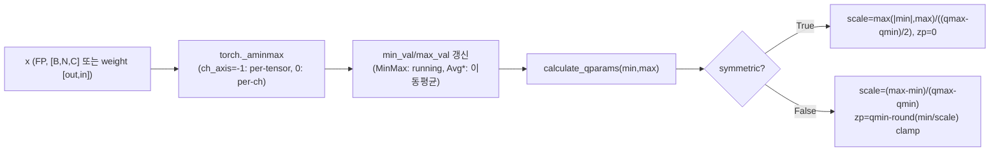
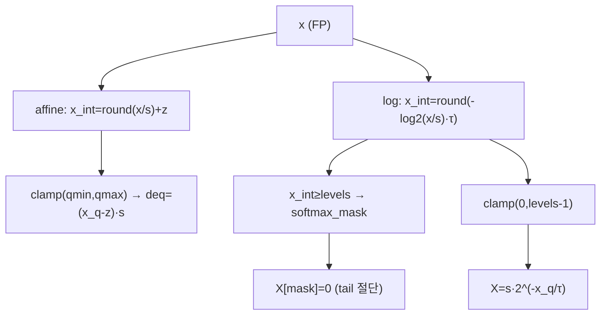
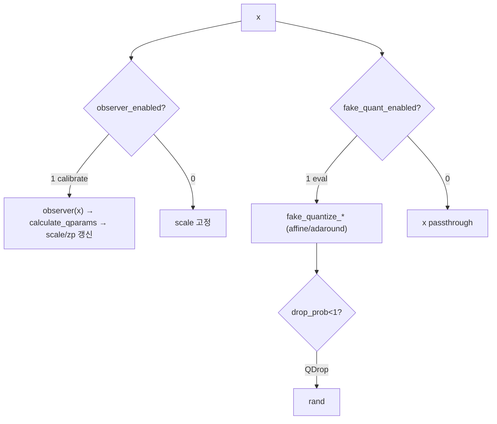
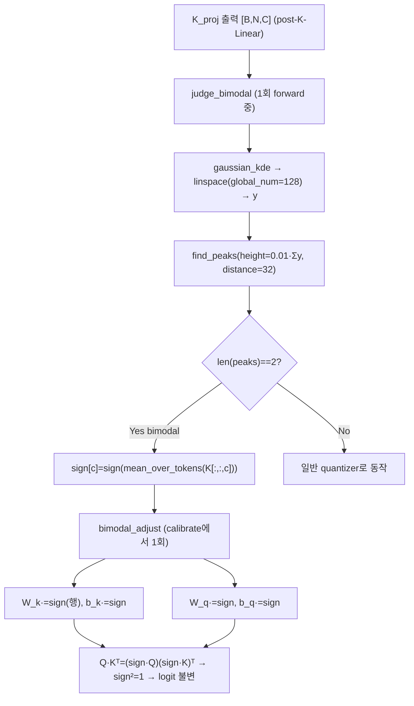
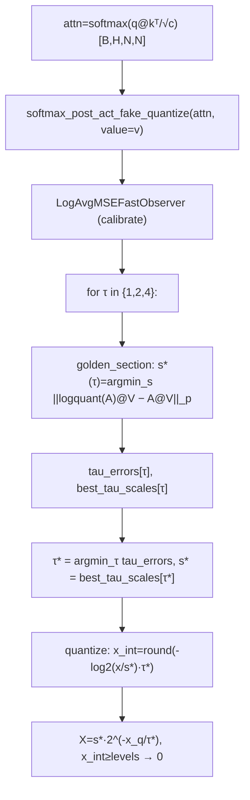
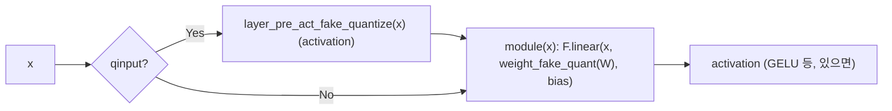
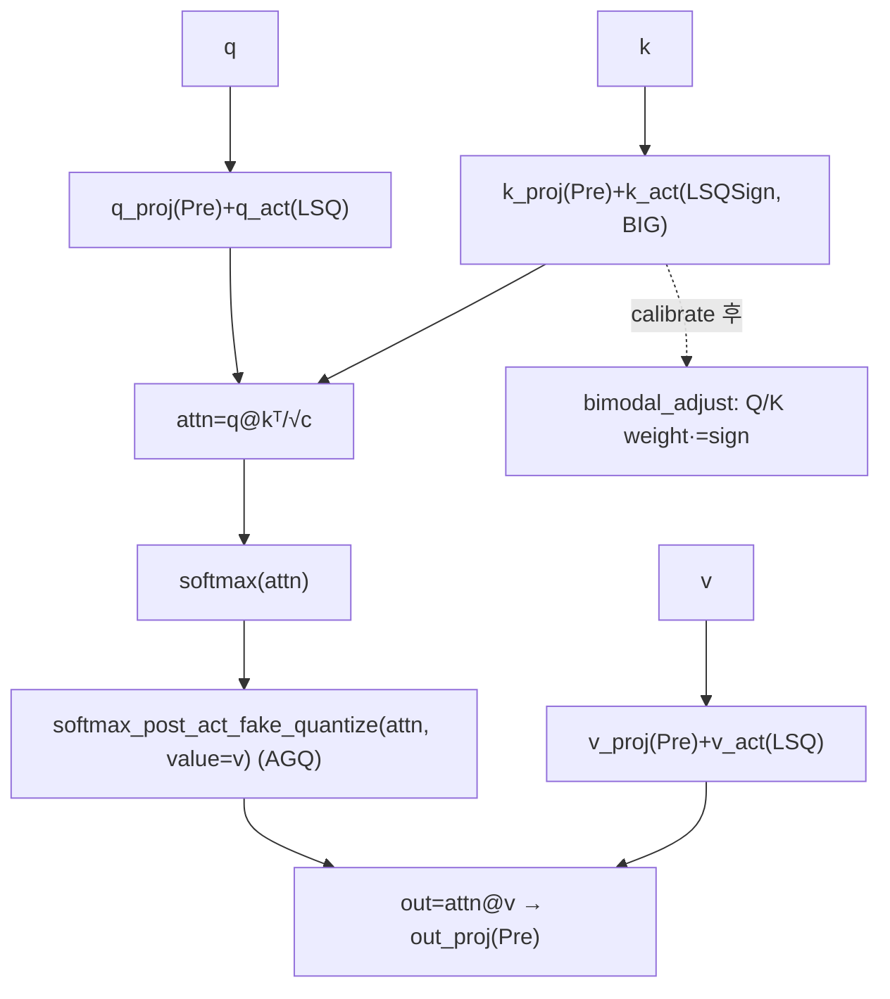
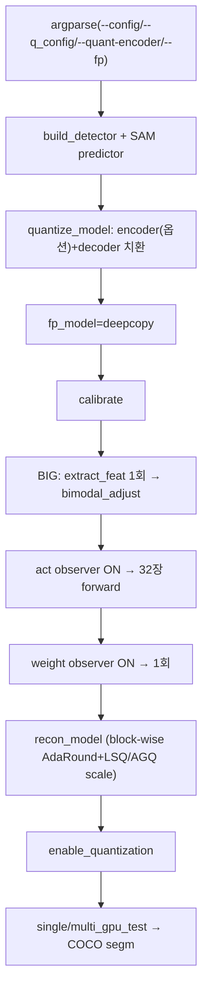
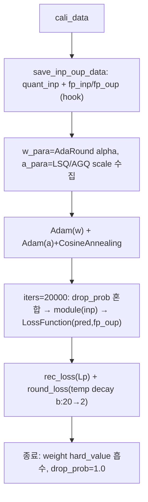

# PTQ4SAM 모듈 통합 가이드 (S-PyTorch)

> 1차 요약: [`../ptq4sam.md`](../ptq4sam.md) — 본 문서는 그 요약을 모듈 단위로 심화한 통합 가이드다.
> 분석 대상: `\\wsl.localhost\ubuntu-24.04\home\user\project\PRJXR-HBTXR\REF\ViT-Quantization\ptq4sam`
> 작성 원칙: 실제 소스 Read 후 `파일:라인` 근거 표기. 라인 근거 없는 추론은 "추정", 코드로 확인 불가는 "확인 불가"로 명시.
> 형제 가이드(`REF/Analysis/ViT-Quantization/I-ViT/MODULE_GUIDE.md`)의 6요소 구조를 따르되, HW 지표(MAC lanes/scalar MACs)는 **S-PyTorch 수치 규약**(params/FLOPs/activation memory/비트폭/observer/BIG·sign factor/AGQ·log granularity)으로 치환한다.

---

## 0. 문서 머리말

### 0.1 대상 SAM + 두 축(BIG/AGQ)
- **분석 대상: SAM (Segment Anything Model) PTQ 프레임워크** — SAM은 ViT image encoder + two-way mask decoder로 구성된 대규모 모델이고, PTQ4SAM은 이를 **재학습 없이 W6A6/W4A4로 양자화**하는 사후 양자화(PTQ) 프레임워크(`README.md:9`). CVPR 2024, arXiv 2405.03144.
- **대표 양자화 단위 = SAM mask decoder의 `QuantDecoderOurAttentionBlock`** — q/k/v proj(PreQuantizedLayer) + softmax(AGQ) + K경로(BIG)가 한 블록에 모두 모이는 **두 축이 동시에 적용되는 유일한 지점**(`quant_model.py:214-294`). I-ViT 가이드가 "VisionTransformer 1 Block"을 대표로 잡은 것과 동형으로, 본 가이드는 이 디코더 어텐션 블록을 대표 단위로 잡는다.
- **두 핵심 기법(README.md:9, 코드 확인)**:
  1. **BIG (Bimodal Integration)**: mask decoder cross-attention(token_to_image)의 **post-Key-Linear activation**이 보이는 **양봉(bimodal) 분포**가 양자화 병목임을 발견. 수학적으로 등가인 **sign 연산**(채널별 평균 부호)을 Q/K Linear 가중치에 **오프라인 흡수**하여 분포를 unimodal로 정렬(`quant_model.py:286-294`, `fake_quant.py:213-225`).
  2. **AGQ (Adaptive Granularity Quantization)**: SAM의 다양한 어텐션(self / two-way cross)으로 post-Softmax 분포 편차가 큼 → softmax 출력을 `s·2^(-x_q/τ)` 형태 **log2 양자화**하되 **power-of-two base τ∈{1,2,4}를 attn@V 출력 MSE 기준으로 적응 선택**(`fake_quant.py:583-590`, `observer.py:443-521`). 하드웨어 친화적(시프트 기반).
- BIG/AGQ는 config 플래그 `ptq4sam.BIG`/`ptq4sam.AGQ`로 on/off, 두 기법 모두 기본 `True`(`exp/config66.yaml:24-26`).

### 0.2 S-PyTorch 수치 규약 (HW의 MAC lanes/scalar MACs 대체)
- **params**: SAM 백본(ViT-B/L/H) 파라미터는 외부 SAM 정의(`projects/instance_segment_anything/...`)에 있어 본 repo 코드만으로는 **차원 미확정 → 분석적 산출 불가(확인 불가)**. 양자화 모듈은 FP 가중치를 그대로 두고 forward마다 fake-quant(`fake_quant.py:520-527`, `util_quant.py:11-15`)하므로 **params 개수는 FP 원본과 동일**(추가 학습 파라미터는 LSQ scale/AdaRound alpha/AGQ scale 등 양자화 메타뿐).
- **FLOPs/MACs**: SAM 어텐션 행렬곱은 `q@kᵀ`, `attn@v`(`quant_model.py:273,280`)로 표준식이나, N(토큰 수: 디코더는 prompt+image token, 인코더는 64×64 윈도)·C가 입력/프롬프트 의존이라 **고정 수치 산출 불가(확인 불가)**. 구조식만 제시.
- **activation memory**: 양자화는 fake-quant라 실제 텐서는 FP32지만, **정수 도메인 비트폭**(W/A bits)을 "HW 환산 activation bit"로 표기. W6A6(`config66.yaml:4,10`) 또는 W4A4(`config44.yaml:4,10`).
- **비트폭/observer**: 코드 직접. W6A6: activation 6bit(`LSQFakeQuantize`+`AvgMinMaxObserver`, per-tensor `ch_axis:-1`, asymmetric)(`config66.yaml:1-6`), weight 6bit(`AdaRoundFakeQuantize`+`MSEObserver`, per-out-channel `ch_axis:0`, asymmetric)(`config66.yaml:7-12`). 대칭/비대칭: **둘 다 asymmetric(`symmetric:False`)**.
- **BIG(sign factor)**: 채널별 평균 부호 ±1, gaussian_kde + find_peaks로 peak==2 판정(`fake_quant.py:216-224`).
- **AGQ(log/적응 granularity)**: τ∈{1,2,4}(`observer.py:450`), `X=s·2^(-x_q/τ)`(`fake_quant.py:590`).
- **정확도/속도**: README에 정확도 표 없음(framework.png 이미지만, `README.md:8`) → mAP/mIoU **확인 불가**. 본 세션 미실행 → latency **확인 불가**.

### 0.3 운영 경로 (PTQ calibration ↔ reconstruction ↔ COCO 평가)
```
[모델 빌드] build_detector + SAM predictor                      (test_quant.py:316)
   │  detector(YOLOX/Faster R-CNN/DETR/DINO) + Prompt-SAM 래퍼
   ▼
[양자화 모듈 치환] quantize_model(): image_encoder(옵션) + mask_decoder 교체  (test_quant.py:342, 422-456)
   │  specials 매핑(TwoWay/Attention/ImageEncoderViT → Quant*)  (quant_model.py:403-407)
   │  patch_embed/output_upscaling/iou_prediction_head/output_hypernetworks_mlps 제외 (test_quant.py:426)
   ▼
[FP 기준 모델 보관] fp_model = copy.deepcopy(model)            (test_quant.py:345)
   ▼
[calibrate] (test_quant.py:347, 460-485)
   │  BIG=True → 1회 forward(extract_feat) 후 bimodal_adjust    (test_quant.py:463-465)
   │  act observer ON → 32장 forward로 min/max 통계             (test_quant.py:466-469, config66.yaml:13)
   │  분산이면 min/max all_reduce                                (test_quant.py:471-478)
   │  weight observer ON → 1회 forward                           (test_quant.py:480-481)
   ▼
[(옵션) reconstruction] recon_model(): block-wise AdaRound(weight) + LSQ/AGQ scale(activation) 튜닝  (test_quant.py:349-352, recon.py:136-342)
   │  Adam + CosineAnnealing, iters=20000, drop_prob=0.5(QDrop)  (config66.yaml:14-23)
   ▼
[enable_quantization] observer OFF / fake-quant ON → 평가       (test_quant.py:354, state.py:20-31)
   ▼
[COCO 평가] single/multi_gpu_test → dataset.evaluate(metric='segm')  (test_quant.py:372-417,78)
```
- 타깃 디바이스: **CUDA GPU 전제, 40GB+ 권장** — `.cuda()` 다수(`fake_quant.py:225`, `observer.py:306-307,455,515`), 권장 메모리(`README.md:82`). → CPU 단독 실행 불가(코드 근거 확인, 실행 실패는 미검증).
- 기반 코드: **QDrop**(reconstruction/drop) + **Prompt-Segment-Anything**(SAM 래퍼) 위에 구축(`README.md:100`).

### 0.4 모델 / 데이터셋 / 정확도
| 항목 | 값 | 근거 |
|---|---|---|
| 대상 모델 | SAM-B/L/H (ViT-B/L/H encoder + two-way mask decoder) | `README.md:62-64` |
| Detector(prompt) | YOLOX-l / Faster R-CNN R-50 / H-Deformable-DETR / DINO | `README.md:65-68` |
| 데이터셋 | **COCO** (annotations/train2017/val2017/test2017) | `README.md:49-58` |
| 평가 metric | **segm** (instance segmentation) | `test_quant.py:78` |
| Calibration | train set 32장 | `config66.yaml:13`, `utils.load_calibration`(`test_quant.py:312`) |
| 비트폭 | W6A6(`config66.yaml`) 또는 W4A4(`config44.yaml`) | 두 config |
| 정확도(mAP/mIoU) | **확인 불가** (README에 표 없음, 코드 미실행) | `README.md:8` |
| LVIS 등 타 데이터셋 | **확인 불가** (repo 코드는 COCO만) | - |

---

## 1. Repo / 레이어 개요

PTQ4SAM = SAM 추론을 **재학습 없이 저비트(W6A6/W4A4)로 양자화**하는 PTQ 프레임워크(`README.md:9`). 본 repo의 자체 소스는 `ptq4sam/quantization`(observer/fake_quant/util_quant/quantized_module/state), `ptq4sam/model`(quant_model: SAM 래핑·BIG/AGQ 적용), `ptq4sam/solver`(test_quant/recon/utils). detector·DataLoader·COCO 평가는 **mmdetection**, SAM 어텐션 구조 정의는 **Prompt-Segment-Anything**(외부)를 그대로 사용한다(`quant_model.py:8-15`, `test_quant.py:19-25`).

### 1.1 자체 소스 vs 외부 프레임워크 vs 제외
| 구분 | 파일(자체 소스) | 역할 |
|---|---|---|
| **observer** | `quantization/observer.py` ★핵심 | scale/zp 계산, MinMax/MSE/log(AGQ)/sign(BIG) observer 군 |
| **fake-quant** | `quantization/fake_quant.py` ★핵심 | FakeQuantize 군 + **BIG**(LSQSignFakeQuantize) + **AGQ**(AdaptiveGranularityQuantize) |
| **양자화 커널** | `quantization/util_quant.py` | affine/log fake-quant, round_ste, LSQ/LSQ+ grad |
| **양자화 연산자/팩토리** | `quantization/quantized_module.py` | QLinear/QConv2d/QEmbedding + Quantizer 팩토리, Pre/QuantizedLayer, QuantizedMatMul |
| | `quantization/quantized_module_matmul.py` | (구버전/보조) MatMul 모듈 — 현 경로 미import(추정) |
| **상태 제어** | `quantization/state.py` | observer/fake-quant enable·disable |
| **SAM 래핑** | `model/quant_model.py` ★핵심 | SAM encoder/decoder 양자화 래핑, **BIG/AGQ 적용 지점** |
| **평가 엔트리** | `solver/test_quant.py` | PTQ4SAM 실제 평가 main, quantize_model/calibrate |
| **reconstruction** | `solver/recon.py` | block-wise AdaRound + LSQ scale(QDrop drop) |
| **보조** | `solver/utils.py` | config 파싱, calibration 로딩, forward hook(미열람 세부) |
| **(구) 엔트리** | `solver/quant_coco.py` | QDrop CNN detector용 — SAM 미사용, `qdrop.*` 네임스페이스 |

### 1.2 진입점 (forward / 실행)
- **실행 엔트리**: `test_quant.py:main`(`:181`) → `quantize_model`(`:342`) → `calibrate`(`:347`) → `recon_model`(`:349`) → `enable_quantization`(`:354`) → COCO 평가(`:372-417`).
- **forward 진입점**: SAM `model.extract_feat(cali_data[i])`(`test_quant.py:464,469,481`)가 image_encoder→mask_decoder 전체 forward를 구동. 양자화 모듈의 forward는 `PreQuantizedLayer.forward`(`quantized_module.py:207`), `QuantDecoderOurAttentionBlock.forward`(`quant_model.py:257`) 등에서 fake-quant 적용.

### 1.3 제외 (지시에 따라 이름만, 미분석)
- **외부 프레임워크**: `mmdetection/`(detector/DataLoader/COCO segm 평가 전체), `projects/instance_segment_anything/`의 SAM 모듈 정의(`image_encoder.py`/`transformer.py`/`common.py`)와 `ops/` CUDA 커널(deformable attention). 양자화 래핑이 인터페이스만 참조(`quant_model.py:8-15`).
- **체크포인트**: SAM-B/L/H `.pth`, detector `.pth` — 가중치만 로드(`README.md:62-68`).
- **(구) CNN 경로**: `quant_coco.py`(qdrop 네임스페이스, SAM 미사용), `quantized_module_matmul.py`(현 경로 미import, 추정).
- **미열람(확인 불가)**: `solver/utils.py` 세부(config 파싱·DataSaverHook은 import로만 확인).

---

## 2. 모듈: scale/zp 계산 기반 — `observer.py` (ObserverBase + MinMax/MSE 군)

### 2.1 역할 + 상위/하위
- **역할**: calibration 텐서의 min/max를 추적해 affine 양자화 **scale·zero-point를 계산**하는 observer 군. per-tensor/per-channel, symmetric/asymmetric 분기.
- **상위**: `FakeQuantize` 군이 `self.observer(X)` 호출 후 `calculate_qparams`로 scale/zp 획득(`fake_quant.py:122-123,162-163,508-510`). **하위**: `_transform_to_ch_axis`(`:8-18`), `torch._aminmax`.

### 2.2 데이터플로우 (텐서 흐름)


### 2.3 forward call stack
`FixedFakeQuantize.forward`(`fake_quant.py:120`) → `self.observer(X.detach())`(`:122`) → `MinMaxObserver.forward`(`observer.py:80`) → `torch._aminmax`(`:86-89`) → `calculate_qparams`(`fake_quant.py:123` → `observer.py:50-69`).

### 2.4 대표 코드 위치
`observer.py`: `ObserverBase.__init__` quant 범위 `:29-34`, `calculate_qparams` `:50-69`, `MinMaxObserver` `:72-91`, `AvgMinMaxObserver`(activation observer) `:117-142`, `MSEObserver`(weight observer) `:171-263`, `_transform_to_ch_axis` `:8-18`.

### 2.5 대표 코드 블록
```python
# observer.py:60-68  symmetric/asymmetric scale·zp (PTQ4SAM 기본 asymmetric)
if self.symmetric:
    max_val_pos = torch.max(-min_val_neg, max_val_pos)
    scale = max_val_pos / (float(quant_max - quant_min) / 2)   # zp=0
else:
    scale = (max_val_pos - min_val_neg) / float(quant_max - quant_min)
    zero_point = quant_min - torch.round(min_val_neg / scale)
    zero_point = torch.clamp(zero_point, quant_min, quant_max)
```
→ config66/44는 weight·activation 모두 `symmetric:False`(`config66.yaml:5,11`)라 **asymmetric(zero-point≠0)** 경로. I-ViT가 zero-point=0 대칭이었던 것과 대비되는 핵심 차이.

```python
# observer.py:29-34  비트폭별 정수 범위 (asymmetric이면 [0, 2^bit-1])
if self.symmetric:
    self.quant_min = -2 ** (self.bit - 1); self.quant_max = 2 ** (self.bit - 1) - 1
else:
    self.quant_min = 0; self.quant_max = 2 ** self.bit - 1
```
→ W6A6이면 asymmetric `[0,63]`, W4A4이면 `[0,15]`.

### 2.6 연산·수치표현 분해 + 정량
- **양자화 방식**: affine(asymmetric), per-tensor(activation, `ch_axis:-1`) / per-out-channel(weight, `ch_axis:0`)(`config66.yaml:6,12`).
- **observer 종류 정량**: activation = `AvgMinMaxObserver`(min/max 이동평균, `observer.py:138-142`), weight = `MSEObserver`(grid search 100후보×zp, p=2.4, `observer.py:176,198,215-227`).
- **비트폭**: W6A6 또는 W4A4(`config66/44.yaml:4,10`).
- **params**: 0 (scale/zp는 buffer/parameter지만 학습 weight 아님).
- **FLOPs**: MSEObserver는 weight당 grid search `100 × (qmax-qmin+1)` 회 fake-quant+MSE → **calibration 비용 큼**(추정, 라인 근거 `:215-227`). MinMax는 O(N) reduce.
- **시사**: weight per-channel MSE / activation per-tensor MinMax 분리 = 저비트 정확도 확보 레시피. FPGA에는 scale/zp가 상수로 precompute되므로 observer 자체는 HW 비용 0(추정).

---

## 3. 모듈: affine / log fake-quant 커널 — `util_quant.py` (round_ste 외)

### 3.1 역할 + 상위/하위
- **역할**: 실제 fake-quantization 수치 연산. 표준 affine(`x_q=clamp(round(x/s)+z)`)와 **AGQ용 log2 양자화**, LSQ/LSQ+ 학습 grad 버전.
- **상위**: `fake_quant.py`의 모든 FakeQuantize가 import해 호출(`fake_quant.py:5-11`). observer도 loss_fx에서 호출(`observer.py:5`). **하위**: `round_ste`(`:4-8`), `grad_scale`(`:80-81`).

### 3.2 데이터플로우 (affine vs log)


### 3.3 forward call stack
- affine: `FixedFakeQuantize.forward`(`fake_quant.py:140`) → `fake_quantize_per_tensor_affine`(`util_quant.py:11-15`).
- log(AGQ): `AdaptiveGranularityQuantize.quantize`(`fake_quant.py:583`) ≡ `fake_logquantize_per_tensor_affine`(`util_quant.py:17-26`) → `round_ste`(`:4-8`).

### 3.4 대표 코드 위치
`util_quant.py`: `round_ste` `:4-8`, `fake_quantize_per_tensor_affine` `:11-15`, **`fake_logquantize_per_tensor_affine`(AGQ)** `:17-26`, per-channel `:28-36`, LSQ 학습 3종 `:39-77`, `grad_scale` `:80-81`.

### 3.5 대표 코드 블록
```python
# util_quant.py:11-15  표준 affine fake-quant (STE round)
def fake_quantize_per_tensor_affine(x, scale, zero_point, quant_min, quant_max):
    x_int = round_ste(x / scale) + zero_point
    x_quant = torch.clamp(x_int, quant_min, quant_max)
    x_dequant = (x_quant - zero_point) * scale
    return x_dequant
```
```python
# util_quant.py:17-26  AGQ log2 양자화 (power-of-two 재구성)
def fake_logquantize_per_tensor_affine(x, scale, quant_min, quant_max, tau=2):
    levels = quant_max - quant_min + 1
    x = torch.clamp(x, 1e-20, None)              # softmax 확률 하한
    x_int = round_ste(-1 * (x/scale).log2() * tau)
    softmax_mask = ((x_int >= levels))
    x_q = torch.clamp(x_int, 0, levels - 1)
    X = scale * 2 ** (-1 * x_q / tau)            # 시프트 가능 dequant
    X[softmax_mask] = torch.Tensor([0.0])         # tail/소값 절단
    return X
```
→ `2^(-x_q/τ)`가 핵심: τ가 정수면 **산술 우측 시프트**로 dequant 가능. FPGA softmax 후단을 곱셈기 없이 barrel shifter로 구현하는 직접 청사진.

```python
# util_quant.py:80-81  LSQ scale gradient 스케일링 (STE)
def grad_scale(t, scale):
    return (t - (t * scale)).detach() + (t * scale)
```

### 3.6 연산·수치표현 분해 + 정량
- **양자화 방식**: affine(asymmetric) 표준 / log2(AGQ). round는 STE(`:4-8`).
- **비트폭**: 호출처 인자(W/A 6 또는 4). log levels = `qmax-qmin+1`.
- **params**: 0(순수 함수). LSQ scale은 호출 모듈의 `nn.Parameter`.
- **FLOPs**: affine = 원소당 div+round+clamp+mul. log = div+log2+mul+round+clamp+pow. **log2/pow가 affine보다 비싸나 추론 HW에선 시프트로 환원**(추정).
- **시사**: 두 커널이 PTQ4SAM의 전 양자화 수치의 바닥. AGQ log 커널이 HW 친화도 1순위.

---

## 4. 모듈: FakeQuantize 베이스/표준군 — `fake_quant.py` (QuantizeBase / Fixed / LSQ / AdaRound)

### 4.1 역할 + 상위/하위
- **역할**: observer를 보유하고 observer_enabled/fake_quant_enabled 토글에 따라 통계수집 또는 fake-quant 수행하는 nn.Module 군. weight용(AdaRound), activation용(LSQ)로 분화.
- **상위**: `Quantizer` 팩토리(`quantized_module.py:158-172`), `QLinear/QConv2d.weight_fake_quant`(`:64,78`), `Pre/QuantizedLayer`의 act quantizer(`:187,205`). **하위**: `observer.py`, `util_quant.py`.

### 4.2 데이터플로우


### 4.3 forward call stack
- weight: `QLinear.forward`(`quantized_module.py:82`) → `self.weight_fake_quant(self.weight)` → `AdaRoundFakeQuantize.forward`(`fake_quant.py:507`) → `adaround_forward`(`:484-501`).
- activation: `PreQuantizedLayer.forward`(`quantized_module.py:209`) → `LSQFakeQuantize.forward`(`fake_quant.py:160`) → `fake_quantize_learnable_per_tensor_affine_training`(`util_quant.py:39-44`).

### 4.4 대표 코드 위치
`fake_quant.py`: `QuantizeBase`(observer 보유·토글·직렬화) `:20-109`, `FixedFakeQuantize` `:112-147`, `LSQFakeQuantize`(activation quantizer) `:150-196`, `AdaRoundFakeQuantize`(weight quantizer) `:445-535`, `rectified_sigmoid` `:479-482`, `adaround_forward` `:484-501`, QDrop drop_prob `:143-145,193-195`.

### 4.5 대표 코드 블록
```python
# fake_quant.py:160-196  LSQ activation: scale를 nn.Parameter로 학습
self.scale = torch.nn.Parameter(torch.tensor([1.0]))   # :154
...
grad_factor = 1.0 / (X.numel() * self.quant_max) ** 0.5  # :188
X = fake_quantize_learnable_per_tensor_affine_training(
    X, self.scale, self.zero_point.item(), self.quant_min, self.quant_max, grad_factor)  # :191
```
```python
# fake_quant.py:479-501  AdaRound weight: 학습된 rounding mask (soft/hard)
def rectified_sigmoid(self):
    return ((self.zeta - self.gamma) * torch.sigmoid(self.alpha) + self.gamma).clamp(0, 1)  # γ=-0.1,ζ=1.1 (:457)
def adaround_forward(self, X, hard_value=False):
    X = torch.floor(X / scale)
    X += (self.alpha >= 0).float() if hard_value else self.rectified_sigmoid()  # round up/down 학습
    X = torch.clamp(X + zero_point, qmin, qmax); return (X - zero_point) * scale
```
→ AdaRound는 weight를 floor 후 [0,1] 마스크(`rectified_sigmoid`)로 올림/내림을 학습. reconstruction에서 alpha를 Adam으로 최적화(`recon.py:153-154,174`).

### 4.6 연산·수치표현 분해 + 정량
- **양자화 방식**: activation = LSQ(scale 학습, per-tensor), weight = AdaRound(rounding 학습, per-channel). 둘 다 asymmetric.
- **비트폭**: W6A6 또는 W4A4(`config66/44.yaml`).
- **params(양자화 메타)**: LSQ scale `[1]`/quantizer, AdaRound alpha = weight와 동일 shape(`fake_quant.py:475`) — reconstruction 중에만 활성, 종료 시 hard value로 흡수(`recon.py:336-339`).
- **시사**: weight rounding 학습(AdaRound) + activation scale 학습(LSQ)의 QDrop 레시피가 W4A4 저비트 정확도의 핵심. drop_prob=0.5(`config66.yaml:23`)로 quant/FP 입력 랜덤 혼합(`fake_quant.py:144`).

---

## 5. 모듈: BIG — `LSQSignFakeQuantize` + `SignAvgMSEFastObserver` + `bimodal_adjust` ★핵심 정밀 해부

### 5.1 역할 + 상위/하위
- **역할**: SAM mask decoder cross-attn(token_to_image)의 **post-Key-Linear 출력**이 보이는 **양봉(bimodal) 분포**를 **채널별 sign(±1)** 으로 판정·결정하고, 그 sign을 **Q/K Linear 가중치/바이어스에 오프라인 흡수**해 분포를 unimodal로 정렬. 어텐션 logit은 sign²=1로 불변.
- **상위**: BIG=True일 때 K 경로 quantizer가 `LSQSignFakeQuantize`로 교체(`quant_model.py:25,233,238`), observer는 `SignAvgMSEFastObserver`. `calibrate`가 `bimodal_adjust` 호출(`test_quant.py:463-465`). **하위**: `scipy.stats.gaussian_kde`, `scipy.signal.find_peaks`(`fake_quant.py:16,15`).

### 5.2 데이터플로우 (BIG 전체 파이프라인)


### 5.3 forward call stack
1. **판정**: `QuantDecoderOurAttentionBlock.forward`(`quant_model.py:263`) → `k_post_act_fake_quantize(self.k_proj(k))` → `LSQSignFakeQuantize.forward`(`fake_quant.py:227`) → `judge_bimodal`(`:213`, is_bimodal None일 때 1회).
2. **흡수**: `calibrate`(`test_quant.py:463`) → `bimodal_adjust(model, logger)`(`quant_model.py:409`) → `QuantDecoderOurAttentionBlock.bimodal_adjust`(`:286`) → `addjust_linear(k_proj/q_proj, sign)`(`:289-293`).

### 5.4 대표 코드 위치
`fake_quant.py`: `LSQSignFakeQuantize` `:199-270`, `judge_bimodal` `:213-225`, sign 결정 `:222-225`. `observer.py`: `SignAvgMSEFastObserver` `:523-544`, sign-aware loss `:538-543`. `quant_model.py`: quantizer 교체 `:24-26,232-238`, 하이퍼파라미터 주입 `:241-244`, `bimodal_adjust`(블록) `:286-294`, `bimodal_adjust`(모델, token_to_image 필터) `:409-417`. config: `global_num/peak_distance/peak_height`=128/32/0.01(`config66.yaml:27-29`).

### 5.5 대표 코드 블록
```python
# fake_quant.py:213-225  bimodal 판정(KDE+find_peaks) + 채널별 평균부호 sign
def judge_bimodal(self, data_inp):
    data = data_inp[0].flatten().cpu().numpy()
    kde = gaussian_kde(data)
    x = np.linspace(min(data), max(data), self.global_num)   # global_num=128
    y = kde(x)
    peaks, _ = find_peaks(y, height=self.peak_height*sum(y), distance=self.peak_distance)  # 0.01·Σy, 32
    self.is_bimodal = len(peaks) == 2                        # 정확히 2-peak면 bimodal
    if self.is_bimodal:
        data_inp = data_inp.transpose(0, -1).flatten(1, -1)
        self.sign = torch.tensor([torch.sign(chan_data.mean()) for chan_data in data_inp]).cuda()  # 채널별 평균부호
```
→ sign factor 탐색 방식은 **KL/gaussian-fit가 아니라**: ① KDE+find_peaks로 peak==2 판정, ② 채널별 평균의 부호(±1). (코드 확인)

```python
# quant_model.py:286-294  Q/K Linear에 sign 오프라인 흡수 (등가 변환)
def bimodal_adjust(self):
    if self.k_post_act_fake_quantize.is_bimodal:
        sign = self.k_post_act_fake_quantize.sign
        def addjust_linear(linear, sign):
            linear.weight.mul_(sign.unsqueeze(1))   # 채널(행)별 ±1
            linear.bias.mul_(sign)
        addjust_linear(self.k_proj.module, sign)
        addjust_linear(self.q_proj.module, sign)
        self.k_post_act_fake_quantize.is_bimodal = False   # 1회만
```
→ Q·Kᵀ = (sign·Q)(sign·K)ᵀ 에서 sign²=1로 상쇄 → 어텐션 logit 수학적 불변, K(및 Q) 채널 분포만 unimodal로 정렬. **런타임 추가 비용 0**(가중치에 흡수).

```python
# observer.py:538-543  sign 정렬 공간에서 scale 탐색
if self.sign is not None:
    x_q = x_q*self.sign[None,None,:]
    x = x*self.sign[None,None,:]
score = self.lp_loss(x_q, x, p=self.p)
```

### 5.6 연산·수치표현 분해 + 정량
- **양자화 방식**: K 경로 = LSQ(asymmetric, per-tensor) + sign 사전정렬. sign은 forward 1회로 판정·고정(`fake_quant.py:228-230`).
- **sign factor**: 채널 수 C개의 ±1 벡터(`fake_quant.py:224`). FPGA 환산 시 가중치에 흡수되어 별도 저장 불필요.
- **적용 범위**: 이름에 `token_to_image` 포함 `QuantDecoderOurAttentionBlock`만(`quant_model.py:412`) — README "bimodal은 SAM-B/L mask decoder에서 주로 발생"(`README.md:84`)과 일치. encoder는 BIG 미적용(K 경로가 일반 quantizer, `quant_model.py:377`).
- **params**: 0 추가(sign은 buffer, 흡수 후 weight에 반영).
- **FLOPs**: 판정 = KDE(128점) + find_peaks(1회/블록), 흡수 = weight·sign 원소곱(1회). **calibration 단계 SW 작업, 추론·HW 비용 0**.
- **하이퍼파라미터 민감성**: peak height(0.01·Σy), distance(32), global_num(128)에 따라 약-bimodal/3-modal 오판 가능(추정, `fake_quant.py:219`).
- **대안 경로(미사용 추정)**: `LSQPlusSignFakeQuantize`(`fake_quant.py:322-441`)는 `_judge_two_peak`(양/음 비율 asy_rate≥γ=0.8)로 판정하는 또 다른 BIG 변형이나, 실제 quant_model.py는 `LSQSignFakeQuantize`를 사용(`quant_model.py:25`)하므로 실험/대안 경로로 추정.

> **요약(BIG)**: 텐서 = mask decoder cross-attn(token_to_image) K projection 출력. 판정 = KDE+find_peaks(peak==2). sign = 채널별 평균 부호(±1). reparam = Q/K Linear weight·bias에 sign 곱해 오프라인 흡수(`quant_model.py:286-294`). 어텐션 등가성 보존, 런타임 비용 0.

---

## 6. 모듈: AGQ — `AdaptiveGranularityQuantize` + `LogAvgMSEFastObserver` ★핵심 정밀 해부

### 6.1 역할 + 상위/하위
- **역할**: post-Softmax attention 확률을 `s·2^(-x_q/τ)` 형태 **log2 양자화**하되, **power-of-two base τ∈{1,2,4}** 를 **attn@V 출력 MSE 기준**으로 어텐션마다 적응 선택. long-tail(power-law) softmax 분포에 적합한 하드웨어 친화적 양자화.
- **상위**: AGQ=True일 때 softmax 경로 quantizer가 `AdaptiveGranularityQuantize`, observer가 `LogAvgMSEFastObserver`로 교체(`quant_model.py:22-24,229,236,277,374,396`). **하위**: `fake_logquantize_per_tensor_affine`(`util_quant.py:17-26`), `scipy.optimize.minimize_scalar`(golden section, `observer.py:4`).

### 6.2 데이터플로우 (AGQ τ 탐색 + 양자화)


### 6.3 forward call stack
1. **τ/scale 탐색(calibrate)**: `QuantDecoderOurAttentionBlock.forward`(`quant_model.py:277`) → `softmax_post_act_fake_quantize(attn, value=v)` → `AdaptiveGranularityQuantize.forward`(`fake_quant.py:558`) → `self.observer(X, value=v)`(`:562`) → `LogAvgMSEFastObserver.forward`(`observer.py:467`) → `golden_section_search_1D_channel`(`:495-515`, τ 루프) → `loss_fx`(`:454-465`, attn@V MSE).
2. **양자화(eval)**: `AdaptiveGranularityQuantize.forward`(`fake_quant.py:564`) → `ori_forward`(`:549`) → `init_quantization_scale`(`:574`, τ* 선택) → `quantize`(`:583-593`).

### 6.4 대표 코드 위치
`fake_quant.py`: `AdaptiveGranularityQuantize` `:539-593`, `forward`(value 주입) `:558-572`, `init_quantization_scale`(τ* 선택) `:574-581`, `quantize`(log 양자화) `:583-593`. `observer.py`: `LogAvgMSEFastObserver` `:443-521`, `taus=[1,2,4]` `:450`, `loss_fx`(attn@V MSE) `:454-465`, τ 루프 `:501-513`, value 주입 `:467-469`.

### 6.5 대표 코드 블록
```python
# fake_quant.py:583-593  AGQ log2 양자화 (power-of-two 재구성)
def quantize(self, x, scale):
    levels = self.observer.quant_max - self.observer.quant_min + 1
    x = torch.clamp(x, 1e-20, None)
    x_int = round_ste(-1 * (x/scale).log2() * self.tau)   # log2 기반, τ=granularity
    softmax_mask = x_int >= levels
    x_q = torch.clamp(x_int, 0, levels - 1)
    X = scale * 2 ** (-1 * x_q / self.tau)                 # 시프트 가능 dequant
    X[softmax_mask] = torch.Tensor([0.0])                  # tail/소값 절단
    return X
```
```python
# observer.py:454-465  τ/scale 선택 기준 = attn@V 출력 MSE (단순 attn MSE 아님)
def loss_fx(self, x, new_min, new_max, alpha):   # alpha = τ
    scale = torch.tensor(new_max).cuda()
    x_q = fake_logquantize_per_tensor_affine(x, scale.item(), self.quant_min, self.quant_max, alpha)
    score = self.lp_loss(x_q @ self.value, x @ self.value, p=self.p)   # ★ attn@V 기준
    return score
```
```python
# observer.py:450,501-513  τ 후보 {1,2,4}를 golden section으로 각각 탐색
self.taus = [2**i for i in range(3)]    # [1, 2, 4]
for tau in self.taus:
    result = minimize_scalar(self.golden_sym_range_loss, args=(x, tau),
                             bounds=(min(0.1, 0.01*xrange), xrange), method='Bounded')
    best_tau_scales.append(...); tau_errors.append(result.fun)
```
```python
# fake_quant.py:574-581  최종 τ* = tau_errors 최소 인덱스
def init_quantization_scale(self, x):
    tau_errors = self.observer.tau_errors
    _, min_error_idx = torch.min(tau_errors, dim=0)
    scale = self.observer.best_tau_scales[min_error_idx]
    self.tau = self.observer.taus[min_error_idx]
    return scale
```

### 6.6 연산·수치표현 분해 + 정량
- **양자화 방식**: log2(power-of-two), unsigned levels = `qmax-qmin+1`(asymmetric이면 W6A6→64, W4A4→16). `X=s·2^(-x_q/τ)`.
- **granularity 파라미터 τ**: {1,2,4}(`observer.py:450`). attn@V 출력 MSE 최소화로 어텐션마다 선택(`fake_quant.py:574-581`).
- **value 주입**: forward에서 `softmax_post_act_fake_quantize(attn, value=v)`로 V를 observer에 전달(`quant_model.py:277,396`; `fake_quant.py:558-562` → `observer.py:467-469`).
- **적용 범위**: mask decoder 모든 어텐션(self/cross) softmax(`quant_model.py:236,277`) + encoder self-attn softmax(`:374,396`). encoder는 **AGQ만, BIG 미적용**.
- **params(메타)**: AGQ scale `nn.Parameter [1]`(`fake_quant.py:547`), reconstruction 튜닝 대상(`recon.py:163-164`). tau는 정수 선택값.
- **FLOPs**: 탐색 = 3(τ)×golden section(각 minimize_scalar, attn@V MSE) → **calibration 비용**(추정). 추론 = log2+pow(또는 HW 시프트).
- **시사**: τ가 정수라 `2^(-x_q/τ)`를 시프트(τ=1) 또는 시프트+소수승(τ=2,4) 근사로 환원 가능 → FPGA softmax 후단 곱셈기-free. τ∈{1,2,4}는 HW LUT/시프트량과 매핑 쉬움.

> **요약(AGQ)**: post-softmax 확률을 `s·2^(-x_q/τ)` log2 양자화. τ∈{1,2,4}를 attn@V 출력 MSE 기준 golden-section으로 적응 선택(`observer.py:450,464`; `fake_quant.py:574-590`).

---

## 7. 모듈: 양자화 연산자·팩토리 — `quantized_module.py` (QLinear/QConv2d/Pre·QuantizedLayer/QuantizedMatMul)

### 7.1 역할 + 상위/하위
- **역할**: config 문자열 → observer/quantizer 클래스 매핑(dict), nn.Linear/Conv2d/Embedding을 weight fake-quant 래핑(QLinear 등), 입력/출력에 activation fake-quant를 붙인 래퍼(Pre/QuantizedLayer), 정수 행렬곱(QuantizedMatMul).
- **상위**: `quant_model.py`가 SAM 모듈 래핑에 사용(`quant_model.py:40-41,222-225`), `test_quant.py:quantize_model`이 Conv/Linear를 QuantizedLayer로 치환(`:431`). **하위**: `fake_quant.py`, `observer.py`.

### 7.2 데이터플로우 (PreQuantizedLayer)


### 7.3 forward call stack
`QuantDecoderOurAttentionBlock.forward`(`quant_model.py:262`) → `PreQuantizedLayer.forward`(`quantized_module.py:207`) → `layer_pre_act_fake_quantize`(LSQ, `:209`) → `self.module(x, gamma)`(`QLinear.forward`, `:80-86`) → `weight_fake_quant(weight)`(AdaRound, `:82`).

### 7.4 대표 코드 위치
`quantized_module.py`: ObserverDict/FakeQuantizeDict `:6-26`, `ActivationQuantizer/WeightQuantizer` `:29-41`, `QLinear`(gamma 융합) `:70-86`, `QConv2d` `:48-67`, `Quantizer` 팩토리 `:158-172`, `QuantizedLayer`(post) `:180-195`, `PreQuantizedLayer`(pre) `:198-213`, `QuantizedMatMul` `:215-229`.

### 7.5 대표 코드 블록
```python
# quantized_module.py:80-86  QLinear: weight fake-quant + (옵션) gamma 융합
def forward(self, input, gamma=None):
    if gamma is None:
        return F.linear(input, self.weight_fake_quant(self.weight), self.bias)
    else:
        fused_weight = self.weight.mul(gamma.unsqueeze(1)); fused_bias = self.bias.mul(gamma)
        return F.linear(input, self.weight_fake_quant(fused_weight), fused_bias)
```
→ BIG의 sign 흡수는 `bimodal_adjust`에서 weight를 직접 `mul_`하지만(`quant_model.py:290`), QLinear의 gamma 융합은 별도 옵션 경로(reconstruction의 gamma 튜닝 잔재, 현 경로 gamma=None).

```python
# quantized_module.py:158-172  Quantizer 팩토리 (module=None → activation, else weight)
def Quantizer(module, config, sign=False):
    if module is None:
        if sign: return SignActivationQuantizer(a_qconfig=config)   # LSQSignFakeQuantize
        return ActivationQuantizer(a_qconfig=config)
    ...  # Conv/Linear/Embedding → weight 양자화 래핑
```

### 7.6 연산·수치표현 분해 + 정량
- **양자화 방식**: weight = QLinear/QConv2d 내부 `weight_fake_quant`(AdaRound per-ch), activation = Pre/QuantizedLayer의 act quantizer(LSQ per-tensor). MatMul = 두 입력 각각 fake-quant 후 `a@b`(`:223-229`).
- **비트폭**: config 의존(W6A6/W4A4).
- **params**: weight 원본 보존(clone, `:168`), 양자화 메타만 추가.
- **시사**: dict 기반 모듈식 설계 → quantizer/observer를 config 한 줄로 교체. AGQ/BIG 클래스도 dict에 등록(`:13-14,21,25`)되어 `update_specialized_quantizer_config`(`quant_model.py:18-29`)로 softmax/bimodal 경로만 선택 교체.

---

## 8. 모듈: SAM 양자화 래핑 — `quant_model.py` (Quant*AttentionBlock / specials / bimodal_adjust)

### 8.1 역할 + 상위/하위
- **역할**: 원본 SAM 모듈(EncoderAttention/DecoderAttention/TwoWayAttentionBlock/ImageEncoderViT)을 양자화 버전으로 치환하고, **BIG/AGQ가 적용되는 정확한 지점을 정의**. encoder는 AGQ만, decoder는 BIG+AGQ 동시.
- **상위**: `test_quant.py:quantize_model`이 `specials` 매핑으로 치환(`:428-429,443-446`). **하위**: §5(BIG), §6(AGQ), §7(PreQuantizedLayer).

### 8.2 데이터플로우 (QuantDecoderOurAttentionBlock = 대표 단위, BIG+AGQ)


### 8.3 forward call stack
`QuantDecoderOurTwoWayAttentionBlock.forward`(`quant_model.py:179`) → cross_attn_token_to_image `((q,k,keys))`(`:195`) → `QuantDecoderOurAttentionBlock.forward`(`:257`) → q/k/v proj+act(`:262-264`) → `attn=q@k.permute`(`:273`) → `softmax`(`:275`) → AGQ(`:277`) → `attn@v`(`:280`) → out_proj(`:282`).

### 8.4 대표 코드 위치
`quant_model.py`: `update_specialized_quantizer_config`(softmax/bimodal 교체) `:18-29`, `specials` 매핑 `:403-407`, `QuantImageEncoderOurViT` `:297-322`(patch_embed/pos_embed 제외 `:302-304`), `QuantEncoderOurAttentionBlock`(encoder, AGQ만) `:353-401`, `QuantDecoderOurAttentionBlock`(decoder, BIG+AGQ) `:214-294`, `QuantDecoderOurTwoWayAttentionBlock` `:157-211`, `bimodal_adjust`(token_to_image 필터) `:409-417`.

### 8.5 대표 코드 블록
```python
# quant_model.py:228-244  AGQ/BIG quantizer 선택 + BIG 하이퍼파라미터 주입 (decoder)
if ptq4sam_config.AGQ:
    softmax_a_config = update_specialized_quantizer_config(a_qconfig, 'softmax')  # AdaptiveGranularityQuantize
if ptq4sam_config.BIG:
    sign_a_config = update_specialized_quantizer_config(a_qconfig, 'bimodal')     # LSQSignFakeQuantize
self.softmax_post_act_fake_quantize = Quantizer(None, softmax_a_config)
self.k_post_act_fake_quantize = Quantizer(None, sign_a_config)   # K 경로만 sign
if ptq4sam_config.BIG:
    self.k_post_act_fake_quantize.global_num = ptq4sam_config.global_num    # 128
    self.k_post_act_fake_quantize.peak_distance = ptq4sam_config.peak_distance  # 32
    self.k_post_act_fake_quantize.peak_height = ptq4sam_config.peak_height      # 0.01
```
```python
# quant_model.py:380-396  encoder self-attn: AGQ만 적용, K는 일반 quantizer (BIG 미적용)
q = self.q_post_act_fake_quantize(q); k = self.k_post_act_fake_quantize(k)   # 일반
attn = (q * self.scale) @ k.transpose(-2, -1)
if self.use_rel_pos: attn = add_decomposed_rel_pos(attn, q, ...)
attn = self.softmax_post_act_fake_quantize(attn.softmax(dim=-1), value=v)    # AGQ
```

### 8.6 연산·수치표현 분해 + 정량
- **양자화 방식**: 어텐션 q/k/v proj = PreQuantizedLayer(weight AdaRound + activation LSQ), softmax = AGQ, K 경로 = BIG(decoder만), matmul = `q@kᵀ`/`attn@v`(fake-quant된 입력으로).
- **비트폭**: W6A6/W4A4, 단 softmax는 AGQ log levels, K는 BIG sign 사전정렬.
- **양자화 제외**: encoder의 patch_embed/pos_embed(`quant_model.py:302-304`), decoder의 output_upscaling/iou_prediction_head/output_hypernetworks_mlps/patch_embed(`test_quant.py:426`).
- **MACs**: 어텐션 행렬곱 구조식 `q@kᵀ`(B·H·N·N·c_per_head), `attn@v`(동) — N(토큰 수)이 입력/프롬프트 의존 → **고정 수치 확인 불가**.
- **시사**: encoder=AGQ만 / decoder=BIG+AGQ의 분리가 핵심. BIG은 decoder cross-attn K에만 국소 적용되어 HW 영향 0(SW calibration), AGQ는 전 어텐션 softmax 후단에 적용되어 HW softmax 블록 설계에 직접 영향.

---

## 9. 모듈: PTQ 파이프라인 — `test_quant.py` (quantize_model / calibrate) + `state.py`

### 9.1 역할 + 상위/하위
- **역할**: 모델 빌드 → 양자화 치환 → FP 보관 → calibrate(BIG+observer) → reconstruction → enable_quantization → COCO segm 평가의 전체 PTQ 흐름. state.py가 observer/fake-quant 토글.
- **상위**: CLI(`README.md:71-79`). **하위**: §5~§8, mmdet(평가/DataLoader).

### 9.2 데이터플로우


### 9.3 forward call stack
`main`(`test_quant.py:181`) → `quantize_model`(`:342`→`:422`) → `calibrate`(`:347`→`:460`) → `enable_calibration_woquantization('act_fake_quant')`(`:466`→`state.py:6`) → `enable_calibration_woquantization('weight_fake_quant')`(`:480`) → `recon_model`(`:352`→`:488`) → `enable_quantization`(`:354`→`state.py:20`).

### 9.4 대표 코드 위치
`test_quant.py`: `main` `:181-420`, `quantize_model`(치환·제외) `:422-456`, `--quant-encoder` 분기 `:443-446`, `calibrate` `:460-485`, BIG 트리거 `:463-465`, all_reduce `:471-478`, `recon_model` `:488-505`. `state.py`: `enable_calibration_woquantization` `:6-17`, `enable_quantization` `:20-31`, `disable_all` `:34-40`.

### 9.5 대표 코드 블록
```python
# test_quant.py:460-481  calibrate: BIG 먼저 → act observer → weight observer
@torch.no_grad()
def calibrate(model, cali_data, BIG):
    if BIG:
        model.extract_feat(cali_data[0])           # 분포 관찰용 1회 forward
        bimodal_adjust(model, logger=logger)       # sign 흡수
    enable_calibration_woquantization(model, quantizer_type='act_fake_quant')
    for i in range(len(cali_data)):                # 32장
        model.extract_feat(cali_data[i])           # act min/max 통계
    ...  # 분산이면 all_reduce
    enable_calibration_woquantization(model, quantizer_type='weight_fake_quant')
    model.extract_feat(cali_data[0])               # weight 통계 1회
```
```python
# test_quant.py:422-446  quantize_model: 제외 모듈 + encoder 옵션
if 'patch_embed' in name or 'output_upscaling' in name or 'iou_prediction_head' in name \
   or 'output_hypernetworks_mlps' in name: continue          # :426 양자화 제외
if args.quant_encoder:                                        # :443
    model.predictor.model.image_encoder = specials[...](...)  # encoder 양자화
replace_module(model.predictor.model.mask_decoder, ...)       # decoder 항상 양자화
```
```python
# state.py:6-17 / 20-31  observer/fake-quant 토글 (이름 필터)
def enable_calibration_woquantization(model, quantizer_type='fake_quant'):
    # quantizer_type 포함 모듈만 observer ON / fake-quant OFF
def enable_quantization(model, quantizer_type='fake_quant'):
    # observer OFF / fake-quant ON (실제 추론)
```

### 9.6 연산·수치표현 분해 + 정량 / 재현 명령
- **양자화 방식**: PTQ(재학습 없음). BIG=calibration 전 1회, act/weight observer 순차, reconstruction 선택.
- **하이퍼파라미터**: calibrate 32장(`config66.yaml:13`), recon iters=20000/scale_lr=4e-5/drop_prob=0.5/b_range[20,2]/warm_up=0.2(`config66.yaml:14-23`).
- **재현 명령**(`README.md:71-79`):
  ```bash
  python ptq4sam/solver/test_quant.py \
    --config ./projects/configs/yolox/yolo_l-sam-vit-l.py \
    --q_config exp/config66.yaml --quant-encoder       # W6A6, encoder 포함
  # W4A4: --q_config exp/config44.yaml / FP 기준: --fp
  ```
- **정확도**: COCO segm metric(`test_quant.py:78,414`) — **수치는 README 표 없음 + 미실행 → 확인 불가**.
- **주의**: `test_quant.py:27`에 하드코딩 절대경로 `sys.path.append("/nvme/lvchengtao/ptq4sam")` — 다른 환경 실행 시 수정 필요.

---

## 10. 모듈: block-wise reconstruction — `recon.py` (QDrop 계열)

### 10.1 역할 + 상위/하위
- **역할**: 각 양자화 블록의 입/출력을 FP 모델과 맞추도록 weight rounding(AdaRound alpha)과 activation scale(LSQ/AGQ)을 Adam으로 미세조정. QDrop drop_prob로 quant/FP 입력 혼합.
- **상위**: `test_quant.py:recon_model`(`:352,488`)이 QuantizedLayer/Block/Pre/MatMul 단위로 호출. **하위**: `LossFunction`(AdaRound round_loss), `DataSaverHook`(forward hook).

### 10.2 데이터플로우


### 10.3 forward call stack
`recon_model._recon_model`(`test_quant.py:497`) → `reconstruction`(`recon.py:136`) → `save_inp_oup_data`(`:139-140`) → param 수집(`:149-164`) → `module_ddp(cur_inp)`(`:317`) → `LossFunction.__call__`(`:318`→`:94`) → `err.backward`(`:322`).

### 10.4 대표 코드 위치
`recon.py`: `save_inp_oup_data`(hook 캐시) `:11-47`, `LinearTempDecay` `:50-64`, `LossFunction`(round+rec) `:67-126`, `round_loss` `:118-119`, `reconstruction` `:136-342`, weight init `:153-154`, activation scale 수집(only4 옵션) `:150,155-164`, AGQ scale 튜닝 `:163-164`, QDrop drop 혼합 `:280-308`, hard value 흡수 `:336-339`.

### 10.5 대표 코드 블록
```python
# recon.py:150-164  block 내 weight(AdaRound) + activation(LSQ/AGQ) scale 수집
only4flag = ('only4' not in config) or (config.only4 and ('k_proj' in name or 'q_proj' in name))
if isinstance(layer, (nn.Linear, nn.Conv2d)):
    layer.weight_fake_quant.init(layer.weight.data, config.round_mode)   # AdaRound alpha
    w_para += [layer.weight_fake_quant.alpha]
if isinstance(layer, QuantizeBase) and 'act_fake_quantize' in name:
    layer.drop_prob = config.drop_prob                                   # QDrop
    if isinstance(layer, LSQFakeQuantize):           a_para += [layer.scale]
    if isinstance(layer, AdaptiveGranularityQuantize): a_para += [layer.scale]  # AGQ도 튜닝
```
```python
# recon.py:118-119  AdaRound round_loss (rounding을 0/1로 수렴 유도)
round_vals = layer.weight_fake_quant.rectified_sigmoid()
round_loss += self.weight * (1 - ((round_vals - .5).abs() * 2).pow(b)).sum()   # b: 20→2 decay
```

### 10.6 연산·수치표현 분해 + 정량
- **양자화 방식**: block-wise. weight = AdaRound alpha(Adam, lr 기본), activation = LSQ/AGQ scale(Adam, lr=4e-5 + cosine).
- **하이퍼파라미터**: iters=20000, warm_up=0.2, weight=0.01, b_range[20,2], drop_prob=0.5, keep_gpu(cali>16이면 False)(`config66.yaml:14-23`, `recon.py:489-490`).
- **block 단위**: QuantizedLayer/QuantizedBlock/PreQuantizedLayer/QuantizedMatMul(`test_quant.py:499`).
- **only4 옵션**: k_proj/q_proj만 reconstruction(`recon.py:150`) — BIG 블록 한정 튜닝(config에 only4 키 있을 때).
- **FLOPs**: 블록당 20000 iter × forward+backward → **PTQ 중 최대 연산 비용**(추정). 단 추론·HW와 무관(calibration 단계).
- **시사**: AdaRound(weight rounding 학습) + LSQ/AGQ(activation scale 학습) + QDrop(drop)이 W4A4 저비트 정확도의 핵심. FPGA 배포 시 학습된 scale/rounding은 상수로 흡수.

---

## N+1. 모듈 한눈 요약 표

| 모듈 | 파일:라인 | 역할 | 양자화 방식 | 대표 정량/특이점 |
|---|---|---|---|---|
| ObserverBase + MinMax/MSE | observer.py:21-263 | scale/zp 계산 | affine asymmetric, per-tensor(act)/per-ch(weight) | act=AvgMinMax, weight=MSE grid(100후보) |
| util_quant 커널 | util_quant.py:4-81 | affine/log fake-quant, STE | round_ste, `s·2^(-x_q/τ)` | log2 커널이 AGQ 바닥 |
| FakeQuantize 표준군 | fake_quant.py:20-196,445-535 | Fixed/LSQ/AdaRound | LSQ(act scale 학습)/AdaRound(weight rounding) | params 0 추가, alpha=weight shape |
| **BIG** (LSQSign+SignObs+adjust) | fake_quant.py:199-270; observer.py:523-544; quant_model.py:286-294,409-417 | 양봉→sign 오프라인 흡수 | KDE+find_peaks(peak==2), 채널평균부호±1 | token_to_image K만, 런타임 비용 0 |
| **AGQ** (AdaptiveGran+LogObs) | fake_quant.py:539-593; observer.py:443-521 | post-softmax log2 양자화 | `s·2^(-x_q/τ)`, τ∈{1,2,4} | attn@V MSE로 τ 선택, 시프트 친화 |
| 연산자/팩토리 | quantized_module.py:6-229 | QLinear/Conv/Pre·QuantLayer/MatMul | dict 기반 quantizer 교체 | weight clone 보존 |
| SAM 래핑 | quant_model.py:157-417 | encoder/decoder 양자화 치환 | encoder=AGQ만 / decoder=BIG+AGQ | specials 매핑, 제외 모듈 다수 |
| PTQ 파이프라인 | test_quant.py:181-505; state.py:6-40 | calibrate→recon→평가 | PTQ(재학습X), observer 토글 | calibrate 32장, COCO segm |
| reconstruction | recon.py:136-342 | block-wise AdaRound+LSQ/AGQ scale | QDrop drop_prob=0.5 | iters=20000, scale_lr=4e-5 |

---

## N+2. 학습·평가 파이프라인 + 재현 명령

- **데이터셋**: **COCO** instance segmentation(`README.md:49-58`), metric=`segm`(`test_quant.py:78`). LVIS 등은 **확인 불가**(repo 코드는 COCO만).
- **모델**: SAM-B/L/H + detector(YOLOX/Faster R-CNN/DETR/DINO) prompt(`README.md:62-68`). SAM 가중치는 외부 `.pth` 로드.
- **PTQ 실행**:
  ```bash
  python ptq4sam/solver/test_quant.py \
    --config ./projects/configs/yolox/yolo_l-sam-vit-l.py \
    --q_config exp/config66.yaml --quant-encoder
  ```
  옵션: `--q_config {config66(W6A6), config44(W4A4)}`, `--quant-encoder`(encoder 포함), `--fp`(FP 기준), `--show-dir`(시각화), 40GB+ GPU 권장(`README.md:71-83`).
- **양자화 설정 요약**(`config66.yaml`):
  | 대상 | quantizer | observer | bit | ch_axis | symmetric |
  |---|---|---|---|---|---|
  | activation | LSQFakeQuantize | AvgMinMaxObserver | 6/4 | -1(per-tensor) | False |
  | weight | AdaRoundFakeQuantize | MSEObserver | 6/4 | 0(per-ch) | False |
  | softmax(AGQ) | AdaptiveGranularityQuantize | LogAvgMSEFastObserver | (a_bit) | -1 | False |
  | K(BIG) | LSQSignFakeQuantize | SignAvgMSEFastObserver | (a_bit) | -1 | False |
- **의존성**: PyTorch 1.10.2+cu113(`environment.sh`), mmcv-full<2.0.0, mmdetection 소스 빌드, CUDA ops(deformable attn), scipy(minimize_scalar/find_peaks/gaussian_kde), easydict/pyyaml(`README.md:12-46`, `observer.py:4`, `fake_quant.py:15-16`).
- **정확도/속도**: README에 정확도 표 없음, 본 세션 미실행 → **mAP/mIoU·latency 모두 확인 불가**.

---

## N+3. 우리 프로젝트(FPGA ViT 가속 + XR 시선추적) 시사점 + FPGA 친화도

### N+3.1 AGQ log 양자화 = FPGA softmax 후단 곱셈기-free (최우선)
- **`X = s·2^(-x_q/τ)`**(`util_quant.py:23`, `fake_quant.py:590`)는 τ가 정수면 **산술 우측 시프트**로 dequant 가능. softmax 확률을 곱셈기 없이 barrel shifter + 소형 LUT로 처리하는 직접 청사진. τ∈{1,2,4}(`observer.py:450`)는 HW 시프트량/LUT와 매핑이 쉽다. HG-PIPE류 파이프라인 softmax 블록에 적용 시 DSP 절감 기대(추정).
- 단, τ 선택은 calibration 단계 SW 작업(attn@V MSE, `observer.py:464`)이므로 HW는 선택된 τ를 상수로 받음.

### N+3.2 BIG = outlier/저비트 정확도, HW 변경 없는 등가 변환
- bimodal/outlier는 저비트(W4A4) 정확도 붕괴의 주원인. BIG은 sign을 **가중치에 오프라인 흡수**(`quant_model.py:286-294`)하므로 **추론·HW 추가 비용 0**, FPGA에서 별도 하드웨어 변경 없이 정확도 확보. XR용 작은 INT4/INT6 가속기에 특히 유효(추정).
- 다만 적용은 SW calibration 단계이고 SAM mask decoder cross-attn에 국소적 — 일반 ViT 백본의 K 분포가 bimodal인지는 별도 관찰 필요(추정).

### N+3.3 PTQ 레시피 전이 (AdaRound + LSQ + reconstruction)
- weight AdaRound + activation LSQ + block-wise reconstruction(QDrop)(`recon.py:136-342`)은 **재학습 없는 저비트 PTQ**의 표준 레시피. I-ViT의 QAT(ImageNet 수십 epoch) 대비 **calibration 32장 + reconstruction**으로 비용이 훨씬 낮아, XR 시선추적 경량 ViT의 빠른 양자화에 현실적.

### N+3.4 FPGA 친화도 평가
| 항목 | 평가 | 근거 |
|---|---|---|
| AGQ softmax(시프트 dequant) | ★★★ `2^(-x_q/τ)` barrel shifter | `util_quant.py:23` |
| BIG outlier 완화(HW 비용 0) | ★★★ 가중치 흡수, 등가 | `quant_model.py:286-294` |
| 저비트 이식성(W4A4까지) | ★★★ config44 제공 | `config44.yaml:4,10` |
| affine asymmetric requant | ★★ zero-point 가산 필요(대칭 대비) | `observer.py:64-68` |
| LSQ/AGQ scale = FP scale | ★★ HW에 dyadic/시프트 변환 별도 필요(추정) | `util_quant.py:39-44` |
| integer-only 비선형 | △ I-ViT와 달리 LN/GELU 정수화 없음(SAM 원본 사용) | `quant_model.py` 비선형 미양자화 |
| calibration 비용 | △ MSE grid + reconstruction 20000 iter | `observer.py:215`, `recon.py:278` |

### N+3.5 한계 / 차이 (I-ViT 대비)
- **integer-only 아님**: I-ViT는 LayerNorm/GELU/Softmax를 정수 시프트로 환원했으나, PTQ4SAM은 **fake-quant PTQ**라 비선형(softmax 외)·LN·GELU는 FP 원본 SAM 모듈을 그대로 사용(`quant_model.py:96,113,189` 등 norm/act 미양자화). FPGA integer-only 데이터패스에는 추가 비선형 정수화가 필요(추정).
- **asymmetric**: zero-point≠0(`observer.py:64-68`)이라 HW에서 zero-point 보정 가산 필요(I-ViT 대칭 zp=0 대비).
- **SAM 의존**: mmdet + prompt-SAM + CUDA ops + 40GB GPU의 무거운 스택. 기법(BIG/AGQ)만 경량 ViT eye-tracking 백본에 이식하는 것이 현실적(추정).
- **연계 참고**: 동일 디렉토리 `AdaLog.md`(log 양자화), `RepQ-ViT.md`/`outlier-free-transformers.md`(outlier), `I-ViT/MODULE_GUIDE.md`(integer-only 비선형), `HG-PIPE.md`(가속기 계열) 교차 비교 권장.

---

## 부록. 근거 / 확인 불가

### 직접 코드 확인
- BIG quantizer/observer = `LSQSignFakeQuantize`/`SignAvgMSEFastObserver`(`quant_model.py:25-26,233,238`; `fake_quant.py:199`; `observer.py:523`).
- BIG 판정 = gaussian_kde + find_peaks(peak==2), sign = 채널평균부호(`fake_quant.py:213-225`).
- BIG reparam = Q/K Linear weight·bias에 sign 곱(오프라인)(`quant_model.py:286-294`), token_to_image 한정(`:412`).
- AGQ quantizer/observer = `AdaptiveGranularityQuantize`/`LogAvgMSEFastObserver`(`quant_model.py:23-24,229`; `fake_quant.py:539`; `observer.py:443`).
- AGQ = log2 `s·2^(-x_q/τ)`, τ∈{1,2,4}, attn@V MSE 선택(`util_quant.py:17-26`; `fake_quant.py:583-590`; `observer.py:450,464,495-515`).
- weight=AdaRound/MSEObserver/per-ch, activation=LSQ/AvgMinMax/per-tensor, asymmetric, W6A6/W4A4(`config66.yaml`, `config44.yaml`).
- calibrate 32장, BIG→act observer→weight observer 순(`test_quant.py:460-485`). 제외 모듈(`:426`). reconstruction iters=20000(`config66.yaml:19`).
- 평가 데이터=COCO, metric=segm, entry=test_quant.py(`README.md:49`, `test_quant.py:78`).

### 추정 (코드 정황 기반)
- `LSQPlusSignFakeQuantize`(asy_rate≥0.8 판정)는 대안 BIG 경로, 실제 quant_model.py 미사용(`fake_quant.py:322-441` vs `quant_model.py:25`).
- `quantized_module_matmul.py`는 구버전/보조(현 경로 미import).
- `AvgSignMinMaxObserver`는 `super().__init__`이 잘못된 부모(`AvgMinMaxObserver`) 호출(`observer.py:150`) → 미사용 추정.
- AGQ τ가 정수라 `2^(-x_q/τ)` 시프트 환원 가능 / FPGA softmax 곱셈기-free / SAM 자체의 XR 직접 적용성 낮음(모델 무게).
- MSE grid·reconstruction이 calibration 비용 지배. HW dyadic/시프트 변환 별도 필요.

### 확인 불가
- **정확도(mAP/mIoU)**: README에 표 없음(framework.png 이미지만, `README.md:8`) + 본 세션 미실행.
- **params/MACs 고정 수치**: SAM 백본 차원이 외부 SAM 정의에 있고, 토큰 수 N이 입력/프롬프트 의존 → 분석적 산출 불가(구조식만 제시).
- **latency**: 미실행.
- **LVIS 등 타 데이터셋**: repo 코드는 COCO만.
- **CPU 실행 가능 여부**: `.cuda()` 하드코딩 근거는 확인(`fake_quant.py:225`, `observer.py:306` 등), 실행 실패는 미검증.
- **`solver/utils.py` 세부**: config 파싱·DataSaverHook은 import로만 확인(미열람).
