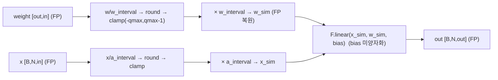
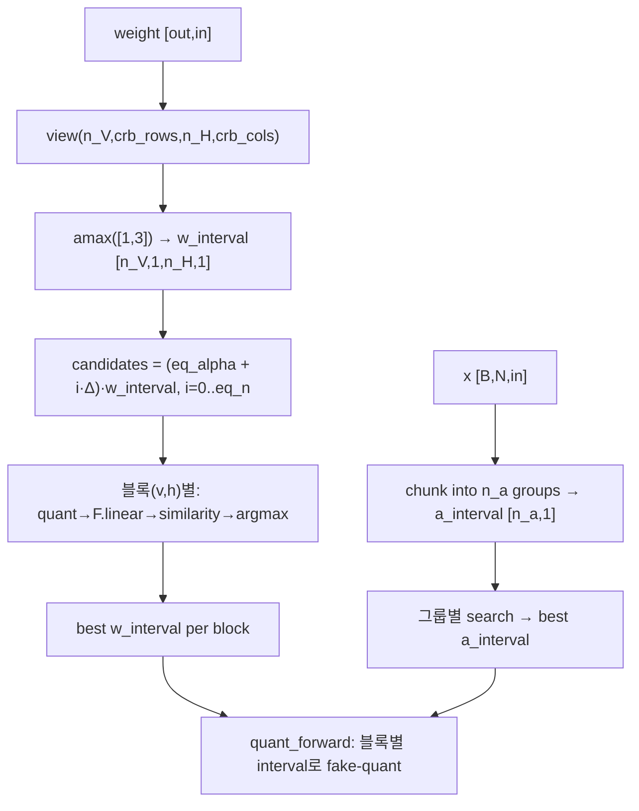
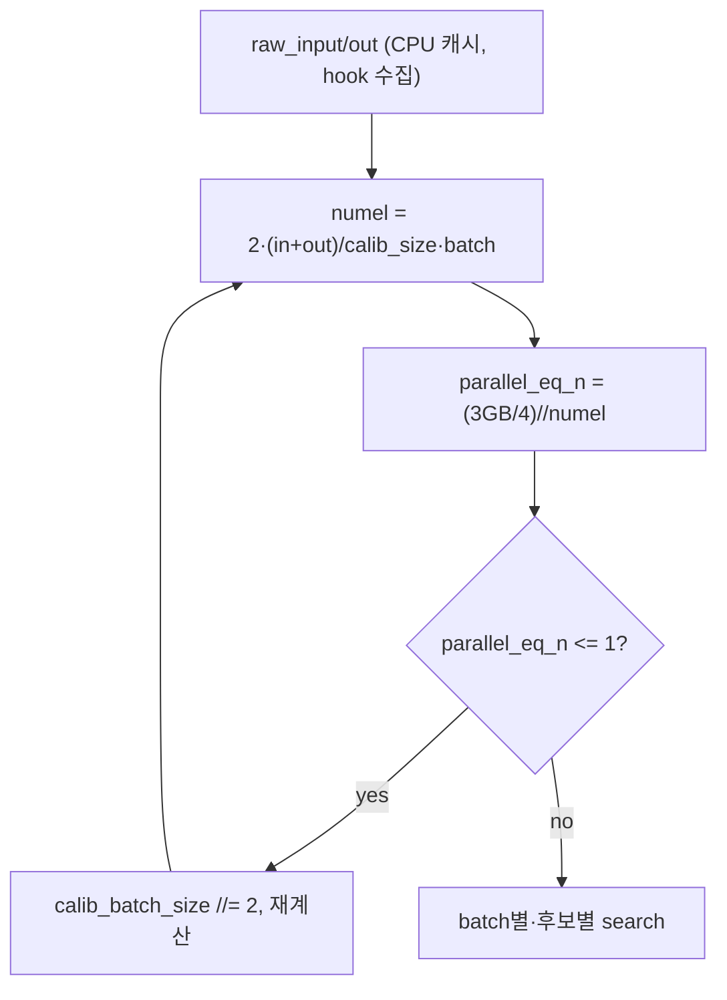
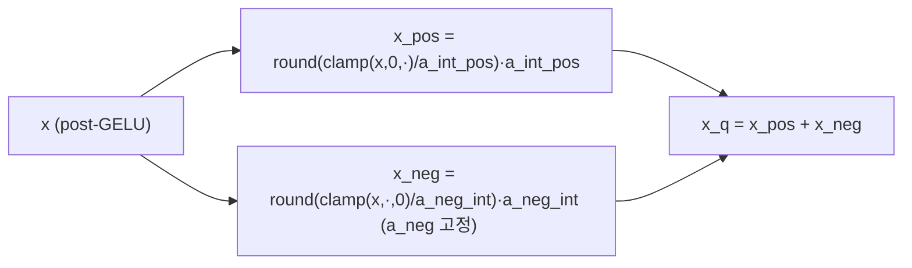
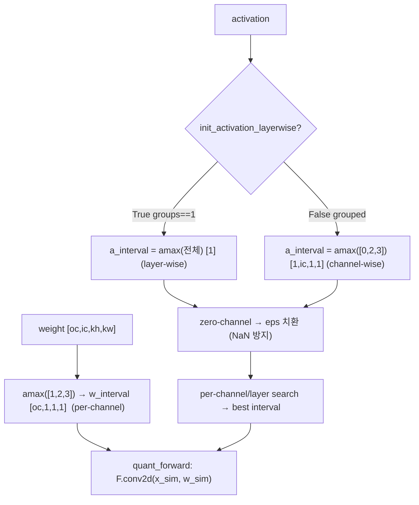
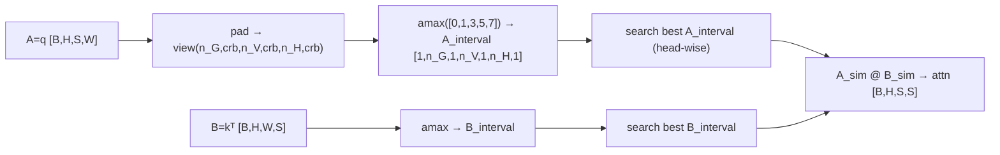
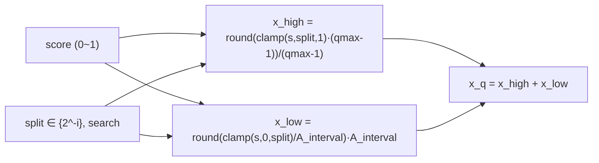
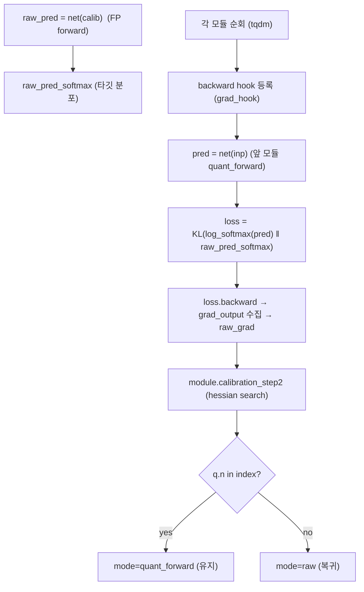
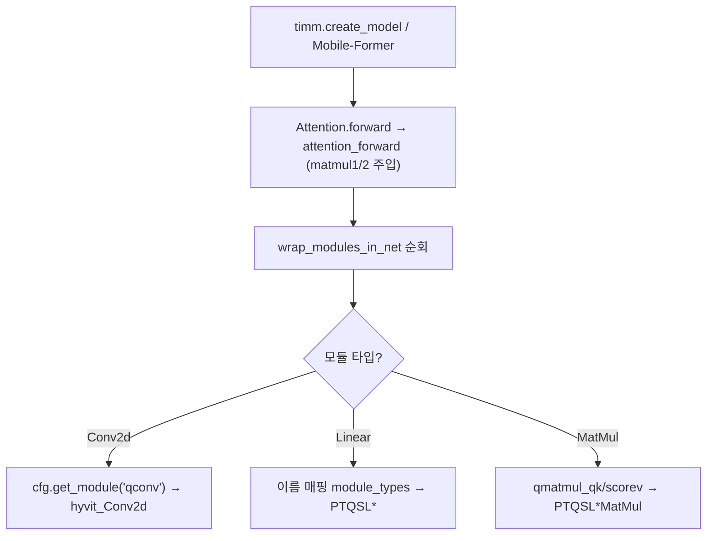
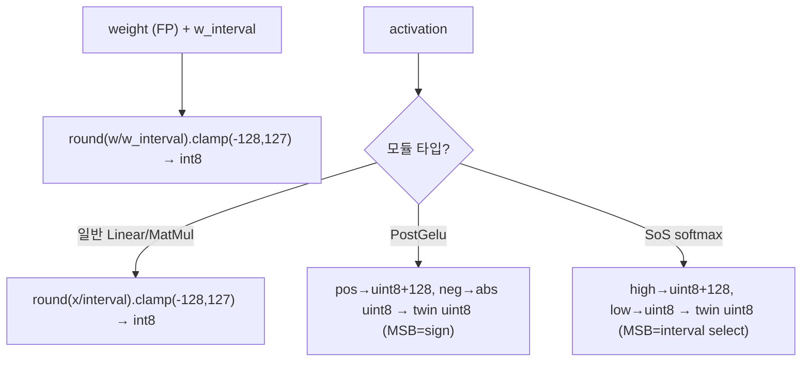

# Q-HyViT 모듈 통합 가이드 (S-PyTorch)

> 1차 요약: [`../q-hyvit.md`](../q-hyvit.md) — 본 문서는 그 요약을 모듈 단위로 심화한 통합 가이드다.
> 분석 대상: `\\wsl.localhost\ubuntu-24.04\home\user\project\PRJXR-HBTXR\REF\ViT-Quantization\q-hyvit`
> 작성 원칙: 실제 소스 Read 후 `파일:라인` 근거 표기. 라인 근거 없는 추론은 "추정", 코드로 확인 불가는 "확인 불가"로 명시.
> 형제 S-PyTorch 가이드(`REF/Analysis/ViT-Quantization/I-ViT/MODULE_GUIDE.md`)의 6요소 구조를 따르되, HW 지표(MAC lanes/scalar MACs)는 **S-PyTorch 수치 규약**(params/FLOPs/activation memory/비트폭/observer/reconstruction 비용)으로 치환한다.

---

## 0. 문서 머리말

### 0.1 대표 케이스 선정
- **대표 모델군: 하이브리드 ViT (MobileViTv1/v2, Mobile-Former, EfficientFormerV1/V2)** — CNN(Conv)+Transformer(Attention) 혼합 + 선형복잡도 attention, **<5M 소형** 포함(`README.md:4-5`). 결과표 기준 대표 모델 후보:
  1. **MobileViTv1-xxs (1.3M)**: 타 PTQ는 W8A8 36~37%로 붕괴, Q-HyViT는 **68.20%** (FP32 69.0)로 거의 무손실(`README.md:31`). 4대 도전(highly dynamic range·zero-point overflow·diverse normalization·<5M params)이 가장 극단적으로 드러나는 케이스.
  2. **Mobile-Former-26m (3.2M)**: RepQ-ViT가 0.11%로 완전 붕괴, Q-HyViT W8A8 **61.78%**(`README.md:41`). 비표준 레이어 이름(`q/k/channel_mlp/0/2`)을 가진 하이브리드 → net_wrap 확장의 필요성을 보여줌(`net_wrap.py:43`).
  3. **EfficientFormerV2-S0 (3.5M)**: PTQ4ViT W6A6 41.26 → Q-HyViT **74.18%**(`README.md:51`), 6-bit 개선폭이 큼.
- **대표 분석 단위: 하이브리드 블록** = `[CNN 경로: hyvit_Conv2d(per-channel W + 자동 layer/channel-wise A)] → [Transformer 경로: qkv(Linear) → matmul1(Q@Kᵀ) → softmax → matmul2(score@V) → proj(Linear) → MLP(fc1→GELU→fc2)]`. CNN 부분은 `conv.py::hyvit_Conv2d`, Transformer 부분은 `linear.py`+`matmul.py`가 담당하며, 두 도메인 경계가 **bridge block**(`quant_calib.py:443-448`).
- **대표 양자화 메커니즘 3종**: ① **하이브리드 입도 자동선택**(`groups==1→layer-wise, grouped→channel-wise`, `quant_calib.py:420-435`), ② **Hessian-aware search**(KL-div grad² 가중, `matmul.py:485-489`+`quant_calib.py:325,403`), ③ **Bridge Block Reconstruction**(블록 인덱스 단위 quant↔raw 토글, `quant_calib.py:443-448`). FPGA 양자화 정책의 직접 청사진.

### 0.2 S-PyTorch 수치 규약 (HW의 MAC lanes/scalar MACs 대체)
- **params**: 모듈 차원에서 분석적 계산. Linear `in·out (+out)`, Conv `Cout·Cin·Kh·Kw (+Cout)`. Q-HyViT 양자화 모듈은 nn.Linear/nn.Conv2d를 **상속**하므로(`linear.py:6`, `conv.py:9`) FP 가중치 그대로 보존, forward마다 fake-quant(`linear.py:50-51`). **params 개수는 FP 원본과 동일**(추가 학습 파라미터 없음, interval(scale)은 buffer/속성). 모델별 총 params는 README 표 인용(예: MobileViTv1-xxs 1.3M, `README.md:31`).
- **FLOPs/MACs**: 표준식×config. Linear MAC=`B·N·in·out`, Conv MAC=`B·Hout·Wout·Cout·(Cin·Kh·Kw)`, Attention QKᵀ/AV=`B·H·N²·dh`. **단 본 repo는 모델 정의를 timm/Mobile-Former에서 가져오므로**(`models.py:62-92`) 모델별 N/C/H는 백본 의존 → 본 가이드는 양자화 모듈이 부과하는 **추가 연산(search/calibration 비용)**을 중심으로 정량하고, 백본 MACs는 "백본 의존(확인 불가)"로 표기.
- **activation memory**: 텐서 shape × 비트폭. Q-HyViT는 fake-quant라 `quant_forward`는 float 복원(`linear.py:62`)이지만, **정수 도메인 비트폭**(W/A bits)을 "HW 환산 activation bit"로 표기. 실제 INT8/uint8 추출은 `integer.py`가 담당(배포 경로).
- **비트폭/observer**: 코드 직접. 기본 W8/A8(`Block4Hybrid.py:8,54,61`), bias **미양자화**(`bias_bit is None` assert, `linear.py:22`/`conv.py:28`). observer = **MinMax**(`abs().max()/(qmax-0.5)`) 초기화 후 **EasyQuant search**(eq_n=100 등분 후보 × hessian 유사도 argmax)로 interval 정밀화. running-stat/EMA 없음(PTQ, 학습 없음).
- **reconstruction 비용**: Hessian search는 calib 32장에 대해 KL-div backward(grad 수집) + interval 후보 eq_n=100 × search_round=3회 반복 forward. 모듈당 `O(eq_n × search_round × calib_batch)` 추가 forward — 본 가이드 정량의 핵심 축.
- **정확도/속도**: README/논문 인용. 본 세션 미실행 → 측정 불가 항목은 "확인 불가". latency/면적/전력 정보는 repo에 없음(시뮬레이터, `q-hyvit.md:245`).

### 0.3 운영 경로 (PTQ reconstruction ↔ ImageNet 평가)
```
[FP 사전학습 로드] get_net(name)                                  (test_qhyvit.py:106, models.py:62-92)
   │  timm: timm.create_model(pretrained=True)                    (models.py:87)
   │  Mobile-Former: model_entrypoint + load_checkpoint(.pth.tar) (models.py:89-92)
   │  Attention.forward monkey-patch → matmul1/matmul2 노출        (models.py:96-103, 10-26)
   ▼
[양자화 모듈 치환] wrap_modules_in_net(net, cfg)                   (test_qhyvit.py:107, net_wrap.py:39-82)
   │  Conv2d→hyvit_Conv2d, Linear→PTQSL*(이름 매핑), MatMul→PTQSL* (net_wrap.py:42-43,56-80)
   ▼
[calib 데이터] ViTImageNetLoaderGenerator → calib_loader(num=32)  (test_qhyvit.py:109-111, datasets.py:88-94)
   ▼
[① MinMax 초기화] HessianQuantCalibrator.quant_minmax_calib()     (test_qhyvit.py:116, quant_calib.py:217-280)
   │  hook으로 raw 수집 → _initialize_intervals (빠른 MinMax 초기값)
   ▼
[② 모드 리셋] 모든 module.mode="raw", raw_grad=None              (test_qhyvit.py:120-122)
   ▼
[③ block_list 결정] 모델별 하드코딩 bridge block 인덱스           (test_qhyvit.py:126-150)
   ▼
[④ Hessian+Hybrid+Bridge calibration]  batching_hybrid_calib(block_list)  (test_qhyvit.py:152, quant_calib.py:367-454)
   │  KL(log_softmax(pred_q) ‖ softmax(pred_fp)) backward → grad   (quant_calib.py:403-405)
   │  Conv: groups==1→layer-wise, grouped→channel-wise 자동선택    (quant_calib.py:420-435)
   │  block 인덱스∈index → quant_forward 유지, 아니면 raw 복귀     (quant_calib.py:443-448)
   ▼
[⑤ ImageNet val 평가] test_classification(net, test_loader)      (test_qhyvit.py:156, 31-50)  → Top-1
   ▼
[(별도) 정수 추출] integer.py: int8 weight / int8·uint8 activation (배포·HW 연계, integer.py:8-110)
```
- 타깃 디바이스: **CUDA GPU 전제** — interval 후보 텐서 `.cuda()`(`linear.py:258`, `conv.py:268`, `matmul.py:276`), calib 입력 `.cuda()`(`quant_calib.py:401`), 모델 `net.cuda()`(`models.py:105`). CPU 단독 실행 불가(코드 근거, 실행 실패 미검증).
- **QAT 없음**: 전 과정 무학습 PTQ, calibration 32장만 사용(`test_qhyvit.py:111`). I-ViT(QAT 수십 epoch)와 대조되는 핵심 차이.

### 0.4 모델 / 데이터셋 / 정확도 (README 인용, W8A8/W6A6)
| Model | #Params | Type | FP32 | PTQ4ViT W8A8 | RepQ-ViT W8A8 | **Ours W8A8** | **Ours W6A6** | 근거 |
|---|---|---|---|---|---|---|---|---|
| **MobileViTv1-xxs(대표)** | 1.3M | Hybrid | 69.0 | 37.75 | 1.85 | **68.20** | **66.33** | `README.md:31` |
| MobileViTv1-s | 5.6M | Hybrid | 78.4 | 68.19 | 59.01 | 77.92 | 77.18 | `README.md:33` |
| MobileViTv2-100 | 4.9M | Hybrid | 78.1 | 51.02 | 40.85 | 77.63 | 77.11 | `README.md:36` |
| **Mobile-Former-26m** | 3.2M | Hybrid | 64.0 | 58.27 | 0.11 | **61.78** | 51.06 | `README.md:41` |
| Mobile-Former-508m | 14.0M | Hybrid | 79.3 | 75.44 | 0.19 | 75.60 | 74.67 | `README.md:47` |
| EfficientFormerV1-L1 | 12.3M | MetaBlock | 80.2 | 80.11 | 80.36 | 80.15 | 77.25 | `README.md:48` |
| **EfficientFormerV2-S0** | 3.5M | Hybrid | 76.2 | 68.40 | 40.02 | **74.69** | **74.18** | `README.md:51` |
| EfficientFormerV2-L | 26.1M | Hybrid | 83.5 | 82.46 | 76.72 | 82.80 | 82.71 | `README.md:54` |
- 평균 개선: **8-bit +17.73%, 6-bit +29.75%** (기존 PTQ 대비, `README.md:5`).
- 데이터셋: **ImageNet (ILSVRC12)**, 224×224(또는 모델별 timm config), 1000 클래스(`datasets.py:204-233,338`). calibration 32장(train subset, `datasets.py:88-94`).
- 속도(latency)/면적: repo는 정확도 시뮬레이터일 뿐, 측정값 없음 → **확인 불가**(`q-hyvit.md:245`).
- 의존성: `torch==1.13.1`, `timm==0.9.2`(`README.md:9-11`). 코드 계보 **PTQ4ViT + FQ-ViT**(`README.md:68-69`).

---

## 1. Repo / Layer 개요

Q-HyViT = **하이브리드 ViT 전용 PTQ** 프레임워크. 기존 ViT PTQ(EasyQuant/FQ-ViT/PTQ4ViT/RepQ-ViT)를 CNN+Transformer 혼합 구조에 적용 시 4대 문제로 정확도가 붕괴하는 것을(`README.md:4`) ① 하이브리드 입도 자동선택 + ② Hessian search + ③ Bridge Block Reconstruction으로 해결한다. 코드 베이스는 **PTQ4ViT**(PTQSL search, SoS/PostGelu twin-uniform)와 **FQ-ViT**에서 차용(`README.md:68-69`); Q-HyViT 고유 기여는 `conv.py::hyvit_Conv2d`, `quant_calib.py::batching_hybrid_calib`, `net_wrap.py`의 hybrid 키 확장, `Block4Hybrid.py` 설정에 집중.

### 1.1 자체 소스 vs 외부 프레임워크 vs 제외
| 구분 | 파일(자체 소스) | 역할 |
|---|---|---|
| **양자화 레이어** | `quant_layers/linear.py` ★핵심 | MinMax/PTQSL/PostGelu Linear + batching 변형 (QKV/proj/MLP/classifier) |
| | `quant_layers/conv.py` ★핵심 | MinMax/Quantile/PTQSL/Channelwise Conv + **`hyvit_Conv2d`(Q-HyViT 고유)** |
| | `quant_layers/matmul.py` ★핵심 | MinMax/PTQSL/**SoS** MatMul + batching (Q@Kᵀ, score@V) |
| **calibration 엔진** | `utils/quant_calib.py` ★핵심 | QuantCalibrator/HessianQuantCalibrator + **`batching_hybrid_calib`(bridge block)** |
| **모델 치환** | `utils/net_wrap.py` | timm 모델 → quant 모듈 치환, BN fold |
| | `utils/models.py` | Attention forward monkey-patch(matmul 노출), get_net |
| **정수 추출** | `utils/integer.py` | int8 weight / int8·uint8(twin) activation 추출(배포) |
| **데이터** | `utils/datasets.py` | ImageNet/ViT 로더, calib subset |
| **설정** | `configs/Block4Hybrid.py` ★메인 | Q-HyViT 설정(hyvit_Conv2d, hessian, **SoS/PostGelu OFF**) |
| | `configs/PTQ4ViT.py` | PTQ4ViT 재현(Channelwise Conv, **SoS/PostGelu ON**) |
| | `configs/BasePTQ.py` | baseline (미열람 — 확인 불가) |
| **엔트리** | `example/test_qhyvit.py` | 메인 실험 루프, block_list 하드코딩 |

### 1.2 forward 진입점 (양자화 forward)
각 quant 모듈은 **mode 상태머신**으로 동작(`linear.py:36-47`, `conv.py:43-54`, `matmul.py:25-36`): `raw`(FP)→`calibration_step1`(raw 수집)→`calibration_step2`(interval search)→`quant_forward`(fake-quant). 모델 전체 forward는 timm 백본의 forward를 그대로 쓰되, Attention만 `attention_forward`(`models.py:10-26`)로 교체해 `q@kᵀ`→`matmul1(q,kᵀ)`, `attn@v`→`matmul2(attn,v)`로 양자화 모듈 호출.

### 1.3 제외 (지시에 따라 이름만 표기, 미분석)
- **외부 프레임워크/백본(커스텀 아님)**: `timm`(create_model, Attention, WindowAttention, resolve_data_config, create_transform), MobileViT/EfficientFormer 등 **원본 백본 정의**(timm 내부) — 가중치/구조 로드만, 양자화는 본 repo 모듈로 수행.
- **제외 디렉토리**: `utils/mobileformer/*`(외부 Mobile-Former 모델 정의·registry·체크포인트: `dna_blocks.py`, `mobile_former.py`, `registry.py`, `helpers.py`, `mobileformer_models/*.pth.tar`) — 지시상 third_party/백본 제외.
- **미열람(확인 불가)**: `configs/BasePTQ.py` 세부(cosine·a_bit=32 baseline, `q-hyvit.md:34`로 추정), `net_wrap.py::wrap_certain_modules_in_net`(부분 wrap, 메인 경로 미사용).

### 1.4 핵심 클래스 계층 (상속 트리)
```
nn.Linear ─ MinMaxQuantLinear ─ PTQSLQuantLinear ─┬─ PostGeluPTQSLQuantLinear
                                                  └─ PTQSLBatchingQuantLinear ─ PostGeluPTQSLBatchingQuantLinear
nn.Conv2d ─ MinMaxQuantConv2d ─┬─ QuantileQuantConv2d
                              └─ PTQSLQuantConv2d ─┬─ BatchingEasyQuantConv2d
                                                   ├─ ChannelwiseBatchingQuantConv2d   (PTQ4ViT 메인)
                                                   └─ hyvit_Conv2d                       (Q-HyViT 메인)
nn.Module ─ MinMaxQuantMatMul ─ PTQSLQuantMatMul ─┬─ SoSPTQSLQuantMatMul
                                                  └─ PTQSLBatchingQuantMatMul ─ SoSPTQSLBatchingQuantMatMul
```
(`linear.py:6,105,273,360,569`; `conv.py:9,94,129,283,448,659`; `matmul.py:8,73,295,401,590`)

---

## 2. 모듈: 대칭 양자화 기반 — MinMax 패밀리 (`linear.py`/`conv.py`/`matmul.py` 공통)

### 2.1 역할 + 상위/하위
- **역할**: 모든 quant 모듈의 공통 기반. **symmetric·signed·zero-point=0 fake-quant**. 정수로 round-clamp 후 다시 interval을 곱해 float 복원(정확도 시뮬레이터). I-ViT의 `SymmetricQuantFunction`에 대응하나, **autograd Function이 아니라 일반 텐서 연산**(STE 불필요 — PTQ라 backward는 KL-div용 grad만, weight grad 미사용).
- **상위**: PTQSL/Channelwise/hyvit 등 모든 파생 클래스가 `quant_weight_bias`/`quant_input`을 재정의·재사용. **하위**: torch `round_/clamp_/mul_`.

### 2.2 데이터플로우 (텐서 shape 흐름, Linear 예)


### 2.3 forward call stack
`MinMaxQuantLinear.forward`(`linear.py:36`) → mode 분기 → `quant_forward`(`:65`) → `quant_weight_bias`(`:49`) + `quant_input`(`:60`) → `F.linear`(`:69`). calibration: `calibration_step2`(`:97`)가 MinMax interval 산출 후 `_bias_correction_quant_forward`(`:80`).

### 2.4 대표 코드 위치
`linear.py`: 클래스 `:6-103`, qmax `:29-30`, quant_weight_bias `:49-58`, quant_input `:60-63`, MinMax interval `:99-100`, bias_correction `:80-88`. `conv.py`: 동형 `:9-92`(interval `:88-89`). `matmul.py`: 동형 `:8-71`(A/B interval `:67-68`).

### 2.5 대표 코드 블록
```python
# linear.py:29-30  signed symmetric 범위 (zero-point 없음)
self.w_qmax = 2**(self.w_bit-1)      # 8bit → 128 (범위 [-128, 127])
self.a_qmax = 2**(self.a_bit-1)
```
```python
# linear.py:49-63  fake-quant: round-clamp 후 interval 재곱 (float 복원)
w = (self.weight/self.w_interval).round_().clamp_(-self.w_qmax, self.w_qmax-1)
w_sim = w.mul_(self.w_interval)      # zero-point=0 대칭
...
x_sim = (x/self.a_interval).round_().clamp_(-self.a_qmax, self.a_qmax-1)
x_sim.mul_(self.a_interval)
```
```python
# linear.py:99-100  MinMax interval 초기값 (0.5 여유)
self.w_interval = (self.weight.data.abs().max()/(self.w_qmax-0.5)).detach()
self.a_interval = (x.abs().max()/(self.a_qmax-0.5)).detach()
```
→ I-ViT의 `max(|min|,max)/(2^(k-1)-1)`와 달리 분모가 `qmax-0.5=127.5` → 약간 더 보수적인 스케일(round 경계 여유). zero-point=0 동일 → HW에서 zp 가산 불필요.
```python
# linear.py:80-88  bias correction (양자화 오차 평균을 bias에서 차감)
eps = F.linear(x_sim, w_sim-self.weight.data, None)
eps = torch.mean(eps, dim=(list(range(len(eps.shape)-1))), keepdim=False)
self.bias -= eps               # systematic 오차 보정 (1회)
```

### 2.6 연산·수치표현 분해 + 정량
- **양자화 방식**: per-tensor symmetric, zp=0, signed. interval=`abs().max()/(qmax-0.5)`.
- **scale/zp**: scale=interval(스칼라), zp=0(`linear.py:50,61`).
- **비트폭**: W8/A8 기본, **bias 미양자화**(FP, `linear.py:22` assert). matmul은 A_bit/B_bit 각 8(`matmul.py:16-17`).
- **params**: 0 추가(interval은 detach된 텐서 속성, 학습 안 됨).
- **FLOPs**: 원소당 div+round+clamp+mul = O(N). bias_correction은 추가 1회 F.linear(`:84`).
- **activation bit**: fake-quant라 출력 FP32, HW 환산 A8. 실제 int8은 `integer.py:74-75`에서 추출.
- **시사**: zp=0 대칭·bias 미양자화 → FPGA에서 zp 가산 회로 불필요하나, **bias를 FP로 다뤄야 함**(누산기 정렬 시 별도 처리 필요, I-ViT의 정수 bias와 대조).

---

## 3. 모듈: 정수 Linear — Sub-Layerwise + EasyQuant search (`linear.py` PTQSLQuantLinear) ★핵심

### 3.1 역할 + 상위/하위
- **역할**: weight를 `n_V×n_H` 블록(sub-layerwise), activation을 `n_a` 그룹으로 나눠 **블록별 interval**을 둠. MinMax 초기값에서 출발해 **EasyQuant search**(후보 배율 × hessian 유사도 argmax)로 interval 정밀화. PTQ4ViT의 PTQSL 계승.
- **상위**: `PTQSLBatchingQuantLinear`(메모리 절약형, 메인 경로), `PostGeluPTQSLQuantLinear`(GELU 후 비대칭 분포). **하위**: MinMax `quant_weight_bias`/`quant_input` 오버라이드, `_get_similarity`(`:135`), `_search_best_w/a_interval`(`:182,213`).

### 3.2 데이터플로우 (텐서 shape 흐름, qkv 예: n_V=3)


### 3.3 forward call stack
`calibration_step2`(`linear.py:246`) → `_initialize_intervals`(`:238`, MinMax) → 후보 생성(`:258-259`) → `search_round`회 반복: `_search_best_w_interval`(`:182`) + `_search_best_a_interval`(`:213`) → `_bias_correction_quant_forward`(`:269`).

### 3.4 대표 코드 위치
`linear.py`: 클래스 `:105-271`, 블록 차원 `:128-130`, `_get_similarity`(metric 7종) `:135-161`, 블록별 weight 양자화 `:163-173`, n_a 그룹 입력 양자화 `:175-180`, w-search `:182-211`, a-search `:213-236`, interval 초기화 `:238-244`, 후보 생성식 `:258-259`.

### 3.5 대표 코드 블록
```python
# linear.py:128-130  sub-layerwise 블록 분할 차원
self.crb_rows = out_features // n_V    # 블록 행 크기
self.crb_cols = in_features // n_H     # 블록 열 크기
self.crb_acts = in_features // n_a     # activation 그룹 크기
```
```python
# linear.py:243-244  per-block(sub-layerwise) MinMax 초기 interval
self.w_interval = (self.weight.view(n_V,crb_rows,n_H,crb_cols).abs().amax([1,3],keepdim=True)/(w_qmax-0.5))
self.a_interval = ((x.view(*x.shape[:-1],n_a,crb_acts).abs().amax(...)/(a_qmax-0.5))).unsqueeze(-1)
```
```python
# linear.py:258-259  EasyQuant 후보: [eq_alpha, eq_beta] 구간 eq_n 등분 배율
weight_interval_candidates = torch.tensor(
    [self.eq_alpha + i*(self.eq_beta-self.eq_alpha)/self.eq_n for i in range(self.eq_n+1)]
).cuda().view(-1,1,1,1,1) * self.w_interval.unsqueeze(0)   # shape: eq_n+1, n_V,1,n_H,1
```
→ `Block4Hybrid.py:27-32`: eq_alpha=0.01, eq_beta=1.2, eq_n=100, search_round=3 → interval을 초기 MinMax의 **0.01배~1.2배 범위 101후보 × 3라운드**로 탐색.
```python
# linear.py:155-157  hessian 유사도 metric (출력 민감도 가중)
elif metric == "hessian":
    raw_grad = self.raw_grad.reshape_as(tensor_raw)
    similarity = -(raw_grad * (tensor_raw - tensor_sim)) ** 2   # -grad²·오차²
```

### 3.6 연산·수치표현 분해 + 정량
- **양자화 방식**: weight sub-layerwise(n_V×n_H 블록) symmetric, activation n_a 그룹별. **Block4Hybrid 기본 n_V=n_H=n_a=1**(`Block4Hybrid.py:31-33`) → 실질 **layer-wise**(qkv만 n_V=3, `Block4Hybrid.py:60`). zp=0.
- **scale/zp**: w_interval `[n_V,1,n_H,1]`, a_interval `[n_a,1]`, zp=0.
- **비트폭**: W8/A8, bias 미양자화.
- **params**: 0 추가(interval은 속성).
- **search 비용(reconstruction)**: 모듈당 `(eq_n+1)×search_round×n_H(w) + (eq_n+1)×search_round×n_a(a)` ≈ `101×3×1 + 101×3×1 = 606` 후보 forward(n_V는 병렬 평가). + hessian이면 KL-div backward 1회/calib batch. → **calibration 시간 지배 요인**.
- **시사**: search로 얻은 interval은 임의 float(dyadic 아님) → HW requant 시 fixed-point mult+shift 근사 필요(I-ViT의 batch_frexp dyadic과 대조, `q-hyvit.md:242`).

---

## 4. 모듈: Batching Linear — GPU 메모리 적응 calibration (`linear.py` PTQSLBatchingQuantLinear)

### 4.1 역할 + 상위/하위
- **역할**: PTQSL의 메모리 절약형. raw_input/out을 한 번에 GPU에 올리지 않고, **GPU 메모리 한도(3GB)에 맞춰 `parallel_eq_n`/`calib_batch_size` 자동 산정**. Block4Hybrid의 qkv/proj/MLP/classifier 메인 경로 모듈.
- **상위**: `Block4Hybrid.get_module`이 대부분의 qlinear에 사용(`Block4Hybrid.py:61,64,69,71`). **하위**: PTQSL search 메서드의 batched 버전 + pearson 별도 구현.

### 4.2 데이터플로우 (메모리 적응)


### 4.3 forward call stack
`batching_hybrid_calib`(`quant_calib.py:421`) → `PTQSLBatchingQuantLinear.calibration_step2`(`linear.py:548`) → `_initialize_calib_parameters`(`:376`, 메모리 산정) → `_initialize_intervals`(`:391`) → batch×후보 `_search_best_w/a_interval`(`:467,509`).

### 4.4 대표 코드 위치
`linear.py`: 클래스 `:360-567`, 메모리 산정 `:376-389`(3GB 한도 `:384`), interval 초기화 `:391-408`, hessian/pearson metric `:410-465`, batched w-search `:467-507`, batched a-search `:509-545`, calibration_step2 `:548-567`.

### 4.5 대표 코드 블록
```python
# linear.py:382-389  GPU 메모리(3GB) 기반 parallel_eq_n/batch 자동 산정
numel = (2*(self.raw_input.numel()+self.raw_out.numel())/self.calib_size*self.calib_batch_size)
self.parallel_eq_n = int((3*1024*1024*1024/4)//numel)   # 3GB / fp32(4B)
if self.parallel_eq_n <= 1:
    self.calib_need_batching = True
    self.calib_batch_size //= 2                          # OOM 회피
```
```python
# linear.py:438-451  pearson 유사도 (feature-map 전체 상관, batched 전용)
similarity = torch.cosine_similarity(tensor_raw-tensor_raw_mean,
                                     tensor_sim-tensor_sim_mean, dim=1)
```
→ batched 변형은 conv보다 작은 **3GB** 한도 사용(`linear.py:384` vs `conv.py:309` 15GB). raw 데이터를 CPU에 두고 배치로 GPU 왕복.

### 4.6 연산·수치표현 분해 + 정량
- **양자화 방식**: PTQSL과 동일(sub-layerwise + search), 단 batch 단위 누적 similarity.
- **비트폭**: W8/A8.
- **params**: 0 추가.
- **메모리**: GPU 3GB 한도 내(`:384`), 초과 시 batch 반감 반복. raw_input/out은 CPU detach 캐시(`quant_calib.py:184-185`).
- **search 비용**: PTQSL과 동형이나 `calib_size/calib_batch_size`회 외부 루프 추가 → 큰 모델에서 batch 분할만큼 forward 횟수↑.
- **시사**: HW 무관(학습/calib 인프라). 단 calib OOM 회피 로직은 **대형 하이브리드 모델 양자화 재현 시 GPU 메모리 요건**의 근거.

---

## 5. 모듈: Post-GELU twin-uniform Linear (`linear.py` PostGelu* ) — 비대칭 분포 대응

### 5.1 역할 + 상위/하위
- **역할**: GELU 직후 활성은 음수쪽으로 긴 꼬리(비대칭) → 단일 symmetric interval로는 표현 손실. **양수는 per-group interval, 음수는 고정 음수 interval로 분리(twin-uniform)** 양자화. MSB를 sign 역할로 쓰는 uint8 패킹 의도.
- **상위**: `Block4Hybrid`에서는 **OFF**(`no_postgelu=True`, `Block4Hybrid.py:6,63-64` → 일반 PTQSLBatchingQuantLinear 사용). `PTQ4ViT`에서는 **ON**(`PTQ4ViT.py:6,65-66`). **하위**: PTQSL search + 음수 interval 상수.

### 5.2 데이터플로우 (twin-uniform)


### 5.3 forward call stack
`quant_input`(`linear.py:287` / batched `:613`) → x_pos(clamp 0~qmax-1) + x_neg(clamp -qmax~0) 분리 → 합산. a_neg_interval 고정 상수(`:331,586`).

### 5.4 대표 코드 위치
`linear.py`: `PostGeluPTQSLQuantLinear` `:273-358`(quant_input `:287-296`, a_neg 상수 `:331`), `PostGeluPTQSLBatchingQuantLinear` `:569-654`(a_neg `:586`, quant_input `:613-619`).

### 5.5 대표 코드 블록
```python
# linear.py:613-619  twin-uniform: 양수/음수 분리 양자화
x_pos = (x_/(self.a_interval)).round_().clamp_(0, self.a_qmax-1).mul_(self.a_interval)
x_neg = (x_/(self.a_neg_interval)).round_().clamp_(-self.a_qmax, 0).mul_(self.a_neg_interval)
return (x_pos + x_neg).reshape_as(x)
```
```python
# linear.py:586  음수쪽 고정 interval 상수 (GELU 최소값 ≈ -0.17 근거)
self.a_neg_interval = 0.16997124254703522/self.a_qmax
```
→ GELU의 음수 하한(≈-0.17)을 고정 interval로 처리 → 음수 영역 표현을 1개 상수로 단순화. **Block4Hybrid에선 미사용**(no_postgelu=True).

### 5.6 연산·수치표현 분해 + 정량
- **양자화 방식**: twin-uniform(양수 per-group search interval + 음수 고정 `0.16997/qmax`). zp=0이나 부호별 분리.
- **비트폭**: A8(twin uint8로 추출 시 MSB=sign, `integer.py:53-54,61-67`).
- **params**: 0 추가.
- **시사(FPGA)**: 음수 고정 interval → HW에서 음수 영역 dequant를 상수 곱 1개로 처리 가능(면적↓). 단 **Block4Hybrid 메인 경로엔 OFF**라 Q-HyViT 대표 결과엔 미반영(PTQ4ViT 재현용). MSB-as-sign uint8 패킹은 정수 추출 경로에서만 사용.

---

## 6. 모듈: 정수 Conv — Channelwise + hyvit_Conv2d (`conv.py`) ★Q-HyViT 고유 핵심

### 6.1 역할 + 상위/하위
- **역할**: CNN 경로의 conv 양자화. **`hyvit_Conv2d`는 per-channel weight + activation을 layer-wise/channel-wise 자동 전환**하는 Q-HyViT 고유 클래스. `ChannelwiseBatchingQuantConv2d`(PTQ4ViT 메인)는 per-channel weight + layer-wise activation 고정.
- **상위**: `Block4Hybrid.get_module("qconv")`→hyvit_Conv2d(`Block4Hybrid.py:54`); `PTQ4ViT.get_module`→ChannelwiseBatchingQuantConv2d(`PTQ4ViT.py:54`). **하위**: PTQSL search batched + zero-channel 안전장치.

### 6.2 데이터플로우 (hyvit_Conv2d 입도 자동선택)


### 6.3 forward call stack
`batching_hybrid_calib`(`quant_calib.py:422-431`)이 `module.groups`로 분기 → `init_activation_layerwise` 설정 → `hyvit_Conv2d.calibration_step2`(`conv.py:856`) → `_initialize_intervals`(`:699`, 입도 분기 + zero-channel) → `_search_best_w_interval`(`:765`, grouped면 청크 루프) + `_search_best_a_interval`(`:810`, layer/channel 분기).

### 6.4 대표 코드 위치
`conv.py`: `ChannelwiseBatchingQuantConv2d` `:448-657`(per-channel `:472,498`, a_bit>=32 OFF `:558,647`), `hyvit_Conv2d` `:659-891`(n_V=oc `:679`, **입도 자동선택+zero-channel `:699-734`**, grouped 청크 w-search `:790-797`, layer/channel a-search 분기 `:845-851`).

### 6.5 대표 코드 블록
```python
# conv.py:704  per-channel weight interval
self.w_interval = ((self.weight.abs().amax([1,2,3],keepdim=True))/(self.w_qmax-0.5))   # [oc,1,1,1]
```
```python
# conv.py:720-728  activation 입도 자동선택 (layer-wise vs channel-wise)
if self.init_layerwise:
    a_interval_ = (x_.abs().max()/(self.a_qmax-0.5)).detach().view(1,1)
else:
    a_interval_ = ((x_.abs().amax([0,2,3], keepdim=True))/(self.w_qmax-0.5))   # 채널별
if self.init_activation_layerwise:
    self.a_interval = torch.cat(tmp_a_intervals, dim=1).amax(dim=1, keepdim=False)    # layer-wise
else:
    self.a_interval = torch.cat(tmp_a_intervals, dim=0).amax(dim=0, keepdim=True)     # channel-wise
```
```python
# conv.py:731-734  zero-channel 안전장치 (zero-point overflow / div NaN 방지)
if (self.a_interval == 0).nonzero().nelement() != 0:
    self.a_interval[torch.logical_and(self.a_interval==0, self.a_interval==0)] = torch.finfo(torch.float32).eps
```
→ README의 **"zero-point overflow / 극단적 동적범위"** 대응의 직접 코드(`README.md:4`). interval=0 채널을 eps로 치환해 `x/interval` 발산 방지. **소형 하이브리드(<5M)에서 일부 채널 활성이 0에 가까운 상황 대비.**
```python
# conv.py:845-851  search 결과도 layer-wise(스칼라) vs channel-wise(채널별) 분기
if self.init_activation_layerwise:
    a_best_index = batch_similarities.argmax(dim=0).view(1,1,1,1,1)   # 단일 best
else:
    a_best_index = batch_similarities.argmax(dim=0).view(-1)
    self.a_interval = input_interval_candidates[a_best_index,...].squeeze(dim=0)  # 채널별 best
```

### 6.6 연산·수치표현 분해 + 정량
- **양자화 방식**: weight **per-channel(out축)** symmetric `[oc,1,1,1]`; activation **자동(groups==1→layer-wise / grouped→channel-wise)**. zp=0. a_bit>=32면 activation 양자화 OFF(`conv.py:881`).
- **scale/zp**: w_interval `[oc,1,1,1]`, a_interval `[1]`(layer) 또는 `[1,ic,1,1]`(channel), zp=0.
- **비트폭**: W8/A8(`Block4Hybrid.py:54`), bias 미양자화.
- **params**: 0 추가.
- **search 비용**: per-channel weight면 채널(oc)별 best 선택 → similarity 텐서가 `[eq_n,oc]`(`conv.py:806`). grouped conv는 `parallel_eq_n` 청크를 **Python for 루프**로 conv 반복(`:793-797`) → grouped(depthwise) 레이어 calibration 병목(추정, 라인 근거 확인).
- **activation memory**: channel-wise interval은 채널 수만큼 scale 저장(`[ic]`) → layer-wise(스칼라) 대비 메모리·곱셈기↑.
- **시사(FPGA)**: `groups==1→layer-wise, grouped→channel-wise` 휴리스틱은 **레이어 타입별 scale 입도 정책**의 직접 참고. depthwise(grouped) conv는 채널별 동적범위가 커서 per-channel scale 필요 vs 일반 conv는 layer-wise로 면적 절감 — Q-HyViT의 핵심 HW 친화 인사이트.

---

## 7. 모듈: 정수 행렬곱 — head-wise PTQSL MatMul (`matmul.py` PTQSLBatchingQuantMatMul) ★Attention 핵심

### 7.1 역할 + 상위/하위
- **역할**: Attention의 `Q@Kᵀ`(matmul1)와 `score@V`(matmul2)를 정수 양자화. **head-wise**(`n_G_A=heads`)로 head별 독립 scale, A/B 입력을 `n_G×n_V×n_H` 블록 padding 후 각각 search.
- **상위**: `Block4Hybrid.get_module("qmatmul_qk"/"qmatmul_scorev")` 양쪽 모두 PTQSLBatchingQuantMatMul(`Block4Hybrid.py:75,78` — **no_softmax=True라 scorev도 SoS 아닌 일반 matmul**). **하위**: padding(`_get_padding_parameters` `:422`), A/B-search(`:495,536`).

### 7.2 데이터플로우 (텐서 shape 흐름, Q@Kᵀ)


### 7.3 forward call stack
`attention_forward`(`models.py:16`) → `MatMul`→치환된 `PTQSLBatchingQuantMatMul.forward`(`matmul.py:25`) → `quant_forward`(`:151`) → `quant_input_A`(`:135`)/`quant_input_B`(`:143`) → `A_sim@B_sim`(`:155`). calibration: `calibration_step2`(`:577`) → `_get_padding_parameters`(`:422`, n_G_A=heads) → A/B-search.

### 7.4 대표 코드 위치
`matmul.py`: 기반 `MinMaxQuantMatMul` `:8-71`, `PTQSLQuantMatMul`(padding/블록) `:73-293`, `PTQSLBatchingQuantMatMul`(head-wise) `:401-588`(메모리 3GB `:415`, **head-wise n_G `:422-428`**, A/B interval 초기화 `:430-451`, A-search `:495-534`, B-search `:536-575`).

### 7.5 대표 코드 블록
```python
# matmul.py:422-428  head-wise 양자화 (n_G = head 수)
def _get_padding_parameters(self, A, B):
    self.n_G_A = A.shape[1]    # = num_heads
    self.n_G_B = B.shape[1]
    super()._get_padding_parameters(A,B)
```
```python
# matmul.py:135-141  블록 padding 후 양자화 (A 입력)
x = F.pad(x, [0,pad_cols_A,0,pad_rows_A,0,pad_groups_A])
x = x.view(-1,n_G_A,crb_groups_A,n_V_A,crb_rows_A,n_H_A,crb_cols_A)
x = (x/self.A_interval).round_().clamp(-A_qmax,A_qmax-1).mul_(self.A_interval)
```
```python
# matmul.py:485-489  hessian metric (Attention 출력 민감도 가중)
elif metric == "hessian":
    raw_grad = raw_grad.reshape_as(tensor_raw)
    similarity = -(raw_grad * (tensor_raw - tensor_sim)) ** 2
```

### 7.6 연산·수치표현 분해 + 정량
- **양자화 방식**: A/B 각각 symmetric, head-wise(n_G=heads) + 블록(Block4Hybrid 기본 n_V=n_H=1 → head-wise만). zp=0. dyadic 없음 — A_sim@B_sim 후 직접 사용(fake-quant, 재양자화 없음).
- **scale/zp**: A_interval/B_interval `[1,n_G,1,n_V,1,n_H,1]`, zp=0.
- **비트폭**: A8/B8(`Block4Hybrid.py:13-14`).
- **params**: 0.
- **search 비용**: A·B 각 `(eq_n+1)×search_round×n_V×n_H` 후보 + batch 루프 + hessian backward.
- **activation memory**: attn 행렬 `[B,H,S,S]`가 N²로 최대(백본 의존). softmax 후 score도 동일.
- **시사**: head-wise scale → FPGA에서 head별 scale 저장/곱셈기 필요(면적 vs 정확도). N² attn 텐서가 메모리 지배 → 타일링·on-chip 재사용 핵심(HG-PIPE류 파이프라인 압박점).

---

## 8. 모듈: Split-of-Softmax (SoS) MatMul (`matmul.py` SoS*) ★softmax 비대칭 + 부호비트 제거

### 8.1 역할 + 상위/하위
- **역할**: softmax 출력(score)은 (0,1) 구간에 극단 편향 → 단일 uniform 불가. **split 기준 high/low 두 영역으로 나눠 각각 uniform**(twin-uniform for softmax). score@V의 A(=score) 입력 전용. 주석: **"with proper hardware implementation, we don't need to use a sign bit anymore"**(`matmul.py:307,601`) → 양수 전용 unsigned 의도.
- **상위**: `PTQ4ViT.get_module`이 scorev에 사용(`PTQ4ViT.py:5,80` no_softmax=False). **Block4Hybrid에선 OFF**(`Block4Hybrid.py:5,77-78` → 일반 matmul). **하위**: split 후보 search(`2^-i`).

### 8.2 데이터플로우 (twin-uniform softmax)


### 8.3 forward call stack
`quant_input_A`(`matmul.py:324` / batched `:607`) → high/low 분리. calibration: `_search_best_A_interval`(`:329` / `:612`)가 split 후보(`2^-i`, `:380,648`) search로 최적 split 선택.

### 8.4 대표 코드 위치
`matmul.py`: `SoSPTQSLQuantMatMul` `:295-399`(주석 `:307`, quant_input_A `:324-327`, split search `:329-355`, split 후보 `:380`), `SoSPTQSLBatchingQuantMatMul` `:590-656`(부호비트 제거 주석 `:601`, quant_input_A `:607-610`, split 후보 `:648`).

### 8.5 대표 코드 블록
```python
# matmul.py:607-610  SoS twin-uniform: high(큰값)/low(작은값) 분리 양자화
x_high = (x.clamp(self.split, 1)*(self.A_qmax-1)).round_().clamp_(0,self.A_qmax-1)/(self.A_qmax-1)
x_low  = (x.clamp(0, self.split)/self.A_interval).round_().clamp_(0,self.A_qmax-1)*self.A_interval
return x_high + x_low
```
```python
# matmul.py:648  split 후보: 2^(-i), i=0..19 (power-of-two)
A_split_candidates = torch.tensor([2**(-i) for i in range(20)]).cuda()
```
→ split을 2의 거듭제곱으로 제한 → HW에서 split 경계 비교를 시프트로 처리 가능. high/low 모두 `clamp(0, qmax-1)` → **양수 전용 unsigned 8bit**(부호비트 불필요, `:601`).

### 8.6 연산·수치표현 분해 + 정량
- **양자화 방식**: twin-uniform(high: split~1 균등 / low: 0~split 균등), 양수 전용. split=2^-i search. zp=0(unsigned).
- **비트폭**: A8(unsigned, uint8 추출 시 MSB=region select, `integer.py:51-52,85-96`).
- **params**: 0.
- **시사(FPGA)**: ① **부호비트 제거** → softmax 출력 회로에서 sign 처리 절감(`:601`). ② split 2-region → region 판정 비교기 1개 + scale mux 2개 필요(비용 vs 정확도 트레이드오프). ③ **Block4Hybrid 메인엔 OFF** → Q-HyViT 대표 결과는 일반 matmul 사용, SoS는 PTQ4ViT 재현용. uint8 패킹(MSB=interval select)은 정수 추출 경로 전용.

---

## 9. 모듈: Hessian Calibration 엔진 (`quant_calib.py` HessianQuantCalibrator) ★핵심

### 9.1 역할 + 상위/하위
- **역할**: PTQ calibration 오케스트레이터. hook으로 raw 입출력 수집, **KL-div(pred_q ‖ pred_fp) backward로 출력 grad 수집** → hessian metric에 공급. 모듈을 순서대로 순회하며 calibration_step2 실행.
- **상위**: `test_qhyvit.py:113`이 인스턴스화. **하위**: 각 quant 모듈의 `_initialize_intervals`/`calibration_step2`, `grad_hook`(`:173`).

### 9.2 데이터플로우 (Hessian PTQ)


### 9.3 forward call stack
`quant_minmax_calib`(`:217`, MinMax 초기화) → `batching_hybrid_calib`(`:367`): raw_pred(`:377-379`) → 모듈별 grad_hook(`:391`) → KL backward(`:403-405`) → groups 분기 calibration_step2(`:420-435`) → bridge 토글(`:443-448`).

### 9.4 대표 코드 위치
`quant_calib.py`: `quant_minmax_calib` `:217-280`, `quant_calib`(원본 hessian) `:283-365`, **`batching_hybrid_calib` `:367-454`**, `batching_quant_calib`(hybrid 없는 버전) `:456-545`, `grad_hook` `:173-177`, forward hooks `:179-202`.

### 9.5 대표 코드 블록
```python
# quant_calib.py:403-405  KL-div loss → backward로 출력 grad 수집 (hessian용)
loss = F.kl_div(F.log_softmax(pred, dim=-1),
                raw_pred_softmax[batch_st:batch_st+self.batch_size], reduction="batchmean")
cu_loss += loss                       # loss surface 측정(디버그)
loss.backward(retain_graph=True)
```
```python
# quant_calib.py:420-435  hybrid 입도 자동선택 (Conv groups 기반) ★Q-HyViT 핵심
if isinstance(module, MinMaxQuantConv2d):
    if module.groups == 1:
        module.init_activation_layerwise = True      # 일반 conv → layer-wise
        module.calibration_step2()
    else:
        module.init_activation_layerwise = False     # grouped/depthwise → channel-wise
        module.calibration_step2()
```
```python
# quant_calib.py:443-448  Bridge Block (v2): 인덱스 단위 quant↔raw 토글
if q.n in index:                      # block_list에 포함된 모듈 인덱스
    module.mode = "quant_forward"     # 양자화 영향 유지(누적)
else:
    module.mode = "raw"               # FP로 복귀(영향 격리)
```
→ tqdm 카운터 `q.n`을 모듈 인덱스로 사용해 `block_list`(`test_qhyvit.py:126-150`) 멤버만 양자화 유지. **블록 단위로 양자화 영향을 순차 누적·재구성** → "Bridge Block Reconstruction"의 코드 실체.

### 9.6 연산·수치표현 분해 + 정량
- **양자화 방식**: PTQ. hessian metric = `-Σ(∂L/∂out)²·(out_raw-out_sim)²`, L=KL(`:403`, `matmul.py:485-489`).
- **observer**: MinMax 초기화(`quant_minmax_calib`) → EasyQuant search로 정밀화. running-stat/EMA 없음.
- **reconstruction 비용(정량)**: 모듈 M개 × [calib 32장 forward + KL backward 1회 + calibration_step2(eq_n=100×search_round=3 후보 forward)]. → **모듈당 ~300+ forward** → 대형 하이브리드(M 수십~백+)에서 calibration이 분~십수분(추정, latency 미측정 → "확인 불가"). `cu_loss/8.0`(`:409`)은 디버그용 loss surface 출력.
- **시사**: ① 출력 민감도(grad) 기반 가중 → **어느 레이어를 정밀 scale로 둘지** 결정하는 HW 자원 배분 정책 응용. ② bridge block 토글 = **점진적 양자화 영향 분석** → 어느 블록이 정확도에 치명적인지 식별(HW 정밀도 우선순위 근거). ③ **확인 불가**: bridge block의 정확한 reconstruction objective(블록 경계 loss 형태)는 코드상 index 토글 + cumulative KL까지만, 정확한 수식은 `q-hyvit-paper.pdf` 의존(`q-hyvit.md:185`).

---

## 10. 모듈: 모델 치환 + Attention 노출 (`net_wrap.py` + `models.py`)

### 10.1 역할 + 상위/하위
- **역할**: ① `models.py`가 timm/Mobile-Former 백본 로드 + Attention.forward를 monkey-patch해 matmul을 양자화 가능 모듈로 노출. ② `net_wrap.py`가 nn.Conv2d/Linear/MatMul을 이름 기반으로 quant 모듈로 치환 + BN fold.
- **상위**: `test_qhyvit.py:106-107`. **하위**: `cfg.get_module`(configs), `MatMul`.

### 10.2 데이터플로우 (치환 흐름)


### 10.3 forward call stack
`get_net`(`models.py:62`) → `timm.create_model`(`:87`) 또는 Mobile-Former(`:89-92`) → Attention/WindowAttention에 `MatMul()`+forward 교체(`:96-103`). `wrap_modules_in_net`(`net_wrap.py:39`) → named_modules 순회 → 타입별 `cfg.get_module`(`:59,68,77`) → setattr 치환(`:64,73,80`).

### 10.4 대표 코드 위치
`models.py`: `attention_forward` `:10-26`(matmul1 `:16`, matmul2 `:22`), `window_attention_forward` `:28-56`, `MatMul` `:58-60`, `get_net` `:62-107`. `net_wrap.py`: 이름 매핑 `:42-43`, 치환 루프 `:45-81`, BN fold `:8-36`.

### 10.5 대표 코드 블록
```python
# models.py:16,22  Attention의 행렬곱을 양자화 모듈로 노출 (monkey-patch)
attn = self.matmul1(q, k.transpose(-2, -1)) * self.scale      # Q@Kᵀ
...
x = self.matmul2(attn, v).transpose(1, 2).reshape(B, N, C)    # score@V
```
```python
# net_wrap.py:42-43  모듈 이름 → quant 타입 매핑 (하이브리드 키 확장)
module_types = {"qkv":"qlinear_qkv", "proj":'qlinear_proj', 'fc1':'qlinear_MLP_1', 'fc2':"qlinear_MLP_2",
    'head':'qlinear_classifier', 'matmul1':"qmatmul_qk", 'matmul2':"qmatmul_scorev", "reduction":"qlinear_reduction",
    '0':'qlinear_feature_hyper','2':'qlinear_feature_hyper','q':'qlinear_feature_hyper',
    'channel_mlp':'qlinear_feature_hyper','k':'qlinear_feature_hyper', '1':'qlinear_classifier'}
```
→ `0/2/q/k/channel_mlp/reduction` 키는 **Mobile-Former/MobileViT의 비표준 레이어 이름** 대응(Q-HyViT 확장, `q-hyvit.md:102`). 표준 ViT엔 없는 하이브리드 전용.
```python
# net_wrap.py:8-28  BN fold (추론 시 BN 제거, CNN 양자화 친화)
weight = w * (bn_module.weight / safe_std).view(w_view)
beta = bn_module.bias - bn_module.weight * y_mean / safe_std
```

### 10.6 연산·수치표현 분해 + 정량
- **양자화 방식**: 치환 인프라(양자화 자체는 §2~8 모듈). BN fold는 `W·γ/σ`, `bias = β - γ·μ/σ`(`:15-16`).
- **params**: BN fold 후 BN 파라미터(2·C)는 conv에 흡수 → 추론 params 소폭 감소(BN 제거). 양자화는 params 불변.
- **시사**: BN fold = **FPGA에서 BN 별도 연산 제거**(conv에 흡수) → CNN 경로 양자화 전처리. monkey-patch로 matmul 노출 = 양자화를 위한 모델 계측(instrumentation) 패턴.

---

## 11. 모듈: 정수 추출 (배포용) — `integer.py` ★FPGA 데이터 패킹 직결

### 11.1 역할 + 상위/하위
- **역할**: calibrated 모델에서 **실제 INT8/uint8 텐서를 추출**. weight는 int8, activation은 pre-forward hook으로 int8(일반)/uint8(twin) 추출. fake-quant 시뮬레이터를 넘어 배포·HW 연계의 출발점.
- **상위**: 별도 배포 스크립트(메인 test 경로엔 미연결, 수동 호출). **하위**: 각 모듈의 interval/qmax/split.

### 11.2 데이터플로우 (twin 패킹)


### 11.3 forward call stack
`get_model_int_weight`(`integer.py:113`) → `quantize_int_weight`(`:8`). activation: `quantize_int_activation`(`:44`, pre-forward hook) → 모듈 타입 분기(PostGelu `:56`, 일반 Linear `:70`, SoS `:79`, 일반 MatMul `:98`).

### 11.4 대표 코드 위치
`integer.py`: `quantize_int_weight`(int8 `:14-17`), `quantize_matmul_input`(padding 고려 `:27-41`), `quantize_int_activation`(twin/int8 분기 `:44-110`), `get_model_int_weight` `:113-129`.

### 11.5 대표 코드 블록
```python
# integer.py:14-17  weight int8 추출 (w_bit==8 강제)
assert module.w_bit == 8
w_int = (module.weight/module.w_interval).round_().clamp_(-module.w_qmax, module.w_qmax-1)
w_int = w_int.cpu().detach().to(torch.int8)
```
```python
# integer.py:61-67  PostGelu twin uint8 (MSB = sign 역할)
int_input_pos = (x/module.a_interval).round_().clamp_(0, module.a_qmax-1).to(torch.uint8) + 128  # 양수 [128,255]
int_input_neg = (x/module.a_neg_interval).round_().clamp_(-module.a_qmax+1, 0).abs().to(torch.uint8)  # 음수 [0,127]
int_input = (int_input_pos + int_input_neg).cpu()      # MSB=1 양수 / MSB=0 음수
```
```python
# integer.py:85-96  SoS softmax twin uint8 (MSB = interval select)
A_high = (A.clamp(split,1)*(A_qmax-1)).round_().clamp_(0,A_qmax-1).to(torch.uint8) + 128   # 큰 interval
A_low  = (A.clamp(0,split)/A_interval).round_().clamp_(0,A_qmax-1).to(torch.uint8)         # 작은 interval
A_int = (A_high + A_low).cpu()
```

### 11.6 연산·수치표현 분해 + 정량
- **양자화 방식**: weight int8 / activation int8(일반) 또는 uint8(twin, MSB=sign 또는 interval select).
- **비트폭**: 8bit 강제(`integer.py:14,57,71,80-81,99-100` assert).
- **params**: 0(추출 함수).
- **시사(FPGA)**: ① **int8 weight + twin-uint8 패킹이 HW 데이터 레이아웃의 직접 출발점**. ② MSB를 sign/interval-select로 쓰는 패킹(`:53-54,61-67,85-96`)은 HW LUT/mux 설계와 1:1 — region 판정을 MSB 1비트로 환원. ③ 단 bias는 미추출(FP) → HW에서 bias 정렬 별도 설계 필요.

---

## N+1. 모듈 한눈 요약 표

| 모듈 | 파일:라인 | 역할 | 양자화 방식 | 대표 정량/특이점 |
|---|---|---|---|---|
| MinMax 기반 | linear.py:6-103 / conv.py:9-92 / matmul.py:8-71 | symmetric fake-quant 공통 기반 | per-tensor 대칭, zp=0, interval=max/(qmax-0.5) | bias 미양자화, params 0추가 |
| PTQSLQuantLinear | linear.py:105-271 | sub-layerwise + EasyQuant search | n_V×n_H 블록, n_a 그룹, hessian | 후보 eq_n=100×round3 |
| PTQSLBatchingLinear | linear.py:360-567 | GPU메모리 적응 calibration | PTQSL + 3GB batch 산정 | Block4Hybrid 메인 qlinear |
| PostGelu* Linear | linear.py:273-358,569-654 | GELU후 twin-uniform(양/음 분리) | 양수 search + 음수 고정 0.16997/qmax | **Block4Hybrid OFF**(PTQ4ViT만) |
| ChannelwiseConv2d | conv.py:448-657 | per-ch W + layer-wise A | per-channel weight | PTQ4ViT 메인 qconv |
| **hyvit_Conv2d** | conv.py:659-891 | **per-ch W + A 입도 자동선택** | groups기반 layer/channel + zero-ch eps | **Q-HyViT 고유**, zero-point overflow 대응 |
| PTQSLBatchingMatMul | matmul.py:401-588 | Q@Kᵀ/score@V head-wise | n_G=heads, A/B 블록 search | Block4Hybrid 메인 qmatmul |
| **SoS MatMul** | matmul.py:295-399,590-656 | softmax twin-uniform | high/low split=2^-i, **부호비트 제거** | **Block4Hybrid OFF**(PTQ4ViT만) |
| HessianCalibrator | quant_calib.py:204-545 | Hessian PTQ + hybrid + bridge | KL grad² 가중 search | **batching_hybrid_calib 핵심** |
| net_wrap/models | net_wrap.py:39-82 / models.py:62-107 | 모델 치환 + Attention 노출 | BN fold, 이름 매핑 | 하이브리드 키 확장 |
| integer | integer.py:8-129 | int8/uint8 실제 추출 | int8 W, twin-uint8 A(MSB=sign/select) | FPGA 패킹 출발점 |

---

## N+2. 평가 파이프라인 + 재현 명령

- **엔트리**: `example/test_qhyvit.py::experiment_basic`(`:100-157`).
- **단계**(`test_qhyvit.py`):
  1. config 로드(`init_config`, `:89-97`) — 기본 `Block4Hybrid`(`:177`).
  2. `get_net(net)`(`:106`) — timm/Mobile-Former + MatMul 주입.
  3. `wrap_modules_in_net`(`:107`) — quant 모듈 치환.
  4. calib_loader = ImageNet 32장(`:111`, `datasets.py:88-94`).
  5. `HessianQuantCalibrator(sequential=False, batch_size=4)`(`:113`).
  6. `quant_minmax_calib()`(`:116`) — MinMax 초기값.
  7. 모든 모듈 mode="raw", raw_grad=None 리셋(`:120-122`).
  8. 모델별 `block_list` 결정(`:126-150`, 하드코딩).
  9. **`batching_hybrid_calib(block_list)`**(`:152`) — hybrid+hessian+bridge.
  10. `test_classification`(`:156,31-50`) — ImageNet val Top-1.
- **재현 명령**(`README.md:24`):
  ```bash
  python example/test_qhyvit.py [path to imagenet]
  ```
  - 멀티프로세스(다중 GPU): `--multiprocess --n_gpu 6`(`test_qhyvit.py:25-26,71-86,188`).
  - 대상 모델 전체 리스트: MobileViTv1/v2, EfficientFormerV1/V2, Mobile-Former 23종(`:163-175`).
- **block_list 예시**(`test_qhyvit.py:126-150`): efficientformer_l1→[26,27,28], mobilevit_s→[17,18,36,37,67,68], mobile_former_*→[13,14,...,128,129](24개). **모델별 수작업 하드코딩** → 신규 모델 적용 시 수동 지정 필요(한계).
- **데이터셋**: ImageNet val(`datasets.py:230-233`), test_transform = Resize256+CenterCrop224(또는 timm config, `datasets.py:216-221,338-340`).
- **정확도**: README 표 인용(§0.4). **속도/latency/면적 측정값 없음 → 확인 불가**.
- **의존성**: torch 1.13.1, timm 0.9.2(`README.md:9-11`). **CUDA 필수**(0.3절 cuda 하드코딩 근거).
- **주의**: ① **Block4Hybrid는 SoS·PostGelu OFF**(`Block4Hybrid.py:5-6`) → Q-HyViT 대표 결과는 hyvit_Conv2d(hybrid 입도) + hessian + bridge가 핵심, twin-uniform은 PTQ4ViT 재현용(`PTQ4ViT.py:5-6`). ② 코드 내 다수 `#jemin` 주석(`conv.py:715,864`)·주석처리 실험 코드 → 연구 프로토타입 성격.

---

## N+3. 우리 프로젝트(FPGA ViT 가속) 시사점 + FPGA 친화도

### N+3.1 하이브리드 입도 자동선택 = 레이어별 scale 입도 정책 (최우선 시사)
- `hyvit_Conv2d` + `batching_hybrid_calib`의 **`groups==1→layer-wise, grouped→channel-wise`**(`quant_calib.py:420-435`, `conv.py:720-728`)는 FPGA에서 **레이어 타입별 scale 입도 정책**의 직접 청사진. depthwise(grouped) conv는 채널별 동적범위가 커서 per-channel scale 필요(면적↑), 일반 conv는 layer-wise(단일 scale, 면적↓). 소형 하이브리드(<5M)에서 정확도-면적 균형의 핵심.
- **zero-channel eps 안전장치**(`conv.py:731-734`): interval=0 채널을 eps로 치환 → HW에서 0-scale로 인한 div-by-zero/overflow를 **scale 하한 클램프**로 방지하는 설계 근거(README "zero-point overflow" 대응).

### N+3.2 정수 추출 + twin 패킹 = HW 데이터 레이아웃 직접 출발점
- `integer.py`의 **int8 weight + twin-uint8 activation**(MSB=sign 또는 interval-select, `:53-54,61-67,85-96`)은 FPGA 정수 데이터 패킹의 출발점. region 판정을 MSB 1비트로 환원 → LUT/mux 비용 최소화.
- **SoS 부호비트 제거**(`matmul.py:601` "we don't need to use a sign bit"): softmax 출력은 항상 0~1 양수 → unsigned 8bit → sign 처리 회로 절감. 단 twin split(high/low)은 region 비교기 + scale mux 2개 필요(비용 vs 정확도).

### N+3.3 Hessian-aware = HW 정밀도 자원 배분 정책
- KL grad² 가중 metric(`matmul.py:485-489`, `quant_calib.py:403`)으로 **출력 민감도 기반 양자화** → 우리 가속기에서 "어느 레이어/블록을 더 높은 비트·정밀 scale로 둘지" 결정하는 자원 배분 정책에 응용.
- **Bridge Block 토글**(`quant_calib.py:443-448`): 블록 단위 quant↔raw로 양자화 영향을 점진 분석 → 정확도에 치명적인 블록 식별 → HW 정밀도 우선순위 근거.

### N+3.4 Dyadic/shift 양자화 관점 갭 (HW 친화도 한계)
- 본 repo의 scale은 **임의 float interval**(search 결과, dyadic 아님) → FPGA requant 시 fixed-point mult+shift 근사 또는 FP 곱 필요. I-ViT의 `batch_frexp` dyadic(`(z·m)>>e`)이나 RepQ-ViT의 log2/dyadic이 HW에 더 친화적. **Q-HyViT의 정확도 우위(특히 소형 하이브리드) + RepQ/I-ViT의 dyadic scale을 혼합**하는 방향이 유망(추정, `q-hyvit.md:242`).
- **bias 미양자화**(FP, `linear.py:22`/`conv.py:28`): I-ViT의 정수 bias(누산기 직접 가산)와 대조 → HW에서 bias를 FP로 다루거나 별도 정수화 설계 필요.

### N+3.5 FPGA 친화도 평가
| 항목 | 평가 | 근거 |
|---|---|---|
| 정수전용(integer-only) | ★ fake-quant 시뮬레이터(float 복원), 실제 정수 파이프 별도 | `linear.py:62`(×interval 복원), 정수추출은 integer.py만 |
| scale 입도 적응성 | ★★★ layer/channel 자동 + zero-ch 안전 | `conv.py:720-734`, `quant_calib.py:420-435` |
| 비선형(softmax/GELU) HW화 | ★★ twin-uniform·SoS 있으나 **Block4Hybrid OFF** | `matmul.py:295-399`, `Block4Hybrid.py:5-6` |
| 부호비트 절감 | ★★ softmax unsigned, twin uint8 | `matmul.py:601`, `integer.py:85-96` |
| 재양자화(dyadic) | ☆ 임의 float interval(dyadic 아님) | search 결과 `linear.py:258` |
| bias 처리 | ☆ 미양자화(FP) | `linear.py:22` assert |
| 저비트(W6A6) | ★★ README W6A6 결과 우수(소형 하이브리드) | `README.md:31-54`(W6A6 컬럼) |
| calibration 비용 | △ PTQ(QAT 불필요)지만 hessian search 무거움 | `quant_calib.py:403`(backward), eq_n×round3 |

### N+3.6 XR 시선추적 적용 (프로젝트 성격은 추정)
- 시선추적 백본은 보통 **경량 CNN/하이브리드**(<5M) → Q-HyViT 타깃(MobileViT/Mobile-Former/EfficientFormerV2 <5M)과 정확히 겹침(`README.md:31-51`). 소형 모델 PTQ 정확도 유지 노하우(**zero-channel 안전장치, 하이브리드 입도, hessian 가중**)가 직접 이식 가치.
- **PTQ(무학습)** 장점: I-ViT QAT(수십 epoch) 대비 calibration 32장만 → XR 백본 빠른 양자화 반복에 유리. 단 search 비용·임의 float scale의 HW 비친화는 dyadic 보강 필요.
- **주의**: 본 repo는 정확도 시뮬레이터 — latency/throughput/면적 정보 없음 → HW 성능은 별도 합성·구현 검증 필요(확인 불가).

---

## 부록. 근거 / 확인 불가

- **직접 코드 확인**: §2~§11 전 라인 인용 — `linear.py`(전체), `conv.py`(전체), `matmul.py`(전체), `quant_calib.py`(전체), `net_wrap.py`(전체), `models.py`(전체), `integer.py`(전체), `datasets.py`(로더 부분), `configs/Block4Hybrid.py`·`PTQ4ViT.py`(전체), `test_qhyvit.py`(전체). README(결과표·의존성·재현).
- **분석적 산출(검증 가능)**: 클래스 상속 트리, 양자화 식(round-clamp-mul), search 후보식, 입도 분기 조건, twin-uniform 분리, int 추출 패킹 — 모두 코드 직접. 모델별 params는 README 표 인용.
- **추정**: ① grouped conv calibration의 Python for 루프 병목(`conv.py:793-797` 라인 근거 확인, 실측 미검증), ② Q-HyViT + RepQ/I-ViT dyadic 혼합 유망성, ③ XR 시선추적 백본과의 타깃 일치(README 모델군 기반 합리적 추론), ④ calibration latency(모듈수×forward 횟수 기반 정성 추정).
- **확인 불가(미열람/미실행)**: ① Bridge Block의 정확한 reconstruction objective 수식(코드는 index 토글 + cumulative KL까지만, `quant_calib.py:443-448`; 정확한 정의는 `q-hyvit-paper.pdf` 의존), ② `configs/BasePTQ.py` 세부, ③ 실제 FPGA latency/면적/전력(repo에 정보 없음), ④ 정수 파이프라인 end-to-end 동작(시뮬레이터 + integer.py 추출까지만), ⑤ Mobile-Former 백본 내부(`utils/mobileformer/*` 제외), ⑥ 본 세션 미실행이라 모든 정확도/속도는 README 인용값.
