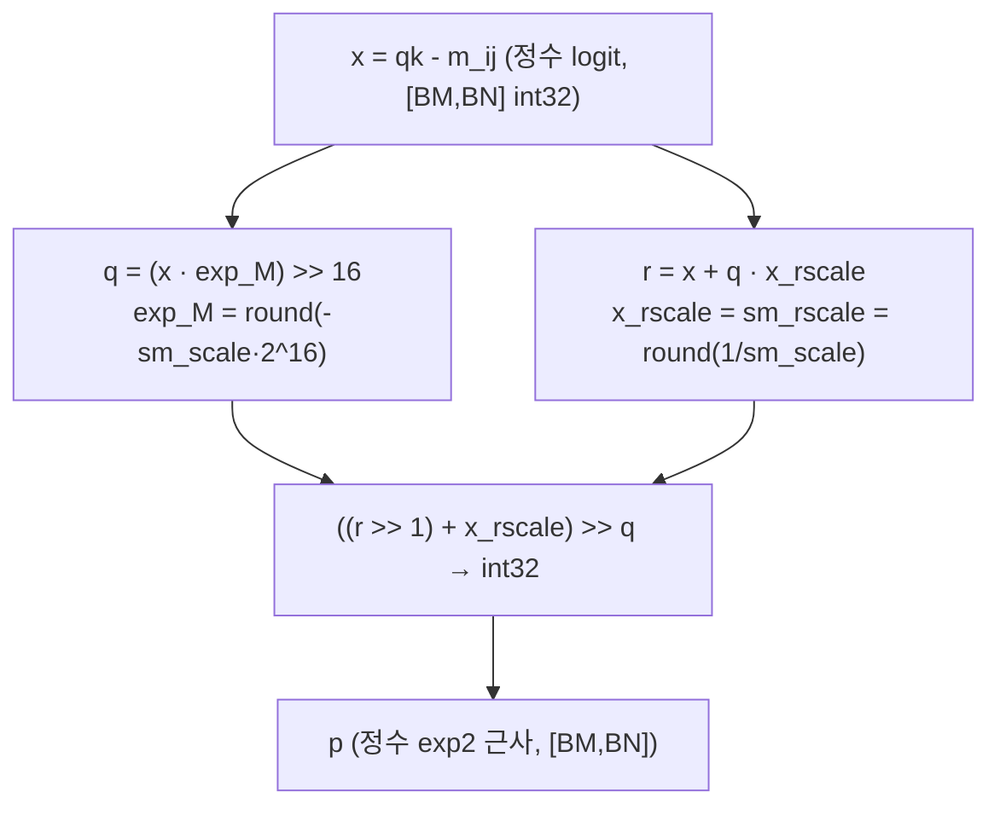
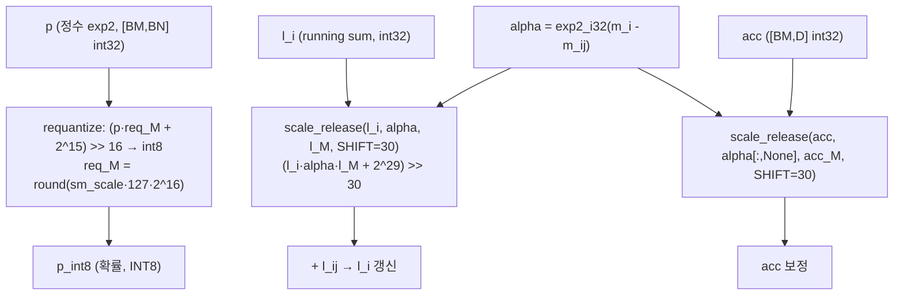
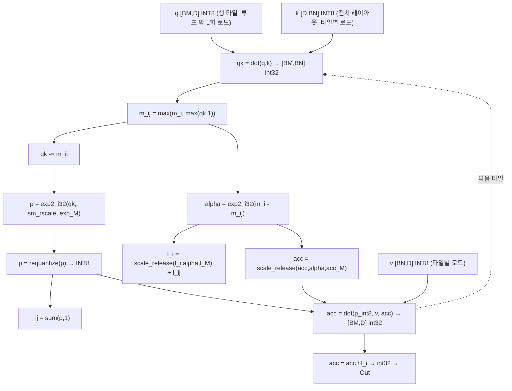
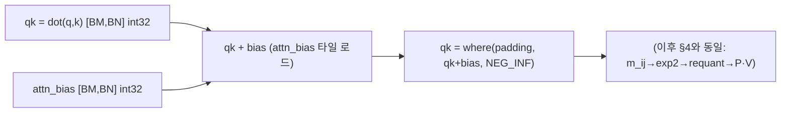
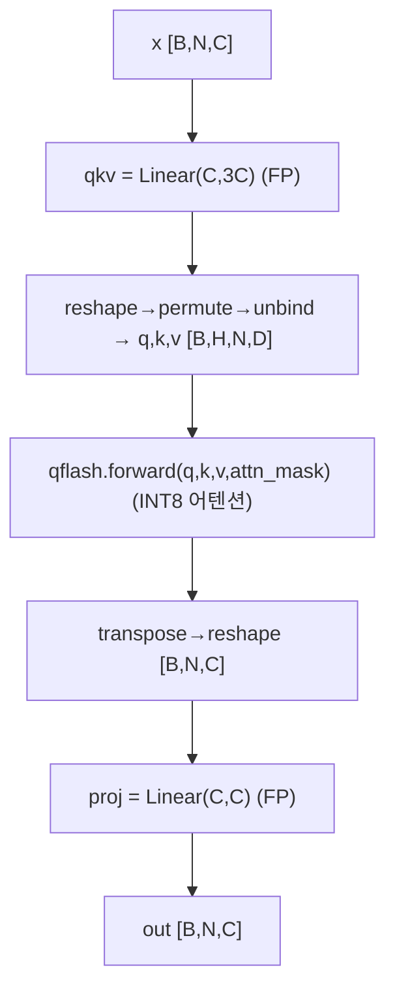
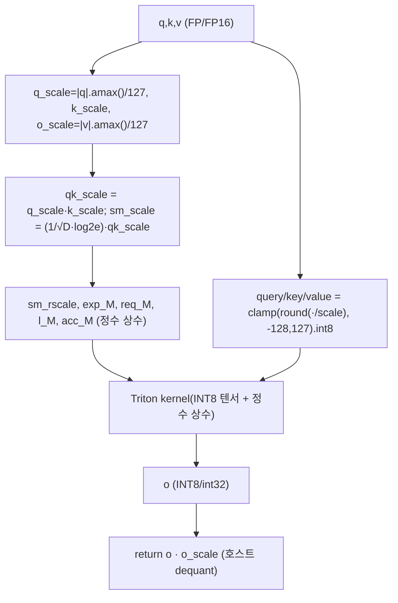
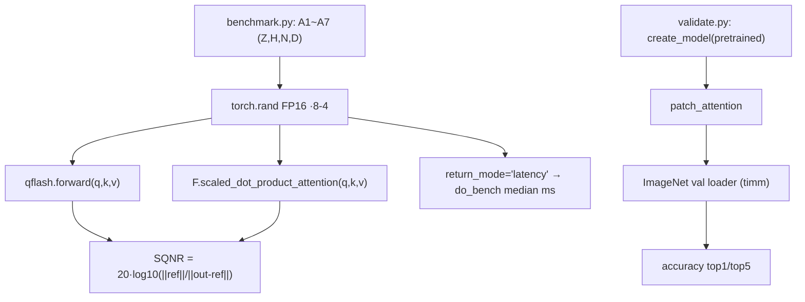

# QFlash 모듈 통합 가이드 (S-PyTorch)

> 1차 요약: [`../qflash.md`](../qflash.md) — 본 문서는 그 요약을 모듈 단위로 심화한 통합 가이드다.
> 분석 대상: `\\wsl.localhost\ubuntu-24.04\home\user\project\PRJXR-HBTXR\REF\ViT-Quantization\qflash`
> 작성 원칙: 실제 소스 Read 후 `파일:라인` 근거 표기. 라인 근거 없는 추론은 "추정", 코드로 확인 불가는 "확인 불가"로 명시.
> 형제 가이드 `REF/Analysis/ViT-Quantization/I-ViT/MODULE_GUIDE.md`의 6요소 구조(역할·데이터플로우·call stack·코드위치·코드블록·정량)와 동형이되, 본 repo는 **Triton 커널 + PTQ(training-free) 어텐션-only 정수화**라 모듈 수가 적다(소형 repo).
> HW 지표(MAC lanes/scalar MACs)는 **S-PyTorch 수치 규약**(params/FLOPs/activation memory/비트폭/scale/online softmax/타일)으로 치환한다.

---

## 0. 문서 머리말

### 0.1 대표 케이스 선정
- **대표 워크로드: `A2 ViT-S` (Z=1, H=6, N=197, D=64)** — `benchmark.py:8`. 근거:
  1. 벤치마크 SQNR 기준값이 `A2 (ViT/DeiT) = 32.50 dB`로 ViT/DeiT 계열 대표 수치로 README 표에 명시(`README.md:29`).
  2. N=197(=14×14 패치 + cls), D=64는 ViT-S/DeiT-S 공통 어텐션 형상(`benchmark.py:8-9`, `validate.py:20-21`)이라 어텐션 정수화의 비자명 분석 단위.
- **대표 분석 단위: `qflash.forward` 1회** = `[호스트 per-tensor INT8 양자화] → [Triton qflash_kernel: 타일별 online softmax(정수 exp2 + 고정소수점 rescale + INT8×INT8→INT32 dot)] → [호스트 V-스케일 dequant]` (`kernel.py:275-351`). 한 어텐션 헤드 그룹(Z·H개 program)이 N_CTX를 BLOCK_N 타일로 순회.
- **대표 정수 비선형 1종**: **`exp2_i32`**(`kernel.py:40-59`) — softmax 지수를 부동소수 없이 정수 곱+우시프트로 근사. FPGA softmax HW화의 직접 청사진. (I-ViT가 IntGELU/IntSoftmax/IntLayerNorm 3종을 가졌던 것과 달리, qflash는 **어텐션-only**라 비선형이 softmax exp 1종으로 집약됨 — 코드 확인.)

### 0.2 S-PyTorch 수치 규약 (HW의 MAC lanes/scalar MACs 대체)
- **params**: qflash 커널 자체는 학습 파라미터 0(순수 함수, `kernel.py:275-351`). 래퍼 `QAttention`은 `qkv`/`proj` Linear를 **FP 그대로 보유**(`attention.py:17-18`)하며 어텐션 내부 행렬곱만 INT8로 치환 → params 개수는 timm 원본과 동일(`from_orig`가 state_dict 그대로 로드, `attention.py:35`). 즉 가중치(Linear GEMM)는 비양자화, **QK^T·softmax·P·V만 정수**.
- **FLOPs/MACs**: 어텐션 내부 표준식. QK^T = `Z·H·N²·D`, P·V = `Z·H·N²·D`(`kernel.py:153,171`). 대표 A2(Z=1,H=6,N=197,D=64)로 산출. qkv/proj Linear MAC은 래퍼(`attention.py:17-26`)이며 FP라 본선 정수 MAC에서 제외.
- **activation memory**: 텐서 shape × 비트폭. Q/K/V/Out은 모두 **INT8**(1 byte, `kernel.py:309-312`), 어텐션 점수 `qk`/`p`는 커널 내부 레지스터(BLOCK_M×BLOCK_N 타일)로만 존재 → FlashAttention 특성상 N² 행렬을 HBM에 materialize하지 않음(`kernel.py:147-174` 루프 내 타일 단위).
- **비트폭/observer**: 코드 직접. **per-tensor symmetric INT8**(`q_scale = |q|.amax()/127`, `kernel.py:294-296`), 누산 **INT32**(`tl.dot(..., out_dtype=tl.int32)`, `kernel.py:153,171`), online softmax 상태 m_i/l_i/acc 모두 **INT32**(`kernel.py:138-140`). 고정소수점 상수 `SHIFT=16`(`kernel.py:301`), rescale 경로 `L_SHIFT=ACC_SHIFT=30`(`kernel.py:35-36`). zero-point=0 대칭(곱셈기-free 친화). **observer 없음** — 매 forward 동적 amax(PTQ, calibration 데이터셋 불요).
- **online softmax/타일**: 타일 `BLOCK_M`(query 행) × `BLOCK_N`(key/value 열) — autotune 또는 default 32×32(`kernel.py:12-27`). running max `m_i`, running sum `l_i`(초기값 1로 0-나눗셈 회피, `kernel.py:139`), running acc `acc`(`kernel.py:140`)를 타일마다 `alpha`로 보정(`kernel.py:158-171`).
- **정확도/속도**: README/논문 인용. 본 세션 미실행 → 측정 불가 항목은 "확인 불가".

### 0.3 운영 경로 (사전학습 로드 ↔ in-place 패칭 ↔ 평가/벤치)
```
[FP 사전학습 timm 모델 로드] create_model(name, pretrained=True)      (validate.py:57)
   │  ViT/DeiT/Swin 7종 (validate.py:17-25)
   ▼
[어텐션-only in-place 정수 패칭] patch_attention(model)               (validate.py:58, attention.py:89-108)
   │  timm Attention → QAttention, swin WindowAttention → QWindowAttention
   │  from_orig: state_dict 그대로 로드(가중치 FP 유지)               (attention.py:28-36,77-86)
   ▼
[추론] model(input) → QAttention.forward → qflash.forward (PTQ, 동적 amax)
   │  매 forward 입력 텐서의 amax로 per-tensor INT8 스케일 산출        (kernel.py:294-311)
   ▼
[평가] validate.py: ImageNet val Top-1/Top-5                          (validate.py:101-117)
[벤치] benchmark.py: SQNR vs F.scaled_dot_product_attention + 지연     (benchmark.py:23-34)
```
- 타깃 디바이스: **Triton/CUDA GPU 전제** — 벤치 입력 `device='cuda'`(`benchmark.py:24`), 양자화 상수 release path가 Triton JIT 커널(`kernel.py:85-86,183-184`). NVIDIA RTX 5090, CUDA 12.8, PyTorch 2.7.1 검증(`README.md:14`). → CPU/FPGA 직접 실행 코드 없음(확인 불가).
- **학습 불필요**: QAT/calibration 경로 없음. PTQ training-free(`attention.py:89-108`이 가중치 재학습 없이 패칭만).

### 0.4 모델 / 데이터셋 / 정확도 (README 인용)
| Model | FP32 | QFlash | Diff | timm name | 근거 |
|---|---|---|---|---|---|
| ViT-S | 81.38 | **82.24** | +0.86 | vit_small_patch16_224.augreg_in21k_ft_in1k | `README.md:47`, `validate.py:18` |
| ViT-B | 85.10 | **86.84** | +1.74 | vit_base_patch16_224.augreg2_in21k_ft_in1k | `README.md:48`, `validate.py:19` |
| DeiT-T | 72.21 | **71.70** | -0.51 | deit_tiny_patch16_224.fb_in1k | `README.md:49`, `validate.py:20` |
| **DeiT-S(대표급)** | **79.85** | **79.46** | **-0.39** | deit_small_patch16_224.fb_in1k | `README.md:50`, `validate.py:21` |
| DeiT-B | 81.85 | **81.59** | -0.26 | deit_base_patch16_224.fb_in1k | `README.md:51`, `validate.py:22` |
| Swin-T | 81.35 | **80.06** | -1.29 | swin_tiny_patch4_window7_224.ms_in1k | `README.md:52`, `validate.py:23` |
| Swin-S | 83.20 | **81.86** | -1.34 | swin_small_patch4_window7_224.ms_in1k | `README.md:53`, `validate.py:24` |
- **SQNR**: A2(ViT/DeiT) **32.50 dB**, A7(Swin) **31.02 dB** (`README.md:29-30`). 벤치는 FP16 임의입력 vs `F.scaled_dot_product_attention` 비교(`benchmark.py:24-28`).
- 데이터셋: **ImageNet-1k val** `~/dataset/imagenet` 기본(`validate.py:27`), 224×224(timm data_config, `validate.py:64`).
- 속도(latency): 벤치 `do_bench` median(ms)으로 측정 가능하나(`kernel.py:348-349`), 본 세션 **미실행 → 확인 불가**. README는 `docs/benchmark.png` 이미지로만 제시(`README.md:34`, 수치 텍스트 없음).

---

## 1. Repo / Layer 개요

QFlash = Vision Transformer 어텐션을 **정수(INT8) 전용 FlashAttention 커널**로 가속하되 FlashAttention의 메모리 효율(타일링 + online softmax)을 유지하는 Triton 구현(`README.md:1-6`). IJCAI-ECAI 2026 공식 구현. 본 repo는 **Triton 커널 + nn.Module 래퍼**가 자체 소스이고, ImageNet 평가 파이프라인(DataLoader·accuracy·모델 생성)은 timm 컴포넌트를 그대로 임포트한다(`validate.py:11-15`).

### 1.1 자체 소스 vs 외부 프레임워크 vs 제외

| 구분 | 파일(자체 소스) | 역할 |
|---|---|---|
| **정수 FlashAttention 커널** | `qflash/kernel.py` ★핵심 | exp2_i32(정수 지수), requantize, scale_release, qflash_kernel / qflash_masked_kernel(Triton), qflash_forward(호스트 양자화·dequant) |
| **nn.Module 래퍼** | `qflash/attention.py` | QAttention/QWindowAttention(timm 대체), patch_attention(in-place 패칭) |
| **공개 API** | `qflash/__init__.py` | qflash, QAttention, QWindowAttention, patch_attention 노출 |
| **커널 벤치** | `benchmark.py` | A1~A7 워크로드 SQNR + batch∈{1,8} 지연 |
| **정확도 평가** | `validate.py` | timm 7모델 패칭 후 ImageNet Top-1/5 |
| **빌드** | `pyproject.toml` | torch>=2.7.1, timm 의존, Apache-2.0 |

### 1.2 forward 진입점
`QAttention.forward`(`attention.py:20-26`): `qkv = self.qkv(x)`(FP Linear) → reshape/permute로 `(q,k,v)` 분리(`:23-24`) → **`qflash.forward(q,k,v,attn_mask)`**(`:25`, 정수 어텐션) → `self.proj`(FP Linear, `:26`). `qflash.forward` = `qflash_forward`(`kernel.py:275-351, 356`): 호스트에서 amax→INT8 양자화 + 고정소수점 상수화 → grid 구성 → Triton 커널 launch → `o * o_scale` dequant 반환.

### 1.3 제외 (지시에 따라 미분석)
- **외부 프레임워크(커스텀 아님)**: `timm.layers.{to_2tuple,trunc_normal_,attention.Attention}`, `timm.models.swin_transformer.{WindowAttention,get_relative_position_index}`(`attention.py:6-7,90-91`), `timm.data.*`, `timm.models.create_model`, `timm.utils.{accuracy,AverageMeter,setup_default_logging}`(`validate.py:11-13`). timm **사전학습 체크포인트**(가중치만 로드, 코드는 본 repo 정의 사용, `attention.py:35`).
- **런타임 동봉**: `triton`(torch에 동봉, `kernel.py:5-6`), `torch.nn.functional.scaled_dot_product_attention`(벤치 레퍼런스, `benchmark.py:27`).
- **제외 디렉토리**: `.git/`(분석 제외), `docs/benchmark.png`(바이너리 이미지 — 수치 텍스트 부재로 latency 확인 불가).
- **미존재(확인 불가)**: ONNX/TFLite/TRT 익스포트, per-channel/percentile observer, QAT/calibration 경로, Linear GEMM 양자화 — repo에 코드 없음.

### 1.4 대표 워크로드 구성 (A1~A7)
`benchmark.py:6-14`: ViT-T/S/B(Z=1, H∈{3,6,12}, N=197, D=64) + Swin-1~4(Z∈{64,16,4,1}, H∈{3,6,12,24}, N=49, D=32). ViT 계열은 마스크 없는 `qflash_kernel`, Swin window/relative-position-bias 계열은 마스크 있는 `qflash_masked_kernel` 사용(`attention.py:68-74`, `kernel.py:317-346`).

---

## 2. 모듈: 정수 지수함수 — `kernel.py` (exp2_i32) ★정수 비선형, FPGA 1순위

### 2.1 역할 + 상위/하위
- **역할**: softmax의 `exp(x)`를 **부동소수 없이** 정수 곱+우시프트로 근사. `exp(x)=2^(x·log2e)`이므로 호스트가 log2e를 스케일에 미리 흡수(`kernel.py:292`)하고, 커널은 2의 거듭제곱을 우시프트로 구현. online softmax 분자(`p`)와 블록 보정계수(`alpha`)를 모두 이 함수로 산출.
- **상위**: `qflash_kernel`(`kernel.py:160,163`), `qflash_masked_kernel`(`:257,260`). **하위**: 없음(시프트·정수곱만).

### 2.2 데이터플로우 (텐서 shape 흐름, BLOCK_M×BLOCK_N 타일)


### 2.3 forward call stack
`qflash_kernel`(`kernel.py:160`) → `exp2_i32(qk, sm_rscale, exp_M, USE_SHIFT=EXP_USE_SHIFT)`(`:54-59`) → (USE_SHIFT) `exp2_i32_shift`(`:41-44`) / (else) `exp2_i32_idiv`(`:48-51`). `alpha` 산출도 동일 함수(`:163`).

### 2.4 대표 코드 위치
`kernel.py`: `exp2_i32_shift` `:41-44`, `exp2_i32_idiv` `:48-51`, 디스패처 `exp2_i32` `:55-59`. 호스트 상수 산출 `:292,302-303`.

### 2.5 대표 코드 블록

```python
# kernel.py:41-44  정수 지수: 지수부 q(시프트) + 나머지 r 보정
@triton.jit
def exp2_i32_shift(x, x_rscale, exp_M, SHIFT: tl.constexpr = 16):
    q = ((x * exp_M) >> SHIFT).to(tl.int32)      # 2의 지수부 (정수 시프트량)
    r = (x + q * x_rscale).to(tl.int32)          # 소수부 보정 (나머지)
    return (((r >> 1) + x_rscale) >> q).to(tl.int32)   # 2^(-q) 우시프트 = 정수 exp2
```
→ `q`는 시프트량, 최종 `>> q`가 **2의 거듭제곱 나눗셈 = barrel shift**. 곱셈은 `x*exp_M`, `q*x_rscale` 2회뿐, 나머지는 시프트·가감산 → DSP-최소 비선형.

```python
# kernel.py:292,302-303  호스트: log2e 흡수 + 고정소수점 상수화
scale = scale * LOG2E                          # LOG2E=1.44269504 (exp→exp2 변환)
sm_rscale = int(round(1.0 / sm_scale))         # 역스케일 (x_rscale)
exp_M = int(round(-sm_scale * (1 << SHIFT)))   # -sm_scale·2^16 (지수부 곱수)
```
→ 부동소수 `sm_scale`를 정수 `exp_M`/`sm_rscale`로 사전계산해 커널에 상수로 주입. 커널 내부엔 FP 없음.

```python
# kernel.py:48-51  대안 경로: 시프트 대신 정수 나눗셈 (USE_SHIFT=False)
def exp2_i32_idiv(x, x_rscale):
    q = ((-x) // x_rscale).to(tl.int32)
    r = (x + q * x_rscale).to(tl.int32)
    return (((r >> 1) + x_rscale) >> q).to(tl.int32)
```
→ 환경변수 `QFLASH_EXP_USE_SHIFT=0`이면 idiv 경로(`kernel.py:32,160`). HW에서 시프트 vs 나눗셈 트레이드오프 비교용.

### 2.6 연산·수치표현 분해 + 정량 (A2: Z=1,H=6,N=197,D=64)
- **양자화 방식**: 정수 exp2 근사. 입력 `x = qk - m_ij`(int32 logit), 출력 정수 exp2(int32). zero-point 무관(차감 후 음수 logit).
- **scale/zp**: exp_M(=`-sm_scale·2^16`), sm_rscale(=`1/sm_scale`) 호스트 상수. SHIFT=16.
- **비트폭**: 입력/출력 int32, 곱수 16bit 시프트. log2e 흡수로 exp→2^x.
- **params**: 0 (순수 JIT 함수).
- **FLOPs**: 원소당 mul 2 + shift 3 + add 2 ≈ 7 op. softmax 분자 호출은 타일 [BM,BN] 전 원소, 전 타일 합산 시 N² 원소(=197²=38.8K/head) × H=6 ≈ **233K 원소 × ~7 op ≈ 1.6M op/이미지**(추정, 원소연산 카운트 기반). `alpha` 호출은 [BM] 행벡터 추가.
- **시사**: log2e를 스케일에 흡수→exp를 `>> q`로 처리하는 패턴이 **FPGA softmax의 barrel shifter + 소형 상수 곱셈기** 설계 청사진(I-ViT `int_exp_shift`와 동일 사상, 다만 qflash는 시프트량 q를 직접 산출).

---

## 3. 모듈: 재양자화/스케일 릴리스 — `kernel.py` (requantize + scale_release) ★고정소수점

### 3.1 역할 + 상위/하위
- **역할**: (a) `requantize` — 정수 exp2 결과 `p`(확률 분자)를 **INT8로 재양자화**(라운딩 후 int8), P·V dot의 입력으로. (b) `scale_release` — online softmax의 running sum `l_i`·acc를 이전 블록 보정계수 `alpha`로 곱·시프트 보정. 모든 dequant·rescale를 **고정소수점 정수 상수 곱 + 산술 우시프트**로 처리(FP 나눗셈 회피).
- **상위**: `qflash_kernel`(`:161,164,165`), `qflash_masked_kernel`(`:258,261,262`). **하위**: 없음.

### 3.2 데이터플로우 (텐서 shape 흐름)


### 3.3 forward call stack
`qflash_kernel` 메인 루프(`kernel.py:160-165`): `p = exp2_i32(...)` → `p = requantize(p, req_M)`(`:161`) → `l_i = scale_release(l_i, alpha, sm_rscale, l_M, SHIFT=L_SHIFT, ...)`(`:164`) → `acc = scale_release(acc, alpha[:,None], sm_rscale, acc_M, SHIFT=ACC_SHIFT, ...)`(`:165`).

### 3.4 대표 코드 위치
`kernel.py`: `requantize` `:62-64`, `scale_release_shift` `:67-69`, `scale_release_idiv` `:72-74`, 디스패처 `scale_release` `:77-82`. 호스트 상수 `req_M`/`l_M`/`acc_M` `:304-307`.

### 3.5 대표 코드 블록

```python
# kernel.py:62-64  확률 p를 INT8로 재양자화 (라운딩 후 클램프 없이 int8 캐스트)
@triton.jit
def requantize(x, req_M, SHIFT: tl.constexpr = 16):
    return ((x * req_M + (1 << (SHIFT - 1))) >> SHIFT).to(tl.int8)
# req_M = round(sm_scale·127·2^16)  (kernel.py:304)
```
→ `+2^15` 더해 round-half-up, `>>16`으로 고정소수점 나눗셈. INT8 P를 만들어 다음 `tl.dot(p, v)`의 INT8 입력으로(`kernel.py:170-171`).

```python
# kernel.py:67-69  running sum/acc를 alpha로 보정 (int64 누산 → int32)
@triton.jit
def scale_release_shift(x, alpha, M, SHIFT: tl.constexpr = 16):
    return ((x.to(tl.int64) * alpha * M + (1 << (SHIFT - 1))) >> SHIFT).to(tl.int32)
# l_M  = round(2^30 / sm_rscale),  acc_M = round(2^30 / sm_rscale)  (kernel.py:306-307)
```
→ `x·alpha·M`을 int64로 누산(오버플로 방지) 후 `>>30` 시프트. **L_SHIFT=ACC_SHIFT=30**(`kernel.py:35-36`)으로 sum/acc는 정밀도 30bit, p 재양자화는 16bit로 비트폭 분리.

```python
# kernel.py:72-74  대안: 정수 나눗셈 경로 (USE_SHIFT=False)
def scale_release_idiv(x, alpha, sm_rscale):
    return ((x * alpha) // sm_rscale).to(tl.int32)
```
→ 환경변수 `QFLASH_L_USE_SHIFT`/`QFLASH_ACC_USE_SHIFT`로 토글(`kernel.py:33-34,164-165`). 시프트 vs idiv HW 비교용.

### 3.6 연산·수치표현 분해 + 정량
- **양자화 방식**: 고정소수점 곱·시프트. `requantize`는 SHIFT=16(req_M 흡수), `scale_release`는 SHIFT=30(l_M/acc_M 흡수). zero-point=0.
- **비트폭**: requantize 입력 int32 → 출력 **INT8**; scale_release 입력 int32 → int64 누산 → 출력 int32. 가수 req_M/l_M/acc_M는 호스트 round 정수.
- **params**: 0.
- **FLOPs**: requantize 원소당 mul 1 + add 1 + shift 1; scale_release 원소당 mul 2 + add 1 + shift 1. 타일 [BM,BN]/[BM,D] 단위 반복.
- **시사**: 누적기 보정을 곱·시프트로 한 점은 FPGA 파이프라인 **rescale 스테이지 비트폭(SHIFT=30) 결정**의 직접 근거. I-ViT의 dyadic `(z·m)>>e`(`fixedpoint_mul`)와 동일 사상이나, qflash는 e를 컴파일타임 상수(SHIFT)로 고정 → HW에서 시프트량 가변 불필요(단순화).

---

## 4. 모듈: 정수 FlashAttention 메인 커널 — `kernel.py` (qflash_kernel) ★핵심

### 4.1 역할 + 상위/하위
- **역할**: 타일링 + online softmax로 어텐션 전 구간(QK^T → softmax → P·V)을 **정수 도메인**에서 수행. Q/K/V/Out 모두 INT8, 누산 INT32. N² 점수 행렬을 HBM에 쓰지 않고 BLOCK_N 타일 순회로 처리(FlashAttention 메모리 효율).
- **상위**: `qflash_forward`(`kernel.py:319`). **하위**: `exp2_i32`(§2), `requantize`/`scale_release`(§3), `tl.dot`(INT8 MAC).

### 4.2 데이터플로우 (텐서 shape 흐름, A2: H=6,N=197,D=64, 타일 32×32)


### 4.3 forward call stack
`qflash_forward`(`kernel.py:319`) → `qflash_kernel[grid](...)`(`:319-326`) → 블록포인터 구성(`:114-133`) → online 상태 초기화(`:135-140`) → q 1회 로드(`:142-145`) → **메인 루프** `for start_n in range(0, N_CTX, BLOCK_N)`(`:147-174`) → 종료 정규화(`:176-180`).

### 4.4 대표 코드 위치
`kernel.py`: 데코레이터/시그니처 `:85-104`, `static_assert(BLOCK_N<=HEAD_DIM)` `:105`, K 전치 블록포인터 `:124-128`, 상태 초기화 `:135-140`, 메인 루프 `:147-174`, 종료 `:176-180`.

### 4.5 대표 코드 블록

```python
# kernel.py:135-140  online softmax 상태 (전부 int32, l_i 초기값 1)
NEG_INF = -(1 << 20)
m_i = tl.zeros([BLOCK_M], dtype=tl.int32) + NEG_INF   # running max
l_i = tl.zeros([BLOCK_M], dtype=tl.int32) + 1         # running sum (0 아닌 1 → 0-나눗셈 회피)
acc = tl.zeros([BLOCK_M, HEAD_DIM], dtype=tl.int32)   # running 누적기
```
→ `l_i=1` 초기화가 마지막 `acc / l_i`(`:176`)의 0-나눗셈 안정화. NEG_INF=-2^20는 마스크/패딩 logit 하한.

```python
# kernel.py:153-171  메인 루프: INT8×INT8→INT32 MAC + 정수 online softmax
qk = tl.dot(q, k, out_dtype=tl.int32)                 # QK^T (INT8 MAC → INT32)
...
m_ij = tl.maximum(m_i, tl.max(qk, 1))                 # online max 안정화
qk -= m_ij[:, None]
p = exp2_i32(qk, sm_rscale, exp_M, USE_SHIFT=EXP_USE_SHIFT)   # 정수 exp2 (softmax 분자)
p = requantize(p, req_M)                              # p → INT8
l_ij = tl.sum(p, 1)                                   # 블록 확률 합
alpha = exp2_i32(m_i - m_ij, sm_rscale, exp_M, ...)   # 이전 블록 보정계수
l_i = scale_release(l_i, alpha, sm_rscale, l_M, SHIFT=L_SHIFT, ...) + l_ij
acc = scale_release(acc, alpha[:, None], sm_rscale, acc_M, SHIFT=ACC_SHIFT, ...)
p = p.to(tl.int8)
acc = tl.dot(p, v, acc, out_dtype=tl.int32)           # P·V (INT8 MAC → INT32 누적)
```
→ 표준 FlashAttention online softmax를 **전부 정수**로 매핑: max-subtraction(안정), exp2(분자), alpha(이전블록 보정), P·V dot 누적.

```python
# kernel.py:124-128  K를 (HEAD_DIM, N_CTX) 전치 레이아웃으로 로드 (QK^T를 dot 직행)
K_block_ptr = tl.make_block_ptr(
    base=K + qvk_offset, shape=(HEAD_DIM, N_CTX),
    strides=(stride_kk, stride_kn), offsets=(0, 0),
    block_shape=(HEAD_DIM, BLOCK_N), order=(0, 1))
# kernel.py:176-180  종료: 정수 나눗셈 정규화 후 저장
acc = (acc / l_i[:, None]).to(tl.int32)
tl.store(O_block_ptr, acc.to(Out.type.element_ty), ...)
```
→ K 전치로 `dot(q,k)`가 곧 QK^T. 최종 softmax 정규화는 `acc/l_i` 정수 나눗셈 1회(분모 reciprocal 대신 직접 나눗셈).

### 4.6 연산·수치표현 분해 + 정량 (A2: Z=1,H=6,N=197,D=64)
- **양자화 방식**: Q/K/V/Out INT8(per-tensor 대칭), QK^T·P·V 누산 INT32, online softmax 상태 INT32. 타일 BLOCK_M×BLOCK_N(default 32×32, `kernel.py:27`; fast autotune은 BM>BN, BM∈{64}, BN∈{32}, warps∈{2,4}, stages∈{2,4}, `:12-23`).
- **scale/zp**: 입력 amax/127 대칭, zp=0. `static_assert(BLOCK_N <= HEAD_DIM)`(`:105`)로 타일 폭 제약.
- **MACs/head (A2, N=197, D=64)**:
  - QK^T: N²·D = 197²×64 ≈ **2.48M MAC/head**
  - P·V: N²·D = 197²×64 ≈ **2.48M MAC/head**
  - 어텐션 정수 MAC = **~4.97M/head**, ×H=6 ≈ **29.8M MAC/이미지** (qkv/proj Linear FP는 별도).
- **activation memory**: Q/K/V/Out 각 [Z,H,N,D]=[1,6,197,64] INT8 = 6×197×64×1 ≈ **75.6 KB/텐서**. N² 점수 행렬은 HBM에 미저장(타일 레지스터, FlashAttention) → 메모리 절감 핵심.
- **online softmax**: m_i/l_i [BM] + acc [BM,D] int32 레지스터, alpha 보정으로 타일 누적(`:158-171`).
- **시사**: INT8×INT8→INT32 dot가 systolic/MAC array INT8 데이터패스 + INT32 누산기 폭 설계 근거. N² 행렬 미저장은 FPGA on-chip 버퍼 압박 완화(HG-PIPE류 파이프라인 메모리 직결).

---

## 5. 모듈: 마스크 커널 (Swin window/bias) — `kernel.py` (qflash_masked_kernel)

### 5.1 역할 + 상위/하위
- **역할**: `qflash_kernel`과 동일 online softmax이나 **attn_bias(INT32)를 블록 단위로 로드**해 QK^T에 더함. Swin의 relative position bias + window mask 지원. 마스크 위치는 NEG_INF로 무력화.
- **상위**: `qflash_forward`(`kernel.py:339`, attn_mask not None일 때). **하위**: §2/§3 함수 + `tl.dot`.

### 5.2 데이터플로우 (텐서 shape 흐름, Swin A7: Z=1,H=24,N=49,D=32)


### 5.3 forward call stack
`qflash_forward`(`kernel.py:339`) → `qflash_masked_kernel[grid](Q,K,V,o,attn_bias, ...)`(`:339-346`) → AM_block_ptr 구성(`:232-236`) → bias 로드(`:250`) → `qk = where(padding, qk + bias, NEG_INF)`(`:251-253`).

### 5.4 대표 코드 위치
`kernel.py`: 마스크 커널 `:183-272`, attn_bias 블록포인터 `:232-236`, bias 로드·합산 `:250-253`. 호스트 bias 준비 `:328-336`.

### 5.5 대표 코드 블록

```python
# kernel.py:250-253  attn_bias를 QK^T에 더하고 패딩은 NEG_INF
bias = tl.load(AM_block_ptr, boundary_check=(0, 1), padding_option="zero")
qk = tl.dot(q, k, out_dtype=tl.int32)
padding = (offs_m < N_CTX)[:, None] & ((start_n + offs_n) < N_CTX)[None, :]
qk = tl.where(padding, qk + bias, NEG_INF)
```

```python
# kernel.py:328-336  호스트: bool 마스크 vs float bias 두 경로 정수화
if attn_mask.dtype == torch.bool:
    attn_bias = torch.zeros(Z, H, N, N, dtype=torch.int32, ...)
    attn_bias.masked_fill_(attn_mask.logical_not(), NEG_INF)   # 마스크 위치 NEG_INF
else:
    is_masked = attn_mask < -1e2
    quant = (clipped * LOG2E / sm_scale).round().to(torch.int32) # bias도 정수 격자로
    attn_bias = quant.masked_fill(is_masked, NEG_INF).expand(Z,H,N,N).contiguous()
```
→ float bias도 `·log2e/sm_scale`로 **QK^T와 같은 정수 격자**에 정렬 후 가산. relative position bias가 logit 도메인에서 일관.

### 5.6 연산·수치표현 분해 + 정량 (A7: Z=1,H=24,N=49,D=32)
- **양자화 방식**: §4와 동일 + attn_bias INT32 가산. bias는 호스트에서 `log2e/sm_scale` 흡수 정수화.
- **비트폭**: attn_bias INT32([Z,H,N,N], `:329`). 마스크 위치 NEG_INF=-2^20.
- **params**: 커널 0. (bias 테이블 `relative_position_bias_table`는 래퍼 `QWindowAttention` 파라미터, §6.)
- **MACs/head (A7, N=49, D=32)**: QK^T+P·V = 2×49²×32 ≈ **0.15M MAC/head**, ×H=24 ≈ **3.6M MAC/window**.
- **activation memory**: attn_bias [1,24,49,49] INT32 = 24×49²×4 ≈ **230 KB**(전체 materialize, N² INT32 → 마스크 경로 메모리 비용 큼).
- **시사**: Swin window bias를 logit 정수 격자로 흡수하는 패턴 = FPGA에서 position bias를 사전계산 상수 ROM으로 주입하는 설계 근거. 단 attn_bias N² INT32 materialize는 마스크 경로 메모리 압박(추정).

---

## 6. 모듈: nn.Module 래퍼 + 모델 패칭 — `attention.py` (QAttention/QWindowAttention/patch_attention)

### 6.1 역할 + 상위/하위
- **역할**: timm `Attention`/`WindowAttention`을 대체하는 nn.Module. qkv/proj는 **FP Linear 그대로 보유**, 어텐션 내부만 `qflash.forward`로 정수 치환. `patch_attention`이 모델을 순회하며 in-place 교체(PTQ, 가중치 재학습 없음).
- **상위**: `validate.py:58`(`patch_attention(model)`). **하위**: `qflash.forward`(`kernel.py`), timm Linear/bias 테이블.

### 6.2 데이터플로우 (텐서 shape 흐름, QAttention)


### 6.3 forward call stack
`patch_attention`(`attention.py:89`) → 모델 순회로 `Attention`/`WindowAttention` 탐지(`:94-98`) → `from_orig`(`:105`) → `setattr`로 교체(`:106`). 추론 시 `QAttention.forward`(`:20`) → `qflash.forward`(`:25`); `QWindowAttention.forward`(`:63`) → bias+mask 합산(`:68-72`) → `qflash.forward`(`:74`).

### 6.4 대표 코드 위치
`attention.py`: `QAttention` `:12-36`, `from_orig` `:28-36`, `QWindowAttention` `:39-86`, rel-pos bias `:58-61,68-72`, `patch_attention` `:89-108`.

### 6.5 대표 코드 블록

```python
# attention.py:20-26  QAttention.forward: qkv(FP) → qflash(INT8) → proj(FP)
def forward(self, x, attn_mask=None, is_causal=False):
    B, N, C = x.shape
    qkv = self.qkv(x).reshape(B, N, 3, self.num_heads, self.head_dim).permute(2, 0, 3, 1, 4)
    q, k, v = qkv.unbind(0)
    x = qflash.forward(q, k, v, attn_mask=attn_mask)    # ← 어텐션만 정수
    return self.proj(x.transpose(1, 2).reshape(B, N, C))
```
→ **가중치(qkv/proj)는 FP, 어텐션 행렬곱만 INT8**. 전체 모델 정수화 아님(어텐션-only).

```python
# attention.py:28-36  from_orig: state_dict 그대로 로드 (가중치 보존)
@classmethod
def from_orig(cls, src):
    new = cls(dim=src.qkv.in_features, num_heads=src.num_heads,
              qkv_bias=src.qkv.bias is not None).to(device=..., dtype=...)
    new.load_state_dict(src.state_dict())               # FP 가중치 그대로
    return new
```

```python
# attention.py:89-108  patch_attention: in-place 교체, 카운트 반환 (training-free PTQ)
for name, module in model.named_modules():
    if isinstance(module, _ta.Attention):     targets.append((name, "attn"))
    elif isinstance(module, _ts.WindowAttention): targets.append((name, "wattn"))
...
new = (QAttention if kind == "attn" else QWindowAttention).from_orig(src)
setattr(parent, child_name, new)
```

### 6.6 연산·수치표현 분해 + 정량
- **양자화 방식**: PTQ training-free. qkv/proj FP 유지, 어텐션 내부 INT8(`qflash.forward`). observer/calibration 없음.
- **params (래퍼, A2/ViT-S 1 블록, C=384, num_heads=6)**: qkv `384×1152+1152 = 443,520`(FP), proj `384×384+384 = 147,840`(FP). QWindowAttention 추가: `relative_position_bias_table` `(2·win-1)²×heads`(`attention.py:47-48`). → **이 params는 모두 FP, 양자화 대상 아님**(어텐션 행렬곱만 정수).
- **MACs (래퍼 Linear, FP)**: qkv `B·N·C·3C`, proj `B·N·C·C` — FP GEMM이라 본선 정수 MAC(§4) 외 별도.
- **시사**: in-place 패칭만으로 사전학습 모델에 적용 = PTQ 최소침습. 단 **가중치 GEMM 비양자화**라 "어텐션 정수화" 한정 — 전체 모델 정수화 가속기 관점에선 Linear GEMM 별도 양자화 필요(repo 미제공, 확인 불가).

---

## 7. 모듈: 호스트 양자화·dequant 진입 — `kernel.py` (qflash_forward)

### 7.1 역할 + 상위/하위
- **역할**: FP(또는 FP16) q/k/v를 받아 (a) HEAD_DIM 검증, (b) per-tensor amax INT8 양자화, (c) 모든 dequant 스케일을 고정소수점 정수 상수로 사전계산, (d) Triton 커널 launch, (e) `o * o_scale` dequant 반환. dequant 위치의 중심.
- **상위**: `QAttention.forward`/`QWindowAttention.forward`(`attention.py:25,74`), `benchmark.py:26,33`. **하위**: `qflash_kernel`/`qflash_masked_kernel`.

### 7.2 데이터플로우 (스케일 흐름)


### 7.3 forward call stack
`qflash_forward`(`kernel.py:275`) → HEAD_DIM assert(`:283-286`) → scale·log2e(`:290-292`) → amax 스케일(`:294-298`) → 고정소수점 상수(`:301-307`) → INT8 양자화(`:309-311`) → grid(`:315`) → 커널 launch(`:319-346`) → `return o * o_scale`(`:351`).

### 7.4 대표 코드 위치
`kernel.py`: HEAD_DIM 집합 `{16,32,64,128,256}` `:286`, amax 스케일 `:294-296`, sm_scale `:297-298`, 상수화 `:301-307`, 양자화 `:309-311`, latency 모드 `:348-349`, dequant `:351`. 클래스 묶음 `qflash` `:354-356`.

### 7.5 대표 코드 블록

```python
# kernel.py:294-307  per-tensor amax INT8 스케일 + 고정소수점 상수화
q_scale = query.abs().amax() / torch.iinfo(torch.int8).max   # amax/127 (per-tensor 대칭)
k_scale = key.abs().amax() / torch.iinfo(torch.int8).max
o_scale = value.abs().amax() / torch.iinfo(torch.int8).max
qk_scale = (q_scale * k_scale).item()
sm_scale = scale * qk_scale                                  # scale = 1/√D · log2e
SHIFT = 16
sm_rscale = int(round(1.0 / sm_scale))
exp_M = int(round(-sm_scale * (1 << SHIFT)))
req_M = int(round(sm_scale * 127 * (1 << SHIFT)))
l_M = int(round((1 << L_SHIFT) / sm_rscale))                 # L_SHIFT=30
acc_M = int(round((1 << ACC_SHIFT) / sm_rscale))
```

```python
# kernel.py:309-311,351  INT8 양자화 (호스트) + 최종 V-스케일 dequant (호스트)
query = torch.clamp(torch.round(query / q_scale), -128, 127).to(torch.int8)
key   = torch.clamp(torch.round(key   / k_scale), -128, 127).to(torch.int8)
value = torch.clamp(torch.round(value / o_scale), -128, 127).to(torch.int8)
...
return o * o_scale     # softmax로 이미 정규화 → V 스케일(o_scale)만 복원
```
→ **dequant 위치**: 입력 양자화·스케일 상수화는 호스트, 누적·softmax는 커널 정수, 최종 복원은 호스트에서 **V 스케일(o_scale) 1회 곱**(QK^T·softmax 스케일은 exp_M/req_M에 이미 흡수).

### 7.6 연산·수치표현 분해 + 정량
- **양자화 방식**: per-tensor symmetric INT8, 매 forward 동적 amax(PTQ). zp=0.
- **scale/zp**: q/k/o_scale = amax/127; sm_scale = `(1/√D)·log2e·q_scale·k_scale`. 상수 SHIFT=16, L/ACC_SHIFT=30.
- **비트폭**: 입력 INT8(`:309-311`), 상수 정수, dequant FP32(`o*o_scale`).
- **HEAD_DIM 제약**: {16,32,64,128,256}(`:286`) + `BLOCK_N<=HEAD_DIM`(`:105`) → 작은 head_dim ViT/Swin 형상 중심.
- **FLOPs**: amax 3회 O(N·D)/텐서, 양자화 O(N·D)/텐서, dequant O(N·D). 매 forward 재계산(호스트 오버헤드, outlier 민감).
- **시사**: 모든 dequant를 호스트 정수 상수로 사전계산→커널 상수 주입 = 가속기에 스케일 상수 레지스터로 주입하는 방식과 동형. 단 **per-tensor amax 동적 스케일**은 per-channel/percentile 아님 → outlier 취약, HW 정적 스케일화엔 calibration 필요(추정).

---

## 8. 모듈: 평가/벤치 — `benchmark.py` + `validate.py`

### 8.1 역할 + 상위/하위
- **역할**: (a) `benchmark.py` — A1~A7 커널 워크로드에서 SQNR(vs `F.scaled_dot_product_attention`)과 batch∈{1,8} 지연 측정. (b) `validate.py` — timm 7모델 패칭 후 ImageNet Top-1/5.
- **상위**: CLI(`README.md:18-41`). **하위**: `qflash.forward`, `patch_attention`, timm data/accuracy.

### 8.2 데이터플로우


### 8.3 forward call stack
`benchmark.py`: 워크로드 루프(`:23`) → `qflash.forward`(`:26`) + `F.scaled_dot_product_attention`(`:27`) → SQNR(`:28`) → latency(`:33`). `validate.py`: `evaluate`(`:51`) → `create_model`(`:57`) → `patch_attention`(`:58`) → loader(`:76`) → `model(input)`(`:102`) → `accuracy`(`:103`).

### 8.4 대표 코드 위치
`benchmark.py`: 워크로드 `:6-14`, SQNR `:23-29`, 지연 `:31-34`. `validate.py`: MODELS `:17-25`, evaluate `:51-126`, num-samples subset `:69-74`, param count `:61-62`.

### 8.5 대표 코드 블록

```python
# benchmark.py:24-34  SQNR(vs SDPA) + batch∈{1,8} 지연
qkv = torch.rand(3, Z, H, N, D, device='cuda', dtype=torch.float16) * 8 - 4
out = qflash.forward(q, k, v)
ref = F.scaled_dot_product_attention(q, k, v)
sqnr = 20 * torch.log10(torch.norm(ref) / torch.norm(out - ref))
...
ms = qflash.forward(qkv_b[0], qkv_b[1], qkv_b[2], return_mode='latency')
```

```python
# validate.py:57-62  사전학습 로드 → 패칭 → param count
model = create_model(args.model, pretrained=True)
counts = patch_attention(model)     # QAttention/QWindowAttention 교체 수
param_count = sum(p.numel() for p in model.parameters())  # 전체(FP) params
```

### 8.6 연산·수치표현 분해 + 정량
- **SQNR**: A2(ViT/DeiT) 32.50 dB, A7(Swin) 31.02 dB(`README.md:29-30`). 입력 FP16 `rand·8-4 ∈ [-4,4)`(`benchmark.py:24`).
- **데이터셋**: ImageNet-1k val, batch 256 기본(`validate.py:40`), `--num-samples`로 sanity 서브셋(`:42,69-74`).
- **속도**: `do_bench(warmup=10, rep=100, median)`(`kernel.py:349`). 본 세션 미실행 → **확인 불가**.
- **재현 명령**(`README.md:18-41`):
  ```bash
  python benchmark.py
  python validate.py --all
  python validate.py -m DeiT-T --num-samples 1000
  ```

---

## 9. 모듈 한눈 요약 표

| 모듈 | 파일:라인 | 역할 | 양자화 방식 | 대표 정량(A2 ViT-S, N=197, D=64) |
|---|---|---|---|---|
| exp2_i32 | kernel.py:40-59 | 정수 softmax 지수(시프트) | log2e 흡수, exp_M/sm_rscale 상수, SHIFT=16 | params 0, ~7 op/원소, 233K 원소/img |
| requantize/scale_release | kernel.py:62-82 | p→INT8 재양자화 + sum/acc rescale | 고정소수점 곱·시프트, SHIFT 16/30 | params 0, int64 누산→int32 |
| qflash_kernel | kernel.py:85-180 | 타일 online softmax INT8 어텐션 | Q/K/V/Out INT8, 누산 INT32, BM×BN 타일 | 29.8M MAC/img, Q/K/V 각 75.6KB, N² 미저장 |
| qflash_masked_kernel | kernel.py:183-272 | Swin window/bias 마스크 어텐션 | + attn_bias INT32 가산, NEG_INF 마스크 | (A7) attn_bias 230KB, 3.6M MAC/win |
| QAttention/Window/patch | attention.py:12-108 | timm 어텐션 in-place 정수 치환 | PTQ training-free, qkv/proj FP 유지 | 어텐션-only, 가중치 비양자화 |
| qflash_forward | kernel.py:275-356 | 호스트 amax INT8 + 상수화 + dequant | per-tensor amax/127, 동적, zp=0 | HEAD_DIM∈{16..256}, dequant=o·o_scale |
| benchmark/validate | benchmark.py:6-34 / validate.py:51-126 | SQNR/지연/Top-1 | FP16 입력 vs SDPA / ImageNet | SQNR 32.50dB(A2), Top-1 README |

---

## 10. 학습·평가 파이프라인 + 재현 명령

- **데이터셋**: ImageNet-1k val, `~/dataset/imagenet` 기본(`validate.py:27`), 224×224(timm data_config).
- **사전학습**: timm `create_model(pretrained=True)` 7모델(`validate.py:17-25,57`). torch.hub/HuggingFace timm 가중치(augreg/fb/ms).
- **양자화 방식**: **PTQ training-free** — `patch_attention`로 어텐션만 in-place 정수 치환(`attention.py:89-108`), QAT/calibration 없음. 매 forward 동적 amax 스케일(`kernel.py:294-296`).
- **평가**:
  ```bash
  python validate.py --all                          # 7모델 sweep, results/ JSON+CSV
  python validate.py -m DeiT-T --num-samples 1000   # quick sanity
  ```
- **벤치**:
  ```bash
  python benchmark.py                               # A1~A7 SQNR + batch∈{1,8} 지연(ms)
  ```
- **환경변수 토글**(`kernel.py:30-37`): `QFLASH_AUTOTUNE`(default/fast), `QFLASH_CUDA_GRAPH`, `QFLASH_EXP_USE_SHIFT`/`QFLASH_L_USE_SHIFT`/`QFLASH_ACC_USE_SHIFT`(시프트 vs idiv), `QFLASH_L_SHIFT`/`QFLASH_ACC_SHIFT`(기본 30).
- **의존성**(`pyproject.toml:8-12`): Python>=3.10, `torch>=2.7.1`(CUDA 12.8), `timm`, triton(torch 동봉). **CUDA 필수**(벤치 `device='cuda'`, Triton JIT). Apache-2.0.
- **정확도**: README 표(0.4절). ViT-B FP32 85.10→QFlash 86.84(+1.74), DeiT-S 79.85→79.46(-0.39). **속도 실측은 본 세션 미실행 → 확인 불가**(README는 이미지로만 제시).

---

## 11. 우리 프로젝트(FPGA ViT 가속) 시사점 + FPGA 친화도

### 11.1 정수 softmax = FPGA barrel-shifter 구현 직접 청사진 (최우선)
- **`exp2_i32`**(`kernel.py:40-59`): `exp(x)=2^(x·log2e)`에서 log2e를 호스트 스케일에 흡수(`:292`)하고, 커널은 지수부 `q`를 산출해 `>> q`(2의 거듭제곱) + 나머지 보정(`r`)으로 처리. → **DSP-free softmax exp = barrel shifter + 2회 상수 곱셈**. I-ViT `int_exp_shift`(몫/나머지+`<<(n-q)`)와 동일 사상, qflash는 시프트량을 직접 산출해 더 단순. HG-PIPE류 파이프라인 softmax 블록 이식의 1순위 기준.
- **시프트 vs idiv 듀얼 경로**(`exp2_i32_idiv`/`scale_release_idiv`, `:48-51,72-74`): HW에서 시프트(상수 e) vs 정수 나눗셈(가변) 트레이드오프 비교 데이터로 직접 활용.

### 11.2 고정소수점 rescale = HW 누산기 보정 스테이지
- **`scale_release`**(`:67-82`): online softmax running sum/acc를 `(x·alpha·M + 2^(S-1)) >> S`로 보정. int64 누산→int32, **L_SHIFT/ACC_SHIFT=30**(`:35-36`)으로 누산 정밀도, requantize는 SHIFT=16으로 분리. → FPGA 파이프라인 rescale 스테이지의 **비트폭(누산 30 / 재양자화 16) 분리 설계** 직접 근거. I-ViT dyadic `(z·m)>>e`와 동형이나 e를 컴파일타임 상수로 고정(가변 시프터 불요).

### 11.3 INT8 MAC + INT32 누산 = systolic 데이터패스
- `tl.dot(q,k,out_dtype=int32)`, `tl.dot(p,v,acc,out_dtype=int32)`(`:153,171`): QK^T·P·V를 **INT8×INT8→INT32**로 처리. systolic/MAC array INT8 곱셈기 + INT32 누산기 폭 설계 근거. K 전치 레이아웃(`:124-128`)은 QK^T를 dot 직행시키는 HW 데이터 정렬 참조.

### 11.4 FlashAttention 타일링 = on-chip 버퍼 절감
- N² 점수 행렬을 HBM에 미저장(타일 레지스터 순회, `:147-174`) → FPGA on-chip BRAM/URAM 압박 완화. BLOCK_M×BLOCK_N 타일 + online 상태(m_i/l_i/acc)만 유지 → 시퀀스 길이 N에 메모리 선형. 대형 N(고해상도 ViT)에서 메모리 우위.

### 11.5 FPGA 친화도 평가 (정수전용/곱셈기-free 관점)
| 항목 | 평가 | 근거 |
|---|---|---|
| 어텐션 정수전용 | ★★★ QK^T·softmax·P·V 전부 정수 | `kernel.py:153,160,171` |
| 곱셈기-free softmax | ★★★ 지수=시프트, 정규화=정수 나눗셈 1회 | `exp2_i32` `:41-44`, `:176` |
| 재양자화/rescale PE | ★★★ 고정소수점 상수 곱+시프트 | `requantize`/`scale_release` `:62-82` |
| MAC 비트폭 | ★★★ INT8×INT8→INT32, 명확 | `:153,171` |
| 메모리(타일링) | ★★★ N² 미저장, FlashAttention | `:147-174` |
| 전체 모델 정수화 | ★ 어텐션-only, Linear GEMM FP | `attention.py:17-18,25-26` |
| 스케일 정적화 | ★★ 동적 amax(per-tensor) → calibration 필요 | `:294-296`(per-channel/percentile 아님) |
| 이식성(저비트) | ★ INT8 고정, W4A4/INT4 미검증 | `:286,309-311`(int8만) |

### 11.6 XR 시선추적 적용 (프로젝트 성격은 추정)
- 시선추적은 저지연·저전력이 관건 → qflash의 정수 softmax(시프트) + FlashAttention 타일링은 경량 ViT 백본의 어텐션을 FPGA 실시간 구동하기에 적합(추정). 단 **어텐션-only**라 Linear GEMM(qkv/proj)은 별도 양자화 가속이 필요하고(repo 미제공), per-tensor 동적 amax는 HW 정적화 시 calibration 절차가 요구됨. softmax exp의 barrel-shifter 매핑은 I-ViT IntSoftmax와 교차검증해 채택 가능.

---

## 부록. 근거 / 확인 불가

- **직접 코드 확인**: §2~§8 전 라인 인용 — `kernel.py`(전체 357줄), `attention.py`(전체 109줄), `__init__.py`(전체), `benchmark.py`(전체), `validate.py`(전체), `pyproject.toml`(전체), `README.md`(SQNR/Top-1/명령/인용).
- **분석적 산출(검증 가능)**: MACs/activation memory는 워크로드 config(`benchmark.py:6-14`)·HEAD_DIM·표준식으로 계산(QK^T·P·V = `H·N²·D`×2). 비선형 FLOPs는 원소연산 카운트 추정치("추정" 표기).
- **추정**: HW 환산 누산 비트폭(INT32 확정이나 systolic 매핑은 추정), per-tensor amax outlier 취약성, attn_bias N² INT32 메모리 압박, 프로젝트 성격(FPGA+XR) 연결, 시프트 vs idiv HW 트레이드오프 해석.
- **확인 불가(미실행/미존재)**: latency 실측(`do_bench` 미실행 + README 이미지만), CPU/FPGA 실행 가능 여부(Triton/CUDA 하드코딩 근거는 확인, 실행 미검증), ONNX/TFLite/TRT 익스포트(repo 미존재), per-channel/percentile observer·QAT/calibration·Linear GEMM 양자화(repo 미존재), W4A4/INT4 등 저비트(코드는 INT8 고정).
