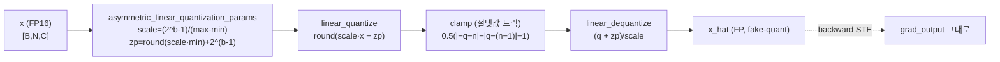
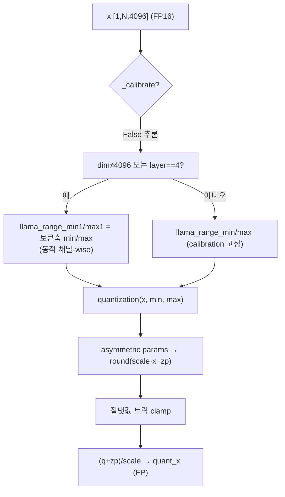
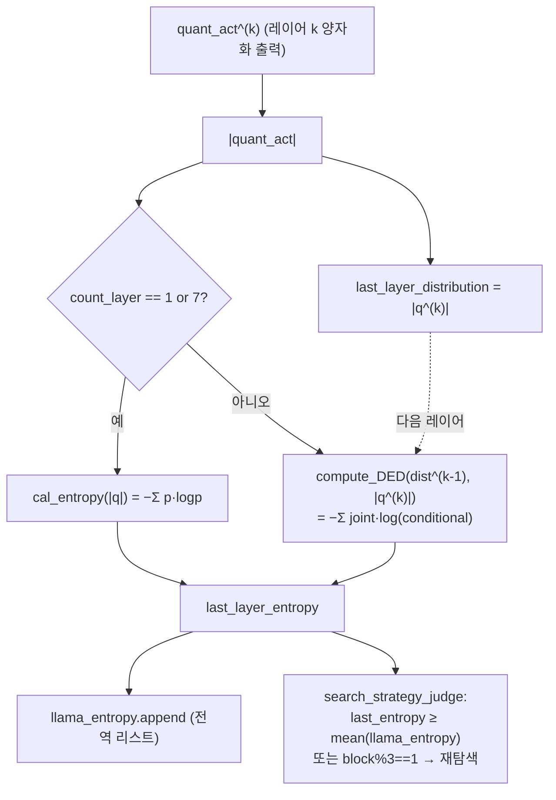
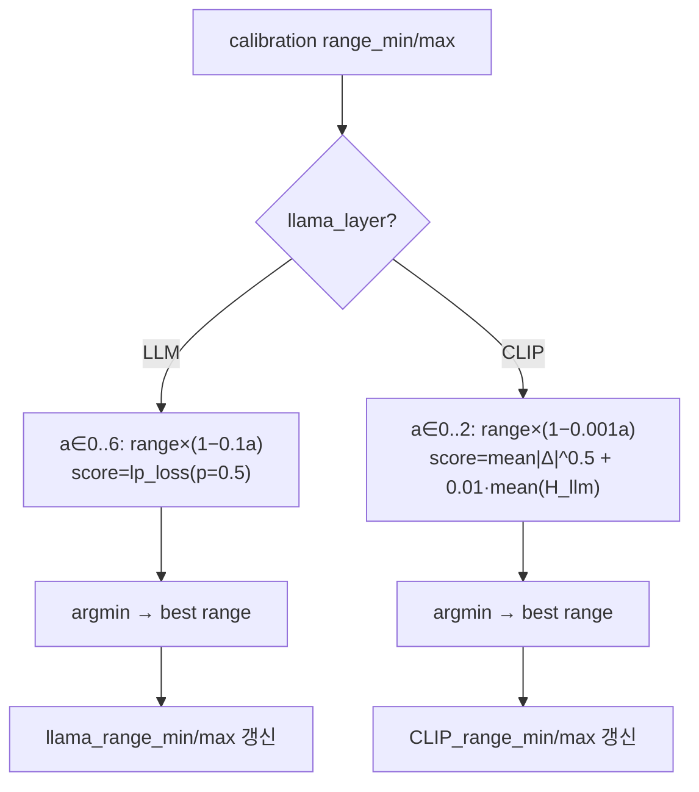
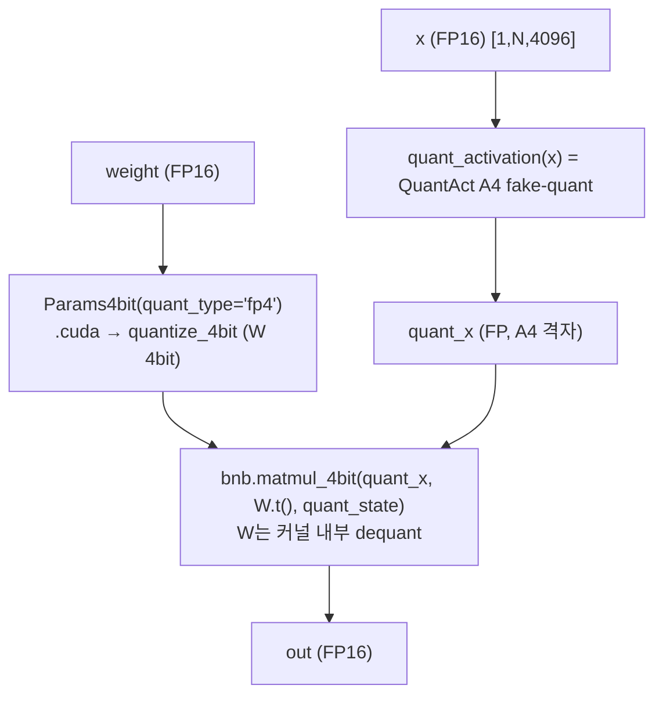
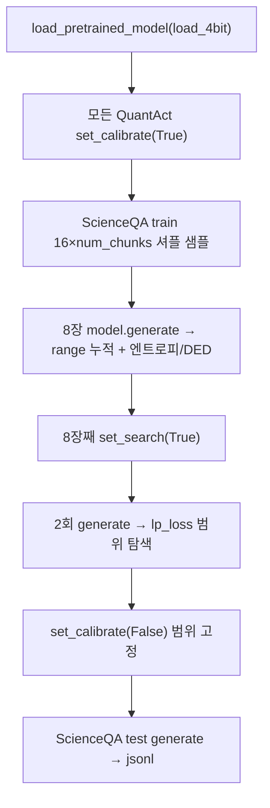

# Q-VLM 모듈 통합 가이드 (S-PyTorch)

> 1차 요약: [`../qvlm.md`](../qvlm.md) — 본 문서는 그 요약을 모듈 단위로 심화한 통합 가이드다.
> 분석 대상: `\\wsl.localhost\ubuntu-24.04\home\user\project\PRJXR-HBTXR\REF\ViT-Quantization\qvlm`
> 작성 원칙: 실제 소스 Read 후 `파일:라인` 근거 표기. 라인 근거 없는 추론은 "추정", 코드로 확인 불가는 "확인 불가"로 명시.
> 형제 가이드(`REF/Analysis/ViT-Quantization/I-ViT/MODULE_GUIDE.md`)의 6요소 구조를 따르되, HW 지표는 **S-PyTorch 수치 규약**(params/FLOPs/activation memory/비트폭/observer/cross-layer dependency/calibration)으로 치환한다.

---

## 0. 문서 머리말

### 0.1 대표 케이스 선정
- **대표 모델: `LLaVA-v1.3-7B` (Vicuna-7B + CLIP ViT-L/14)** — Q-VLM이 W4A4로 양자화하는 유일한 검증 백본. 근거:
  1. 코드 곳곳이 LLaVA-v1.3 7B에 하드코딩(`QuantAct.input_dim=4096`=LLaMA hidden, `quant_modules.py:45`; `CLIP_row_dim=257 # v1.3`, `:75`; `input_features==1024` 분기=CLIP hidden, `modules.py:217`). README가 ScienceQA용 LLaVA-v1.3-7B 체크포인트만 제공(`README.md:47`).
  2. 실행 진입점이 `model_vqa_science.py` (ScienceQA) 하나로 고정(`generate_sqa_response.sh:1`).
- **대표 양자화 단위: `Linear4bit` 1개** = `QuantAct(활성 4bit fake-quant) → bnb.matmul_4bit(W4×A4)` (`modules.py:299,311`). LLaMA Transformer block 1개당 Linear4bit 7개(q/k/v/o + gate/up/down), 32 block 적층(추정: LLaMA-7B 표준 구성, 코드의 `count_layer==8` 주기는 q/k/v/o/gate/up/down=7+1 카운팅 보정으로 추정).
- **대표 cross-layer 메커니즘**: `compute_DED`(레이어 간 조건부 엔트로피, `quant_modules.py:113-125`) + `search_strategy_judge`(엔트로피 기반 선택적 재탐색, `:132-144`) — 본 repo의 NeurIPS'24 핵심 기여이자 본 가이드 정밀해부 1순위.

### 0.2 S-PyTorch 수치 규약 (I-ViT MAC lanes/scalar MACs 대체)
- **params**: 모듈 차원에서 분석적 계산. Linear `in·out (+out bias)`. **가중치는 bitsandbytes `Params4bit`로 4bit FP4/NF4 압축**(`modules.py:210`, `Params4bit.cuda → quantize_4bit`, `:156-160`)되므로 **params 개수는 FP 원본과 동일, 저장 비트폭만 4bit**. 활성 양자화 모듈(`QuantAct`)은 **학습 파라미터 0**(buffer만: range_min/max).
- **FLOPs/MACs**: 표준식×config. Linear MAC = `B·N·in·out`. 대표 차원은 LLaMA-7B(hidden=4096, intermediate=11008, L=32, heads=32) + CLIP ViT-L/14(hidden=1024, L=24) — 단, 코드가 확정하는 값은 `input_dim=4096`/`CLIP_row=257`/`intermediate→11008`(`output_features` 분기 없음, 표준 LLaMA 가정 "추정").
- **activation memory**: 텐서 shape × 비트폭. Q-VLM 활성은 **fake-quant**(round→clamp→dequant로 float 복귀, `quant_modules.py:100-104`)라 실제 메모리는 FP16이지만, **정수 도메인 비트폭 A4**를 "HW 환산 activation bit"로 표기 — `shape × 4bit`.
- **비트폭/observer**: 코드 직접. **W4(FP4 기본/NF4 파생)**(`modules.py:207 quant_type='fp4'`, `:210`), **A4**(`activation_bit=4`, `:214`). observer = **calibration running min/max**(in-place 누적, `quant_modules.py:155-156,175-176`) + **범위 축소 탐색**(`:208-241`). I-ViT의 EMA(0.95) running observer와 달리 **min/max 누적 + lp_loss 기반 clipping 탐색**.
- **cross-layer dependency**: I-ViT에 없는 Q-VLM 고유 축. 엔트로피 `H = −Σp·logp`(`:127-130`), 조건부 엔트로피 `D(k,k+1)`(`:113-125`), 전역 변수로 레이어 간 전파(`:31-34`).
- **calibration**: PTQ — 가중치 학습 없음. ScienceQA 샘플로 통계 누적 후 2회 탐색(`model_vqa_science.py:33-113`).
- **정확도/속도**: README에 **정확도 수치표 없음**(arXiv 링크만, `README.md:3`) → **확인 불가**. 하드웨어: RTX 3090 24GB(`README.md:33`).

### 0.3 운영 경로 (PTQ calibration ↔ search ↔ ScienceQA 생성)
```
[FP16 LLaVA-v1.3-7B 로드] load_pretrained_model(..., load_4bit=True)   (model_vqa_science.py:123)
   │  Linear → Linear4bit 치환 시 W를 Params4bit(FP4)로 4bit 압축 (modules.py:210; Params4bit.cuda :156-160)
   │  각 Linear4bit 생성자가 전역 count_block/layer로 자기 위치·llama_layer 자동 부여 (modules.py:216-233)
   ▼
[calibrate] run_calibrate: 모든 QuantAct set_calibrate(True)        (model_vqa_science.py:33-37)
   │  ScienceQA train 16×num_chunks 샘플, 8장 generate로 통계 누적 (:39-95)
   │  → calibrate_quantization: range_min/max in-place 누적 + 엔트로피/DED 기록 (quant_modules.py:146-179)
   ▼
[search] 8장째에 set_search(True), 이후 2회 탐색 후 break          (model_vqa_science.py:102-108)
   │  llama: range×(1−0.1a) a∈0..6, lp_loss(p=0.5) 최소 선택 (quant_modules.py:208-222)
   │  CLIP : range×(1−0.001a) a∈0..2, lp_loss + 0.01·H_llm 최소 선택 (:224-241)
   ▼
[freeze] set_calibrate(False) → 범위 고정                          (model_vqa_science.py:110-112)
   ▼
[ScienceQA 생성] model.generate로 test 응답 → jsonl              (model_vqa_science.py:128-193)
   ▼
[(별도) 평가] evaluate_sqa_response.sh → 정확도 채점 (별도 스크립트)
```
- 타깃 디바이스: **CUDA GPU 전제** — QuantAct buffer가 `.cuda()` 하드코딩(`quant_modules.py:32,71-72,77-78`), Params4bit가 `quantize_4bit`를 GPU에서만 수행(`modules.py:157`), `AsymmetricQuantFunction`도 GPU 텐서 전제. → CPU 단독 실행 불가(코드 근거 확인, 실행 실패는 미검증).

### 0.4 모델 / 데이터셋 / 정확도 (README 인용)
| 항목 | 값 | 근거 |
|---|---|---|
| 백본 | LLaVA-vicuna-7B-v1.3 (+ CLIP ViT-L/14) | `README.md:47`, `quant_modules.py:45,75` |
| 비트폭 | W4A4 (가중치 FP4/NF4, 활성 4bit fake-quant) | `README.md:3`, `modules.py:207,214` |
| 데이터셋 | ScienceQA (SQA), calibration=train / eval=test | `generate_sqa_response.sh:3-6` |
| 하드웨어 | GeForce RTX 3090 24GB | `README.md:33` |
| **정확도** | **README에 수치표 없음 → 확인 불가** (arXiv:2410.08119 본문에만 존재 추정) | `README.md` 전체 |
| calibration 샘플 | 16×num_chunks 질문, 8장 이미지, 탐색 2회 | `model_vqa_science.py:42-101` |

---

## 1. Repo / 양자화 경로 개요

Q-VLM = LLaVA 계열 대형 VLM을 **W4A4 PTQ**하되, **레이어 간 양자화 의존성(cross-layer dependency, entropy/DED)을 이용해 민감한 레이어만 선택적으로 범위를 재탐색**하여 calibration 비용을 줄이는 프레임워크(`README.md:1-3`). 본 repo의 자체 소스는 **수정된 bitsandbytes 포크(`custom_bitsandbytes`) 안의 활성 양자화 모듈 + Linear4bit 삽입 로직**이고, 모델 본체(LLaVA)·4bit 커널(bnb C/CUDA)·CLIP은 외부.

### 1.1 자체 소스 vs 외부 프레임워크 vs 제외

| 구분 | 파일(자체 소스) | 역할 |
|---|---|---|
| **양자화 기반함수** | `custom_bitsandbytes/.../quantization_utils/quant_utils.py` | AsymmetricQuantFunction, linear_quantize/dequantize, asymmetric params, lp_loss (ZeroQ 유래) |
| **활성 양자화+탐색** | `.../quantization_utils/quant_modules.py` ★핵심 | QuantAct(quantization/calibrate/search) + cal_entropy/compute_DED/search_strategy_judge |
| **4bit Linear 삽입** | `custom_bitsandbytes/.../nn/modules.py` ★핵심 | Linear4bit(Params4bit W4 + QuantAct A4), layer-aware 위치 부여 |
| | `.../nn/modules_same.py` | Linear4bit 단순 변형(블록/llama 구분 없음, 대조 구현) |
| **calibration 구동** | `llava/eval/model_vqa_science.py` | run_calibrate(calibrate→search→freeze) + ScienceQA 생성 |
| | `llava/eval/model_vqa_loader.py` | QuantAct 사용 일반 VQA 평가(요약) |
| **비전 연동** | `llava/model/multimodal_encoder/clip_encoder.py` | CLIP 로드(현재 FP16, 4bit 라인 주석) |
| **실행 스크립트** | `scripts/generate_sqa_response.sh` | W4A4 추론 진입(--load-4bit) |

### 1.2 forward(양자화) 진입점
`Linear4bit.forward`(`modules.py:257`): `quant_x = self.quant_activation(x)`(활성 A4 fake-quant, `:299`) → `bnb.matmul_4bit(quant_x, weight.t(), quant_state)`(W4×A4 행렬곱, 가중치 dequant은 bnb 커널 내부, `:311`). 모든 Linear4bit는 `load_pretrained_model(load_4bit=True)`가 LLaVA의 nn.Linear를 치환할 때 생성(`model_vqa_science.py:123`, 치환 로직은 외부 bnb/transformers).

### 1.3 제외 (지시에 따라 이름만 표기, 미분석)
- **외부 프레임워크(커스텀 아님)**: `llava/*` 모델 정의(`llava_llama.py`, `llava_arch.py`, `language_model/mpt/*`), 학습 스크립트(`llava/train/*`), 일반 eval. HF `transformers.CLIPVisionModel`/`BitsAndBytesConfig`/`LlamaForCausalLM`. LLaVA/Vicuna **원본 사전학습 체크포인트**(가중치만 로드).
- **제외(bitsandbytes 내부)**: `custom_bitsandbytes/bitsandbytes/{functional.py, triton/, autograd/, cuda_setup/, optim/}`, C/CUDA 커널(`bnb.matmul_4bit`/`quantize_4bit` 본체), `tests/`, `benchmarking/`. **Params4bit는 가중치 4bit 압축 컨테이너**로 호출 인터페이스(`:156-160,210`)만 참조, 내부 quantize_4bit 커널은 제외.
- **미열람(확인 불가)**: `model_vqa_loader.py`/`model_qa.py` 세부, `llava/model/builder.py`의 load_4bit 시 nn.Linear→Linear4bit 치환 정확 경로(외부 bnb 추정), arXiv 논문 PDF(repo 내 부재, `qvlm.md:13`).

### 1.4 대표 모델 레이어 구성 (LLaVA-v1.3-7B)
- **LLM(LLaMA-7B)**: block×32, block당 attention Linear 4개(q/k/v/o, 4096↔4096) + MLP Linear 3개(gate/up 4096→11008, down 11008→4096) = 7 Linear4bit/block(`llama_layer=True`, `modules.py:224-229`). 활성 양자화 범위 dim=input(4096), per-channel.
- **CLIP+projector**: CLIP ViT-L/14(hidden 1024) Linear들 + mm_projector(1024→4096). `input_features==1024 or (4096,1024)` → `llama_layer=False`(`modules.py:217-223`), CLIP_row_dim=257 토큰 단위 row-wise 양자화. 단 **CLIP 자체는 기본 FP16 로드**(`clip_encoder.py:37`, 4bit 라인 주석)이므로 Linear4bit 치환은 projector 중심(추정).

---

## 2. 모듈: 비대칭 양자화 기반함수 — `quant_utils.py` (AsymmetricQuantFunction)

### 2.1 역할 + 상위/하위
- **역할**: FP 텐서를 **비대칭(asymmetric, zero-point≠0) 선형 양자화**로 정수화 후 dequant하는 autograd Function. clamp를 절댓값 트릭으로 분기 없이 포화. backward는 STE(grad 그대로 통과).
- **상위**: `QuantAct.act_function`으로 호출(`quant_modules.py:83`). **하위**: `asymmetric_linear_quantization_params`(`quant_utils.py:108-136`), `linear_quantize`/`linear_dequantize`(`:62-105`).
- **출처**: 파일 헤더가 **ZeroQ**(Cai/Yao/Dong/Gholami) 라이선스 명시(`quant_utils.py:1-19`) → ZeroQ에서 가져온 비대칭 정수 양자화 유틸.

### 2.2 데이터플로우 (텐서 shape 흐름)


### 2.3 forward call stack
`QuantAct.quantization`(`quant_modules.py:93`) → `asymmetric_linear_quantization_params`(`:94`) → `torch.round(scale·x − zp)`(`:100`) → 절댓값 트릭 clamp(`:102`) → dequant(`:103`). (별도 `AsymmetricQuantFunction.apply`는 `quant_modules.py:83`에 등록되나, 실사용 양자화는 `quantization()` 인라인 경로 — 동일 수식.)

### 2.4 대표 코드 위치
`quant_utils.py`: `asymmetric_linear_quantization_params` `:108-136`, `linear_quantize` `:62-82`, `linear_dequantize` `:85-105`, `AsymmetricQuantFunction.forward` `:144-166`, `backward` `:168-171`, `lp_loss` `:26-33`.

### 2.5 대표 코드 블록

```python
# quant_utils.py:118-135  비대칭 스케일/제로포인트 (signed)
n = 2**num_bits - 1
scale = n / (saturation_max - saturation_min)        # = (2^b-1)/(max-min)
zero_point = scale * saturation_min
if integral_zero_point:
    zero_point = zero_point.round()                  # 정수 zp
if signed:
    zero_point += 2**(num_bits - 1)                  # 부호 영역 중앙 정렬
return scale, zero_point
```
→ **비대칭 양자화**(I-ViT의 zero-point=0 대칭과 대조). A4(b=4)이면 `n=15`, scale=15/(max−min). zp≠0이라 HW에서 zero-point 가산기 필요.

```python
# quant_utils.py:161  clamp를 절댓값 트릭으로 (분기 없는 포화)
new_quant_x_1 = 0.5 * ((-new_quant_x - n).abs() - (new_quant_x - (n - 1)).abs() - 1)
```
→ `clamp(q, −n, n−1)`을 `abs` 2개+가감산으로 환원. **분기 없는 saturation** → RTL/HLS 친화(조건분기 제거). n=2^(b-1)=8(A4).

```python
# quant_utils.py:171  backward: STE (양자화기 통과 그래디언트)
return grad_output, None, None, None
```
→ PTQ라 backward 거의 미사용(가중치 학습 없음). STE는 형식상 정의.

### 2.6 연산·수치표현 분해 + 정량
- **양자화 방식**: per-channel 또는 per-row 비대칭, zp≠0(정수 반올림). scale=`(2^b−1)/(max−min)`, zp=`round(scale·min)+2^(b−1)`.
- **비트폭**: 활성 A4(`activation_bit=4`). 정수 범위 round 후 `[−n, n−1]`=`[−8,7]`(b=4).
- **params**: 0 (순수 함수).
- **FLOPs**: 원소 N당 mul+sub+round(quantize) + abs×2+가감(clamp) + add+div(dequant) ≈ O(N). LLaMA block q 활성([1,N,4096]) 양자화 = N×4096 원소연산/레이어.
- **activation bit**: 출력은 dequant FP16(fake-quant)이나 HW 환산 A4. I-ViT의 dyadic requant 같은 정수 도메인 전파 **없음** — 매 Linear 입력에서 양자화→dequant→FP16 matmul(bnb 커널이 W만 4bit dequant).

---

## 3. 모듈: 활성 양자화 — `quant_modules.py` (QuantAct.quantization / forward)

### 3.1 역할 + 상위/하위
- **역할**: activation을 비대칭 4bit fake-quant. calibration·search·inference 3모드를 `_calibrate`/`search` 플래그로 분기. llama 경로는 per-channel(input dim), CLIP 경로는 per-row(257 토큰) 범위 적용. 입력 마지막 차원과 scale 크기가 다르면 transpose해 정렬.
- **상위**: `Linear4bit.forward`가 `self.quant_activation(x)`로 호출(`modules.py:299`). **하위**: `asymmetric_linear_quantization_params`, `lp_loss`(탐색 score).

### 3.2 데이터플로우 (텐서 shape 흐름, llama 추론)


### 3.3 forward call stack
`Linear4bit.forward`(`modules.py:299`) → `QuantAct.forward`(`quant_modules.py:181`) → (추론) `:256-276` 분기 → `quantization`(`:93`) → `asymmetric_linear_quantization_params`(`:94`) → round/clamp/dequant(`:100-104`).

### 3.4 대표 코드 위치
`quant_modules.py`: 생성자/range 초기화 `:40-85`, `quantization` `:93-110`, `forward` 3모드 분기 `:181-276`, 추론 채널-wise vs 고정 `:256-276`.

### 3.5 대표 코드 블록

```python
# quant_modules.py:93-104  비대칭 양자화 + transpose 정렬
def quantization(self, inputs, quantization_min, quantization_max):
    scale, zero_point = asymmetric_linear_quantization_params(
        self.activation_bit, quantization_min, quantization_max)
    if inputs.shape[-1] == scale.shape[0]:                # scale이 마지막 차원과 일치
        new_quant_x = torch.round(scale * inputs - zero_point)
        n = 2**(self.activation_bit - 1)
        new_quant_x_1 = 0.5 * ((-new_quant_x - n).abs() - (new_quant_x - (n-1)).abs() - 1)
        return (new_quant_x_1 + zero_point) / scale       # fake-quant (dequant)
    else:
        # 마지막 차원≠scale → transpose 후 적용 (row-wise 정렬)
        ...transpose(1,-1)...
```

```python
# quant_modules.py:256-276  추론: 동적 채널-wise vs calibration 고정 분기
if self.llama_layer == True:
    if self.dim != 4096 or self.count_layer == 4:        # 특정 레이어는 매 입력 동적 범위
        self.llama_range_min1 = torch.min(inputs_calibrate, dim=1)[0].squeeze(dim=0)
        self.llama_range_max1 = torch.max(inputs_calibrate, dim=1)[0].squeeze(dim=0)
        quant_act = self.quantization(x, self.llama_range_min1, self.llama_range_max1)
    else:                                                 # 나머지는 calibration 고정 범위
        quant_act = self.quantization(x, self.llama_range_min, self.llama_range_max)
else:
    quant_act = self.quantization(x, self.CLIP_range_min, self.CLIP_range_max)  # CLIP row-wise
```
→ **layer==4(추정: o_proj 위치)와 dim≠4096(intermediate=11008 레이어)는 동적 범위**, 나머지는 calibration 고정. HW 관점: 고정 범위 레이어는 scale을 상수로 굳힐 수 있으나, 동적 레이어는 매 입력 min/max 회로 필요.

### 3.6 연산·수치표현 분해 + 정량
- **양자화 방식**: 비대칭 A4. llama=per-channel(4096), CLIP=per-row(257). zp≠0.
- **비트폭**: A4(`:55`). W는 bnb FP4(별도).
- **params**: 0 학습 파라미터(buffer: llama_range_min/max `[4096]` 또는 CLIP_range `[257]`).
- **activation memory** (LLaMA block, [1,N,4096], N=토큰수):
  - A4(HW 환산): N×4096×0.5 byte = N×2 KB
  - 실제(fake-quant FP16): N×4096×2 byte = N×8 KB (dequant 후)
- **FLOPs**: quantization O(N·C) + 동적 레이어는 min/max reduce O(N·C). 고정 레이어는 reduce 생략(calibration에서 확정).
- **시사**: I-ViT처럼 정수 도메인을 유지하지 않고 매번 dequant → **실제 A4 정수 가속 아님**(fake-quant). FPGA 이식 시 dequant 제거하고 정수 MAC으로 재설계 필요.

---

## 4. 모듈: Cross-Layer Dependency — `quant_modules.py` (cal_entropy + compute_DED + search_strategy_judge) ★Q-VLM 핵심

### 4.1 역할 + 상위/하위
- **역할**: Q-VLM의 NeurIPS'24 핵심 기여. 레이어 출력 분포 엔트로피와 **인접 레이어 간 조건부 엔트로피 D(k,k+1)**를 측정해, **민감한 레이어에서만 양자화 범위를 재탐색**(블록 단위 효율 탐색). I-ViT에는 없는 cross-layer 축.
- **상위**: `calibrate_quantization`(`:148,161,163`)이 calibration 중 호출. **하위**: `F.normalize`, `torch.log`. **전역 상태**: `last_layer_entropy`, `last_layer_distribution`, `llama_entropy`, `llama_distribution`(`:31-34`)로 레이어 간 정보 전파.

### 4.2 데이터플로우 (레이어 간 의존성 전파)


### 4.3 forward call stack
calibration: `QuantAct.forward`(`:181`, `_calibrate=True`) → `calibrate_quantization`(`:146`) → `search_strategy_judge`(`:148`) → (조건부) range 누적(`:155-156`) → `quantization`(`:158`) → `cal_entropy`(`:161`) 또는 `compute_DED`(`:163`) → `llama_entropy.append`(`:166`).

### 4.4 대표 코드 위치
`quant_modules.py`: `compute_DED` `:113-125`, `cal_entropy` `:127-130`, `search_strategy_judge` `:132-144`, calibration 통합 `:146-169`, 전역 상태 `:31-34`.

### 4.5 대표 코드 블록

```python
# quant_modules.py:113-125  레이어 간 조건부 엔트로피 D(k,k+1)
def compute_DED(self, p_k, p_k1):
    p_k  = F.normalize(p_k,  p=1, dim=1)        # 정규화 분포
    p_k1 = F.normalize(p_k1, p=1, dim=1)
    joint_p = p_k * p_k1
    joint_p = joint_p / joint_p.sum(dim=1, keepdim=True)
    condition_p = p_k1 / (p_k + 1e-5)           # p(k+1 | k)
    condition_p = condition_p / condition_p.sum(dim=1, keepdim=True)
    return -1 * torch.sum(joint_p * torch.log(condition_p + 1e-5), dim=1).mean()
```
→ **레이어 간 양자화 분포 의존성**을 조건부 엔트로피로 수치화. 이것이 "cross-layer dependency 기반 양자화 오차 최소화"(논문 표제어)의 코드 구현. 논문 원식과의 1:1 대응은 PDF 부재로 일부 추정(`qvlm.md:129`).

```python
# quant_modules.py:127-130  단일 레이어 엔트로피
def cal_entropy(self, attn):
    attn = torch.nn.functional.normalize(attn, dim=1)
    return -1 * torch.sum((attn * torch.log(attn+1e-7)), dim=1).mean()
```

```python
# quant_modules.py:132-144  엔트로피 기반 선택적 재탐색 판단
def search_strategy_judge(self):
    self.sample_num += 1
    global last_layer_entropy, llama_entropy
    if last_layer_entropy >= np.mean(llama_entropy) or self.count_block % 3 == 1:
        search_flag = True                       # 직전 엔트로피 평균↑ 또는 3블록 주기 → 재탐색
    else:
        search_flag = False                      # 둔감 레이어는 건너뜀 (효율)
    if (self.count_block==1 and self.count_layer==1) or self.sample_num <= 1:
        search_flag = True; llama_entropy = []   # 첫 블록/첫 샘플은 강제 탐색
    return search_flag
```
→ **민감한 레이어만 선택적으로 범위를 재탐색** = calibration 비용 절감. `block%3==1`로 주기적 강제 탐색도 병행. I-ViT의 균일 QAT 대비 **레이어 민감도 인지 양자화**가 Q-VLM 차별점.

```python
# quant_modules.py:159-166  레이어 1/7은 엔트로피, 나머지는 DED (전역 전파)
if self.count_layer == 1 or self.count_layer == 7:
    last_layer_entropy = self.cal_entropy(quant_act.abs())
else:
    last_layer_entropy = self.compute_DED(last_layer_distribution, quant_act.abs())
last_layer_distribution = quant_act.abs()        # 다음 레이어 DED 입력으로 전역 저장
```
→ block 경계(layer 1)·MLP 입력(layer 7)은 절대 엔트로피, 중간은 직전 분포와의 DED. **layer 인덱스로 cross-layer 측정 종류 분기**.

### 4.6 연산·수치표현 분해 + 정량
- **cross-layer dependency 핵심**: D(k,k+1)=`−Σ joint·log(conditional)`(`:125`), H=`−Σp·logp`(`:130`). 재탐색 조건 `H ≥ mean(H) 또는 block%3==1`(`:135`).
- **calibration**: 16×num_chunks 질문, 8장 이미지(`model_vqa_science.py:42-43`), 탐색 2회(`:99-101`).
- **비트폭**: 측정 자체는 FP(분포 통계).
- **params**: 0(전역 변수/buffer만).
- **FLOPs**: normalize+log reduce O(N·C)/레이어. 전 레이어 calibration 1회.
- **리스크**: 전역 변수(`:31-34`) 공유 → 배치/멀티스레드/2모델 동시 로드 시 상태 오염(추정, `qvlm.md:82,159`). `count_layer==1/7` 하드코딩은 LLaMA 7-Linear/block 구조 가정.

---

## 5. 모듈: 범위 탐색 (Outlier Clipping) — `quant_modules.py` (forward search 단계)

### 5.1 역할 + 상위/하위
- **역할**: calibration 후 활성 범위(min/max)를 `(1−step·a)`로 축소하며 양자화 오차(lp_loss)를 최소화하는 a를 선택 = **outlier clipping threshold 탐색**. LLM은 step 0.1×7단계, CLIP은 step 0.001×3단계 + LLM 엔트로피 정규화 항.
- **상위**: `QuantAct.forward`의 `search & not first_search` 분기(`:208-241`). **하위**: `quantization`, `lp_loss`(`quant_utils.py:26-33`).

### 5.2 데이터플로우 (LLM vs CLIP 탐색)


### 5.3 forward call stack
`run_calibrate`가 8장째 `set_search(True)`(`model_vqa_science.py:104-108`) → 다음 generate에서 `QuantAct.forward`(`:181`) → search 분기(`:208` LLM / `:224` CLIP) → `quantization`+`lp_loss`(`:215-216` / `:233-234`).

### 5.4 대표 코드 위치
`quant_modules.py`: LLM 탐색 `:208-222`, CLIP 탐색 `:224-241`, 첫 탐색 초기화 `:194-205`.

### 5.5 대표 코드 블록

```python
# quant_modules.py:208-222  LLM: 범위 7단계 축소, lp_loss(p=0.5) 최소
best_score = 1e+10
for aa in range(7):
    new_max = self.llama_range_max * (1.0 - (aa * 0.1))      # ×1.0, 0.9, ..., 0.4
    new_min = self.llama_range_min * (1.0 - (aa * 0.1))
    activ_tmp = self.quantization(inputs_calibrate, new_min, new_max)
    score = lp_loss(activ_tmp, inputs_calibrate, p=0.5, reduction='all')
    if score < best_score:
        best_max, best_min, best_score = new_max, new_min, score
self.llama_range_max, self.llama_range_min = best_max, best_min
```
→ 범위를 좁혀 outlier를 포화시켜도 평균 오차가 줄면 채택. **W4A4의 좁은 격자에서 outlier 손실 완화**. lp_loss `p=0.5`(서브-L1, outlier 덜 민감).

```python
# quant_modules.py:224-241  CLIP: 미세 축소 + LLM 엔트로피 정규화 결합
entropyloss = np.mean(llama_entropy); entropyweight = 0.01
for aa in range(3):
    new_max = self.CLIP_range_max * (1.0 - (aa * 0.001))    # 매우 미세
    new_min = self.CLIP_range_min * (1.0 - (aa * 0.001))
    activ_tmp = self.quantization(inputs_calibrate, new_min, new_max)
    lploss = (activ_tmp - inputs_calibrate).abs().pow(0.5).mean()
    score = lploss + entropyweight * entropyloss             # 비전 탐색에 LLM 엔트로피 결합
    ...
```
→ **CLIP(비전) 경로 범위 탐색에 LLM 엔트로피를 score로 결합** = cross-modal dependency. 비전 step(0.001)이 LLM(0.1)보다 훨씬 보수적 → 비전 활성은 outlier에 민감하다고 판단(추정).

### 5.6 연산·수치표현 분해 + 정량
- **양자화 방식**: 범위 축소 탐색(clipping). LLM `(1−0.1a)` a∈0..6, CLIP `(1−0.001a)` a∈0..2.
- **score**: LLM=lp_loss(p=0.5), CLIP=mean|Δ|^0.5 + 0.01·mean(H_llm)(`:216,235`).
- **params**: 0.
- **FLOPs**: LLM 7×양자화, CLIP 3×양자화 per QuantAct. calibration 단계 1회.
- **시사**: **오프라인 calibration으로 clipping threshold 고정** = FPGA에서 활성 scale을 사전 상수로 굳히는 전략과 동일(`qvlm.md:170`). 단, layer==4/dim≠4096 동적 범위 레이어는 상수화 불가(§3.5).

---

## 6. 모듈: 4bit Linear + Layer-Aware 삽입 — `nn/modules.py` (Linear4bit) ★핵심

### 6.1 역할 + 상위/하위
- **역할**: nn.Linear를 상속, 가중치를 `Params4bit`(FP4/NF4)로 4bit 압축하고 forward에 QuantAct(A4)를 삽입. **생성 시 전역 count_block/layer 카운터로 자기 위치·llama_layer를 자동 부여** → QuantAct가 cross-layer 측정에 필요한 위치 정보 획득.
- **상위**: `load_pretrained_model(load_4bit)`가 LLaVA nn.Linear를 치환(외부 경로). **하위**: `QuantAct`, `Params4bit`(`:210`), `bnb.matmul_4bit`(`:311`).

### 6.2 데이터플로우 (W4×A4)


### 6.3 forward call stack
`Linear4bit.__init__`(`modules.py:206`) → 전역 카운터로 llama_layer/위치 결정(`:216-231`) → `QuantAct(...)` 생성(`:232`). `forward`(`:257`) → `quant_activation(x)`(`:299`) → `bnb.matmul_4bit`(`:311`).

### 6.4 대표 코드 위치
`modules.py`: 전역 카운터 `:205`, Params4bit W4 `:210`, A4 설정 `:214`, **layer-aware 위치 부여** `:216-233`, forward `:257-315`, matmul_4bit `:311`. `Params4bit.cuda(quantize_4bit)` `:156-160`.

### 6.5 대표 코드 블록

```python
# modules.py:216-233  전역 카운터로 llama_layer·위치 자동 부여
global count_block, count_layer
if input_features == 1024 or (input_features == 4096 and output_features == 1024):
    # CLIP + mm_projector
    count_layer += 1
    if count_layer == 7:                       # CLIP/projector 주기 7
        count_layer = 1; count_block += 1
    self.llama_layer = False
else:
    count_layer += 1
    if count_layer == 8:                       # LLM 주기 8
        count_layer = 1; count_block += 1
    self.llama_layer = True
self.quant_activation = QuantAct(activation_bit=4, input_dim=input_features,
    llama_layer=self.llama_layer, count_block=self.count_block, count_layer=self.count_layer)
```
→ **모델 그래프 구성 순서에 의존해 레이어 인덱스를 전역 카운터로 부여**. `input_features∈{1024,4096}`·주기 7/8이 LLaVA-v1.3 7B 구조에 강결합(다른 백본/해상도에서 깨짐, `qvlm.md:158`).

```python
# modules.py:299-313  활성 A4 fake-quant 후 W4×A4 matmul
quant_x = self.quant_activation(x)             # A4 fake-quant
if self.compute_dtype is not None:
    quant_x = quant_x.to(self.compute_dtype)
out = bnb.matmul_4bit(quant_x, self.weight.t(), bias=bias, quant_state=self.weight.quant_state)
out = out.to(inp_dtype)
```
→ 활성은 dequant 후 FP로 matmul에 진입(가중치만 4bit, 커널 내부 dequant) → **실제 A4 정수 연산 아닌 fake-quant**(`qvlm.md:160`).

### 6.6 연산·수치표현 분해 + 정량 (LLaMA-7B 1 block)
- **양자화 방식**: W=FP4(Params4bit, blocksize 단위 absmax, double_quant 옵션) / A4 비대칭 fake-quant.
- **비트폭**: W4 / A4. compute_dtype FP16/BF16(`:241`).
- **params (LLaMA block, hidden=4096, inter=11008)**:
  - q/k/v/o: 4×(4096×4096) = **67.1M**
  - gate/up: 2×(4096×11008) = **90.2M**
  - down: 11008×4096 = **45.1M**
  - Linear params/block ≈ **202.4M**, ×32 block ≈ **6.48G** (LLaMA-7B 어텐션+MLP, embedding 별도).
- **MACs/block** (B=1, N 토큰):
  - q/k/v/o: 4×N×4096×4096 ≈ N×67.1M
  - gate/up: 2×N×4096×11008 ≈ N×90.2M
  - down: N×11008×4096 ≈ N×45.1M
  - Linear MAC/block ≈ N×202.4M, ×32 ≈ N×6.48G (attention QKᵀ/AV는 Linear4bit 아님 → 별도, FP16).
- **저장 메모리 절감**: W4면 FP16 대비 1/4 (6.48G params × 0.5 byte ≈ 3.24 GB vs FP16 12.96 GB). RTX 3090 24GB 적합 근거.
- **activation bit**: A4(HW 환산), 실제 fake-quant FP16.

---

## 7. 모듈: calibration/search 구동 — `llava/eval/model_vqa_science.py` (run_calibrate)

### 7.1 역할 + 상위/하위
- **역할**: 모든 QuantAct를 calibrate→search→freeze 순으로 구동하고 ScienceQA로 통계를 누적. 순수 PTQ(가중치 학습 없음).
- **상위**: `eval_model`(`:116`) → CLI(`generate_sqa_response.sh`). **하위**: `model.generate`(forward 흘려 통계 누적), QuantAct.set_calibrate/set_search.

### 7.2 데이터플로우


### 7.3 forward call stack
`eval_model`(`:116`) → `load_pretrained_model(..., load_4bit)`(`:123`) → `run_calibrate`(`:126`) → set_calibrate(`:35-37`) → generate ×8(`:86-95`) → set_search(`:104-106`) → break at search_flag==2(`:99-101`) → set_calibrate(False)(`:110-112`) → test 생성(`:128-193`).

### 7.4 대표 코드 위치
`model_vqa_science.py`: `run_calibrate` `:33-113`, 샘플 수/이미지 수 `:42-43`, generate `:86-95`, search 트리거 `:97-108`, freeze `:110-112`, eval_model `:116-193`.

### 7.5 대표 코드 블록

```python
# model_vqa_science.py:42-43, 102-108  calibration 8장 → search 2회
num_of_sample = 16 * args.num_chunks
calibrate_images = 8
...
if i == calibrate_images - 1:                  # 8장째: 탐색 시작
    for name, module in model.named_modules():
        if isinstance(module, QuantAct):
            module.set_search(search=True)
    search_flag += 1
```

```python
# model_vqa_science.py:86-95  실제 generate로 forward 흘려 통계 누적
with torch.inference_mode():
    output_ids = model.generate(input_ids, images=images, do_sample=True,
        temperature=0.2, max_new_tokens=1024, use_cache=True, ...)
```
→ 별도 calibration loss 없이 **추론 forward 자체로 QuantAct 통계 누적**(PTQ). do_sample=True라 calibration 비결정적(추정).

### 7.6 연산·수치표현 분해 + 정량
- **calibration**: 16×num_chunks 질문(이미지 있는 것 위주), 8장 누적 + 2회 탐색(`:42-101`).
- **PTQ**: 가중치 학습 0, 활성 범위만 결정.
- **하드웨어**: RTX 3090 24GB(`README.md:33`).
- **재현 명령** (`generate_sqa_response.sh`):
  ```bash
  python -m llava.eval.model_vqa_science --model-path <path> \
    --question-file <test.json> --image-folder <test_imgs> \
    --question-file-calibrate <train.json> --image-folder-calibrate <train_imgs> \
    --answers-file <out.jsonl> --conv-mode llava_v1 --load-4bit
  ```
- **정확도**: README 수치표 부재 → **확인 불가**(별도 `evaluate_sqa_response.sh` 채점, 결과 미동봉).

---

## 8. 모듈: 비전 인코더 연동 — `clip_encoder.py` + `modules_same.py`(대조)

### 8.1 역할 + 상위/하위
- **역할(clip_encoder)**: CLIP ViT-L/14 로드. BitsAndBytesConfig(nf4) 준비 코드는 있으나 **현재 FP16 로드**(4bit/8bit 라인 주석, `:33-37`). 즉 W4A4는 LLM(Linear4bit) 중심, CLIP은 기본 FP16.
- **역할(modules_same)**: Linear4bit의 단순 변형 — 블록/레이어/llama_layer 구분 없이 `QuantAct(activation_bit, dim)`만 삽입(`:215`). 초기/대조 구현으로 보임(cross-layer 로직 없음).
- **상위**: `CLIPVisionTower`는 LLaVA encoder builder가 호출. **하위**: transformers `CLIPVisionModel`.

### 8.2 대표 코드 위치
`clip_encoder.py`: 로드 옵션 `:22-37`, FP16 활성 라인 `:37`. `modules_same.py`: 단순 Linear4bit `:206-218`, QuantAct(dim) `:215`.

### 8.3 대표 코드 블록

```python
# clip_encoder.py:32-37  4bit/8bit 로드 주석, 현재 FP16
# 4bit
# self.vision_tower = CLIPVisionModel.from_pretrained(self.vision_tower_name, **kwargs)
# 8bit
# self.vision_tower = CLIPVisionModel.from_pretrained(self.vision_tower_name, load_in_8bit=True)
# 16bit
self.vision_tower = CLIPVisionModel.from_pretrained(self.vision_tower_name)   # 실제: FP16
```

```python
# modules_same.py:215  cross-layer 없는 단순 QuantAct (대조 구현)
self.quant_activation = QuantAct(activation_bit=self.activation_bit, dim=input_features)
# (modules.py:232의 llama_layer/count_block/count_layer 인자 없음)
```
→ `modules_same`은 **layer-aware/cross-layer 로직 제거 버전** → modules.py가 Q-VLM의 실제 기여 코드임을 반증.

### 8.4 연산·수치표현 분해 + 정량
- **CLIP 비트폭**: 기본 FP16(`:37`). 4bit는 주석으로만 가능. → **W4A4 실측 적용 범위는 LLM 중심**(`qvlm.md:162,172`).
- **CLIP_row_dim**: 257(v1.3, 224px/14의 16²+1; v1.5는 577 주석, `quant_modules.py:75-76`).
- **params/MACs**: CLIP ViT-L/14 표준(hidden 1024, L24) — 코드 미확정, 양자화 적용 자체가 비활성(주석)이라 본 가이드 정량 대상 외.

---

## N+1. 모듈 한눈 요약 표

| 모듈 | 파일:라인 | 역할 | 양자화 방식 | 대표 정량(LLaVA-7B) |
|---|---|---|---|---|
| AsymmetricQuantFunction | quant_utils.py:108-171 | FP→정수 비대칭양자화 + STE | per-ch/row 비대칭, zp≠0, 절댓값 clamp | params 0, O(N) |
| QuantAct.quantization/forward | quant_modules.py:93-110,181-276 | 활성 A4 fake-quant, 3모드 분기 | A4 비대칭, llama per-ch(4096)/CLIP per-row(257) | params 0, A4 N×2KB/레이어 |
| cal_entropy/compute_DED/judge ★ | quant_modules.py:113-144 | cross-layer dependency, 선택적 재탐색 | H/D(k,k+1) 측정, block%3 주기 | params 0, 전역 상태 전파 |
| 범위 탐색(clipping) | quant_modules.py:208-241 | outlier clipping threshold 탐색 | LLM ×(1−0.1a)/lp_loss, CLIP ×(1−0.001a)+0.01·H | LLM 7단계/CLIP 3단계 |
| Linear4bit ★ | nn/modules.py:206-315 | W4(FP4)+A4, layer-aware 삽입 | W FP4/A4, 전역 카운터 위치 부여 | block 202.4M params, N×202.4M MAC |
| Params4bit | nn/modules.py:156-160,210 | 가중치 4bit 압축 컨테이너 | FP4/NF4, blocksize absmax | W4 저장 1/4 메모리 |
| run_calibrate | model_vqa_science.py:33-113 | calibrate→search→freeze 구동 | PTQ, generate로 통계 누적 | 8장+탐색2회, RTX3090 |
| clip_encoder/modules_same | clip_encoder.py:22-37; modules_same.py:206-218 | CLIP 로드(FP16)/단순 Linear4bit 대조 | CLIP 기본 FP16(4bit 주석) | 비전 양자화 비활성 |

---

## N+2. calibration·평가 파이프라인 + 재현 명령

- **데이터셋**: ScienceQA(SQA), calibration=train(`llava_train_QCM-LEPA.json`)/eval=test(`llava_test_QCM-LEPA.json`)(`generate_sqa_response.sh:3-6`).
- **백본**: LLaVA-vicuna-7B-v1.3(+CLIP ViT-L/14), HF `ChangyuanWang/LLaVA-vicuna-7B-v1.3-ScienceQA`(`README.md:47`).
- **W4A4 PTQ + 추론**:
  ```bash
  sh scripts/generate_sqa_response.sh    # --load-4bit로 calibrate+search+생성
  sh scripts/evaluate_sqa_response.sh    # 별도 채점
  ```
- **설치**: `pip uninstall bitsandbytes` 후 `custom_bitsandbytes` setup.py install **필수**(`README.md:27-30`).
- **의존성**: 수정 bitsandbytes 포크(`bnb.matmul_4bit`/`Params4bit`/quantize_4bit), LLaVA(haotian-liu), transformers(CLIPVisionModel/BitsAndBytesConfig/LlamaForCausalLM), PyTorch, numpy, ZeroQ 유래 양자화 유틸(`quant_utils.py:1-19`). **CUDA 필수**.
- **(별도) 평가 스크립트**: `evaluate_sqa_response.sh`/`eval_science_qa.py` — 본 가이드 정량 대상 외, 정확도 수치 **확인 불가**.

---

## N+3. 우리 프로젝트(FPGA ViT 가속) 시사점 + FPGA 친화도

### N+3.1 비대칭 정수 양자화 = FPGA scale+offset 회로 직접 매핑
- `asymmetric_linear_quantization_params`(`quant_utils.py:108-136`): `scale=(2^b−1)/(max−min)`, `zp=round(scale·min)+2^(b−1)` → 정수 scale+offset 회로로 직접 매핑. **clamp 절댓값 트릭**(`:161`, `quant_modules.py:102`)은 분기 없는 saturation → RTL/HLS에서 조건분기 제거. 단 I-ViT 대칭(zp=0)과 달리 **zp≠0이라 zero-point 가산기 추가 비용**.

### N+3.2 Cross-Layer Dependency = 혼합정밀도 비트 배분 도구 (개념 차용)
- `compute_DED`/`search_strategy_judge`(`quant_modules.py:113-144`): 레이어 간 조건부 엔트로피로 민감도를 정량화 → XR 시선추적 ViT에서 **"어느 레이어/모달리티에 더 많은 비트를 줄지"** 결정하는 mixed-precision 비트 배분 도구로 차용 가치(`qvlm.md:171`). 단 **전역 변수 의존 구현은 그대로 쓰기보다 개념만 차용** 권장(상태 오염 위험, `:31-34`).

### N+3.3 Outlier Clipping = 오프라인 calibration scale 고정
- 범위 축소 탐색(`:208-241`)은 FPGA에서 **clipping threshold를 오프라인 캘리브레이션으로 고정**하는 전략과 동일 → 좁은 INT4 격자에서 outlier 포화 손실 완화의 설계 근거. **calibration 고정 per-channel scale 채택 시 정수 MAC+상수 시프트로 단순화**(`qvlm.md:169`). 단 layer==4/dim≠4096 동적 범위 레이어(`:260`)는 상수화 불가 — 매 입력 min/max 회로 필요.

### N+3.4 FPGA 친화도 평가 (정수전용/곱셈기-free 관점)
| 항목 | 평가 | 근거 |
|---|---|---|
| 저비트(W4A4) 타깃 | ★★★ 활성까지 4bit (I-ViT INT8보다 공격적) | `modules.py:207,214` |
| 정수전용(integer-only) | △ **fake-quant** (dequant 후 FP16 matmul) | `quant_modules.py:100-104`, `modules.py:299-311` |
| 곱셈기-free 비선형 | ✗ 정수 비선형(GELU/Softmax/LN) 구현 없음 | 비선형은 외부 LLaVA(FP) — I-ViT와 대조 |
| 재양자화 PE | ✗ dyadic requant 없음 (매 입력 양자화→dequant) | `quant_modules.py:93-110` |
| clamp saturation | ★★★ 분기 없는 절댓값 트릭 | `quant_utils.py:161` |
| 비대칭 zp | ★★ scale+offset, zp 가산기 필요 | `quant_utils.py:127-135` |
| 가중치 압축 | ★★★ W4 → FP16 대비 1/4 메모리 | `modules.py:210`, Params4bit |
| 이식성 | ✗ LLaVA-v1.3 7B 구조 하드코딩(4096/1024/257/주기7,8) | `modules.py:217-229`, `quant_modules.py:75,260` |

### N+3.5 I-ViT 대비 핵심 차이 (FPGA 관점)
| 축 | I-ViT (대칭/integer-only) | Q-VLM (비대칭/fake-quant) |
|---|---|---|
| 비트폭 | W8/A8(A16 일부) | W4/A4 |
| 양자화 | 대칭 zp=0, dyadic requant 정수 전파 | 비대칭 zp≠0, fake-quant(dequant) |
| 비선형 | 정수 GELU/Softmax/LN(시프트) | 없음(외부 FP) |
| 학습 | QAT(ImageNet 수십 epoch) | PTQ(calibration만) |
| 차별점 | 정수전용 비선형 | **cross-layer dependency 비트/범위 결정** |
| FPGA 직접성 | ★★★ 비선형 청사진 | △ 개념(비트 배분)·calibration 전략 차용 |

- **결론**: Q-VLM은 FPGA 정수 데이터패스 직접 청사진은 아니다(fake-quant, 비선형 부재, LLM 중심). 그러나 **W4A4 저비트에서 정확도 유지법**(cross-layer dependency 인지 범위 탐색)과 **outlier clipping calibration**은 HG-PIPE류 ViT 가속기의 활성 4bit 도입 시 비트 배분/clipping 전략으로 차용 가치가 있다. XR 시선추적 ViT는 인코더(비전) 중심이라 본 repo의 LLM 코드 직접 재사용은 제한적(`qvlm.md:172`).

---

## 부록. 근거 / 확인 불가

- **직접 코드 확인**: §2~§8 전 라인 인용 — `quant_utils.py`(전체), `quant_modules.py`(전체), `nn/modules.py`(155-330), `nn/modules_same.py`(200-310), `model_vqa_science.py`(1-130 + 구조), `clip_encoder.py`(전체), `README.md`(전체), `generate_sqa_response.sh`(전체).
- **분석적 산출(검증 가능)**: params/MACs는 LLaMA-7B 표준 config(hidden=4096, inter=11008, L=32)와 표준식으로 계산 — 단 코드가 확정하는 값은 `input_dim=4096`/`CLIP_row=257`이고 intermediate=11008·L=32는 LLaMA-7B 표준 가정("추정").
- **추정**: count_layer==1/4/7의 정확한 Linear 위치(q/o/MLP 매핑), DED 논문 원식과의 1:1 대응(PDF 부재), do_sample calibration 비결정성, 전역 변수 상태 오염 리스크, CLIP 4bit 실제 활성 여부(주석 처리).
- **확인 불가(미열람/미실행/부재)**: **정확도 수치**(README 표 부재, arXiv 본문에만), latency 실측(미실행), CPU 실행 가능 여부(cuda 하드코딩 확인, 실행 실패 미검증), `load_pretrained_model`의 nn.Linear→Linear4bit 치환 정확 경로(외부 bnb/transformers), arXiv 논문 PDF(repo 내 부재).
