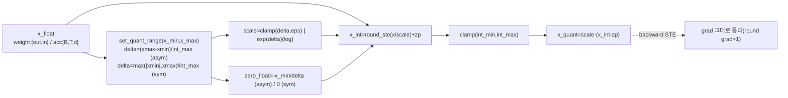
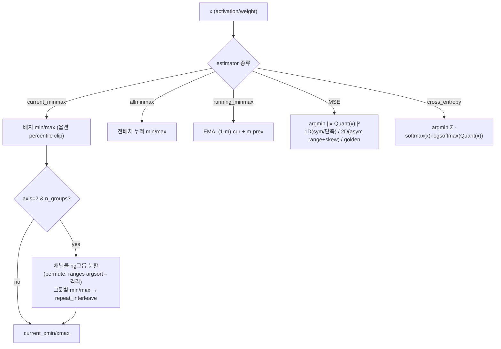
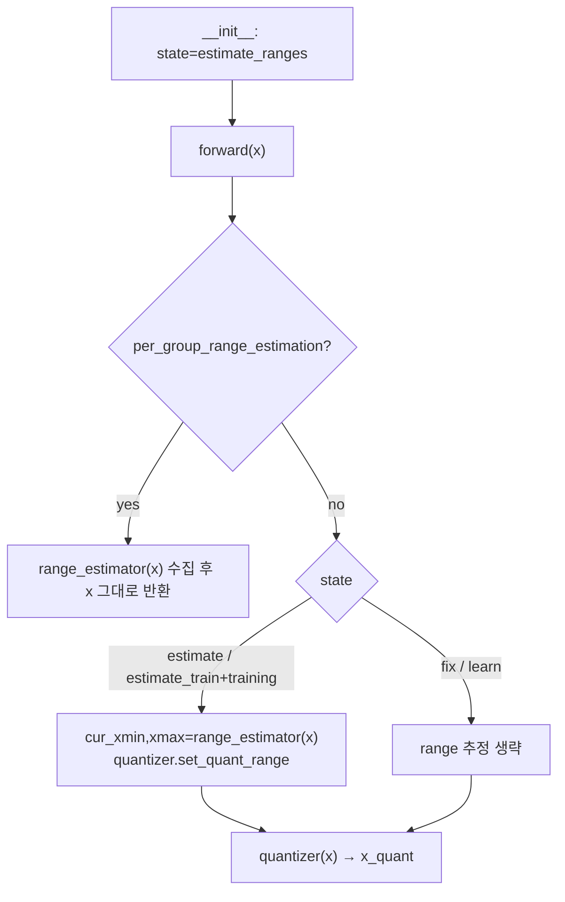
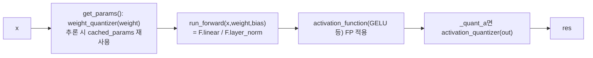
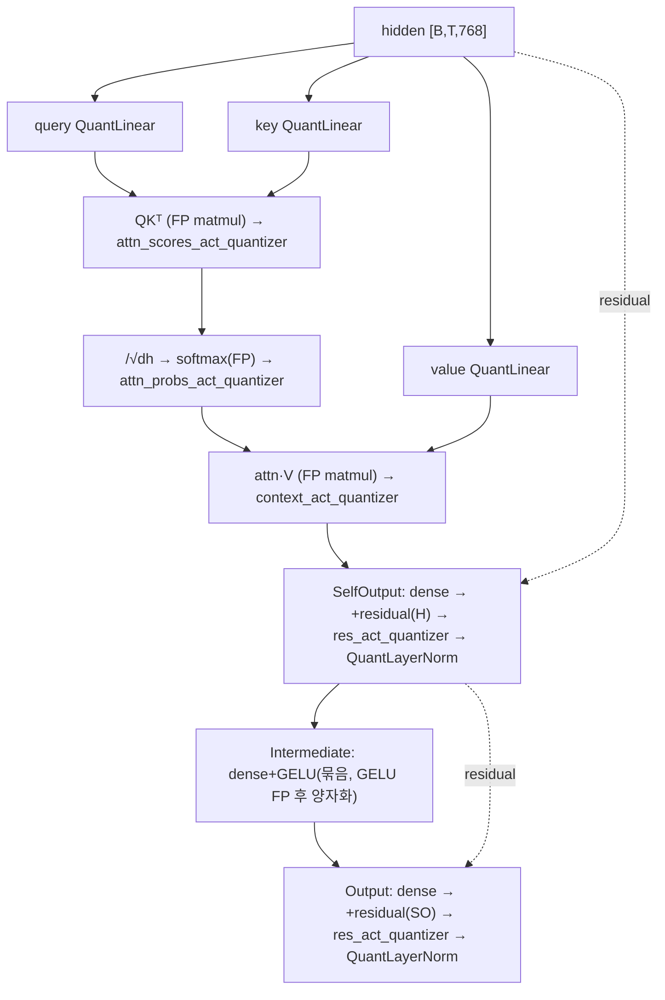
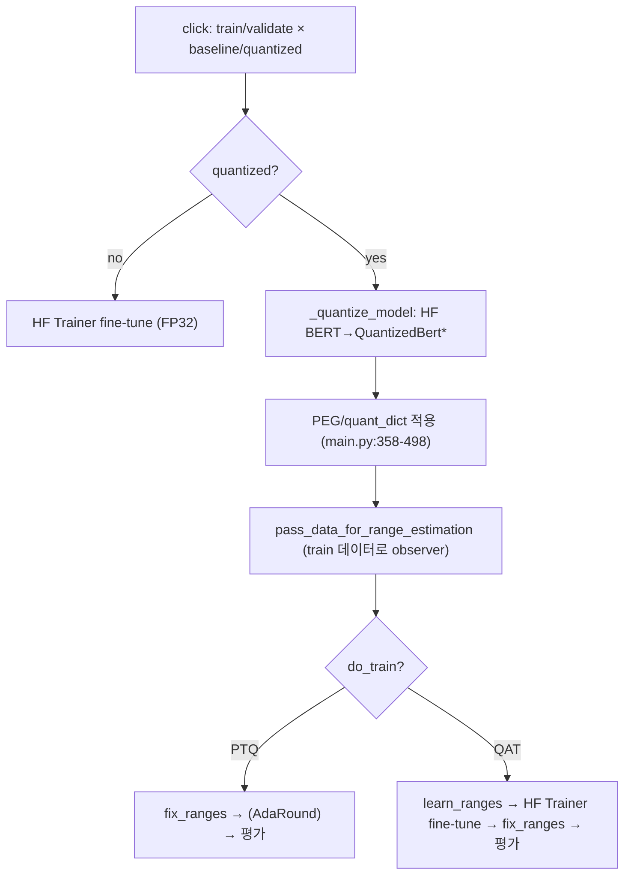

# transformer-quantization (Qualcomm) 모듈 통합 가이드 (S-PyTorch)

> 1차 요약: [`../transformer-quantization.md`](../transformer-quantization.md) — 본 문서는 그 요약을 모듈 단위로 심화한 통합 가이드다.
> 분석 대상: `\\wsl.localhost\ubuntu-24.04\home\user\project\PRJXR-HBTXR\REF\ViT-Quantization\transformer-quantization`
> 작성 원칙: 실제 소스 Read 후 `파일:라인` 근거 표기. 라인 근거 없는 추론은 "추정", 코드로 확인 불가는 "확인 불가"로 명시.
> 형제 가이드(`REF/Analysis/ViT-Quantization/I-ViT/MODULE_GUIDE.md`)의 6요소 구조와 **동형(S-PyTorch 변형)**. HW 지표(MAC lanes/scalar MACs)는 **S-PyTorch 수치 규약**(params/FLOPs/activation memory/비트폭·observer·PEG·mixed precision)으로 치환한다.
> I-ViT와의 본질적 차이: I-ViT는 **integer-only 추론(정수 비선형 LUT/시프트)**, 본 repo는 **fake-quant 캘리브레이션·학습 인프라**(LayerNorm/GELU/softmax 연산은 FP, 그 입출력만 양자화). 즉 본 repo는 **양자화 인프라 베이스라인**(PTQ 5종 observer + AdaRound + QAT range learning + mixed precision + PEG).

---

## 0. 문서 머리말

### 0.1 대표 케이스 선정
- **대표 모델: `bert_base_uncased` (BERT-base, GLUE 분류)** — HuggingFace BERT를 `QuantizedBertForSequenceClassification`로 래핑(`quantized_bert.py:525-555`; `main.py:216-217`). 근거:
  1. README 주력 모델·전 실험 기준선이 `bert_base_uncased`(`README.md:78,140,150-156,189-196`), 논문(EMNLP'21)이 BERT/GLUE 대상.
  2. RoBERTa/MobileBERT는 동일 양자화 코어 재사용(`main.py:218-221`)이라 BERT가 메커니즘 전부를 노출하는 대표 케이스.
- **대표 분석 단위: BERT Encoder 1개 Layer** = `SelfAttention(Q/K/V QuantLinear + QKᵀ·AV는 FP matmul, score/probs/context 각각 act-quant + softmax FP) → SelfOutput(dense + residual + res_act_quant + LayerNorm) → Intermediate(dense+GELU 묶음) → Output(dense + residual + res_act_quant + LayerNorm)` (`quantized_bert.py:91-218, 221-291, 294-371`). BERT-base는 이 Layer를 12개 적층(`main.py:394`).
- **대표 정량 단위(BERT-base config)**: hidden `d=768`, heads `H=12`, head_dim `dh=64`, intermediate `4d=3072`, layers `L=12`, vocab `V=30522`, max_seq `T=128`(`README.md:79,192`). 이 값들은 HuggingFace config에서 로드(`quantized_bert.py:98-100, 396`)되며 본 repo 코드에 하드코딩되지 않음 → params/FLOPs는 **분석적 산출**(표준식×config).
- **대표 양자화 3대 신규 기여**: ① mixed-precision PTQ(`quant_dict`로 텐서별 비트, `main.py:443-498`), ② **PEG(per-embedding-group) quantization**(`per_embd_quant_utils.py`, `range_estimators.py:87-116`), ③ QAT range learning(`quantizers.py:284-288`, `quantization_manager.py:82-84`).

### 0.2 S-PyTorch 수치 규약 (HW의 MAC lanes/scalar MACs 대체)
- **params**: 모듈 차원 분석적 계산. Linear `in·out (+out bias)`, LayerNorm `2·d`(weight+bias), Embedding `num_embeddings·embedding_dim`. 본 repo는 FP 가중치를 그대로 두고 forward마다 fake-quant(`hijacker.py:78-79`, `quantizers.py:208-209`)하므로 **params 개수는 FP 원본과 동일**(학습 가능 추가 파라미터는 range learning 시 `_delta`/`_zero_float`뿐, `quantizers.py:287-288`).
- **FLOPs/MACs**: 표준식×config. Linear MAC = `B·T·in·out`. Attention QKᵀ = `B·H·T²·dh`, AV = `B·H·T²·dh`(`quantized_bert.py:153,208`). 대표 레이어 1개를 BERT-base(B=1, T=128, d=768, H=12, dh=64)로 산출 후 12 layer 환원.
- **activation memory**: 텐서 shape × 비트폭. 본 repo는 fake-quant라 실제 메모리는 FP32이지만(`quantizers.py:209`가 `scale·(x_int - zp)`=float), **정수 도메인 비트폭**(n_bits/n_bits_act)을 "HW 환산 activation bit"로 표기 — `shape × n_bits`. mixed precision은 `quant_dict`로 텐서별 비트 지정(`main.py:443-498`).
- **비트폭/observer(range estimator)**: 코드 직접. 기본 `n_bits=8`(`base_quantized_classes.py:41`), 가중치=symmetric / 활성=asymmetric 권장(`README.md:152-153`). observer 5종(`range_estimators.py:62-502`): current_minmax / allminmax / running_minmax(EMA) / MSE / cross_entropy. 가중치 기본 current_minmax, 활성 기본 running_minmax(`base_quantized_classes.py:42-44`).
- **PEG**: 임베딩 차원(axis=2)을 N그룹으로 나눠 그룹별 scale/zp(`per_embd_quant_utils.py:15-20`, `range_estimators.py:87-116`). range 기반 permutation으로 outlier 채널 격리(`range_estimators.py:92-109`).
- **정확도/속도**: README/논문 인용. 본 README는 **수치 결과표 미수록**(명령어·구조만) → GLUE 점수는 **확인 불가**(아래 0.4 참조). 본 세션 미실행 → 측정 불가 항목은 "확인 불가".

### 0.3 운영 경로 (FP fine-tune ↔ PTQ 캘리브레이션 ↔ QAT ↔ GLUE 평가)
```
[A. FP fine-tune] train-baseline: HF BERT를 GLUE 태스크에 fine-tune  (main.py:872-873, README.md:78-81)
   │  output_dir/out/pytorch_model.bin 저장 (HF Trainer, README.md:91-96)
   ▼
[B. PTQ] validate-quantized:
   │  _quantize_model: HF BERT → QuantizedBert* 래핑      (main.py:212-240)
   │  pass_data_for_range_estimation: train 데이터로 observer가 min/max 추정  (main.py:251-259, qat_utils.py:17-24)
   │  model.fix_ranges(): scale/zp 동결                    (main.py:260, quantization_manager.py:76-80)
   │  (옵션) AdaRound: 가중치 rounding 학습                (main.py:566-588, adaround.py:27-136)
   ▼
[C. QAT] train-quantized:
   │  prepare_model_for_quantization: 초기 range 추정 후    (qat_utils.py:14-24)
   │     learn_ranges()로 _delta/_zero_float를 nn.Parameter화  (qat_utils.py:27-29, quantizers.py:284-288)
   │  HF Trainer로 task loss 역전파(STE) → scale·weight 동시 학습  (main.py:652-656)
   │  학습 후 fix_ranges() 동결                            (main.py:659-663)
   ▼
[GLUE 평가] _eval_task: HF Trainer.evaluate → task별 metric  (main.py:748-784)
```
- 타깃 디바이스: **CUDA 권장이나 코드상 강제 아님** — 양자화 코어(`quantizers.py`/`range_estimators.py`/`quantization_manager.py`)에 `.cuda()` 하드코딩 **없음**(I-ViT와 차이). 텐서는 입력 device 따라감(`range_estimators.py:139,375`, `quantizers.py` 전반). `--cuda` 플래그(`README.md:78,189`)와 AdaRound의 GPU 캐싱(`adaround.py:211-227`)은 있으나 fake-quant 자체는 CPU 가능(추정, 미실행 검증 불가).

### 0.4 모델 / 데이터셋 / 정확도 (README 인용)
| 항목 | 값 | 근거 |
|---|---|---|
| 주력 모델 | bert_base_uncased | `README.md:78,140,189`; `main.py:216` |
| 추가 모델 | RoBERTa, MobileBERT (동일 코어 재사용) | `main.py:218-221`; `models/quantized_roberta.py`, `quantized_mobilebert.py`(미열람) |
| 데이터셋 | GLUE (RTE, CoLA, MNLI, MRPC, QNLI, QQP, SST-2, STS-B) | `README.md:104-135`; `main.py:752` |
| FP fine-tune | lr 3e-5, batch 8, 3 epoch (RTE 예) | `README.md:78-80` |
| 비트 설정 | W8A8(기본), W8A{8,16}(mixed), W4A32+AdaRound, W4A8(QAT), Et 2bit | `README.md:150-200` |
| GLUE 점수 표 | **README에 미수록** → 확인 불가 (논문 본문 참조 필요) | `README.md` 전체에 결과표 없음 |
| latency/속도 | 본 repo 미측정, fake-quant라 실측 의미 제한 | 확인 불가 |
- 논문(EMNLP'21)은 GLUE에서 PTQ SOTA를 주장하나(`README.md:25` abstract), **구체 점수는 README에 없음** → 본 가이드는 점수를 "확인 불가"로 표기.

---

## 1. Repo / 양자화 인프라 맵

transformer-quantization = BERT 등 Transformer의 양자화 **인프라 라이브러리**. 핵심은 ① 재사용 가능한 양자화 코어(quantizer + range estimator + manager + hijacker), ② nn.Module → 양자화 모듈 자동 변환(`autoquant_utils.py`), ③ 구조별 양자화 지점이 박힌 BERT 래퍼(`quantized_bert.py`). 모델·데이터·Trainer·optimizer는 **HuggingFace `transformers`를 그대로 임포트**(`quantized_bert.py:10-17`, `main.py:19-26`).

### 1.1 자체 소스 vs 외부 프레임워크 vs 제외

| 구분 | 파일(자체 소스) | 역할 |
|---|---|---|
| **양자화기** | `quantization/quantizers.py` ★핵심 | Asymmetric/Symmetric Uniform Quantizer(STE), log-domain scale, range-trainable 승격 |
| **Range Estimator(observer)** | `quantization/range_estimators.py` ★핵심 | current/all/running min-max, MSE(1D/2D grid·golden), cross-entropy, **PEG·permutation** |
| **Quant Manager** | `quantization/quantization_manager.py` ★핵심 | Quantizer+RangeEstimator 결합, 4-state(estimate/fix/learn/estimate_train) 상태머신 |
| **Hijacker** | `quantization/hijacker.py` ★핵심 | Linear/Conv/LN forward 가로채기(weight 양자화→연산→act 양자화), GELU는 FP 후 양자화 |
| **자동 변환** | `quantization/autoquant_utils.py` | `quantize_model`: nn.Linear/LayerNorm/Embedding→Quant* 매핑 |
| **base 토글** | `quantization/base_quantized_classes.py` | QuantizedModule/Activation/FP32Acts, 전모델 일괄 상태 전환 |
| | `quantization/base_quantized_model.py` | QuantizedModel(모델 단위 quantized/full_precision/fix/estimate 토글) |
| **AdaRound** | `quantization/adaround/{adaround,quantizer,utils,config}.py` | 가중치 rounding(up/down) 학습(learned_hard_sigmoid) |
| **모델 래퍼** | `models/quantized_bert.py` ★핵심 | 임베딩/어텐션/FFN/LN/GELU 구조별 양자화 지점 |
| | `models/quantized_roberta.py`, `quantized_mobilebert.py` | RoBERTa/MobileBERT 래퍼(미열람) |
| **PEG 설정** | `utils/per_embd_quant_utils.py` ★핵심 | quant_dict 값→axis/n_groups/permute hijack |
| **CLI/학습** | `main.py` | click 4커맨드(train/validate × baseline/quantized), PTQ/QAT 오케스트레이션 |
| | `utils/qat_utils.py` | prepare_model_for_quantization(range 추정→learn/fix) |
| | `utils/{quant_click_options,transformer_click_options,glue_tasks,hf_models,tb_utils,utils}.py` | CLI 옵션·태스크·HF 로드·TB(미정독 세부) |

### 1.2 forward 진입점
`QuantizedBertForSequenceClassification.forward`(`quantized_bert.py:557-622`) → `self.bert`(`QuantizedBertModel.forward` `:426-522`) → `embeddings`(`:494-499`) → `encoder`(12×`QuantizedBertLayer` `:500-509`) → `pooler` → `classifier`(`:597`). 각 Quant 모듈은 forward 시 `get_params()`(weight 양자화) → `run_forward`(실제 연산) → `quantize_activations`(출력 양자화) 3단(`hijacker.py:66-70`).

### 1.3 제외 (지시에 따라 이름만 표기, 미분석)
- **외부 프레임워크(커스텀 아님)**: HuggingFace `transformers`의 `BertLayer/BertSelfAttention/BertSelfOutput` 등 원본 모듈(`quantized_bert.py:10-17`), `Trainer/TrainingArguments/default_data_collator`(`main.py:19`), `scipy.optimize.minimize_scalar`(`range_estimators.py:10`). BERT/RoBERTa/MobileBERT **원본 사전학습 체크포인트**(HF Hub `pytorch_model.bin`) — 가중치만 로드, 양자화 래핑은 본 repo.
- **제외(체크포인트/산출물)**: `pytorch_model.bin`, `state_dict_adaround.pth` 등(`README.md:91-96`, `main.py:588`) — 이름만.
- **미열람(확인 불가)**: `models/quantized_roberta.py`/`quantized_mobilebert.py` 세부(BERT와 동일 코어 재사용 추정), `quantization/adaround/{quantizer,utils,config}.py` 세부(adaround.py 호출 시그니처로 메커니즘은 파악), `utils/{quant_click_options,glue_tasks,hf_models,tb_utils,utils}.py` 세부(CLI/데이터 파이프라인).

### 1.4 대표 모델 레이어 구성 (BERT-base, 1 Encoder Layer)
`QuantizedBertLayer`(`quantized_bert.py:294-371`)당 QuantLinear 6개(Q/K/V + selfoutput.dense + intermediate.dense + output.dense), LayerNorm 2개(selfoutput.LayerNorm + output.LayerNorm, **모두 QuantLayerNorm으로 양자화**), GELU 1개(intermediate, **FP 계산 후 출력 양자화**), softmax 1개(**FP**), QuantizedActivation(독립 act-quant) 5개(attn_scores/attn_probs/context/selfoutput.res/output.res). matmul(QKᵀ, AV)은 **torch.matmul FP**이며 입력 act는 별도 quant.

---

## 2. 모듈: Uniform Quantizer (STE) — `quantizers.py` (Asymmetric/Symmetric)

### 2.1 역할 + 상위/하위
- **역할**: FP 텐서를 uniform affine 양자화하는 nn.Module. forward = fake-quant(`x_int` 계산 후 `scale·(x_int-zp)`로 dequant), backward = STE(round의 grad=1). scale/zp를 buffer로 보유하다 `make_range_trainable()`로 nn.Parameter 승격 → QAT range learning.
- **상위**: `QuantizationManager`가 `self.quantizer`로 보유·호출(`quantization_manager.py:53,106`). **하위**: `RoundStraightThrough`(`quantizers.py:12-19`).

### 2.2 데이터플로우 (텐서 shape 흐름)


### 2.3 forward call stack
`QuantizationManager.forward`(`quantization_manager.py:106`) → `AsymmetricUniformQuantizer.forward`(`quantizers.py:189`) → per-axis/per-channel 조정(`:202-206`) → `to_integer_forward`(`:172-187`) → `round_ste_func`(`:184`) + `torch.clamp`(`:185`) → dequant(`:209`).

### 2.4 대표 코드 위치
`quantizers.py`: STE `:12-33`, `AsymmetricUniformQuantizer` `:81-289`(scale `:142-147`, zp `:149-153`, `to_integer_forward` `:172-187`, `forward` `:189-211`, `set_quant_range` `:263-282`, `make_range_trainable` `:284-288`), `SymmetricUniformQuantizer` `:291-349`(int_min/max `:321-328`, zp=0 `:330-332`, set_quant_range absmax `:334-344`).

### 2.5 대표 코드 블록

```python
# quantizers.py:172-187  fake-quant 정수화 (STE round)
def to_integer_forward(self, x_float):
    x_int = round_ste_func(x_float / self.scale) + self.zero_point   # round STE → 정수+zp
    x_int = torch.clamp(x_int, self.int_min, self.int_max)
    return x_int
# :208-209  forward: 정수화 후 다시 실수 격자로 (fake-quant)
x_int = self.to_integer_forward(x_float)
x_quant = self.scale * (x_int - self.zero_point)
```
→ I-ViT는 `x_int·scale`를 다음 레이어로 정수 전파하지만, 본 repo는 **즉시 dequant(`scale·(x_int-zp)`)** 해 FP 격자로 복귀 = fake-quant. 추론 정수화는 안 함(인프라/캘리브레이션 목적).

```python
# quantizers.py:263-277  비대칭 range → scale/zp
def set_quant_range(self, x_min, x_max):
    x_min, x_max = self._tensorize_min_max(x_min, x_max)   # x_min≤0, x_max≥eps 보정(:258-259)
    self._delta = (x_max - x_min) / self.int_max           # scale
    self._zero_float = (-x_min / self.delta).detach()      # 실수 zero-point
# quantizers.py:334-344  대칭(가중치) range → absmax scale, zp=0
self._signed = x_min.min() < 0
x_absmax = torch.max(x_min.abs(), x_max)
self._delta = x_absmax / self.int_max                      # 부호 대칭
```
→ 가중치=symmetric(zp=0, HW에서 zero-point 가산 불필요), 활성=asymmetric(`README.md:152-153`).

```python
# quantizers.py:284-288  range learning: scale/zp를 nn.Parameter로 승격 (QAT 핵심)
def make_range_trainable(self):
    if self.delta not in self.parameters():
        self._delta = torch.nn.Parameter(self._delta)
        self._zero_float = torch.nn.Parameter(self._zero_float)
```
→ scale 자체를 task loss로 학습(`scale_domain='log'`면 `exp(delta)`로 양수 보장, `:146-147`). I-ViT의 running min/max observer와 대비되는 **learnable-scale** 접근.

### 2.6 연산·수치표현 분해 + 정량
- **양자화 방식**: uniform affine. asym `s=(xmax-xmin)/(2^b-1)`, `z=round(-xmin/s)`(`:140,276-277`); sym `s=max(|xmin|,xmax)/int_max`, `z=0`, signed면 int∈[-2^{b-1},2^{b-1}-1](`:321-344`).
- **scale/zp**: buffer(`:101-102`) → range learning 시 Parameter(`:287-288`). per-channel/per-axis broadcast(`:213-232`).
- **비트폭**: `n_bits`(기본 8, `base_quantized_classes.py:51`), mixed precision은 `quantizer.n_bits` 직접 변경(`per_embd_quant_utils.py:11-12`).
- **params**: 0(추론 가중치 추가 없음). range learning 시 텐서당 `_delta`+`_zero_float`(per-tensor면 스칼라 2개, per-channel이면 out개 ×2).
- **FLOPs**: 원소수 N에 div+round+clamp+sub+mul = O(N). 대표 BERT-base Q weight(768×768=590K 원소) 양자화 = 590K div+round (forward마다 재계산, QAT 비용 요인; 단 추론은 `cached_params` 캐시, `hijacker.py:81-86`).
- **activation bit**: 출력은 FP(fake-quant) → HW 환산 비트는 n_bits.

---

## 3. 모듈: Range Estimator (observer) — `range_estimators.py` ★핵심 (PEG·MSE 정밀해부)

### 3.1 역할 + 상위/하위
- **역할**: 데이터로부터 양자화 range(`x_min`/`x_max`)를 추정. 5종 — current/all/running min-max(통계형), MSE/cross-entropy(최적화형). PEG(per-group)와 range-permutation도 여기서 구현.
- **상위**: `QuantizationManager.range_estimator`(`quantization_manager.py:61-67`)가 estimate 상태에서 호출(`:103`). **하위**: `np.percentile`, `scipy.minimize_scalar`(`range_estimators.py:10`), `self.quantizer`(MSE 후보 평가용, `:288-294`).

### 3.2 데이터플로우 (5종 + PEG)


### 3.3 forward call stack
- 통계형: `QuantizationManager.forward`(`quantization_manager.py:99-104`) → `CurrentMinMaxEstimator.forward`(`range_estimators.py:67`) / `RunningMinMaxEstimator.forward`(`:177`) → `set_quant_range`.
- MSE형: `MSE_Estimator.forward`(`:472-486`) → `optimization_method`(`:266-285`) → `_perform_1D_search`/`_perform_2D_search`/golden(`:356-470`) → 각 후보마다 `loss_fx`(`:248-256`) → `quantize`(`:287-294`, temp quantizer로 fake-quant).

### 3.4 대표 코드 위치
`range_estimators.py`: `CurrentMinMaxEstimator` `:62-145`(percentile `:121-140`, PEG `:87-116`, permute `:68-79,92-109`), `RunningMinMaxEstimator` `:172-216`(EMA `:213-214`), `MSE_Estimator` `:228-490`(2D search `:378-420`, golden `:422-470`), `CrossEntropyEstimator` `:493-502`.

### 3.5 대표 코드 블록

```python
# range_estimators.py:213-214  RunningMinMax: momentum EMA (기본 momentum=0.9, :173)
self.current_xmin = (1 - self.momentum) * x_min + self.momentum * self.current_xmin
self.current_xmax = (1 - self.momentum) * x_max + self.momentum * self.current_xmax
```

```python
# range_estimators.py:87-116  PEG: 임베딩 차원을 ng그룹으로 분할, 그룹별 min/max
ng = self.n_groups
gs = x.size(0) // ng                          # 그룹 크기
if self.ranges is not None:                    # permutation: 유사 range 채널끼리 묶기
    i = torch.argsort(self.ranges)
    P = torch.eye(len(i), device=self.ranges.device)[i]
    x = P.mm(x)                                # 채널 재배열
x = x.view(ng, -1)
m = x.min(-1)[0].detach(); M = x.max(-1)[0].detach()
m = m.repeat_interleave(gs); M = M.repeat_interleave(gs)   # 그룹 scale을 채널로 확장
if self.ranges is not None:
    m = P.T.mv(m); M = P.T.mv(M)              # 원래 채널 순서로 복원
```
→ **PEG 핵심**: D채널을 ng그룹으로 나눠 그룹별 독립 range. `per_group_range_estimation`(`:68-79`)은 range만 수집(permutation 사전계산), 이후 `argsort(ranges)`로 outlier 채널을 한 그룹에 격리해 다른 그룹 해상도 보존(논문 신규 기여).

```python
# range_estimators.py:248-256  MSE loss: 재구성 오차 (per-channel 옵션)
def loss_fx(self, data, neg_thr, pos_thr, per_channel_loss=False):
    y = self.quantize(data, x_min=neg_thr, x_max=pos_thr)   # 후보 range로 fake-quant
    temp_sum = torch.sum(((data - y) ** 2).view(len(data), -1), dim=1)
    return to_numpy(temp_sum) if per_channel_loss else to_numpy(torch.sum(temp_sum))
```
→ MSE estimator는 clipping range를 grid(`num_candidates=100`, `:229`) 또는 golden-section(scipy)로 탐색. 비대칭이면 range+skew 2D 탐색(`:378-420`), `max_int_skew=2^b//4`(`:246`).

```python
# range_estimators.py:121-140  percentile clipping (outlier 절단)
if self.percentile:
    x_min, x_max = np.percentile(data_np, (self.percentile, 100 - self.percentile), axis=-1)
```

### 3.6 연산·수치표현 분해 + 정량
- **양자화 방식(estimator별)**: current(배치), all(누적), running(EMA m=0.9), MSE(재구성 최소화), cross_entropy(분포 KL, logits용 `:498-502`).
- **PEG**: axis=2, n_groups=N. 그룹별 scale → HW에서 채널 그룹 단위 dequant 필요(추정).
- **비트폭**: estimator는 `quantizer.n_bits`로 후보 평가(`:246,319,393`). 추정 자체는 비트 무관.
- **params**: 0(buffer `current_xmin/xmax`만, `:21-22`). MSE는 `loss_array` numpy 임시버퍼(`:336,347`).
- **FLOPs**: minmax는 O(N) reduce. MSE는 **num_candidates(100)×(asym이면 ×max_int_skew×2) 후보 × fake-quant O(N)** → PTQ 캘리브레이션의 주 비용. golden-section은 scipy 최적화(반복 적음). 대표 BERT-base weight(768×768) MSE 1D grid = 100×590K fake-quant ≈ 59M 원소연산/레이어(추정).
- **시사**: MSE/percentile/PEG가 outlier 대응 도구상자. running_minmax(activation 기본)는 I-ViT의 momentum observer와 동형(단 m=0.9 vs I-ViT 0.95).

---

## 4. 모듈: Quantization Manager (상태머신) — `quantization_manager.py`

### 4.1 역할 + 상위/하위
- **역할**: Quantizer + RangeEstimator를 묶고 **4-state 상태머신**으로 range 수명주기 관리. estimate(추정 갱신) / fix(동결) / learn(Parameter 학습) / estimate_train(train만 추정).
- **상위**: `QuantizationHijacker`가 `weight_quantizer`/`activation_quantizer`로 2개 보유(`hijacker.py:44-62`), `QuantizedActivation`이 1개 보유(`base_quantized_classes.py:133-138`). **하위**: `self.quantizer`(§2), `self.range_estimator`(§3).

### 4.2 데이터플로우 (상태머신)


### 4.3 forward call stack
`hijacker.forward`(`hijacker.py:66`) → `weight_quantizer(weight)`(`:79`) = `QuantizationManager.forward`(`quantization_manager.py:94`) → (estimate면) `range_estimator(x)`(`:103`) → `set_quant_range`(`:104`) → `self.quantizer(x)`(`:106`).

### 4.4 대표 코드 위치
`quantization_manager.py`: `Qstates` enum `:12-16`, `__init__`(quantizer/estimator 생성) `:38-67`, state 전환 `:73-92`, `learn_ranges` `:82-84`, `forward`(상태 분기) `:94-106`.

### 4.5 대표 코드 블록
```python
# quantization_manager.py:94-106  상태 기반 range 추정 + 양자화
def forward(self, x):
    if self.range_estimator.per_group_range_estimation:
        self.range_estimator(x); return x                  # permutation 사전계산(양자화 안 함)
    if self.state == Qstates.estimate_ranges or (
        self.state == Qstates.estimate_ranges_train and self.training):
        cur_xmin, cur_xmax = self.range_estimator(x)
        self.set_quant_range(cur_xmin, cur_xmax)            # observer→scale/zp 갱신
    return self.quantizer(x)                                # fake-quant
```
```python
# quantization_manager.py:82-84  learn_ranges: quantizer를 학습 모드로
def learn_ranges(self):
    self.quantizer.make_range_trainable()                  # _delta/_zero_float → Parameter
    self.state = Qstates.learn_ranges
```
→ I-ViT의 `running_stat` ON/OFF 토글(QuantAct.fix/unfix)을 일반화한 **4-state 상태머신**. PTQ는 estimate→fix, QAT는 estimate→learn.

### 4.6 연산·수치표현 분해 + 정량
- **양자화 방식**: estimator+quantizer 조합 위임. state로 range 갱신 여부 결정.
- **params**: learn 상태에서 quantizer의 `_delta`/`_zero_float`가 Parameter(§2.6).
- **FLOPs**: estimate 상태에서만 estimator O(N) 추가, fix/learn은 quantize만.
- **시사**: estimate(PTQ 캘리브레이션)→fix(추론) / estimate→learn(QAT)의 명시적 상태 분리 = HW 캘리브레이션 파이프라인의 레퍼런스. `set_quant_range`로 외부 주입 시 즉시 fix(`:56-58`)도 가능.

---

## 5. 모듈: Hijacker (Linear/LN forward 가로채기) — `hijacker.py`

### 5.1 역할 + 상위/하위
- **역할**: nn.Linear/LayerNorm/Conv의 forward를 mixin으로 가로채 **weight 양자화 → 실제 연산 → activation 양자화** 3단을 강제. 활성함수(GELU 등)는 연산 후·양자화 전에 적용(GELU는 FP 계산, 출력만 양자화).
- **상위**: `QuantLinear(QuantizationHijacker, nn.Linear)` 식 다중상속(`autoquant_utils.py:16-21`, `hijacker.py:23-26`). **하위**: `weight_quantizer`/`activation_quantizer`(QuantizationManager).

### 5.2 데이터플로우


### 5.3 forward call stack
`hijacker.forward`(`hijacker.py:66`) → `get_params`(`:72-86`, `_quant_w`면 `weight_quantizer(weight)` `:78-79`) → `run_forward`(서브클래스, 예 `QuantLinear.run_forward`=`F.linear` `autoquant_utils.py:20-21`) → `quantize_activations`(`:98-116`, GELU 적용 `:102-103` + `_quant_a`면 act-quant `:108-109`).

### 5.4 대표 코드 위치
`hijacker.py`: `activations_list`(GELU 포함) `:15`, `__init__`(weight/act quantizer 생성) `:35-64`, weight range가 current_minmax면 percentile 전달 `:52-53`, `forward` `:66-70`, `get_params`(캐시) `:72-86`, `quantize_activations`(GELU 후 양자화) `:98-116`.

### 5.5 대표 코드 블록
```python
# hijacker.py:66-70  3단 forward
def forward(self, x, offsets=None):
    weight, bias = self.get_params()              # weight 양자화
    res = self.run_forward(x, weight, bias, offsets=offsets)   # F.linear 등
    res = self.quantize_activations(res)          # GELU(FP) → act 양자화
    return res
```
```python
# hijacker.py:98-109  활성함수는 FP로 계산, 그 출력을 양자화
def quantize_activations(self, activations):
    if self.activation_function is not None:
        activations = self.activation_function(activations)   # nn.GELU 등 FP
    if self._quant_a:
        activations = self.activation_quantizer(activations)  # 출력만 양자화
    return activations
```
→ **I-ViT와 결정적 차이**: I-ViT는 GELU/Softmax/LayerNorm을 정수 연산(IntGELU/IntSoftmax/IntLayerNorm)으로 대체. 본 repo는 **연산 자체는 FP, 입출력 텐서만 양자화** → 완전 integer-only가 아님(인프라/정확도 분석 목적). `activations_list`(`:15`)에 ReLU/GELU/Sigmoid/Tanh 등.

### 5.6 연산·수치표현 분해 + 정량
- **양자화 방식**: weight per-tensor/per-channel(설정), act per-tensor(기본). weight·act 각각 별도 manager.
- **params**: 0(원본 weight/bias 재사용, `autoquant_utils.py:155-158`).
- **FLOPs**: run_forward = 원래 Linear/LN MAC + weight 양자화 O(weight) + act 양자화 O(out). 추론 시 weight 양자화는 `cached_params`로 1회(`:81-86`).
- **시사**: weight 캐시(`:73-74,81-86`)는 HW에서 가중치를 1회 양자화해 상주시키는 패턴과 1:1.

---

## 6. 모듈: 자동 변환 — `autoquant_utils.py` (quantize_model)

### 6.1 역할 + 상위/하위
- **역할**: 임의 nn.Module 트리를 재귀 순회하며 `nn.Linear→QuantLinear`, `nn.LayerNorm→QuantLayerNorm`, `nn.Embedding→QuantEmbedding`로 자동 치환. Sequential은 (dense, activation) 쌍을 묶어 한 모듈로(GELU 흡수).
- **상위**: `quantized_bert.py`가 모든 양자화 대상에 호출(`:36-39,57,110-112,229,236,291`). **하위**: `module_map`(`:88-92`), 각 Quant* 클래스.

### 6.2 대표 코드 위치
`autoquant_utils.py`: Quant* 정의 `:16-85`(QuantLinear `:16-21`, QuantLayerNorm `:55-66`, QuantEmbedding `:69-85`), `module_map` `:88-92`, `quantize_sequence`(GELU 묶기) `:163-206`, `quantize_model`(재귀) `:219-252`.

### 6.3 대표 코드 블록
```python
# autoquant_utils.py:69-74  Embedding은 act 양자화 안 함 (룩업=이미 양자화)
class QuantEmbedding(QuantizationHijacker, nn.Embedding):
    def __init__(self, *args, activation=None, **kwargs):
        super().__init__(*args, activation=activation, **kwargs)
        self.activation_quantizer = FP32Acts()   # 임베딩 출력은 양자화 안 함(weight만)
```
```python
# autoquant_utils.py:149-160  Sequential에서 (Linear, GELU) 쌍을 한 모듈로
def quant_module(module, i, **quant_params):
    act, act_idx = get_act(module, i)            # 뒤따르는 활성함수 탐색
    new_module = modtype(**get_module_args(module[i], act), **quant_params)
    new_module.weight.data = module[i].weight.data.clone()
```
→ `quantize_intermediate`(`quantized_bert.py:283-291`)가 `nn.Sequential(dense, GELU)`를 넘기면 dense의 출력(GELU 적용 후) 양자화로 묶임(`get_act` `:98-105`).

### 6.4 연산·수치표현 분해 + 정량
- **양자화 방식**: 모듈 타입별 매핑(`module_map` `:88-92`). 비지원 타입은 자식 재귀(`:244-251`).
- **params**: 0(weight.data 복제, `:155,240`).
- **FLOPs**: 변환은 1회 그래프 빌드(추론·학습 경로 외).

---

## 7. 모듈: base 토글 + FP32Acts — `base_quantized_classes.py` / `base_quantized_model.py`

### 7.1 역할 + 상위/하위
- **역할**: `QuantizedModule`(모듈 단위)·`QuantizedModel`(모델 단위)에 **양자화/FP 전환·range 상태 전환·캐시 관리** API 일괄 제공. `FP32Acts`는 특정 텐서를 양자화 우회(16/32-bit 유지). `QuantizedActivation`은 독립 act-quant 삽입점.
- **상위**: 모든 Quant 모듈/모델의 부모. **하위**: `QuantizationManager`.

### 7.2 대표 코드 위치
`base_quantized_classes.py`: `QuantizedModule`(상태 API) `:35-126`(quantized/full_precision `:79-99`, learn/fix/estimate `:101-111`, cached_params `:62-63,116,120`), `QuantizedActivation` `:129-147`, `FP32Acts` `:150-155`. `base_quantized_model.py`: 모델 단위 토글 `:21-113`(fix_act_ranges `:70-75`, set_quant_state `:104-113`).

### 7.3 대표 코드 블록
```python
# base_quantized_classes.py:150-155  양자화 우회 (mixed precision FP 텐서)
class FP32Acts(nn.Module):
    def forward(self, x):
        return x                    # 양자화 안 함 → 16/32-bit 유지
```
```python
# base_quantized_model.py:104-113  모델 전체 weight/act 양자화 상태 일괄 설정
def set_quant_state(self, weight_quant, act_quant):
    if act_quant: self.quantized_acts()
    else: self.full_precision_acts()
    if weight_quant: self.quantized_weights()
    else: self.full_precision_weights()
```
→ `model.apply(_fn)`으로 전 서브모듈에 일괄 전파(`base_quantized_model.py:21-102`). PTQ/QAT 오케스트레이션(`main.py:234,263,659-663`)이 이 토글로 상태 전환.

### 7.4 연산·수치표현 분해 + 정량
- **params**: 0(상태 플래그 `_quant_w/_quant_a`만).
- **시사**: `FP32Acts` 치환(`per_embd_quant_utils.py:13-14`, `quantized_bert.py:549`)이 mixed precision의 "이 텐서는 FP 유지" 선언 = HW 비트할당 예외 지정.

---

## 8. 모듈: 양자화 BERT — `quantized_bert.py` (구조별 양자화 지점) ★핵심

### 8.1 역할 + 상위/하위
- **역할**: HF BERT를 받아 임베딩/어텐션/FFN/LN/GELU/분류기에 **구조별 양자화 지점**을 박은 래퍼. residual 합·attention score/probs/context 각각에 독립 act-quant 삽입(논문이 지목한 residual outlier 제어).
- **상위**: `main.py:_quantize_model`(`:216-217`). **하위**: `quantize_model`(§6), `QuantizedActivation`, `QuantizedBert*` 서브모듈.

### 8.2 데이터플로우 (1 Encoder Layer)


### 8.3 forward call stack
`QuantizedBertLayer.forward`(`quantized_bert.py:321`) → `self.attention`(`QuantizedBertSelfAttention.forward` `:125` + `QuantizedBertSelfOutput.forward` `:238`) → `feed_forward_chunk`(`:368-371`): `self.intermediate`(GELU 묶음) → `self.output`(`QuantizedBertOutput.forward` `:264`).

### 8.4 대표 코드 위치
`quantized_bert.py`: 임베딩 `:26-88`(Et MSE+golden `:33-35`, sum act-quant `:52-53,79,84`, LN 양자화 `:57`), SelfAttention `:91-218`(Q/K/V `:110-112`, score/probs/context act-quant `:116-118,154,198,213`, softmax FP `:197`, 1/√d 흡수 주석 `:189`), SelfOutput `:221-248`(residual `:242-243`), Output `:251-280`(residual TB hist `:268-274`), GELU `:283-291`, 분류기 분기 `:525-555`.

### 8.5 대표 코드 블록
```python
# quantized_bert.py:153-154, 189-198, 208-213  attention 단계별 독립 act-quant + softmax FP
attention_scores = torch.matmul(query_layer, key_layer.transpose(-1, -2))   # FP matmul
attention_scores = self.attn_scores_act_quantizer(attention_scores)         # score 양자화
attention_scores /= math.sqrt(self.attention_head_size)  # NOTE: 1/√d는 이전 act delta에 흡수 가능(:189)
attention_probs = nn.Softmax(dim=-1)(attention_scores)                       # softmax FP
attention_probs = self.attn_probs_act_quantizer(attention_probs)            # probs 양자화
context_layer = torch.matmul(attention_probs, value_layer)                   # FP matmul
context_layer = self.context_act_quantizer(context_layer)                    # context 양자화
```
→ matmul·softmax는 **FP**, 입출력 텐서만 양자화. I-ViT(QuantMatMul 정수 @ + IntSoftmax)와 정반대 설계 철학.

```python
# quantized_bert.py:268-277  residual outlier를 TB로 관측 + res_act_quantizer
_tb_hist(self, input_tensor, 'res_output_x')      # residual 입력 분포
_tb_hist(self, hidden_states, 'res_output_h')     # FFN 출력 분포
hidden_states = hidden_states + input_tensor      # residual 합
_tb_hist(self, hidden_states, 'res_output_x_h')   # 합 후 분포 (outlier 관측 지점)
hidden_states = self.res_act_quantizer(hidden_states)
hidden_states = self.LayerNorm(hidden_states)
```
→ **논문이 지목한 residual outlier를 코드로 직접 관측**(TB 히스토그램). 이 지점이 mixed precision `'y':16`(residual sum 16-bit) 대상(`README.md:163`).

```python
# quantized_bert.py:33-35  임베딩 ultra-low bit는 MSE+golden_section range
if 'Et' in self.quant_dict:
    quant_params_['weight_range_method'] = RangeEstimators.MSE
    quant_params_['weight_range_options'] = dict(opt_method=OptMethod.golden_section)
```
→ 2-bit 임베딩(`README.md:200 --quant-dict "{'Et':2}"`)은 단순 min/max로 불가 → MSE 최적화 range로 정확도 확보.

### 8.6 연산·수치표현 분해 + 정량 (BERT-base, B=1, T=128)
- **양자화 방식**: 구조별 — Q/K/V/dense는 QuantLinear(weight+act), LN은 QuantLayerNorm(연산 FP, 입출력 양자화), GELU FP 후 양자화, matmul/softmax FP+입출력 양자화. residual 합은 res_act_quantizer.
- **params (1 Encoder Layer, d=768)**:
  - Q,K,V: 각 768×768+768 = **590,592** ×3 = 1,771,776
  - selfoutput.dense: 768×768+768 = **590,592**
  - intermediate.dense: 768×3072+3072 = **2,362,368**
  - output.dense: 3072×768+768 = **2,360,064**
  - LayerNorm ×2: 2×768×2 = **3,072**
  - **Layer params ≈ 7.09M**, ×12 ≈ **85.05M** (+ embeddings/pooler/classifier 별도).
  - 임베딩: word 30522×768 ≈ **23.4M** + position 512×768 + token_type 2×768 ≈ 0.4M.
  - **총 ≈ 109M params** (BERT-base 공칭 ~110M와 일치, 양자화로 개수 불변).
- **MACs/Layer (B=1, T=128)**:
  - Q,K,V: 128×768×768 ≈ 75.5M ×3 = **226.5M**
  - selfoutput.dense: 128×768×768 ≈ **75.5M**
  - intermediate.dense: 128×768×3072 ≈ **301.99M**
  - output.dense: 128×3072×768 ≈ **301.99M**
  - QKᵀ: H·T²·dh = 12×128²×64 ≈ **12.58M**; AV: 동일 ≈ **12.58M**
  - **Layer MAC ≈ 931M**, ×12 ≈ **11.17G/시퀀스**(T=128).
- **activation memory (peak, T=128)**: attn 행렬 [1,12,128,128] = 196,608 원소 → A8 192KB / A16 384KB(softmax probs). hidden [1,128,768]=98,304 원소 → A8 96KB / A16 192KB.
- **시사**: attention 행렬(T²)이 활성 peak. residual sum/FFN x·h·y가 outlier 핵심 → 16-bit 승격 대상(`README.md:159-164`).

---

## 9. 모듈: per-embedding-group (PEG) 설정 — `per_embd_quant_utils.py` ★핵심

### 9.1 역할 + 상위/하위
- **역할**: `quant_dict` 값(`'per_embd'`/`'ng6'`/`'ngp6'`/int/`'fp32'`)을 해석해 해당 act-quantizer의 axis/n_groups/permute를 설정. mixed precision(비트 변경)·PEG·permutation·FP 우회를 한 함수로 디스패치.
- **상위**: `main.py`가 임베딩/어텐션/FFN/LN 전체에 호출(`main.py:380-498`). **하위**: `set_act_quant_axis_and_groups`(`:54-68`), `FP32Acts`.

### 9.2 대표 코드 위치
`per_embd_quant_utils.py`: `_hijack_act_quant`(값 디스패치) `:7-22`, `_hijack_weight_quant` `:25-34`, `set_act_quant_axis_and_groups` `:54-68`.

### 9.3 대표 코드 블록
```python
# per_embd_quant_utils.py:7-22  quant_dict 값 → 양자화 모드 디스패치
def _hijack_act_quant(module, value):
    if isinstance(value, int):
        module.activation_quantizer.quantizer.n_bits = value      # mixed precision 비트
    elif value == 'fp32':
        module.activation_quantizer = FP32Acts()                  # 양자화 우회
    elif value == 'per_embd':
        set_act_quant_axis_and_groups(module, axis=2, n_groups=None)   # 임베딩 차원별
    elif value.startswith('ngp'):
        set_act_quant_axis_and_groups(module, axis=2, n_groups=int(value[3:]), permute=True)  # PEG+permute
    elif value.startswith('ng'):
        set_act_quant_axis_and_groups(module, axis=2, n_groups=int(value[2:]), permute=False) # PEG
```
```python
# per_embd_quant_utils.py:54-68  axis/n_groups/permute를 quantizer+estimator에 동기 설정
def set_act_quant_axis_and_groups(module, axis, n_groups, permute=False):
    if hasattr(module, 'activation_quantizer'): module = module.activation_quantizer
    module.axis = axis; module.quantizer.axis = axis; module.range_estimator.axis = axis
    module.n_groups = n_groups; module.range_estimator.n_groups = n_groups
    if permute: module.range_estimator.per_group_range_estimation = True
```
→ axis=2(임베딩 차원 D)별 그룹 양자화. `ngp6`=6그룹+range-permutation(outlier 격리). `main.py:540-558`은 같은 레이어 내 텐서들이 range를 공유(`per_groups_permute_shared_h`)하는 변형도.

### 9.4 연산·수치표현 분해 + 정량
- **양자화 방식**: per-embedding-group. D를 ng로 분할, 그룹별 scale/zp(§3.5). permute는 argsort로 채널 재배열.
- **params**: 0(설정만). 그룹별 scale은 estimator buffer(그룹당 1개 → repeat_interleave로 채널 확장).
- **시사**: PEG는 HW에서 **채널 그룹 단위 dequant 경로** 필요. permutation은 **채널 재배열 테이블** 필요 → 단순 가속기엔 구현 복잡도 증가(추정). 단 outlier를 한 그룹에 격리해 나머지 그룹 저비트 가능 → 면적/정확도 트레이드오프 개선.

---

## 10. 모듈: AdaRound (가중치 rounding 학습) — `quantization/adaround/adaround.py`

### 10.1 역할 + 상위/하위
- **역할**: PTQ에서 가중치의 round-up/down을 **학습**(learned_hard_sigmoid)해 재구성 오차 최소화. W4A32 등 저비트 PTQ 정확도를 QAT 없이 끌어올림. 레이어 단위 local loss 최적화.
- **상위**: `main.py:apply_adaround_to_model`(`:577`, do_train=False & weight_quant 시). **하위**: `ADAROUND_QUANTIZER_MAP`, `CombinedLoss`, `GetLayerInpOut`(adaround/utils.py, 미정독).

### 10.2 대표 코드 위치
`adaround.py`: `apply_adaround_to_layer` `:27-136`(grid init `:34-44`, AdaRound quantizer 교체 `:51-69`, alpha 최적화 `:97-111`), `apply_mse_init` `:160-178`, `apply_mse_out_init` `:181-201`, `optimize_local_loss` `:204-261`(데이터 캐싱 `:207-233`, Adam alpha 학습 `:235-260`).

### 10.3 대표 코드 블록
```python
# adaround.py:97-111  AdaRound: alpha(연속 rounding 변수)만 Adam으로 학습
opt_params = [w_quantizer.alpha]                       # rounding 변수만 학습
optimizer = torch.optim.Adam(opt_params, lr=adaround_config.lr)
optimize_local_loss(layer, get_inp_out, data_tensor, optimizer, loss_fn,
                    batch_size, adaround_config.iters, ...)   # iters 기본 10000(README:182)
```
```python
# adaround.py:160-178  MSE init: weight absmax를 80스텝 축소하며 최적 clip 탐색
w_absmax = torch.max(w.max(), torch.abs(w.min()))
for i in range(80):
    s = w_absmax * (1.0 - 0.01 * i)
    q.set_quant_range(-s, s)
    score = F.mse_loss(w, q(w)).item()                # 재구성 MSE
    if score < best_score: best_score, best_max = score, s
```

### 10.4 연산·수치표현 분해 + 정량
- **양자화 방식**: 가중치 rounding을 soft(연속 alpha)→hard(0/1) 학습. `learned_hard_sigmoid`(`README.md:182`). activation은 별도(W4A32는 act FP).
- **params**: 레이어당 alpha = weight와 동일 shape(임시 학습 변수, 학습 후 hard round로 고정 `:120`). 저장은 `state_dict_adaround.pth`(`main.py:588`).
- **FLOPs**: 레이어당 iters(10000)×batch forward+backward → PTQ 중 가장 비싼 단계지만 QAT(전체 fine-tune)보다 저렴.
- **시사**: AdaRound는 W4까지 PTQ로 끌어올리는 도구. HW 관점은 추론 가중치 = 단순 INT4(rounding만 최적화)라 추론 비용 추가 없음.

---

## 11. 모듈: PTQ/QAT 오케스트레이션 — `main.py` + `qat_utils.py`

### 11.1 역할 + 상위/하위
- **역할**: click CLI 4커맨드. FP fine-tune(baseline) / PTQ·QAT(quantized). PTQ = range 추정→fix→(AdaRound)→평가. QAT = range 추정→learn→HF Trainer fine-tune→fix→평가. PEG/mixed precision 설정 적용.
- **상위**: CLI. **하위**: HF `Trainer`, `prepare_model_for_quantization`(qat_utils), `pass_data_for_range_estimation`(utils.utils, 미정독), `_quantize_model`, PEG/quant_dict hijack.

### 11.2 데이터플로우


### 11.3 forward call stack
`train_quantized`(`main.py:889`) → `_train`(`:846`) → `_run`(`:787`) → `_run_task`(`:316`): `_quantize_model`(`:356`) → PEG/hijack(`:358-498`) → `_prepare_quantized_model`(`:561`) → `prepare_model_for_quantization`(`qat_utils.py:14`): `pass_data_for_range_estimation`(`:17`) → `learn_ranges()`(`:29`) → Trainer.train(`main.py:654`) → `fix_ranges()`(`:661`) → `_eval_task`(`:732`).

### 11.4 대표 코드 위치
`main.py`: `_quantize_model` `:212-240`, PEG 적용 `:358-441`, quant_dict mixed precision `:443-498`, per-group permutation 사전계산·공유 `:512-558`, AdaRound 적용 `:566-588`, fix after train `:659-663`, 4커맨드 `:864-918`. `qat_utils.py`: `prepare_model_for_quantization` `:14-45`(learn vs fix 분기 `:27-41`).

### 11.5 대표 코드 블록
```python
# main.py:251-260  PTQ: train 데이터로 range 추정 후 동결
pass_data_for_range_estimation(loader=loader, model=model,
    act_quant=..., weight_quant=..., max_num_batches=config.act_quant.num_batches, ...)
model.fix_ranges()
```
```python
# qat_utils.py:27-41  QAT(learn) vs PTQ-fix 분기
if config.qat.learn_ranges:
    model.learn_ranges()                       # scale/zp를 nn.Parameter화 (range learning)
else:
    model.estimate_ranges_train()              # train 중 갱신
    if config.qat.fix_weight_ranges: model.fix_weight_ranges()
    if config.qat.fix_act_ranges: model.fix_act_ranges()
```
```python
# main.py:539-558  PEG permutation: 같은 레이어 내 텐서들이 dense의 range 공유
if config.quant.per_groups_permute_shared_h:
    for layer_idx, layer in enumerate(model.bert.encoder.layer):
        source_ranges = ...  # 'dense' 모듈의 ranges
        for k, v in range_estimators.items():
            v.ranges = source_ranges           # 레이어 내 공유 permutation
```

### 11.6 연산·수치표현 분해 + 정량 / 재현 명령
- **양자화 방식**: PTQ(estimate→fix→AdaRound) / QAT(estimate→learn→fine-tune→fix). HF Trainer가 optimizer/scheduler 담당.
- **하이퍼파라미터(QAT W4A8 예, `README.md:189-196`)**: lr 5e-5, batch 8, num_epochs 6, warmup 186, weight_decay 0, dropout 0, max_seq 128, n_bits 4, n_bits_act 8, qmethod symmetric/asymmetric, weight MSE+golden, act current_minmax.
- **재현 명령**:
  ```bash
  # W8A8 PTQ (모든 PTQ 베이스)
  python main.py validate-quantized --act-quant --weight-quant --n-bits 8 --n-bits-act 8 \
    --qmethod symmetric_uniform --qmethod-act asymmetric_uniform \
    --weight-quant-method MSE --act-quant-method current_minmax --quant-setup all \
    --model-path /path/to/saved_models/ --task rte                       # README.md:150-156
  # Mixed W8A{8,16}: --quant-dict "{'y':16,'h':16,'x':16}"               # README.md:159-164
  # PEG: --per-groups 6 --per-groups-permute  또는  --quant-dict "{'x':'ngp6',...}"  # README.md:168-173
  # W4A32 AdaRound: --adaround all --adaround-mode learned_hard_sigmoid --adaround-iters 10000  # README.md:176-184
  # QAT W4A8: train-quantized --learn-ranges --n-bits 4 --n-bits-act 8 ...   # README.md:188-196
  #   2bit 임베딩 추가: --quant-dict "{'Et':2}"                            # README.md:200
  ```
- **정확도**: README에 GLUE 점수표 **미수록** → **확인 불가**(논문 본문 참조). 속도/실측 미실행 → 확인 불가.
- **주의**: range 설정이 태스크마다 다름(`README.md:157,198` "slightly different per task") → 일반화/튜닝 비용.

---

## N+1. 모듈 한눈 요약 표

| 모듈 | 파일:라인 | 역할 | 양자화 방식 | 대표 정량(BERT-base) |
|---|---|---|---|---|
| Asym/SymUniformQuantizer | quantizers.py:81-349 | FP↔정수 fake-quant + STE | uniform affine, log-scale, range-trainable | params 0, O(N) div+round, 캐시 |
| Range Estimator(5종) | range_estimators.py:62-502 | observer: minmax/MSE/CE + PEG | current/all/running(EMA 0.9)/MSE(grid·golden)/CE | MSE 100후보×O(N), PEG ng그룹 scale |
| QuantizationManager | quantization_manager.py:19-113 | quantizer+estimator 상태머신 | 4-state(estimate/fix/learn/estimate_train) | params: learn 시 _delta/_zero_float |
| Hijacker | hijacker.py:18-117 | Linear/LN forward 가로채기 | weight양자화→연산→act양자화, GELU FP후양자화 | weight 캐시 1회, act per-tensor |
| quantize_model | autoquant_utils.py:88-252 | nn.Module→Quant* 자동변환 | Linear/LN/Embedding 매핑, GELU 묶기 | params 0(weight 복제) |
| base 토글/FP32Acts | base_quantized_classes.py:35-155 | quantized↔FP 일괄전환, 양자화 우회 | set_quant_state, FP32Acts(16/32 유지) | params 0(플래그) |
| QuantizedBert | quantized_bert.py:26-622 | 구조별 양자화 지점 | Q/K/V·LN·dense 양자화, matmul/softmax FP | Layer 7.09M params, 931M MAC |
| PEG 설정 | per_embd_quant_utils.py:7-68 | quant_dict→axis/group/permute | per_embd/ng/ngp/int/fp32 디스패치 | params 0, 그룹 scale+permute 테이블 |
| AdaRound | adaround/adaround.py:27-261 | 가중치 rounding 학습 | learned_hard_sigmoid, alpha Adam | iters 10000, alpha=weight shape |
| PTQ/QAT 오케스트레이션 | main.py:212-918, qat_utils.py:14-45 | estimate→fix/learn→평가 | PTQ(fix)/QAT(learn-range) | HF Trainer, GLUE 점수 확인불가 |

---

## N+2. 학습·평가 파이프라인 + 재현 명령 (PTQ/QAT)

- **데이터셋**: GLUE 8태스크(RTE/CoLA/MNLI/MRPC/QNLI/QQP/SST-2/STS-B) (`README.md:104-135`, `main.py:752`).
- **모델**: bert_base_uncased(주력), RoBERTa, MobileBERT (`main.py:216-221`). HuggingFace 체크포인트 로드.
- **A. FP fine-tune**(`train-baseline`): `python main.py train-baseline --model-name bert_base_uncased --task rte --learning-rate 3e-5 --batch-size 8 --num-epochs 3 ...`(`README.md:78-81`). seeds 1000-1004, median 보고(`README.md:83`).
- **B. PTQ**(`validate-quantized`): ① W8A8 per-tensor(베이스, `README.md:150-156`), ② mixed W8A{8,16} `--quant-dict`(`:159-164`), ③ PEG `--per-groups/--per-groups-permute`(`:168-173`), ④ W4A32 AdaRound(`:176-184`). 흐름 = `_quantize_model`→PEG/hijack→`pass_data_for_range_estimation`→`fix_ranges`→(AdaRound)→평가(`main.py:243-588,659-732`).
- **C. QAT**(`train-quantized`): W4A8 `--learn-ranges`(`README.md:188-196`), 2-bit 임베딩 `--quant-dict "{'Et':2}"`(`:200`). 흐름 = range 추정→`learn_ranges`→HF Trainer fine-tune→`fix_ranges`→평가(`qat_utils.py:27-29`, `main.py:654-663`).
- **체크포인트**: HF Trainer가 `output_dir/out/pytorch_model.bin` 저장(`README.md:91-96`), AdaRound는 `state_dict_adaround.pth`(`main.py:588`).
- **평가 metric**: 태스크별(`TASK_TO_FINAL_METRIC`, `main.py:769`). MNLI는 matched/mismatched 양쪽(`:752-754`).
- **의존성**: PyTorch 1.4.0 + torchvision 0.5.0(`README.md:42-44`), HuggingFace `transformers`, scipy(golden-section), click, TensorBoard. Python≥3.6(`README.md:36`).
- **정확도**: GLUE 점수표 README 미수록 → **확인 불가**. latency 미측정(fake-quant) → 확인 불가.

---

## N+3. 우리 프로젝트(FPGA ViT 가속) 시사점 + outlier·mixed precision

> 본 repo는 BERT/NLP 전용이나, 양자화 코어(quantizer/estimator/manager/hijacker)는 모델 비의존 → ViT/시선추적에 거의 그대로 이식 가능. I-ViT가 "integer-only 추론 청사진"이라면, 본 repo는 "**양자화 인프라·캘리브레이션·비트할당 탐색 베이스라인**".

### N+3.1 outlier 대응 도구상자 (최우선)
- **residual outlier 관측 코드**(`quantized_bert.py:268-274`): residual 합 직전/직후를 TB 히스토그램으로 기록 → 논문이 지목한 "residual 구조적 outlier"를 실측. ViT residual 경로도 동일 현상(공통). → FPGA 비트할당 전 outlier 진단 도구로 차용.
- **percentile clipping**(`range_estimators.py:121-140`) + **MSE/golden range**(`:248-470`): outlier 절단·재구성 최적 clip. I-ViT의 단순 running min/max 대비 정교한 range 결정 → 저비트 FPGA scale 결정에 직접 유용.
- **PEG + range permutation**(`range_estimators.py:87-116`, `per_embd_quant_utils.py:15-20`): outlier 채널을 한 그룹에 격리(argsort)해 나머지 그룹 저비트화. NoisyQuant(디더링)와 접근 상보적 → 비교·조합 가치.

### N+3.2 mixed precision = HW 비트할당 직접 매핑
- **`quant_dict` 선언적 비트할당**(`main.py:443-498`, `README.md:159-173`): 텐서·차원·그룹 단위 비트/방식을 한 줄로 지정(`'x':16` FFN입력, `'h':16` FFN출력, `'y':16` residual합, `'Et':2` 임베딩, `'ngp6'` 6그룹PEG). → FPGA 가속기의 layer별·텐서별 mixed-precision 비트 플랜을 그대로 설계. "어느 텐서를 16bit로 올려야 정확도가 사는가"의 경험적 가이드.
- **FP32Acts 우회**(`base_quantized_classes.py:150-155`): "이 텐서는 FP 유지" 선언 = HW 비트할당 예외 지정.

### N+3.3 range estimator 라이브러리 = 캘리브레이션 도구 이식
- 5종 estimator(`range_estimators.py`)는 순수 PyTorch(`.cuda()` 하드코딩 없음) → 우리 캘리브레이션 도구로 거의 그대로 이식. FPGA scale 결정에 MSE/percentile/running 선택 가능.
- 4-state 상태머신(`quantization_manager.py:12-16`)은 estimate(캘리브레이션)→fix(추론) / estimate→learn(QAT) 명시 분리 = HW 캘리브레이션 파이프라인 레퍼런스.

### N+3.4 FPGA 친화도 평가 (I-ViT 대비)
| 항목 | 평가 | 근거 |
|---|---|---|
| integer-only 추론 | ✗ fake-quant(연산 FP) | `quantizers.py:209`, `hijacker.py:102-103` |
| 비선형 정수화 | ✗ LN/GELU/softmax FP | `quantized_bert.py:197`, `autoquant_utils.py:59-66` |
| 비트할당 탐색 | ★★★ quant_dict 선언적 | `main.py:443-498` |
| outlier 처리 | ★★★ PEG+permute+MSE+percentile | `range_estimators.py:87-140` |
| QAT range learning | ★★★ learnable scale | `quantizers.py:284-288` |
| PTQ 캘리브레이션 | ★★★ 5종 estimator+AdaRound | `range_estimators.py`, `adaround.py` |
| HW 직접 합성 | △ 정수 비선형 없음 → I-ViT 결합 필요 | 본 repo는 FP 비선형 |

### N+3.5 XR 시선추적 적용 (프로젝트 성격은 추정)
- 본 repo의 가치는 **비트할당·outlier·캘리브레이션 인프라**. 시선추적 ViT 백본에 적용 시 (a) 양자화 코어 재사용 + ViT 래퍼 신규 작성, (b) outlier 진단(TB hist)으로 어느 텐서가 16bit 필요한지 결정, (c) integer-only가 목표면 **I-ViT의 정수 비선형(IntGELU/IntSoftmax/IntLayerNorm)과 결합** 필요. 본 repo 단독으로는 FP 비선형이라 완전 정수 추론 불가.
- QAT range learning은 W4A8급 저비트가 필요한 저전력 시선추적에 PTQ만으로 부족할 때 유용(`README.md:188-196`).

---

## 부록. 근거 / 확인 불가

- **직접 코드 확인(전 라인 인용)**: `quantizers.py`(전체), `range_estimators.py`(전체), `quantization_manager.py`(전체), `hijacker.py`(전체), `base_quantized_classes.py`(전체), `base_quantized_model.py`(전체), `autoquant_utils.py`(전체), `quantized_bert.py`(전체), `per_embd_quant_utils.py`(전체), `adaround/adaround.py`(전체), `qat_utils.py`(전체), `main.py`(전체), `README.md`(전체).
- **분석적 산출(검증 가능)**: params/MACs/activation memory는 BERT-base config(d=768, H=12, dh=64, 4d=3072, L=12, T=128, V=30522; `README.md:79,192`, `quantized_bert.py` HF config 로드)와 표준식으로 계산. config는 본 repo에 하드코딩 안 됨(HF에서 로드) → "분석적 산출, 추정 표기".
- **추정**: HW PEG 구현 함의(채널 그룹 dequant·permutation 테이블), CPU 실행 가능성(`.cuda()` 하드코딩 없음 근거는 확인, 실행 미검증), MSE 캘리브레이션 FLOPs, 프로젝트 성격(FPGA+XR), I-ViT 결합 필요성.
- **확인 불가(미열람/미실행/미수록)**: `models/quantized_roberta.py`·`quantized_mobilebert.py` 세부(BERT 코어 재사용 추정), `adaround/{quantizer,utils,config}.py` 세부(adaround.py 호출로 메커니즘만 파악), `utils/{quant_click_options,transformer_click_options,glue_tasks,hf_models,tb_utils,utils}.py` 세부(`pass_data_for_range_estimation`/`make_qparams` 시그니처는 호출처로 확인), **GLUE 정확도 점수(README 결과표 미수록)**, latency 실측(fake-quant·미실행).
