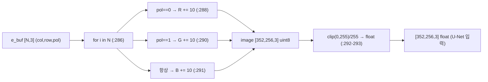
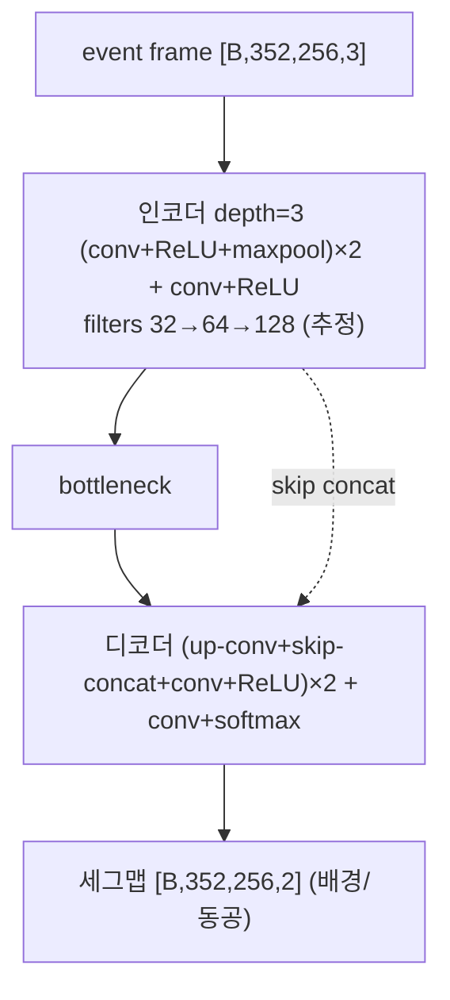
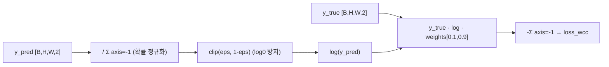
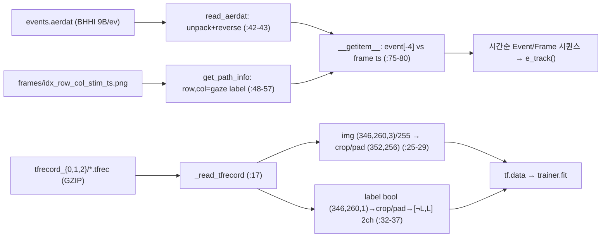

# E-Track 모듈 통합 가이드 (S-PyTorch 규약)

> 1차 요약: [`../E-Track.md`](../E-Track.md) — 본 문서는 그 요약을 모듈(클래스/함수) 단위로 심화한 통합 가이드다. 형제 가이드 [`../cb-convlstm-eyetracking/MODULE_GUIDE.md`](../cb-convlstm-eyetracking/MODULE_GUIDE.md)와 동형 구조(S-PyTorch 변형)로 작성.
> 분석 대상: `\\wsl.localhost\ubuntu-24.04\home\user\project\PRJXR-HBTXR\REF\XR-Eye-Tracking\Codebase\E-Track`
> 관련 논문: [`../../Papers/E-Track.md`](../../Papers/E-Track.md) (E-Track, IEEE AICAS 2023, DOI 10.1109/AICAS57966.2023.10168551)
> 작성 원칙: 실제 소스 Read 후 `파일:라인` 근거 표기. 라인 근거 없는 추론은 "추정", 코드로 확인 불가는 "확인 불가"로 명시. 정확도(center distance error)·전력(160mW)은 README/논문 인용, 미실행 수치는 "확인 불가".

---

## 0. 문서 머리말

### 0.1 프레임워크 확정 — **TensorFlow / Keras (PyTorch 아님)**

본 repo는 **TensorFlow-GPU 2.6.0 + Keras 2.6.0** 기반이다(확정). cb-convlstm(순수 PyTorch)과 달리 E-Track은 TF이므로, 본 가이드는 형제 가이드의 **구조·수치 규약(S-PyTorch)을 그대로 적용**하되 프레임워크는 TF로 명시한다. 근거:
- `requirements.txt:52` `tensorflow-gpu==2.6.0`, `:19` `keras==2.6.0`, README:19("Tensorflow-GPU version 2.6.0").
- 전 소스가 `import tensorflow as tf`(`e_track.py:11`, `e_track_unet.py:20`, `e_track_dataset.py:1`), `tf.keras`(`e_track.py:319`), Keras backend `K`(`e_track.py:12`) 사용. **torch import 0회**(전수 Read 확인).
- **PyTorch 등가물 부재**: 본 repo에는 PyTorch 코드가 없으므로 "S-PyTorch"는 *수치 표기 규약*으로만 해석. 모델 본체(U-Net)는 외부 패키지라 PyTorch 환산 불가(0.5절).

### 0.2 대표 케이스 선정 + 근거

E-Track은 cb-convlstm처럼 모델 변형 N종이 아니라, **단일 U-Net 세그멘테이션 + 3개의 비-딥러닝 알고리즘 단(E2F·RoI FSM·타원피팅)**으로 구성된다. 따라서 대표는 "학습 경로"와 "추론 풀파이프라인" 두 진입점으로 선정한다.

- **대표 학습 경로: `e_track_unet.train()`** (`e_track_unet.py:50-103`)
  - 근거: 외부 `unet.build_model(...)`로 U-Net 빌드(`:51-58`) → `unet.Trainer.fit(epochs=40, batch_size=8)`(`:95-101`). **세그멘테이션 가중치를 생산하는 유일한 학습 경로**.
- **대표 추론 풀파이프라인: `e_track.e_track()`** (`e_track.py:296-511`)
  - 근거: 논문 시스템 흐름(E2F → Pupil Event U-Net → Event-Based RoI Mechanism → Ellipse Fitting)을 한 함수에 직접 구현(README:39-43, 함수 본문). **추론 96% 절감의 do_unet FSM이 사는 곳**(`:331-341`).
- **대표 핵심 알고리즘**: `event_to_frame`(이벤트 프레임 표현, `:281-293`), `get_ell_roi_points`(RoI 링 필터, `:118-122`), `util/ellipse.LsqEllipse`(타원피팅, `ellipse.py:56-197`).

> 정리: **trained 경로 = `e_track_unet.train`(외부 U-Net 학습)**, **96% 절감 경로 = `e_track.e_track`의 do_unet FSM + RoI 링 필터**. U-Net 본체는 외부 jakeret/unet 패키지(0.5절 [제외]).

### 0.3 수치 표기 규약 (S-PyTorch, TF에 적용)

- **params** = 레이어 차원에서 직접 산정이 원칙이나, **U-Net 본체가 외부 패키지**(`unet.build_model`, `e_track_unet.py:51`)라 본 repo 코드만으론 산정 불가 → **논문값 466,562 params 인용**(E-Track.md:30, 논문 §Pupil Event U-Net "17 layer, 466,562 param"). `model.summary()`(`:67`)는 런타임 출력이라 정적 코드상 "확인 불가".
- **MACs / FLOPs** = U-Net은 표준 인코더-디코더 conv 누적. 빌드 인자(`nx=352,ny=256,channels=3,num_classes=2,layer_depth=3,filters_root=32`, `:51-58`)는 확인되나, **각 단 채널/conv 수가 외부 구현 의존**이라 절대 MAC은 "확인 불가". 정성: layer_depth=3 → 3회 2× 다운/업, filters_root=32 → 32→64→128 진행(추정).
- **activation memory** = 텐서 `shape × bit`. 입력 `[1,352,256,3]` fp32 = 352·256·3·4B ≈ **1.08MB**(NHWC, TF 기본). 세그 출력 `[1,352,256,2]` ≈ 0.72MB. 중간 feature map은 외부 U-Net 구현 의존(확인 불가).
- **이벤트 프레임 표현** = **고정 이벤트 수(set) 기반 2-극성 누적 프레임**. `event_to_frame`(`:281-293`)이 R=NEG, G=POS, B=공통에 이벤트당 +10 누적, `clip(0,255)/255`. **voxel grid / time-surface / SNN 아님**. 시간정보는 버퍼 크기(`buf_thsld`)로만 양자화. 논문 ΔT 아닌 **고정 이벤트 수(U-Net set=2000, RoI set=256) 누적**(E-Track.md:26-27, 코드 `buf_thsld` :304,336,339).
- **RoI 추적 FSM 절감율** = `e_track()`의 `do_unet` 상태 전이(`:332-341`)로 U-Net 호출 빈도를 줄임. 카운터 `unet_cnt`(`:393`)/`roi_cnt`(`:417`)로 경로별 횟수 집계. 논문: frame 기반 7,130 추론 → RoI로 **404 추론(96.1% 감소)**, 99%+ 타원은 fitting만으로 추적, frame 대비 17.65× 적은 추론(E-Track.md:46). **본 repo 미실행 → 실측 절감율 "확인 불가", 논문값 인용**.
- **타원피팅** = `util/ellipse.LsqEllipse`(`ellipse.py:11-237`), Halir & Flusser 수치안정 직접 최소제곱. 3×3 산란행렬·일반화 고유값 → `center,width,height,phi`(`as_parameters:134-197`). **고정 크기(3×3) 선형대수 → HW 친화**(9절).
- **정확도** = 코드는 mIoU(EarlyStopping monitor, `e_track_unet.py:70`)·timeit 지연(`:127-133`)만 측정. **center distance error는 코드 미구현**(`e_track()`이 `return None`, `:511`) → "확인 불가". 논문값: median center distance **3.68px**, median IoU **0.72**, **160mW @ edgeTPU**(E-Track.md:21,45,50 인용).

### 0.4 운영 경로 (학습 ↔ 체크포인트 ↔ 추론)

```
[원시 데이터: data/eye_data/userN/{0,1}/  (events.aerdat + frames/*.png)]
      │  setup.sh: box.com에서 user4~27 raw tar 다운로드 (setup.sh, README:28)
      ▼
[① raw 로더 eye_dataset.EyeDataset]                  [② TFRecord 학습 입력]
      │  read_aerdat: BHHI 9B/event 언팩+reverse        │  (raw→tfrec 변환부는 repo 부재 = 확인 불가)
      │  __getitem__: event[-4] vs frame ts 비교 →      │  data/tfrecord_{0,1,2}/*.tfrec (GZIP)
      │  시간순 단일 시퀀스(Event/Frame namedtuple)     ▼
      ▼                                          [e_track_dataset.load_data: TFRecordDataset(GZIP)]
[추론: e_track.e_track]                                  │  _read_tfrecord: img(346,260,3)/255→crop/pad(352,256)
      │  do_unet FSM(:331-341) ← 96% 절감 핵심          │  label(bool)→2채널 one-hot[¬L,L] (:37)
      │  event_to_frame → unet.predict(>0.9) → 타원피팅  ▼
      │  RoI 링 필터(±4) → 타원피팅 (U-Net 생략)     [학습: e_track_unet.train]
      ▼                                                  │  unet.build_model(352,256,3,nc=2,depth=3,root=32)
[타원 파라미터 center/width/height/phi + 롤백 검증]      │  loss=weighted CE[0.1,0.9], lr=1e-3, 40ep, bs=8
      │  fit_score>0.19 / 변화율>17% → 직전값 롤백(:457)  ▼
      ▼                                          [trained_model/2023-01-24T00-11_42 (Keras SavedModel)]
[시각화/카운트(unet_ell_cnt/roi_ell_cnt) — return None(:511)]
```
- 추론은 `tf.keras.models.load_model('trained_model/2023-01-24T00-11_42', custom_objects)`(`e_track.py:319`)로 SavedModel 복원. 체크포인트 자체는 [제외].

### 0.5 모델 / 데이터셋 / 정확도 요약

| 항목 | 값 | 근거 |
|---|---|---|
| 프레임워크 | **TensorFlow-GPU 2.6 / Keras 2.6** | `requirements.txt:19,52`, README:19 |
| 입력(U-Net) | 이벤트 누적 프레임 `[B,352,256,3]` | `e_track_dataset.py:29`, `e_track.py:282-284` |
| 출력(U-Net) | 2-class 세그맵 `[B,352,256,2]`(배경/동공) | `e_track_unet.py:54`, `e_track_dataset.py:37` |
| 출력(전체) | 동공 타원 `center=[x0,y0],width,height,phi` | `e_track.py:451`, `ellipse.py:134-197` |
| 모델 | 외부 U-Net (jakeret/unet, depth=3, root=32) | `e_track_unet.py:51-58`, `requirements.txt:58` |
| params | **466,562 (논문 인용)** | E-Track.md:30 (코드 산정 불가 = 확인 불가) |
| Loss | weighted categorical CE [bg 0.1, pupil 0.9] | `e_track_unet.py:61`, `e_track.py:318` |
| optimizer | lr=1e-3, 40ep, bs=8 (optimizer 종류 외부) | `e_track_unet.py:30,101` (Adam은 논문 §학습, 확인 불가) |
| 데이터셋 | Event-Based Eye Tracking(Kohli/Martel/Angelopoulos), subject 4~27 | `eye_dataset.py:3`, README:28, `e_track_unet.py:81` |
| 메트릭 | mIoU(코드) / center dist error·IoU(논문) | `e_track_unet.py:70` / E-Track.md:45 |
| 정확도(논문) | median 3.68px, IoU 0.72, 160mW@edgeTPU | E-Track.md:21,45,50 (본 repo 미실행 = 확인 불가) |
| RoI 절감 | 추론 96.1% 감소(7,130→404), 17.65× | E-Track.md:46 (인용; 코드 미실행) |

---

## 1. Repo / Layer 개요 (세그 / 추적 / 타원 맵)

E-Track = 이벤트 카메라 스트림으로 동공 타원(=시선)을 추적하는 **하이브리드 시스템**: "무거운 U-Net 세그멘테이션은 가끔, 가벼운 이벤트-RoI 타원 추적은 자주". 딥러닝(U-Net)과 고전 CV(모폴로지·히스토그램·최소제곱 타원피팅)·상태머신을 결합. **TF 학습부 + numpy/opencv 추론부**.

### 1.1 파일 역할 맵

| 구분 | 파일 | 역할 | 메인 사용 |
|---|---|---|---|
| **메인(추론 풀파이프라인)** | `e_track.py` | E2F·do_unet FSM·RoI 링필터·타원피팅·롤백·시각화 | ★ 실행 진입점 |
| **U-Net 학습/추론** | `e_track_unet.py` | build/finalize/Trainer.fit · predict 벤치 | ★ 학습 진입점 |
| **raw 데이터 로더(추론용)** | `dataset/eye_dataset.py` | aerdat/frame → 시간순 단일 시퀀스 | ★ `e_track.py:517` |
| **TFRecord 로더(학습용)** | `dataset/e_track_dataset.py` | tfrec → tf.data, crop/pad·2채널 라벨 | ★ `e_track_unet.py:85` |
| **타원피팅(차용)** | `util/ellipse.py` | LsqEllipse(Halir-Flusser) 최소제곱 | ★ `e_track.py:447` |
| **환경/스크립트** | `requirements.txt`, `requirements_conda.txt`, `setup.sh`, `README.md` | 의존성·데이터 다운로드·문서 | — |
| **[제외] 외부 모델** | `unet` (jakeret/unet, git pin) | U-Net 본체·Trainer·utils | `:58` |
| **[제외]** | `data/`, `trained_model/`, `img/`, `.git/` | TFRecord·SavedModel·이미지·VCS | 제외 |

### 1.2 추론 진입점 (forward 등가)

`main()`(`e_track.py:514`) → `EyeDataset.collect_data`(`:517-525`) → `e_track(eye_dataset)`(`:296`) → `for data in eye_dataset`(`:323`) → do_unet 분기(`:331-341`) → [U-Net 경로] `event_to_frame`(`:399`) + `unet_model.predict`(`:403`) **또는** [RoI 경로] `get_ell_roi_points`(`:349-350`) → `LsqEllipse().fit`(`:447`) → `as_parameters`(`:451`) → 롤백 검증(`:457-462`).

학습 진입점: `e_track_unet.py:144` `predict()`(현재 main이 호출) / `:141` `train()`(주석 처리, 토글식).

### 1.3 제외 목록
- **외부 모델/프레임워크**: `unet`(jakeret/unet, `requirements.txt:58` git pin — `e_track_unet.py:21,24,51,60,79`의 `unet.*` 전부 외부), tensorflow/keras/cv2/scikit-image/PIL(import만).
- **외부 데이터/산출물**: `data/tfrecord_{0,1,2}`, `data/eye_data`, `trained_model/2023-01-24T00-11_42`(Keras SavedModel), `img/`(흐름도).
- **차용 모듈(분석엔 포함)**: `util/ellipse.py`(bdhammel v2.0.0, `ellipse.py:1-3`) — 내부 파일이고 핵심 경로라 분석 포함하되 자체 작성 아님 명시.
- **repo 부재(확인 불가)**: raw `.aerdat`/PNG → `.tfrec` 변환 스크립트는 repo에 없음 → 라벨 생성·이벤트 GT 라벨링부 "확인 불가".

---

## 2. 모듈: 이벤트 프레임 표현 — `event_to_frame` (E2F 변환)

### 2.1 역할 + 상위/하위
- **역할**: 고정 개수(set)의 이벤트 좌표·극성을 받아 **2-극성 누적 히스토그램 프레임**(3채널 352×256)으로 인코딩. 논문 Event-to-Frame Converter(E-Track.md:24-27)의 직접 구현. U-Net 입력 생성기.
- **상위**: `e_track()`의 U-Net 경로(`:399` `image = event_to_frame(e_buf, 0, 0)`). **하위**: numpy 인덱싱·`np.clip`만(딥러닝 무관).

### 2.2 데이터플로우 (텐서 shape · 채널 의미)

> 좌표 시프트 `+3+col_offset-1`(col), `-2+row_offset-2`(row)(`:288-291`)는 센서-프레임 정렬 보정 하드코딩(**추정**). 호출부는 `col_offset=0,row_offset=0` 전달(`:399`)이라 실효 시프트는 `+2`(col)/`-4`(row).

### 2.3 forward call stack
```
e_track() (:296)
└─ do_unet=True 분기 (:392)
   └─ image = event_to_frame(e_buf, 0, 0) (:399)
      ├─ image = np.zeros((352,256,3), uint8) (:284)
      ├─ for i: R/G += 10 (극성별), B += 10 (공통) (:286-291)
      └─ clip(0,255)/255 → return (:292-293)
   └─ np.expand_dims(image, 0) → unet_model.predict (:400-403)
```

### 2.4 대표 코드 위치
`e_track.py:281-293`(전체), `:284`(버퍼 할당), `:287-291`(극성별 누적), `:292-293`(clip·정규화).

### 2.5 대표 코드 블록

**(a) 2-극성 누적 (`e_track.py:286-293`)**
```python
for i in range(event_set.shape[0]):
    if event_set[i][2] == 0:  # NEG polarity=0
        image[(event_set[i][0]+3+col_offset-1, event_set[i][1]-2+row_offset-2, 0)] += 10  # R
    else:
        image[(event_set[i][0]+3+col_offset-1, event_set[i][1]-2+row_offset-2, 1)] += 10  # G
    image[(event_set[i][0]+3+col_offset-1, event_set[i][1]-2+row_offset-2, 2)] += 10      # B
image = np.clip(image, 0, 255)
return image/255
```
→ 이벤트당 intensity **+10**(논문 E-Track.md:27 일치, 확인됨), max 255 clip. **시간정보 폐기**: 한 set 내 순서·timestamp는 누적되며 사라짐 → 프레임 단위 양자화. 정규화는 `/255`만(z-score 아님, cb-convlstm과 차이).

### 2.6 연산 분해 + 정량
- **params 0**(전처리). 비용은 N회 numpy 인덱싱(N=set 크기, U-Net set 2000/4000, RoI set 256).
- **이벤트 프레임 메모리**: `[352,256,3]` uint8 = 352·256·3 ≈ **270KB/프레임**, `/255` float32 시 ≈ 1.08MB.
- **HW 매핑**: 고정 누적 버퍼 + 정수 increment(+10) → FPGA 히스토그램/누산기 블록으로 단순 구현 가능(추정, 9절). voxel/SNN 대비 데이터플로 단순.
- **루프 비효율**: Python `for i in range(N)` 픽셀 단위 인덱싱(`:286`)은 벡터화 안 됨 → CPU 추론 병목 후보(**추정**, 미프로파일).

---

## 3. 모듈: U-Net 세그멘테이션 모델 — `unet.build_model` (외부) + 빌드/학습부 `e_track_unet.py`

### 3.1 역할 + 상위/하위
- **역할**: 이벤트 프레임 `[B,352,256,3]`을 받아 **픽셀 단위 2-class 세그멘테이션**(채널0=배경, 채널1=동공) 확률맵 산출. backbone/neck/head 분리형 detection이 아니라 **단일 인코더-디코더 U-Net**(완전 합성곱). 논문 17 layer / 466,562 param(E-Track.md:30).
- **상위**: `train()`(학습, `:79-101`), `e_track()`(추론, `:319-403`). **하위**: 외부 jakeret/unet의 conv/maxpool/up-conv/skip-concat/softmax(코드 부재 → 세부 "확인 불가").

### 3.2 데이터플로우 (텐서 shape · U-Net 정성)

> 인코딩/디코딩 단계 구성은 논문 §Pupil Event U-Net(E-Track.md:31)과 빌드 인자(`layer_depth=3`, `:55`)에서 추정. 정확한 채널 진행·conv 수는 외부 패키지라 **확인 불가**.

### 3.3 forward call stack (빌드·학습)
```
train() (e_track_unet.py:50)
├─ unet.build_model(nx=352,ny=256,channels=3,num_classes=2,layer_depth=3,filters_root=32,padding="same") (:51-58)
├─ unet.finalize_model(model, loss=weighted_CE[0.1,0.9], auc=False, eps=1e-6, lr=1e-3) (:60-65)
├─ EarlyStopping(monitor="mean_iou", mode="max", patience=3, restore_best_weights=True) (:69-77)
├─ unet.Trainer(name="pupil_event", callbacks=[cb]) (:79)
└─ trainer.fit(model, train, valid, test, epochs=40, batch_size=8) (:95-101)
```

### 3.4 대표 코드 위치
`e_track_unet.py:51-58`(build_model 인자), `:60-65`(finalize/loss/lr), `:69-77`(EarlyStopping), `:95-101`(fit). 손실 정의 `:36-47`(=`e_track.py:267-278` 중복).

### 3.5 대표 코드 블록

**(a) U-Net 빌드 인자 (`e_track_unet.py:51-58`)**
```python
unet_model = unet.build_model(nx=352, ny=256, channels=3, num_classes=2,
                              layer_depth=3, filters_root=32, padding="same")
```
→ 입력 352×256×3, 출력 2-class. depth=3(3회 다운/업), root=32(시작 채널). **all-same padding으로 H,W 보존**. 본체 가중치·구조는 외부.

**(b) finalize/loss/lr (`e_track_unet.py:60-65`)**
```python
unet.finalize_model(unet_model,
                    loss=weighted_categorical_crossentropy(np.array([0.1, 0.9])),
                    auc=False, epsilon=0.000001, learning_rate=LEARNING_RATE)  # lr=1e-3
```
→ optimizer 종류·컴파일 세부는 `finalize_model` 내부(외부) → "확인 불가"(논문 §학습은 Adam+exp decay step4500 rate0.5, E-Track.md:40 인용).

### 3.6 연산 분해 + 정량
- **params = 466,562 (논문 인용)** — 코드 직접 산정 불가(외부 U-Net). `model.summary()`(`:67`) 런타임 출력만.
- **MAC/FLOPs**: 외부 구현 의존 → 절대치 "확인 불가". 정성적으로 352×256 입력·3단 U-Net은 cb-convlstm(0.42M, 80×60)보다 **공간 해상도가 18.7배 큼**(352·256 vs 80·60) → 프레임당 연산은 cb-convlstm 대비 훨씬 무거움(**추정**) → 그래서 RoI FSM으로 호출 빈도를 줄이는 것이 핵심(5절).
- **activation memory**: 입력 1.08MB(0.3절). 인코더 첫 단 feature `[1,352,256,32]` fp32 ≈ **11.5MB**(추정, same-conv 가정) → 깊어질수록 H·W↓·C↑로 상쇄. 정확값 외부 의존.
- **추론 지연(논문 Table I 인용)**: edgeTPU 66.4ms, GPU(RTX3070) 4.1ms, CPU(Ryzen9) 69.5ms(E-Track.md:49-50). **본 repo timeit 훅**(`:127-133`)으로 측정 가능하나 미실행 → 실측 "확인 불가".

---

## 4. 모듈: 손실함수 — `weighted_categorical_crossentropy` (클래스 불균형 보정)

### 4.1 역할 + 상위/하위
- **역할**: 동공 픽셀이 전체 대비 극소수인 불균형을 보정하기 위해 **클래스별 가중 CE**. 가중치 `[배경 0.1, 동공 0.9]`로 소수 클래스(동공)에 9× 가중.
- **상위**: `train.finalize_model`(`:61`), `e_track.custom_objects['loss']`(`:318`). **하위**: Keras backend `K`(softmax 정규화·clip·log).

### 4.2 데이터플로우


### 4.3 forward call stack
```
finalize_model(loss=weighted_categorical_crossentropy([0.1,0.9])) (e_track_unet.py:61)
└─ loss(y_true, y_pred) (:40)  [학습 step마다 Keras가 호출]
   ├─ y_pred /= K.sum(y_pred, -1, keepdims) (:41)
   ├─ K.clip(y_pred, eps, 1-eps) (:42)
   └─ -K.sum(y_true * K.log(y_pred) * weights, -1) (:43-44)
```

### 4.4 대표 코드 위치
`e_track_unet.py:36-47` (= `e_track.py:267-278`, **동일 정의 중복** — 코드 스멜).

### 4.5 대표 코드 블록

**(a) 가중 CE (`e_track_unet.py:40-45`)**
```python
def loss(y_true, y_pred):
    y_pred /= K.sum(y_pred, axis=-1, keepdims=True)       # 확률 정규화
    y_pred = K.clip(y_pred, K.epsilon(), 1 - K.epsilon()) # 수치 안정화
    loss_wcc = y_true * K.log(y_pred) * weights           # 클래스별 가중 [0.1,0.9]
    loss_wcc = -K.sum(loss_wcc, -1)
    return loss_wcc
```
→ 동공 9× 가중(`:61` `[0.1,0.9]`, 논문 E-Track.md:32 일치, 확인됨). 추론 시 채택 임계는 **확률>0.9**(`e_track.py:404`).

### 4.6 연산 분해 + 정량
- params 0. 비용은 픽셀당 softmax-정규화·log·곱 — conv 대비 무시.
- **중복 정의**(두 파일 복붙) → 유지보수 리스크(7절). 가중치 하드코딩 `[0.1,0.9]`는 두 곳 동일(`e_track_unet.py:61`, `e_track.py:318`).

---

## 5. 모듈: Event-Based RoI 추적 FSM (★ 추론 96% 절감 — 정밀 해부)

본 절이 E-Track의 **핵심 기여**(논문 추론 96% 감소, E-Track.md:20,46)다. cb-convlstm의 "CB delta encoder 절감"에 대응하는 E-Track의 절감 메커니즘.

### 5.1 do_unet 상태머신 — 언제 U-Net을 돌릴지 결정

- **역할**: 매 이벤트 그룹마다 `do_unet`(무거운 U-Net) vs RoI 추적(가벼운 타원피팅)을 결정. **U-Net은 (1) 최초, (2) 이전 abort(동공 소실/블링크) 시에만** 호출 → 대부분 프레임은 RoI만.
- **상태 변수**(`e_track.py:299-304`): `first_unet`, `abort_unet`, `abort_fit`, `do_unet`, `abort_fit_cnt`(누적 실패), `buf_thsld`(버퍼 임계).

**(a) FSM 전이 (`e_track.py:332-341`)**
```python
pre_do_unet = do_unet
no_abort = not (abort_unet or abort_fit)
if first_unet or abort_unet or (abort_fit and (pre_do_unet or (abort_fit_cnt >= abort_fit_cnt_thsld))):
    do_unet = True
    buf_thsld = 4000 if first_group else opt.buffer      # U-Net set: 큰 버퍼 (4000/2000)
elif no_abort or abort_fit:
    do_unet = False
    buf_thsld = 256                                       # RoI set: 작은 버퍼 256
```
→ **버퍼 임계가 핵심**: U-Net 경로는 set=4000(최초)/2000(opt.buffer 기본, `:50`), RoI 경로는 **set=256**(`:339`). 논문 "U-Net set 2000 / RoI set 256"(E-Track.md:27,36)과 정합(확인됨). `abort_fit_cnt_thsld=10`(`:72`) 연속 실패 누적 시 U-Net 재호출.

### 5.2 Event-Based RoI 링 필터 — toroidal band

- **역할**: `do_unet=False`일 때, 현재 타원 기준 **바깥 타원(+4)과 안쪽 타원(−4) 사이 링(toroidal band)에 든 이벤트만 통과**. 동공 경계 근처 이벤트만 처리해 입력량·연산 절감.

**(b) 링 마스크 (`e_track.py:346-352`)**
```python
if not do_unet:
    'Event-Based RoI Mechanism'
    event_vec = np.array([[offset_col, offset_row]])
    event_vec = get_ell_roi_points(center, width + 4, height + 4, phi, event_vec)            # 바깥 타원 안쪽 통과
    event_vec = get_ell_roi_points(center, width - 4, height - 4, phi, event_vec, inner=False) # 안쪽 타원 바깥 통과
    if event_vec.shape[0] == 0:
        continue
```
→ 두 번의 `get_ell_roi_points`(안/밖, `:118-122`)를 AND로 조합 → 링만 남김. 논문 "타원을 8px(±4) 확장한 toroidal band를 RoI로"(E-Track.md:35)와 정합(확인됨). 점-타원 정규화 반경 r²≤1/≥1 판정(`get_rad_from_ell_c:104-115`).

### 5.3 정규화 반경 계산 (RoI/피팅 점수의 공통 커널)

**(c) 점-타원 r² (`e_track.py:104-115`)**
```python
xy_c = coord_buf - center
xct = xy_c[:,COL]*cos_angle + xy_c[:,ROW]*sin_angle
yct = xy_c[:,COL]*sin_angle - xy_c[:,ROW]*cos_angle
rad_cc = (xct**2 / width**2) + (yct**2 / height**2)   # r²: <1 내부, >1 외부
```
→ 회전+정규화된 타원 방정식. `get_ell_roi_points`(RoI 마스킹, `:118-122`)·`get_ell_fit_score`(피팅 품질, `:125-127`)가 공유. **HW에선 고정 datapath(cos/sin LUT + 2 div + 곱합)로 매핑 가능**(추정, 9절).

### 5.4 forward call stack (RoI 경로)
```
e_track() for data in eye_dataset (:323)
└─ Event 분기 → do_unet=False (:337-339, buf_thsld=256)
   ├─ offset_col/row 보정 (:344)
   ├─ get_ell_roi_points(center, w+4, h+4, ...) (:349)        ← 바깥
   ├─ get_ell_roi_points(center, w-4, h-4, inner=False) (:350) ← 안쪽 → 링
   ├─ col_buf 누적 → len==256 도달 (:360)
   ├─ handle_sensor_issue (:362) → ell_buf = e_buf (:419)
   ├─ ell_buf<=30 → abort_fit (:426)
   └─ LsqEllipse().fit(measurements) → as_parameters (:447-451)
      └─ roi_ell_cnt += 1 (:510)
```

### 5.5 연산 분해 + 정량 (RoI 추적 절감)

- **절감 원리**: RoI 경로는 **U-Net 추론을 완전히 생략**하고 256개 이벤트로 타원만 피팅 → 466,562-param U-Net forward 1회를 3×3 최소제곱(고정 비용)으로 대체. cb-convlstm은 *연산 내부* sparsity(zero-skip)였다면, E-Track은 *연산 자체*를 건너뜀(coarse-grained 절감).
- **버퍼 비대칭(확인됨)**: U-Net set=2000~4000 vs RoI set=256(`:336,339`) → RoI는 8~16× 작은 입력 + U-Net 무호출.
- **논문 정량(E-Track.md:46, 인용)**: 330초 평균 7,130 프레임 / 20,669,767 이벤트. frame 기반 7,130 추론, 2000-event set 기반 10,334 추론 → **RoI로 404 추론(96.1% 감소)**, 99%+ 타원은 fitting만으로 추적, frame 대비 **17.65× 적은 추론**.
- **본 repo 미실행(확인 불가)**: 실제 `unet_cnt`/`roi_cnt`(`:393,417`) 비율·절감율은 데이터 의존이며 코드 미실행 → "확인 불가"(카운터 인프라만 존재, `:507-510`).
- **`.cuda()`류 하드코딩 없음**: RoI/타원 경로는 순수 numpy(딥러닝 무관)라 CPU/HW 이식 장벽 낮음(cb-convlstm delta 셀의 `.cuda()` 하드코딩과 대비, 9절).

### 5.6 시간적 안정성 — 타원 롤백 휴리스틱 (RNN 대체)

- **역할**: ConvLSTM/SSM 없이 **피팅 품질·변화율 검증 + 직전 파라미터 롤백**으로 시간 일관성 확보.

**(d) 롤백 검증 (`e_track.py:454-462`)**
```python
fit_score = get_ell_fit_score(center, width, height, phi, ell_buf[:, 0:2])
diff_thsld, diff_width, diff_height = 17, diff(width, prvs_width), diff(height, prvs_height)
if (fit_score > 0.19) or \
   (first_fit and (width/height > 2) and (((center[0]-image_x_size/2) > 0) is not (phi > 0))) or \
   ((not first_fit) and ((diff_width > diff_thsld) or (diff_height > diff_thsld) or (width > 40))):
    abort_fit = True; abort_fit_cnt += 1
    center, width, height, phi = prvs_center, prvs_width, prvs_height, prvs_phi  # 롤백
```
→ fit_score>0.19(평균 |r²−1|), 비정상 종횡비/회전(첫 피팅), width/height 변화율>17% 또는 width>40 → **직전 타원으로 롤백**하고 abort. **상태 레지스터 몇 개로 구현 가능 → HW 유리**(9절). 매직넘버(0.19/17/40/30/15) 근거 주석 부족(7절).

---

## 6. 모듈: 데이터 파이프라인 — `EyeDataset` / `e_track_dataset` / raw 로더

### 6.1 역할 + 상위/하위
- **역할(추론 ①)**: `EyeDataset`이 raw `.aerdat`(이벤트)와 `frames/*.png`를 로드, **timestamp 비교로 시간순 단일 시퀀스**(Event/Frame namedtuple)를 만들어 `e_track()`이 한 줄로 순회하게 함.
- **역할(학습 ②)**: `e_track_dataset.load_data`가 GZIP TFRecord → tf.data, crop/pad·2채널 라벨 변환.
- **상위**: `e_track.main`(`:517`)·`e_track_unet.train`(`:85`). **하위**: struct/PIL(raw), tf.io(tfrec).

### 6.2 데이터플로우


### 6.3 forward call stack (데이터)
```
[추론] e_track.main → EyeDataset.collect_data(eye) (:517-525)
├─ load_frame_data: glob_imgs + get_path_info 정렬 (:102-114)
├─ load_event_data: read_aerdat (BHHI, reverse) (:116-121)
└─ for data in eye_dataset → __getitem__ (:73)
   └─ event_stack[-4] < frame ts ? Event(pop×4) : Frame(PIL gray) (:75-91)

[학습] e_track_unet.train → e_track_dataset.load_data(tfrecs) (:85)
└─ TFRecordDataset(GZIP).map(_read_tfrecord) (:44-46)
```

### 6.4 대표 코드 위치
`eye_dataset.py:26-45`(read_aerdat), `:48-57`(get_path_info), `:73-91`(__getitem__ 병합), `e_track_dataset.py:17-40`(_read_tfrecord), `:43-47`(load_data).

### 6.5 대표 코드 블록

**(a) 이벤트-프레임 시간순 병합 (`eye_dataset.py:75-86`)**
```python
event_timestamp = self.event_stack[-4]          # 다음 이벤트의 timestamp(4튜플의 끝)
frame_timestamp = self.frame_stack[-1].timestamp
frame_label = [self.frame_stack[-1].col, self.frame_stack[-1].row]   # gaze 자극 = 라벨
if event_timestamp < frame_timestamp:
    polarity = self.event_stack.pop(); row = ...pop(); col = ...pop(); timestamp = ...pop()
    event = Event(polarity, row, col, timestamp, frame_label)
```
→ 두 스택을 peek 후 더 이른 것을 반환 → **단일 정렬 시퀀스**. 이벤트는 평탄 리스트라 `pop()` 4회로 1 이벤트 복원(read_aerdat의 `reverse()` `:43`와 짝).

**(b) TFRecord 라벨 2채널 one-hot (`e_track_dataset.py:32-37`)**
```python
label = tf.io.decode_raw(single_example['label'], out_type='bool')
label = tf.reshape(label, (346,260,1))
label = tf.image.resize_with_crop_or_pad(label, 352, 256)
label = tf.concat([tf.math.logical_not(label), label], axis=2)   # ch0=배경, ch1=동공
```
→ 입력/라벨 모두 346→**352(=11×32)**, 260→**256(=2⁸)** crop/pad(`:29,35`). U-Net depth=3 다운/업샘플 정합 위한 8/32 배수 정렬(**추정**).

### 6.6 연산 분해 + 정량
- params 0(데이터). 비용은 I/O·resize·언팩.
- **이벤트 패킷**: `BHHI` 9B/event(`eye_dataset.py:33`) — pol(1B)+x(2B)+y(2B)+t(4B). 논문 20.6M 이벤트/330초(E-Track.md:46) → raw ≈ 186MB/세션(추정).
- **학습 입력 텐서**: img `[352,256,3]` fp32 = 1.08MB/샘플, label `[352,256,2]` = 0.72MB/샘플. batch=8 → 14.4MB(`e_track_unet.py:101`).
- **tf.data 처리량 우선**: `num_parallel_reads=AUTO`, `experimental_deterministic=False`(`e_track_dataset.py:4-6,44`). **`.batch/.shuffle/.prefetch` 미적용** → 배치는 `trainer.fit(batch_size=8)`이 처리(`:101`).

---

## 7. 모듈 한눈표

| # | 모듈 | 파일:라인 | 역할 | 대표 정량 |
|---|---|---|---|---|
| 2 | event_to_frame (E2F) | e_track.py:281-293 | 2-극성 누적 프레임 인코딩 | 270KB/프레임, +10/event |
| 3 | U-Net 세그(외부) | e_track_unet.py:51-58 | 2-class 픽셀 세그멘테이션 | **466,562 params(논문)** / 66.4ms@edgeTPU |
| 4 | weighted CE loss | e_track_unet.py:36-47 | 동공 9× 가중 불균형 보정 | weights[0.1,0.9] |
| 5.1 | do_unet FSM | e_track.py:332-341 | U-Net 호출 빈도 결정 | set 2000/4000 vs 256 |
| 5.2 | RoI 링 필터 | e_track.py:346-352, 118-122 | toroidal band(±4) 이벤트 통과 | **추론 96.1% 절감(논문)** |
| 5.6 | 타원 롤백 휴리스틱 | e_track.py:454-462 | 시간 안정성(RNN 대체) | fit_score>0.19, Δ>17% 롤백 |
| 5.3 | LsqEllipse 타원피팅 | util/ellipse.py:56-197 | Halir-Flusser 최소제곱 | 3×3 고유값(고정 크기) |
| 6 | EyeDataset(raw) | dataset/eye_dataset.py:60-121 | aerdat/frame 시간순 병합 | BHHI 9B/event |
| 6 | e_track_dataset(tfrec) | dataset/e_track_dataset.py:17-47 | TFRecord→tf.data, 2채널 라벨 | 1.08MB img/0.72MB label |

---

## 8. 학습 · 평가 파이프라인 + 재현 명령

### 8.1 학습 루프 (`e_track_unet.py:50-103`)
- 손실 weighted CE [0.1,0.9](`:61`, 논문 일치 E-Track.md:32), lr=1e-3(`:30`), **40 epoch, batch=8**(`:100-101`), seed=98765(`:33`). optimizer 종류는 외부 `finalize_model`(논문 Adam+exp decay step4500 rate0.5, E-Track.md:40 인용).
- `EarlyStopping(monitor="mean_iou", mode="max", patience=3, restore_best_weights=True)`(`:69-77`) → **mIoU 최대화 조기종료**.
- split: train=`tfrecord_0`, valid=`tfrecord_1`, test=`tfrecord_2`, subject 4~27(`:81-87`).
- **버그 의심(High, 확인됨)**: `:82-84` `tf.io.gfile.glob(f"...{user}..." for user in users)` — **제너레이터를 glob에 직접 전달**. gfile.glob은 문자열/리스트를 받으므로 제너레이터 입력은 의도대로 동작 안 함(리스트 컴프리헨션+flatten 필요). 학습 경로 수집 깨질 가능성(동작 여부는 실행 환경 의존 → 절감 효과 검증 전 패치 필요).

### 8.2 평가 메트릭
- **세그: mean IoU** — EarlyStopping monitor(`:70`), `evaluate`(`:123`). **추론 지연: timeit CPU 시간**(`get_eye_offset:158-168`, `predict:127-133`), `with tf.device('/cpu:0')`(`:144`)로 CPU 추론 측정(on-device 관심 시사).
- **center distance error(동공 위치 오차) 코드 미구현(확인됨)**: `e_track()`이 결과를 누적·반환하지 않고 `return None`(`:511`), 시각화·카운트(`unet_ell_cnt`/`roi_ell_cnt`)만 함. 논문 median 3.68px·IoU 0.72(E-Track.md:45)는 **본 repo 미실행 → 확인 불가**.
- **반환 불일치 버그(확인됨)**: `main()`이 `target_event_sets, target_event_set_labels = e_track(...)`(`:530`)로 2-튜플 언패킹 → `None` 언패킹 시 `TypeError`. 정량 출력 미완.

### 8.3 재현 명령 (README:18-43)
```bash
# 환경 (TensorFlow-GPU 2.6, Python 3.8, CUDA 10.1)
conda create -n e_track python=3.8 && conda activate e_track
python -m pip install -r requirements.txt
# 데이터 (box.com user4~27 raw)
bash setup.sh
# U-Net 학습/추론 (e_track_unet.py:141 train() / :144 predict() 토글)
python e_track_unet.py
# 풀 E-Track 알고리즘 (예: --subject 22 --eye left --buffer 2000)
python e_track.py
```
- 데이터셋: Event-Based Eye Tracking(Kohli/Martel/Angelopoulos 2020, `eye_dataset.py:3`), subject 4~27. 메트릭: mIoU(코드) / center dist error·IoU(논문 인용).

---

## 9. 우리 프로젝트(XR + FPGA 저지연) 시사점 + HW 이식성

### 9.1 RoI 추적 절감 = FPGA CNN 가동률 저감 자산 (핵심)
- E-Track의 do_unet FSM(`:332-341`) + RoI 링 필터(`:346-352`)는 **"무거운 CNN 가속기는 가끔, 경량 기하 datapath는 자주"** 구조 → FPGA에서 U-Net systolic MAC array의 **가동률(activity)을 낮춰 동적전력 절감**. 논문 추론 96.1% 감소·17.65× 적은 추론(E-Track.md:46)을 HW에서 그대로 실현 가능(논문+추정).
- cb-convlstm의 절감(연산 내부 zero-skip)과 **상보적**: E-Track은 *연산 자체 스킵*(coarse-grained). 두 기법을 결합하면 절감 시너지(추정).

### 9.2 이벤트 표현·타원피팅의 HW 친화성
- **이벤트 프레임(누적 2극성)**: `event_to_frame`(`:286-291`)은 고정 버퍼 + 정수 increment(+10) → FPGA 히스토그램/누산기 블록으로 간단 구현, E2F를 스트리밍 HW로 옮기면 호스트-가속기 전송량 절감(추정). voxel/SNN 대비 단순.
- **타원피팅(3×3 최소제곱)**: `ellipse.py:82-119`의 산란행렬·일반화 고유값은 **고정 크기(3×3) 선형대수 → HLS 완전 unroll**로 결정적 지연 보장. 점-타원 r²(`:104-115`)도 cos/sin LUT + div + 곱합 고정 datapath(추정).
- **롤백 휴리스틱이 RNN 대체**(`:454-462`): 시간 안정성을 상태 레지스터 몇 개(prvs 파라미터)로 구현 → ConvLSTM/SSM 순환의 파이프라인 stall 부담 없음. cb-convlstm의 `for t` 직렬 재귀 리스크가 E-Track엔 없음(확인된 설계, HW 이점은 추정).

### 9.3 세그멘테이션 백본 경량화·양자화 1순위
- 유일한 무거운 모듈 = 외부 U-Net(466,562 param, 352×256 입력). **INT8 PTQ/QAT, depthwise 분리합성곱, 채널 프루닝**으로 FPGA BRAM/DSP 예산 맞추기가 가장 효과적(논문도 INT8+pruning 시사, E-Track.md:62). 양자화 코드 본 repo 부재 → **우리 작업 여지**(확인 불가).
- **외부 패키지 의존 리스크**: U-Net 본체가 jakeret/unet(`requirements.txt:58`)라 구조 변경·양자화·HLS 이식 시 외부 내부를 건드려야 함 → **자체 U-Net 재구현(PyTorch/HLS)이 선행 과제**(추정).

### 9.4 플랫폼 실측 baseline + FPGA 비교
- 논문이 edgeTPU(160mW/66.4ms)·GPU(0.62W/4.1ms)·CPU(2.97W/69.5ms) 실측 제공(E-Track.md:49-50) → **우리 FPGA 구현의 직접 비교 baseline**. 코드에 timeit 지연 훅(`:127-133,158-168`)이 이미 있어 알고리즘↔HW 지연 비교 기준선으로 재활용.
- FPGA는 논문 미구현(edgeTPU만) → 160mW 대비 FPGA INT8 U-Net + RoI 오프로드로 추가 절감 여지(추정).

### 9.5 선결 과제 (HW 매핑 전 패치 필요)
- **(High)** `train()` glob 제너레이터 오용(`e_track_unet.py:82-84`) → 학습 경로 수집 패치.
- **(High)** `e_track()` 반환/언패킹 불일치(`:511` vs `:530`) → center distance error 산출 로직 구현 후 정량화.
- **(Medium)** 경로 비이식성: `eye_dataset.py:50` `path.split('\\')` Windows 구분자 하드코딩 → WSL/Linux에서 프레임 파싱 실패 가능(현재 repo가 WSL 경로에 있음에 유의).
- **(Medium)** 코드 중복(weighted CE 두 파일), 매직넘버 다수(`+3,-1/-2,-2` 시프트 `:288-291`, 임계 0.9·0.19·17·40·30·15) → 근거 주석·상수화 필요.

---

## 10. 근거 표기 정리

- **확인됨(코드 라인)**: 프레임워크 TF 2.6/Keras(`requirements.txt:19,52`, torch import 0); U-Net 빌드 인자(`e_track_unet.py:51-58`); loss weights [0.1,0.9](`:61`); do_unet FSM·버퍼 비대칭 2000/4000 vs 256(`e_track.py:336,339`); RoI 링 ±4(`:349-350`); E2F +10 누적(`:286-291`); LsqEllipse Halir-Flusser(`ellipse.py:56-197`); `e_track()` return None(`:511`)과 main 2-튜플 언패킹(`:530`) 불일치; glob 제너레이터 오용(`e_track_unet.py:82-84`); 경로 `\\` 하드코딩(`eye_dataset.py:50`).
- **추정(라인 근거 없는 해석)**: U-Net 채널 진행(32→64→128); E2F 좌표 시프트 의도; 8/32 배수 정렬 목적; HW zero-skip·unroll·양자화 전략; AICAS on-device 가속 지향.
- **확인 불가(미실행/외부/부재)**: U-Net params(외부 → 논문 466,562 인용)·MAC·optimizer 종류·중간 activation; 실측 center distance error·mIoU·절감율(코드 미실행, return None); raw→tfrec 변환부(repo 부재); trained_model 내부(제외).
- **인용(논문 E-Track.md)**: 466,562 params/17 layer; median 3.68px·IoU 0.72; 160mW @ edgeTPU(66.4ms); 추론 96.1% 감소(7,130→404)·17.65×; U-Net set 2000 / RoI set 256; Adam+exp decay 학습.
