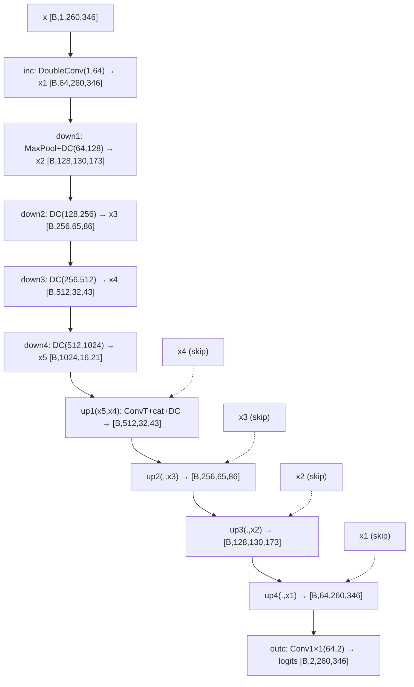
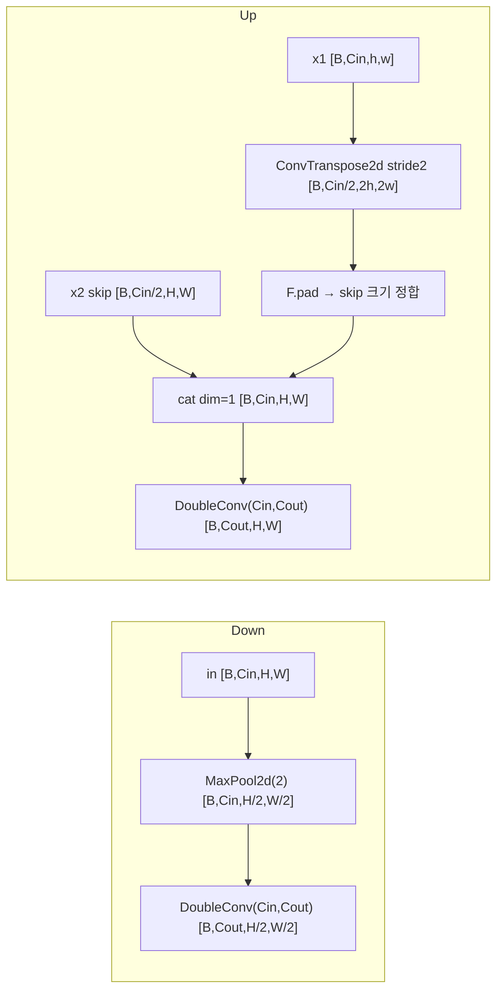
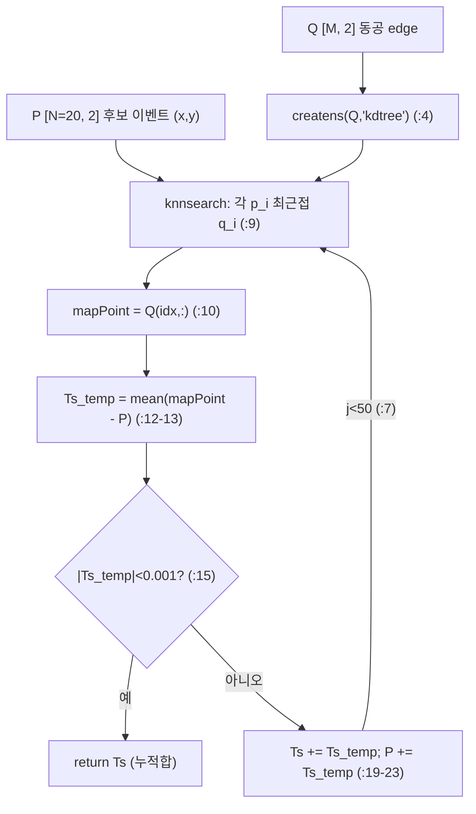
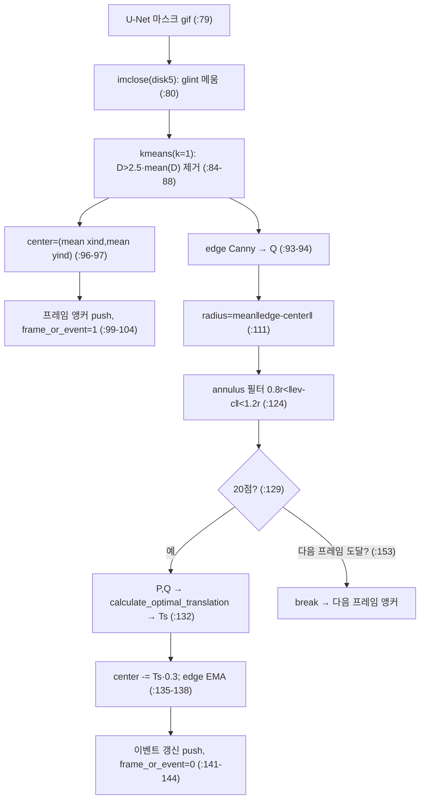
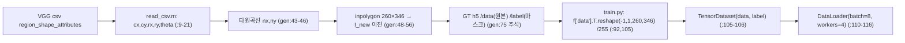

# EV-Eye 모듈 통합 가이드 (S-PyTorch)

> 1차 요약: [`../EV-Eye.md`](../EV-Eye.md) — 본 문서는 그 요약을 모듈(클래스/함수) 단위로 심화한 S-PyTorch 변형 통합 가이드다.
> 분석 대상: `\\wsl.localhost\ubuntu-24.04\home\user\project\PRJXR-HBTXR\REF\XR-Eye-Tracking\Codebase\EV-Eye`
> 관련 논문: [`../../Papers/EV-Eye.md`](../../Papers/EV-Eye.md) (EV-Eye, NeurIPS 2023 Datasets & Benchmarks Track, OpenReview bmfMNIf1bU)
> 작성 원칙: 실제 소스 Read 후 `파일:라인` 근거 표기. 라인 근거 없는 추론은 "추정", 코드로 확인 불가는 "확인 불가"로 명시. 정확도(IoU/Dice/PE/DoD)는 논문 인용, README는 결과 수치 미기재(주석처리, README:267-308)이므로 "README 확인 불가".

---

## 0. 문서 머리말

### 0.1 대표 케이스 선정 + 근거

EV-Eye는 **하나의 모델이 아니라 두 경로로 구성된 알고리즘 레벨(파이프라인) 하이브리드**다. 학습 가능한 network-level fusion이 없으므로(확인됨, `train.py`에 fusion 모듈 부재), 두 핵심 경로를 모두 대표로 선정한다.

- **대표 ① 저주파 프레임 앵커: 표준 U-Net (`unet.UNet`)**
  - 근거: `train.py:156`가 `UNet(n_channels=1, n_classes=args.classes, bilinear=args.bilinear)`로 인스턴스화, `predict.py:124`가 `UNet(n_channels=1, n_classes=2, ...)`로 추론. **실제 학습/추론에 쓰이는 유일한 신경망 본체**다.
  - 특이점: 동공 특화 변형 없는 **milesial/Pytorch-UNet 계열 표준 U-Net**(`unet_parts.py:64-65` 주석에 milesial 커밋 링크). 입력 1ch grayscale 260×346, 출력 2-class(배경/동공) logits(`unet_model.py:6-36`).
- **대표 ② 고주파 이벤트 ICP 보간: `calculate_optimal_translation` + `frame_event_pupil_track.m`**
  - 근거: `frame_event_pupil_track.m:132`가 후보 이벤트 20점마다 `calculate_optimal_translation(P,Q)`를 호출해 동공 edge로의 최적 평행이동 `Ts`를 추정, `:137-138`에서 `update_factor=0.3` EMA로 중심 갱신. **38.4kHz 추적의 실제 메커니즘**(논문 §4.2, EV-Eye.md:32 인용).
  - 특이점: 딥러닝 없는 **kd-tree NN 기반 단순화 ICP(평행이동만, 회전/스케일 미고려)**(`calculate_optimal_translation.m:1-27`). 곱셈 거의 없이 비교·평균·가산 위주 → FPGA 고정점 데이터패스 친화(8절).

> 정리: **프레임 경로 = 무거운 U-Net(저주파 ~25fps 앵커)**, **이벤트 경로 = 경량 ICP(고주파 보간, 최대 38.4kHz)**. 두 경로는 cb-convlstm의 "vanilla vs delta 셀" 분기처럼 코드 상에서 분리되어 있으며, 융합은 알고리즘 파이프라인 레벨이다(MATLAB이 U-Net 예측 마스크 gif를 읽어 ICP를 돌림, `frame_event_pupil_track.m:79`).

### 0.2 수치 표기 규약 (S-PyTorch)

- **params** = 레이어 차원에서 직접 산정. `Conv2d(in→out, k×k, bias=False)` → 가중치 `in·out·k²`(bias 없음, `unet_parts.py:16,19`). `ConvTranspose2d(in→in/2, k2, s2)` → `in·(in/2)·4 + (in/2)`(bias 기본 True). `BatchNorm2d` = `2·C`(γ,β). `OutConv` = `Conv2d 1×1` `in·out·1 + out`(bias True, `unet_parts.py:73`).
- **MACs / FLOPs** = U-Net의 지배항은 **DoubleConv의 3×3 conv**. 표준식 `MAC = H·W·Cout·Cin·k²`. 입력 260×346 풀해상도에서 인코더 단마다 MaxPool2d(2)로 공간 1/4, 디코더 단마다 ConvTranspose로 공간 4× 복원. 시간축 재귀 없음(프레임 1장 단위 추론) — cb-convlstm의 ×T 반복과 대조.
- **activation memory** = 텐서 `shape × bit`. U-Net은 skip-connection 때문에 **인코더 각 단 feature(x1..x4)를 디코더까지 보관**(`unet_model.py:25-33`)해야 함 → 입력단 64ch×260×346이 메모리 지배항. 학습 역전파용으로 전 단 보관.
- **이벤트 표현** = **텐서/voxel/time-surface 미사용**. raw 이벤트 포인트 `(t,x,y,polarity)` 4-튜플을 직접 사용(`frame_event_pupil_track.m:31`). 동공 중심 기준 환형(annulus, `λ1·γ̄ < ‖·‖ < λ2·γ̄`, λ1=0.8 λ2=1.2)으로 공간 필터링한 후보점 집합만 누적(`:124`). polarity는 필터·ICP에서 미사용(`:124` 조건에 polarity 없음; `calculate_optimal_translation.m:2` 시그니처에 `polarity_list` 인자 있으나 본문 미사용).
- **프레임 표현** = DAVIS346 APS grayscale, 해상도 **260×346**, 단일 채널, `/255`로 [0,1] 정규화(`train.py:92,105`; `predict.py:24-26`).
- **ICP 보간 절차** = kd-tree(`createns(Q,'kdtree')`, `calculate_optimal_translation.m:4`) → `knnsearch` NN 매칭(`:9`) → 평균 변위 `Ts_temp=mean(mapPoint-P)`(`:12-13`) → 수렴(`|Ts_temp|<0.001`, `:15`) 또는 최대 50회(`:3`).
- **하이브리드 주파수** = 이벤트 20점 누적마다 1회 갱신(`frame_event_pupil_track.m:129`), `F=1/T_interval`. 논문: CDF 50%=2.6kHz, 95%=7.4kHz, **peak 38.4kHz**(EV-Eye.md:45 인용). **본 repo 미실행 → 실측 주파수 확인 불가, 논문값 인용**.
- **정확도** = README는 결과 수치 전부 주석처리(README:267-308)로 **README 확인 불가**. 논문 IoU/Dice/PE/DoD는 EV-Eye.md:43-46 인용. **본 repo 미실행 → 학습 결과 수치는 "확인 불가"**.

### 0.3 운영 경로 (학습 ↔ 체크포인트 ↔ 추론 ↔ 추적 ↔ 평가)

```
[VGG 타원 라벨 csv: Data_davis/.../user_N.csv (region_shape_attributes)]
      │  read_csv.m: cx,cy,rx,ry,theta 파싱 (:9-21)
      │  generate_pupil_mask.m: 타원 파라메트릭곡선 + inpolygon → 260×346 이진마스크 (:43-56)
      ▼
[GT h5: Data_davis_labelled_with_mask/{left,right}/userN_session_*.h5  (/data, /label)]
      │  train.py: f['data'].T.reshape(-1,1,260,346) /255 (:92,105), label .reshape(-1,260,346) (:93)
      ▼
[학습: train.py train_net — 48-fold LOSO]
      │  user 1..48 각각: 자신 제외 47명으로 UNet 새로 초기화·학습, 본인으로 검증 (:68-80,156)
      │  loss = CrossEntropy(:163,186) + dice_loss(softmax, one-hot, multiclass) (:187-189)
      │  optimizer = Adam(net.parameters()) (lr 인자 미반영, :160), ReduceLROnPlateau('max',patience=2) (:161)
      │  AMP GradScaler/autocast (:162,183), epochs 기본 5 (:41,227), batch 하드코딩 8 (:112,150)
      ▼
[체크포인트: {whicheye}/userN.pth × 48 (:221) + ui_result.txt (dice/miou per user, :215-217)]
      │  predict.py: userN.pth 로드 (:131) → softmax argmax → *_mask.gif 저장 (:139-149)
      ▼
[하이브리드 추적: frame_event_pupil_track.m]
      │  프레임 갱신: 마스크 gif 읽기(:79) → imclose(disk5)(:80) → kmeans denoise(:84-88)
      │             → 중심 mean(xind,yind)(:96-97) + Canny edge(:93) → frame_or_event=1 (:102)
      │  이벤트 갱신: annulus 필터(:124) → 20점 누적(:129) → ICP Ts(:132)
      │             → center -= Ts·0.3 (:137-138) → frame_or_event=0 (:144)
      │  결과: [timeinterval, pixel_num, timestamp, center_x, center_y, frame_or_event] (:164)
      ▼
[평가: PE(frame/event) 픽셀오차 + DoD 각오차]
      │  pe_of_frame: 예측중심 vs GT타원중심 유클리드 (:90)
      │  pe_of_event: 이벤트추적중심 vs GT타원중심 유클리드 (:155)
      │  DoD: blink제거(:25) → poly53 회귀 캘리브 (:76-77) → atan(mean_dist/905)·180/π (:113)
```
- pretrained 모델·체크포인트·대용량 데이터는 외부 다운로드(README:142-167). 체크포인트 자체는 [제외].

### 0.4 모델 / 데이터셋 / 정확도 요약

| 항목 | 값 | 근거 |
|---|---|---|
| 프레임 입력 | grayscale `[B,1,260,346]` | `train.py:92,156`, `unet_model.py:12` |
| 프레임 출력 | 동공 2-class logits `[B,2,260,346]` | `unet_model.py:22,34`, `OutConv :70-76` |
| 모델(프레임) | 표준 U-Net (64→1024ch, 4단 down/up) | `unet_model.py:12-22` |
| params(U-Net) | ≈ **31.0M** (산정 2.6절) | 차원 계산 (표준 U-Net 공지값 ~31M 일치) |
| Loss | CrossEntropy + Dice(multiclass) | `train.py:163,186-189` |
| optimizer | Adam(기본 lr), ReduceLROnPlateau('max') | `train.py:160-161` (논문 lr=1e-3, EV-Eye.md:37 — lr 인자 미반영, 코드와 상이) |
| 이벤트 입력 | raw `(t,x,y,p)` 포인트(텐서화 없음) | `frame_event_pupil_track.m:31` |
| 이벤트 추적 | annulus 필터 + kd-tree ICP 평행이동 + EMA(0.3) | `:124,132,137-138`, `calculate_optimal_translation.m` |
| 데이터셋 | 48명·4세션·DAVIS346×2 (라벨 3세션) | README:43-49, `train.py:69` |
| 검증 프로토콜 | 48-fold LOSO (user-independent) | `train.py:68-80` |
| 메트릭 | IoU/Dice(py) / PE·DoD(matlab) | `evaluate.py:33,42` / `pe_*.m`, gaze `.m` |
| 정확도(논문) | IoU 0.9187, F1 0.9560, PE 0.64px(frame)/1.2px(event), DoD 4.71° | EV-Eye.md:43-46 (본 repo 미실행·README 미기재 → 확인 불가) |
| 추적 주파수(논문) | peak 38.4kHz (CDF 50%=2.6k, 95%=7.4k) | EV-Eye.md:45 (본 repo 미실행 → 확인 불가) |

---

## 1. Repo / Layer 개요 (U-Net 앵커 / 이벤트 ICP / 벤치 맵)

EV-Eye = DAVIS346 이벤트+프레임 하이브리드 시선/동공 추적 **데이터셋+벤치마크**. 두 갈래 = (a) Python U-Net 동공 세그멘테이션(저주파 절대 앵커), (b) MATLAB 이벤트 ICP 보간 추적(고주파) + 다항회귀 gaze 변환. 학습 가능한 fusion 없는 **알고리즘 레벨 detection-tracking 분리** 구조.

### 1.1 파일 역할 맵

| 구분 | 파일 | 역할 | 메인 사용 |
|---|---|---|---|
| **메인(학습/LOSO)** | `train.py` | h5 로딩·UNet 48-fold LOSO 학습·체크포인트 | ★ 실행 진입점 |
| **U-Net 본체** | `unet/unet_model.py` | `UNet` 조립(4단 down/up + outc) | ★ `train:156`/`predict:124` |
| **U-Net 부품** | `unet/unet_parts.py` | `DoubleConv`/`Down`/`Up`/`OutConv` | ★ |
| **추론** | `predict.py` | userN.pth 로드 → softmax argmax → `*_mask.gif` | ★ |
| **세그 평가** | `evaluate.py` | Dice(multiclass) + mIoU(`iou_mean`) | ★ |
| **Dice 손실/계수** | `utils/dice_score.py` | `dice_coeff`/`multiclass`/`dice_loss` | ★ |
| **일반 Dataset(잔재)** | `utils/data_loading.py` | `BasicDataset`/`CarvanaDataset` | import만, 학습 미사용 |
| **시각화** | `utils/utils.py` | `plot_img_and_mask` | predict import |
| **GT 마스크 생성** | `matlab_processed/generate_pupil_mask.m` | VGG 타원→inpolygon 이진마스크 h5 | ★ 1차 실행 |
| **★하이브리드 추적★** | `matlab_processed/frame_event_pupil_track.m` | 프레임 앵커+이벤트 ICP 보간 메인 루프 | ★★ 핵심 |
| **★ICP★** | `matlab_processed/calculate_optimal_translation.m` | kd-tree NN 평행이동 추정 | ★★ 핵심 |
| **PE 평가** | `pe_of_frame_based_pupil_track.m` / `pe_of_event_based_pupil_track.m` | 프레임/이벤트 픽셀오차 | ★ |
| **DoD 평가** | `evaluation_on_gaze_tracking_with_polynomial_regression.m` | poly53 캘리브→각오차 | ★ |
| **헬퍼** | `read_csv.m`(VGG csv 파싱) / `sort_nat.m`(자연정렬) / `*_find_tobii_reference.m`(시간정렬) | — | 보조 |
| **[제외]** | `pictures/*`, `plot_*.m`, `*_plot.m`, `Display Dot/`, `.git/`, `__pycache__/` | 이미지·플롯·자극표시·VCS | 제외 |

### 1.2 forward / 추적 진입점

- **프레임(NN)**: `net(images)` → `UNet.forward(x)`(`unet_model.py:24`) → `inc`→`down1..4`→`up1..4`→`outc`(`:25-34`) → `[B,2,260,346]` logits.
- **이벤트(ICP)**: `frame_event_pupil_track.m` 메인 루프(`:76`) → 프레임마다 마스크로 동공 템플릿 재설정(`:79-104`) → 다음 프레임 전까지 이벤트 순회(`:118`) → 20점마다 `calculate_optimal_translation(P,Q)`(`:132`) → 중심 EMA 갱신(`:137-138`).

### 1.3 제외 목록
- **외부 데이터/체크포인트**: `EV_Eye_dataset/`(raw_data, processed_data, Pre-trained_models) 전부 repo 미포함·외부 다운로드(README:142-167). 코드는 경로만 참조.
- **외부 프레임워크 원본**: torch/torchvision/PIL/h5py/numpy/tqdm(import만); MATLAB 툴박스(io, curvefit, Image Processing, Statistics — `kmeans`/`imclose`/`edge`/`createns`/`knnsearch`/`fit`).
- **U-Net origin 잔재**: `CarvanaDataset`(`data_loading.py:84-86`, mask_suffix='_mask')는 milesial origin 잔재로 EV-Eye 본 파이프라인과 무관(추정).
- **시각화/자극/플롯**: `plot_*.m`, `*_plot.m`, `Display Dot/`(자극 dot 표시, 데이터수집용), `pictures/`.

---

## 2. 모듈: 표준 U-Net — `unet.UNet` (저주파 동공 앵커 본체)

### 2.1 역할 + 상위/하위
- **역할**: grayscale 근안 이미지 1장에서 동공 영역을 2-class 세그멘테이션. 인코더(4단 다운샘플)로 문맥 추출 → 디코더(4단 업샘플 + skip-connection)로 해상도 복원 → 1×1 conv로 클래스 logits 산출. **저주파(~25fps) 절대 위치 앵커** 생성기.
- **상위**: `train.py:184`(학습 forward `net(images)`), `predict.py:31`(추론), `evaluate.py:26`(검증). 그 위는 LOSO 루프(`train.py:70`).
- **하위**: `DoubleConv`×9(inc 1 + down 4 + up 4), `Down`×4, `Up`×4, `OutConv`×1(`unet_model.py:12-22`).

### 2.2 데이터플로우 (텐서 shape · skip-connection)

> 주: 260·346은 2의 거듭제곱이 아니라 MaxPool floor(130→65→32→16, 173→86→43→21) 후 ConvTranspose 복원 시 크기 불일치 발생 → `Up.forward`가 `F.pad`로 보정(`unet_parts.py:58-62`). 따라서 비정형 해상도에서도 동작(확인됨).

### 2.3 forward call stack
```
net(images) → UNet.forward (unet_model.py:24)
├─ x1 = inc(x)              → DoubleConv.forward (unet_parts.py:24)
├─ x2 = down1(x1)           → Down.forward (:37) = MaxPool2d(2)+DoubleConv
├─ x3 = down2(x2); x4 = down3(x3); x5 = down4(x4)   (:27-29)
├─ x = up1(x5, x4)          → Up.forward (:55) = ConvTranspose2d + pad + cat + DoubleConv
├─ x = up2(x,x3); up3(x,x2); up4(x,x1)              (:31-33)
└─ logits = outc(x)         → OutConv.forward (:75) = Conv1×1   (:34)
```

### 2.4 대표 코드 위치
`unet_model.py:6-22`(생성자: 채널 스케줄 64→1024), `:24-36`(forward skip-connection), `unet_parts.py:8-25`(DoubleConv), `:41-67`(Up + F.pad 보정).

### 2.5 대표 코드 블록

**(a) U-Net 채널 스케줄 (`unet_model.py:12-22`)**
```python
self.inc = DoubleConv(n_channels, 64)
self.down1 = Down(64, 128); self.down2 = Down(128, 256)
self.down3 = Down(256, 512)
factor = 2 if bilinear else 1
self.down4 = Down(512, 1024 // factor)          # bilinear=False → 1024
self.up1 = Up(1024, 512 // factor, bilinear); ... ; self.up4 = Up(128, 64, bilinear)
self.outc = OutConv(64, n_classes)              # n_classes=2
```
→ bottleneck 1024ch의 **풀-사이즈 U-Net**. `bilinear=False`(`train.py:236` 기본)이므로 업샘플은 학습형 ConvTranspose2d(`unet_parts.py:52`).

**(b) DoubleConv 블록 — bias 없는 conv+BN+ReLU ×2 (`unet_parts.py:15-22`)**
```python
nn.Conv2d(in_channels, mid_channels, kernel_size=3, padding=1, bias=False),
nn.BatchNorm2d(mid_channels), nn.ReLU(inplace=True),
nn.Conv2d(mid_channels, out_channels, kernel_size=3, padding=1, bias=False),
nn.BatchNorm2d(out_channels), nn.ReLU(inplace=True)
```
→ conv bias=False(BN이 흡수). padding=1로 same-conv(H,W 보존). U-Net 연산·파라미터의 지배항.

**(c) Up의 크기 불일치 F.pad 보정 (`unet_parts.py:55-67`)**
```python
x1 = self.up(x1)                                  # ConvTranspose2d stride2
diffY = x2.size()[2] - x1.size()[2]; diffX = x2.size()[3] - x1.size()[3]
x1 = F.pad(x1, [diffX//2, diffX-diffX//2, diffY//2, diffY-diffY//2])
x = torch.cat([x2, x1], dim=1)                    # skip-connection
return self.conv(x)
```
→ 260×346처럼 비2의거듭제곱 해상도에서 디코더-인코더 feature 크기를 맞춰 concat. **HW 이식 시 동적 pad는 컴파일타임 고정 필요**(추정, 8절).

### 2.6 연산 분해 + 정량 (입력 `[B=8,1,260,346]`)

**params(차원 산정, conv bias=False / ConvT·OutConv bias=True / BN=2C)**:

| 블록 | conv1 | conv2 / ConvT | BN | 소계 |
|---|---|---|---|---|
| inc DC(1,64) | 1·64·9=576 | 64·64·9=36,864 | 256 | 37,696 |
| down1 DC(64,128) | 73,728 | 147,456 | 512 | 221,696 |
| down2 DC(128,256) | 294,912 | 589,824 | 1,024 | 885,760 |
| down3 DC(256,512) | 1,179,648 | 2,359,296 | 2,048 | 3,540,992 |
| down4 DC(512,1024) | 4,718,592 | 9,437,184 | 4,096 | 14,159,872 |
| up1 ConvT(1024→512)+DC(1024,512) | ConvT 2,097,664 | 4,718,592+2,359,296 | 2,048 | 9,177,600 |
| up2 ConvT(512→256)+DC(512,256) | 524,544 | 1,179,648+589,824 | 1,024 | 2,295,040 |
| up3 ConvT(256→128)+DC(256,128) | 131,200 | 294,912+147,456 | 512 | 574,080 |
| up4 ConvT(128→64)+DC(128,64) | 32,832 | 73,728+36,864 | 256 | 143,680 |
| outc Conv1×1(64,2) | — | 64·2·1+2=130 | — | 130 |

- **params 합 ≈ 31,036,546 ≈ 31.0M** → 표준 U-Net 공지값(~31M)과 일치(확인됨, 차원 계산). 논문은 U-Net params 수치 미기재 → 절대 대조 "확인 불가".
- **MAC(추론, B=1)**: down4 DoubleConv 둘째 conv `16·21·1024·1024·9 ≈ 3.17 GMAC`(단일 conv 최대항). inc·up4의 풀해상도 conv `260·346·64·64·9 ≈ 33.1 GMAC`(×해당단 conv 수)가 더 큼 — **풀해상도단(inc/up4)이 연산 지배항**. 전체 U-Net ≈ **수백 GMAC/프레임 규모**(추정; thop 등 미실행 → 정확 수치 "확인 불가").
- **activation memory(B=8, fp32)**: skip 보관 x1 `[8,64,260,346]·4B ≈ 184MB`가 최대(`unet_model.py:25-33`에서 up4까지 보관). x2..x4는 H·W↓로 감소. 학습 시 전 단 역전파 보관 → 수 GB 규모(학습 메모리 지배항). cb-convlstm의 "T step 보관"과 달리 EV-Eye는 "skip-feature 보관"이 지배(구조 차이).
- **시간축 없음**: cb-convlstm ConvLSTM의 `for t`(T=40) 직렬 재귀와 달리 U-Net은 프레임 1장 단위 feed-forward → **공간 병렬화 자유**(HW 이식 관점 유리, 8절).

---

## 3. 모듈: U-Net 부품 — `DoubleConv` / `Down` / `Up` / `OutConv`

### 3.1 역할 + 상위/하위
- **역할**: U-Net 구성 4블록. `DoubleConv`=2×(conv-BN-ReLU) 특징추출 단위; `Down`=MaxPool+DoubleConv 다운샘플; `Up`=ConvTranspose(또는 bilinear)+pad+cat+DoubleConv 업샘플+skip 융합; `OutConv`=1×1 클래스 매핑.
- **상위**: `UNet`(`unet_model.py:12-22`). **하위**: `nn.Conv2d`/`BatchNorm2d`/`ReLU`/`MaxPool2d`/`ConvTranspose2d`/`Upsample`(`unet_parts.py`).

### 3.2 데이터플로우 (Down / Up)


### 3.3 forward call stack
```
Down.forward (unet_parts.py:37) → Sequential[MaxPool2d(2), DoubleConv] (:32-35)
Up.forward (unet_parts.py:55)
├─ x1 = self.up(x1)                  ConvTranspose2d(:52) | Upsample(:49)
├─ F.pad(x1, [diffX..diffY..])       (:61)
├─ torch.cat([x2,x1], dim=1)         (:66)
└─ self.conv(x)                      DoubleConv(:53 또는 :50)
OutConv.forward (:75) → Conv2d 1×1 (:73)
```

### 3.4 대표 코드 위치
`unet_parts.py:28-38`(Down), `:41-67`(Up + bilinear/ConvT 분기 + pad), `:70-76`(OutConv).

### 3.5 대표 코드 블록

**(a) Up의 bilinear vs ConvTranspose 분기 (`unet_parts.py:48-53`)**
```python
if bilinear:
    self.up = nn.Upsample(scale_factor=2, mode='bilinear', align_corners=True)
    self.conv = DoubleConv(in_channels, out_channels, in_channels // 2)
else:
    self.up = nn.ConvTranspose2d(in_channels, in_channels // 2, kernel_size=2, stride=2)
    self.conv = DoubleConv(in_channels, out_channels)
```
→ EV-Eye는 `bilinear=False`(기본, `train.py:236`) → **학습형 ConvTranspose2d**(파라미터 보유, params 산정 2.6절에 포함). bilinear 선택 시 ConvT params 0이나 Upsample은 학습 불가.

### 3.6 연산 분해 + 정량
- params: 2.6절 표에 블록별 산입. ConvTranspose4개 합 = 2,097,664+524,544+131,200+32,832 = 2,786,240(전체의 ~9%). DoubleConv·conv가 ~90% 지배.
- MaxPool2d/ReLU/pad는 파라미터 0. MaxPool2d(2)는 floor 다운샘플(260→130→65→32→16) — cb-convlstm MaxPool3d(1,2,2)와 달리 시간축 없는 2D.
- activation: skip용 `x1..x4`를 디코더까지 보관(2.6절). `F.pad`(`:61`)는 동적 크기 의존 → HW에선 고정 크기로 정적화 필요(추정).

---

## 4. 모듈: 이벤트 ICP 보간 — `calculate_optimal_translation` (★고주파 핵심)

### 4.1 역할 + 상위/하위
- **역할**: 후보 이벤트 점집합 `P`를 동공 edge 점집합 `Q`에 정렬하는 **최적 평행이동 `Ts`**를 kd-tree NN 반복으로 추정. cb-convlstm의 "delta encoder"가 논문 핵심이듯, 여기서는 이것이 **38.4kHz 고주파 추적의 연산 핵심**이다.
- **상위**: `frame_event_pupil_track.m:132`(추적 메인), `pe_of_event_based_pupil_track.m:126`(이벤트 PE 평가)가 20점마다 호출.
- **하위**: MATLAB `createns(...,'kdtree')`(`:4`), `knnsearch`(`:9`). 곱셈 없는 비교·평균·가산 루프.

### 4.2 ICP 데이터플로우 (반복 정렬)


### 4.3 call stack
```
frame_event_pupil_track.m:132  Ts = calculate_optimal_translation(P,Q)
└─ calculate_optimal_translation.m
   ├─ NS = createns(Q,'NSMethod','kdtree')           (:4)
   ├─ while j<50 (:7)
   │  ├─ [idx,~] = knnsearch(NS, P, 'k',1)           (:9)
   │  ├─ mapPoint = Q(idx,:)                          (:10)
   │  ├─ Ts_temp = mean(mapPoint - P)                 (:12-13)
   │  ├─ if |Ts_temp|<0.001 → break                   (:15-17)
   │  └─ Ts += Ts_temp;  P += Ts_temp                 (:19-23)
   └─ return Ts
```

### 4.4 대표 코드 위치
`calculate_optimal_translation.m:3`(최대 50회), `:4`(kd-tree), `:8-13`(NN+평균변위), `:15-17`(수렴), `:19-23`(누적·이동).

### 4.5 대표 코드 블록

**(a) kd-tree NN 반복 평행이동 (`calculate_optimal_translation.m:7-25`)**
```matlab
while j<max_iterations            % max_iterations=50 (:3)
    [idx,~] = knnsearch(NS,P,'k',1);   % 각 이벤트 p_i의 최근접 edge 점
    mapPoint = Q(idx,:);
    Ts_temp(1) = mean(mapPoint(:,1)-P(:,1));   % 평균 x 변위
    Ts_temp(2) = mean(mapPoint(:,2)-P(:,2));   % 평균 y 변위
    if ((abs(Ts_temp(1))<0.001) && (abs(Ts_temp(2))<0.001)); break; end
    Ts(1)=Ts(1)+Ts_temp(1); Ts(2)=Ts(2)+Ts_temp(2);   % 누적
    P(:,1)=P(:,1)+Ts_temp(1); P(:,2)=P(:,2)+Ts_temp(2); % P 이동
end
```
→ 논문 `min E(T)=min (1/N)Σ‖q_i-(p_i+T)‖²`(EV-Eye.md:30)의 NN-반복 근사. **회전/스케일 없는 평행이동만**(R 행렬·SVD 부재) — 단순화 ICP(확인됨). 짧은 시간 내 동공 미소 이동 가정에 적합(추정).
- **polarity 미사용 확인**: 함수 시그니처는 `Calculate_t(P,Q,polarity_list)`(`:2`)지만 본문에서 `polarity_list` 미참조 → **미사용 잔재**(확인됨). 호출부도 인자 2개만 전달(`frame_event_pupil_track.m:132`).

### 4.6 연산 분해 + 정량
- **곱셈 거의 없음**: 본문 연산은 `knnsearch`(거리 비교) + 평균(`mean`) + 가산. 명시적 MAC 부재 → cb-convlstm conv 대비 **연산량 미미·고정점 친화**(8절). FLOPs 산정 대상 아님(추정).
- **반복 횟수**: 최대 50회(`:3`)이나 수렴(`<0.001`) 시 조기 종료(`:15`) — 데이터 의존, 실측 미실행 → "확인 불가". 매 호출 입력 `P=20점`(고정), `Q=동공 edge 수십~수백 점`.
- **갱신 빈도**: 이벤트 20점 누적마다 1회(`frame_event_pupil_track.m:129`). 갱신율 `F=1/T_interval`(`timeinterval_list`, `:145`) → 논문 peak 38.4kHz(EV-Eye.md:45 인용, 본 repo 미실행 "확인 불가").
- **HW 치환(추정)**: kd-tree는 고정 동공 edge 점(수십~수백)에 대한 **brute-force NN**으로 치환하면 파이프라이닝 유리(8절). on-chip BRAM에 edge 점집합 상주 가능.

---

## 5. 모듈: 하이브리드 추적 메인 루프 — `frame_event_pupil_track.m`

### 5.1 역할 + 상위/하위
- **역할**: U-Net 예측 마스크(저주파 절대 앵커)로 동공 템플릿을 재설정하고, 다음 프레임 전까지 이벤트로 ICP 보간 갱신하는 **하이브리드 융합 메인**. cb-convlstm의 `MyModel`(모델 통합)에 대응하는 EV-Eye의 "파이프라인 통합" 모듈.
- **상위**: 사용자 직접 실행(README:247) → 결과 `.mat` → `*_find_tobii_reference.m` → DoD 평가. **하위**: `imclose`/`kmeans`/`edge`/`calculate_optimal_translation`.

### 5.2 데이터플로우 (프레임 앵커 ↔ 이벤트 보간)


### 5.3 call stack
```
frame_event_pupil_track.m  메인 루프 (:76 for i = png_time_start_ind ... )
├─ [프레임] imread mask gif (:79) → imclose(se) (:80)
│  ├─ kmeans([aa,bb],1) → D>2.5·mean(D) drop (:84-88)
│  ├─ [yind,xind]=find(BW5==1); pixel_num (:89-91)
│  ├─ edge(BW5,'Canny') → [y,x]=Q (:93-94)
│  ├─ center_xind/yind = mean(xind/yind) (:96-97)
│  └─ push frame_or_event=1, timeinterval=0 (:99-104)
├─ [이벤트] radius=mean‖Q-center‖ (:111)
│  └─ for k (:118)
│     ├─ annulus 0.8r<dist<1.2r → A_x,A_y 누적 (:124-128)
│     ├─ if |A_x|>=20: Ts=calculate_optimal_translation(P,Q) (:129-132)
│     │  ├─ x/y edge EMA: (1-0.3)x+(x-Ts)·0.3 (:135-136)
│     │  ├─ center -= Ts·0.3 (:137-138)
│     │  └─ push frame_or_event=0, timeinterval=Δt (:141-145)
│     └─ if event_time>=end_event_time: break (:153)
└─ matcell = [timeinterval; pixel_num; timestamp; x; y; frame_or_event]' (:164)
```

### 5.4 대표 코드 위치
`:23-27`(프레임 드롭 +40ms 보정), `:48-62`(Tobii↔DAVIS 시간정렬), `:80-97`(마스크 후처리·템플릿), `:124`(annulus), `:129-138`(ICP+EMA), `:164`(결과 포맷).

### 5.5 대표 코드 블록

**(a) annulus 후보 필터 (`frame_event_pupil_track.m:124`)**
```matlab
if((radius*0.8 < (((event_y-center_yind)^2+(event_x-center_xind)^2)^0.5)) ...
 & ((((event_y-center_yind)^2+(event_x-center_xind)^2)^0.5) < radius*1.2))
    event_time_list(end+1)=...; A_x(end+1)=event_x; A_y(end+1)=event_y;
end
```
→ 동공 중심 기준 `0.8r~1.2r` 환형 안 이벤트만 채택(논문 λ1=0.8 λ2=1.2, EV-Eye.md:28). 눈썹·눈꺼풀 노이즈 제거. polarity 미참조(확인됨).

**(b) ICP + EMA 중심 갱신 (`:134-138`)**
```matlab
update_factor = 0.3;
x = (1-update_factor)*x + (x - Ts(1))*update_factor;  % edge EMA 갱신
y = (1-update_factor)*y + (y - Ts(2))*update_factor;
center_xind = center_xind - Ts(1)*update_factor;      % center -= Ts·0.3
center_yind = center_yind - Ts(2)*update_factor;
```
→ 논문 `c^{t+1}=c^t - T`(EV-Eye.md:32)에 update_factor=0.3 EMA 평활 추가. **손튜닝 임계값 의존**(radius 0.8~1.2, 20점, 0.3, kmeans 2.5·mean) — 학습 불가·일반화 제한(확인됨, 한계).

**(c) 프레임 드롭 시간 보정 (`:23-27`)**
```matlab
for i = 1:length(time_raw_png)-1
    if time_raw_png(i) > time_raw_png(i+1)
        time_raw_png(i+1) = time_raw_png(i) + 40*1000;   % 역행 시 +40ms(25fps)
    end
end
```
→ DAVIS346 프레임 드롭으로 타임스탬프 역행 시 25fps(40ms) 가정 보정.

### 5.6 연산 분해 + 정량
- params 없음(고전 CV). 비용 = 프레임당 imclose+kmeans+Canny(저주파) + 이벤트당 거리비교(고주파). 곱셈은 거리계산 제곱뿐 → 고정점 친화(추정).
- 출력 `matcell` 컬럼 6개(`:164`). `frame_or_event` 0/1로 프레임/이벤트 갱신 구분 → 하이브리드 가시화 근거.
- 실측 갱신 수·주파수는 데이터 의존·미실행 → "확인 불가". 논문 peak 38.4kHz 인용.

---

## 6. 모듈: 데이터 파이프라인 — GT 마스크 / h5 학습 로딩 / DataLoader

### 6.1 역할 + 상위/하위
- **역할**: (a) VGG 타원 라벨→이진 GT 마스크 h5 생성(`generate_pupil_mask.m`), (b) h5에서 데이터·라벨 직접 로딩·정규화→TensorDataset(`train.py`). cb-convlstm의 `EventDataset`/`create_samples`에 대응하나 EV-Eye는 슬라이딩 윈도우 없는 프레임-단위 텐서.
- **상위**: `train.py:110`(DataLoader). **하위**: h5py, MATLAB inpolygon/readtable.

### 6.2 데이터플로우


### 6.3 call stack (데이터)
```
train_net (train.py:39)
├─ for user / for user_train / for order (:70,80,82)
│  ├─ h5py.File(...userN_session_*.h5) (:83)
│  ├─ f['data'].value.T.reshape(-1,1,260,346) (:92)   # ★ .value: 구버전 h5py API
│  ├─ f['label'].value.T.reshape(-1,260,346) (:93)
│  └─ np.concatenate 누적 (:100-101)
├─ TensorDataset(from_numpy/255, label) (:105-106)
└─ DataLoader(batch_size=8, shuffle, num_workers=4) (:110-116)

generate_pupil_mask.m
├─ read_csv(user,session,pattern,whicheye) → ellipse_parameter (:23)
├─ 타원 파라메트릭 nx,ny (:43-46)
└─ inpolygon(ii,jj,ny,nx) → I_new (260×346) (:48-56)
```

### 6.4 대표 코드 위치
`generate_pupil_mask.m:43-56`(타원→마스크), `read_csv.m:9-21`(csv 파싱), `train.py:92-93`(reshape), `:105-116`(TensorDataset+Loader).

### 6.5 대표 코드 블록

**(a) 타원 라벨 → inpolygon 이진 마스크 (`generate_pupil_mask.m:43-56`)**
```matlab
x = Rx*cos(t); y = Ry*sin(t);
nx = x*cos(Rotation)-y*sin(Rotation)+Cx;   % 회전·평행이동 적용 타원
ny = x*sin(Rotation)+y*cos(Rotation)+Cy;
for ii=1:260; for jj=1:346
    if inpolygon(ii,jj,ny,nx); I_new(ii,jj)=1; else; I_new(ii,jj)=0; end
end; end
```
→ VGG 타원(major/minor axis, tilt, center) → 260×346 픽셀별 내부판정 이진마스크. 9,011장 라벨(README:66).

**(b) h5 직접 로딩 + 정규화 (`train.py:92,105-106`)**
```python
train_data_temp = ((f['data'].value).T).reshape(-1, 1, 260, 346)   # .value 구버전 API
train_label_temp = ((f['label'].value).T).reshape(-1, 260, 346)
trainDataset = Data.TensorDataset((torch.from_numpy(train_data).type(torch.FloatTensor) / 255),
                                  torch.div(torch.from_numpy(train_label).type(torch.LongTensor), 1))
```
→ `/255`로 [0,1] 정규화. **`f['data'].value`는 h5py 3.x에서 제거된 API**(현재 `f['data'][()]`) → requirements `h5py>=3.2.1`과 충돌, 실행 실패 가능(확인됨, 호환성 리스크).

### 6.6 연산 분해 + 정량
- params 없음. 입력 텐서/프레임: `[1,260,346]` fp32 = 260·346·4B ≈ **360KB/프레임**, batch(8) ≈ 2.88MB. label `[260,346]` int64 ≈ 720KB.
- **batch_size 하드코딩 8**(`train.py:112,150`) → `--batch-size` 인자 무시(확인됨, 잠재 혼선). 논문 batch=8(EV-Eye.md:37)과 일치.
- `BasicDataset`(`data_loading.py:12-81`)은 import만 되고 학습 루프 미사용(확인됨, `train.py:171` h5 TensorDataset 직접 순회). `evaluate.py:16`도 `image,mask=batch`로 TensorDataset 형식 기대 → 경로 일관.

---

## 7. 모듈 한눈표

| # | 모듈 | 파일:라인 | 역할 | 대표 정량 |
|---|---|---|---|---|
| 2 | UNet | unet/unet_model.py:6-36 | 4단 down/up + skip 동공 세그 | **≈31.0M params** / 풀해상도단 conv 지배 |
| 3 | DoubleConv/Down/Up/OutConv | unet/unet_parts.py:8-76 | conv-BN-ReLU·다운/업샘플·1×1 | ConvT 4개 ≈2.79M params |
| 4 | calculate_optimal_translation | matlab_processed/...:1-27 | kd-tree NN 평행이동 ICP | 곱셈 없음, ≤50회·20점/호출 |
| 5 | frame_event_pupil_track | matlab_processed/...:1-177 | 프레임 앵커+이벤트 ICP 융합 메인 | annulus 0.8~1.2r, 20점, EMA 0.3 |
| 6 | generate_pupil_mask / read_csv | matlab_processed/...m | 타원→inpolygon GT 마스크 | 260×346, 9,011 라벨 |
| 6 | train.py h5 로딩 | train.py:83-116 | h5 TensorDataset·DataLoader | 360KB/프레임, batch 8 하드코딩 |
| - | dice_score / evaluate | utils/dice_score.py, evaluate.py | CE+Dice loss, Dice/mIoU | ε=1e-6, 배경 제외 |
| - | predict.py | predict.py:18-150 | softmax argmax → mask gif | 2-class one-hot |

---

## 8. 학습 · 평가 파이프라인 (LOSO) + 재현 명령

### 8.1 학습 루프 — 48-fold LOSO (`train.py:39-222`)
- **LOSO 구조**(`:68-80`): `userlist=1..48`. 각 user마다 자신 제외(`userlist_remain.remove(user)`, `:73`) 47명으로 학습, 본인으로 검증 → **사용자별 모델 48개**(`userN.pth`, `:221`). 세션은 라벨 있는 3개(`orders=["1_0_2","2_0_1","2_0_2"]`, `:69`).
- **모델 매 user 새 초기화**(`net = UNet(...)`, `:156`) → 신규 사용자 zero-shot 불가(확인됨, 한계).
- 손실 = `CrossEntropyLoss`(`:163,186`) + `dice_loss(softmax, one-hot, multiclass)`(`:187-189`). 클래스 불균형(동공=소영역) 대응(추정).
- optimizer `Adam(net.parameters())`(`:160`) — **lr 인자 미반영**(논문 lr=1e-3 EV-Eye.md:37과 상이, 확인됨). `ReduceLROnPlateau('max',patience=2)`(`:161`, Dice 최대화). AMP GradScaler/autocast(`:162,183`).
- epochs 기본 5(`:41,227`), batch 하드코딩 8(`:112`). 주기 검증 `division_step=n_train//(10·batch)`마다 `evaluate`(`:201-209`). `ui_result.txt`에 user별 dice/miou(`:215-217`).

### 8.2 평가 메트릭

**(a) 세그(Python, `evaluate.py:8-72`)**
```python
mask_pred = F.one_hot(mask_pred.argmax(dim=1), n_classes).permute(0,3,1,2).float()
dice_score += multiclass_dice_coeff(mask_pred[:,1:,...], mask_true[:,1:,...], ...)  # 배경 제외 (:42)
iou_mean_score += iou_mean(mask_probs, mask_target, n_classes=1)                    # class1만 (:33)
```
- Dice = `(2·inter+ε)/(sets_sum+ε)`, ε=1e-6(`dice_score.py:16`). mIoU = `inter/union`, union=0이면 NaN 제외(`evaluate.py:67-68`). F1=Dice 동치(이진세그, 추정).

**(b) PE(MATLAB)**: frame = 예측중심 vs GT타원중심 유클리드(`pe_of_frame_based_pupil_track.m:90`); event = 이벤트추적중심 vs GT타원중심(`pe_of_event_based_pupil_track.m:155`). 이벤트는 직전 프레임 초기화 후 ICP로 추적해 다음 GT까지 따라가는 정확도 측정.

**(c) DoD(MATLAB, `evaluation_on_gaze_tracking_with_polynomial_regression.m`)**: blink 제거(pixel<0.2·mean → 전후 3프레임 제거, `:24-43`) → reference 정제(시간차>2ms·0·NaN 제거, `:54-61`) → 동공중심(x/346,y/260 정규화) → Tobii 화면좌표 `poly53` 회귀 캘리브(약 60샘플, `:73,76-77`) → PoG 추정 → **각오차 = atan(mean_dist/905)·180/π**(905=Tobii 가상스크린 깊이, `:113-114`).

> **본 repo 미실행 + README 결과 미기재(주석, README:267-308) → 절대 수치 확인 불가**. 논문 인용: IoU 0.9187, F1 0.9560, PE 0.64px(frame)/1.2px(event), DoD 4.71°(EV-Eye.md:43-46).

### 8.3 재현 명령 (README:191-263)
```bash
# 0. EV_Eye_dataset 외부 다운로드·압축해제 (README:142-167)
# 1. (MATLAB) VGG 타원 → GT 마스크 h5
matlab generate_pupil_mask.m
# 2. (Python) 48-fold LOSO 학습 → userN.pth × 48
python train.py --whicheye R --batch-size 8 --epochs 5
# 3. 추론 → mask gif
python predict.py --whicheye R --user 1 --output ./EV_Eye_dataset/processed_data/Data_davis_predict
# 4. 세그 평가
python evaluate.py
# 5. (MATLAB) 픽셀오차
matlab pe_of_frame_based_pupil_track.m ; matlab pe_of_event_based_pupil_track.m
# 6. (MATLAB) 하이브리드 추적 → Tobii 정렬 → DoD
matlab frame_event_pupil_track.m
matlab frame_event_pupil_track_result_find_tobii_reference.m
matlab evaluation_on_gaze_tracking_with_polynomial_regression.m
```
- 의존성(README:177-183): `torch>=1.9.0, numpy>=1.21.0, tqdm, h5py>=3.2.1, torchvision>=0.10.0`. MATLAB io+curvefit(README:227-228). 라이선스 CC BY-NC 4.0(README:311-313).

> **코드 잔재/버그(확인됨)**: ① `f['data'].value` 구버전 h5py(`train.py:92` 등) ↔ requirements h5py 3.x 충돌. ② `predict.py:110` glob `'/frames/'` 선행 슬래시가 os.path.join을 절대경로로 리셋(경로 버그). ③ batch_size 하드코딩 8(`:112`), lr 인자 미반영(`:160`). ④ `polarity_list` 미사용 잔재(`calculate_optimal_translation.m:2`).

---

## 9. 우리 프로젝트(XR + FPGA 저지연) 시사점 + HW 이식성

> 전제: "XR 시선추적의 FPGA 저지연 on-device 가속"이 우리 목표라는 것은 컨텍스트 기반 **추정**(코드/README/논문에 FPGA 언급 없음 — EV-Eye.md:267, Papers/EV-Eye.md:50 "확인 불가").

### 9.1 이중 경로 가속 분할 — 하이브리드 구조의 직접 매핑 (추정/논문 시사)
- EV-Eye의 "무거운 NN 저빈도 + 경량 매칭 고빈도" 구조는 우리 시스템 설계 원형으로 거의 그대로 매핑(Papers/EV-Eye.md:54 인용). cb-convlstm이 "단일 ConvLSTM 모델"이라면, EV-Eye는 **두 IP 분할 가속의 교과서적 사례**다.
  - *프레임 경로(U-Net, 25fps 앵커)*: 25Hz로만 돌리면 되므로 연산 budget 여유 → **INT8 양자화 + 채널 프루닝 경량 U-Net IP(저클럭)**. on-device-ai PTQ/QAT 후보.
  - *이벤트 경로(ICP/NN, 38.4kHz)*: 딥러닝 무관 → **전용 데이터패스(annulus 필터 + brute-force NN + 평균변위 누적)를 RTL/HLS로** 구현 시 초저지연·초저전력. 38.4kHz 갱신을 FPGA 파이프라인으로 흡수하는 것이 핵심 차별화.

### 9.2 이벤트 경로 = 곱셈 거의 없는 고정점 데이터패스 (추정)
- `calculate_optimal_translation.m`은 거리비교·NN·평균·가산 위주, 명시적 MAC 부재(4.6절) → **정수/고정소수점 산술로 DSP 사용 최소화** 가능(추정).
- kd-tree → 고정 동공 edge 점집합(수십~수백)에 대한 **brute-force NN**으로 치환하면 파이프라이닝 유리. on-chip BRAM에 edge 점만 상주(메모리 경량).
- **raw 이벤트 텐서화 없음**(0.1절): voxel/time-surface 누적 메모리 불필요 → **이벤트당 스트리밍 처리**가 자연스러움. cb-convlstm의 "T step activation 보관" 대비 메모리 자산 우수.
- 적응적 갱신(20점 누적 시, `:129`) = **이벤트 밀도 기반 클럭게이팅/연산 스킵**으로 매핑 → 정지/저속 구간 전력 절감(EV-Eye.md:45 적응 빈도 인용).

### 9.3 프레임 경로(U-Net) 경량화 — 31M은 무거움 (확인됨/추정)
- **31.0M params**(2.6절)는 cb-convlstm 0.417M의 ~74배. 풀-사이즈 U-Net(64→1024ch, ConvTranspose)·양자화/프루닝/distillation 코드 전무(확인됨, 한계) → edge/FPGA 직접 이식엔 무겁다.
- 완화책(추정): 입력 1×260×346·2-class는 작은 출력이므로 채널 32→512 이하 축소, depthwise-separable conv, RITnet/EllSeg/FACET 같은 경량 백본 대체로 수십배 절감 여지. 동일 인벤토리 ViT-Quant(lsq/dorefa)·ESDA INT8 경로 재활용 검토.
- **HW 비친화 요소**: `Up.forward`의 동적 `F.pad`(`unet_parts.py:61`)는 입력 크기 의존 → HW에선 컴파일타임 고정 크기로 정적화 필요(추정). BN은 추론 시 conv에 fold(확인됨, conv bias=False라 fold 용이).

### 9.4 U-Net의 HW 친화성 — 시간 재귀 없음 (확인됨/추정)
- cb-convlstm ConvLSTM의 `for t`(T=40) 직렬 재귀(파이프라인 stall)와 달리 U-Net은 **프레임 1장 feed-forward → 공간 병렬화 자유**(2.6절). systolic conv array 직접 매핑 유리.
- skip-connection feature 보관(184MB@x1, 2.6절)이 메모리 지배 → line-buffer/타일링·skip feature 외부 DRAM 스풀로 완화(추정). 추론 단일 프레임이라 cb-convlstm 학습 수 GB보다 가벼움.

### 9.5 캘리브레이션·벤치마크 정합 (추정/확인됨)
- poly53 gaze 회귀(`evaluation_...:76-77`)는 학습 아닌 작은 선형대수 → MCU/PS측 처리, PL은 추론만 담당하는 **PS-PL 분할** 자연(추정). 단 피험자별 계수 저장 필요.
- 본 repo의 IoU/PE/DoD 메트릭 코드는 우리 가속기의 **정확도 상한(SW baseline)** 으로 직접 재사용 가능(확인됨). 양자화/프루닝 후 손실을 동일 메트릭으로 측정.
- EV-Eye는 FACET·E-Track 등 후속 경량 검출기의 학습/평가 기준 데이터셋(Papers/EV-Eye.md:53) → **ConvLSTM(cb-convlstm) vs U-Net(EV-Eye) vs 경량 검출기**를 동일 데이터로 공정 비교, U-Net을 정확도-효율 reference로 배치 권장(추정).

---

## 10. 근거 표기 정리
- **확인됨(코드 라인)**: U-Net 1ch·2-class·260×346(`unet_model.py:12-22`, `train.py:92,156`); CE+Dice loss(`train.py:186-189`); 48-fold LOSO(`:68-80`); 사용자별 모델 48개(`:156,221`); lr 인자 미반영·batch 하드코딩 8(`:160,112`); ICP 평행이동만·polarity 미사용(`calculate_optimal_translation.m:12-23,2`); annulus 0.8~1.2r·20점·update_factor 0.3·kmeans 2.5mean(`frame_event_pupil_track.m:124,129,134,85`); 타원→inpolygon GT(`generate_pupil_mask.m:43-56`); `read_csv.m`는 path 인자 받음(`:1`, 1차 요약의 no-path 시그니처 정정); README 결과 수치 주석처리(README:267-308); 코드 잔재(`.value` h5py, predict glob 슬래시).
- **추정(라인 근거 없는 해석)**: U-Net이 milesial/Pytorch-UNet origin; F1=Dice 동치; CarvanaDataset 잔재; ICP 단순화 한계; FPGA 이중경로 분할·고정점·brute-force NN·경량화 수치·F.pad 정적화·PS-PL 분할.
- **확인 불가(미실행/부재)**: 실제 학습 IoU/Dice/PE/DoD(README 미기재·본 repo 미실행); 실측 추적 주파수(38.4kHz는 논문값); U-Net FLOPs 절대치(thop 미실행); 외부 데이터셋·pretrained 내용(제외); `.value` 실행 성공 여부(환경 의존).
- **인용(논문 Papers/EV-Eye.md)**: IoU 0.9187·F1 0.9560·PE 0.64px(frame)/1.2px(event)·DoD 4.71°; peak 38.4kHz(CDF 2.6k/7.4k); λ1=0.8 λ2=1.2·N=20·c=c−T; 48명·DAVIS346×2·150만 frame·27억 event; lr 1e-3·Adam·batch 8; EV-Eye가 FACET 등 후속 학습 데이터로 사용.
