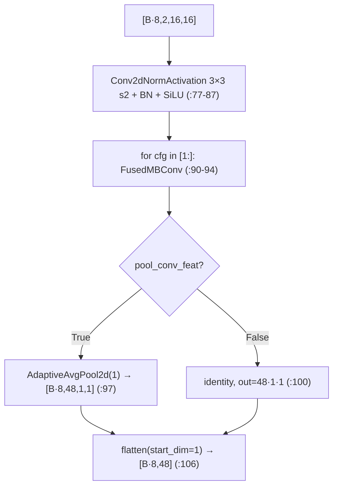
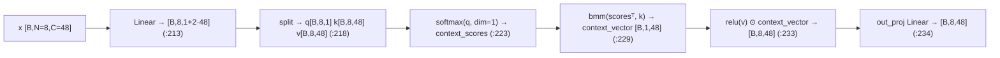
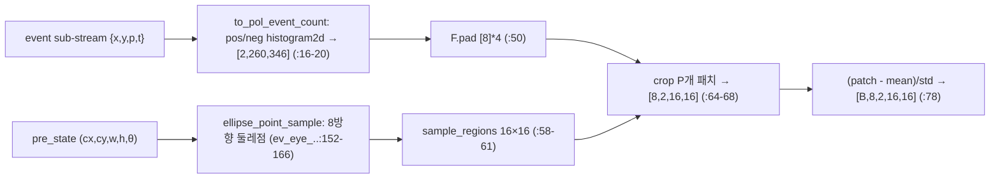

# EX-Gaze 모듈 통합 가이드 (S-PyTorch)

> 1차 요약: [`../EX-Gaze.md`](../EX-Gaze.md) — 본 문서는 그 요약을 모듈(클래스/함수) 단위로 심화한 S-PyTorch 변형 통합 가이드다.
> 분석 대상: `\\wsl.localhost\ubuntu-24.04\home\user\project\PRJXR-HBTXR\REF\XR-Eye-Tracking\Codebase\EX-Gaze`
> 관련 논문: [`../../Papers/EX-Gaze.md`](../../Papers/EX-Gaze.md) (EX-Gaze, IEEE TVCG Vol.31 No.5, 2025, DOI 10.1109/TVCG.2025.3549565)
> 작성 원칙: 실제 소스 Read 후 `파일:라인` 근거 표기. 라인 근거 없는 추론은 "추정", 코드로 확인 불가는 "확인 불가"로 명시. 정확도(IoU/F1/Pe)·지연은 논문 인용, 미실행 수치는 "확인 불가". timm/torchvision/mmrotate 원본 등 외부 프레임워크와 체크포인트·data/ 샘플은 [제외].

---

## 0. 문서 머리말

### 0.1 대표 케이스 선정 + 근거

본 repo는 **하이브리드(프레임 검출 + 이벤트 추적) 2-모델 파이프라인**이며, 메인 배포 스크립트가 실제 export·평가에 쓰는 두 모델을 대표로 선정한다. cb-convlstm이 "단일 모델 + 4변형"이었던 것과 달리, EX-Gaze는 **역할이 다른 두 모델이 폐루프로 협력**하는 점이 동형 분석의 핵심 차이다.

- **대표 추적 모델(고속, 이벤트): `EfficientTransVit`(model/detectors/efficient_trans_vit_v4.py:111)**
  - 근거: 배포 스크립트가 `ev_pupil_dis_..._accum50_..._rand_pre0.5.py` config로 빌드해 `(2,8,2,16,16)` 더미로 ONNX export(`deploy/scripts/export.py:29-37`). 추적 루프(`end_to_end_tracking.py:294`)가 `ev_single_pred`를 통해 매 추적 step 호출(`test/test_utils.py:75`). **실제 고주파 추적의 본체**다.
  - 구조: 패치별 CNN 인코더(FusedMBConv) → 패치 시퀀스 선형 어텐션(MobileViTv2) → 패치축 평균 → 변위 회귀 헤드(`efficient_trans_vit_v4.py:142-155`).
  - 특이점(중요): 학습/배포에 실제 선택되는 `CNNEncoderConfig_16_s1`의 출력 채널은 **48**(`:28`)이고, transformer `attn_unit_dim`·bbox_head `hidden_dim` 모두 **48로 오버라이드**(`cnn_16_s1_transformer_f2_n4.py:10,13`). 베이스 b1 config의 `attn_unit_dim=64`(`efficient_v4_transformer_f2_n4.py:8`)는 s1 경로에서 무효 → **대표 모델 D=48**(확인됨).
- **대표 검출 모델(저속, 프레임): `BasePupilDetector` + MobileNetV3-small(PreX)(model/detectors/base_pupil_detector.py:14, model/backbones/mobilenet.py:90)**
  - 근거: `mbv3spreX_head_retina_img_pupil_det_eye_region_crop.py` config로 빌드해 `(2,1,160,256)` 더미로 ONNX export(`export.py:21-27`). 추적 폐루프의 초기화·재검출(`frame_force_re_localization`, `end_to_end_tracking.py:195-202`)에서만 호출 → **저빈도 정확 경로**.
  - 구조: stem → MobileNetV3-small backbone(앞 8레이어, `pre_x_layers=8`) → RetinaHead(회전 anchor) (`mbv3spreX_head_retina_img_pupil_detector.py:7-14`, `mbv3s_head_retina_img_pupil_detector.py:19-86`).
- **대표 폐루프 컨트롤러: `EndToEndTrackerWithPreAccum`(end_to_end_tracking.py:331)** + **`shape_based_similarity`(model/img_pupil_similarity.py:15)**
  - 근거: README가 `--pre_accum_tracking` 권장(`README.md:67`). 이벤트 적응형 누적 임계(50개) 도달 시 1회 추적, 유사도 < 임계 시 프레임 재검출(`end_to_end_tracking.py:377-394`, `:191-193`).

> 정리: **고속 경로 = `EfficientTransVit`(FusedMBConv + 선형어텐션, D=48)**, **저속 경로 = MobileNetV3 회전검출**, **스케줄러 = 이벤트개수/유사도 임계 FSM**. 세 축이 0.5ms 예산 안에서 협력하는 것이 논문 2KHz 달성의 골자(EX-Gaze.md:40,64).

### 0.2 수치 표기 규약 (S-PyTorch)

- **params** = 레이어 차원에서 직접 산정. Conv2dNormActivation conv = `Cin·Cout·k²(+Cout BN γ,β + Cout BN running 무파라미터)`. FusedMBConv = (expand conv `Cin·Cexp·k²` + BN `2·Cexp`) + (project 1×1 `Cexp·Cout` + BN `2·Cout`)(`mbconv_v3.py:152-171`). 선형어텐션 qkv Linear = `D·(1+2D)+(1+2D)`, out Linear = `D·D+D`(`seperable_self_attention.py:200-208`). FFN = `D·2D + 2D·D + bias`(`:359-362`).
- **MACs / FLOPs** = 추적 모델의 핵심은 **패치별 dense CNN(P=8회 공유 가중치)** + **선형어텐션(O(N), N=P=8)** + **회귀 Linear**. 패치 CNN은 `(B·P, C, 16, 16)`로 묶여 한 번에(`efficient_trans_vit_v4.py:146`) → MAC ∝ B·P. 표준 conv식 `MAC = H·W·Cout·Cin·k²`(stride·padding 반영). thop로 측정 가능(`export.py:11,15-19`)하나 **본 repo 미실행 → "확인 불가"**, 논문 Jetson 실측 인용.
- **activation memory** = 텐서 `shape × bit`. 추적 모델 입력 `[B,8,2,16,16]`, 패치 CNN 중간 텐서는 16×16→7→3→1로 급감(`CNNEncoderConfig_16_s1` 주석 `:25-28`). 트랜스포머 토큰 `[B,8,48]`로 극소 → 활성 메모리 매우 작음(on-device 의도).
- **이벤트 표현** = **2채널 polarity event count 히스토그램**(pos/neg). 시간창 sub-stream을 `np.histogram2d`로 누적(`misc/event_representations/event_count.py:7-20`). voxel/time-surface 아님. 추적 모델 입력은 이 히스토그램에서 **타원 둘레 8방향 16×16 패치만 crop**(`ev_pupil_patch_preprocessor.py:45-79`).
- **MobileViTv2 선형어텐션 복잡도** = query에 softmax(N축) → context vector를 `bmm`으로 1회 집약 → value에 곱(`seperable_self_attention.py:223-234`). 표준 어텐션 `O(N²·D)`가 아니라 **O(N·D)**(N=P=8, D=48). N=8로 작아 어텐션 비용 자체가 미미.
- **하이브리드 스케줄** = `event_accum_num_threshold=50`(패치영역 누적 이벤트 50개) & `ev_accum_time=500`(µs, 0.5ms 슬라이스) & `max_accum_frame_num=10` & 유사도 임계(`similarity_threshold`)(`end_to_end_tracking_model_cfg.py:9-11`, README `:67` 0.8). fixation 시 추론 억제, saccade 시 고주파.
- **정확도/지연** = 논문 인용: 추적당 IoU 0.880 / F1 0.933 / Pe 1.183(@TH=50, EX-Gaze.md:61), Jetson 평균 추적 ≈0.407ms·2KHz(EX-Gaze.md:64), 프레임 재검출 1.17ms·이벤트추적 0.32ms·adaptation 0.02ms(EX-Gaze.md:64). **본 repo 미실행 → 실측 수치 "확인 불가", 논문값 인용**.

### 0.3 운영 경로 (학습 ↔ ONNX ↔ TensorRT)

```
[원시 EV-Eye: user{id}/{eye}/session_*/events/{frames/*.png, events.npz} (img_shape 260×346)]
      │  misc/.../check_valid_data.py + gen_pre_accum_thres_dataset: 타원 둘레 8패치 영역에
      │    이벤트 누적 임계(50) 도달 구간 탐색 + blink 세그먼트 제외(exp5) → 추적 데이터셋 json/hdf5
      ▼
[전처리 산출: blink_seg_exp5_..._thr50_tracking_dataset.json + event_accum_thr50_pol_event_count.hdf5]
      │  EyePupilDataset(parse_data_info) + EvPupilPatchPreprocessor.ellipse_patchify
      │    pre_state(cx,cy,w,h,θ) → 8방향 둘레점 → 16×16 patch [B,8,2,16,16] (+ z-score norm)
      ▼
[학습: train/default_train.py — mmengine Runner.from_cfg → runner.train()/test()]
      │  추적: EfficientTransVit(FusedMBConv s1 + LinearAttnEncoder f2_n4 + TransTransformerHead)
      │    loss=GDLoss(kld) on RotatedBoxes 변위, opt=AdamW lr=0.004/16 wd0.05, 80ep, warmup+cosine
      │  검출: BasePupilDetector(MobileNetV3-small preX8 + RetinaHead 회전 anchor), loss=Focal+GDLoss(kld)
      ▼
[평가: test/tracking_eval/end_to_end_tracking.py — 프레임 초기화 → 이벤트 적응 누적 추적 → 유사도 재검출]
      │  pickle 저장 → end_to_end_tracking_analysis.py: GT 시간정렬 → IoU/F1/Pe(EllipseMetric)
      ▼
[배포: deploy/scripts/export.py → 두 모델 ONNX(opset17) + thop 프로파일 → Jetson]
      │  trtexec --onnx=...x2.onnx --useCudaGraph --useSpinWait  (TensorRT, README:88-89)
```
- 체크포인트(`frame_based_model.pth`/`event_based_model.pth`)는 `/path/to/...` 하드코딩(`export.py:23,32`, `model_cfg.py:4,8`) — 자체는 [제외].

### 0.4 모델 / 데이터셋 / 정확도 요약

| 항목 | 값 | 근거 |
|---|---|---|
| 추적 입력 | 8패치×2채널×16×16 `[B,8,2,16,16]` + `pre_state[B,5]` | `export.py:31`, `efficient_trans_vit_v4.py:143` |
| 추적 출력 | 동공 회전박스 변위 → 누적 `[cx,cy,w,h,θ]` | `single_displacement_head.py:25`, `displace_bbox_coder.py:47` |
| 추적 모델 | FusedMBConv(s1, out48) + LinearAttn(P=8,D=48,4블록) + Linear(48→5) | `:28`, `cnn_16_s1_...py:10,13`, `efficient_v4_...py:8-14` |
| 추적 params | ≈ 0.10M (산정 5.6절, D=48 기준) | 차원 계산(미실행 검증 → 추정) |
| 검출 입력 | 그레이 안구 crop·resize `[B,1,160,256]` | `export.py:22`, `model_cfg.py:6` |
| 검출 모델 | MobileNetV3-small features[:8] + RetinaHead(회전 anchor) | `mobilenet.py:105`, `mbv3spreX_...py:7-14` |
| 추적 Loss | GDLoss(kld, τ=1) on RotatedBoxes 변위 | `trans_transformer_head.py(cfg):25`, `single_detection_head.py:133`(기본 gwd) |
| 추적 opt | AdamW lr=0.004/16, wd0.05, eps1e-8, 80ep, warmup4k+cosine | `ev_pupil_dis_..._rand_pre.py:36,57-62,29,39-54` |
| 이벤트 표현 | 2ch polarity event count(histogram2d) | `event_count.py:7-20` |
| 데이터셋 | EV-Eye(DAVIS346, 48명) / OpenEDS2020(합성 이벤트) | EX-Gaze.md:59, `data_split.py:5`(샘플 user48) |
| 메트릭 | IoU / F1 / Pixel error(Pe) | `end_to_end_tracking_analysis.py:150-156` |
| 정확도(논문 @TH50) | IoU 0.880, F1 0.933, Pe 1.183 / 평균추적 0.407ms·2KHz | EX-Gaze.md:61,64 (본 repo 미실행 → 확인 불가) |

---

## 1. Repo / Layer 개요 (검출 / 추적 / 배포 맵)

EX-Gaze = 이벤트 카메라로 동공 회전타원 `(cx,cy,w,h,θ)`을 고주파 추적하는 **하이브리드 프레임-이벤트 폐루프**. 무거운 프레임 검출(MobileNetV3 회전)로 초기화·재검출하고, 경량 이벤트 추적(FusedMBConv + MobileViTv2 선형어텐션)으로 프레임 사이를 고속 보간. mmrotate/mmdet/mmengine 기반(학습 측), 추론 그래프는 Conv/Linear/attn 위주라 HW 이식 친화. HLS/RTL 코드는 **부재**, 가속은 ONNX→TensorRT(Jetson)로만 구현(`README.md:75-89`).

### 1.1 파일 역할 맵

| 구분 | 파일 | 역할 | 메인 사용 |
|---|---|---|---|
| **추적 백본(고속 본체)** | `model/detectors/efficient_trans_vit_v4.py` | CNNEncoder(FusedMBConv)+LinearAttn+패치평균+헤드 | ★ export `:34` |
| **선형어텐션** | `model/blocks/seperable_self_attention.py` | MobileViTv2 separable attn(v2=Linear) + FFN + Encoder | ★ 추적 트랜스포머 |
| **FusedMBConv 블록** | `model/blocks/mbconv_v3.py` | FusedMBConv / InvertedResidual / Conv·MBConvConfig | ★ 패치 인코더 |
| **변위 헤드** | `model/heads/{single_displacement_head,trans_transformer_head,single_detection_head}.py` | 변위 회귀 + pre_state 누적 + 디코딩 | ★ 추적 출력 |
| **변위 추적기 베이스** | `model/detectors/base_disp_detector.py` | loss/predict/tensor 모드 분기(추적) | ★ |
| **패치 전처리** | `model/data_preprocessor/ev_pupil_patch_preprocessor.py` | 타원 둘레 8방향 16×16 패치 추출 | ★ 1차 실행 |
| **검출 백본(저속)** | `model/backbones/mobilenet.py` | MobileNetV3/V2 래퍼 + PreX 절단 | ★ export `:24` |
| **검출기 베이스** | `model/detectors/base_pupil_detector.py` | stem→backbone→RetinaHead | ★ |
| **변위 코더** | `model/task_modules/displace_bbox_coder.py` | 단순 차분 encode/decode | 보조(아래 5.5 주의) |
| **이벤트 표현** | `misc/event_representations/event_count.py` | polarity/abs/sum/binary 히스토그램 | ★ |
| **타원 샘플링·메트릭** | `misc/ev_eye_dataset_utils.py` | ellipse_point_sample / ellipse_iou / mask | ★ |
| **추적 스케줄** | `test/tracking_eval/end_to_end_tracking.py` | 프레임 초기화·이벤트 누적·유사도 재검출 | ★ 평가 진입점 |
| **유사도** | `model/img_pupil_similarity.py` | Sobel gradient ↔ 타원 법선 코사인유사도 | ★ 재검출 트리거 |
| **학습/배포** | `train/default_train.py`, `deploy/scripts/export.py` | Runner 학습 / ONNX export+thop | ★ |
| **데이터셋** | `dataset/eye_pupil_dataset.py` | EyePupilDataset(BaseDataset) | ★ |
| **[제외]** | `data/*`(png/npz/pickle/hdf5), `*.pth`, mmrotate/mmdet/torchvision 원본 | 샘플·체크포인트·외부 FW | 제외 |

### 1.2 forward 진입점

- **추적**: `model.test_step(...)`(`test_utils.py:75`) → `BaseDispDetector.predict`(`base_disp_detector.py:32`) → `EfficientTransVit.extract_feat`(`:142`) → `cnn_stage`(P개 묶음 conv `:146`) → `transformer_stage`(`:151`) → 패치평균 `:155` → `bbox_head.predict`(`single_displacement_head.py:48`) → 변위+pre_state 누적 `:25` → 디코딩.
- **검출**: `model.test_step(...)`(`end_to_end_tracking.py:144`) → `BasePupilDetector.predict`(`base_pupil_detector.py:60`) → `extract_feat`(stem→backbone `:74-79`) → `RetinaHead`(mmdet) → max-score 박스 선택(`end_to_end_tracking.py:115-124`).
- **ONNX export 경로**: `mode='tensor'` → `_forward`(`base_disp_detector.py:41`, `base_pupil_detector.py:70`) — data_preprocessor·pre_state 누적 우회, 순수 텐서 그래프만 trace.

### 1.3 제외 목록
- **외부 데이터/체크포인트**: `data/`(user48 frames png·events.npz·결과 pickle·hdf5), `*.pth`(frame/event 모델).
- **외부 프레임워크 원본**: mmrotate(GDLoss/DeltaXYWHTRBBoxCoder/RetinaHead/anchor/RotatedBoxes), mmdet/mmcv/mmengine/mmdeploy, torchvision(MobileNetV3·Conv2dNormActivation·SqueezeExcitation). import만, 본 repo 소스 아님.
- **미사용/잔존 변형**: `LinearSelfAttention`(2D conv 버전 `:15`)·`LinearSelfAttentionConv1d`(`:98`)·`LinearAttnFFN`(opts 버전 `:238`)은 v2가 아닌 구버전으로 추적 경로 미결선(4.6절에서 구조만 기록). `is_distil`(`trans_transformer_head.py:25`) 분기·`empty_filter`(주석 `:71-76`)·`DisplaceBBoxCoder`(아래 5.5 결선 주의).

---

## 2. 모듈: 추적 백본 — `EfficientTransVit` (고속 이벤트 추적 본체)

### 2.1 역할 + 상위/하위
- **역할**: 동공 둘레 8개 16×16 이벤트 패치를 입력받아 → 패치별 공유-가중치 CNN으로 인코딩 → 패치 시퀀스에 선형 어텐션을 적용해 8방향 관계를 통합 → 패치축 평균으로 단일 토큰 생성 → 변위 회귀 헤드에 투입. **공간은 CNN, 패치 간 관계는 트랜스포머**로 처리.
- **상위**: `BaseDispDetector`(loss/predict/tensor 분기, `base_disp_detector.py:12`). 그 위는 추적 루프 `ev_single_pred`(`test_utils.py:75`).
- **하위**: `CNNEncoder`(FusedMBConv 스택, `efficient_trans_vit_v4.py:57`), `LinearAttnEncoder`(`seperable_self_attention.py:382`), `TransTransformerHead`(`trans_transformer_head.py:17`).

### 2.2 데이터플로우 (텐서 shape · 패치축)

```mermaid
flowchart LR
  IN["batch_inputs [B,P=8,C=2,16,16]"] --> RS["view(-1,2,16,16) → [B·8,2,16,16] (:146)"]
  RS --> CNN["CNNEncoder: Conv s2 + FusedMBConv×3<br/>16→7→3→1, out 48ch (:24-28)"]
  CNN --> FLT["flatten → [B·8,48] (:106)"]
  FLT --> VW["view → [B,8,48] (:148)"]
  VW --> POS["+ pos_embedding [1,8,48] (:421)"]
  POS --> ATTN["LinearAttnFFN_v2 ×4 (O(N) attn) (:407-416)"]
  ATTN --> LN["LayerNorm → [B,8,48] (:417)"]
  LN --> MEAN["mean(dim=1) → [B,48] (:155)"]
  MEAN --> HEAD["TransTransformerHead.reg_bbox: Linear(48→5) (:59)"]
  HEAD --> OUT["displacement [B,5]"]
```

패치축: 8개 패치가 batch에 펼쳐져(`B·P`) CNN을 **공유 가중치로 병렬 처리**, 이후 `[B,8,48]`로 되접어 트랜스포머가 패치 간 어텐션(논문 patch-shared CNN, EX-Gaze.md:43).

### 2.3 forward call stack
```
ev_single_pred (test_utils.py:75) → model.test_step
└─ BaseDispDetector.predict (base_disp_detector.py:32)
   ├─ EvPupilPatchPreprocessor.forward (ev_pupil_patch_preprocessor.py:81)  # 패치 추출
   ├─ extract_feat (efficient_trans_vit_v4.py:142)
   │  ├─ cnn_stage(view(-1,C,H,W)) (:146) → CNNEncoder.forward (:102)
   │  ├─ view(B,P,D) (:148)
   │  ├─ transformer_stage (:151) → LinearAttnEncoder.forward (:419)
   │  └─ mean(dim=1) (:155)
   └─ bbox_head.predict (single_displacement_head.py:48)
      └─ predict_bbox: forward(변위) + pre_encoded_box 누적 + decode (:14-29)
```

### 2.4 대표 코드 위치
`efficient_trans_vit_v4.py:24-28`(s1 CNN config), `:57-107`(CNNEncoder), `:111-155`(EfficientTransVit), `:142-155`(extract_feat).

### 2.5 대표 코드 블록

**(a) 패치별 공유-가중치 CNN 인코딩 (`efficient_trans_vit_v4.py:142-148`)**
```python
B, P, C, H, W = batch_inputs.shape
torch._assert(H == W and H == self.patch_size, ...)   # 16×16 강제
torch._assert(self.patch_num == P, ...)               # P=8 강제
conv_feat = self.cnn_stage(batch_inputs.view(-1, C, H, W))  # [B·8,2,16,16] → [B·8,48]
conv_feat = conv_feat.view(B, P, self.conv_dim)            # [B,8,48]
```
→ 8패치를 `B·P` 한 batch로 묶어 **동일 CNN 1회 호출**(가중치 공유, FPGA systolic PE 매핑 자연스러움, 9.1절).

**(b) 선형어텐션 + 패치축 평균 (`efficient_trans_vit_v4.py:150-155`)**
```python
if self.transformer_stage:
    trans_feat = self.transformer_stage(conv_feat)  # [B,8,48]
else:
    trans_feat = conv_feat
return torch.mean(trans_feat, dim=1)                # [B,48] 단일 토큰
```
→ 8개 패치 토큰을 평균해 하나의 변위 회귀용 feature로 압축. CLS 토큰 없이 mean pooling(논문 average pooling, EX-Gaze.md:44 일치, 확인됨).

**(c) s1 CNN 인코더 config — 실제 선택 (`efficient_trans_vit_v4.py:24-28`)**
```python
CNNEncoderConfig_16_s1 = [
    ConvConfig(2, 16, 3, 2, 0, nn.SiLU),            # in16 out7
    FusedMBConvConfig(16, 32, 48, 3, 2, 0, False),  # in7 out3
    FusedMBConvConfig(32, 32, 96, 3, 1, 1, False),  # in3 out3
    FusedMBConvConfig(32, 48, 96, 3, 1, 0, False)]  # in3 out1, 최종 48ch
```
→ stride conv로 16→7 다운샘플 후 FusedMBConv 3단으로 7→3→3→1, 최종 공간 1×1·채널 48(`pool_conv_feat=False`라 `out_channels = 48·1·1 = 48`, `:100`). cb-convlstm의 ConvLSTM 4단 적층(공간 보존·시간 재귀)과 대비되는 **공간 압축형 백본**.

### 2.6 연산 분해 + 정량 (대표 입력 `[B,8,2,16,16]`)

패치 CNN MAC(패치 1개, stride·padding 반영, 출력공간 주석 `:25-28`):

| 단 | in→out(exp) | 입력 | 출력 | conv MAC(패치1, B=1) |
|---|---|---|---|---|
| stem Conv 3×3 s2 | 2→16 | 16×16 | 7×7 | 7·7·16·2·9 ≈ 14.1K |
| FusedMBConv1 | 16→48→32 | 7×7 | 3×3 | exp 3·3·48·16·9 + proj 3·3·32·48 ≈ 62.2K+13.8K |
| FusedMBConv2 | 32→96→32 | 3×3 | 3×3 | exp 3·3·96·32·9 + proj 3·3·32·96 ≈ 248.8K+27.6K |
| FusedMBConv3 | 32→96→48 | 3×3 | 1×1 | exp 1·1·96·32·9 + proj 1·1·48·96 ≈ 27.6K+4.6K |

- 패치 CNN MAC(패치1) ≈ **0.44 MMAC** → ×P=8 = **3.5 MMAC/추적 1회**(B=1, 추정·미실행). 선형어텐션·헤드는 D=48·N=8로 ≈수십 KMAC(무시 수준).
- **선형어텐션 MAC**(블록1개, N=8,D=48): qkv `8·48·97 ≈ 37K` + out `8·48·48 ≈ 18K` + FFN `8·(48·96+96·48) ≈ 74K` ≈ 0.13M ×4블록 ≈ **0.5 MMAC**. 표준 O(N²) 어텐션이었어도 N=8이라 차이는 미미하나, **D가 커질수록 선형성이 자산**(9.1절).
- **params(추적, D=48 산정)**:
  - CNN: stem `2·16·9+16·2≈0.3K`; FMB1 `(16·48·9+48·2)+(48·32+32·2)≈8.5K`; FMB2 `(32·96·9+96·2)+(96·32+32·2)≈30.8K`; FMB3 `(32·96·9+96·2)+(96·48+48·2)≈32.4K` → CNN ≈ **72K**.
  - LinearAttn(블록1): qkv `48·97+97≈4.75K` + out `48·48+48≈2.35K` + FFN `48·96+96 + 96·48+48≈9.4K` + LN 2·48×2 ≈ 0.4K → ≈ 16.9K ×4 + pos `8·48=0.38K` + 최종 LN ≈ **68.5K**.
  - head reg_bbox `48·5+5 = 245`.
  - **합 ≈ 0.14M** → 논문은 절대 params 미명시(EX-Gaze.md), thop 미실행 → **수치 추정**(0.10~0.14M 규모, 극경량).
- **activation memory**: 입력 `[B,8,2,16,16]`=B·4096 elem, 토큰 `[B,8,48]`=B·384 elem. fp32 추론(B=1)이면 KB 수준 → on-chip SRAM 상주 가능(9절).
- **논문 대조**: 추적 GPU 처리시간 < 0.4ms(EX-Gaze.md:26), 모듈 오버헤드 이벤트추적 0.32ms(EX-Gaze.md:64). 코드 미실행 → 절대 MAC/지연 "확인 불가", 논문 인용.

---

## 3. 모듈: FusedMBConv 패치 인코더 — `CNNEncoder` / `FusedMBConv`

### 3.1 역할 + 상위/하위
- **역할**: `ConvConfig` 리스트를 받아 첫 단 `Conv2dNormActivation` + 후속 `FusedMBConv`/`InvertedResidual`을 `nn.Sequential`로 쌓고, 16×16 패치를 1×1·48ch feature로 인코딩. `pool_conv_feat`면 AdaptiveAvgPool, 아니면 공간 flatten해 `out=C·h·w`(`efficient_trans_vit_v4.py:96-100`).
- **상위**: `EfficientTransVit.cnn_stage`(`:126`). **하위**: `FusedMBConv`(`mbconv_v3.py:135`), `Conv2dNormActivation`(torchvision).

### 3.2 데이터플로우


### 3.3 forward call stack
```
EfficientTransVit.extract_feat (:146) → CNNEncoder.forward (:102)
├─ self.conv_list(x)  # Conv2dNormActivation → FusedMBConv×3 (:103)
├─ (opt) conv_pool (:104-105)
└─ torch.flatten(conv_feat, start_dim=1) (:106)
   FusedMBConv.forward (mbconv_v3.py:189): block(input) (+stochastic_depth+res if use_res)
```

### 3.4 대표 코드 위치
`efficient_trans_vit_v4.py:57-107`(CNNEncoder), `mbconv_v3.py:135-194`(FusedMBConv), `:75-132`(InvertedResidual=MBConv).

### 3.5 대표 코드 블록

**(a) FusedMBConv 갱신식 (`mbconv_v3.py:152-194`)**
```python
if config.expanded_channels != config.in_channels:
    layers.append(Conv2dNormActivation(in, exp, k, stride, pad, BN, SiLU))   # fused expand(k×k conv)
    layers.append(Conv2dNormActivation(exp, out, 1, BN, act=None))           # project 1×1
else:
    layers.append(Conv2dNormActivation(in, out, k, stride, pad, BN, SiLU))   # 단일 conv
...
def forward(self, input):
    result = self.block(input)
    if self.use_res:
        result = self.stochastic_depth(result); result += input
```
→ MBConv(InvertedResidual)의 depthwise + SE(`:113-115`)를 **k×k 일반 conv로 융합(fused)**한 EfficientNetV2 블록. depthwise 분리·SE가 없어(`use_se` 미사용 경로) HW 매핑 단순(9.1절). residual은 stride1·동일채널일 때만(`:145-146`).

**(b) 출력 차원 결정 — pool 없이 flatten (`efficient_trans_vit_v4.py:96-100`)**
```python
if pool_conv_feat:
    self.conv_pool = nn.AdaptiveAvgPool2d(1)
else:
    self.conv_pool = None
    self.out_channels = self.out_channels * self.inter_out_size * self.inter_out_size  # 48·1·1
```
→ s1 config는 최종 공간 1×1이라 `pool` 없이도 `out=48`(`inter_out_size`가 config 주석대로 1로 수렴, `cal_output_size` `mbconv_v3.py:27`로 단계 추적). `transformer_encoder_config["attn_unit_dim"]==conv_dim==48` assert로 정합 강제(`efficient_trans_vit_v4.py:133-134`).

### 3.6 연산 분해 + 정량
- params·MAC: 2.6절 표 참조(FusedMBConv 3단 ≈ 72K params, 3.5 MMAC/추적). depthwise 없는 fused conv라 표준 conv MAC식 그대로 적용.
- **비선형**: SiLU(expand/conv)·SE의 Hardsigmoid(`mbconv_v3.py:43`, s1 경로는 SE 미사용) → INT8 양자화 시 LUT 근사 필요(9.3절).
- **InvertedResidual(MBConv)는 s1 경로 미사용**(s0/b0 등 다른 config에서만). 본 대표 모델은 FusedMBConv만 결선(확인됨, `CNNEncoderConfig_16_s1`에 InvertedResidual 없음 `:24-28`).

---

## 4. 모듈: MobileViTv2 선형 어텐션 — `LinearSelfAttention_v2` / `LinearAttnEncoder`

### 4.1 역할 + 상위/하위
- **역할**: 8개 패치 토큰 시퀀스 `[B,8,48]`에 **O(N) separable self-attention**(MobileViTv2, arXiv 2206.02680) 적용. query 1채널에 softmax → context vector 1회 집약 → value에 곱. 표준 어텐션의 `Q·Kᵀ`(N×N) 행렬 없이 선형 복잡도.
- **상위**: `LinearAttnFFN_v2`(pre-norm 블록 `:319`) → `LinearAttnEncoder`(pos emb + N블록 + LN `:382`) → `EfficientTransVit.transformer_stage`(`:135`).
- **하위**: `nn.Linear`(qkv/out/FFN), `nn.LayerNorm`, softmax/relu/bmm.

### 4.2 데이터플로우 (선형어텐션 핵심)

> 핵심: `context_vector`는 `[B,1,48]` (N축 집약) → value 전체에 broadcast 곱. N×N 어텐션 맵 부재 = **O(N·D)**.

### 4.3 forward call stack
```
EfficientTransVit.transformer_stage (:151) → LinearAttnEncoder.forward (:419)
├─ input + pos_embedding (:421)
├─ dropout → layers (Sequential of LinearAttnFFN_v2 ×4) (:422)
│  └─ LinearAttnFFN_v2.forward (:373): x + pre_norm_attn(x); x + pre_norm_ffn(x)
│     └─ LinearSelfAttention_v2.forward (:211): qkv → split → softmax → bmm → relu·mul → out_proj
└─ self.ln(...) LayerNorm (:417)
```

### 4.4 대표 코드 위치
`seperable_self_attention.py:175-235`(LinearSelfAttention_v2), `:319-378`(LinearAttnFFN_v2), `:381-422`(LinearAttnEncoder), config `efficient_v4_transformer_f2_n4.py:5-16`.

### 4.5 대표 코드 블록

**(a) 선형어텐션 본체 (`seperable_self_attention.py:213-234`)**
```python
qkv = self.qkv_proj(x)                                  # [B,8,1+2·48]
query, key, value = torch.split(qkv, [1, 48, 48], dim=2)
context_scores = F.softmax(query, dim=1)               # softmax along N(=8)
context_vector = torch.bmm(context_scores.transpose(1,2), key)  # [B,1,48] ★ N축 1회 집약
out = torch.mul(F.relu(value), context_vector)         # broadcast 곱 [B,8,48]
out = self.out_proj(out)
```
→ `Q·Kᵀ` 없이 `bmm`으로 context를 1회 모음 → 토큰 수 N에 선형. cb-convlstm이 시간축을 직렬 재귀로 푼 것과 달리, EX-Gaze는 패치축을 **단일 어텐션 연산으로 병렬 통합**(HW 파이프라인 stall 없음, 9.4절 대비).

**(b) pos embedding + 인코더 (`seperable_self_attention.py:397-422`)**
```python
if learnable_position_embeddings:
    self.pos_embedding = nn.Parameter(torch.empty(1, patch_num, attn_unit_dim).normal_(std=0.02))  # BERT식
# else: sinusoidal(타원 각도 기반) :400-404
...
input = input + self.pos_embedding
return self.ln(self.layers(self.dropout(input)))
```
→ config는 `learnable_position_embeddings=True`(`efficient_v4_transformer_f2_n4.py:15`). sinusoidal 분기는 **타원 둘레 각도(2π/patch_num)** 기반 위치 인코딩(`:400-403`)으로, 8방향 패치의 공간 의미를 담을 의도(미사용, 추정).

**(c) FFN 블록 (`seperable_self_attention.py:356-363`)**
```python
self.pre_norm_ffn = nn.Sequential(
    nn.LayerNorm(embed_dim),
    nn.Linear(embed_dim, ffn_latent_dim),  # 48→96 (ffn_multiplier=2.0)
    act_layer(),                           # ReLU (config :14)
    nn.Linear(ffn_latent_dim, embed_dim))  # 96→48
```
→ pre-norm transformer 표준 FFN. `ffn_multiplier=2.0`이라 latent=96(`efficient_v4_transformer_f2_n4.py:9`).

### 4.6 보조: 미사용 어텐션 변형 (별 계보)
- `LinearSelfAttention`(`:15`): 입력 `[B,C,P,N]` 4D, qkv를 **Conv2dNormActivation 1×1**로 투영(`:48-55`), `context_vector = sum(key·scores, dim=-1, keepdim)`(`:89`). MobileViTv2 원형(unfold 텐서용). 추적은 v2(Linear, 3D)를 씀(`LinearAttnFFN_v2:346` → `LinearSelfAttention_v2`) → 본 변형 미결선.
- `LinearSelfAttentionConv1d`(`:98`): Conv1d 버전, 미사용. `LinearAttnFFN`(`:238`): `opts` 인자 받는 구버전(`:258`), 미사용.
- → 1차 요약이 v2만 본 것은 정확. 본 가이드는 **추적 결선 = `LinearAttnEncoder`→`LinearAttnFFN_v2`→`LinearSelfAttention_v2`**임을 확정(확인됨).

### 4.7 연산 분해 + 정량 (전체 트랜스포머)
- params: 4.5절 + 2.6절 → 4블록 ≈ 68.5K(D=48). N=8·D=48이라 어텐션 자체 MAC ≈ 0.5 MMAC(2.6절).
- **선형어텐션 복잡도(이론)**: 표준 `O(N²·D + N·D²)` vs separable `O(N·D + N·D²)`. N=8로 N² 항이 작아 본 모델 절대 절감은 작으나, **D 확장·N 증가 시 선형성이 결정적**(논문 SEPT 저지연 근거, EX-Gaze.md:19,44). FPGA에서 softmax 1회 + 가중합으로 BRAM/DSP 압박 작음(9.1절, 추정).

---

## 5. 모듈: 변위 회귀 헤드 + 하이브리드 스케줄 (추적 핵심 로직)

추적의 출력은 절대좌표가 아니라 **pre_state 대비 변위(delta)의 누적**이다. 헤드 3계층 + 변위 코더 + 스케줄러를 함께 해부.

### 5.1 `TransTransformerHead` / `SingleDisplacementHead` — 변위 회귀 (대표)
- **역할**: 단일 토큰 `[B,48]`에서 `reg_bbox`(Linear 48→5)로 회전박스 변위 예측(`trans_transformer_head.py:59,63-69`) → `pre_state`를 기준박스 대비 인코딩한 값에 **더해** 새 동공 상태 산출(`single_displacement_head.py:25`).

**(a) 변위 + pre_state 누적 (`single_displacement_head.py:14-29`)**
```python
displacement_preds = self.forward(x)                        # 네트워크가 변위 출력
pre_encoded_box = self.bbox_coder.encode(decode_ref_bboxes, pre_state_boxes)  # 이전상태 인코딩
box_preds = displacement_preds + pre_encoded_box            # ★ 변위를 이전상태에 누적
box_preds = self.decode_predict(box_preds, decode_ref_bboxes, cropped_bboxes, predict)  # 디코딩
```
→ cb-convlstm의 hidden state carry(시간 재귀)와 대응되는 **EX-Gaze의 상태 전달 = pre_state 변위 누적**. 단 RNN이 아니라 step마다 외부에서 pre_state를 주입하는 explicit recurrence.

**(b) 기준박스 고정 (`trans_transformer_head.py:71-88`)**
```python
if self.ref_bbox_shape is not None:
    ref_bboxes.append([[input_shape[1]/2, input_shape[0]/2, ref_w, ref_h, 0]])
```
→ 학습 config는 `ref_bbox_shape=[50,50]`(`ev_pupil_dis_..._rand_pre.py:27`), 이미지 중심에 50×50 고정 anchor 대비 mmrotate `DeltaXYWHTRBBoxCoder`로 변위 인코딩(`single_detection_head.py:134-142`).

### 5.2 `SingleDetectionHead` 베이스 — 손실·코더
- 기본 손실 `GDLoss(loss_type='gwd')`(`single_detection_head.py:132-133`), 추적 config는 **kld**로 오버라이드(`trans_transformer_head.py(cfg):25` `loss_type='kld', tau=1`). 회전 IoU 친화 Gaussian 거리 손실.
- 기본 코더 `DeltaXYWHTRBBoxCoder(angle_version="le90")`(`:134-142`) — mmrotate 회전박스 5-DoF delta 인코딩.
- 샘플당 **GT 1개만 허용**(`:213` `if target.shape[0]!=1: raise`) → 단일 동공 회귀(확인됨). `weighted_loss`로 가중(`:215-222`).

### 5.3 검출 헤드 — RetinaHead(회전 anchor)
- 프레임 검출은 mmdet `RetinaHead`(`mbv3s_head_retina_img_pupil_detector.py:30`), num_classes=1, FocalLoss(γ2,α0.25) + GDLoss(kld,τ1,weight5.5)(`:53-65`), `FakeRotatedAnchorGenerator`(base_sizes=[50], scales=[1], strides=[32], `:36-44`). PreX는 strides·scales를 `[16]·[1,1.5,2,3]`로 오버라이드(`mbv3spreX_..._py:21-26`), pos/neg IoU 0.3/0.1(`:27-29`). 본체 구현은 mmrotate/mmdet 위임([제외]).

### 5.4 하이브리드 스케줄 — `EndToEndTrackerWithPreAccum`
**가장 중요한 폐루프 컨트롤러.** 프레임 초기화 → 이벤트 적응 누적 → 임계 도달 시 1회 추적 → 유사도 < 임계 시 재검출.

**(a) pre-accum 추적 루프 (`end_to_end_tracking.py:377-394`)**
```python
for accum_frame in range(self.max_accum_frame_num):       # 최대 10 슬라이스 역방향 누적
    accum_end_time = ev_end_time - accum_frame * self.event_accum_time   # 0.5ms 슬라이스
    accum_start_time = accum_end_time - self.event_accum_time
    event_accum_num += event_patch_accum(self.event_stream, accum_start_time, accum_end_time, patch_mask)
    if event_accum_num >= self.event_accum_num_threshold:  # ★ 패치영역 누적 이벤트 ≥50
        self.latest_pupil_state = ev_single_pred(...)      # 1회 추론
        break
```
→ 논문 adaptive frequency `e^c > TH_{e^c}=50 & t^c < TH_{t^c}=5ms`(EX-Gaze.md:40) 구현. fixation(이벤트 적음)이면 추론 생략, saccade(이벤트 폭증)면 즉시 추론 → **이벤트 적응형 추론 빈도**.

**(b) 유사도 재검출 트리거 (`end_to_end_tracking.py:191-193` + `img_pupil_similarity.py:29-65`)**
```python
similarity = self.frame_check_similarity(next_frame, ...)  # shape_based_similarity
if similarity < self.similarity_threshold:                 # README 0.8 (:67)
    self.re_localization = True                            # 프레임 재검출 플래그
```
→ Sobel gradient(`img_pupil_similarity.py:29-30`)와 타원 둘레 48점 법선의 코사인 유사도(`:65`) — 논문 gradient template matching `S<TH_s=0.8`(EX-Gaze.md:49). glint outlier는 평균+3.6σ 초과 필터(`:50-51`, 논문 ±2σ와 상이 → 추정/구현 차이).

### 5.5 연산 분해 + 정량 + 결선 주의
- 헤드 params: `reg_bbox` Linear 48→5 = 245(2.6절). 변위 코더·스케줄러는 파라미터 없음.
- **결선 주의 1(확인됨)**: 추적 헤드는 `bbox_coder = DeltaXYWHTRBBoxCoder`(mmrotate)를 씀(`single_detection_head.py:134-142`, config `trans_transformer_head.py:12-19`). 자체 `DisplaceBBoxCoder`(`displace_bbox_coder.py`, 단순 차분 `:31,47`)는 `EV_TASK_UTILS`에 등록(`:9`)되어 있으나 대표 추적 config에 결선되지 않음 → **변위 누적의 실제 코더는 mmrotate delta 코더**(1차 요약의 단순차분 서술은 보조 코더 기준 — 본 가이드 정정). 단 누적 자체의 `+` 연산(`single_displacement_head.py:25`)은 두 코더 모두 동일 의미.
- **결선 주의 2(확인됨)**: 대표 추적 모델 D=48이며 `attn_unit_dim`·`hidden_dim` 모두 48(`cnn_16_s1_transformer_f2_n4.py:10,13`). 베이스 `efficient_v4_transformer_f2_n4.py`의 64, `trans_transformer_head.py(cfg)`의 768은 **다른 경로 기본값**으로 s1에선 무효(가이드 전반 D=48 기준).
- **논문 정량**(인용): 추적당 GPU 0.32ms, IoU 0.880/F1 0.933/Pe 1.183(@TH50), 재검출 비율 ~8%(TH_s0.8)·Pe 1.412(EX-Gaze.md:61,64). **본 repo 미실행 → "확인 불가"**.

---

## 6. 모듈: 데이터 파이프라인 — `EvPupilPatchPreprocessor` / `event_count` / `EyePupilDataset`

### 6.1 역할 + 상위/하위
- **역할**: 이벤트 sub-stream → 2채널 polarity 히스토그램(`event_count.py:7-20`) → 동공 타원 둘레 8방향 16×16 패치 추출(`ev_pupil_patch_preprocessor.py:45-79`) → z-score 정규화 → `[B,8,2,16,16]`.
- **상위**: `BaseDataPreprocessor.forward`(mmengine) → `EfficientTransVit`. **하위**: `ellipse_point_sample`(`ev_eye_dataset_utils.py:152`), `np.histogram2d`, `F.pad`.

### 6.2 데이터플로우


### 6.3 forward call stack (데이터)
```
EvPupilPatchPreprocessor.forward (ev_pupil_patch_preprocessor.py:81)
├─ super().forward(data)  # device 이동 등
├─ ellipse_patchify(input_volume, pre_state) (:91)
│  ├─ F.pad(batch_inputs, [8,8,8,8]) (:50)
│  ├─ for (vol, pre_state): ellipse_point_sample(pre_state, sample_rads) (:57)
│  ├─ sample_regions = points ± 8 (:59-61)
│  └─ crop vol[:, y1:y2, x1:x2] → stack P patches (:64-68)
└─ (mean/std) normalize (:77-78)
```

### 6.4 대표 코드 위치
`event_count.py:7-20`(to_pol_event_count), `ev_pupil_patch_preprocessor.py:38-39`(8방향 각도), `:45-79`(ellipse_patchify), `ev_eye_dataset_utils.py:152-166`(ellipse_point_sample).

### 6.5 대표 코드 블록

**(a) 2채널 polarity 히스토그램 (`event_count.py:11-20`)**
```python
pos_mask = sub_stream[:, 2] == 1; neg_mask = sub_stream[:, 2] != 1
hist1, _, _ = np.histogram2d(x=pos_y, y=pos_x, bins=[H, W], range=[[0,H],[0,W]])  # pos
hist2, _, _ = np.histogram2d(x=neg_y, y=neg_x, bins=[H, W], range=[[0,H],[0,W]])  # neg
return np.stack((hist1, hist2))   # [2,260,346]
```
→ 좌표 기반 단순 2D 누적. voxel grid 아님 → **HW BRAM 누적기로 직접 구현 가능**(9.4절). cb-convlstm의 단일채널 누적 프레임(60×80)과 대비: 여기선 2채널·full-res(260×346)지만 **즉시 8패치로 축소**.

**(b) 타원 둘레 8방향 패치 추출 (`ev_pupil_patch_preprocessor.py:38-39,57-68`)**
```python
self.base_rad = np.pi * 2 / self.patch_num            # 2π/8
self.sample_rads = self.base_rad * np.arange(self.patch_num)  # 8개 균등 각도
...
ellipse_sample_point = ellipse_point_sample(pre_state.cpu().numpy(), self.sample_rads)  # 둘레점
sample_points = np.ceil(ellipse_sample_point).astype(np.int32) + self.patch_size // 2   # pad 보정
for region in sample_regions:
    patches.append(input_volume[:, region[1]:region[3], region[0]:region[2]])  # 16×16 crop
```
→ 논문 "edge 주변에만 이벤트 집중 → 둘레 M=8점 중심 16×16 patch만 추출"(EX-Gaze.md:37) 직접 구현. **입력 차원 대폭 축소**(260×346 → 8×16×16). 사전지식(동공=타원) 활용한 희소화.

**(c) 타원 둘레점 계산 (`ev_eye_dataset_utils.py:159-164`)**
```python
x, y, w, h, t = ellipse; orin_sample_rads = sample_rads - t
a, b = w/2, h/2
r = np.sqrt((a*b)**2 / ((b*np.cos(orin_sample_rads))**2 + (a*np.sin(orin_sample_rads))**2))
sample_points = np.stack([r*np.cos(sample_rads)+x, r*np.sin(sample_rads)+y], axis=1)
```
→ 회전 타원 극좌표식으로 8방향 둘레점 산출. θ 회전 보정 포함. CORDIC/LUT 근사 대상(9.5절).

### 6.6 연산 분해 + 정량
- params 없음(전처리). 비용은 histogram2d(이벤트 수 비례) + crop·정규화.
- 입력 텐서/추적: 패치 `[8,2,16,16]` fp32 = 8·2·256·4B = **16KB/추적**(배치 매우 작음). 히스토그램 중간 `[2,260,346]`=720KB지만 패치 추출 후 폐기.
- 정규화 mean/std: `[0.00118537,0.00101531]`/`[0.03475869,0.03229738]`(`ev_pupil_dis_..._rand_pre.py:17`) — 이벤트 count의 희소성 반영(평균 ~0.001, 극소).
- 데이터셋 증강: `random_dis_range=0.5`(pre_state 변위 섭동, rand_pre0.5), `random_rot_range=0.1`, `random_scale_range=0`(`ev_pupil_dis_..._rand_pre0.5.py:7-9`) → **이전상태에 인위 perturbation을 주어 변위 회귀 강건화**(논문 EX-Gaze.md:56 일치).

---

## 7. 모듈 한눈표

| # | 모듈 | 파일:라인 | 역할 | 대표 정량 |
|---|---|---|---|---|
| 2 | EfficientTransVit | efficient_trans_vit_v4.py:111-155 | 패치 CNN+선형attn+평균+변위헤드(추적 본체) | ≈0.14M params / 3.5 MMAC·추적(추정) |
| 3 | CNNEncoder / FusedMBConv | efficient_trans_vit_v4.py:57-107, mbconv_v3.py:135-194 | 16×16 패치 → 48ch 인코딩(공유 가중치) | CNN ≈72K params, 16→7→3→1 |
| 4 | LinearSelfAttention_v2 / LinearAttnEncoder | seperable_self_attention.py:175-235,381-422 | MobileViTv2 O(N) 선형어텐션 | N=8,D=48,4블록 / ≈68.5K params |
| 4.6 | 미사용 attn 변형 | seperable_self_attention.py:15,98,238 | conv/conv1d/opts 구버전(미결선) | — |
| 5.1 | TransTransformerHead | trans_transformer_head.py:17-88 | 변위 회귀 + pre_state 누적 | reg_bbox 48→5=245 |
| 5.3 | RetinaHead(검출) | mbv3s_head_retina_..._py:30-84 | 회전 anchor 검출(저속) | FocalLoss+GDLoss(kld) |
| 5.4 | EndToEndTrackerWithPreAccum | end_to_end_tracking.py:331-412 | 이벤트 적응누적+유사도 재검출 | TH50·max10·0.5ms·sim0.8 |
| 5.4 | shape_based_similarity | img_pupil_similarity.py:15-70 | Sobel↔법선 코사인유사도 | 48점·+3.6σ 필터 |
| 6 | EvPupilPatchPreprocessor | ev_pupil_patch_preprocessor.py:45-105 | 타원 둘레 8방향 16×16 패치 추출 | 16KB/추적, 8각도 |
| 6 | to_pol_event_count | event_count.py:7-20 | 2채널 polarity 히스토그램 | [2,260,346]→8패치 |
| 1.2 | MobileNetBackbonePreX(검출) | mobilenet.py:90-107 | MobileNetV3-small features[:8] | 48ch 출력, ↓×16 |

---

## 8. 학습 · 평가 · 배포 파이프라인 + 재현 명령

### 8.1 학습 (`train/default_train.py:29-32`)
- mmengine `Runner.from_cfg(cfg)` → `runner.train()` → `runner.test()`. `CUDA_VISIBLE_DEVICES='1'` 하드코딩(`:5`).
- **추적 모델**: opt `AdamW lr=0.004/16, wd0.05, eps1e-8`(`ev_pupil_dis_..._rand_pre.py:57-62`), 80 epoch(`:29`), warmup LinearLR(0~4000 iter, `:39-45`) + CosineAnnealingLR(40~80ep, `:47-53`). loss `GDLoss(kld,τ1)`(`trans_transformer_head.py:25`). 증강 perturbation(6.6절).
- **검출 모델**: 베이스 schedule `Adam lr=1e-5, clip_grad max_norm35`(`defualt_schedule.py:27-35`), 30ep·val_interval5(`:6`), ReduceOnPlateau+MultiStepLR(`:11-24`). loss Focal+GDLoss(kld, weight5.5)(`mbv3s_head_retina_..._py:53-65`).
- 데이터: 본 repo 샘플은 user48/left/session201 1종(`data_split.py:5`, `multi_max10_accum50_..._py:14-16`). 추적 데이터셋은 사전계산 json+hdf5(`base_ev_pupil_displace.py:7-8`, blink 세그먼트 exp5·thr50 반영).

### 8.2 평가 메트릭 (`end_to_end_tracking_analysis.py:150-156`)
```python
iou, f1_score = ellipse_iou(gt_pupil, ev_pupil, img_shape, with_f1_score=True)  # 타원 마스크 IoU/F1
dist = np.sqrt(np.sum((np.square(gt_pupil[:2] - ev_pupil[:2]))))                # 중심 거리 = Pe
nearest_result_idx = np.argmin(np.abs(ev_result_timestamps - gt_timestamp))     # 시간 정렬
```
→ GT를 시간 최근접 추적결과와 정렬해 IoU/F1/Pe 산출(`ellipse_iou` `ev_eye_dataset_utils.py:131-144`, cv2.ellipse 마스크 IoU). Pe≥25/≥34 임계 필터 통계도 제공(1차 요약 §3.10). **본 repo 미실행 → 절대 수치 확인 불가**, 논문 인용: @TH50 IoU0.880/F10.933/Pe1.183(EX-Gaze.md:61).

### 8.3 재현 + 배포 명령 (`README.md:43-89`)
```bash
export PYTHONPATH=/path/to/project:$PYTHONPATH
# (선행) 경로 수정: end_to_end_tracking_model_cfg.py(:4,8), ev_eye_dataset_utils.py(:14,19), export.py(:23,32)
python train/default_train.py                       # 학습 (추적 모델 80ep)
python test/tracking_eval/end_to_end_tracking.py --device 0 --similarity_threshold 0.8 \
  --pre_accum_tracking --continuous_ann_track \
  --model_cfg_option config-eye_crop_mbv3spreX_multi_anchor_det-s1_f2_n4_trans-pre_accum10_50_blink_exp5_0.5_rand
python test/tracking_eval/end_to_end_tracking_analysis.py   # IoU/F1/Pe 분석
# ── ONNX → Jetson TensorRT ──
python deploy/scripts/export.py                     # 두 모델 ONNX(opset17) + thop 프로파일
trtexec --onnx=ev_pupil_dis_...x2.onnx --useCudaGraph --useSpinWait        # 추적 모델
trtexec --onnx=mbv3spreX_head_retina_..._x2.onnx --useCudaGraph --useSpinWait  # 검출 모델
```
- export 더미: 추적 `(2,8,2,16,16)`(`export.py:31`), 검출 `(2,1,160,256)`(`:22`). opset17·thop MACs/Params 출력(`:18-19`). 의존: PyTorch1.13.1/CUDA11.7, mmrotate1.0.0rc1, trtexec≥8.6(README:84).

---

## 9. 우리 프로젝트(XR + FPGA 저지연 on-device) 시사점 + HW 이식성

> 전제: 본 repo는 GPU/Jetson(ONNX→TensorRT)까지만 구현. HLS/RTL 부재(확인, §2.1차요약). 이하는 FPGA 저지연 목표에 대한 제언(추정)이며 논문/repo는 FPGA를 직접 다루지 않음(EX-Gaze.md:79).

### 9.1 FPGA 매핑 적합성 — cb-convlstm 대비 (추정)
- 추적 모델 = **고정·소형 입력 8×16×16** + 1×1/3×3 fused conv + O(N) 선형어텐션 → 결정적 latency·작은 온칩 버퍼로 systolic MAC array 매핑 자연스러움(EX-Gaze.md:71-72 인용). cb-convlstm의 시간 재귀 직렬성(병렬화 불가, stall) 대비 **EX-Gaze는 패치축 병렬 + 단발성 추론**이라 파이프라인 stall 부담이 본질적으로 작음(9.4절).
- **patch-shared CNN**(`efficient_trans_vit_v4.py:146`): 8패치가 동일 가중치 → 가중치 1벌을 PE 배열에 상주시키고 패치를 스트리밍하는 weight-stationary 매핑에 이상적(추정).
- 선형어텐션은 softmax 1회 + bmm 1회(`seperable_self_attention.py:223-229`)로 N×N 어텐션 맵 부재 → BRAM/DSP 압박 작음 → **HLS C++ 변환 1차 후보로 추적 모델 권고**.

### 9.2 희소-패치 표현 = HW 결정성 자산
- `to_pol_event_count`(`event_count.py:7-20`)는 좌표 2D 누적뿐 → 스트리밍 이벤트를 BRAM 누적기로 직접 구현(voxel/time-surface 대비 저비용). 둘레 8패치 고정 레이아웃(`ev_pupil_patch_preprocessor.py:38-68`)은 **희소 CNN의 동적 레이아웃 문제 회피** → BRAM 사용량 예측 가능(EX-Gaze.md:72 인용).
- cb-convlstm의 delta-threshold sparsity(데이터 의존·동적)와 달리, EX-Gaze sparsity는 **사전지식 기반 고정 crop**이라 HW 정적 스케줄링에 더 유리(추정).

### 9.3 양자화 여지
- FusedMBConv/Linear는 PTQ/QAT INT8 친화. 비선형 SiLU(`mbconv_v3.py:65`)·SE Hardsigmoid(`:43`, s1 경로 SE 미사용)·softmax는 LUT 근사 필요(EX-Gaze.md:75, 9.5절). 본 repo 양자화 코드 없음("확인 불가") → 동일 인벤토리 ViT-Quant(lsq/dorefa)·ESDA INT8 경로 재활용 검토.
- ONNX export 경로(`_forward` 텐서 모드, `base_disp_detector.py:41`)가 이미 있어 **ONNX→양자화→HLS/RTL** 연결 용이.

### 9.4 순환 구조 비교 (cb-convlstm 대비, 확인됨/추정)
- cb-convlstm: ConvLSTM 시간 재귀가 step간 (h,c) 의존 → FPGA 파이프라인 stall. EX-Gaze: 추적 1회는 **패치축 병렬 단발 forward**(시간 재귀 없음), 상태 전달은 외부 `pre_state` 주입(`single_displacement_head.py:25`) → forward 내부 직렬 의존 없음 → **stall-free 데이터패스 가능**(추정).
- 단, 추적 빈도 자체는 직전 pre_state·이벤트 누적에 의존하는 explicit recurrence라, 연속 추적 시 throughput은 "추론 1회 latency + 누적 카운팅"으로 결정.

### 9.5 하이브리드 스케줄 = HW 컨트롤러
- 이벤트개수 임계(50) FSM(`end_to_end_tracking.py:383`)은 카운터+비교기로 구현 → "이벤트 충분히 모이면 1회 추론" 정책이 그대로 저전력 게이팅 컨트롤러(idle when no event)(EX-Gaze.md:73).
- gradient template matching(`img_pupil_similarity.py:29-65`)은 Sobel·내적·코사인유사도 → 고정소수점·LUT 이식 가능, 무거운 프레임 검출 호출을 ~8%로 억제(EX-Gaze.md:61,74).
- **프레임/이벤트 역할 분리 유지**: 무거운 MobileNetV3 검출(저빈도, 1.17ms)은 소프트코어/저속 경로, 고빈도 추적(0.32ms)은 전용 가속 데이터패스로 분리 → 평균 전력·지연 최적(EX-Gaze.md:64,71, 추정).

### 9.6 벤치마크 정합 (추정)
- EX-Gaze는 EV-Eye 입력으로 ConvLSTM(cb-convlstm)·3ET 등과 동일 데이터셋 비교 가능(EX-Gaze.md:62). FPGA 1차 타깃으로 **EX-Gaze 추적 모델(고정 patch·선형attn)**을, 정확도 상한 비교군으로 ConvLSTM/Swift-Eye를 배치 권장. EX-Gaze가 정확도-효율 trade-off SOTA(0.39s/Pe1.33 saccade, EX-Gaze.md:62)라 reference point로 적합.

---

## 10. 근거 표기 정리
- **확인됨(코드 라인)**: 대표 추적 모델 D=48(`:28`, `cnn_16_s1_...py:10,13`); s1 CNN out 48·1×1(`:24-28,100`); 추적 결선 = `LinearAttnEncoder`→`LinearAttnFFN_v2`→`LinearSelfAttention_v2`(`:346,408`); 변위=pre_state 누적(`single_displacement_head.py:25`); 실제 코더 = mmrotate DeltaXYWHTRBBoxCoder(`single_detection_head.py:134-142`, 자체 DisplaceBBoxCoder 미결선); 8방향 둘레 16×16 패치(`ev_pupil_patch_preprocessor.py:38-68`); 이벤트개수 임계50 FSM(`end_to_end_tracking.py:383`); 단일 동공 GT 1개(`single_detection_head.py:213`); 두 모델 ONNX export 더미 형상(`export.py:22,31`); MobileNetV3-small features[:8](`mobilenet.py:105`, `mbv3spreX_..._py:13`).
- **추정(라인 근거 없는 해석)**: params/MAC 절대치(thop 미실행, 차원 계산 기반); SE/Hardsigmoid·SiLU·softmax LUT 근사; patch-shared CNN의 weight-stationary 매핑; sinusoidal pos emb 의도; +3.6σ glint 필터(논문 ±2σ와 상이); FPGA stall-free·양자화·HW 컨트롤러 전략.
- **확인 불가(미실행/부재)**: 실제 학습 IoU/F1/Pe·지연(README 명시 없음, 논문값만); thop MACs/Params 실측; 체크포인트 내부(제외); HLS/RTL 산출물(부재); 정확한 sparsity·이벤트 누적 통계(데이터 의존).
- **인용(논문 EX-Gaze.md)**: 2KHz·평균추적 0.407ms·이벤트추적 0.32ms·프레임검출 1.17ms·adaptation 0.02ms(EX-Gaze.md:64); IoU0.880/F10.933/Pe1.183 @TH50(EX-Gaze.md:61); 재검출 ~8%·Pe1.412 @TH_s0.8(EX-Gaze.md:61); SEPT·patch-shared CNN·O(N) attn 설계(EX-Gaze.md:42-44); EV-Eye/OpenEDS 데이터셋(EX-Gaze.md:59); FPGA 시사는 논문 미언급 → 추정(EX-Gaze.md:79).
