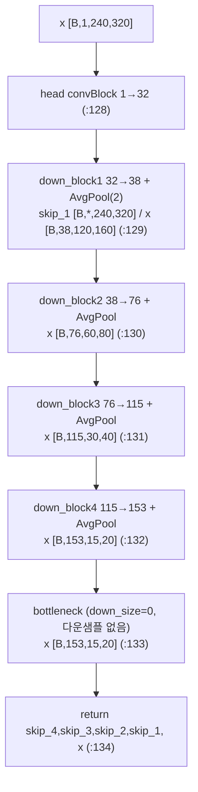
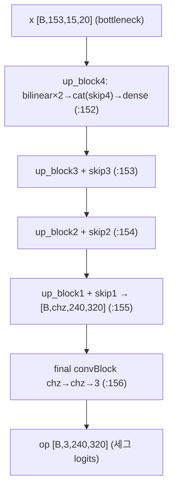
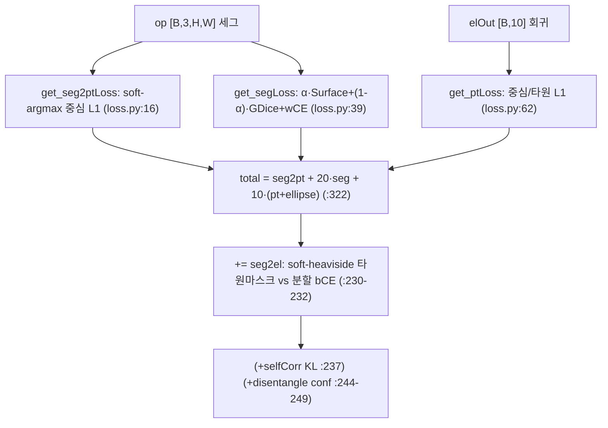
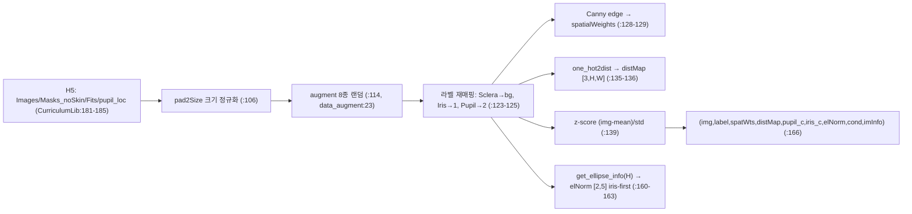
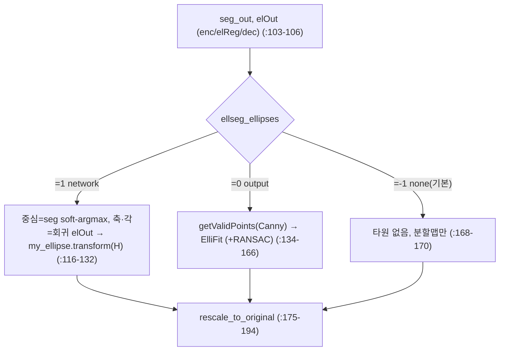

# EllSeg 모듈 통합 가이드 (S-PyTorch)

> 1차 요약: [`../EllSeg.md`](../EllSeg.md) — 본 문서는 그 요약을 모듈(클래스/함수) 단위로 심화한 S-PyTorch 변형 통합 가이드다.
> 분석 대상: `\\wsl.localhost\ubuntu-24.04\home\user\project\PRJXR-HBTXR\REF\XR-Eye-Tracking\Codebase\EllSeg`
> 관련 논문: Kothari et al., "EllSeg: An Ellipse Segmentation Framework for Robust Gaze Tracking", arXiv:2007.09600 (`README.md:121-126`)
> 작성 원칙: 실제 소스 Read 후 `파일:라인` 근거 표기. 라인 근거 없는 추론은 "추정", 코드로 확인 불가는 "확인 불가"로 명시. 정확도(mIoU·검출률)는 README/논문 인용, 미실행 수치는 "확인 불가". bash 미사용(UNC) — Glob/Grep/Read만.

---

## 0. 문서 머리말

### 0.1 대표 케이스 선정 + 근거

본 repo는 **세그멘테이션+타원 회귀 결합 골격을 8가지 모델 변형**(`ritnet_v1`~`v7` + `deepvog`)으로 제공한다(`modelSummary.py:19-26`). 실제 배포/테스트에 쓰이는 것과, 골격이 가장 풍부한 것을 대표로 선정한다.

- **대표 실행 모델(deployed): `RITnet_v3.DenseNet2D` (= DenseElNet)**
  - 근거: 비디오 추론 스크립트가 `model = model_dict['ritnet_v3']`로 고정 사용(`evaluate_ellseg.py:281`), README 테스트 예제도 `--model=ritnet_v3`(`README.md:110`). **사전학습 weight(all)와 결선된 유일한 본체**다.
  - 구성: Dense 인코더(`DenseNet_encoder`) + Dense 디코더(`DenseNet_decoder`, out_c=3) + 타원 회귀 헤드(`elReg=regressionModule`) (`RITnet_v3.py:176-178`).
  - 특이점: 다운샘플이 MaxPool이 아닌 **AvgPool2d**(`RITnet_v3.py:34`), 정규화 기본값 **InstanceNorm2d**(`RITnet_v3.py:164`), 업샘플 **bilinear interpolate**(`RITnet_v3.py:75-78`). growth=1.2·chz=32로 경량.
- **대표 EllSeg 핵심 결합 전략: 세그-중심 + 회귀-축/각 하이브리드**
  - 근거: 최종 타원 `elPred`의 **중심은 세그멘테이션 center-of-mass(`pred_c_seg`)**, **축·각도는 회귀(`elOut`)**에서 가져와 concat(`RITnet_v3.py:226-227`). "분할이 안정적인 중심 + 회귀가 안정적인 형태" 결합 — 가림(occlusion) 강건성의 코어.
- **대표 baseline 비교군: `deepvog_pytorch.DeepVOG_pytorch`**
  - 근거: 2-클래스(동공/배경) 세그 + 동공 중심만 출력하는 별 계보 U-Net(`deepvog_pytorch.py:83-146`). 타원 회귀 없음(`elPred`의 축·각은 `torch.rand` 더미, `:142-143`). EllSeg 대비 정량 비교용.

> 정리: **배포 경로 = `ritnet_v3`(DenseElNet)**, **EllSeg 차별점 = 세그-중심/회귀-형태 하이브리드 + soft-argmax·soft-heaviside로 타원↔분할 end-to-end 미분 결합**. v1~v7은 동일 손실 인터페이스(`forward` 시그니처 9-인자, `RITnet_v3.py:194-203`)를 공유하는 아키텍처 변형군이며, deepvog는 손실 인터페이스만 맞춘 외부 baseline 포팅.

### 0.2 수치 표기 규약 (S-PyTorch)

- **params** = 레이어 차원에서 직접 산정. Conv2d = `Cin·Cout·k² (+ Cout if bias)`. Linear = `in·out + out`. InstanceNorm2d(affine 기본 off) = 0 파라미터, BatchNorm2d = `2·C`. DenseElNet의 채널 폭은 `getSizes(chz=32, growth=1.2)`로 결정(`RITnet_v3.py:14-28`) → 아래 5절에서 단계별 산정.
- **MACs / FLOPs** = 인코더-디코더(U-Net 골격)의 핵심은 **3×3/1×1 conv 누적**. 표준식 `MAC = H·W·Cout·Cin·k²`. 입력 `(240,320)` 기준, 각 down_block 뒤 AvgPool(2)로 H·W 1/4(`RITnet_v3.py:34,100`), up_block마다 bilinear ×2(`:75-78`). 세그 head conv + 회귀 head(conv 3단+FC 2단)를 분리 집계.
- **activation memory** = 텐서 `shape × bit`. Dense 블록은 `torch.cat`으로 입력·중간특징을 반복 누적(`RITnet_v3.py:57-61`)하므로, **concat된 wide 텐서가 메모리 지배항**. 학습 역전파용으로 enc 4단 skip + dec 전부 보관. distMap `[B,3,H,W]`·spatialWeights `[B,H,W]`도 샘플당 상주(`CurriculumLib.py:146-149`).
- **세그+타원 회귀 head** = (a) 세그 head: `DenseNet_decoder.final = convBlock(chz→chz→out_c=3)`(`RITnet_v3.py:149`, `utils.py:669-680`). (b) 타원 회귀 head: `regressionModule`(conv `c1/c2/c3` + AvgPool + FC `l1/l2`, `utils.py:616-667`) → 10값(동공 5 + 홍채 5).
- **loss(세그+타원)** = `total_loss = l_seg2pt + 20·l_seg + 10·(l_pt + l_ellipse)`(`RITnet_v3.py:322`) + `loss_seg2el`(`:230-232`) + (옵션) `10·selfConsistency`(`:237`) + (옵션) `disentangle conf_Loss`(`:244-249`). 세그 손실은 `alpha·SurfaceLoss + (1-alpha)·GDiceLoss + wCE`(`loss.py:56`), alpha는 epoch 커리큘럼(`train.py:179`).
- **정확도(mIoU·검출률)** = README 추상화: 동공/홍채 중심검출률(2px 마진) **각각 ≥10%/≥24% 향상**(`README.md:11`). 코드 메트릭: `getSeg_metrics`(mIoU, `utils.py:119-149`), `getPoint_metric`(중심 px거리, `:151-161`), `getAng_metric`(각오차, `:163-169`). **본 repo 미실행 → 절대 mIoU 수치는 "확인 불가"**, 향상폭만 README 인용.

### 0.3 운영 경로 (전처리 ↔ 학습 ↔ 체크포인트 ↔ 평가/추론)

```
[공개 데이터셋 6종: OpenEDS/NVGaze/RITEyes/LPW/Fuhl(ElSe+ExCuSe)/PupilNet]   (README.md:18-23,62-67)
      │  dataset_generation/Extract*.py: 각 데이터셋 → 공통 H5 포맷 (Images/Masks_noSkin/Fits/pupil_loc)
      ▼
[공통 H5 아카이브 (archive.h5)]   +   [curObjects: datasetSelections.py → createDataloaders_*.py로 train/valid/test split pkl]
      │  DataLoader_riteyes.__getitem__: pad2Size → augment(8종) → 라벨 재매핑(Sclera→bg) →
      │    z-score 표준화 + Canny edge weight + distMap(surface loss) + 정규화 타원 elNorm
      ▼
[학습: train.py]
      │  model = model_dict['ritnet_v3']; Adam lr=5e-4 (args.py:32); 9-인자 forward → get_allLoss
      │  alpha = linVal(epoch,(0,E),(0,1),0) 커리큘럼 (train.py:179); disentangle while-loop (:198-217)
      │  ReduceLROnPlateau(mode=max,factor=0.1) + EarlyStopping(stopMetric, :390-395)
      ▼
[검증: lossandaccuracy (utils.py:294-393) → mIoU + 중심거리 + 각오차 + 스케일비]
      │  best stopMetric 시 checkpoint.pt 저장 (dsIdentify 가중치 제외, train.py:381-383)
      ▼
[테스트: test.py → mIoU·latent/seg 중심거리 Med/STD → opDict.pkl]
[비디오 추론: evaluate_ellseg.py → enc/elReg/dec(no_grad) → 3-모드 타원(network/ElliFit+RANSAC/none) → 오버레이 mp4 + _pred.npy]
```
- pretrained weight(`all.git_ok`) 복원(`evaluate_ellseg.py:279-282`). 체크포인트·weight 파일 자체는 [제외].

### 0.4 모델 / 데이터셋 / 정확도 요약

| 항목 | 값 | 근거 |
|---|---|---|
| 입력 | grayscale 안구 프레임 `[B,1,240,320]` | `evaluate_ellseg.py:241`(op_shape=(240,320)), `CurriculumLib.py:140` |
| 출력 | ① 3-클래스 세그맵 `[B,3,H,W]` ② 타원 10값 `[B,10]`(동공5+홍채5) ③ 결합 타원 `elPred` | `dec out_c=3`(`:177`), `regressionModule:638`, `elPred`(`:226-227`) |
| 모델(배포) | DenseElNet: Dense enc 4단 + bottleneck + Dense dec 4단 + 회귀 head | `RITnet_v3.py:159-178` |
| 채널 폭 | chz=32, growth=1.2 → enc.op≈[38,76,115,153] | `getSizes`(`:14-28`), 본문 5.1 산정 |
| 다운/업샘플 | AvgPool2d(2) ↓ / bilinear interpolate ×2 ↑ | `:34,100` / `:75-78` |
| 정규화 | InstanceNorm2d(기본, v2/v3/v4/v7) | `:164` |
| Loss | seg2pt + 20·seg + 10·(pt+ellipse) + seg2el (+selfCorr/disentangle) | `:322,230-232,237,244-249` |
| 세그 손실 | α·SurfaceLoss + (1-α)·GDiceLoss + wCE, α=epoch 커리큘럼 | `loss.py:56`, `train.py:179` |
| optimizer | Adam lr=5e-4, ReduceLROnPlateau, EarlyStopping | `args.py:32`, `train.py:89,134-145` |
| 데이터셋 | OpenEDS/NVGaze/RITEyes/LPW/Fuhl/PupilNet | `README.md:18-23,62-67` |
| 메트릭 | mIoU / 중심 px거리 / 각오차(°) / 스케일비 | `utils.py:119-169`, `train.py:273-280` |
| 정확도(논문) | 동공/홍채 중심검출률 2px 마진 ≥10%/≥24% 향상 | `README.md:11` (본 repo 미실행 → 절대값 확인 불가) |

---

## 1. Repo / Layer 개요 (모델 / 세그 / 타원 맵)

EllSeg = grayscale 안구 프레임에서 동공·홍채를 **가려진 부분까지 포함한 전체 타원 영역**으로 분할하고, 동시에 타원 파라미터를 회귀하는 **세그-회귀 결합 프레임워크**. 시공간 모델 없음(프레임 독립). HW 커널·CUDA 확장 없는 **순수 PyTorch**(이식성 양호, 단 `.cuda()` 하드코딩 다수 — 8절).

### 1.1 파일 역할 맵

| 구분 | 파일 | 역할 | 메인 사용 |
|---|---|---|---|
| **배포 모델(DenseElNet)** | `models/RITnet_v3.py` | enc/dec/elReg + `get_allLoss` | ★ `evaluate_ellseg.py:281` |
| **모델 레지스트리** | `modelSummary.py` | `model_dict` (ritnet_v1~v7 + deepvog) | ★ import 허브 |
| **공용 모듈** | `utils.py` | `regressionModule`·`convBlock`·`linStack`·soft-argmax·메트릭 | ★ 모든 모델 의존 |
| **손실** | `loss.py` | seg2pt/seg/pt/seg2el/selfConsistency/conf/WHD | ★ `get_allLoss` 호출 |
| **타원 수학·후처리** | `helperfunctions.py` | `my_ellipse`·`ElliFit`·`ransac`·`getValidPoints`·전처리 | ★ |
| **데이터로더** | `CurriculumLib.py` | `DataLoader_riteyes`(H5) + split 생성 | ★ |
| **증강** | `data_augment.py` | `augment`(8종 랜덤) | ★ |
| **학습** | `train.py` | 학습 루프 + disentangle + 검증 + TB | ★ 진입점 |
| **테스트** | `test.py` | 체크포인트 평가(mIoU·중심거리) | ★ |
| **비디오 추론** | `evaluate_ellseg.py` | enc/elReg/dec + 3-모드 타원 fitting | ★ |
| **인자** | `args.py` | 학습 인자 파서(lr·prec·model·…) | ★ |
| **조기종료** | `pytorchtools.py` | `EarlyStopping`·`load_from_file` | — |
| **변형 모델** | `models/RITnet_v1/2/4/5/6/7.py` | DenseElNet/RITnet 변형군 | 미배포(레지스트리만) |
| **baseline** | `models/deepvog_pytorch.py` | DeepVOG U-Net(2-class) 포팅 | 비교군 |
| **데이터 split** | `curObjects/*.py` | baseline/leaveoneout/allvsone/random/pretrained | ★ split 생성 |
| **데이터 변환** | `dataset_generation/Extract*.py` | 각 공개 데이터셋 → 공통 H5 | 1차 실행 |
| **[제외]** | `extern/locating-objects-without-bboxes/` | WHD 구현 외부 원본 | 제외 |
| **[제외]** | `figures/`, `maintainance/old_code/`, `Sandbox.py`, `analysis/` | 산출물·구버전·실험 잔재 | 제외 |

### 1.2 forward 진입점 (2갈래)

- **학습/테스트(손실 포함)**: `model(img, target, pupil_center, elNorm, spatWts, distMap, cond, ID, alpha)` → `DenseNet2D.forward`(`RITnet_v3.py:194`) → `enc`(`:206`) → `elReg`(`:208`) → `dec`(`:209`) → `get_allLoss`(`:212`) → `(op, elPred, latent, loss)`.
- **추론(손실 없음)**: `evaluate_ellseg_on_image`(`evaluate_ellseg.py:98`)이 `model.enc`/`model.elReg`/`model.dec`를 `no_grad`로 직접 호출(`:103-106`) → `get_predictions`(argmax 세그맵) + 3-모드 타원.

### 1.3 제외 목록
- **외부 프레임워크 원본**: `extern/locating-objects-without-bboxes/`(WHD = Weighted Hausdorff Distance 원본; 본 repo `loss.py:211-332`가 이를 복제했으나 `get_allLoss`에서 미호출 — 보조).
- **외부 라이브러리**: torch/torchvision(make_grid)/cv2/skimage/sklearn/scipy/h5py/tensorboardX/tqdm(import만).
- **산출물·구버전**: `figures/`, `maintainance/old_code/`, `Sandbox.py`, weight 파일(`*.git_ok`, `checkpoint.pt`).

---

## 2. 모듈: Dense 인코더 — `RITnet_v3.DenseNet_encoder` (backbone)

### 2.1 역할 + 상위/하위
- **역할**: 입력 1채널 프레임 → `head`(convBlock, 1→chz) → `down_block1~4`(dense 블록 + AvgPool 다운샘플) → `bottleneck`(다운샘플 없는 dense 블록). 4개 skip + bottleneck 출력 반환(`RITnet_v3.py:127-134`). 공간 해상도를 1/16로 줄이며 채널을 키우는 표준 U-Net 인코더.
- **상위**: `DenseNet2D.enc`(`:176`). **하위**: `convBlock`(`utils.py:669`), `DenseNet2D_down_block`(`:43-62`), `Transition_down`(`:30-41`).

### 2.2 데이터플로우 (텐서 shape)

> 채널은 `getSizes(32,1.2)`: enc.op = `[int(1.2·32·1), …, int(1.2·32·4)]` = **[38,76,115,153]**(`:21`). enc.ip = `[32,38,76,115]`(`:22`). enc.inter = `[32,64,96,128]`(`:20`). bottleneck in=op[3]=153(`:121`).

### 2.3 forward call stack
```
DenseNet2D.forward (:206) → self.enc(x) → DenseNet_encoder.forward (:127)
├─ head: convBlock(conv→act→conv→act→BN) (utils.py:676-679)
├─ down_block1..4: DenseNet2D_down_block.forward (:55-62)
│   ├─ conv1(bn(x)) → x1 (:56)
│   ├─ cat([x,x1]) → conv21→conv22 → x22 (:57-58)
│   ├─ cat([x21,x22]) → conv31→conv32 → out (:59-60)
│   ├─ out = cat([out, x]) (:61, dense 잔차 concat)
│   └─ TD = Transition_down(act(norm)→1x1 conv→AvgPool) (:53,37-40)
└─ bottleneck: 동일 블록, down_size=0 → AvgPool skip (:34 max_pool=False)
```

### 2.4 대표 코드 위치
`RITnet_v3.py:30-41`(Transition_down), `:43-62`(down_block), `:85-134`(encoder), `:14-28`(getSizes).

### 2.5 대표 코드 블록

**(a) Dense 블록 — concat 누적 (`RITnet_v3.py:55-62`)**
```python
x1  = self.actfunc(self.conv1(self.bn(x)))     # 3x3, in_c→inter_c
x21 = torch.cat([x, x1], dim=1)                # 입력+중간 누적
x22 = self.actfunc(self.conv22(self.conv21(x21)))   # 1x1압축→3x3
x31 = torch.cat([x21, x22], dim=1)
out = self.actfunc(self.conv32(self.conv31(x31)))   # 1x1압축→3x3
out = torch.cat([out, x], dim=1)               # ★ 최종도 입력 concat (skip 폭↑)
return out, self.TD(out)                        # (skip, 다운샘플)
```
→ DenseNet식 반복 concat. skip은 `inter_c + in_c` 폭(`:53` Transition_down 입력=`inter_c+in_c`).

**(b) Transition_down — AvgPool 다운샘플 (`RITnet_v3.py:37-40`)**
```python
x = self.actfunc(self.norm(x))    # norm=InstanceNorm2d(기본)
x = self.conv(x)                  # 1x1, in_c→out_c
x = self.max_pool(x) if self.max_pool else x   # AvgPool2d(2), down_size=0이면 skip
```
→ **MaxPool 아님**(`:34` `nn.AvgPool2d`) — FPGA에서 평균 풀링이 비교/우선순위 로직 불요로 더 단순(8절).

### 2.6 연산 분해 + 정량
- **params**(conv만, 산정식 `Cin·Cout·k²+Cout`):
  - head convBlock: `1·32·9+32`(conv1) + `32·32·9+32`(conv2) = 288+32 + 9216+32 = **9,568** + BN2d(32)=64 → 9,632(`utils.py:672-675`).
  - down_block1(in=32,inter=32,op=38): conv1 `32·32·9+32`=9,248; conv21 `(32+32)·32·1+32`=2,080; conv22 `32·32·9+32`=9,248; conv31 `(32+64)·32·1+32`=3,104; conv32 `32·32·9+32`=9,248; TD conv `(32+32)·38·1+38`=2,470 → 소계 **≈35,398**.
  - down_block2~4·bottleneck: 동일 패턴, inter=[64,96,128,128]·op=[76,115,153,153]로 증가 → 단계별 수만~수십만(차원 대입 산정). **정확 합산은 inter/op 정수절단(np.int) 의존이라 코드 실행 검증 권장 → 미실행분 "추정"**.
- **MAC**(1 step, 입력 240×320): head conv2 `240·320·32·32·9` ≈ 707M; 해상도가 단계마다 1/4로 급감하므로 **head·down_block1이 MAC 지배**(고해상도). bottleneck(15×20)은 채널 큰 대신 공간 작아 상대적 소규모.
- **activation memory**(B=1, fp32): head 출력 `[1,32,240,320]`=9.83MB; dense concat된 skip_1 `[1,~64,240,320]`≈19.7MB가 인코더 메모리 지배항. distMap `[1,3,240,320]`=0.92MB 별도.
- **thop 등 미사용** → 절대 params·FLOPs는 **확인 불가**(산정식·차원 근거만 제시).

---

## 3. 모듈: Dense 디코더 — `RITnet_v3.DenseNet_decoder` (neck + 세그 head)

### 3.1 역할 + 상위/하위
- **역할**: bottleneck 출력을 bilinear ×2 업샘플하며 skip과 concat → dense conv → 4단 복원 후 `final = convBlock(chz→chz→out_c=3)`로 3-클래스 세그맵 출력(`RITnet_v3.py:151-157`). neck(업샘플·skip 융합) + 세그 head(`final`) 통합.
- **상위**: `DenseNet2D.dec`(`:177`). **하위**: `DenseNet2D_up_block`(`:64-83`), `convBlock`(`:149`).

### 3.2 데이터플로우

> dec 채널: `getSizes` dec.skip = `enc.ip[::-1] + enc.inter[::-1]`(`:25`), dec.ip = `enc.op[::-1]`(`:26`), dec.op = `append(enc.op[::-1][1:], chz)`(`:27`). up_stride=2 고정(`:144-147`).

### 3.3 forward call stack
```
DenseNet2D.forward (:209) → self.dec(x4,x3,x2,x1,x) → DenseNet_decoder.forward (:151)
├─ up_block4..1: DenseNet2D_up_block.forward (:74-83)
│   ├─ F.interpolate(mode='bilinear', scale_factor=up_stride) (:75-78)
│   ├─ cat([x, prev_feature_map]) (skip 융합) (:79)
│   ├─ conv11(1x1)→conv12(3x3) → x1 (:80)
│   ├─ cat([x, x1]) → conv21(1x1)→conv22(3x3) → out (:81-82)
└─ final: convBlock → op [B,3,H,W] (:156)
```

### 3.4 대표 코드 위치
`RITnet_v3.py:64-83`(up_block), `:136-157`(decoder), `:149`(세그 head final).

### 3.5 대표 코드 블록

**(a) up_block — bilinear 업샘플 + skip 융합 (`RITnet_v3.py:74-83`)**
```python
x = F.interpolate(x, mode='bilinear', align_corners=False, scale_factor=self.up_stride)
x = torch.cat([x, prev_feature_map], dim=1)    # skip concat
x1  = self.actfunc(self.conv12(self.conv11(x)))   # 1x1압축→3x3
x21 = torch.cat([x, x1], dim=1)
out = self.actfunc(self.conv22(self.conv21(x21)))  # 1x1압축→3x3
```
→ **bilinear interpolate**(`:76`)는 HW에서 라인버퍼+가중합 필요. DeepVOG는 nearest 사용(`deepvog_pytorch.py:74`)으로 더 단순 — 대체 시 정확도 영향 평가 필요(8절, 추정).

**(b) 세그 head — final convBlock (`RITnet_v3.py:149`, `utils.py:676-679`)**
```python
self.final = convBlock(chz, chz, out_c, actfunc)   # out_c=3
# convBlock.forward: act(conv1) → act(conv2) → BN2d   (utils.py:677-679)
```
→ 최종 3채널 logits(배경/홍채/동공). softmax/argmax는 손실·추론에서 수행(`loss.py:21`, `utils.py:78`).

### 3.6 연산 분해 + 정량
- **params**: up_block마다 conv11/12/21/22 4개(1x1·3x3 교차). 폭은 dec.skip+dec.ip로 결정 → 단계별 산정(인코더와 대칭). final convBlock: `chz·chz·9·2 + … + chz·3·9` 수준.
- **MAC**: up_block1(240×320 복원, 고해상도)이 디코더 MAC 지배. bilinear는 곱셈 적으나 메모리 대역 큼.
- **activation memory**: 최상위 복원 `[1,chz,240,320]` 및 그 concat이 디코더 지배항(인코더 head와 대칭, ≈10~20MB/샘플 fp32).

---

## 4. 모듈: 타원 회귀 head — `utils.regressionModule`

### 4.1 역할 + 상위/하위
- **역할**: bottleneck 특징(`enc.op[-1]`=153 채널, 15×20) → conv 3단 + AvgPool → flatten → FC 2단 → **10값**(동공 `[cx,cy,a,b,θ]` + 홍채 `[cx,cy,a,b,θ]`). 중심은 tanh([-1,1]), 축은 sigmoid([0,1]·양수), 각도는 raw로 분리 활성화(`utils.py:653-666`).
- **상위**: `DenseNet2D.elReg`(`RITnet_v3.py:178`), forward `elOut = self.elReg(x, alpha)`(`:208`). **하위**: Conv2d×3, AvgPool2d, Linear×2.

### 4.2 데이터플로우 (텐서 shape)

```mermaid
flowchart LR
  X["x [B,153,15,20] (bottleneck)"] --> C1["c1 Conv(2x3) 153→128<br/>[B,128,14,18] (:646)"]
  C1 --> MP["AvgPool(2) → [B,128,7,9] (:647)"]
  MP --> C2["c2 Conv(3) 128→128 → [B,128,5,7] (:648)"]
  C2 --> C3["c3 Conv(3) 128→32 → [B,32,3,5] (:649)"]
  C3 --> FL["reshape → [B, 32·3·5=480] (:650)"]
  FL --> L1["l1 480→256 + SELU (:651)"]
  L1 --> L2["l2 256→10 (:651)"]
  L2 --> SPLIT["pup_c tanh / pup_param sigmoid / pup_angle raw / iri_… (:653-666)"]
  SPLIT --> OUT["op [B,10] (동공5+홍채5)"]
```


### 4.3 forward call stack
```
DenseNet2D.forward (:208) → self.elReg(x, alpha) → regressionModule.forward (utils.py:643)
├─ leaky_relu(c1(x)) → max_pool → leaky_relu(c2) → leaky_relu(c3) (:646-649)
├─ reshape(B,-1) → l2(selu(l1(x))) (:650-651)
└─ tanh(중심) / sigmoid(축) / raw(각도) 분리 → cat 10값 (:653-666)
```

### 4.4 대표 코드 위치
`utils.py:616-667`(regressionModule 전체), `:622-638`(레이어 정의), `:653-666`(출력 분리).

### 4.5 대표 코드 블록

**(a) 회귀 head 레이어 정의 (`utils.py:622-638`)**
```python
self.c1 = nn.Conv2d(inChannels, 128, bias=True, kernel_size=(2,3))   # inChannels=enc.op[-1]=153
self.c2 = nn.Conv2d(128, 128, bias=True, kernel_size=3)
self.c3 = nn.Conv2d(128, 32, kernel_size=3, bias=False)
self.l1 = nn.Linear(32*3*5, 256, bias=True)    # 480→256
self.l2 = nn.Linear(256, 10, bias=True)        # 256→10
```
→ FC 입력 `32·3·5=480`은 conv 3단+pool 후 공간크기(3×5) 고정 가정. 입력 해상도가 (240,320)이 아니면 480 불일치 가능 — **추정**(고정 입력 전제).

**(b) 출력 분리 활성화 — 타원 파라미터 제약 (`utils.py:653-666`)**
```python
pup_c     = self.c_actfunc(x[:, 0:2])      # tanh → 중심 [-1,1]
pup_param = self.param_actfunc(x[:, 2:4])  # sigmoid → 축 [0,1] (양수)
pup_angle = x[:, 4]                          # raw → 각도
iri_c     = self.c_actfunc(x[:, 5:7]); iri_param = self.param_actfunc(x[:, 7:9]); iri_angle = x[:, 9]
op = torch.cat([pup_c, pup_param, pup_angle.unsqueeze(1), iri_c, iri_param, iri_angle.unsqueeze(1)], dim=1)
```
→ 물리 제약(중심 범위·축 양수)을 활성함수로 강제. 정규화 좌표계([-1,1]) 출력 → `my_ellipse().transform(H)`로 픽셀 환산(`evaluate_ellseg.py:131-132`).

### 4.6 EllSeg 핵심 결합 — 세그-중심 + 회귀-형태 (`RITnet_v3.py:226-227`)
```python
elPred = torch.cat([pred_c_seg[:, 0, :], elOut[:, 2:5],     # 홍채: 중심=seg, 축·각=회귀
                    pred_c_seg[:, 1, :], elOut[:, 7:10]], dim=1)   # 동공: 동일
```
→ **중심은 세그멘테이션 center-of-mass**(`pred_c_seg`, `get_seg2ptLoss` 산출), **축·각은 회귀**(`elOut`). 가림 시 분할 중심이 안정적이고, 회귀가 형태를 보강하는 하이브리드 — EllSeg 정확도의 코어(0.1절).

### 4.7 연산 분해 + 정량 (회귀 head)
- **params**(차원 산정): c1 `153·128·(2·3)+128`=117,632; c2 `128·128·9+128`=147,584; c3 `128·32·9`(bias=False)=36,864; l1 `480·256+256`=123,136; l2 `256·10+10`=2,570 → **합 ≈ 427,786**.
- **MAC**(B=1): c1 `14·18·128·153·6`≈29.6M; c2 `5·7·128·128·9`≈5.16M; c3 `3·5·32·128·9`≈0.55M; FC `480·256+256·10`≈0.13M → **conv가 회귀 head MAC 지배(c1)**.
- **activation memory**: c1 출력 `[1,128,14,18]`=0.13MB 수준(저해상도라 소규모). 회귀 head는 backbone 대비 메모리 비중 작음.
- **v7 차이**: `RITnet_v7.py`는 자체 `regressionModule`(c1/c2 3x3·padding + c3 1x1 + **BatchNorm2d 2개** + FC 32→128→10, hardtanh 활성)을 가짐(`RITnet_v7.py:324-383`). v3 회귀 head(`utils.py`)와 별개 구현 — 5.2절 표.

---

## 5. 모듈: 모델 변형군 (RITnet_v1~v7 + deepvog) 비교

본 repo는 동일 9-인자 `forward` 인터페이스(세그+타원 결합 손실)를 공유하는 **8개 모델**을 `model_dict`에 등록(`modelSummary.py:19-26`). 배포는 v3, 나머지는 아키텍처/회귀 head 변형.

### 5.1 두 계보 — RITnet-flat vs DenseElNet-growth

| 항목 | RITnet-flat 계보 (v1, v5, v6) | DenseElNet-growth 계보 (v2, v3, v4, v7) |
|---|---|---|
| getSizes 채널 | 평탄 `[chz,chz,chz,chz]` (`v1:28-30`) | growth `[int(1.2·32·(i+1))]`=[38,76,115,153] (`v3:20-22`) |
| down_block API | `(input_channels, output_channels, down_size, dropout, prob)` (`v1:39`) | `(in_c, inter_c, op_c, down_size, norm, actfunc)` (`v3:44`) |
| down 정규화 | BatchNorm2d + Dropout 3개 (`v1:51-54`) | InstanceNorm2d(기본) (`v3:164`), Dropout 없음 |
| 다운샘플 | AvgPool2d (`v1:46`) | AvgPool2d (`v3:34`) |
| 회귀 head | `regressionModule`(utils, tanh/sigmoid) | v2/v3/v4: utils 동일; **v7: 자체 BN 회귀 head**(`v7:324`) |
| 비고 | RITnet 원형(eye-parts seg 계보) | EllSeg DenseElNet 본 계보 |

> v1/v5/v6은 down_block에 `if self.down_size != None: x = self.max_pool(x)`로 **블록 진입 시 다운샘플**(`v1:56-58`), v2/v3/v4/v7은 dense concat 후 `Transition_down` 끝에서 다운샘플(`v3:53,62`). 구조적 차이.

### 5.2 변형별 핵심 차이표

| 모델 | getSizes | norm 기본 | 회귀 head | forward 특이 | 배포/용도 |
|---|---|---|---|---|---|
| `ritnet_v1` | flat (`v1:28-30`) | BatchNorm2d (`v1:198`) | utils regressionModule | dense+elReg | 초기 변형 |
| `ritnet_v2` | growth (`v2:20-22`) | InstanceNorm2d (`v2:164`) | utils | selfCorr 시 `print(loss)` 디버그(`v2:233`) | 변형 |
| **`ritnet_v3`** | growth (`v3:20-22`) | InstanceNorm2d (`v3:164`) | utils | **seg2el 손실 포함**(`v3:230-232`) | **★ 배포** |
| `ritnet_v4` | growth (`v4:20-22`) | InstanceNorm2d (`v4:164`) | utils | seg2el 없음(v3 대비) | 변형 |
| `ritnet_v5` | flat (`v5:28-30`) | BatchNorm2d (`v5:198`) | utils | flat 계보 | 변형 |
| `ritnet_v6` | flat (`v6:28-30`) | BatchNorm2d (`v6:198`) | utils | flat 계보 | 변형 |
| `ritnet_v7` | growth (`v7:20-22`) | InstanceNorm2d (`v7:168`) | **자체 BN head**(`v7:324-383`) | hardtanh 활성 | 변형 |
| `deepvog` | — (16채널 U-Net) | BatchNorm2d (`dv:23-24`) | **없음**(rand 더미)(`dv:142-143`) | 2-class seg + 동공중심만 | baseline |

> **확인됨**: v3가 유일하게 `loss += loss_seg2el`(분할↔회귀 타원 일치 손실)을 forward에 포함(`RITnet_v3.py:230-232`). v2/v4는 이 블록 부재 → **v3이 가장 완성된 결합 손실 구성**(배포 근거 보강). v1~v7 세부 차이 외 나머지는 동일 골격(확인됨).

### 5.3 deepvog baseline (`deepvog_pytorch.py`)
- **구조**: encoding_block×4(conv→BN→ReLU + stride2 conv 다운샘플, `:34-41`) → decoding_block×5(nearest 업샘플 + skip concat, `:64-80`) → 1×1 conv → 2채널(`:108`). 입력 1채널을 3채널 복제(`:128`).
- **손실**: 자체 `get_allLoss`(`:148-165`) — 동공만 seg2pt(soft-argmax) + `10·CE`. 타원 회귀 없음 → `elPred`의 축·각은 `torch.rand` 더미(`:142-143`). EllSeg 대비 **타원 회귀·홍채·결합 손실 부재**가 핵심 차이.

---

## 6. 모듈: 손실 함수 — `loss.py` + `get_allLoss` (세그 + 타원)

### 6.1 역할 + 상위/하위
- **역할**: 세그멘테이션 손실(SurfaceLoss+GDice+wCE)·중심 손실(soft-argmax)·타원 회귀 손실(L1)·분할↔타원 일치(seg2el)·자기일관성(KL)·도메인 confusion을 통합. `cond` 4-flag로 라벨 가용성에 따라 손실 마스킹.
- **상위**: `DenseNet2D.forward`의 `get_allLoss`(`RITnet_v3.py:212,268-324`). **하위**: `loss.py`의 세부 손실 함수들.

### 6.2 손실 구성도


### 6.3 forward call stack
```
get_allLoss (RITnet_v3.py:268)
├─ get_seg2ptLoss(op[:,2]=동공, normPts(pupil_center)) → l_seg2pt_pup (:284)
├─ (masks 존재 시) get_seg2ptLoss(-op[:,0]=홍채역) → l_seg2pt_iri (:293)
├─ get_segLoss(op, target, spatWts, distMap, loc_onlyMask, alpha) (:312)
├─ get_ptLoss(elOut[:,5:7], pupil_center, 마스크부재) (:316)
├─ get_ptLoss(elOut, elNorm.view(-1,10), 마스크존재) → l_ellipse (:320)
└─ total = l_seg2pt + 20·l_seg + 10·(l_pt + l_ellipse) (:322)
DenseNet2D.forward (:230): += get_seg2elLoss(동공)+get_seg2elLoss(홍채역)
```

### 6.4 대표 코드 위치
`loss.py:16-37`(seg2pt soft-argmax), `:39-60`(segLoss 합성), `:77-127`(Surface/GDice/wCE), `:149-175`(seg2el), `:177-209`(selfConsistency), `:129-147`(conf), `RITnet_v3.py:268-324`(get_allLoss).

### 6.5 대표 코드 블록

**(a) soft-argmax 중심 회귀 (`loss.py:16-37`) — 미분가능 center-of-mass**
```python
wtMap = F.softmax(op.view(B, -1)*temperature, dim=1)   # temperature=4
XYgrid = create_meshgrid(H, W, normalized_coordinates=True)
xpos = torch.sum(wtMap*xloc, -1, keepdim=True)         # 가중 기댓값 = 중심
ypos = torch.sum(wtMap*yloc, -1, keepdim=True)
predPts = torch.stack([xpos, ypos], dim=1).squeeze()
loss = F.l1_loss(predPts, gtPts, reduction='none')
```
→ 분할맵을 확률분포로 보고 좌표 기댓값(중심)을 미분가능하게 산출. **세그→중심을 end-to-end 연결**하는 핵심(`elPred` 중심의 출처). HW에서 softmax+MAC 가중합으로 저비용 구현 가능(8절).

**(b) 세그 손실 합성 + alpha 커리큘럼 (`loss.py:48-56`)**
```python
l_sl = SurfaceLoss(op[i], distMap[i])      # 거리맵 기반 경계 손실 (:77-83)
l_cE = wCE(op[i], target[i], spatWts[i])   # Canny edge 공간가중 CE (:114-127)
l_gD = GDiceLoss(op[i], target[i], F.softmax)  # generalized Dice (:85-112)
loss_seg.append(alpha*l_sl + (1-alpha)*l_gD + l_cE)
```
→ `alpha = linVal(epoch,(0,E),(0,1),0)`(`train.py:179`): 초반 Dice 위주(영역) → 후반 Surface 위주(경계). 클래스 불균형(동공 작음)을 GDice로, 경계 정밀도를 Surface/wCE로 보강.

**(c) seg2el — 회귀 타원 vs 분할 일치 (`loss.py:165-174`)**
```python
posmask = ((X/opEl[i,2])**2 + (Y/opEl[i,3])**2) - 1    # 타원 내/외 (정규 좌표)
posmask = soft_heaviside(posmask, sc=64, mode=3)        # 미분가능 계단 (utils.py:537)
negmask = soft_heaviside(-posmask_raw, sc=64, mode=3)
loss += F.binary_cross_entropy(posmask, 1-opSeg[i]) + F.binary_cross_entropy(negmask, opSeg[i])
```
→ 회귀 타원을 soft-heaviside로 내부/외부 마스크화 → 분할과 bCE. "회귀 타원이 분할과 겹칠수록 손실↓" → 타원 회귀와 분할을 상호 정합(v3 전용, `RITnet_v3.py:230-232`).

### 6.6 연산 분해 + 정량 (손실)
- **가중치 하드코딩**: `20·l_seg`, `10·(l_pt+l_ellipse)`(`:322`), seg2el ×1(`:232`), selfCorr ×10(`:237`), disentangle_alpha=2(`:174`). 튜닝 어려움(7절).
- **연산 비용**: seg2pt/seg2el/selfConsistency 모두 `create_meshgrid`(H×W) + batch 루프(`loss.py:163,190`) — **per-sample Python 루프**가 학습 오버헤드. soft-heaviside는 sigmoid 1회(`utils.py:537`).
- **`.cuda()` 하드코딩**: `loss.py:29,93,143,160,184` 등 다수 → CPU/타 디바이스 학습 불가(추론만 `--eval_on_cpu` 지원, 8절).
- **WHD 미사용**: `WeightedHausdorffDistance`(`loss.py:211-332`)는 정의만 있고 `get_allLoss`에서 미호출(확인됨, 보조).

---

## 7. 모듈: 데이터 파이프라인 — `DataLoader_riteyes` / `augment` / 타원 정규화

### 7.1 역할 + 상위/하위
- **역할**: 공통 H5 아카이브에서 이미지·마스크·타원 fit·동공중심을 부분 로딩 → pad2Size → augment(8종) → 라벨 재매핑 → z-score 표준화 + edge weight + distMap + 정규화 타원(elNorm) 생성. `cond` 4-flag로 라벨 가용성 표시.
- **상위**: `DataLoader`(`train.py:156-165`). **하위**: `augment`(`data_augment.py`), `my_ellipse`/`get_ellipse_info`/`one_hot2dist`(`helperfunctions.py`).

### 7.2 데이터플로우


### 7.3 forward call stack (데이터)
```
DataLoader → DataLoader_riteyes.__getitem__ (CurriculumLib.py:94)
├─ readImage: h5py 부분 로딩 + cond 4-flag 생성 (:168-195)
├─ pad2Size → (scaleFn) → augment (:106-120)
├─ 라벨 재매핑 + Canny spatialWeights + one_hot2dist distMap (:123-136)
├─ z-score 표준화 + MaskToTensor (:139-143)
└─ get_ellipse_info(elParam, H, cond) → elNorm (iris-first) (:158-165)
```

### 7.4 대표 코드 위치
`CurriculumLib.py:94-166`(__getitem__), `:168-195`(readImage), `:189-193`(cond 4-flag), `data_augment.py:12-50`(augment), `helperfunctions.py:487-517`(get_ellipse_info), `:356-371`(one_hot2dist).

### 7.5 대표 코드 블록

**(a) cond 4-flag — 라벨 가용성 마스크 (`CurriculumLib.py:189-193`)**
```python
cond1 = np.all(pupil_center == -1)   # 0: 동공중심 존재
cond2 = np.all(mask_noSkin == -1) or np.all(mask_noSkin == 0)  # 1: 마스크 존재
cond3 = np.all(pupil_param == -1)    # 2: 동공 타원 존재
cond4 = np.all(iris_param == -1)     # 3: 홍채 타원 존재
cond = np.array([cond1, cond2, cond3, cond4])
```
→ 데이터셋마다 라벨이 달라(LPW=동공중심만, OpenEDS=마스크 등) `cond`로 손실 마스킹. `get_allLoss`의 `loc_onlyMask=1-cond[:,1]`(`RITnet_v3.py:280`)가 마스크 존재 샘플만 세그 손실 적용.

**(b) 라벨 재매핑 + edge/dist 맵 (`CurriculumLib.py:123-136`)**
```python
label[label == 1] = 0   # Sclera(공막) → 배경
label[label == 2] = 1   # Iris → 1
label[label == 3] = 2   # Pupil → 2
spatialWeights = 1 + cv2.dilate(cv2.Canny(label,0,1)/255,(3,3))*20   # 경계 가중 ×20
distMap[i] = one_hot2dist(label==i)   # surface loss용 부호거리맵 (3채널)
```
→ **공막(Sclera)은 배경으로 흡수**(3-클래스: 배경/홍채/동공). 원논문 "전체 타원 영역 분할" 철학과 정합(동공·홍채만 타원 대상). 경계 픽셀 ×20 가중(wCE), distMap은 SurfaceLoss용.

**(c) 타원 정규화 — iris-first (`CurriculumLib.py:158-163`)**
```python
H = np.array([[2/img.shape[2], 0, -1], [0, 2/img.shape[1], -1], [0, 0, 1]])  # 픽셀→[-1,1]
iris_pts, iris_norm = get_ellipse_info(elParam[0], H, cond[3])
pupil_pts, pupil_norm = get_ellipse_info(elParam[1], H, cond[2])
elNorm = np.stack([iris_norm, pupil_norm], axis=0)   # iris first policy
```
→ 타원 파라미터를 `my_ellipse().transform(H)`로 [-1,1] 정규 좌표 변환(`helperfunctions.py:504`). **iris-first** 순서가 모델 출력·손실 전반에서 일관(`elNorm[:,0]`=홍채).

### 7.6 연산 분해 + 정량
- params 없음(전처리). 비용은 I/O(h5py 부분 로딩) + cv2 연산(Canny·resize) + scipy distance_transform(`one_hot2dist`, `helperfunctions.py:366`).
- 입력 샘플: `img [1,240,320]`=307KB + `distMap [3,240,320]`=921KB + `spatialWeights [240,320]`=307KB → **샘플당 ≈1.5MB**(distMap이 지배). 배치(12, `args.py:45`) ≈18MB.
- augment 8종(flip/blur/gamma/translate 등, `data_augment.py:23-50`)는 학습시(`augFlag`)만, 검증/테스트 off(`train.py:78`, `test.py:79`).

---

## 8. 모듈: 추론 + 타원 후처리 — `evaluate_ellseg.py` / `ElliFit` / `ransac`

### 8.1 역할 + 상위/하위
- **역할**: 비디오 프레임을 grayscale·(240,320) 정규화 후 `enc/elReg/dec` 추론(no_grad) → 3-모드 타원 산출 → 원해상도 복원 → 오버레이 mp4 + `_pred.npy`.
- **상위**: `__main__`(`evaluate_ellseg.py:275-293`). **하위**: `preprocess_frame`·`evaluate_ellseg_on_image`·`getValidPoints`·`ElliFit`·`ransac`·`my_ellipse`.

### 8.2 3-모드 타원 (`--ellseg_ellipses`)


### 8.3 forward call stack (추론)
```
evaluate_ellseg_per_video (:197) → preprocess_frame((240,320)) (:241) → evaluate_ellseg_on_image (:98)
├─ model.enc / model.elReg / model.dec (no_grad) (:102-106)
├─ get_predictions(seg_out) → seg_map (argmax) (:110)
├─ [mode=1] get_seg2ptLoss(seg 중심) + elOut[축·각] → my_ellipse.transform (:116-132)
├─ [mode=0] getValidPoints → ransac(ElliFit) or ElliFit (:134-166)
└─ rescale_to_original → plot_segmap_ellpreds 오버레이 (:249-256)
```

### 8.4 대표 코드 위치
`evaluate_ellseg.py:60-95`(preprocess), `:98-172`(추론+3모드), `:175-194`(rescale), `helperfunctions.py:13-129`(my_ellipse), `:209-276`(ElliFit), `:278-310`(ransac), `:444-466`(getValidPoints).

### 8.5 대표 코드 블록

**(a) network 타원 — 세그중심+회귀형태 결합 (`evaluate_ellseg.py:121-132`)**
```python
_, norm_pupil_center = get_seg2ptLoss(seg_out[:, 2], torch.zeros(2,), temperature=4)  # 동공중심=분할
_, norm_iris_center  = get_seg2ptLoss(-seg_out[:, 0], torch.zeros(2,), temperature=4) # 홍채중심=배경역
norm_pupil_ellipse = torch.cat([norm_pupil_center, elOut[7:10]])   # 축·각=회귀
norm_iris_ellipse  = torch.cat([norm_iris_center, elOut[2:5]])
pupil_ellipse = my_ellipse(norm_pupil_ellipse.numpy()).transform(H)[0][:-1]   # [-1,1]→픽셀
```
→ 학습 `elPred`(`RITnet_v3.py:226-227`)와 동일 결합 전략을 추론에서 재현. **RANSAC 우회 → 결정적 지연**(저지연 XR 경로, 9절).

**(b) ElliFit + RANSAC 후처리 (`evaluate_ellseg.py:143-157`, `helperfunctions.py:289-310`)**
```python
if np.sum(seg_map_temp == 3) > 50 and type(pupilPts) is not list:   # 동공점 충분
    if args.skip_ransac:  model_pupil = ElliFit(**{'data': pupilPts})
    else:                 model_pupil = ransac(pupilPts, ElliFit, 15, 40, 5e-3, 15).loop()
# ransac.loop: while i<=K=40: 랜덤 n_min=15점 ElliFit → inlier>D면 갱신 (helperfunctions.py:292-306)
```
→ ElliFit(최소제곱 conic, `helperfunctions.py:229-265`) + RANSAC(n_min=15, mxIter=40, Thres=5e-3, n_good=15). **Python while 루프**라 실시간/온디바이스 병목 가능 — 호스트 CPU 잔류 또는 고정반복 파이프라인 권장(9절).

### 8.6 연산 분해 + 정량 (후처리)
- **ElliFit**: `X.T·X`(5×5) 역행렬 + matmul(`helperfunctions.py:245`) — 점 N개당 O(N) 행렬 구성. 6·2=12점 미만이면 무효(`:221-227`).
- **RANSAC**: 최대 40 반복 × (랜덤샘플 + ElliFit + fit_error 평가) — 데이터 의존 가변 지연. `skip_ransac=1`로 우회 가능(`:144`).
- **타원 수학 `my_ellipse`**: param↔mat(conic)↔quad 상호변환(`helperfunctions.py:25-63`), affine 변환 H 하 보존(`:124-129`). 모두 numpy(호스트). 고정소수 변환 IP 후보(9절).
- **추론 latency**: network 모드(=1)는 결정적(conv+soft-argmax+행렬), output 모드(=0)는 RANSAC로 비결정적 — **확인 불가**(미측정).

---

## 9. 모듈 한눈표

| # | 모듈 | 파일:라인 | 역할 | 대표 정량 |
|---|---|---|---|---|
| 2 | DenseNet_encoder | RITnet_v3.py:85-134 | Dense enc 4단 + bottleneck, AvgPool↓ | enc.op=[38,76,115,153], head conv≈707M MAC |
| 3 | DenseNet_decoder | RITnet_v3.py:136-157 | bilinear↑ + skip + 세그 head(out_c=3) | up_block1(240×320)이 dec MAC 지배 |
| 4 | regressionModule | utils.py:616-667 | 타원 10값 회귀(tanh/sigmoid/raw) | params≈428K, c1≈29.6M MAC |
| 4.6 | EllSeg 결합 | RITnet_v3.py:226-227 | 세그중심+회귀형태 hybrid elPred | occlusion 강건 코어 |
| 5 | 변형군 v1~v7+deepvog | modelSummary.py:19-26 | 2계보(flat/growth) + baseline | v3 배포(seg2el 포함) |
| 6 | get_allLoss/loss.py | RITnet_v3.py:268-324, loss.py | seg2pt+20·seg+10·(pt+ell)+seg2el | 가중치 하드코딩, per-sample 루프 |
| 6 | soft-argmax | loss.py:16-37 | 미분가능 center-of-mass | softmax+MAC, temperature=4 |
| 7 | DataLoader_riteyes | CurriculumLib.py:94-166 | H5 로딩+증강+distMap+elNorm | 샘플당≈1.5MB(distMap 지배) |
| 8 | evaluate_ellseg | evaluate_ellseg.py:98-172 | 추론 3-모드 타원 | network=결정적/output=RANSAC |
| 8 | ElliFit+ransac | helperfunctions.py:209-310 | 최소제곱 conic + 이상치 제거 | n_min=15,mxIter=40,Thres=5e-3 |

---

## 10. 학습 · 평가 파이프라인 + 재현 명령

### 10.1 학습 루프 (`train.py:170-407`)
- optimizer `Adam lr=5e-4`(`args.py:32`, `train.py:89`), `ReduceLROnPlateau(mode='max',factor=0.1,patience=5)`(`:134-138`), `EarlyStopping(mode='max',patience=10)`(`:140-145`). seed=0/12 고정(`:29,38`). batchsize 기본 12(`args.py:45`).
- **alpha 커리큘럼**: `alpha = linVal(epoch,(0,epochs),(0,1),0)`(`:179`) → Surface↔Dice 비중 epoch 전환.
- **disentangle 절차**(`:188-222`): dsIdentify 분기만 학습(secondary) while 루프(`:198-217`, 손실 변화<EPS까지) → 본체 학습(primary+confusion). gradient reversal 대안("Turning a Blind Eye", `loss.py:133`). **while 수렴 비결정성 리스크**(7절).
- **stopMetric**(`:390-393`): `mIoU + 2 - 2.5e-3·(동공+홍채 중심거리) + (1-동공각/90) + (1-홍채각/90)` (max 5). mIoU·중심·각을 결합한 단일 조기종료 점수.
- checkpoint.pt 저장 시 **dsIdentify 가중치 제외**(`:383`).

### 10.2 평가 메트릭 (`utils.py:119-169`, `test.py`)
```python
getSeg_metrics: sklearn jaccard_score, nanmean(미존재 클래스 무시) → mIoU/perClassIOU (:119-149)
getPoint_metric: pairwise euclidean(unnorm) → 중심 px거리 (:151-161)
getAng_metric: rad2deg(|y_true - y_pred|) → 각오차° (:163-169)
스케일비: sqrt(Σgt_ab²/Σpred_ab²) → 축길이 비율 (train.py:273-280)
```
- `test.py`는 **latent 중심(회귀)** vs **seg 중심(분할)** 두 경로를 각각 측정(`:127-131`) → EllSeg 결합 전략(중심=분할)의 우위 검증용. mIoU + 중심거리 Med/STD 출력(`:228-236`).
- **본 repo 미실행 → 절대 mIoU·중심거리 확인 불가**. README 인용: 동공/홍채 중심검출률 2px 마진 ≥10%/≥24% 향상(`README.md:11`).

### 10.3 재현 명령 (`README.md:92-110`)
```bash
# 1. 6개 데이터셋 다운로드 → ${DATA_DIR}/Datasets (README:60-67)
# 2. 공통 H5 변환: bash ProcessDatasets.sh (dataset_generation/Extract*.py)
python curObjects/datasetSelections.py        # train/test split 정의 (README:92)
python curObjects/createDataloaders_baseline.py   # split pkl 생성 (README:98)
./runLocal.sh                                  # 학습 (train.py, README:104)
# 테스트
python test.py --expname=OpenEDS --model=ritnet_v3 --path2data=${DATA_DIR} \
    --curObj=OpenEDS --loadfile=${CKPT}/checkpoint.pt --disp=0   # README:110
# 자체 비디오 추론
python evaluate_ellseg --path2data=${PATH_EYE_VIDEOS}                       # network 우회(기본 -1)
python evaluate_ellseg --path2data=${PATH_EYE_VIDEOS} --ellseg_ellipses=0   # ElliFit+RANSAC
python evaluate_ellseg --path2data=${PATH_EYE_VIDEOS} --ellseg_ellipses=0 --skip_ransac=1
```
- 데이터셋: OpenEDS/NVGaze/RITEyes/LPW/Fuhl/PupilNet. starred(LPW/Fuhl/PupilNet)는 OpenEDS+NVGaze+RITEyes 2-epoch pretrained로 초기화(`README.md:26`).

---

## 11. 우리 프로젝트(XR + FPGA 저지연) 시사점 + HW 이식성

> 본 프로젝트가 "XR 시선추적 + FPGA 가속(경량 세그·저지연·온디바이스)"이라는 가정은 **추정**임.

### 11.1 백본 이식성 — 경량 세그의 강점 (추정)
- DenseElNet = **conv(3×3/1×1) + AvgPool↓ + bilinear↑ + dense concat**의 정형 데이터플로 → systolic conv array + skip SRAM으로 직접 매핑. MaxPool 없음(`RITnet_v3.py:34`)·복잡 attention 없음 → HLS/RTL 출발점으로 단순.
- growth=1.2·chz=32(`:162`)로 채널 폭 작음(enc.op 최대 153) → FPGA 온칩 메모리 친화.
- 순수 PyTorch·CUDA 커스텀 커널 무의존 → 변환 용이(단 `.cuda()` 하드코딩 제거 선결, 11.5절).

### 11.2 세그-중심 추출 = 저비용 좌표 IP (확인됨/추정)
- soft-argmax 중심(`loss.py:21-34`)은 **softmax + 좌표 가중합(MAC)**뿐 → FPGA에서 저비용 구현 가능. EllSeg 결합 전략(중심=분할, `RITnet_v3.py:226-227`)을 살리면 회귀 head 의존 줄이고 분할맵 1회 패스로 중심 확보 가능(추정).
- `regressionModule`(축·각 회귀, `utils.py:616-667`)은 conv 3단+FC 2단의 경량 head(params≈428K, 4.7절) → 좌표/형태 출력 가속기 IP로 재사용 후보.

### 11.3 후처리 분리 전략 — 저지연 경로 (추정)
- **`--ellseg_ellipses=1`(network 모드)**: 분할 중심 + 회귀 축 → RANSAC 우회 → **결정적 지연**(latency-deterministic). 실시간 XR 1차 타깃. `=-1`(분할맵만)은 더 가벼움.
- **`=0`(ElliFit+RANSAC)**: Python while 루프(`helperfunctions.py:292-306`, mxIter=40) → 비결정적 지연 → **호스트 CPU 잔류** 또는 고정반복 파이프라인으로 단순화 권장.
- `my_ellipse`의 conic↔param↔affine 변환(`helperfunctions.py:25-129`)은 numpy 행렬 연산 → 고정소수 변환 IP 후보.

### 11.4 양자화·경량화 여지 (추정)
- AvgPool(`:34`)·LeakyReLU·conv 위주 → INT8 PTQ/QAT 후보. 단 **InstanceNorm2d(기본, `:164`)**·BatchNorm 혼용은 HW fold 전략 필요(InstanceNorm은 per-sample 통계라 fold 비자명 — 추정).
- 본 repo 양자화 코드 없음("확인 불가") → 동일 인벤토리의 ViT-Quant(lsq/dorefa) 또는 ESDA INT8 경로 재활용 검토. INT8 시 DSP packing(2 MAC/DSP) 추가 경량화 가능(추정).
- bilinear interpolate(`:76`)는 HW에서 라인버퍼·보간 필요 → DeepVOG식 nearest(`deepvog_pytorch.py:74`)로 대체 시 정확도 영향 평가 필요(추정).

### 11.5 이식 선결 과제 + 리스크 (확인됨/추정)
- **`.cuda()`/`torch.device("cuda")` 하드코딩**: `loss.py:29,93,143,160,184`, `train.py:37`, `utils.py:442` 등 다수 → CPU/타 디바이스 학습 불가(추론만 `--eval_on_cpu`, `evaluate_ellseg.py:42`). 이식 전 디바이스 추상화 필요(확인됨).
- **deprecated numpy API**: `np.int`(`RITnet_v3.py:21-22`), `np.bool`(`utils.py:129`, `helperfunctions.py:363`) → 최신 numpy 에러, 버전 고정 필요(확인됨). **채널 폭이 `np.int(growth·…)` 정수절단 의존**이라 params 정확값은 실행 검증 권장.
- **손실 가중치 하드코딩**: `20·seg`, `10·(pt+ellipse)`(`RITnet_v3.py:322`) → HW 정확도-자원 trade-off 튜닝 노브로 노출 권장.
- **per-sample Python 루프**: `get_segLoss`(`loss.py:45`), `get_seg2elLoss`(`:163`) 등 batch 루프 → 학습 오버헤드(추론엔 영향 적음).
- disentangle while 루프(`train.py:198-217`) 수렴 비결정성 → 배포 학습 시 재현성 리스크(확인됨).

### 11.6 벤치마크 정합 (추정)
- 본 repo의 공통 H5 + cond 마스킹 구조는 멀티 데이터셋 공정 비교 인프라 → **동일 입력으로 EllSeg(v3) vs DeepVOG vs (외부 경량 세그)** 정확도/지연/리소스 비교 가능. EllSeg-v3를 FPGA 1차 타깃·reference, DeepVOG를 경량 하한, cb-convlstm(이벤트)을 입력양식 상이 비교군으로 배치 권장(추정).

---

## 12. 근거 표기 정리
- **확인됨(코드 라인)**: 배포 모델=ritnet_v3(`evaluate_ellseg.py:281`, `README.md:110`); 세그중심+회귀형태 결합(`RITnet_v3.py:226-227`); v3만 seg2el 손실 포함(`:230-232`, v2/v4 부재); AvgPool 다운샘플(`:34`)·InstanceNorm 기본(`:164`)·bilinear 업샘플(`:76`); 손실 가중치(`:322`); soft-argmax 중심(`loss.py:16-37`); cond 4-flag 마스킹(`CurriculumLib.py:189-193`); 공막→배경 재매핑(`:123`); WHD 미호출(`loss.py:211` 정의만); deepvog 타원 회귀 부재(`deepvog_pytorch.py:142-143`); `.cuda()`·np.int/np.bool deprecated(다수).
- **추정(라인 근거 없는 해석)**: 회귀 head FC 입력 480 고정 입력 전제; InstanceNorm HW fold 난이도; bilinear→nearest 대체 영향; 양자화·zero-skip·고정소수 IP 전략; FPGA 매핑 적합성; 벤치마크 배치.
- **확인 불가(미실행/부재)**: 실제 mIoU·중심거리·각오차 절대값(README 향상폭만); 정확 params·FLOPs(thop 미사용, np.int 정수절단 의존 — 산정식·차원만); network vs output 모드 추론 latency; checkpoint.pt 내부(제외); dataset_generation/Extract*.py·pytorchtools 세부(요약 수준).
- **인용(README)**: 동공/홍채 중심검출률 2px 마진 ≥10%/≥24% 향상(`README.md:11`); 데이터셋 6종(`:18-23,62-67`); 재현 명령(`:92-110`); arXiv:2007.09600(`:121-126`).
