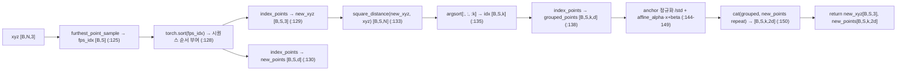
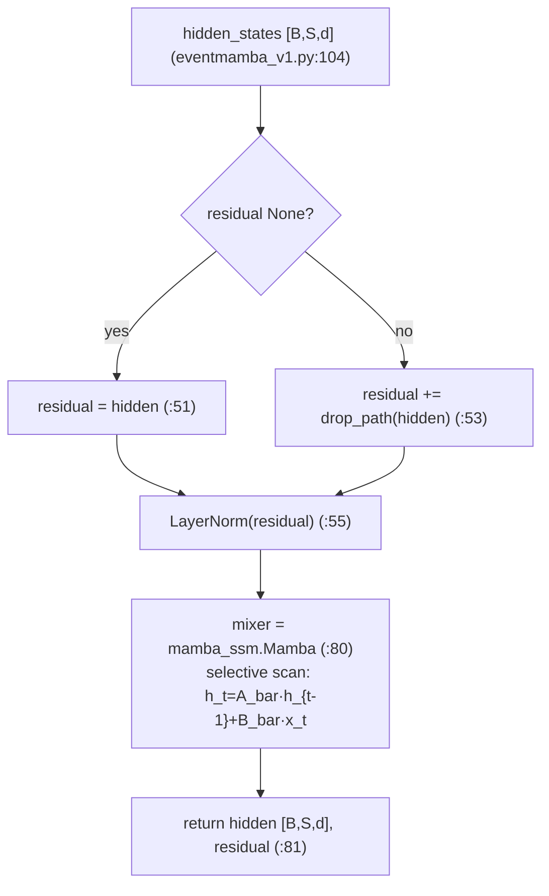
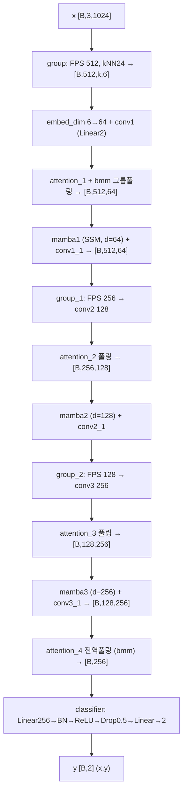

# EventMamba 모듈 통합 가이드 (S-PyTorch)

> 1차 요약: [`../EventMamba.md`](../EventMamba.md) — 본 문서는 그 요약을 모듈(클래스/함수) 단위로 심화한 S-PyTorch 변형 통합 가이드다.
> 분석 대상: `\\wsl.localhost\ubuntu-24.04\home\user\project\PRJXR-HBTXR\REF\XR-Eye-Tracking\Codebase\EventMamba`
> 형제 가이드(동형): [`../cb-convlstm-eyetracking/MODULE_GUIDE.md`](../cb-convlstm-eyetracking/MODULE_GUIDE.md) — 동일 S-PyTorch 골격으로 작성.
> 관련 논문: *Rethinking Efficient and Effective Point-based Networks for Event Camera Classification and Regression: EventMamba*, Ren et al., arXiv:2405.06116 (README:1). TTPOINT(ACM MM'23)·PEPNet(CVPR'24)의 확장(README:77).
> 작성 원칙: 실제 소스 Read 후 `파일:라인` 근거 표기. 라인 근거 없는 추론은 "추정", 코드로 확인 불가는 "확인 불가". 정확도(p-acc/p-error)는 README/논문 인용, 미실행 수치는 "확인 불가".
> 제약: bash(UNC) 미사용 — Glob/Grep/Read/Write만. **외부 원본 제외**: `mamba_ssm`(selective scan CUDA 커널), `pointnet2_ops`(FPS CUDA 가속), 체크포인트(`last_checkpoint.pth`). 커스텀 소스만 분석.

---

## 0. 문서 머리말

### 0.1 대표 케이스 선정 + 근거

본 repo는 **세 태스크(분류/odometry/시선추적)**를 공유 backbone(PointNet++식 그룹핑 + Mamba SSM)으로 처리한다. 본 가이드는 형제 cb-convlstm 가이드와 동형으로 **시선추적(eye tracking) 경로**를 대표로 선정한다.

- **대표 실행 모델(trained): `models.eventmamba_v1.EventMamba`**
  - 근거: 시선추적 학습 스크립트가 `from models.eventmamba_v1 import EventMamba`로 임포트(`train_eye_tracking.py:166`)하고 `EventMamba(num_classes=2)`로 인스턴스화(`:167`). **실제 학습/평가에 쓰이는 유일한 모델 본체**.
  - 특이점: 분류용 classifier(`Linear→BN→ReLU→Dropout(0.5)→Linear`)를 **좌표 회귀로 재사용**, 출력 채널 `num_classes=2`=(x,y)(`eventmamba_v1.py:82-89`). 마지막 `nn.Sigmoid()`는 주석처리(`:88`) — README "3ET(+sigmoid)"(README:51)는 이 줄을 활성화한 변형으로 추정.
- **대표 SSM 시간 모델링 블록(논문 핵심): `models.mamba_layer.MambaBlock`**
  - 근거: 각 stage마다 `mamba1/2/3`로 3회 호출(`eventmamba_v1.py:75-77, 105,119,133`). 외부 `mamba_ssm.modules.mamba_simple.Mamba`를 mixer로 래핑(`mamba_layer.py:5,28,31`), `bimamba_type='v2'`(양방향)(`:28`, `eventmamba_v1.py:56`). pre-norm + residual 구조(`:49-80`). **selective scan(h_t = exp(ΔtA)·h_{t-1} + ...)으로 시간 의존성 모델링**하는 유일 블록.
- **대표 포인트 그룹핑(공간 축약): `models.modules.LocalGrouper`**
  - 근거: stage마다 FPS+kNN으로 센트로이드 다운샘플(1024→512→256→128)(`eventmamba_v1.py:62-64, 94,110,124`). FPS **정렬 순서가 Mamba 스캔 순서를 정의**(`modules.py:128`) — SSM 입력의 시간축을 결정하는 핵심.

> 정리: **trained 경로 = `eventmamba_v1`(+회귀 head)**, **시간 모델링 = `MambaBlock`(외부 mamba_ssm 래핑)**, **공간 축약 = `LocalGrouper`(순수 PyTorch FPS+kNN)**. cb-convlstm이 conv(공간)+게이트 재귀(시간)였다면, EventMamba는 **FPS/kNN(공간)+selective scan(시간)**으로 동일 시공간 분해를 포인트 도메인에서 수행.

### 0.2 수치 표기 규약 (S-PyTorch)

- **params** = 레이어 차원에서 직접 산정. `Conv1d(in→out, k=1)` = `in·out + out`(`modules.py:24,38,44`). `BatchNorm1d(C)` = `2·C`(γ,β). `Linear(in→out)` = `in·out + out`. `LocalGrouper` affine = `2·(channel+add)`(`modules.py:118-119`). **Mamba mixer 내부(in_proj/conv1d/x_proj/dt_proj/out_proj/A/D)는 외부 mamba_ssm 모듈 → 본 repo 소스 아님(표준식만 제시, 절대치는 "확인 불가")**.
- **MACs / FLOPs** = (1) Conv1d k=1은 본질적으로 포인트별 1×1 → `MAC = N·in·out`(N=포인트 수). (2) Mamba selective scan 표준식 = `O(L·d·N_state)`(L=시퀀스 길이, d=채널, N_state=SSM 상태차원). (3) causal conv1d(Mamba 내부) = `L·d·d_conv`. (4) attention pooling = `bmm` `[B,1,S]·[B,S,d]` = `S·d` MAC(`eventmamba_v1.py:103,117,131,139`). **v2에 fvcore FLOPs 측정 코드 존재(`eventmamba_v2.py:116-122`)이나 미실행 → 절대 FLOPs "확인 불가"**.
- **activation memory** = 텐서 `shape × bit`. 그룹핑 출력 `new_points [B,S,k,d]`(`modules.py:151`)가 stage 진입 시 지배(S·k·d). Mamba 입력은 `[B,S,d]`(`eventmamba_v1.py:104`). 포인트 수가 stage마다 급감(512→256→128)해 메모리 점감.
- **이벤트 표현** = **포인트 클라우드** `[B,3,N]`, 3=(t,x,y), N=1024(`train_eye_tracking.py:38,57`; `provider_data.py:44`). voxel/frame 아님 — raw event를 1024개로 리샘플(`provider_data.py:32-42`). t는 [0,1] 정규화로 순서 정보 제공(`generate_3et.py:61`).
- **SSM 상태차원/스캔** = Mamba `d_state`(기본 16, 외부 default), causal conv1d `d_conv`(기본 4), expand=2(외부 default). selective scan은 **선형 재귀**: `h_t = A_bar·h_{t-1} + B_bar·x_t`, `y_t = C_t·h_t + D·x_t`(개념식, 커널 내부 "확인 불가"). FPS 정렬(`modules.py:128`)이 스캔 순서를 정의.
- **정확도** = README 표: 3ET(+sigmoid) V1, dim[32,64,128], group[512,256,128] → **accuracy 0.951**(README:51). 코드 메트릭은 `p_acc`(p3/p5/p10/p15, dist<tol)·`px_euclidean_dist`(평균 픽셀 오차)(`metrics.py:6-27,63-83`). **본 repo 미실행 → 절대 수치 "확인 불가", README/논문 인용**.

### 0.3 운영 경로 (학습 ↔ 체크포인트 ↔ 평가)

```
[원시 3ET 이벤트 h5: events(t,x,y,p) + frame_ts, 라벨 txt]
      │  generate_3et.py: frame_ts 구간 분할(:27-32) + frequency-adaptive sampling(:37-48, 6144 미달시 ±5 인접 병합)
      │    x/240, y/180 정규화(:51-52), t [0,1] min-max(:61), 시간순 정렬(:57-62)
      ▼
[전처리 h5: ./data/3et/{train,test}.h5  (group별 x/y/t/p + attrs['label'])]
      │  provider_data.load_h5_and_resample: 포인트 1024 고정(부족→tile, 초과→random choice+argsort), stack(t,x,y) (:32-44)
      ▼
[로딩: TensorDataset → DataLoader(batch=96, shuffle, drop_last) (train_eye_tracking.py:148-163)]
      │  data.permute([B,N,3]→[B,3,N]) (:57,88)  →  EventMamba(num_classes=2)
      ▼
[학습: train_eye_tracking.py]
      │  EventMamba_v1 = (LocalGrouper+conv+attn pool+Mamba)×3 + attn pool + classifier(→2)
      │  criterion = weighted_MSELoss(weights=(640/480,1)) (:176), optimizer = AdamW lr=1e-3 wd=1e-4 (:191)
      │  scheduler = MultiStepLR(milestones=[100,300]) (:192), epoch=350 (:35)
      ▼
[검증: p_acc(dist<{3,5,10,15}px) + px_euclidean_dist (metrics.py), width/height_scale = 640·0.125 / 480·0.125 = 80/60]
      │  best p3 시 last_checkpoint.pth 저장 (:208-213), TensorBoard 로깅(p3/p5/p10/p15, p_error) (:202-219)
      ▼
[(선택) 사전학습 복원: try torch.load('./last_checkpoint.pth') (:182-184)]
```
- 사전학습 복원 시 `last_checkpoint.pth` 로드(`:182-184`, try/except로 실패시 scratch). 체크포인트 자체는 [제외].

### 0.4 모델 / 데이터셋 / 정확도 요약

| 항목 | 값 | 근거 |
|---|---|---|
| 입력 | 이벤트 포인트 `[B,3,N=1024]`, 3=(t,x,y) | `train_eye_tracking.py:38,57`; `provider_data.py:44` |
| 출력 | 동공 중심 `(x,y)` 정규화 `[B,2]` | `eventmamba_v1.py:87,140`; `train_eye_tracking.py:33,60` |
| 모델 | 3-stage (LocalGrouper+conv+attn pool+Mamba) + classifier | `eventmamba_v1.py:52-145` |
| feature_list | [6,64,128,256] (v1 코드 기본) | `eventmamba_v1.py:60` |
| group(센트로이드) | 512→256→128, 24-NN | `eventmamba_v1.py:62-64` |
| params(커스텀) | ≈ 0.25M + **Mamba 외부분(확인 불가)** | 차원 산정 7.x절 |
| Loss | weighted_MSELoss(x축 종횡비 가중 640/480) | `train_eye_tracking.py:176`; `metrics.py:86-100` |
| optimizer | AdamW lr=1e-3 wd=1e-4, 350ep, MultiStepLR[100,300] | `:191-192,35` |
| 데이터셋 | 3ET(시선) / DVSGesture·DailyDVS·DVSAction·HMDB51·UCF101·THU·IJRR(분류·odom) | README:39-64 |
| 메트릭 | p_acc(p3/p5/p10/p15) / px_euclidean_dist(p-error) | `metrics.py:6-27,63-83` |
| 정확도(README 3ET) | accuracy **0.951** (V1+sigmoid, dim[32,64,128], grp[512,256,128]) | README:51 (본 repo 미실행 → 확인 불가) |

> 주: README 3ET 행의 dim/group(`[32,64,128]`/`[512,256,128]`)은 코드 기본값(`[6,64,128,256]`/`[512,256,128]`)과 **차원 일부 상이**. dim은 feature_list 후반부 표기 방식 차이(추정), group은 일치. 0.951은 +sigmoid 변형(`eventmamba_v1.py:88` 활성화)의 보고치(추정).

---

## 1. Repo / Layer 개요 (모델 / 데이터 / 학습 맵)

EventMamba = 이벤트를 **포인트 클라우드**로 보고 PointNet++식 계층 다운샘플(FPS+kNN) + **Mamba selective SSM**으로 시공간 모델링하는 멀티태스크 네트워크. 시선추적은 좌표 회귀(분류 head 재사용). **시간 모델링 핵심(selective scan)은 외부 `mamba_ssm` CUDA 커널에 위임** — 본 repo는 호출만(이식성 관점 핵심, 9절).

### 1.1 파일 역할 맵

| 구분 | 파일 | 역할 | 메인 사용 |
|---|---|---|---|
| **시선추적 학습(메인)** | `train_eye_tracking.py` | args·DataLoader·train/validate·main·체크포인트 | ★ 실행 진입점 |
| **시선추적 모델(trained 본체)** | `models/eventmamba_v1.py` | `EventMamba` 3-stage + Attention/Linear1/2Layer | ★ `:166` import |
| **분류 모델(일반화)** | `models/eventmamba_v2.py` | `EventMamba` ModuleList 일반화 + fvcore FLOPs | 분류·odom(시선 미사용) |
| **Mamba 블록(SSM 래퍼)** | `models/mamba_layer.py` | `MambaBlock`(pre-norm+residual, bimamba v2) | ★ 시간 모델링 |
| **포인트 그룹핑** | `models/modules.py` | `LocalGrouper`(FPS+kNN+anchor 정규화) + 유틸 | ★ 공간 축약 |
| **데이터 로딩** | `provider_data.py` | h5 group→포인트 1024 리샘플(t,x,y) | ★ 입력 생성 |
| **메트릭/loss** | `metrics.py` | p_acc·px_euclidean_dist·weighted_MSELoss | ★ 평가/학습 |
| **3ET 전처리** | `dataprocess/generate_3et.py` | 원시 이벤트→포인트 h5(frequency-adaptive) | ★ 1차 실행 |
| **기타 전처리** | `dataprocess/generate_{daily,action,dvsgesture,thu,ijrr}.py`, `generate_by_{sliding_window,filename}.py`, `uti.py` | 데이터셋별 전처리(분류·odom) | 시선 무관 |
| **기타 학습** | `train_classification.py`, `train_odometry.py` | 분류·포즈 학습 | 시선 무관 |
| **[제외]** | `mamba_ssm`(외부), `pointnet2_ops`(외부), `last_checkpoint.pth` | selective scan·FPS CUDA·체크포인트 | 제외 |

### 1.2 forward 진입점

`net(data)`(`train_eye_tracking.py:58,91`) → `EventMamba.forward(x)`(`eventmamba_v1.py:91`). x=`[B,3,1024]`. stage 패턴 ×3: `LocalGrouper`(`:94,110,124`) → reshape → `Linear1/2Layer` conv(`:98-99,114,128`) → `attention_k` + `bmm` 그룹 풀링(`:102-103,116-117,130-131`) → `MambaBlock`(`:105,119,133`) → conv(`:107,121,135`). 마지막 `attention_4` 전역 풀링(`:138-139`) → `classifier`(`:140`) → `[B,2]`.

### 1.3 제외 목록
- **외부 SSM 커널**: `mamba_ssm.modules.mamba_simple.Mamba`·selective scan triton/CUDA(`mamba_layer.py:5-6`) — 본 repo 소스 아님, 내부 "확인 불가".
- **외부 FPS 가속**: `pointnet2_ops.pointnet2_utils.furthest_point_sample`(`modules.py:6,127` 주석) — 순수 PyTorch fallback(`modules.py:62-82`)만 분석.
- **외부 프레임워크**: torch/h5py/timm(DropPath)/fvcore/spikingjelly/sklearn(import만).
- **시선 무관**: 분류·odom 학습/전처리(`train_classification.py`, `train_odometry.py`, `generate_*` 외 3et)는 1절 맵에만 기록, 본문 심화 제외.
- **체크포인트/로그**: `last_checkpoint.pth`, `tensorboard_log/`, `log/`.

---

## 2. 모듈: 포인트 그룹핑 — `models.modules.LocalGrouper` (공간 축약 + 스캔 순서 결정)

### 2.1 역할 + 상위/하위
- **역할**: 입력 포인트 `xyz[B,N,3]`·피처 `points[B,N,d]`에서 **FPS로 센트로이드 S개 선택 → 시간(인덱스) 정렬 → kNN(k=24) 이웃 그룹핑 → anchor 정규화 + affine**. PointNet++ Set Abstraction을 순수 PyTorch로 구현. **FPS 정렬(`:128`)이 후속 Mamba의 스캔 순서를 정의**.
- **상위**: `EventMamba`가 stage마다 1개씩 호출(`eventmamba_v1.py:94,110,124`). **하위**: `furthest_point_sample`(`:62`), `square_distance`(`:23`), `index_points`(`:44`).

### 2.2 데이터플로우 (텐서 shape · 시간축)

시간축: 포인트 도메인엔 명시적 시간 루프 없음. **t는 입력 좌표 축(xyz의 첫 채널)**이고, FPS sort(`:128`)가 센트로이드 시퀀스 순서 = Mamba 스캔 시간축을 정의.

### 2.3 forward call stack
```
EventMamba.forward (eventmamba_v1.py:94)
└─ LocalGrouper.forward(xyz, points) (modules.py:121)
   ├─ furthest_point_sample(xyz, groups) (:125 → :62 순수 PyTorch FPS 루프 :76-81)
   ├─ torch.sort(fps_idx) (:128)  ★ 스캔 순서 결정
   ├─ index_points ×2 → new_xyz, new_points (:129-130)
   ├─ square_distance(new_xyz, xyz) → argsort topk → idx (:133-136)
   ├─ index_points → grouped_xyz, grouped_points (:137-138)
   ├─ anchor 정규화 + affine (:144-149)
   └─ cat(grouped_points, new_points.repeat) (:150)
```

### 2.4 대표 코드 위치
`modules.py:62-82`(FPS), `:84-95`(knn_point), `:121-151`(LocalGrouper.forward), `:118-119`(affine 파라미터).

### 2.5 대표 코드 블록

**(a) 순수 PyTorch FPS — 순차 반복 (`modules.py:76-81`)**
```python
for i in range(npoint):
    centroids[:, i] = farthest
    centroid = xyz[batch_indices, farthest, :].view(B, 1, 3)
    dist = torch.sum((xyz - centroid) ** 2, -1)
    distance = torch.min(distance, dist)
    farthest = torch.max(distance, -1)[1]
```
→ `O(N·npoint)` 순차 루프. step간 `distance` 누적 의존 → **병렬화 불가**(데이터 의존 제어흐름, HW 난이도의 핵심, 9절). CUDA 가속본(`pointnet2_ops`)을 `:6,:127` 주석으로 대체 가능.

**(b) FPS 정렬 = 스캔 순서 (`modules.py:128`)**
```python
fps_idx, indices = torch.sort(fps_idx, dim=1)   # 센트로이드 인덱스 오름차순 정렬
```
→ FPS는 공간 균등 분포로 센트로이드를 뽑되 순서가 불규칙 → **sort로 원본 인덱스(=시간 t 순서) 정렬**하여 Mamba selective scan이 시간 단조 시퀀스를 보게 함. cb-convlstm의 `for t in range(seq)`(시간 명시 루프)에 대응하는 **시간축 정의 지점**.

**(c) anchor 정규화 + affine (`modules.py:144-150`)**
```python
if self.normalize == "anchor":
    mean = torch.cat([new_points, new_xyz], dim=-1) if self.use_xyz else new_points
    mean = mean.unsqueeze(dim=-2)                                  # 센트로이드 = anchor
std = torch.std((grouped_points-mean).reshape(B,-1), dim=-1, keepdim=True)...
grouped_points = (grouped_points-mean)/(std + 1e-5)
grouped_points = self.affine_alpha*grouped_points + self.affine_beta   # 학습형 affine
new_points = torch.cat([grouped_points, new_points.view(B,S,1,-1).repeat(1,1,k,1)], dim=-1)
```
→ PointMLP식 geometric affine. use_xyz=False(시선추적, `eventmamba_v1.py:62-64`)라 좌표는 정규화에 미포함. 출력 채널 = `2d`(grouped + 센트로이드 repeat concat).

### 2.6 연산 분해 + 정량
- **params**: affine_alpha/beta만 = `2·channel`(use_xyz=False). group=2·3=6, group_1=2·64=128, group_2=2·128=256 → **합 390**(`:118-119`). FPS/kNN/정규화는 파라미터 없음.
- **MAC**: square_distance `[B,S,N]` = `B·S·N·3` matmul(`:39`); FPS 거리 `O(N·npoint)`. stage1: S=512,N=1024 → dist matmul ≈ 1.57M MAC(d=3). 채널 깊어질수록 N↓로 점감.
- **activation**: grouped_points `[B,S,k,2d]` 지배. stage1 `[96,512,24,?]` — embed 전이라 d 작음. stage 진행 시 S↓이나 d↑.
- **HW 리스크**: FPS 순차(`:76-81`)·kNN argsort(`:135`)는 **불규칙·데이터 의존** → FPGA 직접 매핑 난이도 높음(9절). cb-convlstm의 정형 conv 대비 불리.

---

## 3. 모듈: Mamba SSM 블록 — `models.mamba_layer.MambaBlock` (시간 모델링, 외부 커널 래퍼)

### 3.1 역할 + 상위/하위
- **역할**: 센트로이드 시퀀스 `[B,S,d]`에 **selective SSM(Mamba)**를 적용해 장거리 시간 의존성 모델링. **pre-norm + residual** 구조: `residual ← residual + drop_path(hidden)`, `hidden ← norm(residual)`, `hidden ← mixer(hidden)`(`:49-80`). 양방향 `bimamba_type='v2'`(`eventmamba_v1.py:56`, `mamba_layer.py:28`).
- **상위**: `EventMamba`가 stage마다 1개씩(mamba1/2/3) 호출(`eventmamba_v1.py:105,119,133`). **하위**: 외부 `mamba_ssm...Mamba` mixer(`mamba_layer.py:31`), `nn.LayerNorm`(`:32`), `DropPath`(`:33`).

### 3.2 데이터플로우 (텐서 shape · 시간축)

시간축: S개 센트로이드를 시퀀스로 보고 selective scan이 `t=0..S-1` 재귀(외부 커널 내부). bimamba v2는 정방향+역방향 2-pass. cb-convlstm의 `(h,c)` carry에 대응하는 **SSM 상태 h_t** 운반(커널 내부, "확인 불가").

### 3.3 forward call stack
```
EventMamba.forward → x, _ = self.mamba1(x) (eventmamba_v1.py:105)
└─ MambaBlock.forward(hidden_states) (mamba_layer.py:40)
   ├─ residual = hidden (첫 호출, :51)
   ├─ hidden = self.norm(residual) (:55)           LayerNorm
   └─ hidden = self.mixer(hidden, inference_params) (:80)   ★ 외부 Mamba (selective scan, 확인 불가)
      └─ (추론시) allocate_inference_cache (:83-84)  스트리밍 상태 캐시
```

### 3.4 대표 코드 위치
`mamba_layer.py:28`(mixer 정의), `:49-55`(pre-norm residual), `:80-81`(mixer 호출/반환), `:83-84`(inference cache).

### 3.5 대표 코드 블록

**(a) Mamba mixer 래핑 + bimamba v2 (`mamba_layer.py:28-32`)**
```python
mixer_cls = partial(Mamba, layer_idx=layer_idx, bimamba_type=bimamba_type, **ssm_cfg, **factory_kwargs)
self.mixer = mixer_cls(dim)        # 외부 mamba_ssm.Mamba
self.norm  = norm_cls(dim)          # nn.LayerNorm(dim)
```
→ `bimamba_type='v2'`(`eventmamba_v1.py:56`)로 **양방향** SSM. 내부 in_proj/conv1d(causal)/x_proj/dt_proj/selective_scan/out_proj는 외부 패키지 — **본 repo 미포함, 절대 params/FLOPs "확인 불가"**.

**(b) pre-norm + residual (논문 주석 명시) (`mamba_layer.py:49-55`)**
```python
if not self.fused_add_norm:
    if residual is None:
        residual = hidden_states
    else:
        residual = residual + self.drop_path(hidden_states)
    hidden_states = self.norm(residual.to(dtype=self.norm.weight.dtype))
...
hidden_states = self.mixer(hidden_states, inference_params=inference_params)   # :80
```
→ 주석(`:18-25`): "Add → LN → Mixer"(표준 prenorm "LN→MHA→Add"과 순서 다름, fused add+norm 성능 목적). 본 호출은 stage마다 residual=None으로 시작(각 mamba가 독립 블록).

**(c) 스트리밍 추론 캐시 — Mamba 고유 (`mamba_layer.py:83-84`)**
```python
def allocate_inference_cache(self, batch_size, max_seqlen, dtype=None, **kwargs):
    return self.mixer.allocate_inference_cache(batch_size, max_seqlen, dtype=dtype, **kwargs)
```
→ SSM 상태를 캐시해 **토큰 단위 incremental 추론** 지원(선형 재귀의 이점). cb-convlstm은 매 forward `(h,c)=0` 재초기화였으나, Mamba는 상태 carry가 커널 차원에서 지원됨 → **저지연 스트리밍 XR에 유리**(9절). 단 본 학습/검증 루프는 이 경로 미사용(full-sequence forward).

### 3.6 연산 분해 + 정량
- **params(커스텀분)**: MambaBlock 자체는 `LayerNorm(dim)` = `2·dim`만 본 repo 소유. mamba1(d=64)=128, mamba2(d=128)=256, mamba3(d=256)=512 → **합 896**(LayerNorm γ,β). **mixer 본체는 외부 → "확인 불가"**.
- **Mamba mixer params 표준식(참고, 외부 default expand=2,d_state=16,d_conv=4)**: 대략 `in_proj(d→2·E·d) + conv1d(E·d·d_conv) + x_proj + dt_proj + out_proj(E·d→d) + A(E·d·N_state) + D`, E=expand=2. d=256 stage 기준 수백K~M 규모(추정, 실측 "확인 불가").
- **MAC(selective scan 표준식)**: `O(L·d·N_state)`, L=센트로이드 수(512/256/128), d=64/128/256, N_state=16. stage3: 128·256·16 ≈ 0.52M(scan 본체). bimamba 2-pass ×2. causal conv1d = `L·d·d_conv`(stage3: 128·256·4≈0.13M). **절대 FLOPs는 fvcore 미실행 → "확인 불가"**.
- **activation**: `[B,S,d]` — stage3 `[96,128,256]` = 96·128·256·4B ≈ 12.6MB. SSM 내부 상태 `[B,d·E,N_state]`는 커널 내부(확인 불가).

---

## 4. 모듈: 시선추적 모델 — `models.eventmamba_v1.EventMamba` (3-stage + 회귀 head)

### 4.1 역할 + 상위/하위
- **역할**: 포인트 `[B,3,1024]` → 3-stage 계층(각 stage: LocalGrouper 다운샘플 + Linear conv 임베딩 + attention pooling + Mamba SSM + global conv) → 전역 attention 풀링 → classifier(좌표 2개 회귀). backbone=(그룹핑+conv+풀링+Mamba)×3, neck=attention 시퀀스 풀링, head=MLP(분류기 재사용).
- **상위**: `train_eye_tracking.py`의 train(`:91`)/validate(`:58`)가 `net(data)` 호출. **하위**: `LocalGrouper`×3, `Linear1Layer`×1, `Linear2Layer`×6, `MambaBlock`×3, `Attention`×4, classifier(`Linear/BN/Dropout`).

### 4.2 데이터플로우 (텐서 shape · 시간축)

> 주: 센트로이드 수 1024(입력)→512→256→128, 채널 6→64→128→256. attention pooling이 그룹 차원(k=24)을 1로 축약(`bmm`, `:103`). 시간축 = 각 stage 센트로이드 시퀀스(FPS sort 순서, Mamba가 스캔).

### 4.3 forward call stack
```
net(data) → EventMamba.forward (eventmamba_v1.py:91)
├─ xyz = x.permute; group(xyz, x.permute) (:92-94)
├─ reshape [-1,d,s] → embed_dim → conv1 (:95-99)
├─ permute; attention_1; bmm 풀링; reshape [b,n,-1] (:101-104)
├─ mamba1(x) → conv1_1 (:105-108)
├─ [stage2] group_1 → conv2 → attention_2 → mamba2 → conv2_1 (:110-122)
├─ [stage3] group_2 → conv3 → attention_3 → mamba3 → conv3_1 (:124-136)
├─ attention_4 전역 bmm 풀링 (:138-139)
└─ classifier → [B,2] (:140)
```

### 4.4 대표 코드 위치
`eventmamba_v1.py:52-89`(생성자: group·conv·mamba·attention·classifier), `:91-145`(forward), `:82-89`(classifier=회귀 head).

### 4.5 대표 코드 블록

**(a) stage 1 — 그룹풀링→Mamba (`eventmamba_v1.py:94-108`)**
```python
xyz, x = self.group(xyz, x.permute(0, 2, 1))     # [B,512,k,6]
x = x.permute(0,1,3,2); b,n,d,s = x.size(); x = x.reshape(-1,d,s)
x = self.embed_dim(x)                            # 6→64 (Conv1d+BN+ReLU)
x = self.conv1(x)                                # Linear2 residual bottleneck
x = x.permute(0,2,1); att = self.attention_1(x)  # softmax over k
x = torch.bmm(att.unsqueeze(1), x).squeeze(1)    # ★ attention 풀링: 그룹내 k→1
x = x.reshape(b, n, -1)                          # [B,512,64]
x, _ = self.mamba1(x)                            # ★ selective SSM (시간 모델링)
```
→ 그룹(k=24) 내 포인트를 **학습형 attention 가중합**으로 1점 풀링(고정 max-pool 대신, `:102-103`). 풀링 후 `[B,S,d]`를 Mamba에 투입.

**(b) 전역 풀링 + 회귀 head (`eventmamba_v1.py:138-140`)**
```python
attn = self.attention_4(x)                       # [B,128] softmax over centroids
x = torch.bmm(attn.unsqueeze(1), x).squeeze(1)   # [B,256] 전역 attention 풀링
x = self.classifier(x)                           # Linear256→BN→ReLU→Drop0.5→Linear→2
```
→ 최종 128 센트로이드를 1 벡터로 풀링 후 MLP로 (x,y) 2개 회귀. classifier는 분류용을 그대로 재사용(BN+Dropout 포함) — 회귀엔 비최적 가능성(추정).

**(c) classifier 정의 + sigmoid 주석 (`eventmamba_v1.py:82-89`)**
```python
self.classifier = nn.Sequential(
    nn.Linear(self.feature_list[3], 256),  # 256→256
    nn.BatchNorm1d(256), nn.ReLU(inplace=True), nn.Dropout(0.5),
    nn.Linear(256, num_classes),            # 256→2
    # nn.Sigmoid()                          # ★ README "3ET(+sigmoid)" 시 활성화 추정
)
```
→ `num_classes=2`(`train_eye_tracking.py:167`)로 좌표 회귀. Sigmoid 주석(`:88`) 해제 시 출력 [0,1] 클램프 — 정규화 좌표와 정합(추정).

### 4.6 보조 레이어 (`Attention` / `Linear1Layer` / `Linear2Layer`)
- **Attention**(`:9-17`): `Linear(d,1)` → softmax → 포인트/센트로이드별 가중치. 풀링 시 `bmm`로 가중합(`:103`).
- **Linear1Layer**(`:19-30`): `Conv1d(in,out,k=1)+BN1d+ReLU` — 좌표 임베딩(embed_dim, 6→64).
- **Linear2Layer**(`:32-50`): residual bottleneck `Conv1d C→C/2 (+BN+ReLU) → Conv1d C/2→C (+BN)` + skip → ReLU(`:50`) — 피처 추상화(conv1~conv3_1).

### 4.7 연산 분해 + 정량 (전체 EventMamba v1, 커스텀분)
- **params(차원 산정, Conv1d k=1 = in·out+out, BN1d = 2·C, Linear = in·out+out)**:
  - LocalGrouper affine(use_xyz=False): 6+128+256 = **390** (`:118-119`)
  - embed_dim(6→64): (6·64+64)+128 = **576**
  - conv1/conv1_1(C=64): 각 (64·32+32)+64+(32·64+64)+128 = **4,384** ×2 = 8,768
  - conv2/conv2_1(C=128): 각 (128·64+64)+128+(64·128+128)+256 = **16,960** ×2 = 33,920
  - conv3/conv3_1(C=256): 각 (256·128+128)+256+(128·256+256)+512 = **66,688** ×2 = 133,376
  - attention_1/2/3/4: (64·1+1)+(128·1+1)+(256·1+1)+(256·1+1) = 65+129+257+257 = **708**
  - MambaBlock LayerNorm(γ,β): 2·(64+128+256) = **896**
  - classifier: (256·256+256)+512+(256·2+2) = 65,792+512+514 = **66,818**
  - **커스텀 합 ≈ 245,452 ≈ 0.245M** + **Mamba mixer 외부분(확인 불가, 표준식상 수백K~M 추가 추정)**.
- **MAC/추론(B=1)**: Conv1d k=1 = N·in·out 누적(그룹 reshape로 N=S·k). attention bmm = S·d. selective scan ≈ O(L·d·N_state) (3.6절). conv가 stage별 지배, Mamba는 짧은 시퀀스라 상대적 소규모(추정). **절대치 fvcore 미실행 → "확인 불가"**.
- **activation**: 그룹핑 출력 `[B,S,k,2d]`가 stage 진입 시 지배(stage1 S=512,k=24). 이후 attention 풀링으로 k 제거 → `[B,S,d]`. 포인트 수 급감으로 메모리 점감.

---

## 5. 모듈: 분류 일반화 모델 — `models.eventmamba_v2.EventMamba` (시선 미사용, 대비용)

### 5.1 역할 + v1 대비
- **역할**: v1과 동일 철학(group→conv→attn pool→mamba→global conv ×3 + 최종 attn + classifier)이나 `feature_list`/`group_number`/`neighbors`를 ModuleList로 일반화(`:63-81`), 데이터셋별 주석 전환(`:52-58`). 분류·odom용 — **시선추적은 v1만 사용**(`train_eye_tracking.py:166`).
- **v1 대비 차이**:

| 항목 | v1 (시선, 코드) | v2 (분류) | 근거 |
|---|---|---|---|
| embed_dim 입력 | 6 (그룹 후 concat 차원) | 3 (그룹 전 raw) | `v1:68` / `v2:69` |
| 구조 | 명시적 group/conv/mamba 개별 멤버 | `ModuleList` 루프(`for i in stages`) | `v1:62-77` / `v2:71-81,97` |
| kNN 이웃 선택 | `square_distance(new_xyz, xyz)`(좌표) | (pretrained v2는 feature 거리) | README:66; `modules.py:133-134` |
| feature_list | [6,64,128,256] | [32,64,128,256] 등 데이터셋별 | `v1:60` / `v2:54` |
| FLOPs 측정 | 없음 | fvcore `FlopCountAnalysis`(`:116-122`) | `v2:116-122` |

### 5.2 버전 호환 주의 (README:66 인용)
- pretrained 로드 시 v1은 `dists = square_distance(new_xyz, xyz)`(좌표 거리, `modules.py:133`), v2는 `square_distance(new_points, points)`(피처 거리, `:134` 주석)로 **modules.py 수정 필요**. 코드 기본은 좌표 거리(v1) 활성. 피처 거리는 overfitting 우려 주석(`:132`).

### 5.3 정량 (대비)
- v2 forward 패턴은 v1과 동일(`:90-114`) → MAC 구조 동형. fvcore 측정 코드 `model(torch.rand(1,3,2048))`(`:121`)로 **2048 포인트·51 클래스 기준 FLOPs 산출 가능**하나 미실행 → "확인 불가". 시선(1024 포인트·2 출력)은 더 가벼움(추정).

---

## 6. 모듈: 데이터 파이프라인 — `provider_data.load_h5_and_resample` / `dataprocess.generate_3et`

### 6.1 역할 + 상위/하위
- **역할(로딩)**: 전처리 h5의 각 group(sample)에서 x/y/t 읽어 **포인트 수 1024 고정**(부족→tile, 초과→random choice+argsort 시간순) 후 `(t,x,y)` stack. 1024 이상 샘플만 사용.
- **역할(전처리)**: 원시 3ET 이벤트를 frame_ts 구간으로 분할, **frequency-adaptive sampling**(이벤트 수 부족 시 인접 구간 병합), 좌표/시간 정규화 후 group별 h5 저장.
- **상위**: `train_eye_tracking.main`이 `load_h5_and_resample`→`TensorDataset`→`DataLoader`(`:148-163`). **하위**: numpy, h5py.

### 6.2 데이터플로우

```mermaid
flowchart LR
  RAW["3ET h5: events(t,x,y,p)+frame_ts, 라벨 txt"] --> SEG["generate_3et: frame_ts 구간 분할 (:27-32)"]
  SEG --> FAS["frequency-adaptive: <6144면 ±5 인접 병합 (:37-48)"]
  FAS --> NM["x/240, y/180, t [0,1] min-max, 시간정렬 (:51-62)"]
  NM --> H5["./data/3et/{train,test}.h5 (group별 x/y/t/p + attrs[label]) (:71-79)"]
  H5 --> RS["load_h5_and_resample: 1024 고정 (tile/choice) (:32-42)"]
  RS --> ST["stack(t,x,y) → [N,3], label=attrs (:44-47)"]
  ST --> OUT["TensorDataset → DataLoader (train:148-163)"]
```


### 6.3 forward call stack (데이터)
```
main → provider_data.load_h5_and_resample(h5, sample_size=1024) (train_eye_tracking.py:148)
├─ for group in f: x/y/t 읽기 (provider_data.py:26-30)
├─ current<1024 → np.tile (:32-36)  /  >=1024 → random choice + argsort (:38-42)
├─ if current>=1024: stack(t,x,y) + group.attrs['label'] (:43-47)
└─ TensorDataset(data, label) → DataLoader(batch=96, drop_last) (train_eye_tracking.py:153-154)
```

### 6.4 대표 코드 위치
`provider_data.py:21-48`(load_h5_and_resample), `generate_3et.py:27-32`(구간 분할), `:37-48`(frequency-adaptive), `:51-62`(정규화/정렬), `:71-79`(저장).

### 6.5 대표 코드 블록

**(a) 포인트 1024 리샘플 — 시간순 유지 (`provider_data.py:32-44`)**
```python
if current_sample_size < sample_size:
    repeat_factor = np.ceil(sample_size / current_sample_size).astype(int)
    x = np.tile(x, repeat_factor)[:sample_size]; ...        # 부족→반복
else:
    indices = np.random.choice(current_sample_size, sample_size, replace=False)
    indices = np.argsort(indices)                            # ★ 인덱스 정렬로 시간순 유지
    x = x[indices]; y = y[indices]; t = t[indices]
if current_sample_size >= 1024:
    sample_data = np.stack((t,x,y), axis=-1)                 # (t,x,y) 순서 포인트
```
→ 모델 입력 채널 순서 = **(t,x,y)**(`:44`). random choice 후 argsort로 시간 단조성 보존(Mamba 스캔 전제). 1024 미만 샘플은 학습 제외(`:43`).

**(b) frequency-adaptive sampling (`generate_3et.py:43-48`)**
```python
expand_segments = segments[i-expand:i+1+expand]
number = [len(ex[0]) for ex in expand_segments]
while sum(number) < 6144 and expand < 5:
    expand += 1
    expand_segments = segments[i-expand:i+1+expand]
    number = [len(ex[0]) for ex in expand_segments]
```
→ 한 GT 구간 이벤트가 6144 미만이면 인접 구간(최대 ±5)을 병합해 **포인트 밀도 확보**. 이벤트 희소 구간(시선 정지)의 표현력 보강(추정).

**(c) 좌표/시간 정규화 (`generate_3et.py:51-61`)**
```python
expand_x = np.concatenate([seg[0] for seg in expand_segments])/240   # x/240
expand_y = np.concatenate([seg[1] for seg in expand_segments])/180   # y/180
...
sorted_t = (expand_t[s]-expand_t[s][0])/(expand_t[s][-1]-expand_t[s][0]+1e-5)   # t [0,1]
```
→ 좌표는 /240,/180(전처리 해상도), 라벨은 /640,/480(`process_labels:9-10`)로 **서로 다른 분모** 정규화. 모델 출력은 라벨 스케일과 비교되고, 메트릭은 sensor·spatial_factor(80/60)로 픽셀 환산(`train_eye_tracking.py:63-64`). 정규화 분모 불일치의 정합성은 라벨/입력이 다른 좌표계라 일관(라벨이 기준) — 단 입력 /240,/180의 의미는 주석 외 근거 없음(추정).

### 6.6 연산 분해 + 정량
- params 없음(전처리/로딩). 비용 = I/O·numpy.
- 입력 텐서/샘플: `[1024,3]` fp32 = 1024·3·4B = **12KB/샘플**(cb-convlstm 768KB 대비 60배 경량 — 포인트 표현의 메모리 이점). 배치(96) ≈ 1.18MB.
- `generate_3et.py:65`에 `print(samples)` 디버그 잔존 → 전처리 매우 느려질 수 있음(전체 샘플 매 루프 출력, 확인됨).
- 저장: group별 gzip 압축 dataset(`:75-78`).

---

## 7. 모듈 한눈표

| # | 모듈 | 파일:라인 | 역할 | 대표 정량 |
|---|---|---|---|---|
| 2 | LocalGrouper | modules.py:97-151 | FPS+kNN 다운샘플 + anchor affine + 스캔순서 결정 | params 390(affine) / FPS O(N·npoint) 순차 |
| 2 | furthest_point_sample | modules.py:62-82 | 순수 PyTorch FPS(센트로이드 선택) | 순차 루프(병렬불가) |
| 3 | MambaBlock | mamba_layer.py:9-84 | pre-norm+residual + 외부 Mamba SSM(bimamba v2) | LayerNorm 896 / scan O(L·d·N_state) / mixer 외부 확인불가 |
| 4 | EventMamba(v1) | eventmamba_v1.py:52-145 | 3-stage 그룹+conv+attn pool+Mamba + 회귀 head | **커스텀 ≈0.245M params** + Mamba 외부 |
| 4.6 | Attention/Linear1/2Layer | eventmamba_v1.py:9-50 | attn 풀링·임베딩·residual bottleneck | conv1~3_1 4,384~66,688/쌍 |
| 5 | EventMamba(v2) | eventmamba_v2.py:48-114 | 분류 일반화(ModuleList) + fvcore FLOPs | 시선 미사용(대비용) |
| 6 | load_h5_and_resample | provider_data.py:21-48 | 포인트 1024 고정 리샘플(t,x,y) | 12KB/샘플 |
| 6 | generate_3et | dataprocess/generate_3et.py:12-79 | 이벤트→포인트 h5(frequency-adaptive) | 6144 임계 병합, t [0,1] |
| 6 | metrics | metrics.py:6-100 | p_acc·px_euclidean_dist·weighted_MSELoss | tol{3,5,10,15}, scale 80/60 |

---

## 8. 학습 · 평가 파이프라인 + 재현 명령

### 8.1 학습 루프 (`train_eye_tracking.py:81-113, 199-224`)
- 손실 `weighted_MSELoss(weights=(640/480, 1))`(`:176`, `metrics.py:86-100`) — **x축 종횡비 가중**(width/height). optimizer `AdamW lr=1e-3 wd=1e-4`(`:191`), scheduler `MultiStepLR(milestones=[100,300])`(`:192`), epoch=350(`:35`), batch=96(`:29`).
- data permute `[B,N,3]→[B,3,N]`(`:88`), loss는 `label[:,:2]`(x,y만)로 계산(`:92`). 매 epoch 검증 후 **best p3**면 `last_checkpoint.pth` 저장(`:208-213`), TensorBoard 로깅(`:202-219`).

### 8.2 평가 메트릭 (`metrics.py:6-83`)
```python
# p_acc (:17-24)
dis = target - prediction
dis[:, 0] *= width_scale    # 640·0.125 = 80
dis[:, 1] *= height_scale   # 480·0.125 = 60
dist = torch.norm(dis, dim=-1)
total_correct[f'p{tol}'] = torch.sum(dist < p_tolerance)   # tol ∈ {3,5,10,15}
# px_euclidean_dist (:79-81): total = Σ dist  →  평균 픽셀 오차(p-error)
```
→ p_acc = `dist < tol px` 정답 비율(클수록 우수, cb-convlstm err_rate와 부호 반대). p-error = 평균 유클리드 픽셀 오차. width/height_scale = `sensor·spatial_factor` = 80/60(`:63-64`). `p_acc_wo_closed_eye`(`:30-60`)는 감은눈 제외용(본 루프 미사용). **본 repo 미실행 → 절대 수치 "확인 불가"**, README: 3ET accuracy 0.951(README:51).
> 주: 정규화 좌표에 width_scale(80)을 x에, height_scale(60)을 y에 곱함 — cb-convlstm의 축 교차(height·x) 버그 의심과 달리 **EventMamba는 x↔width, y↔height 정합**(확인됨, `metrics.py:18-19`).

### 8.3 재현 명령 (README:16-35)
```bash
# 1. 전처리 (3ET 원시 이벤트 → 포인트 h5)
cd dataprocess
python generate_3et.py            # train.h5/test.h5 → ./3et/ (또는 ./data/3et/로 이동)
# 2. ./data/3et/train.h5, test.h5 배치
# 3. 학습 (시선추적)
python train_eye_tracking.py      # EventMamba_v1, AdamW, 350 epoch
#    (분류) python train_classification.py  (odom) python train_odometry.py
```
- 설치(README:5-13): conda py3.8, PyTorch 2.1+CUDA12.1, `pip install spikingjelly mamba-ssm`, Pointnet2 CUDA 커널. **mamba-ssm·CUDA 필수**(selective scan).
- 데이터셋: 3ET(시선) / DVSGesture·DailyDVS·DVSAction·HMDB51·UCF101·THU·IJRR(분류·odom). 메트릭: p3/p5/p10/p15·p-error.

---

## 9. 우리 프로젝트(XR + FPGA 저지연) 시사점 + HW 이식성

### 9.1 FPGA 매핑 적합성 — cb-convlstm 대비 양면적 (추정)
- **불리**: 포인트 도메인의 **FPS(순차 O(N·npoint), `modules.py:76-81`)·kNN(argsort `:135`)**는 불규칙·데이터 의존 제어흐름 → systolic/정형 데이터플로 매핑 난이도 높음. cb-convlstm의 정형 conv 대비 전처리 backbone이 HW 비친화. CUDA FPS(`pointnet2_ops`) 별도 의존.
- **유리**: 포인트 수가 작고(1024) stage마다 급감(512→256→128) → **Mamba 시퀀스 짧음**. selective scan만 분리 가속하면 효율적(추정). 입력 12KB/샘플(cb-convlstm 768KB의 1/60) — 메모리 매우 경량.

### 9.2 Mamba selective scan → HW 핵심 타깃 (추정)
- selective scan(`h_t = A_bar·h_{t-1} + B_bar·x_t`, `y_t = C_t·h_t + D·x_t`)은 **선형 재귀** → FPGA pipelined MAC + state-update SRAM에 매핑 적합. cb-convlstm의 게이트 재귀(σ/tanh)보다 단순(곱·합 위주).
- **선결 과제**: (1) 입력 의존 Δ/B/C 생성(in_proj/x_proj/dt_proj)을 함께 매핑 필요. (2) `bimamba_type='v2'`(양방향, `mamba_layer.py:28`)는 **정방향+역방향 2-pass** → 지연 2배. 단방향 단순화 검토. (3) **selective scan은 외부 CUDA 커널(`mamba_layer.py:5`) → HW화하려면 PyTorch/HLS로 직접 재구현** 필요(난이도 高, gg_ssms의 MST refine보다는 정형이나 conv보다는 복잡 — 추정).

### 9.3 스트리밍 추론 이점 (확인됨/추정)
- `allocate_inference_cache`(`mamba_layer.py:83-84`)로 **SSM 상태 carry incremental 추론** 지원 → cb-convlstm의 매 forward `(h,c)=0` 재초기화 대비 **저지연 스트리밍 XR에 구조적 우위**(확인됨, 단 학습/검증 루프는 미사용). FPGA on-chip에 상태 상주 시 토큰 단위 갱신 가능(추정).
- 단 stage 경계에 LocalGrouper(전체 시퀀스 필요)가 있어 **순수 토큰 스트리밍은 불가** — group 단위 batch 처리 필요(추정).

### 9.4 경량화·저지연
- **커스텀 ≈0.245M params**(7.4절) + Mamba 외부분(확인 불가). 입력 1024 포인트·3채널 → on-device XR baseline 경량.
- **양자화 여지**: 본 repo 양자화 코드 없음("확인 불가"). v2 fvcore FLOPs 측정 코드(`eventmamba_v2.py:116-122`)가 경량화 baseline 출발점. Mamba 양자화(SSM 상태·Δ 민감)는 별도 연구 필요(추정). 동일 인벤토리 ViT-Quant/ESDA INT8 경로 직접 재활용은 SSM 비호환 가능(추정).

### 9.5 벤치마크 정합 (추정)
- 동일 3ET 데이터로 **cb-convlstm(frame+ConvLSTM) vs gg_ssms(frame+MST) vs EventMamba(point+Mamba)** 정확도/지연/리소스 공정 비교 가능. FPGA 1차 타깃 우선순위: **정형성** 기준 cb-convlstm(conv) > EventMamba(scan은 정형이나 FPS 비정형) > gg_ssms(MST 불규칙). 정확도 상한 비교군으로 EventMamba/gg_ssms 배치 권장(추정, 정량 확인 불가).
- 분할 가속 전략(추정): **FPS/kNN 전처리는 SW(임베디드 CPU), Mamba SSM backbone만 FPGA 가속**이 현실적. 포인트 표현은 프레임 누적·voxelization 불필요 → 저지연·저메모리 XR 시선추적에 개념적 부합.

---

## 10. 근거 표기 정리
- **확인됨(코드 라인)**: 시선이 `eventmamba_v1` 사용(`train_eye_tracking.py:166`); num_classes=2 회귀(`:167`, `eventmamba_v1.py:87`); FPS sort가 스캔 순서 정의(`modules.py:128`); bimamba v2 양방향(`mamba_layer.py:28`); inference cache 스트리밍 지원(`:83-84`); 입력 (t,x,y) 순서·1024 고정(`provider_data.py:44`); 메트릭 x↔width/y↔height 정합(`metrics.py:18-19`); `generate_3et.py:65` print 디버그 잔존; v1/v2 kNN 거리 기준 차이(README:66, `modules.py:133-134`).
- **추정(라인 근거 없는 해석)**: +sigmoid 변형(`eventmamba_v1.py:88`); 회귀 head(분류기 재사용) 비최적성; README dim/group과 코드 차이; 입력 /240,/180 의미; FPGA 매핑 우열·분할 가속; Mamba 양자화 난이도; frequency-adaptive 의도.
- **확인 불가(미실행/부재)**: 실제 학습 p-acc/p-error(README 0.951만); Mamba mixer 절대 params/FLOPs(외부 mamba_ssm); fvcore FLOPs(`eventmamba_v2.py:116-122` 미실행); selective scan 커널 내부; checkpoint 내부(제외).
- **인용(README/논문)**: 3ET accuracy 0.951(README:51); arXiv:2405.06116(README:1); 데이터셋 표(README:39-64); TTPOINT/PEPNet 계보(README:77).
