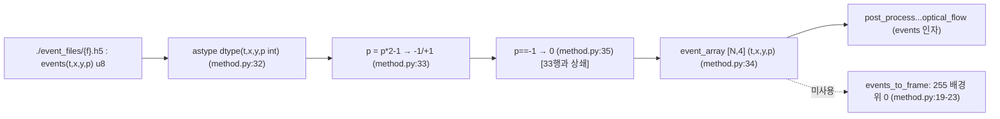
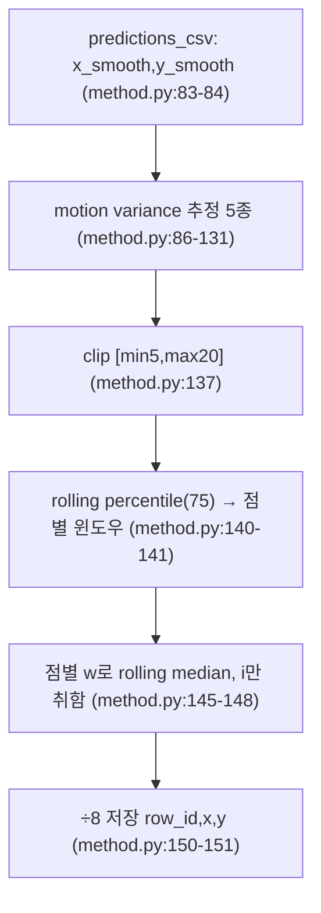
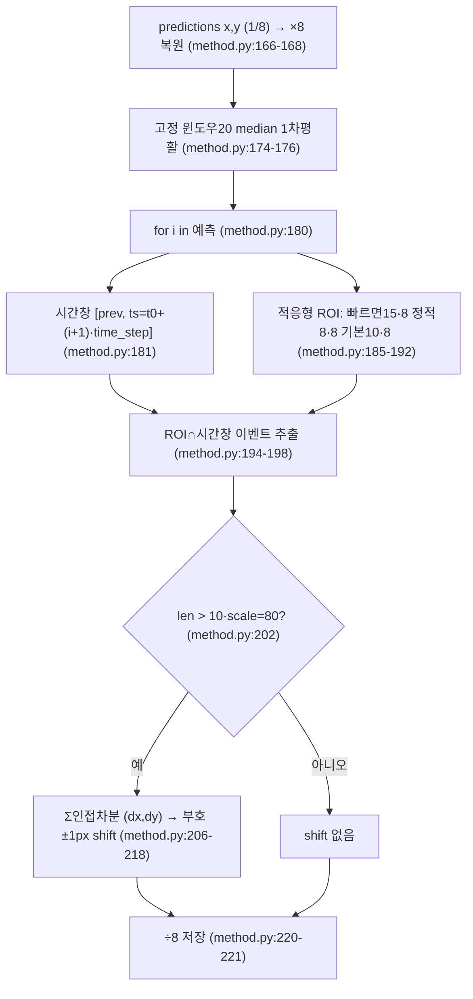
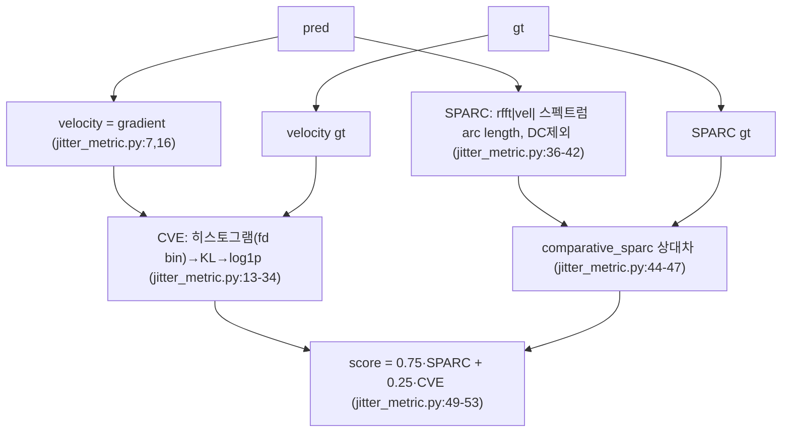

# EyeLoRiN 모듈 통합 가이드 (S-PyTorch 변형: 모델 없는 추론시점 후처리)

> 1차 요약: [`../EyeLoRiN.md`](../EyeLoRiN.md) — 본 문서는 그 요약을 모듈(함수) 단위로 심화한 통합 가이드다.
> 분석 대상: `\\wsl.localhost\ubuntu-24.04\home\user\project\PRJXR-HBTXR\REF\XR-Eye-Tracking\Codebase\EyeLoRiN`
> 관련 논문: "Inference-Time Gaze Refinement for Micro-Expression Recognition", IJCAI'25 WS (4DMR2025), arXiv:2506.12524 (README.md:3,6 / CEUR Vol-4115 paper3)
> 작성 원칙: 실제 소스 Read 후 `파일:라인` 근거 표기. 라인 근거 없는 해석은 "추정", 코드로 확인 불가/미실행은 "확인 불가"로 명시. 정확도는 README 인용, 없으면 "확인 불가".

---

## 0. 문서 머리말

### 0.1 실체 — 후처리 중심 vs 모델 포함 (cb-convlstm과의 핵심 차이)

자매 가이드 cb-convlstm-eyetracking은 **모델(ConvLSTM×4)을 포함한 학습/추론 코드베이스**다. 반면 **EyeLoRiN은 모델이 전혀 없다.** 신경망 backbone/neck/head/loss/dataset/train·infer 루프가 **부재**하며, 이미 학습된 외부 베이스라인 모델이 뱉은 **동공 좌표 CSV를 추론시점(inference-time)에 다듬는 순수 후처리 코드베이스**다.

- 근거(모델 부재): `method.py:1-16`·`jitter_metric.py:1-5` import 목록에 **torch/tensorflow 0건**. 핵심 로직은 numpy/pandas/scipy/cv2 기반 고전 신호처리.
- 근거(전체 소스 3파일): Glob 전체 스캔 결과 커스텀 소스는 `README.md`+`method.py`+`jitter_metric.py` 3개뿐(`.h5/.csv/.pth/.pt/.ckpt` 0건, `.git/`은 제외).
- 명칭 "EyeLoRiN"은 백본 아키텍처명이 **아니다.** "LoRiN = Low-Rank/Recurrent/SSM" 가설은 이 repo 코드로는 **확인 불가**(repo명일 뿐, 구조와 무관 — 추정).

> 정리: **모델 경로 없음.** 본 가이드의 정량 규약은 cb-convlstm의 "params/FLOPs/activation memory"를 **후처리 알고리즘 복잡도(시간/공간 복잡도)·median 윈도우·ROI·shift·jitter metric 가중치**로 치환해 적용한다. (S-PyTorch 규약: 모델 있으면 params/FLOPs, 없으면 후처리·메트릭·이벤트 표현 정량)

### 0.2 핵심 기여 3종 (후처리 2 + 메트릭 1)

| # | 기여 | 구현 | 라인 |
|---|---|---|---|
| (i) | **Motion-Aware (적응형) Median Filtering** | `adaptive_smoothing` | `method.py:66-151` |
| (ii) | **Optical Flow 기반 Local Refinement** | `post_process_pupil_coordinates_optical_flow` | `method.py:153-221` |
| (iii) | **Jitter Metric (평가)** = velocity-entropy + SPARC | `jitter_metric.py` 전체 | `jitter_metric.py:13-53` |

(근거: README.md:10 — "(i) Motion-Aware Median Filtering ... (ii) Optical Flow-Based Local Refinement ... novel Jitter Metric")

### 0.3 수치 표기 규약 (S-PyTorch: 모델 부재 변형)

- **params / FLOPs** = **해당 없음(모델 부재)**. 본 repo엔 학습 가중치·conv·FC가 없다(`method.py:1-16` torch 부재). cb-convlstm의 params·MAC 항목은 본 가이드에서 **후처리 복잡도**로 치환.
- **후처리 복잡도** = 알고리즘 시간복잡도. 1차 median(고정 윈도우 20, `method.py:174-176`), 적응형 median(점별 윈도우, `:145-148`), ROI 이벤트 마스킹(`:194-198`)을 각각 Big-O로 산정(6절). PyTorch dense 텐서 연산이 아닌 pandas rolling·numpy boolean index가 비용 지배항.
- **median 필터 파라미터** = 윈도우 크기. 고정 1차창 `median_window=20`(`:174`), 적응형 범위 `[min_window=5, max_window=20]`(`:66`), percentile=75(`:66,140`).
- **ROI / shift 파라미터** = `scale=8`(`:164`); ROI 반경 기본 `10*scale=80`px, 빠른 이동 `15*scale=120`, 정적 `8*scale=64`(`:185,190,192`); optical-flow 발동 임계 이벤트 수 `10*scale=80`(`:202`); shift는 **±1px 단위**(부호만, `:215-216`).
- **jitter metric** = `score = 0.75·SPARC + 0.25·CVE`(`jitter_metric.py:52`). SPARC=Spectral Arc Length(속도 FFT 스펙트럼, DC 제외, `:36-42`), CVE=Comparative Velocity Entropy(pred/gt 속도분포 KL→log1p, `:13-34`). dt 기본 1/100s(`:13,36`).
- **이벤트 표현** = `events_to_frame`(`:19-23`)의 흰 배경(255) 위 0(검정) 단순 누적 binary frame이 유일한 명시적 프레임화. 단 실제 refinement는 프레임이 아니라 **raw 이벤트 좌표를 ROI∩시간창으로 직접 질의**(`:194-198`) — voxel/time-surface 없음(확인 불가).
- **정확도** = README는 "consistent improvements across multiple baseline models"(README.md:10)만 언급, **구체적 p-error/거리 수치 부재**. CVPR'25 챌린지 2위(README.md:4)는 명시되나 수치는 repo 코드·README에 없음 → **확인 불가**.

### 0.4 운영 경로 (외부 모델 ↔ 후처리 ↔ 평가)

```
[외부 베이스라인 gaze 모델 (이 repo 밖, 추정 CNN/RNN 계열)]
      │  출력: 동공 좌표 예측 CSV (x,y,row_id, 1/8 스케일)
      ▼
[입력1 예측 CSV: ./original_bigBrains/submission_check_{file}.csv (method.py:227)]
[입력2 이벤트 h5: ./event_files/{file}.h5  events(t,x,y,p), t=us (method.py:29-32)]
      │  event_file_to_array: h5 → (t,x,y,p) ndarray (method.py:28-36)
      ▼
[후처리: method.py 메인 루프 (method.py:223-227, 파일 11개 하드코딩)]
      │  ① 좌표 ×8 복원 (method.py:166-168)
      │  ② 고정 윈도우(20) median 1차 평활 (method.py:174-176)
      │  ③ 점별 적응형 ROI ∩ 시간창 이벤트 추출 (method.py:185-198)
      │  ④ 이벤트 차분 누적 부호 → ±1px shift (method.py:202-218)
      │  ⑤ 좌표 ÷8 저장 (method.py:220-221)
      ▼
[출력: ./refined/refined_predictions_{file}.csv  (row_id,x,y) (method.py:220-227)]

[평가(별 경로): jitter_metric.py — score=0.75·SPARC+0.25·CVE (jitter_metric.py:49-53)]
      └─ 단독 실행 시 true_labels 미정의로 NameError (jitter_metric.py:131, 외부 GT 주입 가정)
```
- **주의**: 기여 (i) `adaptive_smoothing`는 정의되나 **메인 루프에서 미호출**(`:225-227`은 optical_flow 함수만 호출). 논문상 두 모듈 결합이나 코드상 분리 — 결합 파이프라인은 **확인 불가**(추정: 별도 수동 실행).

### 0.5 모델 / 데이터셋 / 정확도 요약

| 항목 | 값 | 근거 |
|---|---|---|
| 모델 | **없음** (후처리 전용) | `method.py:1-16` torch 부재 |
| params / FLOPs | **해당 없음** | 동일 |
| 입력1 | 예측 CSV `x,y,row_id` (1/8 스케일) | `method.py:166-168,227` |
| 입력2 | 이벤트 h5 `events(t,x,y,p)`, t=us | `method.py:29-32` |
| 출력 | 정제 CSV `row_id,x,y` (÷8) | `method.py:220-221` |
| 센서 | `(640,480,2)` DVS류 | `method.py:25` |
| 후처리 (i) | 적응형 median (윈도우 5~20) | `method.py:66-151` |
| 후처리 (ii) | 근사 optical flow ±1px shift | `method.py:153-221` |
| 메트릭 (iii) | 0.75·SPARC + 0.25·CVE | `jitter_metric.py:52` |
| 데이터셋 | CVPR'25 3ET+ 챌린지셋 (추정) | README.md:4 (repo 미포함) |
| 정확도 | "consistent improvements" 정성 서술만 / CVPR'25 2위 | README.md:4,10 (구체 수치 확인 불가) |

---

## 1. Repo / 후처리 개요 (후처리 / 모델 맵)

EyeLoRiN = 외부 이벤트 기반 gaze 모델의 좌표 출력 CSV를, 재학습·구조변경 없이 **추론시점에 시간적 부드러움·공간 jitter를 개선**하는 model-agnostic 후처리 + 평가 메트릭. HW 커널·CUDA·딥러닝 프레임워크 무의존 **순수 numpy/pandas/scipy/cv2**(이식성 최상).

### 1.1 파일 역할 맵

| 구분 | 파일 | 역할 | 메인 사용 |
|---|---|---|---|
| **메인(후처리 본체)** | `method.py` | 이벤트 I/O + median + ROI optical flow + 메인 루프 | ★ 실행 진입점 |
| **평가 메트릭** | `jitter_metric.py` | velocity-entropy + SPARC + 결합 score + 노이즈 시뮬 | 평가(별 경로) |
| **문서** | `README.md` | 논문/챌린지 링크, abstract, citation (28줄) | — |
| **[제외]** | `.git/` 전체 | 버전관리 메타 | 제외 |
| **[부재]** | model/dataset/train/loss/ckpt | 코드·파일 0건 | — |

### 1.2 후처리 진입점

`python method.py` → 모듈 로드 시 `file_names` 11개 하드코딩(`:223`)에 대해 for 루프(`:225`) → `event_file_to_array`(`:226`) → `post_process_pupil_coordinates_optical_flow`(`:227`)를 파일별 순차 실행. `adaptive_smoothing`은 정의만 되고 메인에서 미호출.

### 1.3 표준 CV/DL 모듈 부재 확인표 (cb-convlstm 대비)

| 표준 모듈 | cb-convlstm | EyeLoRiN | 근거 |
|---|---|---|---|
| Backbone | ConvLSTM×4 | **없음** | `method.py:1-16` torch 부재 |
| Neck/Head | BN3d/Pool/FC | **없음** | 동일 |
| Loss | SmoothL1 | **없음**(대신 평가 score) | `jitter_metric.py:49-53`는 학습 loss 아님 |
| Dataset/Loader | EventDataset | **없음** | h5/csv 직접 read(`method.py:28-36,82`) |
| Train loop | Adam 100ep | **없음** | optimizer/backward 0건 |
| Infer(모델) loop | MyModel.forward | **없음** | `method.py:180-218`은 후처리 루프 |

### 1.4 제외 목록
- **버전관리**: `.git/`(hooks/objects/refs 등 전부, 분석 대상 아님).
- **외부 프레임워크**: h5py/pandas/cv2/scipy/numpy(import만, 벤더링 원본 아님). third_party/vendor **부재**.
- **런타임 입력(repo 미포함)**: `./event_files/*.h5`, `./original_bigBrains/*.csv`, `./refined/*.csv`(`method.py:29,227`) — 외부 산출물, 확인 불가.
- **외부 모델**: "bigBrains" 베이스라인(경로명 `method.py:227`)은 이 repo 밖.

---

## 2. 모듈: 이벤트 I/O 유틸 — `events_to_frame` / `event_file_to_array`

### 2.1 역할 + 상위/하위
- **역할**: 이벤트 h5를 numpy 구조화 배열로 읽고(`event_file_to_array`), 필요 시 단순 누적 binary frame을 생성(`events_to_frame`). 이벤트 표현 계층.
- **상위**: 메인 루프(`method.py:226`)가 `event_file_to_array` 호출 → optical-flow 후처리에 이벤트 배열 공급. `events_to_frame`은 정의되나 메인 경로에서 미호출(시각화/디버그용 추정).
- **하위**: `h5py.File`, numpy dtype 캐스팅.

### 2.2 데이터플로우 (텐서/배열 shape)


### 2.3 forward call stack
```
method.py 메인 (:226)
└─ event_file_to_array(file_name) (:28)
   ├─ h5py.File(./event_files/{f}.h5) (:29)
   ├─ events = f["events"][:].astype(dtype) (:32)   # (t,x,y,p), t=us
   ├─ events['p'] = events['p']*2 - 1 (:33)          # 0/1 → -1/+1
   ├─ event_array = np.array(events.tolist()) (:34)  # [N,4]
   └─ event_array[:,3][==-1] = 0 (:35)               # -1 → 0 (33행 상쇄)
```

### 2.4 대표 코드 위치
`method.py:19-23`(events_to_frame), `:25-26`(sensor_size·dtype), `:28-36`(event_file_to_array).

### 2.5 대표 코드 블록

**(a) 단순 누적 binary frame (`method.py:19-23`)**
```python
def events_to_frame(events, width, height):
    frame = np.ones((height, width), dtype=np.uint8) * 255  # 흰 배경
    for t, x, y, polarity in events:
        frame[int(y), int(x)] = 0                            # 이벤트 위치=검정
    return frame
```
→ polarity **무시**(존재만 표시), voxel/time-surface 아님. 단일 채널 2D binary accumulation. 메인 경로 미사용.

**(b) polarity 변환의 상쇄 코드 스멜 (`method.py:32-35`)**
```python
events = f["events"][:].astype(dtype)
events['p'] = events['p']*2 - 1                    # 0/1 → -1/+1
event_array = np.array(events.tolist())
event_array[:, 3][event_array[:, 3] == -1] = 0     # -1 → 0 (33행을 곧장 되돌림)
```
→ 33행 변환을 35행에서 즉시 상쇄 → polarity는 결국 0/1로 남음. **무의미/혼란 코드**(코드 스멜). 후처리는 polarity를 쓰지 않으므로 기능 영향 없음(추정).

### 2.6 연산 분해 + 정량
- **params 없음**(I/O). 비용은 h5 read(O(N), N=이벤트 수) + 구조화 배열→list 변환(`.tolist()`, `:34`)으로 **메모리 2배 사본 발생**(코드 스멜, 대규모 N에서 부담).
- 센서 `(640,480,2)`(`:25`), t 단위 us(`:31`). 이벤트 배열 `[N,4]` int.

---

## 3. 모듈: Motion-Aware 적응형 Median Filtering — `adaptive_smoothing` (기여 i)

### 3.1 역할 + 상위/하위
- **역할**: 예측 CSV의 `x_smooth`/`y_smooth`를 읽어, **국소 운동 변동성(motion variance)에 따라 median 윈도우를 점마다 동적으로 바꾸는** 적응형 median 평활. blink 스파이크는 큰 윈도우로 억제, 빠른 saccade는 작은 윈도우로 보존(README.md:10 일치).
- **상위**: 정의는 되나 **메인 루프 미호출**(`:225-227`) → 호출 주체 코드상 부재(확인 불가, 논문상 결합).
- **하위**: pandas rolling median/cov/percentile, `local_frequency_variance`(STFT).

### 3.2 데이터플로우


### 3.3 motion variance 추정 5종 (인자 `method`)
| method | 정의 | 라인 |
|---|---|---|
| `"raw"` | 인접 좌표 차분 L2(속도) + rolling mean | `:86-90` |
| `"velocity"` | np.diff 속도 + rolling mean | `:92-98` |
| `"acceleration"` | 2차 차분(가속도) + rolling mean | `:100-105` |
| `"covariance"` **(기본)** | rolling 공분산 √(cov_x²+cov_y²) | `:107-114` |
| `"frequency"` | STFT power 분산(`local_frequency_variance`) | `:116-131` |

### 3.4 대표 코드 위치
`method.py:60-64`(local_frequency_variance STFT), `:66-84`(시그니처·CSV 로드), `:107-114`(covariance 기본), `:136-148`(적응형 윈도우·median), `:150-151`(÷8 저장).

### 3.5 대표 코드 블록

**(a) 적응형 윈도우 산출 (`method.py:136-141`)**
```python
median_window = np.clip(smoothed_variance.fillna(min_window).astype(int), min_window, max_window)  # 5~20
adaptive_windows = median_window.rolling(base_window, center=True, min_periods=1).apply(
    lambda x: np.percentile(x, percentile), raw=True).astype(int)   # 점별 75퍼센타일
adaptive_windows = np.clip(adaptive_windows, min_window, max_window)
```
→ motion variance를 [5,20]으로 클립 후 국소 percentile(75)로 점별 윈도우 결정. variance↑ → 윈도우↑ → 강한 평활.

**(b) 점별 적응형 median — O(N²) 코드 스멜 (`method.py:145-148`)**
```python
smoothed_x = np.array([pd.Series(refined_x).rolling(window=w, center=True, min_periods=1).median().values[i]
                        for i, w in enumerate(adaptive_windows)])
smoothed_y = np.array([... for i, w in enumerate(adaptive_windows)])
```
→ **매 점 i마다 전체 Series에 rolling median을 다시 계산하고 인덱스 i 하나만 취함** → O(N²). 성능 병목(6절·8절 HW 핵심).

**(c) STFT 주파수 분산 (`method.py:60-64`)**
```python
def local_frequency_variance(data, window_size=5, fs=30):
    f, t, Zxx = signal.stft(data, fs=fs, nperseg=window_size)
    power_spectrum = np.abs(Zxx) ** 2
    return np.var(power_spectrum, axis=0)
```
→ `"frequency"` 모드의 motion 변동성 척도. fs 기본 30Hz(`:60`).

### 3.6 연산 분해 + 정량
- **params 없음**. 윈도우 파라미터: min/max=5/20, base=5, percentile=75(`:66`).
- **시간복잡도**: 적응형 median이 **O(N²)**(`:145-148`, N=예측 점수). covariance 추정도 rolling apply라 O(N·base). 윈도우는 작은 정수 상수(5~20) → HW LUT/비교로 환산 용이(8절).
- **÷8 스케일 저장**(`:150-151`): 출력 좌표를 1/8 좌표계로 환산(입력 CSV `x_smooth`는 이미 ×8 복원 가정 — 추정, optical_flow와 달리 ×8 코드 부재로 정합성 **확인 불가**).

---

## 4. 모듈: Optical Flow 기반 Local Refinement — `post_process_pupil_coordinates_optical_flow` (기여 ii, 메인 본체)

### 4.1 역할 + 상위/하위
- **역할**: median으로 1차 평활한 좌표를, **국소 ROI 내 이벤트의 누적 이동 부호(근사 optical flow)에 맞춰 ±1px씩 미세 정렬**. 메인 루프가 실제 호출하는 **유일한 후처리 본체**(`:227`).
- **상위**: 메인 for 루프(`:225-227`). **하위**: pandas rolling median, numpy boolean 인덱싱.

### 4.2 데이터플로우 (좌표·시간축)

시간축: `time_step = (events[-1,0]-events[0,0]) / num_predictions`(`:170-172`)로 프레임당 us 간격 산출, 각 예측에 시간창 할당(`:181,200`).

### 4.3 forward call stack
```
method.py 메인 (:227)
└─ post_process_pupil_coordinates_optical_flow(events, pred_csv, out_csv) (:153)
   ├─ refined_x/y = predictions['x'/'y']*scale (:166-168)   # ×8 복원
   ├─ time_step = total_duration / num_predictions (:170-172)
   ├─ rolling median window=20 (:174-176)                    # 1차 평활
   └─ for i, row in predictions.iterrows() (:180)
      ├─ timestamp = t0 + (i+1)*time_step (:181)
      ├─ 적응형 roi_size (:185-192)                          # 10/15/8 × scale
      ├─ roi_events = boolean mask ROI ∩ 시간창 (:194-198)
      ├─ prev_timestamp = timestamp (:200)
      └─ if len(roi_events) > 80: Σ차분 → 부호 ±1px shift (:202-218)
```

### 4.4 대표 코드 위치
`method.py:164`(scale=8), `:166-176`(×8·time_step·1차 median), `:185-192`(적응형 ROI), `:194-198`(이벤트 마스킹), `:202-218`(근사 optical flow shift), `:220-221`(÷8 저장).

### 4.5 대표 코드 블록

**(a) 적응형 ROI 크기 — motion-aware (`method.py:185-192`)**
```python
roi_size = 10*scale                       # 기본 80px
if i > 5:
    diff_x = np.abs(refined_x[i] - np.mean(refined_x[i-5:i]))
    diff_y = np.abs(refined_y[i] - np.mean(refined_y[i-5:i]))
    if diff_x > 2*scale or diff_y > 2*scale:   # 최근5점 대비 큰 변화 = 빠른 이동
        roi_size = 15*scale               # 확대 120px
    else:
        roi_size = 8*scale                # 축소 64px
```
→ 빠른 saccade면 ROI 확대(이벤트 충분 확보), 정적이면 축소(노이즈 억제). 운동 인지(motion-aware) 요소.

**(b) ROI∩시간창 이벤트 마스킹 — O(N·M) 코드 스멜 (`method.py:194-198`)**
```python
roi_events = events[
    (events[:, 1] >= x - roi_size) & (events[:, 1] <= x + roi_size) &
    (events[:, 2] >= y - roi_size) & (events[:, 2] <= y + roi_size) &
    (events[:, 0] >= prev_timestamp) & (events[:, 0] <= timestamp)
]
```
→ **매 예측점마다 전체 이벤트 배열(N) boolean 인덱싱** → 예측 M점에 대해 O(N·M). 대규모 이벤트에서 매우 느림(성능 병목, 8절 HW 핵심).

**(c) 근사 optical flow → ±1px shift (`method.py:202-218`)**
```python
if len(roi_events) > 10*scale:                # 임계 80 이벤트 초과 시만
    dx = 0; dy = 0
    for j in range(1, len(roi_events)):
        dx += roi_events[j, 1] - roi_events[j - 1, 1]   # 인접 이벤트 좌표 차분 누적
        dy += roi_events[j, 2] - roi_events[j - 1, 2]
    if abs(dx) > 0 or abs(dy) > 0:
        magnitude = np.sqrt(dx**2 + dy**2)
        if magnitude > 0:
            dx_shift = int(dx / magnitude)    # 정규화 후 int → 사실상 부호 ±1/0
            dy_shift = int(dy / magnitude)
            refined_x[i] += dx_shift           # ±1px shift
            refined_y[i] += dy_shift
```
→ Lucas-Kanade/Farneback 같은 정식 알고리즘이 아닌 **이벤트 좌표 1차 차분 누적의 부호**(method.py:203 주석 "Simplified Optical Flow"). `int(dx/magnitude)`는 |성분|이 magnitude보다 작으면 0이 되어 사실상 ±1 또는 0 shift(단위 미세 정렬). ROI 통계 노이즈 민감(추정).

### 4.6 연산 분해 + 정량
- **params 없음**. 핵심 상수: scale=8(`:164`), 1차 median 윈도우 20(`:174`), ROI 10/15/8×scale(`:185-192`), 발동 임계 80(`:202`), shift ±1px(`:215-218`).
- **시간복잡도**: 이벤트 마스킹 **O(N·M)**(`:194-198`), shift 내부 루프 O(roi_events). 곱셈 거의 없는 비교·차분·부호 위주 → HW 친화(8절).
- **출력 ÷8**(`:220-221`): ×8 복원(`:167`)과 대칭이라 좌표계 정합(확인됨, adaptive_smoothing과 달리 ×8/÷8 쌍 존재).

---

## 5. 모듈: Jitter Metric (평가) — `jitter_metric.py` (기여 iii)

### 5.1 역할 + 상위/하위
- **역할**: gaze 궤적의 **시간적 부드러움**을 정량화. 공간 정확도(p-error/거리)만으론 못 잡는 jitter를 SPARC(운동 부드러움)+속도분포 엔트로피로 보완(README.md:10 일치).
- **상위**: `compute_combined_score`가 최종 score 산출. 데모부(`:128-159`)가 합성 케이스로 분별력 시연. **단독 실행 시 `true_labels` 미정의 → NameError**(`:131`, 외부 GT 주입 가정).
- **하위**: numpy/scipy.stats.entropy/numpy.fft.

### 5.2 데이터플로우


### 5.3 핵심 함수 표
| 함수 | 역할 | 라인 |
|---|---|---|
| `velocity` / `velocity_series` | gradient/차분 속도 | `:7-11` |
| `comparative_velocity_entropy` (CVE) | pred/gt 속도분포 KL→log1p (fd bin, ε가드) | `:13-34` |
| `sparc_1d` | 속도 rfft 스펙트럼 arc length(DC 제외) | `:36-42` |
| `comparative_sparc` | pred/gt SPARC 상대차 | `:44-47` |
| `compute_combined_score` | **0.75·SPARC + 0.25·CVE** | `:49-53` |
| `add_composite_noise` | Gaussian+blink+shift+50Hz sin 합성 노이즈 | `:55-97` |
| `generate_prediction` | 목표 MSE·noise 만족 가짜 예측(최대 1e6 랜덤탐색) | `:99-126` |

### 5.4 대표 코드 블록

**(a) 결합 score 가중치 (`jitter_metric.py:49-53`)**
```python
def compute_combined_score(pred, gt, w_sparc=0.75, w_cve=0.25):
    norm_cve = comparative_velocity_entropy(pred, gt)
    norm_sparc = comparative_sparc(pred, gt)
    score = w_sparc * norm_sparc + w_cve * norm_cve
    return score, norm_sparc, norm_cve
```
→ SPARC 0.75 + CVE 0.25. 낮을수록 GT 대비 부드러움/속도분포 유사(=jitter 적음).

**(b) CVE: 속도분포 KL → log1p (`jitter_metric.py:32-33`)**
```python
kl_div = entropy(p_pred, p_gt)           # Freedman-Diaconis bin 히스토그램(:20)
log_normalized_kl = np.log1p(kl_div)     # log(1+KL)
```

**(c) SPARC: 속도 스펙트럼 arc length (`jitter_metric.py:36-42`)**
```python
vel = np.gradient(signal, delta_t)       # delta_t 기본 1/100
fft_vals = np.abs(rfft(vel)); freqs = rfftfreq(len(vel), d=delta_t)
spectrum = fft_vals / (np.sum(fft_vals) + epsilon)
sparc_val = -np.sum(np.log(freqs[1:] + epsilon) * spectrum[1:])  # DC(:0) 제외
```

### 5.5 연산 분해 + 정량
- **params 없음**(평가). 가중치 0.75/0.25(`:49`), dt 1/100s(`:13,36`), bin=Freedman-Diaconis(`:20`).
- **합성 데모 부재 의존**: `generate_prediction`은 목표 MSE/noise를 만족할 때까지 **최대 1e6회 랜덤탐색**(`:99,104`) — 메트릭 분별력 시연용(케이스 a~g, `:131-159`). 실데이터 평가 루프는 코드 부재(확인 불가).
- **실행 불가**: `true_labels`(`:131`) 정의부 부재 → 단독 실행 NameError. `savgol_filter`(`:3`)·matplotlib(`:2`)는 import만 되고 미사용(죽은 import).

---

## 6. 모듈 한눈표

| # | 모듈 | 파일:라인 | 역할 | 대표 정량 |
|---|---|---|---|---|
| 2 | 이벤트 I/O | method.py:19-36 | h5→배열, 누적 binary frame | params 0 / O(N), polarity 상쇄 스멜(:33-35) |
| 3 | 적응형 median (기여 i) | method.py:66-151 | motion-variance 적응 윈도우 median | 윈도우 5~20 / **O(N²)**(:145-148) **미호출** |
| 3 | STFT 분산 | method.py:60-64 | frequency 모드 변동성 | fs=30Hz |
| 4 | ROI optical flow (기여 ii) | method.py:153-221 | ±1px 미세 정렬, 메인 본체 | ROI 64/80/120px, 임계80 / **O(N·M)**(:194-198) |
| 5 | jitter metric (기여 iii) | jitter_metric.py:13-53 | SPARC+CVE 결합 score | **0.75·SPARC+0.25·CVE**(:52) |
| 5 | 노이즈 시뮬/생성 | jitter_metric.py:55-159 | 합성 케이스 데모 | 1e6 랜덤탐색 / true_labels 미정의(:131) |

---

## 7. 평가 · 실행 파이프라인 + 재현 명령

### 7.1 후처리 실행 (`method.py:223-227`)
- 하드코딩 11개 파일(`'1_1'..'12_4'`, `:223`) 순차 처리. 각 파일: 이벤트 h5 read(`:226`) → optical-flow 후처리(`:227`).
- **메인은 기여 (ii)만 실행**. 기여 (i) `adaptive_smoothing`·`combine_csv_files`(`:228` 주석)는 미호출 → 논문 결합 파이프라인 코드 부재(확인 불가).
- CLI 파서(`argparse`, `:8`) import만 되고 인자 정의·사용 없음(코드 스멜).

### 7.2 평가 메트릭 (`jitter_metric.py:49-53`)
```python
score = 0.75 * comparative_sparc(pred, gt) + 0.25 * comparative_velocity_entropy(pred, gt)
```
→ jitter score(낮을수록 우수). 전통 메트릭(p-error/거리/IoU)은 **이 repo 코드 미구현**(확인 불가). CVPR'25 챌린지 자체는 p-error 사용으로 알려졌으나(추정) repo 부재.

### 7.3 재현 명령
```bash
# 사전 준비(외부): ./event_files/{f}.h5, ./original_bigBrains/submission_check_{f}.csv, ./refined/
python method.py            # 11개 파일 optical-flow 후처리 → ./refined/*.csv
# 평가(데모): python jitter_metric.py  → true_labels 미정의로 그대로 실패, 외부 GT 주입 필요
```
- 데이터셋: CVPR'25 3ET+ 챌린지셋 추정(README.md:4, repo 미포함). requirements/setup/seed **부재**(재현 환경 명세 한계).

---

## 8. 우리 프로젝트(XR + FPGA 저지연) 시사점 — 추론시점 후처리 HW 적용

### 8.1 후처리 블록의 HW 친화성 (확인됨/추정)
- 핵심 연산(median, 차분/누적, 부호 결정, 비교)은 **곱셈이 거의 없는 정수·비교 위주**(`method.py:174-176,202-218`) → FPGA 매우 적합. median은 **정렬 네트워크(sorting network)**, ROI 누적은 **시간창 슬라이딩 윈도우 + 누산기**로 RTL/HLS 매핑 용이(추정).
- 딥러닝 가중치 부재 → **PTQ/QAT 불필요**, 좌표는 정수 픽셀, 윈도우/ROI는 작은 정수 상수(5~20, 64~120, `:137,185-192`) → 고정소수점/정수 RTL 직접 이식(추정).

### 8.2 저지연 관건 = 알고리즘 복잡도 (확인됨)
- Python의 **O(N²)**(적응형 median, `:145-148`)·**O(N·M)**(이벤트 마스킹, `:194-198`)는 SW 비효율. FPGA에서는 **이벤트 도착 즉시 ROI 누산(고정 시프트 레지스터)**으로 재설계 시 O(1)/이벤트로 전환 → on-device 실시간화 핵심 리팩토링(추정).
- `event_file_to_array`의 `.tolist()` 2배 사본(`:34`)도 스트리밍 read로 제거 권장(추정).

### 8.3 권장 이식 우선순위 (추정)
1. 고정 윈도우(20) median(`:174-176`) → 정렬 네트워크 RTL(가장 단순·고빈도).
2. ROI 이벤트 누산 + 부호 shift(`:202-218`) → 스트리밍 누산기 + 부호 비교기.
3. 적응형 윈도우/ROI 결정(`:136-141,185-192`) → 임계 비교 LUT.
4. 적응형 median(`:145-148`)은 O(N²)라 **재설계 필수**(점별 가변 윈도우 → 최대 윈도우 고정 + 마스킹 대안 추정).

### 8.4 2단 파이프라인 설계 (추정)
- 무거운 부분은 이 repo 밖 **외부 gaze 모델**(추정 CNN/RNN)이므로, FPGA 가속은 (a) 베이스라인 모델 추론 가속(별도 repo, 예: cb-convlstm ConvLSTM 경로) + (b) 본 repo 경량 후처리(시프트 레지스터 기반)로 **2단 분리** 자연스러움. 후처리는 모델과 독립이라 어떤 백본에도 결합 가능(model-agnostic, README.md:10).

### 8.5 jitter metric의 활용 (추정)
- SPARC+CVE(`jitter_metric.py:49-53`)는 평가 단계라 on-device 불필요하나, **HW 후처리 파라미터(median 윈도우·ROI·shift) 튜닝의 목적함수/평가 기준**으로 활용 가능. θ류 노브가 없는 대신 윈도우/ROI 상수가 정확도-부드러움-자원 trade-off 노브(추정).

### 8.6 한계 / 코드 품질 이슈 (확인됨)
| 심각도 | 위치 | 문제 |
|---|---|---|
| High(성능) | method.py:145-148 | 점별 rolling median 전체 재계산 → O(N²) |
| High(성능) | method.py:194-198 | 예측점마다 전체 이벤트 boolean 인덱싱 → O(N·M) |
| Medium(정확성) | method.py:33-35 | polarity -1/+1 변환 즉시 0으로 상쇄(무의미) |
| Medium(재현성) | repo 전역 | requirements/seed/CLI 부재, 경로·파일명 하드코딩 |
| Medium(실행성) | jitter_metric.py:131 | true_labels 미정의 → 단독 실행 불가 |
| Low(설계) | method.py:225-227 | 기여(i) adaptive_smoothing 메인 미호출 |
| Low(청결) | method.py:1-16 등 | 미사용 import 다수(argparse/struct/PIL/matplotlib/savgol) |

---

## 9. 근거 표기 정리

- **확인됨(코드 라인)**: 모델·torch 부재(`method.py:1-16`); 커스텀 소스 3파일(Glob); 메인이 optical_flow만 호출·adaptive_smoothing 미호출(`:225-227`); jitter score 0.75/0.25(`jitter_metric.py:52`); scale=8·×8/÷8 쌍(`:164,167,220`); ROI 64/80/120·임계80(`:185-202`); 1차 median 20(`:174`); O(N²)/O(N·M) 패턴(`:145-148,194-198`); polarity 상쇄(`:33-35`); true_labels 미정의(`:131`).
- **추정(라인 근거 없는 해석)**: "LoRiN" 명칭 무관; 베이스라인 CNN/RNN; 데이터셋 3ET+; events_to_frame 디버그 용도; int(dx/magnitude) ±1/0 거동; HW 정렬네트워크·스트리밍 재설계·2단 파이프라인·θ류 노브.
- **확인 불가(미실행/부재)**: 구체 정확도 p-error/거리(README 정성 서술만, 챌린지 2위 수치 부재); 두 후처리 결합 파이프라인; voxel/time-surface 표현; 세그멘테이션 출력; adaptive_smoothing의 x_smooth ×8 정합; 외부 입력 파일 내용(event_files/original_bigBrains).
- **인용(README.md)**: IJCAI'25 WS 채택(:3); CVPR'25 챌린지 2위(:4); 기여 3종·"model-agnostic, inference-time, no retraining"(:10).
