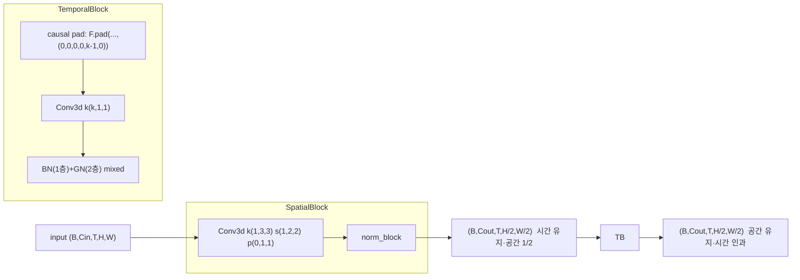
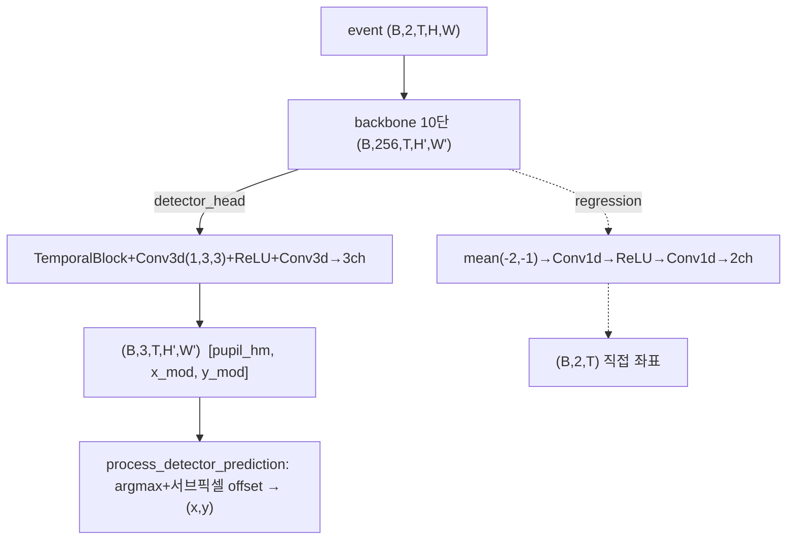
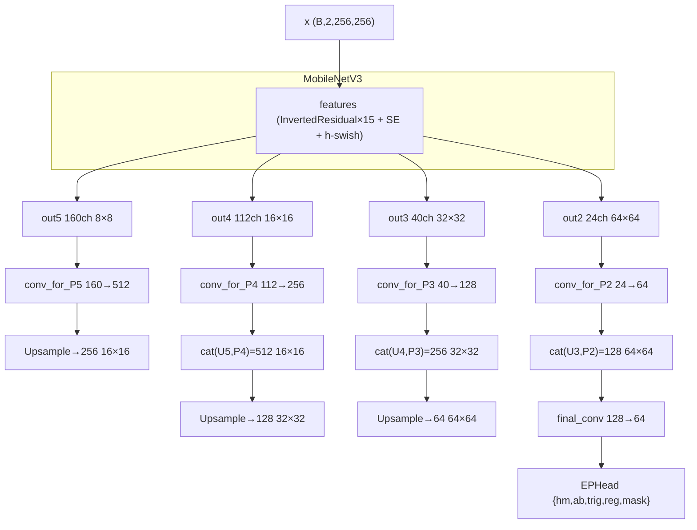

# FACET (EvEye) 모듈 통합 가이드 (S-PyTorch)

> 1차 요약: [`../FACET.md`](../FACET.md) — 본 문서는 그 요약을 모듈(클래스/함수) 단위로 심화한 S-PyTorch 변형 통합 가이드다.
> 분석 대상: `\\wsl.localhost\ubuntu-24.04\home\user\project\PRJXR-HBTXR\REF\XR-Eye-Tracking\Codebase\FACET`
> 관련 논문: [`../../Papers/FACET.md`](../../Papers/FACET.md) (FACET, IEEE ICRA 2025, DOI 10.1109/ICRA55743.2025.11127327, github.com/DeanJY/FACET)
> 작성 원칙: 실제 소스 Read 후 `파일:라인` 근거 표기. 라인 근거 없는 추론은 "추정", 코드로 확인 불가는 "확인 불가"로 명시. 정확도(P-acc/PE)는 README/논문 인용, 미실행 수치는 "확인 불가".

---

## 0. 문서 머리말

### 0.1 대표 케이스 선정 + 근거

본 repo(`EvEye` 패키지)는 **두 개의 시선추적 태스크 계보**를 한 코드베이스에 담는다. 메인 학습 스크립트가 YAML로 모델을 교체하는 factory 구조(`model_factory.py:12-31`)라 "단일 trained 본체"가 코드만으로 고정되지 않는다. 논문 본체와 코드 비중을 함께 보고 두 대표를 선정한다.

- **대표 ① 논문 본체(FACET 검출기): `EPNet.EPNet` + `CtdetLoss`(GWD)**
  - 근거: 논문 FACET.md의 모델 구조(MobileNetV3 백본 + DSC-FPN neck + 4-head)와 코드 `EPNet`이 1:1 대응(`EPNet.py:144-145, 178-196`, `EPHead.py:10-44`). 논문 Table II의 **FACET = P10 100/P5 99.98/P1 99.59/PE 0.2030px/3.92M/3.44 GFLOPs/0.5302ms**(FACET.md:47)이 EPNet 경로의 결과. 회전 타원 IoU 대용 **GWD loss**(`Loss.py:258-377`)와 **Trigonometric Loss**(`Loss.py:97-105`의 `TrigL2Loss`)가 논문 핵심 기여 L_G·L_T를 구현(FACET.md:36-38).
  - 특이점: head는 CenterNet식 heatmap+offset+size(ab)+rotation(trig)+mask 멀티헤드(`EPNet.py:34`). 5-파라미터 타원 `(x,y,a,b,θ)`을 segmentation→fitting 없이 직접 회귀.
- **대표 ② 인과 시공간 좌표 회귀기(경량 비교군): `TennSt`**
  - 근거: causal Conv3d 스트리밍 시공간 CNN(`TennSt.py:90-259`). 논문 Table II에서 **TennSt = 0.81M(최소 params)·0.3384ms(최속)이나 PE 1.1291·P1 73.67%(저정확), 타원 추적 모듈과 비호환**으로 명시(FACET.md:50). 즉 FACET 논문 내에서 **속도/경량 비교군이자 좌표(center) 회귀 baseline**. 코드 `MemmapDavisEyeCenter_TennSt.yaml`이 별도 full 학습 경로를 제공(체크포인트 파일명 `0.9689` = val_p10_acc 96.89%, `yaml:67`).
  - 특이점: causal temporal padding(`TennSt.py:238-240`) + FIFO 스트리밍(`:158-166, 251-259`)으로 프레임당 추론. **HW 저지연 이식 1순위**(9절).

> 정리: **논문 정확도 본체 = EPNet(타원·GWD·Trig)**, **저지연·경량 baseline = TennSt(인과 Conv3d)**. 본 가이드는 두 경로를 분리해 해부한다. ElNet(DLA34+DCNv2)·UNet·DeepLabV3·CitiBike-ConvLSTM은 보조/외부 계보로 제외 또는 축약(1.3절).

### 0.2 수치 표기 규약 (S-PyTorch)

- **params** = 레이어 차원에서 직접 산정. Conv2d/Conv3d 가중치 = `Cout·Cin_per_group·∏k` + (bias 시 `Cout`). depthwise = `groups=Cin`(`MobileNetV3Backbone.py:101-109`, `TennSt.py:113-127`). BN = `2·C`, GroupNorm = `2·C`. FC = `in·out+out`. **단, 논문/repo가 thop로 실측 가능(`model_factory.py:91-98`, `Predict.py:469-471`)하나 본 분석은 미실행 → 절대 params는 논문 인용**(EPNet/FACET 3.92M, TennSt 0.81M, FACET.md:48,50).
- **MACs / FLOPs** = Conv 표준식 `MAC = Hout·Wout·Cout·(Cin/groups)·∏k`. EPNet은 256×256 입력 down/4 → P2=64×64, MobileNetV3 stride 누적(`MobileNetV3Backbone.py:131-154`). TennSt는 `(B,2,T,H,W)` 5D 텐서를 Conv3d로 처리, T축이 인과 padding으로 1프레임씩 슬라이딩(`TennSt.py:238-259`). **논문 GFLOPs 인용**: FACET 3.44G(FACET.md:48), TennSt는 논문 GFLOPs 미표기(속도만) → "확인 불가".
- **activation memory** = 텐서 `shape × bit`. EPNet은 FPN concat 단계의 256×256 down 피처가 지배. TennSt는 5D `(B,C,T,H,W)` 텐서가 step마다 유지, 학습시 역전파용 전 레이어 보관(메모리 지배항). **스트리밍 추론시엔 FIFO 버퍼만**(kernel_size 깊이, `TennSt.py:160-165`) → 대폭 절감.
- **이벤트 표현** = `(t,x,y,p)` 이벤트를 `to_frame_stack_numpy`로 **2채널(ON/OFF polarity) frame-stack**으로 누적(`ToFrameStack.py:55-109`). 시간 보간 3종: nearest/bilinear(voxel grid)/**causal_linear**(미래 bin 비참조, 인과)(`:79-104`). 논문 "Fast Causal Event Volume"(FACET.md:24-26)의 코드 대응 = `causal_linear` + `cut_max_count`(누적 limit, `DavisEyeEllipseDataset.py:224-225`). voxel grid 아님(시간 bin × 2 polarity).
- **TennSt 인과 Conv3d** = SpatialBlock(커널 `(1,3,3)`, stride `(1,2,2)`, 시간 유지·공간 1/2)(`TennSt.py:101,119,132`) + TemporalBlock(커널 `(k,1,1)`, 시간축 causal `F.pad(...,(0,0,0,0,k-1,0))`)(`:184-186,238-240`)를 `temporals=[True,False]*5`로 10단 교차(`:285`).
- **CenterNet 타원** = heatmap(focal) + offset(reg) + size(ab) + rotation(trig 2채널: sin2θ/cos2θ) + mask. GT 생성은 `draw_umich_gaussian`(`utils.py:91-107`) + down_ratio=4 라벨(`DavisEyeEllipseDataset.py:252-288`). 디코딩 nms→topk(K=100)→gather→`restore_angle`(`Predict.py:103-192,236-244`).
- **GWD loss** = 회전 타원을 2D Gaussian Σ로 보고 Gaussian Wasserstein Distance를 IoU 대용 미분가능 손실로 사용(`Loss.py:258-320`의 닫힌형 `gwd_loss`, `GWDLoss.forward:327-377`). 논문 L_G(ElDet 계열, FACET.md:37).
- **정확도** = README는 데이터 준비/실행만 기술(정확도 수치 없음, README:1-82). **논문 Table II 인용**: FACET P10/P5/P1=100/99.98/99.59, PE=0.2030px(FACET.md:47); TennSt PE=1.1291·P1=73.67%(FACET.md:50). 체크포인트 파일명 val_p10_acc=0.9689(TennSt)·val_mean_distance=0.2403(EPNet)(`yaml:67`, `Predict.py:432`). **본 repo 미실행 → 학습 결과 수치는 "확인 불가", 논문값 인용**.

### 0.3 운영 경로 (학습 ↔ 체크포인트 ↔ 평가)

```
[원시: EV-Eye 이벤트 txt (t,x,y,p) + 타원 txt (t,x,a,b,θ) + 마스크 h5]   (README:30-45)
      │  (EPNet) h5→png→U-Net seg→getEllipse.ipynb→5-param 타원 라벨   (README:26-29, 반지도 150만 샘플 FACET.md:17)
      │  (TennSt) MemmapCacheStructedEvents로 memmap 사전 캐싱           (README:66-68)
      ▼
[캐시: {train,val}/cached_data, cached_ellipse|cached_label]
      │  EPNet:  load_event_segment(5000 fixed-count) → to_frame_stack(causal_linear, weight=10, cut255)
      │          → Albumentations(ShiftScaleRotate+HFlip) → CenterNet GT(down/4)          (DavisEyeEllipseDataset.py:190-318)
      │  TennSt: time_window 40000us × frames_per_segment 50, fixed_count 5000 슬라이싱
      │          → spatial downsample 0.5 + keypoint-동기 증강 + temporal_flip → (2,T,H,W) (MemmapDavisEyeCenterDataset.py:157-242)
      ▼
[학습: tools/train.py — Lightning Trainer.fit, factory+YAML]                              (train.py:31-55)
      │  EPNet:  CtdetLoss(hm focal + ab/reg smoothL1 + trig L2 + GWD iou×15 + mask BCE)  (Loss.py:402-507)
      │  TennSt: tracking_loss(heatmap focal + 서브픽셀 smoothL1) + activity L1 reg         (losses.py:99-150)
      │  공통: Adam lr=1e-3 wd=1e-5, StepLR(decay 0.7/10ep, warmup 5ep)                    (TennSt.py:389-399, EPNet.py:304-314)
      │  EPNet 70ep / TennSt 50ep, seed 42, devices=[2] 하드코딩                            (yaml, train.py:19,42)
      ▼
[검증: EPNet val=post_process→IoU/AP@0.5/p1·3·5·10/mean_distance (EPNet.py:331-370)
       TennSt val=p_acc(tol 1/3/5/10)+distance+텐서보드 프레임 시각화 (TennSt.py:421-447)]
      │  ModelCheckpoint: EPNet monitor=val_mean_distance(min), TennSt monitor=val_p10_acc(max)  (yaml:74-83)
      ▼
[추론: TennSt streaming_inference(프레임별 wall-clock) → submission.csv [row_id,x,y] (DAVIS346 역정규화) (inference.py:24-37)
       EPNet predict/predict_txt + test_inference_time(400+200 반복 평균) (Predict.py:267-417)]
```
- 체크포인트 `.ckpt`(`/mnt/data2T/...`, 외부 마운트)는 [제외].

### 0.4 모델 / 데이터셋 / 정확도 요약

| 항목 | EPNet (FACET 본체) | TennSt (경량 baseline) | 근거 |
|---|---|---|---|
| 입력 | 이벤트 frame-stack `[B,2,256,256]` | 이벤트 frame-stack `[B,2,T,H,W]` (T=50) | `EPNet.py:381`, `MemmapDavisEyeCenter_TennSt.yaml:48`, `TennSt.py:490` |
| 출력 | 타원 5-param `(x,y,a,b,θ)` + mask | 동공 `(x,y)` 정규화 `[B,2,T]`(detector heatmap+offset) | `EPNet.py:34`, `losses.py:153-186` |
| 백본 | MobileNetV3-Large (SE+h-swish) 4-feature | causal Conv3d 10단 (spatial/temporal 교차) | `MobileNetV3Backbone.py:126-175`, `TennSt.py:284-317` |
| neck | DSC-FPN (`fpn_2d` 기본, `fpn_dw` 경량) | 없음(백본→head 직결) | `EPNet.py:178-196,271-290`, `TennSt.py:371-375` |
| head | CenterNet 멀티헤드(hm/ab/trig/reg/mask) | TemporalBlock+Conv3d→3ch(heatmap,x_mod,y_mod) | `EPHead.py:10-44`, `TennSt.py:319-330` |
| Loss | `CtdetLoss`(focal+smoothL1+TrigL2+**GWD×15**+BCE) | `tracking_loss`(focal+smoothL1)+activity L1 reg | `Loss.py:402-507`, `losses.py:99-150` |
| optimizer | Adam lr=1e-3 wd=1e-5, StepLR | 동일 | `EPNet.py:304-314`, `TennSt.py:389-399` |
| epoch | 70 | 50 | `DavisEyeEllipse_EPNet.yaml:57`, `MemmapDavisEyeCenter_TennSt.yaml:58` |
| params (논문) | **3.92M** | **0.81M** | FACET.md:48,50 (repo 미실행 → 확인 불가) |
| GFLOPs (논문) | **3.44G** | 미표기 | FACET.md:48 / TennSt GFLOPs 확인 불가 |
| 지연 (논문, TensorRT) | **0.5302ms** | 0.3384ms | FACET.md:48,50 |
| 정확도 (논문) | P10/P5/P1=100/99.98/99.59, PE 0.2030px | PE 1.1291px, P1 73.67% | FACET.md:47,50 (repo 미실행 → 확인 불가) |
| 데이터셋 | 강화 EV-Eye(반지도 150만 샘플) | 강화 EV-Eye(memmap) | FACET.md:17,44, README:5-29 |

---

## 1. Repo / Layer 개요 (모델 / 데이터 / 학습 맵)

FACET = EV-Eye 기반 이벤트 시선추적 통합 프레임워크. 두 태스크(center 좌표 회귀 / ellipse 5-param 검출)를 **factory+YAML**로 교체하며 학습한다. 순수 PyTorch + Lightning + tonic(이벤트)·albumentations(증강)·timm(MobileNetV3 scheduler). EPNet head/loss는 **CenterNet 회전객체 검출(mmrotate 계열)** 아이디어를 동공 타원에 적용(추정).

### 1.1 파일 역할 맵

| 구분 | 파일 | 역할 | 메인 사용 |
|---|---|---|---|
| **메인 진입점(학습)** | `tools/train.py` | Lightning Trainer.fit, factory+YAML | ★ 실행 진입점 |
| **메인 진입점(추론)** | `tools/inference.py` | TennSt 스트리밍 → submission.csv | ★ AIS2024식 제출(추정) |
| **모델 레지스트리** | `EvEye/model/model_factory.py` | `MODEL_CLASSES` dict + `make_model` | ★ `:12-31` |
| **EPNet(FACET 본체)** | `EPNet/EPNet.py` | MobileNetV3+DSC-FPN+멀티헤드 LightningModule | ★ 논문 정확도 본체 |
| **EPNet 백본** | `EPNet/Backbone/MobileNetV3Backbone.py` | InvertedResidual+SE+h-swish, 4-feature | ★ |
| **EPNet head** | `EPNet/Head/EPHead.py` | head_dict별 3×3+ReLU+1×1 독립 헤드 | ★ |
| **EPNet loss(GWD/Trig)** | `EPNet/Loss.py` | CtdetLoss(focal/smoothL1/TrigL2/**GWD**/BCE) | ★ 논문 핵심 기여 |
| **EPNet 후처리** | `EPNet/Predict.py` | nms→topk→gather→restore_angle→타원 복원 | ★ |
| **EPNet 메트릭** | `EPNet/Metric.py` | IoU(래스터화)·AP@0.5·p_acc·mean_distance | ★ |
| **TennSt(경량 baseline)** | `DavisEyeCenter/TennSt.py` | causal Conv3d 시공간 CNN + 스트리밍 | ★ 저지연 본체 |
| **TennSt loss/metric** | `DavisEyeCenter/losses.py` | tracking/regression loss + MAC 계측 hook | ★ |
| **이벤트 표현** | `utils/tonic/functional/ToFrameStack.py` | (t,x,y,p)→2ch frame-stack(causal_linear) | ★ |
| **EPNet 데이터셋** | `dataset/DavisEyeEllipse/DavisEyeEllipseDataset.py` | fixed-count 5000+증강+CenterNet GT | ★ |
| **EPNet 데이터 유틸** | `dataset/DavisEyeEllipse/utils.py` | gaussian_radius/draw_umich_gaussian/타원 변환 | ★ |
| **TennSt 데이터셋** | `dataset/DavisEyeCenter/MemmapDavisEyeCenterDataset.py` | memmap 세그먼트+키포인트 동기 증강 | ★ |
| **설정** | `configs/*.yaml` | EPNet/TennSt 하이퍼·경로 | ★ |
| **[보조/제외]** | `ElNet/ElNet.py`(DLA34+DCNv2), `UNet`, `DeepLabV3`, `CitiBike/ConvLSTM.py`, `*.ipynb` | 외부 이식/세그/도메인 무관/시각화 | 제외(1.3절) |
| **[제외]** | `.ckpt`, `/mnt/data2T/...` 데이터, `.git/` | 체크포인트·외부 마운트·메타 | 제외 |

### 1.2 forward 진입점
- **EPNet**: `model(input)` → `EPNet.forward(x)`(`EPNet.py:216`) → `mode=="fpn_2d"` 분기(`:271-290`) → backbone 4-feature(`:272`) → top-down DSC-FPN concat(`:273-286`) → `EPHead.forward`(`:288` → `EPHead.py:40-44`) → `{hm,ab,trig,reg,mask}` dict.
- **TennSt**: `model(event)` → `TennSt.forward(input)`(`:371`) → `backbone`(Sequential 10단, `:373`) → detector면 `head`(TemporalBlock+Conv3d→3ch, `:373`) / 아니면 공간평균 후 Conv1d→2ch(`:375`). 스트리밍은 `streaming_inference`(`:338-355`)가 T축을 1프레임씩 순회.

### 1.3 제외 목록
- **외부 데이터/체크포인트**: EV-Eye 원본 txt/h5, `.ckpt`(`/mnt/data2T/...`), `.git/`.
- **외부 프레임워크 원본**: torch/lightning/tonic/albumentations/timm/thop/cv2(import만, 본 repo 소스 아님).
- **외부 이식 계보(축약/제외)**: `ElNet/ElNet.py`는 DLA34 + **DCNv2(deformable conv)**로 CenterNet 원본(xingyizhou/CenterNet) 이식 성격이 강하고 ONNX 변환 실패(DCNv2 op 미등록, `exportONNX.ipynb` cell-7) — 보조로만 언급. `UNet`/`DeepLabV3`(세그)·`CitiBike/ConvLSTM.py`(자전거 수요 도메인, eye-tracking 무관, 추정)·다수 `.ipynb`(시각화/전처리)는 제외.
- **미사용 코드 경로**: `EllipseMobileNet.py`, `Neck/FPN.py`·`Neck/SSD.py`(EPNet 본체는 neck 내장, 별도 파일은 실험적 대체, 추정), `RegL1Loss_ang`(`Loss.py:72-94`, ang_weight=0이라 비활성).

---

## 2. 모듈: TennSt 인과 시공간 블록 — `SpatialBlock` / `TemporalBlock`

### 2.1 역할 + 상위/하위
- **역할**: 이벤트 frame-stack `(B,2,T,H,W)`를 **시간 인과성을 보존**하며 시공간 특징 추출. SpatialBlock = 공간 다운샘플(시간 유지), TemporalBlock = 시간축 causal conv(공간 유지). 두 블록을 교차해 10단 백본 구성.
- **상위**: `TennSt.backbone`(nn.Sequential, `TennSt.py:287-317`)이 `temporals=[True,False]*5`로 두 블록을 번갈아 append. 그 위 `TennSt.forward`(`:371`).
- **하위**: `nn.Conv3d`(`:115,131,203,217`), `BatchNormBlock`/`GroupNormBlock`(`:41-77`), `PointWiseConv`(`:79-87`).

### 2.2 데이터플로우 (텐서 shape · 시간축)

시간축: TemporalBlock은 입력 앞쪽(과거)에만 k-1 zero pad(`:238-240`) → 출력 frame t는 `[t-k+1 … t]`만 참조(미래 비참조). 스트리밍시엔 pad 대신 FIFO 버퍼로 직전 k-1 프레임 carry(`:251-259`).

### 2.3 forward call stack
```
TennSt.forward (:371)
└─ self.backbone(input)  → nn.Sequential 10단 (:287)
   ├─ SpatialBlock.forward (:147)   → F.pad(full_conv3d시) → self.block (:151-156)
   │    └─ Conv3d (1,3,3)(1,2,2) → norm_block (:130-135)
   └─ TemporalBlock.forward (:231)  → F.pad causal (:238-240) → self.block (:245)
        └─ Conv3d (k,1,1) → BN/GN (:216-219)
   (스트리밍: SpatialBlock._streaming_forward :158 / TemporalBlock._streaming_forward :251)
```

### 2.4 대표 코드 위치
`TennSt.py:90-166`(SpatialBlock), `:169-259`(TemporalBlock), `:52-63`(CausalGroupNormBlock), `:284-317`(backbone 조립).

### 2.5 대표 코드 블록

**(a) SpatialBlock — 공간만 다운샘플 (`TennSt.py:130-135`)**
```python
self.block = nn.Sequential(
    nn.Conv3d(in_channels, out_channels, kernel, (1, 2, 2), (0, 1, 1), bias=False),  # k=(1,3,3), s=(1,2,2)
    norm_block(out_channels),
)
```
→ stride `(1,2,2)`: 시간축 T 보존, 공간 H·W만 1/2. depthwise면 `groups=in_channels` dw + `PointWiseConv` pw로 분리(`:113-127`).

**(b) TemporalBlock — causal padding (`TennSt.py:184-186, 238-240`)**
```python
kernel = (kernel_size, 3, 3) if full_conv3d else (kernel_size, 1, 1)  # 기본 (k,1,1): 시간축만
...
input = F.pad(input, (0, 0, 0, 0, self.kernel_size - 1, 0))  # 시간축 앞(과거)에만 k-1 pad → 인과
return self.block(input)
```
→ 미래 프레임 비참조. 논문 "실시간 인과성"(FACET.md:24)의 시계열 대응. **HW 저지연 핵심**(라인버퍼/시프트레지스터 1:1 매핑).

**(c) CausalGroupNorm — 시간통계 미사용 (`TennSt.py:58-63`)**
```python
x = input.moveaxis(1, 2)              # (B,T,C,H,W)
x = x.flatten(0, 1)                   # (B*T,C,H,W)  ← 프레임별 독립 정규화
x = super().forward(x).reshape(x_shape)
return x.moveaxis(1, 2)              # (B,C,T,H,W)
```
→ GroupNorm을 (B·T) 배치로 평탄화해 **프레임 간 통계 누설 차단**(인과성 유지). norms="mixed"면 TemporalBlock은 BN(1층)+GN(2층)(`:191-193`).

### 2.6 연산 분해 + 정량 (TennSt, channels=[2,8,16,32,48,64,80,96,112,128,256], k=5)
- **백본 10단 구성**(`:284-285`): temporals=[T,F]×5 → 홀수단 Temporal, 짝수단 Spatial. depthwises=[F]×6+[T]×4 → 마지막 4단만 depthwise(`:284`). 채널 2→8→…→256.
- **공간 다운샘플**: Spatial 5회 stride(1,2,2) → H,W 1/2^5. 입력 예 `(1,2,50,130,176)`(`model_factory.py:71`) → 백본 출력 공간 ≈ 130/32×176/32 ≈ 4×5(floor). 시간 T=50 유지.
- **Conv3d MAC**(1단, dense): `T·Hout·Wout·Cout·(Cin/g)·∏k`. Temporal k=(5,1,1), Spatial k=(1,3,3). depthwise단은 `Cin/g=1`이라 pw conv가 채널혼합 비용 담당.
- **params/FLOPs**: 논문 **TennSt 0.81M params·0.3384ms**(FACET.md:50, 최소·최속). GFLOPs는 논문 미표기 → "확인 불가". repo thop 측정 가능(`model_factory.py:91-98`)하나 미실행 → "확인 불가".
- **activation memory**: 학습은 5D `(B,C,T,H,W)` 전 레이어 보관(메모리 지배). L1 출력 `(32,8,50,65,88)` fp32 ≈ 32·8·50·65·88·4B ≈ 296MB(B=32). **스트리밍 추론은 블록당 FIFO `(B,C,k,H,W)`만**(`:160-161`) → T=50→k=5로 10× 절감.
- **activity regularization**: `RegularizationLoss`(`losses.py:59-81`)가 ReLU 출력에 L1 패널티(activation 희소화) — `activity_regularization` 인자(`TennSt.py:273`), 기본 0(`yaml:55`)이라 비활성. >0이면 sparsity 유도 → MAC 절감 근거(`MacsEstimationHook` sparsity-aware MAC, `losses.py:40-42`).

---

## 3. 모듈: TennSt 컨테이너 + 스트리밍 — `TennSt`

### 3.1 역할 + 상위/하위
- **역할**: backbone(10단)+head를 묶은 LightningModule. detector_head면 heatmap 3채널(pupil + x_mod + y_mod), 아니면 공간평균+Conv1d 2채널 직접 회귀. `streaming()`/`reset_memory()`로 전 서브모듈을 스트리밍 토글, `streaming_inference`로 프레임별 추론 + wall-clock 계측.
- **상위**: `train.py`(`:37,50`)·`inference.py`(`:26`)·`TennSt.training_step/validation_step`(`:401-447`). **하위**: SpatialBlock/TemporalBlock(2절), `process_detector_prediction`(`losses.py:153`).

### 3.2 데이터플로우


### 3.3 forward call stack
```
streaming_inference (:338)
├─ model.eval(); model.streaming(); model.reset_memory() (:340-342)
└─ for frame_id in range(T): (:347)
     ├─ start=time.time() (:348)
     ├─ model(frames[:,:,[frame_id]])  → forward (:349 → :371)
     │    └─ backbone (FIFO carry) → head
     └─ inference_times.append(end-start) (:351)
   → cat over T (:354), return (predictions, inference_times)
```

### 3.4 대표 코드 위치
`TennSt.py:319-336`(head 구성), `:338-369`(스트리밍 인프라), `:371-375`(forward), `:401-447`(train/val step).

### 3.5 대표 코드 블록

**(a) detector head — 3채널 출력 (`TennSt.py:319-330`)**
```python
if detector_head:
    self.head = nn.Sequential(
        TemporalBlock(channels[-1], channels[-1], t_kernel_size, depthwise=detector_depthwise),
        nn.Conv3d(channels[-1], channels[-1], (1, 3, 3), (1, 1, 1), (0, 1, 1)),
        ActivateLayer(),
        nn.Conv3d(channels[-1], 3, 1),   # [pupil_heatmap, x_mod, y_mod]
    )
```
→ heatmap 위치 argmax + 서브픽셀 offset으로 좌표 디코딩(`losses.py:168-184`). 논문 CenterNet식 heatmap 회귀의 center 버전.

**(b) 스트리밍 토글 + 프레임별 계측 (`TennSt.py:347-352`)**
```python
for frame_id in range(frames.shape[2]):   # T축 1프레임씩
    start_time = time.time()
    prediction = model(frames[:, :, [frame_id]])   # (B,2,1,H,W)
    end_time = time.time()
    inference_times.append(end_time - start_time)
```
→ 스트리밍시 FIFO가 직전 k-1 프레임을 보관(`:251-259`)해 단일 프레임 입력으로 시간 conv 완성. **저지연 on-device 추론의 직접 증거**.

### 3.6 연산 분해 + 정량
- 컨테이너 자체 params는 head에 집중(backbone은 2절). detector head = TemporalBlock + Conv3d(256→256,(1,3,3)) + Conv3d(256→3,1).
- **스트리밍의 직렬성**: T축 순회(`:347`)는 step간 FIFO 상태 의존이나, SpatialBlock은 프레임 독립·TemporalBlock만 k-깊이 의존 → **causal Conv = 시프트레지스터 데이터플로**로 병렬 파이프라인화 가능(8절). T=40 직렬 ConvLSTM(cb-convlstm 동형 가이드 3.6절) 대비 **HW 친화도 우위**(추정).
- **추론 메모리**: FIFO 합 ≈ Σ블록 `(B,C,k,H,W)`. T 전체 보관 대비 k/T 배 절감(`:160-165`).

---

## 4. 모듈: EPNet 본체 — MobileNetV3 백본 + DSC-FPN neck

### 4.1 역할 + 상위/하위
- **역할**: 이벤트 frame-stack `(B,2,256,256)` → MobileNetV3 4-feature → DSC-FPN top-down 결합 → 64ch P2 → 멀티헤드. 논문 FACET 검출기 본체.
- **상위**: `EPNet.training_step/validation_step`(`:316-370`), `train.py`. **하위**: `MobileNetV3Backbone`(`:144`), neck conv(`:178-196`), `EPHead`(`:145`).

### 4.2 데이터플로우 (fpn_2d 기본, `yaml:45`)

> 주: out2~out5 채널 [24,40,112,160](`MobileNetV3Backbone.py:129`)이 cfgs stride 누적(`:131-154`)으로 입력 256→128(첫 conv s2)→…→8 다운샘플. P2=64×64 = down_ratio 4(데이터셋 GT와 일치, `DavisEyeEllipseDataset.py:252`).

### 4.3 forward call stack
```
EPNet.forward (:216) [mode=="fpn_2d"] (:271)
├─ out2,out3,out4,out5 = self.backbone(x)  (:272 → MobileNetV3Backbone.forward :170-175)
├─ P5 = conv_for_P5(out5); P5_up = upsample5(P5) (:273-274)
├─ P4 = cat(P5_up, conv_for_P4(out4)); P4_up = upsample4(P4) (:276-278)
├─ P3 = cat(P4_up, conv_for_P3(out3)); P3_up = upsample3(P3) (:280-282)
├─ P2 = final_conv(cat(P3_up, conv_for_P2(out2))) (:284-286)
└─ output = self.head(P2) (:288 → EPHead.forward :40-44)
```

### 4.4 대표 코드 위치
`MobileNetV3Backbone.py:67-123`(InvertedResidual), `:126-175`(백본), `EPNet.py:178-196`(fpn 구성), `:271-290`(fpn forward), `:61-69`(conv_dw).

### 4.5 대표 코드 블록

**(a) InvertedResidual + SE + h-swish (`MobileNetV3Backbone.py:95-117`)**
```python
self.conv = nn.Sequential(
    nn.Conv2d(inp, hidden_dim, 1, 1, 0, bias=False), nn.BatchNorm2d(hidden_dim),  # pw expand
    h_swish() if use_hs else nn.ReLU(inplace=True),
    nn.Conv2d(hidden_dim, hidden_dim, kernel_size, stride, (kernel_size-1)//2, groups=hidden_dim, bias=False),  # dw
    nn.BatchNorm2d(hidden_dim),
    SELayer(hidden_dim) if use_se else nn.Identity(),                              # Squeeze-Excite
    h_swish() if use_hs else nn.ReLU(inplace=True),
    nn.Conv2d(hidden_dim, oup, 1, 1, 0, bias=False), nn.BatchNorm2d(oup),          # pw-linear
)
```
→ SE(`:37-52`, global avgpool→FC→h-sigmoid)·h-swish(`:28-35`)는 정확도↑이나 **dataflow 파이프라인 병목**(global pool, 9절). FPGA용 INT8 시 h-swish→ReLU 치환·SE 제거 변형 검토.

**(b) DSC-FPN — 일반 conv를 depthwise separable로 (`EPNet.py:188-196`, `fpn_dw`)**
```python
self.conv_for_P5 = conv_dw(160, 512)   # conv_dw = dw(3×3,groups=in) + pw(1×1)  (:61-69)
self.upsample5   = Upsample_dw(512, 256)
...
self.final_conv  = conv_dw(128, 64)
```
→ 논문 "FPN의 일반 conv를 모두 DSC로 교체, O(HWC²)→O(HWC+C²)"(FACET.md:30)의 코드 대응. `fpn_2d`(기본)는 일반 conv2d(`:178-186`), `fpn_dw`는 경량판. 두 mode 모두 top-down 구조 동일.

### 4.6 연산 분해 + 정량
- **params(논문)**: FACET 전체 **3.92M**(FACET.md:48). MobileNetV3-Large 백본이 대부분, DSC-FPN+head는 소규모. repo 미실행 → 절대 산정 "확인 불가", 논문 인용.
- **GFLOPs(논문)**: **3.44G** @ 256×256(FACET.md:48). EV-Eye(40.11G) 대비 11.7× 경량(FACET.md:48).
- **activation memory**: FPN concat 단계 64×64 피처(P2~P3)와 백본 초기 128×128 피처가 지배. SE의 global avgpool은 (B,C,1,1)로 작음.
- **fpn_2d vs fpn_dw**: DSC 교체로 conv FLOPs 대폭 절감(논문 O 표기, FACET.md:30). 정확도 차는 체크포인트 파일명 비교(fpn_2d 0.2403 vs fpn_dw 0.2031/0.2249, `Predict.py:432,452`, `model_factory.py:89`)로 추정 가능하나 척도·조건 상이 → "확인 불가".

---

## 5. 모듈: EPNet head + 후처리 — `EPHead` / `post_process`

### 5.1 역할 + 상위/하위
- **역할**: P2(64ch,64×64)에서 head_dict별 독립 헤드로 `{hm,ab,trig,reg,mask}` 산출(`EPHead`), 추론시 nms→topk→gather→타원 5-param 복원(`post_process`/`get_ellipse`).
- **상위**: `EPNet.forward`(`:288`), `EPNet.validation_step`(`:337`). **하위**: Conv2d, `restore_angle`(`Predict.py:236`), `transform_ellipse`(`:218`).

### 5.2 head 종류 (`EPNet.py:34`, `EPHead.py:7`)
| key | ch | 의미 | 논문 대응 |
|---|---|---|---|
| hm | 1 | 동공 중심 heatmap | Heatmap Head (FACET.md:32) |
| ab | 2 | 장/단축 (a,b) | Size Head (FACET.md:32) |
| trig | 2 | (sin2θ, cos2θ) 회전 | Rotation Head (FACET.md:33) |
| reg | 2 | 서브픽셀 offset | Offset Head (FACET.md:32) |
| mask | 1 | 동공 세그 (64×64) | (보조 BCE) |

### 5.3 forward call stack (디코딩)
```
post_process (Predict.py:141)
├─ hm = pred["hm"].sigmoid() (:143)
├─ hm = nms(hm, kernel=3)  → maxpool 후 peak만 유지 (:150 → :103-111)
├─ scores,inds,clses,ys,xs = topk(hm, K=100) (:151 → :114-138)
├─ reg gather → xs,ys += offset (:156-161)
├─ ab gather (:163-165)
├─ trig gather → ang = restore_angle(trig) = atan2(sin2A,cos2A)/2 (:172-176, :236-244)
└─ ellipse = cat([xs,ys,ab,ang]) (:178)
get_ellipse (:247) → score_threshold 컷 → transform_ellipse(64×64→260×346) (:262 → :218-233)
```

### 5.4 대표 코드 블록

**(a) head heatmap bias 초기화 (`EPHead.py:34-37`)**
```python
if head == "hm":
    fc[-1].bias.data.fill_(-2.19)   # CenterNet focal 안정화(sigmoid 후 낮은 prior)
else:
    fill_fc_weights(fc)             # bias=0
```

**(b) 회전 각도 trig 표현 + 복원 (`DavisEyeEllipseDataset.py:141-146`, `Predict.py:236-244`)**
```python
# GT 생성: cal_trig
sin2A = np.sin(2*ang); cos2A = np.cos(2*ang)   # 각도 불연속 회피
# 복원: restore_angle
doubleA_rad = torch.atan2(sin2A, cos2A); A_rad = doubleA_rad / 2; A_degree = rad2deg(A_rad)
```
→ 논문 Trigonometric Loss(L_T)의 표현(FACET.md:38): 179°≈1°(같은 타원)을 연속 2D로 매핑해 불연속 해소.

### 5.5 연산 분해 + 정량
- head params: 키 5개 × (3×3 conv 64→256 + 1×1 conv 256→classes). 3×3: `64·256·9+256`=147,712/head; 1×1: `256·classes+classes`. 5 head 합 ≈ 5×147,712 + (1×1 합) ≈ 0.74M+α. **논문 전체 3.92M에 포함**(독립 산정 "추정", 미실행 → 절대치 확인 불가).
- post_process: K=100 topk이나 동공 1개라 `[:,0]`만 사용(`Predict.py:153-154`). **K=1 단순화 가능**(9절 FPGA 후처리 경량화).

---

## 6. 모듈: EPNet loss — `CtdetLoss` (focal + smoothL1 + TrigL2 + GWD + BCE)

### 6.1 역할 + 상위/하위
- **역할**: 7개 손실 가중합. `close==0`(눈 뜬 프레임)만 마스킹해 계산(`Loss.py:435-485`). GWD loss(iou_weight=15)가 최대 가중(`yaml:53`).
- **상위**: `EPNet.criterion`(`EPNet.py:143`), `training_step`(`:319`). **하위**: FocalLoss/RegL1Loss/TrigL2Loss/GWDLoss/MaskLoss.

### 6.2 손실 구성 (`Loss.py:402-413`, `EPNet.py:24-32`)
| 손실 | 클래스:라인 | 식 | weight |
|---|---|---|---|
| hm | `FocalLoss` `:32-40` (`_neg_loss` `:9-29`) | Modified Focal(neg_weight=(1-gt)^4) | 1 |
| ab | `RegL1Loss` `:61-69` | smooth_l1(gather-by-ind) | 0.1 |
| trig | `TrigL2Loss` `:97-105` | MSE | 1 |
| reg | `RegL1Loss` `:61-69` | smooth_l1 | 0.1 |
| iou | `GWDLoss` `:323-377` | **Gaussian Wasserstein Distance** | **15** |
| mask | `MaskLoss` `:380-386` | BCEWithLogits | 1 |
| ang | `RegL1Loss_ang` `:72-94` | (비활성, weight=0) | 0 |

### 6.3 GWD loss 정밀 해부 (`Loss.py:258-377`)

**(a) 타원→2D Gaussian 공분산 (닫힌형, `gwd_loss:284-301`)**
```python
xy_p, R_p, S_p = xywhr2xyrs(pred)         # (cx,cy), 회전행렬 R, 스케일 S=0.5·diag(w,h)  (:246-255)
Sigma_p = R_p.matmul(S_p.square()).matmul(R_p.permute(0,2,1))   # Σ = R S² Rᵀ  (:289)
xy_distance  = (xy_p - xy_t).square().sum(-1)                   # 중심 거리²
whr_distance = Sp.diag².sum + St.diag².sum                      # Tr(Σp)+Tr(Σt) 대응 (:292-293)
_t_tr        = (Σp·Σt).diagonal().sum(-1)                       # Tr(Σp·Σt)         (:296)
_t_det_sqrt  = Sp.diag.prod · St.diag.prod                      # sqrt(det(Σp·Σt))   (:297-298)
whr_distance = whr_distance - 2·sqrt(_t_tr + 2·_t_det_sqrt)     # 결합항 닫힌형      (:299)
distance = (xy_distance + α²·whr_distance).clamp(0)             # GWD²              (:301)
```
→ 주석(`:259-282`)에 `Tr(Z^(1/2)) = sqrt(Tr(Z)+2·sqrt(det(Z)))` 고유값 유도 포함. 회전 타원의 미분가능 IoU 대용. 논문 L_G(ElDet Gaussian IoU, FACET.md:37).

**(b) log 비선형 + tau 매핑 (`gwd_loss:310-318`)**
```python
if fun == "log": distance = torch.log1p(distance)
if tau >= 1.0:   return 1 - 1/(tau + distance)   # [0,1) 정규화 손실
```

**(c) GWDLoss.forward — 입력 구성 (`Loss.py:327-377`)**
```python
pred_ab  = _transpose_and_gather_feat(pred_tensor["ab"], ind)        # GT 위치에서 ab gather (:330)
pred_trig= _transpose_and_gather_feat(pred_tensor["trig"], ind)      # trig → atan2 → 각도(deg) (:335-340)
from predict import _topk                                            # ★ 함수 내부 import (:343)
_, inds, _, x, y = _topk(pred_tensor["hm"]); K=100                   # heatmap에서 중심 (:346)
pred   = cat([pred_xy·mask, pred_ab·2·mask, (pred_ang-90)·mask])     # (x,y,w,h,θ) 5-param (:348-351)
return sum(gwd_loss(pred, target, "log", tau=1, α=1)) / (mask.sum()+1e-8)  (:375-377)
```

> **코드 스멜/주의 (확인 불가)**: `from predict import _topk`(`:343`)는 모듈명이 `Predict`(대문자)·함수명이 `topk`(`Predict.py:114`, 언더스코어 없음)와 **불일치** → `iou_weight>0`(기본 15) 경로 실행 시 ImportError 위험. 별도 소문자 `predict.py`/`_topk` 존재 여부는 본 분석에서 미확인(grep 미수행). 또한 `sqrt_newton_schulz_autograd`/`gwds_loss`/`WeightLoss`가 `.cuda()` 하드코딩(`:116-124,227-238,396`) → CPU/다중디바이스 비호환. 단 실제 학습 경로는 닫힌형 `gwd_loss`(`:258-320`, `.cuda()` 없음)를 GWDLoss가 호출(`:376`)하므로 newton-schulz 경로(`:112-147`)는 미사용(dead code, 추정).

### 6.4 연산 분해 + 정량
- GWD는 학습 전용(추론 비용 무관). gather K=100이나 reg_mask로 유효 객체(동공 1)만 기여(`:329`). 미분가능 닫힌형이라 행렬 sqrt 반복(newton-schulz) 불요 → 경량.
- 손실 가중 iou=15가 최대(`yaml:53`): 타원 형상 정합을 강조. 논문 Ablation은 Trig vs Angle loss만 비교(P1 99.59 vs 98.90, FACET.md:54), GWD 단독 ablation은 "확인 불가".

---

## 7. 모듈: 데이터 파이프라인 + 이벤트 표현

### 7.1 이벤트 표현 — `to_frame_stack_numpy` (`ToFrameStack.py:55-109`)

**(a) 2-polarity frame-stack (`:67,98-104`)**
```python
frame_stack = np.zeros((n_time_bins, 2, sensor_size[1], sensor_size[0]), float)  # (T,2,H,W)
# causal_linear: 미래 bin 비참조
mask = (t_now >= 0) & (t_now < n_time_bins)
np.add.at(frame_stack, (t_now[mask], ps[mask], ys[mask], xs[mask]), weight_t_next[mask]*weight)
```
→ ON/OFF polarity 2채널 분리 누적. 시간 정규화는 `normalize`(`:4-23`)로 `[start,end]`→`[0,T]`. **voxel grid 아님**(시간 bin×polarity). 보간 3종: nearest(`:79-82`)/bilinear(`:84-96`, voxel식 시간 선형분배)/causal_linear(`:98-104`, 인과).
- 논문 "Fast Causal Event Volume"(FACET.md:24-26): causal_linear + 누적 limit. 코드 limit = `cut_max_count(...,255)`(`DavisEyeEllipseDataset.py:224-225`) + weight=10(`:208`). 커널 `k(τ)=H(τ)max(1-|τ|,0)`(FACET.md:26)의 코드 대응 = `weight_t_next` 선형 가중(`:104`).

### 7.2 EPNet 데이터셋 — `DavisEyeEllipseDataset` (`DavisEyeEllipseDataset.py:190-320`)

- **fixed-count 5000**: `load_event_segment(..., 5000)`(`:193`) — 고정 이벤트 수 binning(논문 FACET.md:23). close 플래그: 타원 면적<pupil_area(200)면 1(깜빡임, `:236-243`).
- **GT 생성 핵심 (`:277-288`)**: `gaussian_radius`(`utils.py:132-149`)로 반경 → `draw_umich_gaussian`(`utils.py:91-107`) heatmap; `ab[0]=(a,b)`; `ang[0]=an+90`; `trig[0]=cal_trig(an+90)`; `ind[0]=cy·W+cx`; `reg[0]=center-center_int`; mask=cv2.ellipse.

### 7.3 TennSt 데이터셋 — `MemmapDavisEyeCenterDataset` (`MemmapDavisEyeCenterDataset.py:157-242`)
- 세그먼트 = `frames_per_segment=50` × `time_window=40000us`(`yaml:9-10`). fixed_count(5000)면 프레임마다 타임스탬프+카운트 동시 슬라이싱(`slice_events_by_timestamp_and_count` `:202-204`).
- spatial downsample 0.5(`:175-183`), **키포인트 동기 증강**(`DataAugmentation` `:28-100`, ReplayCompose로 frame·label 좌표 동시 변환), temporal_flip(시간 뒤집기, `:143-152`).
- 출력: `event_frames (2,T,H,W)` + `labels (2,T)` 정규화 좌표(`:228-239`) + `closes`=1-close=openness(`:240`).

### 7.4 연산 분해 + 정량
- params 없음(전처리). EPNet 입력 `(2,256,256)` fp32 = 2·256·256·4B = 512KB/샘플, batch 2(`yaml:14`) = 1MB. TennSt `(2,50,H,W)` × batch 32(`yaml:18`).
- 라벨 down_ratio 4 → 출력 64×64(`DavisEyeEllipseDataset.py:252-254`), GT max_objs=100이나 동공 1개만 채움(`:281-288`).

---

## 8. 모듈 한눈표

| # | 모듈 | 파일:라인 | 역할 | 대표 정량 |
|---|---|---|---|---|
| 2 | SpatialBlock/TemporalBlock | TennSt.py:90-259 | causal Conv3d 시공간 블록(spatial 1/2·temporal 인과) | TennSt 0.81M params(논문) |
| 3 | TennSt 컨테이너+스트리밍 | TennSt.py:262-447 | backbone 10단+head, FIFO 프레임별 추론 | 0.3384ms(논문, 최속) |
| 4 | MobileNetV3 백본+DSC-FPN | MobileNetV3Backbone.py:126-175, EPNet.py:178-290 | 4-feature + top-down FPN | EPNet 3.92M/3.44G(논문) |
| 5 | EPHead+post_process | EPHead.py:10-44, Predict.py:141-264 | CenterNet 멀티헤드+nms/topk/타원복원 | head 5키, K=100(동공 1) |
| 6 | CtdetLoss(GWD/Trig) | Loss.py:402-507, 258-377 | focal+smoothL1+TrigL2+**GWD×15**+BCE | iou_weight=15 |
| 7.1 | ToFrameStack | ToFrameStack.py:55-109 | (t,x,y,p)→2ch frame-stack(causal_linear) | 512KB/EPNet 샘플 |
| 7.2 | DavisEyeEllipseDataset | DavisEyeEllipseDataset.py:190-320 | fixed-count 5000+증강+CenterNet GT | down_ratio 4, close@area<200 |
| 7.3 | MemmapDavisEyeCenterDataset | MemmapDavisEyeCenterDataset.py:157-242 | memmap 세그먼트+키포인트 동기 증강 | 50프레임×40000us |

---

## 9. 학습 · 평가 파이프라인 + 재현 명령

### 9.1 학습 루프 (`train.py:31-55`)
- Lightning `Trainer.fit`, factory+YAML. `seed_everything(42)`, `set_start_method("spawn")`, `float32_matmul_precision("medium")`(`:19-21`). **`devices=[2]` 하드코딩**(`:42`).
- 손실: EPNet `CtdetLoss`(`EPNet.py:319`), TennSt `Losses`(tracking_loss+activity reg, `TennSt.py:405`). optimizer 둘 다 Adam lr=1e-3 wd=1e-5 + StepLR(`:389-399`, `:304-314`). epoch EPNet 70 / TennSt 50.
- 체크포인트: EPNet monitor=`val_mean_distance`(min, `EPNet.yaml:75-82`), TennSt monitor=`val_p10_acc`(max, `TennSt.yaml:75-83`).

### 9.2 평가 메트릭
- **TennSt** (`losses.py:189-218`): `p_acc(tolerance=1/3/5/10)` 픽셀 정확도 + noblink 정확도 + mean_distance. val은 64×64 해상도(`TennSt.py:426-431`). `distances = ||center - pred||`, `(distances < tol).sum()/numel`(`:206-210`).
- **EPNet** (`Metric.py`, `EPNet.py:339-351`): `cal_iou`(두 타원 64×64 래스터화 후 inter/union, `:51-67`), `cal_batch_ap`(IoU>0.5·score>0.5 → precision-recall AP, `:102-160`), `p_acc`(1/3/5/10), `cal_mean_distance`. NaN 방어(`EPNet.py:353-354`).
- **논문 인용**(repo 미실행 → 절대 수치 확인 불가): FACET P10/P5/P1=100/99.98/99.59, PE=0.2030px(FACET.md:47); TennSt PE=1.1291·P1=73.67%(FACET.md:50).

### 9.3 재현 명령 (README:74-82)
```bash
# 1. EV-Eye 원본 다운로드(Baidu/Onedrive, README:5-9) → h5_to_png.py → RGBUNet seg 학습
#    → getEllipse.ipynb로 5-param 타원 라벨 생성 (README:26-29)
# 2. (선택) MemmapCacheStructedEvents.ipynb로 memmap 캐싱 (README:66-68)
# 학습
python tools/train.py --config configs/DavisEyeEllipse_EPNet.yaml          # EPNet(FACET)
python tools/train.py --config configs/MemmapDavisEyeCenter_TennSt.yaml    # TennSt
# 검증
python tools/validate.py --config configs/DavisEyeEllipse_EPNet.yaml
# 추론/제출(TennSt)
python tools/inference.py    # streaming_inference → submission.csv [row_id,x,y]
```
- 클라우드: `main.py`(SageMaker `ml.g5.8xlarge`, torch 2.2.0), S3 채널 분기(`train.py:24-30`).

---

## 10. 우리 프로젝트(XR + FPGA 저지연) 시사점 + HW 이식성

### 10.1 TennSt = FPGA 이식 1순위 (확인됨/추정)
- causal Conv3d(`TennSt.py:238-240`) + 프레임별 FIFO 스트리밍(`:251-259`)은 **라인버퍼/시프트레지스터 RTL·HLS dataflow와 1:1 매핑**. 시간 인과성 보장 → 미래 프레임 버퍼링 불요 → 지연 최소(직접 증거). cb-convlstm의 ConvLSTM 시간 재귀(step간 h,c 의존, 동형 가이드 3.6절) 대비 **병렬 파이프라인화 우위**: SpatialBlock은 프레임 독립, TemporalBlock만 k-깊이 의존(추정).
- 입력 2-polarity frame-stack(`ToFrameStack.py`) → 이벤트 누적기를 FPGA 프런트엔드 IP로(논문 Fast Causal Event Volume의 limit = 포화 가산기, FACET.md:62, 추정). 연산이 Conv3d/Conv1d+BN/GN+ReLU로 단순 → HLS 친화(anthropic-skills algo2fpga 검토 권장).
- 논문: TennSt 0.81M·0.3384ms(최소·최속, FACET.md:50). **단 PE 1.1291px·P1 73.67%로 정확도 낮음** → 좌표 baseline·속도 비교군. XR 1차 타깃·reference point로 적합하나 정확도 보강 필요.

### 10.2 EPNet = 정확도 본체이나 가속 난이도 (추정)
- 논문 본체(P10 100·PE 0.2030px·3.92M·3.44G·0.5302ms, FACET.md:47-48). 단일 프레임 검출기(시간모듈 없음, FACET.md:58) → detection-tracking schema의 검출 단계.
- **가속 병목**: MobileNetV3 SE-block(global avgpool→FC, `MobileNetV3Backbone.py:37-52`)·h-swish·FPN concat이 dataflow 파이프라인화 시 stall 유발(추정). 완화책: `fpn_dw` mode(`EPNet.py:188-196`, DSC 경량) + SE 제거 + h-swish→ReLU 치환. CenterNet decode(nms maxpool + topk K=100)는 호스트 후처리 분리 또는 **K=1(동공 1개) 단순화**(`Predict.py:153-154`)로 FPGA 후처리 경량화.
- DSC-FPN(논문 O(HWC²)→O(HWC+C²), FACET.md:30)은 MAC↓·채널분리 PE 매핑 용이 → INT8 양자화 시 검증된 MobileNet 계보로 가속기 후보 백본 유력(추정).

### 10.3 경량화·양자화 (현 repo 미제공, 확인됨 부재)
- 본 repo는 FP32 학습만, **양자화(PTQ/QAT) 코드 부재**(grep상 미발견, FACET.md:58 논문도 미수행). ONNX export는 TennSt만 정상(`exportONNX.ipynb`), ElNet은 DCNv2 op 미등록으로 실패. → 배포 경로: TennSt ONNX → (Vitis AI/FINN/자체 HLS)가 현실적(추정).
- `MacsEstimationHook`의 sparsity-aware MAC(`losses.py:40-42`) + `RegularizationLoss`(ReLU activity L1, `:59-81`)를 활용하면 **희소성 기반 PE 게이팅** 설계 근거로 재활용 가능(activity_regularization 기본 0 → 재활성 필요, `yaml:55`).

### 10.4 이벤트 표현·후처리 가속 자산
- `causal_linear` 누적(`ToFrameStack.py:98-104`)은 단순 가산 → FPGA 이벤트 누적기 IP로 직접 구현. limit(`cut_max_count` 255)은 포화 가산기로(추정). fixed-count binning(`DavisEyeEllipseDataset.py:193`)은 입력 크기 고정 → FPGA 버퍼/파이프라인 결정적(deterministic) 설계·저지연 보장에 유리(논문 FACET.md:63, 추정).
- Trigonometric Loss(`Loss.py:97-105`)·GWD loss(`:258-377`)는 학습 단계 기법이라 HW 비용 무관 → 그대로 채택 가능(FACET.md:65).

### 10.5 벤치마크 정합 (추정)
- 동일 EV-Eye 데이터셋·메트릭(P-acc/PE/IoU/AP)으로 **EPNet(정확도 상한) vs TennSt(속도·경량 하한)** 공정 비교 가능(논문 Table II 동일 구도, FACET.md:46-50). FPGA 1차 타깃 = TennSt(저지연), 정확도 상한 비교군 = EPNet. cb-convlstm ConvLSTM/GG-SSM/Mamba와도 동일 입력으로 정확도-지연-리소스 곡선 작성 권장.

---

## 11. 근거 표기 정리
- **확인됨(코드 라인)**: factory+YAML 모델 교체(`model_factory.py:12-31`); TennSt causal Conv3d + FIFO 스트리밍(`TennSt.py:238-259,338-369`); EPNet fpn_2d 기본·DSC-FPN top-down(`EPNet.py:178-290`, `yaml:45`); CenterNet 멀티헤드 5키(`EPHead.py:7`); GWD 닫힌형 IoU 손실(`Loss.py:258-320`); trig 각도 표현/복원(`DavisEyeEllipseDataset.py:141-146`, `Predict.py:236-244`); 2ch frame-stack causal_linear(`ToFrameStack.py:98-104`); 양자화/FPGA 코드 부재; `devices=[2]`·`.cuda()` 하드코딩.
- **추정(라인 근거 없는 해석)**: CitiBike-ConvLSTM은 eye-tracking 무관 잔재; Neck/FPN.py·SSD.py 실험적 대체; SE/h-swish/FPN concat HW 병목; TennSt causal conv 병렬화 우위; HW 누적기·양자화·K=1 후처리 전략.
- **확인 불가(미실행/부재)**: 실제 학습 정확도·params·GFLOPs(thop 미실행, 논문값만); GWDLoss `from predict import _topk`(`:343`) 모듈명 불일치 정상동작 여부(별도 predict.py grep 미수행); newton-schulz GWD 경로 사용 여부(닫힌형 호출로 dead code 추정); fpn_2d vs fpn_dw 정확도 차 절대치; "FACET"·"TennSt" 명칭의 코드 내 정의(repo 내 문자열 미발견 → 논문/구조 추정).
- **인용(논문 FACET.md, ICRA 2025)**: EPNet/FACET P10 100·P5 99.98·P1 99.59·PE 0.2030px·3.92M·3.44G·0.5302ms; TennSt 0.81M·0.3384ms·PE 1.1291·P1 73.67%; EV-Eye 4.4× params·11.7× ops 대비; 반지도 150만 샘플; Fast Causal Event Volume·Fixed-count·Trigonometric Loss·Gaussian IoU(GWD) 기여.
