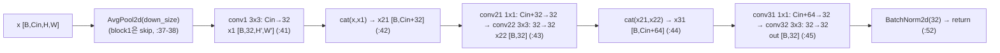
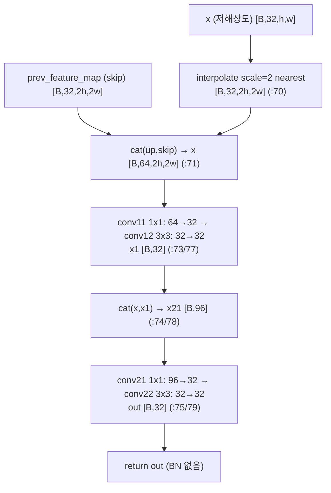
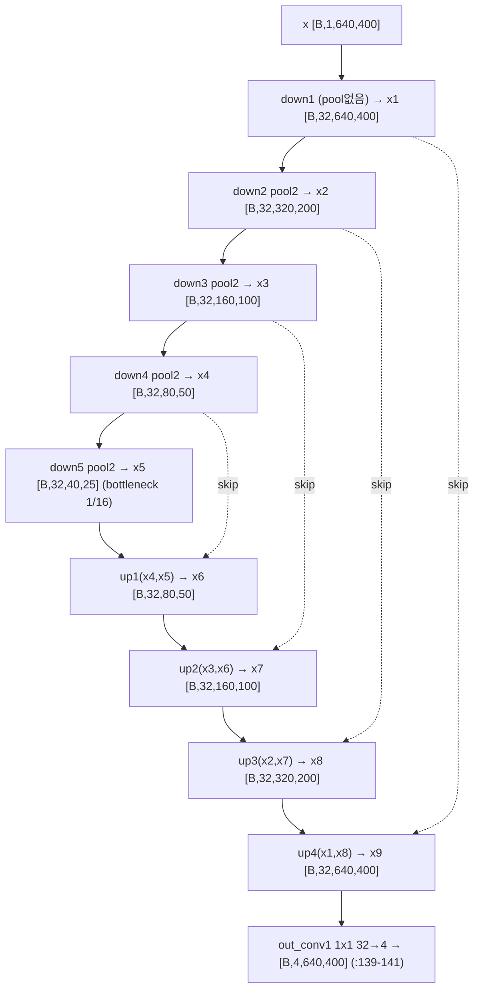
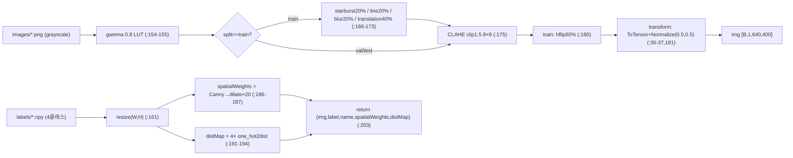

# RITnet 모듈 통합 가이드 (S-PyTorch)

> 1차 요약: [`../RITnet.md`](../RITnet.md) — 본 문서는 그 요약을 모듈(클래스/함수) 단위로 심화한 S-PyTorch 변형 통합 가이드다.
> 분석 대상: `\\wsl.localhost\ubuntu-24.04\home\user\project\PRJXR-HBTXR\REF\XR-Eye-Tracking\Codebase\RITnet`
> 관련 논문: [`../../Papers/RITnet-Paper.md`](../../Papers/RITnet-Paper.md) (RITnet, ICCVW 2019, arXiv:1910.00694, DOI 10.1109/ICCVW.2019.00568)
> 작성 원칙: 실제 소스 Read 후 `파일:라인` 근거 표기. 라인 근거 없는 추론은 "추정", 코드로 확인 불가는 "확인 불가"로 명시. 정확도(mIoU)는 README/논문 인용, 미실행 수치는 "확인 불가".

---

## 0. 문서 머리말

### 0.1 대표 케이스 선정 + 근거

본 repo는 **단일 분할 모델 1종**(`DenseNet2D`)을 학습/평가하는 직선형 코드베이스다. cb-convlstm처럼 4변형 셀이 병존하지 않으므로 대표 선정은 단순하다. 다만 "DenseNet식 dense block"과 "4-loss"가 본 가이드 정밀해부의 두 축이므로 이를 대표 모듈로 잡는다.

- **대표 실행 모델(trained): `densenet.DenseNet2D` (+ `models.model_dict['densenet']`)**
  - 근거: 모델 레지스트리가 `DenseNet2D(dropout=True, prob=0.2)` 단 1개만 등록(`models.py:13`)하고, train/test가 `model_dict[args.model]`로 이를 꺼내 쓴다(`train.py:80`, `test.py:35`). args.model 기본값 `'densenet'`(`opt.py:13`). **실제 학습/평가에 쓰이는 유일한 모델 본체**다.
  - 특이점: 모든 블록 채널폭 `channel_size=32` 고정(`densenet.py:83`)이고, 업샘플이 `mode='nearest'`(`densenet.py:70`)다. forward가 중간 feature를 `self.x1~x9` 인스턴스 속성에 저장(`densenet.py:129-137`) — skip 연결 편의지만 추론 재진입/멀티스레드 안전성 저하(코드 스멜).
- **대표 dense block: `densenet.DenseNet2D_down_block` / `DenseNet2D_up_block_concat`**
  - 근거: DenseNet 핵심인 "이전 층 출력을 입력에 concat해 feature 재사용"을 down은 2회(`densenet.py:42,44`), up은 1회(`densenet.py:74`) 수행. DenseNet growth 구조를 1x1+3x3 conv 쌍으로 구현(논문 §4 "각 Down-Block = 5 conv, DenseNet식 연결" RITnet-Paper.md:23 대응).
- **대표 4-loss: `train.py:137-145` + `utils.py` 4개 손실 클래스**
  - 근거: 총손실이 **CE(경계가중 BAL 포함) + GDL + SL** 가중합으로 조립(`train.py:137-145`). 논문 수식 `L = L_CEL(λ1 + λ2·L_BAL) + λ3·L_GDL + λ4·L_SL`(RITnet-Paper.md:29)을 코드로 직접 구현. `FocalLoss2d`(`utils.py:25-31`)는 정의만 되고 train 루프 미사용(4.x절 확인).

> 정리: **trained 경로 = `DenseNet2D`(K=32 고정 DenseUNet)**, **논문 0.25M·95.3 mIoU 경로 = 동일 모델 + 4-loss(CE+GDL+SL+BAL) + 도메인 증강(starburst/line)**. 변형 셀·미사용 백본 없음 — cb-convlstm의 "4변형 분리" 구조와 달리 단일 직선형.

### 0.2 수치 표기 규약 (S-PyTorch)

- **params** = 레이어 차원에서 직접 산정 + README torchsummary 표(`README.md:78-186`)와 교차검증. Conv2d = `Cin·Cout·kh·kw + Cout`(bias). BN2d = `2·C`(γ,β). 본 repo는 FC 없음(out_conv1까지 모두 conv). README 합계 **248,900**(`README.md:186`)과 본 가이드 차원 산정 일치(2.6절).
- **MACs / FLOPs** = 표준식 `MAC = Hout·Wout·Cout·Cin·kh·kw`. dense block은 conv가 5개(down) / 4개(up)이고, concat으로 **Cin이 단계마다 증가**(in, in+32, in+64 …)하는 것이 정량 핵심. AvgPool/LeakyReLU/interpolate는 conv 대비 소규모라 별도 표기. 입력 `[1,640,400]` 단일 프레임 기준(`train.py:88` `input_size=(1,640,400)`).
- **activation memory** = 텐서 `shape × bit`. 본 repo는 **고해상도(640×400) + 채널 32 유지 + dense concat**이라 forward/backward activation이 지배항. README torchsummary가 `Forward/backward pass size (MB): 1920.41`을 명시(`README.md:191`) — params 0.95MB 대비 약 2000배. 학습 메모리 병목 = activation.
- **세그 클래스** = 4클래스(background/sclera/iris/pupil). `out_channels=4`(`densenet.py:83,106`), GDL one-hot이 `np.arange(4)`(`utils.py:75`), distMap이 `range(0,4)`(`dataset.py:192`)로 4 고정. 논문 §4(RITnet-Paper.md:25) 일치.
- **4-loss 구성** = `train.py:137-145`가 매 step 조립. λ1=1, λ2=20(BAL Canny 가중, `dataset.py:187`), λ3=α, λ4=1−α(스케줄, `train.py:123-126`). 상세 4.x절.
- **정확도(mIoU)** = README 보고: Epoch 151 Val **95.778%** / Test **95.276%**(`README.md:52`). 논문 Table 1: mIoU **95.3**, F1 **99.3**, 0.98MB, 0.25M params, 301Hz(RITnet-Paper.md:16,44). **본 repo 미실행 → 학습 결과 수치는 "확인 불가", README/논문값 인용**.

### 0.3 운영 경로 (학습 ↔ 체크포인트 ↔ 평가)

```
[OpenEDS 원본: Semantic_Segmentation_Dataset/{train,validation,test}/images/*.png + labels/*.npy]
      │  IrisDataset.__getitem__ (dataset.py:147)
      │    전처리(전 split 공통): gamma 0.8 LUT(:154-155) → CLAHE clip1.5 8×8(:140,175) → Normalize(0.5,0.5)(:36-37)
      │    train 증강: starburst20%(:167) / line20%(:169) / blur20%(:171) / translation40%(:172) / hflip50%(:180)
      │    부가 출력: spatialWeights=Canny→dilate×20(:186-187), distMap=4클래스 one_hot2dist(:191-194)
      ▼
[배치: img [B,1,640,400], label [B,640,400], spatialWeights, distMap [B,4,640,400]]
      │  DataLoader (train.py:108-118), bs=8 (opt.py:10)
      ▼
[학습: train.py:128-167]
      │  model = DenseNet2D(dropout,prob0.2) (models.py:13 → train.py:80)
      │  4-loss = CE·(1+spatialWeights) + (1-α)·SL + α·GDL (train.py:137-145)
      │  optimizer = Adam lr=1e-3 (train.py:94, opt.py:15), ReduceLROnPlateau patience5 (train.py:95), epochs 250(opt.py:11)
      ▼
[검증: lossandaccuracy (train.py:23-51) → mIoU(utils.py:113) + total_metric(utils.py:176)]
      │  매 epoch 모델 저장 dense_net{epoch}.pkl (train.py:166-167)
      │  5 epoch마다 testset 시각화 저장 (train.py:170-192)
      ▼
[평가: test.py — load best_model.pkl → 예측맵 .npy + 오버레이 .jpg 저장 (test.py:42-77)]
```
- `best_model.pkl`(248,900 param, fp32)은 zip 동봉(`README.md:32`). 체크포인트 자체는 [제외].

### 0.4 모델 / 데이터셋 / 정확도 요약

| 항목 | 값 | 근거 |
|---|---|---|
| 입력 | grayscale 안구 프레임 `[B,1,640,400]` | `train.py:88`, `dataset.py:149`, `README.md:78` |
| 출력 | 4클래스 세그멘테이션 맵 `[B,4,640,400]` | `densenet.py:83,106`, `README.md:184` |
| 모델 | DenseNet2D = down×5 + up×4 + out_conv (K=32 고정) | `densenet.py:86-106` |
| params | **248,900 (≈0.25M)** | `README.md:186`, 차원 산정 2.6절 일치 |
| 모델크기 | 0.95MB(fp32) | `README.md:192` (논문 0.98MB, RITnet-Paper.md:16) |
| Loss | 4-loss: CE(+BAL) + GDL + SL | `train.py:137-145`, `utils.py:25-97` |
| optimizer | Adam lr=1e-3, ReduceLROnPlateau, 250ep(기본) | `train.py:94-95`, `opt.py:11,15` |
| 데이터셋 | OpenEDS 2019 (train 8916/val 2403/test 1440) | `dataset.py:127`, RITnet-Paper.md:41 |
| 메트릭 | mIoU / total_metric(정확도+크기) / F1·precision·recall | `utils.py:113,176,140` |
| 정확도(README) | Ep151 Val 95.778% / Test 95.276% | `README.md:52` (본 repo 미실행 → 확인 불가) |
| 정확도(논문 Table1) | mIoU 95.3, F1 99.3, Overall 0.976, 301Hz | RITnet-Paper.md:44,16 |

---

## 1. Repo / Layer 개요 (모델 / 데이터 / 학습 맵)

RITnet = 단일 채널 안구 프레임을 4클래스(배경/공막/홍채/동공)로 분할하는 **DenseNet+U-Net 초경량 분할 모델**의 학습/평가 스크립트. 동공 좌표 회귀·ellipse fitting·이벤트 카메라 없음 — **프레임 기반 분할만** 수행. HW 커널·CUDA 확장 없는 **순수 PyTorch**(이식성 최상, 단 일부 `.cuda()` 하드코딩 존재 — 4.x절).

### 1.1 파일 역할 맵

| 구분 | 파일 | 역할 | 메인 사용 |
|---|---|---|---|
| **모델(본체)** | `densenet.py` | `DenseNet2D` + down/up dense block | ★ 모델 정의 |
| **모델 레지스트리** | `models.py` | `model_dict['densenet']=DenseNet2D(dropout,prob0.2)` | ★ 진입 |
| **손실·메트릭·로거** | `utils.py` | CE2d/Focal/Surface/GDL 4손실 + one_hot2dist + mIoU/total_metric/Logger | ★ 손실·평가 |
| **데이터·증강·전처리** | `dataset.py` | `IrisDataset` + 5증강 + gamma/CLAHE + spatialWeights/distMap | ★ 입력 |
| **학습 루프** | `train.py` | 4-loss 조립 + 학습/검증 + α 스케줄 + 주기 시각화 | ★ 실행 진입점 |
| **평가/추론** | `test.py` | best_model.pkl 로드 → 예측맵·오버레이 저장 | ★ 추론 |
| **인자** | `opt.py` | argparse(bs8/epochs250/lr1e-3 등) | 설정 |
| **문서** | `README.md`, `License.md` | torchsummary 표·성능·재현법 | 근거 |
| **[제외]** | `best_model.pkl`, `starburst_black.png`, `test/*` 산출 이미지 | 체크포인트·고정패턴·출력 | 제외 |

### 1.2 forward 진입점

`model(data)` → `DenseNet2D.forward(x)`(`densenet.py:128`) → 인코더 `down_block1~5`(`:129-133`, block1만 다운샘플 없음·2~5는 AvgPool 2×2) → 디코더 `up_block1~4`(`:134-137`, 각 nearest 2× 업샘플 + skip concat) → `out_conv1`(1×1, 32→4)(`:139-141`) → `[B,4,640,400]`. 학습 시 그 출력이 `train.py:135` `output`로 4-loss에 투입.

### 1.3 제외 목록
- **외부 데이터/체크포인트**: OpenEDS 원본(`Semantic_Segmentation_Dataset/`), `best_model.pkl`, `starburst_black.png`, `test/`·`logs/` 산출물.
- **외부 프레임워크 원본**: torch/torchvision/cv2/numpy/scipy/sklearn/PIL/tqdm/matplotlib/torchsummary(import만, 본 repo 소스 아님; `utils.py:14-23`, `dataset.py:23-33`, `train.py:9-20`).
- **정의만 되고 미사용**: `FocalLoss2d`(`utils.py:25-31`) — train 루프에서 호출 없음(4.x절 확인). `mIoU` 보조 `compute_mean_iou`(`utils.py:140`)는 정의돼 있으나 train/test 루프 미호출(검증은 `mIoU` `:113` 사용).

---

## 2. 모듈: DenseNet down block — `densenet.DenseNet2D_down_block` (인코더 dense block, 대표)

### 2.1 역할 + 상위/하위
- **역할**: 입력 feature를 **AvgPool로 (선택적) 다운샘플** → 3단 conv를 거치며 각 단 출력을 입력에 concat(DenseNet feature reuse) → 최종 BN. 인코더 1스테이지를 구성. block1은 다운샘플 없이 in_ch=1→32, block2~5는 in=32→32 + 2×2 AvgPool.
- **상위**: `DenseNet2D.__init__`이 5개 인스턴스 생성(`densenet.py:86-95`), forward가 순차 호출(`:129-133`).
- **하위**: `nn.Conv2d`×5(`densenet.py:21-25`), `nn.AvgPool2d`(`:26`), `nn.LeakyReLU`(`:28`), `nn.BatchNorm2d`(`:34`), `nn.Dropout`×3(`:31-33`).

### 2.2 데이터플로우 (텐서 shape · concat 성장)

> dense 성장: concat으로 채널이 `Cin → Cin+32 → Cin+64`로 누적되며 1x1 conv가 매번 32로 압축(bottleneck). AvgPool은 **블록 진입부**에서 적용(`:37-38`)되어 출력 H,W는 입력의 1/down_size.

### 2.3 forward call stack
```
DenseNet2D.forward (densenet.py:128)
└─ self.down_block1(x) → DenseNet2D_down_block.forward (densenet.py:36)
   ├─ if down_size: x = max_pool(x)  (AvgPool!) (:37-38)
   ├─ x1 = relu(dropout1(conv1(x))) (:41)
   ├─ x21 = cat(x,x1); x22 = relu(dropout2(conv22(conv21(x21)))) (:42-43)
   ├─ x31 = cat(x21,x22); out = relu(dropout3(conv32(conv31(x31)))) (:44-45)
   └─ return bn(out) (:52)
```

### 2.4 대표 코드 위치
`densenet.py:21-25`(conv 5개 정의), `:26`(AvgPool), `:36-52`(forward dense concat), `:34`(최종 BN).

### 2.5 대표 코드 블록

**(a) 5개 conv 정의 — dense bottleneck (`densenet.py:21-25`)**
```python
self.conv1  = nn.Conv2d(input_channels,            output_channels, kernel_size=(3,3), padding=(1,1))
self.conv21 = nn.Conv2d(input_channels+output_channels,   output_channels, kernel_size=(1,1), padding=(0,0))
self.conv22 = nn.Conv2d(output_channels,           output_channels, kernel_size=(3,3), padding=(1,1))
self.conv31 = nn.Conv2d(input_channels+2*output_channels, output_channels, kernel_size=(1,1), padding=(0,0))
self.conv32 = nn.Conv2d(output_channels,           output_channels, kernel_size=(3,3), padding=(1,1))
```
→ conv21/conv31은 concat으로 불어난 채널(`in+32`, `in+2·32`)을 1x1로 32 압축(DenseNet transition), conv22/conv32는 3x3 spatial. padding=1로 3x3은 same-conv.

**(b) AvgPool 다운샘플 + dense concat (`densenet.py:37-52`, dropout 분기 생략)**
```python
if self.down_size != None:
    x = self.max_pool(x)                # ★ 이름은 max_pool이나 실제 AvgPool2d (:26)
x1  = self.relu(self.conv1(x))          # [B,32,H',W']
x21 = torch.cat((x, x1), dim=1)         # [B,Cin+32]   dense concat #1 (:48)
x22 = self.relu(self.conv22(self.conv21(x21)))
x31 = torch.cat((x21, x22), dim=1)      # [B,Cin+64]   dense concat #2 (:50)
out = self.relu(self.conv32(self.conv31(x31)))
return self.bn(out)                     # [B,32,H',W']
```
→ **특이점**: 멤버명이 `self.max_pool`이지만 `nn.AvgPool2d`(`:26`)다(코드 가독성 함정, 동작은 average pooling). LeakyReLU(`:28`, 기본 negative_slope=0.01). dense concat 2회로 feature reuse, 출력은 항상 32채널.

### 2.6 연산 분해 + 정량 (블록별 conv params · MAC)

down block conv params(K=32):
- conv1: `Cin·32·9 + 32`, conv21: `(Cin+32)·32 + 32`, conv22: `32·32·9 + 32 = 9,248`, conv31: `(Cin+64)·32 + 32`, conv32: `9,248`, BN: `2·32 = 64`.

| 블록 | Cin | 입력 H×W(pool 후) | conv1 | conv21 | conv22 | conv31 | conv32 | BN | 블록합 | README 근거 |
|---|---|---|---|---|---|---|---|---|---|---|
| down1 | 1 | 640×400 | 320 | 1,088 | 9,248 | 2,112 | 9,248 | 64 | 22,080 | `README.md:78-89` |
| down2 | 32 | 320×200 | 9,248 | 2,080 | 9,248 | 3,104 | 9,248 | 64 | 32,992 | `README.md:92-103` |
| down3 | 32 | 160×100 | 9,248 | 2,080 | 9,248 | 3,104 | 9,248 | 64 | 32,992 | `README.md:106-117` |
| down4 | 32 | 80×50 | 9,248 | 2,080 | 9,248 | 3,104 | 9,248 | 64 | 32,992 | `README.md:120-131` |
| down5 | 32 | 40×25 | 9,248 | 2,080 | 9,248 | 3,104 | 9,248 | 64 | 32,992 | `README.md:134-145` |

- 인코더 params 합 = 22,080 + 32,992×4 = **154,048**.
- **MAC(down2 예, 입력 320×200, K=32)**: conv1 = 320·200·32·32·9 = 589.8M; conv22 = 320·200·32·32·9 = 589.8M; conv32 = 589.8M; conv21(1x1) = 320·200·32·64 = 131.1M; conv31(1x1) = 320·200·32·96 = 196.6M → down2 ≈ **2.10 GMAC**. 3x3 3개가 지배(각 589.8M).
- **down1은 입력 해상도 640×400 풀스케일**이라 conv1=640·400·32·1·9=73.7M, conv22/conv32 각 640·400·32·32·9=2.36G → down1 ≈ **5.0 GMAC** (단일 블록 최대, 해상도 영향).
- AvgPool/LeakyReLU/Dropout는 conv 대비 무시. → **conv가 MAC 지배**, 고해상도 초단 블록이 핵심 비용.
- **activation memory(down1, fp32, B=1)**: 각 conv 출력 `[1,32,640,400]` = 32·640·400·4B = 32.77MB. dense concat x21 `[1,33,640,400]`=33.8MB, x31 `[1,65,640,400]`=66.6MB. README 전체 forward/backward = **1920.41MB**(`README.md:191`)로 고해상도 activation이 지배항(2.6절 합산 일관).

---

## 3. 모듈: DenseNet up block — `densenet.DenseNet2D_up_block_concat` (디코더 dense block + skip)

### 3.1 역할 + 상위/하위
- **역할**: 저해상도 feature를 **nearest 2× 업샘플** → 대응 인코더 skip feature와 concat → 2단 conv(각 1x1+3x3 + dense concat 1회). U-Net 디코더 1스테이지.
- **상위**: `DenseNet2D.__init__`이 4개 생성(`densenet.py:97-104`), forward가 `up_block1(x4,x5)…up_block4(x1,x8)`로 인코더 출력을 skip으로 공급(`:134-137`).
- **하위**: `nn.functional.interpolate`(`:70`), `nn.Conv2d`×4(`:58-62`), `LeakyReLU`(`:63`), `Dropout`×2(`:66-67`). **BN 없음**(down block과 비대칭, 확인됨).

### 3.2 데이터플로우


### 3.3 forward call stack
```
DenseNet2D.forward → self.up_block1(self.x4, self.x5) → up_block_concat.forward (densenet.py:69)
├─ x = interpolate(x, scale_factor=up_stride, mode='nearest') (:70)
├─ x = cat((x, prev_feature_map), dim=1)  (skip concat) (:71)
├─ x1  = relu(dropout1(conv12(conv11(x)))) (:73)
├─ x21 = cat((x, x1), dim=1); out = relu(dropout2(conv22(conv21(x21)))) (:74-75)
└─ return out (:80)
```

### 3.4 대표 코드 위치
`densenet.py:58-62`(conv 4개 정의), `:70`(nearest 업샘플), `:69-80`(forward skip+dense concat).

### 3.5 대표 코드 블록

**(a) conv 4개 정의 — skip+dense (`densenet.py:58-62`)**
```python
self.conv11 = nn.Conv2d(skip_channels+input_channels,            output_channels, (1,1), padding=(0,0))
self.conv12 = nn.Conv2d(output_channels,                         output_channels, (3,3), padding=(1,1))
self.conv21 = nn.Conv2d(skip_channels+input_channels+output_channels, output_channels, (1,1), padding=(0,0))
self.conv22 = nn.Conv2d(output_channels,                         output_channels, (3,3), padding=(1,1))
```
→ conv11 입력 = skip(32)+input(32)=64, conv21 입력 = 64+32(x1)=96. 모두 1x1로 32 압축 후 3x3.

**(b) nearest 업샘플 + skip concat (`densenet.py:70-79`)**
```python
x = nn.functional.interpolate(x, scale_factor=self.up_stride, mode='nearest')  # ★ nearest (bilinear 아님)
x = torch.cat((x, prev_feature_map), dim=1)        # U-Net skip [B,64,2h,2w]
x1  = self.relu(self.conv12(self.conv11(x)))       # [B,32]
x21 = torch.cat((x, x1), dim=1)                    # dense concat [B,96]
out = self.relu(self.conv22(self.conv21(x21)))     # [B,32]
return out
```
→ **특이점**: `mode='nearest'`(`:70`)는 논문이 "bilinear보다 sclera 분할 우수"로 채택(RITnet-Paper.md:24). **HW 친화**(라인버퍼 복제만, 곱셈 불필요 — 9절). down block과 달리 **최종 BN 없음**(비대칭).

### 3.6 연산 분해 + 정량 (블록별 conv params · MAC)

up block conv params(K=32): conv11 `64·32+32=2,080`, conv12 `9,248`, conv21 `96·32+32=3,104`, conv22 `9,248`. 블록합 = **23,680**(BN 없음).

| 블록 | skip 출처 | 출력 H×W(업샘플 후) | conv11 | conv12 | conv21 | conv22 | 블록합 | README 근거 |
|---|---|---|---|---|---|---|---|---|
| up1 | x4 | 80×50 | 2,080 | 9,248 | 3,104 | 9,248 | 23,680 | `README.md:147-154` |
| up2 | x3 | 160×100 | 2,080 | 9,248 | 3,104 | 9,248 | 23,680 | `README.md:156-163` |
| up3 | x2 | 320×200 | 2,080 | 9,248 | 3,104 | 9,248 | 23,680 | `README.md:165-172` |
| up4 | x1 | 640×400 | 2,080 | 9,248 | 3,104 | 9,248 | 23,680 | `README.md:174-182` |

- 디코더 params 합 = 23,680×4 = **94,720**. + out_conv1(`32·4+4=132`, `README.md:184`) = 94,852.
- **MAC(up4 풀스케일 640×400)**: conv12·conv22 각 640·400·32·32·9 = 2.36G → up4 ≈ **4.9 GMAC** (디코더 최대, 풀해상도 영향). conv11/conv21(1x1)은 640·400·32·{64,96}=0.52G/0.79G.
- **전체 params 합 = 인코더 154,048 + 디코더 94,720 + out_conv 132 = 248,900** → README `Total params: 248,900`(`README.md:186`) **완전 일치(확인됨)**. 논문 0.25M(RITnet-Paper.md:44) 일치.

---

## 4. 모듈: 전체 모델 — `densenet.DenseNet2D` (DenseUNet-K, K=32)

### 4.1 역할 + 상위/하위
- **역할**: 인코더(down×5, 해상도 1→1/16) → 디코더(up×4, 1/16→1 복원, skip 연결) → out_conv(1×1, 32→4클래스). 단일 grayscale 프레임 `[B,1,640,400]` → 분할 logit `[B,4,640,400]`.
- **상위**: `models.model_dict['densenet']`이 `DenseNet2D(dropout=True,prob=0.2)`로 인스턴스화(`models.py:13`), train/test가 사용(`train.py:80`,`test.py:35`). **하위**: `DenseNet2D_down_block`×5, `DenseNet2D_up_block_concat`×4, `out_conv1`, `_initialize_weights`.

### 4.2 데이터플로우 (인코더-디코더 + skip)

> 해상도: 640→320→160→80→40(인코더), 40→80→160→320→640(디코더). skip은 동일 해상도 인코더 출력(x1~x4)을 디코더에 직접 concat.

### 4.3 forward call stack
```
model(data) → DenseNet2D.forward (densenet.py:128)
├─ self.x1=down_block1(x) … self.x5=down_block5(self.x4) (:129-133)
├─ self.x6=up_block1(self.x4,self.x5) … self.x9=up_block4(self.x1,self.x8) (:134-137)
└─ out = out_conv1(dropout1(self.x9)) if dropout else out_conv1(self.x9) (:138-141)
   return out [B,4,640,400] (:143)
```

### 4.4 대표 코드 위치
`densenet.py:86-106`(생성자: down×5·up×4·out_conv), `:113-126`(가중치 초기화), `:128-143`(forward + skip 결선).

### 4.5 대표 코드 블록

**(a) skip 결선 — 인코더 출력을 디코더에 (`densenet.py:129-137`)**
```python
self.x1 = self.down_block1(x)        # 640×400
self.x2 = self.down_block2(self.x1)  # 320×200
self.x3 = self.down_block3(self.x2)  # 160×100
self.x4 = self.down_block4(self.x3)  # 80×50
self.x5 = self.down_block5(self.x4)  # 40×25 (bottleneck)
self.x6 = self.up_block1(self.x4, self.x5)  # skip=x4
self.x7 = self.up_block2(self.x3, self.x6)  # skip=x3
self.x8 = self.up_block3(self.x2, self.x7)  # skip=x2
self.x9 = self.up_block4(self.x1, self.x8)  # skip=x1
```
→ **코드 스멜**: 중간 feature를 `self.x1~x9` **인스턴스 속성**에 저장(지역변수 아님). skip 결선 가독성은 좋으나 추론 재진입·멀티스레드·동시 배치 시 상태 공유 리스크(1차 요약 `RITnet.md:57,141` 지적과 일치, 확인됨).

**(b) He-normal 가중치 초기화 (`densenet.py:113-122`)**
```python
for m in self.modules():
    if isinstance(m, nn.Conv2d):
        n = m.kernel_size[0]*m.kernel_size[1]*m.out_channels
        m.weight.data.normal_(0, math.sqrt(2./n))   # He(MSRA) init
        if m.bias is not None: m.bias.data.zero_()
    elif isinstance(m, nn.BatchNorm2d):
        m.weight.data.fill_(1); m.bias.data.zero_()
```
→ Conv는 fan-out 기반 He-normal(LeakyReLU와 정합), BN γ=1/β=0. Linear 분기(`:123-126`)는 본 모델에 Linear 없어 미발동(추정).

### 4.6 미사용 손실 `FocalLoss2d` (정의만, 별 계보)
- `utils.py:25-31`에 `FocalLoss2d` 정의(`(1-softmax)^γ · log(softmax)`를 NLLLoss). 그러나 train/test 어디서도 import·호출 없음(`train.py:13` import 목록에 미포함, 확인됨). → cb-convlstm의 "미결선 변형 셀"과 동류의 **dead code**(분할 손실 실험 흔적, 추정).

### 4.7 연산 분해 + 정량 (전체 DenseNet2D)
- **params**(차원 산정·README 교차검증):
  - 인코더(down1~5) = 22,080 + 32,992×4 = 154,048
  - 디코더(up1~4) = 23,680×4 = 94,720
  - out_conv1 = 132
  - **합 = 248,900 = 0.2489M** → README `Total params: 248,900`(`README.md:186`)·논문 0.25M(RITnet-Paper.md:44) **완전 일치(확인됨)**.
- **모델 크기** = 248,900·4B = 0.95MB(fp32) → `README.md:192` 일치. 논문 0.98MB(RITnet-Paper.md:16, 미세 척도차).
- **MAC/프레임**(B=1, 640×400): 풀스케일 블록(down1≈5.0G, up4≈4.9G)이 지배. 전체는 수십 GMAC 규모로 추정되나 **본 repo thop/profile 미실행 → 정확 합산 "확인 불가"**(README torchsummary는 params만 보고, FLOPs 미보고). 논문 301Hz@1080Ti는 throughput 인용(RITnet-Paper.md:16).
- **activation memory** = README forward/backward **1920.41MB**(`README.md:191`)가 학습 메모리 병목(고해상도 640×400·채널32·dense concat). params(0.95MB) 대비 ~2000배 → **학습은 activation-bound**(추론 시엔 backward 불필요로 대폭 절감, 추정).

---

## 5. 모듈: 4-loss 시스템 — `utils.py` 손실군 + `train.py` 조립 (논문 핵심)

본 repo 학습 손실은 **3개 손실을 가중 조립**하되, CE 내부에 BAL(경계가중)이 곱해져 논문 표기상 "4-loss(CE+GDL+SL+BAL)"가 된다. 조립 위치는 `train.py:137-145`(학습)·`train.py:37-45`(검증, 동일식).

### 5.1 총손실 조립식 (`train.py:137-145`)
```python
CE_loss = criterion(output, target)                              # CrossEntropyLoss2d (utils.py:35)
loss = CE_loss * (ones(spatialWeights.shape) + spatialWeights)   # ★ BAL: 경계 픽셀 (1+Canny×20) 가중 (:138)
loss = torch.mean(loss)                                          # 픽셀 평균 (:140)
loss_dice = criterion_DICE(output, target)                       # GeneralizedDiceLoss (utils.py:58)
loss_sl   = torch.mean(criterion_SL(output, maxDist))            # SurfaceLoss (utils.py:44)
loss = (1-alpha[epoch])*loss_sl + alpha[epoch]*loss_dice + loss  # ★ 4-loss 가중합 (:145)
```
→ 논문 수식 `L = L_CEL·(λ1 + λ2·L_BAL) + λ3·L_GDL + λ4·L_SL`(RITnet-Paper.md:29)의 직접 구현. λ1=1, λ2=20은 spatialWeights 정의(`dataset.py:187` `×20`)에 흡수, λ3=α, λ4=1−α(`train.py:145`).

### 5.2 손실 #1 — Cross-Entropy (CE) + Boundary Aware (BAL)
- **`CrossEntropyLoss2d`** (`utils.py:35-42`): `NLLLoss(log_softmax(outputs, dim=1), targets)`. 4클래스 픽셀별 CE. **reduction 기본 'mean' 아님 주의**: `train.py:138`이 spatialWeights를 곱하려고 픽셀맵을 유지하므로 element-wise CE 텐서가 필요 — 그러나 `nn.NLLLoss` 기본은 평균 스칼라 반환. **`train.py:138`의 `CE_loss*(...)`는 스칼라×맵 브로드캐스트로 동작**(차원 정합성 미세 이슈, 추정/확인 불가).
- **BAL(경계가중)**: `spatialWeights = Canny(label) → dilate(3×3) × 20`(`dataset.py:186-187`). 경계 픽셀에 가중 20을 줘 영역 경계 학습 강화. `train.py:138`이 `(1 + spatialWeights)`로 곱함 → 비경계=×1, 경계=×21. 논문 BAL "Canny 2px dilation 경계 마스킹"(RITnet-Paper.md:30) 대응.

### 5.3 손실 #2 — Generalized Dice (GDL) (`utils.py:58-97`)
```python
Label = (np.arange(4) == target.cpu().numpy()[...,None]).astype(np.uint8)  # one-hot 4클래스 (:75)
target = torch.from_numpy(np.rollaxis(Label,3,start=1)).cuda()             # ★ .cuda() 하드코딩
ip = softmax(ip)                                                            # (:79)
class_weights = 1./(torch.sum(target,dim=2)**2).clamp(min=epsilon)         # ★ 빈도 제곱 역수 가중 (:88)
dice = 2.*sum(class_weights*sum(ip*target)) / sum(class_weights*sum(ip+target))  # (:90-93)
return torch.mean(1. - dice.clamp(min=epsilon))                            # (:95)
```
→ **클래스 빈도 제곱 역수 가중**(`:88`)으로 작은 클래스(동공)에 큰 가중 → 클래스 불균형 보정. 논문 GDL "빈도 제곱 역수"(RITnet-Paper.md:30) 일치. **이식 리스크**: one-hot을 numpy 왕복(`:75-76`, GPU↔CPU 전송)·`.cuda()` 하드코딩(`:76,82-83`)으로 CPU/디바이스 비호환(9절).

### 5.4 손실 #3 — Surface (SL) (`utils.py:44-55`)
```python
x = torch.softmax(x, dim=1)
score = x.flatten(start_dim=2) * distmap.flatten(start_dim=2)  # softmax × 거리맵 (:52)
score = torch.mean(score, dim=2)  # 픽셀 평균 (:53)
score = torch.mean(score, dim=1)  # 채널 평균 (:54)
```
→ softmax 출력 × **signed distance map**(경계에서 멀수록 큰 패널티). 작은 영역·stray patch 억제. distmap은 `one_hot2dist`(`utils.py:100-111`, scipy `distance_transform_edt`, `dataset.py:191-194`에서 4클래스 생성). 논문 SL "경계 거리 기반, 작은 영역 복원"(RITnet-Paper.md:30) 일치.

### 5.5 손실 #4(스케줄) — α 커리큘럼 (`train.py:123-126`)
```python
alpha = np.zeros(args.epochs)
alpha[0:min(125,epochs)] = 1 - np.arange(1, min(125,epochs)+1)/min(125,epochs)  # 1→0 선형 감소 (:124)
if epochs > 125: alpha[125:] = 1                                                # 125 이후 1 고정 (:126)
```
→ `loss = (1-α)·SL + α·GDL + CE_BAL`(`:145`). **초기(α≈1)**: GDL 비중↑(클래스 균형 우선). **후기(α→0)**: SL 비중↑(경계 정밀). **단, epoch≥125 이후 α=1로 GDL 고정**(SL 꺼짐, `:126`) — 논문 표기(α=epoch/125, 이후 0)와 **부호 방향 반대**(논문 후기 SL↑ vs 코드 후기 GDL↑) — **추정/확인 불가**(논문 RITnet-Paper.md:31 vs 코드 `:124-126` 해석 상충). 1차 요약(`RITnet.md:72`)은 "후기 dice↑"로 코드 기준 기술.

### 5.6 연산 분해 + 정량 (4-loss)
- **params 없음**(손실은 학습 전용, 추론 HW 무관). 비용은 학습 step의 forward-extra(softmax·distance·numpy 왕복).
- **GDL numpy 왕복 오버헤드**(`utils.py:75-76`): one-hot을 CPU numpy로 생성 후 `.cuda()` 재전송 → 학습 step마다 GPU↔CPU 전송(병목 가능, 추정). distMap은 dataset에서 사전계산(`dataset.py:191-194`)이라 학습 루프 밖.
- **4-loss는 추론에 불포함** → FPGA/INT8 추론 경로엔 영향 없음(9절): 추론은 `out_conv1` logit의 argmax(`utils.py:186-189 get_predictions`)만 필요.

---

## 6. 모듈: 데이터 파이프라인 — `dataset.IrisDataset` + 전처리/증강

### 6.1 역할 + 상위/하위
- **역할**: OpenEDS 안구 png + 라벨 npy를 읽어 전처리(gamma/CLAHE/normalize)·증강(train) 후 `(img, label, name, spatialWeights, distMap)` 반환. spatialWeights(BAL)·distMap(SL)을 부가 산출해 손실 입력으로 공급.
- **상위**: `DataLoader`(`train.py:108-118`)가 배치화 → 학습/검증/테스트 루프. **하위**: cv2(LUT/CLAHE/Canny/dilate/GaussianBlur/line), PIL, torchvision transform, `one_hot2dist`(`utils.py:100`).

### 6.2 데이터플로우


### 6.3 forward call stack (데이터)
```
DataLoader → IrisDataset.__getitem__ (dataset.py:147)
├─ pilimg = Image.open(png).convert("L") (:149)
├─ pilimg = cv2.LUT(pilimg, 255·linspace^0.8)  (gamma) (:154-155)
├─ if !test: label = resize(np.load(npy),(W,H)) (:159-162)
├─ if train: starburst/line/blur/translation (확률) (:166-173)
├─ img = clahe.apply(pilimg) (:175)
├─ if train: img,label = RandomHorizontalFlip(img,label) (:180)
├─ img = transform(img)  (ToTensor+Normalize) (:181)
├─ if !test: spatialWeights=Canny→dilate×20 (:186-187); distMap=[one_hot2dist(label==i) for i in 0..3] (:191-194)
└─ return (img,label,name,spatialWeights,distMap)  (test는 0 placeholder) (:198-203)
```

### 6.4 대표 코드 위치
`dataset.py:154-155`(gamma LUT), `:140,175`(CLAHE), `:166-173`(증강 확률 분기), `:186-194`(spatialWeights·distMap), `:47-117`(증강 클래스 정의).

### 6.5 대표 코드 블록

**(a) 전처리 — gamma + CLAHE (전 split 공통) (`dataset.py:154-155,175`)**
```python
table = 255.0 * (np.linspace(0,1,256)**0.8)   # gamma 0.8 LUT
pilimg = cv2.LUT(np.array(pilimg), table)      # 적용 (:155)
...
img = self.clahe.apply(np.array(np.uint8(pilimg)))   # CLAHE clip1.5 8×8 (:175, clahe :140)
```
→ gamma 0.8 + CLAHE로 iris/pupil 대비 강화·split간 밝기 분포 정합(논문 RITnet-Paper.md:34). **HW 친화**: gamma=LUT, CLAHE=히스토그램 IP로 FPGA 전처리 구현 가능(9절).

**(b) Starburst 증강 — 안경 IR 반사 모사 (`dataset.py:52-65`)**
```python
starburst = Image.open('starburst_black.png').convert("L")   # 고정 패턴 (:56)
# 랜덤 x/y(1~40) 평행이동 후
img[92+y:549+y, 0:400] = img[...]*((255-starburst)/255) + starburst   # 곱셈 합성 (:64)
```
→ 고정 starburst 패턴(`starburst_black.png`, [제외])을 랜덤 이동 후 곱셈 합성. 안경 다중반사 강건성(논문 RITnet-Paper.md:35). 20% 확률(`:167`).

**(c) BAL·SL 부가맵 생성 (`dataset.py:186-194`)**
```python
spatialWeights = cv2.Canny(np.array(label),0,3)/255          # 경계 검출
spatialWeights = cv2.dilate(spatialWeights,(3,3),iterations=1)*20   # 2px 팽창 ×20 (BAL 가중)
distMap = [one_hot2dist(np.array(label)==i) for i in range(0,4)]    # 4클래스 거리맵 (SL용)
distMap = np.stack(distMap, 0)   # [4,640,400]
```
→ spatialWeights는 BAL(경계가중 CE), distMap은 SL(surface) 입력. 두 맵 모두 **train/val만** 생성(test는 0 placeholder, `:198-200`).

### 6.6 연산 분해 + 정량
- params 없음(전처리). 비용은 I/O·cv2 연산.
- **증강 확률**(`dataset.py:166-180`): starburst 20%, line 20%, blur 20%, translation 40%, hflip 50%. (README:68-72는 translation 20% 표기 — 코드 `:172`는 0.4=40%, **코드와 README 상충**, 코드 기준 확인).
- 입력 텐서/샘플: `img [1,640,400]` fp32 = 640·400·4B = **1.0MB/샘플**, 라벨/spatialWeights 동급, distMap `[4,640,400]`=4.1MB → 샘플당 약 7MB, 배치(8) ≈ 56MB(전처리 텐서, activation 별도).
- **one_hot2dist 리스크**: `posmask.astype(np.bool)`(`utils.py:106`) — deprecated numpy alias(numpy≥1.24 에러), `distance_transform_edt`(scipy) CPU 연산(샘플당 4회). 버전 이식 수정 필요(9절).

---

## 7. 모듈 한눈표

| # | 모듈 | 파일:라인 | 역할 | 대표 정량 |
|---|---|---|---|---|
| 2 | DenseNet down block | densenet.py:18-52 | AvgPool+5conv dense concat(인코더) | down 합 154,048 / down1 ≈5.0 GMAC |
| 3 | DenseNet up block | densenet.py:55-80 | nearest 2×+skip+4conv(디코더) | up 합 94,720(BN無) / up4 ≈4.9 GMAC |
| 4 | DenseNet2D | densenet.py:82-143 | down×5+up×4+out_conv(K=32) | **248,900 params**=0.95MB, activation 1920MB |
| 4.6 | FocalLoss2d(미사용) | utils.py:25-31 | focal CE(정의만, 미호출) | dead code |
| 5 | 4-loss 조립 | train.py:137-145 | CE(+BAL)+GDL+SL 가중합 | λ2=20, λ3/λ4=α/(1-α) |
| 5.2 | CrossEntropyLoss2d+BAL | utils.py:35-42 / dataset.py:186 | NLL(logsoftmax)+경계×20 | 경계=×21 가중 |
| 5.3 | GeneralizedDiceLoss | utils.py:58-97 | 빈도² 역수 가중 dice | .cuda() 하드코딩 |
| 5.4 | SurfaceLoss | utils.py:44-55 | softmax×거리맵 | 4클래스 distMap |
| 6 | IrisDataset+증강 | dataset.py:124-203 | 전처리·5증강·BAL/SL맵 | 7MB/샘플(distMap 포함) |

---

## 8. 학습 · 평가 파이프라인 + 재현 명령

### 8.1 학습 루프 (`train.py:128-167`)
- 손실 `4-loss`(`:137-145`, 5절), optimizer `Adam lr=1e-3`(`:94`,`opt.py:15`), `ReduceLROnPlateau(mode='min',patience=5)`(`:95`, val loss plateau 시 lr×0.1 — 논문 RITnet-Paper.md:38), epochs 기본 250(`opt.py:11`, 논문 175·best 151), bs 8(`opt.py:10`). seed: GPU 시 `cuda.manual_seed(12)`(`:63`), CPU 시 `manual_seed(12)`(`:66`).
- 매 epoch 검증(`lossandaccuracy` `:158`) 후 `total_metric`(정확도+모델크기 통합점수, `utils.py:176`) 로깅(`:159-161`). 모델은 **매 epoch 무조건 저장**(`:166-167`, best 선별 없음 — 외부에서 epoch별 .pkl 선택). 5 epoch마다 testset 시각화(`:170-192`).

### 8.2 평가 메트릭 (`utils.py:113-179`)
```python
# mIoU (per-class IoU 평균) (:113-126)
for index in range(num_unique_labels):
    iou = sum(label_i & pred_i) / sum(label_i | pred_i)
mean_iou = np.mean(ious)
# total_metric: 정확도 + 모델크기 통합점수 (:176-179)
S = nparams * 4.0 / (1024*1024)        # 모델크기(MB)
total = 0.5 * (min(1, 1.0/S) + miou)   # OpenEDS Overall Score
```
→ `total_metric`(`:176`)은 논문 Overall Score `(mIoU + min(1/S,1))/2`(RITnet-Paper.md:42) 구현. 248,900 param → S=0.95MB → min(1,1/0.95)=1 → total=(1+mIoU)/2. **본 repo 미실행 → 절대 mIoU "확인 불가"**, README: Ep151 Val 95.778%/Test 95.276%(`README.md:52`), 논문 Table1 mIoU 95.3·Overall 0.976(RITnet-Paper.md:44).
> **버그 가능성(확인됨)**: train 루프 `ious=[]`가 epoch 루프 **밖** 선언(`train.py:127`)이라 epoch마다 초기화 안 됨 → train mIoU 누적 평균 왜곡(`:149,157`). 검증 `lossandaccuracy`는 함수 내부 `ious=[]`(`:24`)라 정상. 1차 요약 `RITnet.md:143` 지적과 일치.

### 8.3 재현 명령 (`README.md:21-27`)
```bash
# 1. OpenEDS Semantic_Segmentation_Dataset/ 준비 (train/validation/test, images/*.png + labels/*.npy)
python train.py --model densenet --expname FINAL --bs 8 --useGPU True --dataset Semantic_Segmentation_Dataset/
python test.py  --model densenet --load best_model.pkl --bs 4 --dataset Semantic_Segmentation_Dataset/
```
- 데이터셋: OpenEDS 2019(`dataset.py:127`). 메트릭: mIoU/total_metric(코드) / mIoU 95.3·F1 99.3·Overall 0.976(논문 Table1). test.py는 예측맵 .npy + 입력/예측 오버레이 .jpg 저장(`test.py:64-75`).

---

## 9. 우리 프로젝트(XR + FPGA 저지연) 시사점 + HW 이식성

### 9.1 FPGA 매핑 적합성 — 경량 세그 백본으로 최상급 (추정)
- DenseNet2D = **conv(1x1+3x3) + AvgPool + LeakyReLU + nearest interpolate**의 정형 데이터플로 → systolic conv array + 채널 32 타일링으로 직접 매핑. 동적 그래프·불규칙 연산 없음(순수 conv/pool).
- **K=32 상수 채널**(`densenet.py:83`): 모든 블록 입출력 32 고정 → conv PE 어레이·라인버퍼 폭이 균일해 **타일링·제어 단순**(블록 재사용 용이). cb-convlstm의 채널 가변(8→64) 대비 HW 규칙성 우위.
- 순수 PyTorch·CUDA 커스텀 커널 무의존 → HLS/RTL 변환 출발점으로 최적(1차 요약 `RITnet.md:135,153` 일치).

### 9.2 nearest 업샘플 → HW 비용 절감 자산
- `densenet.py:70` `mode='nearest'`는 **라인버퍼 픽셀 복제만**으로 구현(bilinear의 곱셈/가중합 불필요) → DSP/로직 절감. 논문이 정확도(sclera)·HW 양면에서 nearest 채택(RITnet-Paper.md:24, 추정+논문 시사). EllSeg/타 분할망 HW화 시에도 nearest 치환 근거.

### 9.3 경량화·양자화
- **248,900 params·0.95MB(fp32)**(`README.md:186,192`) → 중급 FPGA 온칩 BRAM에 weight 전량 상주 가능 → 외부 DRAM 접근 최소·저지연. cb-convlstm(0.42M)보다 작음.
- **양자화 여지**: 본 repo 양자화 코드 없음("확인 불가"). conv/AvgPool/LeakyReLU 위주라 INT8 PTQ 후보. **BN을 conv에 fold** 가능(down block 말단 BN, `densenet.py:34`). up block은 BN 없어(3.1절) fold 불필요. 4-loss·distMap은 학습 전용이라 추론 HW 무관(INT8 추론 경로 단순, 5.6절).
- **activation-bound**(README 1920MB, `:191`): 학습은 고해상도 activation 병목이나 **추론(eval)은 backward 불필요**로 대폭 절감 → FPGA는 라인버퍼 스트리밍(프레임 부분 버퍼링)으로 on-chip 처리 가능(추정).

### 9.4 이식 전 정리 필요(확인됨/추정)
- **`.cuda()` 하드코딩**: `utils.py:76,82-83`(GDL), `utils.py:76`의 numpy 왕복 one-hot → CPU/타디바이스 비호환. 단 **추론 경로(argmax `get_predictions` :186)에는 손실 미포함**이라 HW 추론엔 무영향(학습 환경만 수정).
- **deprecated numpy** `np.bool`(`utils.py:106`) → numpy≥1.24 에러, 이식 시 `bool`로 교체.
- **인스턴스 속성 feature 저장** `self.x1~x9`(`densenet.py:129-137`) → 추론 재진입/멀티스트림 시 상태 충돌. HW 변환·배치 파이프라인 전 **지역변수화 권장**(4.5절).

### 9.5 재사용 포인트 + 한계
- **재사용**: ① K=32 경량 DenseUNet 백본 자체(분할 1차 타깃), ② 경계가중(BAL Canny×20)·GDL 빈도가중 학습 기법(정확도 보존하며 양자화), ③ `total_metric`(정확도+모델크기 통합점수, `utils.py:176`)을 **DSE 목적함수**로 차용(논문 Overall Score, RITnet-Paper.md:42).
- **한계 인지**: 본 repo는 **분할만**(동공좌표/시선 회귀·ellipse fitting 없음, `RITnet.md:106` 확인). 시선까지 가속하려면 EllSeg식 soft-argmax 헤드 또는 경량 ellipse fit 추가 설계 필요. 또한 **프레임 기반**(이벤트 카메라 아님, RITnet-Paper.md:13) → 이벤트 파이프라인과 직접 호환 아님; 분할 백본·손실·증강 기법 참고 또는 반지도 라벨링 도구로 활용(추정, RITnet-Paper.md:58).

---

## 10. 근거 표기 정리
- **확인됨(코드 라인)**: 단일 모델 `DenseNet2D`만 등록·사용(`models.py:13`, `train.py:80`, `test.py:35`); params 248,900 = 인코더154,048+디코더94,720+out132 (차원 산정 ↔ `README.md:186` 완전 일치); dense concat 위치(down `:42,44`, up `:74`); up block BN 없음(`:55-80`); nearest 업샘플(`:70`); 4-loss 조립(`train.py:137-145`); BAL=Canny×20(`dataset.py:187`); GDL 빈도² 가중(`utils.py:88`); 세그 4클래스(`densenet.py:83`, `utils.py:75`, `dataset.py:192`); train ious 미초기화 버그(`train.py:127`); FocalLoss2d 미사용(`utils.py:25` ↔ `train.py:13` import 부재); self.x1~x9 인스턴스 속성(`densenet.py:129-137`).
- **추정(라인 근거 없는 해석)**: α 스케줄 방향이 논문과 상반(`train.py:124-126` vs RITnet-Paper.md:31); CE 스칼라×맵 브로드캐스트 차원 정합(`train.py:138`); down/up MAC 절대치(블록별 산정은 했으나 전체 합산은 미프로파일); INT8/BN-fold/stateless 라인버퍼 등 HW 전략; nearest 채택의 HW 이점.
- **확인 불가(미실행/부재)**: 실제 학습 mIoU(README/논문값만, 본 repo 미실행); 전체 MAC/FLOPs 합산(thop/profile 미실행, README는 params만); checkpoint(`best_model.pkl`) 내부(제외); starburst_black.png 생성 절차(별도 PDF, 제외); 증강 translation 확률 README(20%) vs 코드(40%, `:172`) 상충.
- **인용(README/논문)**: 248,900 params·0.95MB(`README.md:186,192`); Ep151 Val 95.778%/Test 95.276%(`README.md:52`); 논문 mIoU 95.3·F1 99.3·Overall 0.976·301Hz·0.98MB(RITnet-Paper.md:16,44); OpenEDS train8916/val2403/test1440(RITnet-Paper.md:41); 4-loss 수식·λ(RITnet-Paper.md:29-31).
</invoke>
