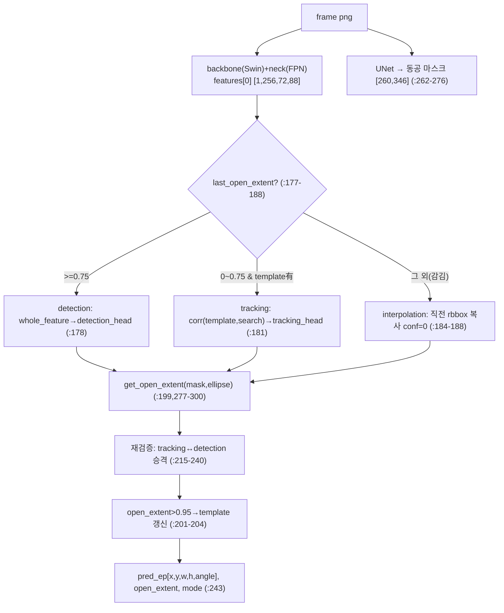
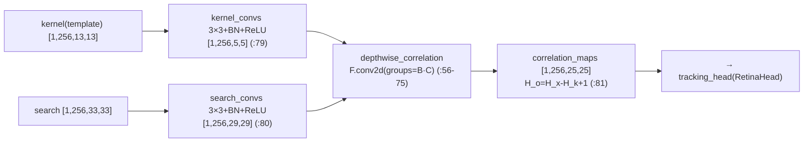
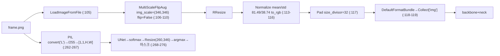

# Swift-Eye 모듈 통합 가이드 (S-PyTorch)

> 1차 요약: [`../Swift-Eye.md`](../Swift-Eye.md) — 본 문서는 그 요약을 모듈(클래스/함수) 단위로 심화한 S-PyTorch 변형 통합 가이드다.
> 분석 대상: `\\wsl.localhost\ubuntu-24.04\home\user\project\PRJXR-HBTXR\REF\XR-Eye-Tracking\Codebase\Swift-Eye`
> 관련 논문: [`../../Papers/Swift-Eye-Paper.md`](../../Papers/Swift-Eye-Paper.md) (Swift-Eye, IEEE TVCG Vol.30 No.5 2024, DOI 10.1109/TVCG.2024.3372039)
> 작성 원칙: 실제 소스 Read 후 `파일:라인` 근거 표기. 라인 근거 없는 해석은 "추정", 코드로 확인 불가는 "확인 불가"로 명시. 정확도(IoU/F1)는 README/논문 인용, 미실행 수치는 "확인 불가".
> **제외 범위**: MMRotate/mmdet/mmcv 외부 프레임워크 원본(`mmrotate/mmrotate/*`, `mmrotate/configs/*`, `mmrotate/tests/*` 중 표준 부분), 체크포인트(`*.pth`), 테스트 데이터·보간 프레임 이미지, timelens·LAMA 외부 도구. 단 원본 트리에 끼워넣은 커스텀(`correlation_head.py`, `RotatedAnchorGenerator_tracking`)은 분석 포함.

---

## 0. 문서 머리말

### 0.1 대표 케이스 선정 + 근거

본 repo는 **하나의 통합 추론 모델(`swift_eye`)을 4개의 독립 학습 산출물로 조립**하는 구조다. 추론 진입점이 실제 로드하는 통합 모델과, 논문 기여(temporal fusion = depthwise correlation 추적)를 구현한 학습기를 모두 대표로 선정한다.

- **대표 추론 모델(assembled): `swift_eye.model.swift_eye`**
  - 근거: 추론 엔트리가 `from model import swift_eye`로 임포트(`test_interpolated.py:5`)하고 `model.pth`를 strict 로드(`test_interpolated.py:17-18`, `model.py:58-59`). **실제 추론에 쓰이는 유일한 통합 본체**(backbone+neck+detection_head+tracking_head+correlation_head+UNet 6요소, `model.py:50-55`).
  - 특이점: 단일 nn.Module 안에 **검출/추적/보간 3-mode 상태머신**(`model.py:67-70, 177-243`)을 직접 코딩. 학습 루프 없음(추론 전용, `forward()`는 pass `model.py:359-360`).
- **대표 temporal fusion 학습기(논문 핵심): `train_with_temporal_fusion_component.model.swift_eye_temporal_fusion_component`**
  - 근거: backbone/neck를 **freeze**(`requires_grad=False`, `model.py:42-45`)하고 `correlation_head`+`tracking_head`만 학습(`model.py:38-41, 110-118`). 논문 §Temporal feature fusion의 SiamRPN++ depthwise cross-correlation(Swift-Eye-Paper.md:27-29)을 코드로 직접 구현. **anti-blink의 핵심 = 깨끗한 template ↔ 가려진 search 쌍 학습**(`sequence_dataset.py:101-102`).
- **대표 커스텀 모듈(외부 트리 삽입)**: `CorrelationHead`(`correlation_head.py:11-83`), `RotatedAnchorGenerator_tracking`(`anchor_generator.py:80-127`). MMRotate 원본 안에 들어있으나 Swift-Eye 고유 코드라 본문에서 정밀 해부.

> 정리: **추론 경로 = `swift_eye`(조립 모델)**, **논문 anti-blink 경로 = `temporal_fusion_component`(correlation 학습)**. 학습은 3단계 분리(backbone+neck → temporal fusion head → w/o-fusion detection head) 후 UNet까지 4개 가중치를 `assemble_model.ipynb`로 1개 `.pth`로 봉합(`assemble_model.ipynb:44,62,78,94,112-113`).

### 0.2 수치 표기 규약 (S-PyTorch)

- **params** = 서브모듈별 표준 산정. SwinTransformer-Tiny(`model_config.py:62-78`)는 패치임베드 + 4-stage transformer 블록 + LayerNorm으로 공개 표준값 ≈ **28M**(timm/논문 통상치, 추정 — 본 repo 코드만으론 직접 산출 불가하므로 "추정"). FPN = lateral 1×1(`Cin→256`) + output 3×3(`256→256`)×레벨(`model_config.py:80-84`). RetinaHead = stacked_convs=4×(3×3, 256→256) + cls/reg 헤드(`model_config.py:5-8`). UNet = DoubleConv 누적(`unet_model.py:13-23`).
- **MACs / FLOPs** = 입력 해상도 의존(`RResize img_scale=(346,346)`, `Pad size_divisor=32`로 348×288류 패딩 입력 추정, `model_config.py:108-117`). 회전검출 핵심 비용은 Swin backbone self-attention(window=7) + FPN. correlation 추적은 **소형 13×13 kernel × 33×33 search → 25×25 상관맵**(`correlation_head.py:75,79-81`)으로 매우 경량. **본 repo thop류 측정 코드 없음 → 절대 FLOPs "확인 불가", 논문도 수치 미보고**.
- **activation memory** = 텐서 `shape × bit`. FPN 최고해상도 feature `features[0]` = `[1,256,72,88]`(`model.py:62-63,175`) = 1·256·72·88·4B ≈ **6.49MB**(fp32). UNet 입력 260×346 1채널 → inc 64ch까지 확장이 세그 경로 지배항(추정).
- **회전 bbox 표현** = `[x_ctr, y_ctr, w, h, angle]` le90(`DeltaXYWHAOBBoxCoder` angle_range='le90', edge_swap=True, proj_xy=True, `model_config.py:15-22`). angle은 radian, **후처리에서 그대로 ellipse**로 해석(center=(x,y), 반축=(w/2,h/2), 회전각=angle·180/π, `test_interpolated.py:38`, `model.py:290`, `utils.py:184`). 별도 ellipse fitting 없음.
- **correlation 추적** = SiamRPN++ depthwise cross-correlation(`correlation_head.py:14-16,56-75`). `F.conv2d(groups=batch·channel)`로 채널별 상관(`correlation_head.py:73`). 출력 `H_o = H_x − H_k + 1`(`correlation_head.py:67`).
- **anti-blink FSM** = open_extent(눈 뜬 정도) 3-mode 상태머신. 임계값 `tracking_threshold=0`, `detection_threshold=0.75`, `template_update_threshold=0.95`(`model.py:67-69`). 논문 occlusion-ratio α gating(α<0.25 / 0.25≤α≤0.875 / α>0.875, Swift-Eye-Paper.md:40)과 **부호·기준 반대 매핑**(open_extent = 1−α 대응, 추정).
- **정확도** = README는 5000fps vs 25fps 궤적 비교 영상만 제공(README:48-50), 정량 IoU/F1 표는 README·코드 내 **부재**. 메트릭 함수 `calculate_iou`(ellipse 기반, `utils.py:181-189`)는 존재하나 추론 엔트리가 호출 안 함(`test_interpolated.py`는 시각화만). 논문값: occlusion>80%에서 2위(EllSeg) 대비 **IoU +20%(0.58→0.702), F1 +12.5%(0.726→0.817)**(Swift-Eye-Paper.md:52). **본 repo 미실행 → 절대 수치 "확인 불가", 논문값 인용**.

### 0.3 운영 경로 (학습 ↔ 조립 ↔ 추론)

```
[원시 이벤트 스트림 (EV-Eye, DAVIS346, 25fps+이벤트)]   ← 외부 [제외]
      │  timelens 보간(외부 도구, README:28) → 5000fps grayscale 프레임
      ▼
[interpolated_frames/*.png]  +  [학습 df.pickle: template_path/search_path/origin_poly/occlusion_poly]
      │
      ├─[1단계] train_backbone_and_neck.py: RoITransformer(2-stage) 전체 학습
      │     Swin-T + FPN + RotatedRPNHead + RoITransRoIHead, AdamW lr=1e-4 wd=0.05, 30ep
      │     → epoch_30.pth (backbone+neck 가중치 추출용)
      │
      ├─[2단계] train_with_temporal_fusion_component.py: backbone/neck freeze
      │     correlation_head + tracking_head(RetinaHead)만 학습, Adam lr=1e-4, 30ep
      │     template(13×13)/search(33×33) feature jitter crop → epoch_29.pth
      │
      ├─[3단계] train_without_temporal_fusion_component.py: detection_head만 단일프레임 학습
      │     → epoch_24.pth (비교군/detection 경로)
      │
      └─[4단계] UNet 세그 별도 학습 → checkpoint_epoch15.pth (occlusion-ratio estimator)
            │
            ▼  assemble_model.ipynb: 4개 가중치 → 1개 model.pth 봉합 (:44,62,78,94,112-113)
[추론: test_interpolated.py]
      │  swift_eye(model.pth) → get_first_pred(첫 프레임 검출) → predict(프레임별 3-mode FSM)
      ▼
[출력: 회전 bbox→ellipse 시각화 images_consequence/*.png (:13,39); interpolation 프레임 skip(:36)]
```
- 체크포인트(`*.pth`)·보간 프레임·테스트 데이터는 Google Drive 외부 제공(README:28-43), 본 repo 미포함 [제외].

### 0.4 모델 / 데이터셋 / 정확도 요약

| 항목 | 값 | 근거 |
|---|---|---|
| 입력(검출/추적) | grayscale→3ch RGB 정규화 텐서, RResize(346,346)+Pad(/32) | `model_config.py:104-117` |
| 입력(UNet) | grayscale 1채널 `[1,1,H,W]`, /255 | `model.py:262-267` |
| 출력 | 동공 회전 bbox `[x,y,w,h,angle]` le90 → ellipse | `test_interpolated.py:32,38`, `model.py:290` |
| 백본 | SwinTransformer-Tiny(96, [2,2,6,2], heads[3,6,12,24], win7) | `model_config.py:62-78` |
| 넥 | FPN(in[96,192,384,768]→256, num_outs=5) | `model_config.py:80-84` |
| 헤드 | RotatedRetinaHead ×2(검출/추적), num_classes=1 | `model_config.py:3-52,127-176` |
| 추적 | CorrelationHead(SiamRPN++ depthwise corr) | `correlation_head.py:11-83` |
| 세그 | UNet(1→2class, ConvTranspose) | `unet_model.py:6-36` |
| params | Swin-T ≈28M(추정) + FPN/헤드/UNet | 표준치 추정, 직접 산출 확인 불가 |
| Loss | cls=FocalLoss(γ2,α0.25), bbox=L1Loss | `model_config.py:23-29` |
| optimizer | 1단계 AdamW lr1e-4 wd0.05/30ep, 2·3단계 Adam lr1e-4/30ep | `swift_eye_config.py:83-100`, `train_with_*.py:264,266` |
| 데이터셋 | EV-Eye + timelens 보간 + LAMA 합성 occlusion | README:28, Swift-Eye-Paper.md:18,47 |
| 메트릭 | ellipse IoU(코드, 미호출) / 논문 IoU·F1 | `utils.py:181-189` / Swift-Eye-Paper.md:51-52 |
| 정확도(논문, occ>80%) | IoU 0.702, F1 0.817 (2위 대비 +20%/+12.5%) | Swift-Eye-Paper.md:52 (본 repo 미실행 → 확인 불가) |

---

## 1. Repo / Layer 개요 (검출 / 추적 / anti-blink 맵)

Swift-Eye = timelens 보간 고FPS 프레임에서 동공을 **회전 bbox로 검출**하고, blink(occlusion) 구간을 **SiamRPN++식 depthwise correlation 추적**과 **선형 보간**으로 메우는 anti-blink 파이프라인. Swin-T + MMRotate 기반, **offline 지향**(논문 명시, Swift-Eye-Paper.md:13,59). HW 커널·CUDA 커스텀 확장 없는 순수 PyTorch지만, 외부 mmrotate/mmdet/mmcv 레지스트리·연산에 깊이 의존(이식성 ConvLSTM 대비 낮음).

### 1.1 파일 역할 맵

| 구분 | 파일 | 역할 | 메인 사용 |
|---|---|---|---|
| **메인(통합 추론)** | `swift_eye/model.py` | `swift_eye` 6요소 통합 + 3-mode FSM | ★ 추론 본체 |
| **추론 진입점** | `swift_eye/test_interpolated.py` | 프레임 순회 → 첫프레임 검출 → predict | ★ 실행점 |
| **모델 설정** | `swift_eye/model_config.py` | backbone/neck/2헤드/correlation/mask/pipeline | ★ cfg |
| **좌표/IoU 유틸** | `swift_eye/utils.py` | obb↔poly, obb→hbb, ellipse IoU | ★ |
| **세그(occlusion estimator)** | `swift_eye/unet/unet_model.py`,`unet_parts.py` | 동공 픽셀 마스크(open_extent용) | ★ |
| **가중치 조립** | `swift_eye/assemble_model.ipynb` | 4개 학습 산출물→model.pth 봉합 | 1회 실행 |
| **추적 헤드(커스텀)** | `mmrotate/.../detectors/correlation_head.py` | SiamRPN++ depthwise cross-correlation | ★ 논문 핵심 |
| **추적 anchor(커스텀)** | `mmrotate/.../anchor/anchor_generator.py:80-127` | `RotatedAnchorGenerator_tracking` search 좌표 보정 | ★ |
| **[1단계] backbone+neck 학습** | `train_backbone_and_neck/` | RoITransformer 전체 사전학습 | 학습 |
| **[2단계] temporal fusion 학습** | `train_with_temporal_fusion_component/` | correlation+tracking head 학습(freeze backbone) | ★ 학습 |
| **[3단계] 비교군** | `train_without_temporal_fusion_component/` | detection head만 단일프레임 | 학습 |
| **시퀀스 데이터셋** | `.../regress_classify_datasets_code/` | template/search 쌍 + seq-sync 증강 | 학습 |
| **[제외] 외부 원본** | `mmrotate/mmrotate/*`, `configs/*`, `tests/*` | MMRotate 0.3.4 표준 | 제외 |
| **[제외]** | `*.pth`, `interpolated_frames/*`, 테스트 데이터 | 체크포인트·이미지 | 제외 |

### 1.2 추론 진입점

`test_interpolated.py:31` `model.get_first_pred(img_path)`(첫 프레임 전체 검출) → 이후 프레임마다 `model.predict(img_path)`(`test_interpolated.py:35`) → 내부 3-mode FSM(`model.py:177-243`) → `pred_ep,open_extent,mode` 반환 → mode≠interpolation이면 ellipse 시각화 저장(`test_interpolated.py:36-39`).

### 1.3 제외 목록
- **외부 프레임워크 원본**: MMRotate 0.3.4(`mmrotate/mmrotate/`, `configs/`(s2anet/redet/roi_trans 등 DOTA 표준), `tests/`), mmdet 2.28.2, mmcv-full 1.7.2(`requirements.txt:96-98`). import·레지스트리 빌드만 사용, 본 repo 소스 아님.
- **외부 데이터/도구**: timelens 보간(README:28), LAMA in-painting 합성(Swift-Eye-Paper.md:18), EV-Eye 원본, Google Drive 체크포인트·테스트 데이터(README:28-43).
- **체크포인트·산출 이미지**: `model.pth`, `epoch_*.pth`, `checkpoint_epoch15.pth`, `interpolated_frames/*.png`, `images_consequence/*`.
- **레거시/미호출 경로**: `get_pred_masks_origin`(FCNMaskHead 경로, `model.py:244-260`)는 정의만 있고 호출 안 됨 — 추론은 UNet 경로(`get_pred_masks`, `model.py:261-276`) 사용(4.5절 확인됨).

---

## 2. 모듈: 통합 추론 모델 — `swift_eye` + 3-mode anti-blink FSM (추론 본체)

### 2.1 역할 + 상위/하위
- **역할**: backbone/neck/2헤드/correlation/UNet 6요소를 1개 nn.Module로 묶고, 프레임마다 open_extent에 따라 **검출↔추적↔보간** 3-mode를 전환하며 동공 회전 bbox를 산출. 학습 없는 추론 전용 상태머신.
- **상위**: 추론 엔트리 `test_interpolated.py`가 `get_first_pred`/`predict` 호출(`:31,35`).
- **하위**: `SwinTransformer`(backbone), `FPN`(neck), `RotatedRetinaHead`×2(detection/tracking head), `CorrelationHead`, `UNet`(`model.py:50-55`).

### 2.2 데이터플로우 (텐서 shape · mode 전환)

mode 전환: `last_open_extent` 한 변수가 detection(≥0.75)/tracking(0~0.75)/interpolation(≤0)을 가른다(`model.py:177-188`).

### 2.3 forward call stack
```
test_interpolated.py:35 model.predict(img_path)
└─ predict (model.py:160, @torch.no_grad)
   ├─ get_top_left(last_pred_rbbox[:2]) → search ROI 좌상단 (:162, 96-125)
   ├─ backbone+neck → features[0] [1,256,72,88] (:172-175)
   ├─ roi_features = features[0][:, :, ty:ty+33, tx:tx+33] (:174)
   ├─ get_pred_masks → UNet 마스크 (:176, 262-276)
   ├─ mode 분기 (:177-188): detection / tracking / interpolation
   │    ├─ detection_head_simple_test(whole_features) (:178, 306-325)
   │    └─ tracking_head_simple_test(roi,template) (:181, 327-357)
   │         └─ correlation_head(template, search) → tracking_head (:344-349)
   ├─ tracking이면 전역좌표 복원 pred_ep[:2]+=top_left*4 (:196-197)
   ├─ get_open_extent(mask, ellipse) (:199, 277-300)
   ├─ template 갱신(open_extent>0.95) (:201-204)
   ├─ interpolation+마스크면 무게중심 중심 갱신 (:206-211)
   └─ 사후 재검증 tracking/detection 승격 (:215-240)
```

### 2.4 대표 코드 위치
`model.py:45-88`(생성자·6요소·임계값·img_metas), `:96-125`(get_top_left ROI), `:127-157`(get_first_pred), `:160-243`(predict FSM), `:277-300`(get_open_extent).

### 2.5 대표 코드 블록

**(a) 3-mode 1차 분기 (`model.py:177-188`)**
```python
if self.last_open_extent>=self.detection_threshold or (...template is None):# 0.75 이상
    results=self.detection_head_simple_test(tuple([whole_features]),self.detection_img_metas)
    self.mode="detection"
elif self.last_open_extent>self.tracking_threshold and self.last_open_extent<self.detection_threshold:# 0~0.75
    results=self.tracking_head_simple_test(roi_features,self.template)
    self.mode="tracking"
else:# 눈 거의 감김
    results=self.last_pred_rbbox.numpy(); results=results.reshape(1,1,1,5)
    confidence=np.array([0]).reshape(1,1,1,1)
    results=np.concatenate((results,confidence),axis=3); self.mode="interpolation"
```
→ open_extent 임계 `0.75`로 검출/추적 갈림, 추적 신뢰 없으면 직전 bbox를 conf=0으로 복사(보간 placeholder). 논문 α gating(0.25/0.875)과 임계값·부호가 다름 — open_extent≈1−α 매핑(추정), 코드 임계는 데모 튜닝값(추정).

**(b) 사후 재검증 — 보간/검출→추적 승격 (`model.py:215-229`)**
```python
if (open_extent>tracking_threshold and open_extent<detection_threshold and mode=="interpolation") or\
   (open_extent<detection_threshold and open_extent>tracking_threshold and mode=="detection"):
    self.mode="tracking"
    results=self.tracking_head_simple_test(roi_features,self.template)
    if len(results[0][0])>0 and results[0][0][0][5]>0: pred_ep=results[0][0][0][0:5]; self.mode="tracking"
    else: pred_ep=self.last_pred_rbbox.numpy(); self.mode="interpolation"
    ...pred_ep[:2]+=top_left*4 (tracking일 때)
```
→ open_extent를 재계산한 뒤 모드를 **상향 복귀**(interpolation→tracking, tracking→detection `:231-240`). 즉 눈이 다시 뜨이면 점진적으로 검출 정확도로 회귀하는 히스테리시스성 FSM. **회전검출 신뢰도 `results[0][0][0][5]`(6번째 값)** 로 추적 실패를 보간으로 fallback.

**(c) interpolation 마스크 무게중심 보정 (`model.py:206-211`)**
```python
if open_extent>self.tracking_threshold and self.mode=='interpolation':
    y,x=np.where(pred_mask==True)
    center_x,center_y=np.mean(x),np.mean(y)
    self.last_pred_rbbox[0]=center_x; self.last_pred_rbbox[1]=center_y
    top_left=self.get_top_left(self.last_pred_rbbox[:2])
    roi_features=features[0][:, :, top_left[1]:top_left[1]+self.search_shape, ...]
```
→ 보간 모드라도 UNet 마스크가 동공을 일부 잡으면 마스크 무게중심으로 중심을 갱신해 search ROI를 재배치 → 다음 추적 시도 정확도 향상.

### 2.6 연산 분해 + 정량
- **params**: Swin-T ≈28M(추정, 공개 표준치) + FPN(lateral 1×1: 96·256+192·256+384·256+768·256 ≈ 0.37M, output 3×3: 5레벨·256·256·9 ≈ 2.95M, `model_config.py:80-84` 추정) + RetinaHead ×2(각 stacked 4×(256·256·9)≈2.36M + cls/reg, `model_config.py:5-8`) + UNet(DoubleConv 누적, 수 M). **합 ≈ 30M+ (추정, 직접 산출 확인 불가)**.
- **MAC**: Swin self-attention + FPN이 지배(346×346급 입력). correlation은 13×13 kernel·33×33 search·256ch → depthwise conv MAC ≈ 256·25·25·13·13 ≈ 27M(`correlation_head.py:75` 출력 25×25 기준 추정)로 **백본 대비 미미**. 추적 경로가 백본보다 훨씬 가벼움이 핵심(8절 HW 시사).
- **activation memory**: `features[0] [1,256,72,88]` ≈ 6.49MB(fp32, `model.py:175`). UNet 풀해상도 경로(260×346)가 세그 메모리 지배(추정). 추론 batch=1.
- **FSM 자체 연산**: 비교·np.where·cv2.ellipse 등 제어/CPU 연산 — GPU 텐서 연산 대비 무시할 수준이나 매 프레임 CPU↔GPU 왕복(`model.py:184,193,198`) 발생(지연 리스크, 8절).

---

## 3. 모듈: CorrelationHead — SiamRPN++ depthwise cross-correlation (논문 핵심, 커스텀)

### 3.1 역할 + 상위/하위
- **역할**: template feature(이전 완전개안 프레임 동공, 13×13)를 커널로, search feature(현 프레임, 33×33)를 입력으로 **채널별 depthwise cross-correlation** → 상관맵(25×25)을 생성. 시간적 연속성(temporal fusion)을 conv 1회로 융합 = anti-blink 추적의 코어.
- **상위**: `swift_eye.tracking_head_simple_test`(`model.py:344`), `swift_eye_temporal_fusion_component.forward`(`train_with_*.model.py:111`).
- **하위**: `ConvModule`×2(kernel_convs/search_convs, 3×3+BN+ReLU), `F.conv2d(groups=...)`.

### 3.2 데이터플로우

> 주: ConvModule 3×3(padding 미지정→0)이 H,W를 2씩 줄여 13→5(kernel), 33→29(search)로 감소(`correlation_head.py:79-80` 주석). 상관 후 29−5+1=25(`:81`).

### 3.3 forward call stack
```
tracking_head_simple_test (model.py:327)
└─ self.correlation_head(kernel=template, search=roi) (model.py:344)
   └─ CorrelationHead.forward (correlation_head.py:78)
      ├─ kernel = self.kernel_convs(kernel) (:79)
      ├─ search = self.search_convs(search) (:80)
      └─ depthwise_correlation(search, kernel) (:81, 56-75)
         ├─ x.view(1, B·C, Hx, Wx) (:71)
         ├─ kernel.view(B·C, 1, Hk, Wk) (:72)
         └─ F.conv2d(x, kernel, groups=B·C) (:73)
```

### 3.4 대표 코드 위치
`correlation_head.py:41-53`(kernel/search ConvModule), `:56-75`(depthwise_correlation), `:78-82`(forward), `:8-9`(`@ROTATED_DETECTORS.register_module()`).

### 3.5 대표 코드 블록

**(a) depthwise cross-correlation (`correlation_head.py:69-75`)**
```python
batch = kernel.size(0); channel = kernel.size(1)
x = x.view(1, batch * channel, x.size(2), x.size(3))           # search를 그룹 입력으로
kernel = kernel.view(batch * channel, 1, kernel.size(2), kernel.size(3))  # template을 그룹 필터로
out = F.conv2d(x, kernel, groups=batch * channel)             # 채널별 독립 상관
out = out.view(batch, channel, out.size(2), out.size(3))
return out  # 1,256,25,25
```
→ `groups=B·C`로 256개 채널 각각 독립 cross-correlation = SiamRPN++ depthwise corr(`:14-16` docstring, arXiv:1812.11703). 표준 dense conv보다 연산 저렴. **HW 매핑 시 채널 병렬 PE 배열에 직결**(8절).

**(b) 레지스트리 등록 vs 빌드 불일치 (`correlation_head.py:8-9` ↔ `model.py:54`)**
```python
# correlation_head.py
@ROTATED_DETECTORS.register_module()
class CorrelationHead(BaseModule): ...
# model.py:54
self.correlation_head=MODELS.build(self.cfg.correlation_head)
```
→ `ROTATED_DETECTORS`로 등록하지만 추론은 `MODELS` 레지스트리로 빌드. mmrotate 내부 레지스트리 alias/부모-자식 관계로 동작(추정 — 코드만으론 alias 경로 확인 불가).

### 3.6 연산 분해 + 정량
- **params**: kernel_convs + search_convs = 2×(256·256·3·3 + BN 2·256) ≈ 2×(589,824+512) = **1,180,672 ≈ 1.18M**(`correlation_head.py:41-53`, padding/bias 표준 가정 산정).
- **MAC**: search_convs(29×29 출력 기준) ≈ 256·256·9·29·29 ≈ 0.50G, kernel_convs(5×5) ≈ 256·256·9·5·5 ≈ 14.7M, depthwise corr ≈ 256·25·25·13·13 ≈ 27M(추정). → ConvModule가 corr 자체보다 큼.
- **activation**: 상관맵 `[1,256,25,25]` = 256·625·4B ≈ 0.64MB(fp32). 매우 경량.
- **논문 대조**: 논문은 52×52px 원영역 → 최저레벨 피라미드 13×13 template(Swift-Eye-Paper.md:28)로 코드(template_shape=13, `model.py:65`)와 일치(확인됨). search 33은 코드 고유(논문 미명시 수치, 추정).

---

## 4. 모듈: 회전검출 헤드 + anchor + 좌표/ellipse 변환

### 4.1 RotatedRetinaHead ×2 (검출/추적 헤드, `model_config.py:3-52,127-176`)
- **역할**: 1-stage anchor-based 회전 객체 검출. detection_head는 전체 feature(72×88)에, tracking_head는 correlation 상관맵(25×25)에 적용. 둘 다 동일 구조, anchor generator만 다름.
- **구성**: num_classes=1(pupil), in_channels=256, stacked_convs=4, feat_channels=256(`model_config.py:5-8,129-132`).
- **anchor**: scales=[6,8,10], ratios=[1.0,0.5,2.0], strides=[4](`model_config.py:10-14`). detection=`RotatedAnchorGenerator`(표준), tracking=`RotatedAnchorGenerator_tracking`(커스텀, `:11` vs `:135`). 레벨1·3scale·3ratio=9 anchor/위치. 논문 "anchor box ~10,000개"(Swift-Eye-Paper.md:33,59)는 72×88×9≈57k급(전체feature) 또는 검출 척도에 따른 추정 — 코드 척도와 직접 대조 불가.
- **bbox_coder**: `DeltaXYWHAOBBoxCoder` le90, edge_swap=True, proj_xy=True, target_stds=(1,1,1,1,1)(`model_config.py:15-22`). 논문 디코딩 수식 `P_w=max{...}, P_x=d_x·B_w·cos(B_a)−...`(Swift-Eye-Paper.md:34-36)을 mmrotate coder가 구현(외부, 제외).
- **loss**: cls=`FocalLoss`(γ=2.0, α=0.25), bbox=`L1Loss`(`model_config.py:23-29`). 논문 GPU 학습과 정합.
- **assigner/sampler**: `MaxIoUAssigner`(pos0.5/neg0.4) + `RBboxOverlaps2D`, `RandomSampler`(num=64, pos_fraction=0.25)(`model_config.py:31-42`).
- **test_cfg**: nms_pre=2000, score_thr=0.05, nms iou_thr=0.5, max_per_img=2000(`model_config.py:46-51`).

### 4.2 RotatedAnchorGenerator_tracking (커스텀, `anchor_generator.py:80-127`)
- **역할**: 표준 `AnchorGenerator` 상속, HBB anchor를 `[x,y,w,h,θ=0]` 회전 anchor로 변환 후, correlation으로 축소된 상관맵 좌표를 search 원영역 좌표계에 정렬.
- **핵심 보정 (`anchor_generator.py:113-122`)**:
```python
anchors = super().single_level_grid_priors(featmap_size, level_idx, ...)  # HBB
xy = (anchors[:,2:]+anchors[:,:2])/2; wh = anchors[:,2:]-anchors[:,:2]
theta = xy.new_zeros((num_anchors,1)); anchors = torch.cat([xy,wh,theta], axis=1)
anchors[:,:2]=anchors[:,:2]-10*4    # template 절반 오프셋 보정
anchors[:,:2]=anchors[:,:2]+33*4/2  # search 중심 정렬(scaled map과 searched image 중심 일치)
```
→ `−10*4`(=−40, template feature 절반×stride4)와 `+33*4/2`(=+66, search 절반×stride4)로 correlation 출력 크기 축소(33→25)를 보정해 anchor 중심을 search 이미지 중심에 맞춤(`:118-125` 주석). **추적 좌표계 정합의 핵심 커스텀**, SiameseRPNHead 참조(`:84-85`).

### 4.3 회전 bbox → ellipse 후처리 + 좌표 유틸 (`utils.py`)
- **rotated bbox = ellipse 직결**: 별도 fitting 없이 `[x,y,w,h,angle]`을 center=(x,y), 반축=(w/2,h/2), 회전각=angle·180/π로 cv2.ellipse(`test_interpolated.py:38`, `model.py:290`, `utils.py:184`). **동공이 타원이라는 강한 prior**(논문 강점, Swift-Eye-Paper.md:58).
- **변환 함수**: `obb2poly_le90`(`utils.py:9-34`, 회전행렬 matmul), `poly2obb_le90`(`:54-84`, edge1/edge2 비교로 w=max·h=min·angle 결정), `obb2hbb_le90`(`:116-139`), `hbb2xyxy`/`xyxy2hbb`(`:142-179`). 학습 시 GT poly→obb 변환(`sequence_dataset.py:122`)·feature crop 후 obb 재계산(`train_with_*.py:207-210`)에 사용.

### 4.4 ellipse IoU 메트릭 (`utils.py:181-189`)
```python
mask1=cv2.ellipse(mask1, center_pred, axes_pred, angle_pred, 0,360, 1,-1)  # 260×346
mask2=cv2.ellipse(mask2, center_gt, axes_gt, angle_gt, 0,360, 1,-1)
intersection=np.where((mask1==1)&(mask2==1))[0].shape[0]
union=np.where((mask1==1)|(mask2==1))[0].shape[0]
iou=intersection/union
```
→ 예측/GT ellipse를 260×346 마스크로 채워 픽셀 IoU 산출. 논문 IoU 정의(|P∩G|/|P∪G|, Swift-Eye-Paper.md:51)와 동형. **단 추론 엔트리(`test_interpolated.py`)는 이 함수를 호출하지 않음**(시각화만) → 정량 평가는 별도 스크립트 필요(repo 미포함, 확인 불가).

### 4.5 UNet 세그멘테이션 = occlusion-ratio estimator (`unet/`)
- **역할**: grayscale 1채널 → 2-class(동공/배경) 세그 마스크 → open_extent 계산의 분모/교집합 근거(`model.py:268-298`). 논문 "U-Net 분할로 노출 동공 픽셀 P_s, 완전개안 면적 P_l → α=(P_l−P_s)/P_l"(Swift-Eye-Paper.md:39)의 P_s 제공자.
- **구조**(`unet_model.py:13-23`): inc(1→64), down1~4(64→128→256→512→1024), up1~4, outc(64→2). bilinear=False → `ConvTranspose2d`(`unet_parts.py:53`). DoubleConv=Conv-BN-ReLU×2(`unet_parts.py:8-25`).
- **get_open_extent 핵심**(`model.py:288-298`):
```python
mask=cv2.ellipse(zeros, center, (w/2,h/2), angle*180/np.pi, 0,360, 255,-1)
if mode!="interpolation":  # 검출/추적: ellipse가 실제 마스크와 얼마나 겹치나
    open_extent=len(intersection)/len(detection)   # 교집합/ellipse면적
else:                       # 보간: 세그면적/ellipse면적
    open_extent=len(seg)/len(detection)
```
→ open_extent = 검출 ellipse ∩ UNet 동공마스크 / ellipse 면적 = 가림 정도의 역수(눈 뜬 정도). FSM mode 전환의 정량 게이트. `get_pred_masks_origin`(FCNMaskHead 경로, `model.py:244-260`)은 레거시·미호출(추정).

### 4.6 연산 분해 + 정량
- **RetinaHead params**(×2): stacked_convs 4×(256·256·9)=2,359,296, cls(256·9·1·9 anchor)·reg(256·9·5·9) 추가 → 헤드당 ≈ 2.5M, 2개 ≈ 5M(`model_config.py:5-8` 추정).
- **UNet params**: down 경로 64→1024 DoubleConv 누적 + up 경로 → 표준 UNet ≈ **17M**(`unet_model.py:13-23`, 공개 표준치 추정, 직접 산출 확인 불가).
- **anchor 수**: 척도별 상이. tracking 상관맵 25×25×9 ≈ 5,625, detection 72×88×9 ≈ 57,024(전체feature 적용 시, 추정). 논문 "~10,000개"는 검출 척도 추정값(Swift-Eye-Paper.md:33).

---

## 5. 모듈: temporal fusion 학습기 + occlusion-aware 데이터 (anti-blink 학습)

본 repo의 anti-blink는 **추적기를 깨끗한 template ↔ 가려진 search 쌍으로 학습**해 실현. 3단계 분리 학습 중 2단계가 핵심.

### 5.1 `swift_eye_temporal_fusion_component` — correlation+tracking head 학습 (대표)
- **역할**: backbone/neck를 freeze하고 correlation_head+tracking_head만 학습. forward는 correlation → RetinaHead.forward_train → loss(`train_with_*.model.py:110-118`).
- **freeze (`train_with_*.model.py:42-45`)**: `for param in self.backbone/neck.parameters(): param.requires_grad=False`. 1단계 사전학습 가중치 재사용 → 학습 효율·안정.

**(a) forward = correlation→head loss (`train_with_*.model.py:110-118`)**
```python
def forward(self,search,kernel,img_metas,gt_bboxes,gt_labels):
    x=self.correlation_head(kernel,search)
    feats=tuple([x])
    losses = self.tracking_head.forward_train(feats, img_metas, gt_bboxes, gt_labels, None)
    loss, log_vars=self._parse_losses(losses)
    return loss,log_vars
```

**(b) template/search jitter crop (`train_with_*.train.py:141-211`)**: GT bbox 주변에서 template(13×13)/search(33×33) feature를 **랜덤 시프트**하며 크롭. `torch.randint(low=left_acquired-shift_x, high=...)`(`:176,198`)로 좌상단 위치를 jitter(search_feature_shift=6, template_feature_shift=3, `train.py:69-70`) → 추적 강건성 증강. obb 좌표도 crop 오프셋만큼 재계산(`:207-210`).

### 5.2 occlusion-aware 데이터셋 `gazeSequenceDataset` (anti-blink 핵심)
- **template/search 쌍 (`sequence_dataset.py:101-102`)**:
```python
pair_data_infos.append([
    self.load_image_annotation(df['template_path'].iloc[i], df['origin_poly'].iloc[i]),   # 깨끗한 template
    self.load_image_annotation(df['search_path'].iloc[i], df['occlusion_poly'].iloc[i])]) # 가려진 search
```
→ **완전개안 template(origin_poly) ↔ 부분 가림 search(occlusion_poly)** 쌍. 가림은 LAMA in-painting 합성(논문, Swift-Eye-Paper.md:18). 이 쌍이 "가려진 search에서도 동공 위치를 template로 예측"하는 anti-blink를 직접 최적화.

### 5.3 시퀀스 일관 증강 (seq-sync flip/rotate, 커스텀)
- **문제**: template(seq=0)과 search(seq=1)에 독립 랜덤 증강을 주면 쌍의 기하 정합이 깨짐.
- **해법 (`sequence_dataset.py:46-54, 177-187`)**: template에서 정한 flip/rotate를 search에 동일 적용.
```python
# Compose.__call__: RRandomFlip엔 (flip_direction,seq_number), PolyRandomRotate엔 (rotate_angle,seq_number) 전달
template_results=self.pipeline(template_results, flip_direction=None, seq_number=0, rotate_angle=0)
flip_direction=template_results['img_metas'].data['flip_direction']  # template이 결정
rotate_angle=template_results['img_metas'].data['rotate_angle']
search_results=self.pipeline(search_results, flip_direction, seq_number=1, rotate_angle=rotate_angle)  # search 동기화
```
- `RRandomFlip.__call__`(`transforms.py:541-542`): `if cur_dir is None and seq_number==0: cur_dir=np.random.choice(...)` → seq=0만 새 방향 추첨, seq=1은 전달받은 방향 사용.
- `PolyRandomRotate.__call__`(`transforms.py:846-858`): `if seq_number==0:` 새 각도 결정, `else: angle=rotate_angle` → 쌍 내 회전각 동기화. **쌍 기하 변환 동기화가 핵심 커스텀**.

### 5.4 3단계 학습 비교표

| 단계 | 파일 | 학습 대상 | freeze | 데이터 | optimizer | epoch | 산출 |
|---|---|---|---|---|---|---|---|
| 1 backbone+neck | `train_backbone_and_neck.py` | RoITransformer 전체(Swin+FPN+RPN+RoIHead) | 없음 | GazeDataset 단일 | AdamW lr1e-4 wd0.05 | 30 | epoch_30.pth |
| 2 temporal fusion | `train_with_temporal_fusion_component.py` | correlation+tracking head | backbone/neck | template/search 쌍 | Adam lr1e-4 | 30 | epoch_29.pth |
| 3 w/o fusion(비교군) | `train_without_temporal_fusion_component.py` | detection head만 | backbone/neck | 단일 image_path | Adam lr1e-4 | 30 | epoch_24.pth |
| 4 UNet 세그 | (별도) | UNet 2-class | — | 동공 마스크 | — | — | checkpoint_epoch15.pth |

> 근거: 1단계 `swift_eye_config.py:83-100,114-289`; 2단계 freeze `train_with_*.model.py:42-45`, lr `train.py:68`, 저장 `train.py:297-299`; 3단계 detection만 `train_without_*.model.py:38`, 단일 데이터 `train_without_*.../sequence_dataset.py:102`(image_path); 조립 epoch 번호 `assemble_model.ipynb:44,62,78,94`.

### 5.5 연산 분해 + 정량 (학습)
- **학습 가능 params**: 2단계는 correlation(1.18M, 3.6절) + tracking RetinaHead(≈2.5M) ≈ **3.7M만 학습**(backbone 28M freeze) → 학습 매우 가벼움.
- **batch/lr**: batch_size=8(`train.py:63`), Adam lr=1e-4(`train.py:68`), val loss 최소 epoch 저장(`train.py:297-299`). 논문 Adam lr1e-4 batch8(Swift-Eye-Paper.md:47)과 **일치**(확인됨).
- **데이터 의존**: 실제 학습 곡선·수렴 epoch는 데이터(df.pickle)·체크포인트 의존, 본 repo 미포함 → **"확인 불가"**(조립 노트북이 epoch_29/epoch_24 로드하는 것으로 보아 그 epoch가 best, 추정).
- **결선(확인됨)**: 학습된 correlation_head+tracking_head(epoch_29)는 `assemble_model.ipynb`에서 추론 모델의 동명 서브모듈에 직접 로드(`:62,112`). 추론 시 tracking 모드에서 활성(`model.py:181,344`).

---

## 6. 모듈: 추론 파이프라인 + 정규화 (`model_config.py` test pipeline / get_pred_masks)

### 6.1 역할 + 상위/하위
- **역할**: 입력 PNG → mmdet `Compose` test pipeline으로 RResize(346,346)→Normalize→Pad(/32)→텐서화. 별도 UNet 입력은 PIL grayscale /255.
- **상위**: `swift_eye.get_first_pred`/`predict`가 `self.test_pipeline(data)` 호출(`model.py:131,165`). **하위**: mmdet `LoadImageFromFile`, `RResize`, `Normalize`, `Pad`, `DefaultFormatBundle`(외부, 제외).

### 6.2 데이터플로우


### 6.3 forward call stack (데이터)
```
get_first_pred (model.py:127) / predict (model.py:160)
├─ data=self.test_pipeline(dict(img_info=dict(filename=img_path))) (:131,165)
├─ collate(datas, samples_per_gpu=1) → scatter([0]) (:133-135,167-170)
├─ img_as_tensor=data['img'][0] (:136,171)
└─ get_pred_masks(img_path) (:145,176)
   ├─ Image.open.convert('L') → /255 → unsqueeze (:263-266)
   ├─ self.unet(img) → softmax (:268-269)
   └─ unet_ransform(Resize 260,346)→argmax→동공마스크 0/1 (:270-276)
```

### 6.4 대표 코드 위치
`model_config.py:102-123`(test pipeline), `:113-116`(Normalize mean/std), `model.py:71-75`(unet_ransform), `:262-276`(get_pred_masks).

### 6.5 대표 코드 블록

**(a) 회색조→3채널 RGB 정규화 (`model_config.py:113-116`)**
```python
dict(type='Normalize', mean=[81.49, 81.49, 81.49], std=[38.74, 38.74, 38.74], to_rgb=True)
```
→ 단일 grayscale 통계(평균 81.49, std 38.74)를 3채널 동일 적용. `to_rgb=True`이나 평균이 3채널 동일하므로 회색조를 복제한 pseudo-RGB(추정). 학습 시 데이터셋도 동일(`sequence_dataset.py:25-26`).

**(b) UNet 마스크 산출 (`model.py:268-276`)**
```python
output = self.unet(img); probs = F.softmax(output, dim=1)[0]
full_mask = self.unet_ransform(probs.cpu()).squeeze()      # Resize 260×346
full_mask = F.one_hot(full_mask.argmax(dim=0), 2).permute(2,0,1).numpy()
mask=Image.fromarray((np.argmax(full_mask,axis=0)*255/full_mask.shape[0]).astype(np.uint8))
result_segmentation=np.array(mask); y,x=np.where(result_segmentation!=0); result_segmentation[y,x]=1
return result_segmentation  # 260×346, 0/1
```
→ 2-class softmax→argmax→260×346 0/1 마스크. open_extent의 동공 픽셀 집합(`model.py:293,296`). GPU↔CPU 왕복(`.cpu()` `:270`) 발생.

### 6.6 연산 분해 + 정량
- params 없음(pipeline)/UNet은 4.6절. 비용은 backbone forward(지배) + UNet forward(세그).
- 입력 텐서: RResize(346,346)+Pad(/32) → 추정 352×352류 3채널(`model_config.py:108,117`). features[0] 72×88(`model.py:62-63`, stride4: 346/4≈86~88).
- UNet 입력은 원본 해상도 그대로(/255만, resize는 출력에서 260×346) → 세그 연산이 입력 해상도에 민감(추정).

---

## 7. 모듈 한눈표

| # | 모듈 | 파일:라인 | 역할 | 대표 정량 |
|---|---|---|---|---|
| 2 | swift_eye + 3-mode FSM | swift_eye/model.py:45-360 | 6요소 통합 추론·anti-blink 상태머신 | features[0] 6.49MB / FSM 임계 0.75·0.95 |
| 3 | CorrelationHead | mmrotate/.../correlation_head.py:11-83 | SiamRPN++ depthwise corr 추적 | params 1.18M / 상관맵 25×25 |
| 4.1 | RotatedRetinaHead ×2 | model_config.py:3-52,127-176 | 회전 bbox 검출/추적 헤드 | 헤드당 ≈2.5M / anchor 9/위치 |
| 4.2 | RotatedAnchorGenerator_tracking | anchor_generator.py:80-127 | search 좌표 정렬(−40,+66 보정) | template/search stride4 보정 |
| 4.3 | obb↔poly·ellipse 변환 | swift_eye/utils.py:9-179 | 회전bbox=ellipse 직결 | fitting 없음(prior 가정) |
| 4.5 | UNet(occlusion estimator) | unet/unet_model.py:6-36 | 동공 세그→open_extent | params ≈17M(추정) / 1→2class |
| 5.1 | temporal_fusion 학습기 | train_with_*/model.py:33-229 | corr+head 학습(freeze backbone) | 학습 ≈3.7M만 |
| 5.2 | occlusion-aware 데이터셋 | .../sequence_dataset.py:57-193 | template/search(가림) 쌍 | anti-blink 직접 최적화 |
| 5.3 | seq-sync 증강 | .../transforms.py:541-542,846-858 | 쌍 flip/rotate 동기화 | seq_number 분기 |
| 6 | test pipeline / get_pred_masks | model_config.py:102-123, model.py:262-276 | 정규화·세그 입력 | mean/std 81.49/38.74 |

---

## 8. 학습 · 평가 파이프라인 + 재현 명령

### 8.1 학습 (3+1단계 분리, README:30-37)
- **1단계** `train_backbone_and_neck.py`: RoITransformer(2-stage) 전체 학습(`swift_eye_config.py:114-289`). Swin-T+FPN+RotatedRPNHead+RoITransRoIHead(2 bbox_head). AdamW lr1e-4 wd0.05, 30ep, lr step[8,11](`swift_eye_config.py:83-99`). GazeDataset(DOTADataset, CLASSES=('pupil',)) 등록(`train_backbone_and_neck.py:28-31`). → epoch_30.pth(backbone/neck만 후속 재사용).
- **2단계** `train_with_temporal_fusion_component.py`: backbone/neck freeze, correlation+tracking head 학습. Adam lr1e-4 batch8 30ep, val loss 최소 저장(`train.py:264-299`). → epoch_29.pth.
- **3단계** `train_without_temporal_fusion_component.py`: detection head만 단일프레임 학습(비교군). → epoch_24.pth.
- **4단계** UNet 세그 별도 학습 → checkpoint_epoch15.pth.
- **조립** `assemble_model.ipynb`: 4개 가중치를 통합 `swift_eye`에 키 매핑 로드(unet 키 prefix "unet." 부여 `:96-98`) → model.pth 저장(`:112-113`).

### 8.2 평가 메트릭
- **1단계만 mmrotate mAP**(`swift_eye_config.py:80` `evaluation=dict(interval=3, metric='mAP')`).
- **2·3단계는 train/val loss(loss_bbox, loss_cls)만 추적**(`train_with_*.py:278-295`), 정량 정확도 메트릭 미산출.
- **ellipse IoU 함수 존재하나 추론 엔트리 미호출**(`utils.py:181-189`, `test_interpolated.py`는 시각화만). → **본 repo 정량 정확도 "확인 불가"**, 논문 인용: occlusion>80% IoU 0.702·F1 0.817(Swift-Eye-Paper.md:52).
- 논문 메트릭: IoU=|P∩G|/|P∪G|, F1(Dice)=2|P∩G|/(|P|+|G|)(Swift-Eye-Paper.md:51).

### 8.3 재현 명령 (README:8-46)
```bash
# 설치
conda install pytorch==1.13.1 torchvision==0.14.1 pytorch-cuda=11.6 -c pytorch -c nvidia
pip install -U openmim && mim install mmcv-full && mim install "mmdet<3.0.0"
cd mmrotate && pip install -v -e .            # mmrotate 0.3.4 dev 설치
# 데이터/가중치: Google Drive(README:28-43) → train_swift_eye 디렉토리에 배치
# 추론(시각화 영상 생성)
python mmrotate/train_swift_eye/swift_eye/test_interpolated.py   # interpolated_frames → images_consequence
```
- 데이터셋: EV-Eye + timelens 보간 + LAMA 합성 occlusion. 입력은 사전 보간된 PNG(timelens 외부).

---

## 9. 우리 프로젝트(XR + FPGA 저지연) 시사점 + HW 이식성

> **주의(논문·1차요약 명시)**: Swift-Eye는 **offline·고정밀 지향, latency 미고려**(Swift-Eye-Paper.md:13,59; Swift-Eye.md:220). 5000fps는 사전 보간 프레임 가정. 우리 프로젝트(저지연 on-device)와 목표 상충 → **직접 채택보다 개념 차용** 대상.

### 9.1 FPGA 매핑 — 경로 분리가 관건 (추정)
- **백본(Swin-T+FPN)은 FPGA 부담**: self-attention(window7)·LayerNorm·다중 stage transformer는 ConvLSTM류 정형 데이터플로 대비 무겁고 불규칙. ≈28M params(추정) → 양자화/오프로드 1순위. 우리 인벤토리 ViT 양자화(Q-HyViT/I-ViT/lsq)·ViT 가속기와 결합 검토(Swift-Eye-Paper.md:64).
- **추적 경로(correlation+RetinaHead)는 경량·HW 친화**: depthwise cross-correlation = `F.conv2d(groups=B·C)`(`correlation_head.py:73`), 13×13 kernel·33×33 search·256ch → 27M MAC급(3.6절)으로 백본 대비 미미. **채널 병렬 PE 배열·systolic array에 직결 매핑 용이**(1차요약 8.1 일치, Swift-Eye.md:235). FPGA 저지연 1순위 후보.
- **anchor 좌표 보정**(`anchor_generator.py:118-122`)은 상수 오프셋(−40,+66) 덧셈 → 경량 RTL 산술로 직결.

### 9.2 anti-blink FSM → 제어로직 이식 자산 (확인됨/추정)
- **3-mode 상태머신**(`model.py:177-243`)은 open_extent 임계 비교(0.75/0.95)·모드 전환·히스테리시스(보간↔추적↔검출 승격)로 구성 → **RTL FSM으로 자연 이식**(임계 비교기+모드 레지스터, 추정). 임계값 하드코딩(`model.py:67-69`)은 도메인 적응 노브로 파라미터화 권장.
- **회전 bbox=ellipse 직결**(`test_interpolated.py:38`): ellipse fitting IP 불필요, 좌표 5값을 바로 출력 → FPGA 후처리 최소화. angle·180/π는 상수곱(추정).
- **리스크**: FSM 분기마다 CPU↔GPU 텐서 왕복(`.numpy()`/`.cpu()`, `model.py:184,193,198,270`) + cv2.ellipse·np.where CPU 연산 → 실시간 파이프라인엔 CPU 의존 제거·on-chip 마스크 연산 필요(추정).

### 9.3 경량화·양자화 대상 분리
- **양자화 우선순위**: ① 추적 RetinaHead(in=256, stacked 4conv, 프레임당 호출) INT8/INT4 PTQ/QAT — anchor scales=[6,8,10]·단일 stride로 영향 분석 단순(`model_config.py:10-14`, Swift-Eye.md:239). ② correlation ConvModule(1.18M). ③ Swin backbone은 ViT 양자화 기법 결합 필요(난이도 높음).
- **UNet(occlusion estimator, ≈17M 추정)**: 2-class 소형 세그 → 별도 가속 또는 임계연산 근사(open_extent는 면적비만 필요 → 경량 분류기 대체 여지, 추정).
- **본 repo 양자화·HW 코드 부재** → "확인 불가". 동일 인벤토리 ESDA INT8·ViT-Quant 경로 재활용 검토.

### 9.4 ConvLSTM 대비 구조 차이 (HW 관점, 추정)
- cb-convlstm(순수 PyTorch, CUDA 무의존, 이식성 최상)과 달리 Swift-Eye는 **mmrotate/mmdet/mmcv 레지스트리·get_bboxes·NMS·RoIAlign에 깊이 의존** → HLS/RTL 변환 출발점으로는 ConvLSTM이 유리. Swift-Eye는 **추적 코어(correlation)만 추출**해 가속하고 나머지는 호스트 처리하는 하이브리드가 현실적(추정).
- **시간 처리 방식 차이**: ConvLSTM=재귀(직렬 stall 리스크) vs Swift-Eye=Siamese correlation(프레임 독립 추론, 병렬 친화) + FSM 시간 결합. correlation은 재귀 의존 없어 **파이프라이닝 자유도 높음**(추정).

### 9.5 차용 가능 설계 자산
- **occlusion-aware 학습 전략**(깨끗 template ↔ 가림 search 쌍, `sequence_dataset.py:101-102`) + seq-sync 증강(`transforms.py`) → XR 시선추적 blink 강건성 학습에 직접 차용.
- **open_extent 기반 모드 게이팅**(`model.py:277-300`) + **trace completion 선형보간**(논문 Swift-Eye-Paper.md:44) → 저FPS 결손 구간 보정 로직으로 이식.
- **ellipse IoU 메트릭**(`utils.py:181-189`)은 동공 정확도 평가 표준으로 재사용.

---

## 10. 근거 표기 정리
- **확인됨(코드 라인)**: 추론이 `swift_eye`+model.pth 사용(`test_interpolated.py:5,17-18`); 3-mode FSM 임계 0/0.75/0.95(`model.py:67-69,177-188`); correlation=depthwise `F.conv2d(groups)`(`correlation_head.py:73`); template 13/search 33(`model.py:64-65`); anchor 보정 −40/+66(`anchor_generator.py:118-122`); freeze backbone(`train_with_*.model.py:42-45`); template/search 가림 쌍(`sequence_dataset.py:101-102`); seq-sync 증강(`transforms.py:541-542,846-858`); 4개 가중치 조립(`assemble_model.ipynb:44,62,78,94,112-113`); 논문 Adam lr1e-4 batch8과 일치(`train.py:63,68`); ellipse IoU 함수 추론 미호출(`test_interpolated.py`); FCNMaskHead 경로 미호출(`model.py:244-260`).
- **추정(라인 근거 없는 해석)**: Swin-T 28M·UNet 17M params(공개 표준치, 직접 산출 불가); open_extent≈1−α 매핑(논문 α gating과 부호 반대); to_rgb pseudo-RGB; 레지스트리 alias 동작; anchor "~10,000개"와 코드 척도 대조; correlation MAC; HW FSM·양자화·하이브리드 가속 전략.
- **확인 불가(미실행/부재)**: 본 repo 정량 정확도(IoU/F1 — README 영상만, 메트릭 함수 미호출); 절대 FLOPs(thop류 코드 부재, 논문도 미보고); 학습 수렴 곡선·best epoch 내부(체크포인트 제외); 이벤트 voxel/time-surface 생성(timelens 외부); FPGA/HW 가속 코드(repo 미포함); 5000fps 실제 latency 구성.
- **인용(논문 Swift-Eye-Paper.md)**: IoU 0.702·F1 0.817(occlusion>80%, 2위 대비 +20%/+12.5%); SiamRPN++ depthwise corr·52→13 template; α gating 0.25/0.875; trace completion 선형보간; offline·latency 미고려(Conclusion 직접 인용); Adam lr1e-4 batch8.
